# NCCN Clinical Practice Guidelines in Oncology (NCCN Guidelines®)

# B-Cell Lymphomas

Version 1.2026 — December 22, 2025

NCCN Guidelines for Patients®

NCCN recognizes the importance of clinical trials and encourages participation when applicable and available. Trials should be designed to maximize inclusiveness and broad representative enrollment.

Version 1.2026, 12/22/25 © 2025 National Comprehensive Cancer Network® (NCCN®), All rights reserved. NCCN Guidelines® and this illustration may not be reproduced in any form without the express written permission of NCCN.


---


PLEASE NOTE that use of this NCCN Content is governed by the End-User License Agreement, and you MAY NOT distribute this Content or use it with any artificial intelligence model or tool.
Printed by Arun Manoharan on 1/16/2026 11:45:09 AM. Copyright © 2026 National Comprehensive Cancer Network, Inc. All Rights Reserved.

# NCCN Guidelines Version 1.2026
# B-Cell Lymphomas

NCCN Guidelines Index
Table of Contents
Discussion

**\*Andrew D. Zelenetz, MD, PhD/Chair † Þ**
Memorial Sloan Kettering Cancer Center

**\*Leo I. Gordon, MD/Vice Chair ‡ ξ**
Robert H. Lurie Comprehensive Cancer
Center of Northwestern University

**Jeremy S. Abramson, MD, MMSc † ‡**
Mass General Cancer Center

**Ranjana H. Advani, MD †**
Stanford Cancer Institute

**Alaa Altahan, MD † ‡ Þ**
St. Jude Children's Research Hospital/The
University of Tennessee Health Science Center

**Babis Andreadis, MD, MSCE † ‡**
UCSF Helen Diller Family
Comprehensive Cancer Center

**Nancy L. Bartlett, MD †**
Siteman Cancer Center at Barnes-
Jewish Hospital and Washington
University School of Medicine

**L. Elizabeth Budde, MD, PhD † ξ**
City of Hope National Medical Center

**Paolo F. Caimi, MD ‡ † ξ**
Case Comprehensive Cancer Center/
University Hospitals Seidman Cancer Center and
Cleveland Clinic Taussig Cancer Institute

**Sven DeVos, MD, PhD ‡ † Þ**
UCLA Jonsson Comprehensive Cancer Center

**Bhagirathbhai Dholaria, MD ‡ † ξ**
Vanderbilt-Ingram Cancer Center

**Luis E. Fayad, MD † ‡ Þ**
The University of Texas
MD Anderson Cancer Center

**Sameh Gaballa, MD ‡**
Moffitt Cancer Center

**Thomas M. Habermann, MD ‡ ξ**
Mayo Clinic Comprehensive Cancer Center

**Francisco Hernandez-Ilizaliturri, MD †**
Roswell Park Comprehensive Cancer Center

**Boyu Hu, MD † ‡ Þ**
Huntsman Cancer Institute
at the University of Utah

**Yasmin Karimi, MD ‡**
University of Michigan
Rogel Cancer Center

**Christopher R. Kelsey, MD §**
Duke Cancer Institute

**Rebecca King, MD ≠**
Mayo Clinic Comprehensive Cancer Center

**Justin Kline, MD †**
The UChicago Medicine
Comprehensive Cancer Center

**Susan Krivacic, MPAff ¥**
Patient advocate

**Ann S. LaCasce, MD, MMSc †**
Dana-Farber/Brigham and
Women's Cancer Center

**Daniel Landsburg, MD †**
Abramson Cancer Center
at the University of Pennsylvania

**Megan Lim, MD, PhD ≠**
Memorial Sloan Kettering Cancer Center

**Marcus Messmer, MD † ‡**
Fox Chase Cancer Center

**Priyanka Pophali, MD ‡**
University of Wisconsin
Carbone Cancer Center

**Rachel Rabinovitch, MD §**
University of Colorado Cancer Center

**Praveen Ramakrishnan, MD, MS ‡**
UT Southwestern Simmons
Comprehensive Cancer Center

**Erin Reid, MD † ‡**
UC San Diego Moores Cancer Center

**Kenneth B. Roberts, MD §**
Yale Cancer Center/Smilow Cancer Hospital

**Aditi Saha, MD ‡**
O'Neal Comprehensive Cancer Center at UAB

**Naoyuki G. Saito, MD, PhD §**
Indiana University Melvin and Bren Simon
Comprehensive Cancer Center

**Yazeed Sawalha, MD ‡**
The Ohio State University Comprehensive
Cancer Center - James Cancer Hospital
and Solove Research Institute

**Stephen D. Smith, MD ‡**
Fred Hutchinson Cancer Center

**Lode J. Swinnen, MBChB, MD † ‡ ξ**
Johns Hopkins Kimmel Cancer Center

**Joseph Tuscano, MD ‡**
UC Davis Comprehensive Cancer Center

**Julie M. Vose, MD, MBA ‡ ξ**
Fred & Pamela Buffett Cancer Center

**NCCN**
**Mary Dwyer, MS**
**Hema Sundar, PhD**

<table>
  <tbody>
    <tr>
        <td>ξ Bone marrow transplantation</td>
<td>≠ Pathology</td>
    </tr>
<tr>
        <td>‡ Hematology/ Hematology oncology</td>
<td>¥ Patient advocacy § Radiotherapy/ Radiation oncology</td>
    </tr>
<tr>
        <td>Þ Internal medicine</td>
<td>* Discussion Writing</td>
    </tr>
<tr>
        <td>† Medical oncology</td>
<td>Committee Member</td>
    </tr>
  </tbody>
</table>

NCCN Guidelines Panel Disclosures

Version 1.2026, 12/22/25 © 2025 National Comprehensive Cancer Network® (NCCN®), All rights reserved. NCCN Guidelines® and this illustration may not be reproduced in any form without the express written permission of NCCN.


---


PLEASE NOTE that use of this NCCN Content is governed by the End-User License Agreement, and you MAY NOT distribute this Content or use it with any artificial intelligence model or tool.
Printed by Arun Manoharan on 1/16/2026 11:45:09 AM. Copyright © 2026 National Comprehensive Cancer Network, Inc. All Rights Reserved.

# NCCN Guidelines Version 1.2026
# B-Cell Lymphomas

NCCN Guidelines Index
Table of Contents
Discussion

NCCN B-Cell Lymphomas Panel Members
Summary of the Guidelines Updates

* Diagnosis (DIAG-1)
* Follicular Lymphoma (FOLL-1)
* Marginal Zone Lymphomas (MZL-1)
* Mantle Cell Lymphoma (MANT-1)
* Diffuse Large B-Cell Lymphoma (BCEL-1)
* Primary Mediastinal Large B-Cell Lymphoma (PMBL-1)
* Histologic Transformation of Indolent Lymphomas to DLBCL (HTBCEL-1)
* High-Grade B-Cell Lymphomas (HGBL-1)
* Burkitt Lymphoma (BURK-1)
* HIV-Related B-Cell Lymphomas (HIVLYM-1)
* Lymphoblastic Lymphoma (BLAST-1)
* Post-Transplant Lymphoproliferative Disorders (PTLD-1)

* Use of Immunophenotyping/Molecular Analysis in Differential Diagnosis of Mature B-Cell Neoplasms (NHODG-A)
* Supportive Care for B-Cell Lymphomas (NHODG-B)
* Lugano Response Criteria for Non-Hodgkin Lymphoma (NHODG-C)
* Principles of Radiation Therapy (NHODG-D)

Classification and Staging (ST-1)
Abbreviations (ABBR-1)

Primary CNS Lymphoma (NCCN Guidelines for CNS)

NCCN Guidelines for Castleman Disease

Waldenström Macroglobulinemia/Lymphoplasmacytic Lymphoma (NCCN Guidelines for WM/LPL)

----

Find an NCCN Member Institution:
[https://www.nccn.org/home/member-institutions](https://www.nccn.org/home/member-institutions).

**NCCN Categories of Evidence and Consensus:** All recommendations are category 2A unless otherwise indicated.

See NCCN Categories of Evidence and Consensus.

**NCCN Categories of Preference:**
All recommendations are considered appropriate.

See NCCN Categories of Preference.

----

The NCCN Guidelines® are a statement of evidence and consensus of the authors regarding their views of currently accepted approaches to treatment. Any clinician seeking to apply or consult the NCCN Guidelines is expected to use independent medical judgment in the context of individual clinical circumstances to determine any patient's care or treatment. The National Comprehensive Cancer Network® (NCCN®) makes no representations or warranties of any kind regarding their content, use or application and disclaims any responsibility for their application or use in any way. The NCCN Guidelines are copyrighted by National Comprehensive Cancer Network®. All rights reserved. The NCCN Guidelines and the illustrations herein may not be reproduced in any form without the express written permission of NCCN. ©2025.

Version 1.2026, 12/22/25 © 2025 National Comprehensive Cancer Network® (NCCN®), All rights reserved. NCCN Guidelines® and this illustration may not be reproduced in any form without the express written permission of NCCN.


---


PLEASE NOTE that use of this NCCN Content is governed by the End-User License Agreement, and you MAY NOT distribute this Content or use it with any artificial intelligence model or tool.
Printed by Arun Manoharan on 1/16/2026 11:45:09 AM. Copyright © 2026 National Comprehensive Cancer Network, Inc. All Rights Reserved.

# NCCN Guidelines Version 1.2026
# B-Cell Lymphomas

NCCN Guidelines Index
Table of Contents
Discussion

## Updates in Version 1.2026 of the NCCN Guidelines for B-Cell Lymphomas:

### Global changes
• References for suggested treatment regimens were updated.
• Modifications made throughout the Guidelines related to terminology for biomarker testing and results.
• "Karyotype" removed.
• "Next-generation sequencing (NGS) panel" changed to "Multigene panel testing (MGPT)".
• "T-cell engager therapy" changed to "T-cell mediated therapy"
• Workup bullet revised: Pregnancy testing in patients of childbearing age (if ~~chemotherapy or radiation~~ therapy [RT] planned)
• Footnote revised: Fertility preservation options include: sperm banking, ~~semen cryopreservation~~, in vitro fertilization (IVF), or ovarian tissue or oocyte cryopreservation.
• Removed section for "Guidance for Treatment of Patients with Chimeric Antigen Receptor (CAR) T-Cell Therapy" and directed to NCCN Guidelines for Management of CAR T-Cell and Lymphocyte Engager-Related Toxicities.

### Follicular Lymphoma

FOLL-2
• Workup,
  ▸ Essential, 8th bullet revised: PET/CT scan (preferred) or chest/abdomen/pelvis (C/A/P) CT with contrast of diagnostic quality if ~~systemic~~ therapy is planned. (Also for EMZLNG-1, NMZL-1 and MANT-1)
  ▸ Useful, 1st bullet moved from Essential: Bone marrow biopsy + aspirate (to document clinical stage I–II disease if involved-site radiation therapy [ISRT] planned, or to evaluate unexplained cytopenias. (Also for NMZL-1)
  ▸ Useful, 6th bullet revised: Serum protein electrophoresis (SPEP) *with serum immunofixation electrophoresis (SIFE)* and/or quantitative Ig levels
  ▸ Useful, removed bullet: PET/CT scan if RT planned for stage I, II disease. (Also for NMZL-1)

FOLL-3
• Non-contiguous stage II, Active surveillance moved as first option and "if indications for treatment present" added to "Anti-CD20 mAb ± chemotherapy..." (Also for NMZL-2)

FOLL-4
• After indication present,
  ▸ "PET/CT scan" removed. (Also for NMZL-3)
  ▸ "Palliative ISRT" revised as "very low-dose ISRT."

FOLL-5
• For both CR and PR, removed: Consolidation (Also for NMZL-4)
• For both PR and NR or progressive disease, 3rd option revised: In third-line systemic therapy or later: ~~T-cell–engager therapy~~ (Also for NMZL-4)
• Second-line and subsequent therapy, after indication present, 3rd option revised: ~~Palliative ISRT~~ *Very low dose ISRT* (Also for NMZL-4)

FOLL-A
• Footnote removed: FLIPI-2 (Federico M, Bellei M, Marcheselli L, et al. Follicular lymphoma international prognostic index 2: a new prognostic index for follicular lymphoma developed by the international follicular lymphoma prognostic factor project. J Clin Oncol 2009;27:4555-4562) predicts for outcomes after active therapy; see Discussion.

FOLL-B (1 of 6))
• First-line therapy for older or infirm, Other recommended regimens removed:
  ▸ Chlorambucil ± Rituximab
  ▸ Cyclophosphamide ± Rituximab

**Continued**

Version 1.2026, 12/22/25 © 2025 National Comprehensive Cancer Network® (NCCN®), All rights reserved. NCCN Guidelines® and this illustration may not be reproduced in any form without the express written permission of NCCN.

**UPDATES**


---


PLEASE NOTE that use of this NCCN Content is governed by the End-User License Agreement, and you MAY NOT distribute this Content or use it with any artificial intelligence model or tool.
Printed by Arun Manoharan on 1/16/2026 11:45:09 AM. Copyright © 2026 National Comprehensive Cancer Network, Inc. All Rights Reserved.

# NCCN Guidelines Version 1.2026
# B-Cell Lymphomas

NCCN Guidelines Index
Table of Contents
Discussion

## Updates in Version 1.2026 of the NCCN Guidelines for B-Cell Lymphomas:

### Follicular Lymphoma (continued)

#### FOLL-B (2 of 6)
* Second-line therapy
  - Added: Lenalidomide + Rituximab + Epcoritamab-bysp (category 1)
  - Lenalidomide + Rituximab + Tafasitamab-cxix changed from a category 2A to a category 1
  - Lenalidomide + Rituximab moved from Preferred to Other recommended
* Second-line therapy for older or infirm, Other recommended regimen removed:
  - Cyclophosphamide ± Rituximab
* Removed: Second-line consolidation therapy with High-dose therapy with autologous stem cell rescue (HDT/ASCR)

#### FOLL-B (3 of 6)
* Third-line and subsequent therapy
  - Statement revised from "Subsequent systemic therapy options include second-line therapy regimens (FOLL-B 2 of 6) that were not previously given" to "Second-line therapy regimens (FOLL-B 2 of 6) that were not previously given can also be used as options for third-line and subsequent therapy."

#### FOLL-B (4 of 6)
* Footnote f revised by removing: The clinical trial evaluating this regimen included obinutuzumab maintenance. The use without maintenance was an extrapolation of the data.
* Footnote k revised: In the setting of CD20-negative lymphomas, the ~~activity~~ *efficacy* of CD3 x CD20 bispecific antibody therapy is ~~unclear~~ *poor*. ~~Rebiopsy to confirm CD20 positivity is recommended prior to initiating CD3 x CD20 bispecific antibody therapy.~~ *If clinically feasible, repeat biopsy to confirm antigen expression prior to the initiation of T-cell mediated therapy.* (Also for MANT-A 3 of 5, BCEL-C 5 of 7, HTBCEL-A 2 of 2)
* Footnote m revised: It is ~~unclear~~ *unknown* if tafasitamab-cxix or loncastuximab tesirine-lpyl...*If clinically feasible, repeat biopsy to confirm antigen expression prior to the initiation of CD19-directed CAR T-cell therapy.* (Also for BCEL-C 5 of 7, HTBCEL-A 2 of 3)

### EMZL of the Stomach

#### EMZLG-1
* Additional diagnostic testing
  - Bullet revised and moved from Essential to Useful: Flow cytometry with peripheral blood and/or biopsy specimen *in the presence of lymphocytosis*: kappa/lambda,...
* Workup
  - Bullet revised and moved from Useful to Essential: SPEP *with SIFE and/or quantitative Ig levels*. (Also for EMZLNG-1, NMZL-1, SMZL-1)
  - Useful, 1st bullet revised: Bone marrow biopsy ± aspirate *(to document clinical stage I–II disease if ISRT planned or to evaluate unexplained cytopenias)*
* Footnote g added: PET/CT scan may be negative in marginal zonal lymphomas. In such cases, CT scan is recommended. (Also for EMZLNG-1, NMZL-1, SMZL-1)
* Footnote h added: Bilateral or unilateral provided core biopsy is >2 cm. If active surveillance is initial therapy, bone marrow biopsy may be deferred. (Also for EMZLNG-1, NMZL-1, SMZL-1)

#### EMZLG-2
* Initial therapy
  - Revised: Rituximab (if ISRT is contraindicated *or unavailable*)

#### EMZLG-3
* After indication present,
  - "Palliative ISRT" changed to "ISRT preferred if disease can be encompassed in a single field"
  - "First-line Therapy for Marginal Zone Lymphomas (MZL-A 1 of 4)" changed to "Manage per advanced-stage NMZL (NMZL-3)"
* Footnote r added: Optional second-line extended therapy (obinutuzumab maintenance for rituximab-refractory disease) if treated with bendamustine + obinutuzumab for recurrent disease (MZL-A 2 OF 4).(Also for EMZLNG-3, SMZL-3)

#### EMZLG-6
* Footnote w added: Optional first-line extended therapy (rituximab maintenance 375 mg/m<sup>2</sup> one dose every 8–12 weeks for up to 2 years) for patients treated with single-agent rituximab (MZL-A 1 of 4). (Also for EMZLNG-3, SMZL-3)

Version 1.2026, 12/22/25 © 2025 National Comprehensive Cancer Network® (NCCN®), All rights reserved. NCCN Guidelines® and this illustration may not be reproduced in any form without the express written permission of NCCN.

Continued
UPDATES


---


PLEASE NOTE that use of this NCCN Content is governed by the End-User License Agreement, and you MAY NOT distribute this Content or use it with any artificial intelligence model or tool.
Printed by Arun Manoharan on 1/16/2026 11:45:09 AM. Copyright © 2026 National Comprehensive Cancer Network, Inc. All Rights Reserved.

National Comprehensive Cancer Network®

# NCCN Guidelines Version 1.2026
# B-Cell Lymphomas

NCCN Guidelines Index
Table of Contents
Discussion

## Updates in Version 1.2026 of the NCCN Guidelines for B-Cell Lymphomas:

### Extranodal MZL of Nongastric Sites (Noncutaneous)

EMZLNG-1
* Workup
  * Useful, 2nd bullet revised: Bone marrow biopsy ± aspirate *(to document clinical stage I–II disease if ISRT planned or to evaluate unexplained cytopenias)*

### Nodal Marginal Zone Lymphoma

NMZL-1
* Workup,
  * Removed: Evaluation to rule out extranodal primary sites
* Footnote removed: NMZL is rare and occurs most commonly as spread from extranodal sites; must also be distinguished from nodal FL, MCL, lymphoplasmacytic lymphoma (LPL), and chronic lymphocytic leukemia (CLL), all of which are more common.

### Splenic Marginal Zone Lymphoma

SMZL-1
* Workup, Useful, 1st bullet revised by adding: if cytopenias are present and considering splenectomy to ensure adequate bone marrow hematopoiesis
* Footnote a revised: ~~SMZL is most definitively diagnosed at splenectomy, since the immunophenotype is nonspecific and morphologic features on the bone marrow may not be diagnostic. However,~~ The *presumptive* diagnosis of SMZL may be based on *peripheral blood involvement* ± bone marrow ~~± peripheral blood involvement by...and...NGS MGPT panel...~~*SMZL is most definitively diagnosed at splenectomy, since the immunophenotype is nonspecific and morphologic features on the bone marrow may not be diagnostic.*

### Marginal Zone Lymphomas

MZL-A (1 of 4))
* First-line therapy
  * Preferred split by NMZL and SMZL.
  * Other recommended, lenalidomide + rituximab *for NMZL* changed from a category 2B to category 2A recommendation.
* First-line therapy for older or infirm
  * Preferred, added: ISRT for local disease
  * Other Recommended regimen removed: Chlorambucil ± Rituximab

MZL-A (2 of 4))
* Second-line and subsequent therapy
  * Added: For sequencing of therapy, see Discussion.
  * Other Recommended regimen removed: Ibrutinib (Also for second-line and subsequent therapy for older or infirm)
  * Moved from Preferred to Other recommended (Also for second-line and subsequent therapy for older or infirm)
    * Bendamustine + Obinutuzumab (not recommended if treated with prior bendamustine)
    * Acalabrutinib
    * Pirtobrutinib
  * Other Recommended regimen removed: Chlorambucil ± Rituximab for second-line and subsequent therapy for older or infirm
* Removed: Second-line consolidation therapy with HDT/ASCR

MZL-A (3 of 4))
* Third-line and subsequent therapy
  * Statement revised from, "Subsequent systemic therapy options include second-line therapy regimens (MZL-A 2 of 4) that were not previously given" to "Second-line therapy regimens (MZL-A 2 of 4) that were not previously given can also be used as options for third-line and subsequent therapy"
  * Preferred, added: Lisocabtagene maraleucel (CD19-directed) (if not previously given) (category 2A)
  * Axicabtagene ciloleucel moved from Preferred to Other recommended
* Footnote d added: If absolute lymphocyte count (ALC) is >25,000 mcL: 1) consider split dosing for rituximab of 100 mg, flat dose on day 1 and the remainder of the 375 mg/m² on day 2; 2) consider additional glucocorticoid premedication prior to rituximab (50 mg at bedtime day prior, 50 mg morning of, and 50 mg immediately prior to infusion) to reduce infusion-related reactions.
* Footnote h added: If clinically feasible, repeat biopsy to confirm antigen expression prior to the initiation of CD19-directed CAR T-cell therapy.

Continued
**UPDATES**

Version 1.2026, 12/22/25 © 2025 National Comprehensive Cancer Network® (NCCN®), All rights reserved. NCCN Guidelines® and this illustration may not be reproduced in any form without the express written permission of NCCN.


---


PLEASE NOTE that use of this NCCN Content is governed by the End-User License Agreement, and you MAY NOT distribute this Content or use it with any artificial intelligence model or tool.
Printed by Arun Manoharan on 1/16/2026 11:45:09 AM. Copyright © 2026 National Comprehensive Cancer Network, Inc. All Rights Reserved.

National Comprehensive Cancer Network®

# NCCN Guidelines Version 1.2026
# B-Cell Lymphomas

NCCN Guidelines Index
Table of Contents
Discussion

## Updates in Version 1.2026 of the NCCN Guidelines for B-Cell Lymphomas:

### Mantle Cell Lymphoma

MANT-1
* Stage clarified: Stage II bulky *and/or* noncontiguous; Stage III, IV. (Also for MANT-3)

MANT-2
* Footnote removed: In the treatment plan, early referral for HDT/ASCR is advisable. (Also for MANT-3, MANT-4, MANT-5)

MANT-4
* Classical TP53 wild type Stage II bulky noncontiguous; Stage III, IV
  ◊ After aggressive induction therapy, CR revised by adding "uMRD6" and "dMRD6"
    - uMRD6 goes to "Rituximab maintenance ± covalent BTKi (MANT-A)"
    - dMRD6 goes to "Consider HDT/ASCR" then "Rituximab maintenance ± covalent BTKi (MANT-A)"
* Footnotes
  ‣ Footnote n added: Determination of measurable residual disease (MRD) using a sensitive assay (with a limit of detection of at least 10-6 tumor cells) will stratify patients who do not benefit from HDT/SCR. Patients achieving CR with undetectable MRD (uMRD; <10-6, uMRD6) should not receive HDT/ASCR.
  ‣ Footnote o revised: ~~Patients who have achieved near CR can proceed to HDT/ASCR.~~ Patients who have achieved minimal PR with substantial disease should be treated as having refractory or progressive disease. Patients who have achieved a very good PR may be treated with additional therapy to achieve CR *with dMRD6 (detectable MRD; >10<sup>-6</sup>)* with the goal of proceeding to HDT/ASCR.
  ‣ Footnote p revised: Benefit of 2 years of ibrutinib maintenance *and 3 years of rituximab maintenance* after alternating RCHOP + ibrutinib/RDHAP was shown in the TRIANGLE study......

MANT-6
* Header revised: Relapsed/Refractory *or Progressive* Disease
* Recommendations separated by "cBTKi naïve or Late relapse (>24 months) after prior cBTKi-containing regimen (MANT-6A)" and "Progression on cBTKi or Early relapse (<24 months) after prior cBTKi-containing regimen (MANT-6B)"

MANT-A (1 of 5))
* Stage I or Stage II nonbulky (contiguous or noncontiguous) or Classical TP53 wildtype: Stage II bulky noncontiguous; Stage III, IV
  ‣ Preferred, 1st option revised: Acalabrutinib (continuous)/Bendamustine + Rituximab *followed by Rituximab maintenance (2y)*
  ‣ Other recommended, added: Ibrutinib (continuous) + Rituximab followed by Rituximab maintenance (2y) (category 2A)
  ‣ Moved from Preferred to Other recommended: CHOP + Rituximab *followed by Rituximab maintenance*; Lenalidomide (continuous) + Rituximab; VR-CAP
  ‣ Moved from Other recommended to Preferred: Acalabrutinib (continuous) + Rituximab
* Classical TP53 wildtype: Stage II bulky noncontiguous; Stage III, IV
  ‣ Triangle regimen: Use of alternate BTKis, acalabrutinib and zanubrutinib, changed from a category 2B to a category 2A recommendation. Added: *followed by maintenance with Rituximab + covalent BTKi* (Also for Classical TP53 mutated: Stage II bulky noncontiguous; Stage III, IV)
  ‣ Removed: HyperCVAD
* Classical TP53 mutated: Stage II bulky noncontiguous; Stage III, IV
  ‣ Not suitable for aggressive induction therapy,
    ◊ Removed: Less aggressive induction therapy regimens (as recommended for classical TP53 wildtype)
    ◊ Added: Acalabrutinib (continuous) + Rituximab

Version 1.2026, 12/22/25 © 2025 National Comprehensive Cancer Network® (NCCN®), All rights reserved. NCCN Guidelines® and this illustration may not be reproduced in any form without the express written permission of NCCN.

**Continued
UPDATES**


---


PLEASE NOTE that use of this NCCN Content is governed by the End-User License Agreement, and you MAY NOT distribute this Content or use it with any artificial intelligence model or tool.
Printed by Arun Manoharan on 1/16/2026 11:45:09 AM. Copyright © 2026 National Comprehensive Cancer Network, Inc. All Rights Reserved.

National Comprehensive Cancer Network®

# NCCN Guidelines Version 1.2026
# B-Cell Lymphomas

NCCN Guidelines Index
Table of Contents
Discussion

## Updates in Version 1.2026 of the NCCN Guidelines for B-Cell Lymphomas:

### MANT-A (2 of 5)
• Maintenance after HDT/ASCR or aggressive induction therapy
  ▸ Use of alternate covalent BTKis, acalabrutinib and zanubrutinib, changed from a category 2B to a category 2A recommendation.
• Maintenance after less aggressive induction therapy
  ▸ 1st bullet, added: ± Acalabrutinib
  ▸ 2nd bullet revised: Maintenance Rituximab following VR-CAP ~~or RBAC500~~ has not been evaluated
• Second-line ~~and~~ or subsequent therapy
  ▸ Progressive disease after prior covalent BKTi
    ◊ Added: Mosunetuzumab-axgb + polatuzumab vedotin-piiq (category 2A)
    ◊ Glofitamab-gxbm removed qualifier "Progressive disease after CAR T-cell therapy and pirtobrutinib or ineligible for CAR T-cell therapy" and changed from a category 2B to a category 2A recommendation.

### MANT-A 3 of 5
• Footnote f revised ... In patients intended to receive *HDT/ASCR*, CAR T-cell therapy...
• Footnote o added: In selected circumstances, an alternate CAR T-cell therapy can be used upon disease progression. (Also for BCEL-C 5 of 7, HTBCEL-A 2 of 2)
• Footnote removed: In patients intended to receive HDT/ASCR, bendamustine should be used with caution as there are conflicting data regarding ability to collect peripheral progenitor cell collection. In patients intended to receive HDT/ASCR, CAR T-cell therapy

### Diffuse Large B-Cell Lymphoma

#### BCEL-4
• Footnote i added: In testicular lymphoma, after completion of chemoimmunotherapy, scrotal RT should be given. See Principles of Radiation Therapy (NHODG-D). (Also BCEL-5)

#### BCEL-5
• For CR, "initial dose" removed after ISRT.
• For PR, "higher dose" removed after ISRT.

#### BCEL-7
• Relapsed disease <12 mo or Primary refractory disease,
  ▸ Candidates for CAR T-cell therapy, additional therapy,
    ◊ Added: Clinical trial
    ◊ Revised: CAR T-cell therapy with bridging *pre/postpheresis* therapy...
  ▸ Non-candidates for CAR T-cell therapy, after complete response, removed: Consolidation with HDT/ ASCR ± ISRT (optional)
• Footnote dd revised by adding: *When using holding therapy (prepheresis), potential complications of the holding therapy regimen on the collection of T-cells should be considered. Delay bendamustine until after CAR-T leukapheresis. If holding or bridging (postpheresis) therapy*
• Footnote ff added: In patients who do not have access to CAR T-cell therapy or bispecific antibodies, optional consolidation with HDT/ASCR can be considered if CR is achieved after 2L therapy regimens (BCEL-C 3 of 7 - Intention to Proceed to Transplant). Additional RT can be given before or after transplant to sites of previous positive disease.
• Footnote removed: If patient's clinical situation improves markedly and patient becomes eligible for HDT/ASCR. This may include patients who do not have access to CAR T-cell therapy. Additional RT can be given before or after transplant to sites of previous positive disease.

#### BCEL-9
• Footnote w revised by removing: Surveillance imaging at 12 mo has treatment implications.
• Footnote mm revised: If not a candidate for T-cell engager *mediated* therapy *or clinical trial*.

#### BCEL-10
• Primary Cutaneous Diffuse Large B-Cell Lymphoma, Leg Type
  ▸ Initial and second-line therapy, removed "RCHOP"; added "R-CHP-Pola" (category 2A)

**Continued UPDATES**

Version 1.2026, 12/22/25 © 2025 National Comprehensive Cancer Network® (NCCN®), All rights reserved. NCCN Guidelines® and this illustration may not be reproduced in any form without the express written permission of NCCN.


---


PLEASE NOTE that use of this NCCN Content is governed by the End-User License Agreement, and you MAY NOT distribute this Content or use it with any artificial intelligence model or tool.
Printed by Arun Manoharan on 1/16/2026 11:45:09 AM. Copyright © 2026 National Comprehensive Cancer Network, Inc. All Rights Reserved.

National Comprehensive Cancer Network®

# NCCN Guidelines Version 1.2026
# B-Cell Lymphomas

NCCN Guidelines Index
Table of Contents
Discussion

## Updates in Version 1.2026 of the NCCN Guidelines for B-Cell Lymphomas:

### BCEL-B (1 of 2)
• ALK-positive large B-cell lymphomas (ALK+ LBCL)
  * Relapsed/refractory disease, added:
    ◊ If CD-19 positive, consider (CD19-directed) CAR T-cell therapy:
      - Axicabtagene ciloleucel (category 2A)
      - Lisocabtagene maraleucel (category 2A)
      - Tisagenlecleucel (category 2A)

### BCEL-C 1 of 7
• First-line therapy
  * Patients with Poor Left Ventricular Function and Very Frail Patients and Patients >80 Years of Age with Comorbidities
    ◊ Removed: CEPP
• Concurrent presentation with CNS disease
  * 1st bullet revised: Parenchymal: systemic high-dose Methotrexate (≥3 g/m² given with ~~CHOP + Rituximab~~ *anthracycline-based chemoimmunotherapy* cycle that has been supported by growth factors). Different schedules have been used for the integration of high-dose Methotrexate with ~~CHOP + Rituximab~~ *anthracycline-based chemoimmunotherapy* cycle;...
  * 2nd bullet revised: Leptomeningeal: IT Cytarabine/Methotrexate/Hydrocortisone, consider Ommaya reservoir placement. Systemic high-dose Methotrexate (3–3.5 g/ m²) can be given in combination with ~~CHOP + Rituximab~~ *anthracycline-based chemoimmunotherapy* or as consolidation after ~~CHOP + Rituximab~~ *anthracycline-based chemoimmunotherapy* cycle + IT Cytarabine/Methotrexate/Hydrocortisone
  * Added: Consider consolidation with HDT/ASCR

### BCEL-C 2 of 7
• Second-line therapy regimens, Relapsed disease <12 mo or primary refractory disease
  * Candidates for CAR T-Cell Therapy,
    ◊ Bridging therapy clarified as postpheresis therapy and holding therapy (prepheresis) options added
  * Non-Candidates for CAR T-Cell Therapy,
    ◊ Preferred
      - Added: GEMOX + Polatuzumab vedotin-piiq + Rituximab (category 2A)
    ◊ Other recommended regimens
      - 5th bullet revised: GemOx ± rituximab (if unable to receive epcoritamab-bysp, glofitamab-gxbm or *polatuzumab vedotin-piiq*) (Also for BCEL-C 3 of 7)
      - Removed: MINE (Mesna/Ifosfamide/Mitoxantrone/Etoposide) ± Rituximab
    ◊ Useful in certain circumstances
      - Revised: Brentuximab vedotin for ~~CD30+ disease~~ (Also for BCEL-C 3 of 7)

### BCEL-C 3 of 7
• Second-line therapy regimens, Relapsed disease >12 mo
  * Intention to Proceed to Transplant
    ◊ Other recommended, removed: MINE ± Rituximab
  * No Intention to Proceed to Transplant
    ◊ Preferred
      - Changed: GEMOX + Glofitamab-gxbm from a category 1 to a category 2A
      - Added: GEMOX + Polatuzumab vedotin-piiq + Rituximab (category 2A)

Continued

Version 1.2026, 12/22/25 © 2025 National Comprehensive Cancer Network® (NCCN®), All rights reserved. NCCN Guidelines® and this illustration may not be reproduced in any form without the express written permission of NCCN.

**UPDATES**


---


PLEASE NOTE that use of this NCCN Content is governed by the End-User License Agreement, and you MAY NOT distribute this Content or use it with any artificial intelligence model or tool.
Printed by Arun Manoharan on 1/16/2026 11:45:09 AM. Copyright © 2026 National Comprehensive Cancer Network, Inc. All Rights Reserved.

# NCCN Guidelines Version 1.2026
# B-Cell Lymphomas

NCCN Guidelines Index
Table of Contents
Discussion

## Updates in Version 1.2026 of the NCCN Guidelines for B-Cell Lymphomas:

### BCEL-C 4 of 7
• Third-line and subsequent therapy
  * Statement revised from, "Subsequent systemic therapy options include second-line therapy regimens (BCEL-C 2 of 7 and BCEL-C 3 of 7) that were not previously used" to "Second-line therapy regimens (BCEL-C 2 of 7 and BCEL-C 3 of 7) that were not previously given can also be used as options for third-line and subsequent therapy."
  * Preferred
    ◊ Revised qualifier for CAR T-cell therapy (preferred ~~if not previously given~~)
    ◊ Revised qualifier for bispecific antibody therapy: ~~(only after at least two lines of systemic therapy;~~ including patients with disease progression after transplant or CAR T-cell therapy)
  * Other recommended
    ◊ Revised: Brentuximab vedotin + lenalidomide + rituximab ~~(for CD30+ disease)~~

### BCEL-C 5 of 7
• Footnote removed: Responses with BV have been seen in patients with a low level of CD30 positivity and any level of CD30 positivity is acceptable for the use of BV-based regimens.

### Histologic Transformation of Indolent Lymphomas to DLBCL

#### HTBCEL-2
• PR or NR or progressive disease
  * CAR T-cell therapy option clarified: ... with or without bridging *pre/postpheresis* therapy if eligible

#### HTBCEL-3
• PR pathway: Revised qualifier for CAR T-cell therapy (preferred ~~if not previously given~~)

#### HTBCEL-A
• Systemic therapy regimens
  * No intention to proceed to transplant, added: Lenalidomide + Brentuximab vedotin + Rituximab (category 2A)

### High-Grade B-Cell Lymphomas (HGBL)

#### HGBL-1
• Footnote a added: TdT expression has prognostic implications but doesn't change therapy.

Version 1.2026, 12/22/25 © 2025 National Comprehensive Cancer Network® (NCCN®), All rights reserved. NCCN Guidelines® and this illustration may not be reproduced in any form without the express written permission of NCCN.

Continued

**UPDATES**


---


PLEASE NOTE that use of this NCCN Content is governed by the End-User License Agreement, and you MAY NOT distribute this Content or use it with any artificial intelligence model or tool.
Printed by Arun Manoharan on 1/16/2026 11:45:09 AM. Copyright © 2026 National Comprehensive Cancer Network, Inc. All Rights Reserved.

# NCCN Guidelines Version 1.2026
# B-Cell Lymphomas

NCCN Guidelines Index
Table of Contents
Discussion

## Updates in Version 1.2026 of the NCCN Guidelines for B-Cell Lymphomas:

### Burkitt Lymphoma
BURK-A 1 of 3
* Induction therapy
  * ≥60 y, High risk, removed: Initiate treatment with the portion of the systemic therapy that contains CNS-penetrating drugs
* Footnote e added: Patients with active CSF involvement as determined by flow cytometry and/or cytology received treatment with methotrexate intrathecally twice weekly for at least 4 weeks, then weekly for 6 weeks, and then monthly for 6 months. Intravenous methotrexate was not permitted (Roschewski M, et al. J Clin Oncol 2020;38:2519-2529).

BURK-A 2 of 3
* Second-line therapy
  * Other recommended
    - Revised: DA-EPOCH + Rituximab for 6 cycles (if not previously given) + *intensive* IT methotrexate (*for patients presenting with symptomatic CNS disease*)
  * Useful in certain circumstances
    - Added: Glofitamab + Polatuzumab as a bridge to transplant in candidates for allogeneic HCT
* Footnote f added: Refer to package insert for full prescribing information, dose modifications, and monitoring for adverse reactions: https://www.accessdata.fda.gov/ scripts/cder/daf/index. cfm. In the setting of CD20-negative lymphomas, the efficacy of CD3 x CD20 bispecific antibody therapy is poor. If clinically feasible, repeat biopsy to confirm antigen expression prior to the initiation of T-cell mediated therapy.
* Removed bullet: For patients presenting with symptomatic CNS disease; initiate treatment with the portion of the systemic therapy that contains CNS-penetrating drugs).

### HIV-Related B-Cell Lymphomas
HIVLYM-2
* Workup
  * 9th bullet revised: *SPEP with SIFE and/or* quantitative Ig *levels*

HIVLYM-4
* Plasmablastic lymphoma, 4th bullet added: Consider consolidation ISRT in patients with localized disease.

HIVLYM-A
* EPOCH regimens, added: with dose adjustment (HIVLYM-B)
* Plasmablastic lymphoma
  * Added: EPOCH with dose adjustment (HIVLYM-B) + Daratumumab
* Footnote removed: Recommendations for EPOCH ± Rituximab Dose Adjustments for Non-Burkitt Lymphomas (HIVLYM-B).

### Lymphoblastic Lymphoma
BLAST-1
* Additional diagnostic workup, Useful, added: FISH: Ph-like

### Post-Transplant Lymphoproliferative Disorders
PTLD-1
* Workup
  * 7th bullet added: SPEP with SIFE and/or quantitative Ig levels

PTLD-2
* Footnote n added: Monitoring EBV PCR viral load may have utility but frequency and duration of monitoring are undefined. (Also for PTLD-3)

PTLD-A
* Concurrent chemoimmunotherapy
  * Added: GCVP + Rituximab (category 2A)
  * Removed: CEPP + Rituximab

Version 1.2026, 12/22/25 © 2025 National Comprehensive Cancer Network® (NCCN®), All rights reserved. NCCN Guidelines® and this illustration may not be reproduced in any form without the express written permission of NCCN.

UPDATES


---


PLEASE NOTE that use of this NCCN Content is governed by the End-User License Agreement, and you MAY NOT distribute this Content or use it with any artificial intelligence model or tool.
Printed by Arun Manoharan on 1/16/2026 11:45:09 AM. Copyright © 2026 National Comprehensive Cancer Network, Inc. All Rights Reserved.

# NCCN Guidelines Version 1.2026
# B-Cell Lymphomas

NCCN Guidelines Index
Table of Contents
Discussion

## Updates in Version 1.2026 of the NCCN Guidelines for B-Cell Lymphomas:

### Supportive Care for B-Cell Lymphomas
NHODG-B 3 of 5
• Additional Rare Complications of Monoclonal Antibody Therapy, 3rd bullet added: Consider premedication to reduce infusion-related reactions associated with mAbs.

### Principles of Radiation Therapy
NHODG-D 3 of 4
• General dose guidelines, Definitive RT
• Marginal zone lymphoma (MZL):
  ▸ Revised from "EMZL of the stomach: 24 Gy in 16 fractions (1.5 Gy/fractions) to minimize acute GI toxicity. 4 Gy in 2 fractions has been used.21 However, additional 20 Gy is needed for some patients and careful follow-up is needed. Orbital and salivary gland MZL: 4 Gy in 2 fractions may be considered as an alternative to 24 Gy. Careful regular follow-up (physical exam and imaging as appropriate) with radiation oncologist and ophthalmologist is essential when using this very-low-dose regimen. Definitive doses are recommended for incomplete response or relapsed disease" to
    ◊ Conventional: 24 Gy (local control >95%)
    ◊ Dose-adapted: 4 Gy initially (local control 60-80%); 20-24 Gy sequentially for poor response or relapsed disease. Preferred for orbital MZL to reduce risk of xerophthalmia; supported by prospective studies. Strongly consider for parotid MZL to reduce risk of long-term xerostomia. Can be considered for other sites depending upon patient preference, site-dependent risks of RT, patient age, compliance with follow-up, etc. Closer monitoring required given higher risk of local failure.
• MCL:
  ▸ Primary treatment (without chemoimmunotherapy) revised from 36 Gy to 24-36 Gy
  ▸ Consolidation after chemoimmunotherapy revised PR from 36 Gy to 24–36 Gy
• DLBCL/HGBL/PMBL/MGZL
  ▸ Consolidation after chemoimmunotherapy revised CR from 30–36 Gy to CR (5-PS 1–3) - 20 Gy for DLBCL/HGBL; 30–36 Gy for MGZL/PBL/PMBL
• Footnotes
  ▸ Footnote b added: Gastric EMZL- 1.5 Gy fractions often utilized to minimize acute GI toxicity.
  ▸ Footnote c added: Median follow-up 2-3 years. Longer follow-up needed to confirm results.

Version 1.2026, 12/22/25 © 2025 National Comprehensive Cancer Network® (NCCN®), All rights reserved. NCCN Guidelines® and this illustration may not be reproduced in any form without the express written permission of NCCN.

UPDATES


---


PLEASE NOTE that use of this NCCN Content is governed by the End-User License Agreement, and you MAY NOT distribute this Content or use it with any artificial intelligence model or tool.
Printed by Arun Manoharan on 1/16/2026 11:45:09 AM. Copyright © 2026 National Comprehensive Cancer Network, Inc. All Rights Reserved.

National Comprehensive Cancer Network®

# NCCN Guidelines Version 1.2026
# B-Cell Lymphomas

NCCN Guidelines Index
Table of Contents
Discussion

## DIAGNOSIS

• **Excisional or incisional biopsy is preferred for the definitive diagnosis or histologic grading of lymphoma.**
• **A fine-needle aspiration (FNA) biopsy is insufficient for the initial diagnosis or histologic grading of lymphoma. Core needle biopsy (multiple biopsies preferred) is an appropriate alternative to excisional or incisional biopsy especially in certain circumstances (when a lymph node is not easily accessible for excisional or incisional biopsy or if surgical biopsy would cause significant morbidity or substantial treatment delays); a combination of core needle biopsy (multiple biopsies preferred) and FNA biopsy in conjunction with appropriate ancillary techniques for the differential diagnosis (immunohistochemistry [IHC], flow cytometry, molecular analysis to detect immunoglobulin [Ig] gene rearrangements, fluorescence in situ hybridization [FISH] for major translocations<sup>a</sup>) may be sufficient for diagnosis.**
• **Hematopathology review of all slides with at least one paraffin block representative of the lesion. Rebiopsy if consult material is nondiagnostic, preferably the most FDG-avid, accessible lymph node.**

## ADDITIONAL DIAGNOSTIC TESTING<sup>b</sup>

• **Follicular lymphoma (FL)** → **FOLL-1**

• **Extranodal marginal zone lymphoma (EMZL) of the stomach** → **EMZLG-1**

• **EMZL of nongastric sites (noncutaneous)** → **EMZLNG-1**

• **Nodal marginal zone lymphoma (NMZL)** → **NMZL-1**

• **Splenic marginal zone lymphoma (SMZL)** → **SMZL-1**

• **Mantle cell lymphoma (MCL)** → **MANT-1**

• **Diffuse large B-cell lymphoma (DLBCL)** → **BCEL-1**

• **High-grade B-cell lymphomas (HGBL)** → **HGBL-1**

• **Burkitt lymphoma (BL)** → **BURK-1**

• **HIV-related B-cell lymphomas** → **HIVLYM-1**

• **Lymphoblastic lymphoma (LL)** → **BLAST-1**

• **Post-transplant lymphoproliferative disorders (PTLD)** → **PTLD-1**

<sup>a</sup> If a high suspicion of a clonal process remains and other techniques have not resulted in a clear identification of a clonal process, then multigene panel testing (MGPT) can be used.

<sup>b</sup> Use of Immunophenotyping/Molecular Analysis in Differential Diagnosis of Mature B-Cell and NK/T-Cell Neoplasms (NHODG-A)).

**Note: All recommendations are category 2A unless otherwise indicated.**

Version 1.2026, 12/22/25 © 2025 National Comprehensive Cancer Network® (NCCN®), All rights reserved. NCCN Guidelines® and this illustration may not be reproduced in any form without the express written permission of NCCN.

DIAG-1


---


PLEASE NOTE that use of this NCCN Content is governed by the End-User License Agreement, and you MAY NOT distribute this Content or use it with any artificial intelligence model or tool.
Printed by Arun Manoharan on 1/16/2026 11:45:09 AM. Copyright © 2026 National Comprehensive Cancer Network, Inc. All Rights Reserved.

National Comprehensive Cancer Network®

**NCCN Guidelines Version 1.2026**
**Follicular Lymphoma**

NCCN Guidelines Index
Table of Contents
Discussion

## ADDITIONAL DIAGNOSTIC TESTING<sup>a</sup>

In the 2022 WHO classification (WHO5), follicular lymphoma (FL) grades 1, 2, and 3A are termed as classic FL (cFL). International Consensus classification (ICC) has retained the grading for FL (1–2, 3A, and 3B). FL1–2 (ICC) are managed according to the treatment recommendations for cFL (WHO5). FL3B (ICC)/follicular large B-cell lymphoma (FLBCL; WHO5) is commonly treated as DLBCL (BCEL-1). Any area of DLBCL in FL of any grade should be diagnosed and treated as a DLBCL (BCEL-1). The management of FL3A (ICC) is controversial and treatment should be individualized.

### ESSENTIAL:
* **Adequate immunophenotyping to establish diagnosis<sup>b</sup>**
  * **IHC panel: CD20, CD3, CD5, CD10, BCL2,<sup>c</sup> BCL6, CD21, or CD23, with or without**
  * **Flow cytometry with peripheral blood and/or biopsy specimen: kappa/ lambda, CD19, CD20, CD5, CD23, CD10**

### USEFUL UNDER CERTAIN CIRCUMSTANCES:
* **Molecular analysis to detect: Ig gene rearrangements; *BCL2* rearrangements**
* **FISH: t(14;18)<sup>c</sup>; *BCL6*, 1p36,<sup>d</sup> *IRF4/MUM1* rearrangements<sup>e</sup>**
* **IHC panel: Ki-67<sup>f</sup>; IRF4/MUM1 for FL grade 3, cyclin D1**
* **MGPT including *CREBBP*, *EZH2*, *MAP2K1*, *TNFRSF14*, and *STAT6* mutation**

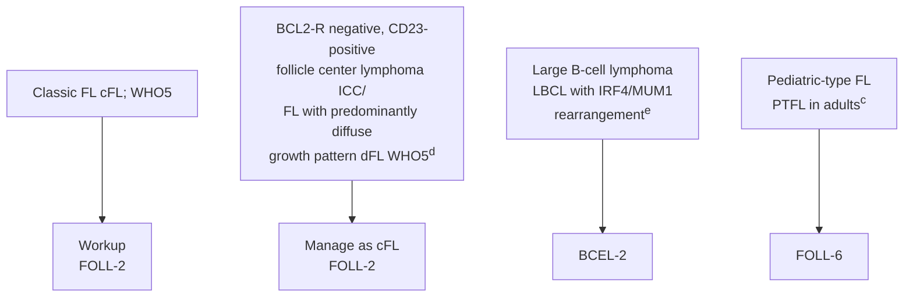

<sup>a</sup> Germinal center (GC) or follicular center cell phenotype is not equivalent to FL and occurs in BL and some DLBCL.

<sup>b</sup> Typical immunophenotype: CD10+, BCL2+, CD23+/-, CD43-, CD5-, CD20+, BCL6+. Rare cases of FL may be CD10- or BCL2-.

<sup>c</sup> In young patients with localized disease that lacks BCL2 expression or t(14;18), differential diagnosis should include PTFL in adults; *BCL2-R* negative, CD23-positive follicle center lymphoma (ICC)/dFL (WHO5), and LBCL with *IRF4/MUM1* rearrangement.

<sup>d</sup> *BCL2-R* negative, CD23-positive follicle center lymphoma (ICC)/dFL (WHO5) has a predominantly diffuse pattern, pelvis/inguinal location, and common *STAT6* mutations along with 1p36 deletion or *TNFRSF14* mutation.

<sup>e</sup> LBCL with *IRF4/MUM1* rearrangement are usually DLBCL but occasionally are purely FL3B (ICC/FLBCL [WHO5]) and often DLBCL with FL3B. Patients typically present with Waldeyer's ring involvement and are often children/young adults. These lymphomas are locally aggressive but respond well to chemotherapy ± radiation therapy (RT). They do not have a *BCL2* rearrangement and should not be treated as low-grade FL.

<sup>f</sup> There are reports showing that FL1–2 with a Ki-67 proliferation fraction of >30% may be associated with a more aggressive clinical behavior, but there is no evidence that this should guide treatment decisions.

**Note: All recommendations are category 2A unless otherwise indicated.**

Version 1.2026, 12/22/25 © 2025 National Comprehensive Cancer Network® (NCCN®), All rights reserved. NCCN Guidelines® and this illustration may not be reproduced in any form without the express written permission of NCCN.

FOLL-1


---


PLEASE NOTE that use of this NCCN Content is governed by the End-User License Agreement, and you MAY NOT distribute this Content or use it with any artificial intelligence model or tool.
Printed by Arun Manoharan on 1/16/2026 11:45:09 AM. Copyright © 2026 National Comprehensive Cancer Network, Inc. All Rights Reserved.

National Comprehensive Cancer Network®

**NCCN Guidelines Version 1.2026**
**Classic Follicular Lymphoma**

NCCN Guidelines Index
Table of Contents
Discussion

## WORKUP

### ESSENTIAL:
• **Physical exam: attention to node-bearing areas, including Waldeyer's ring, and to size of liver and spleen**
• **Performance status**
• **B symptoms**
• **Complete blood count (CBC) with differential**
• **Lactate dehydrogenase (LDH)**
• **Comprehensive metabolic panel**
• **Hepatitis B testing<sup>g</sup>**
• **PET/CT scan (preferred) or chest/abdomen/pelvis (C/A/P) CT with contrast of diagnostic quality if therapy is planned**
• **Pregnancy testing in patients of childbearing age (if therapy planned)**

### USEFUL IN SELECTED CASES:
• **Bone marrow biopsy + aspirate (to document clinical stage I–II disease if involved-site radiation therapy [ISRT] planned, or to evaluate unexplained cytopenias)<sup>h</sup>**
• **Echocardiogram or multigated acquisition (MUGA) scan if anthracycline-based regimen is indicated**
• **Neck CT with contrast**
• **Beta-2-microglobulin (necessary for calculation of FLIPI-2)**
• **Uric acid**
• **Serum protein electrophoresis (SPEP) with serum immunofixation electrophoresis (SIFE) and/or quantitative Ig levels**
• **Hepatitis C testing**
• **Discuss fertility preservation<sup>i</sup>**

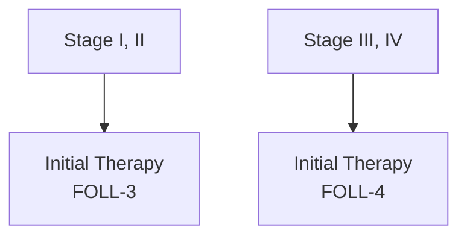

----

<sup>g</sup> Hepatitis B testing is indicated because of the risk of reactivation with immunotherapy + chemotherapy. Tests include hepatitis B surface antigen (HBsAg) and core antibody for a patient with no risk factors. For patients with risk factors or previous history of hepatitis B, add e-antigen (NHODG-B). If positive, check viral load and consider consult with gastroenterologist.

<sup>h</sup> Bilateral or unilateral provided core biopsy is >2 cm. If active surveillance is initial therapy, bone marrow biopsy may be deferred.

<sup>i</sup> Fertility preservation options include: sperm banking, in vitro fertilization (IVF), or ovarian tissue or oocyte cryopreservation.

**Note: All recommendations are category 2A unless otherwise indicated.**

Version 1.2026, 12/22/25 © 2025 National Comprehensive Cancer Network® (NCCN®), All rights reserved. NCCN Guidelines® and this illustration may not be reproduced in any form without the express written permission of NCCN.

FOLL-2


---


PLEASE NOTE that use of this NCCN Content is governed by the End-User License Agreement, and you MAY NOT distribute this Content or use it with any artificial intelligence model or tool.
Printed by Arun Manoharan on 1/16/2026 11:45:09 AM. Copyright © 2026 National Comprehensive Cancer Network, Inc. All Rights Reserved.

National Comprehensive Cancer Network®

**NCCN Guidelines Version 1.2026**
**Classic Follicular Lymphoma**

NCCN Guidelines Index
Table of Contents
Discussion

# STAGE I, II TREATMENT PATHWAY

<table>
  <thead>
    <tr>
        <th>STAGE</th>
        <th>INITIAL THERAPY</th>
        <th>RESPONSE TO THERAPY&lt;sup&gt;o,p&lt;/sup&gt;</th>
        <th>FOLLOW-UP&lt;sup&gt;q&lt;/sup&gt;</th>
        <th colspan="3"></th>
    </tr>
  </thead>
  <tbody>
    <tr>
        <td>Stage I or Contiguous stage II&lt;sup&gt;j&lt;/sup&gt;</td>
<td>ISRT&lt;sup&gt;k&lt;/sup&gt; (preferred)</td>
<td>CR or PR</td>
<td>See Stage III, IV (FOLL-4) or If histologic transformation, see HTBCEL-1</td>
<td>Clinical • H&amp;P and labs every 3–6 mo for 5 y and then annually or as clinically indicated Surveillance imaging&lt;sup&gt;r&lt;/sup&gt; • Up to 2 y post completion of treatment: C/A/P CT scan with contrast no more than every 6 mo • &gt;2 y: No more than annually</td>
<td>Progressive disease,&lt;sup&gt;o,p&lt;/sup&gt; see Stage III, IV (FOLL-4) or If histologic transformation, see HTBCEL-1</td>
<td></td>
    </tr>
<tr>
        <td></td>
<td>or ISRT&lt;sup&gt;k&lt;/sup&gt; + anti-CD20 monoclonal antibody (mAb)&lt;sup&gt;l&lt;/sup&gt; ± chemotherapy (FOLL-B)&lt;sup&gt;m&lt;/sup&gt; or Anti-CD20 mAb&lt;sup&gt;l&lt;/sup&gt; ± chemotherapy (FOLL-B)&lt;sup&gt;m&lt;/sup&gt; in certain circumstances&lt;sup&gt;n&lt;/sup&gt;</td>
<td>NR CR or PR NR</td>
<td>See Stage III, IV (FOLL-4) or If histologic transformation, see HTBCEL-1 See NR or progressive disease (FOLL-5) or If histologic transformation, see HTBCEL-1</td>
<td></td>
<td></td>
<td></td>
    </tr>
<tr>
        <td>Stage I, II Non-contiguous stage II</td>
<td>Active surveillance&lt;sup&gt;j&lt;/sup&gt; or If indications for treatment present, anti-CD20 mAb&lt;sup&gt;l&lt;/sup&gt; ± chemotherapy (FOLL-B)&lt;sup&gt;m&lt;/sup&gt; ± ISRT&lt;sup&gt;k&lt;/sup&gt; for local palliation&lt;sup&gt;k&lt;/sup&gt;</td>
<td>CR PR or NR</td>
<td>CR or PR NR</td>
<td>CR or See NR or progressive disease (FOLL-5) or If histologic transformation, see HTBCEL-1</td>
<td></td>
<td></td>
    </tr>
<tr>
        <td></td>
<td></td>
<td></td>
<td>Consider ISRT&lt;sup&gt;k&lt;/sup&gt; if not previously given</td>
        <td colspan="3"></td>
    </tr>
  </tbody>
</table>

## Footnotes

<sup>j</sup> Active surveillance may be appropriate in circumstances where potential toxicity of ISRT or systemic therapy outweighs potential clinical benefit in consultation with a radiation oncologist.

<sup>k</sup> Principles of Radiation Therapy (NHODG-D).

<sup>l</sup> Anti-CD20 mAbs include rituximab or obinutuzumab. Obinutuzumab is not indicated as single-agent therapy.

<sup>m</sup> Initiation of systemic therapy can improve failure-free survival (FFS), but has not been shown to improve overall survival. These are options for initial therapy.

<sup>n</sup> Eg, for patients with bulky intra-abdominal or mesenteric stage I disease.

<sup>o</sup> Lugano Response Criteria for Non-Hodgkin Lymphoma (NHODG-C). PET/CT scan should be interpreted via the PET Five-Point Scale (5-PS).

<sup>p</sup> Consider possibility of histologic transformation in patients with progressive disease, especially if LDH levels are rising, single site is growing disproportionately, extranodal disease develops, or there are new B symptoms. If clinical suspicion of transformation, FDG-PET may help identify areas suspicious for transformation. FDG-PET scan demonstrating marked heterogeneity or sites of intense FDG avidity may indicate transformation, and biopsy should be directed biopsy at the most FDG-avid area. Functional imaging does not replace biopsy to diagnose transformation. If transformation is histologically confirmed, treatment options should be directed towards the large cell transformation, see HTBCEL-1.

<sup>q</sup> Follow-up includes diagnostic tests and imaging using the same modalities performed during workup as clinically indicated. Imaging should be performed whenever there are clinical indications. For surveillance imaging, see Discussion for consensus imaging recommendations.

<sup>r</sup> Surveillance imaging is used for monitoring asymptomatic patients. When a site of disease can only be visualized on PET/CT scan (eg, bone), it is appropriate to proceed with PET/CT scans for surveillance.

**Note: All recommendations are category 2A unless otherwise indicated.**

Version 1.2026, 12/22/25 © 2025 National Comprehensive Cancer Network® (NCCN®), All rights reserved. NCCN Guidelines® and this illustration may not be reproduced in any form without the express written permission of NCCN.

FOLL-3


---


PLEASE NOTE that use of this NCCN Content is governed by the End-User License Agreement, and you MAY NOT distribute this Content or use it with any artificial intelligence model or tool.
Printed by Arun Manoharan on 1/16/2026 11:45:09 AM. Copyright © 2026 National Comprehensive Cancer Network, Inc. All Rights Reserved.

National Comprehensive Cancer Network®

**NCCN Guidelines Version 1.2026**
**Classic Follicular Lymphoma**

NCCN Guidelines Index
Table of Contents
Discussion

## STAGE | MANAGEMENT AND FOLLOW-UP<sup>q</sup>

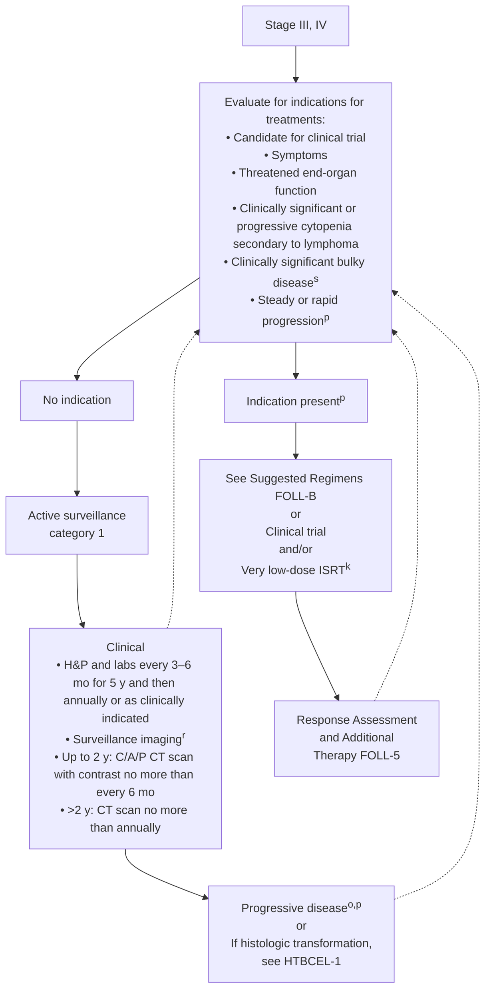

<sup>k</sup> Principles of Radiation Therapy (NHODG-D)).

<sup>o</sup> Lugano Response Criteria for Non-Hodgkin Lymphoma (NHODG-C)). PET/CT scan should be interpreted via the PET 5-PS.

<sup>p</sup> Consider possibility of histologic transformation in patients with progressive disease, especially if LDH levels are rising, single site is growing disproportionately, extranodal disease develops, or there are new B symptoms. If clinical suspicion of transformation, FDG-PET may help identify areas suspicious for transformation. FDG-PET scan demonstrating marked heterogeneity or sites of intense FDG avidity may indicate transformation, and biopsy should be directed biopsy at the most FDG-avid area. Functional imaging does not replace biopsy to diagnose transformation. If transformation is histologically confirmed, options should be directed towards the large cell transformation, see HTBCEL-1.

<sup>q</sup> Follow-up includes diagnostic tests and imaging using the same modalities performed during workup as clinically indicated. Imaging should be performed whenever there are clinical indications. For surveillance imaging, see Discussion for consensus imaging recommendations.

<sup>r</sup> Surveillance imaging is used for monitoring asymptomatic patients. When a site of disease can only be visualized on PET/CT scan (eg, bone), it is appropriate to proceed with PET/CT scans for surveillance.

<sup>s</sup> GELF criteria (FOLL-A)).

**Note: All recommendations are category 2A unless otherwise indicated.**

Version 1.2026, 12/22/25 © 2025 National Comprehensive Cancer Network® (NCCN®), All rights reserved. NCCN Guidelines® and this illustration may not be reproduced in any form without the express written permission of NCCN.

**FOLL-4**


---


PLEASE NOTE that use of this NCCN Content is governed by the End-User License Agreement, and you MAY NOT distribute this Content or use it with any artificial intelligence model or tool.
Printed by Arun Manoharan on 1/16/2026 11:45:09 AM. Copyright © 2026 National Comprehensive Cancer Network, Inc. All Rights Reserved.

National Comprehensive Cancer Network®

NCCN Guidelines Version 1.2026
Classic Follicular Lymphoma

NCCN Guidelines Index
Table of Contents
Discussion

## RESPONSE ASSESSMENT<sup>o</sup> AND ADDITIONAL THERAPY | FOLLOW-UP<sup>q</sup> | SECOND-LINE AND SUBSEQUENT THERAPY

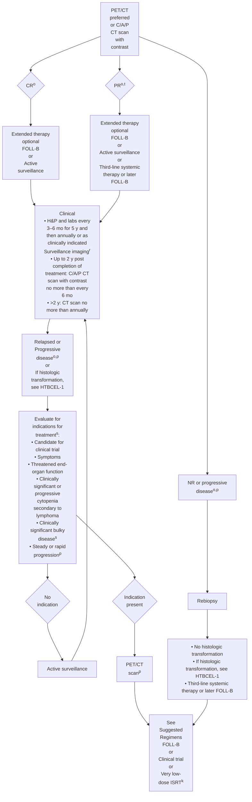

<sup>k</sup> Principles of Radiation Therapy (NHODG-D).

<sup>o</sup> Lugano Response Criteria for Non-Hodgkin Lymphoma (NHODG-C). PET/CT scan should be interpreted via the PET 5-PS.

<sup>p</sup> Consider possibility of histologic transformation in patients with progressive disease, especially if LDH levels are rising, single site is growing disproportionately, extranodal disease develops, or there are new B symptoms. If clinical suspicion of transformation, FDG-PET may help identify areas suspicious for transformation. FDG-PET scan demonstrating marked heterogeneity or sites of intense FDG avidity may indicate transformation, and biopsy should be directed biopsy at the most FDG-avid area. Functional imaging does not replace biopsy to diagnose transformation. If transformation is histologically confirmed,treatment options should be directed towards the large cell transformation, see HTBCEL-1.

<sup>q</sup> Follow-up includes diagnostic tests and imaging using the same modalities performed during workup as clinically indicated. Imaging should be performed whenever there are clinical indications. For surveillance imaging, see Discussion for consensus imaging recommendations.

<sup>r</sup> Surveillance imaging is used for monitoring asymptomatic patients. When a site of disease can only be visualized on PET/CT scan (eg, bone), it is appropriate to proceed with PET/CT scans for surveillance.

<sup>s</sup> GELF criteria (FOLL-A).

<sup>t</sup> A PET-positive PR is associated with a shortened progression-free survival (PFS) (Discussion); however, additional treatment at this juncture has not been shown to change outcome.

Note: All recommendations are category 2A unless otherwise indicated.

Version 1.2026, 12/22/25 © 2025 National Comprehensive Cancer Network® (NCCN®), All rights reserved. NCCN Guidelines® and this illustration may not be reproduced in any form without the express written permission of NCCN.

FOLL-5


---


PLEASE NOTE that use of this NCCN Content is governed by the End-User License Agreement, and you MAY NOT distribute this Content or use it with any artificial intelligence model or tool.
Printed by Arun Manoharan on 1/16/2026 11:45:09 AM. Copyright © 2026 National Comprehensive Cancer Network, Inc. All Rights Reserved.

National Comprehensive Cancer Network®

**NCCN Guidelines Version 1.2026
Pediatric-Type Follicular Lymphoma**

NCCN Guidelines Index
Table of Contents
Discussion

# PEDIATRIC-TYPE FOLLICULAR LYMPHOMA IN ADULTS

## PATHOLOGIC AND CLINICAL PRESENTATION<sup>c,u</sup>

• **Pathologic**
  ▸ **Morphology:** expansile follicles, effacement of architecture, absence of diffuse area
  ▸ **Expresses:** BCL6, CD10, ± IRF4/ MUM1 (~20%)
  ▸ **Proliferation index (Ki-67/MIB-1) >30%**
  ▸ **No rearrangement of** *BCL2, BCL6, IRF4/MUM1*
• **Clinical**
  ▸ **Localized disease (stage I, II)**
  ▸ **Head and neck (tonsillar, cervical, submandibular, submental, postauricular, or periparotid lymph nodes) or less common inguinal lymph nodes**
  ▸ **Male sex predominant**
  ▸ **Younger age than typical FL (though can occur in adults >60 years)**

## STAGING WORKUP

• **PET/CT scan**
• **Bone marrow biopsy (optional)** → **Stage I, II<sup>u</sup>**

## TREATMENT

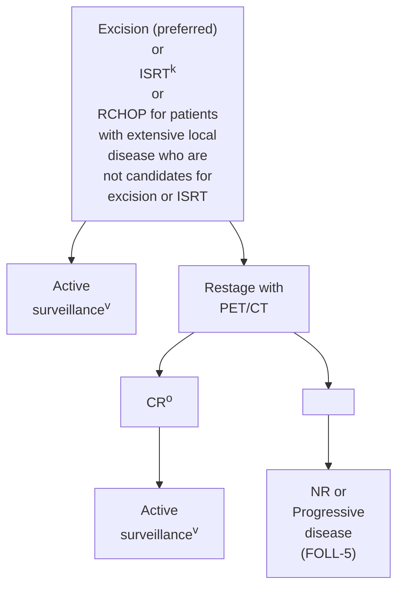

----

<sup>c</sup> In young patients with localized disease that lacks BCL2 expression or t(14;18), differential diagnosis should include PTFL in adults; *BCL2-R* negative, CD23-positive follicle center lymphoma (ICC)/dFL (WHO5), and LBCL with *IRF4/MUM1* rearrangement.

<sup>k</sup> Principles of Radiation Therapy (NHODG-D)).

<sup>o</sup> Lugano Response Criteria for Non-Hodgkin Lymphoma (NHODG-C)). PET/CT scan should be interpreted via the PET 5-PS.

<sup>u</sup> Localized disease (stage I, II) is the most common presentation. If the patient has disease >stage II, it is by definition not PTFL.

<sup>v</sup> Patients typically have an excellent prognosis and therefore, the majority of patients will not require surveillance imaging. There are no data to support maintenance therapy.

**Note: All recommendations are category 2A unless otherwise indicated.**

Version 1.2026, 12/22/25 © 2025 National Comprehensive Cancer Network® (NCCN®), All rights reserved. NCCN Guidelines® and this illustration may not be reproduced in any form without the express written permission of NCCN.

**FOLL-6**


---


PLEASE NOTE that use of this NCCN Content is governed by the End-User License Agreement, and you MAY NOT distribute this Content or use it with any artificial intelligence model or tool.
Printed by Arun Manoharan on 1/16/2026 11:45:09 AM. Copyright © 2026 National Comprehensive Cancer Network, Inc. All Rights Reserved.

National Comprehensive Cancer Network®

# NCCN Guidelines Version 1.2026
# Classic Follicular Lymphoma

NCCN Guidelines Index
Table of Contents
Discussion

## GELF CRITERIA<sup>a,b</sup>

* Involvement of ≥3 nodal sites, each with a diameter of ≥3 cm
* Any nodal or extranodal tumor mass with a diameter of ≥7 cm
* B symptoms
* Splenomegaly
* Pleural effusions or peritoneal ascites
* Cytopenias (leukocytes <1.0 x 10<sup>9</sup>/L and/or platelets <100 x 10<sup>9</sup>/L)
* Leukemia (>5.0 x 10<sup>9</sup>/L malignant cells)

## FLIPI - 1 CRITERIA<sup>a,c</sup>

<table>
  <thead>
    <tr>
        <th>RISK FACTORS</th>
        <th></th>
        <th>RISK GROUPS</th>
        <th></th>
    </tr>
  </thead>
  <tbody>
    <tr>
        <td>• Age</td>
<td>≥60 y</td>
<td></td>
<td>Number of factors</td>
    </tr>
<tr>
        <td>• Ann Arbor Stage</td>
<td>III–IV</td>
<td>Low</td>
<td>0–1</td>
    </tr>
<tr>
        <td>• Hemoglobin level</td>
<td>&lt;12 g/dL</td>
<td>Intermediate</td>
<td>2</td>
    </tr>
<tr>
        <td>• Serum LDH level</td>
<td>&gt;ULN</td>
<td>High</td>
<td>≥3</td>
    </tr>
<tr>
        <td>• Number of nodal sites&lt;sup&gt;d&lt;/sup&gt;</td>
<td>≥5</td>
        <td colspan="2"></td>
    </tr>
  </tbody>
</table>

**ULN = upper limit of normal**

## Nodal Areas

[Anatomical diagram showing nodal areas on a human body mannequin with the following labeled regions:]

**Right Cervical**
- Preauricular
- Upper Cervical
- Median or Lower
- Postcervical
- Supraclavicular

**Left Cervical**
- Preauricular
- Upper Cervical
- Median or Lower
- Postcervical
- Supraclavicular

**Mediastinal**
- Paratracheal
- Mediastinal
- Hilar

**Right Axillary**

**Left Axillary**

**Right Epitrochlear**

**Left Epitrochlear**

**Para-Aortic**
- Para-Aortic
- Common Iliac
- External Iliac

**Mesenteric**
- Mesenteric
- Splenic Hilar
- Portal
- Celiac

**Right Inguinal**
- Inguinal
- Femoral

**Left Inguinal**
- Inguinal
- Femoral

**Right Popliteal**

**Left Popliteal**

**Legend for labels**
- Blue = Bilateral
- Black = Midline

Mannequin used for counting the number of involved areas.<sup>d</sup>

© 2007 Dana-Farber Cancer Institute, Inc.
All rights reserved. Permission is hereby granted for copying this image by photocopy or similar process for use in the practice of medicine or for research purposes. No other use is permitted which will infringe the copyright without the express written consent of Dana-Farber Cancer Institute, Inc.

----

<sup>a</sup> These criteria may be clinically useful to guide initiation of treatment.

<sup>b</sup> Solal-Celigny P, Lepage E, Brousse N, et al. Doxorubicin-containing regimen with or without interferon alfa 2b for advanced follicular lymphomas: final analysis of survival and toxicity in the Groupe d'Etude des Lymphomes Folliculaire 86 trial. J Clin Oncol 1998;16:2332-2338.

<sup>c</sup> This research was originally published in Blood. Solal-Celigny P, Roy P, Colombat P, et al. Follicular lymphoma international prognostic index. Blood 2004;104:1258-1265. © the American Society of Hematology.

<sup>d</sup> The map is used to determine the number of nodal sites in FLIPI-1 criteria and is different than the conventional Ann Arbor site map.

**Note: All recommendations are category 2A unless otherwise indicated.**

Version 1.2026, 12/22/25 © 2025 National Comprehensive Cancer Network® (NCCN®), All rights reserved. NCCN Guidelines® and this illustration may not be reproduced in any form without the express written permission of NCCN.

FOLL-A


---


PLEASE NOTE that use of this NCCN Content is governed by the End-User License Agreement, and you MAY NOT distribute this Content or use it with any artificial intelligence model or tool.
Printed by Arun Manoharan on 1/16/2026 11:45:09 AM. Copyright © 2026 National Comprehensive Cancer Network, Inc. All Rights Reserved.

National Comprehensive Cancer Network®

**NCCN Guidelines Version 1.2026**
**Classic Follicular Lymphoma**

NCCN Guidelines Index
Table of Contents
Discussion

## SUGGESTED TREATMENT REGIMENS<sup>a,b,c</sup>

### FIRST-LINE THERAPY

**Preferred, high tumor burden (in alphabetical order)**
• Bendamustine<sup>d</sup> + Obinutuzumab<sup>e,f</sup> or Rituximab
• CHOP (Cyclophosphamide/Doxorubicin/Vincristine/Prednisone) + Obinutuzumab<sup>e,f</sup> or Rituximab
• CVP (Cyclophosphamide/Vincristine/Prednisone) + Obinutuzumab<sup>e,f</sup> or Rituximab
• Lenalidomide + Rituximab

**Preferred, low tumor burden**
• Rituximab (375 mg/m<sup>2</sup> weekly for 4 doses)<sup>g</sup>

**Other recommended**
• Lenalidomide + Obinutuzumab (category 2B)

### FIRST-LINE THERAPY FOR OLDER OR INFIRM
**(if none of the above are expected to be tolerable in the opinion of treating physician)**

**Preferred**
• Rituximab (375 mg/m<sup>2</sup> weekly for 4 doses)

### FIRST-LINE EXTENDED THERAPY (optional)

**Preferred following chemoimmunotherapy**
• Rituximab maintenance 375 mg/m<sup>2</sup> one dose every 8–12 weeks for 2 years for patients initially presenting with high tumor burden (category 1)<sup>h</sup>
• Obinutuzumab maintenance (1 g every 8 weeks for 12 doses)

**Other recommended**
• If initially treated with single-agent Rituximab, Rituximab maintenance 375 mg/m<sup>2</sup> one dose every 8 weeks for 4 doses

----

Consider prophylaxis for tumor lysis syndrome (NHODG-B)
See monoclonal antibody and viral reactivation (NHODG-B)

Footnotes
**Second-line Therapy on FOLL-B 2 of 6**
**Third-line and Subsequent Therapy on FOLL-B 3 of 6**

**Note: All recommendations are category 2A unless otherwise indicated.**

**FOLL-B
1 OF 6**

Version 1.2026, 12/22/25 © 2025 National Comprehensive Cancer Network® (NCCN®), All rights reserved. NCCN Guidelines® and this illustration may not be reproduced in any form without the express written permission of NCCN.


---


PLEASE NOTE that use of this NCCN Content is governed by the End-User License Agreement, and you MAY NOT distribute this Content or use it with any artificial intelligence model or tool.
Printed by Arun Manoharan on 1/16/2026 11:45:09 AM. Copyright © 2026 National Comprehensive Cancer Network, Inc. All Rights Reserved.

National Comprehensive Cancer Network®

**NCCN Guidelines Version 1.2026**
**Classic Follicular Lymphoma**

NCCN Guidelines Index
Table of Contents
Discussion

## SUGGESTED TREATMENT REGIMENS<sup>a,b,c</sup>

### SECOND-LINE THERAPY<sup>i</sup>

**Preferred (in alphabetical order)**
• Bendamustine<sup>d,j</sup> + Obinutuzumab<sup>e,f</sup> or Rituximab (not recommended if treated with prior Bendamustine)
• CHOP + Obinutuzumab<sup>e,f</sup> or Rituximab
• CVP + Obinutuzumab<sup>e,f</sup> or Rituximab
• Lenalidomide + Rituximab + Epcoritamab-bysp<sup>k,l</sup> (category 1)
• Lenalidomide + Rituximab + Tafasitamab-cxix<sup>l,m</sup> (≥1 prior systemic therapy including an anti-CD20 mAb) (category 1)

**Other recommended (in alphabetical order)**
• Lenalidomide (if not a candidate for anti-CD20 mAb therapy)
• Lenalidomide + Obinutuzumab or Rituximab
• Obinutuzumab
• Rituximab

### SECOND-LINE THERAPY FOR OLDER OR INFIRM
**(if none of the therapies are expected to be tolerable in the opinion of treating physician)**

**Preferred**
• Rituximab (375 mg/m² weekly for 4 doses)
• Tazemetostat<sup>l</sup> (irrespective of EZH2 mutation status)

### SECOND-LINE EXTENDED THERAPY (optional)

**Preferred**
• Rituximab maintenance 375 mg/m² one dose every 12 weeks for 2 years (category 1)
• Obinutuzumab maintenance for rituximab-refractory disease (1 g every 8 weeks for total of 12 doses)

Consider prophylaxis for tumor lysis syndrome (NHODG-B)
See monoclonal antibody and viral reactivation (NHODG-B)

Footnotes

**Third-line and Subsequent Therapy on FOLL-B 3 of 6**

**Note: All recommendations are category 2A unless otherwise indicated.**

**FOLL-B
2 OF 6**

Version 1.2026, 12/22/25 © 2025 National Comprehensive Cancer Network® (NCCN®), All rights reserved. NCCN Guidelines® and this illustration may not be reproduced in any form without the express written permission of NCCN.


---


PLEASE NOTE that use of this NCCN Content is governed by the End-User License Agreement, and you MAY NOT distribute this Content or use it with any artificial intelligence model or tool.
Printed by Arun Manoharan on 1/16/2026 11:45:09 AM. Copyright © 2026 National Comprehensive Cancer Network, Inc. All Rights Reserved.

National Comprehensive Cancer Network®

# NCCN Guidelines Version 1.2026
# Classic Follicular Lymphoma

NCCN Guidelines Index
Table of Contents
Discussion

## SUGGESTED TREATMENT REGIMENS<sup>a,b,c</sup>

### THIRD-LINE AND SUBSEQUENT THERAPY

**Second-line therapy regimens (FOLL-B 2 of 6) that were not previously given can also be used as options for third-line and subsequent therapy**

<table>
  <thead>
    <tr>
        <th>Preferred (in alphabetical order)</th>
        <th>Other recommended</th>
    </tr>
  </thead>
  <tbody>
    <tr>
        <td>• T-cell mediated therapy&lt;sup&gt;k&lt;/sup&gt;</td>
<td></td>
    </tr>
<tr>
        <td>⏵Bispecific antibody therapy&lt;sup&gt;l&lt;/sup&gt;</td>
<td></td>
    </tr>
<tr>
        <td>◊ Epcoritamab-bysp</td>
<td></td>
    </tr>
<tr>
        <td>◊ Mosunetuzumab-axgb</td>
<td></td>
    </tr>
<tr>
        <td>⏵Chimeric antigen receptor (CAR) T-cell therapy&lt;sup&gt;m,n&lt;/sup&gt;</td>
<td></td>
    </tr>
<tr>
        <td>◊ Axicabtagene ciloleucel (CD19-directed)</td>
<td></td>
    </tr>
<tr>
        <td>◊ Lisocabtagene maraleucel (CD19-directed)</td>
<td></td>
    </tr>
<tr>
        <td>◊ Tisagenlecleucel (CD19-directed)</td>
<td>• EZH2 inhibitor</td>
    </tr>
<tr>
        <td>⏵Tazemetostat&lt;sup&gt;l&lt;/sup&gt; (irrespective of EZH2 mutation status)</td>
<td></td>
    </tr>
<tr>
        <td>• BTK inhibitor (BTKi)</td>
<td></td>
    </tr>
<tr>
        <td>⏵Zanubrutinib&lt;sup&gt;l&lt;/sup&gt; + Obinutuzumab</td>
<td></td>
    </tr>
<tr>
        <td>• Loncastuximab tesirine-lpyl&lt;sup&gt;m,l&lt;/sup&gt; + Rituximab (category 2B)</td>
<td></td>
    </tr>
  </tbody>
</table>

### THIRD-LINE CONSOLIDATION THERAPY

**Useful in Certain Circumstances**
• Allogeneic hematopoietic cell transplantation (HCT) in selected cases<sup>o</sup>

**Consider prophylaxis for tumor lysis syndrome (NHODG-B)**
**See monoclonal antibody and viral reactivation (NHODG-B)**

Footnotes

**Note: All recommendations are category 2A unless otherwise indicated.**

Version 1.2026, 12/22/25 © 2025 National Comprehensive Cancer Network® (NCCN®), All rights reserved. NCCN Guidelines® and this illustration may not be reproduced in any form without the express written permission of NCCN.

**FOLL-B
3 OF 6**


---


PLEASE NOTE that use of this NCCN Content is governed by the End-User License Agreement, and you MAY NOT distribute this Content or use it with any artificial intelligence model or tool.
Printed by Arun Manoharan on 1/16/2026 11:45:09 AM. Copyright © 2026 National Comprehensive Cancer Network, Inc. All Rights Reserved.

National Comprehensive Cancer Network®

NCCN Guidelines Version 1.2026
Classic Follicular Lymphoma

NCCN Guidelines Index
Table of Contents
Discussion

## SUGGESTED TREATMENT REGIMENS FOOTNOTES

<sup>a</sup> See references for regimens on FOLL-B 5 of 6 and FOLL-B 6 of 6.

<sup>b</sup> An FDA-approved biosimilar is an appropriate substitute for any recommended systemic biologic therapy in the NCCN Guidelines. Rituximab and hyaluronidase human injection for subcutaneous use may be substituted for rituximab after patients have received the first full dose of rituximab by intravenous infusion.

<sup>c</sup> The choice of therapy requires consideration of many factors, including age, comorbidities, and future treatment possibilities (eg, high-dose therapy [HDT] with autologous stem cell rescue [ASCR]). Therefore, treatment selection is highly individualized.

<sup>d</sup> In the GALLIUM study, there was an increased risk of mortality from opportunistic infections and secondary malignancies in patients receiving bendamustine. Increased risk of mortality occurred over the entire treatment program and extending beyond maintenance. Prophylaxis for pneumocystis jirovecii pneumonia (PJP) and varicella zoster virus (VZV) should be administered; see NCCN Guidelines for Prevention and Treatment of Cancer-Related Infections.

<sup>e</sup> The clinical trial evaluating this regimen included obinutuzumab maintenance. The use without maintenance was an extrapolation of the data.

<sup>f</sup> Obinutuzumab is preferred for patients with rituximab refractory disease, which includes disease progressing on or within 6 months of prior rituximab therapy.

<sup>g</sup> Rituximab may be appropriate if active surveillance was initial therapy and for patients with progression of low tumor burden disease not meeting GELF criteria (FOLL-A). Immediate initial therapy with rituximab in patients not meeting GELF criteria has not improved overall survival (Ardeshna K, et al. Lancet Oncol 2014;15:424-435).

<sup>h</sup> This is based on the PRIMA study for patients with high tumor burden following treatment with RCVP and RCHOP. There are no data for rituximab maintenance following other regimens.

<sup>i</sup> Generally, a first-line regimen is not repeated.

<sup>j</sup> In patients intended to receive CAR T-cell therapy or CD3 x CD20 bispecific antibody therapy, bendamustine should be used with caution. Delay bendamustine until after CAR-T leukapheresis.

<sup>k</sup> In the setting of CD20-negative lymphomas, the efficacy of CD3 x CD20 bispecific antibody therapy is poor. If clinically feasible, repeat biopsy to confirm antigen expression prior to the initiation of T-cell mediated therapy.

<sup>l</sup> Refer to package insert for full prescribing information, dose modifications, and monitoring for adverse reactions: [https://www.accessdata.fda.gov/scripts/cder/daf/index.cfm](https://www.accessdata.fda.gov/scripts/cder/daf/index.cfm).

<sup>m</sup> It is unknown if tafasitamab-cxix or loncastuximab tesirine-lpyl or if any other CD19–directed therapy would have a negative impact on the efficacy of subsequent anti-CD19 CAR T-cell therapy. If clinically feasible, repeat biopsy to confirm antigen expression prior to the initiation of CD19-directed CAR T-cell therapy.

<sup>n</sup> NCCN Guidelines for Management of CAR T-Cell and Lymphocyte Engager-Related Toxicities.

<sup>o</sup> Selected cases include mobilization failures and persistent bone marrow involvement.

Note: All recommendations are category 2A unless otherwise indicated.

Version 1.2026, 12/22/25 © 2025 National Comprehensive Cancer Network® (NCCN®), All rights reserved. NCCN Guidelines® and this illustration may not be reproduced in any form without the express written permission of NCCN.

FOLL-B
4 OF 6


---


PLEASE NOTE that use of this NCCN Content is governed by the End-User License Agreement, and you MAY NOT distribute this Content or use it with any artificial intelligence model or tool.
Printed by Arun Manoharan on 1/16/2026 11:45:09 AM. Copyright © 2026 National Comprehensive Cancer Network, Inc. All Rights Reserved.

National Comprehensive Cancer Network®

**NCCN Guidelines Version 1.2026
Classic Follicular Lymphoma**

NCCN Guidelines Index
Table of Contents
Discussion

## SUGGESTED TREATMENT REGIMENS REFERENCES

### First-line Therapy

**Bendamustine + rituximab**

Rummel MJ, Niederle N, Maschmeyer G, et al. Bendamustine plus rituximab versus CHOP plus rituximab as first-line treatment for patients with indolent and mantle-cell lymphomas: an open-label, multicentre, randomised, phase 3 non-inferiority trial. Lancet 2013;381:1203-1210.

Flinn IW, van der Jagt R, Kahl BS, et al. Open-label, randomized, noninferiority study of bendamustine-rituximab or R-CHOP/R-CVP in first-line treatment of advanced indolent NHL or MCL: the BRIGHT study. Blood 2014;123:2944-2952.

**Bendamustine + obinutuzumab**

Marcus R, Davies A, Ando K, et al. Obinutuzumab for the first-line treatment of follicular lymphoma. N Engl J Med 2017;377:1331-1344.

**RCHOP (rituximab, cyclophosphamide, doxorubicin, vincristine, prednisone)**

Czuczman MS, Weaver R, Alkuzweny B, et al. Prolonged clinical and molecular remission in patients with low-grade or follicular non-Hodgkin's lymphoma treated with rituximab plus CHOP chemotherapy: 9-year follow-up. J Clin Oncol 2004;22:4711-4716.

Hiddemann W, Kneba M, Dreyling M, et al. Frontline therapy with rituximab added to the combination of cyclophosphamide, doxorubicin, vincristine, and prednisone (CHOP) significantly improves the outcome for patients with advanced-stage follicular lymphoma compared with therapy with CHOP alone: results of a prospective randomized study of the German Low-Grade Lymphoma Study Group. Blood 2005;106:3725-3732.

**CHOP + obinutuzumab**

Marcus R, Davies A, Ando K, et al. Obinutuzumab for the first-line treatment of follicular lymphoma. N Engl J Med 2017;377:1331-1344.

**RCVP (rituximab, cyclophosphamide, vincristine, prednisone)**

Marcus R, Imrie K, Solal-Celigny P, et al. Phase III study of R-CVP compared with cyclophosphamide, vincristine, and prednisone alone in patients with previously untreated advanced follicular lymphoma. J Clin Oncol 2008;26:4579-4586.

**CVP + obinutuzumab**

Marcus R, Davies A, Ando K, et al. Obinutuzumab for the first-line treatment of follicular lymphoma. N Engl J Med 2017;377:1331-1344.

**Rituximab**

Witzig TE, Vukov AM, Habermann TM, et al. Rituximab therapy for patients with newly diagnosed, advanced-stage, follicular grade I non-Hodgkin's lymphoma: a phase II trial in the North Central Cancer Treatment Group. J Clin Oncol 2005;23:1103-1108.

Martinelli G, Schmitz SF, Utiger U, et al. Long-term follow-up of patients with follicular lymphoma receiving single-agent rituximab at two different schedules in trial SAKK 35/98. J Clin Oncol 2010;28:4480-4484.

Northend M, Wilson W, Ediriwickrema K, et al. Early rituximab monotherapy versus watchful waiting for advanced stage, asymptomatic, low tumour burden follicular lymphoma: long-term results of a randomised, phase 3 trial. Lancet Haematol 2025;12:e335-e345.

Cartron G, Bachy E, Tilly H, Randomized phase III Trial evaluating subcutaneous rituximab for the first-line treatment of low-tumor burden follicular lymphoma: Results of a LYSA study. J Clin Oncol 2023;41:3523-3533. Erratum in: J Clin Oncol 2023;41:4187.

Kahl BS, Jegede OA, Peterson C, et al. Long-Term Follow-Up of the RESORT Study (E4402): A Randomized Phase III Comparison of Two Different Rituximab Dosing Strategies for Low-Tumor Burden Follicular Lymphoma. J Clin Oncol 2024;42:774-778.

Northend M, Wilson W, Clifton-Hadley L, et al. Long term follow-up of international randomised phase 3 study of rituximab versus a watch and wait approach for patients with asymptomatic, low tumour burden follicular lymphoma shows rituximab is highly effective at delaying time to new treatment without detrimental impact following next line of therapy [abstract]. Blood 2022;140:1456-1458.

**Lenalidomide + rituximab**

Martin P, Jung SH, Pitcher B, et al. A phase II trial of lenalidomide plus rituximab in previously untreated follicular non-Hodgkin's lymphoma (NHL): CALGB 50803 (Alliance). Ann Oncol 2017;28:2806-2812.

Fowler N, Davis R, Rawal S, et al. Safety and activity of lenalidomide and rituximab in untreated indolent lymphoma: an open-label, phase 2 trial. Lancet Oncol 2014;15:1311-1318.

Morschhauser F, Fowler NH, Feugier P, et al. Rituximab plus lenalidomide in advanced untreated follicular lymphoma. N Engl J Med 2018;379:934-947.

**Lenalidomide + obinutuzumab**

Bachy E, Houot R, Feugier P, et al. Obinutuzumab plus lenalidomide (GALEN) in advanced, previously untreated follicular lymphoma in need of systemic therapy: a LYSA study. Blood 2022;139:2338-2346.

### First-line Extended Dosing

**Chemoimmunotherapy followed by rituximab maintenance**

Bachy E, Seymour JF, Feugier P, et al. Sustained progression-free survival benefit of rituximab maintenance in patients with follicular lymphoma: Long-term results of the PRIMA Study. J Clin Oncol 2019;37:2815-2824.

**Extended dosing with rituximab**

Ghielmini M, Schmitz SH, Cogliatti SB, et al. Prolonged treatment with rituximab in patients with follicular lymphoma significantly increases event-free survival and response duration compared with the standard weekly x 4 schedule. Blood 2004;103:4416-4423.

**Obinutuzumab-based chemoimmunotherapy followed by obinutuzumab maintenance**

Marcus R, Davies A, Ando K, et al. Obinutuzumab for the first-line treatment of follicular lymphoma. N Engl J Med 2017;377:1331-1344.

Continued

**Note: All recommendations are category 2A unless otherwise indicated.**

Version 1.2026, 12/22/25 © 2025 National Comprehensive Cancer Network® (NCCN®), All rights reserved. NCCN Guidelines® and this illustration may not be reproduced in any form without the express written permission of NCCN.

**FOLL-B
5 OF 6**


---


PLEASE NOTE that use of this NCCN Content is governed by the End-User License Agreement, and you MAY NOT distribute this Content or use it with any artificial intelligence model or tool.
Printed by Arun Manoharan on 1/16/2026 11:45:09 AM. Copyright © 2026 National Comprehensive Cancer Network, Inc. All Rights Reserved.

National Comprehensive Cancer Network®

NCCN Guidelines Version 1.2026
Classic Follicular Lymphoma

NCCN Guidelines Index
Table of Contents
Discussion

## SUGGESTED TREATMENT REGIMENS REFERENCES

### Second-line and Subsequent Therapy

**Bendamustine + obinutuzumab**

Sehn LH, Chua N, Mayer J, et al. Obinutuzumab plus bendamustine versus bendamustine monotherapy in patients with rituximab-refractory indolent non-Hodgkin lymphoma (GADOLIN): a randomised, controlled, open-label, multicentre, phase 3 trial. Lancet Oncol 2016;17:1081-1093.

**Lenalidomide ± rituximab**

Leonard JP, Jung SH, Johnson J, et al. Randomized trial of lenalidomide alone versus lenalidomide plus rituximab in patients with recurrent follicular lymphoma: CALGB 50401 (Alliance). J Clin Oncol 2015;33:3635-3640.

Leonard JP, Trneny M, Izutsu K, et al. AUGMENT: A phase III study of lenalidomide plus rituximab versus placebo plus rituximab in relapsed or refractory indolent lymphoma. J Clin Oncol 2019;37:1188-1199.

**Lenalidomide + obinutuzumab**

Morschhauser F, Le Gouill S, Feugier P, et al. Obinutuzumab combined with lenalidomide for relapsed or refractory follicular B-cell lymphoma (GALEN): a multicentre, single-arm, phase 2 study. Lancet Haematol 2019;6:e429-e437.

**Lenalidomide + Rituximab + Epcoritamab-bysp**

Falchi L, Nijland M, Huang H, et al. Epcoritamab, lenalidomide, and rituximab versus lenalidomide and rituximab for relapsed or refractory follicular lymphoma (EPCORE FL-1): a global, open-label, randomised, phase 3 trial. The Lancet 2025:Online Ahead of Print.

**Rituximab**

McLaughlin P, Grillo-Lopez AJ, Link BK, et al. Rituximab chimeric anti-CD20 monoclonal antibody therapy for relapsed indolent lymphoma: half of patients respond to a four-dose treatment program. J Clin Oncol 1998;16:2825-2833.

Ghielmini M, Schmitz SH, Cogliatti SB, et al. Prolonged treatment with rituximab in patients with follicular lymphoma significantly increases event-free survival and response duration compared with the standard weekly x 4 schedule. Blood 2004;103:4416-4423.

**Lenalidomide + rituximab + tafasitamab-cxix**

Sehn LH, Hübel K, Luminari S, et al. Tafasitamab, lenalidomide, and rituximab in relapsed or refractory follicular lymphoma (inMIND): a global, phase 3, randomised controlled trial. Lancet 2025:Online ahead of print.

**Tazemetostat**

Morschhauser F, Tilly H, Chaidos A, et al. Tazemetostat for patients with relapsed or refractory follicular lymphoma: an open-label, single-arm, multicentre, phase 2 trial. Lancet Oncol 2020;21:1433-1442.

### Second-line Extended Dosing

**Rituximab maintenance**

van Oers MHJ, Van Glabbeke M, Giurgea L, et al. Rituximab maintenance treatment of relapsed/ resistant follicular non-hodgkin's lymphoma: Long-term outcome of the EORTC 20981 Phase III randomized Intergroup Study. J Clin Oncol 2010;28:2853-2858.

**Obinutuzumab maintenance for rituximab refractory disease**

Sehn LH, Chua N, Mayer J, et al. Obinutuzumab plus bendamustine versus bendamustine monotherapy in patients with rituximab-refractory indolent non-Hodgkin lymphoma (GADOLIN): a ~~randomised, controlled, open-label, multicentre, phase 3 trial. Lancet Oncol 2016;17:1081-1093.~~

**Note: All recommendations are category 2A unless otherwise indicated.**

### Third-line and Subsequent Therapy

**Loncastuximab tesirine-lpyl + rituximab**

Alderuccio JP, Alencar AJ, Schatz JH, et al. Loncastuximab tesirine with rituximab in patients with relapsed or refractory follicular lymphoma: A single-centre, single-arm, phase 2 trial. Lancet Haematol 2025;12:e23-e34.

**Zanubrutinib + obinutuzumab**

Zinzani PL, Mayer J, Flowers CR, et al. ROSEWOOD: A phase II randomized study of zanubrutinib plus obinutuzumab versus obinutuzumab monotherapy in patients with relapsed or refractory follicular lymphoma. J Clin Oncol 2023;41:5107-5117.

Zinzani PL, Mayer J, Flowers C, et al. Final analysis of the randomized phase 2 ROSEWOOD study of zanubrutinib + obinutuzumab vs obinutuzumab monotherapy in patients with relapsed/refractory follicular lymphoma [abstract]. Blood 2025;146:Abstract 227.

**T-Cell–Mediated Therapy**

*CAR T-Cell Therapy*

*Axicabtagene ciloleucel*

Neelapu SS, Chavez JC, Sehgal AR, et al. Three-year follow-up analysis of axicabtagene ciloleucel in relapsed/refractory indolent non-Hodgkin lymphoma (ZUMA-5). Blood 2024;143:496-506.

*Lisocabtagene maraleucel*

Morschhauser F, Dahiya S, Palomba ML, et al. Lisocabtagene maraleucel in follicular lymphoma: the phase 2 TRANSCEND FL study. Nat Med 2024;30:2199–2207.

Ahmed S, Martin Garcia-Sancho A, Reguera JL, et al. Three-Year Efficacy and Longitudinal Safety of Lisocabtagene Maraleucel (liso-cel) in Patients With Third-Line or Later (3L+) Follicular Lymphoma (FL) From TRANSCEND FL [abstract]. Blood 2025;146:Abstract 467.

*Tisagenlecleucel*

Dreyling M, Fowler NH, Dickinson M, et al. Durable response after tisagenlecleucel in adults with relapsed/ refractory follicular lymphoma: ELARA trial update. Blood 2024;143:1713-1725.

Schuster S, Thieblemont C, Dickinson M, et al. Clinical outcomes of tisagenlecleucel in patients with relapsed/refractory follicular lymphoma (r/r FL): Phase 2 ELARA 5-year update [abstract]. Blood 2025;146:Abstract 468.

*Bispecific Antibody Therapy*

*Epcoritamab-bysp*

Linton KM, Vitolo U, Jurczak W, et al. Epcoritamab monotherapy in patients with relapsed or refractory follicular lymphoma (EPCORE NHL-1): a phase 2 cohort of a single-arm, multicentre study. Lancet Haematol 2024;11:e593–e605.

*Mosunetuzumab-axgb*

Sehn LH, Bartlett NL, Matasar MJ, et al. Long-term 3-year follow-up of mosunetuzumab in relapsed or refractory follicular lymphoma after >/=2 prior therapies. Blood 2025;145:708–719.

Budde E, Sehn L, Matasar M, et al. Fixed treatment duration mosunetuzumab continues to demonstrate clinically meaningful outcomes in patients with relapsed/refractory (R/R) follicular lymphoma (FL) after ≥2 prior therapies: 5-year follow-up of a pivotal Phase II study [abstract]. Blood 2025;146:Abstract 5352.

FOLL-B
6 OF 6

Version 1.2026, 12/22/25 © 2025 National Comprehensive Cancer Network® (NCCN®), All rights reserved. NCCN Guidelines® and this illustration may not be reproduced in any form without the express written permission of NCCN.


---


PLEASE NOTE that use of this NCCN Content is governed by the End-User License Agreement, and you MAY NOT distribute this Content or use it with any artificial intelligence model or tool.
Printed by Arun Manoharan on 1/16/2026 11:45:09 AM. Copyright © 2026 National Comprehensive Cancer Network, Inc. All Rights Reserved.

National Comprehensive Cancer Network®

# NCCN Guidelines Version 1.2026
# Marginal Zone Lymphomas

NCCN Guidelines Index
Table of Contents
Discussion

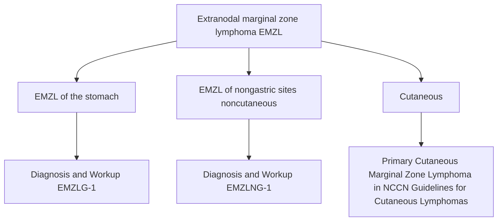

**Nodal marginal zone lymphoma (NMZL)** → **Diagnosis and Workup (NMZL-1)**

**Splenic marginal zone lymphoma (SMZL)** → **Diagnosis and Workup (SMZL-1)**

**Histologic transformation to DLBCL** → **HTBCEL-1**

**Note: All recommendations are category 2A unless otherwise indicated.**

Version 1.2026, 12/22/25 © 2025 National Comprehensive Cancer Network® (NCCN®), All rights reserved. NCCN Guidelines® and this illustration may not be reproduced in any form without the express written permission of NCCN.

**MZL-1**


---


PLEASE NOTE that use of this NCCN Content is governed by the End-User License Agreement, and you MAY NOT distribute this Content or use it with any artificial intelligence model or tool.

National Comprehensive Cancer Network®

NCCN Guidelines Version 1.2026
Extranodal Marginal Zone B-Cell Lymphoma
Extranodal MZL of the Stomach

Printed by Arun Manoharan on 1/16/2026 11:45:09 AM. Copyright © 2026 National Comprehensive Cancer Network, Inc. All Rights Reserved.

NCCN Guidelines Index
Table of Contents
Discussion

## ADDITIONAL DIAGNOSTIC TESTING<sup>a,b</sup>

### ESSENTIAL:
* **Diagnosis of EMZL of the stomach requires an endoscopic biopsy. An FNA is never adequate.**
* **Adequate immunophenotyping to establish diagnosis<sup>c</sup>**
  * IHC panel: CD20, CD3, CD5, CD10, BCL2, kappa/lambda, CD21 or CD23, cyclin D1,<sup>d</sup> BCL6
* **<i>Helicobacter pylori</i> stain (gastric), if positive, then FISH for <i>MALT1</i> rearrangements<sup>e</sup>**

### USEFUL UNDER CERTAIN CIRCUMSTANCES:
* **Flow cytometry with peripheral blood and/or biopsy specimen in the presence of lymphocytosis: kappa/ lambda, CD19, CD20, CD5, CD23, CD10**
* **Molecular analysis to detect: Ig gene rearrangements; <i>MYD88</i> mutation status to help differentiate Waldenström macroglobulinemia (WM) (90%) versus MZL (10%) if plasmacytic differentiation present**
* **FISH: t(1;14); t(3;14); t(11;14)<sup>d</sup>; t(14;18)**

## WORKUP

### ESSENTIAL:
* **Physical exam**
* **Performance status**
* **CBC with differential**
* **Comprehensive metabolic panel**
* **LDH**
* **If <i>H. pylori</i> negative by histopathology, then use noninvasive <i>H. pylori</i> testing (stool antigen test or urea breath test)**
* **Hepatitis B testing<sup>f</sup>**
* **Hepatitis C testing**
* **SPEP with SIFE and/or quantitative Ig levels**
* **C/A/P CT with contrast of diagnostic quality or PET/CT scan<sup>g</sup> (especially if ISRT anticipated)**
* **Pregnancy testing in patients of childbearing age (if therapy planned)**

### USEFUL IN SELECTED CASES:
* **Bone marrow biopsy ± aspirate (to document clinical stage I–II disease if ISRT planned, or to evaluate unexplained cytopenias)<sup>h</sup>**
* **Echocardiogram or MUGA scan if anthracycline-based regimen is indicated**
* **Endoscopy with ultrasound (if available) with multiple biopsies of anatomical sites<sup>i</sup>**
* **Discuss fertility preservation<sup>j</sup>**

→ **Initial Therapy (EMZLG-2)**

----

<sup>a</sup> Nondiagnostic atypical lymphoid infiltrates that are <i>H. pylori</i> positive should be rebiopsied to confirm or exclude lymphoma prior to treatment of <i>H. pylori</i>.

<sup>b</sup> Any area of DLBCL should be treated as DLBCL (BCEL-1).

<sup>c</sup> Typical immunophenotype: CD10-, CD5-, CD20+, cyclin D1-, with BCL2-follicles.

<sup>d</sup> In CD5+ cases, concurrent IHC positivity for cyclin D1 is more compatible with the diagnosis of MCL. FISH for t(11;14) is helpful to exclude the diagnosis of MCL; see MANT-1.

<sup>e</sup> Locally advanced disease is more likely in patients with EMZL of the stomach with t(11;18), and is a predictor for lack of tumor response (<5%) to antibiotic therapy.

<sup>f</sup> Hepatitis B testing is indicated because of the risk of reactivation with immunotherapy + chemotherapy. Tests include HBsAg and core antibody for a patient with no risk factors. For patients with risk factors or previous history of hepatitis B, add e-antigen (NHODG-B). If positive, check viral load and consider consult with gastroenterologist.

<sup>g</sup> PET/CT scan may be negative in marginal zonal lymphomas. In such cases, CT scan is recommended.

<sup>h</sup> Bilateral or unilateral provided core biopsy is >2 cm. If active surveillance is initial therapy, bone marrow biopsy may be deferred.

<sup>i</sup> This is particularly useful for <i>H. pylori</i>-positive cases because the likelihood of tumor response is related to depth of tumor invasion.

<sup>j</sup> Fertility preservation options include: sperm banking, IVF, or ovarian tissue or oocyte cryopreservation.

**Note: All recommendations are category 2A unless otherwise indicated.**

Version 1.2026, 12/22/25 © 2025 National Comprehensive Cancer Network® (NCCN®), All rights reserved. NCCN Guidelines® and this illustration may not be reproduced in any form without the express written permission of NCCN.

EMZLG-1


---


PLEASE NOTE that use of this NCCN Content is governed by the End-User License Agreement, and you MAY NOT distribute this Content or use it with any artificial intelligence model or tool.

Printed by Arun Manoharan on 1/16/2026 11:45:09 AM. Copyright © 2026 National Comprehensive Cancer Network, Inc. All Rights Reserved.

National Comprehensive Cancer Network®

NCCN Guidelines Version 1.2026
Extranodal Marginal Zone B-Cell Lymphoma
Extranodal MZL of the Stomach

NCCN Guidelines Index
Table of Contents
Discussion

# LUGANO STAGE/GI LYMPHOMAS<sup>k</sup> - LUGANO MODIFICATION OF ANN ARBOR STAGING<sup>k</sup> - INITIAL THERAPY

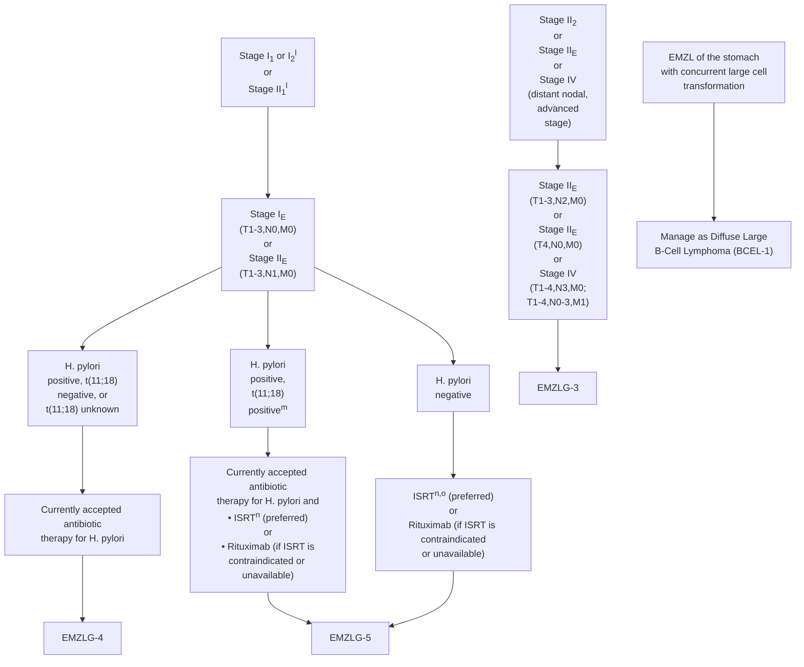

----

<sup>k</sup> Staging of EMZL of the Stomach: Comparison of Different Systems (EMZLG-A)).

<sup>l</sup> Involvement of submucosa or regional lymph nodes are much less likely to respond to antibiotic therapy. If there is persistent disease after evaluation, RT may be considered earlier in the course.

<sup>m</sup> t(11;18) is a predictor for lack of tumor response (<5%) to antibiotic therapy. Antibiotic therapy is used in these patients to eradicate the *H. pylori* infection. These patients should be considered for alternative therapy for lymphoma. Liu H, et al. Gastroenterology 2002;122:1286-1294.

<sup>n</sup> Principles of Radiation Therapy (NHODG-D)).

<sup>o</sup> If *H. pylori* negative by both histology and serum antibodies, ISRT is recommended.

**Note: All recommendations are category 2A unless otherwise indicated.**

Version 1.2026, 12/22/25 © 2025 National Comprehensive Cancer Network® (NCCN®), All rights reserved. NCCN Guidelines® and this illustration may not be reproduced in any form without the express written permission of NCCN.

EMZLG-2


---


PLEASE NOTE that use of this NCCN Content is governed by the End-User License Agreement, and you MAY NOT distribute this Content or use it with any artificial intelligence model or tool.

National Comprehensive Cancer Network®

**NCCN Guidelines Version 1.2026**
Extranodal Marginal Zone B-Cell Lymphoma
**Extranodal MZL of the Stomach**

Printed by Arun Manoharan on 1/16/2026 11:45:09 AM. Copyright © 2026 National Comprehensive Cancer Network, Inc. All Rights Reserved.

NCCN Guidelines Index
Table of Contents
Discussion

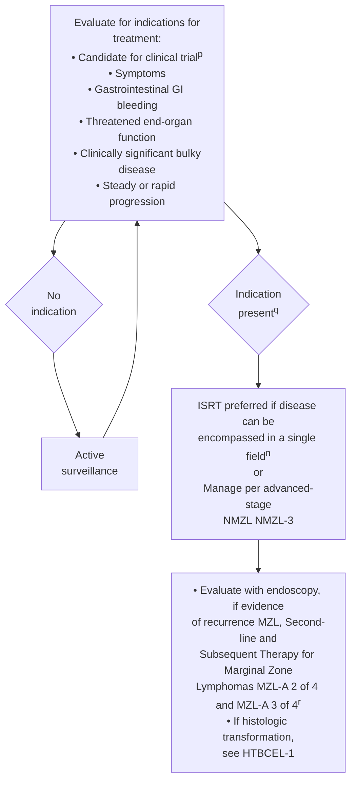

<sup>n</sup> Principles of Radiation Therapy (NHODG-D).
<sup>p</sup> Given incurability with conventional therapy, consider investigational therapy as first line of treatment.
<sup>q</sup> Surgical resection is generally limited to specific clinical situations (ie, life-threatening hemorrhage).
<sup>r</sup> Optional second-line extended therapy (obinutuzumab maintenance for rituximab-refractory disease) if treated with bendamustine + obinutuzumab for recurrent disease (MZL-A 2 OF 4).

**Note: All recommendations are category 2A unless otherwise indicated.**

Version 1.2026, 12/22/25 © 2025 National Comprehensive Cancer Network® (NCCN®), All rights reserved. NCCN Guidelines® and this illustration may not be reproduced in any form without the express written permission of NCCN.

**EMZLG-3**


---


PLEASE NOTE that use of this NCCN Content is governed by the End-User License Agreement, and you MAY NOT distribute this Content or use it with any artificial intelligence model or tool.

National Comprehensive Cancer Network®

**NCCN Guidelines Version 1.2026**
Extranodal Marginal Zone B-Cell Lymphoma
**Extranodal MZL of the Stomach**

Printed by Arun Manoharan on 1/16/2026 11:45:09 AM. Copyright © 2026 National Comprehensive Cancer Network, Inc. All Rights Reserved.

NCCN Guidelines Index
Table of Contents
Discussion

## RESTAGING WITH ENDOSCOPY/BIOPSY AFTER ANTIBIOTICS

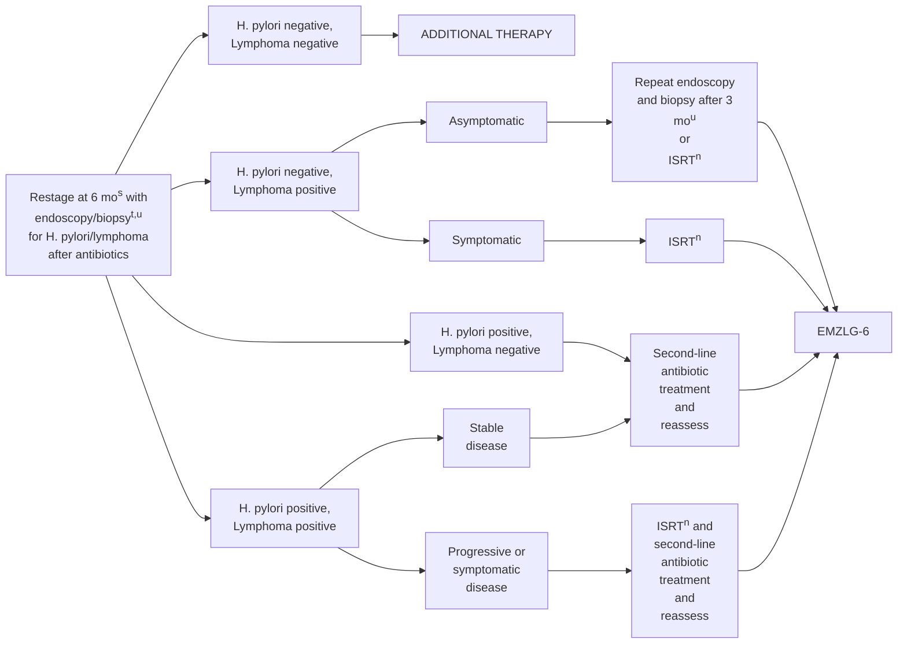

<sup>n</sup> Principles of Radiation Therapy (NHODG-D).

<sup>s</sup> If symptomatic, restaging should be done as clinically indicated.

<sup>t</sup> Reassessment to rule out *H. pylori* by institutional standards. Biopsy to rule out large cell lymphoma. Any area of DLBCL should be treated as DLBCL (BCEL-1).

<sup>u</sup> If re-evaluation suggests slowly responding disease or asymptomatic nonprogression, continued active surveillance may be warranted. Complete responses may be achieved as early as 3 months after initial therapy, but can take longer to achieve (up to 18 months) (category 2B).

**Note: All recommendations are category 2A unless otherwise indicated.**

Version 1.2026, 12/22/25 © 2025 National Comprehensive Cancer Network® (NCCN®), All rights reserved. NCCN Guidelines® and this illustration may not be reproduced in any form without the express written permission of NCCN.

**EMZLG-4**


---


PLEASE NOTE that use of this NCCN Content is governed by the End-User License Agreement, and you MAY NOT distribute this Content or use it with any artificial intelligence model or tool.

National Comprehensive Cancer Network®

NCCN Guidelines Version 1.2026
Printed by Arun Manoharan on 1/16/2026 11:45:09 AM. Copyright © 2026 National Comprehensive Cancer Network, Inc. All Rights Reserved.

NCCN Guidelines Index
Table of Contents
Discussion

Extranodal Marginal Zone B-Cell Lymphoma
Extranodal MZL of the Stomach

## RESTAGING WITH ENDOSCOPY/BIOPSY
## AFTER ISRT OR RITUXIMAB

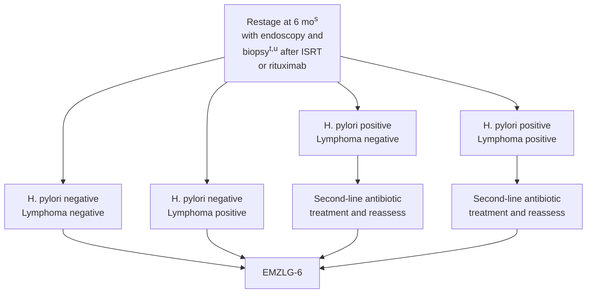

<sup>s</sup> If symptomatic, restaging should be done as clinically indicated.

<sup>t</sup> Reassessment to rule out *H. pylori* by institutional standards. Biopsy to rule out large cell lymphoma. Any area of DLBCL should be treated as DLBCL (BCEL-1).

<sup>u</sup> If re-evaluation suggests slowly responding disease or asymptomatic nonprogression, continued active surveillance may be warranted. Complete responses may be achieved as early as 3 months after initial therapy, but can take longer to achieve (up to 18 months) (category 2B).

**Note: All recommendations are category 2A unless otherwise indicated.**

Version 1.2026, 12/22/25 © 2025 National Comprehensive Cancer Network® (NCCN®), All rights reserved. NCCN Guidelines® and this illustration may not be reproduced in any form without the express written permission of NCCN.

EMZLG-5


---


PLEASE NOTE that use of this NCCN Content is governed by the End-User License Agreement, and you MAY NOT distribute this Content or use it with any artificial intelligence model or tool.

Printed by Arun Manoharan on 1/16/2026 11:45:09 AM. Copyright © 2026 National Comprehensive Cancer Network, Inc. All Rights Reserved.

National Comprehensive Cancer Network®

# NCCN Guidelines Version 1.2026
## Extranodal Marginal Zone B-Cell Lymphoma
## Extranodal MZL of the Stomach

NCCN Guidelines Index
Table of Contents
Discussion

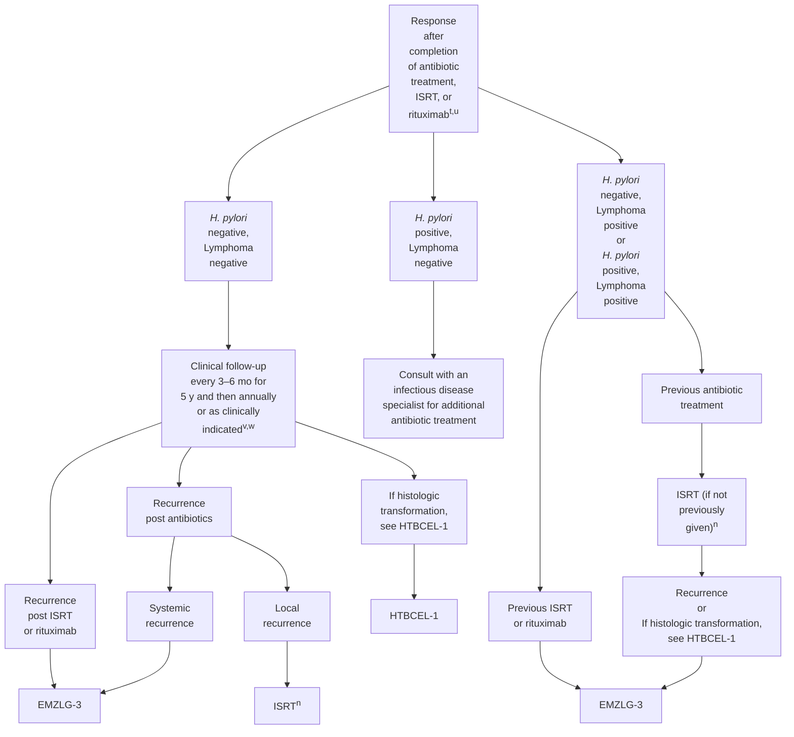

<sup>n</sup> Principles of Radiation Therapy (NHODG-D).

<sup>t</sup> Reassessment to rule out *H. pylori* by institutional standards. Biopsy to rule out large cell lymphoma. Any area of DLBCL should be treated as DLBCL (BCEL-1).

<sup>u</sup> If re-evaluation suggests slowly responding disease or asymptomatic nonprogression, continued active surveillance may be warranted. Complete responses may be achieved as early as 3 months after initial therapy, but can take longer to achieve (up to 18 months) (category 2B).

<sup>v</sup> Optimal interval for follow-up endoscopy and imaging is not known. Follow-up endoscopy and imaging using the modalities performed during workup is driven by symptoms. Relapse rates are higher after treatment with rituximab and may warrant serial endoscopy.

<sup>w</sup> Optional first-line extended therapy (rituximab maintenance 375 mg/m² one dose every 8–12 weeks for up to 2 years) for patients treated with single-agent rituximab (MZL-A 1 of 4).

**Note: All recommendations are category 2A unless otherwise indicated.**

Version 1.2026, 12/22/25 © 2025 National Comprehensive Cancer Network® (NCCN®), All rights reserved. NCCN Guidelines® and this illustration may not be reproduced in any form without the express written permission of NCCN.

EMZLG-6


---


PLEASE NOTE that use of this NCCN Content is governed by the End-User License Agreement, and you MAY NOT distribute this Content or use it with any artificial intelligence model or tool.

National Comprehensive Cancer Network®

**NCCN Guidelines Version 1.2026**
Extranodal Marginal Zone B-Cell Lymphoma
**Extranodal MZL of the Stomach**

Printed by Arun Manoharan on 1/16/2026 11:45:09 AM. Copyright © 2026 National Comprehensive Cancer Network, Inc. All Rights Reserved.

NCCN Guidelines Index
Table of Contents
Discussion

## STAGING OF EMZL OF THE STOMACH: COMPARISON OF DIFFERENT SYSTEMS

<table>
  <thead>
    <tr>
        <th>Lugano Staging System for Gastrointestinal Lymphomas</th>
        <th colspan="2">Lugano Modification of Ann Arbor Staging System</th>
        <th>TNM Staging System Adapted for Gastric Lymphoma</th>
        <th>Tumor Extension</th>
    </tr>
  </thead>
  <tbody>
    <tr>
        <td>Stage I</td>
<td>Confined to GI tract&lt;sup&gt;a&lt;/sup&gt;</td>
<td></td>
<td></td>
<td></td>
    </tr>
<tr>
        <td></td>
<td>I&lt;sub&gt;1&lt;/sub&gt; = mucosa, submucosa</td>
<td>I&lt;sub&gt;E&lt;/sub&gt;</td>
<td>T1 N0 M0</td>
<td>Mucosa, submucosa</td>
    </tr>
<tr>
        <td></td>
<td>I&lt;sub&gt;2&lt;/sub&gt; = muscularis propria, serosa</td>
<td>I&lt;sub&gt;E&lt;/sub&gt;</td>
<td>T2 N0 M0</td>
<td>Muscularis propria</td>
    </tr>
<tr>
        <td></td>
<td></td>
<td>I&lt;sub&gt;E&lt;/sub&gt;</td>
<td>T3 N0 M0</td>
<td>Serosa</td>
    </tr>
<tr>
        <td>Stage II</td>
<td>Extending into abdomen</td>
<td></td>
<td></td>
<td></td>
    </tr>
<tr>
        <td></td>
<td>II&lt;sub&gt;1&lt;/sub&gt; = local nodal involvement</td>
<td>II&lt;sub&gt;E&lt;/sub&gt;</td>
<td>T1-3 N1 M0</td>
<td>Perigastric lymph nodes</td>
    </tr>
<tr>
        <td></td>
<td>II&lt;sub&gt;2&lt;/sub&gt; = distant nodal involvement</td>
<td>II&lt;sub&gt;E&lt;/sub&gt;</td>
<td>T1-3 N2 M0</td>
<td>More distant regional lymph nodes</td>
    </tr>
<tr>
        <td>Stage IIE</td>
<td>Penetration of serosa to involve adjacent organs or tissues</td>
<td>II&lt;sub&gt;E&lt;/sub&gt;</td>
<td>T4 N0 M0</td>
<td>Invasion of adjacent structures</td>
    </tr>
<tr>
        <td>Stage IV&lt;sup&gt;b&lt;/sup&gt;</td>
<td>Disseminated extranodal involvement or concomitant supradiaphragmatic nodal involvement</td>
<td></td>
<td>T1-4 N3 M0</td>
<td>Lymph nodes on both sides of the diaphragm/ distant metastases (eg, bone marrow or additional extranodal sites)</td>
    </tr>
<tr>
        <td></td>
<td></td>
<td></td>
<td>IV</td>
<td>T1-4 N0-3 M1</td>
    </tr>
  </tbody>
</table>

Zucca E, Bertoni F, Yahalom J, Isaacson P. Extranodal Marginal Zone B-cell Lymphoma of Mucosa-Associated Lymphoid Tissue (MALT lymphoma) in Armitage, et al, eds. Non-Hodgkin's Lymphomas. Philadelphia: Lippincott, 2010:242. (http://lww.com)

<sup>a</sup> Single primary or multiple, noncontiguous.

<sup>b</sup> Involvement of multiple extranodal sites in MALT lymphoma appears to be biologically distinct from multiple extranodal involvement in other lymphomas, and these patients may be managed by treating each site separately with excision or RT. In contrast, cases with disseminated nodal involvement appear to behave more like nodal marginal zone lymphoma or like disseminated follicular lymphoma.

**Note: All recommendations are category 2A unless otherwise indicated.**

Version 1.2026, 12/22/25 © 2025 National Comprehensive Cancer Network® (NCCN®), All rights reserved. NCCN Guidelines® and this illustration may not be reproduced in any form without the express written permission of NCCN.

**EMZLG-A**


---


PLEASE NOTE that use of this NCCN Content is governed by the End-User License Agreement, and you MAY NOT distribute this Content or use it with any artificial intelligence model or tool.
Printed by Arun Manoharan on 1/16/2026 11:45:09 AM. Copyright © 2026 National Comprehensive Cancer Network, Inc. All Rights Reserved.

# NCCN Guidelines Version 1.2026

## Extranodal Marginal Zone B-Cell Lymphoma
## Extranodal MZL of Nongastric Sites (Noncutaneous)

NCCN Guidelines Index
Table of Contents
Discussion

### ADDITIONAL DIAGNOSTIC TESTING<sup>a,b</sup>

**ESSENTIAL:**
* **Adequate immunophenotyping to establish diagnosis<sup>c</sup>**
  * **IHC panel: CD20, CD3, CD5, CD10, BCL2, kappa/ lambda, CD21 or CD23, cyclin D1 with or without**
  * **Flow cytometry with peripheral blood and/ or biopsy specimen: kappa/lambda, CD19, CD20, CD5, CD23, CD10**

**USEFUL UNDER CERTAIN CIRCUMSTANCES:**
* **Molecular analysis to detect: Ig gene rearrangements; MYD88 mutation status to help differentiate WM (90%) versus MZL (10%) if plasmacytic differentiation present; FISH for MALT1 rearrangements**
* **FISH: t(11;18), t(11;14), t(3;14); t(14;18)**

### WORKUP

**ESSENTIAL:**
* **Physical exam with attention to nongastric sites<sup>a</sup>**
* **Performance status**
* **CBC with differential**
* **Comprehensive metabolic panel**
* **LDH**
* **Hepatitis B testing<sup>d</sup>**
* **Hepatitis C testing**
* **SPEP with SIFE and/or quantitative Ig levels**
* **PET/CT scan<sup>e</sup> or C/A/P CT with contrast of diagnostic quality if therapy is planned**
* **Pregnancy testing in patients of childbearing age (if therapy planned)**

**USEFUL IN SELECTED CASES:**
* **Echocardiogram or MUGA scan if anthracycline-based regimen is indicated**
* **Bone marrow biopsy ± aspirate (to document clinical stage I–II disease if ISRT planned, or to evaluate unexplained cytopenias)<sup>f</sup>**
* **Endoscopy with multiple biopsies of anatomical sites<sup>g</sup>**
* **MRI with contrast for neurologic evaluation or if CT with contrast is contraindicated**
* **MRI of head/neck, cranial, and ocular adnexa**
* **Neck CT scan with contrast particularly if RT planned for stage I, II disease**
* **Evaluation for autoimmune disease (eg, Sjogren's)**
* **Discuss fertility preservation<sup>h</sup>**

→ **Initial Therapy (EMZLNG-2)**

----

<sup>a</sup> Typical nongastric sites include the following: bowel (small and large), breast, head and neck, lung, dural, ocular adnexa, ovary, parotid, prostate, and salivary gland. Infectious agents have been reported to be associated with many nongastric sites, but testing for these infectious organisms is not required for management in the United States.

<sup>b</sup> This guideline pertains to EMZL of nongastric sites (noncutaneous); for primary cutaneous marginal zone lymphoma (PCMZL), see NCCN Guidelines for Cutaneous Lymphomas.

<sup>c</sup> Typical immunophenotype: CD10-, CD5-, CD20+, CD23-/+, CD43-/+, cyclin D1-, with BCL2- follicles.

<sup>d</sup> Hepatitis B testing is indicated because of the risk of reactivation with immunotherapy + chemotherapy. Tests include HBsAg and core antibody for a patient with no risk factors. For patients with risk factors or previous history of hepatitis B, add e-antigen (NHODG-B). If positive, check viral load and consider consult with gastroenterologist.

<sup>e</sup> PET/CT scan may be negative in marginal zonal lymphomas. In such cases, CT imaging is recommended.

<sup>f</sup> Bilateral or unilateral provided core biopsy is >2 cm. If active surveillance is initial therapy, bone marrow biopsy may be deferred.

<sup>g</sup> In cases where primary site is thought to be in head/neck or lungs, upper GI endoscopy should be considered.

<sup>h</sup> Fertility preservation options include: sperm banking, IVF, or ovarian tissue or oocyte cryopreservation.

**Note: All recommendations are category 2A unless otherwise indicated.**

Version 1.2026, 12/22/25 © 2025 National Comprehensive Cancer Network® (NCCN®), All rights reserved. NCCN Guidelines® and this illustration may not be reproduced in any form without the express written permission of NCCN.

EMZLNG-1


---


PLEASE NOTE that use of this NCCN Content is governed by the End-User License Agreement, and you MAY NOT distribute this Content or use it with any artificial intelligence model or tool.
Printed by Arun Manoharan on 1/16/2026 11:45:09 AM. Copyright © 2026 National Comprehensive Cancer Network, Inc. All Rights Reserved.

# NCCN Guidelines Version 1.2026

## Extranodal Marginal Zone B-Cell Lymphoma
## Extranodal MZL of Nongastric Sites (Noncutaneous)

<table>
  <thead>
    <tr>
        <th>STAGE</th>
        <th>INITIAL THERAPY&lt;sup&gt;i&lt;/sup&gt;</th>
        <th>FOLLOW-UP</th>
        <th></th>
    </tr>
  </thead>
  <tbody>
    <tr>
        <td>Stage IE or contiguous stage IIE</td>
<td>ISRT&lt;sup&gt;j&lt;/sup&gt; (preferred) or Surgery may be considered for certain sites&lt;sup&gt;k&lt;/sup&gt; (lung, breast [lumpectomy], thyroid, colon/small bowel) or Rituximab in selected cases or Active surveillance in selected cases&lt;sup&gt;l&lt;/sup&gt;</td>
<td>Positive margins → Consider ISRT&lt;sup&gt;j&lt;/sup&gt; Negative margins → Active surveillance</td>
<td>Follow-up (EMZLNG-3)</td>
    </tr>
<tr>
        <td>Stage IV</td>
<td>ISRT&lt;sup&gt;j,m&lt;/sup&gt; or Active surveillance in selected cases&lt;sup&gt;l&lt;/sup&gt; or Manage per advanced-stage NMZL (NMZL-3)</td>
<td></td>
<td></td>
    </tr>
<tr>
        <td>EMZL of nongastric sites with concurrent large cell transformation</td>
<td>Manage as Diffuse Large B-Cell Lymphoma (BCEL-1)</td>
        <td colspan="2"></td>
    </tr>
  </tbody>
</table>

<sup>i</sup> Based on anecdotal responses to antibiotics in ocular and cutaneous marginal zone lymphomas, some physicians will give an empiric course of doxycycline prior to initiating other therapy.

<sup>j</sup> Principles of Radiation Therapy (NHODG-D).

<sup>k</sup> Surgical excision for adequate diagnosis may be appropriate treatment for disease.

<sup>l</sup> Active surveillance may be considered for patients whose diagnostic biopsy was excisional, or where RT could result in significant morbidity.

<sup>m</sup> Definitive treatment of multiple sites may be indicated (eg, bilateral orbital disease without evidence of disease elsewhere) or palliative treatment of symptomatic sites.

**Note: All recommendations are category 2A unless otherwise indicated.**

Version 1.2026, 12/22/25 © 2025 National Comprehensive Cancer Network® (NCCN®), All rights reserved. NCCN Guidelines® and this illustration may not be reproduced in any form without the express written permission of NCCN.

EMZLNG-2


---


PLEASE NOTE that use of this NCCN Content is governed by the End-User License Agreement, and you MAY NOT distribute this Content or use it with any artificial intelligence model or tool.
Printed by Arun Manoharan on 1/16/2026 11:45:09 AM. Copyright © 2026 National Comprehensive Cancer Network, Inc. All Rights Reserved.

# NCCN Guidelines® Version 1.2026

## Extranodal Marginal Zone B-Cell Lymphoma

## Extranodal MZL of Nongastric Sites (Noncutaneous)

NCCN Guidelines Index
Table of Contents
Discussion

## FOLLOW-UP

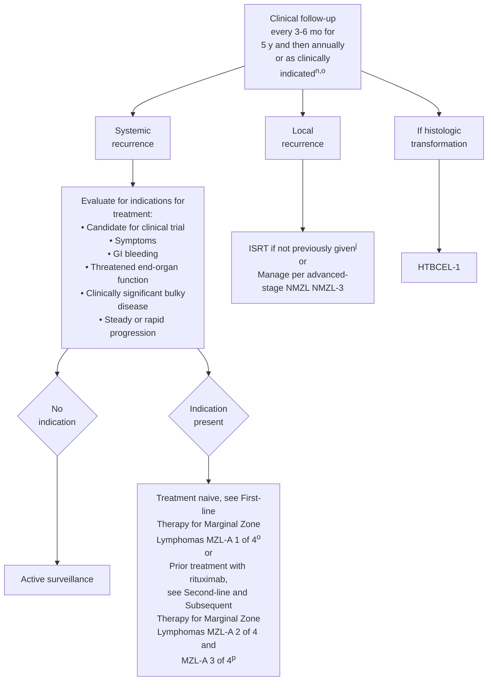

<sup>j</sup> Principles of Radiation Therapy (NHODG-D)).

<sup>n</sup> Follow-up includes diagnostic tests and imaging previously used as clinically indicated.

<sup>o</sup> Optional first-line extended therapy (rituximab maintenance 375 mg/m<sup>2</sup> one dose every 8–12 weeks for up to 2 years) following CR or PR for patients treated with single-agent rituximab (MZL-A 1 of 4).

<sup>p</sup> Optional second-line extended therapy (obinutuzumab maintenance for rituximab-refractory disease) following CR or PR if treated with bendamustine + obinutuzumab for recurrent disease (MZL-A 2 of 4).

**Note: All recommendations are category 2A unless otherwise indicated.**

Version 1.2026, 12/22/25 © 2025 National Comprehensive Cancer Network® (NCCN®), All rights reserved. NCCN Guidelines® and this illustration may not be reproduced in any form without the express written permission of NCCN.    EMZLNG-3


---


PLEASE NOTE that use of this NCCN Content is governed by the End-User License Agreement, and you MAY NOT distribute this Content or use it with any artificial intelligence model or tool.
Printed by Arun Manoharan on 1/16/2026 11:45:09 AM. Copyright © 2026 National Comprehensive Cancer Network, Inc. All Rights Reserved.

National Comprehensive Cancer Network®

# NCCN Guidelines Version 1.2026
# Nodal Marginal Zone Lymphoma

NCCN Guidelines Index
Table of Contents
Discussion

## ADDITIONAL DIAGNOSTIC TESTING

### ESSENTIAL:
• **Adequate immunophenotyping to establish diagnosis<sup>a</sup>**
  ‣ **IHC panel: CD20, CD3, CD5, CD10, BCL2, kappa/lambda, CD21 or CD23, cyclin D1 with or without**
  ‣ **Flow cytometry with peripheral blood and/or biopsy specimen: kappa/lambda, CD19, CD20, CD5, CD23, CD10**
• **Pediatric NMZL should be considered with localized disease in a young patient.**

### USEFUL UNDER CERTAIN CIRCUMSTANCES:
• **Molecular analysis to detect: Ig gene rearrangements; <i>MYD88</i> mutation status to help differentiate WM (90%) versus MZL (10%) if plasmacytic differentiation present; <i>CXCR4</i> mutation status to help differentiate WM versus MZL; FISH for <i>MALT1</i> rearrangements**
• **FISH: t(11;18), t(1;14), del(13q), del(7q); t(14;18)**

## WORKUP

### ESSENTIAL:
• **Physical exam with performance status**
• **CBC with differential**
• **Comprehensive metabolic panel**
• **LDH**
• **Hepatitis B testing<sup>b</sup>**
• **Hepatitis C testing**
• **PET/CT scan (preferred)<sup>c</sup> or C/A/P CT with contrast of diagnostic quality if therapy is planned**
• **Pregnancy testing in patients of childbearing age (if therapy planned)**

### USEFUL IN SELECTED CASES:
• **Bone marrow biopsy + aspirate (to document clinical stage I–II disease if ISRT planned, or to evaluate unexplained cytopenias)<sup>d</sup>**
• **Echocardiogram or MUGA scan if anthracycline-based regimen is indicated**
• **Additional imaging as needed based on clinical presentation or symptoms<sup>e</sup>**
• **SPEP with SIFE and/or quantitative Ig levels**
• **Discuss fertility preservation<sup>f</sup>**

**Stage I, II (NMZL-2)**

**Stage III, IV (NMZL-3)**

----

<sup>a</sup> Typical immunophenotype: CD10-, CD5-, CD20+, CD23-/+, CD43-/+, and cyclin D1-, may have BCL2- follicles.

<sup>b</sup> Hepatitis B testing is indicated because of the risk of reactivation with immunotherapy + chemotherapy. Tests include HBsAg and core antibody for a patient with no risk factors. For patients with risk factors or previous history of hepatitis B, add e-antigen (NHODG-B). If positive, check viral load and consider consult with gastroenterologist.

<sup>c</sup> PET/CT scan may be negative in marginal zonal lymphomas. In such cases, CT imaging is recommended.

<sup>d</sup> Bilateral or unilateral provided core biopsy is >2 cm. If active surveillance is initial therapy, bone marrow biopsy may be deferred.

<sup>e</sup> In NMZL, extranodal involvement is common: Neck nodes: ocular, parotid, thyroid, and salivary gland; axillary nodes: lung, breast, and skin; mediastinal/hilar nodes: lung; abdominal nodes: splenic and GI; inguinal/iliac nodes: GI and skin.

<sup>f</sup> Fertility preservation options include: sperm banking, IVF, or ovarian tissue or oocyte cryopreservation.

**Note: All recommendations are category 2A unless otherwise indicated.**

Version 1.2026, 12/22/25 © 2025 National Comprehensive Cancer Network® (NCCN®), All rights reserved. NCCN Guidelines® and this illustration may not be reproduced in any form without the express written permission of NCCN.

NMZL-1


---


PLEASE NOTE that use of this NCCN Content is governed by the End-User License Agreement, and you MAY NOT distribute this Content or use it with any artificial intelligence model or tool.
Printed by Arun Manoharan on 1/16/2026 11:45:09 AM. Copyright © 2026 National Comprehensive Cancer Network, Inc. All Rights Reserved.

National Comprehensive Cancer Network®

NCCN Guidelines Version 1.2026
Nodal Marginal Zone Lymphoma

NCCN Guidelines Index
Table of Contents
Discussion

# STAGE, INITIAL THERAPY, RESPONSE TO THERAPY, AND FOLLOW-UP

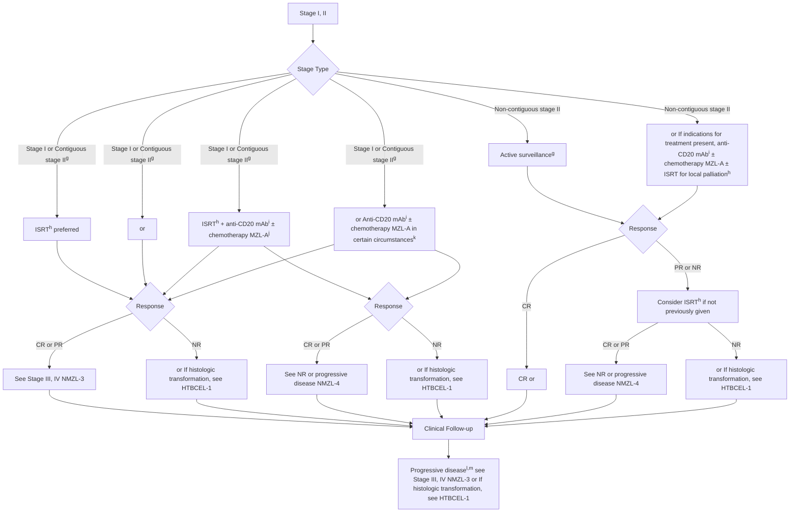

<table>
  <thead>
    <tr>
        <th>STAGE</th>
        <th>INITIAL THERAPY</th>
        <th>RESPONSE TO THERAPY&lt;sup&gt;l,m&lt;/sup&gt;</th>
        <th>FOLLOW-UP&lt;sup&gt;n&lt;/sup&gt;</th>
        <th colspan="3"></th>
    </tr>
  </thead>
  <tbody>
    <tr>
        <td>Stage I or Contiguous stage II&lt;sup&gt;g&lt;/sup&gt;</td>
<td>ISRT&lt;sup&gt;h&lt;/sup&gt; (preferred) or</td>
<td>CR or PR</td>
<td>See Stage III, IV (NMZL-3)</td>
<td>Clinical • H&amp;P and labs every 3–6 mo for 5 y and then annually or as clinically indicated Surveillance imaging&lt;sup&gt;o&lt;/sup&gt; • Up to 2 y post completion of treatment: C/A/P CT scan with contrast no more than every 6 mo • &gt;2 y: No more than annually</td>
<td>Progressive disease,&lt;sup&gt;l,m&lt;/sup&gt; see Stage III, IV (NMZL-3) or If histologic transformation, see HTBCEL-1</td>
<td></td>
    </tr>
<tr>
        <td></td>
<td>ISRT&lt;sup&gt;h&lt;/sup&gt; + anti-CD20 mAb&lt;sup&gt;i&lt;/sup&gt; ± chemotherapy (MZL-A)&lt;sup&gt;j&lt;/sup&gt; or Anti-CD20 mAb&lt;sup&gt;i&lt;/sup&gt; ± chemotherapy (MZL-A) in certain circumstances)&lt;sup&gt;k&lt;/sup&gt;</td>
<td>NR</td>
<td>or If histologic transformation, see HTBCEL-1</td>
<td></td>
<td></td>
<td></td>
    </tr>
<tr>
        <td></td>
<td></td>
<td>CR or PR</td>
<td>See NR or progressive disease (NMZL-4)</td>
<td></td>
<td></td>
<td></td>
    </tr>
<tr>
        <td></td>
<td></td>
<td>NR</td>
<td>or If histologic transformation, see HTBCEL-1</td>
<td></td>
<td></td>
<td></td>
    </tr>
<tr>
        <td>Non-contiguous stage II</td>
<td>Active surveillance&lt;sup&gt;g&lt;/sup&gt; or If indications for treatment present, anti-CD20 mAb&lt;sup&gt;i&lt;/sup&gt; ± chemotherapy (MZL-A) ± ISRT for local palliation&lt;sup&gt;h&lt;/sup&gt;</td>
<td>CR</td>
<td>CR or</td>
<td></td>
<td></td>
<td></td>
    </tr>
<tr>
        <td></td>
<td></td>
<td>PR or NR</td>
<td>Consider ISRT&lt;sup&gt;h&lt;/sup&gt; if not previously given</td>
<td>CR or PR</td>
<td>See NR or progressive disease (NMZL-4)</td>
<td></td>
    </tr>
<tr>
        <td></td>
<td></td>
<td></td>
<td>NR</td>
<td>or If histologic transformation, see HTBCEL-1</td>
        <td colspan="2"></td>
    </tr>
  </tbody>
</table>

<sup>g</sup> Active surveillance may be appropriate in circumstances where potential toxicity of ISRT or systemic therapy outweighs potential clinical benefit in consultation with a radiation oncologist.

<sup>h</sup> Principles of Radiation Therapy (NHODG-D).

<sup>i</sup> Anti-CD20 mAbs include rituximab or obinutuzumab. Obinutuzumab is not indicated as single-agent therapy.

<sup>j</sup> Initiation of systemic therapy can improve FFS, but has not been shown to improve overall survival. These are options for initial therapy.

<sup>k</sup> Eg, for patients with bulky intra-abdominal or mesenteric stage I disease.

<sup>l</sup> Lugano Response Criteria for Non-Hodgkin Lymphoma (NHODG-C). PET/CT scan should be interpreted via the PET 5-PS.

<sup>m</sup> Consider possibility of histologic transformation in patients with progressive disease, especially if LDH levels are rising, single site is growing disproportionately, extranodal disease develops, or there are new B symptoms. If clinical suspicion of transformation, FDG-PET may help identify areas suspicious for transformation. FDG-PET scan demonstrating marked heterogeneity or sites of intense FDG avidity may indicate transformation, and biopsy should be directed biopsy at the most FDG-avid area. Functional imaging does not replace biopsy to diagnose transformation. If transformation is histologically confirmed, treatment options should be directed towards the large cell transformation. See HTBCEL-1.

<sup>n</sup> Follow-up includes diagnostic tests and imaging using the same modalities performed during workup as clinically indicated. Imaging should be performed whenever there are clinical indications. For surveillance imaging, see Discussion for consensus imaging recommendations.

<sup>o</sup> Surveillance imaging is used for monitoring asymptomatic patients. When a site of disease can only be visualized on PET/CT scan (eg, bone), it is appropriate to proceed with PET/CT scans for surveillance.

**Note: All recommendations are category 2A unless otherwise indicated.**

Version 1.2026, 12/22/25 © 2025 National Comprehensive Cancer Network® (NCCN®), All rights reserved. NCCN Guidelines® and this illustration may not be reproduced in any form without the express written permission of NCCN.

NMZL-2


---


PLEASE NOTE that use of this NCCN Content is governed by the End-User License Agreement, and you MAY NOT distribute this Content or use it with any artificial intelligence model or tool.
Printed by Arun Manoharan on 1/16/2026 11:45:09 AM. Copyright © 2026 National Comprehensive Cancer Network, Inc. All Rights Reserved.

National Comprehensive Cancer Network®

**NCCN Guidelines Version 1.2026
Nodal Marginal Zone Lymphoma**

NCCN Guidelines Index
Table of Contents
Discussion

# STAGE | MANAGEMENT AND FOLLOW-UP<sup>n</sup>

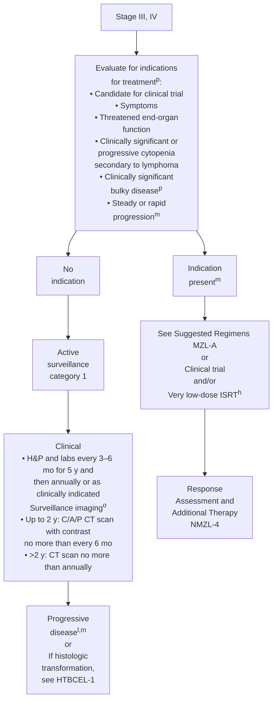

----

<sup>h</sup> Principles of Radiation Therapy (NHODG-D)).

<sup>l</sup> Lugano Response Criteria for Non-Hodgkin Lymphoma (NHODG-C)). PET/CT scan should be interpreted via the PET 5-PS.

<sup>m</sup> Consider possibility of histologic transformation in patients with progressive disease, especially if LDH levels are rising, single site is growing disproportionately, extranodal disease develops, or there are new B symptoms. If clinical suspicion of transformation, FDG-PET may help identify areas suspicious for transformation. FDG-PET scan demonstrating marked heterogeneity or sites of intense FDG avidity may indicate transformation, and biopsy should be directed biopsy at the most FDG-avid area. Functional imaging does not replace biopsy to diagnose transformation. If transformation is histologically confirmed, treatment options should be directed towards the large cell transformation. See HTBCEL-1.

<sup>n</sup> Follow-up includes diagnostic tests and imaging using the same modalities performed during workup as clinically indicated. Imaging should be performed whenever there are clinical indications. For surveillance imaging, see Discussion for consensus imaging recommendations.

<sup>o</sup> Surveillance imaging is used for monitoring asymptomatic patients. When a site of disease can only be visualized on PET/CT scan (eg, bone), it is appropriate to proceed with PET/CT scans for surveillance.

<sup>p</sup> GELF criteria (FOLL-A)).

**Note: All recommendations are category 2A unless otherwise indicated.**

Version 1.2026, 12/22/25 © 2025 National Comprehensive Cancer Network® (NCCN®), All rights reserved. NCCN Guidelines® and this illustration may not be reproduced in any form without the express written permission of NCCN.

NMZL-3


---


PLEASE NOTE that use of this NCCN Content is governed by the End-User License Agreement, and you MAY NOT distribute this Content or use it with any artificial intelligence model or tool.
Printed by Arun Manoharan on 1/16/2026 11:45:09 AM. Copyright © 2026 National Comprehensive Cancer Network, Inc. All Rights Reserved.

# NCCN Guidelines Version 1.2026
# Nodal Marginal Zone Lymphoma

NCCN Guidelines Index
Table of Contents
Discussion

## RESPONSE ASSESSMENT<sup>l</sup> AND ADDITIONAL THERAPY

**CR<sup>l</sup>** → Extended therapy (optional) for patients treated with single-agent Rituximab (MZL-A) or Active surveillance

**C/A/P CT scan with contrast** → **PR<sup>l,q</sup>** → Extended therapy (optional) for patients treated with single-agent Rituximab (MZL-A) or Active surveillance or Third-line systemic therapy or later (MZL-A 3 of 4)

↓

**NR or progressive disease<sup>l,m</sup>** → **Rebiopsy** →

## FOLLOW-UP<sup>n</sup>

**Clinical**
- H&P and labs every 3–6 mo for 5 y and then annually or as clinically indicated
**Surveillance imaging<sup>o</sup>**
- Up to 2 y post completion of treatment: C/A/P CT scan with contrast no more than every 6 mo
- >2 y: CT scan no more than annually

**Relapsed or Progressive disease<sup>l,m</sup> or If histologic transformation, see HTBCEL-1**

**Evaluate for indications for treatment<sup>p</sup>:**
- Candidate for clinical trial
- Symptoms
- Threatened end-organ function
- Clinically significant or progressive cytopenia secondary to lymphoma
- Clinically significant bulky disease<sup>p</sup>
- Steady or rapid progression

**No indication** → **Active surveillance**

**Indication present** → **PET/CT scan<sup>m</sup>**

## SECOND-LINE AND SUBSEQUENT THERAPY

→ Suggested Regimens (MZL-A) or Clinical trial or Very low-dose ISRT<sup>h</sup>

- **No histologic transformation** →
- **If histologic transformation, see HTBCEL-1**
- **Third-line systemic therapy or later (MZL-A 3 of 4)**

----

<sup>h</sup> Principles of Radiation Therapy (NHODG-D).

<sup>l</sup>Lugano Response Criteria for Non-Hodgkin Lymphoma (NHODG-C). PET/CT scan should be interpreted via the PET 5-PS.

<sup>m</sup> Consider possibility of histologic transformation in patients with progressive disease, especially if LDH levels are rising, single site is growing disproportionately, extranodal disease develops, or there are new B symptoms. If clinical suspicion of transformation, FDG-PET may help identify areas suspicious for transformation. FDG-PET scan demonstrating marked heterogeneity or sites of intense FDG avidity may indicate transformation, and biopsy should be directed biopsy at the most FDG-avid area. Functional imaging does not replace biopsy to diagnose transformation. If transformation is histologically confirmed, treatment options should be directed towards the large cell transformation. See HTBCEL-1.

<sup>n</sup> Follow-up includes diagnostic tests and imaging using the same modalities performed during workup as clinically indicated. Imaging should be performed whenever there are clinical indications. For surveillance imaging, see Discussion for consensus imaging recommendations.

<sup>o</sup> Surveillance imaging is used for monitoring asymptomatic patients. When a site of disease can only be visualized on PET/CT scan (eg, bone), it is appropriate to proceed with PET/CT scans for surveillance.

<sup>p</sup> GELF criteria (FOLL-A).

<sup>q</sup> A PET-positive PR is associated with a shortened PFS (see Discussion); however, additional treatment at this juncture has not been shown to change outcome.

**Note: All recommendations are category 2A unless otherwise indicated.**

Version 1.2026, 12/22/25 © 2025 National Comprehensive Cancer Network® (NCCN®), All rights reserved. NCCN Guidelines® and this illustration may not be reproduced in any form without the express written permission of NCCN.

NMZL-4


---


PLEASE NOTE that use of this NCCN Content is governed by the End-User License Agreement, and you MAY NOT distribute this Content or use it with any artificial intelligence model or tool.
Printed by Arun Manoharan on 1/16/2026 11:45:09 AM. Copyright © 2026 National Comprehensive Cancer Network, Inc. All Rights Reserved.

National Comprehensive Cancer Network®

NCCN Guidelines Version 1.2026
Splenic Marginal Zone Lymphoma

NCCN Guidelines Index
Table of Contents
Discussion

## ADDITIONAL DIAGNOSTIC TESTING<sup>a</sup>

### ESSENTIAL:
• **Adequate immunophenotyping to establish diagnosis<sup>b</sup>**
  ▸ **IHC panel: CD20, CD3, CD5, CD10, BCL2, kappa/lambda, CD21 or CD23, cyclin D1, IgD, CD43, annexin A1;**
    **with or without**
  ▸ **Flow cytometry with peripheral blood and/or biopsy specimen: kappa/lambda, CD19, CD20, CD5, CD23, CD10, CD43, CD103**

### USEFUL UNDER CERTAIN CIRCUMSTANCES:
• **Molecular analysis to detect: Ig gene rearrangements; MYD88 mutation status to help differentiate WM (90%) versus MZL (10%) if plasmacytic differentiation present<sup>c</sup>; BRAF mutation status (by IHC or sequencing) to differentiate MZL from hairy cell leukemia (HCL); FISH for MALT1 rearrangements**
• **FISH: chronic lymphocytic leukemia (CLL) panel; t(11;18), t(11;14), del(7q); t(14;18)**

## WORKUP

### ESSENTIAL:
• **Physical exam with performance status**
• **CBC with differential**
• **Comprehensive metabolic panel**
• **LDH**
• **Hepatitis B testing<sup>d</sup>**
• **Hepatitis C testing**
• **PET/CT scan<sup>e</sup> or C/A/P CT or other suspected sites with contrast of diagnostic quality**
• **SPEP with SIFE and/or quantitative Ig levels**
• **Pregnancy testing in patients of childbearing age (if therapy planned)**

### USEFUL IN SELECTED CASES:
• **Bone marrow biopsy ± aspirate if cytopenias are present and considering splenectomy to ensure adequate bone marrow hematopoiesis<sup>f</sup>**
• **Additional imaging as needed based on clinical presentation or symptoms**
• **Cryoglobulins**
• **Direct Coombs testing**
• **Discuss fertility preservation<sup>g</sup>**

→ **Management (SMZL-2)**

----

<sup>a</sup> The presumptive diagnosis of SMZL may be made based on peripheral blood involvement ± bone marrow by small lymphoid cells with Ig light chain restriction that lack characteristic features of other small B-cell neoplasms (ie, CD5, CD10, cyclin D1). In patients with lymphocytosis (>3), evaluation of peripheral blood with flow cytometry and MGPT panel including *MYD88*, *NOTCH2*, and *KLF2* mutations may be adequate to confirm the diagnosis. Plasmacytoid differentiation with cytoplasmic Ig detectable on paraffin sections may occur. In such cases, the differential diagnosis may include LPL. With a characteristic intrasinusoidal lymphocytic infiltration of the bone marrow, the diagnosis can strongly be suggested on bone marrow biopsy alone, if the immunophenotype is consistent. SMZL is most definitively diagnosed at splenectomy, since the immunophenotype is nonspecific and morphologic features on the bone marrow may not be diagnostic.

<sup>b</sup> Typical immunophenotype: CD10-, CD5-, CD20+, CD23-/+, CD43-/+, and cyclin D1-, with BCL2- follicles, annexin A1, and CD103- (distinction from HCL) with expression of both IgM and IgD.

<sup>c</sup> *NOTCH2* and *KLF2* mutation status may be helpful to differentiate SMZL from other B-cell lymphoma subtypes.

<sup>d</sup> Hepatitis B testing is indicated because of the risk of reactivation with immunotherapy + chemotherapy. Tests include HBsAg and core antibody for a patient with no risk factors. For patients with risk factors or previous history of hepatitis B, add e-antigen (NHODG-B). If positive, check viral load and consider consult with gastroenterologist.

<sup>e</sup> PET/CT scan may be negative in marginal zonal lymphomas. In such cases, CT imaging is recommended.

<sup>f</sup> Bilateral or unilateral provided core biopsy is >2 cm. If active surveillance is initial therapy, bone marrow biopsy may be deferred.

<sup>g</sup> Fertility preservation options include: sperm banking, IVF, or ovarian tissue or oocyte cryopreservation.

**Note: All recommendations are category 2A unless otherwise indicated.**

Version 1.2026, 12/22/25 © 2025 National Comprehensive Cancer Network® (NCCN®), All rights reserved. NCCN Guidelines® and this illustration may not be reproduced in any form without the express written permission of NCCN.

SMZL-1


---


PLEASE NOTE that use of this NCCN Content is governed by the End-User License Agreement, and you MAY NOT distribute this Content or use it with any artificial intelligence model or tool.
Printed by Arun Manoharan on 1/16/2026 11:45:09 AM. Copyright © 2026 National Comprehensive Cancer Network, Inc. All Rights Reserved.

National Comprehensive Cancer Network®

**NCCN Guidelines Version 1.2026
Splenic Marginal Zone Lymphoma**

NCCN Guidelines Index
Table of Contents
Discussion

# CLINICAL PRESENTATION | MANAGEMENT | FOLLOW-UP

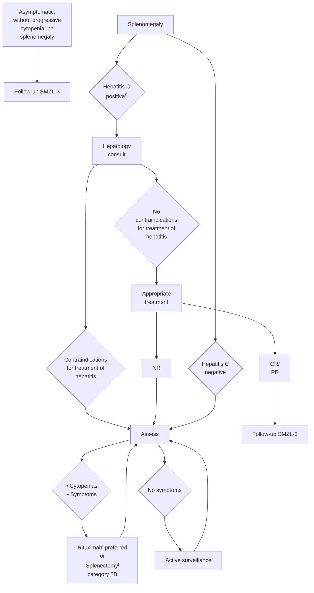

----

<sup>h</sup> If hepatitis C positive, treat with an appropriate regimen for hepatitis C.
<sup>i</sup> Tsimberidou AM, et al. Cancer 2006;107:125-135.
<sup>j</sup> Pneumococcal, meningococcal, haemophilus influenza, and hepatitis B vaccinations should be given at least 2 weeks before splenectomy.

**Note: All recommendations are category 2A unless otherwise indicated.**

Version 1.2026, 12/22/25 © 2025 National Comprehensive Cancer Network® (NCCN®), All rights reserved. NCCN Guidelines® and this illustration may not be reproduced in any form without the express written permission of NCCN.

**SMZL-2**


---


PLEASE NOTE that use of this NCCN Content is governed by the End-User License Agreement, and you MAY NOT distribute this Content or use it with any artificial intelligence model or tool.
Printed by Arun Manoharan on 1/16/2026 11:45:09 AM. Copyright © 2026 National Comprehensive Cancer Network, Inc. All Rights Reserved.

National Comprehensive Cancer Network®

**NCCN Guidelines Version 1.2026
Splenic Marginal Zone Lymphoma**

NCCN Guidelines Index
Table of Contents
Discussion

# FOLLOW-UP

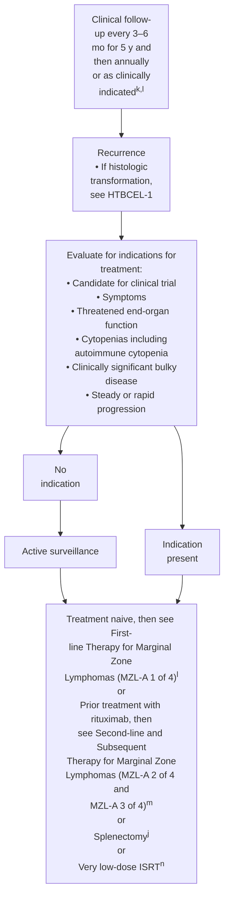

<sup>j</sup> Pneumococcal, meningococcal, haemophilus influenza, and hepatitis B vaccinations should be given at least 2 weeks before splenectomy.
<sup>k</sup> Follow-up includes diagnostic tests and imaging using the same modalities performed during workup as clinically indicated.
<sup>l</sup> Optional first-line extended therapy (rituximab maintenance 375 mg/m<sup>2</sup> one dose every 8–12 weeks for up to 2 years) following CR or PR for patients treated with single-agent rituximab (MZL-A 1 of 4).
<sup>m</sup> Optional second-line extended therapy (obinutuzumab maintenance for rituximab-refractory disease) following CR or PR if treated with bendamustine + obinutuzumab for recurrent disease (MZL-A 2 of 4).
<sup>n</sup> Principles of Radiation Therapy (NHODG-D)).

Note: All recommendations are category 2A unless otherwise indicated.

Version 1.2026, 12/22/25 © 2025 National Comprehensive Cancer Network® (NCCN®), All rights reserved. NCCN Guidelines® and this illustration may not be reproduced in any form without the express written permission of NCCN.    SMZL-3


---


PLEASE NOTE that use of this NCCN Content is governed by the End-User License Agreement, and you MAY NOT distribute this Content or use it with any artificial intelligence model or tool.
Printed by Arun Manoharan on 1/16/2026 11:45:09 AM. Copyright © 2026 National Comprehensive Cancer Network, Inc. All Rights Reserved.

National Comprehensive Cancer Network®

# NCCN Guidelines Version 1.2026
# Marginal Zone Lymphomas

NCCN Guidelines Index
Table of Contents
Discussion

## SUGGESTED TREATMENT REGIMENS<sup>a,b,c</sup>

### FIRST-LINE THERAPY<sup>d</sup>

**Preferred (in alphabetical order)**
* NMZL
  * Bendamustine + Rituximab
  * CHOP + Rituximab
  * CVP + Rituximab
  * Rituximab (375 mg/m² weekly for 4 doses) for low tumor burden
* SMZL
  * Rituximab (375 mg/m² weekly for 4 doses)

**Other recommended**
* Lenalidomide + Rituximab for NMZL
* Rituximab (375 mg/m² weekly for 4 doses) for EMZL (multifocal)

### FIRST-LINE THERAPY FOR OLDER OR INFIRM<sup>d</sup>
**(if none of the above are expected to be tolerable in the opinion of treating physician)**

**Preferred**
* Rituximab (375 mg/m² weekly for 4 doses)
* ISRT for local disease

**Other recommended**
* Cyclophosphamide ± Rituximab

### FIRST-LINE EXTENDED THERAPY (optional)<sup>d</sup>

* Rituximab maintenance 375 mg/m² one dose every 8–12 weeks for up to 2 years

Footnotes
**Second-line and Subsequent Therapy on MZL-A 2 of 4**

**Consider prophylaxis for tumor lysis syndrome (NHODG-B)
See monoclonal antibody and viral reactivation (NHODG-B)**

**Note: All recommendations are category 2A unless otherwise indicated.**

**MZL-A
1 OF 4**

Version 1.2026, 12/22/25 © 2025 National Comprehensive Cancer Network® (NCCN®), All rights reserved. NCCN Guidelines® and this illustration may not be reproduced in any form without the express written permission of NCCN.


---


PLEASE NOTE that use of this NCCN Content is governed by the End-User License Agreement, and you MAY NOT distribute this Content or use it with any artificial intelligence model or tool.
Printed by Arun Manoharan on 1/16/2026 11:45:09 AM. Copyright © 2026 National Comprehensive Cancer Network, Inc. All Rights Reserved.

National Comprehensive Cancer Network®

NCCN Guidelines Version 1.2026
Marginal Zone Lymphomas

NCCN Guidelines Index
Table of Contents
Discussion

## SUGGESTED TREATMENT REGIMENS<sup>a,b,c</sup>

<table>
  <thead>
    <tr>
        <th>SECOND-LINE AND SUBSEQUENT THERAPY&lt;sup&gt;d&lt;/sup&gt;</th>
        <th>SECOND-LINE AND SUBSEQUENT THERAPY FOR OLDER OR INFIRM&lt;sup&gt;d&lt;/sup&gt;</th>
    </tr>
  </thead>
  <tbody>
    <tr>
        <td>(if combination chemoimmunotherapy is not expected to be tolerable in the opinion of treating physician)</td>
<td></td>
    </tr>
<tr>
        <td>For sequencing of therapy, see Discussion.</td>
<td></td>
    </tr>
<tr>
        <td>Preferred (in alphabetical order)</td>
<td></td>
    </tr>
<tr>
        <td>• Bendamustine&lt;sup&gt;e&lt;/sup&gt; + Rituximab (not recommended if treated with prior Bendamustine)</td>
<td></td>
    </tr>
<tr>
        <td>• BTKis</td>
<td></td>
    </tr>
<tr>
        <td>⏵ Covalent BTKi</td>
<td></td>
    </tr>
<tr>
        <td>◊ Zanubrutinib (continuous)&lt;sup&gt;f&lt;/sup&gt; (after at least one prior anti-CD20 mAb-based regimen)</td>
<td></td>
    </tr>
<tr>
        <td>• CHOP + Rituximab</td>
<td></td>
    </tr>
<tr>
        <td>• CVP + Rituximab</td>
<td></td>
    </tr>
<tr>
        <td>• Lenalidomide + Rituximab</td>
<td></td>
    </tr>
<tr>
        <td>Other recommended (in alphabetical order)</td>
<td></td>
    </tr>
<tr>
        <td>• Bendamustine&lt;sup&gt;e&lt;/sup&gt; + Obinutuzumab (not recommended if treated with prior Bendamustine)</td>
<td></td>
    </tr>
<tr>
        <td>• BTKis</td>
<td></td>
    </tr>
<tr>
        <td>⏵ Covalent BTKi</td>
<td></td>
    </tr>
<tr>
        <td>◊ Acalabrutinib (continuous)&lt;sup&gt;f,g&lt;/sup&gt;</td>
<td></td>
    </tr>
<tr>
        <td>⏵ Non-covalent BTKi</td>
<td></td>
    </tr>
<tr>
        <td>◊ Pirtobrutinib (continuous) (after prior covalent BTKi)&lt;sup&gt;f&lt;/sup&gt;</td>
<td></td>
    </tr>
<tr>
        <td>Lenalidomide + Obinutuzumab</td>
<td></td>
    </tr>
<tr>
        <td>• Rituximab (if longer duration of remission)</td>
<td>Preferred (in alphabetical order)</td>
    </tr>
<tr>
        <td>• BTKis</td>
<td></td>
    </tr>
<tr>
        <td>⏵ Covalent BTKi</td>
<td></td>
    </tr>
<tr>
        <td>◊ Zanubrutinib (continuous)&lt;sup&gt;f&lt;/sup&gt; (after at least one prior anti-CD20 mAb-based regimen)</td>
<td></td>
    </tr>
<tr>
        <td>• Lenalidomide + Rituximab</td>
<td></td>
    </tr>
<tr>
        <td>• Rituximab (375 mg/m² weekly for 4 doses)</td>
<td></td>
    </tr>
<tr>
        <td>Other recommended (in alphabetical order)</td>
<td></td>
    </tr>
<tr>
        <td>• BTKis</td>
<td></td>
    </tr>
<tr>
        <td>⏵ Covalent BTKi</td>
<td></td>
    </tr>
<tr>
        <td>◊ Acalabrutinib (continuous)&lt;sup&gt;f,g&lt;/sup&gt;</td>
<td></td>
    </tr>
<tr>
        <td>⏵ Non-covalent BTKi</td>
<td></td>
    </tr>
<tr>
        <td>◊ Pirtobrutinib (continuous) (after prior covalent BTKi)&lt;sup&gt;f&lt;/sup&gt;</td>
<td></td>
    </tr>
<tr>
        <td>• Cyclophosphamide ± Rituximab</td>
<td></td>
    </tr>
<tr>
        <td>SECOND-LINE EXTENDED THERAPY (optional)</td>
<td></td>
    </tr>
<tr>
        <td>Preferred</td>
<td></td>
    </tr>
<tr>
        <td>• If treated with Bendamustine + Obinutuzumab for recurrent disease, then Obinutuzumab maintenance for Rituximab-refractory disease (1 g every 8 weeks for total of 12 doses)</td>
<td></td>
    </tr>
  </tbody>
</table>

Consider prophylaxis for tumor lysis syndrome (NHODG-B)
See monoclonal antibody and viral reactivation (NHODG-B)

Footnotes

Third-line and Subsequent Therapy on MZL-A 3 of 4

Note: All recommendations are category 2A unless otherwise indicated.

MZL-A
2 OF 4

Version 1.2026, 12/22/25 © 2025 National Comprehensive Cancer Network® (NCCN®), All rights reserved. NCCN Guidelines® and this illustration may not be reproduced in any form without the express written permission of NCCN.


---


PLEASE NOTE that use of this NCCN Content is governed by the End-User License Agreement, and you MAY NOT distribute this Content or use it with any artificial intelligence model or tool.
Printed by Arun Manoharan on 1/16/2026 11:45:09 AM. Copyright © 2026 National Comprehensive Cancer Network, Inc. All Rights Reserved.

National Comprehensive Cancer Network®

NCCN Guidelines Version 1.2026
Marginal Zone Lymphomas

NCCN Guidelines Index
Table of Contents
Discussion

## SUGGESTED TREATMENT REGIMENS<sup>a,b,c</sup>

### THIRD-LINE AND SUBSEQUENT THERAPY

• **Second-line therapy regimens (MZL-A 2 of 4) that were not previously given can also be used as options for third-line and subsequent therapy**

**Preferred**
• CAR T-cell therapy<sup>h</sup>
  ▸ Lisocabtagene maraleucel<sup>i</sup> (CD19-directed)

**Other recommended**
• CAR T-cell therapy<sup>h</sup>
  ▸ Axicabtagene ciloleucel<sup>i</sup> (CD19-directed)

### THIRD-LINE CONSOLIDATION THERAPY (optional)

• Allogeneic HCT in highly selected cases<sup>j</sup>

----

**Consider prophylaxis for tumor lysis syndrome (NHODG-B)**
**See monoclonal antibody and viral reactivation (NHODG-B)**

----

<sup>a</sup> See references for regimens (MZL-A 4 of 4).

<sup>b</sup> An FDA-approved biosimilar is an appropriate substitute for any recommended systemic biologic therapy in the NCCN Guidelines. Rituximab and hyaluronidase human injection for subcutaneous use may be substituted for rituximab after patients have received the first full dose of rituximab by intravenous infusion.

<sup>c</sup> The choice of therapy requires consideration of many factors, including age, comorbidities, and future treatment possibilities (eg, HDT/ASCR). Therefore, treatment selection is highly individualized.

<sup>d</sup> If absolute lymphocyte count (ALC) is >25,000 mcL: 1) consider split dosing for rituximab of 100 mg, flat dose on day 1 and the remainder of the 375 mg/m<sup>2</sup> on day 2; 2) consider additional glucocorticoid premedication prior to rituximab (50 mg at bedtime day prior, 50 mg morning of, and 50 mg immediately prior to infusion) to reduce infusion-related reactions.

<sup>e</sup> In patients intended to receive CAR T-cell therapy, bendamustine should be used with caution. Delay bendamustine until after CAR-T leukapheresis.

<sup>f</sup> Refer to package insert for full prescribing information, dose modifications, and monitoring for adverse reactions: https://www.accessdata.fda.gov/scripts/cder/daf/index.cfm.

<sup>g</sup> Studies of acalabrutinib excluded concomitant use of warfarin or equivalent vitamin K antagonists.

<sup>h</sup> If clinically feasible, repeat biopsy to confirm antigen expression prior to the initiation of CD19-directed CAR T-cell therapy.

<sup>i</sup> NCCN Guidelines for Management of CAR T-Cell and Lymphocyte Engager-Related Toxicities.

<sup>j</sup> Selected cases include mobilization failures and persistent bone marrow involvement.

**Note: All recommendations are category 2A unless otherwise indicated.**

Version 1.2026, 12/22/25 © 2025 National Comprehensive Cancer Network® (NCCN®), All rights reserved. NCCN Guidelines® and this illustration may not be reproduced in any form without the express written permission of NCCN.

MZL-A
3 OF 4


---


PLEASE NOTE that use of this NCCN Content is governed by the End-User License Agreement, and you MAY NOT distribute this Content or use it with any artificial intelligence model or tool.
Printed by Arun Manoharan on 1/16/2026 11:45:09 AM. Copyright © 2026 National Comprehensive Cancer Network, Inc. All Rights Reserved.

National Comprehensive Cancer Network®

NCCN Guidelines Version 1.2026
Marginal Zone Lymphomas

NCCN Guidelines Index
Table of Contents
Discussion

## SUGGESTED TREATMENT REGIMENS REFERENCES

### First-line Therapy

**RCHOP/RCVP/BR**

Rummel MJ, Niederle N, Maschmeyer G, et al. Bendamustine plus rituximab versus CHOP plus rituximab as first-line treatment for patients with indolent and mantle-cell lymphomas: an open-label, multicentre, randomised, phase 3 non-inferiority trial. Lancet 2013;381:1203-1210.

Flinn IW, van der Jagt R, Kahl BS, et al. Randomized trial of bendamustine-rituximab or R-CHOP/R-CVP in first-line treatment of indolent NHL or MCL: the BRIGHT study. Blood 2014;123:2944-2952.

Salar A, Domingo-Domenech E, Panizo C, et al. Long-term results of a phase 2 study of rituximab and bendamustine for mucosa-associated lymphoid tissue lymphoma. Blood 2017;130:1772-1774.

**Lenalidomide + rituximab**

Fowler NH, Davis RE, Rawal S, et al. Safety and activity of lenalidomide and rituximab in untreated indolent lymphoma: an open-label, phase 2 trial. Lancet Oncol 2014;15:1311-1318.

Kiesewetter B, Willenbacher E, Willenbacher W, et al. A phase 2 study of rituximab plus lenalidomide for mucosa-associated lymphoid tissue lymphoma. Blood 2017;129:383-385.

**Rituximab (preferred for SMZL)**

Tsimberidou AM, Catovsky D, Schlette E, et al. Outcomes in patients with splenic marginal zone lymphoma and marginal zone lymphoma treated with rituximab with or without chemotherapy or chemotherapy alone. Cancer 2006;107:125-135.

Else M, Marin-Niebla A, de la Cruz F, et al. Rituximab, used alone or in combination, is superior to other treatment modalities in splenic marginal zone lymphoma. Br J Haematol 2012;159:322-328.

Kalpadakis C, Pangalis GA, Angelopoulou MK, et al. Treatment of splenic marginal zone lymphoma with rituximab monotherapy: progress report and comparison with splenectomy. Oncologist 2013;18:190-197.

**First-line Extended Therapy (optional)**

**Extended dosing with rituximab**

Williams ME, Hong F, Gascoyne RD, et al. Rituximab extended schedule or retreatment trial for low tumour burden non-follicular indolent B-cell non-Hodgkin lymphomas: Eastern Cooperative Oncology Group Protocol E4402. Br J Haematol 2016;173:867-875.

### Second-line and Subsequent Therapy

**Acalabrutinib**

Strati P, Coleman M, Champion R, et al. A phase 2, multicentre, open-label trial (ACE-LY-003) of acalabrutinib in patients with relapsed or refractory marginal zone Lymphoma. Br J Haematol 2022;199:76-85.

**Bendamustine + obinutuzumab**

Sehn LH, Chua N, Mayer J, et al. Obinutuzumab plus bendamustine versus bendamustine monotherapy in patients with rituximab-refractory indolent non-Hodgkin lymphoma (GADOLIN): a randomised, controlled, open-label, multicentre, phase 3 trial. Lancet Oncol 2016;17:1081-1093.

**Lenalidomide + rituximab**

Lansigan F, Andorsky DJ, Coleman M, et al. P1156: Magnify phase 3b study of lenalidomide + rituximab (R2) followed by maintenance in relapsed/refractory indolent non-hodgkin lymphoma: complete induction phase analysis. HemaSphere 2022;6:1043-1044.

Leonard JP, Trneny M, Izutsu K, et al. AUGMENT: A phase iii study of lenalidomide plus rituximab versus placebo plus rituximab in relapsed or refractory indolent lymphoma. J Clin Oncol 2019;37:1188-1199.

Sacchi S, Marcheselli R, Bari A, et al. Safety and efficacy of lenalidomide in combination with rituximab in recurrent indolent non-follicular lymphoma: final results of a phase II study conducted by the Fondazione Italiana Linfomi. Haematologica 2016;101:e196.

**Pirtobrutinib**

Patel K, Vose JM, Nasta SD, et al. Pirtobrutinib, a highly selective, non-covalent (Reversible) BTK inhibitor in relapsed/refractory marginal zone lymphoma: Results from phase 1/2 BRUIN study [abstract]. Blood 2023;142:Abstract 1660.

**Zanubrutinib**

Opat S, Tedeschi A, Hu B, et al. Safety and efficacy of zanubrutinib in relapsed/refractory marginal zone lymphoma: final analysis of the MAGNOLIA study. Blood Adv 2023;7:6801-6811.

**Second-line Extended Dosing (optional)**

Sehn LH, Chua N, Mayer J, et al. Obinutuzumab plus bendamustine versus bendamustine monotherapy in patients with rituximab-refractory indolent non-Hodgkin lymphoma (GADOLIN): a randomised, controlled, open-label, multicentre, phase 3 trial. Lancet Oncol 2016;17:1081-1093.

### Third-line and Subsequent Therapy

**CAR T-cell therapy**

*Axicabtagene ciloleucel*

Neelapu SS, Chavez JC, Sehgal AR, et al. Three-year follow-up analysis of axicabtagene ciloleucel in relapsed/refractory indolent non-Hodgkin lymphoma (ZUMA-5). Blood 2024;143:496-506.

Note: All recommendations are category 2A unless otherwise indicated.

MZL-A
4 OF 4

Version 1.2026, 12/22/25 © 2025 National Comprehensive Cancer Network® (NCCN®), All rights reserved. NCCN Guidelines® and this illustration may not be reproduced in any form without the express written permission of NCCN.


---


PLEASE NOTE that use of this NCCN Content is governed by the End-User License Agreement, and you MAY NOT distribute this Content or use it with any artificial intelligence model or tool.
Printed by Arun Manoharan on 1/16/2026 11:45:09 AM. Copyright © 2026 National Comprehensive Cancer Network, Inc. All Rights Reserved.

National Comprehensive Cancer Network®

NCCN Guidelines Version 1.2026
Mantle Cell Lymphoma

NCCN Guidelines Index
Table of Contents
Discussion

## ADDITIONAL DIAGNOSTIC TESTING

### ESSENTIAL:
* **Adequate immunophenotyping to establish diagnosis<sup>a</sup>**
  * **IHC panel: CD20, CD3, CD5, cyclin D1, CD10, CD21, CD23, BCL2, BCL6, SOX11, Ki-67<sup>b</sup>**
    **with or without**
  * **Flow cytometry with peripheral blood and/or biopsy specimen:**
    **kappa/lambda, CD19, CD20, CD5, CD23, CD10, CD200**
* ***TP53* sequencing<sup>c</sup>**

### USEFUL UNDER CERTAIN CIRCUMSTANCES:
* **IHC: LEF1 may help distinguish from variant CLL; *SOX11* or *IGHV* sequencing may be useful for determination of clinically indolent MCL<sup>d</sup>; may also help in diagnosis of *CCND1*- MCL**
* **FISH: t(11;14); FISH for *CCND2* and *CCND3* gene fusions may also help in diagnosis of *CCND1*- MCL**

## WORKUP

### ESSENTIAL:
* **Physical exam: Attention to node-bearing areas, including Waldeyer's ring, and to size of liver and spleen**
* **Performance status**
* **B symptoms**
* **CBC with differential**
* **Comprehensive metabolic panel**
* **LDH**
* **PET/CT scan (preferred) or C/A/P CT with contrast of diagnostic quality if therapy is planned**
* **Hepatitis B testing<sup>e</sup>**
* **Echocardiogram or MUGA scan if anthracycline-based regimen is indicated**
* **Pregnancy testing in patients of childbearing age (if therapy planned)**

### USEFUL UNDER CERTAIN CIRCUMSTANCES:
* **Endoscopy/colonoscopy<sup>f</sup>**
* **Bone marrow biopsy ± aspirate**
* **Neck CT with contrast**
* **Uric acid**
* **Beta-2-microglobulin**
* **Hepatitis C testing**
* **Lumbar puncture (for blastic variant or central nervous system [CNS] symptoms)**
* **Discuss fertility preservation<sup>g</sup>**

**Stage I, II** → **Initial Therapy (MANT-2)**

**Stage II bulky and/or noncontiguous; Stage III, IV** → **Initial Therapy (MANT-3)**

----

<sup>a</sup> Typical immunophenotype: CD5+, CD20+, CD43+, CD23-/+, cyclin D1+, CD10-/+. Note: Some cases of MCL may be CD5- or CD23+. If the diagnosis is suspected, cyclin D1 staining or FISH for t(11;14) should be done. There are rare cases of *CCND1*- MCL (<5%) with an otherwise typical immunophenotype.

<sup>b</sup> Ki-67 proliferation fraction of <30% in lymph nodes is associated with a more favorable prognosis.

<sup>c</sup> *TP53* mutation has been associated with poor prognosis in patients treated with conventional therapy, including transplant. Clinical trial is strongly recommended for these patients. *TP53* sequencing is preferred; however, in the front-line setting, p53 by IHC can be used as a surrogate but should be confirmed with sequencing.

<sup>d</sup> Most common biomarker for indolent disease: SOX11- [IGHV mutated]. Typical clinical presentation: leukemic non-nodal CLL-like with splenomegaly, low tumor burden, Ki-67 proliferation fraction <10%.

<sup>e</sup> Hepatitis B testing is indicated because of the risk of reactivation with immunotherapy + chemotherapy. Tests include HBsAg and core antibody for a patient with no risk factors. For patients with risk factors or previous history of hepatitis B, add e-antigen (NHODG-B). If positive, check viral load and consider consult with gastroenterologist.

<sup>f</sup> Essential for confirmation of stage I–II disease. See Discussion for details.

<sup>g</sup> Fertility preservation options include: sperm banking, IVF, or ovarian tissue or oocyte cryopreservation.

**Note: All recommendations are category 2A unless otherwise indicated.**

Version 1.2026, 12/22/25 © 2025 National Comprehensive Cancer Network® (NCCN®), All rights reserved. NCCN Guidelines® and this illustration may not be reproduced in any form without the express written permission of NCCN.

MANT-1


---


PLEASE NOTE that use of this NCCN Content is governed by the End-User License Agreement, and you MAY NOT distribute this Content or use it with any artificial intelligence model or tool.
Printed by Arun Manoharan on 1/16/2026 11:45:09 AM. Copyright © 2026 National Comprehensive Cancer Network, Inc. All Rights Reserved.

National Comprehensive Cancer Network®

NCCN Guidelines Version 1.2026
Mantle Cell Lymphoma

NCCN Guidelines Index
Table of Contents
Discussion

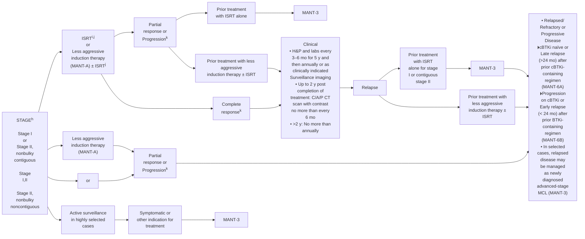

<sup>h</sup> Localized presentation is extremely rare.
<sup>i</sup> Principles of Radiation Therapy (NHODG-D).
<sup>j</sup> Leitch HA, et al. Ann Oncol 2003;14:1555-1561.
<sup>k</sup> Lugano Response Criteria for Non-Hodgkin Lymphoma (NHODG-C).
<sup>l</sup> Follow-up includes diagnostic tests and imaging using the same modalities performed during workup as clinically indicated.

Note: All recommendations are category 2A unless otherwise indicated.

Version 1.2026, 12/22/25 © 2025 National Comprehensive Cancer Network® (NCCN®), All rights reserved. NCCN Guidelines® and this illustration may not be reproduced in any form without the express written permission of NCCN.

MANT-2


---


PLEASE NOTE that use of this NCCN Content is governed by the End-User License Agreement, and you MAY NOT distribute this Content or use it with any artificial intelligence model or tool.
Printed by Arun Manoharan on 1/16/2026 11:45:09 AM. Copyright © 2026 National Comprehensive Cancer Network, Inc. All Rights Reserved.

National Comprehensive Cancer Network®

**NCCN Guidelines Version 1.2026**
**Mantle Cell Lymphoma**

NCCN Guidelines Index
Table of Contents
Discussion

# MANAGEMENT AND FOLLOW-UP<sup>l</sup>

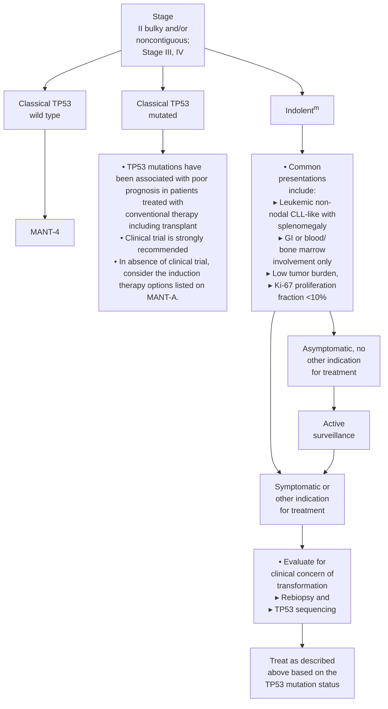

<sup>l</sup>Follow-up includes diagnostic tests and imaging using the same modalities performed during workup as clinically indicated.
<sup>m</sup> Most common biomarker for indolent disease: SOX11- (*IGHV* mutated).

**Note: All recommendations are category 2A unless otherwise indicated.**

Version 1.2026, 12/22/25 © 2025 National Comprehensive Cancer Network® (NCCN®), All rights reserved. NCCN Guidelines® and this illustration may not be reproduced in any form without the express written permission of NCCN.

**MANT-3**


---


PLEASE NOTE that use of this NCCN Content is governed by the End-User License Agreement, and you MAY NOT distribute this Content or use it with any artificial intelligence model or tool.
Printed by Arun Manoharan on 1/16/2026 11:45:09 AM. Copyright © 2026 National Comprehensive Cancer Network, Inc. All Rights Reserved.

National Comprehensive Cancer Network®

NCCN Guidelines Version 1.2026
Mantle Cell Lymphoma

NCCN Guidelines Index
Table of Contents
Discussion

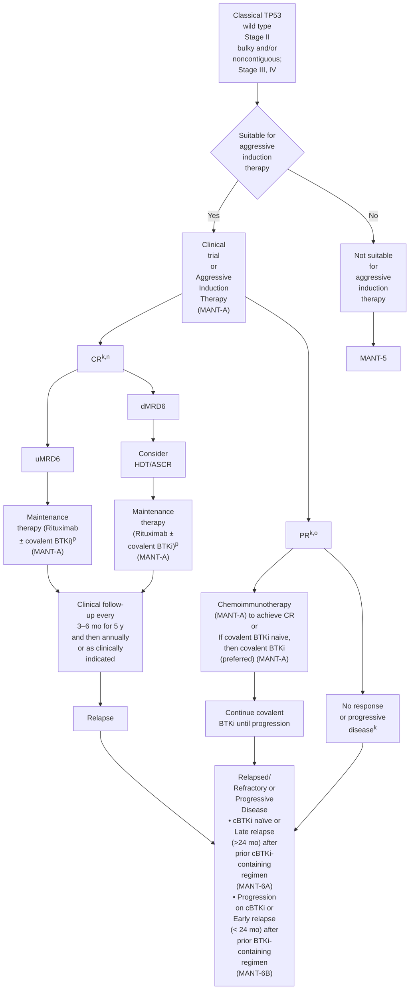

<sup>k</sup> Lugano Response Criteria for Non-Hodgkin Lymphoma (NHODG-C).

<sup>l</sup> Follow-up includes diagnostic tests and imaging using the same modalities performed during workup as clinically indicated.

<sup>n</sup> Determination of measurable residual disease (MRD) using a sensitive assay (with a limit of detection of at least 10<sup>-6</sup> tumor cells) will stratify patients who do not benefit from HDT/SCR. Patients achieving CR with undetectable MRD (uMRD; <10<sup>-6</sup>, uMRD6) should not receive HDT/ASCR.

<sup>o</sup> Patients who have achieved minimal PR with substantial disease should be treated as having refractory or progressive disease. Patients who have achieved a very good PR may be treated with additional therapy to achieve CR with dMRD6 (detectable MRD; >10<sup>-6</sup>) with the goal of proceeding to HDT/ASCR.

<sup>p</sup> Benefit of 2 years of ibrutinib maintenance and 3 years of rituximab maintenance after alternating RCHOP + ibrutinib/RDHAP was shown in the TRIANGLE study (Dreyling M, et al. Lancet 2024;403:2293-2306). The value of ibrutinib maintenance after other aggressive induction therapy regimens has not been established. Alternate covalent BTKi (acalabrutinib and zanubrutinib) were not evaluated in the TRIANGLE study.

**Note: All recommendations are category 2A unless otherwise indicated.**

Version 1.2026, 12/22/25 © 2025 National Comprehensive Cancer Network® (NCCN®), All rights reserved. NCCN Guidelines® and this illustration may not be reproduced in any form without the express written permission of NCCN.

MANT-4


---


PLEASE NOTE that use of this NCCN Content is governed by the End-User License Agreement, and you MAY NOT distribute this Content or use it with any artificial intelligence model or tool.
Printed by Arun Manoharan on 1/16/2026 11:45:09 AM. Copyright © 2026 National Comprehensive Cancer Network, Inc. All Rights Reserved.

National Comprehensive Cancer Network®

**NCCN Guidelines Version 1.2026**
**Mantle Cell Lymphoma**

NCCN Guidelines Index
Table of Contents
Discussion

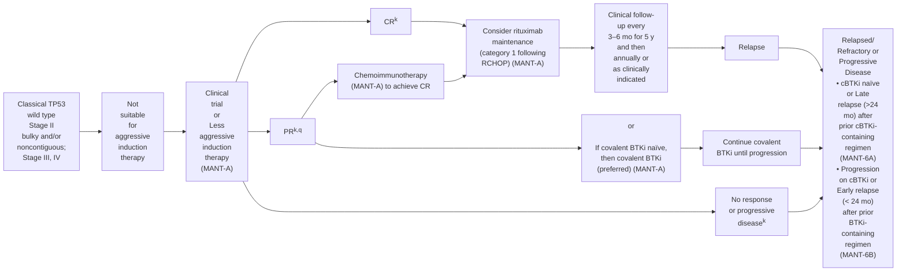

<table>
  <thead>
    <tr>
        <th>**INDUCTION THERAPY**</th>
        <th>**ADDITIONAL THERAPY**</th>
        <th>**FOLLOW-UP&lt;sup&gt;l&lt;/sup&gt;**</th>
        <th>**SECOND-LINE THERAPY**</th>
    </tr>
  </thead>
</table>

<sup>k</sup> Lugano Response Criteria for Non-Hodgkin Lymphoma (NHODG-C).

<sup>l</sup> Follow-up includes diagnostic tests and imaging using the same modalities performed during workup as clinically indicated.

<sup>q</sup> Active surveillance is recommended for patients who have achieved a very good PR or consider rituximab maintenance. Patients who have achieved minimal PR with substantial disease should be treated as having refractory or progressive disease.

**Note: All recommendations are category 2A unless otherwise indicated.**

Version 1.2026, 12/22/25 © 2025 National Comprehensive Cancer Network® (NCCN®), All rights reserved. NCCN Guidelines® and this illustration may not be reproduced in any form without the express written permission of NCCN.

MANT-5


---


PLEASE NOTE that use of this NCCN Content is governed by the End-User License Agreement, and you MAY NOT distribute this Content or use it with any artificial intelligence model or tool.
Printed by Arun Manoharan on 1/16/2026 11:45:09 AM. Copyright © 2026 National Comprehensive Cancer Network, Inc. All Rights Reserved.

National Comprehensive Cancer Network®

**NCCN Guidelines Version 1.2026
Mantle Cell Lymphoma**

NCCN Guidelines Index
Table of Contents
Discussion

# RELAPSED/REFRACTORY OR PROGRESSIVE DISEASE → CONSOLIDATION/ADDITIONAL THERAPY → FOLLOW-UP<sup>l</sup> → RELAPSE #2 OR GREATER

```mermaid
flowchart TD
    A["cBTKi naïve<br/>or<br/>Late relapse<br/>(>24<br/>months)<br/>after prior<br/>cBTKi-<br/>containing<br/>regimen"] --> B["Second-line<br/>therapy<br/>Covalent BTKi-<br/>containing<br/>or<br/>Other continuous<br/>treatment<br/>regimens<br/>[Suggested<br/>Regimens<br/>(MANT-A)]"]
    A --> C["or"]
    C --> D["Fixed-duration<br/>regimens<br/>[Suggested<br/>Regimens<br/>(MANT-A)]<br/>or<br/>ISRT<sup>i</sup>"]
    
    B --> E["Response<sup>k</sup>"]
    E --> F["Continue treatment<br/>until progression"]
    F --> G["Progression"]
    
    B --> H["NR or<br/>progressive<br/>disease<sup>k</sup>"]
    H --> I["CAR T-cell therapy (MANT-A)<br/>or<br/>Non-covalent BTKi (MANT-A)<br/>or<br/>Clinical trial<br/>or<br/>Alternative second-line therapy<br/>(MANT-A) followed by allogeneic<br/>HCT in selected cases if CR or PR<br/>is achieved<sup>s</sup> ± ISRT<sup>i</sup>"]
    
    D --> J["NR or<br/>progressive<br/>disease<sup>k</sup>"]
    J --> K["If covalent BTKi naive, then covalent<br/>BTKi (preferred) (MANT-A)"]
    
    D --> L["PR<sup>k,r</sup>"]
    L --> M["Active surveillance<br/>or<br/>If covalent BTKi naive, then covalent<br/>BTKi (preferred) (MANT-A)<br/>or<br/>CAR T-cell therapy (MANT-A)<br/>or<br/>Non-covalent BTKi (MANT-A)<br/>Allogeneic HCT in selected cases<sup>s</sup><br/>± ISRT<sup>i</sup><br/>or<br/>HDT/ASCR (in selected cases, if<br/>not previously received)<br/>or<br/>Active surveillance"]
    
    D --> N["CR<sup>k</sup>"]
    N --> M
    
    I --> O["Clinical follow-up<br/>every 3–6 mo for 5 y<br/>and then annually or<br/>as clinically indicated"]
    K --> O
    M --> O
    G --> O
    
    O --> P["Relapse or<br/>Progressive<br/>Disease"]
    P --> Q["CAR T-cell therapy<br/>(MANT-A)<br/>or<br/>Bispecific antibody<br/>therapy (MANT-A)<br/>or<br/>Non-covalent BTKi (if not<br/>previously given; MANT-A)<br/>or<br/>Alternative systemic<br/>therapy for relapsed/<br/>refractory disease (not<br/>previously given; MANT-A)<br/>or<br/>Clinical trial<br/>or<br/>Palliative ISRT<sup>i</sup><br/>or<br/>Best supportive care<br/>(NCCN Guidelines for<br/>Palliative Care)"]
```

<sup>i</sup> Principles of Radiation Therapy (NHODG-D)).
<sup>k</sup> Lugano Response Criteria for Non-Hodgkin Lymphoma (NHODG-C)).
<sup>l</sup> Follow-up includes diagnostic tests and imaging using the same modalities performed during workup as clinically indicated.
<sup>r</sup> Patients with a very good PR are potentially candidates for active surveillance. Patients with a minimal PR are considered as having refractory disease and go on to additional treatment.
<sup>s</sup> Selected cases include mobilization failures and persistent bone marrow involvement.

**Note: All recommendations are category 2A unless otherwise indicated.**

Version 1.2026, 12/22/25 © 2025 National Comprehensive Cancer Network® (NCCN®), All rights reserved. NCCN Guidelines® and this illustration may not be reproduced in any form without the express written permission of NCCN.

**MANT-6A**


---


PLEASE NOTE that use of this NCCN Content is governed by the End-User License Agreement, and you MAY NOT distribute this Content or use it with any artificial intelligence model or tool.
Printed by Arun Manoharan on 1/16/2026 11:45:09 AM. Copyright © 2026 National Comprehensive Cancer Network, Inc. All Rights Reserved.

National Comprehensive Cancer Network®

NCCN Guidelines Version 1.2026
Mantle Cell Lymphoma

NCCN Guidelines Index
Table of Contents
Discussion

# RELAPSED/REFRACTORY OR PROGRESSIVE DISEASE → CONSOLIDATION/ADDITIONAL THERAPY → FOLLOW-UP<sup>l</sup> → RELAPSE #2 OR GREATER

```mermaid
flowchart TD
    A["Progression on cBTKi<br/>or<br/>Early relapse<br/>(<24 months)<br/>after prior<br/>cBTKi-<br/>containing<br/>regimen"] --> B["Second-line<br/>therapy<br/>Non-covalent<br/>BTKi<br/>or<br/>Other continuous<br/>treatment<br/>regimens<br/>[Suggested<br/>Regimens<br/>(MANT-A)]"]
    A --> C["CAR T-cell<br/>therapy<br/>or<br/>Fixed-duration<br/>regimens<br/>[Suggested<br/>Regimens<br/>(MANT-A)]<br/>or<br/>ISRT<sup>i</sup>"]
    B --> D["Response<sup>k</sup>"]
    C --> D
    D --> E["NR or<br/>progressive<br/>disease<sup>k</sup>"]
    D --> F["PR<sup>k,r</sup>"]
    D --> G["CR<sup>k</sup>"]
    E --> H["Continue treatment<br/>until progression"]
    H --> I["Progression"]
    E --> J["CAR T-cell therapy (MANT-A)<br/>or<br/>Non-covalent BTKi (if not previously<br/>given) (MANT-A)<br/>or<br/>Bispecific antibody therapy (MANT-A)<br/>or<br/>Clinical trial<br/>or<br/>Alternative second-line therapy not<br/>previously given (MANT-A) followed<br/>by allogeneic HCT in selected cases<br/>if CR or PR is achieved<sup>s</sup> ± ISRT<sup>i</sup>"]
    F --> K["Active surveillance<br/>or<br/>Bispecific antibody therapy<br/>(MANT-A)<br/>or<br/>CAR T-cell therapy (MANT-A)<br/>or<br/>Non-covalent BTKi (MANT-A)<br/>Following fixed duration regimens,<br/>in selected cases, consolidation with<br/>• Allogeneic HCT<sup>s</sup> ± ISRT<sup>i</sup><br/>or<br/>• High-dose therapy/autologous<br/>stem cell rescue (HDT/ASCR) (if<br/>not previously received)<br/>or<br/>Active surveillance"]
    G --> K
    J --> L["Clinical follow-up<br/>every 3–6 mo for 5 y<br/>and then annually or<br/>as clinically indicated"]
    K --> L
    L --> M["Relapse or<br/>Progressive<br/>Disease"]
    M --> N["CAR T-cell therapy<br/>MANT-A)<br/>or<br/>If not previously given:<br/>• Bispecific antibody<br/>therapy (MANT-A)<br/>or<br/>• Non-covalent BTKi<br/>(MANT-A)<br/>or<br/>• Alternative systemic<br/>therapy for relapsed/<br/>refractory disease<br/>(not previously given;<br/>MANT-A)<br/>or<br/>Clinical trial<br/>or<br/>Palliative ISRT<sup>i</sup><br/>or<br/>Best supportive care<br/>(See NCCN Guidelines for<br/>Palliative Care)"]
```

<sup>i</sup> Principles of Radiation Therapy (NHODG-D).
<sup>k</sup> Lugano Response Criteria for Non-Hodgkin Lymphoma (NHODG-C).
<sup>l</sup> Follow-up includes diagnostic tests and imaging using the same modalities performed during workup as clinically indicated.
<sup>r</sup> Patients with a very good PR are potentially candidates for active surveillance. Patients with a minimal PR are considered as having refractory disease and go on to additional treatment.
<sup>s</sup> Selected cases include mobilization failures and persistent bone marrow involvement.

**Note: All recommendations are category 2A unless otherwise indicated.**

Version 1.2026, 12/22/25 © 2025 National Comprehensive Cancer Network® (NCCN®), All rights reserved. NCCN Guidelines® and this illustration may not be reproduced in any form without the express written permission of NCCN.

MANT-6B


---


PLEASE NOTE that use of this NCCN Content is governed by the End-User License Agreement, and you MAY NOT distribute this Content or use it with any artificial intelligence model or tool.
Printed by Arun Manoharan on 1/16/2026 11:45:09 AM. Copyright © 2026 National Comprehensive Cancer Network, Inc. All Rights Reserved.

National Comprehensive Cancer Network®

# NCCN Guidelines Version 1.2026
# Mantle Cell Lymphoma

NCCN Guidelines Index
Table of Contents
Discussion

## SUGGESTED TREATMENT REGIMENS<sup>a,b</sup>

### INDUCTION THERAPY

<table>
  <thead>
    <tr>
        <th>Stage I or Stage II nonbulky (contiguous or noncontiguous)&lt;sup&gt;c&lt;/sup&gt; or Classical TP53 wildtype: Stage II bulky and/or noncontiguous; Stage III, IV</th>
        <th>Classical TP53 wildtype: Stage II bulky and/or noncontiguous; Stage III, IV</th>
        <th>Classical TP53 mutated: Stage II bulky and/or noncontiguous; Stage III, IV</th>
    </tr>
  </thead>
  <tbody>
    <tr>
        <td>Less Aggressive Induction Therapy Preferred • Acalabrutinib&lt;sup&gt;d,e&lt;/sup&gt; (continuous)/ Bendamustine&lt;sup&gt;f&lt;/sup&gt; + Rituximab followed by Rituximab maintenance (2 y) • Acalabrutinib&lt;sup&gt;d,e&lt;/sup&gt; (continuous) + Rituximab • Bendamustine&lt;sup&gt;f&lt;/sup&gt; + Rituximab&lt;sup&gt;g&lt;/sup&gt;  Other recommended • CHOP&lt;sup&gt;h&lt;/sup&gt; + Rituximab followed by Rituximab maintenance • Ibrutinib (continuous) + Rituximab followed by Rituximab maintenance (2 y) • Lenalidomide (continuous) + Rituximab • VR-CAP (Bortezomib/ Cyclophosphamide/Doxorubicin/ Prednisone) + Rituximab</td>
<td>Aggressive Induction Therapy Preferred (in alphabetical order) • Bendamustine&lt;sup&gt;f&lt;/sup&gt; + Rituximab followed by high-dose Cytarabine + Rituximab • LyMA regimen: DHA (Dexamethasone/Cytarabine) + platinum (Carboplatin, Cisplatin, or Oxaliplatin) + Rituximab x 4 cycles followed by CHOP + Rituximab for non-PET CR • NORDIC regimen: Dose-intensified induction immunochemotherapy with maxi-CHOP (Cyclophosphamide/Doxorubicin/Vincristine/Prednisone) + Rituximab alternating with high-dose Cytarabine + Rituximab • TRIANGLE regimen (fixed duration): CHOP/covalent BTKi (Acalabrutinib, Ibrutinib, or Zanubrutinib)&lt;sup&gt;d&lt;/sup&gt; + Rituximab alternating with DHA (Dexamethasone/Cytarabine) + platinum (Carboplatin, Cisplatin, or Oxaliplatin) + Rituximab followed by maintenance with Rituximab + covalent BTKi  Other recommended • RBAC500 (Bendamustine&lt;sup&gt;i&lt;/sup&gt;/Low-dose Cytarabine) + Rituximab</td>
<td>Suitable for all patients • Venetoclax/Zanubrutinib + Obinutuzumab  &lt;ins&gt;Suitable for aggressive induction therapy:&lt;/ins&gt; • TRIANGLE regimen (fixed duration): CHOP/ covalent BTKi (Acalabrutinib, Ibrutinib, or Zanubrutinib)&lt;sup&gt;d&lt;/sup&gt; + Rituximab alternating with DHA (Dexamethasone/Cytarabine) + platinum (Carboplatin, Cisplatin, or Oxaliplatin) + Rituximab followed by maintenance with Rituximab + covalent BTKi  &lt;ins&gt;Not suitable for aggressive induction therapy:&lt;/ins&gt; • Acalabrutinib&lt;sup&gt;d,e&lt;/sup&gt; (continuous) + Rituximab</td>
    </tr>
  </tbody>
</table>

**Consider prophylaxis for tumor lysis syndrome (NHODG-B)**
**See monoclonal antibody and viral reactivation (NHODG-B)**

Footnotes
**Second-line or Subsequent Therapy on MANT-A 2 of 5**

**Note: All recommendations are category 2A unless otherwise indicated.**

Version 1.2026, 12/22/25 © 2025 National Comprehensive Cancer Network® (NCCN®), All rights reserved. NCCN Guidelines® and this illustration may not be reproduced in any form without the express written permission of NCCN.

**MANT-A
1 OF 5**


---


PLEASE NOTE that use of this NCCN Content is governed by the End-User License Agreement, and you MAY NOT distribute this Content or use it with any artificial intelligence model or tool.
Printed by Arun Manoharan on 1/16/2026 11:45:09 AM. Copyright © 2026 National Comprehensive Cancer Network, Inc. All Rights Reserved.

National Comprehensive Cancer Network®

NCCN Guidelines Version 1.2026
Mantle Cell Lymphoma

NCCN Guidelines Index
Table of Contents
Discussion

## SUGGESTED TREATMENT REGIMENS<sup>a,b</sup>

### MAINTENANCE AFTER HDT/ASCR OR AGGRESSIVE INDUCTION THERAPY

• Rituximab every 8 weeks x 3 years ± Covalent BTKi (fixed duration; Acalabrutinib, Ibrutinib, or Zanubrutinib)<sup>d</sup> x 2 years<sup>i</sup>

### MAINTENANCE AFTER LESS AGGRESSIVE INDUCTION THERAPY

• Rituximab every 8 weeks for 2–3 years following CHOP + Rituximab (category 1) or Bendamustine + Rituximab ± Acalabrutinib
• Maintenance Rituximab following VR-CAP has not been evaluated

### SECOND-LINE OR SUBSEQUENT THERAPY

<table>
  <thead>
    <tr>
        <th>Preferred (in alphabetical order)</th>
        <th>Useful in Certain Circumstances (in alphabetical order)</th>
    </tr>
  </thead>
  <tbody>
    <tr>
        <td>• Covalent BTKi (continuous)&lt;sup&gt;d,j&lt;/sup&gt;</td>
<td></td>
    </tr>
<tr>
        <td>▸ Acalabrutinib&lt;sup&gt;e&lt;/sup&gt;</td>
<td></td>
    </tr>
<tr>
        <td>▸ Zanubrutinib</td>
<td></td>
    </tr>
<tr>
        <td>• Lenalidomide (continuous) + Rituximab</td>
<td></td>
    </tr>
<tr>
        <td>Other recommended</td>
<td></td>
    </tr>
<tr>
        <td>• Covalent BTKi (continuous)&lt;sup&gt;d&lt;/sup&gt;</td>
<td></td>
    </tr>
<tr>
        <td>▸ Ibrutinib&lt;sup&gt;k&lt;/sup&gt; ± Rituximab</td>
<td>• Bendamustine&lt;sup&gt;f&lt;/sup&gt; + Rituximab (not recommended if treated with prior Bendamustine)</td>
    </tr>
<tr>
        <td>• Bortezomib ± Rituximab</td>
<td></td>
    </tr>
<tr>
        <td>• DHA (Dexamethasone/Cytarabine) + platinum (Carboplatin, Cisplatin, or Oxaliplatin) + Rituximab (if not previously given)</td>
<td></td>
    </tr>
<tr>
        <td>• GEMOX (Gemcitabine/Oxaliplatin) + Rituximab</td>
<td></td>
    </tr>
<tr>
        <td>• Ibrutinib&lt;sup&gt;d&lt;/sup&gt; (continuous)/Venetoclax</td>
<td></td>
    </tr>
<tr>
        <td>• RBAC500 (not recommended if treated with prior Bendamustine)</td>
<td></td>
    </tr>
<tr>
        <td>• Venetoclax&lt;sup&gt;d&lt;/sup&gt; (continuous) ± Rituximab</td>
<td></td>
    </tr>
<tr>
        <td>• Progressive disease after prior covalent BTKi</td>
<td></td>
    </tr>
<tr>
        <td>▸ Non-covalent BTKi (continuous)</td>
<td></td>
    </tr>
<tr>
        <td>◊ Pirtobrutinib&lt;sup&gt;d,l&lt;/sup&gt;</td>
<td></td>
    </tr>
<tr>
        <td>▸ T-Cell Mediated Therapy&lt;sup&gt;m,n&lt;/sup&gt;</td>
<td></td>
    </tr>
<tr>
        <td>◊ CAR T-cell therapy&lt;sup&gt;o&lt;/sup&gt;</td>
<td></td>
    </tr>
<tr>
        <td>– Brexucabtagene autoleucel (CD19-directed)</td>
<td></td>
    </tr>
<tr>
        <td>– Lisocabtagene maraleucel (CD19-directed)</td>
<td></td>
    </tr>
<tr>
        <td>◊ Bispecific antibody therapy</td>
<td></td>
    </tr>
<tr>
        <td>– Glofitamab-gxbm&lt;sup&gt;d&lt;/sup&gt;</td>
<td></td>
    </tr>
<tr>
        <td>– Mosunetuzumab-axgb + Polatuzumab vedotin-piiq&lt;sup&gt;d&lt;/sup&gt;</td>
<td></td>
    </tr>
  </tbody>
</table>

Consider prophylaxis for tumor lysis syndrome (NHODG-B)
See monoclonal antibody and viral reactivation (NHODG-B)

Note: All recommendations are category 2A unless otherwise indicated.

Footnotes

Version 1.2026, 12/22/25 © 2025 National Comprehensive Cancer Network® (NCCN®), All rights reserved. NCCN Guidelines® and this illustration may not be reproduced in any form without the express written permission of NCCN.

MANT-A
2 OF 5


---


PLEASE NOTE that use of this NCCN Content is governed by the End-User License Agreement, and you MAY NOT distribute this Content or use it with any artificial intelligence model or tool.
Printed by Arun Manoharan on 1/16/2026 11:45:09 AM. Copyright © 2026 National Comprehensive Cancer Network, Inc. All Rights Reserved.

National Comprehensive Cancer Network®

**NCCN Guidelines Version 1.2026
Mantle Cell Lymphoma**

NCCN Guidelines Index
Table of Contents
Discussion

## SUGGESTED TREATMENT REGIMENS FOOTNOTES

<sup>a</sup> See references for regimens MANT-A 4 of 5 and MANT-A 5 of 5.

<sup>b</sup> An FDA-approved biosimilar is an appropriate substitute for any recommended systemic biologic therapy in the NCCN Guidelines. Rituximab and hyaluronidase human injection for subcutaneous use may be substituted for rituximab after patients have received the first full dose of rituximab by intravenous infusion. Obinutuzumab can optionally be substituted for rituximab at the discretion of the treating physician.

<sup>c</sup> In selected cases, relapsed disease may be managed with induction therapy recommended for newly diagnosed advanced stage MCL.

<sup>d</sup> Refer to package insert for full prescribing information, dose modifications, and monitoring for adverse reactions: [https://www.accessdata.fda.gov/scripts/cder/daf/index.cfm](https://www.accessdata.fda.gov/scripts/cder/daf/index.cfm).

<sup>e</sup> Studies of acalabrutinib excluded concomitant use of warfarin or equivalent vitamin K antagonists.

<sup>f</sup> In patients intended to receive HDT/ASCR, bendamustine should be used with caution as there are conflicting data regarding ability to collect peripheral progenitor cell collection. In patients intended to receive HDT/ASCR, CAR T-cell therapy or CD3 x CD20 bispecific antibody therapy, bendamustine should be used with caution. Delay bendamustine until after CAR-T leukapheresis.

<sup>g</sup> Addition of ibrutinib to BR followed by continuous ibrutinib maintenance was shown in the SHINE study to have a superior PFS but overall survival was compromised by excess non-lymphoma deaths (Wang ML, et al. N Engl J Med 2022;386:2482-2494).

<sup>h</sup> There is a randomized trial that demonstrated that RCHOP was not superior to CHOP.

<sup>i</sup> Benefit of 2 years of ibrutinib maintenance after alternating RCHOP + ibrutinib/RDHAP was shown in the TRIANGLE study (Dreyling M, et al. Blood 2022;140:1-3). The value of ibrutinib maintenance after other aggressive induction therapy regimens has not been established. Alternate covalent BTKi (acalabrutinib and zanubrutinib) were not evaluated in the TRIANGLE study.

<sup>j</sup> Acalabrutinib and zanubrutinib have not been shown to be effective for ibrutinib-refractory MCL with *BTK* C481S mutations. Pirtobrutinib is effective for the management of resistance to covalent BTKi, including in patients with *BTK* C481 mutations (which are uncommon in MCL). Patients with intolerance to a BTKi will often be successfully treated with an alternate BTKi (covalent or non-covalent).

<sup>k</sup> Head-to-head clinical trials in other B-cell malignancies have demonstrated a more favorable toxicity profile for acalabrutinib and zanubrutinib compared to ibrutinib without compromising efficacy.

<sup>l</sup> Pirtobrutinib can be given as second-line therapy for disease progression during induction or maintenance therapy with covalent BTKi-based regimens.

<sup>m</sup> In the setting of CD20-negative lymphomas, the efficacy of CD3 x CD20 bispecific antibody therapy is poor. If clinically feasible, repeat biopsy to confirm antigen expression prior to the initiation of T-cell mediated therapy.

<sup>n</sup> Bispecific antibodies are associated with higher incidence of cytokine release syndrome (CRS) in patients with MCL than that reported in patients with DLBCL. NCCN Guidelines for Management of CAR T-Cell and Lymphocyte Engager-Related Toxicities.

<sup>o</sup> In selected circumstances, an alternate CAR T-cell therapy can be used upon disease progression.

Note: All recommendations are category 2A unless otherwise indicated.

**MANT-A
3 OF 5**

Version 1.2026, 12/22/25 © 2025 National Comprehensive Cancer Network® (NCCN®), All rights reserved. NCCN Guidelines® and this illustration may not be reproduced in any form without the express written permission of NCCN.


---


PLEASE NOTE that use of this NCCN Content is governed by the End-User License Agreement, and you MAY NOT distribute this Content or use it with any artificial intelligence model or tool.
Printed by Arun Manoharan on 1/16/2026 11:45:09 AM. Copyright © 2026 National Comprehensive Cancer Network, Inc. All Rights Reserved.

National Comprehensive Cancer Network®

NCCN Guidelines Version 1.2026
Mantle Cell Lymphoma

NCCN Guidelines Index
Table of Contents
Discussion

# SUGGESTED TREATMENT REGIMENS REFERENCES

## Induction Therapy

### Aggressive therapy

**TRIANGLE regimen: Alternating RCHOP + ibrutinib/RDHA (rituximab, cyclophosphamide, doxorubicin, vincristine, prednisone, ibrutinib)/(rituximab, dexamethasone, cytarabine) + platinum (carboplatin, cisplatin, or oxaliplatin)**

Dreyling M, Doorduijn J, Gine E, et al. Ibrutinib combined with immunochemotherapy with or without autologous stem-cell transplantation versus immunochemotherapy and autologous stem-cell transplantation in previously untreated patients with mantle cell lymphoma (TRIANGLE): a three-arm, randomised, open-label, phase 3 superiority trial of the European Mantle Cell Lymphoma Network. Lancet 2024;403:2293-2306.

Dreyling M, Doorduijn JK, Gine E, et al. Role of autologous stem cell transplantation in the context of ibrutinib-containing first-line treatment in younger patients with mantle cell lymphoma: Results from the randomized triangle trial by the European MCL network [abstract]. Blood 2024;144:Abstract 240.

**Nordic trial regimen (Dose-intensified induction immunochemotherapy with rituximab + cyclophosphamide, vincristine, doxorubicin, prednisone [maxi-CHOP] alternating with rituximab + high-dose cytarabine)**

Geisler CH, Kolstad A, Laurell A, et al. Long-term progression-free survival of mantle cell lymphoma following intensive front-line immunochemotherapy with in vivo-purged stem cell rescue: A non-randomized phase-II multicenter study by the Nordic Lymphoma Group. Blood 2008;112:2687-2693.

Eskelund CW, Kolstad A, Jerkeman M, et al. 15-year follow-up of the Second Nordic Mantle Cell Lymphoma trial (MCL2): prolonged remissions without survival plateau. Br J Haematol 2016;175:410-418.

**LyMA regimen: RDHA (rituximab, dexamethasone, cytarabine) + platinum (cisplatin, oxaliplatin or carboplatin) x 4 cycles followed by RCHOP for non- PET CR**

Sarkozy C, Thieblemont C, Oberic L, et al. Long-term follow-up of rituximab maintenance in young patients with mantle-cell lymphoma included in the LYMA trial: A LYSA study. J Clin Oncol 2024;42:769-773.

Tessoulin B, Chiron D, Thieblemont C, et al. Oxaliplatin before autologous transplantation in combination with high-dose cytarabine and rituximab provides longer disease control than cisplatin or carboplatin in patients with mantle-cell lymphoma: results from the LyMA prospective trial. Bone Marrow Transplant 2021;56:1700-1709.

**Rituximab, bendamustine followed by rituximab, high-dose cytarabine**

Merryman R, Edwin N, Redd R, et al. Rituximab/bendamustine and rituximab/cytarabine induction therapy for transplant-eligible mantle cell lymphoma. Blood Adv 2020;45:858-867.

**RBAC500 (rituximab, bendamustine, cytarabine)**

Tisi MC, Moia R, Patti C, et al. Long-term follow-up of rituximab plus bendamustine and cytarabine in older patients with newly diagnosed MCL. Blood Adv 2023;7:3916-3924.

Bega G, Olivieri J, Riva M, et al. Rituximab and Bendamustine (BR) Compared with Rituximab, Bendamustine, and Cytarabine (R-BAC) in Previously Untreated Elderly Patients with Mantle Cell Lymphoma. Cancers (Basel) 2021;13:6089.

### Less aggressive therapy

**Acalabrutinib (continuous) + bendamustine + rituximab**

Wang M, Salek D, Belada D, et al. Acalabrutinib plus bendamustine-rituximab in untreated mantle cell lymphoma. J Clin Oncol 2025;43:2276-2284.

**Acalabrutinib + rituximab**

Jain P, Ok CY, Fetooh A, et al. Alabrutinib with rituximab as first-line therapy for older patients with mantle cell lymphoma—A phase II clinical trial [abstract]. Hematol Oncol 2023;41:150-151.

**Bendamustine + rituximab**

Rummel MJ, Niederle N, Maschmeyer G, et al. Bendamustine plus rituximab versus CHOP plus rituximab as first-line treatment for patients with indolent and mantle-cell lymphomas: an open-label, multicentre, randomised, phase 3 non-inferiority trial. Lancet 2013;381:1203-1210.

Flinn IW, van der Jagt R, Kahl BS, et al. Open-label, randomized, noninferiority study of bendamustine-rituximab or R-CHOP/R-CVP in first-line treatment of advanced indolent NHL or MCL: the BRIGHT study. Blood 2014;123:2944-2952.

**CHOP (cyclophosphamide, doxorubicin, vincristine, prednisone) + rituximab**

Lenz G, Dreyling M, Hoster E, et al. Immunochemotherapy with rituximab and cyclophosphamide, doxorubicin, vincristine, and prednisone significantly improves response and time to treatment failure, but not long-term outcome in patients with previously untreated mantle cell lymphoma: results of a prospective randomized trial of the German Low Grade Lymphoma Study Group (GLSG). J Clin Oncol 2005;23:1984-1992.

Kluin-Nelemans HC, Hoster E, Hermine O, et al. Treatment of older patients with mantle-cell lymphoma. N Eng J Med 2012;367:520-531.

**Ibrutinib + rituximab**

Lewis DJ, Jerkeman M, Sorrell L, et al. Ibrutinib and rituximab versus immunochemotherapy in patients with previously untreated mantle cell lymphoma (ENRICH): A randomised, open-label, phase 2/3 superiority trial. Lancet 2025;406:1953-1968.

**Lenalidomide + rituximab**

Yamshon S, Chen GZ, Gribbin C, et al. Nine-year follow-up of lenalidomide plus rituximab as initial treatment for mantle cell lymphoma. Blood Adv 2023;7:6579–6588.

**VR-CAP (bortezomib, rituximab, cyclophosphamide, doxorubicin, and prednisone)**

Robak T, Jin J, Pylypenko H, et al. Frontline bortezomib, rituximab, cyclophosphamide, doxorubicin, and prednisone (VR-CAP) versus rituximab, cyclophosphamide, doxorubicin, vincristine, and prednisone (R-CHOP) in transplantation-ineligible patients with newly diagnosed mantle cell lymphoma: final overall survival results of a randomised, open-label, phase 3 study. Lancet Oncol 2018;19:1449-1458.

## Induction Therapy for classical TP53 mutated MCL

**Zanubrutinib, obinutuzumab, and venetoclax**

Kumar A, Soumerai J, Abramson JS, et al. Zanubrutinib, obinutuzumab, and venetoclax for first-line treatment of mantle cell lymphoma with a TP53 mutation. Blood 2025;145:497-507.

**Continued**

Note: All recommendations are category 2A unless otherwise indicated.

Version 1.2026, 12/22/25 © 2025 National Comprehensive Cancer Network® (NCCN®), All rights reserved. NCCN Guidelines® and this illustration may not be reproduced in any form without the express written permission of NCCN.

MANT-A
4 OF 5


---


PLEASE NOTE that use of this NCCN Content is governed by the End-User License Agreement, and you MAY NOT distribute this Content or use it with any artificial intelligence model or tool.
Printed by Arun Manoharan on 1/16/2026 11:45:09 AM. Copyright © 2026 National Comprehensive Cancer Network, Inc. All Rights Reserved.

National Comprehensive Cancer Network®

NCCN Guidelines Version 1.2026
Mantle Cell Lymphoma

NCCN Guidelines Index
Table of Contents
Discussion

## SUGGESTED TREATMENT REGIMENS REFERENCES

### First-line Consolidation

**High-dose therapy with autologous stem cell rescue**

Fenske TS, Wang XV, Till BG, et al. Lack of Benefit of Autologous Hematopoietic Cell Transplantation (auto-HCT) in Mantle Cell Lymphoma (MCL) Patients (pts) in First Complete Remission (CR) with Undetectable Minimal Residual Disease (uMRD): Initial Report from the ECOG-ACRIN EA4151 Phase 3 Randomized Trial [abstract]. Blood 2024;144:Abstract LBA–6.

**Maintenance with rituximab ± ibrutinib after HDT/ASCR or aggressive induction therapy**

Dreyling M, Doorduijn J, Gine E, et al. Ibrutinib combined with immunochemotherapy with or without autologous stem-cell transplantation versus immunochemotherapy and autologous stem-cell transplantation in previously untreated patients with mantle cell lymphoma (TRIANGLE): a three-arm, randomised, open-label, phase 3 superiority trial of the European Mantle Cell Lymphoma Network. Lancet 2024;403:2293-2306.

Le Gouill S, Thieblemont C, Oberic L, et al. Rituximab after autologous stem cell transplantation in mantle cell lymphoma. N Engl J Med 2017;377:1250-1260.

**Rituximab maintenance after less aggressive therapy**

Sarkozy C, Thieblemont C, Oberic L, et al. Long-term follow-up of rituximab maintenance in young patients with mantle-cell lymphoma included in the LYMA trial: A LYSA study. J Clin Oncol 2024;42:769-773.

Kluin-Nelemans HC, Hoster E, Hermine O, et al. Treatment of older patients with mantle cell lymphoma (MCL): Long-term follow-up of the randomized European MCL Elderly Trial. J Clin Oncol 2020;38:248-256.

Rummel MJ, Lerchenmüller C, Hensel M, et al. Two years rituximab maintenance vs. observation after first line treatment with bendamustine plus rituximab (B-R) in patients with waldenström's macroglobulinemia (MW): Results of a prospective, randomized, multicenter phase 3 study (the StiL NHL7-2008 MAINTAIN trial) [abstract]. Blood 2019;134:Abstract 343.

### Second-line and Subsequent Therapy

**Acalabrutinib**

Wang M, Rule S, Zinzani PL, et al. Durable response with single-agent acalabrutinib in patients with relapsed or refractory mantle cell lymphoma. Leukemia 2019;33:2762-2766.

**Bendamustine**

Robinson KS, Williams ME, van der Jagt RH, et al. Phase II multicenter study of bendamustine plus rituximab in patients with relapsed indolent B-cell and mantle cell Non-Hodgkin's Lymphoma. J Clin Oncol 2008;26:4473-4479.

Rummel M, Kaiser U, Balser C, et al. Bendamustine plus rituximab versus fludarabine plus rituximab for patients with relapsed indolent and mantle-cell lymphomas: a multicentre, randomised, open-label, non-inferiority phase 3 trial. Lancet Oncol 2016;17:57-66.

**Bortezomib ± rituximab**

Goy A, Bernstein SH, Kahl BS, et al. Bortezomib in patients with relapsed or refractory mantle cell lymphoma: updated time-to-event analyses of the multicenter phase 2 PINNACLE study. Ann Oncol 2009;20:520-525.

Baiocchi RA, Alinari L, Lustberg ME, et al. Phase 2 trial of rituximab and bortezomib in patients with relapsed or refractory mantle cell and follicular lymphoma. Cancer 2011;117:2442-2451.

**DHA (dexamethasone, cytarabine) + platinum (carboplatin, cisplatin, or oxaliplatin) + rituximab**

Mey UJ, Orlopp KS, Flieger D, et al. Dexamethasone, high-dose cytarabine, and cisplatin in combination with rituximab as salvage treatment for patients with relapsed or refractory aggressive non-Hodgkin's lymphoma. Cancer Invest 2006;24:593-600.

Lignon J, Sibon D, Madelaine I, et al. Rituximab, dexamethasone, cytarabine, and oxaliplatin (R-DHAX) is an effective and safe salvage regimen in relapsed/refractory B-cell non-Hodgkin lymphoma. Clin Lymphoma Myeloma Leuk 2010;10:262-269.

Rigacci L, Fabbri A, Puccini B, et al. Oxaliplatin-based chemotherapy (dexamethasone, high-dose cytarabine, and oxaliplatin) +/- rituximab is an effective salvage regimen in patients with relapsed or refractory lymphoma. Cancer 2010;116:4573-4579.

**GemOx (gemcitabine, oxaliplatin) + rituximab**

Obrador-Hevia A, Serra-Sitjar M, Rodríguez J, et al. Efficacy of the GemOx-R regimen leads to the identification of Oxaliplatin as a highly effective drug against Mantle Cell Lymphoma. Br J Haematol 2016;174:899-910.

Rodríguez J, Gutierrez A, Palacios A, et al. Rituximab, gemcitabine and oxaliplatin: an effective regimen in patients with refractory and relapsing mantle cell lymphoma. Leuk Lymphoma 2007;48:2172-2178.

**Ibrutinib ± rituximab**

Wang ML, Blum KA, Martin P, et al. Long-term follow-up of MCL patients treated with single-agent ibrutinib: updated safety and efficacy results. Blood 2015;126:739-745.

Rule S, Jurczak W, Jerkeman M, et al. Ibrutinib versus temsirolimus: 3-year follow-up of patients with previously treated mantle cell lymphoma from the phase 3, international, randomized, open-label RAY study. Leukemia 2018;32:1799-1803.

Wang ML, Lee H, Chuang H, et al. Ibrutinib in combination with rituximab in relapsed or refractory mantle cell lymphoma: a single-centre, open-label, phase 2 trial. Lancet Oncol 2016;7:48-56.

**Ibrutinib + venetoclax**

Wang M, Jurczak W, Trneny M, et al. Ibrutinib plus venetoclax in relapsed or refractory mantle cell lymphoma (SYMPATICO): a multicentre, randomised, double-blind, placebo-controlled, phase 3 study. Lancet Oncol 2025;26:200–213.

**Lenalidomide + rituximab**

Wang M, Fayad L, Wagner-Bartak N, et al. Lenalidomide in combination with rituximab for patients with relapsed or refractory mantle-cell lymphoma: a phase 1/2 clinical trial. Lancet Oncol 2012;13:716-723.

**RBAC500 (rituximab, bendamustine, cytarabine)**

McCulloch R, Lewis D, Crosbie N, et al. Ibrutinib for mantle cell lymphoma at first relapse: a United Kingdom real-world analysis of outcomes in 211 patients. Br J Haematol 2021;193:290-298.

**Venetoclax ± rituximab**

Davids MS, Roberts AW, Kenkre VP, et al. Long-term follow-up of patients with relapsed or refractory non-Hodgkin lymphoma treated with venetoclax in a phase I, first-in-human study. Clin Cancer Res 2021;27:4690-4695.

Davids, M, von Keudell G, Portell G, et al. Revised dose ramp-up to mitigate the risk of tumor lysis syndrome when initiating venetoclax in patients with mantle cell lymphoma. J Clin Oncol 2018;36:3525-3527.

Sawalha Y, Goyal S, Switchenko JM, et al. A multicenter analysis of the outcomes with venetoclax in patients with relapsed mantle cell lymphoma. Blood Adv 2023;7:2983-2993.

**Zanubrutinib**

Song Y, Zhou K, Zou D, et al. Treatment of patients with relapsed or refractory mantle-cell lymphoma with zanubrutinib, a selective inhibitor of Bruton's tyrosine kinase. Clin Cancer Res 2020;26:4216-4224.

Tam CS, Opat S, Simpson D, et al. Zanubrutinib for the treatment of relapsed or refractory mantle cell lymphoma. Blood Adv 2021;5:2577-2585.

**Brexucabtagene autoleucel**

Wang M, Munoz J, Goy A, et al. Three-year follow-up of KTE-X19 in patients with relapsed/refractory mantle cell lymphoma, including high-risk subgroups, in the ZUMA-2 study. J Clin Oncol 2023;41:555-567.

**Lisocabtagene maraleucel**

Wang M, Siddiqi T, Gordon LI, et al. Lisocabtagene maraleucel in relapsed/refractory mantle cell lymphoma: primary analysis of the mantle cell lymphoma cohort from TRANSCEND NHL 001, a phase I multicenter seamless design study. J Clin Oncol 2024;42:1146-1157.

**Pirtobrutinib**

Wang ML, Jurczak W, Zinzani PL, et al. Pirtobrutinib in covalent Bruton tyrosine kinase inhibitor pretreated mantle-cell lymphoma. J Clin Oncol 2023;41:3988-3997.

**Glofitamab**

Phillips T, Carlo-Stella C, Morschhauser F, et al. Glofitamab monotherapy in patients with heavily pretreated relapsed/refractory (R/R) mantle cell lymphoma (MCL): Updated analysis from a phase I/II study [abstract]. J Clin Oncol 2024;42:Abstract 7008.

**Mosunetuzumab + polatuzumab vedotin**

Budde LE, Kamdar M, Assouline S, et al. Fixed-duration outpatient subcutaneous mosunetuzumab + polatuzumab vedotin shows robust efficacy in a phase II study of relapsed/refractory post-BTKi mantle cell lymphoma [abstract]. Hematological Oncology 2025;43:e50_70093.

**Note: All recommendations are category 2A unless otherwise indicated.**

MANT-A
5 OF 5

Version 1.2026, 12/22/25 © 2025 National Comprehensive Cancer Network® (NCCN®), All rights reserved. NCCN Guidelines® and this illustration may not be reproduced in any form without the express written permission of NCCN.


---


PLEASE NOTE that use of this NCCN Content is governed by the End-User License Agreement, and you MAY NOT distribute this Content or use it with any artificial intelligence model or tool.
Printed by Arun Manoharan on 1/16/2026 11:45:09 AM. Copyright © 2026 National Comprehensive Cancer Network, Inc. All Rights Reserved.

National Comprehensive Cancer Network®

# NCCN Guidelines Version 1.2026
# Diffuse Large B-Cell Lymphoma

NCCN Guidelines Index
Table of Contents
Discussion

## ADDITIONAL DIAGNOSTIC TESTING<sup>a,b</sup>

### ESSENTIAL:
* **Adequate immunophenotyping to establish diagnosis and germinal center B-cell (GCB) versus non-GCB origin<sup>c</sup>**
  * IHC panel: CD3, CD20, CD10, CD21, BCL2, BCL6, IRF4/MUM1, MYC **with or without**
  * Flow cytometry with peripheral blood and/or biopsy specimen: kappa/lambda, CD3, CD5, CD19, CD10, CD20, CD45,
* **FISH for** *MYC***; FISH for** *BCL2***,** *BCL6* **rearrangements if** *MYC* **positive**

### USEFUL UNDER CERTAIN CIRCUMSTANCES:
* **Additional IHC studies to establish lymphoma subtype**
  * IHC panel: cyclin D1, kappa/lambda, CD5, CD30, CD45, CD138, anaplastic lymphoma kinase (ALK), human herpesvirus-8 (HHV8), SOX11, Ki-67
* **Epstein-Barr virus (EBV)-encoded RNA (EBER) in situ hybridization (EBER-ISH)**
* **FISH for** *IRF4/MUM1* **rearrangements<sup>d</sup>**
* **MGPT with lymphoma panel<sup>b</sup>**

## SUBTYPES

* **DLBCL, not otherwise specified (DLBCL-NOS)<sup>e</sup> (includes germinal center [GC] and non-GC)**
* **FL3B (ICC)/FLBCL (WHO5)**
* **Intravascular LBCL**
* **DLBCL associated with chronic inflammation** → Workup **(BCEL-2)**
* **Fibrin-associated LBCL**
* **EBV-positive DLBCL, NOS**
* **T-cell/histiocyte-rich LBCL**
* **LBCL with** *IRF4/MUM1* **rearrangement**
* **HGBL with** *MYC* **and** *BCL6* **rearrangements (ICC)**
* **Primary cutaneous DLBCL, leg type** → **BCEL-10**
* **ALK-positive LBCL** → **BCEL-B 1 of 2**
* **Mediastinal gray zone lymphoma (MGZL)** → **BCEL-B 2 of 2**
* **Primary mediastinal large B-cell lymphoma (PMBL)** → **PMBL-1**
* **HGBL** → **HGBL-1**
* **HGBL, NOS**
* **LBCL with 11q aberration [ICC]/HGBL with 11q aberrations [WHO5]** → **BURK-1**
* **DLBCL arising from FL or MZL** → **HTBCEL-1**
* **Primary DLBCL of the CNS (See NCCN Guidelines for CNS)**
* **DLBCL arising from CLL (Richter transformation) (See NCCN Guidelines for CLL/SLL)**

<sup>a</sup> Special Considerations for Adolescent and Young Adult (AYA) Patients with B-Cell Lymphomas (NHODG-B 4 of 5). Patients with B-Cell Lymphomas (NHODG-B 4 of 5).)
<sup>b</sup> See BCEL-A 1 of 3 for a minimal list of accepted genes that should be included in the MGPT lymphoma panel for DLBCL.
<sup>c</sup> Typical immunophenotype: CD20+, CD45+, CD3-; additional markers are used for subclassification.
<sup>d</sup> LBCL with *IRF4/MUM1* rearrangement are usually DLBCL but occasionally are purely FL grade 3b (ICC/FLBCL [WHO5]) and often DLBCL with FL grade 3b. Patients typically present with Waldeyer's ring involvement and are often children/young adults. These lymphomas are locally aggressive but respond well to chemotherapy ± RT. They do not have a *BCL2* rearrangement and should not be treated as low-grade FL.
<sup>e</sup> GC (or follicle center) phenotype is not equivalent to FL and can occur in DLBCL and BL. Morphology is required to establish diagnosis.

**Note: All recommendations are category 2A unless otherwise indicated.**

Version 1.2026, 12/22/25 © 2025 National Comprehensive Cancer Network® (NCCN®), All rights reserved. NCCN Guidelines® and this illustration may not be reproduced in any form without the express written permission of NCCN. **BCEL-1**


---


PLEASE NOTE that use of this NCCN Content is governed by the End-User License Agreement, and you MAY NOT distribute this Content or use it with any artificial intelligence model or tool.
Printed by Arun Manoharan on 1/16/2026 11:45:09 AM. Copyright © 2026 National Comprehensive Cancer Network, Inc. All Rights Reserved.

National Comprehensive Cancer Network®

**NCCN Guidelines Version 1.2026**
**Diffuse Large B-Cell Lymphoma**

NCCN Guidelines Index
Table of Contents
Discussion

## WORKUP

**ESSENTIAL:**
* **Physical exam: attention to node-bearing areas, including Waldeyer's ring, and to size of liver and spleen**
* **Performance status**
* **B symptoms**
* **CBC with differential**
* **LDH**
* **Comprehensive metabolic panel**
* **Uric acid**
* **PET/CT scan (preferred) or C/A/P CT with contrast of diagnostic quality**
* **Calculation of International Prognostic Index (IPI) (BCEL-A 2 of 3)**
* **Hepatitis B testing<sup>f</sup>**
* **Echocardiogram or MUGA scan if anthracycline or anthracenedione-based regimen is indicated**
* **Pregnancy testing in patients of childbearing age (if therapy planned)**

**USEFUL IN SELECTED CASES:**
* **Head CT/MRI with contrast or neck CT/MRI with contrast**
* **HIV testing**
* **Hepatitis C testing**
* **Beta-2-microglobulin**
* **Lumbar puncture for patients at risk for CNS involvement; see BCEL-A 3 of 3**
* **Adequate bone marrow biopsy (>1.6 cm) ± aspirate; bone marrow biopsy is not necessary if PET/CT scan demonstrates bone disease. Bone marrow biopsy with a negative PET/CT scan may reveal discordant lymphoma**
* **Discuss fertility preservation<sup>g</sup>**

→ **First-LIne Therapy (BCEL-3)**

----

<sup>f</sup> Hepatitis B testing is indicated because of the risk of reactivation with immunotherapy + chemotherapy. Tests include HBsAg and core antibody for a patient with no risk factors. For patients with risk factors or previous history of hepatitis B, add e-antigen (NHODG-B). If positive, check viral load and consider consult with gastroenterologist.

<sup>g</sup> Fertility preservation options include: sperm banking, IVF, or ovarian tissue or oocyte cryopreservation.

**Note: All recommendations are category 2A unless otherwise indicated.**

Version 1.2026, 12/22/25 © 2025 National Comprehensive Cancer Network® (NCCN®), All rights reserved. NCCN Guidelines® and this illustration may not be reproduced in any form without the express written permission of NCCN.

**BCEL-2**


---


PLEASE NOTE that use of this NCCN Content is governed by the End-User License Agreement, and you MAY NOT distribute this Content or use it with any artificial intelligence model or tool.
Printed by Arun Manoharan on 1/16/2026 11:45:09 AM. Copyright © 2026 National Comprehensive Cancer Network, Inc. All Rights Reserved.

National Comprehensive Cancer Network®

# NCCN Guidelines Version 1.2026
# Diffuse Large B-Cell Lymphoma

NCCN Guidelines Index
Table of Contents
Discussion

## STAGE | FIRST-LINE THERAPY<sup>p</sup>

```mermaid
flowchart TD
    A["Stage I, II<br/>(excluding stage<br/>II with extensive<br/>mesenteric<br/>disease<sup>h</sup>)<sup>i,j,k,l</sup>"] --> B["Nonbulky<br/>(<7.5 cm)<sup>l</sup>"]
    A --> C["Bulky<br/>(≥7.5 cm)<sup>l</sup>"]
    B --> D["smIPI 0–1"]
    B --> E["smIPI >1"]
    C --> F["smIPI 0–1"]
    D --> G["RCHOP x 3 cycles"]
    E --> H["Follow pathway below for Stage<br/>II with extensive mesenteric<br/>disease or Stage III, IV"]
    F --> I["RCHOP x 3–4 cycles"]
    G --> J["Interim restaging with<br/>PET/CT"]
    I --> K["Interim restaging with<br/>PET/CT<sup>o</sup>"]
    J --> L["BCEL-4"]
    K --> M["BCEL-5"]
```

```mermaid
flowchart LR
    A["Stage II with extensive<br/>mesenteric disease<sup>h</sup><br/>or<br/>Stage III, IV<sup>i,k,m,n,o</sup>"] --> B["First-line therapy<br/>See Suggested<br/>Regimens (BCEL-C)"]
    B --> C["Interim restaging with PET/<br/>CT<sup>q</sup> or CT after 2–4 cycles"]
    C --> D["BCEL-6"]
```

<sup>h</sup> Includes multifocal disease and bulky disease that is not amenable to RT.

<sup>i</sup> In testicular lymphoma, after completion of chemoimmunotherapy, scrotal RT should be given. See Principles of Radiation Therapy (NHODG-D)).

<sup>j</sup> In patients who are not candidates for chemoimmunotherapy, ISRT is recommended.

<sup>k</sup> See BCEL-C for regimens used in patients with poor left ventricular function, patients who are very frail, and patients >80 years of age with comorbidities. There are limited data for treatment of early-stage disease with these regimens; however, short-course chemoimmunotherapy + RT for stage I–II disease is practiced at NCCN Member Institutions.

<sup>l</sup> Some studies have used 10 cm as the cutoff for bulky disease.

<sup>m</sup> Prognostic Model to Assess the Risk of CNS Disease (BCEL-A 3 of 3)).

<sup>n</sup> Patients with systemic disease with concurrent CNS disease; see BCEL-C.

<sup>o</sup> In selected cases, RT to initially bulky sites of disease may be beneficial (category 2B).

<sup>p</sup> Recommendations are for HIV-negative lymphoma only. For HIV-positive DLBCL, see HIVLYM-2.

<sup>q</sup> PET/CT scan at interim restaging can lead to increased false positives and should be carefully considered in select cases. If PET/CT scan performed and positive, rebiopsy before changing course of treatment. In selected cases, PET is necessary when disease is occult on CT scan (eg, bone only disease).

**Note: All recommendations are category 2A unless otherwise indicated.**

Version 1.2026, 12/22/25 © 2025 National Comprehensive Cancer Network® (NCCN®), All rights reserved. NCCN Guidelines® and this illustration may not be reproduced in any form without the express written permission of NCCN.

BCEL-3


---


PLEASE NOTE that use of this NCCN Content is governed by the End-User License Agreement, and you MAY NOT distribute this Content or use it with any artificial intelligence model or tool.
Printed by Arun Manoharan on 1/16/2026 11:45:09 AM. Copyright © 2026 National Comprehensive Cancer Network, Inc. All Rights Reserved.

National Comprehensive Cancer Network®

# NCCN Guidelines Version 1.2026
# Diffuse Large B-Cell Lymphoma

NCCN Guidelines Index
Table of Contents
Discussion

## STAGE I (smIPI 0–1; Non-bulky; <7.5 cm)

```mermaid
flowchart LR
    A["Restage with<br/>PET/CT after<br/>3 cycles of<br/>RCHOP<sup>k</sup>"] --> B["Complete<br/>response<sup>r</sup><br/>(PET negative<br/>[5-PS 1–3])<sup>s</sup>"]
    A --> C["Partial<br/>response<sup>r</sup><br/>(PET positive<br/>[5-PS 4])<sup>s</sup>"]
    A --> D["No<br/>response or<br/>Progressive<br/>disease<sup>r</sup><br/>(PET positive<br/>[5-PS 5])<sup>s</sup>"]
    
    B --> E["RCHOP x 1 cycle<br/>(total of 4 cycles)<sup>k</sup><br/>or<br/>ISRT<sup>i,t</sup>"]
    
    C --> F["Repeat<br/>biopsy<sup>u</sup>"]
    F --> G["RCHOP x 1–3<br/>cycles (total of<br/>4–6 cycles)<sup>k</sup> ±<br/>ISRT<sup>i,t</sup><br/>or<br/>ISRT<sup>i,t</sup>"]
    
    D --> H["Repeat biopsy<sup>u</sup>"]
    
    E --> I["END-OF-<br/>TREATMENT<br/>RESPONSE"]
    G --> J["End-of-<br/>treatment<br/>restaging<br/>with PET/<br/>CT<sup>u,v</sup>"]
    
    I --> K["Complete<br/>response<sup>r</sup><br/>(PET<br/>negative [5-<br/>PS 1–3])<sup>s</sup>"]
    J --> K
    J --> L["PR<sup>r</sup> or<br/>Progressive<br/>disease (PET<br/>positive [5-PS<br/>4 or 5])<sup>s</sup>"]
    
    K --> M["FOLLOW-UP<br/><br/>Clinical<br/>• H&P and labs, every<br/>3–6 mo for 5 y and<br/>then annually or as<br/>clinically indicated<br/>Imaging<sup>w</sup><br/>• C/A/P CT scan<br/>with contrast no<br/>more often than<br/>every 6 mo for 2 y<br/>after completion of<br/>treatment, then only<br/>as clinically indicated"]
    
    L --> N["Repeat biopsy<sup>u,v</sup>"]
    H --> O["BCEL-7"]
    N --> O
    
    M --> P["Relapse<br/><12 mo"]
    M --> Q["Relapse<br/>>12 mo"]
    P --> R["BCEL-7"]
    Q --> S["BCEL-8"]
```

<sup>i</sup> In testicular lymphoma, after completion of chemoimmunotherapy, scrotal RT should be given. See Principles of Radiation Therapy (NHODG-D)).

<sup>k</sup> See BCEL-C for regimens used in patients with poor left ventricular function, patients who are very frail, and patients >80 years of age with comorbidities. There are limited data for treatment of early-stage disease with these regimens; however, short-course chemoimmunotherapy + RT for stage I–II disease is practiced at NCCN Member Institutions.

<sup>r</sup> Lugano Response Criteria for Non-Hodgkin Lymphoma (NHODG-C)).

<sup>s</sup> PET/CT scan should be interpreted via the PET 5-PS (NHODG-C 3 of 3).

<sup>t</sup> Principles of Radiation Therapy (NHODG-D)).

<sup>u</sup> Repeat biopsy should be strongly considered if PET-positive prior to additional therapy. If biopsy negative, follow PET-negative pathway. In cases where biopsy cannot be done or is unsafe, clinical judgment should be used.

<sup>v</sup> The optimum timing of end-of-treatment PET/CT is unknown; however, waiting a minimum of 8 weeks after RT to repeat PET/CT scan is suggested. False positives may occur due to post-treatment changes. If end-of treatment PET is positive, consider repeat biopsy or if biopsy not feasible, consider circulating tumor DNA (ctDNA) for MRD (ctDNA-MRD) assessment (category 2B), using a test with a detection limit of <1 part per million, prior to additional therapy. If biopsy and/or ctDNA-MRD–negative, follow PET-negative pathway.

<sup>w</sup> Surveillance imaging at 12 mo has treatment implications. Surveillance imaging is used for monitoring asymptomatic patients. When a site of disease can only be visualized on PET/CT scan (eg, bone), it is appropriate to proceed with PET/CT scans for surveillance.

**Note: All recommendations are category 2A unless otherwise indicated.**

Version 1.2026, 12/22/25 © 2025 National Comprehensive Cancer Network® (NCCN®), All rights reserved. NCCN Guidelines® and this illustration may not be reproduced in any form without the express written permission of NCCN.

BCEL-4


---


PLEASE NOTE that use of this NCCN Content is governed by the End-User License Agreement, and you MAY NOT distribute this Content or use it with any artificial intelligence model or tool.
Printed by Arun Manoharan on 1/16/2026 11:45:09 AM. Copyright © 2026 National Comprehensive Cancer Network, Inc. All Rights Reserved.

National Comprehensive Cancer Network®

NCCN Guidelines Version 1.2026
Diffuse Large B-Cell Lymphoma

NCCN Guidelines Index
Table of Contents
Discussion

## STAGE I–II (smIPI 0–1; BULKY; ≥7.5 CM) (EXCLUDING STAGE II WITH EXTENSIVE MESENTERIC DISEASE<sup>h</sup>) RESTAGING AND ADDITIONAL THERAPY

### FOLLOW-UP

```mermaid
flowchart TD
    A[Restage with<br/>PET/CT after<br/>3-4 cycles of<br/>RCHOP<sup>k</sup>] --> B[Complete<br/>response<sup>r,x</sup><br/>PET negative<br/>[5-PS 1-3]<sup>s</sup>]
    A --> C[Partial<br/>response<sup>r</sup><br/>PET positive<br/>[5-PS 4]<sup>s</sup>]
    A --> D[No response or<br/>Progressive disease<sup>r</sup><br/>PET positive<br/>[5-PS 5]<sup>s</sup>]
    
    B --> E[RCHOP x 2-3 cycles total of<br/>6 cycles<sup>k</sup> ± ISRT<sup>i,t</sup>]
    
    C --> F[Repeat<br/>biopsy<sup>u</sup>]
    F --> G[RCHOP x 2-3<br/>cycles total<br/>of 6 cycles<sup>k</sup> ±<br/>ISRT<sup>i,t</sup>]
    
    G --> H[End-of-<br/>treatment<br/>restaging<br/>with PET/<br/>CT<sup>u,v</sup>]
    
    H --> I[Complete<br/>response<sup>r,x</sup><br/>PET<br/>negative<br/>[5-PS 1-3]<sup>s</sup>]
    H --> J[PR<sup>r</sup> or<br/>Progressive<br/>disease PET<br/>positive<br/>[5-PS 4 or 5]<sup>s</sup>]
    
    D --> K[Repeat<br/>biopsy<sup>u</sup>]
    
    I --> L[Clinical<br/>• H&P and labs, every<br/>3-6 mo for 5 y and<br/>then annually or as<br/>clinically indicated<br/>Imaging<sup>w</sup><br/>• C/A/P CT scan with<br/>contrast no more<br/>often than every 6<br/>mo for<br/>2 y after completion<br/>of treatment, then<br/>only as clinically<br/>indicated]
    
    L --> M[Relapse<br/><12 mo]
    L --> N[Relapse<br/>>12 mo]
    
    M --> O[BCEL-7]
    N --> P[BCEL-8]
    
    J --> Q[Repeat<br/>biopsy<sup>u,v</sup>]
    Q --> R[BCEL-7]
    K --> R
```

**Clinical**
• **H&P and labs, every 3–6 mo for 5 y and then annually or as clinically indicated**
• **Imaging<sup>w</sup>**
• **C/A/P CT scan with contrast no more often than every 6 mo for 2 y after completion of treatment, then only as clinically indicated**

<sup>h</sup> Includes multifocal disease and bulky disease that is not amenable to RT.

<sup>i</sup> In testicular lymphoma, after completion of chemoimmunotherapy, scrotal RT should be given. See Principles of Radiation Therapy (NHODG-D).

<sup>k</sup> See BCEL-C for regimens used in patients with poor left ventricular function, patients who are very frail, and patients >80 years of age with comorbidities. There are limited data for treatment of early-stage disease with these regimens; however, short-course chemoimmunotherapy + RT for stage I–II disease is practiced at NCCN Member Institutions.

<sup>r</sup> Lugano Response Criteria for Non-Hodgkin Lymphoma (NHODG-C).

<sup>s</sup> PET/CT scan should be interpreted via the PET 5-PS (NHODG-C 3 of 3).

<sup>t</sup> Principles of Radiation Therapy (NHODG-D).

<sup>u</sup> Repeat biopsy should be strongly considered if PET-positive prior to additional therapy. If biopsy negative, follow PET-negative pathway. In cases where biopsy cannot be done or is unsafe, clinical judgment should be used.

<sup>v</sup> The optimum timing of end-of-treatment PET/CT is unknown; however, waiting a minimum of 8 weeks after RT to repeat PET/CT scan is suggested. False positives may occur due to post-treatment changes. If end-of treatment PET is positive, consider repeat biopsy or if biopsy not feasible, consider ctDNA-MRD assessment (category 2B), using a test with a detection limit of <1 part per million, prior to additional therapy. If biopsy and/or ctDNA-MRD–negative, follow PET-negative pathway.

<sup>w</sup> Surveillance imaging at 12 mo has treatment implications. Surveillance imaging is used for monitoring asymptomatic patients. When a site of disease can only be visualized on PET/CT scan (eg, bone), it is appropriate to proceed with PET/CT scans for surveillance.

<sup>x</sup> Patients in first remission may be candidates for consolidation trials including HDT/ ASCR.

**Note: All recommendations are category 2A unless otherwise indicated.**

Version 1.2026, 12/22/25 © 2025 National Comprehensive Cancer Network® (NCCN®), All rights reserved. NCCN Guidelines® and this illustration may not be reproduced in any form without the express written permission of NCCN.

BCEL-5


---


PLEASE NOTE that use of this NCCN Content is governed by the End-User License Agreement, and you MAY NOT distribute this Content or use it with any artificial intelligence model or tool.
Printed by Arun Manoharan on 1/16/2026 11:45:09 AM. Copyright © 2026 National Comprehensive Cancer Network, Inc. All Rights Reserved.

National Comprehensive Cancer Network®

NCCN Guidelines Version 1.2026
Diffuse Large B-Cell Lymphoma

NCCN Guidelines Index
Table of Contents
Discussion

# STAGE I–II WITH EXTENSIVE MESENTERIC DISEASE<sup>h</sup> OR STAGE III–IV DISEASE RESTAGING AND ADDITIONAL THERAPY

```mermaid
flowchart LR
    A[Restage with PET/CT or CT after 2-4 cycles of first-line therapy<sup>y,z</sup>] --> B{Complete response<sup>r</sup> PET negative 5-PS 1-3<sup>s</sup> or partial response<sup>r</sup> PET positive 5-PS 4<sup>aa</sup>/5<sup>s</sup>}
    A --> C{No response<sup>r</sup> or progressive disease<sup>r</sup>}
    B --> D[Continue first-line therapy<sup>y</sup> to a total of 6 cycles category 1]
    C --> E[Repeat biopsy<sup>u</sup>]
    D --> F[At end of treatment, repeat all positive studies<sup>u,aa</sup>]
    F --> G{Complete response<sup>r</sup> PET negative 5-PS 1-3<sup>s</sup>}
    F --> H{Partial response<sup>r</sup> PET positive 5-PS 4<sup>bb</sup>/5<sup>s</sup>}
    F --> I[Progressive disease<sup>r</sup>]
    G --> J[Active surveillance or Consider ISRT<sup>t</sup> to initially bulky disease or isolated skeletal sites]
    H --> K[Repeat biopsy<sup>u,aa</sup>]
    I --> L[Repeat biopsy<sup>u,aa</sup>]
    J --> M[Clinical • H&P and labs, every 3-6 mo for 5 y and then annually or as clinically indicated Imaging<sup>w</sup> • C/A/P CT scan with contrast no more often than every 6 mo for 2 y after completion of treatment, then only as clinically indicated]
    M --> N{Relapse <12 mo}
    M --> O{Relapse >12 mo}
    N --> P[BCEL-7]
    O --> Q[BCEL-8]
    K --> R[BCEL-7]
    L --> S[BCEL-7]
    E --> T[BCEL-7]
```

## FOLLOW-UP THERAPY

Continue first-line therapy<sup>y</sup> to a total of 6 cycles (category 1)

## END-OF-TREATMENT RESTAGING

At end of treatment, repeat all positive studies<sup>u,aa</sup>

## END-OF-TREATMENT RESPONSE

* Complete response<sup>r</sup> (PET negative [5-PS 1–3])<sup>s</sup>
* Partial response<sup>r</sup> (PET positive [5-PS 4<sup>bb</sup>/5])<sup>s</sup>
* Progressive disease<sup>r</sup>

## FOLLOW-UP

**Clinical**
* H&P and labs, every 3–6 mo for 5 y and then annually or as clinically indicated
* Imaging<sup>w</sup>
* C/A/P CT scan with contrast no more often than every 6 mo for 2 y after completion of treatment, then only as clinically indicated

----

<sup>h</sup> Includes multifocal disease and bulky disease that is not amenable to RT.

<sup>r</sup> Lugano Response Criteria for Non-Hodgkin Lymphoma (NHODG-C).

<sup>s</sup> PET/CT scan should be interpreted via the PET 5-PS (NHODG-C 3 of 3).

<sup>t</sup> Principles of Radiation Therapy (NHODG-D).

<sup>u</sup> Repeat biopsy should be strongly considered if PET-positive prior to additional therapy. If biopsy negative, follow PET-negative pathway. In cases where biopsy cannot be done or is unsafe, clinical judgment should be used.

<sup>w</sup> Surveillance imaging at 12 mo has treatment implications. Surveillance imaging is used for monitoring asymptomatic patients. When a site of disease can only be visualized on PET/CT scan (eg, bone), it is appropriate to proceed with PET/CT scans for surveillance.

<sup>y</sup> See BCEL-C for regimens used in patients with poor left ventricular function, patients who are very frail, and patients >80 years of age with comorbidities.

<sup>z</sup> In selected cases, PET is necessary when disease is occult on CT scan (eg, bone only disease). PET/CT scan at interim restaging can lead to increased false positives and should be carefully considered in select cases. If PET/CT scan performed and positive, rebiopsy before changing course of treatment.

<sup>aa</sup> If end-of treatment PET is positive, consider repeat biopsy or if biopsy not feasible, consider ctDNA-MRD assessment (category 2B), using a test with a detection limit of <1 part per million, prior to additional therapy. If biopsy and/or ctDNA-MRD–negative, follow PET-negative pathway.

<sup>bb</sup> In cases where PET/CT needs to be used, a 5-PS = 4 response can reflect post-treatment inflammation as well as active disease. If there is uncertainty regarding interpretation of the response, consider brief interval restaging to clarify post-treatment inflammation response.

**Note: All recommendations are category 2A unless otherwise indicated.**

Version 1.2026, 12/22/25 © 2025 National Comprehensive Cancer Network® (NCCN®), All rights reserved. NCCN Guidelines® and this illustration may not be reproduced in any form without the express written permission of NCCN.

BCEL-6


---


PLEASE NOTE that use of this NCCN Content is governed by the End-User License Agreement, and you MAY NOT distribute this Content or use it with any artificial intelligence model or tool.
Printed by Arun Manoharan on 1/16/2026 11:45:09 AM. Copyright © 2026 National Comprehensive Cancer Network, Inc. All Rights Reserved.

National Comprehensive Cancer Network®

**NCCN Guidelines Version 1.2026**
**Diffuse Large B-Cell Lymphoma**

NCCN Guidelines Index
Table of Contents
Discussion

## RELAPSE/REFRACTORY DISEASE | ADDITIONAL THERAPY | RESPONSE ASSESSMENT

```mermaid
flowchart TD
    A["Relapsed disease <12 mo<br/>or<br/>Primary refractory disease<sup>cc</sup>"] --> B["Candidates<br/>for CAR<br/>T-cell therapy"]
    A --> C["Non-<br/>candidates<br/>for CAR T-cell<br/>therapy<sup>ff</sup>"]
    
    B --> D["Clinical trial<br/>or<br/>CAR T-cell therapy with pre/<br/>postpheresis therapy (BCEL-C 2 of<br/>7) as clinically indicated<sup>dd</sup>"]
    D --> E["Follow-up<br/>(BCEL-9)"]
    
    C --> F["Clinical trial<br/>or<br/>Second-line therapy; see<br/>Suggested Regimens (BCEL-C<br/>2 of 7)<br/>or<br/>Palliative ISRT<sup>t</sup><br/>or<br/>Best supportive care (See<br/>NCCN Guidelines for Palliative<br/>Care)"]
    
    F --> G["Complete<br/>response<sup>r</sup>"]
    F --> H["Partial<br/>response<sup>r,ee</sup>"]
    F --> I["No response or<br/>progressive disease<sup>r</sup>"]
    
    G --> J["Follow-up (BCEL-9)"]
    H --> K["Relapse #2 or<br/>Greater (BCEL-9)"]
    I --> K
```

----

<sup>r</sup> Lugano Response Criteria for Non-Hodgkin Lymphoma (NHODG-C)).

<sup>t</sup> Principles of Radiation Therapy (NHODG-D)).

<sup>cc</sup> Management of localized refractory disease is uncertain. RT ± chemoimmunotherapy followed by HDT/ASCR may be an option for some patients.

<sup>dd</sup> When using holding therapy (prepheresis), potential complications of the holding therapy regimen on the collection of T-cells should be considered. Delay bendamustine until after CAR-T leukapheresis. If holding or bridging (postpheresis) therapy results in CR or very good PR, proceeding with HDT/ASCR is an appropriate alternative.

<sup>ee</sup> Repeat biopsy should be strongly considered if PET-positive prior to additional therapy, because PET positivity may represent post-treatment inflammation. If biopsy negative, follow CR pathway.

<sup>ff</sup> In patients who do not have access to CAR T-cell therapy or bispecific antibodies, optional consolidation with HDT/ASCR can be considered if CR is achieved after 2L therapy regimens (BCEL-C 3 of 7 - Intention to Proceed to Transplant). Additional RT can be given before or after transplant to sites of previous positive disease.

**Note: All recommendations are category 2A unless otherwise indicated.**

Version 1.2026, 12/22/25 © 2025 National Comprehensive Cancer Network® (NCCN®), All rights reserved. NCCN Guidelines® and this illustration may not be reproduced in any form without the express written permission of NCCN.

**BCEL-7**


---


PLEASE NOTE that use of this NCCN Content is governed by the End-User License Agreement, and you MAY NOT distribute this Content or use it with any artificial intelligence model or tool.
Printed by Arun Manoharan on 1/16/2026 11:45:09 AM. Copyright © 2026 National Comprehensive Cancer Network, Inc. All Rights Reserved.

National Comprehensive Cancer Network®

**NCCN Guidelines Version 1.2026**
**Diffuse Large B-Cell Lymphoma**

NCCN Guidelines Index
Table of Contents
Discussion

# RELAPSE/REFRACTORY DISEASE

```mermaid
flowchart TD
    A[Relapsed disease >12 mo] --> B{Intention to proceed to transplant}
    B -->|Yes| C[Second-line therapy: see Suggested Regimens<br/>BCEL-C 3 of 7]
    B -->|No| D[Clinical trial<br/>or<br/>Second-line therapy: see Suggested Regimens<br/>BCEL-C 3 of 7<br/>or<br/>Palliative ISRT<sup>t</sup><br/>or<br/>Best supportive care<br/>See NCCN Guidelines for Palliative Care]
    
    C --> E{Response Assessment}
    D --> F{Response Assessment}
    
    E -->|Complete response<sup>r</sup>| G[HDT/ASCR category 1 ± ISRT<sup>t,hh</sup><br/>or<br/>Clinical trial<br/>or<br/>Allogeneic HCT in selected cases<sup>ii</sup> ± ISRT<sup>t,hh</sup>]
    E -->|Partial response<sup>r,gg</sup>| H[CAR T-cell therapy BCEL-C 2 of 7<br/>or<br/>HDT/ASCR ± ISRT<sup>t,hh</sup><br/>or<br/>Clinical trial<br/>or<br/>Allogeneic HCT in selected cases<sup>ii</sup> ± ISRT<sup>t,hh</sup>]
    E -->|No response or progressive disease<sup>r</sup>| I[Treatment for Relapse #2 or Greater<br/>BCEL-9]
    
    F -->|Complete response<sup>r</sup>| J[Follow-up BCEL-9]
    F -->|Partial response<sup>r,jj</sup>| K[Treatment for Relapse #2 or Greater<br/>BCEL-9]
    F -->|No response or progressive disease<sup>r</sup>| L[Treatment for Relapse #2 or Greater<br/>BCEL-9]
    
    G --> M[Follow-up BCEL-9]
    H --> M
```

## Footnotes

<sup>r</sup> Lugano Response Criteria for Non-Hodgkin Lymphoma (NHODG-C)).

<sup>t</sup> Principles of Radiation Therapy (NHODG-D)).

<sup>gg</sup> Some NCCN Member Institutions require a complete metabolic response in order to proceed to HDT/ASCR.

<sup>hh</sup> Additional RT can be given before or after transplant to sites of previous positive disease.

<sup>ii</sup> Selected cases include mobilization failures and persistent bone marrow involvement.

<sup>jj</sup> Repeat biopsy should be strongly considered if PET-positive prior to additional therapy, because PET positivity may represent post-treatment inflammation. If biopsy negative, follow CR pathway.

**Note: All recommendations are category 2A unless otherwise indicated.**

Version 1.2026, 12/22/25 © 2025 National Comprehensive Cancer Network® (NCCN®), All rights reserved. NCCN Guidelines® and this illustration may not be reproduced in any form without the express written permission of NCCN.

**BCEL-8**


---


PLEASE NOTE that use of this NCCN Content is governed by the End-User License Agreement, and you MAY NOT distribute this Content or use it with any artificial intelligence model or tool.
Printed by Arun Manoharan on 1/16/2026 11:45:09 AM. Copyright © 2026 National Comprehensive Cancer Network, Inc. All Rights Reserved.

National Comprehensive Cancer Network®

**NCCN Guidelines Version 1.2026
Diffuse Large B-Cell Lymphoma**

NCCN Guidelines Index
Table of Contents
Discussion

## FOLLOW-UP

Follow-up after treatment for relapsed/refractory disease → • **Clinical**
  ▸**H&P and labs, every 3–6 mo for 5 y and then annually or as clinically indicated**
• **Imaging<sup>w</sup>**
  ▸**C/A/P CT scan with contrast no more often than every 6 mo for 2 y after completion of treatment, then only as clinically indicated** → **Partial response<sup>r,kk</sup> or Relapse** → 

## TREATMENT FOR RELAPSE #2 OR GREATER

**Third-line therapy (BCEL-C 4 of 7)
or
Alternative systemic therapy for relapsed/refractory disease (not previously given)<sup>ll</sup> (BCEL-C 2 of 7 and BCEL-C 3 of 7)
or
Clinical trial
or
Palliative ISRT<sup>t</sup>
or
Best supportive care<sup>mm</sup>
(See NCCN Guidelines for Palliative Care)** → **If CR/PR, consider allogeneic HCT in selected cases<sup>ii,nn</sup> ± ISRT<sup>t,hh</sup>**

----

<sup>r</sup> Lugano Response Criteria for Non-Hodgkin Lymphoma (NHODG-C)).
<sup>t</sup> Principles of Radiation Therapy (NHODG-D)).
<sup>w</sup> Surveillance imaging is used for monitoring asymptomatic patients. When a site of disease can only be visualized on PET/CT scan (eg, bone), it is appropriate to proceed with PET/CT scans for surveillance.
<sup>hh</sup> Additional RT can be given before or after transplant to sites of previous positive disease.
<sup>ii</sup> Selected cases include mobilization failures and persistent bone marrow involvement.
<sup>kk</sup> Repeat biopsy should be strongly considered if PET-positive prior to additional therapy, because PET positivity may represent post-treatment inflammation.
<sup>ll</sup> Patients who progress after three successive regimens are unlikely to derive additional benefit from currently utilized combination chemotherapy regimens, except for patients with a long disease-free interval.
<sup>mm</sup> If not a candidate for T-cell mediated therapy or clinical trial.
<sup>nn</sup> Patients achieving high-quality CR/PR following alternative second-line therapy may benefit from an allogeneic HCT.

**Note: All recommendations are category 2A unless otherwise indicated.**

Version 1.2026, 12/22/25 © 2025 National Comprehensive Cancer Network® (NCCN®), All rights reserved. NCCN Guidelines® and this illustration may not be reproduced in any form without the express written permission of NCCN.

**BCEL-9**


---


PLEASE NOTE that use of this NCCN Content is governed by the End-User License Agreement, and you MAY NOT distribute this Content or use it with any artificial intelligence model or tool.
Printed by Arun Manoharan on 1/16/2026 11:45:09 AM. Copyright © 2026 National Comprehensive Cancer Network, Inc. All Rights Reserved.

National Comprehensive Cancer Network®

NCCN Guidelines Version 1.2026
Diffuse Large B-Cell Lymphoma

NCCN Guidelines Index
Table of Contents
Discussion

# PRIMARY CUTANEOUS DIFFUSE LARGE B-CELL LYMPHOMA, LEG TYPE<sup>oo</sup>

```mermaid
flowchart LR
    A["Solitary regional, T1–2<br/>(Ann Arbor Stage IE)"] --> B["Pola-R-CHPtt + local<br/>ISRTt<br/>or<br/>Local ISRTt,uu<br/>or<br/>Clinical trial"]
    B --> C["CRvv"]
    B --> D["PR or NR or<br/>Progressive disease"]
    C --> E["Clinical<br/>• H&P and labs, every 3–6 mo<br/>for 5 y and then annually or<br/>as clinically indicated<br/>Imaging<br/>• C/A/P CT scan with contrast<br/>no more often than every<br/>6 mo for 2 y after completion<br/>of treatment, then only as<br/>clinically indicated"]
    E --> F["Relapsevv"]
    F --> G["Pola-R-CHPtt (if not<br/>previously received)<br/>or<br/>Manage as relapsed/<br/>refractory DLBCL<br/>• <12 mo (BCEL-7)<br/>• >12 mo (BCEL-8)<br/>or<br/>ISRT to previously<br/>unirradiated tumort"]
    D --> G
    
    H["Generalized disease<br/>(skin only), T3"] --> I["Pola-R-CHPtt ± local<br/>ISRTt<br/>or<br/>Clinical trial"]
    I --> J["CRvv"]
    I --> K["PR or NR or<br/>Progressive disease"]
    J --> L["Clinical<br/>• H&P and labs, every 3–6 mo<br/>for 5 y and then annually or<br/>as clinically indicated<br/>Imaging<br/>• C/A/P CT scan with contrast<br/>no more often than every<br/>6 mo for 2 y after completion<br/>of treatment, then only as<br/>clinically indicated"]
    L --> M["Relapsevv"]
    M --> N["Manage as relapsed/<br/>refractory DLBCL<br/>• <12 mo (BCEL-7)<br/>• >12 mo (BCEL-8)<br/>or"]
    K --> O["Palliative ISRTt"]
    
    P["Extracutaneous<br/>disease"] --> Q["Manage as DLBCL<br/>(BCEL-3)"]
    Q --> R["PR or NR or<br/>Progressive disease"]
    R --> O
```

<table>
  <thead>
    <tr>
        <th>STAGE&lt;sup&gt;pp&lt;/sup&gt;</th>
        <th>INITIAL THERAPY&lt;sup&gt;qq,rr,ss&lt;/sup&gt;</th>
        <th>Clinical</th>
        <th>SECOND-LINE THERAPY&lt;sup&gt;rr&lt;/sup&gt;</th>
    </tr>
  </thead>
  <tbody>
    <tr>
        <td>Solitary regional, T1–2&lt;br/&gt;(Ann Arbor Stage IE)</td>
<td>Pola-R-CHPtt + local&lt;br/&gt;ISRTt&lt;br/&gt;or&lt;br/&gt;Local ISRTt,uu&lt;br/&gt;or&lt;br/&gt;Clinical trial</td>
<td>CRvv → Clinical&lt;br/&gt;• H&amp;P and labs, every 3–6 mo&lt;br/&gt;for 5 y and then annually or&lt;br/&gt;as clinically indicated&lt;br/&gt;Imaging&lt;br/&gt;• C/A/P CT scan with contrast&lt;br/&gt;no more often than every&lt;br/&gt;6 mo for 2 y after completion&lt;br/&gt;of treatment, then only as&lt;br/&gt;clinically indicated → Relapsevv</td>
<td>Pola-R-CHPtt (if not&lt;br/&gt;previously received)&lt;br/&gt;or&lt;br/&gt;Manage as relapsed/&lt;br/&gt;refractory DLBCL&lt;br/&gt;• &lt;12 mo (BCEL-7)&lt;br/&gt;• &gt;12 mo (BCEL-8)&lt;br/&gt;or&lt;br/&gt;ISRT to previously&lt;br/&gt;unirradiated tumort</td>
    </tr>
<tr>
        <td></td>
<td></td>
<td>PR or NR or&lt;br/&gt;Progressive disease →</td>
<td></td>
    </tr>
<tr>
        <td>Generalized disease&lt;br/&gt;(skin only), T3</td>
<td>Pola-R-CHPtt ± local&lt;br/&gt;ISRTt&lt;br/&gt;or&lt;br/&gt;Clinical trial</td>
<td>CRvv → Clinical&lt;br/&gt;• H&amp;P and labs, every 3–6 mo&lt;br/&gt;for 5 y and then annually or&lt;br/&gt;as clinically indicated&lt;br/&gt;Imaging&lt;br/&gt;• C/A/P CT scan with contrast&lt;br/&gt;no more often than every&lt;br/&gt;6 mo for 2 y after completion&lt;br/&gt;of treatment, then only as&lt;br/&gt;clinically indicated → Relapsevv</td>
<td>Manage as relapsed/&lt;br/&gt;refractory DLBCL&lt;br/&gt;• &lt;12 mo (BCEL-7)&lt;br/&gt;• &gt;12 mo (BCEL-8)&lt;br/&gt;or</td>
    </tr>
<tr>
        <td></td>
<td></td>
<td>PR or NR or&lt;br/&gt;Progressive disease →</td>
<td></td>
    </tr>
<tr>
        <td>Extracutaneous&lt;br/&gt;disease</td>
<td>Manage as DLBCL&lt;br/&gt;(BCEL-3)</td>
<td>PR or NR or&lt;br/&gt;Progressive disease →</td>
<td>Palliative ISRTt</td>
    </tr>
  </tbody>
</table>

<sup>t</sup> Principles of Radiation Therapy (NHODG-D).

<sup>oo</sup> Expert hematopathologist review is essential to confirm the diagnosis of primary cutaneous DLBCL, leg type.

<sup>pp</sup> For TNM Classification of Cutaneous Lymphoma other than MF/SS, see NCCN Guidelines for Cutaneous Lymphoma.

<sup>qq</sup> Consider prophylaxis for tumor lysis syndrome (NHODG-B) and see monoclonal antibody and viral reactivation (NHODG-B).

<sup>rr</sup> An FDA-approved biosimilar is an appropriate substitute for any recommended systemic biologic therapy in the NCCN Guidelines. Rituximab and hyaluronidase human injection for subcutaneous use may be substituted for rituximab after patients have received the first full dose of rituximab by intravenous infusion.

<sup>ss</sup> These patients are at higher risk for CNS involvement (BCEL-A 3 of 3); consider CNS prophylaxis according to institutional standards.

<sup>tt</sup> For patients who cannot tolerate anthracyclines, see BCEL-C for regimens for patients with poor left ventricular function.

<sup>uu</sup> For patients not able to tolerate chemoimmunotherapy.

<sup>vv</sup> PET/CT (strongly preferred) or C/A/P CT with contrast at the end of treatment to assess response. It can be repeated if there is clinical suspicion of progressive disease.

Note: All recommendations are category 2A unless otherwise indicated.

Version 1.2026, 12/22/25 © 2025 National Comprehensive Cancer Network® (NCCN®), All rights reserved. NCCN Guidelines® and this illustration may not be reproduced in any form without the express written permission of NCCN.

BCEL-10


---


PLEASE NOTE that use of this NCCN Content is governed by the End-User License Agreement, and you MAY NOT distribute this Content or use it with any artificial intelligence model or tool.
Printed by Arun Manoharan on 1/16/2026 11:45:09 AM. Copyright © 2026 National Comprehensive Cancer Network, Inc. All Rights Reserved.

National Comprehensive Cancer Network®

**NCCN Guidelines Version 1.2026**
**Diffuse Large B-Cell Lymphoma**

NCCN Guidelines Index
Table of Contents
Discussion

## CLINICAL UTILITY OF GENOMIC ALTERATIONS IN DLBCL<sup>a</sup>

<table>
  <tbody>
    <tr>
        <td>GENE</td>
<td>CLINICAL ASSOCIATION</td>
    </tr>
<tr>
        <td>ACTB, BCL2,&lt;sup&gt;b&lt;/sup&gt; BCL6, CARD11, CD79B, CREBBP, EZH2, KMT2D, MYC,&lt;sup&gt;c&lt;/sup&gt; MYD88, MEF2B, SOCS1</td>
<td>Diagnostic significance</td>
    </tr>
<tr>
        <td>BTK, CARD11, CD79B, MYD88</td>
<td>Associated with non-GCB DLBCL</td>
    </tr>
<tr>
        <td>NOTCH2</td>
<td>BN2 molecular subclassification</td>
    </tr>
<tr>
        <td>EZH2, SMARCB1</td>
<td>Treatment significance (EZH2 inhibitors)</td>
    </tr>
<tr>
        <td>PLCG2</td>
<td>Richter transformation; DLBCL arising from BTKi treated CLL/SLL</td>
    </tr>
<tr>
        <td>TP53&lt;sup&gt;c&lt;/sup&gt;</td>
<td>Mutations are frequent in DLBCL associated with chronic inflammation; TP53 mutations in conjunction with MYC rearrangement are associated with worse prognosis</td>
    </tr>
<tr>
        <td>ID3, TCF3, SMARCA4, CCND3</td>
<td>Mutations are more frequent in BL</td>
    </tr>
<tr>
        <td>B2M, CREBBP, EZH2, MYD88 L265P, SOCS1, TNFRSF14</td>
<td>Mutations favor other aggressive B-cell lymphoma subtypes other than BL</td>
    </tr>
<tr>
        <td>KMT2D, TP53</td>
<td>Mutations are more frequent in dark zone gene expression signature + LBCL with MYC and BCL2 or BCL6 rearrangements (double-hit lymphomas)</td>
    </tr>
<tr>
        <td>JAK/STAT, MAPK/ERK, NOTCH1 or NOTCH2</td>
<td>Mutations are frequent in plasmablastic lymphoma</td>
    </tr>
<tr>
        <td>MYD88, CD79B, PDL1, PDL2</td>
<td>Mutations are frequent in intravascular LBCL, primary cutaneous DLBCL, leg type, primary LBCL of immune-privileged sites</td>
    </tr>
<tr>
        <td>IL4R, ITPKB, NFKBIE, SOCS1, STAT6, XPO1</td>
<td>Mutations are characteristic of PMBL</td>
    </tr>
<tr>
        <td>CD79B, CREBBP, KMT2D, MYD88, PIM1</td>
<td>Often mutated in DLBCL, NOS, but not altered in PMBL</td>
    </tr>
<tr>
        <td>ATM, BIRC3, NSD2, UBR5</td>
<td>Mutations support the diagnosis of MCL</td>
    </tr>
  </tbody>
</table>

<sup>a</sup> This table provides a minimal list of accepted genes that should be included in the MGPT lymphoma panel for DLBCL.
<sup>b</sup> BCL2 mutations imply the presence of IGH::BCL2, thereby favoring entities other than BL.
<sup>c</sup> Blastoid MCL may harbor secondary MYC rearrangement or TP53 mutations.

**Note: All recommendations are category 2A unless otherwise indicated.**

Version 1.2026, 12/22/25 © 2025 National Comprehensive Cancer Network® (NCCN®), All rights reserved. NCCN Guidelines® and this illustration may not be reproduced in any form without the express written permission of NCCN.

**BCEL-A**
**1 OF 3**


---


PLEASE NOTE that use of this NCCN Content is governed by the End-User License Agreement, and you MAY NOT distribute this Content or use it with any artificial intelligence model or tool.
Printed by Arun Manoharan on 1/16/2026 11:45:09 AM. Copyright © 2026 National Comprehensive Cancer Network, Inc. All Rights Reserved.

National Comprehensive Cancer Network®

NCCN Guidelines Version 1.2026
Diffuse Large B-Cell Lymphoma

NCCN Guidelines Index
Table of Contents
Discussion

## INTERNATIONAL PROGNOSTIC INDEX<sup>a</sup>

<table>
  <thead>
    <tr>
        <th>ALL PATIENTS:</th>
        <th>INTERNATIONAL INDEX, ALL PATIENTS:</th>
        <th></th>
    </tr>
  </thead>
  <tbody>
    <tr>
        <td>• Age &gt;60 years</td>
<td>• Low</td>
<td>0 or 1</td>
    </tr>
<tr>
        <td>• Serum LDH &gt; normal</td>
<td>• Low-intermediate</td>
<td>2</td>
    </tr>
<tr>
        <td>• Performance status 2–4</td>
<td>• High-intermediate</td>
<td>3</td>
    </tr>
<tr>
        <td>• Stage III or IV</td>
<td>• High</td>
<td>4 or 5</td>
    </tr>
<tr>
        <td>• Extranodal involvement &gt;1 site</td>
        <td colspan="2"></td>
    </tr>
  </tbody>
</table>

## AGE-ADJUSTED INTERNATIONAL PROGNOSTIC INDEX<sup>a</sup>

<table>
  <thead>
    <tr>
        <th>PATIENTS ≤60 YEARS:</th>
        <th>INTERNATIONAL INDEX, PATIENTS ≤60 YEARS:</th>
        <th></th>
    </tr>
  </thead>
  <tbody>
    <tr>
        <td>• Stage III or IV</td>
<td>• Low</td>
<td>0</td>
    </tr>
<tr>
        <td>• Serum LDH &gt; normal</td>
<td>• Low-intermediate</td>
<td>1</td>
    </tr>
<tr>
        <td>• Performance status 2–4</td>
<td>• High-intermediate</td>
<td>2</td>
    </tr>
<tr>
        <td></td>
<td>• High</td>
<td>3</td>
    </tr>
  </tbody>
</table>

## STAGE-MODIFIED INTERNATIONAL PROGNOSTIC INDEX (smIPI)<sup>b</sup>

<table>
  <thead>
    <tr>
        <th>STAGE I OR II PATIENTS:</th>
        <th>INTERNATIONAL INDEX, STAGE I OR II PATIENTS:</th>
        <th></th>
    </tr>
  </thead>
  <tbody>
    <tr>
        <td>• Age &gt;60 years</td>
<td>• Low</td>
<td>0 or 1</td>
    </tr>
<tr>
        <td>• Serum LDH &gt; normal</td>
<td>• High</td>
<td>2–4</td>
    </tr>
<tr>
        <td>• Performance status 2–4</td>
<td></td>
<td></td>
    </tr>
<tr>
        <td>• Stage II or IIE</td>
        <td colspan="2"></td>
    </tr>
  </tbody>
</table>

## NCCN-IPI<sup>c</sup>

<table>
  <thead>
    <tr>
        <th colspan="2">RISK GROUP</th>
        <th colspan="2"></th>
    </tr>
  </thead>
  <tbody>
    <tr>
        <td>Age, years</td>
<td></td>
<td></td>
<td></td>
    </tr>
<tr>
        <td>&gt;40 to ≤60</td>
<td>1</td>
<td>• Low</td>
<td>0–1</td>
    </tr>
<tr>
        <td>&gt;60 to &lt;75</td>
<td>2</td>
<td>• Low-intermediate</td>
<td>2–3</td>
    </tr>
<tr>
        <td>≥75</td>
<td>3</td>
<td>• High-intermediate</td>
<td>4–5</td>
    </tr>
<tr>
        <td>LDH, normalized</td>
<td></td>
<td>• High</td>
<td>≥6</td>
    </tr>
<tr>
        <td>&gt;1 to ≤3</td>
<td>1</td>
<td></td>
<td></td>
    </tr>
<tr>
        <td>&gt;3</td>
<td>2</td>
<td></td>
<td></td>
    </tr>
<tr>
        <td>Ann Arbor stage III–IV</td>
<td>1</td>
<td></td>
<td></td>
    </tr>
<tr>
        <td>Extranodal disease*</td>
<td>1</td>
<td>*Disease in bone marrow, CNS, liver/GI tract, or lung.</td>
<td></td>
    </tr>
<tr>
        <td>Performance status ≥2</td>
<td>1</td>
        <td colspan="2"></td>
    </tr>
  </tbody>
</table>

<sup>a</sup> The International Non-Hodgkin's Lymphoma Prognostic Factors Project. A predictive model for aggressive non-Hodgkin's lymphoma. N Engl J Med 1993;329:987-994.

<sup>b</sup> Miller TP, Dahlberg S, Cassady JR. Chemotherapy alone compared with chemotherapy plus radiotherapy for localized intermediate- and high-grade non-Hodgkin's lymphoma. N Engl J Med 1998;339:21-26.

<sup>c</sup> This research was originally published in *Blood*. Zhou Z, Sehn LH, Rademaker AW, et al. An enhanced International Prognostic Index (NCCN-IPI) for patients with diffuse large B-cell lymphoma treated in the rituximab era. Blood 2014;123:837-842. © The American Society of Hematology

**Note: All recommendations are category 2A unless otherwise indicated.**

**Back to Workup (BCEL-2)**

Version 1.2026, 12/22/25 © 2025 National Comprehensive Cancer Network® (NCCN®), All rights reserved. NCCN Guidelines® and this illustration may not be reproduced in any form without the express written permission of NCCN.

BCEL-A
2 OF 3


---


PLEASE NOTE that use of this NCCN Content is governed by the End-User License Agreement, and you MAY NOT distribute this Content or use it with any artificial intelligence model or tool.
Printed by Arun Manoharan on 1/16/2026 11:45:09 AM. Copyright © 2026 National Comprehensive Cancer Network, Inc. All Rights Reserved.

National Comprehensive Cancer Network®

# NCCN Guidelines Version 1.2026
# Diffuse Large B-Cell Lymphoma

NCCN Guidelines Index
Table of Contents
Discussion

## PROGNOSTIC MODEL TO ASSESS THE RISK OF CNS DISEASE<sup>d</sup>

<table>
  <thead>
    <tr>
        <th>RISK FACTORS</th>
        <th>RISK GROUPS</th>
    </tr>
  </thead>
  <tbody>
    <tr>
        <td>• Age &gt;60 years</td>
<td></td>
    </tr>
<tr>
        <td>• Serum LDH &gt; normal</td>
<td></td>
    </tr>
<tr>
        <td>• Performance status &gt;1</td>
<td></td>
    </tr>
<tr>
        <td>• Stage III or IV</td>
<td></td>
    </tr>
<tr>
        <td>• Extranodal involvement &gt;1 site</td>
<td></td>
    </tr>
<tr>
        <td>• Kidney or adrenal gland involvement</td>
<td>• Low risk              0–1</td>
    </tr>
<tr>
        <td>• Intermediate-risk     2–3</td>
<td></td>
    </tr>
<tr>
        <td>• High-risk             4–6 or kidney or adrenal gland involvement</td>
<td></td>
    </tr>
  </tbody>
</table>

• **Additional indications for CNS prophylaxis independent of CNS risk score**
  * Testicular lymphoma
  * Primary cutaneous DLBCL, leg type
  * Stage IE DLBCL of the breast
  * Kidney or adrenal gland involvement

• **Role of CNS prophylaxis remains controversial but can be considered in patients with high-risk factors based on the aforementioned criteria. If CNS prophylaxis is used, options include:**
  * Systemic high-dose methotrexate (3–3.5 g/m² for 2–4 cycles) during or after the course of treatment<sup>e</sup> and/or
  * IT methotrexate and/or cytarabine (4–8 doses) during or after the course of treatment

<sup>d</sup> Schmitz N, Zeynalova S, Nickelsen M, et al. CNS International Prognostic Index: A risk model for CNS relapse in patients with diffuse large B-cell lymphoma treated with R-CHOP. J Clin Oncol 2016;34:3150-3156.

<sup>e</sup> Wilson M, Eyre T, Kirkwood A, et al. Timing of high-dose methotrexate CNS prophylaxis in DLBCL: A multicenter international analysis of 1384 patients. Blood 2022;139:2499–2511.

**Back to Workup (BCEL-2)**

**Note: All recommendations are category 2A unless otherwise indicated.**

**BCEL-A
3 OF 3**

Version 1.2026, 12/22/25 © 2025 National Comprehensive Cancer Network® (NCCN®), All rights reserved. NCCN Guidelines® and this illustration may not be reproduced in any form without the express written permission of NCCN.


---


PLEASE NOTE that use of this NCCN Content is governed by the End-User License Agreement, and you MAY NOT distribute this Content or use it with any artificial intelligence model or tool.
Printed by Arun Manoharan on 1/16/2026 11:45:09 AM. Copyright © 2026 National Comprehensive Cancer Network, Inc. All Rights Reserved.

National Comprehensive Cancer Network®

NCCN Guidelines Version 1.2026
Diffuse Large B-Cell Lymphoma

NCCN Guidelines Index
Table of Contents
Discussion

## ALK-POSITIVE LARGE B-CELL LYMPHOMAS (ALK+ LBCL)<sup>a</sup>

<table>
  <tbody>
    <tr>
        <td>Definition</td>
<td>• ALK-positive LBCL is a mature aggressive B-cell lymphoma characterized by large cells with plasmablastic differentiation and cytoplasmic expression of ALK, and lacking CD20 expression.</td>
    </tr>
<tr>
        <td>• Cytoplasmic ALK expression helps differentiate this entity from other aggressive CD20-negative LBCL with plasmacytic differentiation such as plasmablastic lymphoma, primary effusion lymphoma (PEL), and HHV8-positive DLBCL.</td>
<td></td>
    </tr>
<tr>
        <td>• EBV and HHV8 are negative in ALK-positive LBCL, and there is no association with immune deficiency.</td>
<td></td>
    </tr>
<tr>
        <td>• Cytogenetic/FISH analysis most commonly demonstrates the t(2;17)(p23;q23), denoting the CLTC (clathrin heavy chain):ALK fusion.</td>
<td></td>
    </tr>
<tr>
        <td>Clinical presentation</td>
<td>• The median age at diagnosis is approximately 40 years and there is a strong male predominance.</td>
    </tr>
<tr>
        <td>• Most patients present with rapidly progressive disease at advanced stage, and both nodal and extranodal involvement are common.</td>
<td></td>
    </tr>
<tr>
        <td>Treatment</td>
<td>Initial therapy</td>
    </tr>
<tr>
        <td>• Clinical trial is recommended, if available</td>
<td></td>
    </tr>
<tr>
        <td>• Consolidative ISRT is preferred for localized disease&lt;sup&gt;b&lt;/sup&gt;</td>
<td></td>
    </tr>
<tr>
        <td>• These are most often CD20 negative and rituximab is not necessary.</td>
<td></td>
    </tr>
<tr>
        <td>• While the optimal systemic treatment approach is not established, the following induction regimens have been used:</td>
<td></td>
    </tr>
<tr>
        <td>⏵ DA-EPOCH</td>
<td></td>
    </tr>
<tr>
        <td>⏵ CHOEP</td>
<td></td>
    </tr>
<tr>
        <td>⏵ CHOP may be associated with a suboptimal outcome. CHOP can be considered for patients with early-stage disease receiving combined modality therapy.</td>
<td></td>
    </tr>
<tr>
        <td>⏵ Mini-CHOP may be considered for patients who are frail or older</td>
<td></td>
    </tr>
<tr>
        <td>⏵ Potentially toxic regimens; performance status and comorbidities should be considered:</td>
<td></td>
    </tr>
<tr>
        <td>◊ HyperCVAD</td>
<td></td>
    </tr>
<tr>
        <td>◊ CODOX-M alternating with IVAC</td>
<td>Relapsed/refractory disease</td>
    </tr>
<tr>
        <td>• Clinical trial is recommended, if available</td>
<td></td>
    </tr>
<tr>
        <td>• Second-line platinum-based chemotherapy (without rituximab) followed by HDT/ASCR for chemosensitive disease should be considered in transplant-eligible patients.</td>
<td></td>
    </tr>
<tr>
        <td>• Responses have been observed to next-generation ALK inhibitors such as alectinib and lorlatinib, which should be favored over the first-generation inhibitor crizotinib. Patients with CR to a next-generation ALK inhibitor should be considered for allogeneic HCT.</td>
<td></td>
    </tr>
<tr>
        <td>• If CD19-positive, consider CD19-directed CAR T-cell therapy:</td>
<td></td>
    </tr>
<tr>
        <td>⏵ Axicabtagene ciloleucel</td>
<td></td>
    </tr>
<tr>
        <td>⏵ Lisocabtagene maraleucel</td>
<td></td>
    </tr>
<tr>
        <td>⏵ Tisagenlecleucel</td>
<td></td>
    </tr>
  </tbody>
</table>

<sup>a</sup> Castillo JJ, et al. Leuk Lymphoma 2021;62:2845-2853; WHO Classification of Tumours Editorial Board. Haematolymphoid tumours. (WHO classification of tumours series, 5th ed; vol 11). Lyon (France): International Agency for Research on Cancer; 2024; Campo E, et al. Blood 2022;140:1229-1253; Soumerai JD, et al. N Blood 2022;140:1822-1826.

<sup>b</sup> Principles of Radiation Therapy (NHODG-D)).

Note: All recommendations are category 2A unless otherwise indicated.

Version 1.2026, 12/22/25 © 2025 National Comprehensive Cancer Network® (NCCN®), All rights reserved. NCCN Guidelines® and this illustration may not be reproduced in any form without the express written permission of NCCN.

BCEL-B
1 OF 2


---


PLEASE NOTE that use of this NCCN Content is governed by the End-User License Agreement, and you MAY NOT distribute this Content or use it with any artificial intelligence model or tool.
Printed by Arun Manoharan on 1/16/2026 11:45:09 AM. Copyright © 2026 National Comprehensive Cancer Network, Inc. All Rights Reserved.

National Comprehensive Cancer Network®

**NCCN Guidelines Version 1.2026**
**Diffuse Large B-Cell Lymphoma**

NCCN Guidelines Index
Table of Contents
Discussion

## MEDIASTINAL GRAY ZONE LYMPHOMA (MGZL)<sup>a</sup>
**(overlapping features between PMBL and CHL)**

<table>
  <thead>
    <tr>
        <th>Clinical presentation&lt;sup&gt;b&lt;/sup&gt;</th>
        <th>• Present with large anterior mediastinal mass with or without supraclavicular lymph nodes.</th>
    </tr>
  </thead>
  <tbody>
    <tr>
        <td>▸ More common in males, presenting between 20–40 y</td>
<td></td>
    </tr>
<tr>
        <td>Morphology</td>
<td>• Expert hematopathology review is essential.</td>
    </tr>
<tr>
        <td>• Diagnosis should not be made on a core needle biopsy.</td>
<td></td>
    </tr>
<tr>
        <td>• Large pleomorphic cells in a diffusely fibrous stroma.</td>
<td></td>
    </tr>
<tr>
        <td>• Typically larger and more pleomorphic than in PMBL, sometimes resembling lacunar or Hodgkin-like cells.</td>
<td></td>
    </tr>
<tr>
        <td>• Necrosis without neutrophilic infiltrate is frequent.</td>
<td></td>
    </tr>
<tr>
        <td>Immunophenotype</td>
<td>• Atypical immunophenotype, often showing transitional features between PMBL and CHL.</td>
    </tr>
<tr>
        <td>• Typical immunophenotype: CD45+, PAX5+, BOB.1+, OCT-2+, CD15+, CD20+, CD30+, and CD79a+; CD10- and ALK-; BCL6 is variably expressed and EBV is usually negative.</td>
<td></td>
    </tr>
<tr>
        <td>• If the morphology more closely resembles PMBL:</td>
<td></td>
    </tr>
<tr>
        <td>▸ CD20 dim/-; CD30+ and CD15+ would be suggestive of gray zone lymphoma.</td>
<td></td>
    </tr>
<tr>
        <td>• If the morphology more closely resembles CHL:</td>
<td></td>
    </tr>
<tr>
        <td>▸ Strong uniform CD20+ (and/or other B-cell markers) and CD15- would be suggestive of MGZL.</td>
<td></td>
    </tr>
<tr>
        <td>Prognosis and Treatment</td>
<td>• A worse prognosis than either CHL or PMBL has been suggested.</td>
    </tr>
<tr>
        <td>• While there is no consensus on the treatment, aggressive LBCL regimens are preferred.</td>
<td></td>
    </tr>
<tr>
        <td>• If the tumor cells are CD20+, the addition of rituximab to chemotherapy should be considered.&lt;sup&gt;c&lt;/sup&gt;</td>
<td></td>
    </tr>
<tr>
        <td>• Data suggest that the use of anthracycline-based chemoimmunotherapy as recommended for DLBCL (BCEL-C)&lt;sup&gt;d&lt;/sup&gt; is helpful.</td>
<td></td>
    </tr>
<tr>
        <td>• If localized disease, then consolidative ISRT is preferred.</td>
<td></td>
    </tr>
  </tbody>
</table>

<sup>a</sup> Pilichowska M, et al. Blood Adv 2017;1:2600-2609; Wilson WH, et al. Blood 2014;124:1563-1569; WHO Classification of Tumours Editorial Board. Haematolymphoid tumours. (WHO classification of tumours series, 5th ed; vol 11). Lyon (France): International Agency for Research on Cancer; 2024; Campo E, et al. Blood 2022;140:1229-1253; Quintanilla-Martinez L, et al. J Hematop 2009;2:211-236.

<sup>b</sup> Clinical and genomic data indicate that most non-mediastinal gray-zone lymphomas are distinct from MGZL; thus, patients with extra-mediastinal disease should be diagnosed as having DLBCL-NOS.

<sup>c</sup> An FDA-approved biosimilar is an appropriate substitute for any recommended systemic biologic therapy in the NCCN Guidelines. Rituximab and hyaluronidase human injection for subcutaneous use may be substituted for rituximab after patients have received the first full dose of rituximab by intravenous infusion.

<sup>d</sup> Polatuzumab-R-CHP is not recommended for mediastinal gray zone lymphoma.

**Note: All recommendations are category 2A unless otherwise indicated.**

**BCEL-B**
**2 OF 2**

Version 1.2026, 12/22/25 © 2025 National Comprehensive Cancer Network® (NCCN®), All rights reserved. NCCN Guidelines® and this illustration may not be reproduced in any form without the express written permission of NCCN.


---


PLEASE NOTE that use of this NCCN Content is governed by the End-User License Agreement, and you MAY NOT distribute this Content or use it with any artificial intelligence model or tool.
Printed by Arun Manoharan on 1/16/2026 11:45:09 AM. Copyright © 2026 National Comprehensive Cancer Network, Inc. All Rights Reserved.

National Comprehensive Cancer Network®

NCCN Guidelines Version 1.2026
Diffuse Large B-Cell Lymphoma

NCCN Guidelines Index
Table of Contents
Discussion

## SUGGESTED TREATMENT REGIMENS<sup>a,b</sup>

### FIRST-LINE THERAPY

<table>
  <thead>
    <tr>
        <th>Stage I–II</th>
        <th></th>
    </tr>
<tr>
        <th>(excluding stage II with extensive mesenteric disease)</th>
        <th>Stage II (with extensive mesenteric disease)</th>
    </tr>
<tr>
        <th>Stage III–IV</th>
        <th>Patients with Poor Left Ventricular Function&lt;sup&gt;e,f,g&lt;/sup&gt;</th>
    </tr>
<tr>
        <th>(all stages)</th>
        <th>Patients Who are Very Frail and Patients &gt;80 Years of Age with Comorbidities&lt;sup&gt;f,g&lt;/sup&gt;</th>
    </tr>
  </thead>
  <tbody>
    <tr>
        <td>or</td>
<td></td>
    </tr>
<tr>
        <td>(all stages)</td>
<td></td>
    </tr>
<tr>
        <td>• CHOP + Rituximab&lt;sup&gt;c&lt;/sup&gt;</td>
<td></td>
    </tr>
<tr>
        <td>• Pola-R-CHP (CHP [Cyclophosphamide/ Doxorubicin/Prednisone] + Polatuzumab vedotin-piiq + Rituximab) (smIPI &gt;1)&lt;sup&gt;d&lt;/sup&gt; (category 1)</td>
<td>&lt;ins&gt;Preferred&lt;/ins&gt;</td>
    </tr>
<tr>
        <td>• CHOP + Rituximab&lt;sup&gt;c&lt;/sup&gt; (category 1)</td>
<td></td>
    </tr>
<tr>
        <td>• Pola-R-CHP (IPI ≥2)&lt;sup&gt;d&lt;/sup&gt; (category 1)</td>
<td></td>
    </tr>
<tr>
        <td>&lt;ins&gt;Other recommended&lt;/ins&gt;</td>
<td></td>
    </tr>
<tr>
        <td>• Dose-adjusted EPOCH (Etoposide/Prednisone/Vincristine/ Cyclophosphamide/Doxorubicin) + Rituximab</td>
<td>&lt;ins&gt;Other recommended&lt;/ins&gt;</td>
    </tr>
<tr>
        <td>&lt;ins&gt;(in alphabetical order by category)&lt;/ins&gt;</td>
<td></td>
    </tr>
<tr>
        <td>• DA-EPOCH&lt;sup&gt;h&lt;/sup&gt; + Rituximab</td>
<td></td>
    </tr>
<tr>
        <td>• CDOP (Cyclophosphamide/Liposomal Doxorubicin/Vincristine/Prednisone) + Rituximab</td>
<td></td>
    </tr>
<tr>
        <td>• CEOP (Cyclophosphamide/Etoposide/ Vincristine/Prednisone) + Rituximab</td>
<td></td>
    </tr>
<tr>
        <td>• GCVP (Gemcitabine/Cyclophosphamide/ Vincristine/Prednisone) + Rituximab</td>
<td>&lt;ins&gt;Other recommended&lt;/ins&gt;</td>
    </tr>
<tr>
        <td>&lt;ins&gt;(in alphabetical order by category)&lt;/ins&gt;</td>
<td></td>
    </tr>
<tr>
        <td>• CDOP + Rituximab</td>
<td></td>
    </tr>
<tr>
        <td>• Mini-CHOP + Rituximab</td>
<td></td>
    </tr>
<tr>
        <td>• GCVP + Rituximab</td>
<td></td>
    </tr>
  </tbody>
</table>

### CONCURRENT PRESENTATION WITH CNS DISEASE<sup>i</sup>

• Parenchymal: systemic high-dose Methotrexate (≥3 g/m² given with anthracycline-based chemoimmunotherapy cycle that has been supported by growth factors). Different schedules have been used for the integration of high-dose Methotrexate with anthracycline-based chemoimmunotherapy; however, the Panel prefers day 15 of a 21-day cycle.
• Leptomeningeal: IT Cytarabine/Methotrexate/Hydrocortisone, consider Ommaya reservoir placement. Systemic high-dose Methotrexate (3–3.5 g/m²) can be given in combination with anthracycline-based chemoimmunotherapy or as consolidation after anthracycline-based chemoimmunotherapy + IT Cytarabine/Methotrexate/Hydrocortisone
• Consider consolidation with HDT/ASCR

Consider prophylaxis for tumor lysis syndrome (NHODG-B)
See monoclonal antibody and viral reactivation (NHODG-B)

Footnotes
Second-line Therapy on BCEL-C 2 of 7 and
BCEL-C 3 of 7

Note: All recommendations are category 2A unless otherwise indicated.

BCEL-C
1 OF 7

Version 1.2026, 12/22/25 © 2025 National Comprehensive Cancer Network® (NCCN®), All rights reserved. NCCN Guidelines® and this illustration may not be reproduced in any form without the express written permission of NCCN.


---


PLEASE NOTE that use of this NCCN Content is governed by the End-User License Agreement, and you MAY NOT distribute this Content or use it with any artificial intelligence model or tool.
Printed by Arun Manoharan on 1/16/2026 11:45:09 AM. Copyright © 2026 National Comprehensive Cancer Network, Inc. All Rights Reserved.

National Comprehensive Cancer Network®

NCCN Guidelines Version 1.2026
Diffuse Large B-Cell Lymphoma

NCCN Guidelines Index
Table of Contents
Discussion

## SUGGESTED TREATMENT REGIMENS<sup>a,b</sup>

### SECOND-LINE THERAPY<sup>e,j,k</sup>
### (relapsed disease <12 mo or primary refractory disease)

<table>
  <thead>
    <tr>
        <th>Candidates for CAR T-Cell Therapy</th>
        <th>Non-Candidates for CAR T-Cell Therapy</th>
    </tr>
  </thead>
  <tbody>
    <tr>
        <td>• CAR T-cell therapy&lt;sup&gt;l&lt;/sup&gt;</td>
<td></td>
    </tr>
<tr>
        <td>▶ Axicabtagene ciloleucel (CD19-directed) (category 1)</td>
<td></td>
    </tr>
<tr>
        <td>▶ Lisocabtagene maraleucel (CD19-directed) (category 1)</td>
<td></td>
    </tr>
<tr>
        <td>Holding Therapy (prepheresis) Options</td>
<td></td>
    </tr>
<tr>
        <td>• DHA + platinum (Carboplatin, Cisplatin, or Oxaliplatin) ± Rituximab</td>
<td></td>
    </tr>
<tr>
        <td>• GDP (Gemcitabine/Dexamethasone/Carboplatin or Cisplatin) ± Rituximab</td>
<td></td>
    </tr>
<tr>
        <td>• GEMOX ± Rituximab</td>
<td></td>
    </tr>
<tr>
        <td>• ICE (Ifosfamide/Carboplatin/Etoposide) ± Rituximab</td>
<td></td>
    </tr>
<tr>
        <td>• Polatuzumab vedotin-piiq + Rituximab</td>
<td></td>
    </tr>
<tr>
        <td>• ISRT (can be used as monotherapy or sequentially with systemic therapy) (NHODG-D 3 of 4)</td>
<td></td>
    </tr>
<tr>
        <td>Bridging Therapy (postpheresis) Options (≥1 cycles as needed until CAR T-cell product is available)</td>
<td></td>
    </tr>
<tr>
        <td>• DHA + platinum (Carboplatin, Cisplatin, or Oxaliplatin) ± Rituximab</td>
<td></td>
    </tr>
<tr>
        <td>• GDP (Gemcitabine/Dexamethasone/Carboplatin or Cisplatin) ± Rituximab</td>
<td></td>
    </tr>
<tr>
        <td>• GEMOX ± Rituximab</td>
<td></td>
    </tr>
<tr>
        <td>• ICE (Ifosfamide/Carboplatin/Etoposide) ± Rituximab</td>
<td></td>
    </tr>
<tr>
        <td>• Polatuzumab vedotin-piiq ± Rituximab ± Bendamustine&lt;sup&gt;m&lt;/sup&gt;</td>
<td></td>
    </tr>
<tr>
        <td>• ISRT (can be used as monotherapy or sequentially with systemic therapy) (NHODG-D 3 of 4)	Preferred (in alphabetical order)</td>
<td></td>
    </tr>
<tr>
        <td>• GEMOX&lt;sup&gt;n&lt;/sup&gt; + Epcoritamab-bysp&lt;sup&gt;o&lt;/sup&gt;</td>
<td></td>
    </tr>
<tr>
        <td>• GEMOX&lt;sup&gt;n&lt;/sup&gt; + Glofitamab-gxbm&lt;sup&gt;o&lt;/sup&gt;</td>
<td></td>
    </tr>
<tr>
        <td>• GEMOX&lt;sup&gt;n&lt;/sup&gt; + Polatuzumab vedotin-piiq + Rituximab</td>
<td></td>
    </tr>
<tr>
        <td>• Lenalidomide + Tafasitamab-cxix&lt;sup&gt;p&lt;/sup&gt; (excluding primary refractory disease)</td>
<td></td>
    </tr>
<tr>
        <td>• Polatuzumab vedotin-piiq ± Bendamustine&lt;sup&gt;m&lt;/sup&gt; ± Rituximab</td>
<td></td>
    </tr>
<tr>
        <td>• Mosunetuzumab-axgb&lt;sup&gt;n,o&lt;/sup&gt; + Polatuzumab vedotin-piiq</td>
<td></td>
    </tr>
<tr>
        <td>Other recommended (in alphabetical order)</td>
<td></td>
    </tr>
<tr>
        <td>• CEOP ± Rituximab</td>
<td></td>
    </tr>
<tr>
        <td>• DHA (Dexamethasone/Cytarabine) + platinum (Carboplatin, Cisplatin, or Oxaliplatin) ± Rituximab</td>
<td></td>
    </tr>
<tr>
        <td>• ESHAP (Etoposide/Methylprednisolone/Cytarabine/Cisplatin) ± Rituximab</td>
<td></td>
    </tr>
<tr>
        <td>• GDP ± Rituximab</td>
<td></td>
    </tr>
<tr>
        <td>• GEMOX ± Rituximab (if unable to receive Epcoritamab-bysp, Glofitamab-gxbm, or Polatuzumab vedotin-piiq)</td>
<td></td>
    </tr>
<tr>
        <td>• ICE ± Rituximab</td>
<td></td>
    </tr>
<tr>
        <td>Useful in certain circumstances</td>
<td></td>
    </tr>
<tr>
        <td>• Brentuximab vedotin</td>
<td></td>
    </tr>
<tr>
        <td>• Ibrutinib&lt;sup&gt;n&lt;/sup&gt; (non-GCB DLBCL)</td>
<td></td>
    </tr>
<tr>
        <td>• Lenalidomide ± Rituximab (non-GCB DLBCL)</td>
<td></td>
    </tr>
  </tbody>
</table>

Footnotes
First-line Therapy on BCEL-C 1 of 7
Second-line Therapy (relapsed disease >12 mo) on BCEL-C 3 of 7
Third-line Therapy on BCEL-C 4 of 7

Note: All recommendations are category 2A unless otherwise indicated.

BCEL-C
2 OF 7

Version 1.2026, 12/22/25 © 2025 National Comprehensive Cancer Network® (NCCN®), All rights reserved. NCCN Guidelines® and this illustration may not be reproduced in any form without the express written permission of NCCN.


---


PLEASE NOTE that use of this NCCN Content is governed by the End-User License Agreement, and you MAY NOT distribute this Content or use it with any artificial intelligence model or tool.
Printed by Arun Manoharan on 1/16/2026 11:45:09 AM. Copyright © 2026 National Comprehensive Cancer Network, Inc. All Rights Reserved.

# NCCN Guidelines Version 1.2026
# Diffuse Large B-Cell Lymphoma

NCCN Guidelines Index
Table of Contents
Discussion

## SUGGESTED TREATMENT REGIMENS<sup>a,b</sup>

### SECOND-LINE THERAPY<sup>e,j,k</sup>
**(relapsed disease >12 mo)**

<table>
  <thead>
    <tr>
        <th>Intention to Proceed to Transplant</th>
        <th>No Intention to Proceed to Transplant</th>
    </tr>
  </thead>
  <tbody>
    <tr>
        <td>**Preferred (in alphabetical order)**</td>
<td></td>
    </tr>
<tr>
        <td>• DHA + platinum (Carboplatin, Cisplatin, or Oxaliplatin) ± Rituximab</td>
<td></td>
    </tr>
<tr>
        <td>• GDP ± Rituximab</td>
<td></td>
    </tr>
<tr>
        <td>• ICE ± Rituximab</td>
<td></td>
    </tr>
<tr>
        <td>**Other recommended (in alphabetical order)**</td>
<td></td>
    </tr>
<tr>
        <td>• ESHAP ± Rituximab</td>
<td></td>
    </tr>
<tr>
        <td>• GEMOX ± Rituximab	**Preferred (in alphabetical order)**</td>
<td></td>
    </tr>
<tr>
        <td>• CAR T-cell therapy (CD19-directed)&lt;sup&gt;l&lt;/sup&gt; (with pre/postpheresis therapy as needed; BCEL-C 2 of 7) (if eligible)</td>
<td></td>
    </tr>
<tr>
        <td>▸ Lisocabtagene maraleucel</td>
<td></td>
    </tr>
<tr>
        <td>• GEMOX&lt;sup&gt;n&lt;/sup&gt; + Epcoritamab-bysp&lt;sup&gt;o&lt;/sup&gt;</td>
<td></td>
    </tr>
<tr>
        <td>• GEMOX&lt;sup&gt;n&lt;/sup&gt; + Glofitamab-gxbm&lt;sup&gt;o&lt;/sup&gt;</td>
<td></td>
    </tr>
<tr>
        <td>• GEMOX&lt;sup&gt;n&lt;/sup&gt; + Polatuzumab vedotin-piiq + Rituximab</td>
<td></td>
    </tr>
<tr>
        <td>• Lenalidomide + Tafasitamab-cxix&lt;sup&gt;p&lt;/sup&gt;</td>
<td></td>
    </tr>
<tr>
        <td>• Polatuzumab vedotin-piiq ± Bendamustine&lt;sup&gt;m&lt;/sup&gt; ± Rituximab</td>
<td></td>
    </tr>
<tr>
        <td>• Mosunetuzumab-axgb&lt;sup&gt;n,o&lt;/sup&gt; + Polatuzumab vedotin-piiq</td>
<td></td>
    </tr>
<tr>
        <td>**Other recommended (in alphabetical order)**</td>
<td></td>
    </tr>
<tr>
        <td>• CEOP ± Rituximab</td>
<td></td>
    </tr>
<tr>
        <td>• GDP ± Rituximab</td>
<td></td>
    </tr>
<tr>
        <td>• GEMOX ± Rituximab (if unable to receive epcoritamab-bysp, glofitamab-gxbm, or polatuzumab vedotin-piiq)</td>
<td></td>
    </tr>
<tr>
        <td>• Rituximab</td>
<td></td>
    </tr>
<tr>
        <td>**Useful in certain circumstances**</td>
<td></td>
    </tr>
<tr>
        <td>• Brentuximab vedotin</td>
<td></td>
    </tr>
<tr>
        <td>• Ibrutinib&lt;sup&gt;n&lt;/sup&gt; (non-GCB DLBCL)</td>
<td></td>
    </tr>
<tr>
        <td>• Lenalidomide ± Rituximab (non-GCB DLBCL)</td>
<td></td>
    </tr>
  </tbody>
</table>

**Footnotes**
**First-line Therapy on BCEL-C 1 of 7**
**Second-line Therapy (relapsed disease <12 mo or primary refractory disease) on BCEL-C 2 of 7**
**Third-line Therapy on BCEL-C 4 of 7**

**Note: All recommendations are category 2A unless otherwise indicated.**

Version 1.2026, 12/22/25 © 2025 National Comprehensive Cancer Network® (NCCN®), All rights reserved. NCCN Guidelines® and this illustration may not be reproduced in any form without the express written permission of NCCN.

**BCEL-C**
**3 OF 7**


---


PLEASE NOTE that use of this NCCN Content is governed by the End-User License Agreement, and you MAY NOT distribute this Content or use it with any artificial intelligence model or tool.
Printed by Arun Manoharan on 1/16/2026 11:45:09 AM. Copyright © 2026 National Comprehensive Cancer Network, Inc. All Rights Reserved.

National Comprehensive Cancer Network®

**NCCN Guidelines Version 1.2026**
**Diffuse Large B-Cell Lymphoma**

NCCN Guidelines Index
Table of Contents
Discussion

## SUGGESTED TREATMENT REGIMENS<sup>a,b</sup>

### THIRD-LINE AND SUBSEQUENT THERAPY

**Second-line therapy regimens (BCEL-C 2 of 7 and BCEL-C 3 of 7) that were not previously given can also be used as options for third-line and subsequent therapy**

<table>
  <thead>
    <tr>
        <th>Preferred</th>
        <th>Other recommended</th>
    </tr>
  </thead>
  <tbody>
    <tr>
        <td>• T-cell mediated therapy&lt;sup&gt;o&lt;/sup&gt;</td>
<td></td>
    </tr>
<tr>
        <td>▸ CAR T-cell therapy&lt;sup&gt;l,p,q&lt;/sup&gt; (preferred)</td>
<td></td>
    </tr>
<tr>
        <td>(in alphabetical order)</td>
<td></td>
    </tr>
<tr>
        <td>◊ Axicabtagene ciloleucel (CD19-directed)</td>
<td></td>
    </tr>
<tr>
        <td>◊ Lisocabtagene maraleucel (CD19-directed)</td>
<td></td>
    </tr>
<tr>
        <td>◊ Tisagenlecleucel (CD19-directed)</td>
<td></td>
    </tr>
<tr>
        <td>▸ Bispecific antibody therapy (including patients with disease</td>
<td></td>
    </tr>
<tr>
        <td>progression after transplant or CAR T-cell therapy) (in alphabetical</td>
<td></td>
    </tr>
<tr>
        <td>order)</td>
<td></td>
    </tr>
<tr>
        <td>◊ Epcoritamab-bysp&lt;sup&gt;n&lt;/sup&gt;</td>
<td></td>
    </tr>
<tr>
        <td>◊ Glofitamab-gxbm&lt;sup&gt;n&lt;/sup&gt;</td>
<td>• Lenalidomide + Brentuximab vedotin + Rituximab</td>
    </tr>
<tr>
        <td>• Loncastuximab tesirine-lpyl&lt;sup&gt;p&lt;/sup&gt;</td>
<td></td>
    </tr>
<tr>
        <td>• Selinexor (including patients with disease progression after transplant or</td>
<td></td>
    </tr>
<tr>
        <td>CAR T-cell therapy)</td>
<td></td>
    </tr>
  </tbody>
</table>

**Consider prophylaxis for tumor lysis syndrome (NHODG-B)**
**See monoclonal antibody and viral reactivation (NHODG-B)**

Footnotes
**First-line Therapy on BCEL-C 1 of 7**
**Second-line Therapy on BCEL-C 2 of 7 and BCEL-C 3 of 7**

**Note: All recommendations are category 2A unless otherwise indicated.**

**BCEL-C
4 OF 7**

Version 1.2026, 12/22/25 © 2025 National Comprehensive Cancer Network® (NCCN®), All rights reserved. NCCN Guidelines® and this illustration may not be reproduced in any form without the express written permission of NCCN.


---


PLEASE NOTE that use of this NCCN Content is governed by the End-User License Agreement, and you MAY NOT distribute this Content or use it with any artificial intelligence model or tool.
Printed by Arun Manoharan on 1/16/2026 11:45:09 AM. Copyright © 2026 National Comprehensive Cancer Network, Inc. All Rights Reserved.

# NCCN Guidelines Version 1.2026
# Diffuse Large B-Cell Lymphoma

NCCN Guidelines Index
Table of Contents
Discussion

## SUGGESTED TREATMENT REGIMENS FOOTNOTES

<sup>a</sup> See references for regimens on BCEL-C 6 of 7 and BCEL-C 7 of 7.

<sup>b</sup> An FDA-approved biosimilar is an appropriate substitute for any recommended systemic biologic therapy in the NCCN Guidelines. Rituximab and hyaluronidase human injection for subcutaneous use may be substituted for rituximab after patients have received the first full dose of rituximab by intravenous infusion.

<sup>c</sup> In RCHOP-21, may consider increasing dose of rituximab to 500 mg/m<sup>2</sup> in patients assigned male at birth >60 y.

<sup>d</sup> Patients with a known history of histologic transformation of indolent lymphoma were not included in the POLARIX study.

<sup>e</sup> Inclusion of any anthracycline or anthracenedione in patients with impaired cardiac functioning should have more frequent cardiac monitoring.

<sup>f</sup> There are limited published data regarding the use of these regimens; however, they are used at NCCN Member Institutions for the first-line treatment of DLBCL for patients with poor left ventricular function, patients who are very frail, and patients >80 years of age with comorbidities.

<sup>g</sup> There are limited data for treatment of early-stage disease with these regimens; however, short-course chemoimmunotherapy + RT for stage I–II disease is practiced at NCCN Member Institutions.

<sup>h</sup> If upward dose adjustment is necessary, doxorubicin should be maintained at base dose and not increased.

<sup>i</sup> Concurrent high-dose methotrexate with dose-adjusted EPOCH can result in unacceptable toxicities.

<sup>j</sup> If additional anthracycline is administered after a full course of therapy, careful cardiac monitoring is essential. Dexrazoxane may be added as a cardioprotectant. Rituximab should be included in second-line therapy if there is relapse after a reasonable remission (>6 mo); however; rituximab can be omitted in patients with primary refractory disease.

<sup>k</sup> NCCN Guidelines for Management of CAR T-Cell and Lymphocyte Engager-Related Toxicities.

<sup>l</sup> In patients intended to receive CAR T-cell therapy or CD3 x CD20 bispecific antibody therapy, bendamustine should be used with caution. Delay bendamustine until after CAR-T leukapheresis.

<sup>m</sup> Refer to package insert for full prescribing information, dose modifications, and monitoring for adverse reactions: [https://www.accessdata.fda.gov/scripts/cder/daf/index.cfm](https://www.accessdata.fda.gov/scripts/cder/daf/index.cfm).

<sup>n</sup> In the setting of CD20-negative lymphomas, the efficacy of CD3 x CD20 bispecific antibody therapy is poor. If clinically feasible, repeat biopsy to confirm antigen expression prior to the initiation of T-cell mediated therapy.

<sup>o</sup> It is unknown if tafasitamab-cxix or loncastuximab tesirine-lpyl or if any other CD19–directed therapy would have a negative impact on the efficacy of subsequent anti-CD19 CAR T-cell therapy. If clinically feasible, repeat biopsy to confirm antigen expression prior to the initiation of CD19-directed CAR T-cell therapy.

<sup>p</sup> In selected circumstances, an alternate CAR T-cell therapy can be used upon disease progression.

Note: All recommendations are category 2A unless otherwise indicated.

BCEL-C
5 OF 7

Version 1.2026, 12/22/25 © 2025 National Comprehensive Cancer Network® (NCCN®), All rights reserved. NCCN Guidelines® and this illustration may not be reproduced in any form without the express written permission of NCCN.


---


PLEASE NOTE that use of this NCCN Content is governed by the End-User License Agreement, and you MAY NOT distribute this Content or use it with any artificial intelligence model or tool.
Printed by Arun Manoharan on 1/16/2026 11:45:09 AM. Copyright © 2026 National Comprehensive Cancer Network, Inc. All Rights Reserved.

National Comprehensive Cancer Network®

# NCCN Guidelines Version 1.2026
# Diffuse Large B-Cell Lymphoma

NCCN Guidelines Index
Table of Contents
Discussion

## SUGGESTED TREATMENT REGIMENS REFERENCES

### First-line Therapy

**CHOP (cyclophosphamide, doxorubicin, vincristine, prednisone) + rituximab with RT**

Miller TP, Dahlberg S, Cassady JR, et al. Chemotherapy alone compared with chemotherapy plus radiotherapy for localized intermediate- and high-grade non-Hodgkin's lymphoma. N Engl J Med 1998;339:21-26.

Horning SJ, Weller E, Kim K, et al. Chemotherapy with or without radiotherapy in limited-stage diffuse aggressive non-Hodgkin's lymphoma: Eastern Cooperative Oncology Group Study 1484. J Clin Oncol 2004;22:3032-3038.

Persky DO, Unger JM, Spier CM, et al. Phase II study of rituximab plus three cycles of CHOP and involved-field radiotherapy for patients with limited-stage aggressive B-cell lymphoma: Southwest Oncology Group Study 0014. J Clin Oncol 2008;26:2258-2263.

**CHOP (cyclophosphamide, doxorubicin, vincristine, prednisone) + rituximab**

Coiffier B, Thieblemont C, Van Den Neste E, et al. Long-term outcome of patients in the LNH-98.5 trial, the first randomized study comparing rituximab-CHOP to standard CHOP chemotherapy in DLBCL patients: a study by the Groupe d'Etudes des Lymphomes de l'Adulte. Blood 2010;116:2040-2045.

Feugier P, Van Hoof A, Sebban C, et al. Long-term results of the R-CHOP study in the treatment of elderly patients with diffuse large B-cell lymphoma: a study by the Groupe d'Etude des Lymphomes de l'Adulte. J Clin Oncol 2005;23:4117-4126.

Pfreundschuh M, Trumper L, Osterborg A, et al. CHOP-like chemotherapy plus rituximab versus CHOP-like chemotherapy alone in young patients with good-prognosis diffuse large-B-cell lymphoma: a randomised controlled trial by the MabThera International Trial (MInT) Group. Lancet Oncol 2006;7:379-391.

Poeschel V, Held G, Ziepert M, et al. Four versus six cycles of CHOP chemotherapy in combination with six applications of rituximab in patients with aggressive B-cell lymphoma with favourable prognosis (FLYER): a randomised, phase 3, non-inferiority trial. Lancet 2019;394:2271-2281.

Persky DO, Li H, Stephens DM, et al. Positron emission tomography-directed therapy for patients with limited-stage diffuse large B-cell lymphoma: Results of Intergroup National Clinical Trials Network Study S1001. J Clin Oncol 2020;38:3003-3011.

**Pola-R-CHP (polatuzumab vedotin-piiq, rituximab, cyclophosphamide, doxorubicin, prednisone)**

Morschhauser F, Salles G, Sehn LH, et al. Five-year outcomes of the POLARIX study comparing Pola-R-CHP and R-CHOP in patients with diffuse large b-cell lymphoma. J Clin Oncol 2025;43:3698–3705.

**Dose-adjusted EPOCH (etoposide, prednisone, vincristine, cyclophosphamide, doxorubicin) + rituximab**

Purroy N, Bergua J, Gallur L, et al. Long-term follow-up of dose-adjusted EPOCH plus rituximab (DA-EPOCH-R) in untreated patients with poor prognosis large B-cell lymphoma. A phase II study conducted by the Spanish PETHEMA Group. Br J Haematol 2015;169:188-198.

Wilson WH, Dunleavy K, Pittaluga S, et al. Phase II study of dose-adjusted EPOCH and rituximab in untreated diffuse large B-cell lymphoma with analysis of germinal center and post-germinal center biomarkers. J Clin Oncol 2008;26:2717-2724.

Wilson WH, Jung SH, Porcu P, et al. A Cancer and Leukemia Group B multi-center study of DA-EPOCH-rituximab in untreated diffuse large B-cell lymphoma with analysis of outcome by molecular subtype. Haematologica 2012;97:758-765.

### First-line Therapy for Patients with Poor Left Ventricular Function

**CDOP (cyclophosphamide, liposomal doxorubicin, vincristine, prednisone) + rituximab**

Martino R, Perea G, Caballero MD, et al. Cyclophosphamide, pegylated liposomal doxorubicin (Caelyx), vincristine and prednisone (CCOP) in elderly patients with diffuse large B-cell lymphoma: Results from a prospective phase II study. Haematologica 2002;87:822-827.

Zaja F, Tomadini V, Zaccaria A, et al. CHOP-rituximab with pegylated liposomal doxorubicin for the treatment of elderly patients with diffuse large B-cell lymphoma. Leuk Lymphoma 2006;47:2174-2180.

**RCEOP (rituximab, cyclophosphamide, etoposide, vincristine, prednisone)**

Moccia AA, Schaff K, Freeman C, et al. Long-term outcomes of R-CEOP show curative potential in patients with DLBCL and a contraindication to anthracyclines. Blood Adv 2021;5:1483-1489.

**RGCVP (rituximab, gemcitabine, cyclophosphamide, vincristine, prednisolone)**

Fields PA, Townsend W, Webb A, et al. De novo treatment of diffuse large B-cell lymphoma with rituximab, cyclophosphamide, vincristine, gemcitabine, and prednisolone in patients with cardiac comorbidity: a United Kingdom National Cancer Research Institute trial. J Clin Oncol 2014;32:282-287.

### First-line Therapy for Older Patients (aged >80 years)

**R-mini-CHOP**

Peyrade F, Jardin F, Thieblemont C, et al. Attenuated immunochemotherapy regimen (R-miniCHOP) in elderly patients older than 80 years with diffuse large B-cell lymphoma: a multicentre, single-arm, phase 2 trial. Lancet Oncol 2011;12:460-468.

Al-Sarayfi D, Brink M, Chamuleau MED, et al. R-miniCHOP versus R-CHOP in elderly patients with diffuse large B-cell lymphoma: A propensity matched population-based study. Am J Hematol 2024;99:216-222.

### Second-line and Subsequent Therapy

**Polatuzumab vedotin ± bendamustine ± rituximab**

Morschhauser F, Flinn IW, Advani R, et al. Polatuzumab vedotin or pinatuzumab vedotin plus rituximab in patients with relapsed or refractory non-Hodgkin lymphoma: final results from a phase 2 randomised study (ROMULUS). Lancet Haematol 2019;6:e254-e265.

Sehn LH, Herrera AF, Flowers CR, et al. Polatuzumab vedotin in relapsed or refractory diffuse large B-cell lymphoma. J Clin Oncol 2020;38:155-165.

**Polatuzumab vedotin-piiq + mosunetuzumab-axgb**

Budde LE, Olszewski AJ, Assouline S, et al. Mosunetuzumab with polatuzumab vedotin in relapsed or refractory aggressive large B cell lymphoma: a phase 1b/2 trial. Nat Med 2024;30:229-239.

**Brentuximab vedotin**

Jacobsen ED, Sharman JP, Oki Y, et al. Brentuximab vedotin demonstrates objective responses in a phase 2 study of relapsed/refractory DLBCL with variable CD30 expression. Blood 2015;125:1394-1402.

**CEPP (cyclophosphamide, etoposide, prednisone, procarbazine) ± rituximab**

Chao NJ, Rosenberg SA, and Horning SJ. CEPP(B): An effective and well-tolerated regimen in poor-risk, aggressive non-Hodgkin's lymphoma. Blood 1990;76:1293-1298.

**DHAP (dexamethasone, cisplatin, cytarabine) ± rituximab**

Mey UJ, Orlopp KS, Flieger D, et al. Dexamethasone, high-dose cytarabine, and cisplatin in combination with rituximab as salvage treatment for patients with relapsed or refractory aggressive non-Hodgkin's lymphoma. Cancer Invest 2006;24:593-600.

Gisselbrecht C, Schmitz N, Mounier N, et al. Rituximab maintenance therapy after autologous stem-cell transplantation in patients with relapsed CD20+ diffuse large B-cell lymphoma: Final analysis of the collaborative trial in relapsed aggressive lymphoma. J Clin Oncol 2012;30:4462-4469.

**Continued**

**Note: All recommendations are category 2A unless otherwise indicated.**

**BCEL-C
6 OF 7**

Version 1.2026, 12/22/25 © 2025 National Comprehensive Cancer Network® (NCCN®), All rights reserved. NCCN Guidelines® and this illustration may not be reproduced in any form without the express written permission of NCCN.


---


PLEASE NOTE that use of this NCCN Content is governed by the End-User License Agreement, and you MAY NOT distribute this Content or use it with any artificial intelligence model or tool.
Printed by Arun Manoharan on 1/16/2026 11:45:09 AM. Copyright © 2026 National Comprehensive Cancer Network, Inc. All Rights Reserved.

National Comprehensive Cancer Network®

NCCN Guidelines Version 1.2026
Diffuse Large B-Cell Lymphoma

NCCN Guidelines Index
Table of Contents
Discussion

## SUGGESTED TREATMENT REGIMENS REFERENCES

### Second-line and Subsequent Therapy (continued)

**DHAX (dexamethasone, cytarabine, oxaliplatin) ± rituximab**
Lignon J, Sibon D, Madelaine I, et al. Rituximab, dexamethasone, cytarabine, and oxaliplatin (R-DHAX) is an effective and safe salvage regimen in relapsed/refractory B-cell non-Hodgkin lymphoma. Clin Lymphoma Myeloma Leuk 2010;10:262-269.

Rigacci L, Fabbri A, Puccini B, et al. Oxaliplatin-based chemotherapy (dexamethasone, high-dose cytarabine, and oxaliplatin) +/-rituximab is an effective salvage regimen in patients with relapsed or refractory lymphoma. Cancer 2010;116:4573-4579.

**ESHAP (etoposide, methylprednisolone, cytarabine, cisplatin) ± rituximab**
Velasquez WS, McLaughlin P, Tucker S, et al. ESHAP - an effective chemotherapy regimen in refractory and relapsing lymphoma: a 4-year follow-up study. J Clin Oncol 1994;12:1169-1176.

Martin A, Conde E, Arnan M, et al. R-ESHAP as salvage therapy for patients with relapsed or refractory diffuse large B-cell lymphoma: the influence of prior exposure to rituximab on outcome. A GEL/TAMO study. Haematologica 2008;93:1829-1836.

**GDP (gemcitabine, dexamethasone, carboplatin or cisplatin) ± rituximab**
Crump M, Kuruvilla J, Couban S, et al. Randomized comparison of gemcitabine, dexamethasone, and cisplatin versus dexamethasone, cytarabine, and cisplatin chemotherapy before autologous stem-cell transplantation for relapsed and refractory aggressive lymphomas: NCIC-CTG LY.12. J Clin Oncol 2014;32:3490-3496.

Gopal AK, Press OW, Shustov AR, et al. Efficacy and safety of gemcitabine, carboplatin, dexamethasone, and rituximab in patients with relapsed/refractory lymphoma: a prospective multi-center phase II study by the Puget Sound Oncology Consortium. Leuk Lymphoma 2010;51:1523-1529.

**GemOX (gemcitabine, oxaliplatin) ± rituximab**
Corazzelli G, Capobianco G, Arcamone M, et al. Long-term results of gemcitabine plus oxaliplatin with and without rituximab as salvage treatment for transplant-ineligible patients with refractory/relapsing B-cell lymphoma. Cancer Chemother Pharmacol 2009;64:907-916.

Mounier N, El Gnaoui T, Tilly H, et al. Rituximab plus gemcitabine and oxaliplatin in patients with refractory/relapsed diffuse large B-cell lymphoma who are not candidates for high-dose therapy. A phase II Lymphoma Study Association trial. Haematologica 2013;98:1726-1731.

**GEMOX + Polatuzumab vedotin + Rituximab**
Matasar M, Li Z-M, Vassilakopoulos TP, et al. Polatuzumab vedotin, rituximab, gemcitabine and oxaliplatin (POLA-R-GEMOX) for relapsed/refractory (R/R) diffuse large b-cell lymphoma (DLBCLl): Results from the randomized phase III polargo trial [abstract]. EHA; 2025:Abstract S101.

**Ibrutinib**
Wilson WH, Young RM, Schmitz R, et al. Targeting B cell receptor signaling with ibrutinib in diffuse large B cell lymphoma. Nat Med 2015;21:922-926.

**ICE (ifosfamide, carboplatin, etoposide) ± rituximab**
Kewalramani T, Zelenetz AD, Nimer SD, et al. Rituximab and ICE (RICE) as second-line therapy prior to autologous stem cell transplantation for relapsed or primary refractory diffuse large B-cell lymphoma. Blood 2004;103:3684-3688.

**Lenalidomide ± rituximab**
Wang M, Fowler N, Wagner-Bartak N, et al. Oral lenalidomide with rituximab in relapsed or refractory diffuse large cell, follicular, and transformed lymphoma: a phase II clinical trial. Leukemia 2013;27:1902-1909.

Czuczman MS, Trneny M, Davies A, et al. A phase 2/3 multicenter, randomized, open-label study to compare the efficacy and safety of lenalidomide versus investigator's choice in patients with relapsed or refractory diffuse large B-cell lymphoma. Clin Cancer Res 2017;23:4127-4137.

**Tafasitamab + lenalidomide**
Duell J, Abrisqueta P, Andre M, et al. Tafasitamab for patients with relapsed or refractory diffuse large B-cell lymphoma: final 5-year efficacy and safety findings in the phase II L-MIND study. Haematologica 2024;109:553-566.

### Third-line and Subsequent Therapy

**Brentuximab vedotin + lenalidomide + rituximab**
Bartlett NL, Hahn U, Kim WS, et al. Brentuximab vedotin combination for relapsed diffuse large B-cell lymphoma. J Clin Oncol 2025;43:1061-1072.

**Loncastuximab tesirine**
Caimi PF, Ai WZ, Alderuccio JP, et al. Loncastuximab tesirine in relapsed/refractory diffuse large B-cell lymphoma: long-term efficacy and safety from the phase II LOTIS-2 study. Haematologica 2024;109:1184-1193.

**Selinexor**
Kalakonda N, Maerevoet M, Cavallo F, et al. Selinexor in patients with relapsed or refractory diffuse large B-cell lymphoma (SADAL): a single-arm, multinational, multicentre, open-label, phase 2 trial. Lancet Haematol 2020;7:e511-e522.

**T-Cell Mediated Therapy**

**CAR T-Cell Therapy**

*Axicabtagene ciloleucel*
Neelapu SS, Jacobson CA, Ghobadi A, et al. Five-year follow-up of ZUMA-1 supports the curative potential of axicabtagene ciloleucel in refractory large B-cell lymphoma. Blood 2023;141:2307-2315.

Locke FL, Miklos DB, Jacobson CA, et al. Axicabtagene ciloleucel as second-line therapy for large B-cell lymphoma. N Engl J Med 2022;386:640-654.

*Lisocabtagene maraleucel*
Abramson JS, Solomon SR, Arnason JE, et al. Lisocabtagene maraleucel as second-line therapy for large B-cell lymphoma: primary analysis of phase 3 TRANSFORM study. Blood 2023;141:1675-1684.

Hoda D, Sehgal A, Riedell PA, et al. Lisocabtagene maraleucel (liso-cel) as second-line therapy for R/R large B-cell lymphoma in patients not intended for hematopoietic stem cell transplantation (HSCT): Final analysis of the phase 2 PILOT study. Transplantation and Cellular Therapy 2024;30:S202.

Abramson JS, Palomba ML, Gordon LI, et al. Lisocabtagene maraleucel for patients with relapsed or refractory large B-cell lymphomas (TRANSCEND NHL 001): a multicentre seamless design study. Lancet 2020;396:839-852.

*Tisagenlecleucel*
Schuster SJ, Tam CS, Borchmann P, et al. Long-term clinical outcomes of tisagenlecleucel in patients with relapsed or refractory aggressive B-cell lymphomas (JULIET): a multicentre, open-label, single-arm, phase 2 study. Lancet Oncol 2021;22:1403-1415.

**Bispecific Antibody therapy**

*Epcoritamab-bysp*
Thieblemont C, Phillips T, Ghesquieres H, et al. Epcoritamab, a novel, subcutaneous CD3xCD20 bispecific T-cell-engaging antibody, in relapsed or refractory large B-cell lymphoma: Dose expansion in a phase I/II trial. J Clin Oncol 2023;41:2238-2247.

Vose JM, Cheah CY, Clausen MR, et al. 3-uear update from the Epcore NHL-1 trial: Epcoritamab leads to deep and durable responses in relapsed or refractory large B-cell lymphoma [abstract]. Blood 2024;144:Abstract 4480.

*Epcoritamab-bysp + GemOx*
Brody JD, Jørgensen J, Belada D, et al. Epcoritamab plus GemOx in transplant ineligible relapsed/ refractory DLBCL: Results from the EPCORE NHL-2 trial. Blood 2025;145:1621-1631.

*Glofitamab-gxbm*
Dickinson MJ, Carlo-Stella C, Morschhauser F, et al. Glofitamab for relapsed or refractory diffuse large B-cell lymphoma. N Engl J Med 2022;387:2220-2231.

Dickinson MJ, Carlo-Stella C, Morschhauser F, et al. Fixed-duration glofitamab monotherapy continues to demonstrate durable responses in patients with relapsed or refractory large B-cell lymphoma: 3-year follow-up from a pivotal phase II study [abstract]. Blood 2024;144:Abstract 865.

*Glofitamab-gxbm + GemOx*
Abramson JS, Ku M, Hertzberg M, et al. Glofitamab plus gemcitabine and oxaliplatin (GemOx) versus rituximab-GemOx for relapsed or refractory diffuse large B-cell lymphoma (STARGLO): a global phase 3, randomised, open-label trial. Lancet 2024;404:1940-1954.

**Note: All recommendations are category 2A unless otherwise indicated.**

Version 1.2026, 12/22/25 © 2025 National Comprehensive Cancer Network® (NCCN®), All rights reserved. NCCN Guidelines® and this illustration may not be reproduced in any form without the express written permission of NCCN.

BCEL-C
7 OF 7


---


PLEASE NOTE that use of this NCCN Content is governed by the End-User License Agreement, and you MAY NOT distribute this Content or use it with any artificial intelligence model or tool.
Printed by Arun Manoharan on 1/16/2026 11:45:09 AM. Copyright © 2026 National Comprehensive Cancer Network, Inc. All Rights Reserved.

National Comprehensive Cancer Network®

NCCN Guidelines Version 1.2026
Primary Mediastinal Large B-Cell Lymphoma

NCCN Guidelines Index
Table of Contents
Discussion

# FIRST-LINE THERAPY<sup>a,b</sup>

**Optimal first-line therapy for PMBL<sup>c</sup> is more controversial than other subtypes. Most commonly used treatment options are listed below.**

**Dose-adjusted EPOCH + rituximab (DA-EPOCH-R) x 6 cycles**

**or**

**RCHOP-14 x 4–6 cycles**

**or**

**RCHOP-21 x 6 cycles**

## RESPONSE ASSESSMENT

**Restage with PET/CT**

**Complete response<sup>d</sup> (PET negative [5-PS 1–3])<sup>e</sup>**

**Partial response<sup>d</sup> (PET positive [5-PS 4])<sup>e,f</sup>**

**No response or Progressive disease<sup>d</sup> (PET positive [5-PS 5])<sup>e</sup>**

**After DA-EPOCH + R x 6 cycles or RCHOP-14 x 6 cycles**

**or**

**After RCHOP-21 x 6 cycles**

**or**

**After RCHOP-14 x 4 cycles Followed by consolidation with ICE x 3 cycles ± rituximab (category 2B)**

**Repeat biopsy<sup>h</sup>** → **Negative** / **Positive**

**Repeat biopsy<sup>h</sup>**

## FOLLOW-UP

**Active surveillance**

**ISRT<sup>g</sup> or Active surveillance**

**ISRT<sup>g</sup> followed by restaging with PET/CT or Relapsed/refractory therapy**

**Clinical**
- **H&P and labs, every 3–6 mo for 5 y and then annually or as clinically indicated**

**Imaging<sup>i</sup>**
- **C/A/P CT scan with contrast no more often than every 6 mo for 2 y after completion of treatment, then only as clinically indicated**

→ **Relapse**

**Relapsed/refractory therapy: Pembrolizumab or Nivolumab ± Brentuximab vedotin<sup>j</sup> (category 2B) or Manage as relapsed/refractory DLBCL**
- **<12 mo (BCEL-7)**
- **>12 mo (BCEL-8)**

----

<sup>a</sup> Consider prophylaxis for tumor lysis syndrome (NHODG-B) and see monoclonal antibody and viral reactivation (NHODG-B).

<sup>b</sup> An FDA-approved biosimilar is an appropriate substitute for any recommended systemic biologic therapy in the NCCN Guidelines. Rituximab and hyaluronidase human injection for subcutaneous use may be substituted for rituximab after patients have received the first full dose of rituximab by intravenous infusion.

<sup>c</sup> PMBL can be defined as a clinical entity presenting with primary site of disease in the anterior mediastinum with or without other sites and has histology of DLBCL. Clinical pathologic correlation is required to establish diagnosis. PMBL overlaps with MGZL that have intermediate features between Hodgkin lymphoma and PMBL and have unique diagnostic characteristics. See Mediastinal Gray Zone Lymphoma (BCEL-B 2 of 2). See Special Considerations for Adolescent and Young Adult (AYA) Patients with B-Cell Lymphomas (NHODG-B 4 of 5).

<sup>d</sup> Lugano Response Criteria for Non-Hodgkin Lymphoma (NHODG-C).

<sup>e</sup> PET/CT scan should be interpreted via the PET 5-PS (NHODG-C 3 of 3).

<sup>f</sup> Persistent PET/CT positive masses at end of treatment after DA-EPOCH-R (5-PS 4 and on visual inspection demonstrate minimal uptake above liver) can be observed (with follow-up scans) without biopsy.

<sup>g</sup> Principles of Radiation Therapy (NHODG-D).

<sup>h</sup> Residual mediastinal masses are common. PET/CT scan is essential post-treatment. Biopsy of PET/CT scan positive mass is recommended if additional systemic treatment is contemplated.

<sup>i</sup> Surveillance imaging is used for monitoring asymptomatic patients. When a site of disease can only be visualized on PET/CT scan (eg, bone), it is appropriate to proceed with PET/CT scans for surveillance.

<sup>j</sup> Responses with BV have been seen in patients with a low level of CD30 positivity and any level of CD30 positivity is acceptable for the use of BV-based regimens.

**Note: All recommendations are category 2A unless otherwise indicated.**

Version 1.2026, 12/22/25 © 2025 National Comprehensive Cancer Network® (NCCN®), All rights reserved. NCCN Guidelines® and this illustration may not be reproduced in any form without the express written permission of NCCN.

PMBL-1


---


PLEASE NOTE that use of this NCCN Content is governed by the End-User License Agreement, and you MAY NOT distribute this Content or use it with any artificial intelligence model or tool.
Printed by Arun Manoharan on 1/16/2026 11:45:09 AM. Copyright © 2026 National Comprehensive Cancer Network, Inc. All Rights Reserved.

National Comprehensive Cancer Network®

NCCN Guidelines Version 1.2026
Primary Mediastinal Large B-Cell Lymphoma

NCCN Guidelines Index
Table of Contents
Discussion

## REFERENCES

### Dose-adjusted EPOCH-rituximab
Dunleavy K, Pittaluga S, Maeda LS, et al. Dose-adjusted EPOCH-rituximab therapy in primary mediastinal B-cell lymphoma. N Engl J Med 2013;368:1408-1416.

### RCHOP-14 x 6 cycles
Camus V, Rossi C, Sesques P, et al. Outcomes after first-line immunochemotherapy for primary mediastinal B-cell lymphoma: a LYSA study. Blood Adv 2021;5:3862-3872.

### RCHOP-14 followed by ICE
Bantilan KS, Luttwak E, Moskowitz CH, et al. Sequential R-CHOP/(R)-ICE and dose-adjusted EPOCH-R are both appropriate frontline treatments for newly diagnosed primary mediastinal B-cell lymphoma: Results of a retrospective analysis [abstract]. Blood 2024;144: Abstract 4485.

### Pembrolizumab
Armand P, Rodig S, Melnichenko V, et al. Pembrolizumab in relapsed or refractory primary mediastinal large B-cell lymphoma. J Clin Oncol 2019;37:3291-3299.

### Nivolumab + brentuximab vedotin
Zinzani P, Santoro A, Gritti G, et al. Nivolumab combined with brentuximab vedotin for relapsed/refractory primary mediastinal large b-cell lymphoma: efficacy and safety from the phase II Checkmate 436 study. J Clin Oncol 2019;37:3081-3089.

Note: All recommendations are category 2A unless otherwise indicated.

Version 1.2026, 12/22/25 © 2025 National Comprehensive Cancer Network® (NCCN®), All rights reserved. NCCN Guidelines® and this illustration may not be reproduced in any form without the express written permission of NCCN.

PMBL-A


---


PLEASE NOTE that use of this NCCN Content is governed by the End-User License Agreement, and you MAY NOT distribute this Content or use it with any artificial intelligence model or tool.

Printed by Arun Manoharan on 1/16/2026 11:45:09 AM. Copyright © 2026 National Comprehensive Cancer Network, Inc. All Rights Reserved.

# NCCN Guidelines® Version 1.2026
# Histologic Transformation of Indolent Lymphomas to DLBCL

NCCN Guidelines Index
Table of Contents
Discussion

## HISTOLOGIC TRANSFORMATION OF INDOLENT LYMPHOMAS TO DLBCL

```mermaid
flowchart TD
    A[Histologic transformation<br/>after minimal or no prior<br/>therapy<sup>a,b,c</sup>] --> B[HGBL with<br/><i>MYC</i> and <i>BCL2</i><br/>rearrangements<sup>f</sup>]
    A --> C[DLBCL or<br/>HGBL with<br/><i>MYC</i> and <i>BCL6</i><br/>rearrangements<sup>f</sup>]
    B --> D[Treatment regimens as listed on<br/>HGBL-1]
    C --> E[Chemoimmunotherapy<br/>anthracycline-based regimens<br/>preferred unless contraindicated<br/>See BCEL-C, first-line therapy ±<br/>ISRT<sup>g,h</sup>]
    E --> F[PET/CT]
    F --> G[Response<br/>to Therapy<br/>HTBCEL-2]
    H[Histologic transformation<br/>after multiple lines of prior<br/>therapies<sup>d,e</sup>] --> I[HTBCEL-3]
```

<sup>a</sup> Perform FISH for *BCL2* rearrangement [t(14;18)], and *MYC* rearrangements [t(8;14) or variants, t(8;22), t(2;8)].

<sup>b</sup> ISRT alone or one course of single-agent therapy including rituximab.

<sup>c</sup> MGPT may be useful for treatment selection.

<sup>d</sup> This includes ≥2 of chemoimmunotherapy regimens for indolent lymphomas prior to histologic transformation. For example, prior treatment with BR and RCHOP.

<sup>e</sup> Perform FISH for *BCL6* and *MYC* rearrangements.

<sup>f</sup> Campo E, Jaffe ES, Cook JR, et al. The International Consensus Classification of Mature Lymphoid Neoplasms: A report from the Clinical Advisory Committee. Blood 2022;140:1229-1253; WHO Classification of Tumours Editorial Board. Haematolymphoid tumours. (WHO classification of tumours series, 5th ed; vol 11). Lyon (France): International Agency for Research on Cancer; 2024.

<sup>g</sup> Principles of Radiation Therapy (NHODG-D)).

<sup>h</sup> Consider ISRT for localized presentations, bulky disease, and/or limited osseous disease.

**Note: All recommendations are category 2A unless otherwise indicated.**

Version 1.2026, 12/22/25 © 2025 National Comprehensive Cancer Network® (NCCN®), All rights reserved. NCCN Guidelines® and this illustration may not be reproduced in any form without the express written permission of NCCN.

**HTBCEL-1**


---


PLEASE NOTE that use of this NCCN Content is governed by the End-User License Agreement, and you MAY NOT distribute this Content or use it with any artificial intelligence model or tool.
Printed by Arun Manoharan on 1/16/2026 11:45:09 AM. Copyright © 2026 National Comprehensive Cancer Network, Inc. All Rights Reserved.

# NCCN Guidelines Version 1.2026
# Histologic Transformation of Indolent Lymphomas to DLBCL

NCCN Guidelines Index
Table of Contents
Discussion

## HISTOLOGIC TRANSFORMATION OF INDOLENT LYMPHOMAS TO DLBCL (AFTER MINIMAL OR NO PRIOR THERAPY)

### RESPONSE TO THERAPY

```mermaid
flowchart LR
    A["CR<br/>(PET negative<br/>[5-PS 1–3])<sup>i,j</sup>"] --> B["Active surveillance<sup>k</sup><br/>or<br/>Clinical trial"]
    B --> C["Relapsed<br/>disease<sup>j</sup>"]
    C --> D["Repeat<br/>biopsy<sup>l</sup>"]
    D --> E["Histologic Transformation<br/>After Multiple Prior Therapies<br/>(HTBCEL-3)"]
    
    F["PR (PET<br/>positive<br/>[5-PS 4])<sup>i,j</sup> or<br/>NR or<br/>progressive<br/>disease (PET<br/>positive<br/>[5-PS 5])<sup>i</sup>"] --> G["CAR T-cell therapy (HTBCEL-A) with or<br/>without pre/post pheresis therapy (if<br/>eligible)<br/><br/>If not eligible, see HTBCEL-A for<br/>suggested systemic therapy regimens"]
    G --> H["Response Assessment and<br/>Additional Therapy (HTBCEL-3)"]
```

<sup>i</sup> Lugano Response Criteria for Non-Hodgkin Lymphoma (NHODG-C)). PET/CT scan should be interpreted via the PET 5-PS.

<sup>j</sup> If transformation is coexisting with extensive FL, consider maintenance (see FOLL-5, Optional Extended Therapy).

<sup>k</sup> Follow-up includes diagnostic tests and imaging using the same modalities performed during workup as clinically indicated. Imaging should be performed whenever there are clinical indications. For surveillance imaging, see Discussion for consensus imaging recommendations.

<sup>l</sup> Repeat biopsy should be strongly considered if PET-positive prior to additional therapy because PET positivity may represent post-treatment inflammation. If biopsy negative, follow CR pathway. Patients with a durable response for transformed disease may recur with the original indolent lymphoma. In that case, the management should be as per FOLL-5 or NMZL-4.

**Note: All recommendations are category 2A unless otherwise indicated.**

Version 1.2026, 12/22/25 © 2025 National Comprehensive Cancer Network® (NCCN®), All rights reserved. NCCN Guidelines® and this illustration may not be reproduced in any form without the express written permission of NCCN.

HTBCEL-2


---


PLEASE NOTE that use of this NCCN Content is governed by the End-User License Agreement, and you MAY NOT distribute this Content or use it with any artificial intelligence model or tool.
Printed by Arun Manoharan on 1/16/2026 11:45:09 AM. Copyright © 2026 National Comprehensive Cancer Network, Inc. All Rights Reserved.

# NCCN Guidelines Version 1.2026
# Histologic Transformation of Indolent Lymphomas to DLBCL

NCCN Guidelines Index
Table of Contents
Discussion

## HISTOLOGIC TRANSFORMATION OF INDOLENT LYMPHOMAS TO DLBCL (AFTER MULTIPLE LINES OF PRIOR THERAPIES)<sup>d</sup>

```mermaid
flowchart TD
    A[Histologic transformation after multiple lines of prior therapies<sup>d</sup>] --> B[Clinical trial<br/>or<br/>See HTBCEL-A for suggested systemic therapy regimens<br/>Selection of regimen must be highly individualized taking into account prior treatment history ± ISRT<sup>g</sup><br/>or<br/>ISRT<sup>g</sup><br/>or<br/>Best supportive care<br/>See NCCN Guidelines for Palliative Care]
    
    B --> C[CR<br/>PET negative<br/>[5-PS 1–3]<sup>i</sup>]
    B --> D[PR<br/>PET positive<br/>[5-PS 4]<sup>i,l,m</sup>]
    B --> E[NR or progressive disease<br/>PET positive [5-PS 5]<sup>i</sup>]
    
    C --> F[Active surveillance<sup>k</sup><br/>or<br/>If transplant eligible,<br/>HDT/ASCR<sup>n</sup> ± ISRT if not previously given<sup>g,h</sup><br/>or<br/>Allogeneic HCT in selected cases<sup>n,o</sup> ± ISRT if not previously given<sup>g,h</sup><br/>CAR T-cell therapy preferred<br/>HTBCEL-A<sup>p</sup><br/>or<br/>If transplant eligible, allogeneic HCT in selected cases<sup>n,o</sup> ± ISRT if not previously given<sup>g,h</sup><br/>or<br/>ISRT<sup>g</sup> for localized residual and/or residual FDG-avid disease not previously irradiated<br/>or<br/>Active surveillance<sup>k</sup>]
    
    D --> F
    
    F --> G[Relapsed or progressive disease<sup>j</sup>]
    
    G --> H[Biopsy<sup>l</sup>]
    
    H --> I{Candidate for additional therapy}
    
    I -->|Yes| B
    I -->|No| J[Best supportive care<br/>See NCCN Guidelines for Palliative Care]
    
    E --> J
```

<sup>d</sup> This includes ≥2 of chemoimmunotherapy regimens for indolent lymphomas prior to histologic transformation. For example, prior treatment with BR and RCHOP.

<sup>g</sup> Principles of Radiation Therapy (NHODG-D).

<sup>h</sup> Consider ISRT for localized presentations, bulky disease, and/or limited osseous disease.

<sup>i</sup> Lugano Response Criteria for Non-Hodgkin Lymphoma (NHODG-C). PET/CT scan should be interpreted via the PET 5-PS.

<sup>k</sup> Follow-up includes diagnostic tests and imaging using the same modalities performed during workup as clinically indicated. Imaging should be performed whenever there are clinical indications. For surveillance imaging, see Discussion for consensus imaging recommendations.

<sup>l</sup> Repeat biopsy should be strongly considered if PET-positive prior to additional therapy because PET positivity may represent post-treatment inflammation. If biopsy negative, follow CR pathway. Patients with a durable response for transformed disease may recur with the original indolent lymphoma. In that case, the management should be as per FOLL-5 or NMZL-4.

<sup>m</sup> If proceeding to transplant, consider additional systemic therapy not previously given ± ISRT to induce CR prior to transplant.

<sup>n</sup> Data on transplant after treatment with CAR T-cell (CD19-directed) therapy are not available. HDT/ASCR is not recommended CAR T-cell (CD19-directed) therapy. Allogeneic HCT could be considered but remains investigational.

<sup>o</sup> Selected cases include mobilization failures and persistent bone marrow involvement.

<sup>p</sup> Patients should have received at least one anthracycline-based regimen, unless contraindicated.

**Note: All recommendations are category 2A unless otherwise indicated.**

Version 1.2026, 12/22/25 © 2025 National Comprehensive Cancer Network® (NCCN®), All rights reserved. NCCN Guidelines® and this illustration may not be reproduced in any form without the express written permission of NCCN.

HTBCEL-3


---


PLEASE NOTE that use of this NCCN Content is governed by the End-User License Agreement, and you MAY NOT distribute this Content or use it with any artificial intelligence model or tool.
Printed by Arun Manoharan on 1/16/2026 11:45:09 AM. Copyright © 2026 National Comprehensive Cancer Network, Inc. All Rights Reserved.

# NCCN Guidelines Version 1.2026
# Histologic Transformation of Indolent Lymphomas to DLBCL

NCCN Guidelines Index
Table of Contents
Discussion

## SUGGESTED TREATMENT REGIMENS<sup>a</sup>

### SYSTEMIC THERAPY REGIMENS<sup>b</sup>

<table>
  <tbody>
    <tr>
        <td>Intention to proceed to transplant</td>
<td>Preferred</td>
    </tr>
<tr>
        <td>• CHOP + Rituximab (if not previously given)</td>
<td></td>
    </tr>
<tr>
        <td>• If previously treated with anthracycline-based regimen (in alphabetical order)</td>
<td></td>
    </tr>
<tr>
        <td>▸ DHA + platinum (Carboplatin, Cisplatin, or Oxaliplatin) ± Rituximab</td>
<td></td>
    </tr>
<tr>
        <td>▸ GDP</td>
<td></td>
    </tr>
<tr>
        <td>▸ ICE ± Rituximab</td>
<td></td>
    </tr>
<tr>
        <td>No intention to proceed to transplant</td>
<td>Preferred</td>
    </tr>
<tr>
        <td>• CHOP + Rituximab (if not previously given)</td>
<td></td>
    </tr>
<tr>
        <td>• If previously treated with anthracycline-based regimen (in alphabetical order)</td>
<td></td>
    </tr>
<tr>
        <td>▸ Polatuzumab vedotin-piiq ± Bendamustine&lt;sup&gt;c&lt;/sup&gt; ± Rituximab</td>
<td></td>
    </tr>
<tr>
        <td>▸ Lenalidomide + Tafasitamab-cxix&lt;sup&gt;d&lt;/sup&gt;</td>
<td>Other recommended (in alphabetical order)</td>
    </tr>
<tr>
        <td>• CEOP ± Rituximab</td>
<td></td>
    </tr>
<tr>
        <td>• GDP ± Rituximab</td>
<td></td>
    </tr>
<tr>
        <td>• GEMOX ± Rituximab</td>
<td></td>
    </tr>
<tr>
        <td>• Lenalidomide + Brentuximab vedotin + Rituximab</td>
<td></td>
    </tr>
<tr>
        <td>• Loncastuximab tesirine-lpyl&lt;sup&gt;d&lt;/sup&gt;</td>
<td></td>
    </tr>
<tr>
        <td>• Selinexor (transformed FL; only after at least two lines of systemic therapy; including patients with disease progression after transplant or CAR T-cell therapy)</td>
<td></td>
    </tr>
  </tbody>
</table>

### T-CELL MEDIATED THERAPY

<table>
  <tbody>
    <tr>
        <td>• CAR T-cell therapy&lt;sup&gt;d,e,f,g&lt;/sup&gt; (in alphabetical order)</td>
<td></td>
    </tr>
<tr>
        <td>▸ Axicabtagene ciloleucel (CD-19 directed)</td>
<td></td>
    </tr>
<tr>
        <td>▸ Lisocabtagene maraleucel (CD-19 directed)</td>
<td></td>
    </tr>
<tr>
        <td>▸ Tisagenlecleucel (CD-19 directed)</td>
<td>• Bispecific antibody therapy&lt;sup&gt;h&lt;/sup&gt; (only after at least two lines of systemic therapy; including patients with disease progression after transplant or CAR T-cell therapy)</td>
    </tr>
<tr>
        <td>▸ Epcoritamab-bysp</td>
<td></td>
    </tr>
<tr>
        <td>▸ Glofitamab-gxbm</td>
<td></td>
    </tr>
  </tbody>
</table>

Consider prophylaxis for tumor lysis syndrome (NHODG-B)
See monoclonal antibody and viral reactivation (NHODG-B)

References on BCEL-C 5 of 7
Footnotes

Note: All recommendations are category 2A unless otherwise indicated.

**HTBCEL-A**

Version 1.2026, 12/22/25 © 2025 National Comprehensive Cancer Network® (NCCN®), All rights reserved. NCCN Guidelines® and this illustration may not be reproduced in any form without the express written permission of NCCN.
1 OF 2


---


PLEASE NOTE that use of this NCCN Content is governed by the End-User License Agreement, and you MAY NOT distribute this Content or use it with any artificial intelligence model or tool.
Printed by Arun Manoharan on 1/16/2026 11:45:09 AM. Copyright © 2026 National Comprehensive Cancer Network, Inc. All Rights Reserved.

# NCCN Guidelines Version 1.2026
# Histologic Transformation of Indolent Lymphomas to DLBCL

NCCN Guidelines Index
Table of Contents
Discussion

## SUGGESTED TREATMENT REGIMENS FOOTNOTES

<sup>a</sup> An FDA-approved biosimilar is an appropriate substitute for any recommended systemic biologic therapy in the NCCN Guidelines. Rituximab and hyaluronidase human injection for subcutaneous use may be substituted for rituximab after patients have received the first full dose of rituximab by intravenous infusion.

<sup>b</sup> Inclusion of any anthracycline in patients with impaired cardiac functioning should have more frequent cardiac monitoring.

<sup>c</sup> In patients intended to receive CAR T-cell therapy or CD3 x CD20 bispecific antibody therapy, bendamustine should be used with caution. Delay bendamustine until after CAR-T leukapheresis.

<sup>d</sup> It is unknown if tafasitamab, loncastuximab tesirine, or any other CD19–directed therapy would have a negative impact on the efficacy of subsequent CAR T-cell (CD19-directed) therapy. If clinically feasible, repeat biopsy to confirm antigen expression prior to the initiation of CD19-directed CAR T-cell therapy.

<sup>e</sup> NCCN Guidelines for Management of CAR T-Cell and Lymphocyte Engager-Related Toxicities.

<sup>f</sup> Patients should have received at least one anthracycline-based regimen, unless contraindicated.

<sup>g</sup> In selected circumstances, an alternate CAR T-cell therapy can be used upon disease progression.

<sup>h</sup> Refer to package insert for full prescribing information, dose modifications, and monitoring for adverse reactions: [https://www.accessdata.fda.gov/scripts/cder/daf/index.cfm](https://www.accessdata.fda.gov/scripts/cder/daf/index.cfm). In the setting of CD20-negative lymphomas, the efficacy of CD3 x CD20 bispecific antibody therapy is poor. If clinically feasible, repeat biopsy to confirm antigen expression prior to the initiation of T-cell mediated therapy.

Note: All recommendations are category 2A unless otherwise indicated.

HTBCEL-A
2 OF 2

Version 1.2026, 12/22/25 © 2025 National Comprehensive Cancer Network® (NCCN®), All rights reserved. NCCN Guidelines® and this illustration may not be reproduced in any form without the express written permission of NCCN.


---


PLEASE NOTE that use of this NCCN Content is governed by the End-User License Agreement, and you MAY NOT distribute this Content or use it with any artificial intelligence model or tool.
Printed by Arun Manoharan on 1/16/2026 11:45:09 AM. Copyright © 2026 National Comprehensive Cancer Network, Inc. All Rights Reserved.

National Comprehensive Cancer Network®

# NCCN Guidelines Version 1.2026
# High-Grade B-Cell Lymphomas (HGBL)<sup>a</sup>

NCCN Guidelines Index
Table of Contents
Discussion

<table>
  <tbody>
    <tr>
        <td>HGBL with MYC and BCL2 rearrangements with or without BCL6 rearrangements (ICC) DLBCL/HGBL with MYC and BCL2 rearrangements (WHO5)&lt;sup&gt;b&lt;/sup&gt;</td>
<td>HGBL with MYC and BCL6 rearrangements (ICC)&lt;sup&gt;b&lt;/sup&gt;</td>
<td>HGBL-NOS (ICC and WHO5)&lt;sup&gt;c&lt;/sup&gt;</td>
<td></td>
    </tr>
<tr>
        <td>Classification</td>
<td></td>
<td></td>
<td></td>
    </tr>
<tr>
        <td>Treatment options&lt;sup&gt;d,e&lt;/sup&gt;</td>
<td>• Clinical trial is recommended.</td>
        <td colspan="2"></td>
    </tr>
<tr>
        <td>• Consolidative ISRT is preferred for localized disease.&lt;sup&gt;f&lt;/sup&gt; While the optimal treatment approach is not established, the following induction regimens have been used:</td>
        <td colspan="3"></td>
    </tr>
<tr>
        <td>▸DA-EPOCH + Rituximab</td>
        <td colspan="3"></td>
    </tr>
<tr>
        <td>▸CHOP + Rituximab may be associated with a suboptimal outcome. Could be considered for patients with low risk disease (IPI &lt;2).</td>
        <td colspan="3"></td>
    </tr>
<tr>
        <td>▸Mini-CHOP + Rituximab may be considered for patients who are frail or older</td>
        <td colspan="3"></td>
    </tr>
<tr>
        <td>▸Potentially toxic regimens; performance status and comorbidities should be considered:</td>
        <td colspan="3"></td>
    </tr>
<tr>
        <td>◊ HyperCVAD + Rituximab</td>
        <td colspan="3"></td>
    </tr>
<tr>
        <td>◊ CODOX-M alternating with IVAC + Rituximab</td>
        <td colspan="3"></td>
    </tr>
<tr>
        <td>• Relapsed/refractory disease, see &lt;12 months (BCEL-7) or &gt;12 months (BCEL-8).</td>
<td>• Manage as DLBCL (BCEL-1).</td>
        <td colspan="2"></td>
    </tr>
<tr>
        <td>• HGBL with BCL6 and MYC rearrangements appear to have outcomes equivalent to DLBCL NOS; however many of these patients were managed with DA-EPOCH + Rituximab. Therefore, the optimal chemotherapy regimen remains uncertain.</td>
<td>• Clinical trial is recommended.</td>
        <td colspan="2"></td>
    </tr>
<tr>
        <td>• Consider consolidative ISRT for early-stage disease.&lt;sup&gt;f&lt;/sup&gt;</td>
        <td colspan="3"></td>
    </tr>
<tr>
        <td>• While the optimal treatment approach is not established, the following induction regimens have been used:</td>
        <td colspan="3"></td>
    </tr>
<tr>
        <td>▸DA-EPOCH + Rituximab</td>
        <td colspan="3"></td>
    </tr>
<tr>
        <td>▸Pola-R-CHP (category 2B)</td>
        <td colspan="3"></td>
    </tr>
<tr>
        <td>▸CHOP + Rituximab</td>
        <td colspan="3"></td>
    </tr>
<tr>
        <td>▸Mini-CHOP + Rituximab may be considered for patients who are frail or older</td>
        <td colspan="3"></td>
    </tr>
<tr>
        <td>▸Potentially toxic regimens; performance status and comorbidities should be considered</td>
        <td colspan="3"></td>
    </tr>
<tr>
        <td>◊ HyperCVAD + Rituximab</td>
        <td colspan="3"></td>
    </tr>
<tr>
        <td>◊ CODOX-M alternating with IVAC + Rituximab</td>
        <td colspan="3"></td>
    </tr>
<tr>
        <td>• Relapsed/refractory disease, see &lt;12 months (BCEL-7) or &gt;12 months (BCEL-8).</td>
        <td colspan="3"></td>
    </tr>
  </tbody>
</table>

<sup>a</sup> TdT expression has prognostic implications but doesn't change therapy.

<sup>b</sup> LBCL with *MYC* and *BCL2* or *BCL6* rearrangements as detected by FISH or are known as "double-hit" lymphomas. If all three rearrangements present, they are referred to as "triple-hit" lymphomas. The vast majority are GCB–like lymphomas. Patients often present with poor prognostic variables, such as elevated LDH, bone marrow and CNS involvement, and a high IPI score.

<sup>c</sup> HGBL-NOS includes cases that appear blastoid or cases intermediate between DLBCL and BL, but which lack *MYC* and *BCL2* with or without *BCL6* rearrangement. This category excludes HGBL with *MYC* and *BCL2* with or without *BCL6* rearrangement or clear DLBCL. Patients often present with poor prognostic parameters, such as elevated LDH, bone marrow and CNS involvement, and a high IPI score

<sup>d</sup> An FDA-approved biosimilar is an appropriate substitute for any recommended systemic biologic therapy in the NCCN Guidelines. Rituximab and hyaluronidase human injection for subcutaneous use may be substituted for rituximab after patients have received the first full dose of rituximab by intravenous infusion.

<sup>e</sup> Special Considerations for Adolescent and Young Adult (AYA) Patients with B-Cell Lymphomas (NHODG-B 4 of 5).

<sup>f</sup> Principles of Radiation Therapy (NHODG-D).

**References on HGBL-A**

**Note: All recommendations are category 2A unless otherwise indicated.**

Version 1.2026, 12/22/25 © 2025 National Comprehensive Cancer Network® (NCCN®), All rights reserved. NCCN Guidelines® and this illustration may not be reproduced in any form without the express written permission of NCCN.

HGBL-1


---


PLEASE NOTE that use of this NCCN Content is governed by the End-User License Agreement, and you MAY NOT distribute this Content or use it with any artificial intelligence model or tool.
Printed by Arun Manoharan on 1/16/2026 11:45:09 AM. Copyright © 2026 National Comprehensive Cancer Network, Inc. All Rights Reserved.

National Comprehensive Cancer Network®

# NCCN Guidelines Version 1.2026
# High-Grade B-Cell Lymphomas (HGBL)<sup>a</sup>

NCCN Guidelines Index
Table of Contents
Discussion

## REFERENCES

Campo E, Jaffe ES, Cook JR, et al. The International Consensus Classification of Mature Lymphoid Neoplasms: A report from the Clinical Advisory Committee. Blood 2022;140:1229-1253; WHO Classification of Tumours Editorial Board. Haematolymphoid tumours. (WHO classification of tumours series, 5th ed; vol 11). Lyon (France): International Agency for Research on Cancer; 2024.

Petrich A, Gandhi M, Jovanovic B, et al. Impact of induction regimen and stem cell transplantation on outcomes in double-hit lymphoma: a multicenter retrospective analysis. Blood 2014;124:2354-2361.

Dunleavy K, Fanale MA, Abramson JS, et al. Dose-adjusted EPOCH-R (etoposide, prednisone, vincristine, cyclophosphamide, doxorubicin, and rituximab) in untreated aggressive diffuse large B-cell lymphoma with MYC rearrangement: a prospective, multicentre, single-arm phase 2 study. Lancet Haematol 2018;5:e609-e617.

Johnson NA, Slack GW, Savage KJ, et al. Concurrent expression of MYC and BCL2 in diffuse large B-cell lymphoma treated with rituximab plus cyclophosphamide, doxorubicin, vincristine, and prednisone. J Clin Oncol 2012;30:3452-3459.

Green TM, Young KH, Visco C, et al. Immunohistochemical double-hit score is a strong predictor of outcome in patients with diffuse large B-cell lymphoma treated with rituximab plus cyclophosphamide, doxorubicin, vincristine, and prednisone. J Clin Oncol 2012;30:3460-3467.

Note: All recommendations are category 2A unless otherwise indicated.

Version 1.2026, 12/22/25 © 2025 National Comprehensive Cancer Network® (NCCN®), All rights reserved. NCCN Guidelines® and this illustration may not be reproduced in any form without the express written permission of NCCN.

HGBL-A


---


PLEASE NOTE that use of this NCCN Content is governed by the End-User License Agreement, and you MAY NOT distribute this Content or use it with any artificial intelligence model or tool.
Printed by Arun Manoharan on 1/16/2026 11:45:09 AM. Copyright © 2026 National Comprehensive Cancer Network, Inc. All Rights Reserved.

National Comprehensive Cancer Network®

# NCCN Guidelines Version 1.2026
# Burkitt Lymphoma

NCCN Guidelines Index
Table of Contents
Discussion

## ADDITIONAL DIAGNOSTIC TESTING<sup>a,b,c</sup>

### ESSENTIAL:
• **Adequate immunophenotyping to establish diagnosis<sup>d,e</sup>**
  * IHC panel: CD45, CD20, CD3, CD5, CD10, Ki-67, BCL2, BCL6, TdT
    with or without
  * Flow cytometry with peripheral blood and/or biopsy specimen: kappa/lambda, CD45, CD20, CD3, CD5, CD19, CD10, TdT
• **FISH: t(8;14) or variants; MYC, BCL2; BCL6 rearrangement**

### USEFUL UNDER CERTAIN CIRCUMSTANCES
• **EBER-ISH**
• **Consider chromosomal microarray to evaluate for 11q aberrations if otherwise resembles BL but FISH for MYC, MYC::IGH, MYC::IGL, and MYC::IGK are negative for LBCL with 11q aberration (ICC)/HGBL with 11q aberrations (WHO5)**

## WORKUP

### ESSENTIAL:
• **Physical exam: attention to node-bearing areas, including Waldeyer's ring, and to size of liver and spleen**
• **Performance status**
• **B symptoms**
• **CBC with differential**
• **LDH**
• **Comprehensive metabolic panel**
• **Uric acid**
• **PET/CT scan (preferred; initiation of therapy should not be delayed for PET/CT scan) or C/A/P CT with contrast of diagnostic quality; pretreatment imaging is essential<sup>f</sup>**
• **Lumbar puncture**
• **Flow cytometry of cerebrospinal fluid**
• **HIV testing (if positive, see HIVLYM-1)**
• **Hepatitis B testing<sup>g</sup>**
• **Echocardiogram or MUGA scan if anthracycline-based regimen is indicated**
• **Pregnancy testing in patients of childbearing age (if therapy planned)**

### USEFUL IN SELECTED CASES:
• **Unilateral or bilateral bone marrow biopsy ± aspirate**
• **Hepatitis C testing**
• **Neck CT with contrast**
• **Brain MRI with and without contrast**
• **Discuss fertility preservation<sup>h</sup>**

**Risk Assessment and Induction Therapy (BURK-2)**

----

<sup>a</sup> Special Considerations for Adolescent and Young Adult (AYA)Patients with B-Cell Lymphomas (NHODG-B 4 of 5).

<sup>b</sup> For treatment of double- or triple-hit tumors, see HGBL-1. In other cases where it is not possible to distinguish between BL and high-grade lymphoma, therapy per this guideline may be appropriate.

<sup>c</sup> This disease is complex and curable; it is preferred that treatment occur at centers with expertise in the management of the disease.

<sup>d</sup> Typical immunophenotype: sIg+, CD10+, CD20+, TdT-, Ki-67+ (≥95%), BCL2-, BCL6+.

<sup>e</sup> If flow cytometry initially performed, IHC for selected markers (BCL2 and Ki-67) can supplement the flow results.

<sup>f</sup> If obtaining PET scan is delayed due to logistics, a C/A/P CT scan should be obtained.

<sup>g</sup> Hepatitis B testing is indicated because of the risk of reactivation with immunotherapy + chemotherapy. Tests include HBsAg and core antibody for a patient with no risk factors. For patients with risk factors or previous history of hepatitis B, add e-antigen (NHODG-B). If positive, check viral load and consider consult with gastroenterologist.

<sup>h</sup> Fertility preservation options include: sperm banking, IVF, or ovarian tissue or oocyte cryopreservation.

**Note: All recommendations are category 2A unless otherwise indicated.**

Version 1.2026, 12/22/25 © 2025 National Comprehensive Cancer Network® (NCCN®), All rights reserved. NCCN Guidelines® and this illustration may not be reproduced in any form without the express written permission of NCCN.

BURK-1


---


PLEASE NOTE that use of this NCCN Content is governed by the End-User License Agreement, and you MAY NOT distribute this Content or use it with any artificial intelligence model or tool.
Printed by Arun Manoharan on 1/16/2026 11:45:09 AM. Copyright © 2026 National Comprehensive Cancer Network, Inc. All Rights Reserved.

National Comprehensive Cancer Network®

**NCCN Guidelines Version 1.2026**
**Burkitt Lymphoma**

NCCN Guidelines Index
Table of Contents
Discussion

```mermaid
flowchart LR
    A[RISK ASSESSMENT] --> B[INDUCTION THERAPY]
    B --> C[INITIAL RESPONSE]
    C --> D[RELAPSE]
    
    A1["Low risk<br/>Normal LDH<br/>and<br/>Stage I (Single extra-<br/>abdominal mass<br/><10 cm) or<br/>Completely resected<br/>abdominal lesion"] --> B1["Clinical trial<br/>or<br/>See Suggested<br/>Regimens<sup>i</sup> (BURK-A)"]
    
    B1 --> C1["Complete<br/>response<sup>j</sup>"]
    B1 --> C2["< Complete<br/>response<sup>j</sup>"]
    
    C1 --> F1["Follow-up:<br/>C/A/P CT scan with contrast no more<br/>often than every 6 mo for 1 y after<br/>completion of treatment, then only as<br/>clinically indicated<sup>k</sup>"]
    
    C2 --> F2["Clinical trial<sup>l</sup><br/>or<br/>Palliative ISRT<sup>m</sup>"]
    
    F1 --> R1["Relapse"] --> R2["BURK-3"]
    
    A2["High risk<br/>Stage I<br/>and<br/>Abdominal mass<br/>or<br/>Extra-abdominal mass<br/>>10 cm<br/>or<br/>Stage II–IV"] --> B2["Clinical trial<br/>or<br/>See Suggested<br/>Regimens<sup>i</sup> (BURK-A)"]
    
    B2 --> C3["Complete<br/>response<sup>j</sup>"]
    B2 --> C4["< Complete<br/>response<sup>j</sup>"]
    
    C3 --> F3["Follow-up:<br/>C/A/P CT scan with contrast no more<br/>often than every 6 mo for 1 y after<br/>completion of treatment, then only as<br/>clinically indicated<sup>k</sup><br/>or<br/>Consolidation in clinical trial"]
    
    C4 --> F4["Clinical trial<sup>l</sup><br/>or<br/>Palliative ISRT<sup>m</sup>"]
    
    F3 --> R3["Relapse"] --> R4["BURK-3"]
```

----

<sup>i</sup> All regimens for BL include CNS prophylaxis/therapy.

<sup>j</sup> Lugano Response Criteria for Non-Hodgkin Lymphoma (NHODG-C)).

<sup>k</sup> Relapse after 1 y is uncommon; therefore, follow-up should be individualized according to patient characteristics.

<sup>l</sup> If there is no clinical trial available, some NCCN Member Institutions use non–cross-resistant second-line therapy regimens listed on BURK-A in selected cases.

<sup>m</sup> Principles of Radiation Therapy (NHODG-D)).

**Note: All recommendations are category 2A unless otherwise indicated.**

Version 1.2026, 12/22/25 © 2025 National Comprehensive Cancer Network® (NCCN®), All rights reserved. NCCN Guidelines® and this illustration may not be reproduced in any form without the express written permission of NCCN.    **BURK-2**


---


PLEASE NOTE that use of this NCCN Content is governed by the End-User License Agreement, and you MAY NOT distribute this Content or use it with any artificial intelligence model or tool.
Printed by Arun Manoharan on 1/16/2026 11:45:09 AM. Copyright © 2026 National Comprehensive Cancer Network, Inc. All Rights Reserved.

National Comprehensive Cancer Network®

**NCCN Guidelines Version 1.2026**
**Burkitt Lymphoma**

NCCN Guidelines Index
Table of Contents
Discussion

```mermaid
flowchart TD
    A["Disease relapse<br/>>6 to 18 mo after<br/>appropriate first-<br/>line therapy"] --> B["Clinical trial<br/>or<br/>See Second-line therapy<sup>l</sup><br/>(BURK-A)<br/>or<br/>Best supportive care<br/>(NCCN Guidelines for<br/>Palliative Care)"]
    B --> C["Complete<br/>response"]
    B --> D["Partial<br/>response"]
    B --> E["No response<br/>or Progressive<br/>disease"]
    C --> F["Consider HDT/ASCR ± ISRT<sup>m</sup><br/>or<br/>Consider allogeneic HCT in selected cases<sup>n</sup> ± ISRT<sup>m</sup>"]
    D --> G["Additional second-line therapy (BURK-A)<br/>or<br/>Consider HDT/ASCR ± ISRT<sup>m</sup><br/>or<br/>Consider allogeneic HCT in selected cases<sup>n</sup> ± ISRT<sup>m</sup>"]
    E --> H["Clinical trial<br/>or<br/>Best supportive care (See NCCN Guidelines for<br/>Palliative Care) including palliative ISRT<sup>m</sup>"]
    I["Disease relapse<br/><6 mo after<br/>appropriate first-<br/>line therapy"] --> J["Clinical trial<sup>l</sup><br/>or<br/>Best supportive care<br/>(See NCCN Guidelines<br/>for Palliative Care)"]
```

----

<sup>i</sup> All regimens for BL include CNS prophylaxis/therapy.

<sup>j</sup> Lugano Response Criteria for Non-Hodgkin Lymphoma (NHODG-C)).

<sup>l</sup> If there is no clinical trial available, some NCCN Member Institutions use non–cross-resistant second-line therapy regimens listed on BURK-A in selected cases.

<sup>m</sup> Principles of Radiation Therapy (NHODG-D)).

<sup>n</sup> Selected cases include mobilization failures and persistent bone marrow involvement.

**Note: All recommendations are category 2A unless otherwise indicated.**

Version 1.2026, 12/22/25 © 2025 National Comprehensive Cancer Network® (NCCN®), All rights reserved. NCCN Guidelines® and this illustration may not be reproduced in any form without the express written permission of NCCN.

**BURK-3**


---


PLEASE NOTE that use of this NCCN Content is governed by the End-User License Agreement, and you MAY NOT distribute this Content or use it with any artificial intelligence model or tool.
Printed by Arun Manoharan on 1/16/2026 11:45:09 AM. Copyright © 2026 National Comprehensive Cancer Network, Inc. All Rights Reserved.

National Comprehensive Cancer Network®

NCCN Guidelines Version 1.2026
Burkitt Lymphoma

NCCN Guidelines Index
Table of Contents
Discussion

# SUGGESTED TREATMENT REGIMENS<sup>a,b,c</sup>

## CHOP is not an adequate therapy.

<table>
  <thead>
    <tr>
        <th>AGE</th>
        <th>RISK</th>
        <th>INDUCTION THERAPY</th>
    </tr>
  </thead>
  <tbody>
    <tr>
        <td>(Regimens are listed in alphabetical order)</td>
        <td colspan="2"></td>
    </tr>
<tr>
        <td rowspan="2">&lt;60 y</td>
<td>Low Risk</td>
<td>• CODOX-M (original or modified) (Cyclophosphamide/Vincristine/Doxorubicin with intrathecal [IT] Methotrexate and Cytarabine followed by high-dose systemic Methotrexate) + Rituximab (3 cycles)</td>
    </tr>
<tr>
        <td>• DA-EPOCH + RR (Etoposide/Prednisone/Vincristine/Cyclophosphamide/Doxorubicin) + Rituximab on day 1 and 5 x 2 cycles followed by PET scan&lt;sup&gt;d&lt;/sup&gt;:</td>
        <td colspan="2"></td>
    </tr>
<tr>
        <td>▸CR (PET-negative) after 2 cycles: DA-EPOCH-RR (Rituximab day 1 and 5) x 1 cycle (total of 3 cycles)</td>
        <td colspan="2"></td>
    </tr>
<tr>
        <td>▸PR (PET-positive) after 2 cycles: DA-EPOCH-R (Rituximab day 1 only) x 4 cycles (total of 6 cycles) + IT Methotrexate</td>
        <td colspan="2"></td>
    </tr>
<tr>
        <td>• HyperCVAD (Cyclophosphamide/Vincristine/Doxorubicin/Dexamethasone) alternating with Cytarabine/high-dose Methotrexate + Rituximab (regimen includes IT therapy)</td>
        <td colspan="2"></td>
    </tr>
<tr>
        <td></td>
<td>High Risk</td>
<td>Patients presenting with symptomatic CNS disease:</td>
    </tr>
<tr>
        <td>• Initiate treatment with the portion of the systemic therapy that contains CNS-penetrating drugs</td>
        <td colspan="2"></td>
    </tr>
<tr>
        <td>• CODOX-M (original or modified) alternating with IVAC (Ifosfamide/Etoposide/High-Dose Cytarabine) + IT Methotrexate + Rituximab</td>
        <td colspan="2"></td>
    </tr>
<tr>
        <td>• HyperCVAD alternating with Cytarabine/high-dose Methotrexate + Rituximab (regimen includes IT therapy)</td>
        <td colspan="2"></td>
    </tr>
<tr>
        <td>• Dose-adjusted EPOCH + Rituximab&lt;sup&gt;d&lt;/sup&gt; for 6 cycles + IT Methotrexate&lt;sup&gt;e&lt;/sup&gt; (for patients not able to tolerate aggressive therapy)</td>
        <td colspan="2"></td>
    </tr>
<tr>
        <td rowspan="2">≥60 y</td>
<td>Low Risk</td>
<td>• DA-EPOCH + RR (Rituximab day 1 and 5) x 2 cycles followed by PET scan&lt;sup&gt;d&lt;/sup&gt;:</td>
    </tr>
<tr>
        <td>▸CR (PET-negative) after 2 cycles: DA-EPOCH-RR (Rituximab day 1 and 5) x 1 cycle (total of 3 cycles)</td>
        <td colspan="2"></td>
    </tr>
<tr>
        <td>▸PR (PET-positive) after 2 cycles: DA-EPOCH-R (Rituximab day 1 only) x 4 cycles (total of 6 cycles) + IT Methotrexate</td>
        <td colspan="2"></td>
    </tr>
<tr>
        <td></td>
<td>High Risk</td>
<td>• Dose-adjusted EPOCH + Rituximab&lt;sup&gt;d&lt;/sup&gt; for 6 cycles + intensive IT Methotrexate&lt;sup&gt;e&lt;/sup&gt; (for patients presenting with symptomatic CNS disease)</td>
    </tr>
  </tbody>
</table>

> **Prophylaxis for tumor lysis syndrome is mandatory (NHODG-B)**
> **See monoclonal antibody and viral reactivation (NHODG-B)**

<sup>a</sup> See references for regimens on BURK-A 3 of 3.

<sup>b</sup> An FDA-approved biosimilar is an appropriate substitute for any recommended systemic biologic therapy in the NCCN Guidelines. Rituximab and hyaluronidase human injection for subcutaneous use may be substituted for rituximab after patients have received the first full dose of rituximab by intravenous infusion.

<sup>c</sup> All regimens for BL include CNS prophylaxis/therapy.

<sup>d</sup> Data included patients with leptomeningeal CNS disease; patients with parenchymal CNS disease were excluded in the clinical trials of this regimen.

<sup>e</sup> Patients with active CSF involvement as determined by flow cytometry and/or cytology received treatment with methotrexate intrathecally twice weekly for at least 4 weeks, then weekly for 6 weeks, and then monthly for 6 months. Intravenous methotrexate was not permitted (Roschewski M, et al. J Clin Oncol 2020;38:2519-2529).

Note: All recommendations are category 2A unless otherwise indicated.

**BURK-A
1 OF 3**

Version 1.2026, 12/22/25 © 2025 National Comprehensive Cancer Network® (NCCN®), All rights reserved. NCCN Guidelines® and this illustration may not be reproduced in any form without the express written permission of NCCN.


---


PLEASE NOTE that use of this NCCN Content is governed by the End-User License Agreement, and you MAY NOT distribute this Content or use it with any artificial intelligence model or tool.
Printed by Arun Manoharan on 1/16/2026 11:45:09 AM. Copyright © 2026 National Comprehensive Cancer Network, Inc. All Rights Reserved.

National Comprehensive Cancer Network®

NCCN Guidelines Version 1.2026
Burkitt Lymphoma

NCCN Guidelines Index
Table of Contents
Discussion

## SUGGESTED TREATMENT REGIMENS<sup>a,b,c</sup>

### SECOND-LINE THERAPY

• Patients with disease relapse >6 to 18 months after appropriate first-line therapy should be treated with alternate regimens. While no definitive second-line therapies exist, there are limited data for the following regimens:

**Other recommended (in alphabetical order)**
• DA-EPOCH + Rituximab<sup>d</sup> for 6 cycles (if not previously given) + intensive IT methotrexate (for patients presenting with symptomatic CNS disease)
• ICE (Ifosfamide/Carboplatin/Etoposide) + Rituximab; IT methotrexate if have not received previously
• IVAC (Ifosfamide/Cytarabine/Etoposide) + Rituximab; IT methotrexate if have not received previously

**Useful in certain circumstances (in alphabetical order)**
• High-dose Cytarabine + Rituximab
• GDP + Rituximab
• Glofitamab-gxbm<sup>f</sup> + Polatuzumab vedotin-piiq as a bridge to transplant in candidates for allogeneic HCT

> Prophylaxis for tumor lysis syndrome is mandatory (NHODG-B)
> See monoclonal antibody and viral reactivation (NHODG-B)

<sup>a</sup> See references for regimens on BURK-A 3 of 3.
<sup>b</sup> An FDA-approved biosimilar is an appropriate substitute for any recommended systemic biologic therapy in the NCCN Guidelines. Rituximab and hyaluronidase human injection for subcutaneous use may be substituted for rituximab after patients have received the first full dose of rituximab by intravenous infusion.
<sup>c</sup> All regimens for BL include CNS prophylaxis/therapy.
<sup>d</sup> Data included patients with leptomeningeal CNS disease; patients with parenchymal CNS disease were excluded in the clinical trials of this regimen.
<sup>f</sup> Refer to package insert for full prescribing information, dose modifications, and monitoring for adverse reactions: https://www.accessdata.fda.gov/scripts/cder/daf/index.cfm. In the setting of CD20-negative lymphomas, the efficacy of CD3 x CD20 bispecific antibody therapy is poor. If clinically feasible, repeat biopsy to confirm antigen expression prior to the initiation of T-cell mediated therapy.

Note: All recommendations are category 2A unless otherwise indicated.

Version 1.2026, 12/22/25 © 2025 National Comprehensive Cancer Network® (NCCN®), All rights reserved. NCCN Guidelines® and this illustration may not be reproduced in any form without the express written permission of NCCN.

BURK-A
2 OF 3


---


PLEASE NOTE that use of this NCCN Content is governed by the End-User License Agreement, and you MAY NOT distribute this Content or use it with any artificial intelligence model or tool.
Printed by Arun Manoharan on 1/16/2026 11:45:09 AM. Copyright © 2026 National Comprehensive Cancer Network, Inc. All Rights Reserved.

National Comprehensive Cancer Network®

NCCN Guidelines Version 1.2026
Burkitt Lymphoma

NCCN Guidelines Index
Table of Contents
Discussion

## SUGGESTED TREATMENT REGIMENS REFERENCES

### Induction Therapy

#### Low- and High-Risk Combination Regimens

**CODOX-M (original or modified) (cyclophosphamide, doxorubicin, vincristine with intrathecal methotrexate and cytarabine followed by high-dose systemic methotrexate) with (for high-risk) or without (for low-risk) alternating IVAC (ifosfamide, cytarabine, etoposide, and intrathecal methotrexate ± rituximab)**

LaCasce A, Howard O, Lib S, et al. Modified magrath regimens for adults with Burkitt and Burkitt-like lymphoma: preserved efficacy with decreased toxicity. Leuk Lymphoma 2004;45:761-767.

Mead GM, Sydes MR, Walewski J, et al. An international evaluation of CODOX-M and CODOX-M alternating with IVAC in adult Burkitt's lymphoma: results of United Kingdom Lymphoma Group LY06 study. Ann Oncol 2002;13:1264-1274.

Barnes JA, Lacasce AS, Feng Y, et al. Evaluation of the addition of rituximab to CODOX-M/IVAC for Burkitt's lymphoma: a retrospective analysis. Ann Oncol 2011;22:1859-1864.

Evens AM, Carson KR, Kolesar J, et al. A multicenter phase II study incorporating high-dose rituximab and liposomal doxorubicin into the CODOX-M/IVAC regimen for untreated Burkitt's lymphoma. Ann Oncol 2013;24:3076-3081.

Phillips EH, Burton C, Kirkwood AA, et al. Favourable outcomes for high-risk Burkitt lymphoma patients (IPI 3-5) treated with rituximab plus CODOX-M/IVAC: Results of a phase 2 UK NCRI trial. EJHaem 2020;1:133-141.

**Dose-adjusted EPOCH plus rituximab (regimen includes IT methotrexate)**

Dunleavy K, Pittaluga S, Shovlin M, et al. Low-intensity therapy in adults with Burkitt's lymphoma. N Engl J Med 2013;369:1915-1925.

Roschewski M, Dunleavy K, Abramson JS, et al. Multicenter study of risk-adapted therapy with dose-adjusted EPOCH-R in adults with untreated Burkitt lymphoma. J Clin Oncol 2020;38:2519-2529.

**HyperCVAD (cyclophosphamide, vincristine, doxorubicin, and dexamethasone) alternating with high-dose methotrexate and cytarabine + rituximab**

Thomas DA, Faderl S, O'Brien S, et al. Chemoimmunotherapy with hyper-CVAD plus rituximab for the treatment of adult Burkitt and Burkitt-type lymphoma or acute lymphoblastic leukemia. Cancer 2006;106:1569-1580.

Samra B, Khoury JD, Morita K, et al. Long-term outcome of hyper-CVAD-R for Burkitt leukemia/lymphoma and high-grade B-cell lymphoma: focus on CNS relapse. Blood Adv 2021;5:3913-3918.

### Second-line Therapy

**Glofitamab + Polatuzumab vedotin**

Prica A, Roschewski M, Beale P, et al. Glofitamab with polatuzumab vedotin in refractory Burkitt's lymphoma. N Engl J Med 2025;392:1760-1762.

**RICE (rituximab, ifosfamide, carboplatin, etoposide)**

Griffin TC, Weitzman S, Weinstein H, et al. A study of rituximab and ifosfamide, carboplatin, and etoposide chemotherapy in children with recurrent/refractory B-cell (CD20+) non-Hodgkin lymphoma and mature B-cell acute lymphoblastic leukemia: A report from the Children's Oncology Group. Pediatr Blood Cancer 2009;52:177-181.

Note: All recommendations are category 2A unless otherwise indicated.

BURK-A
3 OF 3

Version 1.2026, 12/22/25 © 2025 National Comprehensive Cancer Network® (NCCN®), All rights reserved. NCCN Guidelines® and this illustration may not be reproduced in any form without the express written permission of NCCN.


---


PLEASE NOTE that use of this NCCN Content is governed by the End-User License Agreement, and you MAY NOT distribute this Content or use it with any artificial intelligence model or tool.
Printed by Arun Manoharan on 1/16/2026 11:45:09 AM. Copyright © 2026 National Comprehensive Cancer Network, Inc. All Rights Reserved.

National Comprehensive Cancer Network®

# NCCN Guidelines Version 1.2026
# HIV-Related B-Cell Lymphomas

NCCN Guidelines Index
Table of Contents
Discussion

## ADDITIONAL DIAGNOSTIC TESTING

### ESSENTIAL:
• **Adequate immunophenotyping to establish diagnosis and subclassification (eg, DLBCL, BL, plasmablastic lymphoma, PEL)**
  * **IHC panel: CD45, CD20, CD3, CD10, BCL2, BCL6, Ki-67, CD138, kappa/lambda, HHV8 latency-associated nuclear antigen (LANA),<sup>a</sup> CD30 for PEL, with or without**
  * **Flow cytometry with peripheral blood and/or biopsy specimen: kappa/lambda, CD45, CD3, CD5, CD19, CD10, CD20**
• **FISH for** *MYC***; FISH for** *BCL2, BCL6* **rearrangements if** *MYC* **positive**
• **EBER-ISH**

→ **Workup (HIVLYM-2)**

<sup>a</sup> HHV8 can also be detected by polymerase chain reaction (PCR).

**Note: All recommendations are category 2A unless otherwise indicated.**

Version 1.2026, 12/22/25 © 2025 National Comprehensive Cancer Network® (NCCN®), All rights reserved. NCCN Guidelines® and this illustration may not be reproduced in any form without the express written permission of NCCN.

HIVLYM-1


---


PLEASE NOTE that use of this NCCN Content is governed by the End-User License Agreement, and you MAY NOT distribute this Content or use it with any artificial intelligence model or tool.
Printed by Arun Manoharan on 1/16/2026 11:45:09 AM. Copyright © 2026 National Comprehensive Cancer Network, Inc. All Rights Reserved.

National Comprehensive Cancer Network®

NCCN Guidelines Version 1.2026
HIV-Related B-Cell Lymphomas

NCCN Guidelines Index
Table of Contents
Discussion

## WORKUP

### ESSENTIAL
• Physical exam: attention to node-bearing areas, including Waldeyer's ring, and to size of liver and spleen
• Performance status
• B symptoms
• CBC with differential
• LDH
• Comprehensive metabolic panel
• Uric acid, phosphate
• PET/CT scan (preferred) or C/A/P CT with contrast of diagnostic quality
• CD4 count
• HIV viral load
• Hepatitis B testing<sup>b</sup>
• Hepatitis C testing<sup>c</sup>
• Echocardiogram or MUGA scan if anthracycline or anthracenedione-based regimen is indicated
• Pregnancy testing in patients of childbearing age (if therapy planned)

### USEFUL IN SELECTED CASES:
• Upper GI/barium enema/endoscopy
• Adequate bone marrow biopsy (>1.6 cm) ± aspirate; bone marrow biopsy is not necessary if PET/CT scan demonstrates bone disease
• Lumbar puncture, except for PEL
• Neck CT with contrast
• Plain bone radiographs and bone scan
• Brain MRI with and without contrast, or head CT with contrast
• Beta-2-microglobulin
• EBV polymerase chain reaction (PCR)
• SPEP with SIFE and/or quantitative Ig levels
• Discuss fertility preservation<sup>d</sup>

```mermaid
flowchart TD
    A[WORKUP] --> B[BL]
    A --> C[Primary CNS lymphoma]
    A --> D[DLBCL<br/>HHV8-positive DLBCL, NOS<br/>PEL]
    A --> E[Plasmablastic lymphoma]
    
    B --> F[Treatment<br/>HIVLYM-3]
    C --> G[Treatment<br/>HIVLYM-3]
    D --> H[Treatment<br/>HIVLYM-4]
    E --> I[Treatment<br/>HIVLYM-4]
```

<sup>b</sup> Hepatitis B testing is indicated because of the risk of reactivation with immunotherapy + chemotherapy. Tests include HBsAg and core antibody for a patient with no risk factors. For patients with risk factors or previous history of hepatitis B, add e-antigen (NHODG-B). If positive, check viral load and consider consult with gastroenterologist.

<sup>c</sup> Hepatitis C antibody and if positive, viral load and consult with hepatologist.

<sup>d</sup> Fertility preservation options include: sperm banking, IVF, or ovarian tissue or oocyte cryopreservation..

Note: All recommendations are category 2A unless otherwise indicated.

Version 1.2026, 12/22/25 © 2025 National Comprehensive Cancer Network® (NCCN®), All rights reserved. NCCN Guidelines® and this illustration may not be reproduced in any form without the express written permission of NCCN.

HIVLYM-2


---


PLEASE NOTE that use of this NCCN Content is governed by the End-User License Agreement, and you MAY NOT distribute this Content or use it with any artificial intelligence model or tool.
Printed by Arun Manoharan on 1/16/2026 11:45:09 AM. Copyright © 2026 National Comprehensive Cancer Network, Inc. All Rights Reserved.

National Comprehensive Cancer Network®

NCCN Guidelines Version 1.2026
HIV-Related B-Cell Lymphomas

NCCN Guidelines Index
Table of Contents
Discussion

## TREATMENT

**Antiretroviral therapy (ART) can be administered safely with chemotherapy, but consultation with an HIV specialist or pharmacist is important to optimize compatibility. With continued development of new ARTs, effective alternatives are often available to patients when the existing ARTs are expected to affect metabolism of or share toxicities with chemotherapy. In general, avoidance of zidovudine, cobicistat, and ritonavir is strongly recommended. Concurrent ART is associated with higher CR rates (Barta S, et al. Blood 2013;122:3251-3262). Patients with HIV-related DLBCL receiving ART are suitable candidates for CAR T-cell therapies with appropriate supportive care measures for HIV control. For principles of concurrent HIV management and supportive care, see the NCCN Guidelines for Cancer in People with HIV.<sup>e</sup>**

```mermaid
flowchart LR
    BL["BL"] --> A["• First-line therapy - See Suggested Treatment Regimens (HIVLYM-A)<sup>e</sup><br/>• If CD4 <50, maximize supportive care and monitor closely for cytopenias and infections<br/>while administering lymphoma therapy<br/>• Granulocyte colony-stimulating factor (G-CSF) for all patients"]
    A --> B["For relapse, see<br/>Second-Line Therapy<br/>(BURK-3)"]
    
    CNS["Primary CNS<br/>lymphoma"] --> C["• Initiate ART, if not already receiving<br/>• Even with poorly controlled HIV and/or marginal performance status, consider high-dose<br/>methotrexate<sup>f</sup><br/>• For select patients with good performance status on ART, see the NCCN Guidelines for CNS -<br/>Primary CNS Lymphoma<br/>• Consider RT alone as initial treatment for patients who are not candidates for systemic<br/>therapy at presentation, then reassess eligibility for systemic therapy after RT<br/>• Best supportive care (See NCCN Guidelines for Palliative Care)"]
    C --> D["For relapse,<br/>see the NCCN<br/>Guidelines for<br/>CNS - Primary CNS<br/>Lymphoma"]
```

<sup>e</sup> In the NCCN Guidelines for Cancer in People with HIV, see the Principles of HIV Management While Undergoing Cancer Therapy; Principles of Systemic Therapy and Drug-Drug Interactions; and Principles of Supportive Care.

<sup>f</sup> Gupta N, et al. Neuro Oncol 2017;19:99-108.

**Note: All recommendations are category 2A unless otherwise indicated.**

Version 1.2026, 12/22/25 © 2025 National Comprehensive Cancer Network® (NCCN®), All rights reserved. NCCN Guidelines® and this illustration may not be reproduced in any form without the express written permission of NCCN.

HIVLYM-3


---


PLEASE NOTE that use of this NCCN Content is governed by the End-User License Agreement, and you MAY NOT distribute this Content or use it with any artificial intelligence model or tool.
Printed by Arun Manoharan on 1/16/2026 11:45:09 AM. Copyright © 2026 National Comprehensive Cancer Network, Inc. All Rights Reserved.

National Comprehensive Cancer Network®

NCCN Guidelines Version 1.2026
HIV-Related B-Cell Lymphomas

NCCN Guidelines Index
Table of Contents
Discussion

## TREATMENT

**ART can be administered safely with chemotherapy, but consultation with an HIV specialist or pharmacist is important to optimize compatibility. With continued development of new ARTs, effective alternatives are often available to patients when the existing ARTs are expected to affect metabolism of or share toxicities with chemotherapy. In general, avoidance of zidovudine, cobicistat, and ritonavir is strongly recommended. Concurrent ART is associated with higher CR rates (Barta S, et al. Blood 2013;122:3251-3262). Patients with HIV-related DLBCL receiving ART are suitable candidates for CAR T-cell therapies with appropriate supportive care measures for HIV control. For principles of concurrent HIV management and supportive care, see the NCCN Guidelines for Cancer in People with HIV.<sup>e</sup>**

```mermaid
flowchart LR
    A["• DLBCL<br/>• HHV8-positive<br/>DLBCL, NOS<br/>• PEL"] --> B["• First-line therapy - See Suggested Treatment Regimens (HIVLYM-A)<sup>e</sup><br/>• G-CSF for all patients<br/>• IT therapy as per BCEL-A 3 of 3<br/>• If CD20-, rituximab is not indicated<br/>• If CD4 <50, maximize supportive care and monitor closely for<br/>cytopenias and infections while administering lymphoma therapy"]
    B --> C["For relapse, see<br/>• <12 mo (BCEL-7)<br/>• >12 mo (BCEL-8)<br/>or<br/>Bortezomib/ICE ± Rituximab (category 2B)"]
```

```mermaid
flowchart LR
    A["Plasmablastic<br/>lymphoma<sup>g</sup>"] --> B["• Standard CHOP is not adequate therapy<br/>• First-line therapy - See Suggested Treatment Regimens (HIVLYM-A)<sup>e</sup><br/>• Consider HDT/ASCR in first complete remission in select patients<br/>with high-risk disease<sup>h</sup><br/>• Consider consolidation with ISRT in patients with localized disease<br/>• IT therapy as per BCEL-A 3 of 3"]
    B --> C["For relapse,<br/>Brentuximab vedotin<br/>or<br/>See BCEL-C second-line<br/>therapy (without rituximab)"]
```

<sup>e</sup> In the NCCN Guidelines for Cancer in People with HIV, see the Principles of HIV Management While Undergoing Cancer Therapy; Principles of Systemic Therapy and Drug-Drug Interactions; and Principles of Supportive Care.

<sup>g</sup> Management can also apply to HIV-negative plasmablastic lymphoma.

<sup>h</sup> High-risk features include an age-adjusted IPI higher than 2, presence of *MYC* gene rearrangement, or *TP53* gene deletion. Note that patients negative for HIV with plasmablastic lymphoma are generally considered to have higher risk disease. Optimization of HIV control with ART is important.

**Note: All recommendations are category 2A unless otherwise indicated.**

Version 1.2026, 12/22/25 © 2025 National Comprehensive Cancer Network® (NCCN®), All rights reserved. NCCN Guidelines® and this illustration may not be reproduced in any form without the express written permission of NCCN.

HIVLYM-4


---


PLEASE NOTE that use of this NCCN Content is governed by the End-User License Agreement, and you MAY NOT distribute this Content or use it with any artificial intelligence model or tool.
Printed by Arun Manoharan on 1/16/2026 11:45:09 AM. Copyright © 2026 National Comprehensive Cancer Network, Inc. All Rights Reserved.

National Comprehensive Cancer Network®

# NCCN Guidelines Version 1.2026
# HIV-Related B-Cell Lymphomas

NCCN Guidelines Index
Table of Contents
Discussion

## SUGGESTED TREATMENT REGIMENS<sup>a</sup>

### BURKITT LYMPHOMA - FIRST-LINE THERAPY<sup>b</sup>

**Preferred**
• CODOX-M alternating with IVAC (modified) + Rituximab<sup>c</sup>
• DA-EPOCH + Rituximab<sup>d</sup>

**Other recommended**
• HyperCVAD alternating with Cytarabine<sup>c</sup>/High-dose Methotrexate + Rituximab

### DLBCL, HHV8-POSITIVE DLBCL, NOS, PEL - FIRST-LINE THERAPY<sup>b</sup>
• **If CD20-, rituximab is not indicated**

**Preferred**
• EPOCH with dose adjustment (HIVLYM-B) + Rituximab

**Other recommended**
• CHOP + Rituximab

### PLASMABLASTIC LYMPHOMA - FIRST-LINE THERAPY

**Preferred**
• EPOCH with dose adjustment (HIVLYM-B)
• EPOCH with dose adjustment (HIVLYM-B) + Daratumumab

**Other recommended**
• CODOX-M alternating with IVAC (modified)
• HyperCVAD

**Prophylaxis for tumor lysis syndrome (NHODG-B)**
**Prophylaxis for tumor lysis syndrome is mandatory for BL**
**See monoclonal antibody and viral reactivation (NHODG-B)**

<sup>a</sup> See references for regimens on HIVLYM-A 2 of 2.
<sup>b</sup> An FDA-approved biosimilar is an appropriate substitute for any recommended systemic biologic therapy in the NCCN Guidelines. Rituximab and hyaluronidase human injection for subcutaneous use may be substituted for rituximab after patients have received the first full dose of rituximab by intravenous infusion.
<sup>c</sup> Patients presenting with high-risk and symptomatic CNS disease should be started with the portion of the systemic therapy that contains CNS-penetrating drugs.
<sup>d</sup> Dunleavy K, Pittaluga S, Shovlin M, et al. Engl J Med 2013;369:1915-1925. Roschewski M, Dunleavy K, Abramson JS, et al. J Clin Oncol 2020;38:2519-2529. For dosing, see BURK-A 1 of 3.

**Note: All recommendations are category 2A unless otherwise indicated.**

Version 1.2026, 12/22/25 © 2025 National Comprehensive Cancer Network® (NCCN®), All rights reserved. NCCN Guidelines® and this illustration may not be reproduced in any form without the express written permission of NCCN.

**HIVLYM-A**
**1 OF 2**


---


PLEASE NOTE that use of this NCCN Content is governed by the End-User License Agreement, and you MAY NOT distribute this Content or use it with any artificial intelligence model or tool.
Printed by Arun Manoharan on 1/16/2026 11:45:09 AM. Copyright © 2026 National Comprehensive Cancer Network, Inc. All Rights Reserved.

National Comprehensive Cancer Network®

NCCN Guidelines Version 1.2026
HIV-Related B-Cell Lymphomas

NCCN Guidelines Index
Table of Contents
Discussion

## SUGGESTED TREATMENT REGIMENS REFERENCES

### CODOX-M/IVAC (cyclophosphamide, vincristine, doxorubicin, high-dose methotrexate alternating with ifosfamide, etoposide, high-dose cytarabine) ± rituximab

Wang ES, Straus DJ, Teruya-Feldstein J, et al. Intensive chemotherapy with cyclophosphamide, doxorubicin, high-dose methotrexate/ifosfamide, etoposide, and high-dose cytarabine (CODOX-M/IVAC) for human immunodeficiency virus-associated Burkitt lymphoma. Cancer 2003;98:1196-1205.

Barnes JA, LaCasce AS, Feng Y, et al. Evaluation of the addition of rituximab to CODOX-M/IVAC for Burkitt's lymphoma: A retrospective analysis. Ann Oncol 2011; 22:1859-1864.

Noy A, Lee JY, Cesarman E, et al. AMC 048: modified CODOX-M/IVAC-rituximab is safe and effective for HIV-associated Burkitt lymphoma. Blood 2015;126:160-166.

### Dose-adjusted EPOCH (etoposide, prednisone, vincristine, cyclophosphamide, doxorubicin)

Little RF, Pittaluga S, Grant N, et al. Highly effective treatment of acquired immunodeficiency syndrome-related lymphoma with dose-adjusted EPOCH: impact of antiretroviral therapy suspension and tumor biology. Blood 2003;101:4653-4659.

Roschewski M, Dunleavy K, Abramson JS, et al. Multicenter study of risk-adapted therapy with dose-adjusted EPOCH-R in adults with untreated Burkitt lymphoma. J Clin Oncol 2020;38:2519-2529.

### EPOCH + daratumumab

Noy A, Barta SK, Kwon D, et al. Daratumumab with dose-adjusted EPOCH is feasible in newly diagnosed plasmablastic lymphoma: AIDS malignancy consortium 105 [abstract]. Blood 2024;144:Abstract 870.

### EPOCH + rituximab

Barta SK, Lee JY, Kaplan LD, et al. Pooled analysis of AIDS malignancy consortium trials evaluating rituximab plus CHOP or infusional EPOCH chemotherapy in HIV-associated non-Hodgkin lymphoma. Cancer 2012;118:3977-3983.

Bayraktar UD, Ramos JC, Petrich A, et al. Outcome of patients with relapsed/refractory acquired immune deficiency syndrome-related lymphoma diagnosed 1999-2008 and treated with curative intent in the AIDS Malignancy Consortium. Leuk Lymphoma 2012;53:2383-2389.

Dunleavy K, Pittaluga S, Shovlin M, et al. Low-intensity therapy in adults with Burkitt's lymphoma. N Engl J Med 2013;369:1915-1925.

Ramos J, Sparano J, Rudek M, et al. Safety and preliminary efficacy of vorinostat with R-EPOCH in high-risk HIV-associated non-Hodgkin's lymphoma (AMC-075). Clin Lymphoma Myeloma Leuk 2018;18:180-190.

Sparano JA, Lee JY, Kaplan LD et al. Rituximab plus concurrent infusional EPOCH chemotherapy is highly effective in HIV-associated B-cell non-Hodgkin lymphoma. Blood 2010;115:3008-3016.

### HyperCVAD (cyclophosphamide, vincristine, doxorubicin, and dexamethasone alternating with high-dose methotrexate and cytarabine) ± rituximab

Cortes J, Thomas D, Rios A, et al. Hyperfractionated cyclophosphamide, vincristine, doxorubicin, and dexamethasone and highly active antiretroviral therapy for patients with acquired immunodeficiency syndrome-related Burkitt lymphoma/leukemia. Cancer 2002;94:1492-1499.

Thomas DA, Faderl S, O'Brien S, et al. Chemoimmunotherapy with hyper-CVAD plus rituximab for the treatment of adult Burkitt and Burkitt-type lymphoma or acute lymphoblastic leukemia. Cancer 2006;106:1569-1580.

Samra B, Khoury JD, Morita K, et al. Long-term outcome of hyper-CVAD-R for Burkitt leukemia/lymphoma and high-grade B-cell lymphoma: focus on CNS relapse. Blood Advances 2021;5:3913-3918.

### CHOP + rituximab

Boue F, Gabarre J, Gisselbrecht C, et al. Phase II trial of CHOP plus rituximab in patients with HIV-associated non-Hodgkin's lymphoma. J Clin Oncol 2006;24:4123-4128.

Ribera JM, Oriol A, Morgades M, et al. Safety and efficacy of cyclophosphamide, adriamycin, vincristine, prednisone and rituximab in patients with human immunodeficiency virus-associated diffuse large B-cell lymphoma: results of a phase II trial. Br J Haematol 2008;140:411-419.

### Bortezomib/ICE (ifosfamide, carboplatin, etoposide) ± rituximab

Reid EG, Looney D, Maldarelli F, et al. Safety and efficacy of an oncolytic viral strategy using bortezomib with ICE/R in relapsed/refractory HIV-positive lymphomas. Blood Adv 2018;2:3618-3626.

> Note: All recommendations are category 2A unless otherwise indicated.

HIVLYM-A
2 OF 2

Version 1.2026, 12/22/25 © 2025 National Comprehensive Cancer Network® (NCCN®), All rights reserved. NCCN Guidelines® and this illustration may not be reproduced in any form without the express written permission of NCCN.


---


PLEASE NOTE that use of this NCCN Content is governed by the End-User License Agreement, and you MAY NOT distribute this Content or use it with any artificial intelligence model or tool.
Printed by Arun Manoharan on 1/16/2026 11:45:09 AM. Copyright © 2026 National Comprehensive Cancer Network, Inc. All Rights Reserved.

National Comprehensive Cancer Network®

NCCN Guidelines Version 1.2026
HIV-Related B-Cell Lymphomas

NCCN Guidelines Index
Table of Contents
Discussion

## RECOMMENDATIONS FOR EPOCH ± RITUXIMAB DOSE ADJUSTMENTS FOR NON-BURKITT LYMPHOMAS<sup>1</sup>

### EPOCH ± Rituximab dosing recommendations for cycle 1:
• Rituximab (if CD20-positive) 375 mg/m<sup>2</sup> IV on Day 1
• Etoposide 50 mg/m<sup>2</sup>/day continuous IV infusion for 4 days (96 hours)
• Doxorubicin 10 mg/m<sup>2</sup>/day continuous IV infusion for 4 days (96 hours)
• Vincristine 0.4 mg/m<sup>2</sup>/day continuous IV infusion for 4 days (96 hours)
• Day 5 cyclophosphamide dosing
  * If baseline CD4 count is >200 cells/mm<sup>3</sup>, start cyclophosphamide at 750 mg/m<sup>2</sup>
  * If baseline CD4 count is 50–200 cells/mm<sup>3</sup>, start cyclophosphamide at 375 mg/m<sup>2</sup>
  * For baseline CD4 counts <50 cells/mm<sup>3</sup>, cycle 1 doses of cyclophosphamide above 187.5 mg/m<sup>2</sup> have not been published
• Prednisone 60 mg/m<sup>2</sup>/day for 5 days

### EPOCH Dose Modifications for Subsequent Cycles Based on Cytopenias (Non-Burkitt Lymphomas)<sup>1</sup>

<table>
  <thead>
    <tr>
        <th>Event</th>
        <th>Action</th>
    </tr>
  </thead>
  <tbody>
    <tr>
        <td>ANC nadir on any cycle &lt;500/mm³ on 2 nonconsecutive days at least 3 days apart and/or platelet nadir &lt;25,000/mm³ in the previous cycle</td>
<td>Reduce cyclophosphamide dose by 187 mg/m²</td>
    </tr>
<tr>
        <td>ANC nadir &lt;500/mm³ x ≥3 days or platelets &lt;25,000/mm³ x ≥3 days, AND patient was receiving no cyclophosphamide in the previous cycle</td>
<td>Reduce doxorubicin and etoposide by 25% of the full dose</td>
    </tr>
<tr>
        <td>ANC nadir ≥500/mm³ AND platelet nadir ≥50,000/mm³ in the previous cycle</td>
<td>Increase cyclophosphamide dose by 187 mg/m² each cycle to a maximum dose of 750 mg/m²</td>
    </tr>
  </tbody>
</table>

<sup>1</sup> For R-EPOCH dosing for non-Burkitt lymphomas, see Ramos J, Sparano J, Rudek M, et al. Safety and preliminary efficacy of vorinostat with R-EPOCH in high-risk HIV-associated non-Hodgkin's lymphoma (AMC-075). Clin Lymphoma Myeloma Leuk 2018;18:180-190. This is an ongoing clinical trial and the utility of adding vorinostat to R-EPOCH has not yet been established.

Note: All recommendations are category 2A unless otherwise indicated.

Version 1.2026, 12/22/25 © 2025 National Comprehensive Cancer Network® (NCCN®), All rights reserved. NCCN Guidelines® and this illustration may not be reproduced in any form without the express written permission of NCCN.

HIVLYM-B


---


PLEASE NOTE that use of this NCCN Content is governed by the End-User License Agreement, and you MAY NOT distribute this Content or use it with any artificial intelligence model or tool.
Printed by Arun Manoharan on 1/16/2026 11:45:09 AM. Copyright © 2026 National Comprehensive Cancer Network, Inc. All Rights Reserved.

National Comprehensive Cancer Network®

# NCCN Guidelines Version 1.2026
# Lymphoblastic Lymphoma

NCCN Guidelines Index
Table of Contents
Discussion

## ADDITIONAL DIAGNOSTIC TESTING<sup>a,b,c</sup>

**ESSENTIAL:**
* **Adequate immunophenotyping to establish diagnosis<sup>d</sup>**
  * IHC panel: CD45, CD19, CD20, CD79a, CD3, CD2, CD5, CD7, TdT, CD1a, CD10, cyclin D1, myeloperoxidase, lysozyme, CD34, CD4, CD8
    with or without
  * Flow cytometry with peripheral blood and/or biopsy specimen: kappa/lambda, CD45, CD3, CD5, CD4, CD7, CD8, CD19, CD20, CD10, TdT, CD13, CD33, CD34, CD1a, cytoplasmic CD3, CD22, myeloperoxidase
* **FISH:** *MYC*; t(9;22); t(8;14) and variants; or PCR for *BCR::ABL1*

**USEFUL UNDER CERTAIN CIRCUMSTANCES:**
* **Additional immunohistochemical studies to establish lymphoma subtype**
  * IHC panel: CD22, CD4, CD8, cyclin D1
* **Molecular analysis to detect: Ig gene rearrangements**
* **FISH: Ph-like**

## WORKUP

**ESSENTIAL:**
* **Physical exam: attention to node-bearing areas, including Waldeyer's ring, and to size of liver and spleen**
* **Performance status**
* **B symptoms**
* **CBC with differential**
* **LDH**
* **Comprehensive metabolic panel**
* **Uric acid, phosphate**
* **C/A/P CT with contrast of diagnostic quality**
* **Lumbar puncture**
* **Flow cytometry of cerebrospinal fluid**
* **Bilateral or unilateral bone marrow biopsy ± aspirate with flow and cytogenetics**
* **Hepatitis B testing<sup>e</sup>**
* **Echocardiogram or MUGA scan if anthracycline or anthracenedione-based regimen is indicated**
* **Pregnancy testing in patients of childbearing age (if therapy planned)**

**USEFUL IN SELECTED CASES:**
* **Beta-2-microglobulin**
* **Brain MRI with and without contrast**
* **PET/CT scan<sup>f</sup>**
* **Discuss fertility preservation<sup>g</sup>**

→ See NCCN Guidelines for Acute Lymphoblastic Leukemia

----

<sup>a</sup> The LL category comprises two diseases, T-cell LL (T-LBL; 90%) and B-cell LL (B-LL; 10%), which corresponds to T-cell acute lymphoblastic leukemia (T-ALL) and B-cell acute lymphoblastic leukemia (B-ALL), respectively, with presentations in extramedullary sites. See Cytogenetic and Molecular Prognostic Risk Stratification for B-ALL in the NCCN Guidelines for Acute Lymphoblastic Leukemia.

<sup>b</sup> This disease is complex and curable; it is preferred that treatment occur at centers with expertise in the management of the disease.

<sup>c</sup> Special Considerations for Adolescent and Young Adult (AYA) Patients with B-Cell Lymphomas (NHODG-B 4 of 5) Patients with B-Cell Lymphomas (NHODG-B 4 of 5)).

<sup>d</sup> Typical immunophenotype: *B-LL*: sIg-, CD10+/-, CD19+, CD20-/+, TdT+, CD34+, CD79a+.
*T-LL*: sIg-, CD10-, CD19/20-, CD3-/+, CD4/8+/+, CD1a+/-, TdT+, CD2+, CD7+ cytoplasmic CD3+, sCD3-/+.

<sup>e</sup> Hepatitis B testing is indicated because of the risk of reactivation with immunotherapy + chemotherapy. Tests include HBsAg and core antibody for a patient with no risk factors. For patients with risk factors or previous history of hepatitis B, add e-antigen (NHODG-B). If positive, check viral load and consider consult with gastroenterologist.

<sup>f</sup> Initiation of therapy should not be delayed in order to obtain a PET/CT scan.

<sup>g</sup> Fertility preservation options include: sperm banking, IVF, or ovarian tissue or oocyte cryopreservation.

**Note: All recommendations are category 2A unless otherwise indicated.**

Version 1.2026, 12/22/25 © 2025 National Comprehensive Cancer Network® (NCCN®), All rights reserved. NCCN Guidelines® and this illustration may not be reproduced in any form without the express written permission of NCCN.

**BLAST-1**


---


PLEASE NOTE that use of this NCCN Content is governed by the End-User License Agreement, and you MAY NOT distribute this Content or use it with any artificial intelligence model or tool.
Printed by Arun Manoharan on 1/16/2026 11:45:09 AM. Copyright © 2026 National Comprehensive Cancer Network, Inc. All Rights Reserved.

National Comprehensive Cancer Network®

# NCCN Guidelines Version 1.2026
# Post-Transplant Lymphoproliferative Disorders

NCCN Guidelines Index
Table of Contents
Discussion

## ADDITIONAL DIAGNOSTIC TESTING<sup>a</sup>

**ESSENTIAL:**
* **Adequate immunophenotyping to establish diagnosis**
  - IHC panel: CD3, B-cell markers (CD20, CD79a, PAX5), kappa, lambda
* **EBV evaluation by EBER-ISH**

* **Additional immunophenotyping depending on morphology and initial phenotyping:**
  - IHC panel for cHL: CD15, CD30, CD45, PAX5
  - IHC panel for DLBCL/BL: CD10, BCL6, MUM1/IRF4, MYC, TdT, Ki67, BCL2
  - IHC panel for plasmacytic/plasmablastic tumors: CD138, MUM1/IRF4, ALK, HHV8
  - IHC panel for T-cell lymphoma: CD2, CD5, CD7, CD4, CD8, ALK, TIA-1, granzyme B
  - IHC for EBV-LMP1 and EBV-EBNA2 to determine latency status
  - Flow cytometry of biopsy specimen to include B and T cell clonality assessment.
  - FISH to detect *MYC, BCL2,* or *BCL6* rearrangements
* **Molecular analysis to detect: Ig gene rearrangements**

## WORKUP

**ESSENTIAL:**
* **Performance status**
* **Albumin**
* **History of therapy for transplant**
* **LDH, electrolytes, BUN, creatinine**
* **CBC with differential**
* **Hepatitis B testing<sup>b</sup>**
* **EBV PCR for cell-free plasma EBV DNA marker<sup>c</sup>**
* **PET/CT scan and/or C/A/P CT with contrast**
* **Pregnancy testing in patients of childbearing age (if therapy planned)**

**USEFUL IN SELECTED CASES:**
* **Echocardiogram or MUGA scan if anthracycline-based regimen is indicated**
* **Bone marrow evaluation**
* **Brain MRI with and without contrast**
* **Cytomegalovirus (CMV) PCR**
* **EBV serology for primary versus reactivation**
* **Hepatitis C testing**
* **SPEP with SIFE and/or quantitative Ig levels**
* **Discuss fertility preservation<sup>d</sup>**

## PTLD SUBTYPE<sup>e</sup>

**Non-destructive lesions (ICC)/ Hyperplasia (WHO5)<sup>f</sup>** → **First-line Therapy (PTLD-2)**

**Monomorphic PTLD (B-cell and T-cell/ NK-cell type) (ICC)/ Lymphoma (WHO5)**

**Polymorphic PTLD (B-cell type) (ICC/ WHO5)** → **First-line Therapy (PTLD-3)**

**Classic Hodgkin lymphoma (CHL)- type PTLD** → **See NCCN Guidelines for Hodgkin Lymphoma**

**Primary CNS PTLD (B-cell type)** → **PTLD-A**

----

<sup>a</sup> Special Considerations for Adolescent and Young Adult (AYA) Patients with B-Cell Lymphomas (NHODG-B 4 of 5) Patients with B-Cell Lymphomas (NHODG-B 4 of 5)).

<sup>b</sup> Hepatitis B testing is indicated because of the risk of reactivation with immunotherapy + chemotherapy. Tests include HBsAg and core antibody for a patient with no risk factors. For patients with risk factors or previous history of hepatitis B, add e-antigen (NHODG-B). If positive, check viral load and consider consult with gastroenterologist.

<sup>c</sup> If EBV-negative, should not be used as response marker.

<sup>d</sup> Fertility preservation options include: sperm banking, IVF, or ovarian tissue or oocyte cryopreservation.

<sup>e</sup> Indolent small B-cell lymphomas arising in transplant recipients are not included among PTLDs, with the exception of EBV-positive marginal zone lymphomas in the ICC. Indolent lymphomas arising in transplant recipients are included in the WHO5. EBV-positive mucocutaneous ulcer (WHO5) is an indolent lymphoma.

<sup>f</sup> In the WHO5, hyperplasia includes follicular hyperplasia, infectious mononucleosis-like hyperplasia (IMH), and plasmacytic hyperplasia (PCH); in the ICC these three types are considered non-destructive.

**Note: All recommendations are category 2A unless otherwise indicated.**

Version 1.2026, 12/22/25 © 2025 National Comprehensive Cancer Network® (NCCN®), All rights reserved. NCCN Guidelines® and this illustration may not be reproduced in any form without the express written permission of NCCN.

**PTLD-1**


---


PLEASE NOTE that use of this NCCN Content is governed by the End-User License Agreement, and you MAY NOT distribute this Content or use it with any artificial intelligence model or tool.
Printed by Arun Manoharan on 1/16/2026 11:45:09 AM. Copyright © 2026 National Comprehensive Cancer Network, Inc. All Rights Reserved.

National Comprehensive Cancer Network®

NCCN Guidelines Version 1.2026
Post-Transplant Lymphoproliferative Disorders

NCCN Guidelines Index
Table of Contents
Discussion

<table>
  <thead>
    <tr>
        <th>PTLD SUBTYPE</th>
        <th>FIRST-LINE THERAPY</th>
        <th>INITIAL RESPONSE&lt;sup&gt;l&lt;/sup&gt;</th>
        <th>FOLLOW-UP/SECOND-LINE THERAPY</th>
        <th></th>
    </tr>
  </thead>
  <tbody>
    <tr>
        <td>Non-destructive lesions (ICC)/ Hyperplasia (WHO5)&lt;sup&gt;g&lt;/sup&gt;</td>
<td>Reduction of immunosuppression (RIS)&lt;sup&gt;i&lt;/sup&gt;</td>
<td>Complete response</td>
<td>Manage immunosuppression&lt;sup&gt;m&lt;/sup&gt; and monitor EBV PCR,&lt;sup&gt;n&lt;/sup&gt; and graft organ function</td>
<td></td>
    </tr>
<tr>
        <td></td>
<td></td>
<td></td>
<td>Partial response, persistent or progressive disease</td>
<td>Rituximab and monitor EBV PCR&lt;sup&gt;n&lt;/sup&gt;</td>
    </tr>
<tr>
        <td>Monomorphic PTLD (B-cell type)&lt;sup&gt;h&lt;/sup&gt;</td>
<td>• RIS, if possible&lt;sup&gt;i&lt;/sup&gt; and/or: ‣ Rituximab alone&lt;sup&gt;j&lt;/sup&gt; or ‣ Chemoimmunotherapy&lt;sup&gt;k&lt;/sup&gt;</td>
<td>Complete response</td>
<td>See appropriate histologic subtype for follow-up</td>
<td></td>
    </tr>
<tr>
        <td></td>
<td></td>
<td></td>
<td>Partial response, persistent or progressive disease</td>
<td>If RIS was initial therapy, then Rituximab or chemoimmunotherapy&lt;sup&gt;k&lt;/sup&gt; or If rituximab monotherapy was initial therapy, then chemoimmunotherapy&lt;sup&gt;k&lt;/sup&gt; or Consider Rituximab for patients with partial response and IPI 0–2&lt;sup&gt;o&lt;/sup&gt; or If chemoimmunotherapy was initial therapy, see BCEL-7 or Clinical trial or Immunotherapy with EBV-Specific Cytotoxic T-lymphocytes (EBV-CTL) (if EBV-driven)</td>
    </tr>
<tr>
        <td>Monomorphic PTLD (T-cell type) (ICC)/Lymphoma (WHO5)&lt;sup&gt;h&lt;/sup&gt;</td>
<td>• Other than reduction of RIS, there are no established treatments. HDT/ASCR may not be appropriate. • Consider chemotherapy (See NCCN Guidelines for T-Cell Lymphomas)</td>
        <td colspan="3"></td>
    </tr>
  </tbody>
</table>

<sup>k</sup> For concurrent or sequential chemoimmunotherapy, see Suggested Treatment Regimens (PTLD-A).
<sup>l</sup> Restage in 2 to 4 weeks.
<sup>m</sup> Re-escalation of immunosuppressive therapy should be individualized, taking into account the extent of initial RIS and the nature of the organ allograft. These decisions should be made in conjunction with the transplant team.
<sup>n</sup> Monitoring EBV PCR viral load may have utility but frequency and duration of monitoring are undefined.
<sup>o</sup> Zimmermann H, Koenecke C, Dreyling MH, et al. Modified risk-stratified sequential treatment (subcutaneous rituximab with or without chemotherapy) in B-cell post-transplant lymphoproliferative disorder (PTLD) after solid organ transplantation (SOT): the prospective multicentre phase II PTLD-2 trial. Leukemia 2022;36:2468-2478.

<sup>g</sup> Non-destructive lesions in the ICC Classification are of B-cell type and include PCH, infectious mononucleosis, and florid follicular hyperplasia.
<sup>h</sup> Treatment is based on the unique histology.
<sup>i</sup> Response to RIS is variable and patients need to be closely monitored; RIS should be coordinated with the transplant team. RIS: Reduction in calcineurin inhibition (cyclosporin and tacrolimus), discontinuation of antimetabolic agents (azathioprine and mycophenolate mofetil), and for patients who are critically ill all non-glucocorticoid immunosuppression should be discontinued.
<sup>j</sup> As part of a step-wise approach in patients who are not highly symptomatic or cannot tolerate chemotherapy secondary to comorbidity.

Note: All recommendations are category 2A unless otherwise indicated.

Version 1.2026, 12/22/25 © 2025 National Comprehensive Cancer Network® (NCCN®), All rights reserved. NCCN Guidelines® and this illustration may not be reproduced in any form without the express written permission of NCCN.

PTLD-2


---


PLEASE NOTE that use of this NCCN Content is governed by the End-User License Agreement, and you MAY NOT distribute this Content or use it with any artificial intelligence model or tool.
Printed by Arun Manoharan on 1/16/2026 11:45:09 AM. Copyright © 2026 National Comprehensive Cancer Network, Inc. All Rights Reserved.

National Comprehensive Cancer Network®

**NCCN Guidelines Version 1.2026
Post-Transplant Lymphoproliferative Disorders**

NCCN Guidelines Index
Table of Contents
Discussion

```mermaid
flowchart LR
    A[Polymorphic PTLD B-cell type ICC/WHO5] --> B[Systemic]
    A --> C[Localized]
    
    B --> D["• RI, if possible<sup>i</sup> and:<br/>▸ Rituximab alone<br/>or<br/>▸ Chemoimmunotherapy<sup>k</sup>"]
    
    C --> E["• RI, if possible<sup>i</sup> and:<br/>▸ ISRT<sup>p</sup> ± Rituximab<br/>or<br/>▸ Surgery ± Rituximab<br/>or<br/>▸ Rituximab alone"]
    
    D --> F[Complete response]
    D --> G[Partial response,<br/>persistent or<br/>progressive disease]
    
    E --> G
    
    F --> H["• Monitor EBV PCR<sup>n</sup> and:<br/>▸ Active surveillance<br/>or<br/>▸ Continue RI, if possible ± maintenance<br/>Rituximab, and graft organ function monitoring"]
    
    G --> I["Chemoimmunotherapy<sup>k</sup><br/>or<br/>Clinical trial<br/>or<br/>EBV-CTL if EBV driven"]
```

<table>
  <thead>
    <tr>
        <th>PTLD SUBTYPE</th>
        <th>FIRST-LINE THERAPY</th>
        <th>INITIAL RESPONSE&lt;sup&gt;l&lt;/sup&gt;</th>
        <th>FOLLOW-UP/SECOND-LINE THERAPY</th>
    </tr>
  </thead>
  <tbody>
    <tr>
        <td>Polymorphic PTLD (B-cell type) (ICC/ WHO5) → Systemic</td>
<td>• RI, if possible&lt;sup&gt;i&lt;/sup&gt; and:</td>
        <td colspan="2"></td>
    </tr>
<tr>
        <td>▸ Rituximab alone</td>
        <td colspan="3"></td>
    </tr>
<tr>
        <td>or</td>
        <td colspan="3"></td>
    </tr>
<tr>
        <td>▸ Chemoimmunotherapy&lt;sup&gt;k&lt;/sup&gt;</td>
<td>Complete response</td>
<td>• Monitor EBV PCR&lt;sup&gt;n&lt;/sup&gt; and:</td>
<td></td>
    </tr>
<tr>
        <td>▸ Active surveillance</td>
        <td colspan="3"></td>
    </tr>
<tr>
        <td>or</td>
        <td colspan="3"></td>
    </tr>
<tr>
        <td>▸ Continue RI, if possible ± maintenance Rituximab, and graft organ function monitoring</td>
        <td colspan="3"></td>
    </tr>
<tr>
        <td>Polymorphic PTLD (B-cell type) (ICC/ WHO5) → Localized</td>
<td>• RI, if possible&lt;sup&gt;i&lt;/sup&gt; and:</td>
        <td colspan="2"></td>
    </tr>
<tr>
        <td>▸ ISRT&lt;sup&gt;p&lt;/sup&gt; ± Rituximab</td>
        <td colspan="3"></td>
    </tr>
<tr>
        <td>or</td>
        <td colspan="3"></td>
    </tr>
<tr>
        <td>▸ Surgery ± Rituximab</td>
        <td colspan="3"></td>
    </tr>
<tr>
        <td>or</td>
        <td colspan="3"></td>
    </tr>
<tr>
        <td>▸ Rituximab alone</td>
<td>Partial response, persistent or progressive disease</td>
<td>Chemoimmunotherapy&lt;sup&gt;k&lt;/sup&gt;</td>
<td></td>
    </tr>
<tr>
        <td>or</td>
        <td colspan="3"></td>
    </tr>
<tr>
        <td>Clinical trial</td>
        <td colspan="3"></td>
    </tr>
<tr>
        <td>or</td>
        <td colspan="3"></td>
    </tr>
<tr>
        <td>EBV-CTL (if EBV driven)</td>
        <td colspan="3"></td>
    </tr>
  </tbody>
</table>

<sup>i</sup> Response to RIS is variable and patients need to be closely monitored; RIS should be coordinated with the transplant team. RIS: Reduction in calcineurin inhibition (cyclosporin and tacrolimus), discontinuation of antimetabolic agents (azathioprine and mycophenolate mofetil), and for patients who are critically ill all non-glucocorticoid immunosuppression should be discontinued.

<sup>k</sup> For concurrent or sequential chemoimmunotherapy, see Suggested Treatment Regimens (PTLD-A)).

<sup>l</sup> Restage in 2 to 4 weeks.

<sup>n</sup> Monitoring EBV PCR viral load may have utility but frequency and duration of monitoring are undefined.

<sup>p</sup> Principles of Radiation Therapy (NHODG-D)).

**Note: All recommendations are category 2A unless otherwise indicated.**

Version 1.2026, 12/22/25 © 2025 National Comprehensive Cancer Network® (NCCN®), All rights reserved. NCCN Guidelines® and this illustration may not be reproduced in any form without the express written permission of NCCN.

PTLD-3


---


PLEASE NOTE that use of this NCCN Content is governed by the End-User License Agreement, and you MAY NOT distribute this Content or use it with any artificial intelligence model or tool.
Printed by Arun Manoharan on 1/16/2026 11:45:09 AM. Copyright © 2026 National Comprehensive Cancer Network, Inc. All Rights Reserved.

National Comprehensive Cancer Network®

# NCCN Guidelines Version 1.2026
# Post-Transplant Lymphoproliferative Disorders

NCCN Guidelines Index
Table of Contents
Discussion

## SUGGESTED TREATMENT REGIMENS<sup>a</sup>
(in alphabetical order)

### MONOMORPHIC PTLD (B-CELL TYPE) AND POLYMORPHIC PTLD (B-CELL TYPE)

**Sequential chemoimmunotherapy**
* Rituximab 375 mg/m<sup>2</sup> weekly x 4 weeks<sup>b</sup>
  * Restage with PET/CT scan (in 2–4 weeks)
    * ◊ If PET/CT scan negative (5-PS: 1–3), Rituximab 375 mg/m<sup>2</sup> every 3 weeks x 4 cycles
    * ◊ If PET/CT scan positive (5-PS: 4–5), CHOP + Rituximab every 3 weeks + G-CSF x 4 cycles<sup>†</sup>

**Concurrent chemoimmunotherapy**
* Pola-R-CHP (≥ IPI 2)
* CHOP + Rituximab
* For patients who are frail who cannot tolerate anthracycline, no specific regimen has been identified but options may include<sup>c</sup>:
  * CEOP + Rituximab
  * CVP + Rituximab
  * GCVP + Rituximab

<sup>†</sup> If 5-PS: 5 because of new sites of disease or clear progression, treat as refractory disease.

### PRIMARY CNS PTLD (B-CELL TYPE)<sup>a</sup>
* High-dose Methotrexate<sup>d</sup> + Rituximab

**Consider prophylaxis for tumor lysis syndrome (NHODG-B)**
**See monoclonal antibody and viral reactivation (NHODG-B)**

<sup>a</sup> An FDA-approved biosimilar is an appropriate substitute for any recommended systemic biologic therapy in the NCCN Guidelines. Rituximab and hyaluronidase human injection for subcutaneous use may be substituted for rituximab after patients have received the first full dose of rituximab by intravenous infusion.

<sup>b</sup> Trappe R, Dierickx D, Zimmermann H, et al. Response to rituximab induction is a predictive marker in B-cell post-transplant lymphoproliferative disorder and allows successful stratification into rituximab or R-CHOP consolidation in an international, prospective, multicenter phase II trial. J Clin Oncol 2017;35:536-543.

<sup>c</sup> There are no published data regarding the use of these regimens; however, they are used at NCCN Member Institutions for the treatment of PTLD.

<sup>d</sup> Patients with PTLD often have renal insufficiency. High-dose methotrexate should be used with caution. Alternate regimens (cytarabine-based) should be considered.

**Note: All recommendations are category 2A unless otherwise indicated.**

Version 1.2026, 12/22/25 © 2025 National Comprehensive Cancer Network® (NCCN®), All rights reserved. NCCN Guidelines® and this illustration may not be reproduced in any form without the express written permission of NCCN.

PTLD-A


---


PLEASE NOTE that use of this NCCN Content is governed by the End-User License Agreement, and you MAY NOT distribute this Content or use it with any artificial intelligence model or tool.
Printed by Arun Manoharan on 1/16/2026 11:45:09 AM. Copyright © 2026 National Comprehensive Cancer Network, Inc. All Rights Reserved.

National Comprehensive Cancer Network®

# NCCN Guidelines Version 1.2026
# B-Cell Lymphomas

NCCN Guidelines Index
Table of Contents
Discussion

## USE OF IMMUNOPHENOTYPING/MOLECULAR ANALYSIS IN DIFFERENTIAL DIAGNOSIS OF MATURE B-CELL AND NK/T-CELL NEOPLASMS<sup>a</sup>
### (TO BE USED IN CONJUNCTION WITH CLINICAL AND MORPHOLOGIC CORRELATION)

### General Principles
• **Morphology ± clinical features drive both the choice and the interpretation of special studies.**
• **Differential diagnosis is based on morphology ± clinical setting.**
• **Begin with a broad panel appropriate to morphologic diagnosis, limiting panel of antibodies based on the differential diagnosis.**
  * **Avoid "shotgun" panels of unnecessary antibodies unless a clinically urgent situation warrants.**
• **Add antigens in additional panels, based on initial results.**
• **Follow with molecular analyses as needed.**
• **Return to clinical picture if immunophenotype + morphology are not specific.**

<sup>a</sup> These are meant to be general guidelines. Interpretation of results should be based on individual circumstances and may vary. Not all tests will be required in every case.

Note: All recommendations are category 2A unless otherwise indicated.

Version 1.2026, 12/22/25 © 2025 National Comprehensive Cancer Network® (NCCN®), All rights reserved. NCCN Guidelines® and this illustration may not be reproduced in any form without the express written permission of NCCN.

NHODG-A
1 OF 8


---


PLEASE NOTE that use of this NCCN Content is governed by the End-User License Agreement, and you MAY NOT distribute this Content or use it with any artificial intelligence model or tool.
Printed by Arun Manoharan on 1/16/2026 11:45:09 AM. Copyright © 2026 National Comprehensive Cancer Network, Inc. All Rights Reserved.

National Comprehensive Cancer Network®

NCCN Guidelines Version 1.2026
B-Cell Lymphomas

NCCN Guidelines Index
Table of Contents
Discussion

## USE OF IMMUNOPHENOTYPING/MOLECULAR ANALYSIS IN DIFFERENTIAL DIAGNOSIS OF MATURE B-CELL AND NK/T-CELL NEOPLASMS<sup>a</sup>
### (TO BE USED IN CONJUNCTION WITH CLINICAL AND MORPHOLOGIC CORRELATION)

**B-cell antigens positive<sup>b,c</sup> (CD19, CD20, CD79a, PAX5)**

• **Morphology**
  * **Cytology**
    ◊ **Small cells**
    ◊ **Medium-sized cells**
    ◊ **Large cells**
  * **Pattern**
    ◊ **Diffuse**
    ◊ **Nodular, follicular, mantle, marginal**
    ◊ **Sinuses**
• **Clinical**
  * **Age (child, adult)**
  * **Location**
    ◊ **Nodal**
    ◊ **Extranodal, specific site**
• **Immunophenotype**
  * **Naïve B cells: CD5, CD23, IgD**
  * **GCB cells: CD10, BCL6**
  * **Follicular dendritic cells (FDC): CD21, CD23**
  * **Post-GCB cells: IRF4/MUM1, CD138**
  * **Ig heavy and light chains (surface, cytoplasmic, class switch, light chain type)**
  * **Oncogene products: BCL2, cyclin D1, MYC, BCL6, ALK**
  * **Viruses: EBV, HHV8**
  * **Other: CD43, Ki-67, LEF1, SOX11**
• **Molecular Analysis**
  * *BCL2, BCL6, CCND1, MYC, ALK, MYD88, BRAF, IRF4*, **11q aberrations, Ig rearrangement**

[Initial Morphologic, Clinical, and Immunophenotypic Analysis (NHODG-A 3 of 8)]

<sup>a</sup> These are meant to be general guidelines. Interpretation of results should be based on individual circumstances and may vary. Not all tests will be required in every case.

<sup>b</sup> Some lymphoid neoplasms may lack pan leukocyte (CD45), pan-B, and pan-T antigens. Selection of additional antibodies should be based on the differential diagnosis generated by morphologic and clinical features (eg, plasma cell myeloma, ALK+ DLBCL, plasmablastic lymphoma, anaplastic large cell lymphoma [ALCL], NK-cell lymphomas).

<sup>c</sup> Usually 1 pan-B (CD20) and 1 pan-T (CD3) markers are done unless a terminally differentiated B-cell or a specific peripheral T-cell lymphoma (PTCL) is suspected.

**Note: All recommendations are category 2A unless otherwise indicated.**

NHODG-A
2 OF 8

Version 1.2026, 12/22/25 © 2025 National Comprehensive Cancer Network® (NCCN®), All rights reserved. NCCN Guidelines® and this illustration may not be reproduced in any form without the express written permission of NCCN.


---


PLEASE NOTE that use of this NCCN Content is governed by the End-User License Agreement, and you MAY NOT distribute this Content or use it with any artificial intelligence model or tool.
Printed by Arun Manoharan on 1/16/2026 11:45:09 AM. Copyright © 2026 National Comprehensive Cancer Network, Inc. All Rights Reserved.

National Comprehensive Cancer Network®

**NCCN Guidelines Version 1.2026**
**B-Cell Lymphomas**

NCCN Guidelines Index
Table of Contents
Discussion

# USE OF IMMUNOPHENOTYPING/MOLECULAR ANALYSIS IN DIFFERENTIAL DIAGNOSIS OF MATURE B-CELL AND NK/T-CELL NEOPLASMS<sup>a</sup>
## (TO BE USED IN CONJUNCTION WITH CLINICAL AND MORPHOLOGIC CORRELATION)
## INITIAL MORPHOLOGIC, CLINICAL, AND IMMUNOPHENOTYPIC ANALYSIS

```mermaid
flowchart TD
    A["Lineage based on<br/>immunophenotype<sup>d</sup><br/>(Pan-B and Pan-T antigens)<br/>or<br/>Suspected by morphology/<br/>clinical features"] --> B["B-cell neoplasms"]
    A --> C["T-cell neoplasms"]
    B --> D["Small cells"]
    B --> E["Medium-sized cells"]
    B --> F["Large cells ± anaplastic<br/>morphology"]
    B --> G["Cutaneous localization"]
    D --> H["NHODG-A 4 of 8"]
    E --> I["NHODG-A 5 of 8"]
    F --> J["NHODG-A 6 of 8"]
    G --> K["NHODG-A 8 of 8"]
    C --> L["See NCCN Guidelines for T-Cell Lymphomas"]
```

<sup>a</sup> These are meant to be general guidelines. Interpretation of results should be based on individual circumstances and may vary. Not all tests will be required in every case.

<sup>d</sup> Initial panel will often include additional markers based on morphologic differential diagnosis and clinical features.

**Note: All recommendations are category 2A unless otherwise indicated.**

Version 1.2026, 12/22/25 © 2025 National Comprehensive Cancer Network® (NCCN®), All rights reserved. NCCN Guidelines® and this illustration may not be reproduced in any form without the express written permission of NCCN.

**NHODG-A**
**3 OF 8**


---


PLEASE NOTE that use of this NCCN Content is governed by the End-User License Agreement, and you MAY NOT distribute this Content or use it with any artificial intelligence model or tool.
Printed by Arun Manoharan on 1/16/2026 11:45:09 AM. Copyright © 2026 National Comprehensive Cancer Network, Inc. All Rights Reserved.

National Comprehensive Cancer Network®

NCCN Guidelines Version 1.2026
B-Cell Lymphomas

NCCN Guidelines Index
Table of Contents
Discussion

# USE OF IMMUNOPHENOTYPING/MOLECULAR ANALYSIS IN DIFFERENTIAL DIAGNOSIS OF MATURE B-CELL AND NK/T-CELL NEOPLASMS<sup>a</sup> (TO BE USED IN CONJUNCTION WITH CLINICAL AND MORPHOLOGIC CORRELATION)

```mermaid
flowchart TD
    A[Small cells] --> B[Panel: CD5, CD10,<br/>CD21, CD23, cyclin D1,<br/>BCL2, BCL6, Ki-67,<br/>CD11c, CD25, CD103<sup>e</sup>]
    B --> C[CD5+]
    B --> D[CD5-]
    
    C --> E[CD23+]
    C --> F[CD23-]
    
    E --> G[CLL]
    G --> H[Cyclin D1-<br/>t11;14-<br/>trisomy 12]
    H --> I[del11q<br/>del13q<br/>del17p]
    
    F --> J[Cyclin D1+<br/>or t11;14+<sup>g</sup>]
    F --> K[Cyclin D1-<sup>h</sup><br/>and t11;14-]
    
    J --> L[MCL]
    K --> M[CLL]
    
    D --> N[CD10+<sup>f</sup>]
    D --> O[CD10-<sup>f</sup>]
    
    N --> P[BCL6-]
    N --> Q[BCL6+]
    
    P --> R[Consider HCL, LPL, other rare B-cell neoplasms]
    
    Q --> S[BCL2+<sup>i</sup><br/>or t14;18+<sup>g,i</sup>]
    Q --> T[BCL2-<sup>i</sup><br/>and t14;18-<sup>g,i</sup>]
    
    S --> U[FL]
    U --> V[• Confirm by Ki-67 >30%<br/>• Morphology: large, expansile follicles, grade 3<br/>or blastoid cells, no diffuse component<br/>• Clinical features: localized, nodal]
    
    T --> W[PTFL]
    
    O --> X[CD103+<sup>e</sup><br/>CD25+<br/>CD11c+]
    O --> Y[CD103-]
    
    X --> Z[HCL]
    Z --> AA[CD123+<br/>annexin A1+<sup>g</sup>]
    AA --> AB[Confirmation with BRAF sequencing<br/>or IHC for mutant protein<br/>• Morphology MZL pattern<br/>• Clinical features<br/>extranodal, splenic]
    AB --> AC[MZL]
    
    Y --> AD[Cytoplasmic<br/>Ig-<sup>j</sup>]
    Y --> AE[Cytoplasmic<br/>Ig+<sup>j</sup>]
    
    AD --> AF[Pseudofollicular pattern,<br/>clinical features bone<br/>marrow<br/>• Morphology MZL pattern,<br/>plasmacytoid features,<br/>genetics del7q<br/>• Clinical features<br/>splenomegaly, bone<br/>marrow involvement,<br/>paraprotein]
    
    AF --> AG[MYD88<br/>mut+]
    AF --> AH[MYD88<br/>mut-]
    
    AG --> AI[LPL]
    AH --> AJ[MZL]
    
    AE --> AK[CD5- CLL or<br/>other splenic<br/>B-cell lymphomas<sup>k</sup>]
```

**Small cells:**
* Chronic lymphocytic leukemia/small lymphocytic lymphoma (CLL/SLL)
* Mantle cell lymphoma (MCL)
* Splenic marginal zone lymphoma (SMZL)
* Hairy cell leukemia (HCL)
* Lymphoplasmacytic lymphoma (LPL)
* Extranodal marginal zone lymphoma (EMZL)
* Nodal marginal zone lymphoma (NMZL)
* Follicular lymphoma (FL)
* Pediatric-type follicular lymphoma (PTFL)

<sup>a</sup> These are meant to be general guidelines. Interpretation of results should be based on individual circumstances and may vary. Not all tests will be required in every case.

<sup>e</sup> Flow cytometry on blood or bone marrow done only if HCL is in differential diagnosis by morphology.

<sup>f</sup> Rare cases of HCL may be CD10+ or CD5+ and some cases of FL are CD10-. BCL6 is a useful discriminate if needed (rarely). Rare cases of MCL are CD5-.

<sup>g</sup> Can be done to confirm if necessary.

<sup>h</sup> Rare cases of cyclin D1- and t(11;14)-negative MCL have been reported. Consider SOX11 (positive in cyclin D1-negative MCL) and LEF1 (positive in CLL/SLL) IHC. This diagnosis should be made with extreme caution and with expert consultation.

<sup>i</sup> 85% of FL will be BCL2+ or t(14;18)+.

<sup>j</sup> Kappa and lambda light chains; IgG, IgM, and IgA may be helpful.

<sup>k</sup> Splenic diffuse red pulp small B-cell lymphoma (SDRPL) or others.

Note: All recommendations are category 2A unless otherwise indicated.

NHODG-A
4 OF 8

Version 1.2026, 12/22/25 © 2025 National Comprehensive Cancer Network® (NCCN®), All rights reserved. NCCN Guidelines® and this illustration may not be reproduced in any form without the express written permission of NCCN.


---


PLEASE NOTE that use of this NCCN Content is governed by the End-User License Agreement, and you MAY NOT distribute this Content or use it with any artificial intelligence model or tool.
Printed by Arun Manoharan on 1/16/2026 11:45:09 AM. Copyright © 2026 National Comprehensive Cancer Network, Inc. All Rights Reserved.

National Comprehensive Cancer Network®

NCCN Guidelines Version 1.2026
B-Cell Lymphomas

NCCN Guidelines Index
Table of Contents
Discussion

# USE OF IMMUNOPHENOTYPING/MOLECULAR ANALYSIS IN DIFFERENTIAL DIAGNOSIS OF MATURE B-CELL AND NK/T-CELL NEOPLASMS<sup>a</sup> (TO BE USED IN CONJUNCTION WITH CLINICAL AND MORPHOLOGIC CORRELATION)

## B-CELL NEOPLASMS

```mermaid
flowchart TD
    A[Diffuse pattern<br/>medium cells<br/>± starry sky<br/>pattern<sup>l</sup>] --> B[Initial panel:<br/>CD5, CD10,<br/>cyclin D1, BCL2,<br/>BCL6, IRF4/<br/>MUM1, Ki-67<sup>m</sup>]
    B --> C[CD5+]
    B --> D[CD5-<sup>o</sup>]
    C --> E[Cyclin D1+]
    C --> F[Cyclin D1-<br/>BCL6+/-<br/>IRF4/MUM1+/-]
    E --> G[MCL,<sup>n</sup> blastoid variant]
    F --> H[Increased<br/>prolymphocytes]
    F --> I[BCL6-<br/>IRF4/MUM1-]
    H --> J[CLL]
    I --> K[Consider cyclin D1- MCL]
    D --> L[See<br/>• WHO Classification of Tumours Editorial Board. Haematolymphoid tumours. WHO classification of<br/>tumours series, 5th ed; vol 11. Lyon France: International Agency for Research on Cancer; 2024.<br/>• Arber DA, Borowitz MJ, Cook JR, et al. The International Consensus Classification of myeloid and<br/>lymphoid neoplasms ed Edition 1; 2025.<br/>• King RL, Hsi ED, Chan CC, et al. Diagnostic approaches and future directions in Burkitt lymphoma<br/>and high-grade B-cell lymphoma Virchows Arch 2023;482:193-205.]
```

**Medium cells**
* **Burkitt lymphoma (BL)<sup>n</sup>**
* **MCL, blastoid variant**
* **High-grade B-cell lymphoma (HGBL), NOS**
* **HGBL with** *MYC* **and** *BCL2* **rearrangements (ICC and WHO-5)**
* **HGBL with** *MYC* **and** *BCL6* **rearrangements (ICC)**
* **LBCL with 11q aberration [ICC]; HGBL with 11q aberrations [WHO]**

<sup>a</sup> These are meant to be general guidelines. Interpretation of results should be based on individual circumstances and may vary. Not all tests will be required in every case.
<sup>l</sup> Starry sky pattern is typically present in BL and frequently in HGBL. If blastoid morphology, exclude LL (usually terminal deoxynucleotidyl transferase+ and often CD34+).
<sup>m</sup> Ki-67 is a prognostic factor in some lymphomas (eg, mantle cell) and is typically >90% in BL. It is not useful in predicting the presence of *MYC* rearrangement or in classification.
<sup>n</sup> Rare MCL may be cyclin D1-. Consider SOX11 IHC.
<sup>o</sup> Lymphomas resembling BL or HGBL without detectable *MYC* rearrangement may prompt consideration for LBCL with 11q aberration [ICC]; HGBL with 11q aberrations [WHO]. Chromosomal microarray or FISH may be warranted. Correlation with morphology and clinical features is essential.

**Note: All recommendations are category 2A unless otherwise indicated.**

Version 1.2026, 12/22/25 © 2025 National Comprehensive Cancer Network® (NCCN®), All rights reserved. NCCN Guidelines® and this illustration may not be reproduced in any form without the express written permission of NCCN.

NHODG-A
5 OF 8


---


PLEASE NOTE that use of this NCCN Content is governed by the End-User License Agreement, and you MAY NOT distribute this Content or use it with any artificial intelligence model or tool.
Printed by Arun Manoharan on 1/16/2026 11:45:09 AM. Copyright © 2026 National Comprehensive Cancer Network, Inc. All Rights Reserved.

National Comprehensive Cancer Network®

NCCN Guidelines Version 1.2026
B-Cell Lymphomas

NCCN Guidelines Index
Table of Contents
Discussion

## USE OF IMMUNOPHENOTYPING/MOLECULAR ANALYSIS IN DIFFERENTIAL DIAGNOSIS OF MATURE B-CELL AND NK/T-CELL NEOPLASMS<sup>a</sup> (TO BE USED IN CONJUNCTION WITH CLINICAL AND MORPHOLOGIC CORRELATION)

### B-CELL NEOPLASMS

```mermaid
flowchart TD
    A[Large cells] --> B[Panel<sup>p</sup>: CD5, CD10, BCL6, IRF4/MUM1, Ki-67<sup>m</sup>]
    B --> C[CD5+]
    B --> D[CD5-]
    C --> E[Cyclin D1+]
    C --> F[Cyclin D1-]
    E --> G[Pleomorphic MCL]
    F --> H[DLBCL, NOS CD5+<sup>q</sup>]
    D --> I[DLBCL]
    I --> J[CD10+]
    I --> K[CD10-]
    J --> L[IRF4/MUM1+]
    J --> M[IRF4/MUM1-]
    L --> N[LBCL with IRF4 rearrangements<br/>Confirm by FISH]
    M --> O[DLBCL, NOS GCB type BCL6+]
    K --> P[BCL6+ IRF4/MUM1-]
    K --> Q[BCL6+ IRF4/MUM1+]
    K --> R[BCL6- IRF4/MUM1-]
    K --> S[BCL6- IRF4/MUM1+]
    P --> T[DLBCL, NOS GCB type]
    Q --> U[Non-GCB]
    R --> V[Non-GCB]
    S --> W[Post-GCB]
    U --> X[Panel: CD20, PAX5, CD138, ALK, CD30, CD15, EBV-EBER, HHV8, Ig light and heavy chains]
    V --> X
    W --> X
    X --> Y[If further characterization is warranted based on clinical or morphologic features. The specific panel will vary depending on the differential diagnosis.]
```

**Large cells:**
* Diffuse large B-cell lymphoma (DLBCL), NOS
  * GCB subtype
  * Non-GCB subtype
  * T-cell/histiocyte-rich large B-cell lymphoma (THRLBCL)
  * Primary DLBCL of the CNS
  * Primary cutaneous DLBCL, leg type
  * EBV-positive DLBCL (EBV + DLBCL), NOS
* DLBCL associated with chronic inflammation
* Lymphomatoid granulomatosis
* Primary mediastinal large B-cell lymphoma (PMBL)
* Intravascular LBCL
* ALK-positive LBCL
* Plasmablastic lymphoma
* HHV8+ LBCL, NOS
* LBCL with *IRF4* rearrangement
* Primary effusion lymphoma (PEL)
* Mediastinal gray zone lymphoma (MGZL)
* MCL, pleomorphic variant

Continued

<sup>a</sup> These are meant to be general guidelines. Interpretation of results should be based on individual circumstances and may vary. Not all tests will be required in every case.

<sup>m</sup> Ki-67 is a prognostic factor in some lymphomas (eg, mantle cell and is typically >90% in BL). It is not useful in predicting the presence of *MYC* rearrangement or in classification.

<sup>p</sup> CD5 is included to identify pleomorphic MCL; if CD5 is positive, cyclin D1 staining is done to confirm or exclude MCL.

<sup>q</sup> Consider SOX11 IHC to exclude cyclin D1-negative pleomorphic MCL.

Note: All recommendations are category 2A unless otherwise indicated.

NHODG-A
6 OF 8

Version 1.2026, 12/22/25 © 2025 National Comprehensive Cancer Network® (NCCN®), All rights reserved. NCCN Guidelines® and this illustration may not be reproduced in any form without the express written permission of NCCN.


---


PLEASE NOTE that use of this NCCN Content is governed by the End-User License Agreement, and you MAY NOT distribute this Content or use it with any artificial intelligence model or tool.
Printed by Arun Manoharan on 1/16/2026 11:45:09 AM. Copyright © 2026 National Comprehensive Cancer Network, Inc. All Rights Reserved.

National Comprehensive Cancer Network®

**NCCN Guidelines Version 1.2026**
**B-Cell Lymphomas**

NCCN Guidelines Index
Table of Contents
Discussion

## USE OF IMMUNOPHENOTYPING/MOLECULAR ANALYSIS IN DIFFERENTIAL DIAGNOSIS OF MATURE B-CELL AND NK/T-CELL NEOPLASMS<sup>a</sup> (TO BE USED IN CONJUNCTION WITH CLINICAL AND MORPHOLOGIC CORRELATION)

### LARGE CELLS (continued)

```mermaid
flowchart TD
    A["CD20+<br/>(PAX5+)"] --> B["EBER-"]
    A --> C["EBER+"]
    A --> D["EBER-<br/>HHV8+"]
    A --> E["CD20-<br/>(PAX5-)<br/>CD79a+<br/>IRF4/<br/>MUM1+"]
    
    B --> F["CD30 -"]
    B --> G["CD30 +"]
    
    F --> H["T-cell-rich"]
    F --> I["DLBCL, non-GCB"]
    
    H --> J["THRLBCL (May be BCL6+, IRF4/MUM1-)"]
    
    G --> K["Mediastinal"]
    G --> L["Morphologically<br/>borderline with CHL"]
    
    K --> M["PMBL (May be BCL6+, IRF4/MUM1-)"]
    
    L --> N["CD15-"]
    L --> O["CD15+"]
    
    N --> P["PMBL"]
    O --> Q["HGBL, NOS"]
    
    C --> R["Older or<br/>immunosuppressed"]
    C --> S["Extranodal, T-cell<br/>rich, angiocentric"]
    C --> T["Chronic<br/>inflammation"]
    
    R --> U["EBV + DLBCL"]
    S --> V["Lymphomatoid granulomatosis"]
    T --> W["DLBCL associated with chronic inflammation"]
    
    D --> X["HHV8-positive DLBCL, NOS (ICC)/Kaposi sarcoma (KS)-associated herpes virus (KSHV)/<br/>HHV8-positive DLBCL (WHO) (IgM lambda +) confirm by morphology"]
    
    E --> Y["CD138+/-"]
    
    Y --> Z["EBV+/-<br/>HHV8-"]
    Y --> AA["EBV+/-<br/>HHV8+"]
    Y --> AB["EBV-<br/>ALK+"]
    Y --> AC["EBV-<br/>ALK-<br/>HHV8-"]
    
    Z --> AD["Plasmablastic lymphoma"]
    AD --> AE["MYC FISH +"]
    
    AA --> AF["PEL (CD30+)"]
    
    AB --> AG["ALK + DLBCL"]
    AG --> AH["IgA lambda + EMA +"]
    
    AC --> AI["Anaplastic/plasmablastic<br/>myeloma/plasmacytoma"]
    AI --> AJ["CD56 +/- cyclin D1 +/-<br/>IgG, IgA, kappa, or lambda"]
```

<sup>a</sup> These are meant to be general guidelines. Interpretation of results should be based on individual circumstances and may vary. Not all tests will be required in every case.

**Note: All recommendations are category 2A unless otherwise indicated.**

Version 1.2026, 12/22/25 © 2025 National Comprehensive Cancer Network® (NCCN®), All rights reserved. NCCN Guidelines® and this illustration may not be reproduced in any form without the express written permission of NCCN.

**NHODG-A**
**7 OF 8**


---


PLEASE NOTE that use of this NCCN Content is governed by the End-User License Agreement, and you MAY NOT distribute this Content or use it with any artificial intelligence model or tool.
Printed by Arun Manoharan on 1/16/2026 11:45:09 AM. Copyright © 2026 National Comprehensive Cancer Network, Inc. All Rights Reserved.

National Comprehensive Cancer Network®

NCCN Guidelines Version 1.2026
B-Cell Lymphomas

NCCN Guidelines Index
Table of Contents
Discussion

# USE OF IMMUNOPHENOTYPING/MOLECULAR ANALYSIS IN DIFFERENTIAL DIAGNOSIS OF MATURE B-CELL AND NK/T-CELL NEOPLASMS<sup>a</sup> (TO BE USED IN CONJUNCTION WITH CLINICAL AND MORPHOLOGIC CORRELATION)

## B-CELL NEOPLASMS

```mermaid
flowchart TD
    A[Cutaneous localization] --> B[Panel: CD3, CD5,<br/>CD10,<sup>r</sup> BCL2, BCL6,<sup>r</sup><br/>IRF4/MUM1, CD21/23<br/>FDC markers]
    B --> C[CD10+]
    B --> D[CD10-]
    C --> E[PCFCL]
    D --> F[BCL2-]
    D --> G[BCL2+]
    F --> H[BCL6+<br/>IRF4/MUM1-<br/>FDC+/-<br/>Small/medium/large cells<br/>Many CD3+ cells]
    F --> I[BCL6- positive GC<br/>IRF4/MUM1+/-<br/>FDC + follicular, disrupted<br/>Small/medium cells<br/>Larger cells in GC]
    H --> J[PCFCL]
    I --> K[PCMZL]
    G --> L[BCL2 strongly +<br/>BCL6+/-<br/>IRF4/MUM1+<br/>FDC-<br/>Large round cells<br/>Few CD3+ T cells]
    G --> M[BCL6- positive GC<br/>IRF4/MUM1+/-<br/>FDC + follicular, disrupted<br/>Small/medium cells]
    G --> N[BCL2 weakly +<br/>BCL6+<br/>IRF4/MUM1-<br/>FDC±, follicular<br/>Small/medium/large cells<br/>Many CD3+ T cells]
    L --> O[PC-DLBCL, leg type]
    M --> P[PCMZL]
    N --> Q[PCFCL]
```

* Primary cutaneous marginal zone lymphoma (PCMZL)
* Primary cutaneous follicle center lymphoma (PCFCL)
* Primary cutaneous DLBCL, leg type (PC-DLBCL, leg type)

<sup>a</sup> These are meant to be general guidelines. Interpretation of results should be based on individual circumstances and may vary. Not all tests will be required in every case.
<sup>r</sup> These are assessed both in follicles (if present) and in intrafollicular/diffuse areas. CD10+ BCL6 + GCs are present in PCMZL, while both follicular and interfollicular/diffuse areas (tumor cells) are positive for BCL6+/- CD10 in PCFCL.

Note: All recommendations are category 2A unless otherwise indicated.

Version 1.2026, 12/22/25 © 2025 National Comprehensive Cancer Network® (NCCN®), All rights reserved. NCCN Guidelines® and this illustration may not be reproduced in any form without the express written permission of NCCN.

NHODG-A
8 OF 8


---


PLEASE NOTE that use of this NCCN Content is governed by the End-User License Agreement, and you MAY NOT distribute this Content or use it with any artificial intelligence model or tool.
Printed by Arun Manoharan on 1/16/2026 11:45:09 AM. Copyright © 2026 National Comprehensive Cancer Network, Inc. All Rights Reserved.

National Comprehensive Cancer Network®

NCCN Guidelines Version 1.2026
B-Cell Lymphomas

NCCN Guidelines Index
Table of Contents
Discussion

## SUPPORTIVE CARE FOR B-CELL LYMPHOMAS

### Tumor Lysis Syndrome (TLS)

• **Laboratory hallmarks of TLS:**
  * High potassium
  * High uric acid
  * High phosphorous
  * Low calcium

• **Symptoms of TLS:**
  * Nausea and vomiting, shortness of breath, irregular heartbeat, clouding of urine, lethargy, and/or joint discomfort

• **TLS features:**
  * **Consider TLS prophylaxis for patients with the following risk factors:**
    ◊ Histologies of BL and LL; occasionally DLBCL
    ◊ Spontaneous TLS
    ◊ Elevated white blood cell (WBC) count
    ◊ Bone marrow involvement
    ◊ Pre-existing elevated uric acid
    ◊ Ineffectiveness/intolerance of allopurinol
    ◊ Renal disease or renal involvement by tumor

• **Treatment of TLS:**
  * **TLS is best managed if anticipated and treatment is started prior to chemotherapy.**
  * **Centerpiece of treatment includes:**
    ◊ Rigorous hydration
    ◊ Management of hyperuricemia
    ◊ Frequent monitoring of electrolytes and aggressive correction (essential)
  * **First-line and at retreatment for hyperuricemia.**
    ◊ Glucose-6-phosphate dehydrogenase (G6PD) testing is required prior to use of rasburicase. Rasburicase is contraindicated in patients with a history consistent with G6PD. In these patients, rasburicase should be substituted with allopurinol.
    ◊ Low-risk disease:
      Allopurinol or febuxostat beginning 2–3 days prior to chemoimmunotherapy and continued for 10–14 days
    ◊ Intermediate-risk disease: Stage I/II and LDH <2X ULN:
      Allopurinol or febuxostat
      OR
      Rasburicase if renal dysfunction and uric acid, potassium, and/or phosphate >ULN
    ◊ High-risk disease: Stage III/IV and/or LDH ≥2X ULN:
      Rasburicase
  * **Rasburicase (doses of 3–6 mg are usually effective).<sup>a</sup> One dose of rasburicase is frequently adequate. Re-dosing should be individualized and is indicated for patients with any of the following risk factors:**
    ◊ Urgent need to initiate therapy in a high-bulk patient
    ◊ Situations where adequate hydration may be difficult or impossible
    ◊ Acute renal failure
  * **If TLS is untreated, its progression may cause acute kidney failure, cardiac arrhythmias, seizures, loss of muscle control, and death.**

<sup>a</sup> There are data to support that fixed-dose rasburicase is very effective in adult patients.

Continued

**Note: All recommendations are category 2A unless otherwise indicated.**

Version 1.2026, 12/22/25 © 2025 National Comprehensive Cancer Network® (NCCN®), All rights reserved. NCCN Guidelines® and this illustration may not be reproduced in any form without the express written permission of NCCN.

NHODG-B
1 OF 5


---


PLEASE NOTE that use of this NCCN Content is governed by the End-User License Agreement, and you MAY NOT distribute this Content or use it with any artificial intelligence model or tool.
Printed by Arun Manoharan on 1/16/2026 11:45:09 AM. Copyright © 2026 National Comprehensive Cancer Network, Inc. All Rights Reserved.

National Comprehensive Cancer Network®

NCCN Guidelines Version 1.2026
B-Cell Lymphomas

NCCN Guidelines Index
Table of Contents
Discussion

## SUPPORTIVE CARE FOR B-CELL LYMPHOMAS

For other immunosuppressive situations, see NCCN Guidelines for Prevention and Treatment of Cancer-Related Infections.

### Viral Reactivation

**Hepatitis B virus (HBV):**
* **Anti-CD20 mAb-based chemoimmunotherapy is associated with risk of HBV reactivation. Hepatitis B surface antigen (HBsAg) and hepatitis B core antibody (HBcAb) testing for all patients receiving anti-CD20 mAb therapy**
  * **Quantitative hepatitis B viral load by PCR and surface antibody only if one of the screening tests is positive**
* **Note: Patients receiving IV immunoglobulin (IVIG) may be HBcAb-positive as a consequence of IVIG therapy.**
* **Prophylactic antiviral therapy with entecavir is recommended for any patient who is HBsAg-positive and receiving anti-lymphoma therapy. If there is active disease (PCR+), it is considered treatment/ management and not prophylactic therapy. In cases of HBcAb positivity, prophylactic antiviral therapy is preferred; however, if there is a concurrent high-level hepatitis B surface antibody, these patients may be monitored with serial hepatitis B viral load.**
  * **Entecavir is preferred<sup>b</sup>**
  * **Avoid lamivudine due to risks of resistance development.**
  * **Other antivirals including adefovir, telbivudine, and tenofovir are proven active treatments and are acceptable alternatives.**
  * **Monitor hepatitis B viral load with PCR monthly through treatment and every 3 months thereafter.**
    * ◊ **If viral load is consistently undetectable, treatment is considered prophylactic.**
    * ◊ **If viral load fails to drop or previously undetectable PCR becomes positive, consult hepatologist and discontinue anti-CD20 mAb therapy.**
  * **Maintain prophylaxis up to 12 months after oncologic treatment ends**
    * ◊ **Consult with hepatologist for duration of therapy in patient with active HBV.**

**Hepatitis C virus (HCV):**
* **New evidence from large epidemiologic studies, molecular biology research, and clinical observation supports an association between HCV and B-cell non-Hodgkin lymphoma (NHL). Recently approved direct-acting antiviral (DAA) agents for chronic carriers of HCV with genotype 1 demonstrated a high rate of sustained viral responses.**
  * **Low-grade B-cell NHL**
    * ◊ **According to the American Association for the Study of Liver Diseases, combined therapy with DAA agents should be considered in asymptomatic patients with HCV genotype 1 since this therapy can result in regression of lymphoma.**
  * **Aggressive B-cell NHL**
    * ◊ **Patients should be initially treated with chemoimmunotherapy regimens as outlined in these guidelines.**
    * ◊ **Liver functional tests and serum HCV RNA levels should be closely monitored during and after chemoimmunotherapy for development of hepatotoxicity.**
    * ◊ **Antiviral therapy should be considered in patients in complete remission after completion of lymphoma therapy.**

**John Cunningham virus (JCV) Reactivation:**
* **Brentuximab vedotin (anti-CD30 antibody-drug conjugate) can cause JCV reactivation and progressive multifocal leukoencephalopathy (PML)**
* **PML is usually fatal. Clinical indications may include changes in behavior such as confusion, dizziness or loss of balance, difficulty talking or walking, and vision problems.**
* **Diagnosis made by PCR of cerebrospinal fluid and in some cases brain biopsy.**
* **No known effective treatment.**

<sup>b</sup> Huang YH, et al. J Clin Oncol 2013;31:2765-2772; Huang H, et al. JAMA 2014;312:2521-2530.

**Continued**

**Note: All recommendations are category 2A unless otherwise indicated.**

**NHODG-B
2 OF 5**

Version 1.2026, 12/22/25 © 2025 National Comprehensive Cancer Network® (NCCN®), All rights reserved. NCCN Guidelines® and this illustration may not be reproduced in any form without the express written permission of NCCN.


---


PLEASE NOTE that use of this NCCN Content is governed by the End-User License Agreement, and you MAY NOT distribute this Content or use it with any artificial intelligence model or tool.
Printed by Arun Manoharan on 1/16/2026 11:45:09 AM. Copyright © 2026 National Comprehensive Cancer Network, Inc. All Rights Reserved.

National Comprehensive Cancer Network®

NCCN Guidelines Version 1.2026
B-Cell Lymphomas

NCCN Guidelines Index
Table of Contents
Discussion

## SUPPORTIVE CARE FOR B-CELL LYMPHOMAS<sup>c</sup>

### Additional Rare Complications of Monoclonal Antibody Therapy

• See **NHODG-B 2 of 5** for Monoclonal Antibody Therapy and Viral Reactivation
• Rare complications such as mucocutaneous reactions including paraneoplastic pemphigus, Stevens-Johnson syndrome, lichenoid dermatitis, vesiculobullous dermatitis, and toxic epidermal necrolysis can occur. Expert consultation with dermatology is recommended.
• Consider premedication to reduce infusion-related reactions associated with mAbs. Second-generation antihistamines have longer half-lives and are better tolerated.
• Re-challenge with the same mAb is not recommended in patients experiencing rare complications to chosen anti-CD20 mAb (rituximab, obinutuzumab, or ofatumumab). An alternative anti-CD20 mAb (eg, obinutuzumab) could be used for patients with intolerance to rituximab, including those experiencing severe hypersensitivity reactions requiring discontinuation of chosen anti-CD20 mAb, regardless of histology.<sup>d</sup> It is unclear that the use of alternative anti-CD20 mAb poses the same risk of recurrence.

### Rituximab and Obinutuzumab Rapid Infusion

• If no infusion reactions were experienced with prior cycle of rituximab or obinutuzumab,<sup>e</sup> a rapid infusion over 90 minutes can be used.

### Rituximab-Related Neutropenia

• Late-onset neutropenia (weeks to months after last exposure) occurs in up to 20% of patients
• It can be severe, but patients usually do not present with infections and can be initially observed for spontaneous recovery
• A short course of G-CSF is indicated for prolonged neutropenia
• IVIG has been anecdotally successful in patients with neutropenia that is refractory to G-CSF

### Obinutuzumab-Related Neutropenia

• Late-onset neutropenia can be seen in up to 20% of patients
• Early-onset neutropenia is a risk with obinutuzumab monotherapy as well as with combination chemotherapy or targeted agents
• Neutropenia is responsive to growth factors

### Management of Methotrexate Toxicity

• If a patient receiving high-dose methotrexate experiences delayed elimination due to renal impairment, glucarpidase is strongly recommended when:
  ⏵ plasma methotrexate concentrations are two standard deviations above the mean expected plasma concentration as determined by **MTXPK.org**;
  or
  ⏵ plasma methotrexate level is >30 μM at 36 hours, >10 μM at 42 hours, or >5 μM at 48 hours.
• Optimal administration of glucarpidase is within 48 to 60 hours from the start of methotrexate infusion. Leucovorin should be continued for at least 2 days following glucarpidase administration and should be administered at least 2 hours before or 2 hours after the dose of glucarpidase.

<sup>c</sup> Supportive care measures specific to rituximab include both rituximab as well as rituximab biosimilars.
<sup>d</sup> Castillo JJ, et al. Br J Haematol 2016;174:645-648; Ghione P, et al. J Clin Oncol 2020;38:Abstract 8062.
<sup>e</sup> Canales MA, et al. J Clin Oncol 2021;39:Abstract 7545; Ohmachi K, et al. Jpn J Clin Oncol 2018;48:736-742; Sharman JP, et al. Leuk Lymphoma 2019;60:894-903. Zelenetz AD, et al. Blood 2019;133:1964-1976.

**Continued**

Note: All recommendations are category 2A unless otherwise indicated.

NHODG-B
3 OF 5

Version 1.2026, 12/22/25 © 2025 National Comprehensive Cancer Network® (NCCN®), All rights reserved. NCCN Guidelines® and this illustration may not be reproduced in any form without the express written permission of NCCN.


---


PLEASE NOTE that use of this NCCN Content is governed by the End-User License Agreement, and you MAY NOT distribute this Content or use it with any artificial intelligence model or tool.
Printed by Arun Manoharan on 1/16/2026 11:45:09 AM. Copyright © 2026 National Comprehensive Cancer Network, Inc. All Rights Reserved.

National Comprehensive Cancer Network®

NCCN Guidelines Version 1.2026
B-Cell Lymphomas

NCCN Guidelines Index
Table of Contents
Discussion

## SUPPORTIVE CARE FOR B-CELL LYMPHOMAS

### Special Considerations for Adolescent and Young Adult (AYA) Patients with B-Cell Lymphomas

• See **NCCN Guidelines for Adolescent and Young Adult (AYA) Oncology** for comprehensive initial evaluations and more details on fertility/ fertility preservation and psychosocial assessments in AYA patients.
• The use of dexrazoxane as a cardioprotectant in combination with first-line therapy is **not** recommended in AYA patients >18 y.
• Consider toxicity of RT, particularly in young females with mediastinal disease.
• Younger AYA patients may be eligible to participate in pediatric clinical trials. See **NCCN Guidelines for Pediatric Aggressive Mature B-Cell Lymphomas**.

### Immunizations

• See **NCCN Guidelines for Survivorship - General Principles of Immunizations**.
• COVID-19 vaccination: See **CDC for Use of COVID-19 Vaccines in the US**.

### Anti-Infective Prophylaxis

• Prophylaxis for Pneumocystis Jiroveci Pneumonia (PJP) and Varicella-Zoster Virus (VZV): See **NCCN Guidelines for Prevention and Treatment of Cancer-Related Infections**.
• Pemivibart for pre-exposure prophylaxis of COVID-19 for individuals with moderate to severe immunocompromise

### Hypogammaglobulinemia

• Patients receiving anti-CD20 mAb and CAR T-cell (CD19–directed) therapy may experience hypogammaglobulinemia. Patients with recurrent infections may benefit from IVIG replacement.

Continued

Note: All recommendations are category 2A unless otherwise indicated.

NHODG-B
4 OF 5

Version 1.2026, 12/22/25 © 2025 National Comprehensive Cancer Network® (NCCN®), All rights reserved. NCCN Guidelines® and this illustration may not be reproduced in any form without the express written permission of NCCN.


---


PLEASE NOTE that use of this NCCN Content is governed by the End-User License Agreement, and you MAY NOT distribute this Content or use it with any artificial intelligence model or tool.
Printed by Arun Manoharan on 1/16/2026 11:45:09 AM. Copyright © 2026 National Comprehensive Cancer Network, Inc. All Rights Reserved.

National Comprehensive Cancer Network®

NCCN Guidelines Version 1.2026
B-Cell Lymphomas

NCCN Guidelines Index
Table of Contents
Discussion

## SUPPORTIVE CARE FOR B-CELL LYMPHOMAS

### Bone Health: Recommendations for Patients Who Have Received Steroid-Containing Regimens<sup>f,g,h,i</sup>
(in addition to standard recommendations for screening)

**• Evaluation**
* Vitamin D, 25-OH level
* Post-treatment bone mineral density (BMD) evaluation (1 year following therapy)
  - Greatest risk in patients with chemotherapy-induced premature menopause
    - If osteopenic (T-score between -1.1 and -2.4):
  - Use Fracture Risk Assessment Tool (FRAX) to determine if drug therapy is necessary (https://www.sheffield.ac.uk/FRAX/)
    - 20% risk for any major osteoporotic fracture or 3% risk for hip fracture are the thresholds where drug therapy is recommended
    - If T-score -2 to -2.4 (at any site) or ongoing glucocorticoid exposure repeat BMD every 1–2 years, as long as risk factors persist.<sup>j</sup>
    - If T-score -1.5 to -1.9 (at any site) with no risk factors, repeat BMD in 5 years<sup>g</sup>
* Consider diagnosis of avascular necrosis (AVN) in patients who have received corticosteroids presenting with hip pain. See NCCN Guidelines for Survivorship.

**• Therapy**
* If vitamin D 25-OH is deficient, then replete.
  - In patients with lymphoma with current elevations in 1,25-dihydroxyvitamin D, deficient 25(OH)D levels should not be aggressively replaced.
* Calcium intake from food (plus supplements if necessary) should be commensurate with National Academy of Medicine recommendations except in cases of lymphoma-induced hypercalciuria/hypercalcemia due to excessive 1,25-dihydroxyvitamin D production.
  - In patients receiving corticosteroid-containing chemotherapy regimens, adequate calcium intake is of paramount importance since corticosteroids block calcium absorption and increase fracture risk.<sup>k</sup>
* Patients with osteoporotic BMD, with a history of hip or vertebral fractures, or with asymptomatic vertebral compression deformity (as seen on CT scan or other imaging) should be started on therapy as per National Osteoporosis Foundation guidelines; referral to an endocrinologist with expertise in bone health is recommended.
  - In appropriate patients with premature menopause, hormone replacement therapy up until the expected time of natural menopause, or raloxifene could be considered.
  - Bisphosphonates should be used as first-line pharmacologic treatment for osteoporosis.
  - In patients who cannot tolerate or whose symptoms do not improve with bisphosphonate therapy, denosumab is an effective alternative medication to prevent osteoporotic fractures.
    - Teriparatide is contraindicated in patients with a history of RT; also, theoretical concerns in patients with a recent history of cancer exist.

<sup>f</sup> Crandall CJ, Newberry SJ, Diamant A, et al. Comparative effectiveness of pharmacologic treatments to prevent fractures: an updated systematic review. Ann Intern Med 2014;161:711-723.

<sup>g</sup> MacLean C, Newberry S, Maglione M, et al. Systematic review: comparative effectiveness of treatments to prevent fractures in men and women with low bone density or osteoporosis. Ann Intern Med 2008;148:197-213.

<sup>h</sup> Cummings SR, San Martin J, McClung MR, et al. Denosumab for prevention of fractures in postmenopausal women with osteoporosis. N Engl J Med 2009;361:756-765. [published correction appears in N Engl J Med 2009;361:1914].

<sup>i</sup> Paccou L, Merlusca I, Henry-Desailly A, et al. Alterations in bone mineral density and bone turnover markers in newly diagnosed adults with lymphoma receiving chemotherapy: a 1-year prospective pilot study. Ann Oncol 2014;25:481-486.

<sup>j</sup> https://www.uptodate.com/contents/screening-for-osteoporosis?source=see_link.

<sup>k</sup> Van Staa TP, Leufkens HG, Abenhaim L, et al. Use of oral corticosteroids and risk of fractures. J Bone Miner Res 2005;20:1487-1494.

Note: All recommendations are category 2A unless otherwise indicated.

NHODG-B
5 OF 5

Version 1.2026, 12/22/25 © 2025 National Comprehensive Cancer Network® (NCCN®), All rights reserved. NCCN Guidelines® and this illustration may not be reproduced in any form without the express written permission of NCCN.


---


PLEASE NOTE that use of this NCCN Content is governed by the End-User License Agreement, and you MAY NOT distribute this Content or use it with any artificial intelligence model or tool.
Printed by Arun Manoharan on 1/16/2026 11:45:09 AM. Copyright © 2026 National Comprehensive Cancer Network, Inc. All Rights Reserved.

National Comprehensive Cancer Network®

NCCN Guidelines Version 1.2026
B-Cell Lymphomas

NCCN Guidelines Index
Table of Contents
Discussion

## LUGANO RESPONSE CRITERIA FOR NON-HODGKIN LYMPHOMA
PET should be done with contrast-enhanced diagnostic CT and can be done simultaneously or at separate procedures.

<table>
  <tbody>
    <tr>
        <td>Response</td>
<td>Site</td>
<td>PET-CT (Metabolic response)</td>
<td>CT (Radiologic response)&lt;sup&gt;d&lt;/sup&gt;</td>
    </tr>
<tr>
        <td>Complete response</td>
<td>Lymph nodes and extralymphatic sites</td>
<td>Score 1, 2, 3&lt;sup&gt;a&lt;/sup&gt; with or without a residual mass on 5-point scale (5-PS)&lt;sup&gt;b,c&lt;/sup&gt;</td>
<td>All of the following: Target nodes/nodal masses must regress to ≤1.5 cm in longest transverse diameter of a lesion (LDi) No extralymphatic sites of disease</td>
    </tr>
<tr>
        <td>Complete response</td>
<td>Non-measured lesion</td>
<td>Not applicable</td>
<td>Absent</td>
    </tr>
<tr>
        <td>Complete response</td>
<td>Organ enlargement</td>
<td>Not applicable</td>
<td>Regress to normal</td>
    </tr>
<tr>
        <td>Complete response</td>
<td>New lesions</td>
<td>None</td>
<td>None</td>
    </tr>
<tr>
        <td>Complete response</td>
<td>Bone marrow</td>
<td>No evidence of FDG-avid disease in marrow</td>
<td>Normal by morphology; if indeterminate and flow cytometry IHC negative</td>
    </tr>
<tr>
        <td>Partial response</td>
<td>Lymph nodes and extralymphatic sites</td>
<td>Score 4 or 5&lt;sup&gt;b&lt;/sup&gt; with reduced uptake compared with baseline. No new progressive lesions. At interim these findings suggest responding disease. At end of treatment these findings may indicate residual disease.</td>
<td>All of the following: ≥50% decrease in SPD of up to 6 target measurable nodes and extranodal sites When a lesion is too small to measure on CT, assign 5 mm x 5 mm as the default value. When no longer visible, 0x0 mm For a node &gt;5 mm x 5 mm, but smaller than normal, use actual measurement for calculation</td>
    </tr>
<tr>
        <td>Partial response</td>
<td>Non-measured lesion</td>
<td>Not applicable</td>
<td>Absent/normal, regressed, but no increase</td>
    </tr>
<tr>
        <td>Partial response</td>
<td>Organ enlargement</td>
<td>Not applicable</td>
<td>Spleen must have regressed by &gt;50% in length beyond normal</td>
    </tr>
<tr>
        <td>Partial response</td>
<td>New lesions</td>
<td>None</td>
<td>None</td>
    </tr>
<tr>
        <td>Partial response</td>
<td>Bone marrow</td>
<td>Residual uptake higher than update in normal marrow but reduced compared with baseline (diffuse uptake compatible with reactive changes from chemotherapy allowed). If there are persistent focal changes in the marrow in the content of a nodal response, consider further evaluation with biopsy, or an interval scan.</td>
<td>Not applicable</td>
    </tr>
  </tbody>
</table>

Reprinted with permission. © 2014 American Society of Clinical Oncology. All rights reserved. Cheson B, Fisher R, Barrington S, et al. Recommendations for initial evaluation, staging and response assessment of Hodgkin and non-Hodgkin lymphoma: the Lugano classification. J Clin Oncol 2014;32:3059-3068.

Continued

Note: All recommendations are category 2A unless otherwise indicated.

NHODG-C
1 OF 3

Version 1.2026, 12/22/25 © 2025 National Comprehensive Cancer Network® (NCCN®), All rights reserved. NCCN Guidelines® and this illustration may not be reproduced in any form without the express written permission of NCCN.


---


PLEASE NOTE that use of this NCCN Content is governed by the End-User License Agreement, and you MAY NOT distribute this Content or use it with any artificial intelligence model or tool.
Printed by Arun Manoharan on 1/16/2026 11:45:09 AM. Copyright © 2026 National Comprehensive Cancer Network, Inc. All Rights Reserved.

National Comprehensive Cancer Network®

NCCN Guidelines Version 1.2026
B-Cell Lymphomas

NCCN Guidelines Index
Table of Contents
Discussion

## LUGANO RESPONSE CRITERIA FOR NON-HODGKIN LYMPHOMA
PET should be done with contrast-enhanced diagnostic CT and can be done simultaneously or at separate procedures.

<table>
  <tbody>
    <tr>
        <td>Response</td>
<td>Site</td>
<td>PET-CT (Metabolic response)</td>
<td>CT (Radiologic response)&lt;sup&gt;d&lt;/sup&gt;</td>
    </tr>
<tr>
        <td>No response or stable disease</td>
<td>Target nodes/ nodal masses, extranodal lesions</td>
<td>Score 4 or 5&lt;sup&gt;b&lt;/sup&gt; with no significant change in FDG uptake from baseline at interim or end of treatment. No new or progressive lesions.</td>
<td>&lt;50% decrease from baseline in SPD of up to 6 dominant, measurable nodes and extranodal sites; no criteria for progressive disease are met</td>
    </tr>
<tr>
        <td>No response or stable disease</td>
<td>Non-measured lesion</td>
<td>Not applicable</td>
<td>No increase consistent with progression</td>
    </tr>
<tr>
        <td>No response or stable disease</td>
<td>Organ enlargement</td>
<td>Not applicable</td>
<td>No increase consistent with progression</td>
    </tr>
<tr>
        <td>No response or stable disease</td>
<td>New lesions</td>
<td>None</td>
<td>None</td>
    </tr>
<tr>
        <td>No response or stable disease</td>
<td>Bone marrow</td>
<td>No change from baseline</td>
<td>Not applicable</td>
    </tr>
<tr>
        <td>Progressive disease</td>
<td>Individual target nodes/ nodal masses, extranodal lesions</td>
<td>Score 4 or 5&lt;sup&gt;b&lt;/sup&gt; with an increase in intensity of uptake from baseline and/or New FDG-avid foci consistent with lymphoma at interim or end-of-treatment assessment&lt;sup&gt;e&lt;/sup&gt;</td>
<td>Requires at least one of the following PPD progression: An individual node/lesion must be abnormal with: LDi &gt;1.5 cm and Increase by ≥50% from PPD nadir and An increase in LDi or SDi from nadir 0.5 cm for lesions ≤2 cm 1.0 cm for lesions &gt;2 cm In the setting of splenomegaly, the splenic length must increase by &gt;50% of the extent of its prior increase beyond baseline. If no prior splenomegaly, must increase by at least 2 cm from baseline New or recurrent splenomegaly</td>
    </tr>
<tr>
        <td>Progressive disease</td>
<td>Non-measured lesion</td>
<td>None</td>
<td>New or clear progression of preexisting nonmeasured lesions</td>
    </tr>
<tr>
        <td>Progressive disease</td>
<td>New lesions</td>
<td>New FDG-avid foci consistent with lymphoma rather than another etiology (eg, infection, inflammation). If uncertain regarding etiology of new lesions, biopsy or interval scan may be considered&lt;sup&gt;e&lt;/sup&gt;</td>
<td>Regrowth of previously resolved lesions A new node &gt;1.5 cm in any axis A new extranodal site &gt;1.0 cm in any axis; if &lt;1 cm in any axis, its presence must be unequivocal and must be attributable to lymphoma Assessable disease of any size unequivocally attributable to lymphoma</td>
    </tr>
<tr>
        <td>Progressive disease</td>
<td>Bone marrow</td>
<td>New or recurrent FDG-avid foci</td>
<td>New or recurrent involvement</td>
    </tr>
  </tbody>
</table>

Reprinted with permission. © 2014 American Society of Clinical Oncology. All rights reserved. Cheson B, Fisher R, Barrington S, et al. Recommendations for initial evaluation, staging and response assessment of Hodgkin and non-Hodgkin lymphoma: the Lugano classification. J Clin Oncol 2014;32:3059-3068.

**Continued**

Note: All recommendations are category 2A unless otherwise indicated.

NHODG-C
2 OF 3

Version 1.2026, 12/22/25 © 2025 National Comprehensive Cancer Network® (NCCN®), All rights reserved. NCCN Guidelines® and this illustration may not be reproduced in any form without the express written permission of NCCN.


---


PLEASE NOTE that use of this NCCN Content is governed by the End-User License Agreement, and you MAY NOT distribute this Content or use it with any artificial intelligence model or tool.
Printed by Arun Manoharan on 1/16/2026 11:45:09 AM. Copyright © 2026 National Comprehensive Cancer Network, Inc. All Rights Reserved.

National Comprehensive Cancer Network®

NCCN Guidelines Version 1.2026
B-Cell Lymphomas

NCCN Guidelines Index
Table of Contents
Discussion

## LUGANO RESPONSE CRITERIA FOR NON-HODGKIN LYMPHOMA

### Footnotes

<sup>a</sup> Score 3 in many patients indicates a good prognosis with standard treatment, especially if at the time of an interim scan. However, in trials involving PET where de-escalation is investigated, it may be preferable to consider score 3 as an inadequate response (to avoid under-treatment).

<sup>b</sup> See PET Five-Point Scale (5-PS).

<sup>c</sup> It is recognized that in Waldeyer's ring or extranodal sites with high physiological uptake or with activation within spleen or marrow, e.g. with chemotherapy or myeloid colony stimulating factors, uptake may be greater than normal mediastinum and/or liver. In this circumstance, CMR may be inferred if uptake at sites of initial involvement is no greater than surrounding normal tissue even if the tissue has high physiological uptake.

<sup>d</sup> FDG-avid lymphomas should have response assessed by PET-CT. Diseases that can typically be followed with CT alone include CLL/SLL and marginal zone lymphomas.

<sup>e</sup> False-positive PET scans may be observed related to infectious or inflammatory conditions. Biopsy of affected sites remains the gold standard for confirming new or persistent disease at end of therapy.

### PET Five-Point Scale (5-PS)

**1 No uptake above background**

**2 Uptake ≤ mediastinum**

**3 Uptake > mediastinum but ≤ liver**

**4 Uptake moderately > liver**

**5 Uptake markedly higher than liver and/or new lesions**

**X New areas of uptake unlikely to be related to lymphoma**

**SPD – Sum of the product of the perpendicular diameters for multiple lesions**
**LDi – Longest transverse diameter of a lesion**
**SDi – Shortest axis perpendicular to the LDi**
**PPD – Cross product of the LDi and perpendicular diameter**

**Measured dominant lesions – Up to 6 of the largest dominant nodes, nodal masses and extranodal lesions selected to be clearly measurable in 2 diameters. Nodes should preferably be from disparate regions of the body, and should include, where applicable, mediastinal and retroperitoneal areas. Non-nodal lesions include those in solid organs, eg, liver, spleen, kidneys, lungs, etc, gastrointestinal involvement, cutaneous lesions of those noted on palpation.**

**Non-measured lesions – Any disease not selected as measured, dominant disease and truly assessable disease should be considered not measured. These sites include any nodes, nodal masses, and extranodal sites not selected as dominant, measurable or which do not meet the requirements for measurability, but are still considered abnormal. As well as truly assessable disease which is any site of suspected disease that would be difficult to follow quantitatively with measurement, including pleural effusions, ascites, bone lesions, leptomeningeal disease, abdominal masses and other lesions that cannot be confirmed and followed by imaging.**

Reprinted with permission. © 2014 American Society of Clinical Oncology. All rights reserved. Cheson B, Fisher R, Barrington S, et al. Recommendations for initial evaluation, staging and response assessment of Hodgkin and non-Hodgkin lymphoma: the Lugano classification. J Clin Oncol 2014;32:3059-3068.

Note: All recommendations are category 2A unless otherwise indicated.

NHODG-C
3 OF 3

Version 1.2026, 12/22/25 © 2025 National Comprehensive Cancer Network® (NCCN®), All rights reserved. NCCN Guidelines® and this illustration may not be reproduced in any form without the express written permission of NCCN.


---


PLEASE NOTE that use of this NCCN Content is governed by the End-User License Agreement, and you MAY NOT distribute this Content or use it with any artificial intelligence model or tool.
Printed by Arun Manoharan on 1/16/2026 11:45:09 AM. Copyright © 2026 National Comprehensive Cancer Network, Inc. All Rights Reserved.

National Comprehensive Cancer Network®

NCCN Guidelines Version 1.2026
B-Cell Lymphomas

NCCN Guidelines Index
Table of Contents
Discussion

# PRINCIPLES OF RADIATION THERAPY

## General Principles<sup>a</sup>

• **Treatment with photons, electrons, or protons is appropriate depending upon clinical scenario.**
• **Advanced RT technologies such as intensity-modulated RT (IMRT)/volumetric modulated arc therapy (VMAT),<sup>1-4</sup> proton therapy,<sup>3,5-9</sup> breath-hold<sup>10-12</sup> or respiratory gating,<sup>13</sup> and/or image-guided therapy<sup>12</sup> may offer significant and clinically relevant advantages in specific instances to spare organs at risk (OARs) such as the heart (including coronary arteries and valves), lungs,<sup>14,15</sup> kidneys, liver, spinal cord, esophagus, bone marrow, breasts, stomach, muscle/soft tissue, and salivary glands to decrease the risk for late, normal tissue toxicity while still achieving the primary goal of local tumor control.**
• **Reducing dose to normal tissues reduces the risk of late complications. Achieving highly conformal dose distributions is especially important for patients who are being treated with curative intent or who have long life expectancies following therapy.**
• **For mediastinal and abdominal lymphoma, respiratory motion management such as gating or breath-hold techniques may be advantageous. Breath-hold techniques have been shown to decrease incidental dose to the heart and lungs in many disease presentations.<sup>10-12</sup> Similarly, for abdominal lymphomas, reduction in radiation exposures to heart, liver, and kidneys may be achieved by motion management techniques.<sup>16</sup>**
• **Since the advantages of these techniques include tightly conformal doses and steep gradients next to normal tissues, target definition and treatment delivery verification require careful monitoring to avoid the risk of tumor geographic miss and subsequent decrease in tumor control. Image guidance may be required to provide this assurance.**
• **Randomized studies to test these concepts are unlikely to be done since these techniques are designed to decrease late effects, which take 10+ years to evolve. In light of that, the modalities and techniques that best reduce the doses to the OARs in a clinically meaningful way without compromising target coverage should be considered.**
• **Radiation Dose Constraints - Recommendations for normal tissue dose constraints can be found in the Principles of Radiation Therapy section of the NCCN Guidelines for Hodgkin Lymphoma.**

<sup>a</sup> See references on NHODG-D 4 of 4.

**Continued**

**Note: All recommendations are category 2A unless otherwise indicated.**

**NHODG-D
1 OF 4**

Version 1.2026, 12/22/25 © 2025 National Comprehensive Cancer Network® (NCCN®), All rights reserved. NCCN Guidelines® and this illustration may not be reproduced in any form without the express written permission of NCCN.


---


PLEASE NOTE that use of this NCCN Content is governed by the End-User License Agreement, and you MAY NOT distribute this Content or use it with any artificial intelligence model or tool.
Printed by Arun Manoharan on 1/16/2026 11:45:09 AM. Copyright © 2026 National Comprehensive Cancer Network, Inc. All Rights Reserved.

National Comprehensive Cancer Network®

NCCN Guidelines Version 1.2026
B-Cell Lymphomas

NCCN Guidelines Index
Table of Contents
Discussion

## PRINCIPLES OF RADIATION THERAPY<sup>a</sup>

**Volumes**

• **ISRT for nodal disease<sup>17</sup>**
  - **ISRT is the recommended approach for volume definition and treatment planning for NHL. Planning for ISRT requires CT-based treatment planning and incorporates volume determinations including gross tumor volume (GTV), clinical target volume (CTV), and planning target volume (PTV). Incorporating other imaging tests such as PET and MRI often enhances treatment volume determination.**
  - **The pre-chemotherapy or pre-biopsy GTV provides the basis for determining the CTV. Concerns for questionable subclinical disease and uncertainties in original imaging accuracy or localization may lead to expansion of the CTV and are determined individually using clinical judgment. Further, adjacent uninvolved organs (eg, lungs, bone, muscle, kidney) are excluded from the CTV when disease regresses following chemotherapy.**
  - **For early-stage indolent NHL treated with RT alone, larger treatment volumes should be considered to encompass potential microscopic disease in adjacent lymph nodes or the immediate vicinity. For example, the CTV definition for treating FL with RT alone will be greater than that used for DLBCL with similar disease distribution, as the latter is treated with combined modality therapy.**
  - **Motion of the target caused by respiration as determined by 4D-CT or fluoroscopy (internal target volume [ITV]) should also influence the final CTV.**
  - **The PTV is an additional expansion of the CTV that accounts only for setup variations and potential target motion not previously accounted for in the CTV (see International Commission on Radiation Units and Measurements [ICRU] definitions). Proton RT planning does not generally use a PTV, but rather robustness evaluation to ensure coverage of the CTV.**
  - **OARs should be outlined for dose-volume analysis and optimizing treatment planning decisions.**
  - **The treatment plan can be designed with conventional, 3D conformal, IMRT/VMAT, or proton therapy techniques using clinical treatment planning considerations of target coverage and normal tissue avoidance.**

• **ISRT for extranodal disease<sup>18</sup>**
  - **Similar principles as for ISRT nodal sites (see above).**
  - **For EMZL, the CTV generally consists of the entire affected organ (eg, stomach, salivary gland, thyroid). Partial organ ISRT may be appropriate if the disease is well localized on imaging (eg, orbit and breast).**
  - **For most NHL subtypes, uninvolved lymph nodes should not be targeted.**

<sup>a</sup> See references on NHODG-D 4 of 4.

**Continued**

**Note: All recommendations are category 2A unless otherwise indicated.**

**NHODG-D
2 OF 4**

Version 1.2026, 12/22/25 © 2025 National Comprehensive Cancer Network® (NCCN®), All rights reserved. NCCN Guidelines® and this illustration may not be reproduced in any form without the express written permission of NCCN.


---


PLEASE NOTE that use of this NCCN Content is governed by the End-User License Agreement, and you MAY NOT distribute this Content or use it with any artificial intelligence model or tool.
Printed by Arun Manoharan on 1/16/2026 11:45:09 AM. Copyright © 2026 National Comprehensive Cancer Network, Inc. All Rights Reserved.

National Comprehensive Cancer Network®

NCCN Guidelines Version 1.2026
B-Cell Lymphomas

NCCN Guidelines Index
Table of Contents
Discussion

## PRINCIPLES OF RADIATION THERAPY<sup>a</sup>

**General Dose Guidelines:**

**• Definitive RT (1.5–2.0 Gy daily fractions)**

**▸ FL: 24–30 Gy<sup>19,20</sup>**

**▸ Marginal zone lymphoma (MZL)<sup>b</sup>:**
  ◊ **Conventional: 24 Gy (local control >95%)<sup>21,22</sup>**
  ◊ **Dose-adapted:** 4 Gy initially (local control 60%–80%); 20–24 Gy sequentially for poor response or relapsed disease. Preferred for orbital MZL to reduce risk of xerophthalmia; supported by prospective studies.<sup>23,24,c</sup> Strongly consider for parotid MZL to reduce risk of long-term xerostomia. Can be considered for other sites, depending upon patient preference, site-dependent risks of RT, patient age, and compliance with follow-up. Closer monitoring required given higher risk of local failure.

**▸ MCL<sup>25</sup>:**
  ◊ **Primary treatment (without chemoimmunotherapy) - 24–36 Gy**
  ◊ **Consolidation after chemoimmunotherapy**
   **– CR - 24–30 Gy**
   **– PR - 24–36 Gy**

**▸ DLBCL/HGBL/PMBL/MGZL**
  ◊ **Primary treatment (without chemoimmunotherapy): 40 Gy**
  ◊ **Consolidation after chemoimmunotherapy**
   **– CR (5-PS 1–3) - 20 Gy for DLBCL/HGBL<sup>26,27</sup>; 30–36 Gy for MGZL/PBL/PMBL**
   **– PR (5-PS 4) - 36–50 Gy**
  ◊ **Refractory disease (5-PS 4–5) - 40–55 Gy**
  ◊ **In combination with HCT: 20–36 Gy, depending on sites of disease and prior RT exposure<sup>28</sup>; hypofractionate as appropriate to expedite HCT procedure)**
  ◊ **Prophylactic testicular irradiation (25–30 Gy)**

<sup>a</sup> See references on NHODG-D 4 of 4.
<sup>b</sup> EMZL of stomach - 1.5 Gy fractions often utilized to minimize acute GI toxicity.
<sup>c</sup> Median follow-up 2–3 years. Longer follow-up needed to confirm results.

**Note: All recommendations are category 2A unless otherwise indicated.**

Version 1.2026, 12/22/25 © 2025 National Comprehensive Cancer Network® (NCCN®), All rights reserved. NCCN Guidelines® and this illustration may not be reproduced in any form without the express written permission of NCCN.

NHODG-D
3 OF 4


---


PLEASE NOTE that use of this NCCN Content is governed by the End-User License Agreement, and you MAY NOT distribute this Content or use it with any artificial intelligence model or tool.
Printed by Arun Manoharan on 1/16/2026 11:45:09 AM. Copyright © 2026 National Comprehensive Cancer Network, Inc. All Rights Reserved.

National Comprehensive Cancer Network®

NCCN Guidelines Version 1.2026
B-Cell Lymphomas

NCCN Guidelines Index
Table of Contents
Discussion

## PRINCIPLES OF RADIATION THERAPY<sup>a</sup>

* **Palliative RT**
  * **FL/MZL/MCL/SLL: 2 Gy X 2 fractions or 4 Gy X 1 fraction (which may be repeated as needed); doses up to 30 Gy may be appropriate in select circumstances**
  * **DLBCL/HGBL/PMBL/MGZL and BL: (higher doses/fraction typically appropriate)**
    - **20–30 Gy in 5–10 fractions. Standard hypofractionated palliative treatment schedules such as 20 Gy in 5 fractions and 30 Gy in 10 fractions are appropriate depending upon clinical scenario.**
  * **HIV-related B-cell lymphomas and PTLD: Treated based on underlying histologic subtype and treatment intent (curative vs. palliative)**
* **Bridging RT with CAR T-cell Therapy**
  * **Localized disease - 20–40 Gy (higher doses and comprehensive coverage preferred if feasible; hypofractionate as appropriate to expedite CAR T-cell procedure)**
  * **Extensive disease - 20–30 Gy (hypofractionate as outlined above)**

Note: All recommendations are category 2A unless otherwise indicated.

NHODG-D
3 OF 4

Version 1.2026, 12/22/25 © 2025 National Comprehensive Cancer Network® (NCCN®), All rights reserved. NCCN Guidelines® and this illustration may not be reproduced in any form without the express written permission of NCCN.


---


PLEASE NOTE that use of this NCCN Content is governed by the End-User License Agreement, and you MAY NOT distribute this Content or use it with any artificial intelligence model or tool.
Printed by Arun Manoharan on 1/16/2026 11:45:09 AM. Copyright © 2026 National Comprehensive Cancer Network, Inc. All Rights Reserved.

National Comprehensive Cancer Network®

NCCN Guidelines Version 1.2026
B-Cell Lymphomas

NCCN Guidelines Index
Table of Contents
Discussion

## PRINCIPLES OF RADIATION THERAPY REFERENCES

1. Besson N, Pernin V, Zefkili S, et al. Evolution of radiation techniques in the treatment of mediastinal lymphoma: from 3D conformal radiotherapy (3DCRT) to intensity modulated RT (IMRT) using helical tomotherapy (HT): a single-centre experience and review of the literature. Br J Radiol 2016;89:20150409.
2. Filippi AR, Ragona R, Piva C, et al. Optimized volumetric modulated arc therapy versus 3D-CRT for early stage mediastinal Hodgkin lymphoma without axillary involvement: A comparison of second cancers and heart disease risk. Int J Radiat Oncol Biol Phys 2015;92:161-168.
3. Horn S, Fournier-Bidoz N, Pernin V, et al. Comparison of passive-beam proton therapy, helical tomotherapy and 3D conformal radiation therapy in Hodgkin's lymphoma female patients receiving involved-field or involved site radiation therapy. Cancer Radiother 2016;20:98-103.
4. Voong KR, McSpadden K, Pinnix CC, et al. Dosimetric advantages of a "butterfly" technique for intensity-modulated radiation therapy for young female patients with mediastinal Hodgkin's lymphoma. Radiat Oncol 2014;9:94.
5. Ho CK, Flampouri S, Hoppe BS. Proton therapy in the management of lymphoma. Cancer J 2014;20:387-392.
6. Andolino DL, Hoene T, Xiao L, et al. Dosimetric comparison of involved-field three-dimensional conformal photon radiotherapy and breast-sparing proton therapy for the treatment of Hodgkin's lymphoma in female pediatric patients. Int J Radiat Oncol Biol Phys 2011;81:e667-671.
7. Hoppe BS, Flampouri S, Zaiden R, et al. Involved-node proton therapy in combined modality therapy for Hodgkin lymphoma: results of a phase 2 study. Int J Radiat Oncol Biol Phys 89;2014:1053-1059.
8. Hoppe BS, Hill-Kayser CE, Tseng YD, et al. Consolidative proton therapy after chemotherapy for patients with Hodgkin lymphoma. Ann Oncol 2017;28:2179-2184.
9. Tseng YD, Cutter DJ, Plastaras JP, et al. Evidence-based review on the use of proton therapy in lymphoma from the Particle Therapy Cooperative Group (PTCOG) Lymphoma Subcommittee. Int J Radiat Oncol Biol Phys 2017;99:825-842.
10. Aznar MC, Maraldo MV, Schut DA, et a. Minimizing late effects for patients with mediastinal Hodgkin lymphoma: deep inspiration breath-hold, IMRT, or both? Int J Radiat Oncol Biol Phys 2015;92:169-174.
11. Boda-Heggemann J, Knopf AC, Simeonova-Chergou A, et al. Deep inspiration breath hold-based radiation therapy: A clinical review. Int J Radiat Oncol Biol Phys 2016;94:478-492.
12. Petersen PM, Aznar MC, Berthelsen AK, et al. Prospective phase II trial of image-guided radiotherapy in Hodgkin lymphoma: benefit of deep inspiration breath-hold. Acta Oncol 2015;54:60-66.
13. Claude L, Malet C, Pommier P, et al. Active breathing control for Hodgkin's disease in childhood and adolescence: feasibility, advantages, and limits. Int J Radiat Oncol Biol Phys 2007;67:1470-1475.
14. Nanda R, Flampouri S, Mendenhall NP, et al. Pulmonary toxicity following proton therapy for thoracic lymphoma. Int J Radiat Oncol Biol Phys 2017;99:494-497.
15. Pinnix CC, Smith GL, Milgrom S, et al. Predictors of radiation pneumonitis in patients receiving intensity modulated radiation therapy for Hodgkin and non-Hodgkin lymphoma. Int J Radiat Oncol Biol Phys 2015;92:175-182.
16. Christopherson K, Gunther J, Fang P, et al. Decreased heart dose with deep inspiration breath hold for the treatment of gastric lymphoma with IMRT. Clin Transl Radiat Oncol 2020;24:79-82.
17. Illidge T, Specht L, Yahalom J, et al. Modern radiation therapy for nodal non-Hodgkin lymphoma-target definition and dose guidelines from the International Lymphoma Radiation Oncology Group. Int J Radiat Oncol Biol Phys 2014;89:49-58.
18. Yahalom J, Illidge T, Specht L, et al. Modern radiation therapy for extranodal lymphomas: field and dose guidelines from the International Lymphoma Radiation Oncology Group. Int J Radiat Oncol Biol Phys 2015;92:11-31.
19. Hoskin PJ, Kirkwood AA, Popova B, et al. 4 Gy versus 24 Gy radiotherapy for patients with indolent lymphoma (FORT): a randomised phase 3 non-inferiority trial. Lancet Oncol 2014;15:457-463.
20. Lowry L, Smith P, Qian W, et al. Reduced dose radiotherapy for local control in non-Hodgkin lymphoma: A randomised phase III trial. Radiother Oncol 2011;100:86-92.
21. Teckie S, Qi S, Lovie S, et al. Long-term outcomes and patterns of relapse of early-stage extranodal marginal zone lymphoma treated with radiation therapy with curative intent. Int J Radiat Oncol Biol Phys 2015;92:130-137.
22. Goda JS, Gospodarowicz M, Pintilie M, et al. Long-term outcome in localized extranodal mucosa-associated lymphoid tissue lymphomas treated with radiotherapy. Cancer 2010;116:3815-3824.
23. Pinnix CC, Dabaja BS, Gunther JR, et al. Response-adapted ultralow-dose radiation therapy for orbital indolent B-cell lymphoma: A Phase 2 Nonrandomized Controlled Trial. JAMA Oncol 2024;10:1195-1203.
24. Park J, Yea JW, Oh SA, Kim MK, et al. Prospective study of 4 Gy radiotherapy for Orbital Mucosa-Associated Lymphoid Tissue Lymphoma (FORMAL). Cancers (Basel) 2022;14:4274.
25. Dabaja BS, Zelenetz AD, Ng AK, et al. Early-stage mantle cell lymphoma: a retrospective analysis from the International Lymphoma Radiation Oncology Group (ILROG). Ann Oncol 2017;28:2185-2190.
26. Huang CC, Wan Z, Niedzwiecki D, et al. Long-term update of a phase 2 study of dose-reduced radiation in diffuse large B-cell lymphoma. Int J Radiat Oncol Biol Phys 2025;122:1202-1206.
27. Ng A, Neish D, Niedzwiecki D, et al. Decreasing the dose of consolidation radiation therapy in DLBCL/HGBL: A Phase II trial by the International Lymphoma Radiation Oncology Group [abstract]. Int J Radiat Oncol Biol Phys 2025;123:Abstract S33.
28. Ng AK, Yahalom J, Goda JS, et al. Role of radiation therapy in patients with relapsed/ refractory diffuse large B-cell lymphoma: Guidelines from the International Lymphoma Radiation Oncology Group. Int J Radiat Oncol Biol Phys 2018;100:652-669.

Note: All recommendations are category 2A unless otherwise indicated.

NHODG-D
4 OF 4

Version 1.2026, 12/22/25 © 2025 National Comprehensive Cancer Network® (NCCN®), All rights reserved. NCCN Guidelines® and this illustration may not be reproduced in any form without the express written permission of NCCN.


---


PLEASE NOTE that use of this NCCN Content is governed by the End-User License Agreement, and you MAY NOT distribute this Content or use it with any artificial intelligence model or tool.
Printed by Arun Manoharan on 1/16/2026 11:45:09 AM. Copyright © 2026 National Comprehensive Cancer Network, Inc. All Rights Reserved.

National Comprehensive Cancer Network®

NCCN Guidelines Version 1.2026
B-Cell Lymphomas

NCCN Guidelines Index
Table of Contents
Discussion

# Classification

*Table 1*

<table>
  <thead>
    <tr>
        <th>The International Consensus Classification (ICC) of Mature Lymphoid Neoplasms (2022)</th>
        <th>WHO Classification of Hematolymphoid Tumors: Lymphoid Neoplasms (2024; 5th edition)</th>
        <th></th>
    </tr>
  </thead>
  <tbody>
    <tr>
        <td colspan="2">Mature B-cell lymphomas</td>
<td>Mature B-cell lymphomas</td>
    </tr>
<tr>
        <td colspan="2">Pre-neoplastic and neoplastic small lymphocytic proliferations</td>
<td></td>
    </tr>
<tr>
        <td>Monoclonal B-cell lymphocytosis</td>
        <td colspan="2"></td>
    </tr>
<tr>
        <td>• Chronic lymphocytic leukemia type</td>
        <td colspan="2"></td>
    </tr>
<tr>
        <td>• Non-chronic lymphocytic leukemia type</td>
<td>Monoclonal B-cell lymphocytosis</td>
<td></td>
    </tr>
<tr>
        <td>Chronic lymphocytic leukemia/small lymphocytic lymphoma</td>
<td>Chronic lymphocytic leukemia/small lymphocytic lymphoma</td>
<td></td>
    </tr>
<tr>
        <td>B-cell prolymphocytic leukemia</td>
<td>Not included</td>
<td></td>
    </tr>
<tr>
        <td colspan="2">Splenic B-cell lymphomas and leukemias</td>
<td></td>
    </tr>
<tr>
        <td>Hairy cell leukemia</td>
<td>Hairy cell leukemia</td>
<td></td>
    </tr>
<tr>
        <td>Splenic marginal zone lymphoma</td>
<td>Splenic marginal zone lymphoma</td>
<td></td>
    </tr>
<tr>
        <td>Splenic B-cell lymphoma/leukemia, unclassifiable</td>
        <td colspan="2"></td>
    </tr>
<tr>
        <td>• Splenic diffuse red pulp small B-cell lymphoma</td>
        <td colspan="2"></td>
    </tr>
<tr>
        <td>• Hairy cell leukemia-variant</td>
<td>Splenic diffuse red pulp small B-cell lymphoma</td>
<td></td>
    </tr>
<tr>
        <td>Splenic B-cell lymphoma/leukemia with prominent nucleoli</td>
        <td colspan="2"></td>
    </tr>
<tr>
        <td colspan="2">Lymphoplasmacytic lymphoma</td>
<td></td>
    </tr>
<tr>
        <td>Lymphoplasmacytic lymphoma</td>
        <td colspan="2"></td>
    </tr>
<tr>
        <td>• Waldenström macroglobulinemia</td>
<td>Lymphoplasmacytic lymphoma</td>
<td></td>
    </tr>
<tr>
        <td colspan="2">Marginal zone lymphoma</td>
<td></td>
    </tr>
<tr>
        <td>Extranodal marginal zone lymphoma of mucosa-associated lymphoid tissue (MALT lymphoma)</td>
<td>Extranodal marginal zone lymphoma of mucosa-associated lymphoid tissue</td>
<td></td>
    </tr>
<tr>
        <td>Primary cutaneous marginal zone lymphoproliferative disorder</td>
<td>Primary cutaneous marginal zone lymphoma</td>
<td></td>
    </tr>
<tr>
        <td>Nodal marginal zone lymphoma</td>
        <td colspan="2"></td>
    </tr>
<tr>
        <td>• Pediatric nodal marginal zone lymphoma</td>
<td>Nodal marginal zone lymphoma</td>
<td></td>
    </tr>
<tr>
        <td>Pediatric nodal marginal zone lymphoma</td>
        <td colspan="2"></td>
    </tr>
  </tbody>
</table>

Continued

Arber DA, Borowitz MJ, Cook JR, et al. The International Consensus Classification of Mature Lymphoid Neoplasms. Lippincott Williams & Wilkins; 2025.
WHO Classification of Tumours Editorial Board. Haematolymphoid tumours. (WHO classification of tumours series, 5th ed; vol 11). Lyon (France): International Agency for Research on Cancer; 2024.

Version 1.2026, 12/22/25 © 2025 National Comprehensive Cancer Network® (NCCN®), All rights reserved. NCCN Guidelines® and this illustration may not be reproduced in any form without the express written permission of NCCN.    ST-1


---


PLEASE NOTE that use of this NCCN Content is governed by the End-User License Agreement, and you MAY NOT distribute this Content or use it with any artificial intelligence model or tool.
Printed by Arun Manoharan on 1/16/2026 11:45:09 AM. Copyright © 2026 National Comprehensive Cancer Network, Inc. All Rights Reserved.

National Comprehensive Cancer Network®

NCCN Guidelines Version 1.2026
B-Cell Lymphomas

NCCN Guidelines Index
Table of Contents
Discussion

# Classification

*Table 1*

<table>
  <thead>
    <tr>
        <th>The International Consensus Classification (ICC) of Mature Lymphoid Neoplasms (2022)</th>
        <th>WHO Classification of Hematolymphoid Tumors: Lymphoid Neoplasms (2024; 5th edition)</th>
    </tr>
  </thead>
  <tbody>
    <tr>
        <td>Mature B-cell lymphomas</td>
<td>Mature B-cell lymphomas</td>
    </tr>
<tr>
        <td colspan="2">Follicular lymphoma</td>
    </tr>
<tr>
        <td>• Follicular Lymphoma (FL) grades 1, 2, 3A</td>
<td></td>
    </tr>
<tr>
        <td>• FL grade 3B</td>
<td></td>
    </tr>
<tr>
        <td>• Not Included</td>
<td></td>
    </tr>
<tr>
        <td>• In situ follicular neoplasia</td>
<td></td>
    </tr>
<tr>
        <td>• Duodenal-type follicular lymphoma</td>
<td>• Classic FL (cFL)</td>
    </tr>
<tr>
        <td>• Follicular large B-cell lymphoma (FLBCL)</td>
<td></td>
    </tr>
<tr>
        <td>• Follicular lymphoma with unusual cytological features (ucFL)</td>
<td></td>
    </tr>
<tr>
        <td>• In situ follicular B-cell neoplasm</td>
<td></td>
    </tr>
<tr>
        <td>• Duodenal-type follicular lymphoma</td>
<td></td>
    </tr>
<tr>
        <td>Pediatric-type follicular lymphoma</td>
<td>Pediatric-type follicular lymphoma</td>
    </tr>
<tr>
        <td>BCL2-R negative, CD23-positive follicle center lymphoma</td>
<td>FL with predominantly diffuse growth pattern (dFL)</td>
    </tr>
<tr>
        <td>Testicular follicular lymphoma</td>
<td>Not included</td>
    </tr>
<tr>
        <td colspan="2">Mantle cell lymphoma</td>
    </tr>
<tr>
        <td>Mantle cell lymphoma</td>
<td></td>
    </tr>
<tr>
        <td>• In situ mantle cell neoplasia</td>
<td></td>
    </tr>
<tr>
        <td>• Leukemic non-nodal mantle cell lymphoma</td>
<td>Mantle cell lymphoma</td>
    </tr>
<tr>
        <td>In situ mantle cell neoplasm</td>
<td></td>
    </tr>
<tr>
        <td>Leukaemic non-nodal mantle cell lymphoma</td>
<td></td>
    </tr>
<tr>
        <td colspan="2">Transformations of indolent B-cell lymphomas</td>
    </tr>
<tr>
        <td>Not included</td>
<td>Transformations of indolent B-cell lymphomas</td>
    </tr>
  </tbody>
</table>

Continued

Arber DA, Borowitz MJ, Cook JR, et al. The International Consensus Classification of Mature Lymphoid Neoplasms. Lippincott Williams & Wilkins; 2025.
WHO Classification of Tumours Editorial Board. Haematolymphoid tumours. (WHO classification of tumours series, 5th ed; vol 11). Lyon (France):
International Agency for Research on Cancer; 2024.

Version 1.2026, 12/22/25 © 2025 National Comprehensive Cancer Network® (NCCN®), All rights reserved. NCCN Guidelines® and this illustration may not be reproduced in any form without the express written permission of NCCN.

ST-2


---


PLEASE NOTE that use of this NCCN Content is governed by the End-User License Agreement, and you MAY NOT distribute this Content or use it with any artificial intelligence model or tool.
Printed by Arun Manoharan on 1/16/2026 11:45:09 AM. Copyright © 2026 National Comprehensive Cancer Network, Inc. All Rights Reserved.

National Comprehensive Cancer Network®

NCCN Guidelines Version 1.2026
B-Cell Lymphomas

NCCN Guidelines Index
Table of Contents
Discussion

# Classification

## Table 1

<table>
  <thead>
    <tr>
        <th>The International Consensus Classification (ICC) of Mature Lymphoid Neoplasms (2022)</th>
        <th>WHO Classification of Hematolymphoid Tumors: Lymphoid Neoplasms (2024; 5th edition)</th>
        <th></th>
    </tr>
  </thead>
  <tbody>
    <tr>
        <td>Mature B-cell lymphomas</td>
<td>Mature B-cell lymphomas</td>
<td></td>
    </tr>
<tr>
        <td colspan="2">Large B-cell lymphomas</td>
<td></td>
    </tr>
<tr>
        <td>Diffuse large B-cell lymphoma, NOS</td>
        <td colspan="2"></td>
    </tr>
<tr>
        <td>• Germinal center B-cell</td>
        <td colspan="2"></td>
    </tr>
<tr>
        <td>• Activated B-cell</td>
<td>Diffuse large B-cell lymphoma, NOS</td>
<td></td>
    </tr>
<tr>
        <td>High-grade B-cell lymphoma with MYC and BCL6 rearrangements</td>
<td>Not included</td>
<td></td>
    </tr>
<tr>
        <td>High-grade B-cell lymphoma with MYC and BCL2 rearrangements</td>
<td>Diffuse large B-cell lymphoma/high-grade B-cell lymphoma with MYC and BCL2 rearrangements</td>
<td></td>
    </tr>
<tr>
        <td>High-grade B-cell lymphoma, NOS</td>
<td>High-grade B-cell lymphoma, NOS</td>
<td></td>
    </tr>
<tr>
        <td>T-cell/histiocyte-rich large B-cell lymphoma</td>
<td>T-cell/histiocyte-rich large B-cell lymphoma</td>
<td></td>
    </tr>
<tr>
        <td>ALK-positive large B-cell lymphoma</td>
<td>ALK-positive large B-cell lymphoma</td>
<td></td>
    </tr>
<tr>
        <td>Large B-cell lymphoma with IRF4 rearrangement</td>
<td>Large B-cell lymphoma with IRF4 rearrangement</td>
<td></td>
    </tr>
<tr>
        <td>Large B-cell lymphoma with 11q aberration</td>
<td>High-grade B-cell lymphoma with 11q aberrations</td>
<td></td>
    </tr>
<tr>
        <td>Epstein-Barr virus–positive mucocutaneous ulcer</td>
<td>See Lymphoid proliferations and lymphomas associated with immune deficiency and dysregulation</td>
<td></td>
    </tr>
<tr>
        <td>EBV-positive diffuse large B-cell lymphoma, NOS</td>
<td>EBV-positive diffuse large B-cell lymphoma</td>
<td></td>
    </tr>
<tr>
        <td>Diffuse large B-cell lymphoma associated with chronic inflammation</td>
        <td colspan="2"></td>
    </tr>
<tr>
        <td>• Fibrin-associated diffuse large B-cell lymphoma</td>
<td>Diffuse large B-cell lymphoma associated with chronic inflammation</td>
<td></td>
    </tr>
<tr>
        <td>Fibrin-associated large B-cell lymphoma</td>
        <td colspan="2"></td>
    </tr>
<tr>
        <td>HHV8 and EBV-negative primary effusion-based lymphoma</td>
<td>Fluid overload-associated large B-cell lymphoma</td>
<td></td>
    </tr>
<tr>
        <td>Lymphomatoid granulomatosis</td>
<td>Lymphomatoid granulomatosis</td>
<td></td>
    </tr>
<tr>
        <td>Plasmablastic lymphoma</td>
<td>Plasmablastic lymphoma</td>
<td></td>
    </tr>
<tr>
        <td>Primary DLBCL of the central nervous system</td>
<td>Primary large B-cell lymphoma of immune-privileged sites</td>
<td></td>
    </tr>
<tr>
        <td>• Primary LBCL of the CNS</td>
        <td colspan="2"></td>
    </tr>
<tr>
        <td>Primary DLBCL of the testis</td>
<td>• Primary LBCL of the vitreoretina</td>
<td></td>
    </tr>
<tr>
        <td>• Primary LBCL of the testis</td>
        <td colspan="2"></td>
    </tr>
<tr>
        <td>Primary cutaneous diffuse large B-cell lymphoma, leg type</td>
<td>Primary cutaneous diffuse large B-cell lymphoma, leg type</td>
<td></td>
    </tr>
<tr>
        <td>Intravascular large B-cell lymphoma</td>
<td>Intravascular large B-cell lymphoma</td>
<td></td>
    </tr>
<tr>
        <td>Primary mediastinal large B-cell lymphoma</td>
<td>Primary mediastinal large B-cell lymphoma</td>
<td></td>
    </tr>
<tr>
        <td>Mediastinal grey zone lymphoma</td>
<td>Mediastinal grey zone lymphoma</td>
<td></td>
    </tr>
  </tbody>
</table>

Version 1.2026, 12/22/25 © 2025 National Comprehensive Cancer Network® (NCCN®), All rights reserved. NCCN Guidelines® and this illustration may not be reproduced in any form without the express written permission of NCCN.

Continued ST-3


---


PLEASE NOTE that use of this NCCN Content is governed by the End-User License Agreement, and you MAY NOT distribute this Content or use it with any artificial intelligence model or tool.
Printed by Arun Manoharan on 1/16/2026 11:45:09 AM. Copyright © 2026 National Comprehensive Cancer Network, Inc. All Rights Reserved.

National Comprehensive Cancer Network®

NCCN Guidelines Version 1.2026
B-Cell Lymphomas

NCCN Guidelines Index
Table of Contents
Discussion

# Classification

## Table 1

<table>
  <thead>
    <tr>
        <th>The International Consensus Classification (ICC) of Mature Lymphoid Neoplasms (2022)</th>
        <th>WHO Classification of Hematolymphoid Tumors: Lymphoid Neoplasms (2024; 5th edition)</th>
        <th></th>
    </tr>
  </thead>
  <tbody>
    <tr>
        <td>Mature B-cell lymphomas</td>
<td>Mature B-cell lymphomas</td>
<td></td>
    </tr>
<tr>
        <td colspan="2">Burkitt lymphoma</td>
<td></td>
    </tr>
<tr>
        <td>Burkitt lymphoma</td>
<td>Burkitt lymphoma</td>
<td></td>
    </tr>
<tr>
        <td>HHV-8–associated lymphoproliferative disorders</td>
<td>KSHV/HHV8-associated B-cell lymphoid proliferations and lymphomas</td>
<td></td>
    </tr>
<tr>
        <td>Multicentric Castleman disease</td>
<td>See Tumour-like lesions with B-cell predominance</td>
<td></td>
    </tr>
<tr>
        <td>Primary effusion lymphoma</td>
<td>Primary effusion lymphoma</td>
<td></td>
    </tr>
<tr>
        <td>HHV8-positive diffuse large B-cell lymphoma, NOS</td>
<td>KSHV/HHV8-positive diffuse large B-cell lymphoma</td>
<td></td>
    </tr>
<tr>
        <td>HHV8-positive germinotropic lymphoproliferative disorder</td>
<td>KSHV/HHV8-positive germinotropic lymphoproliferative disorder</td>
<td></td>
    </tr>
<tr>
        <td>Immunodeficiency-associated lymphoproliferative disorders</td>
<td>Lymphoid proliferations and lymphomas associated with immune deficiency and dysregulation</td>
<td></td>
    </tr>
<tr>
        <td>Posttransplant lymphoproliferative disorders</td>
        <td colspan="2"></td>
    </tr>
<tr>
        <td>• Nondestructive posttransplant lymphoproliferative disorders</td>
        <td colspan="2"></td>
    </tr>
<tr>
        <td>⏵Plasmacytic hyperplasia posttransplant lymphoproliferative disorder</td>
        <td colspan="2"></td>
    </tr>
<tr>
        <td>⏵Infectious mononucleosis posttransplant lymphoproliferative disorder</td>
        <td colspan="2"></td>
    </tr>
<tr>
        <td>⏵Florid follicular hyperplasia posttransplant lymphoproliferative disorder</td>
        <td colspan="2"></td>
    </tr>
<tr>
        <td>• Polymorphic posttransplant lymphoproliferative disorder</td>
        <td colspan="2"></td>
    </tr>
<tr>
        <td>• Monomorphic posttransplant lymphoproliferative disorder (B-cell and T-cell/ NK-cell types)</td>
        <td colspan="2"></td>
    </tr>
<tr>
        <td>• Classic Hodgkin lymphoma posttransplant lymphoproliferative disorder</td>
        <td colspan="2"></td>
    </tr>
<tr>
        <td>Other iatrogenic immunodeficiency-associated lymphoproliferative disorders</td>
<td>Hyperplasias arising in immune deficiency/dysregulation</td>
<td></td>
    </tr>
<tr>
        <td>Polymorphic lymphoproliferative disorders arising in immune deficiency/dysregulation</td>
        <td colspan="2"></td>
    </tr>
<tr>
        <td>EBV-positive mucocutaneous ulcer</td>
        <td colspan="2"></td>
    </tr>
<tr>
        <td>Lymphomas arising in immune deficiency / dysregulation</td>
        <td colspan="2"></td>
    </tr>
<tr>
        <td>Inborn error of immunity-associated lymphoid proliferations and lymphomas</td>
        <td colspan="2"></td>
    </tr>
<tr>
        <td colspan="2">Tumour-like lesions with B-cell predominance</td>
<td></td>
    </tr>
<tr>
        <td>Not included</td>
<td>Reactive B-cell-rich lymphoid proliferations that can mimic lymphoma</td>
<td></td>
    </tr>
<tr>
        <td>Not included</td>
<td>IgG4-related disease</td>
<td></td>
    </tr>
<tr>
        <td>Not included</td>
<td>Unicentric Castleman disease</td>
<td></td>
    </tr>
<tr>
        <td>See HHV8-associated lymphoproliferative disorders</td>
<td>Idiopathic multicentric Castleman disease</td>
<td></td>
    </tr>
<tr>
        <td>See HHV8-associated lymphoproliferative disorders</td>
<td>KSHV/HHV8-associated multicentric Castleman disease</td>
<td></td>
    </tr>
  </tbody>
</table>

Arber DA, Borowitz MJ, Cook JR, et al. The International Consensus Classification of Mature Lymphoid Neoplasms. Lippincott Williams & Wilkins; 2025.
WHO Classification of Tumours Editorial Board. Haematolymphoid tumours. (WHO classification of tumours series, 5th ed; vol 11). Lyon (France): International Agency for Research on Cancer; 2024.

Version 1.2026, 12/22/25 © 2025 National Comprehensive Cancer Network® (NCCN®), All rights reserved. NCCN Guidelines® and this illustration may not be reproduced in any form without the express written permission of NCCN.

ST-4

Continued


---


PLEASE NOTE that use of this NCCN Content is governed by the End-User License Agreement, and you MAY NOT distribute this Content or use it with any artificial intelligence model or tool.
Printed by Arun Manoharan on 1/16/2026 11:45:09 AM. Copyright © 2026 National Comprehensive Cancer Network, Inc. All Rights Reserved.

National Comprehensive Cancer Network®

NCCN Guidelines Version 1.2026
B-Cell Lymphomas

NCCN Guidelines Index
Table of Contents
Discussion

# Staging

## Lugano Modification of Ann Arbor Staging System* (for primary nodal lymphomas)

<table>
  <tbody>
    <tr>
        <td>Stage</td>
<td>Involvement</td>
<td>Extranodal (E) status</td>
<td></td>
    </tr>
<tr>
        <td>Limited</td>
<td></td>
<td></td>
<td></td>
    </tr>
<tr>
        <td>Stage I</td>
<td>One node or a group of adjacent nodes</td>
<td>Single extranodal lesions without nodal involvement</td>
<td></td>
    </tr>
<tr>
        <td>Stage II</td>
<td>Two or more nodal groups on the same side of the diaphragm</td>
<td>Stage I or II by nodal extent with limited contiguous extranodal involvement</td>
<td></td>
    </tr>
<tr>
        <td>Stage II bulky**</td>
<td>II as above with bulky disease</td>
<td>Not applicable</td>
<td></td>
    </tr>
<tr>
        <td>Advanced</td>
<td></td>
<td></td>
<td></td>
    </tr>
<tr>
        <td>Stage III</td>
<td>Nodes on both sides of the diaphragm</td>
<td>Not applicable</td>
<td></td>
    </tr>
<tr>
        <td></td>
<td>Nodes above the diaphragm with spleen involvement</td>
<td></td>
<td></td>
    </tr>
<tr>
        <td>Stage IV</td>
<td>Additional non-contiguous extralymphatic involvement</td>
<td>Not applicable</td>
<td></td>
    </tr>
  </tbody>
</table>

*Extent of disease is determined by PET-CT for avid lymphomas, and CT for non-avid histologies.
Note: Tonsils, Waldeyer's ring, and spleen are considered nodal tissue.
**Whether II bulky is treated as limited or advanced disease may be determined by histology and a number of prognostic factors.

Categorization of A versus B has been removed from the Lugano Modification of Ann Arbor Staging.

Reprinted with permission. © 2014 American Society of Clinical Oncology. All rights reserved. Cheson B, Fisher R, Barrington S, et al. Recommendations for initial evaluation, staging, and response assessment of Hodgkin and non-Hodgkin lymphoma: the Lugano classification. J Clin Oncol 2014;32:3059-3068.

Version 1.2026, 12/22/25 © 2025 National Comprehensive Cancer Network® (NCCN®), All rights reserved. NCCN Guidelines® and this illustration may not be reproduced in any form without the express written permission of NCCN.    ST-5


---


PLEASE NOTE that use of this NCCN Content is governed by the End-User License Agreement, and you MAY NOT distribute this Content or use it with any artificial intelligence model or tool.
Printed by Arun Manoharan on 1/16/2026 11:45:09 AM. Copyright © 2026 National Comprehensive Cancer Network, Inc. All Rights Reserved.

National Comprehensive Cancer Network®

NCCN Guidelines Version 1.2026
B-Cell Lymphomas

NCCN Guidelines Index
Table of Contents
Discussion

# ABBREVIATIONS

<table>
  <tbody>
    <tr>
        <td>3D-CRT</td>
<td>three-dimensional conformal radiation therapy</td>
<td>ctDNA</td>
<td>circulating tumor DNA</td>
<td>HBcAb</td>
<td>hepatitis B core antibody</td>
    </tr>
<tr>
        <td>4D-CT</td>
<td>four-dimensional computed tomography</td>
<td>CTL</td>
<td>cytotoxic T-lymphocyte</td>
<td>HBsAg</td>
<td>hepatitis B surface antigen</td>
    </tr>
<tr>
        <td>5-PS</td>
<td>five-point scale</td>
<td>CTV</td>
<td>clinical target volume</td>
<td>HBV</td>
<td>hepatitis B virus</td>
    </tr>
<tr>
        <td></td>
<td></td>
<td></td>
<td>HCL</td>
<td>hairy cell leukemia</td>
<td></td>
    </tr>
<tr>
        <td>ALC</td>
<td>absolute lymphocyte count</td>
<td>DAA</td>
<td>direct-acting antiviral</td>
<td>HCT</td>
<td>hematopoietic cell transplant</td>
    </tr>
<tr>
        <td>ALCL</td>
<td>anaplastic large cell lymphoma</td>
<td>dFL</td>
<td>FL with predominantly diffuse growth pattern</td>
<td>HCV</td>
<td>hepatitis C virus</td>
    </tr>
<tr>
        <td>ANC</td>
<td>absolute neutrophil count</td>
<td>DLBCL</td>
<td>diffuse large B-cell lymphoma</td>
<td>HDT</td>
<td>high-dose therapy</td>
    </tr>
<tr>
        <td>ART</td>
<td>antiretroviral therapy</td>
<td></td>
<td></td>
<td>HGBL</td>
<td>high-grade B-cell lymphoma</td>
    </tr>
<tr>
        <td>ASCR</td>
<td>autologous stem cell rescue</td>
<td>EBER</td>
<td>Epstein-Barr virus-encoded RNA</td>
<td>HHV8</td>
<td>human herpesvirus 8</td>
    </tr>
<tr>
        <td>AVN</td>
<td>avascular necrosis</td>
<td>EBER-ISH</td>
<td>Epstein-Barr virus-encoded RNA in situ hybridization</td>
<td>HIV</td>
<td>human immunodeficiency virus</td>
    </tr>
<tr>
        <td>AYA</td>
<td>adolescent and young adult</td>
<td>EBV</td>
<td>Epstein-Barr virus</td>
<td>H&amp;P</td>
<td>history and physical</td>
    </tr>
<tr>
        <td></td>
<td>EMZL</td>
<td>extranodal marginal zone lymphoma</td>
<td>ICC</td>
<td>International Consensus Classification</td>
<td></td>
    </tr>
<tr>
        <td>B-ALL</td>
<td>B-cell acute lymphoblastic leukemia</td>
<td></td>
<td></td>
<td></td>
<td></td>
    </tr>
<tr>
        <td>BL</td>
<td>Burkitt lymphoma</td>
<td>FDC</td>
<td>follicular dendritic cell</td>
<td>ICRU</td>
<td>International Commission on Radiation Units and Measurements</td>
    </tr>
<tr>
        <td>BMD</td>
<td>bone mineral density</td>
<td>FFS</td>
<td>failure-free survival</td>
<td>Ig</td>
<td>immunoglobulin</td>
    </tr>
<tr>
        <td>BTKi</td>
<td>BTK inhibitor</td>
<td>FISH</td>
<td>fluorescence in situ hybridization</td>
<td>IHC</td>
<td>immunohistochemistry</td>
    </tr>
<tr>
        <td>BUN</td>
<td>blood urea nitrogen</td>
<td>FL</td>
<td>follicular lymphoma</td>
<td>IMRT</td>
<td>intensity-modulated radiation therapy</td>
    </tr>
<tr>
        <td></td>
<td>FLBCL</td>
<td>follicular large B-cell lymphoma</td>
<td>IMH</td>
<td>infectious mononucleosis-like hyperplasia</td>
<td></td>
    </tr>
<tr>
        <td>C/A/P</td>
<td>chest/abdomen/pelvis</td>
<td>FNA</td>
<td>fine-needle aspiration</td>
<td>IPI</td>
<td>International Prognostic Index</td>
    </tr>
<tr>
        <td>CAR</td>
<td>chimeric antigen receptor</td>
<td>FRAX</td>
<td>Fracture Risk Assessment Tool</td>
<td>ISRT</td>
<td>involved-site radiation therapy</td>
    </tr>
<tr>
        <td>CBC</td>
<td>complete blood count</td>
<td></td>
<td></td>
<td>IT</td>
<td>intrathecal</td>
    </tr>
<tr>
        <td>cFL</td>
<td>classic follicular lymphoma</td>
<td>G6PD</td>
<td>glucose-6-phosphate dehydrogenase</td>
<td>ITV</td>
<td>internal target volume</td>
    </tr>
<tr>
        <td>CHL</td>
<td>classic Hodgkin lymphoma</td>
<td>GC</td>
<td>germinal center</td>
<td>IVF</td>
<td>in vitro fertilization</td>
    </tr>
<tr>
        <td>CLL</td>
<td>chronic lymphocytic leukemia</td>
<td>GI</td>
<td>gastrointestinal</td>
<td>IVIG</td>
<td>intravenous immunoglobulin</td>
    </tr>
<tr>
        <td>CMV</td>
<td>cytomegalovirus</td>
<td>GCB</td>
<td>germinal center B-cell</td>
<td></td>
<td></td>
    </tr>
<tr>
        <td>CNS</td>
<td>central nervous system</td>
<td>G-CSF</td>
<td>granulocyte colony-stimulating factor</td>
<td></td>
<td></td>
    </tr>
<tr>
        <td>CR</td>
<td>complete response</td>
<td>GTV</td>
<td>gross tumor volume</td>
<td></td>
<td></td>
    </tr>
<tr>
        <td>CRS</td>
<td>cytokine release syndrome</td>
        <td colspan="4"></td>
    </tr>
  </tbody>
</table>

Version 1.2026, 12/22/25 © 2025 National Comprehensive Cancer Network® (NCCN®), All rights reserved. NCCN Guidelines® and this illustration may not be reproduced in any form without the express written permission of NCCN.

ABBR-1


---


PLEASE NOTE that use of this NCCN Content is governed by the End-User License Agreement, and you MAY NOT distribute this Content or use it with any artificial intelligence model or tool.
Printed by Arun Manoharan on 1/16/2026 11:45:09 AM. Copyright © 2026 National Comprehensive Cancer Network, Inc. All Rights Reserved.

National Comprehensive Cancer Network®

NCCN Guidelines Version 1.2026
B-Cell Lymphomas

NCCN Guidelines Index
Table of Contents
Discussion

# ABBREVIATIONS

<table>
  <tbody>
    <tr>
        <td>JCV</td>
<td>John Cunningham virus</td>
<td>PC-DLBCL</td>
<td>primary cutaneous diffuse large B-cell lymphoma</td>
<td>SDi</td>
<td>shortest axis perpendicular to the LDi</td>
    </tr>
<tr>
        <td>KS</td>
<td>Kaposi sarcoma</td>
<td>PCFCL</td>
<td>primary cutaneous follicle center lymphoma</td>
<td>SDRPL</td>
<td>splenic diffuse red pulp small B-cell lymphoma</td>
    </tr>
<tr>
        <td>KSHV</td>
<td>Kaposi sarcoma-associated herpesvirus</td>
<td>PCH</td>
<td>plasmacytic hyperplasia</td>
<td>SIFE</td>
<td>serum immunofixation electrophoresis</td>
    </tr>
<tr>
        <td></td>
<td></td>
<td></td>
<td>SLL</td>
<td>small lymphocytic lymphoma</td>
<td></td>
    </tr>
<tr>
        <td>LANA</td>
<td>latency-associated nuclear antigen</td>
<td>PCMZL</td>
<td>primary cutaneous marginal zone lymphoma</td>
<td>smIPI</td>
<td>stage modified International Prognostic Index</td>
    </tr>
<tr>
        <td>LBCL</td>
<td>large B-cell lymphoma</td>
<td>PCR</td>
<td>polymerase chain reaction</td>
<td>SMZL</td>
<td>splenic marginal zone lymphoma</td>
    </tr>
<tr>
        <td>LDH</td>
<td>lactate dehydrogenase</td>
<td>PEL</td>
<td>primary effusion lymphoma</td>
<td>SPD</td>
<td>sum of product of greatest perpendicular diameters</td>
    </tr>
<tr>
        <td>LDi</td>
<td>longest transverse diameter of a lesion</td>
<td>PFS</td>
<td>progression-free survival</td>
<td>SPEP</td>
<td>serum protein electrophoresis</td>
    </tr>
<tr>
        <td>LL</td>
<td>lymphoblastic lymphoma</td>
<td>PJP</td>
<td>pneumocystis jirovecii pneumonia</td>
<td>SS</td>
<td>Sézary syndrome</td>
    </tr>
<tr>
        <td>LPL</td>
<td>lymphoplasmacytic lymphoma</td>
<td>PMBL</td>
<td>primary mediastinal large B-cell lymphoma</td>
<td></td>
<td></td>
    </tr>
<tr>
        <td></td>
<td>PML</td>
<td>progressive multifocal leukoencephalopathy</td>
<td>T-ALL</td>
<td>T-cell acute lymphoblastic leukemia</td>
<td></td>
    </tr>
<tr>
        <td>mAb</td>
<td>monoclonal antibody</td>
<td>PPD</td>
<td>cross product of the LDi and perpendicular diameters</td>
<td>T-LBL</td>
<td>T-cell lymphoblastic leukemia</td>
    </tr>
<tr>
        <td>MCL</td>
<td>mantle cell lymphoma</td>
<td>PR</td>
<td>partial response</td>
<td>TLS</td>
<td>tumor lysis syndrome</td>
    </tr>
<tr>
        <td>MF</td>
<td>mycosis fungoides</td>
<td>PTCL</td>
<td>peripheral T-cell lymphoma</td>
<td>ULN</td>
<td>upper limit of normal</td>
    </tr>
<tr>
        <td>MGPT</td>
<td>multigene panel testing</td>
<td>PTFL</td>
<td>pediatric-type follicular lymphoma</td>
<td>uMRD</td>
<td>undetectable minimal residual disease</td>
    </tr>
<tr>
        <td>MGZL</td>
<td>mediastinal gray zone lymphoma</td>
<td>PTLD</td>
<td>posttransplant lymphoproliferative disorders</td>
<td>VMAT</td>
<td>volumetric modulated arc therapy</td>
    </tr>
<tr>
        <td>MRD</td>
<td>minimal residual disease</td>
<td>PTV</td>
<td>planning target volume</td>
<td>VZV</td>
<td>varicella zoster virus</td>
    </tr>
<tr>
        <td>MUGA</td>
<td>multigated acquisition</td>
<td></td>
<td></td>
<td></td>
<td></td>
    </tr>
<tr>
        <td>MZL</td>
<td>marginal zone lymphoma</td>
<td>RIS</td>
<td>reduction of immunosuppression</td>
<td>WBC</td>
<td>white blood cell</td>
    </tr>
<tr>
        <td>NHL</td>
<td>non-Hodgkin lymphoma</td>
<td></td>
<td>WM</td>
<td>Waldenström macroglobulinemia</td>
<td></td>
    </tr>
<tr>
        <td>NK</td>
<td>natural killer</td>
<td></td>
<td></td>
<td></td>
<td></td>
    </tr>
<tr>
        <td>NOS</td>
<td>not otherwise specified</td>
<td></td>
<td></td>
<td></td>
<td></td>
    </tr>
<tr>
        <td>NMZL</td>
<td>nodal marginal zone lymphoma</td>
<td></td>
<td></td>
<td></td>
<td></td>
    </tr>
<tr>
        <td>NR</td>
<td>no response</td>
<td></td>
<td></td>
<td></td>
<td></td>
    </tr>
<tr>
        <td>OAR</td>
<td>organ at risk</td>
        <td colspan="4"></td>
    </tr>
  </tbody>
</table>

Version 1.2026, 12/22/25 © 2025 National Comprehensive Cancer Network® (NCCN®), All rights reserved. NCCN Guidelines® and this illustration may not be reproduced in any form without the express written permission of NCCN.

ABBR-2


---


PLEASE NOTE that use of this NCCN Content is governed by the End-User License Agreement, and you MAY NOT distribute this Content or use it with any artificial intelligence model or tool.
Printed by Arun Manoharan on 1/16/2026 11:45:09 AM. Copyright © 2026 National Comprehensive Cancer Network, Inc. All Rights Reserved.

# NCCN Guidelines Version 1.2026
# B-Cell Lymphomas

NCCN Guidelines Index
Table of Contents
Discussion

## NCCN Categories of Evidence and Consensus

<table>
  <thead>
    <tr>
        <th></th>
        <th></th>
    </tr>
  </thead>
  <tbody>
    <tr>
        <td>Category 1</td>
<td>Based upon high-level evidence (≥1 randomized phase 3 trials or high-quality, robust meta-analyses), there is uniform NCCN consensus (≥85% support of the Panel) that the intervention is appropriate.</td>
    </tr>
<tr>
        <td>Category 2A</td>
<td>Based upon lower-level evidence, there is uniform NCCN consensus (≥85% support of the Panel) that the intervention is appropriate.</td>
    </tr>
<tr>
        <td>Category 2B</td>
<td>Based upon lower-level evidence, there is NCCN consensus (≥50%, but &lt;85% support of the Panel) that the intervention is appropriate.</td>
    </tr>
<tr>
        <td>Category 3</td>
<td>Based upon any level of evidence, there is major NCCN disagreement that the intervention is appropriate.</td>
    </tr>
  </tbody>
</table>

All recommendations are category 2A unless otherwise indicated.

## NCCN Categories of Preference

<table>
  <thead>
    <tr>
        <th></th>
        <th></th>
    </tr>
  </thead>
  <tbody>
    <tr>
        <td>Preferred</td>
<td>Interventions that are based on superior efficacy, safety, and evidence; and, when appropriate, affordability.</td>
    </tr>
<tr>
        <td>Other recommended</td>
<td>Other interventions that may be somewhat less efficacious, more toxic, or based on less mature data; or significantly less affordable for similar outcomes.</td>
    </tr>
<tr>
        <td>Useful in certain circumstances</td>
<td>Other interventions that may be used for selected patient populations (defined with recommendation).</td>
    </tr>
  </tbody>
</table>

All recommendations are considered appropriate.

Version 1.2026, 12/22/25 © 2025 National Comprehensive Cancer Network® (NCCN®), All rights reserved. NCCN Guidelines® and this illustration may not be reproduced in any form without the express written permission of NCCN.    CAT-1


---


PLEASE NOTE that use of this NCCN Content is governed by the End-User License Agreement, and you MAY NOT distribute this Content or use it with any artificial intelligence model or tool.
Printed by Arun Manoharan on 1/16/2026 11:45:09 AM. Copyright © 2026 National Comprehensive Cancer Network, Inc. All Rights Reserved.

National Comprehensive Cancer Network®

# NCCN Guidelines Version 1.2026
# B-Cell Lymphomas

# Discussion

This discussion corresponds to the NCCN Guidelines for B-Cell Lymphomas. Last updated: August 18, 2025.

Overview .............................................................................................................................................................................................................. MS-2

Guidelines Update Methodology ........................................................................................................................................................................... MS-2

Sensitive/Inclusive Language Usage .................................................................................................................................................................... MS-3

Supportive Care ................................................................................................................................................................................................... MS-7

Follicular Lymphoma .......................................................................................................................................................................................... MS-22

Marginal Zone Lymphomas ................................................................................................................................................................................ MS-55

Mantle Cell Lymphoma ....................................................................................................................................................................................... MS-81

Diffuse Large B-Cell Lymphomas ...................................................................................................................................................................... MS-110

ALK-Positive Large B-Cell Lymphomas ............................................................................................................................................................. MS-130

Mediastinal Gray Zone Lymphomas .................................................................................................................................................................. MS-131

Primary Mediastinal Large B-Cell Lymphoma .................................................................................................................................................... MS-148

Histologic Transformation of Indolent Lymphomas to DLBCL .......................................................................................................................... MS-156

High-Grade B-Cell Lymphomas ........................................................................................................................................................................ MS-165

Burkitt Lymphoma ............................................................................................................................................................................................ MS-173

HIV-Related B-Cell Lymphomas ....................................................................................................................................................................... MS-184

Post-Transplant Lymphoproliferative Disorders ................................................................................................................................................. MS-199

Version 1.2026 © 2025 National Comprehensive Cancer Network® (NCCN®), All rights reserved. NCCN Guidelines® and this illustration may not be reproduced in any form without the express written permission of NCCN. MS-1


---


PLEASE NOTE that use of this NCCN Content is governed by the End-User License Agreement, and you MAY NOT distribute this Content or use it with any artificial intelligence model or tool.
Printed by Arun Manoharan on 1/16/2026 11:45:09 AM. Copyright © 2026 National Comprehensive Cancer Network, Inc. All Rights Reserved.

National Comprehensive Cancer Network®

# NCCN Guidelines Version 1.2026
# B-Cell Lymphomas

# Discussion

This discussion corresponds to the NCCN Guidelines for B-Cell Lymphomas. Last updated: August 18, 2025.

<table>
  <thead>
    <tr>
        <th>Overview</th>
        <th>MS-2</th>
    </tr>
  </thead>
    <tr>
        <td>Guidelines Update Methodology</td>
<td>MS-2</td>
    </tr>
<tr>
        <td>Sensitive/Inclusive Language Usage</td>
<td>MS-3</td>
    </tr>
<tr>
        <td>Supportive Care</td>
<td>MS-7</td>
    </tr>
<tr>
        <td>Follicular Lymphoma</td>
<td>MS-22</td>
    </tr>
<tr>
        <td>Marginal Zone Lymphomas</td>
<td>MS-55</td>
    </tr>
<tr>
        <td>Mantle Cell Lymphoma</td>
<td>MS-81</td>
    </tr>
<tr>
        <td>Diffuse Large B-Cell Lymphomas</td>
<td>MS-110</td>
    </tr>
<tr>
        <td>ALK-Positive Large B-Cell Lymphomas</td>
<td>MS-130</td>
    </tr>
<tr>
        <td>Mediastinal Gray Zone Lymphomas</td>
<td>MS-131</td>
    </tr>
<tr>
        <td>Primary Mediastinal Large B-Cell Lymphoma</td>
<td>MS-148</td>
    </tr>
<tr>
        <td>Histologic Transformation of Indolent Lymphomas to DLBCL</td>
<td>MS-156</td>
    </tr>
<tr>
        <td>High-Grade B-Cell Lymphomas</td>
<td>MS-165</td>
    </tr>
<tr>
        <td>Burkitt Lymphoma</td>
<td>MS-173</td>
    </tr>
<tr>
        <td>HIV-Related B-Cell Lymphomas</td>
<td>MS-184</td>
    </tr>
<tr>
        <td>Post-Transplant Lymphoproliferative Disorders</td>
<td>MS-199</td>
    </tr>
</table>

Version 1.2026 © 2025 National Comprehensive Cancer Network® (NCCN®), All rights reserved. NCCN Guidelines® and this illustration may not be reproduced in any form without the express written permission of NCCN.

MS-1


---


PLEASE NOTE that use of this NCCN Content is governed by the End-User License Agreement, and you MAY NOT distribute this Content or use it with any artificial intelligence model or tool.
Printed by Arun Manoharan on 1/16/2026 11:45:09 AM. Copyright © 2026 National Comprehensive Cancer Network, Inc. All Rights Reserved.

National Comprehensive Cancer Network®

NCCN Guidelines Version 1.2026
B-Cell Lymphomas

This discussion corresponds to the NCCN Guidelines for B-Cell Lymphomas.
Last updated: August 18, 2025.

## Overview

Non-Hodgkin lymphomas (NHL) are a heterogeneous group of lymphoproliferative disorders originating in B lymphocytes, T lymphocytes, or natural killer (NK) cells (NK/T-cell lymphomas are very rare). In 2025, an estimated 80,350 people will be diagnosed with NHL and there will be approximately 19,390 deaths due to the disease.<sup>1</sup> Diffuse large B-cell lymphoma (DLBCL; 32%), follicular lymphoma (FL; 17%), marginal zone lymphoma (MZL; 8%) and mantle cell lymphoma (MCL; 4%), were the major subtypes of B-cell lymphomas diagnosed in the United States between 1998 and 2011.<sup>2</sup>

In 2020, an estimated 544,000 people were diagnosed with NHL worldwide, and approximately 260,000 people died from the disease.<sup>3</sup> The incidence of NHL has declined worldwide, and mortality rates have also decreased since 2000 with the introduction of anti-CD20 monoclonal antibody (mAb), rituximab.<sup>4</sup> However, the mortality rates continue to be higher in regions with limited resources, mainly related to the prevalence and distribution of underlying risk factors, and level of access to diagnostic techniques and treatment approaches.<sup>3</sup>

NHL (along with Kaposi sarcoma [KS], and lung cancer) are the most common cancer types diagnosed in people with human immunodeficiency virus (HIV) in the United States, with the largest declines in incidence rates are projected for NHL and KS through 2030.<sup>5,6</sup> DLBCL, Burkitt lymphoma (BL), and primary central nervous system lymphoma (PCNSL) are the most common subtypes of B-cell lymphomas in people with HIV (PWH).<sup>7</sup>

The National Comprehensive Cancer Network (NCCN®) Clinical Practice Guidelines in Oncology (NCCN Guidelines®) for B-Cell Lymphomas were developed as a result of meetings convened by a multidisciplinary Panel of experts, with the aim to provide recommendations for diagnostic workup, treatment, and surveillance strategies for the most common subtypes of B-cell lymphomas, in addition to a general discussion on the classification systems and supportive care considerations.

The most common subtypes that are covered in the NCCN Guidelines® for B-Cell Lymphomas are listed below:

* Follicular lymphoma (FL)
* Marginal zone lymphomas (MZLs)
  * ◊ Extranodal marginal zone lymphoma (EMZL) of the stomach
  * ◊ EMZL of non-gastric sites (noncutaneous)
  * ◊ Nodal MZL
  * ◊ Splenic MZL
* Mantle cell lymphoma (MCL)
* Diffuse large B-cell lymphoma (DLBCL)
* ALK-positive large B-cell lymphomas
* Mediastinal gray zone lymphomas (MGZL)
* Primary mediastinal large B-cell lymphoma (PMBL)
* Histologic transformation of indolent lymphomas to DLBCL
* High-grade B-cell lymphomas (HGBL)
* Burkitt lymphoma (BL)
* HIV-related B-cell lymphomas
* Post-transplant lymphoproliferative disorders (PTLD)

## Guidelines Update Methodology

The complete details of the Development and Update of the NCCN Guidelines are available at www.NCCN.org.

Version 1.2026 © 2025 National Comprehensive Cancer Network® (NCCN®), All rights reserved. NCCN Guidelines® and this illustration may not be reproduced in any form without the express written permission of NCCN.    MS-2


---


PLEASE NOTE that use of this NCCN Content is governed by the End-User License Agreement, and you MAY NOT distribute this Content or use it with any artificial intelligence model or tool.
Printed by Arun Manoharan on 1/16/2026 11:45:09 AM. Copyright © 2026 National Comprehensive Cancer Network, Inc. All Rights Reserved.

National Comprehensive Cancer Network®

NCCN Guidelines Version 1.2026
B-Cell Lymphomas

## Sensitive/Inclusive Language Usage

NCCN Guidelines strive to use language that advances the goals of equity, inclusion, and representation. NCCN Guidelines endeavor to use language that is person-first; not stigmatizing; anti-racist, anti-classist, anti-misogynist, anti-ageist, anti-ableist, and anti-weight-biased; and inclusive of individuals of all sexual orientations and gender identities. NCCN Guidelines incorporate non-gendered language, instead focusing on organ-specific recommendations. This language is both more accurate and more inclusive and can help fully address the needs of individuals of all sexual orientations and gender identities. NCCN Guidelines will continue to use the terms men, women, female, and male when citing statistics, recommendations, or data from organizations or sources that do not use inclusive terms. Most studies do not report how sex and gender data are collected and use these terms interchangeably or inconsistently. If sources do not differentiate gender from sex assigned at birth or organs present, the information is presumed to predominantly represent cisgender individuals. NCCN encourages researchers to collect more specific data in future studies and organizations to use more inclusive and accurate language in their future analyses.

## Classification

The 2001 World Health Organization (WHO) Classification of Hematopoietic and Lymphoid Neoplasms represented the first international consensus on classification of hematologic malignancies. After consideration of cell lineage (B, T, or NK), the classification subdivided lymphoid neoplasms into precursor versus mature lymphomas. The classification was further refined based on clinical, cytogenetic, and molecular features to aid in defining the diagnosis of specific subtypes of lymphomas.

Cytogenetic features detected by karyotype or fluorescence in situ hybridization (FISH) and molecular analysis are increasingly important in defining specific subtypes. In addition, detection of viruses, particularly Epstein-Barr virus (EBV), HHV8, and HTLV1, is often necessary to establish a specific diagnosis. The WHO Classification was revised in 2008, 2017, and 2022 to include new disease entities and better define some of the heterogeneous and ambiguous subtypes, based on the evolving genetic and molecular landscape of various subtypes of B-cell lymphomas.<sup>8-10</sup>

In 2022, in addition to the newly revised WHO Classification of Hematolymphoid Tumors (WHO5),<sup>10</sup> another new classification system known as International Consensus Classification (ICC) was also published.<sup>11</sup> While both the ICC and WHO5 continue to classify the lymphomas based on morphology, clinical features, cell lineage (immunophenotype), and cytogenetic and molecular features, there are differences between the two classifications in terms of nomenclature and diagnostic criteria. These are discussed under the respective subtypes of B-cell lymphomas.

## Diagnosis

An accurate pathologic diagnosis of the subtype is the most important first step in the management of B-cell lymphomas. The basic pathologic evaluation is the same for each subtype, although some further evaluation may be useful in certain circumstances to clarify a particular diagnosis; these are outlined in the pathologic evaluation of the individual Guidelines.

An excisional or incisional lymph node biopsy is preferred for the definitive diagnosis and histologic grading of B-cell lymphomas. Fine-needle aspiration (FNA) biopsy alone is insufficient for the initial diagnosis or histologic grading of lymphoma but can be a valuable method for the initial screening of enlarged lymph nodes.<sup>12-15</sup> Core needle biopsy (multiple biopsies preferred) is an appropriate alternative to excisional or incisional

Version 1.2026 © 2025 National Comprehensive Cancer Network® (NCCN®), All rights reserved. NCCN Guidelines® and this illustration may not be reproduced in any form without the express written permission of NCCN.

MS-3


---


PLEASE NOTE that use of this NCCN Content is governed by the End-User License Agreement, and you MAY NOT distribute this Content or use it with any artificial intelligence model or tool.
Printed by Arun Manoharan on 1/16/2026 11:45:09 AM. Copyright © 2026 National Comprehensive Cancer Network, Inc. All Rights Reserved.

National Comprehensive Cancer Network®

NCCN Guidelines Version 1.2026
B-Cell Lymphomas

biopsy especially when a clinical situation dictates that this is the only safe means of obtaining diagnostic tissue (ie, when a lymph node is not easily accessible for excisional or incisional biopsy or if surgical biopsy would cause significant morbidity or substantial treatment delays). In such instances, a combination of core needle biopsy (multiple biopsies preferred) and FNA biopsies in conjunction with appropriate ancillary techniques (immunohistochemistry [IHC], flow cytometry, karyotype or fluorescence in-situ hybridization [FISH], and molecular studies) may be sufficient for the differential diagnosis.<sup>16-20</sup>

Next-generation sequencing (NGS) can be used if a high suspicion of a clonal process remains and other techniques have not resulted in a clear identification of a clonal process.

Hematopathology review of all slides (with at least one paraffin block representative of the tumor) is recommended. Rebiopsy of lymph node (preferably the most fluorodeoxyglucose [FDG]-avid, accessible lymph node) should be done if consult material is nondiagnostic.

Immunophenotyping is essential for the differentiation of various subtypes of B-cell lymphomas to establish the proper diagnosis. It can be performed by flow cytometry and/or IHC; the choice depends on the antigens as well as the expertise and resources available to the hematopathologist.<sup>21</sup> Cytogenetic or molecular genetic analysis may be necessary under certain circumstances to identify chromosomal rearrangements or gene mutations that are characteristic of some subtypes of B-cell lymphomas or to establish clonality.

The NCCN Guidelines Panel developed a series of algorithms for the use of immunophenotyping and genetic testing to provide guidance for surgical pathologists and clinicians in the interpretation of pathology reports. These algorithms should be used in conjunction with clinical and pathologic correlation. See *Use of Immunophenotyping/Genetic Testing in Differential Diagnosis of Mature B-Cell and NK/T-Cell Neoplasms* in the algorithm.

## Workup

Essential workup procedures include a complete physical exam with particular attention to node-bearing areas and the size of liver and spleen, symptoms present, performance status, and laboratory studies including complete blood count (CBC), serum lactate dehydrogenase (LDH), hepatitis B virus (HBV) testing (see below), comprehensive metabolic panel, and chest/abdomen/pelvis CT with oral and intravenous contrast (unless coexistent renal insufficiency). Multigated acquisition (MUGA) scan or echocardiograms are recommended when anthracyclines and anthracenedione-containing regimens are used.

HBV reactivation (resulting in liver failure and death) has been reported with anti-CD20 mAb-based regimens.<sup>22</sup> HBV carriers with lymphoid malignancies have a high risk of HBV reactivation and disease, especially those treated with anti-CD20 mAb-based regimens.<sup>23</sup> The Panel has included testing for hepatitis B surface antigen (HBsAg) and hepatitis B core antibody (HBcAb) as part of essential workup prior to initiation of treatment in all patients who will receive anti-CD20 mAb-based regimens. See *Hepatitis B Virus Reactivation* in the *Supportive Care* section.

Large population-based or multicenter case-control studies have demonstrated a strong association between seropositivity for hepatitis C virus (HCV) and the development of B-cell lymphomas.<sup>24-31</sup> The prevalence of HCV seropositivity was consistently increased among patients with DLBCL and MZL.<sup>24,25,29,30</sup> HCV testing is needed in patients with high-risk disease and in patients with splenic MZL. See *Hepatitis C Virus-Associated B-Cell Lymphomas* in the *Supportive Care* section.

Version 1.2026 © 2025 National Comprehensive Cancer Network® (NCCN®), All rights reserved. NCCN Guidelines® and this illustration may not be reproduced in any form without the express written permission of NCCN.

MS-4


---


PLEASE NOTE that use of this NCCN Content is governed by the End-User License Agreement, and you MAY NOT distribute this Content or use it with any artificial intelligence model or tool.
Printed by Arun Manoharan on 1/16/2026 11:45:09 AM. Copyright © 2026 National Comprehensive Cancer Network, Inc. All Rights Reserved.

National Comprehensive Cancer Network®

NCCN Guidelines Version 1.2026
B-Cell Lymphomas

Optional workup procedures (depending on specific lymphoma type) include beta-2-microglobulin, CT or PET/CT scans, endoscopic ultrasound, head CT, or brain MRI and lumbar puncture to analyze cerebrospinal fluid (CSF). Discussion of fertility issues and sperm banking should be addressed in the appropriate circumstances.<sup>32</sup>

## Role of PET Scans

### Staging

PET has a high positivity and specificity when used for the staging and restaging of lymphoma.<sup>33</sup> PET is nearly universally positive at diagnosis in DLBCL, FL, and nodal MZL, but less sensitive for extranodal MZL.<sup>34,35</sup> However, a number of benign conditions including sarcoid, infection, and inflammation can result in false-positive PET scans, complicating the interpretation. Lesions <1 cm are not reliably visualized with PET scans. Although PET scans may detect additional disease sites at diagnosis, the clinical stage is modified only in 15% to 20% of patients and a change in treatment in only 8% of patients.

The combined PET/CT scans have distinct advantages in both staging and restaging compared to full-dose diagnostic CT or PET alone.<sup>36,37</sup> In a retrospective study, PET/CT performed with low-dose non–contrast-enhanced CT was found to be more sensitive and specific than contrast-enhanced CT for the evaluation of lymph node and organ involvement in patients with Hodgkin lymphoma or high-grade B-cell lymphomas.<sup>36</sup> Preliminary results of a prospective study (47 patients; patients who had undergone prior diagnostic CT were excluded) also showed a good correlation between low-dose non–contrast-enhanced PET/CT and full-dose contrast-enhanced PET/CT for the evaluation of lymph nodes and extranodal disease in lymphomas.<sup>37</sup>

PET/CT should be done with contrast-enhanced diagnostic CT and is recommended for initial staging and restaging of all fluorodeoxyglucose (FDG)-avid lymphomas.<sup>38,39</sup> PET/CT is particularly important for staging before consideration of radiation therapy (RT), and baseline PET/CT will aid in the interpretation of post-treatment response evaluation based on the 5-point scale (5-PS) as described below.<sup>39</sup>

### Response Assessment

The guidelines for response criteria for lymphoma, first published in 1999 by the International Working Group (IWG), were revised in 2007 by the International Harmonization Project to incorporate IHC, flow cytometry, and PET scans in the definition of response for lymphoma.<sup>40,41</sup> In the revised guidelines, the response category of complete response uncertain (CRu) was essentially eliminated and response is categorized as complete response (CR), partial response (PR), stable disease (SD), and relapsed disease or progressive disease (PD) based on the result of a PET scan.

In 2014, revised response criteria, known as the Lugano response criteria, were introduced for response assessment using PET/CT scans according to the 5-PS.<sup>38,39</sup> The 5-PS is based on the visual assessment of FDG uptake in the involved sites relative to that of the mediastinum and the liver.<sup>42-44</sup> A score of 1 denotes no abnormal FDG avidity, while a score of 2 represents uptake less than the mediastinum. A score of 3 denotes uptake greater than the mediastinum but less than the liver, while scores of 4 and 5 denote uptake greater than the liver, and greater than the liver with new sites of disease, respectively. Different clinical trials have considered scores of either 1 to 2 or 1 to 3 to be PET-negative, but a score of 1 to 3 is now widely considered to be PET negative. Scores of 4 to 5 are universally considered PET positive. A score of 4 on an interim or end-of-treatment restaging scan may be consistent with a PR if the FDG avidity has declined from initial staging, while a score of 5 denotes PD.

However, the application of PET/CT to response assessment is limited to FDG-avid lymphomas and the revised response criteria have thus far

Version 1.2026 © 2025 National Comprehensive Cancer Network© (NCCN©), All rights reserved. NCCN Guidelines® and this illustration may not be reproduced in any form without the express written permission of NCCN.    MS-5


---


PLEASE NOTE that use of this NCCN Content is governed by the End-User License Agreement, and you MAY NOT distribute this Content or use it with any artificial intelligence model or tool.
Printed by Arun Manoharan on 1/16/2026 11:45:09 AM. Copyright © 2026 National Comprehensive Cancer Network, Inc. All Rights Reserved.

National Comprehensive Cancer Network®

NCCN Guidelines Version 1.2026
B-Cell Lymphomas

only been validated for DLBCL and Hodgkin lymphoma. The application of the revised response criteria to other histologies requires validation and the original IWG guidelines should be used.<sup>40,41</sup> False-positive PET scans may be observed related to infectious or inflammatory conditions. Biopsy of affected sites remains the gold standard for confirming new or persistent disease at end of treatment (EOT).

## Principles of Radiation Therapy

RT can be delivered with photons, electrons, or protons, depending upon clinical circumstances.<sup>45</sup> Advanced RT techniques emphasize tightly conformal doses and steep gradients next to organs at risk (OAR). Therefore, accurate target delineation and careful monitoring of treatment delivery are critical to avoid the risk of underdosing the clinical target volume (CTV) and subsequent decrease in tumor control. Image guidance may be required to facilitate accurate treatment delivery.

Preliminary results from single-institution studies have shown that significant dose reduction to OAR (eg, lungs, heart, breasts, kidneys, spinal cord, esophagus, carotid artery, bone marrow, stomach, muscle, soft tissue, and salivary glands) can be achieved with advanced RT planning and delivery techniques such as 4D-CT simulation, image-guided RT, intensity-modulated RT (IMRT)/volumetric modulated arc therapy (VMAT), and proton therapy.<sup>46-54</sup> In mediastinal and abdominal lymphoma, the use of respiratory motion management techniques such as respiratory gating or breath-hold techniques, and image-guided RT have been shown to decrease incidental dose to OAR such lung, heart, liver, and kidneys.<sup>55-58</sup>

Thus, the use of advanced RT and motion management techniques offer significant and clinically relevant advantages in specific instances to spare OAR and reduce the risk of late complications from normal tissue damage.

This is especially important for patients being treated with curative intent or who have long life expectancies following therapy.

Randomized prospective studies to test these concepts are unlikely to be done since these techniques are designed to decrease late effects, which usually develop ≥10 years after completion of treatment. Therefore, the guidelines recommend that RT delivery techniques that are found to best reduce RT dose to OAR in a clinically meaningful manner without compromising target coverage should be considered.

Involved-site RT (ISRT) is recommended as the appropriate field for B-cell lymphomas as it limits the radiation exposure to adjacent uninvolved organs (such as lungs, bone, muscle, or kidney) when lymphadenopathy regresses following chemotherapy, thus minimizing the potential long-term complications.<sup>59,60</sup> ISRT targets the initially involved nodal and extranodal sites detectable at presentation.<sup>59,60</sup> Larger RT fields utilizing elective nodal irradiation should be considered for limited-stage indolent B-cell lymphomas, often treated with RT alone.<sup>59</sup>

Treatment planning for ISRT requires the use of CT-based simulation. The incorporation of additional imaging techniques such as PET and MRI often improves the accuracy of treatment planning. The OAR should be outlined for optimizing treatment plan decisions. The treatment plan is designed using conventional, 3D conformal, or IMRT/VMAT techniques using clinical treatment planning considerations of coverage and dose reductions for OAR.<sup>59</sup>

The principles of ISRT are similar for both nodal and extranodal disease. The gross tumor volume (GTV) defined by radiologic imaging prior to biopsy, chemotherapy, or surgery provides the basis for determining the CTV.<sup>61</sup> Possible movement of the target by respiration as determined by 4D-CT or fluoroscopy should also influence the final CTV. Larger CTV should be considered for the treatment of early-stage indolent B-cell

Version 1.2026 © 2025 National Comprehensive Cancer Network® (NCCN®), All rights reserved. NCCN Guidelines® and this illustration may not be reproduced in any form without the express written permission of NCCN.    MS-6


---


PLEASE NOTE that use of this NCCN Content is governed by the End-User License Agreement, and you MAY NOT distribute this Content or use it with any artificial intelligence model or tool.
Printed by Arun Manoharan on 1/16/2026 11:45:09 AM. Copyright © 2026 National Comprehensive Cancer Network, Inc. All Rights Reserved.

National Comprehensive Cancer Network®

NCCN Guidelines Version 1.2026
B-Cell Lymphomas

lymphomas treated with RT alone to encompass potential microscopic disease in adjacent lymph nodes or the immediate vicinity. The planning treatment volume (PTV) is an additional expansion of the CTV that accounts only for setup variations. In the case of extranodal disease, particularly for MZL, the whole organ comprises the CTV in some circumstances (eg, stomach, salivary gland, thyroid). Partial organ ISRT may be appropriate if the disease is well localized on imaging (eg, orbit and breast).

The general dose guidelines for individual subtypes of B-cell lymphomas are outlined in the *Principles of Radiation Therapy* section of the algorithm. Recommendations for normal tissue dose constraints can be found in the *Principles of Radiation Therapy* section of the NCCN Guidelines for Hodgkin Lymphoma.

## Supportive Care

### Tumor Lysis Syndrome

Tumor lysis syndrome (TLS) is a potentially serious complication of anticancer therapy characterized by metabolic and electrolyte abnormalities caused by the disintegration of malignant cells by anticancer therapy and rapid release of intracellular contents into peripheral blood. It is usually observed within 12 to 72 hours after start of chemoimmunotherapy.<sup>62</sup>

Laboratory TLS is defined as a 25% increase in the levels of serum uric acid, potassium, or phosphorus or a 25% decrease in calcium levels.<sup>63</sup> Clinical TLS refers to laboratory TLS with clinical toxicity that requires intervention. Hyperkalemia, hyperuricemia, hyperphosphatemia, and hypocalcemia are the primary electrolyte abnormalities associated with TLS. Clinical symptoms may include nausea and vomiting, diarrhea, seizures, shortness of breath, renal insufficiency, or cardiac arrhythmias. Untreated TLS can induce profound metabolic changes resulting in cardiac arrhythmias, seizures, loss of muscle control, acute renal failure, and even death.

TLS is best managed if anticipated and when treatment is started prior to chemoimmunotherapy. Histologies of BL, lymphoblastic lymphoma and occasionally DLBCL, bone marrow involvement, bulky tumors that are chemosensitive, rapidly proliferative or aggressive hematologic malignancies, an elevated leukocyte count or pretreatment LDH, pre-existing elevated uric acid, renal disease, or renal involvement of tumor are considered as risk factors for developing TLS.<sup>64</sup> TLS prophylaxis should be considered for patients with any of these risk factors. Frequent monitoring of electrolytes and aggressive correction are essential.

The cornerstone of TLS management is hydration and the management of hyperuricemia. Allopurinol, febuxostat, and rasburicase are highly effective for the management of hyperuricemia.<sup>65-67</sup> There are data to suggest that single fixed dose (6 mg or 3 mg) or single weight-based dose of rasburicase (0.05–0.15 mg/kg) are effective in adult patients with hyperuricemia or high-risk factors for TLS.<sup>68-73</sup>

Allopurinol or febuxostat is recommended for patients with low-risk or intermediate-risk disease. Allopurinol and febuxostat should be started 2 to 3 days prior to the initiation of chemoimmunotherapy and continued for 10 to 14 days. Rasburicase is recommended for intermediate-risk disease (if renal dysfunction and uric acid, potassium, and/or phosphate greater than upper limit of normal [ULN]) or high-risk disease. A single dose of rasburicase (3 mg or 6 mg) is adequate in most circumstances and repeat dosing should be individualized based on the presence of any of the following risk factors: bulky disease requiring immediate therapy; adequate hydration is not possible; or acute renal failure. Rasburicase is contraindicated in patients with G6PD deficiency due to an increased risk of methemoglobinemia or hemolysis.<sup>74</sup> G6PD testing should be

Version 1.2026 © 2025 National Comprehensive Cancer Network® (NCCN®), All rights reserved. NCCN Guidelines® and this illustration may not be reproduced in any form without the express written permission of NCCN.    MS-7


---


PLEASE NOTE that use of this NCCN Content is governed by the End-User License Agreement, and you MAY NOT distribute this Content or use it with any artificial intelligence model or tool.
Printed by Arun Manoharan on 1/16/2026 11:45:09 AM. Copyright © 2026 National Comprehensive Cancer Network, Inc. All Rights Reserved.

National Comprehensive Cancer Network®

NCCN Guidelines Version 1.2026
B-Cell Lymphomas

considered prior to the initiation of rasburicase. Rasburicase should be substituted with allopurinol if there is G6PD deficiency.

## Hepatitis B Virus Reactivation

Patients with malignancies and HBV infection (HBsAg-positive or HBcAb-positive) are at risk for HBV reactivation with cytotoxic chemotherapy.<sup>75-85</sup> A meta-analysis and evaluation of the U.S. Food and Drug Administration (FDA) safety reports concerning HBV reactivation in patients with lymphoproliferative disorders reported that HBcAb positivity was correlated with increased incidence of rituximab-associated HBV reactivation.<sup>76</sup> In patients with B-cell lymphomas treated with rituximab-containing regimens, HBV reactivation was observed in patients with a positive test for HBcAb (with or without HBsAb positivity), even among patients with a negative test for HBsAg prior to initiation of treatment.<sup>77,83,84</sup> False-negative HBsAg results may occur in patients with chronic liver disease; therefore, patients with a history of hepatitis in need of chemoimmunotherapy should be assessed by viral load measurement.<sup>86</sup> HBsAb positivity is generally equated with protective immunity, although reactivated HBV disease may occur in the setting of significant immunosuppression in individuals with HBV infection that is HBcAb positive.<sup>82,87</sup> Vaccination against HBV should be strongly considered in patients without HBV infection (ie, negative for HBsAg, HBsAb, and HBcAb).<sup>82,88</sup>

Antiviral prophylaxis or pre-emptive antiviral therapy are the recommended strategies for the management of HBV reactivation in patients with hematologic malignancies undergoing immunosuppressive therapy. Antiviral prophylaxis involves administration of antiviral therapy for patients with HBV infection (HBsAg positive or HBcAb positive), regardless of viral load or presence of clinical manifestations of HBV reactivation. Lamivudine has been shown to reduce the risks for HBV reactivation in patients with HBV infection (HBsAg-positive) and hematologic

malignancies treated with immunosuppressive cytotoxic agents.<sup>23,89-91</sup> Entecavir has been shown to be more effective than lamivudine in preventing rituximab-associated HBV reactivation.<sup>92-94</sup> Pre-emptive therapy involves close surveillance with a highly sensitive quantitative assay for HBV, combined with antiviral therapy given at the time of serological evidence of HBV reactivation based upon a rising HBV DNA load.<sup>82</sup>

Testing for HBsAg and HBcAb can determine if an individual has HBV infection. HBsAb positivity is of limited value because of the widespread use of the hepatitis B vaccine; however, in rare circumstances, HBsAb levels can help to guide therapy. The Panel recommends HBsAg and HBcAb testing for all patients with B-cell lymphomas planned for treatment with anti-CD20 mAb-containing regimens. In individuals who test positive for HBsAg and/or HBcAb, baseline quantitative polymerase chain reaction (PCR) for HBV DNA should be obtained to determine viral load. However, a negative baseline PCR does not preclude the possibility of reactivation. Patients receiving intravenous immunoglobulin (IVIG) may have a positive test for HBcAb as a consequence of IVIG therapy.<sup>95</sup>

Entecavir prophylaxis is recommended for patients with HBV infection (HBsAg positive) receiving anti-lymphoma therapy.<sup>92,93</sup> Entecavir prophylaxis is also the preferred approach for patients with HBV infection (HBsAg negative but HBcAb positive); however, in the presence of concurrently high levels of HBsAb, appropriate supportive care interventions (monitoring with serial measurements of HBV viral load and treatment with pre-emptive antivirals upon increasing viral load) may be necessary. Lamivudine should be avoided due to the risks for the development of resistance.<sup>96-98</sup> Other antivirals such as adefovir, telbivudine, and tenofovir have also demonstrated antiviral efficacy in patients with chronic HBV infection and are acceptable alternatives.<sup>99-102</sup>

The optimal choice of prophylactic antiviral therapy will be driven by institutional standards or recommendation from hepatology or an

Version 1.2026 © 2025 National Comprehensive Cancer Network® (NCCN®), All rights reserved. NCCN Guidelines® and this illustration may not be reproduced in any form without the express written permission of NCCN.

MS-8


---


PLEASE NOTE that use of this NCCN Content is governed by the End-User License Agreement, and you MAY NOT distribute this Content or use it with any artificial intelligence model or tool.
Printed by Arun Manoharan on 1/16/2026 11:45:09 AM. Copyright © 2026 National Comprehensive Cancer Network, Inc. All Rights Reserved.

National Comprehensive Cancer Network®

NCCN Guidelines Version 1.2026
B-Cell Lymphomas

infectious disease consultant. The appropriate duration of prophylaxis remains undefined, but the Panel recommended that surveillance and antiviral prophylaxis should be continued for up to 12 months after the completion of oncologic treatment.<sup>82</sup> During the treatment period, viral load should be monitored monthly with PCR and then every 3 months after completion of treatment. If viral load is consistently undetectable, prophylaxis with antivirals should be continued. If viral load fails to drop or a previously undetectable PCR becomes positive, consultation with a hepatologist and discontinuation of anti-CD20 mAb therapy is recommended.

## Hepatitis C Virus-Associated B-Cell Lymphomas

As noted earlier, large population-based or multicenter case-control studies have demonstrated a strong association between seropositivity for HCV and development of B-cell lymphomas.<sup>24-31</sup> The prevalence of HCV seropositivity was consistently increased among patients with DLBCL and MZL.<sup>24,25,29,30</sup> In a retrospective study, based on multivariable analysis, persistent HCV infection remained a significant independent factor associated with development of malignant lymphomas and the achievement of sustained virologic response (SVR) with interferon-based therapy may reduce the incidence of malignant lymphoma in people with HCV infection.<sup>27</sup>

Several published reports suggested that treatment with antivirals (typically interferon with or without ribavirin) led to regression of lymphoma in people with HCV infection, which provides additional evidence for the involvement of HCV infection in the pathogenesis of lymphoproliferative diseases.<sup>103-109</sup> Thus, in patients with HCV infection and indolent B-cell lymphomas not requiring immediate treatment with chemoimmunotherapy, initial treatment with interferon (with or without ribavirin) appeared to induce lymphoma regression in a high proportion of patients. In patients with HCV-infection and B-cell lymphomas in remission after

anti-lymphoma therapy, subsequent antiviral therapy may be associated with lower risk of disease relapse.

The optimal management of B-cell lymphomas in people with HCV infection remains to be defined. Patients with indolent B-cell lymphomas may benefit from initial antiviral therapy, as demonstrated in several reports.<sup>103,105,107,109,110</sup> In patients with aggressive B-cell lymphomas, an earlier analysis of pooled data from GELA clinical studies (prior to the rituximab era) suggested that HCV seropositivity in patients with DLBCL was associated with significantly decreased survival outcomes, due, in part, to severe hepatotoxicity among those with HCV infection.<sup>111</sup> Subsequent studies in the rituximab era showed that HCV seropositivity was not predictive of outcomes in terms of PFS or OS in patients with DLBCL.<sup>112,113</sup> However, the incidence of hepatotoxicity with chemoimmunotherapy was higher among people with HCV infection, confirming the observation made from the GELA studies.

The treatment of chronic HCV infection has improved with the advent of newer antiviral agents, especially those that target carriers of HCV genotype 1. Direct-acting antiviral agents (DAA) administered in combination with standard antivirals (pegylated interferon and ribavirin) have shown significantly higher rates of SVR compared with standard therapy alone in chronic carriers of HCV genotype 1.<sup>114-117</sup> Telaprevir and boceprevir are DAA that are approved by the FDA for the treatment (in combination with pegylated interferon and ribavirin) of patients with HCV genotype 1 infection. The updated guidelines for the management of HCV infection from the American Association for the Study of Liver Diseases (AASLD) recommended that DAA be incorporated into standard antiviral therapy for patients infected with HCV genotype 1.<sup>118</sup>

The Panel recommends initial antiviral therapy in asymptomatic patients with HCV-positive low-grade B-cell lymphomas. For those with HCV genotype 1, triple antiviral therapy with inclusion of DAAs should be

Version 1.2026 © 2025 National Comprehensive Cancer Network® (NCCN®), All rights reserved. NCCN Guidelines® and this illustration may not be reproduced in any form without the express written permission of NCCN.    MS-9


---


PLEASE NOTE that use of this NCCN Content is governed by the End-User License Agreement, and you MAY NOT distribute this Content or use it with any artificial intelligence model or tool.
Printed by Arun Manoharan on 1/16/2026 11:45:09 AM. Copyright © 2026 National Comprehensive Cancer Network, Inc. All Rights Reserved.

National Comprehensive Cancer Network®

NCCN Guidelines Version 1.2026
B-Cell Lymphomas

considered as per AASLD guidelines. Patients with HCV-positive aggressive B-cell lymphomas should initially be treated with appropriate chemoimmunotherapy regimens according to the NCCN Guidelines for B-Cell Lymphomas. Liver function and serum HCV RNA levels should be closely monitored for the development of hepatotoxicity during and after chemoimmunotherapy. Antiviral therapy should then be considered in patients who achieve a CR after completion of chemoimmunotherapy.

## Progressive Multifocal Leukoencephalopathy

Progressive multifocal leukoencephalopathy (PML) is a rare but serious and usually fatal CNS infection caused by reactivation of the latent JC polyomavirus. PML generally occurs in individuals who are severely immunocompromised, as in the case of people with HIV and in patients with low CD4+ T-cells prior to or during anti-lymphoma treatment.<sup>119-121</sup> PML has been reported in patients with B-cell lymphomas treated with rituximab (usually in combination with chemotherapy) or brentuximab vedotin or chemotherapy with purine analogs or alkylating agents.<sup>119,122</sup>

PML is clinically suspected based on neurologic signs and symptoms that may include confusion, motor weakness or poor motor coordination, visual changes, and/or speech changes.<sup>119</sup> PML is usually diagnosed with PCR of CSF or, in certain circumstances, by the analysis of brain biopsy material. There is no effective treatment for PML. Patients should be carefully monitored for the development of any neurologic symptoms. There is currently no consensus on pretreatment evaluations that can be undertaken to predict the subsequent development of PML.

## Methotrexate Toxicity

Glucarpidase should be used for patients with significant renal dysfunction receiving high-dose methotrexate and the guidelines recommend the use of a web-based tool to optimize the administration of glucarpidase (based on the plasma concentrations of methotrexate) for patients receiving high-dose methotrexate.<sup>123</sup>

## Anti-CD20 Monoclonal Antibody Therapy Intolerance

Rare complications such as mucocutaneous reactions including paraneoplastic pemphigus, Stevens-Johnson syndrome, lichenoid dermatitis, vesiculobullous dermatitis, and toxic epidermal necrolysis can occur in patients treated with anti-CD20 mAb. Expert consultation with a dermatologist is recommended.

Re-challenge with the same anti-CD20 mAb is not recommended in patients experiencing the aforementioned complications to chosen anti-CD20 mAb (rituximab or obinutuzumab). An alternative anti-CD20 mAb (obinutuzumab) could be used for patients with intolerance to rituximab, including those experiencing severe hypersensitivity reactions requiring discontinuation of chosen anti-CD20 mAb, regardless of histology.<sup>124-126</sup> However, it is unclear if such a substitution poses the same risk of recurrence.

An FDA-approved biosimilar is an appropriate substitute for rituximab in all subtypes of B-cell lymphomas. Rituximab and hyaluronidase injection for subcutaneous use is approved by the FDA for the treatment of patients with previously untreated and relapsed/refractory FL and previously untreated DLBCL, only for patients who have received at least one full dose of intravenous rituximab.<sup>127,128</sup> The guidelines recommend that rituximab and hyaluronidase injection for subcutaneous use may be substituted for intravenous rituximab after patients have received the first full dose of rituximab by intravenous infusion. Switching to subcutaneous rituximab is not recommended until a full intravenous dose of rituximab is successfully administered without experiencing severe adverse reactions.

Version 1.2026 © 2025 National Comprehensive Cancer Network® (NCCN®), All rights reserved. NCCN Guidelines® and this illustration may not be reproduced in any form without the express written permission of NCCN.

MS-10


---


PLEASE NOTE that use of this NCCN Content is governed by the End-User License Agreement, and you MAY NOT distribute this Content or use it with any artificial intelligence model or tool.
Printed by Arun Manoharan on 1/16/2026 11:45:09 AM. Copyright © 2026 National Comprehensive Cancer Network, Inc. All Rights Reserved.

National Comprehensive Cancer Network®

NCCN Guidelines Version 1.2026
B-Cell Lymphomas

## Bone Health in Patients Receiving Steroid-Containing Regimens

Steroid-containing systemic therapy regimens have been associated with increased risk of fractures and treatment-induced bone loss in patients with B-cell lymphomas.<sup>129-131</sup> The risk of treatment-induced bone loss is higher among young females with chemotherapy-induced premature menopause and older patients receiving chemotherapy.<sup>132,133</sup> In addition, patients with newly diagnosed B-cell lymphomas are also at risk of low bone mineral density (BMD), which may worsen during treatment with steroid-based systemic therapy.<sup>134</sup> Referral to an endocrinologist with expertise on bone health and initiation of treatment as per National Osteoporosis Foundation guidelines is recommended for patients with osteoporotic BMD, with a history of hip or vertebral fractures, or with asymptomatic vertebral compression deformity (as seen on imaging studies).<sup>135</sup>

Evaluation of vitamin D levels and post-treatment BMD evaluation using a fracture risk assessment tool is recommended for patients receiving steroid-based systemic therapy.<sup>136,137</sup> Adequate calcium intake is essential since corticosteroids block calcium absorption and increase the risk of fracture. Raloxifene or hormone replacement therapy up until the expected time of natural menopause could be considered in appropriate patients with premature menopause. Bisphosphonates should be used as first-line pharmacologic treatment for osteoporosis.<sup>138,139</sup> Denosumab is an effective alternative option to prevent osteoporotic fractures in patients who cannot tolerate or whose symptoms do not improve with bisphosphonate therapy.<sup>140</sup>

Version 1.2026 © 2025 National Comprehensive Cancer Network® (NCCN®), All rights reserved. NCCN Guidelines® and this illustration may not be reproduced in any form without the express written permission of NCCN.    MS-11


---


PLEASE NOTE that use of this NCCN Content is governed by the End-User License Agreement, and you MAY NOT distribute this Content or use it with any artificial intelligence model or tool.
Printed by Arun Manoharan on 1/16/2026 11:45:09 AM. Copyright © 2026 National Comprehensive Cancer Network, Inc. All Rights Reserved.

National Comprehensive Cancer Network®

NCCN Guidelines Version 1.2026
B-Cell Lymphomas

## References

1. Siegel RL, Kratzer TB, Giaquinto AN, et al. Cancer statistics, 2025. CA Cancer J Clin 2025;75:10–45. Available at: https://www.ncbi.nlm.nih.gov/pubmed/39817679.

2. Al-Hamadani M, Habermann TM, Cerhan JR, et al. Non-Hodgkin lymphoma subtype distribution, geodemographic patterns, and survival in the US: A longitudinal analysis of the National Cancer Data Base from 1998 to 2011. Am J Hematol 2015;90:790–795. Available at: https://www.ncbi.nlm.nih.gov/pubmed/26096944.

3. Mafra A, Laversanne M, Gospodarowicz M, et al. Global patterns of non-Hodgkin lymphoma in 2020. Int J Cancer 2022;151:1474–1481. Available at: https://www.ncbi.nlm.nih.gov/pubmed/35695282.

4. Usui Y, Ito H, Katanoda K, et al. Trends in non-Hodgkin lymphoma mortality rate in Japan and the United States: A population-based study. Cancer Sci 2023;114:4073–4080. Available at: https://www.ncbi.nlm.nih.gov/pubmed/37593992.

5. Rihana N, Nanjappa S, Sullivan C, et al. Malignancy Trends in HIV-Infected Patients Over the Past 10 Years in a Single-Center Retrospective Observational Study in the United States. Cancer Control 2018;25:1073274818797955. Available at: https://www.ncbi.nlm.nih.gov/pubmed/30185062.

6. Shiels MS, Islam JY, Rosenberg PS, et al. Projected Cancer Incidence Rates and Burden of Incident Cancer Cases in HIV-Infected Adults in the United States Through 2030. Ann Intern Med 2018;168:866–873. Available at: https://www.ncbi.nlm.nih.gov/pubmed/29801099.

7. Gopal S, Patel MR, Yanik EL, et al. Temporal trends in presentation and survival for HIV-associated lymphoma in the antiretroviral therapy era. J Natl Cancer Inst 2013;105:1221–1229. Available at: https://www.ncbi.nlm.nih.gov/pubmed/23892362.

8. Swerdlow SH CE, Harris NL, . WHO Classification of Tumours of Haematopoietic and Lymphoid Tissues, Fourth Edition, Lyon, France: IARC; Fourth Edition; 2008.

9. Swerdlow SH, Harris NL, Jaffe ES, et al. WHO Classification of Tumours of Haematopoietic and Lymphoid Tissues. Revised 4th ed. Lyon, France: IARC; 2017.

10. Alaggio R, Amador C, Anagnostopoulos I, et al. The 5th edition of the World Health Organization Classification of Haematolymphoid Tumours: Lymphoid Neoplasms. Leukemia 2022;36:1720–1748. Available at: https://www.ncbi.nlm.nih.gov/pubmed/35732829.

11. Campo E, Jaffe ES, Cook JR, et al. The International Consensus Classification of Mature Lymphoid Neoplasms: a report from the Clinical Advisory Committee. Blood 2022;140:1229–1253. Available at: https://www.ncbi.nlm.nih.gov/pubmed/35653592.

12. Gupta P, Gupta N, Kumar P, et al. Assessment of risk of malignancy by application of the proposed Sydney system for classification and reporting lymph node cytopathology. Cancer Cytopathol 2021;129:701–718. Available at: https://www.ncbi.nlm.nih.gov/pubmed/33830657.

13. Caputo A, Ciliberti V, D'Antonio A, et al. Real-world experience with the Sydney System on 1458 cases of lymph node fine needle aspiration cytology. Cytopathology 2022;33:166–175. Available at: https://www.ncbi.nlm.nih.gov/pubmed/34817104.

14. Makarenko VV, DeLelys ME, Hasserjian RP, Ly A. Lymph node FNA cytology: Diagnostic performance and clinical implications of proposed diagnostic categories. Cancer Cytopathol 2022;130:144–153. Available at: https://www.ncbi.nlm.nih.gov/pubmed/34661975.

15. Volaric AK, Lin O, Balassanian R, et al. Diagnostic discrepancies in small-volume biopsy for the initial diagnosis, recurrence, and transformation of follicular lymphoma: A multi-institutional collaborative study. Am J Surg Pathol 2023;47:212–217. Available at: https://www.ncbi.nlm.nih.gov/pubmed/36537240.

Version 1.2026 © 2025 National Comprehensive Cancer Network© (NCCN©), All rights reserved. NCCN Guidelines® and this illustration may not be reproduced in any form without the express written permission of NCCN.    MS-12


---


PLEASE NOTE that use of this NCCN Content is governed by the End-User License Agreement, and you MAY NOT distribute this Content or use it with any artificial intelligence model or tool.
Printed by Arun Manoharan on 1/16/2026 11:45:09 AM. Copyright © 2026 National Comprehensive Cancer Network, Inc. All Rights Reserved.

National Comprehensive Cancer Network®

NCCN Guidelines Version 1.2026
B-Cell Lymphomas

16. Al-Abbadi MA, Barroca H, Bode-Lesniewska B, et al. A proposal for the performance, classification, and reporting of lymph node fine-needle aspiration cytopathology: The Sydney System. Acta Cytol 2020;64:306–322. Available at: https://www.ncbi.nlm.nih.gov/pubmed/32454496.

17. Fei F, Natkunam Y, Zehnder JL, et al. Diagnostic impact of next-generation sequencing panels for lymphoproliferative neoplasms on small-volume biopsies. Am J Clin Pathol 2022;158:345–361. Available at: https://www.ncbi.nlm.nih.gov/pubmed/35552630.

18. Alqaidy D, Althomali H, Almaghrabi A. Sydney Reporting System for lymph node fine-needle aspiration and malignancy risk stratification: Is it of clinical value? Diagnostics (Basel) 2024;14. Available at: https://www.ncbi.nlm.nih.gov/pubmed/39202289.

19. Fitzpatrick MJ, Sohani AR, Ly A. Uses and limitations of small-volume biopsies for the diagnosis of lymphoma. Cytopathology 2024;35:454–463. Available at: https://www.ncbi.nlm.nih.gov/pubmed/38462899.

20. Menke JR, Aypar U, Bangs CD, et al. Performance of MYC, BCL2, and BCL6 break-apart FISH in small biopsies with large B-cell lymphoma: a retrospective Cytopathology Hematopathology Interinstitutional Consortium study. Front Oncol 2024;14:1408238. Available at: https://www.ncbi.nlm.nih.gov/pubmed/38903717.

21. Dunphy CH. Applications of flow cytometry and immunohistochemistry to diagnostic hematopathology. Arch Pathol Lab Med 2004;128:1004–1022. Available at: https://www.ncbi.nlm.nih.gov/pubmed/15335254.

22. Kusumoto S, Arcaini L, Hong X, et al. Risk of HBV reactivation in patients with B-cell lymphomas receiving obinutuzumab or rituximab immunochemotherapy. Blood 2019;133:137–146. Available at: https://www.ncbi.nlm.nih.gov/pubmed/30341058.

23. Yeo W, Chan PKS, Ho WM, et al. Lamivudine for the prevention of hepatitis B virus reactivation in hepatitis B s-antigen seropositive cancer patients undergoing cytotoxic chemotherapy. J Clin Oncol 2004;22:927–934. Available at: http://www.ncbi.nlm.nih.gov/pubmed/14990649.

24. Engels EA, Chatterjee N, Cerhan JR, et al. Hepatitis C virus infection and non-Hodgkin lymphoma: results of the NCI-SEER multi-center case-control study. Int J Cancer 2004;111:76–80. Available at: http://www.ncbi.nlm.nih.gov/pubmed/15185346.

25. Nieters A, Kallinowski B, Brennan P, et al. Hepatitis C and risk of lymphoma: results of the European multicenter case-control study EPILYMPH. Gastroenterology 2006;131:1879–1886. Available at: http://www.ncbi.nlm.nih.gov/pubmed/17087949.

26. Arcaini L, Burcheri S, Rossi A, et al. Prevalence of HCV infection in nongastric marginal zone B-cell lymphoma of MALT. Ann Oncol 2007;18:346–350. Available at: http://www.ncbi.nlm.nih.gov/pubmed/17071937.

27. Kawamura Y, Ikeda K, Arase Y, et al. Viral elimination reduces incidence of malignant lymphoma in patients with hepatitis C. Am J Med 2007;120:1034–1041. Available at: http://www.ncbi.nlm.nih.gov/pubmed/18060923.

28. Schollkopf C, Smedby KE, Hjalgrim H, et al. Hepatitis C infection and risk of malignant lymphoma. Int J Cancer 2008;122:1885–1890. Available at: http://www.ncbi.nlm.nih.gov/pubmed/18271005.

29. de Sanjose S, Benavente Y, Vajdic CM, et al. Hepatitis C and non-Hodgkin lymphoma among 4784 cases and 6269 controls from the International Lymphoma Epidemiology Consortium. Clin Gastroenterol Hepatol 2008;6:451–458. Available at: http://www.ncbi.nlm.nih.gov/pubmed/18387498.

30. Spinelli JJ, Lai AS, Krajden M, et al. Hepatitis C virus and risk of non-Hodgkin lymphoma in British Columbia, Canada. Int J Cancer 2008;122:630–633. Available at: http://www.ncbi.nlm.nih.gov/pubmed/17935132.

31. Arcaini L, Merli M, Volpetti S, et al. Indolent B-cell lymphomas associated with HCV infection: clinical and virological features and role of antiviral therapy. Clin Dev Immunol 2012;2012:638185. Available at: http://www.ncbi.nlm.nih.gov/pubmed/22956970.

Version 1.2026 © 2025 National Comprehensive Cancer Network® (NCCN®), All rights reserved. NCCN Guidelines® and this illustration may not be reproduced in any form without the express written permission of NCCN.    MS-13


---


PLEASE NOTE that use of this NCCN Content is governed by the End-User License Agreement, and you MAY NOT distribute this Content or use it with any artificial intelligence model or tool.
Printed by Arun Manoharan on 1/16/2026 11:45:09 AM. Copyright © 2026 National Comprehensive Cancer Network, Inc. All Rights Reserved.

National Comprehensive Cancer Network®

NCCN Guidelines Version 1.2026
B-Cell Lymphomas

32. Howell SJ, Shalet SM. Fertility preservation and management of gonadal failure associated with lymphoma therapy. Curr Oncol Rep 2002;4:443–452. Available at: https://www.ncbi.nlm.nih.gov/pubmed/12162920.

33. Isasi CR, Lu P, Blaufox MD. A metaanalysis of 18F-2-deoxy-2-fluoro-D-glucose positron emission tomography in the staging and restaging of patients with lymphoma. Cancer 2005;104:1066–1074. Available at: https://www.ncbi.nlm.nih.gov/pubmed/16047335.

34. Trotman J, Fournier M, Lamy T, et al. Positron emission tomography-computed tomography (PET-CT) after induction therapy is highly predictive of patient outcome in follicular lymphoma: analysis of PET-CT in a subset of PRIMA trial participants. J Clin Oncol 2011;29:3194–3200. Available at: http://www.ncbi.nlm.nih.gov/pubmed/21747087.

35. Hoffmann M, Kletter K, Becherer A, et al. 18F-fluorodeoxyglucose positron emission tomography (18F-FDG-PET) for staging and follow-up of marginal zone B-cell lymphoma. Oncology 2003;64:336–340. Available at: http://www.ncbi.nlm.nih.gov/pubmed/12759529.

36. Schaefer NG, Hany TF, Taverna C, et al. Non-Hodgkin lymphoma and Hodgkin disease: coregistered FDG PET and CT at staging and restaging--do we need contrast-enhanced CT? Radiology 2004;232:823–829. Available at: http://www.ncbi.nlm.nih.gov/pubmed/15273335.

37. Rodriguez-Vigil B, Gomez-Leon N, Pinilla I, et al. PET/CT in lymphoma: prospective study of enhanced full-dose PET/CT versus unenhanced low-dose PET/CT. J Nucl Med 2006;47:1643–1648. Available at: https://www.ncbi.nlm.nih.gov/pubmed/17015900.

38. Barrington SF, Mikhaeel NG, Kostakoglu L, et al. Role of imaging in the staging and response assessment of lymphoma: consensus of the International Conference on Malignant Lymphomas Imaging Working Group. J Clin Oncol 2014;32:3048–3058. Available at: https://www.ncbi.nlm.nih.gov/pubmed/25113771.

39. Cheson BD, Fisher RI, Barrington SF, et al. Recommendations for initial evaluation, staging, and response assessment of Hodgkin and non-Hodgkin lymphoma: the Lugano classification. J Clin Oncol 2014;32:3059–3068. Available at: https://www.ncbi.nlm.nih.gov/pubmed/25113753.

40. Cheson BD, Horning SJ, Coiffier B, et al. Report of an international workshop to standardize response criteria for non-Hodgkin's lymphomas. NCI Sponsored International Working Group. J Clin Oncol 1999;17:1244. Available at: https://www.ncbi.nlm.nih.gov/pubmed/10561185.

41. Cheson BD, Pfistner B, Juweid ME, et al. Revised response criteria for malignant lymphoma. J Clin Oncol 2007;25:579–586. Available at: https://www.ncbi.nlm.nih.gov/pubmed/17242396.

42. Barrington SF, Qian W, Somer EJ, et al. Concordance between four European centres of PET reporting criteria designed for use in multicentre trials in Hodgkin lymphoma. European Journal of Nuclear Medicine and Molecular Imaging 2010;37:1824–1833. Available at: http://www.ncbi.nlm.nih.gov/pubmed/20505930.

43. Meignan M, Gallamini A, Haioun C, Polliack A. Report on the Second International Workshop on interim positron emission tomography in lymphoma held in Menton, France, 8-9 April 2010. Leuk Lymphoma 2010;51:2171–2180. Available at: https://www.ncbi.nlm.nih.gov/pubmed/21077737.

44. Meignan M, Gallamini A, Itti E, et al. Report on the Third International Workshop on Interim Positron Emission Tomography in Lymphoma held in Menton, France, 26-27 September 2011 and Menton 2011 consensus. Leuk Lymphoma 2012;53:1876–1881. Available at: https://www.ncbi.nlm.nih.gov/pubmed/22432519.

45. Tseng YD, Cutter DJ, Plastaras JP, et al. Evidence-based Review on the Use of Proton Therapy in Lymphoma From the Particle Therapy Cooperative Group (PTCOG) Lymphoma Subcommittee. Int J Radiat Oncol Biol Phys 2017;99:825–842. Available at: https://www.ncbi.nlm.nih.gov/pubmed/28943076.

46. Andolino DL, Hoene T, Xiao L, et al. Dosimetric comparison of involved-field three-dimensional conformal photon radiotherapy and breast-sparing proton therapy for the treatment of Hodgkin's lymphoma in

Version 1.2026 © 2025 National Comprehensive Cancer Network© (NCCN©), All rights reserved. NCCN Guidelines® and this illustration may not be reproduced in any form without the express written permission of NCCN.    MS-14


---


PLEASE NOTE that use of this NCCN Content is governed by the End-User License Agreement, and you MAY NOT distribute this Content or use it with any artificial intelligence model or tool.
Printed by Arun Manoharan on 1/16/2026 11:45:09 AM. Copyright © 2026 National Comprehensive Cancer Network, Inc. All Rights Reserved.

National Comprehensive Cancer Network®

# NCCN Guidelines Version 1.2026
# B-Cell Lymphomas

female pediatric patients. Int J Radiat Oncol Biol Phys 2011;81:e667–671. Available at: https://www.ncbi.nlm.nih.gov/pubmed/21459527.

47. Ho CK, Flampouri S, Hoppe BS. Proton therapy in the management of lymphoma. Cancer J 2014;20:387–392. Available at: https://www.ncbi.nlm.nih.gov/pubmed/25415683.

48. Hoppe BS, Flampouri S, Zaiden R, et al. Involved-node proton therapy in combined modality therapy for Hodgkin lymphoma: results of a phase 2 study. Int J Radiat Oncol Biol Phys 2014;89:1053–1059. Available at: https://www.ncbi.nlm.nih.gov/pubmed/24928256.

49. Voong KR, McSpadden K, Pinnix CC, et al. Dosimetric advantages of a "butterfly" technique for intensity-modulated radiation therapy for young female patients with mediastinal Hodgkin's lymphoma. Radiat Oncol 2014;9:94. Available at: https://www.ncbi.nlm.nih.gov/pubmed/24735767.

50. Besson N, Pernin V, Zefkili S, Kirova YM. Evolution of radiation techniques in the treatment of mediastinal lymphoma: from 3D conformal radiotherapy (3DCRT) to intensity-modulated RT (IMRT) using helical tomotherapy (HT): a single-centre experience and review of the literature. Br J Radiol 2016;89:20150409. Available at: https://www.ncbi.nlm.nih.gov/pubmed/26744079.

51. Boda-Heggemann J, Knopf AC, Simeonova-Chergou A, et al. Deep Inspiration Breath Hold-Based Radiation Therapy: A Clinical Review. Int J Radiat Oncol Biol Phys 2016;94:478–492. Available at: https://www.ncbi.nlm.nih.gov/pubmed/26867877.

52. Hoppe BS, Hill-Kayser CE, Tseng YD, et al. Consolidative proton therapy after chemotherapy for patients with Hodgkin lymphoma. Ann Oncol 2017;28:2179–2184. Available at: https://www.ncbi.nlm.nih.gov/pubmed/28911093.

53. Hoppe BS, Tsai H, Larson G, et al. Proton therapy patterns-of-care and early outcomes for Hodgkin lymphoma: results from the Proton Collaborative Group Registry. Acta Oncol 2016;55:1378–1380. Available at: https://www.ncbi.nlm.nih.gov/pubmed/27579554.

54. Horn S, Fournier-Bidoz N, Pernin V, et al. Comparison of passive-beam proton therapy, helical tomotherapy and 3D conformal radiation therapy in Hodgkin's lymphoma female patients receiving involved-field or involved site radiation therapy. Cancer Radiother 2016;20:98–103. Available at: https://www.ncbi.nlm.nih.gov/pubmed/26992750.

55. Claude L, Malet C, Pommier P, et al. Active breathing control for Hodgkin's disease in childhood and adolescence: feasibility, advantages, and limits. Int J Radiat Oncol Biol Phys 2007;67:1470–1475. Available at: https://www.ncbi.nlm.nih.gov/pubmed/17208387.

56. Aznar MC, Maraldo MV, Schut DA, et al. Minimizing late effects for patients with mediastinal Hodgkin lymphoma: deep inspiration breath-hold, IMRT, or both? Int J Radiat Oncol Biol Phys 2015;92:169–174. Available at: https://www.ncbi.nlm.nih.gov/pubmed/25754634.

57. Petersen PM, Aznar MC, Berthelsen AK, et al. Prospective phase II trial of image-guided radiotherapy in Hodgkin lymphoma: benefit of deep inspiration breath-hold. Acta Oncol 2015;54:60–66. Available at: https://www.ncbi.nlm.nih.gov/pubmed/25025999.

58. Christopherson KM, Gunther JR, Fang P, et al. Decreased heart dose with deep inspiration breath hold for the treatment of gastric lymphoma with IMRT. Clin Transl Radiat Oncol 2020;24:79–82. Available at: https://www.ncbi.nlm.nih.gov/pubmed/32642563.

59. Illidge T, Specht L, Yahalom J, et al. Modern radiation therapy for nodal non-Hodgkin lymphoma-target definition and dose guidelines from the International Lymphoma Radiation Oncology Group. Int J Radiat Oncol Biol Phys 2014;89:49–58. Available at: https://www.ncbi.nlm.nih.gov/pubmed/24725689.

60. Yahalom J, Illidge T, Specht L, et al. Modern radiation therapy for extranodal lymphomas: field and dose guidelines from the International Lymphoma Radiation Oncology Group. Int J Radiat Oncol Biol Phys 2015;92:11–31. Available at: https://www.ncbi.nlm.nih.gov/pubmed/25863750.

Version 1.2026 © 2025 National Comprehensive Cancer Network© (NCCN©), All rights reserved. NCCN Guidelines® and this illustration may not be reproduced in any form without the express written permission of NCCN. MS-15


---


PLEASE NOTE that use of this NCCN Content is governed by the End-User License Agreement, and you MAY NOT distribute this Content or use it with any artificial intelligence model or tool.
Printed by Arun Manoharan on 1/16/2026 11:45:09 AM. Copyright © 2026 National Comprehensive Cancer Network, Inc. All Rights Reserved.

National Comprehensive Cancer Network®

NCCN Guidelines Version 1.2026
B-Cell Lymphomas

61. Hoskin PJ, Diez P, Williams M, et al. Recommendations for the use of radiotherapy in nodal lymphoma. Clin Oncol (R Coll Radiol) 2013;25:49–58. Available at: https://www.ncbi.nlm.nih.gov/pubmed/22889569.

62. Coiffier B, Altman A, Pui C, et al. Guidelines for the management of pediatric and adult tumor lysis syndrome: an evidence-based review. J Clin Oncol 2008;26:2767–2778. Available at: http://www.ncbi.nlm.nih.gov/pubmed/18509186.

63. Cairo MS, Bishop M. Tumour lysis syndrome: new therapeutic strategies and classification. Br J Haematol 2004;127:3–11. Available at: http://www.ncbi.nlm.nih.gov/pubmed/15384972.

64. Cairo MS, Coiffier B, Reiter A, et al. Recommendations for the evaluation of risk and prophylaxis of tumour lysis syndrome (TLS) in adults and children with malignant diseases: an expert TLS panel consensus. Br J Haematol 2010;149:578–586. Available at: https://www.ncbi.nlm.nih.gov/pubmed/20331465.

65. Krakoff IH, Meyer RL. Prevention of hyperuricemia in leukemia and lymphoma: use of alopurinol, a xanthine oxidase inhibitor. JAMA 1965;193:1–6. Available at: http://www.ncbi.nlm.nih.gov/pubmed/14297704.

66. Cortes J, Moore JO, Maziarz RT, et al. Control of plasma uric acid in adults at risk for tumor lysis syndrome: efficacy and safety of rasburicase alone and rasburicase followed by allopurinol compared with allopurinol alone-results of a multicenter phase III study. J Clin Oncol 2010;28:4207–4213. Available at: http://www.ncbi.nlm.nih.gov/pubmed/20713865.

67. Spina M, Nagy Z, Ribera JM, et al. FLORENCE: a randomized, double-blind, phase III pivotal study of febuxostat versus allopurinol for the prevention of tumor lysis syndrome (TLS) in patients with hematologic malignancies at intermediate to high TLS risk. Ann Oncol 2015;26:2155–2161. Available at: https://www.ncbi.nlm.nih.gov/pubmed/26216382.

68. McDonnell AM, Lenz KL, Frei-Lahr DA, et al. Single-dose rasburicase 6 mg in the management of tumor lysis syndrome in adults.

Pharmacotherapy 2006;26:806–812. Available at: http://www.ncbi.nlm.nih.gov/pubmed/16716134.

69. Campara M, Shord SS, Haaf CM. Single-dose rasburicase for tumour lysis syndrome in adults: weight-based approach. J Clin Pharm Ther 2009;34:207–213. Available at: http://www.ncbi.nlm.nih.gov/pubmed/19250141.

70. Trifilio SM, Pi J, Zook J, et al. Effectiveness of a single 3-mg rasburicase dose for the management of hyperuricemia in patients with hematological malignancies. Bone Marrow Transplant 2011;46:800–805. Available at: https://www.ncbi.nlm.nih.gov/pubmed/20818444.

71. Vines AN, Shanholtz CB, Thompson JL. Fixed-dose rasburicase 6 mg for hyperuricemia and tumor lysis syndrome in high-risk cancer patients. Ann Pharmacother 2010;44:1529–1537. Available at: http://www.ncbi.nlm.nih.gov/pubmed/20841516.

72. Knoebel RW, Lo M, Crank CW. Evaluation of a low, weight-based dose of rasburicase in adult patients for the treatment or prophylaxis of tumor lysis syndrome. J Oncol Pharm Pract 2011;17:147–154. Available at: http://www.ncbi.nlm.nih.gov/pubmed/20332174.

73. Vadhan-Raj S, Fayad LE, Fanale MA, et al. A randomized trial of a single-dose rasburicase versus five-daily doses in patients at risk for tumor lysis syndrome. Ann Oncol 2012;23:1640–1645. Available at: http://www.ncbi.nlm.nih.gov/pubmed/22015451.

74. Gammal RS, Pirmohamed M, Somogyi AA, et al. Expanded clinical pharmacogenetics implementation consortium guideline for medication use in the context of G6PD genotype. Clin Pharmacol Ther 2023;113:973–985. Available at: https://www.ncbi.nlm.nih.gov/pubmed/36049896.

75. Borentain P, Colson P, Coso D, et al. Clinical and virological factors associated with hepatitis B virus reactivation in HBsAg-negative and anti-HBc antibodies-positive patients undergoing chemotherapy and/or autologous stem cell transplantation for cancer. J Viral Hepat 2010;17:807–815. Available at: http://www.ncbi.nlm.nih.gov/pubmed/20002298.

Version 1.2026 © 2025 National Comprehensive Cancer Network® (NCCN®), All rights reserved. NCCN Guidelines® and this illustration may not be reproduced in any form without the express written permission of NCCN.

MS-16


---


National Comprehensive Cancer Network®

PLEASE NOTE that use of this NCCN Content is governed by the End-User License Agreement, and you MAY NOT distribute this Content or use it with any artificial intelligence model or tool.
Printed by Arun Manoharan on 1/16/2026 11:45:09 AM. Copyright © 2026 National Comprehensive Cancer Network, Inc. All Rights Reserved.

NCCN Guidelines Version 1.2026
B-Cell Lymphomas

76. Evens AM, Jovanovic BD, Su YC, et al. Rituximab-associated hepatitis B virus (HBV) reactivation in lymphoproliferative diseases: meta-analysis and examination of FDA safety reports. Ann Oncol 2011;22:1170–1180. Available at: http://www.ncbi.nlm.nih.gov/pubmed/21115603.

77. Fukushima N, Mizuta T, Tanaka M, et al. Retrospective and prospective studies of hepatitis B virus reactivation in malignant lymphoma with occult HBV carrier. Ann Oncol 2009;20:2013–2017. Available at: http://www.ncbi.nlm.nih.gov/pubmed/19561036.

78. Ji D, Cao J, Hong X, et al. Low incidence of hepatitis B virus reactivation during chemotherapy among diffuse large B-cell lymphoma patients who are HBsAg-negative/ HBcAb-positive: a multicenter retrospective study. Eur J Haematol 2010;85:243–250. Available at: http://www.ncbi.nlm.nih.gov/pubmed/20491883.

79. Koo YX, Tan DS, Tan IB, et al. Hepatitis B virus reactivation and role of antiviral prophylaxis in lymphoma patients with past hepatitis B virus infection who are receiving chemoimmunotherapy. Cancer 2010;116:115–121. Available at: http://www.ncbi.nlm.nih.gov/pubmed/19899164.

80. Lalazar G, Rund D, Shouval D. Screening, prevention and treatment of viral hepatitis B reactivation in patients with haematological malignancies. Br J Haematol 2007;136:699–712. Available at: http://www.ncbi.nlm.nih.gov/pubmed/17338776.

81. Lau GK, Leung YH, Fong DY, et al. High hepatitis B virus (HBV) DNA viral load as the most important risk factor for HBV reactivation in patients positive for HBV surface antigen undergoing autologous hematopoietic cell transplantation. Blood 2002;99:2324–2330. Available at: http://www.ncbi.nlm.nih.gov/pubmed/11895763.

82. Liang R. How I treat and monitor viral hepatitis B infection in patients receiving intensive immunosuppressive therapies or undergoing hematopoietic stem cell transplantation. Blood 2009;113:3147–3153. Available at: http://www.ncbi.nlm.nih.gov/pubmed/19144986.

83. Matsue K, Kimura S, Takanashi Y, et al. Reactivation of hepatitis B virus after rituximab-containing treatment in patients with CD20-positive B-cell lymphoma. Cancer 2010;116:4769–4776. Available at: http://www.ncbi.nlm.nih.gov/pubmed/20597091.

84. Yeo W, Chan TC, Leung NW, et al. Hepatitis B virus reactivation in lymphoma patients with prior resolved hepatitis B undergoing anticancer therapy with or without rituximab. J Clin Oncol 2009;27:605–611. Available at: http://www.ncbi.nlm.nih.gov/pubmed/19075267.

85. Dong HJ, Ni LN, Sheng GF, et al. Risk of hepatitis B virus (HBV) reactivation in non-Hodgkin lymphoma patients receiving rituximab-chemotherapy: a meta-analysis. J Clin Virol 2013;57:209–214. Available at: https://www.ncbi.nlm.nih.gov/pubmed/23562041.

86. Brechot C, Degos F, Lugassy C, et al. Hepatitis B virus DNA in patients with chronic liver disease and negative tests for hepatitis B surface antigen. N Engl J Med 1985;312:270–276. Available at: http://www.ncbi.nlm.nih.gov/pubmed/2981408.

87. Dhedin N, Douvin C, Kuentz M, et al. Reverse seroconversion of hepatitis B after allogeneic bone marrow transplantation: a retrospective study of 37 patients with pretransplant anti-HBs and anti-HBc. Transplantation 1998;66:616–619. Available at: http://www.ncbi.nlm.nih.gov/pubmed/9753342.

88. Lok AS, McMahon BJ. Chronic hepatitis B. Hepatology 2007;45:507–539. Available at: http://www.ncbi.nlm.nih.gov/pubmed/17256718.

89. Lau GKK, Yiu HHY, Fong DYT, et al. Early is superior to deferred preemptive lamivudine therapy for hepatitis B patients undergoing chemotherapy. Gastroenterology 2003;125:1742–1749. Available at: http://www.ncbi.nlm.nih.gov/pubmed/14724827.

90. Tsutsumi Y, Tanaka J, Kawamura T, et al. Possible efficacy of lamivudine treatment to prevent hepatitis B virus reactivation due to rituximab therapy in a patient with non-Hodgkin's lymphoma. Ann Hematol 2004;83:58–60. Available at: http://www.ncbi.nlm.nih.gov/pubmed/14513286.

Version 1.2026 © 2025 National Comprehensive Cancer Network® (NCCN®), All rights reserved. NCCN Guidelines® and this illustration may not be reproduced in any form without the express written permission of NCCN.

MS-17


---


National Comprehensive Cancer Network®
NCCN

PLEASE NOTE that use of this NCCN Content is governed by the End-User License Agreement, and you MAY NOT distribute this Content or use it with any artificial intelligence model or tool.
Printed by Arun Manoharan on 1/16/2026 11:45:09 AM. Copyright © 2026 National Comprehensive Cancer Network, Inc. All Rights Reserved.

NCCN Guidelines Version 1.2026
B-Cell Lymphomas

91. Ziakas PD, Karsaliakos P, Mylonakis E. Effect of prophylactic lamivudine for chemotherapy-associated hepatitis B reactivation in lymphoma: a meta-analysis of published clinical trials and a decision tree addressing prolonged prophylaxis and maintenance. Haematologica 2009;94:998–1005. Available at: http://www.ncbi.nlm.nih.gov/pubmed/19454492.

92. Huang YH, Hsiao LT, Hong YC, et al. Randomized controlled trial of entecavir prophylaxis for rituximab-associated hepatitis B virus reactivation in patients with lymphoma and resolved hepatitis B. J Clin Oncol 2013;31:2765–2772. Available at: http://www.ncbi.nlm.nih.gov/pubmed/23775967.

93. Huang H, Li X, Zhu J, et al. Entecavir vs lamivudine for prevention of hepatitis B virus reactivation among patients with untreated diffuse large B-cell lymphoma receiving R-CHOP chemotherapy: a randomized clinical trial. JAMA 2014;312:2521–2530. Available at: http://www.ncbi.nlm.nih.gov/pubmed/25514302.

94. Yu S, Luo H, Pan M, et al. Comparison of entecavir and lamivudine in preventing HBV reactivation in lymphoma patients undergoing chemotherapy: a meta-analysis. Int J Clin Pharm 2016;38:1035–1043. Available at: https://www.ncbi.nlm.nih.gov/pubmed/27450506.

95. Arnold DM, Crowther MA, Meyer RM, et al. Misleading hepatitis B test results due to intravenous immunoglobulin administration: implications for a clinical trial of rituximab in immune thrombocytopenia. Transfusion 2010;50:2577–2581. Available at: http://www.ncbi.nlm.nih.gov/pubmed/20576011.

96. Law JK, Ali JA, Harrigan PR, et al. Fatal postlymphoma chemotherapy hepatitis B reactivation secondary to the emergence of a YMDD mutant strain with lamivudine resistance in a noncirrhotic patient. Am J Hematol 2006;81:969–972. Available at: http://www.ncbi.nlm.nih.gov/pubmed/16937392.

97. Picardi M, Pane F, Quintarelli C, et al. Hepatitis B virus reactivation after fludarabine-based regimens for indolent non-Hodgkin's lymphomas: high prevalence of acquired viral genomic mutations. Haematologica

2003;88:1296–1303. Available at: http://www.ncbi.nlm.nih.gov/pubmed/14607759.

98. Schnepf N, Sellier P, Bendenoun M, et al. Reactivation of lamivudine-resistant occult hepatitis B in an HIV-infected patient undergoing cytotoxic chemotherapy. J Clin Virol 2007;39:48–50. Available at: http://www.ncbi.nlm.nih.gov/pubmed/17368969.

99. Peters MG, Hann Hw H, Martin P, et al. Adefovir dipivoxil alone or in combination with lamivudine in patients with lamivudine-resistant chronic hepatitis B. Gastroenterology 2004;126:91–101. Available at: http://www.ncbi.nlm.nih.gov/pubmed/14699491.

100. Chan HL, Heathcote EJ, Marcellin P, et al. Treatment of hepatitis B e antigen positive chronic hepatitis with telbivudine or adefovir: a randomized trial. Ann Intern Med 2007;147:745–754. Available at: http://www.ncbi.nlm.nih.gov/pubmed/17909201.

101. Marcellin P, Heathcote EJ, Buti M, et al. Tenofovir disoproxil fumarate versus adefovir dipivoxil for chronic hepatitis B. N Engl J Med 2008;359:2442–2455. Available at: http://www.ncbi.nlm.nih.gov/pubmed/19052126.

102. Leung N, Peng C-Y, Hann H-W, et al. Early hepatitis B virus DNA reduction in hepatitis B e antigen-positive patients with chronic hepatitis B: A randomized international study of entecavir versus adefovir. Hepatology 2009;49:72–79. Available at: http://www.ncbi.nlm.nih.gov/pubmed/19065670.

103. Hermine O, Lefrere F, Bronowicki JP, et al. Regression of splenic lymphoma with villous lymphocytes after treatment of hepatitis C virus infection. N Engl J Med 2002;347:89–94. Available at: http://www.ncbi.nlm.nih.gov/pubmed/12110736.

104. Kelaidi C, Rollot F, Park S, et al. Response to antiviral treatment in hepatitis C virus-associated marginal zone lymphomas. Leukemia 2004;18:1711–1716. Available at: http://www.ncbi.nlm.nih.gov/pubmed/15284859.

Version 1.2026 © 2025 National Comprehensive Cancer Network© (NCCN©), All rights reserved. NCCN Guidelines® and this illustration may not be reproduced in any form without the express written permission of NCCN.

MS-18


---


PLEASE NOTE that use of this NCCN Content is governed by the End-User License Agreement, and you MAY NOT distribute this Content or use it with any artificial intelligence model or tool.
Printed by Arun Manoharan on 1/16/2026 11:45:09 AM. Copyright © 2026 National Comprehensive Cancer Network, Inc. All Rights Reserved.

National Comprehensive Cancer Network®

NCCN Guidelines Version 1.2026
B-Cell Lymphomas

105. Tursi A, Brandimarte G, Torello M. Disappearance of gastric mucosa-associated lymphoid tissue in hepatitis C virus-positive patients after anti-hepatitis C virus therapy. J Clin Gastroenterol 2004;38:360–363. Available at: http://www.ncbi.nlm.nih.gov/pubmed/15087696.

106. Gisbert JP, Garcia-Buey L, Pajares JM, Moreno-Otero R. Systematic review: regression of lymphoproliferative disorders after treatment for hepatitis C infection. Aliment Pharmacol Ther 2005;21:653–662. Available at: http://www.ncbi.nlm.nih.gov/pubmed/15771751.

107. Vallisa D, Bernuzzi P, Arcaini L, et al. Role of anti-hepatitis C virus (HCV) treatment in HCV-related, low-grade, B-cell, non-Hodgkin's lymphoma: a multicenter Italian experience. J Clin Oncol 2005;23:468–473. Available at: http://www.ncbi.nlm.nih.gov/pubmed/15659492.

108. La Mura V, De Renzo A, Perna F, et al. Antiviral therapy after complete response to chemotherapy could be efficacious in HCV-positive non-Hodgkin's lymphoma. J Hepatol 2008;49:557–563. Available at: http://www.ncbi.nlm.nih.gov/pubmed/18678434.

109. Arcaini L, Vallisa D, Rattotti S, et al. Antiviral treatment in patients with indolent B-cell lymphomas associated with HCV infection: a study of the Fondazione Italiana Linfomi. Ann Oncol 2014;25:1404–1410. Available at: https://www.ncbi.nlm.nih.gov/pubmed/24799461.

110. Pellicelli AM, Marignani M, Zoli V, et al. Hepatitis C virus-related B cell subtypes in non Hodgkin's lymphoma. World J Hepatol 2011;3:278–284. Available at: http://www.ncbi.nlm.nih.gov/pubmed/22125661.

111. Besson C, Canioni D, Lepage E, et al. Characteristics and outcome of diffuse large B-cell lymphoma in hepatitis C virus-positive patients in LNH 93 and LNH 98 Groupe d'Etude des Lymphomes de l'Adulte programs. J Clin Oncol 2006;24:953–960. Available at: http://www.ncbi.nlm.nih.gov/pubmed/16418500.

112. Ennishi D, Maeda Y, Niitsu N, et al. Hepatic toxicity and prognosis in hepatitis C virus-infected patients with diffuse large B-cell lymphoma treated with rituximab-containing chemotherapy regimens: a Japanese multicenter analysis. Blood 2010;116:5119–5125. Available at: http://www.ncbi.nlm.nih.gov/pubmed/20823454.

113. Nishikawa H, Tsudo M, Osaki Y. Clinical outcome in diffuse large B-cell lymphoma with hepatitis C virus infection in the rituximab era: a single center experience. Oncol Rep 2012;28:835–840. Available at: http://www.ncbi.nlm.nih.gov/pubmed/22736295.

114. Bacon BR, Gordon SC, Lawitz E, et al. Boceprevir for previously treated chronic HCV genotype 1 infection. N Engl J Med 2011;364:1207–1217. Available at: http://www.ncbi.nlm.nih.gov/pubmed/21449784.

115. Jacobson IM, McHutchison JG, Dusheiko G, et al. Telaprevir for previously untreated chronic hepatitis C virus infection. N Engl J Med 2011;364:2405–2416. Available at: http://www.ncbi.nlm.nih.gov/pubmed/21696307.

116. McHutchison JG, Everson GT, Gordon SC, et al. Telaprevir with peginterferon and ribavirin for chronic HCV genotype 1 infection. N Engl J Med 2009;360:1827–1838. Available at: http://www.ncbi.nlm.nih.gov/pubmed/19403902.

117. Poordad F, McCone J, Jr., Bacon BR, et al. Boceprevir for untreated chronic HCV genotype 1 infection. N Engl J Med 2011;364:1195–1206. Available at: http://www.ncbi.nlm.nih.gov/pubmed/21449783.

118. Ghany MG, Nelson DR, Strader DB, et al. An update on treatment of genotype 1 chronic hepatitis C virus infection: 2011 practice guideline by the American Association for the Study of Liver Diseases. Hepatology 2011;54:1433–1444. Available at: http://www.ncbi.nlm.nih.gov/pubmed/21898493.

119. Carson KR, Evens AM, Richey EA, et al. Progressive multifocal leukoencephalopathy after rituximab therapy in HIV-negative patients: a report of 57 cases from the Research on Adverse Drug Events and Reports project. Blood 2009;113:4834–4840. Available at: http://www.ncbi.nlm.nih.gov/pubmed/19264918.

Version 1.2026 © 2025 National Comprehensive Cancer Network® (NCCN®), All rights reserved. NCCN Guidelines® and this illustration may not be reproduced in any form without the express written permission of NCCN.    MS-19


---


National Comprehensive Cancer Network®
NCCN

PLEASE NOTE that use of this NCCN Content is governed by the End-User License Agreement, and you MAY NOT distribute this Content or use it with any artificial intelligence model or tool.
Printed by Arun Manoharan on 1/16/2026 11:45:09 AM. Copyright © 2026 National Comprehensive Cancer Network, Inc. All Rights Reserved.

NCCN Guidelines Version 1.2026
B-Cell Lymphomas

120. Hopfinger G, Plessl A, Grisold W, et al. Progressive multifocal leukoencephalopathy after rituximab in a patient with relapsed follicular lymphoma and low IgG levels and a low CD4+ lymphocyte count. Leuk Lymphoma 2008;49:2367–2369. Available at: http://www.ncbi.nlm.nih.gov/pubmed/19052987.

121. Yokoyama H, Watanabe T, Maruyama D, et al. Progressive multifocal leukoencephalopathy in a patient with B-cell lymphoma during rituximab-containing chemotherapy: case report and review of the literature. Int J Hematol 2008;88:443–447. Available at: http://www.ncbi.nlm.nih.gov/pubmed/18855101.

122. Carson KR, Newsome SD, Kim EJ, et al. Progressive multifocal leukoencephalopathy associated with brentuximab vedotin therapy: a report of 5 cases from the Southern Network on Adverse Reactions (SONAR) project. Cancer 2014;120:2464–2471. Available at: https://www.ncbi.nlm.nih.gov/pubmed/24771533.

123. Taylor ZL, Mizuno T, Punt NC, et al. MTXPK.org: A clinical decision support tool evaluating high-dose methotrexate pharmacokinetics to inform post-infusion care and use of glucarpidase. Clin Pharmacol Ther 2020;108:635–643. Available at: https://www.ncbi.nlm.nih.gov/pubmed/32558929.

124. Castillo JJ, Kanan S, Meid K, et al. Rituximab intolerance in patients with Waldenstrom macroglobulinaemia. Br J Haematol 2016;174:645–648. Available at: https://www.ncbi.nlm.nih.gov/pubmed/26523929.

125. Ghione P, Joffe E, Paola ND, et al. Alternative anti-CD20 antibody versus desensitization for lymphoma patients with drug hypersensitivity reactions requiring discontinuation of rituximab, obinutuzumab, or ofatumumab [abstract]. J Clin Oncol 2020;38:Abstract 8062. Available at: https://ascopubs.org/doi/abs/10.1200/JCO.2020.38.15_suppl.8062.

126. Schieber T, Li A, Lundberg J, et al. Successful obinutuzumab administration after rituximab discontinuation due to intolerance in patients with hematologic disorders. Blood Adv 2023;7:3431–3434. Available at: https://www.ncbi.nlm.nih.gov/pubmed/36877766.

127. Davies A, Merli F, Mihaljevic B, et al. Efficacy and safety of subcutaneous rituximab versus intravenous rituximab for first-line treatment of follicular lymphoma (SABRINA): a randomised, open-label, phase 3 trial. Lancet Haematol 2017;4:e272–e282. Available at: https://www.ncbi.nlm.nih.gov/pubmed/28476440.

128. Lugtenburg P, Avivi I, Berenschot H, et al. Efficacy and safety of subcutaneous and intravenous rituximab plus cyclophosphamide, doxorubicin, vincristine, and prednisone in first-line diffuse large B-cell lymphoma: the randomized MabEase study. Haematologica 2017;102:1913–1922. Available at: https://www.ncbi.nlm.nih.gov/pubmed/28935843.

129. Pfeilschifter J, Diel IJ. Osteoporosis due to cancer treatment: pathogenesis and management. J Clin Oncol 2000;18:1570–1593. Available at: https://www.ncbi.nlm.nih.gov/pubmed/10735906.

130. Van Staa TP, Leufkens HG, Abenhaim L, et al. Use of oral corticosteroids and risk of fractures. June, 2000. J Bone Miner Res 2005;20:1487–1494; discussion 1486. Available at: https://www.ncbi.nlm.nih.gov/pubmed/16149171.

131. Svendsen P, Shekhrajka N, Nielsen KL, et al. R-CHOP(-like) treatment of diffuse large B-cell lymphoma significantly reduces CT-assessed vertebral bone density: a single center study of 111 patients. Leuk Lymphoma 2017;58:1105–1113. Available at: https://www.ncbi.nlm.nih.gov/pubmed/27736260.

132. Ratcliffe MA, Lanham SA, Reid DM, Dawson AA. Bone mineral density (BMD) in patients with lymphoma: the effects of chemotherapy, intermittent corticosteroids and premature menopause. Hematol Oncol 1992;10:181–187. Available at: https://www.ncbi.nlm.nih.gov/pubmed/1398514.

133. Cabanillas ME, Lu H, Fang S, Du XL. Elderly patients with non-Hodgkin lymphoma who receive chemotherapy are at higher risk for osteoporosis and fractures. Leuk Lymphoma 2007;48:1514–1521. Available at: https://www.ncbi.nlm.nih.gov/pubmed/17701582.

Version 1.2026 © 2025 National Comprehensive Cancer Network© (NCCN©), All rights reserved. NCCN Guidelines® and this illustration may not be reproduced in any form without the express written permission of NCCN.    MS-20


---


PLEASE NOTE that use of this NCCN Content is governed by the End-User License Agreement, and you MAY NOT distribute this Content or use it with any artificial intelligence model or tool.
Printed by Arun Manoharan on 1/16/2026 11:45:09 AM. Copyright © 2026 National Comprehensive Cancer Network, Inc. All Rights Reserved.

National Comprehensive Cancer Network®

NCCN Guidelines Version 1.2026
B-Cell Lymphomas

134. Paccou J, Merlusca L, Henry-Desailly I, et al. Alterations in bone mineral density and bone turnover markers in newly diagnosed adults with lymphoma receiving chemotherapy: a 1-year prospective pilot study. Ann Oncol 2014;25:481–486. Available at: https://www.ncbi.nlm.nih.gov/pubmed/24401926.

135. Cosman F, de Beur SJ, LeBoff MS, et al. Clinician's guide to prevention and treatment of osteoporosis. Osteoporos Int 2014;25:2359–2381. Available at: https://www.ncbi.nlm.nih.gov/pubmed/25182228.

136. Shaikh AJ, Memon WA. Bone health in survivors of lymphoma, treated with high dose steroids - is there a need for clearer guidelines on bone care? Asian Pac J Cancer Prev 2011;12:1105–1106. Available at: https://www.ncbi.nlm.nih.gov/pubmed/21790261.

137. Ottanelli S. Prevention and treatment of bone fragility in cancer patient. Clin Cases Miner Bone Metab 2015;12:116–129. Available at: https://www.ncbi.nlm.nih.gov/pubmed/26604936.

138. Kim SH, Lim SK, Hahn JS. Effect of pamidronate on new vertebral fractures and bone mineral density in patients with malignant lymphoma receiving chemotherapy. Am J Med 2004;116:524–528. Available at: https://www.ncbi.nlm.nih.gov/pubmed/15063813.

139. Westin JR, Thompson MA, Cataldo VD, et al. Zoledronic acid for prevention of bone loss in patients receiving primary therapy for lymphomas: a prospective, randomized controlled phase III trial. Clin Lymphoma Myeloma Leuk 2013;13:99–105. Available at: https://www.ncbi.nlm.nih.gov/pubmed/23276888.

140. Cummings SR, San Martin J, McClung MR, et al. Denosumab for prevention of fractures in postmenopausal women with osteoporosis. N Engl J Med 2009;361:756–765. Available at: https://www.ncbi.nlm.nih.gov/pubmed/19671655.

Version 1.2026 © 2025 National Comprehensive Cancer Network® (NCCN®), All rights reserved. NCCN Guidelines® and this illustration may not be reproduced in any form without the express written permission of NCCN.    MS-21


---


PLEASE NOTE that use of this NCCN Content is governed by the End-User License Agreement, and you MAY NOT distribute this Content or use it with any artificial intelligence model or tool.
Printed by Arun Manoharan on 1/16/2026 11:45:09 AM. Copyright © 2026 National Comprehensive Cancer Network, Inc. All Rights Reserved.

National Comprehensive Cancer Network®

NCCN Guidelines Version 1.2026
B-Cell Lymphomas

This discussion corresponds to the NCCN Guidelines for B-Cell Lymphomas.
Last updated: August 18, 2025.

## Follicular Lymphoma

Follicular lymphoma (FL) is the most common subtype of indolent non-Hodgkin lymphoma (NHL) accounting for about 22% of all newly diagnosed NHLs.<sup>1</sup> About 90% of FL have a t(14;18) translocation, which juxtaposes *BCL2* with the immunoglobulin heavy chain IGH locus resulting in the deregulated expression of BCL2. In the 2022 WHO Classification of Hematolymphoid Tumors (WHO5), the vast majority of FL that have the t(14;18) translocation are termed as classic FL (cFL), and another category called FL with uncommon features (uFL) has been added to include some of the subtypes of t(14;18)-negative FL.<sup>2</sup>

Pathologic grading based on the number of centroblasts per high-power field (HPF) is considered to be a clinical predictor of outcome. In the 2017 WHO classification, FL was divided into three grades (FL1-2, FL3A, and FL3B) based on the number of centroblasts.<sup>3</sup> Since the clinical outcomes for FL1 and FL2 do not differ, FL1 and FL2 were grouped under a single grade (FL1-2) and FL3 was stratified into either 3A (centrocytes still present) or 3B (sheets of centroblasts). The International Consensus Classification (ICC) has retained the grading for FL as described in the 2017 WHO classification.<sup>4</sup> However, in the updated WHO classification (WHO5), pathologic grading is no longer required and FL3B has been renamed as follicular large B-cell lymphoma (FLBL).<sup>2</sup> In FL3, classification as FL3A is favored over FL3B in the presence of *BCL2*-rearrangment (*BCL2-R*) and CD10 positivity.<sup>4</sup> Accordingly, in one study, FL3B with *BCL2* rearrangement was shown to have a clinical course similar to FL1-3A, whereas FL3B with *BCL6* rearrangements had a more aggressive course akin to diffuse large B-cell lymphoma (DLBCL).<sup>5</sup>

FL1-2 should be managed according to the treatment recommendations for cFL/low-grade FL. There is no uniform consensus regarding the optimal treatment approach of FL3A and treatment options need to be individualized.<sup>6-8</sup> FL3B (ICC/FLBL[WHO5]) is commonly treated according to the treatment recommendations for DLBCL.<sup>9,10</sup> Any area of DLBCL in an FL of any grade should be diagnosed and treated as a DLBCL.

FL with a predominantly diffuse pattern is often characterized by the absence of the t(14;18) translocation (*BCL2-R* negative), presence of *STAT6* mutations, 1p36 deletion or *TNFRSF14* mutation, pelvic/inguinal lymph node involvement, uniform CD23 expression, and low clinical stage.<sup>11-14</sup> As such, the ICC designates these cases under the new provisional entity, *BCL2-R* negative, CD23-positive follicle center lymphoma.<sup>4</sup> It is typically grade 1–2 with a good prognosis and should be managed according to treatment recommendations for cFL. This variant is not recognized as a distinct entity in the WHO5.<sup>2</sup>

Large B-cell lymphoma (LBCL) with *IRF4* rearrangement, which occurs most commonly in children and young adults, is considered as a definite entity in ICC and WHO5.<sup>2,4</sup> These lymphomas are characterized by strong expression of IRF4/MUM1, and may have a follicular, follicular and diffuse, or pure diffuse growth pattern resembling FL3B or DLBCL.<sup>15</sup> Patients typically present with Waldeyer's ring and/or cervical lymph node or gastrointestinal (GI) tract involvement, and low clinical stage. They have locally aggressive disease that responds well to chemotherapy with or without radiation therapy (RT). LBCL with *IRF4* rearrangement should be managed according to treatment recommendations for DLBCL.

Pediatric-type FL (PTFL) is a biologically and clinically distinct indolent lymphoma and can also occur in adults.<sup>2,4</sup> PTFL is characterized by lack of *BCL2*, *BCL6*, and *IRF4* rearrangements.<sup>16-19</sup> *MAP2K1* and *TNFRSF14* mutations are the most frequent genetic alterations found in PTFL.<sup>20-22</sup> The diagnosis and management of PTFL in adults is discussed on MS-18.

Version 1.2026 © 2025 National Comprehensive Cancer Network® (NCCN®), All rights reserved. NCCN Guidelines® and this illustration may not be reproduced in any form without the express written permission of NCCN.    MS-22


---


PLEASE NOTE that use of this NCCN Content is governed by the End-User License Agreement, and you MAY NOT distribute this Content or use it with any artificial intelligence model or tool.
Printed by Arun Manoharan on 1/16/2026 11:45:09 AM. Copyright © 2026 National Comprehensive Cancer Network, Inc. All Rights Reserved.

National Comprehensive Cancer Network®

**NCCN Guidelines Version 1.2026**
**B-Cell Lymphomas**

In situ follicular neoplasia (ISFN) is characterized by the presence of FL-like B-cells in the germinal centers of morphologically reactive lymph nodes; preservation of the lymph node architecture, with the incidental finding of focal strongly positive staining for BCL2 (restricted to germinal centers) and CD10 in the involved follicles; and the detection of t(14;18) by fluorescence in situ hybridization (FISH).<sup>2,4,23-25</sup> ISFN has been reported in patients with prior FL or concurrent FL (at other sites), as well as in individuals with no known history of FL, and the prevalence of ISFN in the general population has been reported to be 2%.<sup>23,24,26</sup> Although uncommon (5%–6%), the development of or progression to overt lymphoma has been reported in patients reported to have ISFN.<sup>27,28</sup> The significance or potential for malignancy of ISFN in patients without known FL remains unclear. These instances may potentially represent the tissue counterpart of circulating B cells with t(14;18), or may represent a very early lesion with t(14;18) but without other genetic abnormalities that lead to overt lymphoma.<sup>27,29</sup> If the diagnosis of ISFN is determined in lymph node pathology, it is recommended that the patient be evaluated for the presence of FL elsewhere, with consideration for ongoing follow-up.

Duodenal type FL is a distinct entity that is typically localized to the small intestine. The morphology, immunophenotype, and genetic features are similar to those of nodal FL1-2. However, most patients have clinically indolent and localized disease. Survival appears to be excellent even without treatment. In many of the other extranodal sites, the morphology, immunophenotype, and genetic features are similar to those of nodal FL. Patients usually have localized disease and systemic relapses are rare.

## Literature Search Criteria

Prior to the update of this version of the NCCN Clinical Practice Guidelines in Oncology (NCCN Guidelines®) for B-Cell Lymphomas an electronic search of the PubMed database was performed to obtain key literature in FL published since the previous Guidelines update. The PubMed database was chosen as it remains the most widely used resource for medical literature and indexes peer-reviewed biomedical literature.<sup>30</sup>

The search results were narrowed by selecting studies in humans published in English. Results were confined to the following article types: Clinical Trial, Phase II; Clinical Trial, Phase III; Clinical Trial, Phase IV; Guideline; Randomized Controlled Trial; Meta-Analysis; Systematic Reviews; and Validation Studies.

The data from key PubMed articles as well as articles from additional sources deemed as relevant to these Guidelines as discussed by the Panel during the Guidelines update have been included in this version of the Discussion section. Recommendations for which high-level evidence is lacking are based on the Panel's review of lower-level evidence and expert opinion.

## Diagnosis

Immunophenotyping using immunohistochemistry (IHC) and/or flow cytometry for cell surface marker analysis is required to establish a diagnosis. FL has a characteristic immunophenotype, which includes CD20+, CD10+, BCL2+, CD23+/-, CD43-, CD5-, CCND1-, and BCL6+. Occasionally, FL may be CD10- or BCL2-. The diagnosis is easily established on histologic grounds, but immunophenotyping is encouraged to distinguish FL from mantle cell lymphoma (MCL), marginal zone lymphoma (MZL), or small lymphocytic lymphoma (SLL).

IHC for Ki-67, IRF4/MUM1 and cyclin D1, molecular genetic analysis to detect *BCL2* rearrangement, and karyotype or FISH to identify t(14;18), *BCL6*, *1p36*, and *IRF4/MUM1* gene rearrangements may be useful under certain circumstances. Low-grade FL with a high proliferation index (Ki-67 ≥30% as determined by immunostaining) has been shown to be associated with an aggressive clinical behavior in some studies.<sup>31,32</sup> There is no evidence, however, that high Ki-67 should guide the selection of

Version 1.2026 © 2025 National Comprehensive Cancer Network® (NCCN®), All rights reserved. NCCN Guidelines® and this illustration may not be reproduced in any form without the express written permission of NCCN.

MS-23


---


PLEASE NOTE that use of this NCCN Content is governed by the End-User License Agreement, and you MAY NOT distribute this Content or use it with any artificial intelligence model or tool.
Printed by Arun Manoharan on 1/16/2026 11:45:09 AM. Copyright © 2026 National Comprehensive Cancer Network, Inc. All Rights Reserved.

National Comprehensive Cancer Network®

**NCCN Guidelines Version 1.2026
B-Cell Lymphomas**

therapy. As discussed above, LBCL with *IRF4* rearrangement, which occurs most commonly in the pediatric population (children and young adults), is associated with favorable outcomes and consistently expresses IRF4/MUM1.33,34 Therefore, in young patients with FL3B expressing IRF4/MUM1, LBCL with *IRF4* rearrangement should be included in the differential diagnosis and evaluation for *IRF4* alterations is recommended. In patients with localized disease that lacks t(14;18), the differential diagnosis may include PTFL; *BCL2-R* negative/CD23-positive follicle center lymphoma and LBCL with *IRF4/MUM1* rearrangement.

The Follicular Lymphoma International Prognostic Index (FLIPI) is a prognostic scoring system that divides patients into three distinct prognostic groups. FLIPI1 is based on age, Ann Arbor stage, and number of nodal sites involved; hemoglobin level; and serum lactate dehydrogenase (LDH) level.35 FLIPI1 was developed in the pre-rituximab era, but it has also been shown to retain its prognostic significance in the modern chemoimmunotherapy era.36 FLIPI-2 was developed based on prospective collection of data from patients with newly diagnosed FL treated in the rituximab era and is based on age, hemoglobin level, longest diameter of largest involved lymph node, beta-2 microglobulin level, and bone marrow involvement.37 FLIPI-2 was highly predictive of treatment outcomes, and separated patients into three distinct risk groups with 5-year progression-free survival (PFS) rates of 79%, 51%, and 20% for patients with low-risk disease, intermediate-risk disease, and high-risk disease, respectively (*P* < .00001). The FLIPI-2 also defined distinct risk groups among the subgroup of patients with FL treated with rituximab-containing regimens, with 5-year PFS rates of 98%, 88%, and 77% for patients with low-risk disease, intermediate-risk disease, and high-risk disease, respectively (*P* < .0001).37 Thus, FLIPI-2 may be useful for assessing prognosis in patients receiving active therapy with rituximab-based regimens. A simpler prognostic index incorporating only the baseline serum beta 2-microglobulin and LDH levels has been

developed, which is easier to apply and also appears to be as predictive of outcomes as the FLIPI-1 and FLIPI-2 indices.38 Although these index scores predict for prognosis, they have not yet been established as a means of selecting treatment options.

Another risk model (m7-FLIPI) incorporating the mutation status of seven genes (*EZH2, ARID1A, MEF2B, EP300, FOXO1, CREBBP, and CARD11*), FLIPI, and Eastern Cooperative Oncology Group (ECOG) performance status has been developed to improve risk stratification in patients with advanced-stage FL receiving first-line chemoimmunotherapy.39,40 The m7-FLIPI was prognostic in patients receiving RCHOP (rituximab, cyclophosphamide, doxorubicin, vincristine, prednisone) or RCVP (rituximab, cyclophosphamide, vincristine, prednisone) and *EZH2* mutation status was also associated with longer PFS in patients treated with CHOP (cyclophosphamide, doxorubicin, vincristine, prednisone) or CVP (cyclophosphamide, vincristine, prednisone) with rituximab or obinutuzumab; however, the prognostic significance of m7-FLIPI or the *EZH2* mutation was not retained in patients treated with bendamustine-based regimens.40 These findings need to be confirmed in larger validation studies.

A next-generation sequencing (NGS) panel including *EZH2, TNFRSF14,* and *STAT6* will be useful in selected patients to confirm the differential diagnosis or for the selection of treatment with an EZH2 inhibitor.

## Workup

The initial workup should include a thorough physical examination with attention to node-bearing areas, and evaluation of performance status and constitutional symptoms. Laboratory assessments should include complete blood count (CBC) with differential and a comprehensive metabolic panel, in addition to measurements of serum LDH levels. Testing for hepatitis B virus (HBV) should be performed for all patients.

Version 1.2026 © 2025 National Comprehensive Cancer Network® (NCCN®), All rights reserved. NCCN Guidelines® and this illustration may not be reproduced in any form without the express written permission of NCCN.    MS-24


---


PLEASE NOTE that use of this NCCN Content is governed by the End-User License Agreement, and you MAY NOT distribute this Content or use it with any artificial intelligence model or tool.
Printed by Arun Manoharan on 1/16/2026 11:45:09 AM. Copyright © 2026 National Comprehensive Cancer Network, Inc. All Rights Reserved.

National Comprehensive Cancer Network®

NCCN Guidelines Version 1.2026
B-Cell Lymphomas

HBV testing is indicated due to the risk of viral reactivation in patients receiving chemoimmunotherapy. Measurement of uric acid, serum beta-2 microglobulin (necessary for calculation of FLIPI-2), and testing for hepatitis C virus (HCV) may be useful in certain circumstances.

Bone marrow biopsy with aspirate is essential to document clinical stage I–II disease. Adequate bone marrow aspiration and biopsy should be obtained for initial staging evaluation. However, in patients with low-tumor-burden indolent lymphoma with radiographic clinical stage III disease, an initial staging bone marrow evaluation can be deferred if active surveillance is the initial option as it will not change the clinical recommendations.

Chest/abdomen/pelvis CT with contrast of diagnostic quality and/or whole-body PET/CT scan are recommended as part of initial diagnostic workup. PET/CT scan is essential if RT is planned for stage I–II disease. CT scan of the neck may also assist in defining the extent of local disease. Multigated acquisition (MUGA) scan or echocardiogram is recommended for patients being considered for treatment regimens containing anthracyclines.

## Role of PET/CT in FL

### Diagnosis and Workup

PET/CT scans are more accurate than CT scans alone in the detection of disease in patients with indolent lymphomas, and several studies have reported high sensitivity (94%–98%) and specificity (88%–100%) for PET/CT scans for indolent lymphomas.<sup>41-43</sup>

PET scans may also be useful for the detection of histologic transformation of FL to DLBCL, since standard fluorodeoxyglucose (FDG) uptake values (SUVs) on PET scans have been reported to be higher among transformed than non-transformed indolent lymphomas.<sup>44-48</sup> In one retrospective study, maximum standardized uptake values (SUVmax) >10 and >13 were associated with high specificity for the detection of histologic transformation.<sup>46</sup> The presence of sites of disease with discordantly high SUVmax on PET scan (baseline SUVmax >10 or >20) should raise the suspicion of histologic transformation to DLBCL, and can be used to direct the optimal site of biopsy for histologic confirmation.<sup>45,46,48</sup>

However, a retrospective analysis of the GALLIUM study that assessed the relationship between SUVmax at baseline PET scans and the risk of histologic transformation showed that higher baseline SUVmax was not associated with subsequent histologic transformation.<sup>49</sup> In another retrospective analysis, the use of SUVmax along with total lesion glycolysis (TLG) and serum LDH improved the identification of histologic transformation of indolent lymphomas.<sup>50</sup> These findings suggest that higher SUVmax on PET scan alone may not be indicative of histologic transformation. Therefore, PET scan findings alone are not sufficient for the diagnosis of transformation. Histologic confirmation and evaluation of clinical features are necessary to determine the presence of histologic transformation.

### Post-treatment Response Evaluation

The prognostic utility of post-treatment PET scans (PET negativity was associated with a longer PFS compared to PET positivity) has also been demonstrated in several studies.<sup>51-57</sup>

In a retrospective study in patients with FL treated with RCHOP, PET/CT imaging was found to be more accurate than CT imaging in detecting both nodal and extranodal lesions at staging and in assessing response to treatment.<sup>54</sup> Post-treatment PET/CT negativity was associated with more favorable PFS outcomes; median PFS was 48 months if the PET/CT was negative compared with 17 if the PET/CT was positive (P < .001).<sup>54</sup>

An exploratory retrospective analysis of the prognostic value of post-induction PET/CT scans was conducted based on data obtained from

Version 1.2026 © 2025 National Comprehensive Cancer Network® (NCCN®), All rights reserved. NCCN Guidelines® and this illustration may not be reproduced in any form without the express written permission of NCCN.

MS-25


---


National Comprehensive Cancer Network®
NCCN

PLEASE NOTE that use of this NCCN Content is governed by the End-User License Agreement, and you MAY NOT distribute this Content or use it with any artificial intelligence model or tool.
Printed by Arun Manoharan on 1/16/2026 11:45:09 AM. Copyright © 2026 National Comprehensive Cancer Network, Inc. All Rights Reserved.

NCCN Guidelines Version 1.2026
B-Cell Lymphomas

the PRIMA trial of patients with FL.<sup>55</sup> Among patients with a post-induction PET/CT scan (n = 122), those with a positive PET/CT scan had a significantly inferior PFS rate compared with those who were PET negative (33% vs. 71% at 42 months; P < .001). The median PFS was 21 months and not reached, respectively. Among the patients randomized to observation, the 42-month PFS rate was 29% for patients with positive PET/CT scans compared with 68% for patients with negative PET/CT scans; median PFS was 30 months and 52 months, respectively. Among the patients randomized to rituximab maintenance (n = 47), PET/CT positivity was associated with inferior (but not statistically significant) PFS outcomes compared with PET/CT negativity (56% vs. 77% at 41 months); median PFS has not yet been reached in the subgroups of patients with either positive PET/CT or negative PET/CT scans. PET/CT status was also associated with overall survival (OS) outcomes in this exploratory analysis. Patients with positive PET/CT scans after induction therapy had significantly inferior OS compared to patients with negative PET/CT scans (79% vs. 97% at 42 months; P = .001).

The prognostic value of PET scans in patients with high-tumor-burden FL treated with first-line therapy with 6 cycles of RCHOP (n = 121; no rituximab maintenance administered) was also evaluated in a prospective study.<sup>56</sup> PET scans were performed after 4 cycles of RCHOP (interim PET) and at the end of treatment (final PET), and all scans were centrally reviewed. A positive PET scan was defined as a Deauville score of ≥4. Among patients with an interim PET scan (n = 111), 76% had a PET-negative response. Among patients with a final PET scan (n = 106), 78% had a PET-negative response.<sup>56</sup> At the end of treatment, nearly all patients (98%) who achieved a complete response (CR) based on International Working Group (IWG) response criteria also achieved a PET-negative response. Interim PET was associated with significantly higher 2-year PFS (86% for PET-negative vs. 61% for PET-positive; P = .0046) but no significant difference in terms of OS. Final PET negativity

was associated with both significantly higher 2-year PFS (87% vs. 51%; P < .001) and higher OS (100% vs. 88%; P = .013).<sup>56</sup>

These studies suggest that post-treatment imaging studies may have a role as a predictive factor for survival outcomes in patients with FL. End-of-treatment PET/CT scan is now considered a standard part of post-treatment response evaluation in patients with indolent lymphomas. Further prospective studies are warranted to determine whether interim PET scans have a role in guiding post-induction therapeutic interventions.

## Surveillance

Little data exist on the potential role of follow-up surveillance imaging for detection of relapse in patients with indolent NHL. In an early retrospective study, patients with stage I to stage III FL with a CR after induction were evaluated with clinical, laboratory, and imaging studies during routine follow-up (n = 257).<sup>58</sup> Patients underwent CT scans of the abdomen and/or pelvis during follow-up visits. Follow-up was typically performed every 3 to 6 months for the first 5 years of treatment, and then annually thereafter. The median follow-up time was 80 months. Relapse was detected in 78 patients, with the majority of relapses (77%) occurring within the first 5 years of treatment.<sup>58</sup> Eleven of the relapses were detected with abdomen and/or pelvis CT scans alone. Thus, in this analysis, 4% of patients with an initial CR had recurrence determined by routine surveillance with CT scans.<sup>58</sup>

The role of surveillance PET scans in patients with lymphomas (Hodgkin lymphoma and NHL) with a CR after induction was also evaluated in a prospective study.<sup>59</sup> PET scans were performed every 6 months for the first 2 years after completion of induction, then annually thereafter. In the cohort of patients with indolent NHL (n = 78), follow-up PET scans detected true relapses in 10% of patients at 6 months, 12% at 12 months, 9% at 18 months, 9% at 24 months, 8% at 36 months, and 6% at 48 months. Among 13 patients with a positive PET scan without a

Version 1.2026 © 2025 National Comprehensive Cancer Network® (NCCN®), All rights reserved. NCCN Guidelines® and this illustration may not be reproduced in any form without the express written permission of NCCN.    MS-26


---


PLEASE NOTE that use of this NCCN Content is governed by the End-User License Agreement, and you MAY NOT distribute this Content or use it with any artificial intelligence model or tool.
Printed by Arun Manoharan on 1/16/2026 11:45:09 AM. Copyright © 2026 National Comprehensive Cancer Network, Inc. All Rights Reserved.

National Comprehensive Cancer Network®

NCCN Guidelines Version 1.2026
B-Cell Lymphomas

corresponding abnormality on CT scan, relapse was documented by biopsy in 8 patients. Of the 47 patients with PET-positive disease relapse, disease relapse was detected on CT for 38 patients and disease relapse was detected clinically (at the same time as the PET scan) for 30 patients. It is unclear whether this earlier detection of relapse in a proportion of patients translates to improved outcomes.

In the absence of evidence demonstrating improved survival outcomes with early PET detection of relapse, PET scans are not recommended for routine surveillance in patients who have achieved a CR after treatment. When a disease can only be visualized on PET/CT scan (eg, bone), it is appropriate to proceed with PET/CT scans for surveillance.

## Stage I–II

RT is an effective treatment option for patients with stage I–II disease resulting in long-term disease control rates of >90% with the 10-year PFS and OS rates ranging from 40% to 59% and 58% to 86%, respectively.<sup>60-62</sup> The 15-year PFS outcomes were influenced by disease stage (66% for stage I vs. 26% for stage II disease) and maximal tumor size (49% for tumors <3 cm vs. 29% for ≥3 cm). The OS rate was not significantly different between extended-field RT compared with involved-filed RT (49% vs. 40%, respectively), and the reduction in radiation field (RT of involved nodes only) did not impact PFS or OS outcomes.<sup>61,62</sup> A multicenter retrospective study conducted by the International Lymphoma Radiation Oncology Group also established RT alone (≥24 Gy) as a potentially curative treatment option for patients with untreated stage I–II FL (512 patients staged by PET/CT; 410 patients had stage I disease).<sup>63</sup> The 5-year freedom-from-progression (FFP) and OS rates were 69% and 96% for the entire study population, after a median follow-up of 52 months. The 5-year FFP rate was 74% for patients with stage I FL compared to 49% for those with stage II FL (*P* < .0001).

The addition of systemic therapy (rituximab, chemotherapy, or chemoimmunotherapy) to involved-field RT (IFRT) has been shown to improve failure-free survival (FFS) and PFS but did not impact OS in patients with early-stage disease.<sup>64-70</sup>

Long-term outcomes from a study of RT in patients with early-stage grade 1–2 FL (with or without chemotherapy) reported a median OS of 19 years and a 15-year OS rate of 62%.<sup>65</sup> In this study, the majority of patients (74%) had stage I disease and 24% had received chemotherapy with RT, which may have resulted in the higher OS rate reported compared with the other studies. The results of a multicenter observation study (n = 94) showed that the addition of rituximab to involved-site RT (ISRT) significantly prolongs PFS in patients with stage I–II disease.<sup>69</sup> The 10-year PFS rates were 65% and 51% for rituximab + RT and RT alone, respectively (*P* < .05). However, the OS rates were not significantly different between the treatment groups. In the phase III randomized trial of the Trans-Tasman Radiation Oncology Group (TROG 99.03) that evaluated IFRT versus IFRT followed by CVP (cyclophosphamide, vincristine, and prednisone) + rituximab (RCVP) in 150 patients with early-stage FL, at a median follow-up of 10 years, IFRT followed by RCVP was associated with superior PFS compared to IFRT alone.<sup>70</sup> The 10-year PFS rates were 59% and 41%, respectively. However, the 10-year OS rate was not significantly different between the treatment arms (95% and 87%, respectively).

In retrospective studies that have evaluated the outcomes of patients with stage I–II FL with various treatment approaches (active surveillance, RT, rituximab monotherapy, chemoimmunotherapy, and combined modality with RT), no differences in OS outcomes were observed between the various management approaches.<sup>71,72</sup> Carefully selected patients (requirement of large abdominal radiation field, advanced age, concern for xerostomia, or patient refusal) with stage I–II disease who did not receive

Version 1.2026 © 2025 National Comprehensive Cancer Network® (NCCN®), All rights reserved. NCCN Guidelines® and this illustration may not be reproduced in any form without the express written permission of NCCN.

MS-27


---


PLEASE NOTE that use of this NCCN Content is governed by the End-User License Agreement, and you MAY NOT distribute this Content or use it with any artificial intelligence model or tool.
Printed by Arun Manoharan on 1/16/2026 11:45:09 AM. Copyright © 2026 National Comprehensive Cancer Network, Inc. All Rights Reserved.

National Comprehensive Cancer Network®

NCCN Guidelines Version 1.2026
B-Cell Lymphomas

immediate treatment had comparable outcomes to those who were treated with RT.73

## Stage I or Stage II Disease (contiguous)

ISRT (24–30 Gy) is the preferred treatment option. Initiation of systemic therapy can improve FFS, but has not been shown to improve OS.71,72 ISRT in combination with CD20-directed monoclonal antibody (mAb) with or without chemotherapy is included as an alternate option. CD20-directed mAb with or without chemotherapy can be considered in selected patients with bulky intra-abdominal or mesenteric stage I disease. Active surveillance may be appropriate in circumstances where potential toxicity of ISRT or systemic therapy outweighs potential clinical benefit.73

No further treatment is necessary for patients achieving CR or partial response (PR) to initial therapy. Clinical follow-up with a complete history and physical exam and laboratory assessment is recommended every 3 to 6 months for the first 5 years, and then annually (or as clinically indicated) thereafter. Surveillance imaging with CT scans can be performed no more than every 6 months up to the first 2 years following completion of treatment, and then no more than annually thereafter.

Patients with disease not responding to initial therapy with ISRT should receive treatment as described for stage III or IV disease. Patients with disease not responding to initial therapy with CD20-directed mAb with or without chemotherapy should be treated with second-line or subsequent therapy. Rebiopsy to rule out histologic transformation is recommended prior to the initiation of second-line or subsequent therapy.

## Stage II Disease (non-contiguous)

CD20-directed mAb with or without chemotherapy is recommended for patients with non-contiguous stage II disease. ISRT can be used in combination with systemic therapy for local palliation. Active surveillance may be appropriate in circumstances where the toxicity of systemic

therapy ± ISRT for local palliation outweighs potential clinical benefit.73 Clinical follow-up and surveillance imaging (as described above) are recommended for patients achieving CR to initial therapy.

ISRT can be considered if not previously given, for patients with a PR or no response to initial therapy. Clinical follow-up and surveillance imaging (as described above) are recommended for patients with disease responding to ISRT. Patients with disease not responding to ISRT should be treated with second-line or subsequent therapy. Rebiopsy to rule out histologic transformation is recommended prior to the initiation of second-line or subsequent therapy as described for relapsed or progressive disease.

## Stage III–IV

Several prospective randomized trials did not demonstrate OS benefit with immediate treatment versus watchful waiting in patients with advanced-stage, low-tumor-burden, or asymptomatic FL.74-78 Although immediate treatment with rituximab monotherapy results in significantly longer median time to initiation of new treatment compared with watchful waiting, it does not improve OS.75-78

In an analysis of the data from the F2-study registry of the International Follicular Lymphoma Prognostic Factor Project, outcomes in a cohort of patients with asymptomatic, advanced-stage, low-tumor-burden FL who were initially observed ("watch and wait" approach; n = 107) were compared with the outcomes of patients who had low tumor burden, asymptomatic FL, but were initially treated with rituximab-containing regimens (n = 242).75 The endpoint for the comparison was freedom from treatment failure (FFTF), which was defined as the time from diagnosis to one of the following events: progression during treatment, initiation of second-line therapy, relapse, or death from any cause. In the "watch and wait" cohort, initiation of first-line therapy was not considered an event for

Version 1.2026 © 2025 National Comprehensive Cancer Network® (NCCN®), All rights reserved. NCCN Guidelines® and this illustration may not be reproduced in any form without the express written permission of NCCN.    MS-28


---


PLEASE NOTE that use of this NCCN Content is governed by the End-User License Agreement, and you MAY NOT distribute this Content or use it with any artificial intelligence model or tool.
Printed by Arun Manoharan on 1/16/2026 11:45:09 AM. Copyright © 2026 National Comprehensive Cancer Network, Inc. All Rights Reserved.

National Comprehensive Cancer Network®

NCCN Guidelines Version 1.2026
B-Cell Lymphomas

FFTF. The 4-year FFTF rate was 79% in the "watch and wait" cohort compared to 69% in the cohort of patients initially treated with rituximab-containing regimens; the difference was not significant after adjusting for differences in baseline disease factors between the cohorts. In addition, the 5-year OS rates were similar (87% vs. 88%, respectively).

The role of immediate treatment with rituximab (with or without additional rituximab maintenance) versus watchful waiting in patients with advanced-stage, asymptomatic, low-tumor-burden FL was evaluated in a randomized phase III intergroup trial (187 patients were assigned to watchful waiting; 192 patients were assigned to maintenance rituximab; and 84 patients were assigned to the induction therapy with rituximab, though this arm was closed early).<sup>76,77</sup> The primary endpoint of this trial was time to initiation of new treatment from randomization. Long-term follow-up data showed that there was a significant difference in the percentage of patients not needing new treatment between the treatment arms. At 15 years, the percentage of patients not needing new treatment was 34% in the watchful waiting group, 48% in the rituximab induction group (*P* < .0001), and 65% in the rituximab maintenance group (*P* < .0001), suggesting that rituximab monotherapy should be considered for patients with asymptomatic, advanced-stage, low-tumor-burden FL.<sup>77</sup> The 4-year PFS rates were also higher in the two treatment arms (57% for rituximab induction and 78% for rituximab maintenance) compared to watchful waiting (32%). However, no differences in OS were observed between the study arms. The 15-year OS rates were 68%, 66%, and 73% for the watchful waiting group, rituximab induction group and rituximab maintenance group, respectively. The endpoint chosen for this trial, however, is also rather controversial considering that one arm of the trial involved initiation of early therapy; a more justifiable endpoint for this study could have been "time to initiation of second therapy."

A report from the National LymphoCare Study that compared the outcomes of patients with stage II–IV FL who were observed ("watchful waiting"; n = 386), received rituximab monotherapy (n = 296), or received rituximab plus chemotherapy (n = 1072) as an initial management strategy also confirmed that there was no significant difference in OS between the 3 different management strategies.<sup>78</sup> With a median follow-up of 8 years, the estimated 8-year OS rates were 74%, 67%, and 72% for the watchful waiting group, rituximab monotherapy group, and rituximab plus chemotherapy group, respectively.

Collectively, findings from clinical studies suggest that immediate initial treatment with rituximab monotherapy is effective in delaying time to next treatment (TTNT) in patients with advanced-stage, low-tumor-burden FL but does not improve OS.

Active surveillance is still the standard practice outside the context of clinical trials for patients with advanced-stage, low-tumor-burden FL without indications for treatment and treatment should only be initiated when a patient presents with indications for treatment: symptoms attributable to FL (not limited to B symptoms); threatened end-organ function; clinically significant or progressive cytopenia secondary to lymphoma; clinically significant bulky disease (any nodal or extranodal tumor mass with a diameter ≥7 cm); and steady or rapid progression.

Suggested treatment regimens for first-line therapy are discussed below. Regimens are stratified into 3 categories (based on the evidence, efficacy, and toxicity; preexisting comorbidities; and access to certain agents): Preferred, Other Recommended, and Useful in Certain Circumstances.

Active surveillance or optional consolidation or extended therapy are included as options for patients achieving CR or PR to first-line therapy Options are discussed under *First-Line Consolidation or Extended Therapy*. Patients with disease not responding to first-line therapy or those

Version 1.2026 © 2025 National Comprehensive Cancer Network® (NCCN®), All rights reserved. NCCN Guidelines® and this illustration may not be reproduced in any form without the express written permission of NCCN.    MS-29


---


PLEASE NOTE that use of this NCCN Content is governed by the End-User License Agreement, and you MAY NOT distribute this Content or use it with any artificial intelligence model or tool.
Printed by Arun Manoharan on 1/16/2026 11:45:09 AM. Copyright © 2026 National Comprehensive Cancer Network, Inc. All Rights Reserved.

National Comprehensive Cancer Network®

NCCN Guidelines Version 1.2026
B-Cell Lymphomas

with progressive disease should be treated with second-line or subsequent therapy regimens as described for relapsed or progressive disease. Rebiopsy to rule out histologic transformation is recommended prior to the initiation of second-line or subsequent therapy.

Chimeric antigen receptor (CAR) T-cell therapy or bispecific antibody therapy is an option for patients with PR, refractory or progressive disease after ≥2 prior systemic therapy regimens. See *Relapsed or Progressive Disease: Third-Line Therapy*.

## First-Line Therapy: Preferred Regimen (low tumor burden)

### *Rituximab*

While active surveillance is a reasonable option for patients with low-tumor-burden FL, rituximab monotherapy is a proactive and effective strategy supported by several studies.<sup>77,79-83</sup>

Long-term follow-up data from the international randomized trial evaluating immediate treatment with rituximab (with or without additional rituximab maintenance) versus watchful waiting showed that rituximab induction is effective in delaying TTNT and was also associated with superior PFS rates compared to watchful waiting (although this did not translate into OS benefit).<sup>77</sup> A short course (4 weekly courses) of rituximab, as compared with extended treatment in the RESORT trial, may optimize the benefit/risk ratio and reduce inconvenience, with similar long-term survival.<sup>82,83</sup>

Rituximab is also available in a subcutaneous formulation, though potentially subject to formulary and payer considerations. The results of the phase III randomized LYSA study (n = 100, subcutaneous rituximab; n = 100, intravenous rituximab) showed that induction with subcutaneous rituximab followed by short maintenance improved PFS in patients with low-tumor-burden FL.<sup>84</sup> The 4-year PFS rate was 58% and 41% for subcutaneous and intravenous rituximab arms, respectively (*P* = .0076).

CR rates were 59% and 36% for the two treatment arms respectively (*P* = .001). TTNT and OS were not significantly different, and improved outcomes were strongly associated with drug exposure in the first 3 months (superior with the subcutaneous administration).

While rituximab monotherapy is a preferred regimen for treatment of low-tumor-burden FL, it has not demonstrated a proven benefit over active surveillance in terms of OS or decreased risk of histologic transformation.

## First-Line Therapy: Preferred Regimens (high tumor burden)

### *Chemoimmunotherapy With CD20-Directed mAb (obinutuzumab or rituximab)*

Based on the results from phase III randomized trials (discussed below), bendamustine, CHOP, or CVP with obinutuzumab or rituximab and lenalidomide + rituximab are included as preferred regimens for patients with advanced-stage, high-tumor-burden FL in patients with indications for treatment.

In randomized studies that have compared chemoimmunotherapy regimens, no statistically significant difference in OS benefit was observed between the chemoimmunotherapy regimens.<sup>85-88</sup>

The phase III randomized trial of the Italian Lymphoma group (FOLL-05 Trial) evaluated the efficacy of RCVP and RCHOP compared to fludarabine-based chemoimmunotherapy (RFM; rituximab, fludarabine, and mitoxantrone) as a first-line treatment option in patients with advanced-stage FL (n = 534).<sup>85</sup> The primary endpoint of this study was time to treatment failure (TTF). RCHOP and RFM were superior to RCVP in terms of 3-year TTF and PFS rates. After a median follow-up of 34 months, the 3-year TTF rate was 46% for patients randomized to RCVP, compared to 62% (*P* = .003) and 59% (*P* = .006), respectively, for RCHOP and RFM. The 3-year PFS rates were 52%, 68%, and 63%, respectively

Version 1.2026 © 2025 National Comprehensive Cancer Network® (NCCN®), All rights reserved. NCCN Guidelines® and this illustration may not be reproduced in any form without the express written permission of NCCN.

MS-30


---


National Comprehensive Cancer Network®
NCCN

PLEASE NOTE that use of this NCCN Content is governed by the End-User License Agreement, and you MAY NOT distribute this Content or use it with any artificial intelligence model or tool.
Printed by Arun Manoharan on 1/16/2026 11:45:09 AM. Copyright © 2026 National Comprehensive Cancer Network, Inc. All Rights Reserved.

NCCN Guidelines Version 1.2026
B-Cell Lymphomas

(*P* = .011). No significant differences were observed between treatment arms for overall response rate (ORR), CR rates, or 3-year OS rate. The 3-year OS rate was 95% for all patients in this study.<sup>85</sup> However, RFM was much more toxic than RCHOP or RCVP, with grade 3 or 4 neutropenia occurring in 64% of patients, compared with 50% with RCHOP and only 28% with RCVP. In addition, the incidences of secondary malignancies were also more common with RFM (8%) than with RCVP (2%) or RCHOP (3%).

The multicenter randomized StiL NHL1 phase III study showed that BR (bendamustine and rituximab) was superior to RCHOP in terms of PFS in all histologic subtypes (indolent and MCL).<sup>86</sup> At a median follow-up of 45 months, the median PFS was 69 months and 31 months (*P* < .0001), respectively, for BR and RCHOP.<sup>86</sup> The ORR was similar between treatment arms (93% with BR; 91% with RCHOP), although the CR rate was significantly higher in the BR arm (40% vs. 30%; *P* = .021). BR was associated with less frequent grade 3 or 4 neutropenia (29% vs. 69%) or infections (any grade; 37% vs. 50%), whereas erythema (16% vs. 9%) and allergic skin reactions (15% vs. 6%) were more common with BR compared with RCHOP. The incidence of secondary malignancies was similar (8% with BR and 9% with RCHOP). However, the OS outcomes were not significantly different between treatment arms, even after long-term follow-up; the estimated 10-year survival rates were 71% and 66%, respectively, for BR and RCHOP.

Another multicenter, randomized, open-label, phase III study (BRIGHT) that evaluated the efficacy and safety of the BR compared with RCHOP or RCVP in patients with previously untreated indolent lymphoma or MCL (419 patients; 154 patients with FL were randomized to BR and 160 patients were randomized to RCHOP or RCVP) also showed that BR was non-inferior to RCHOP or RCVP with regard to CR rate and PFS.<sup>87</sup> The CR rates (assessed by an independent review committee) were 30% and 25%, respectively (*P* = .02) for BR and RCHOP/RCVP in the subgroup of patients with FL. At a median follow-up of 5 years, the corresponding 5-year PFS rates were 70% and 62%, respectively (*P* = .05) for the subgroup of patients with indolent lymphomas and the 5-year OS rate was not statistically different between the treatment groups (82% and 85%, respectively; *P* = .5461). In addition, the incidence of opportunistic infections and secondary malignancies was also slightly higher in patients receiving BR.

The phase III randomized GALLIUM trial compared the efficacy and safety of obinutuzumab and rituximab when used in combination with chemotherapy (bendamustine, CHOP, or CVP) in patients with previously untreated advanced-stage FL (1202 patients were randomized [1:1] to receive obinutuzumab or rituximab in combination with chemotherapy).<sup>88</sup> Patients with disease responding to induction chemoimmunotherapy received maintenance treatment with the same antibody for up to 2 years. However, this trial was not designed to compare the chemotherapy regimens. A planned interim analysis (after a median follow-up of 34 months) and the final analysis (after a median follow-up of 8 years) showed that obinutuzumab-based chemoimmunotherapy was associated with significantly longer PFS and lower risk of progression and relapse than rituximab-based chemoimmunotherapy.<sup>88,89</sup> The estimated 7-year PFS rates were 63% and 56%, respectively (*P* = .006). However, response rates at the end of induction treatment were not significantly different between the two groups (88% for the obinutuzumab-based chemoimmunotherapy and 87% for rituximab-based chemoimmunotherapy) and OS was similar in both groups (7-year OS rates were 89% and 87%, respectively; *P* = .36). In addition, grade ≥3 treatment-emergent adverse events (TEAEs) were higher with obinutuzumab than with rituximab (infections, 20% vs. 16%; neutropenia, 46% vs. 39%; and infusion-related reactions, 12% vs. 7%) and bendamustine was associated with higher rates of grade 3 to 5 infections

Version 1.2026 © 2025 National Comprehensive Cancer Network® (NCCN®), All rights reserved. NCCN Guidelines® and this illustration may not be reproduced in any form without the express written permission of NCCN.    MS-31


---


PLEASE NOTE that use of this NCCN Content is governed by the End-User License Agreement, and you MAY NOT distribute this Content or use it with any artificial intelligence model or tool.
Printed by Arun Manoharan on 1/16/2026 11:45:09 AM. Copyright © 2026 National Comprehensive Cancer Network, Inc. All Rights Reserved.

National Comprehensive Cancer Network®

NCCN Guidelines Version 1.2026
B-Cell Lymphomas

and secondary cancers.<sup>88</sup> Non-relapse–related fatal adverse events were also more common with bendamustine (6% in the obinutuzumab group and 4% in the rituximab group) than with CHOP or CVP (2% for both regimens when used in combination with obinutuzumab or rituximab).

The Panel acknowledged that chemoimmunotherapy with CD20-directed mAb (obinutuzumab or rituximab) is an appropriate first-line therapy for patients with advanced-stage FL requiring treatment. However, in the absence of data from randomized trials showing significant OS benefit for one chemoimmunotherapy regimen over another, the Panel concluded that the available data are not strong enough to designate obinutuzumab-based chemoimmunotherapy as superior to rituximab-based chemoimmunotherapy. The Panel consensus was to list all of the chemoimmunotherapy regimens as preferred regimens with category 2A recommendation.

The selection of a chemoimmunotherapy should be highly individualized according to the patient's age, extent of disease, presence of comorbid conditions, and the goals of therapy. When choosing an initial therapy, care should be given to avoid excessively myelotoxic regimens in patients who may subsequently be candidates for high-dose therapy (HDT)/autologous stem cell rescue (ASCR). Chemoimmunotherapy regimens may be associated with risks for HBV reactivation, which can lead to hepatitis and hepatic failure. Therefore, prior to initiation of therapy, HBV testing (including HBsAg and HBcAb testing) should be performed for all patients; viral load should be monitored routinely for patients with positive test results. In addition, the use of empiric antiviral therapy or upfront prophylaxis should be incorporated into the treatment plan. In the GALLIUM study, there was an increased risk of mortality from opportunistic infections and secondary malignancies in patients receiving bendamustine, and the rates of severe infections were also higher with bendamustine than with CHOP or CVP during the maintenance and

follow-up phases.<sup>88</sup> The Panel recommends that prophylaxis for *pneumocystis jirovecii* pneumonia (PJP) and varicella zoster virus (VZV) should be administered for patients receiving bendamustine.

## *Lenalidomide + Rituximab*

The results from the multicenter, international, randomized phase III study (RELEVANCE) showed that the efficacy of lenalidomide + rituximab was similar to that of chemotherapy + rituximab in patients with previously untreated advanced-stage FL.<sup>90,91</sup> In this study, 1030 patients were randomized to receive lenalidomide + rituximab (n = 513) or chemotherapy + rituximab (investigator's choice of one of the 3 regimens: RCHOP, RCVP, or BR; n = 517) followed by maintenance therapy with rituximab. The ORR (84% for lenalidomide + rituximab and 89% for chemotherapy + rituximab), CR rate at 120 weeks (48% and 53%, respectively; *P* = .13), estimated 6-year PFS rate (60% and 59%, respectively), and OS rate (89% for both groups) were similar in the two treatment groups. Lenalidomide + rituximab was associated with lower rates of grade 3 or 4 neutropenia (32% vs. 50%) and febrile neutropenia of any grade (2% vs. 7%) than chemotherapy + rituximab. Grade 3 or 4 cutaneous reactions were higher with lenalidomide + rituximab (7% vs. 1%).

Although the RELEVANCE trial (which was designed as a superiority trial) did not show that lenalidomide + rituximab was superior to chemotherapy + rituximab in terms of efficacy, this trial confirmed lenalidomide + rituximab as an effective alternative to chemoimmunotherapy for patients with previously untreated FL.<sup>90,91</sup> Based on the results of this study, the Panel consensus was to include lenalidomide + rituximab as an option for preferred regimen with a category 2A recommendation.

Version 1.2026 © 2025 National Comprehensive Cancer Network® (NCCN®), All rights reserved. NCCN Guidelines® and this illustration may not be reproduced in any form without the express written permission of NCCN.

MS-32


---


PLEASE NOTE that use of this NCCN Content is governed by the End-User License Agreement, and you MAY NOT distribute this Content or use it with any artificial intelligence model or tool.
Printed by Arun Manoharan on 1/16/2026 11:45:09 AM. Copyright © 2026 National Comprehensive Cancer Network, Inc. All Rights Reserved.

National Comprehensive Cancer Network®

NCCN Guidelines Version 1.2026
B-Cell Lymphomas

## First-Line Therapy: Other Recommended Regimens

### Lenalidomide + Obinutuzumab

In the phase II GALEN study (n = 100), first-line induction therapy with lenalidomide + obinutuzumab resulted in an ORR of 92% (20% CR).<sup>92</sup> At a median follow-up of 4 years, the 3-year PFS and OS rates were 82% and 94, respectively. Neutropenia was the most common grade ≥3 adverse event reported in 47% of patients.

Lenalidomide + obinutuzumab is included as an option with a category 2B recommendation.

## First-Line Consolidation or Extended Therapy

Several studies have reported that prolonged administration of rituximab (or rituximab maintenance) significantly improved event-free survival (EFS) in patients who have not received chemotherapy with disease responding to initial rituximab induction, although this benefit did not translate to OS advantage.<sup>93-96</sup>

The phase III randomized trial (E4402 study; RESORT) compared rituximab maintenance versus rituximab retreatment in patients with previously untreated low-burden FL responding to rituximab induction therapy.<sup>82</sup> In this study, 289 patients were randomized to receive maintenance with rituximab or rituximab retreatment. Patients receiving rituximab retreatment were eligible for retreatment at each disease progression until treatment failure. The primary endpoint of this trial was TTF. At a median follow-up of 5 years, the estimated TTF was similar for patients receiving rituximab maintenance and rituximab retreatment (4 years for both treatment arms; P = .54). The 3-year freedom from cytotoxic therapy was 95% and 84%, respectively, for those receiving rituximab maintenance and rituximab retreatment (P = .03). These results suggest that rituximab retreatment provides comparable disease control to rituximab maintenance in patients with low-burden FL. Long-term data from RESORT trial confirmed that maintenance rituximab does not confer an OS advantage in low-tumor-burden FL, a finding consistent with that reported in other studies that have evaluated maintenance rituximab.<sup>83</sup>

The phase III randomized PRIMA trial evaluated the role of rituximab maintenance in patients with FL responding to first-line chemoimmunotherapy.<sup>97</sup> In this study, patients with FL responding to first-line chemoimmunotherapy (RCVP, RCHOP, or RFCM [rituximab, fludarabine, cyclophosphamide, and mitoxantrone]) were randomized to observation only or rituximab maintenance for 2 years (n = 1018). After a median follow-up of 36 months, the 3-year PFS rate was 75% in the rituximab maintenance arm and 58% in the observation arm (P = .0001). Two years after randomization, 71% of patients in the rituximab maintenance arm were in CR/CR unconfirmed (CRu) compared with 52% in the observation group. However, no significant difference was observed in OS between the two groups. Based on multivariate analysis, induction therapy with RCHOP or RFCM was one of the independent factors associated with improved PFS, suggesting that RCVP induction was not as beneficial in this study. Long-term follow-up data confirmed that rituximab maintenance is associated with significant PFS benefit over observation.<sup>98</sup> At 10 years, median PFS was 10.5 years in the rituximab maintenance arm compared to 4 years in the observation arm. The OS estimates were identical (80%) in both treatment arms. The benefit of rituximab maintenance for PFS was significant irrespective of quality of response to chemoimmunotherapy.

The GALLIUM trial (discussed above) demonstrated that obinutuzumab-based chemoimmunotherapy followed by obinutuzumab maintenance resulted in significantly longer PFS than rituximab-based chemoimmunotherapy followed by rituximab maintenance.<sup>88</sup> But the OS was not significantly different between the two treatment approaches.

Version 1.2026 © 2025 National Comprehensive Cancer Network® (NCCN®), All rights reserved. NCCN Guidelines® and this illustration may not be reproduced in any form without the express written permission of NCCN.

MS-33


---


PLEASE NOTE that use of this NCCN Content is governed by the End-User License Agreement, and you MAY NOT distribute this Content or use it with any artificial intelligence model or tool.
Printed by Arun Manoharan on 1/16/2026 11:45:09 AM. Copyright © 2026 National Comprehensive Cancer Network, Inc. All Rights Reserved.

National Comprehensive Cancer Network®

NCCN Guidelines Version 1.2026
B-Cell Lymphomas

Patients achieving CR or PR to first-line therapy can either be observed or treated with optional consolidation or extended therapy:

* Rituximab maintenance (one dose every 8 weeks up to 2 years) is included as an option with a category 1 recommendation for patients with high tumor burden treated with RCVP and RCHOP based on the PRIMA study.<sup>97,98</sup> There are not enough data to support the use of rituximab maintenance in patients achieving CR after first-line therapy with BR. In a multicenter real-world analysis that evaluated maintenance rituximab versus observation following first-line treatment with BR, rituximab maintenance was associated with a significant improvement in PFS only in patients achieving PR but not in patients achieving CR.<sup>99</sup>
* Obinutuzumab maintenance is included with a category 2A recommendation based on the results of the GALLIUM trial.<sup>88</sup>
* Consolidation with rituximab should be considered if initially treated with single-agent rituximab.

Clinical follow-up with a complete physical exam and laboratory assessment (every 3–6 months for the first 5 years, and then annually [or as clinically indicated]) is recommended. Surveillance imaging with CT scans can be performed no more than every 6 months up to the first 2 years following completion of treatment, and then no more than annually (or as clinically indicated) thereafter.

## Relapsed or Progressive Disease

Frequently, patients with disease relapse or progression of disease (POD) after first-line therapy will benefit from a second period of active surveillance. Considerations and indications for treatment of relapsed/refractory or progressive disease include: symptoms attributable to FL (not limited to B symptoms); threatened end-organ function; clinically significant or progressive cytopenia secondary to lymphoma; clinically significant bulky disease (any nodal or extranodal tumor mass with a diameter of ≥7 cm); and steady or rapid progression.

Progressive disease should be histologically documented to exclude transformation, especially in the presence of raising LDH levels, disproportional growth in one area, development of extranodal disease, or development of new constitutional symptoms. Areas of high SUV, especially in values in excess of 13, should raise suspicion for the presence of transformation.<sup>46</sup> However, a positive PET/CT scan does not replace a biopsy; rather, the results of the PET/CT scan should be used to direct the optimal site of biopsy for histologic confirmation to enhance the diagnostic yield from the biopsy.

POD ≤24 months of diagnosis and inability to achieve EFS at 12 months (EFS12) after initial treatment with chemoimmunotherapy have been identified as prognostic indicators of poor survival.<sup>100-102</sup> In the National LymphoCare Study, the 5-year OS rate was 50% for patients with POD ≤2 years after first-line therapy with RCHOP compared with 90% for those with POD >2 years.<sup>100</sup> In a population-based analysis of relative survival of patients with FL compared to age-and-sex-matched controls (from U.S. and French datasets), the group of patients achieving EFS12 following initial management had similar OS outcomes compared to age-and-sex-matched general populations, whereas patients who did not achieve EFS12 had lower subsequent OS.<sup>101</sup>

Systemic therapy options for patients with FL at first relapse with high tumor burden or symptomatic disease include alternate non–cross-resistant, CD20-directed, mAb-based chemoimmunotherapy or a combination of lenalidomide and rituximab.<sup>103-107</sup> The phase III AUGUMENT trial (discussed below) established lenalidomide + rituximab as an effective second-line therapy option for patients with previously treated FL that is not refractory to rituximab.<sup>107</sup>

Version 1.2026 © 2025 National Comprehensive Cancer Network® (NCCN®), All rights reserved. NCCN Guidelines® and this illustration may not be reproduced in any form without the express written permission of NCCN.

MS-34


---


PLEASE NOTE that use of this NCCN Content is governed by the End-User License Agreement, and you MAY NOT distribute this Content or use it with any artificial intelligence model or tool.
Printed by Arun Manoharan on 1/16/2026 11:45:09 AM. Copyright © 2026 National Comprehensive Cancer Network, Inc. All Rights Reserved.

National Comprehensive Cancer Network®

NCCN Guidelines Version 1.2026
B-Cell Lymphomas

Duration of response (DOR) to first-line therapy is an important factor in the selection of second-line therapy. Rituximab monotherapy may be appropriate for patients with late relapse as well, particularly if disease burden is low. Patients with POD ≤2 years after first-line therapy should be considered for treatment with lenalidomide-based regimens, novel approaches including clinical trials, or referral for the consideration of HDT/ASCR.<sup>108-110</sup>

PI3K inhibitors including copanlisib, duvelisib, idelalisib, and umbralisib had previously received accelerated FDA approval for relapsed/refractory FL based on the improved ORR and PFS as shown in preliminary clinical trials.<sup>111-115</sup> However, there was later a voluntary withdrawal of this FDA indication for copanlisib, duvelisib, idelalisib, and umbralisib based on the substantial toxicity of PI3K inhibitors having a detrimental impact on OS in recent clinical trials; these are not recommended for the treatment of relapsed/refractory FL.<sup>116</sup>

Allogeneic hematopoietic cell transplant (HCT) results in lower relapse rates than HDT/ASCR, but it is associated with high transplant-related mortality (TRM) rate.<sup>117-119</sup> Allogeneic HCT may also be considered as third-line consolidation therapy in selected patients.

## Second-Line Therapy: Preferred Regimens

### Chemoimmunotherapy With CD20-Directed Monoclonal Antibody

In a randomized phase III study of 230 patients with relapsed or refractory indolent lymphoma or MCL (114 patients assigned to BR and 105 patients assigned to FR [fludarabine + rituximab]), BR was more effective than FR in terms of PFS.<sup>120</sup> At a median follow-up of 96 months, the median PFS was 34 months and 12 months, respectively, for BR and FR.

Obinutuzumab-based chemoimmunotherapy has also been evaluated in patients with relapsed or refractory FL.<sup>103-105</sup>

The safety and efficacy of CHOP + obinutuzumab in patients with relapsed or refractory FL was demonstrated in a randomized study (56 patients were randomized to obinutuzumab in combination with CHOP or FC [fludarabine and cyclophosphamide]).<sup>103</sup> The ORRs were 96% and 93%, respectively, for CHOP + obinutuzumab and FC + obinutuzumab. The corresponding CR rates were 39% and 50%, respectively. In the CHOP + obinutuzumab group, 25% of patients with rituximab-refractory disease achieved CR and in the FC + obinutuzumab group, 30% achieved CR. All of the patients with rituximab-refractory disease achieved at least PR. FC + obinutuzumab was associated with more TEAEs than CHOP + obinutuzumab.

The phase III randomized trial (GADOLIN) compared bendamustine + obinutuzumab versus bendamustine monotherapy in patients with rituximab-refractory indolent lymphoma (413 patients; 335 patients had FL; 164 patients were randomized to bendamustine + obinutuzumab; 171 patients were randomized to bendamustine monotherapy).<sup>104,105</sup> Patients without POD in the bendamustine + obinutuzumab group received obinutuzumab maintenance. After a median follow-up of 32 months, the median PFS was significantly longer with bendamustine + obinutuzumab than with bendamustine monotherapy (26 vs. 14 months; P < .001) in patients with FL.<sup>112</sup> The median OS was not reached in the bendamustine + obinutuzumab group compared to 54 months for the bendamustine group. The most frequent grade ≥3 TEAEs were neutropenia (33% for bendamustine + obinutuzumab vs. 26% for bendamustine monotherapy), thrombocytopenia (11% vs. 16%), anemia (8% vs. 10%), and infusion-related reactions (11% vs. 6%).

Given the concerns for increased incidences of opportunistic infections and secondary malignancies after first-line therapy with BR,<sup>87,88</sup> BR is not recommended as an option for second-line therapy if it was previously used as first-line therapy.

Version 1.2026 © 2025 National Comprehensive Cancer Network® (NCCN®), All rights reserved. NCCN Guidelines® and this illustration may not be reproduced in any form without the express written permission of NCCN.    MS-35


---


PLEASE NOTE that use of this NCCN Content is governed by the End-User License Agreement, and you MAY NOT distribute this Content or use it with any artificial intelligence model or tool.
Printed by Arun Manoharan on 1/16/2026 11:45:09 AM. Copyright © 2026 National Comprehensive Cancer Network, Inc. All Rights Reserved.

National Comprehensive Cancer Network®

NCCN Guidelines Version 1.2026
B-Cell Lymphomas

## Lenalidomide + Rituximab

In the multicenter, double-blind, randomized phase III study (AUGMENT; n = 358; 295 patients had FL), lenalidomide + rituximab was superior to rituximab monotherapy in terms of PFS in all histologic subtypes of previously treated indolent lymphomas except MZL.<sup>107</sup> At median follow-up of 28 months, the median PFS was 39 months for lenalidomide + rituximab compared to 14 months for rituximab monotherapy (*P* < .0001) in the subgroup of patients with previously treated FL. The ORRs were 80% (35% CR) and 55% (20% CR), respectively (*P* < .0001). The estimated 2-year OS rates were 95% and 86%, respectively, for lenalidomide + rituximab and rituximab monotherapy.

Infections (63% vs. 49%), cutaneous reactions (32% vs. 12%), constipation (26% vs. 14%), thrombocytopenia (15% vs. 4%), and tumor flare reaction (11% vs. 1%) were more common with lenalidomide + rituximab, with neutropenia (50% vs. 13%) and leukopenia (7% vs. 2%) being the most common grade 3 or 4 toxicities.

## Tafasitamab + Lenalidomide + Rituximab

Tafasitamab is a CD19-directed mAb approved for the treatment of relapsed or refractory DLBCL in combination with lenalidomide. The results of the phase III randomized inMIND study demonstrated that the addition of tafasitamab to lenalidomide + rituximab resulted in significantly improved PFS compared to lenalidomide + rituximab in patients with relapsed or refractory FL.<sup>121</sup> In this study, 548 patients were randomly assigned to tafasitamab + lenalidomide + rituximab (n = 272) and lenalidomide + rituximab + placebo (n = 275). After a median follow-up of 14 months, the median PFS was not reached for patients assigned to tafasitamab + lenalidomide + rituximab vs. 16 months for lenalidomide + rituximab (*P* < .0001). The PFS benefit was consistent across all subgroups of patients including those with POD24, refractory disease to multiple prior therapies including anti CD20 mAb. Tafasitamab + lenalidomide + rituximab also resulted in higher ORR (84% vs. 72%; *P* = 0.0014), CR rate (49% vs. 40%; *P* = .029), improved DOR (21 months vs.14 months), and longer TTNT (not reached vs. 29 months).

The incidences of TEAEs, including rates of grade 3–4 neutropenia and infection, were similar between treatment arms.

Based on the results of this trial, the Panel agreed that tafasitamab + lenalidomide + rituximab is an appropriate option for relapsed or refractory FL in patients who are considered candidates for lenalidomide + rituximab, and the Panel consensus supported the inclusion of this combination as a preferred treatment option (in addition to lenalidomide + rituximab).

Loss of CD19/CD20 expressions has been suggested as a possible mechanism of resistance to CD19- and CD20-directed mAb therapy and may also have an impact on response to CAR T-cell therapy.<sup>122,123</sup> The Panel acknowledged that the potential risk of loss of CD19 expression in patients with relapsed or refractory disease should be considered and emphasized that further follow-up is needed to confirm the incidences of relapse and loss of CD19 expression following treatment with tafasitamab + lenalidomide + rituximab. At the present time, it is unclear whether treatment with CD19-directed mAb therapy would have a negative impact on the efficacy of subsequent CD19-directed CAR T-cell therapy. Rebiopsy to confirm CD19 positivity is recommended prior to the initiation of CD19-directed CAR T-cell therapy.

## Second-Line Therapy: Other Recommended Regimens

### Lenalidomide ± Obinutuzumab

In a phase II trial of patients with relapsed/refractory indolent NHL (n = 43), lenalidomide monotherapy induced an ORR of 23% (7% CR).<sup>124</sup> The ORR was 27% among the subgroup of 22 patients with FL. The median DOR was >16 months and has not been reached. Median PFS for all

Version 1.2026 © 2025 National Comprehensive Cancer Network® (NCCN®), All rights reserved. NCCN Guidelines® and this illustration may not be reproduced in any form without the express written permission of NCCN.    MS-36


---


PLEASE NOTE that use of this NCCN Content is governed by the End-User License Agreement, and you MAY NOT distribute this Content or use it with any artificial intelligence model or tool.
Printed by Arun Manoharan on 1/16/2026 11:45:09 AM. Copyright © 2026 National Comprehensive Cancer Network, Inc. All Rights Reserved.

National Comprehensive Cancer Network®

NCCN Guidelines Version 1.2026
B-Cell Lymphomas

patients was 4 months. Lenalidomide monotherapy is recommended for patients who are not candidates for CD20-directed mAb therapy.

The efficacy of lenalidomide + obinutuzumab in patients with relapsed/refractory FL was established in the phase II GALEN study (n = 89), including those with early relapse.<sup>125</sup> The ORR was 87% (38% CR) among the 86 patients evaluable for efficacy. At the median follow-up of 3 years, the 2-year PFS and OS rates were 65% and 87%, respectively. Asthenia (61%), neutropenia (43%; grade ≥3, 5%), bronchitis (41%), diarrhea (40%), and muscle spasms (39%) were the most common TEAEs.

Lenalidomide monotherapy is an option for patients who are not candidates for anti-CD20 mAb therapy.

## *Rituximab or Obinutuzumab*

Monotherapy with rituximab and obinutuzumab also has demonstrated activity in patients with relapsed or refractory disease and are included as options for second-line therapy (other recommended regimens).<sup>126-128</sup>

In a multiinstitutional study of 166 patients with relapsed/refractory FL, rituximab monotherapy resulted in a response rate of 48%.<sup>126</sup> The median follow-up of 12 months and the estimated median time to progression was 13 months in patients with responding disease. Grade ≥3 infusion-related reactions were reported in 12% of patients.

The phase II randomized GAUSS study evaluated the efficacy of obinutuzumab and rituximab in patients with relapsed indolent lymphomas with previous response to a rituximab-containing regimen (n = 175; FL, n = 149).<sup>128</sup> ORR was higher with obinutuzumab compared to rituximab in patients with FL (45% vs. 33%; *P* = .08). However, this did not translate into improvement in PFS. At a median follow-up period of 32 months, the 2-year PFS rates were 46% (median PFS was 18 months) and 50%

(median PFS was 25 months) for obinutuzumab and rituximab, respectively. Obinutuzumab was also associated with a higher rate of infusion-related reactions (74% vs. 51%) than rituximab.

## Second-Line Consolidation or Extended Dosing

Two large, randomized trials have demonstrated a PFS advantage with rituximab maintenance over observation following second-line therapy.<sup>129,130</sup>

In a prospective phase III randomized study by the German Low Grade Lymphoma Study Group (GLSG), rituximab maintenance after second-line treatment with RFCM significantly prolonged DOR in the subgroup of patients with recurring or refractory FL (n = 81); median PFS with rituximab maintenance was not reached compared with 26 months in the observation arm (*P* = .035).<sup>129</sup>

In a phase III randomized Intergroup trial (EORTC 20981) in patients with relapsed or resistant FL (n = 334) responding to CHOP or RCHOP induction therapy, rituximab maintenance significantly improved median PFS (4 years vs. 1 year; *P* < .001) compared with observation alone.<sup>130</sup> This PFS benefit was observed regardless of the induction therapy employed (CHOP or RCHOP). With a median follow-up of 6 years, the 5-year OS rate was not significantly different between study arms (74% vs. 64%, respectively).<sup>130</sup> In the GADOLIN study (discussed above), obinutuzumab maintenance following second-line therapy with bendamustine + obinutuzumab improved PFS in patients with rituximab-refractory FL.<sup>104,105</sup>

In a randomized study that evaluated the benefit of rituximab maintenance versus rituximab retreatment at progression in patients with indolent lymphomas previously treated with chemotherapy (n = 114), rituximab maintenance significantly improved PFS compared with rituximab retreatment (31 vs. 7 months; *P* = .007).<sup>131</sup> However, the

Version 1.2026 © 2025 National Comprehensive Cancer Network® (NCCN®), All rights reserved. NCCN Guidelines® and this illustration may not be reproduced in any form without the express written permission of NCCN.

MS-37


---


PLEASE NOTE that use of this NCCN Content is governed by the End-User License Agreement, and you MAY NOT distribute this Content or use it with any artificial intelligence model or tool.
Printed by Arun Manoharan on 1/16/2026 11:45:09 AM. Copyright © 2026 National Comprehensive Cancer Network, Inc. All Rights Reserved.

National Comprehensive Cancer Network® **NCCN Guidelines Version 1.2026 B-Cell Lymphomas**

duration of benefit was similar in both treatment groups (31 vs. 27 months). Therefore, either approach (maintenance or rituximab retreatment at progression) could be beneficial for this patient population.

Patients achieving CR or PR to second-line or subsequent therapy can either be observed or treated with optional consolidation or extended therapy.

• Rituximab maintenance (one dose every 12 weeks up to 2 years) is included with a category 1 recommendation.<sup>129,130,132</sup> However, the Panel recognizes that the efficacy of rituximab maintenance in the second-line setting would likely be impacted by a patient's response to first-line maintenance with rituximab. The clinical benefit of rituximab maintenance in the second-line setting is likely very minimal in patients with POD during or within 6 months of first-line maintenance with rituximab.

• Obinutuzumab maintenance (1 g every 8 weeks for a total of 12 doses) is preferred for patients with rituximab refractory disease, which includes POD on or within 6 months of prior rituximab therapy.<sup>104,105</sup>

• HDT/ASCR as consolidation therapy has been shown to prolong OS and PFS in patients with relapsed or refractory disease and is an appropriate consolidation therapy for patients with second or third remission.<sup>119,133-137</sup>

Clinical follow-up with a complete physical exam and laboratory assessment (every 3 to 6 months for the first 5 years, and then annually [or as clinically indicated]) is recommended. Surveillance imaging with CT scans can be performed no more than every 6 months up to the first 2 years following completion of treatment, and then no more than annually (or as clinically indicated) thereafter.

## Third-Line Therapy: Preferred Regimens

### CAR T-Cell Therapy

Axicabtagene ciloleucel, tisagenlecleucel, and lisocabtagene maraleucel are the CD19-directed CAR T-cell therapies that are FDA-approved for the treatment of relapsed/refractory FL following ≥2 lines of systemic therapy based on the results of the ZUMA-5, ELARA, and TRANSCEND FL trials (described below).

ZUMA-5 was a phase II trial that evaluated the efficacy of axicabtagene ciloleucel in patients with relapsed/refractory indolent lymphoma (FL, n = 127; MZL, n = 31) after ≥2 prior lines of systemic therapy. Axicabtagene ciloleucel resulted in an ORR of 92% (74% CR) among the 104 patients with indolent lymphoma evaluable for efficacy (FL, n = 84; MZL, n = 20).<sup>138</sup> The ORR was 94% (80% CR) for patients with FL (median age was 61 years; 38% of patients had ECOG PS 1; 86% of patients had stage III/IV disease). Cytopenias and infections were the most common grade ≥3 TEAEs reported in 70% and 18% of patients, respectively.<sup>138</sup> Grade ≥3 CRS and neurologic events were reported in 7% and 19% of patients, respectively. Notably, deaths due to TEAEs occurred in 3% patients, one of which was due to treatment-related multisystem organ failure. After median follow-up of 42 months for patients with FL, the ORR was 94% (similar to that reported in the primary analysis) and the median PFS was 40 months.<sup>139</sup> In an updated analysis, with a median follow-up of 5 years, the median PFS was 62 months and the estimated 60-month PFS rate was 50% for patients with FL, consistent regardless of the presence of high-risk features including POD24.<sup>140</sup> The 60-month OS rate was 69% for patients with FL.

The phase II ELARA trial evaluated tisagenlecleucel in patients with relapsed/refractory FL after ≥2 lines of systemic therapy including a CD20-directed mAb and an alkylating agent or disease relapse after HDT/ASCR. At a median follow-up of 29 months, among the 94

Version 1.2026 © 2025 National Comprehensive Cancer Network® (NCCN®), All rights reserved. NCCN Guidelines® and this illustration may not be reproduced in any form without the express written permission of NCCN. **MS-38**


---


National Comprehensive Cancer Network®
NCCN

PLEASE NOTE that use of this NCCN Content is governed by the End-User License Agreement, and you MAY NOT distribute this Content or use it with any artificial intelligence model or tool.
Printed by Arun Manoharan on 1/16/2026 11:45:09 AM. Copyright © 2026 National Comprehensive Cancer Network, Inc. All Rights Reserved.

NCCN Guidelines Version 1.2026
B-Cell Lymphomas

evaluable patients, the ORR was 86% (68% CR) and the median PFS was not reached.<sup>141</sup> The estimated 24-month PFS and OS rates were 57% and 88%, respectively. Elevated tumor burden at baseline, POD24, and >4 nodal areas at inclusion were associated with inferior long-term outcomes. After a median follow-up of 17 months, grade ≥3 CRS, neurological events, and immune effector cell-associated neurotoxicity syndrome (ICANS) were reported in 49%, 37%, and 4% of patients, respectively (with no safety signals reported with longer follow-up).

Lisocabtagene maraleucel was evaluated in the phase II TRANSCEND FL trial in patients with relapsed or refractory FL (n = 101).<sup>142</sup> After a median follow-up of 19 months, lisocabtagene maraleucel resulted in an ORR of 97% (94% CR) in patients with relapsed or refractory FL after ≥2 prior lines of therapy. The median DOR and median PFS were not reached after a median follow-up of 17 months and 18 months, respectively. At 12 months, response was maintained in 82% of patients and the 12-month PFS rate was 81%. The median OS was not reached, and the 12-month OS rate was 96%. Neutropenia (grade ≥3; 65%), prolonged cytopenia (grade ≥3; 22%), infection (grade ≥3; 5%), CRS (grade 3; 58%), and neurological events (grade 3; 15%) were the most common TEAEs. The 2-year follow-up data also confirmed the safety and efficacy of lisocabtagene maraleucel for patients with relapsed or refractory FL after ≥2 prior lines of therapy.<sup>143</sup>

Axicabtagene ciloleucel, tisagenlecleucel, and lisocabtagene maraleucel are included as options for third-line and subsequent therapy for relapsed/refractory FL in fir patients.

## Bispecific Antibodies

### Mosunetuzumab

Mosunetuzumab (CD3 X CD20 bispecific antibody) is FDA-approved for relapsed/refractory FL.<sup>144,145</sup>

In a single-arm, multicenter, phase II study (n = 90), mosunetuzumab (intravenous; fixed-duration treatment) resulted in high response rates and durable remissions in patients with relapsed or refractory FL after ≥2 lines of therapy including an CD20-directed mAb and an alkylating agent.<sup>144</sup> The ORR assessed by the institutional review committee (IRC) was 80% (60% CR). Patients achieving a CR after 8 cycles completed treatment with no additional cycles, whereas those with a PR or stable disease received a total of 17 cycles. Mosunetuzumab resulted in favorable response rates across all subgroups including those with high-risk disease and EZH2 mutated FL. At the median follow-up of 18 months, IRC-assessed median PFS was 18 months. The estimated EFS and OS rates were 61% and 90%, respectively. In addition, the efficacy of mosunetuzumab was also better compared to the patient's last prior therapy. The updated follow-up data also confirmed durability of responses and safety profile of mosunetuzumab.<sup>145</sup> After a median follow-up of 37 months, the investigator-assessed ORR was 78% (60% CR) and the median PFS was 24 months for mosunetuzumab. The estimated 36-month OS rate was 82%. Peripheral blood B-cell depletion following treatment with mosunetuzumab occurred in all patients and B-cell recovery was observed after a median of 18 months following end of treatment.

Cytokine release syndrome (CRS; 42%), fatigue (37%), headache (30%), and pyrexia (28%) were the most common grade 1–2 events. Grade 3–4 neutropenia was reported in 13% of patients.<sup>144</sup> CRS (grade 1–2) was predominantly confined to cycle 1 of step-up dosing. Among the 42% of patients who developed CRS, grade 3 was reported in 2% of patients and it resolved in all patients. Corticosteroids or tocilizumab were used for the management of CRS in 15% and 8% of patients, respectively, and combination of both was used in 10% of patients. ICANS were very rare, and all were low grade (grade 1–2 confusion rate was reported in 3% of patients with no incidences of aphasia, seizures, encephalopathy, or cerebral edema).

Version 1.2026 © 2025 National Comprehensive Cancer Network® (NCCN®), All rights reserved. NCCN Guidelines® and this illustration may not be reproduced in any form without the express written permission of NCCN.

MS-39


---


PLEASE NOTE that use of this NCCN Content is governed by the End-User License Agreement, and you MAY NOT distribute this Content or use it with any artificial intelligence model or tool.
Printed by Arun Manoharan on 1/16/2026 11:45:09 AM. Copyright © 2026 National Comprehensive Cancer Network, Inc. All Rights Reserved.

National Comprehensive Cancer Network®

NCCN Guidelines Version 1.2026
B-Cell Lymphomas

The safety profile enables the outpatient administration of mosunetuzumab, and the safety profile after long-term follow-up was similar to that reported in the primary analysis. Mosunetuzumab is included as an option for relapsed/refractory FL after ≥2 prior lines of therapy. Loss of CD20 expression has been suggested as a possible mechanism of resistance to CD20-directed mAb therapy (including bispecific antibody therapy).<sup>146</sup> The efficacy of CD3 x CD20 bispecific antibody therapy is unclear in the setting of CD20-negative lymphomas. Rebiopsy to confirm CD20 positivity is recommended prior to the initiation of CD3 x CD20 bispecific antibody therapy.

## *Epcoritamab*

In the EPCORE NHL-1 trial, epcoritamab (subcutaneous; CD3 x CD20 bispecific antibody) resulted in an ORR of 82% (63% CR) in patients with relapsed or refractory FL after ≥2 prior lines of therapy (n = 128).<sup>147</sup> The ORRs were consistent across prespecified high-risk subgroups including double refractory FL (76%; 56% CR), refractory disease to last prior therapy (74%; 51% CR), and POD24 (79%; 64% CR). At 18 months after initiation of therapy, the estimated PFS rate was 49% for all patients and 74% for those with a CR.

CRS (grades 1–2, 65%; grade 3, 2%), injection-site reaction (57%), fatigue (grades 1–2, 28%; grade 3, 2%), neutropenia (grades 1–2, 3%; grade 3, 13%; grade 4, 13%), diarrhea (grades 1–2, 25%; grade 3, 2%), pyrexia (grades 1–2, 23%; grade 3, 2%), and headache (20%) were the most common TEAEs. ICANS was reported in 6% of patients and resolved without leading to discontinuation of treatment.

Epcoritamab is included as an option for relapsed/refractory FL after ≥2 prior lines of therapy. As discussed earlier with the use mosunetuzumab, the activity of CD3 x CD20 bispecific antibody therapy is unclear in the setting of CD20-negative lymphomas. Rebiopsy to confirm CD20 positivity is recommended prior to the initiation of CD3 x CD20 bispecific antibody therapy.

## Third-Line Therapy: Other Recommended Regimens

### *Tazemetostat*

Tazemetostat (EZH2 inhibitor) is FDA-approved for relapsed/refractory FL after ≥2 prior systemic therapies and it is an appropriate third-line treatment option for patients who are not eligible for CAR T-cell therapy.<sup>148</sup>

In a phase II trial of 99 patients with relapsed/refractory FL (45 patients with *EZH2*-mutated FL; 54 patients with *EZH2* wild-type) after ≥2 systemic therapies including PI3K inhibitor or an immunomodulatory drug, tazemetostat resulted in an ORR of 69% (13% CR; 56% PR; 29% stable disease) in the *EZH2*-mutated cohort (median follow-up was 22 months) and 35% (4% CR; 31% PR; 33% stable disease) in the *EZH2* wild-type cohort.<sup>148</sup> With a median follow-up of 36 months, the median PFS was 14 months and 11 months for *EZH2*-mutated and *EZH2* wild-type cohorts, respectively. The median OS was not reached in either cohort. The ORR was higher for patients with *EZH2*-mutated FL than those with *EZH2* wild-type FL in all subgroups: POD within 24 months of diagnosis (POD 24; 63% vs. 25%); double-refractory disease (no objective response to rituximab-based regimen and relapse within 6 months or refractory to alkylating agent-based chemotherapy; 78% vs. 27%); and refractory to rituximab (no objective response to rituximab-based regimens or progressive disease within 6 months of completion of rituximab-based therapy; 59% vs. 31%). Notably, this study was not designed to compare the outcomes based on the *EZH2* mutation status.

Tazemetostat had a favorable safety profile, with thrombocytopenia (3%), neutropenia (3%), and anemia (2%) being the most common grade ≥3 TEAEs and serious TEAEs reported in only 4% of patients.

Version 1.2026 © 2025 National Comprehensive Cancer Network® (NCCN®), All rights reserved. NCCN Guidelines® and this illustration may not be reproduced in any form without the express written permission of NCCN.

MS-40


---


PLEASE NOTE that use of this NCCN Content is governed by the End-User License Agreement, and you MAY NOT distribute this Content or use it with any artificial intelligence model or tool.
Printed by Arun Manoharan on 1/16/2026 11:45:09 AM. Copyright © 2026 National Comprehensive Cancer Network, Inc. All Rights Reserved.

National Comprehensive Cancer Network®

NCCN Guidelines Version 1.2026
B-Cell Lymphomas

Tazemetostat is included as an option for third-line and subsequent therapy for patients with relapsed/refractory FL irrespective of EZH2 mutation status. Testing for EZH2 mutation status for patients with relapsed/refractory FL after 2 prior therapies is feasible using paraffin-embedded tissue and should be performed by an approved sequencing assay.

## Zanubrutinib + Obinutuzumab

The combination of zanubrutinib and obinutuzumab is FDA-approved for relapsed/refractory FL after ≥2 prior systemic therapies based on the results of the phase II randomized ROSEWOOD trial (217 patients; zanubrutinib + obinutuzumab, n = 145; obinutuzumab, n = 72).<sup>149</sup> ORR and CR rates were significantly higher with zanubrutinib + obinutuzumab (69%; 39% CR) compared to obinutuzumab (46%; 19% CR). After a median follow-up of 20 months, the median PFS was 28 months for zanubrutinib + obinutuzumab and 10 months for obinutuzumab.

Grade ≥3 thrombocytopenia (15% vs. 7%), pneumonia (10% vs. 4%), diarrhea (3% vs. 1%), and dyspnea (2% vs. 0%) were more frequent with zanubrutinib + obinutuzumab whereas grade ≥3 neutropenia (24% vs. 23%) and anemia (5% vs. 6%) were similar between the treatment arms. The incidence of grade ≥3 infusion-related reactions and pyrexia were substantially lower with zanubrutinib + obinutuzumab. This combination was also associated with lower incidences of atrial fibrillation and hypertension (both reported in 3% of patients) and this safety profile was consistent with that observed in studies that have evaluated zanubrutinib in other B-cell malignancies. Zanubrutinib + obinutuzumab is included as an option for third-line and subsequent therapy for patients with relapsed/refractory FL.

## Loncastuximab Tesirine + Rituximab

In a phase II single-arm trial (39 patients with relapsed or refractory FL including those presenting with POD24 after first-line therapy and transformed FL relapsing with indolent component), the combination of loncastuximab tesirine + rituximab resulted in a CR rate of 67%.<sup>150</sup> Patients met one or more GELF criteria (92%) or had POD24 after the first line of therapy (51%). After a median follow-up of 18 months, the median DOR was 16 months and the 12-month PFS rate was 95%. Lymphopenia (21%) and neutropenia (13%) were the most common grade ≥3 treatment-related toxicities.

Given the availability of FDA-approved third-line therapy options for relapsed or refractory FL that have been evaluated in prospective randomized trials (eg, CAR T-cell therapy, bispecific antibody therapy, zanubrutinib + obinutuzumab), a few Panel members felt that loncastuximab + tesirine should not be included as a treatment option at this time, citing the single-arm trial design with the small sample size and the need for these findings to be confirmed in a prospective randomized trial.

While CAR T-cell therapy (requiring single infusion of CAR T cells) and mosunetuzumab are fixed-duration treatment options, epcoritamab and zanubrutinib are given continuously until disease progression. In terms of safety profile, CRS, ICANS, and prolonged cytopenias (which may be associated with the use of bridging chemotherapy required for disease control in the majority of patients) are common TEAEs of CAR T-cell therapy. Bispecific antibodies are "off-the-shelf" immunotherapies with a better overall safety profile and very few incidences of ICANS. They are also more readily available than CAR T cells, thus obviating the need for bridging chemoimmunotherapy. However, step-up-dosing schedule (over a period of time before reaching the effective target dose) is required for all bispecific antibodies to mitigate the risk of CRS, which can be

Version 1.2026 © 2025 National Comprehensive Cancer Network® (NCCN®), All rights reserved. NCCN Guidelines® and this illustration may not be reproduced in any form without the express written permission of NCCN.    MS-41


---


PLEASE NOTE that use of this NCCN Content is governed by the End-User License Agreement, and you MAY NOT distribute this Content or use it with any artificial intelligence model or tool.
Printed by Arun Manoharan on 1/16/2026 11:45:09 AM. Copyright © 2026 National Comprehensive Cancer Network, Inc. All Rights Reserved.

National Comprehensive Cancer Network®

NCCN Guidelines Version 1.2026
B-Cell Lymphomas

challenging in patients with rapidly progressing disease.<sup>151</sup> In addition, loss of CD20 expressions has been suggested as a possible mechanism of resistance to CD20-directed mAb therapy (including bispecific antibody therapy) and the activity of CD3 x CD20 bispecific antibody therapy in the setting of CD20-negative lymphomas is unclear.<sup>146</sup>

Based on the efficacy and the favorable safety profile demonstrated in the aforementioned phase II study, some Panel members felt that loncastuximab tesirine + rituximab is an appropriate third-line therapy option especially for patients who are either considered not candidates for CAR T-cell therapy or do not have access to CAR T-cell therapy or bispecific antibodies, acknowledging that long-term follow-up is needed to confirm that there is no loss of CD19 expression following treatment with this combination. The findings from the LOTIS-2 trial (that evaluated loncastuximab tesirine in patients with relapsed or refractory DLBCL) showed that CD19 antigen loss after loncastuximab tesirine is not common suggesting that the use of loncastuximab tesirine does not preclude responses to subsequent CD19-directed CAR T-cell therapy.<sup>152</sup> However, these preliminary results need to be confirmed in a larger cohort of patients.

The Panel consensus supported the inclusion of loncastuximab tesirine + rituximab as an option for third-line therapy (other recommended regimens) with a category 2B recommendation. It is unclear if CD19-directed mAb therapy would have a negative impact on the efficacy of subsequent CD19-directed CAR T-cell therapy. Rebiopsy is recommended to confirm CD19 positivity prior to initiation of CD19-directed CAR T-cell therapy.

## Suggested Treatment Regimens for Patients who are Older or Infirm

As discussed earlier, rituximab monotherapy has demonstrated single-agent activity in patients with previously untreated low-burden FL and advanced-stage FL as well as in patients with relapsed/refractory disease.<sup>79,80,126</sup> In a retrospective study of 75 patients with newly diagnosed FL, chlorambucil + rituximab resulted in an ORR of 97% (75% CR). The 5-year EFS and OS rates were 71% and 98%, respectively.<sup>153</sup> Single-agent cyclophosphamide was associated with similar OS and CR rates compared with cyclophosphamide-based combination chemotherapy.<sup>154</sup>

Rituximab monotherapy is the preferred first-line therapy for older or infirm patients who are not able to tolerate any of the chemoimmunotherapy regimens recommended for first-line therapy. Alkylating agent-based chemotherapy (cyclophosphamide or chlorambucil) with or without rituximab is included as an alternative option for first-line therapy. Rituximab monotherapy and tazemetostat are the preferred treatment options for second-line and subsequent therapy. Cyclophosphamide with or without rituximab is included as an alternate option.

## Pediatric-Type Follicular Lymphoma in Adults

PTFL is characterized by lack of *BCL2*, *BCL6*, and *IRF4* rearrangements.<sup>16-19</sup> BCL2 expression may be observed in approximately 40% to 50% of cases, and BCL6 expression can be seen in the majority of PTFL.<sup>16-19</sup>

Histologically, PTFL is associated with large expansive follicles with a "starry sky" pattern, effacement of architecture, absence of diffuse area, high histologic grade (grade 3), and a high proliferation index.<sup>17-19</sup> In young patients with BCL2-negative localized disease, the diagnosis of PTFL may be considered. Analysis of *BCL6* rearrangement may be useful for evaluating the diagnosis of PTFL.

In adult patients without *BCL2* rearrangement but with high proliferation index, PTFL has a highly indolent disease course (stage I disease with no disease progression or relapse) compared to PTFL with *BCL2*

Version 1.2026 © 2025 National Comprehensive Cancer Network® (NCCN®), All rights reserved. NCCN Guidelines® and this illustration may not be reproduced in any form without the express written permission of NCCN.    MS-42


---


PLEASE NOTE that use of this NCCN Content is governed by the End-User License Agreement, and you MAY NOT distribute this Content or use it with any artificial intelligence model or tool.
Printed by Arun Manoharan on 1/16/2026 11:45:09 AM. Copyright © 2026 National Comprehensive Cancer Network, Inc. All Rights Reserved.

National Comprehensive Cancer Network®

**NCCN Guidelines Version 1.2026**
**B-Cell Lymphomas**

rearrangement and/or low proliferation index (Ki-67 <30%; stage III or IV disease and majority of patients experience disease progression or recurrence).<sup>18</sup> PTFL without *BCL2* rearrangements is generally associated with favorable prognosis with only rare instances of disease progression or relapse and is primarily managed with excision (preferred) or ISRT. RCHOP is recommended for patients with extensive local disease who are not candidates for excision or ISRT.<sup>155</sup>

Restaging with PET/CT is recommended after completion of ISRT or RCHOP. No further treatment is necessary following excision or CR to ISRT or RCHOP. There are no data to support maintenance therapy. If patients have an excellent prognosis, no surveillance imaging is necessary. Patients with less responsive disease (<CR) should receive treatment as described for progressive FL.

Version 1.2026 © 2025 National Comprehensive Cancer Network® (NCCN®), All rights reserved. NCCN Guidelines® and this illustration may not be reproduced in any form without the express written permission of NCCN.

MS-43


---


PLEASE NOTE that use of this NCCN Content is governed by the End-User License Agreement, and you MAY NOT distribute this Content or use it with any artificial intelligence model or tool.
Printed by Arun Manoharan on 1/16/2026 11:45:09 AM. Copyright © 2026 National Comprehensive Cancer Network, Inc. All Rights Reserved.

National Comprehensive Cancer Network®

NCCN Guidelines Version 1.2026
B-Cell Lymphomas

## References

1. Al-Hamadani M, Habermann TM, Cerhan JR, et al. Non-Hodgkin lymphoma subtype distribution, geodemographic patterns, and survival in the US: A longitudinal analysis of the National Cancer Data Base from 1998 to 2011. Am J Hematol 2015;90:790–795. Available at: https://www.ncbi.nlm.nih.gov/pubmed/26096944.

2. WHO Classification of Tumours Editorial Board. Haematolymphoid tumours. (WHO classification of tumours series, 5th ed.; vol. 11). Lyon (France): International Agency for Research on Cancer; 2024.

3. Swerdlow SH, Harris NL, Jaffe ES, et al. WHO Classification of Tumours of Haematopoietic and Lymphoid Tissues. Revised 4th ed. Lyon, France: IARC; 2017.

4. Campo E, Jaffe ES, Cook JR, et al. The International Consensus Classification of Mature Lymphoid Neoplasms: a report from the Clinical Advisory Committee. Blood 2022;140:1229–1253. Available at: https://www.ncbi.nlm.nih.gov/pubmed/35653592.

5. Katzenberger T, Ott G, Klein T, et al. Cytogenetic alterations affecting BCL6 are predominantly found in follicular lymphomas grade 3B with a diffuse large B-cell component. Am J Pathol 2004;165:481–490. Available at: http://www.ncbi.nlm.nih.gov/pubmed/15277222.

6. Koch K, Hoster E, Ziepert M, et al. Clinical, pathological and genetic features of follicular lymphoma grade 3A: a joint analysis of the German low-grade and high-grade lymphoma study groups GLSG and DSHNHL. Ann Oncol 2016;27:1323–1329. Available at: https://www.ncbi.nlm.nih.gov/pubmed/27117536.

7. Mustafa Ali M, Rybicki L, Nomani L, et al. Grade 3 follicular lymphoma: outcomes in the rituximab era. Clin Lymphoma Myeloma Leuk 2017;17:797–803. Available at: https://www.ncbi.nlm.nih.gov/pubmed/28789937.

8. Shah NN, Szabo A, Saba R, et al. Multicenter analysis of advanced stage grade 3A follicular lymphoma outcomes by frontline treatment regimen. Clin Lymphoma Myeloma Leuk 2019;19:95–102. Available at: https://www.ncbi.nlm.nih.gov/pubmed/30581160.

9. Barraclough A, Bishton M, Cheah CY, et al. The diagnostic and therapeutic challenges of Grade 3B follicular lymphoma. Br J Haematol 2021;195:15–24. Available at: https://www.ncbi.nlm.nih.gov/pubmed/33704790.

10. Koch K, Richter J, Hanel C, et al. Follicular lymphoma grade 3B and diffuse large B-cell lymphoma present a histopathological and molecular continuum lacking features of progression/ transformation. Haematologica 2022;107:2144–2153. Available at: https://www.ncbi.nlm.nih.gov/pubmed/35021600.

11. Katzenberger T, Kalla J, Leich E, et al. A distinctive subtype of t(14;18)-negative nodal follicular non-Hodgkin lymphoma characterized by a predominantly diffuse growth pattern and deletions in the chromosomal region 1p36. Blood 2009;113:1053–1061. Available at: https://www.ncbi.nlm.nih.gov/pubmed/18978208.

12. Siddiqi IN, Friedman J, Barry-Holson KQ, et al. Characterization of a variant of t(14;18) negative nodal diffuse follicular lymphoma with CD23 expression, 1p36/TNFRSF14 abnormalities, and STAT6 mutations. Mod Pathol 2016;29:570–581. Available at: https://www.ncbi.nlm.nih.gov/pubmed/26965583.

13. Nann D, Ramis-Zaldivar JE, Muller I, et al. Follicular lymphoma t(14;18)-negative is genetically a heterogeneous disease. Blood Adv 2020;4:5652–5665. Available at: https://www.ncbi.nlm.nih.gov/pubmed/33211828.

14. Xian RR, Xie Y, Haley LM, et al. CREBBP and STAT6 co-mutation and 16p13 and 1p36 loss define the t(14;18)-negative diffuse variant of follicular lymphoma. Blood Cancer J 2020;10:69. Available at: https://www.ncbi.nlm.nih.gov/pubmed/32555149.

15. Salaverria I, Philipp C, Oschlies I, et al. Translocations activating IRF4 identify a subtype of germinal center-derived B-cell lymphoma affecting

Version 1.2026 © 2025 National Comprehensive Cancer Network® (NCCN®), All rights reserved. NCCN Guidelines® and this illustration may not be reproduced in any form without the express written permission of NCCN.    MS-44


---


PLEASE NOTE that use of this NCCN Content is governed by the End-User License Agreement, and you MAY NOT distribute this Content or use it with any artificial intelligence model or tool.
Printed by Arun Manoharan on 1/16/2026 11:45:09 AM. Copyright © 2026 National Comprehensive Cancer Network, Inc. All Rights Reserved.

National Comprehensive Cancer Network®

NCCN Guidelines Version 1.2026
B-Cell Lymphomas

predominantly children and young adults. Blood 2011;118:139–147. Available at: https://www.ncbi.nlm.nih.gov/pubmed/21487109.

16. Lorsbach RB, Shay-Seymore D, Moore J, et al. Clinicopathologic analysis of follicular lymphoma occurring in children. Blood 2002;99:1959–1964. Available at: http://www.ncbi.nlm.nih.gov/pubmed/11877266.

17. Oschlies I, Salaverria I, Mahn F, et al. Pediatric follicular lymphoma--a clinico-pathological study of a population-based series of patients treated within the Non-Hodgkin's Lymphoma--Berlin-Frankfurt-Munster (NHL-BFM) multicenter trials. Haematologica 2010;95:253–259. Available at: http://www.ncbi.nlm.nih.gov/pubmed/19679882.

18. Louissaint A, Jr., Ackerman AM, Dias-Santagata D, et al. Pediatric-type nodal follicular lymphoma: an indolent clonal proliferation in children and adults with high proliferation index and no BCL2 rearrangement. Blood 2012;120:2395–2404. Available at: http://www.ncbi.nlm.nih.gov/pubmed/22855608.

19. Liu Q, Salaverria I, Pittaluga S, et al. Follicular lymphomas in children and young adults: a comparison of the pediatric variant with usual follicular lymphoma. Am J Surg Pathol 2013;37:333–343. Available at: http://www.ncbi.nlm.nih.gov/pubmed/23108024.

20. Louissaint A, Jr., Schafernak KT, Geyer JT, et al. Pediatric-type nodal follicular lymphoma: a biologically distinct lymphoma with frequent MAPK pathway mutations. Blood 2016;128:1093–1100. Available at: https://www.ncbi.nlm.nih.gov/pubmed/27325104.

21. Schmidt J, Gong S, Marafioti T, et al. Genome-wide analysis of pediatric-type follicular lymphoma reveals low genetic complexity and recurrent alterations of TNFRSF14 gene. Blood 2016;128:1101–1111. Available at: https://www.ncbi.nlm.nih.gov/pubmed/27257180.

22. Schmidt J, Ramis-Zaldivar JE, Nadeu F, et al. Mutations of MAP2K1 are frequent in pediatric-type follicular lymphoma and result in ERK pathway activation. Blood 2017;130:323–327. Available at: https://www.ncbi.nlm.nih.gov/pubmed/28533310.

23. Cong P, Raffeld M, Teruya-Feldstein J, et al. In situ localization of follicular lymphoma: description and analysis by laser capture microdissection. Blood 2002;99:3376–3382. Available at: http://www.ncbi.nlm.nih.gov/pubmed/11964306.

24. Sotomayor EA, Shah IM, Sanger WG, Mark HF. In situ follicular lymphoma with a 14;18 translocation diagnosed by a multimodal approach. Exp Mol Pathol 2007;83:254–258. Available at: http://www.ncbi.nlm.nih.gov/pubmed/17482162.

25. Carbone A, Gloghini A, Santoro A. In situ follicular lymphoma: pathologic characteristics and diagnostic features. Hematol Oncol 2012;30:1–7. Available at: http://www.ncbi.nlm.nih.gov/pubmed/21560142.

26. Henopp T, Quintanilla-Martinez L, Fend F, Adam P. Prevalence of follicular lymphoma in situ in consecutively analysed reactive lymph nodes. Histopathology 2011;59:139–142. Available at: http://www.ncbi.nlm.nih.gov/pubmed/21771030.

27. Jegalian AG, Eberle FC, Pack SD, et al. Follicular lymphoma in situ: clinical implications and comparisons with partial involvement by follicular lymphoma. Blood 2011;118:2976–2984. Available at: http://www.ncbi.nlm.nih.gov/pubmed/21768298.

28. Pillai RK, Surti U, Swerdlow SH. Follicular lymphoma-like B-cells of uncertain significance (in situ follicular lymphoma) may infrequently progress, but precedes follicular lymphoma, is associated with other overt lymphomas and mimics follicular lymphoma in flow cytometric studies. Haematologica 2013;98:1571–1580. Available at: http://www.ncbi.nlm.nih.gov/pubmed/23831923.

29. Bonzheim I, Salaverria I, Haake A, et al. A unique case of follicular lymphoma provides insights to the clonal evolution from follicular lymphoma in situ to manifest follicular lymphoma. Blood 2011;118:3442–3444. Available at: http://www.ncbi.nlm.nih.gov/pubmed/21940830.

30. PubMed Overview. Available at: https://pubmed.ncbi.nlm.nih.gov/about/. Accessed April 3, 2025.

Version 1.2026 © 2025 National Comprehensive Cancer Network© (NCCN©), All rights reserved. NCCN Guidelines® and this illustration may not be reproduced in any form without the express written permission of NCCN.    MS-45


---


PLEASE NOTE that use of this NCCN Content is governed by the End-User License Agreement, and you MAY NOT distribute this Content or use it with any artificial intelligence model or tool.
Printed by Arun Manoharan on 1/16/2026 11:45:09 AM. Copyright © 2026 National Comprehensive Cancer Network, Inc. All Rights Reserved.

National Comprehensive Cancer Network®

NCCN Guidelines Version 1.2026
B-Cell Lymphomas

31. Wang SA, Wang L, Hochberg EP, et al. Low histologic grade follicular lymphoma with high proliferation index: morphologic and clinical features. Am J Surg Pathol 2005;29:1490–1496. Available at: http://www.ncbi.nlm.nih.gov/pubmed/16224216.

32. Koster A, Tromp HA, Raemaekers JM, et al. The prognostic significance of the intra-follicular tumor cell proliferative rate in follicular lymphoma. Haematologica 2007;92:184–190. Available at: http://www.ncbi.nlm.nih.gov/pubmed/17296567.

33. Quintanilla-Martinez L, Sander B, Chan JK, et al. Indolent lymphomas in the pediatric population: follicular lymphoma, IRF4/MUM1+ lymphoma, nodal marginal zone lymphoma and chronic lymphocytic leukemia. Virchows Arch 2016;468:141–157. Available at: https://www.ncbi.nlm.nih.gov/pubmed/26416032.

34. Ramis-Zaldivar JE, Gonzalez-Farre B, Balague O, et al. Distinct molecular profile of IRF4-rearranged large B-cell lymphoma. Blood 2020;135:274–286. Available at: https://www.ncbi.nlm.nih.gov/pubmed/31738823.

35. Solal-Celigny P, Roy P, Colombat P, et al. Follicular lymphoma international prognostic index. Blood 2004;104:1258–1265. Available at: http://www.ncbi.nlm.nih.gov/pubmed/15126323.

36. Nooka AK, Nabhan C, Zhou X, et al. Examination of the follicular lymphoma international prognostic index (FLIPI) in the National LymphoCare study (NLCS): a prospective US patient cohort treated predominantly in community practices. Ann Oncol 2013;24:441–448. Available at: https://www.ncbi.nlm.nih.gov/pubmed/23041589.

37. Federico M, Bellei M, Marcheselli L, et al. Follicular lymphoma international prognostic index 2: a new prognostic index for follicular lymphoma developed by the international follicular lymphoma prognostic factor project. J Clin Oncol 2009;27:4555–4562. Available at: http://www.ncbi.nlm.nih.gov/pubmed/19652063.

38. Press OW, Unger JM, Rimsza LM, et al. A comparative analysis of prognostic factor models for follicular lymphoma based on a phase III trial of CHOP-rituximab versus CHOP + 131iodine--tositumomab. Clin Cancer Res 2013;19:6624–6632. Available at: https://www.ncbi.nlm.nih.gov/pubmed/24130072.

39. Pastore A, Jurinovic V, Kridel R, et al. Integration of gene mutations in risk prognostication for patients receiving first-line immunochemotherapy for follicular lymphoma: a retrospective analysis of a prospective clinical trial and validation in a population-based registry. Lancet Oncol 2015;16:1111–1122. Available at: https://www.ncbi.nlm.nih.gov/pubmed/26256760.

40. Jurinovic V, Passerini V, Oestergaard MZ, et al. Evaluation of the m7-FLIPI in Patients with Follicular Lymphoma Treated within the Gallium Trial: EZH2 mutation Status May be a Predictive Marker for Differential Efficacy of Chemotherapy. Blood 2019;134:122–122. Available at: https://doi.org/10.1182/blood-2019-130208.

41. Blum RH, Seymour JF, Wirth A, et al. Frequent impact of [18F]fluorodeoxyglucose positron emission tomography on the staging and management of patients with indolent non-Hodgkin's lymphoma. Clin Lymphoma 2003;4:43–49. Available at: http://www.ncbi.nlm.nih.gov/pubmed/12837154.

42. Karam M, Novak L, Cyriac J, et al. Role of fluorine-18 fluoro-deoxyglucose positron emission tomography scan in the evaluation and follow-up of patients with low-grade lymphomas. Cancer 2006;107:175–183. Available at: http://www.ncbi.nlm.nih.gov/pubmed/16721817.

43. Wohrer S, Jaeger U, Kletter K, et al. 18F-fluoro-deoxy-glucose positron emission tomography (18F-FDG-PET) visualizes follicular lymphoma irrespective of grading. Ann Oncol 2006;17:780–784. Available at: http://www.ncbi.nlm.nih.gov/pubmed/16497824.

44. Schoder H, Noy A, Gonen M, et al. Intensity of 18fluorodeoxyglucose uptake in positron emission tomography distinguishes between indolent and aggressive non-Hodgkin's lymphoma. J Clin Oncol 2005;23:4643–4651. Available at: http://www.ncbi.nlm.nih.gov/pubmed/15837966.

Version 1.2026 © 2025 National Comprehensive Cancer Network® (NCCN®), All rights reserved. NCCN Guidelines® and this illustration may not be reproduced in any form without the express written permission of NCCN.

MS-46


---


PLEASE NOTE that use of this NCCN Content is governed by the End-User License Agreement, and you MAY NOT distribute this Content or use it with any artificial intelligence model or tool.
Printed by Arun Manoharan on 1/16/2026 11:45:09 AM. Copyright © 2026 National Comprehensive Cancer Network, Inc. All Rights Reserved.

National Comprehensive Cancer Network®

NCCN Guidelines Version 1.2026
B-Cell Lymphomas

45. Bodet-Milin C, Kraeber-Bodere F, Moreau P, et al. Investigation of FDG-PET/CT imaging to guide biopsies in the detection of histological transformation of indolent lymphoma. Haematologica 2008;93:471–472. Available at: https://www.ncbi.nlm.nih.gov/pubmed/18310543.

46. Noy A, Schoder H, Gonen M, et al. The majority of transformed lymphomas have high standardized uptake values (SUVs) on positron emission tomography (PET) scanning similar to diffuse large B-cell lymphoma (DLBCL). Ann Oncol 2009;20:508–512. Available at: http://www.ncbi.nlm.nih.gov/pubmed/19139176.

47. Karam M, Feustel PJ, Vera CD, Nazeer T. Features of large cell transformation of indolent lymphomas as observed on sequential PET/CT. Nucl Med Commun 2011;32:177–185. Available at: https://www.ncbi.nlm.nih.gov/pubmed/21169873.

48. Rajamaki A, Kuitunen H, Sorigue M, et al. FDG-PET/CT-guided rebiopsy may find clinically unsuspicious transformation of follicular lymphoma. Cancer Med 2023;12:407–411. Available at: https://www.ncbi.nlm.nih.gov/pubmed/35661431.

49. Mir F, Barrington SF, Brown H, et al. Baseline SUVmax did not predict histological transformation in follicular lymphoma in the phase 3 GALLIUM study. Blood 2020;135:1214–1218. Available at: https://www.ncbi.nlm.nih.gov/pubmed/31961926.

50. Obeid JP, Hiniker SM, Schroers-Martin J, et al. Investigating and modeling positron emission tomography factors associated with large cell transformation from low-grade lymphomas. EJHaem 2022;4:90–99. Available at: https://www.ncbi.nlm.nih.gov/pubmed/36819184.

51. Bishu S, Quigley JM, Bishu SR, et al. Predictive value and diagnostic accuracy of F-18-fluoro-deoxy-glucose positron emission tomography treated grade 1 and 2 follicular lymphoma. Leuk Lymphoma 2007;48:1548–1555. Available at: http://www.ncbi.nlm.nih.gov/pubmed/17701586.

52. Zinzani PL, Musuraca G, Alinari L, et al. Predictive role of positron emission tomography in the outcome of patients with follicular lymphoma. Clin Lymphoma Myeloma 2007;7:291–295. Available at: http://www.ncbi.nlm.nih.gov/pubmed/17324337.

53. Janikova A, Bolcak K, Pavlik T, et al. Value of [18F]fluorodeoxyglucose positron emission tomography in the management of follicular lymphoma: the end of a dilemma? Clin Lymphoma Myeloma 2008;8:287–293. Available at: http://www.ncbi.nlm.nih.gov/pubmed/18854283.

54. Le Dortz L, De Guibert S, Bayat S, et al. Diagnostic and prognostic impact of 18F-FDG PET/CT in follicular lymphoma. Eur J Nucl Med Mol Imaging 2010;37:2307–2314. Available at: http://www.ncbi.nlm.nih.gov/pubmed/20717826.

55. Trotman J, Fournier M, Lamy T, et al. Positron emission tomography-computed tomography (PET-CT) after induction therapy is highly predictive of patient outcome in follicular lymphoma: analysis of PET-CT in a subset of PRIMA trial participants. J Clin Oncol 2011;29:3194–3200. Available at: http://www.ncbi.nlm.nih.gov/pubmed/21747087.

56. Dupuis J, Berriolo-Riedinger A, Julian A, et al. Impact of [18F]fluorodeoxyglucose positron emission tomography response evaluation in patients with high-tumor burden follicular lymphoma treated with immunochemotherapy: Aprospective study from the Groupe d'Etudes des Lymphomes de l'Adulte and GOELAMS. J Clin Oncol 2012;30:4317–4322. Available at: http://www.ncbi.nlm.nih.gov/pubmed/23109699.

57. Luminari S, Biasoli I, Versari A, et al. The prognostic role of post-induction FDG-PET in patients with follicular lymphoma: a subset analysis from the FOLL05 trial of the Fondazione Italiana Linfomi (FIL). Ann Oncol 2014;25:442–447. Available at: https://www.ncbi.nlm.nih.gov/pubmed/24412823.

58. Oh YK, Ha CS, Samuels BI, et al. Stages I-III follicular lymphoma: role of CT of the abdomen and pelvis in follow-up studies. Radiology 1999;210:483–486. Available at: http://www.ncbi.nlm.nih.gov/pubmed/10207433.

59. Zinzani PL, Stefoni V, Tani M, et al. Role of [18F]fluorodeoxyglucose positron emission tomography scan in the follow-up of lymphoma. J Clin

Version 1.2026 © 2025 National Comprehensive Cancer Network® (NCCN®), All rights reserved. NCCN Guidelines® and this illustration may not be reproduced in any form without the express written permission of NCCN.    MS-47


---


PLEASE NOTE that use of this NCCN Content is governed by the End-User License Agreement, and you MAY NOT distribute this Content or use it with any artificial intelligence model or tool.
Printed by Arun Manoharan on 1/16/2026 11:45:09 AM. Copyright © 2026 National Comprehensive Cancer Network, Inc. All Rights Reserved.

National Comprehensive Cancer Network®

NCCN Guidelines Version 1.2026
B-Cell Lymphomas

Oncol 2009;27:1781–1787. Available at:
http://www.ncbi.nlm.nih.gov/pubmed/19273712.

60. Mac Manus MP, Hoppe RT. Is radiotherapy curative for stage I and II low-grade follicular lymphoma? Results of a long-term follow-up study of patients treated at Stanford University. J Clin Oncol 1996;14:1282–1290. Available at: http://www.ncbi.nlm.nih.gov/pubmed/8648385.

61. Wilder RB, Jones D, Tucker SL, et al. Long-term results with radiotherapy for Stage I-II follicular lymphomas. Int J Radiat Oncol Biol Phys 2001;51:1219–1227. Available at:
http://www.ncbi.nlm.nih.gov/pubmed/11728680.

62. Campbell BA, Voss N, Woods R, et al. Long-term outcomes for patients with limited stage follicular lymphoma: involved regional radiotherapy versus involved node radiotherapy. Cancer 2010;116:3797–3806. Available at: http://www.ncbi.nlm.nih.gov/pubmed/20564082.

63. Brady JL, Binkley MS, Hajj C, et al. Definitive radiotherapy for localized follicular lymphoma staged by (18)F-FDG PET-CT: a collaborative study by ILROG. Blood 2019;133:237–245. Available at:
https://www.ncbi.nlm.nih.gov/pubmed/30446493.

64. Seymour JF, Pro B, Fuller LM, et al. Long-term follow-up of a prospective study of combined modality therapy for stage I-II indolent non-Hodgkin's lymphoma. J Clin Oncol 2003;21:2115–2122. Available at: https://www.ncbi.nlm.nih.gov/pubmed/12775737.

65. Guadagnolo BA, Li S, Neuberg D, et al. Long-term outcome and mortality trends in early-stage, Grade 1-2 follicular lymphoma treated with radiation therapy. Int J Radiat Oncol Biol Phys 2006;64:928–934. Available at: http://www.ncbi.nlm.nih.gov/pubmed/16243446.

66. Witzens-Harig M, Hensel M, Unterhalt M, Herfarth K. Treatment of limited stage follicular lymphoma with Rituximab immunotherapy and involved field radiotherapy in a prospective multicenter Phase II trial-MIR trial. BMC Cancer 2011;11:87. Available at:
https://www.ncbi.nlm.nih.gov/pubmed/21352561.

67. Janikova A, Bortlicek Z, Campr V, et al. Radiotherapy with rituximab may be better than radiotherapy alone in first-line treatment of early-stage follicular lymphoma: is it time to change the standard strategy? Leuk Lymphoma 2015;56:2350–2356. Available at:
https://www.ncbi.nlm.nih.gov/pubmed/25426666.

68. Sancho JM, Garcia O, Mercadal S, et al. The long term follow-up of early stage follicular lymphoma treated with radiotherapy, chemotherapy or combined modality treatment. Leuk Res 2015;39:853–858. Available at: https://www.ncbi.nlm.nih.gov/pubmed/26122511.

69. Ruella M, Filippi AR, Bruna R, et al. Addition of rituximab to involved-field radiation therapy prolongs progression-free survival in stage I-II follicular lymphoma: results of a multicenter study. Int J Radiat Oncol Biol Phys 2016;94:783–791. Available at:
https://www.ncbi.nlm.nih.gov/pubmed/26972651.

70. MacManus M, Fisher R, Roos D, et al. Randomized trial of systemic therapy after involved-field radiotherapy in patients with early-stage follicular lymphoma: TROG 99.03. J Clin Oncol 2018;36:2918–2925. Available at: https://www.ncbi.nlm.nih.gov/pubmed/29975623.

71. Friedberg JW, Byrtek M, Link BK, et al. Effectiveness of first-line management strategies for stage I follicular lymphoma: analysis of the National LymphoCare Study. J Clin Oncol 2012;30:3368–3375. Available at: http://www.ncbi.nlm.nih.gov/pubmed/22915662.

72. Michallet AS, Lebras LL, Bauwens DD, et al. Early stage follicular lymphoma: what is the clinical impact of the first-line treatment strategy? J Hematol Oncol 2013;6:45. Available at:
http://www.ncbi.nlm.nih.gov/pubmed/23816219.

73. Advani R, Rosenberg S, Horning S. Stage I and II follicular non-Hodgkin's lymphoma: long-term follow-up of no initial therapy. J Clin Oncol 2004;22:1454–1459. Available at:
http://www.ncbi.nlm.nih.gov/pubmed/15024027.

74. Ardeshna KM, Smith P, Norton A, et al. Long-term effect of a watch and wait policy versus immediate systemic treatment for asymptomatic

Version 1.2026 © 2025 National Comprehensive Cancer Network© (NCCN©), All rights reserved. NCCN Guidelines® and this illustration may not be reproduced in any form without the express written permission of NCCN.    MS-48


---


PLEASE NOTE that use of this NCCN Content is governed by the End-User License Agreement, and you MAY NOT distribute this Content or use it with any artificial intelligence model or tool.
Printed by Arun Manoharan on 1/16/2026 11:45:09 AM. Copyright © 2026 National Comprehensive Cancer Network, Inc. All Rights Reserved.

National Comprehensive Cancer Network® **NCCN Guidelines Version 1.2026 B-Cell Lymphomas**

advanced-stage non-Hodgkin lymphoma: a randomised controlled trial. Lancet 2003;362:516–522. Available at: http://www.ncbi.nlm.nih.gov/pubmed/12932382.

75. Solal-Celigny P, Bellei M, Marcheselli L, et al. Watchful waiting in low-tumor burden follicular lymphoma in the rituximab era: results of an F2-study database. J Clin Oncol 2012;30:3848–3853. Available at: http://www.ncbi.nlm.nih.gov/pubmed/23008294.

76. Ardeshna KM, Qian W, Smith P, et al. Rituximab versus a watch-and-wait approach in patients with advanced-stage, asymptomatic, non-bulky follicular lymphoma: an open-label randomised phase 3 trial. The Lancet Oncology 2014;15:424–435. Available at: http://www.ncbi.nlm.nih.gov/pubmed/24602760.

77. Northend M, Wilson W, Ediriwickrema K, et al. Early rituximab monotherapy versus watchful waiting for advanced stage, asymptomatic, low tumour burden follicular lymphoma: long-term results of a randomised, phase 3 trial. Lancet Haematol 2025;12:e335–e345. Available at: https://www.ncbi.nlm.nih.gov/pubmed/40306831.

78. Nastoupil LJ, Sinha R, Byrtek M, et al. Outcomes following watchful waiting for stage II-IV follicular lymphoma patients in the modern era. Br J Haematol 2016;172:724–734. Available at: https://www.ncbi.nlm.nih.gov/pubmed/26729445.

79. Colombat P, Salles G, Brousse N, et al. Rituximab (anti-CD20 monoclonal antibody) as single first-line therapy for patients with follicular lymphoma with a low tumor burden: clinical and molecular evaluation. Blood 2001;97:101–106. Available at: http://www.ncbi.nlm.nih.gov/pubmed/11133748.

80. Witzig TE, Vukov AM, Habermann TM, et al. Rituximab therapy for patients with newly diagnosed, advanced-stage, follicular grade I non-Hodgkin's lymphoma: a phase II trial in the North Central Cancer Treatment Group. J Clin Oncol 2005;23:1103–1108. Available at: http://www.ncbi.nlm.nih.gov/pubmed/15657404.

81. Lockmer S, Ostenstad B, Hagberg H, et al. Chemotherapy-free initial treatment of advanced indolent lymphoma has durable effect with low toxicity: results from two Nordic Lymphoma group trials with more than 10 years of follow-up. J Clin Oncol 2018;36:3315–3323. Available at: https://www.ncbi.nlm.nih.gov/pubmed/30285560.

82. Kahl BS, Hong F, Williams ME, et al. Rituximab extended schedule or re-treatment trial for low-tumor burden follicular lymphoma: eastern cooperative oncology group protocol e4402. J Clin Oncol 2014;32:3096–3102. Available at: http://www.ncbi.nlm.nih.gov/pubmed/25154829.

83. Kahl BS, Jegede OA, Peterson C, et al. Long-term follow-up of the RESORT study (E4402): Arandomized phase III comparison of two different rituximab dosing strategies for low-tumor burden follicular lymphoma. J Clin Oncol 2024;42:774–778. Available at: https://www.ncbi.nlm.nih.gov/pubmed/38194625.

84. Cartron G, Bachy E, Tilly H, et al. Randomized Phase III Trial Evaluating Subcutaneous Rituximab for the First-Line Treatment of Low-Tumor Burden Follicular Lymphoma: Results of a LYSA Study. J Clin Oncol 2023;41:3523–3533. Available at: https://www.ncbi.nlm.nih.gov/pubmed/37071836.

85. Federico M, Luminari S, Dondi A, et al. R-CVP versus R-CHOP versus R-FM for the initial treatment of patients with advanced-stage follicular lymphoma: results of the FOLL05 trial conducted by the Fondazione Italiana Linfomi. J Clin Oncol 2013;31:1506–1513. Available at: http://www.ncbi.nlm.nih.gov/pubmed/23530110.

86. Rummel MJ, Niederle N, Maschmeyer G, et al. Bendamustine plus rituximab versus CHOP plus rituximab as first-line treatment for patients with indolent and mantle-cell lymphomas: an open-label, multicentre, randomised, phase 3 non-inferiority trial. Lancet 2013;381:1203–1210. Available at: http://www.ncbi.nlm.nih.gov/pubmed/23433739.

87. Flinn IW, van der Jagt R, Kahl BS, et al. Randomized trial of bendamustine-rituximab or R-CHOP/R-CVP in first-line treatment of indolent NHL or MCL: the BRIGHT study. Blood 2014;123:2944–2952. Available at: https://www.ncbi.nlm.nih.gov/pubmed/24591201.

Version 1.2026 © 2025 National Comprehensive Cancer Network® (NCCN®), All rights reserved. NCCN Guidelines® and this illustration may not be reproduced in any form without the express written permission of NCCN. MS-49


---


PLEASE NOTE that use of this NCCN Content is governed by the End-User License Agreement, and you MAY NOT distribute this Content or use it with any artificial intelligence model or tool.
Printed by Arun Manoharan on 1/16/2026 11:45:09 AM. Copyright © 2026 National Comprehensive Cancer Network, Inc. All Rights Reserved.

National Comprehensive Cancer Network®

NCCN Guidelines Version 1.2026
B-Cell Lymphomas

88. Marcus R, Davies A, Ando K, et al. Obinutuzumab for the first-line treatment of follicular lymphoma. N Engl J Med 2017;377:1331–1344. Available at: https://www.ncbi.nlm.nih.gov/pubmed/28976863.

89. Townsend W, Hiddemann W, Buske C, et al. Obinutuzumab Versus Rituximab Immunochemotherapy in Previously Untreated iNHL: Final Results From the GALLIUM Study. Hemasphere 2023;7:e919. Available at: https://www.ncbi.nlm.nih.gov/pubmed/37404773.

90. Morschhauser F, Fowler NH, Feugier P, et al. Rituximab plus lenalidomide in advanced untreated follicular lymphoma. N Engl J Med 2018;379:934–947. Available at: https://www.ncbi.nlm.nih.gov/pubmed/30184451.

91. Morschhauser F, Nastoupil L, Feugier P, et al. Six-year results from RELEVANCE: lenalidomide plus rituximab (R(2)) versus rituximab-chemotherapy followed by rituximab maintenance in untreated advanced follicular lymphoma. J Clin Oncol 2022;40:3239–3245. Available at: https://www.ncbi.nlm.nih.gov/pubmed/35947804.

92. Bachy E, Houot R, Feugier P, et al. Obinutuzumab plus lenalidomide in advanced, previously untreated follicular lymphoma in need of systemic therapy: a LYSA study. Blood 2022;139:2338–2346. Available at: https://www.ncbi.nlm.nih.gov/pubmed/34936697.

93. Ghielmini M, Schmitz SH, Cogliatti SB, et al. Prolonged treatment with rituximab in patients with follicular lymphoma significantly increases event-free survival and response duration compared with the standard weekly x 4 schedule. Blood 2004;103:4416–4423. Available at: http://www.ncbi.nlm.nih.gov/pubmed/14976046.

94. Martinelli G, Hsu Schmitz SF, Utiger U, et al. Long-term follow-up of patients with follicular lymphoma receiving single-agent rituximab at two different schedules in trial SAKK 35/98. J Clin Oncol 2010;28:4480–4484. Available at: http://www.ncbi.nlm.nih.gov/pubmed/20697092.

95. Taverna C, Martinelli G, Hitz F, et al. Rituximab Maintenance for a Maximum of 5 Years After Single-Agent Rituximab Induction in Follicular Lymphoma: Results of the Randomized Controlled Phase III Trial SAKK 35/03. J Clin Oncol 2016;34:495–500. Available at: https://www.ncbi.nlm.nih.gov/pubmed/26712227.

96. Barta SK, Li H, Hochster HS, et al. Randomized phase 3 study in low-grade lymphoma comparing maintenance anti-CD20 antibody with observation after induction therapy: A trial of the ECOG-ACRIN Cancer Research Group (E1496). Cancer 2016;122:2996–3004. Available at: https://www.ncbi.nlm.nih.gov/pubmed/27351685.

97. Salles G, Seymour JF, Offner F, et al. Rituximab maintenance for 2 years in patients with high tumour burden follicular lymphoma responding to rituximab plus chemotherapy (PRIMA): a phase 3, randomised controlled trial. Lancet 2011;377:42–51. Available at: http://www.ncbi.nlm.nih.gov/pubmed/21176949.

98. Bachy E, Seymour JF, Feugier P, et al. Sustained progression-free survival benefit of rituximab maintenance in patients with follicular lymphoma: Long-term results of the PRIMA study. J Clin Oncol 2019;37:2815–2824. Available at: https://www.ncbi.nlm.nih.gov/pubmed/31339826.

99. Hill BT, Nastoupil L, Winter AM, et al. Maintenance rituximab or observation after frontline treatment with bendamustine-rituximab for follicular lymphoma. Br J Haematol 2019;184:524–535. Available at: https://www.ncbi.nlm.nih.gov/pubmed/30575016.

100. Casulo C, Byrtek M, Dawson KL, et al. Early relapse of follicular lymphoma after rituximab plus cyclophosphamide, doxorubicin, vincristine, and prednisone defines patients at high risk for death: An analysis from the National LymphoCare Study. J Clin Oncol 2015;33:2516–2522. Available at: https://www.ncbi.nlm.nih.gov/pubmed/26124482.

101. Maurer MJ, Bachy E, Ghesquieres H, et al. Early event status informs subsequent outcome in newly diagnosed follicular lymphoma. Am J Hematol 2016;91:1096–1101. Available at: https://www.ncbi.nlm.nih.gov/pubmed/27465588.

102. Casulo C, Dixon JG, Le-Rademacher J, et al. Validation of POD24 as a robust early clinical end point of poor survival in FL from 5225 patients

Version 1.2026 © 2025 National Comprehensive Cancer Network© (NCCN©), All rights reserved. NCCN Guidelines® and this illustration may not be reproduced in any form without the express written permission of NCCN.    MS-50


---


PLEASE NOTE that use of this NCCN Content is governed by the End-User License Agreement, and you MAY NOT distribute this Content or use it with any artificial intelligence model or tool.
Printed by Arun Manoharan on 1/16/2026 11:45:09 AM. Copyright © 2026 National Comprehensive Cancer Network, Inc. All Rights Reserved.

National Comprehensive Cancer Network®

NCCN Guidelines Version 1.2026
B-Cell Lymphomas

on 13 clinical trials. Blood 2022;139:1684–1693. Available at: https://www.ncbi.nlm.nih.gov/pubmed/34614146.

103. Radford J, Davies A, Cartron G, et al. Obinutuzumab (GA101) plus CHOP or FC in relapsed/refractory follicular lymphoma: results of the GAUDI study (BO21000). Blood 2013;122:1137–1143. Available at: https://www.ncbi.nlm.nih.gov/pubmed/23843495.

104. Sehn LH, Chua N, Mayer J, et al. Obinutuzumab plus bendamustine versus bendamustine monotherapy in patients with rituximab-refractory indolent non-Hodgkin lymphoma (GADOLIN): a randomised, controlled, open-label, multicentre, phase 3 trial. Lancet Oncol 2016;17:1081–1093. Available at: https://www.ncbi.nlm.nih.gov/pubmed/27345636.

105. Cheson BD, Chua N, Mayer J, et al. Overall survival benefit in patients with rituximab-refractory indolent non-Hodgkin lymphoma who received obinutuzumab plus bendamustine induction and obinutuzumab maintenance in the GADOLIN study. J Clin Oncol 2018;36:2259–2266. Available at: https://www.ncbi.nlm.nih.gov/pubmed/29584548.

106. Leonard JP, Jung SH, Johnson J, et al. Randomized trial of lenalidomide alone versus lenalidomide plus rituximab in patients with recurrent follicular lymphoma: CALGB 50401 (Alliance). J Clin Oncol 2015;33:3635–3640. Available at: https://www.ncbi.nlm.nih.gov/pubmed/26304886.

107. Leonard JP, Trneny M, Izutsu K, et al. AUGMENT: A phase III study of lenalidomide plus rituximab versus placebo plus rituximab in relapsed or refractory indolent lymphoma. J Clin Oncol 2019;37:1188–1199. Available at: https://www.ncbi.nlm.nih.gov/pubmed/30897038.

108. Casulo C, Friedberg JW, Ahn KW, et al. Autologous transplantation in follicular lymphoma with early therapy failure: A National LymphoCare Study and Center for International Blood and Marrow Transplant Research Analysis. Biol Blood Marrow Transplant 2018;24:1163–1171. Available at: https://www.ncbi.nlm.nih.gov/pubmed/29242111.

109. Jurinovic V, Metzner B, Pfreundschuh M, et al. Autologous Stem Cell Transplantation for Patients with Early Progression of Follicular Lymphoma: A Follow-Up Study of 2 Randomized Trials from the German Low Grade Lymphoma Study Group. Biol Blood Marrow Transplant 2018;24:1172–1179. Available at: https://www.ncbi.nlm.nih.gov/pubmed/29605716.

110. Smith SM, Godfrey J, Ahn KW, et al. Autologous transplantation versus allogeneic transplantation in patients with follicular lymphoma experiencing early treatment failure. Cancer 2018;124:2541–2551. Available at: https://www.ncbi.nlm.nih.gov/pubmed/29645093.

111. Dreyling M, Santoro A, Mollica L, et al. Long-term safety and efficacy of the PI3K inhibitor copanlisib in patients with relapsed or refractory indolent lymphoma: 2-year follow-up of the CHRONOS-1 study. Am J Hematol 2020;95:362–371. Available at: https://www.ncbi.nlm.nih.gov/pubmed/31868245.

112. Flinn IW, Miller CB, Ardeshna KM, et al. DYNAMO: A phase II study of duvelisib (IPI-145) in patients with refractory indolent non-Hodgkin lymphoma. J Clin Oncol 2019;37:912–922. Available at: https://www.ncbi.nlm.nih.gov/pubmed/30742566.

113. Gopal AK, Kahl BS, de Vos S, et al. PI3Kdelta inhibition by idelalisib in patients with relapsed indolent lymphoma. N Engl J Med 2014;370:1008–1018. Available at: http://www.ncbi.nlm.nih.gov/pubmed/24450858.

114. Gopal AK, Kahl BS, Flowers CR, et al. Idelalisib is effective in patients with high-risk follicular lymphoma and early relapse after initial chemoimmunotherapy. Blood 2017;129:3037–3039. Available at: https://www.ncbi.nlm.nih.gov/pubmed/28325864.

115. Fowler NH, Samaniego F, Jurczak W, et al. Umbralisib, a dual PI3Kdelta/CK1epsilon inhibitor in patients with relapsed or refractory indolent lymphoma. J Clin Oncol 2021;39:1609–1618. Available at: https://www.ncbi.nlm.nih.gov/pubmed/33683917.

116. Richardson NC, Kasamon Y, Pazdur R, Gormley N. The saga of PI3K inhibitors in haematological malignancies: survival is the ultimate

Version 1.2026 © 2025 National Comprehensive Cancer Network® (NCCN®), All rights reserved. NCCN Guidelines® and this illustration may not be reproduced in any form without the express written permission of NCCN.    MS-51


---


PLEASE NOTE that use of this NCCN Content is governed by the End-User License Agreement, and you MAY NOT distribute this Content or use it with any artificial intelligence model or tool.
Printed by Arun Manoharan on 1/16/2026 11:45:09 AM. Copyright © 2026 National Comprehensive Cancer Network, Inc. All Rights Reserved.

National Comprehensive Cancer Network®

NCCN Guidelines Version 1.2026
B-Cell Lymphomas

safety endpoint. Lancet Oncol 2022;23:563–566. Available at: https://www.ncbi.nlm.nih.gov/pubmed/35429996.

117. Peniket AJ, Ruiz de Elvira MC, Taghipour G, et al. An EBMT registry matched study of allogeneic stem cell transplants for lymphoma: allogeneic transplantation is associated with a lower relapse rate but a higher procedure-related mortality rate than autologous transplantation. Bone Marrow Transplant 2003;31:667–678. Available at: http://www.ncbi.nlm.nih.gov/pubmed/12692607.

118. van Besien K, Loberiza FR, Bajorunaite R, et al. Comparison of autologous and allogeneic hematopoietic stem cell transplantation for follicular lymphoma. Blood 2003;102:3521–3529. Available at: http://www.ncbi.nlm.nih.gov/pubmed/12893748.

119. Evens AM, Vanderplas A, LaCasce AS, et al. Stem cell transplantation for follicular lymphoma relapsed/refractory after prior rituximab: a comprehensive analysis from the NCCN lymphoma outcomes project. Cancer 2013;119:3662–3671. Available at: https://www.ncbi.nlm.nih.gov/pubmed/23921646.

120. Rummel M, Kaiser U, Balser C, et al. Bendamustine plus rituximab versus fludarabine plus rituximab for patients with relapsed indolent and mantle-cell lymphomas: a multicentre, randomised, open-label, non-inferiority phase 3 trial. Lancet Oncol 2016;17:57–66. Available at: https://www.ncbi.nlm.nih.gov/pubmed/26655425.

121. Sehn LH, Luminari S, Scholz CW, et al. Tafasitamab plus lenalidomide and rituximab for relapsed or refractory follicular lymphoma: Results from a phase 3 study (inMIND) [abstract]. Blood 2024;144:Abstract LBA–1. Available at: https://doi.org/10.1182/blood-2024-212970.

122. Duell J, Leipold AM, Appenzeller S, et al. Sequential antigen loss and branching evolution in lymphoma after CD19- and CD20-targeted T-cell-redirecting therapy. Blood 2024;143:685–696. Available at: https://www.ncbi.nlm.nih.gov/pubmed/37976456.

123. Hueso T, Alchidiac J, Ghigna M-R, et al. Post-therapeutic tumor losses of B-cell receptor components CD20/CD19, a new challenge in the management of patients with relapsed/refractory diffuse large B-cell lymphoma [abstract]. Blood 2024;144:Abstract 474. Available at: https://doi.org/10.1182/blood-2024-203664.

124. Witzig TE, Wiernik PH, Moore T, et al. Lenalidomide oral monotherapy produces durable responses in relapsed or refractory indolent non-Hodgkin's Lymphoma. J Clin Oncol 2009;27:5404–5409. Available at: http://www.ncbi.nlm.nih.gov/pubmed/19805688.

125. Morschhauser F, Le Gouill S, Feugier P, et al. Obinutuzumab combined with lenalidomide for relapsed or refractory follicular B-cell lymphoma (GALEN): a multicentre, single-arm, phase 2 study. Lancet Haematol 2019;6:e429–e437. Available at: https://www.ncbi.nlm.nih.gov/pubmed/31296423.

126. McLaughlin P, Grillo-Lopez AJ, Link BK, et al. Rituximab chimeric anti-CD20 monoclonal antibody therapy for relapsed indolent lymphoma: Half of patients respond to a four-dose treatment program. J Clin Oncol 2023;41:154–162. Available at: https://www.ncbi.nlm.nih.gov/pubmed/36603541.

127. Salles GA, Morschhauser F, Solal-Celigny P, et al. Obinutuzumab (GA101) in patients with relapsed/refractory indolent non-Hodgkin lymphoma: results from the phase II GAUGUIN study. J Clin Oncol 2013;31:2920–2926. Available at: https://www.ncbi.nlm.nih.gov/pubmed/23835715.

128. Sehn LH, Goy A, Offner FC, et al. Randomized phase II trial comparing obinutuzumab (GA101) with rituximab in patients with relapsed CD20+ indolent B-cell non-hodgkin lymphoma: Final analysis of the GAUSS study. J Clin Oncol 2015;33:3467–3474. Available at: https://www.ncbi.nlm.nih.gov/pubmed/26282650.

129. Forstpointner R, Unterhalt M, Dreyling M, et al. Maintenance therapy with rituximab leads to a significant prolongation of response duration after salvage therapy with a combination of rituximab, fludarabine, cyclophosphamide, and mitoxantrone (R-FCM) in patients with recurring

Version 1.2026 © 2025 National Comprehensive Cancer Network© (NCCN©), All rights reserved. NCCN Guidelines® and this illustration may not be reproduced in any form without the express written permission of NCCN.    MS-52


---


PLEASE NOTE that use of this NCCN Content is governed by the End-User License Agreement, and you MAY NOT distribute this Content or use it with any artificial intelligence model or tool.
Printed by Arun Manoharan on 1/16/2026 11:45:09 AM. Copyright © 2026 National Comprehensive Cancer Network, Inc. All Rights Reserved.

National Comprehensive Cancer Network®

NCCN Guidelines Version 1.2026
B-Cell Lymphomas

and refractory follicular and mantle cell lymphomas: Results of a prospective randomized study of the German Low Grade Lymphoma Study Group (GLSG). Blood 2006;108:4003–4008. Available at: http://www.ncbi.nlm.nih.gov/pubmed/16946304.

130. van Oers MHJ, Van Glabbeke M, Giurgea L, et al. Rituximab maintenance treatment of relapsed/resistant follicular non-Hodgkin's lymphoma: long-term outcome of the EORTC 20981 phase III randomized intergroup study. J Clin Oncol 2010;28:2853–2858. Available at: http://www.ncbi.nlm.nih.gov/pubmed/20439641.

131. Hainsworth JD, Litchy S, Shaffer DW, et al. Maximizing therapeutic benefit of rituximab: maintenance therapy versus re-treatment at progression in patients with indolent non-Hodgkin's lymphoma--a randomized phase II trial of the Minnie Pearl Cancer Research Network. J Clin Oncol 2005;23:1088–1095. Available at: http://www.ncbi.nlm.nih.gov/pubmed/15657401.

132. Rule S, Barreto WG, Briones J, et al. Efficacy and safety assessment of prolonged maintenance with subcutaneous rituximab in patients with relapsed or refractory indolent non-Hodgkin lymphoma: results of the phase III MabCute study. Haematologica 2022;107:500–509. Available at: https://www.ncbi.nlm.nih.gov/pubmed/34134469.

133. Schouten HC, Qian W, Kvaloy S, et al. High-dose therapy improves progression-free survival and survival in relapsed follicular non-Hodgkin's lymphoma: results from the randomized European CUP trial. J Clin Oncol 2003;21:3918–3927. Available at: http://www.ncbi.nlm.nih.gov/pubmed/14517188.

134. Rohatiner AZS, Nadler L, Davies AJ, et al. Myeloablative therapy with autologous bone marrow transplantation for follicular lymphoma at the time of second or subsequent remission: long-term follow-up. J Clin Oncol 2007;25:2554–2559. Available at: http://www.ncbi.nlm.nih.gov/pubmed/17515573.

135. Sebban C, Brice P, Delarue R, et al. Impact of rituximab and/or high-dose therapy with autotransplant at time of relapse in patients with

follicular lymphoma: a GELA study. J Clin Oncol 2008;26:3614–3620. Available at: http://www.ncbi.nlm.nih.gov/pubmed/18559872.

136. Le Gouill S, De Guibert S, Planche L, et al. Impact of the use of autologous stem cell transplantation at first relapse both in naive and previously rituximab exposed follicular lymphoma patients treated in the GELA/GOELAMS FL2000 study. Haematologica 2011;96:1128–1135. Available at: https://www.ncbi.nlm.nih.gov/pubmed/21486862.

137. Metzner B, Pott C, Muller TH, et al. Long-term outcome in patients with follicular lymphoma following high-dose therapy and autologous stem cell transplantation. Eur J Haematol 2021;107:543–552. Available at: https://www.ncbi.nlm.nih.gov/pubmed/34288114.

138. Jacobson CA, Chavez JC, Sehgal AR, et al. Axicabtagene ciloleucel in relapsed or refractory indolent non-Hodgkin lymphoma (ZUMA-5): a single-arm, multicentre, phase 2 trial. Lancet Oncol 2022;23:91–103. Available at: https://www.ncbi.nlm.nih.gov/pubmed/34895487.

139. Neelapu SS, Chavez JC, Sehgal AR, et al. Three-year follow-up analysis of axicabtagene ciloleucel in relapsed/refractory indolent non-Hodgkin lymphoma (ZUMA-5). Blood 2024;143:496–506. Available at: https://www.ncbi.nlm.nih.gov/pubmed/37879047.

140. Neelapu SS, Chavez JC, Sehgal AR, et al. 5-Year Follow-up Analysis from ZUMA-5: A Phase 2 Trial of Axicabtagene Ciloleucel (Axi-Cel) in Patients with Relapsed/Refractory Indolent Non-Hodgkin Lymphoma [abstract]. Blood 2024;144:Abstract 864. Available at: https://doi.org/10.1182/blood-2024-194627.

141. Dreyling M, Fowler NH, Dickinson M, et al. Durable response after tisagenlecleucel in adults with relapsed/refractory follicular lymphoma: ELARA trial update. Blood 2024;143:1713–1725. Available at: https://www.ncbi.nlm.nih.gov/pubmed/38194692.

142. Morschhauser F, Dahiya S, Palomba ML, et al. Lisocabtagene maraleucel in follicular lymphoma: the phase 2 TRANSCEND FL study. Nat Med 2024;30:2199–2207. Available at: https://www.ncbi.nlm.nih.gov/pubmed/38830991.

Version 1.2026 © 2025 National Comprehensive Cancer Network® (NCCN®), All rights reserved. NCCN Guidelines® and this illustration may not be reproduced in any form without the express written permission of NCCN.    MS-53


---


PLEASE NOTE that use of this NCCN Content is governed by the End-User License Agreement, and you MAY NOT distribute this Content or use it with any artificial intelligence model or tool.
Printed by Arun Manoharan on 1/16/2026 11:45:09 AM. Copyright © 2026 National Comprehensive Cancer Network, Inc. All Rights Reserved.

National Comprehensive Cancer Network® **NCCN Guidelines Version 1.2026 B-Cell Lymphomas**

143. Nastoupil L, Dahiya S, Palomba ML, et al. Lisocabtagene maraleucel (liso-cel) in patients (pts) with relapsed or refractory (R/R) follicular lymphoma (FL): Transcend FL 2-year follow-up [abstract]. Blood 2024;144:Abstract 4387. Available at: https://doi.org/10.1182/blood-2024-198509.

144. Budde LE, Sehn LH, Matasar M, et al. Safety and efficacy of mosunetuzumab, a bispecific antibody, in patients with relapsed or refractory follicular lymphoma: a single-arm, multicentre, phase 2 study. Lancet Oncol 2022;23:1055–1065. Available at: https://www.ncbi.nlm.nih.gov/pubmed/35803286.

145. Sehn LH, Bartlett NL, Matasar MJ, et al. Long-term 3-year follow-up of mosunetuzumab in relapsed or refractory follicular lymphoma after >/=2 prior therapies. Blood 2025;145:708–719. Available at: https://www.ncbi.nlm.nih.gov/pubmed/39447094.

146. Schuster SJ, Huw LY, Bolen CR, et al. Loss of CD20 expression as a mechanism of resistance to mosunetuzumab in relapsed/refractory B-cell lymphomas. Blood 2024;143:822–832. Available at: https://www.ncbi.nlm.nih.gov/pubmed/38048694.

147. Linton KM, Vitolo U, Jurczak W, et al. Epcoritamab monotherapy in patients with relapsed or refractory follicular lymphoma (EPCORE NHL-1): a phase 2 cohort of a single-arm, multicentre study. Lancet Haematol 2024;11:e593–e605. Available at: https://www.ncbi.nlm.nih.gov/pubmed/38889737.

148. Morschhauser F, Tilly H, Chaidos A, et al. Tazemetostat for patients with relapsed or refractory follicular lymphoma: an open-label, single-arm, multicentre, phase 2 trial. Lancet Oncol 2020;21:1433–1442. Available at: https://www.ncbi.nlm.nih.gov/pubmed/33035457.

149. Zinzani PL, Mayer J, Flowers CR, et al. ROSEWOOD: A phase II randomized study of zanubrutinib plus obinutuzumab versus obinutuzumab monotherapy in patients with relapsed or refractory follicular lymphoma. J Clin Oncol 2023;41:5107–5117. Available at: https://www.ncbi.nlm.nih.gov/pubmed/37506346.

150. Alderuccio JP, Alencar AJ, Schatz JH, et al. Loncastuximab tesirine with rituximab in patients with relapsed or refractory follicular lymphoma: a single-centre, single-arm, phase 2 trial. Lancet Haematol 2025;12:e23–e34. Available at: https://www.ncbi.nlm.nih.gov/pubmed/39662486.

151. Crombie JL, Graff T, Falchi L, et al. Consensus recommendations on the management of toxicity associated with CD3xCD20 bispecific antibody therapy. Blood 2024;143:1565–1575. Available at: https://www.ncbi.nlm.nih.gov/pubmed/38252906.

152. Thapa B, Caimi PF, Ardeshna KM, et al. CD19 antibody-drug conjugate therapy in DLBCL does not preclude subsequent responses to CD19-directed CAR T-cell therapy. Blood Adv 2020;4:3850–3852. Available at: https://www.ncbi.nlm.nih.gov/pubmed/32797191.

153. Martinelli G, Montoro J, Vanazzi A, et al. Chlorambucil-rituximab as first-line therapy in patients affected by follicular non-Hodgkin's lymphoma: a retrospective single-centre study. Hematol Oncol 2015;33:129–135. Available at: https://www.ncbi.nlm.nih.gov/pubmed/25047267.

154. Peterson BA, Petroni GR, Frizzera G, et al. Prolonged single-agent versus combination chemotherapy in indolent follicular lymphomas: a study of the cancer and leukemia group B. J Clin Oncol 2003;21:5–15. Available at: http://www.ncbi.nlm.nih.gov/pubmed/12506163.

155. Kumar R, Galardy PJ, Dogan A, et al. Rituximab in combination with multiagent chemotherapy for pediatric follicular lymphoma. Pediatr Blood Cancer 2011;57:317–320. Available at: http://www.ncbi.nlm.nih.gov/pubmed/21462303.

Version 1.2026 © 2025 National Comprehensive Cancer Network© (NCCN©), All rights reserved. NCCN Guidelines® and this illustration may not be reproduced in any form without the express written permission of NCCN. **MS-54**


---


PLEASE NOTE that use of this NCCN Content is governed by the End-User License Agreement, and you MAY NOT distribute this Content or use it with any artificial intelligence model or tool.
Printed by Arun Manoharan on 1/16/2026 11:45:09 AM. Copyright © 2026 National Comprehensive Cancer Network, Inc. All Rights Reserved.

National Comprehensive Cancer Network®

NCCN Guidelines Version 1.2026
B-Cell Lymphomas

This discussion corresponds to the NCCN Guidelines for B-Cell Lymphomas.
Last updated: August 18, 2025.

## Marginal Zone Lymphomas

Marginal zone lymphomas (MZLs) originate in the marginal zone of lymphoid follicles found in the mucosa-associated lymphoid tissues (MALT), spleen, and lymph nodes.<sup>1,2</sup> Extranodal MZLs (EMZL) of stomach (gastric MALT lymphoma), EMZLs of non-gastric sites (non-gastric MALT lymphoma), nodal MZL (NMZL), and splenic MZL (SMZL) are the three distinct subtypes of MZLs. In a SEER database analysis that assessed the incidence rates (IRs) of different subtypes of MZLs in the United States (2001–2009), NMZL and extranodal MZL were diagnosed in 4081 (IR = 5.7) and 8821 (IR = 12.3) individuals, respectively.<sup>3</sup> The most common sites were stomach (IR = 3.8), spleen (IR = 1.6) and ocular adnexa (IR = 1.4) followed by lung, skin, and salivary glands (IR = 0.9–1.0).

The etiology of MZLs has been associated with chronic immune stimulation due to infectious agents or inflammation. *Helicobacter pylori* has been implicated in the pathogenesis of EMZL of stomach and other infectious agents such as Chlamydia psittaci, Campylobacter jejuni, and Borrelia burgdorferi have also been implicated in the pathogenesis of MZLs.<sup>4</sup> MZLs are also characterized by a high prevalence of hepatitis C virus (HCV) infection and HCV seroprevalence has been reported in about 22% to 35% of patients with NMZL, SMZL, and EMZLs of non-gastric sites.<sup>5,6</sup>

MZLs are also characterized by clinical and pathologic features that overlap with Waldenström's macroglobulinemia/lymphoplasmacytic lymphoma (WM/LPL) and *MYD88* L265P somatic mutational analysis could be useful in differentiating WM/LPL from other B-cell malignancies with overlapping clinical and pathologic features.<sup>7-11</sup> In a retrospective analysis of 123 patients with a diagnosis of MZLs and WM/LPL, *MYD88* mutation was found in 67% of patients with WM/LPL (18 of 27) compared to 4% of patients with SMZL (2 out of 53), 7% of patients with MALT lymphomas (2 out of 28), and 0% of patients with NMZL.<sup>9</sup> Immunoglobulin heavy chain variable (IGHV) gene sequencing clearly distinguished SMZL and WM/LPL. SMZL was characterized by overrepresentation of IGHV1-2 gene rearrangements with low or intermediate mutation rates, whereas WM/LPL was associated with overrepresentation of IGHV3-23 rearrangements and high mutation rates.<sup>9</sup> In selected circumstances when plasmacytic differentiation is present, *MYD88* mutational analysis should be considered to differentiate MZLs from WM/LPL.<sup>8-11</sup>

The NCCN Guidelines provide recommendations for the diagnosis, workup, and treatment for EMZL, NMZL, and SMZL.

### Literature Search Criteria

Prior to the update of this version of the NCCN Clinical Practice Guidelines in Oncology (NCCN Guidelines®) for B-Cell Lymphomas an electronic search of the PubMed database was performed to obtain key literature in MZLs published since the previous Guidelines update, using the following search terms: MALT lymphoma, gastric MALT lymphoma, non-gastric MALT lymphoma, nodal marginal zone lymphoma, and splenic marginal zone lymphoma. The PubMed database was chosen as it remains the most widely used resource for medical literature and indexes peer-reviewed biomedical literature.<sup>12</sup>

The search results were narrowed by selecting studies in humans published in English. Results were confined to the following article types: Clinical Trial, Phase II; Clinical Trial, Phase III; Clinical Trial, Phase IV; Guideline; Randomized Controlled Trial; Meta-Analysis; Systematic Reviews; and Validation Studies.

The data from key PubMed articles deemed as relevant to these Guidelines and discussed by the Panel have been included in this version of the Discussion section (eg, e-publications ahead of print, meeting

Version 1.2026 © 2025 National Comprehensive Cancer Network® (NCCN®), All rights reserved. NCCN Guidelines® and this illustration may not be reproduced in any form without the express written permission of NCCN.    MS-55


---


PLEASE NOTE that use of this NCCN Content is governed by the End-User License Agreement, and you MAY NOT distribute this Content or use it with any artificial intelligence model or tool.
Printed by Arun Manoharan on 1/16/2026 11:45:09 AM. Copyright © 2026 National Comprehensive Cancer Network, Inc. All Rights Reserved.

National Comprehensive Cancer Network®

**NCCN Guidelines Version 1.2026**
**B-Cell Lymphomas**

abstracts). Recommendations for which high-level evidence is lacking are based on the Panel's review of lower-level evidence and expert opinion.

## Extranodal Marginal Zone Lymphomas

The gastrointestinal (GI) tract is the most common site of involvement with the stomach being the most common primary site; salivary/parotid glands, skin, ocular adnexa, head and neck, lung, thyroid, and breast are the other common non-gastric sites.<sup>3</sup> Bone marrow involvement has been reported in about 15% to 20% of EMZL.<sup>13,14</sup>

Although EMZL are localized in most patients, about a third of patients present with disseminated disease and localized disease is more frequently observed with gastric subtype than with non-gastric subtype.<sup>13,14</sup> EMZL tend to be indolent, with similar long-term outcomes reported between gastric and non-gastric subtypes and between patients with disseminated and localized disease.<sup>13,15</sup> More recent retrospective data, however, reported better progression-free survival (PFS) outcomes in patients with EMZL of stomach and in patients with localized disease.<sup>16</sup>

t(11;18), t(1;14), t(14;18), and t(3;14) are the most common genetic alterations implicated in the pathogenesis of EMZL.<sup>17</sup> t(11;18), resulting in the formation of the chimeric fusion gene, *API2-MALT1*, is frequently detected in EMZL of stomach and lung.<sup>18,19</sup> t(1;14) results in the overexpression of BCL10 protein and occurs in 1% to 2% of EMZL, usually detected in EMZL of the stomach, lung, and skin.<sup>20</sup> The presence of both t(11;18) and BCL10 overexpression is associated with locally advanced disease, which is less likely to respond to *H. pylori* eradication with antibiotic therapy in EMZLs of stomach.<sup>21</sup> t(14;18) results in the deregulated expression of *MALT1* gene and has been reported to occur in 15% to 20% of EMZL, most frequently detected in EMZL of the liver, skin, ocular adnexa, and the salivary gland.<sup>19,22</sup> t(3;14) results in the upregulation of the *FOXP1* gene and is associated with the EMZL of

thyroid, ocular adnexa, and skin.<sup>23</sup> The clinical significance of t(14;18) and t (3;14) is unknown.

## EMZL of Stomach

### *Diagnosis*

An endoscopic biopsy is required to establish the diagnosis of EMZL of stomach, as fine-needle aspiration (FNA) is not adequate for diagnosis. Endoscopy may reveal erythema, erosions, or ulcerations.<sup>24</sup> Adequate hematopathology review of biopsy material and immunophenotyping are needed to establish a diagnosis. The recommended markers for an immunohistochemistry (IHC) panel include CD20, CD3, CD5, CD10, CD21 or CD23, kappa/lambda, cyclin D1, BCL2, and BCL6; the recommended markers for flow cytometry analysis include CD19, CD20, CD5, CD23, and CD10. The typical immunophenotype for MALT lymphoma is CD5-, CD10-, CD20+, CD23-/+, CD43 -/+, cyclin D1-, and BCL2- germinal centers.

*H. pylori* infection has a critical role in the pathogenesis of EMZL of stomach and its eradication can lead to tumor remission.<sup>24-26</sup> Therefore, staining for detection of *H. pylori* should be performed. If the *H. pylori* infection status is negative based on histopathologic evaluation, other noninvasive testing methods may be used to confirm negative status (ie, stool antigen test, urea breath test, blood antibody test). Nondiagnostic atypical lymphoid infiltrates that are *H. pylori* positive should be rebiopsied to confirm or exclude lymphoma prior to treatment of *H. pylori*.

However, *H. pylori* infection is not evident in approximately 5% to 10% of patients with gastric MALT lymphomas and the translocation t(11;18) was reported to occur at a high frequency in patients without *H. pylori* infection and EMZL of stomach.<sup>27</sup> This chromosomal abnormality has been associated with disseminated disease and resistance to antibiotic treatment in patients with *H. pylori* associated EMZL of stomach.<sup>28,29</sup>

Version 1.2026 © 2025 National Comprehensive Cancer Network® (NCCN®), All rights reserved. NCCN Guidelines® and this illustration may not be reproduced in any form without the express written permission of NCCN.    **MS-56**


---


PLEASE NOTE that use of this NCCN Content is governed by the End-User License Agreement, and you MAY NOT distribute this Content or use it with any artificial intelligence model or tool.
Printed by Arun Manoharan on 1/16/2026 11:45:09 AM. Copyright © 2026 National Comprehensive Cancer Network, Inc. All Rights Reserved.

National Comprehensive Cancer Network®

NCCN Guidelines Version 1.2026
B-Cell Lymphomas

Molecular analysis by polymerase chain reaction (PCR) or fluorescence in situ hybridization (FISH) for the evaluation of t(11;18) is recommended. In certain circumstances, molecular analysis for the detection of IGHV gene rearrangements, MYD88 mutation analysis and cytogenetic or FISH evaluation for t(3;14), t(1;14) and t(14;18) may also be useful.

## Workup

A comprehensive physical examination should be performed with attention to non-gastric sites such as the eyes and skin, and performance status should be assessed. Laboratory evaluations should include a complete blood count (CBC) with differentials and platelets, comprehensive metabolic panel, and measurement of serum lactate dehydrogenase (LDH) levels. Evaluation of bone marrow biopsy, with or without aspirates, may be useful under certain circumstances. Testing for HCV and hepatitis B virus (HBV) should be performed for all patients. HBV testing is indicated due to the risk of viral reactivation in patients receiving chemoimmunotherapy. Appropriate imaging studies include chest/abdomen/pelvis CT scan with contrast of diagnostic quality and/or PET/CT (especially if involved-site radiation therapy [ISRT] is anticipated). A multigated acquisition (MUGA) scan/echocardiogram should be performed if the patient is being considered for treatment with regimens containing anthracycline or anthracenedione.

Special aspects of the workup for EMZL of stomach include direct endoscopic assessment of the GI tract and additional evaluation of the tumor specimen for the presence of *H. pylori*. At some NCCN Member Institutions, endoscopic ultrasound (EUS) is used to complement conventional endoscopy at the time of the initial workup and at follow-up. EUS provides information regarding the depth of involvement in the gastric wall, which provides essential information for some of the currently used staging systems; it also helps to distinguish benign lymphoid aggregates from lymphoma associated with *H. pylori* infection.<sup>30</sup> In addition, EUS staging is also useful in predicting the efficacy of *H. pylori* eradication therapy.<sup>31,32</sup> EUS with multiple biopsies of anatomic sites is particularly useful for patients with *H. pylori* infection because the likelihood of tumor response to antibiotic therapy is related to depth of tumor invasion.

## Staging

It is unknown whether staging for EMZL should follow the standard Ann Arbor staging systems used for nodal lymphomas. The widely used Lugano staging system for GI lymphomas is a modification of the original Ann Arbor staging system.<sup>33</sup> Ann Arbor stage III has been removed. The TNM staging system corresponds to the staging system utilized in primary gastric cancers and the depth of the lymphoma infiltration is measured by EUS. Stage I refers to disease confined to the GI tract (single primary or multiple non-contiguous lesions (stage I<sub>1</sub>, the infiltration is limited to mucosa or submucosa and in stage I<sub>2</sub>, infiltration is present in the muscularis propria, serosa, or both). Stage II refers to disease extending into the abdomen (stage II<sub>1</sub>, localized nodal involvement [perigastric lymph nodes] and in stage II<sub>2</sub>, distant nodal involvement). Stage IIE refers to penetration of serosa to involve adjacent organs or tissues; subscripts (1 or 2) may be added to the designation if both the lymph nodes and adjacent organs are involved. Stage IV refers to disseminated extranodal involvement or concomitant supradiaphragmatic nodal involvement, and stage IV disease with disseminated nodal involvement appear to behave more like NMZL or follicular lymphoma (FL).

## Treatment

*H. pylori* infection plays a central role in the pathogenesis of localized EMZL of stomach and the treatment approach depends on the *H. pylori* infection status. *H. pylori* eradication therapy is an effective initial therapy for *H. pylori*-positive early-stage EMZL of stomach, resulting in lymphoma regression in 70% to 95% of patients with localized disease.<sup>34-39</sup> *H. pylori*

Version 1.2026 © 2025 National Comprehensive Cancer Network® (NCCN®), All rights reserved. NCCN Guidelines® and this illustration may not be reproduced in any form without the express written permission of NCCN.

MS-57


---


National Comprehensive Cancer Network®
NCCN

PLEASE NOTE that use of this NCCN Content is governed by the End-User License Agreement, and you MAY NOT distribute this Content or use it with any artificial intelligence model or tool.
Printed by Arun Manoharan on 1/16/2026 11:45:09 AM. Copyright © 2026 National Comprehensive Cancer Network, Inc. All Rights Reserved.

NCCN Guidelines Version 1.2026
B-Cell Lymphomas

eradication therapy generally comprises a proton pump inhibitor along with a combination of antibiotics including clarithromycin and amoxicillin (or metronidazole for patients allergic to penicillin).<sup>24</sup> In a multicenter cohort follow-up study of 420 patients with EMZL of stomach, the response rate was 77% for *H. pylori* eradication therapy and the estimated 10-year freedom from treatment failure (FFTF), overall survival (OS), and event-free survival (EFS) rates were 90%, 95%, and 86%, respectively.<sup>38</sup> The presence of t(11;18) translocation, *H. pylori*-negativity and submucosal invasion were independent predictors of resistance to *H. pylori* eradication therapy.<sup>36,38</sup>

Long-term follow-up data from clinical studies have shown that RT is an effective treatment modality in EMZL of stomach after failure with *H. pylori* eradication therapy or as an initial treatment for patients with *H. pylori*-negative disease.<sup>40-46</sup> In the randomized controlled study of 241 patients with localized EMZL of stomach, after a median follow-up of 8 years, the 10-year EFS rates were 52%, 52%, and 87%, respectively, for patients treated with surgery, RT, and chemotherapy (*P* < .01).<sup>40</sup> The 10-year OS rate was not significantly different between the treatment groups (80% vs. 75% vs. 87%, respectively). In an analysis of registry data from a German multicenter study in patients with localized EMZL of stomach, extended-field RT (30 Gy followed by 10 Gy boost) alone resulted in an EFS and OS rate of 88% and 93%, respectively, in the subgroup of patients with EMZL of stomach.<sup>41</sup> These outcomes were not significantly different from patients with EMZL of stomach who received combined modality therapy with surgery and RT (EFS and OS rates of 72% and 83%, respectively).<sup>41</sup> This study had also included patients with EMZL of stomach who experienced treatment failure with *H. pylori* eradication therapy. In a retrospective study of 192 patients with localized (stage I–II) EMZL, the complete response (CR) rate was 99% in the group of patients treated with involved-field RT (IFRT) (30–35 Gy) alone.<sup>43</sup> After a median follow-up of 7 years, the estimated 10-year relapse-free survival (RFS) rate, disease-free survival (DFS) rate, and OS rate were 76%, 68%, and 87%, respectively. Patients with EMZL of thyroid and stomach had better outcome than patients with EMZL of non-gastric sites (*P* = .004). The 10-year RFS rate was 95% for thyroid, 92% for stomach, 68% for salivary glands, and 67% for orbit.

Reduced-dose RT (25 Gy) was also effective for the treatment of *H. pylori*-negative stage I–II disease or *H. pylori*-positive disease that is refractory to *H. pylori* eradication therapy.<sup>47,48</sup>

Rituximab has demonstrated activity in patients not eligible for eradication therapy (*H. pylori*-negative disease) or in those with EMZL of stomach relapsed or refractory to *H. pylori* eradication therapy.<sup>49,50</sup> In a prospective study of 27 patients with relapsed/refractory disease or *H. pylori*-negative disease (majority of patients [81%] had stage I or II<sub>1</sub> disease), rituximab resulted in an overall response rate (ORR) of 77% (46% CR). At a median follow-up of 28 months from start of treatment, all patients were alive and 54% of patients were disease free.<sup>49</sup> In a retrospective study that evaluated treatment options for patients with persistent disease despite *H. pylori* eradication therapy or *H. pylori*-negative disease (n = 106; 28 patients were treated with rituximab), rituximab resulted in an ORR of 73% (64% CR).<sup>50</sup> After a median follow-up of 5 years, the 5-year PFS and OS rates were 70% and 95%, respectively.

*Stage I<sub>1</sub>, or I<sub>2</sub> or Stage II<sub>1</sub> Disease*

Antibiotic therapy for *H. pylori* infection is recommended as initial therapy for *H. pylori* positive disease regardless of t(11;18) status. However, it should be noted that t(11;18) is a predictor for lack of response to antibiotic therapy and patients with involvement of submucosa or regional lymph nodes are also much less likely to respond to antibiotic therapy.<sup>29,38</sup> Therefore, antibiotic therapy is given with ISRT (preferred) or rituximab (if ISRT is contraindicated) for patients with t(11;18)-positive disease.<sup>40-43,47,49</sup>

Version 1.2026 © 2025 National Comprehensive Cancer Network® (NCCN®), All rights reserved. NCCN Guidelines® and this illustration may not be reproduced in any form without the express written permission of NCCN.

MS-58


---


PLEASE NOTE that use of this NCCN Content is governed by the End-User License Agreement, and you MAY NOT distribute this Content or use it with any artificial intelligence model or tool.
Printed by Arun Manoharan on 1/16/2026 11:45:09 AM. Copyright © 2026 National Comprehensive Cancer Network, Inc. All Rights Reserved.

National Comprehensive Cancer Network®

NCCN Guidelines Version 1.2026
B-Cell Lymphomas

ISRT (preferred) or rituximab (if ISRT is contraindicated) are also options for patients with *H. pylori*-negative disease.

Evaluation of response with endoscopy and biopsy is recommended after 6 months following initial therapy for all patients. Biopsy is recommended to rule out evidence of diffuse large B-cell lymphoma (DLBCL). Any area of DLBCL should be treated according to recommendations for DLBCL. There is increasing evidence that late relapses can occur after antibiotic treatment and a longer duration of follow-up should be considered.

## Restaging after antibiotic therapy

Clinical follow-up every 3 to 6 months for 5 years and then yearly or as clinically indicated is recommended for patients with disease responding to initial antibiotic therapy that has become *H. pylori* negative and lymphoma negative.

ISRT is recommended for patients with *H. pylori* negative disease and persistent lymphoma following initial antibiotic therapy. Alternatively, active surveillance for another 3 months is appropriate for patients who are asymptomatic as antibiotic therapy may result in a CR as early as 3 months after initiation of therapy but can also take longer to achieve (up to 18 months).<sup>51,52</sup> If re-evaluation suggests slowly responding disease or asymptomatic nonprogression, continued active surveillance may be warranted (category 2B). Second-line antibiotic treatment is recommended for patients with persistent *H. pylori* infection and regressing or stable lymphoma. Lastly, patients with persistent *H. pylori* infection and progressive or symptomatic lymphoma should be treated with ISRT and second-line antibiotics.

Second-line antibiotic treatment is recommended for patients with persistent *H. pylori* infection and regressing lymphoma following ISRT or rituximab. Locoregional RT (if not previously given) is indicated for patients with no response to second-line antibiotic therapy. Patients with persistent

lymphoma (regardless of *H. pylori* status) following ISRT or rituximab should be treated with systemic therapy as described for stage II or stage IV disease.

## Stage II<sub>2</sub>, II<sub>E</sub>, or IV

Treatment for distant nodal, advanced stage disease (which is uncommon) is similar to that described for patients with advanced stage FL. Asymptomatic patients without indications for treatment are observed. The decision to treat is guided by end-organ dysfunction or the presence of symptoms (such as GI bleeding, early satiety), bulky disease at presentation, steady progression of disease, or patient preference. Systemic therapy or palliative ISRT is recommended for patients with indications for treatment.

Suggested treatment regimens for first-line therapy are discussed in *Systemic Therapy for Marginal Zone Lymphomas*. Surgical resection is generally limited to specific clinical situations such as life-threatening hemorrhage or bowel obstruction. Although disease control is excellent with total gastrectomy, the long-term morbidity has precluded routine surgical resection.

Evaluation with endoscopy is recommended after completion of treatment. Recurrent disease should be managed with treatment regimens for second-line therapy as discussed in *Systemic Therapy for Marginal Zone Lymphomas*.

## EMZL of Non-gastric Sites

### Diagnosis

Adequate hematopathology review of biopsy materials and immunophenotyping are needed to establish a diagnosis. The recommended markers for an IHC panel include CD20, CD3, CD5, CD10, CD21 or CD23, kappa/lambda, cyclin D1, and BCL2; the recommended markers for flow cytometry analysis include CD19, CD20, CD5, CD23, and

Version 1.2026 © 2025 National Comprehensive Cancer Network® (NCCN®), All rights reserved. NCCN Guidelines® and this illustration may not be reproduced in any form without the express written permission of NCCN.    MS-59


---


PLEASE NOTE that use of this NCCN Content is governed by the End-User License Agreement, and you MAY NOT distribute this Content or use it with any artificial intelligence model or tool.
Printed by Arun Manoharan on 1/16/2026 11:45:09 AM. Copyright © 2026 National Comprehensive Cancer Network, Inc. All Rights Reserved.

National Comprehensive Cancer Network®

NCCN Guidelines Version 1.2026
B-Cell Lymphomas

CD10. The typical immunophenotype for MALT lymphoma is CD5-, CD10-, CD20+, CD23-/+, CD43 -/+, cyclin D1-, and BCL2- germinal centers.

Molecular analysis to detect IGHV gene rearrangement or t(11;18) and *MYD88* mutation analysis may be useful in certain circumstances. In addition, cytogenetics or FISH for t(11;18), t(3;14), t(11;14), and t(14;18) may also be considered under certain circumstances.

## Workup

The workup for EMZL of non-gastric sites is similar to the workup for other B-cell lymphomas. A comprehensive physical examination should be performed, and performance status should be assessed. Laboratory evaluations should include a CBC with differentials and platelets, comprehensive metabolic panel, and measurement of serum LDH levels. Evaluation of bone marrow biopsy, with or without aspirates, may be useful for patients with multifocal disease. In addition, endoscopy with multiple biopsies of anatomical sites may be useful in selected circumstances. Upper GI endoscopy should be considered where primary site is thought to be in head/neck or lungs.<sup>53</sup> Testing for HCV and HBV should be performed for all patients. HBV testing is indicated due to the risk of viral reactivation in patients receiving chemoimmunotherapy. Infectious pathogens such as *C. jejuni* and *C. psittaci* have been associated with EMZL of non-gastric sites, but testing for these pathogens is not required for disease workup or management.<sup>4</sup>

Appropriate imaging studies include PET/CT or chest/abdomen/pelvis CT scan with contrast of diagnostic quality. A MUGA scan/echocardiogram should be performed if the patient is being considered for treatment with regimens containing anthracycline or anthracenedione. MRI with contrast should be done for neurologic evaluation or if CT with contrast is contraindicated.

## Treatment

ISRT is an effective initial treatment for patients with EMZL of non-gastric sites.<sup>43,44,54,55</sup> In a retrospective study of 167 patients with localized EMZL treated with RT with or without chemotherapy (EMZL of non-gastric sites, n = 142), the group who received IFRT alone (n = 144; dose range, 25–35 Gy; 25 Gy for orbit) had an estimated 10-year RFS rate and OS rate of 74% and 89%, respectively.<sup>43</sup> The 10-year RFS rates for patients with primary involvement of the thyroid, salivary gland, and orbital adnexa were 95%, 68%, and 67%, respectively. In another retrospective study of 208 patients with EMZL of non-gastric sites (Ann Arbor stage III–IV in 44%), the ORR among patients treated with chemotherapy, RT, or surgery were 65%, 76%, and 90%, respectively.<sup>54</sup> After a median follow-up of 3 years, the estimated 5-year EFS and OS rates were 37% and 83%, respectively. The 5-year OS rates were significantly higher among patients with Ann Arbor stage I–II disease compared with those with stage III–IV disease (94% vs. 69%; *P* = .001). On multivariate analysis, bone marrow involvement was the only significant independent predictor of inferior EFS and OS.<sup>54</sup>

Rituximab has demonstrated activity in patients with EMZL of non-gastric sites.<sup>56-58</sup> The IELSG evaluated the clinical activity of single-agent rituximab in a phase II study in patients with untreated as well as relapsed EMZL (35 patients; 20 patients with EMZL of non-gastric sites).<sup>56</sup> Among patients with non-gastric MALT lymphoma, treatment with rituximab resulted in an ORR of 80% (55% CR and 25% partial response [PR]). For the entire study population, the ORR was significantly higher in patients who have not received chemotherapy than in patients previously treated with chemotherapy (87% and 45% respectively; *P* = .03).

### Stage I–II

ISRT (24–30 Gy) is the preferred treatment for patients with stage IE or contiguous stage IIE disease and rituximab is an option for selected

Version 1.2026 © 2025 National Comprehensive Cancer Network© (NCCN©), All rights reserved. NCCN Guidelines® and this illustration may not be reproduced in any form without the express written permission of NCCN.    MS-60


---


PLEASE NOTE that use of this NCCN Content is governed by the End-User License Agreement, and you MAY NOT distribute this Content or use it with any artificial intelligence model or tool.
Printed by Arun Manoharan on 1/16/2026 11:45:09 AM. Copyright © 2026 National Comprehensive Cancer Network, Inc. All Rights Reserved.

National Comprehensive Cancer Network®

NCCN Guidelines Version 1.2026
B-Cell Lymphomas

patients.43,44,54-58 Reduced dose ISRT (4 Gy in 2 fractions) may be considered as an alternative to 24 Gy for EMZL of orbital and salivary gland MZL.59,60 Careful regular follow-up with a radiation oncologist and ophthalmologist is essential when using this very-low-dose regimen. Active surveillance may be considered for patients whose diagnostic biopsy was excisional or in whom RT could result in significant morbidity.

Surgical excision may be appropriate treatment for certain extranodal sites (eg, lung, thyroid, colon, small intestine, breast) in patients with stage I–II disease.14 Active surveillance is recommended if there is no residual disease following surgery and locoregional RT should be considered for patients with positive surgical margins.

## Stage IV

ISRT is also recommended for patients presenting with stage IV disease.43,44,54 RT dose is site dependent, with lower doses usually reserved for orbital and salivary gland involvement.59,60 Active surveillance is an option for patients whose diagnostic biopsy was excisional or in whom RT could result in significant morbidity.

Definitive treatment of multiple sites and palliative treatment of symptomatic sites may be indicated. Based on anecdotal responses to antibiotics in ocular and cutaneous MZLs associated with bacterial infection, some physicians may give an empiric course of doxycycline prior to initiating therapy.61-63

### Follow-up and Treatment for Recurrent Disease

Clinical follow-up (including repeat diagnostic tests and imaging based on the site of disease and as clinically indicated) should be conducted every 3 to 6 months for 5 years and then annually thereafter (or as clinically indicated).

Local recurrence may be treated with ISRT (if not previously received; patients with EMZL of ocular or salivary glands initially treated with reduced dose ISRT [4 Gy] could also receive additional RT for local recurrence) or managed according to recommendations for advanced-stage NMZL. In patients with systemic recurrence, active surveillance is recommended for patients without any indications for treatment. Systemic therapy is recommended for patients with indications for treatment. Suggested treatment regimens for first-line therapy or second-line therapy (in patients who have received prior treatment with rituximab) are discussed in Systemic Therapy for Marginal Zone Lymphomas.

## Nodal Marginal Zone Lymphoma

Peripheral lymphadenopathy is present in nearly all patients with NMZL (>95%); thoracic or abdominal lymph nodes may also be involved in about 50% of patients and involvement of bone marrow and peripheral blood may be seen in about 30% to 40% and 10% of patients, respectively.64,65 Although about two-thirds of patients with newly diagnosed NMZL present with advanced-stage disease, most tumors are non-bulky and B symptoms are present in only about 15% of patients.64,65

NMZL has an indolent disease course and the treatment approach is similar to that described for FL, but long-term survival outcomes appear less favorable compared with EMZL.64,66 However, a cohort analysis has reported more favorable survival outcomes for patients treated with rituximab (n = 56; 79% of patients presented with advanced-stage disease).67 After a median follow-up of 38 months, the PFS was 42 months and the median OS was not reached. The estimated OS rate at 120 months after diagnosis was 72%.

Version 1.2026 © 2025 National Comprehensive Cancer Network® (NCCN®), All rights reserved. NCCN Guidelines® and this illustration may not be reproduced in any form without the express written permission of NCCN.

MS-61


---


PLEASE NOTE that use of this NCCN Content is governed by the End-User License Agreement, and you MAY NOT distribute this Content or use it with any artificial intelligence model or tool.
Printed by Arun Manoharan on 1/16/2026 11:45:09 AM. Copyright © 2026 National Comprehensive Cancer Network, Inc. All Rights Reserved.

National Comprehensive Cancer Network®

NCCN Guidelines Version 1.2026
B-Cell Lymphomas

## Diagnosis

Adequate hematopathology review of biopsy materials and immunophenotyping are needed to establish a diagnosis. The recommended markers for an IHC panel include CD20, CD3, CD5, CD10, CD21 or CD23, kappa/lambda, CCND1, and BCL2; the recommended markers for flow cytometry include CD19, CD20, CD5, CD23, and CD10. The typical immunophenotype for NMZL is CD5-, CD10-, CD20+, CD23-/+, CD43 -/+, cyclin D1-, and BCL2-. Pediatric NMZL should be considered with localized disease in young patients. Molecular analysis to detect IGHV gene rearrangement or t(11;18) and MYD88 mutation analysis may be useful in certain circumstances. In addition, cytogenetics or FISH for t(11;18), t(3;14), t(11;14), t(14;18), del(13q), and del(7q) may also be considered under certain circumstances.

## Workup

NMZL occurs primarily in the lymph nodes, although involvement of additional extranodal sites are common.<sup>64,65</sup> The diagnosis of NMZL requires careful evaluation to rule out extranodal sites of primary disease and must be distinguished from nodal FL, mantle cell lymphoma (MCL), chronic lymphocytic leukemia (CLL), and WM/LPL. A comprehensive physical examination should be performed, and performance status should be assessed. Laboratory evaluations should include a CBC with differentials and platelets, comprehensive metabolic panel, and measurement of serum LDH levels. Evaluation of bone marrow biopsy with aspirates should be performed to document clinical stage I–II disease. Bone marrow biopsy may be deferred until treatment is indicated. Testing for HCV and HBV should be performed for all patients. HBV testing is indicated due to the risk of viral reactivation in patients receiving chemoimmunotherapy.

Appropriate imaging studies include PET/CT (preferred) or chest/abdomen/pelvis CT scan with contrast of diagnostic quality. A MUGA scan/echocardiogram should be performed if the patient is being considered for treatment with regimens containing anthracycline or anthracenedione.

## First-line Treatment

### Stage I–II

ISRT (24–30 Gy) is the preferred treatment option for patients with stage I or contiguous stage II disease. Initiation of systemic therapy can improve failure-free survival (FFS) but has not been shown to improve OS.<sup>68,69</sup> ISRT in combination with anti-CD20 monoclonal antibody (mAb) with or without chemotherapy is included as an option. Anti-CD20 mAb with or without chemotherapy can be considered in selected patients with bulky intra-abdominal or mesenteric stage I disease. Active surveillance may be appropriate in circumstances where the toxicity of ISRT or systemic therapy outweighs potential clinical benefit. No further treatment is necessary for patients achieving CR or PR to initial therapy. Clinical follow-up with a complete history and physical examination and laboratory assessment is recommended every 3 to 6 months for the first 5 years, and then annually (or as clinically indicated) thereafter. Surveillance imaging with CT scans can be performed no more than every 6 months up to the first 2 years following completion of treatment, and then no more than annually thereafter.

Patients with disease not responding to initial therapy with ISRT should receive treatment as described for stage III or IV NMZL. Patients with disease not responding to initial therapy with anti-CD20 mAb with or without chemotherapy should be treated with second-line or subsequent therapy regimens. Rebiopsy to rule out histologic transformation is recommended prior to the initiation of second-line or subsequent therapy.

Anti-CD20 mAb with or without chemotherapy is recommended for patients with non-contiguous stage II disease. ISRT can be used in

Version 1.2026 © 2025 National Comprehensive Cancer Network© (NCCN©), All rights reserved. NCCN Guidelines® and this illustration may not be reproduced in any form without the express written permission of NCCN.    MS-62


---


PLEASE NOTE that use of this NCCN Content is governed by the End-User License Agreement, and you MAY NOT distribute this Content or use it with any artificial intelligence model or tool.
Printed by Arun Manoharan on 1/16/2026 11:45:09 AM. Copyright © 2026 National Comprehensive Cancer Network, Inc. All Rights Reserved.

National Comprehensive Cancer Network®

NCCN Guidelines Version 1.2026
B-Cell Lymphomas

combination with systemic therapy for local palliation. Active surveillance may be appropriate in circumstances where the toxicity of systemic therapy ± ISRT for local palliation outweighs potential clinical benefit.<sup>70</sup> Clinical follow-up and surveillance imaging (as described above) are recommended for patients achieving CR to initial therapy.

ISRT can be considered if not previously given, for patients with a PR or no response to initial therapy. Clinical follow-up and surveillance imaging (as described above) are recommended for patients with disease responding to ISRT. Patients with disease not responding to ISRT should be treated with second-line or subsequent therapy regimens. Rebiopsy to rule out histologic transformation is recommended prior to the initiation of second-line or subsequent therapy.

Suggested treatment regimens for second-line or subsequent therapy are discussed in *Systemic Therapy for Marginal Zone Lymphomas*. Chimeric antigen receptor (CAR) T-cell therapy is an option for patients with progressive or refractory disease after ≥2 prior systemic therapy regimens (*See Systemic Therapy for Marginal Zone Lymphomas - Third-line therapy*).<sup>71,72</sup>

## Stage III–IV

Active surveillance is recommended for patients with no indications for treatment. Treatment should only be initiated when a patient presents with indications for treatment: symptoms attributable to lymphoma (not limited to B symptoms); threatened end-organ function; clinically significant or progressive cytopenia secondary to lymphoma; clinically significant bulky disease and steady or rapid progression.

Suggested treatment regimens for first-line therapy are discussed in *Systemic Therapy for Marginal Zone Lymphomas*.

## *First-line Consolidation or Extended Therapy*

Rituximab maintenance (single-dose rituximab every 3 months until treatment failure) or retreatment with rituximab (rituximab weekly x 4 at the time of each progression until treatment failure) was evaluated in an exploratory sub-study in patients with low-tumor-burden, non-follicular, indolent B-cell lymphomas responding to induction therapy with single-agent rituximab.<sup>73</sup> The ORR after induction therapy with rituximab was 40% (52% for patients with MZL). After a median of 4 years from randomization, maintenance rituximab significantly improved time to treatment failure (TTTF) compared to rituximab retreatment (5 years and 1 year respectively; *P* = .012).

Active surveillance or rituximab maintenance (for patients initially treated with single agent rituximab) is recommended for patients achieving CR or PR to first-line therapy.

## *Second-line and Subsequent Therapy*

Frequently, patients with disease relapse or progression of disease after first-line therapy will benefit from a second period of active surveillance until indications for treatment develop. Indications for treatment of relapsed/refractory or progressive disease is similar to that as described for first-line treatment.

Progressive disease should be histologically documented to exclude transformation, especially in the presence of raising LDH levels, disproportional growth in one area, development of extranodal disease, or development of new constitutional symptoms. Suggested treatment regimens for second-line therapy are discussed under *Systemic Therapy for Marginal Zone Lymphomas*.

## *Consolidation or Extended Dosing*

Obinutuzumab maintenance (1 g every 8 weeks for a total of 12 doses) is included as an option for patients with rituximab-refractory disease

Version 1.2026 © 2025 National Comprehensive Cancer Network® (NCCN®), All rights reserved. NCCN Guidelines® and this illustration may not be reproduced in any form without the express written permission of NCCN.

MS-63


---


PLEASE NOTE that use of this NCCN Content is governed by the End-User License Agreement, and you MAY NOT distribute this Content or use it with any artificial intelligence model or tool.
Printed by Arun Manoharan on 1/16/2026 11:45:09 AM. Copyright © 2026 National Comprehensive Cancer Network, Inc. All Rights Reserved.

National Comprehensive Cancer Network®

NCCN Guidelines Version 1.2026
B-Cell Lymphomas

treated with bendamustine + obinutuzumab based on the results of the GADOLIN study.<sup>74</sup>

High-dose therapy followed by autologous stem cell rescue (HDT/ASCR) has been associated with survival benefit in patients with relapsed or refractory disease.<sup>75-77</sup> HDT/ASCR is included as an option for consolidative therapy for patients with disease responding to second-line therapy. Allogeneic hematopoietic cell transplant (HCT) may also be considered as a third-line consolidation therapy for highly selected patients.<sup>76,78</sup>

## Splenic Marginal Zone Lymphoma

SMZL is characterized by the presence of splenomegaly in all patients, which may become symptomatic when massive or when associated with cytopenias.<sup>65,79</sup> Peripheral lymph nodes are generally not involved while splenic hilar lymph nodes are often involved.<sup>79</sup> Involvement of thoracic or abdominal lymph nodes may also be seen in about a third of patients with SMZL.<sup>65</sup> In addition, bone marrow involvement is present in the majority of patients (about 85%) and involvement of peripheral blood occurs in 30% to 50% of patients.<sup>65,79</sup> The disease course of SMZL is generally indolent, although most patients present with advanced-stage disease. In a retrospective study that evaluated the clinical outcomes of 124 patients with non-MALT–type MZL, the median time to progression (TTP) and median OS were 7 years and 9 years, respectively, for the subgroup of 59 patients with SMZL.<sup>65</sup> In a cohort analysis of 64 patients with SMZL treated in the rituximab era, the estimated median PFS and OS were 53 months and 156 months, respectively, after a median follow-up of 38 months.<sup>80</sup>

### Diagnosis

Adequate hematopathology review of biopsy materials and immunophenotyping are needed to establish a diagnosis. SMZL is most definitively diagnosed at splenectomy, since the immunophenotype is nonspecific and morphologic features on the bone marrow may not be diagnostic. However, in a patient with splenomegaly (small or no M component) and a characteristic intra sinusoidal lymphocytic infiltration of the bone marrow, the diagnosis can strongly be suggested on bone marrow biopsy, if the immunophenotype is consistent. Plasmacytoid differentiation with cytoplasmic Ig detectable on paraffin sections may occur. In such circumstances, the differential diagnosis may include WM/LPL. *MYD88* mutation analysis<sup>8-11</sup> and *BRAF* mutation analysis can be useful in selected circumstances for differentiating SMZL from WM/LPL and HCL, respectively.

On bone marrow biopsy, (with or without peripheral blood involvement) SMZL is characterized by small lymphoid cells with immunoglobulin (Ig) light chain restriction that lack characteristic features of other small B-cell neoplasms (ie, CD5, CD10, cyclin D1). The recommended markers for an IHC panel include CD20, CD3, CD5, CD10, CD21 or CD23, CD43, kappa/lambda, IgD, CCND1, BCL2, annexin A1, and BRAFV600E; the recommended markers for flow cytometry analysis include CD19, CD20, CD5, CD23, CD10, CD43, and CD103. The typical immunophenotype for SMZL is CD5-, CD10-, CD20+, CD23-/+, CD43-, cyclin D1-, BCL2-germinal centers, annexinA1-, CD103-, BRAFV600E-, and with expression of both IgM and IgD. This lymphoma is distinguished from CLL by the absence of CD5 expression, strong CD20 expression, and variable CD23 expression, and from hairy cell leukemia (HCL) by the absence of CD103, CCND1, or BRAFV600E expression.

### Workup

The initial workup for SMZL is similar to the other indolent lymphomas. A comprehensive physical examination should be performed, and performance status should be assessed. Laboratory evaluations should include a CBC with differentials and platelets, comprehensive metabolic

Version 1.2026 © 2025 National Comprehensive Cancer Network© (NCCN©), All rights reserved. NCCN Guidelines® and this illustration may not be reproduced in any form without the express written permission of NCCN.    MS-64


---


PLEASE NOTE that use of this NCCN Content is governed by the End-User License Agreement, and you MAY NOT distribute this Content or use it with any artificial intelligence model or tool.
Printed by Arun Manoharan on 1/16/2026 11:45:09 AM. Copyright © 2026 National Comprehensive Cancer Network, Inc. All Rights Reserved.

National Comprehensive Cancer Network®

NCCN Guidelines Version 1.2026
B-Cell Lymphomas

panel, and measurement of serum LDH levels. Serum protein electrophoresis (SPEP) and/or measurement of quantitative Ig levels should be performed. If elevated Ig or monoclonal Ig is detected, further characterization by immunofixation of blood may be useful. Evaluation of bone marrow biopsy with or without aspirates should be performed. Testing for HCV and HBV should be performed for all patients. HBV testing is indicated due to the risk of viral reactivation in patients receiving chemoimmunotherapy. Other useful evaluations may include cryoglobulin testing for detection of abnormal proteins frequently associated with hepatitis C, and direct Coombs test for evaluation of autoimmune hemolytic anemia.

Appropriate imaging studies include chest/abdomen/pelvis CT scan with contrast of diagnostic quality and/or whole-body PET/CT. A MUGA scan/echocardiogram should be performed if the patient is being considered for treatment with regimens containing anthracycline or anthracenedione.

## Treatment

Patients who are asymptomatic with no splenomegaly or progressive cytopenias can be observed until indications for treatment develop.<sup>81,82</sup> Patients presenting with splenomegaly should be treated depending on their HCV serology status.

Hepatology evaluation is recommended for patients with HCV-positive disease and appropriate antiviral therapy should be initiated for patients without contradictions for treatment of hepatitis. Interferon (IFN)-based antiviral therapy has been shown to induce virologic and hematologic responses in patients with HCV-positive MZLs.<sup>83-88</sup> In a retrospective series of 134 patients with HCV-positive indolent B-cell lymphomas (36 patients with SMZL), among the patients who received antiviral therapy with IFN or pegylated-IFN, with or without ribavirin as first-line therapy (n = 100; 23 patients with SMZL), the ORR and CR rates were 77% (65% for patients with SMZL) and 47%, respectively, and a sustained virologic response was observed in 78% of patients. The median duration of response was 33 months. After a median follow-up of 4 years, the 5-year PFS and OS rates were 63% and 92%, respectively. IFN-free antiviral therapy with a combination of direct-acting antivirals (DAAs) has also been reported to be effective, resulting in high lymphoproliferative disease response rates in patients with HCV-positive MZLs.<sup>89</sup> Patients with no response to antiviral therapy or those with contraindications for treatment of hepatitis should be managed as described below for patients with HCV-negative disease.

Patients with HCV-negative disease can be observed if they are asymptomatic. Rituximab monotherapy (with or without maintenance rituximab) is associated with high response rates with durable remissions and is the preferred treatment for patients who are symptomatic (cytopenias or symptoms of splenomegaly, weight loss, early satiety, or abdominal pain).<sup>90,94</sup> In a retrospective study of 43 patients with SMZL that assessed rituximab either as monotherapy or in combination with chemotherapy, rituximab monotherapy was equally effective as rituximab combination therapy (90% vs. 79% CR; P = .7) and was associated with less toxicity compared to rituximab in combination with chemotherapy (adverse event rates 13% vs. 83%; P = .002).<sup>92</sup> The 3-year DFS was more favorable with rituximab-containing therapy, with or without splenectomy (79%) compared with splenectomy alone (29%) or chemotherapy alone (25%).<sup>92</sup> In this small retrospective study, patients who received concurrent splenectomy and rituximab had a higher likelihood of attaining a CR (100%) than those who received only rituximab and did not undergo splenectomy (67%).

Given the high response rates associated with rituximab monotherapy in patients not having undergone concurrent splenectomy, splenectomy should be considered only in select cases. Splenectomy is an option if the

Version 1.2026 © 2025 National Comprehensive Cancer Network® (NCCN®), All rights reserved. NCCN Guidelines® and this illustration may not be reproduced in any form without the express written permission of NCCN.

MS-65


---


PLEASE NOTE that use of this NCCN Content is governed by the End-User License Agreement, and you MAY NOT distribute this Content or use it with any artificial intelligence model or tool.
Printed by Arun Manoharan on 1/16/2026 11:45:09 AM. Copyright © 2026 National Comprehensive Cancer Network, Inc. All Rights Reserved.

National Comprehensive Cancer Network®

NCCN Guidelines Version 1.2026
B-Cell Lymphomas

disease is not responsive to rituximab. In retrospective studies, splenectomy with or without chemotherapy has demonstrated favorable outcomes with a median OS exceeding 10 years and a 10-year OS rate of 61% to 84%.<sup>5,82,95-99</sup> Pneumococcal and meningococcal vaccination should be given at least 2 weeks before splenectomy.

Patients should be monitored on a regular basis following treatment. Clinical follow-up (including repeat diagnostic tests and imaging studies, as clinically indicated) should be performed every 3 to 6 months for 5 years and then annually or as clinically indicated thereafter. In patients with recurrence, active surveillance is recommended for patients without any indications for treatment. Splenectomy, ISRT, or systemic therapy are recommended for patients with indications for treatment. Suggested treatment regimens for first-line therapy or second-line therapy (in patients who have received prior treatment with rituximab) are discussed in *Systemic Therapy for Marginal Zone Lymphomas*.

## Systemic Therapy for Marginal Zone Lymphomas

The NCCN B-Cell Lymphomas Panel stratified all the regimens into 3 categories (based on the evidence, efficacy, toxicity, preexisting comorbidities, and access to certain agents): preferred regimens, other recommended regimens, and useful under certain circumstances.

As discussed earlier, rituximab has demonstrated activity in patients with EMZL of stomach,<sup>49,50</sup> EMZL of non-gastric sites,<sup>56-58</sup> and SMZL.<sup>90-94</sup> Rituximab is included as a preferred treatment option for SMZL and NMZL (low burden disease). Rituximab is included as an option (other recommended regimens) for EMZL.

Recommendations for other systemic therapy options are discussed below.

### *First-line Therapy: Preferred Regimens*

### *Chemoimmunotherapy with anti-CD20 Monoclonal Antibody*

Bendamustine + rituximab (BR), RCHOP (cyclophosphamide, doxorubicin, vincristine, prednisone), or RCVP (cyclophosphamide, vincristine, prednisone) are included as preferred regimens.

In the multicenter randomized phase III study (StiL NHL1 that included 67 patients with MZL), BR was superior to RCHOP in terms of PFS in all histologic subtypes of indolent lymphomas except MZL (*P* = .32).<sup>100</sup>

The randomized phase III BRIGHT study (that demonstrated the noninferiority of BR compared to RCHOP or RCVP with regard to CR rate and PFS in patients with previously untreated indolent lymphoma or MCL) included 46 patients with MZL (28 patients were randomized to BR and 18 patients were randomized to RCHOP or RCVP).<sup>101</sup> The ORRs were 92% (20% CR) and 71% (24% CR), respectively, for BR and RCHOP/RCVP in the subgroup of patients with MZL.

BR and RCVP have also demonstrated efficacy as first-line therapy in small clinical studies that have evaluated these regimens specifically in patients with MZL.<sup>102-107</sup> In a multicenter phase II trial (MALT 2008-01) of 60 patients with previously untreated MALT lymphoma (20 patients with gastric MALT lymphoma; 34 patients with non-gastric MALT lymphoma), after 3 cycles of treatment, BR resulted in an ORR of 100% (75% CR) and the CR rates were significantly higher for patients with gastric MALT lymphoma as compared to the non-gastric subtype (90% vs. 62%; *P* = .023).<sup>102</sup> After completion of 6 cycles, the ORR and CR rates were 100% and 98%, respectively, with no significant differences according to primary site of disease. After a median active surveillance of 82 months, the 7-year EFS rate was 88% for all patients (90% for patients with gastric MALT lymphoma and 84% for those with non-gastric MALT lymphoma). In a phase II study (BRISMA) of 56 patients with SMZL

Version 1.2026 © 2025 National Comprehensive Cancer Network® (NCCN®), All rights reserved. NCCN Guidelines® and this illustration may not be reproduced in any form without the express written permission of NCCN.

MS-66


---


PLEASE NOTE that use of this NCCN Content is governed by the End-User License Agreement, and you MAY NOT distribute this Content or use it with any artificial intelligence model or tool.
Printed by Arun Manoharan on 1/16/2026 11:45:09 AM. Copyright © 2026 National Comprehensive Cancer Network, Inc. All Rights Reserved.

National Comprehensive Cancer Network®

NCCN Guidelines Version 1.2026
B-Cell Lymphomas

treated with BR as first-line therapy, the ORR and CR rates were 91% and 73%, respectively. The 5-year PFS and OS rates were 83% and 93%, respectively.<sup>105</sup> In a phase II study of 40 patients with advanced-stage MZL, RCVP resulted in an ORR of 88% (60% CR).<sup>106</sup> After a median follow-up of 38 months, the estimated 3-year PFS and OS rates were 59% and 95%, respectively. RCVP regimen is also effective for the treatment of patients who are not candidates for *H. pylori* eradication therapy or those with gastric MALT lymphoma that is resistant to *H. pylori* eradication therapy.<sup>107</sup>

The phase III randomized GALLIUM trial that compared the efficacy and safety of obinutuzumab and rituximab when used in combination with chemotherapy in patients with previously untreated indolent B-cell lymphomas included 195 patients with previously untreated MZL (99 patients were randomized to receive obinutuzumab-based chemoimmunotherapy and 96 patients were randomized to receive rituximab-based chemoimmunotherapy).<sup>108</sup> In the subgroup of analysis of the GALLIUM trial, after a median follow-up of 59 months, there were no clinically relevant differences in ORR and PFS between the study arms.<sup>109</sup> The ORR at the end of induction treatment was 80% for the obinutuzumab-based chemoimmunotherapy and 88% for rituximab-based chemoimmunotherapy (*P* = .82). The 4-year PFS rates were 73% and 64% for obinutuzumab-based chemoimmunotherapy and rituximab-based chemoimmunotherapy, respectively (*P* = .35) and the 4-year OS rate was also similar between the treatment arms (82% and 78%, respectively). However, grade 3 to 5 adverse events were higher with obinutuzumab-based chemoimmunotherapy than with rituximab-based chemoimmunotherapy (86% vs. 77%). Based on this toxicity profile and the comparable efficacy of the treatment arms, the GALLIUM study investigators concluded that obinutuzumab-based chemoimmunotherapy may not be an appropriate first-line therapy option for patients with MZL.<sup>109</sup>

## *First-line Therapy: Other Recommended Regimens*

### *Lenalidomide + Rituximab*

In the phase II trial that evaluated lenalidomide + rituximab in patients with untreated, advanced-stage, indolent lymphoma (n = 110; 30 patients with MZL), the ORR was 89% (67% CR; 22% PR) and the median PFS was 54 months among the subgroup of patients with MZL.<sup>110</sup> Lenalidomide in combination with rituximab also has demonstrated activity in patients with MALT lymphoma, resulting in ORR of 80% (54% CR; 26% PR).<sup>111</sup>

Lenalidomide + rituximab in first-line therapy is included with a category 2B recommendation.

### *Rituximab*

As discussed earlier, rituximab monotherapy has demonstrated activity in MALT lymphomas<sup>49,50,56-58</sup> and SMZL.<sup>90-94</sup> It is the preferred initial treatment for patients with SMZL.

## *Second-line and Subsequent Therapy: Preferred Regimens*

### *Chemoimmunotherapy with anti-CD20 Monoclonal Antibody*

Chemoimmunotherapy regimens are also effective for the treatment of patients with relapsed MZL.<sup>74,112,113</sup>

The GADOLIN study (413 total patients with 47 patients having MZL; 28 patients with MZL were randomized to bendamustine + obinutuzumab and 19 patients with MZL were randomized to bendamustine monotherapy) confirmed that the combination of bendamustine + obinutuzumab followed by obinutuzumab maintenance significantly prolongs PFS compared to bendamustine monotherapy in patients with rituximab-refractory indolent B-cell lymphomas.<sup>74</sup> After a median follow-up of 32 months, the median PFS was significantly longer with bendamustine + obinutuzumab than with bendamustine monotherapy for the overall intent-to-treat study population (26 vs. 14 months; *P* < .001).

Version 1.2026 © 2025 National Comprehensive Cancer Network® (NCCN®), All rights reserved. NCCN Guidelines® and this illustration may not be reproduced in any form without the express written permission of NCCN.

MS-67


---


PLEASE NOTE that use of this NCCN Content is governed by the End-User License Agreement, and you MAY NOT distribute this Content or use it with any artificial intelligence model or tool.
Printed by Arun Manoharan on 1/16/2026 11:45:09 AM. Copyright © 2026 National Comprehensive Cancer Network, Inc. All Rights Reserved.

National Comprehensive Cancer Network®

NCCN Guidelines Version 1.2026
B-Cell Lymphomas

Alternate non-cross resistant chemotherapy regimens (bendamustine, CHOP or CVP) with obinutuzumab or rituximab are included as options for preferred regimens in second-line and beyond.

## Lenalidomide + Rituximab

Lenalidomide in combination with rituximab also has demonstrated activity in recurrent MZL.<sup>114-116</sup>

In the multicenter, double-blind, randomized phase III study (AUGMENT) that compared lenalidomide + rituximab versus rituximab monotherapy in patients with relapsed/refractory indolent lymphoma (n = 358; 63 patients had MZL), although the ORRs were higher with lenalidomide + rituximab (64% [29% CR; 35% PR]) compared to rituximab monotherapy (44% [13% CR; 31% PR]) in the subgroup of patients with MZL, PFS improvements favored lenalidomide + rituximab all the histologic subtypes of indolent lymphomas except MZL.<sup>115</sup> After a median follow-up of 28 months, the estimated 2-year OS rates were 82% and 94%, respectively for lenalidomide + rituximab and rituximab monotherapy for the subgroup of patients with MZL.

In the MAGNIFY trial that evaluated lenalidomide + rituximab followed by maintenance therapy in patients with relapsed/refractory indolent B-cell lymphomas (394 patients; 76 patients with MZL), induction therapy with lenalidomide + rituximab resulted in an ORR of 64% (39% CR) in the subgroup of patients with MZL.<sup>116</sup>

Lenalidomide + rituximab is included as an option for preferred regimens for second-line and subsequent therapy.

## BTK Inhibitors

Covalent BTK inhibitors (BTKi) (acalabrutinib and zanubrutinib) are included as preferred second-line and subsequent therapy options.<sup>117-119</sup>

In phase I/II trial of 43 patients with relapsed/refractory MZL, acalabrutinib resulted in an ORR of 53% (13% CR) among 40 patients evaluable for response.<sup>117</sup> After a median follow-up of 13 months, the estimated 12-month PFS rate was 67%.

Zanubrutinib was U.S. Food and Drug Administration (FDA)-approved for the treatment of relapsed or refractory MZL after at least one prior anti-CD20-mAB-based regimen, based on the results of the phase II MAGNOLIA trial (68 patients with relapsed/refractory MZL after ≥1 line of therapy including ≥1 anti-CD20-mAb-based regimen).<sup>118,120</sup> Zanubrutinib resulted in an ORR of 68% (as assessed by independent review committee; 26% CR). Responses were observed in all subtypes with an ORR of 64% (40% CR), 76% (20% CR), 67% (8% CR), and 50% (25% CR) in extranodal, nodal, splenic, and indeterminate subtypes, respectively. At a median follow-up of 27 months, the 24-month PFS and OS rates were 71% and 86%, respectively.<sup>120</sup> The 24-month PFS rates were higher in patients who achieved a CR (87% vs. 65%).

Pirtobrutinib is a highly selective non-covalent inhibitor that is approved for the treatment of relapsed/refractory mantle cell lymphoma (MCL) and chronic lymphocytic leukemia/small lymphocytic lymphoma (CLL/SLL). The safety and efficacy of pirtobrutinib in relapsed/refractory MZL was demonstrated in the phase I/II BRUIN study (n = 36; NMZL, n = 17; SMZL, n = 13; and EMZL, n = 6).<sup>121</sup> Pirtobrutinib resulted in an ORR of 50% (3% CR and 47% PR) and the ORR was 46% for patients with MZL previously treated with a covalent BTKi. The ORR in patients with NMZL, SMZL, and EMZL were 59%, 31%, and 67%, respectively. The median PFS was 17 months (after a median follow-up of 16 months). After a median follow-up of 22 months, the median OS was not reached and the estimated 24-month OS rate was 78%.

Version 1.2026 © 2025 National Comprehensive Cancer Network® (NCCN®), All rights reserved. NCCN Guidelines® and this illustration may not be reproduced in any form without the express written permission of NCCN.

MS-68


---


PLEASE NOTE that use of this NCCN Content is governed by the End-User License Agreement, and you MAY NOT distribute this Content or use it with any artificial intelligence model or tool.
Printed by Arun Manoharan on 1/16/2026 11:45:09 AM. Copyright © 2026 National Comprehensive Cancer Network, Inc. All Rights Reserved.

National Comprehensive Cancer Network®

NCCN Guidelines Version 1.2026
B-Cell Lymphomas

Based on the results of this study, pirtobrutinib is included as an option for second-line therapy in patients with relapsed/refractory disease after prior covalent BTKi.

## *Second-line and Subsequent Therapy: Other Recommended Regimens*

In a multicenter phase II study of 60 patients with relapsed or refractory MZL (after prior therapy with an anti-CD20 MAB-based regimen), ibrutinib resulted in an ORR of 48% (3% CR and 45% PR).<sup>122</sup> The ORRs were 63%, 47%, and 62% for EMZL, NMZL, and SMZL, respectively. After a median follow-up of 33 months, the median PFS was 16 months, and the median OS was not reached. The estimated 33-month PFS rates were 32%, 24%, and 42% for EMZL, NMZL, and SMZL, respectively. The corresponding OS rates were 76%, 69%, and 66%, respectively. The incidences of atrial fibrillation (8%) and major bleeding (3%) reported in this phase II study was higher than that reported in phase I/II studies that have evaluated other covalent BTKi (no incidence of atrial fibrillation/flutter or major hemorrhage with acalabrutinib and the rate of atrial fibrillation/flutter was 3% with zanubrutinib).<sup>117,120</sup>

In 2021, ibrutinib received accelerated approval for relapsed/refractory MZL based on the results of the aforementioned phase II study.<sup>122</sup> In April 2023, the accelerated approval status for ibrutinib for the treatment of relapsed/refractory MCL and MZL was withdrawn following the results of the confirmatory phase III studies.<sup>123,124</sup> Although the SHINE study met the primary end point of superior PFS in the ibrutinib arm, the OS was not different in the two treatment arms, specifically due to more deaths related to adverse events in the ibrutinib group compared to the placebo.<sup>123</sup> The SELENE study (which was designed to evaluate if the addition of ibrutinib to chemoimmunotherapy [BR or RCHOP] would prolong PFS compared to chemoimmunotherapy alone in patients with previously treated follicular lymphoma or MZL) did not meet the primary end point of improved PFS in the ibrutinib-containing treatment arm.<sup>124</sup>

While the Panel acknowledged the change in the regulatory status of ibrutinib, the consensus of the Panel was to continue the listing of ibrutinib monotherapy as an option for second-line and subsequent therapy based on the efficacy results from earlier phase II multicenter study in relapsed or refractory MZL (discussed above).<sup>122</sup> The Panel consensus was to move ibrutinib to other recommended regimens based on the data from head-to-head clinical trials in other B-cell malignancies that have demonstrated a more favorable toxicity profile for acalabrutinib and zanubrutinib compared to ibrutinib without compromising efficacy.<sup>125,126</sup>

Rituximab monotherapy (for relapse after a longer duration of remission) and lenalidomide + obinutuzumab<sup>127</sup> are also included as options under other recommended regimens.

## *Third-line Therapy*

### *PI3K Inhibitors*

In 2022, umbralisib received accelerated FDA approval for relapsed/refractory MZL after ≥1 prior line of therapy with anti-CD20 mAb-based regimen based on the results of the UNITY-NHL.<sup>128</sup> Other P13K inhibitors (copanlisib, duvelisib, and idelalisib) that had received accelerated FDA approval for relapsed/refractory FL have shown promising activity in relapsed/refractory MZL.<sup>129-131</sup> However, there was later a voluntary withdrawal of FDA indications for copanlisib, duvelisib, idelalisib, and umbralisib based on the substantial toxicity of PI3K inhibitors having a detrimental impact on OS in recent clinical trials; these are not recommended for the treatment of relapsed/refractory MZL.<sup>132</sup>

### *CAR T-cell Therapy*

Axicabtagene ciloleucel is included as an option for third-line therapy based on the results of the phase II ZUMA-5 trial (158 patients with relapsed/refractory indolent lymphoma; FL, n = 127; MZL, n = 31).<sup>71,72</sup>

Version 1.2026 © 2025 National Comprehensive Cancer Network® (NCCN®), All rights reserved. NCCN Guidelines® and this illustration may not be reproduced in any form without the express written permission of NCCN.    MS-69


---


PLEASE NOTE that use of this NCCN Content is governed by the End-User License Agreement, and you MAY NOT distribute this Content or use it with any artificial intelligence model or tool.
Printed by Arun Manoharan on 1/16/2026 11:45:09 AM. Copyright © 2026 National Comprehensive Cancer Network, Inc. All Rights Reserved.

National Comprehensive Cancer Network® **NCCN Guidelines Version 1.2026 B-Cell Lymphomas**

Among the 152 patients who received axicabtagene ciloleucel, the ORR was 90% (75% CR). After the median follow-up of 32 months for patients with MZL (n = 31), the ORR was 77% and the median PFS was not reached.<sup>72</sup> The estimated 36-month OS and lymphoma-specific PFS rates were 75% and 65%, respectively, for all patients with indolent lymphomas. The 4-year follow-up data also confirmed that axicabtagene ciloleucel results in durable responses and long-term survival in patients with relapsed/refractory MZLs.<sup>133</sup>

Acalabrutinib, zanubrutinib, lenalidomide + rituximab, and rituximab monotherapy are also included as preferred treatment options for patients with relapsed/refractory disease. Pirtobrutinib is included as an option for second-line therapy in patients with relapsed/refractory disease after prior covalent BTKi. Ibrutinib is included as an option under other recommended regimens.

**Suggested Treatment Regimens for Patients who Are Older or Infirm**

Rituximab monotherapy is the preferred treatment option for untreated as well as relapsed/refractory disease in patients who are older or infirm.

Alkylating agent-based chemotherapy (cyclophosphamide or chlorambucil) with or without rituximab are also included as options under other recommended regimens for previously untreated as well as relapsed/refractory disease.<sup>134-136</sup> In a study that evaluated chlorambucil + rituximab versus rituximab monotherapy in 49 patients with EMZL of stomach, chlorambucil + rituximab was more efficient than rituximab alone in patients with t(11;18)-positive disease, whereas rituximab alone is as efficient as chlorambucil + rituximab in patients with t(11;18)-negative disease.<sup>134</sup> In the international randomized IELSG-19 trial that evaluated the combination of chlorambucil + rituximab versus chlorambucil or rituximab monotherapies in patients with EMZL not previously treated with systemic anticancer therapy, the addition of rituximab to chlorambucil resulted in significantly better EFS.<sup>135</sup> At a median follow-up of 7 years, the 5-year EFS rate was 68% for chlorambucil + rituximab compared to 51% and 50%, respectively, for chlorambucil and rituximab monotherapies. The 5-year OS rate was not significantly different between the treatment arms. Cyclophosphamide + rituximab was effective in the treatment of SMZL in patients who are frail and not fit for splenectomy resulting in an ORR of 87% with a median PFS of 20 months.<sup>136</sup>

Version 1.2026 © 2025 National Comprehensive Cancer Network® (NCCN®), All rights reserved. NCCN Guidelines® and this illustration may not be reproduced in any form without the express written permission of NCCN.    MS-70


---


PLEASE NOTE that use of this NCCN Content is governed by the End-User License Agreement, and you MAY NOT distribute this Content or use it with any artificial intelligence model or tool.
Printed by Arun Manoharan on 1/16/2026 11:45:09 AM. Copyright © 2026 National Comprehensive Cancer Network, Inc. All Rights Reserved.

National Comprehensive Cancer Network®

NCCN Guidelines Version 1.2026
B-Cell Lymphomas

## References

1. WHO Classification of Tumours Editorial Board. Haematolymphoid tumours. (WHO classification of tumours series, 5th ed.; vol. 11). Lyon (France): International Agency for Research on Cancer; 2024.

2. Campo E, Jaffe ES, Cook JR, et al. The International Consensus Classification of Mature Lymphoid Neoplasms: a report from the Clinical Advisory Committee. Blood 2022;140:1229–1253. Available at: https://www.ncbi.nlm.nih.gov/pubmed/35653592.

3. Khalil MO, Morton LM, Devesa SS, et al. Incidence of marginal zone lymphoma in the United States, 2001-2009 with a focus on primary anatomic site. Br J Haematol 2014;165:67–77. Available at: https://www.ncbi.nlm.nih.gov/pubmed/24417667.

4. Zucca E, Bertoni F, Vannata B, Cavalli F. Emerging role of infectious etiologies in the pathogenesis of marginal zone B-cell lymphomas. Clin Cancer Res 2014;20:5207–5216. Available at: https://www.ncbi.nlm.nih.gov/pubmed/25320370.

5. Arcaini L, Paulli M, Boveri E, et al. Splenic and nodal marginal zone lymphomas are indolent disorders at high hepatitis C virus seroprevalence with distinct presenting features but similar morphologic and phenotypic profiles. Cancer 2004;100:107–115. Available at: http://www.ncbi.nlm.nih.gov/pubmed/14692030.

6. Arcaini L, Burcheri S, Rossi A, et al. Prevalence of HCV infection in nongastric marginal zone B-cell lymphoma of MALT. Ann Oncol 2007;18:346–350. Available at: http://www.ncbi.nlm.nih.gov/pubmed/17071937.

7. Berger F, Traverse-Glehen A, Felman P, et al. Clinicopathologic features of Waldenstrom's macroglobulinemia and marginal zone lymphoma: are they distinct or the same entity? Clin Lymphoma 2005;5:220–224. Available at: http://www.ncbi.nlm.nih.gov/pubmed/15794852.

8. Treon SP, Xu L, Yang G, et al. MYD88 L265P somatic mutation in Waldenstrom's macroglobulinemia. N Engl J Med 2012;367:826–833. Available at: http://www.ncbi.nlm.nih.gov/pubmed/22931316.

9. Gachard N, Parrens M, Soubeyran I, et al. IGHV gene features and MYD88 L265P mutation separate the three marginal zone lymphoma entities and Waldenstrom macroglobulinemia/lymphoplasmacytic lymphomas. Leukemia 2013;27:183–189. Available at: http://www.ncbi.nlm.nih.gov/pubmed/22944768.

10. Varettoni M, Arcaini L, Zibellini S, et al. Prevalence and clinical significance of the MYD88 (L265P) somatic mutation in Waldenstrom's macroglobulinemia and related lymphoid neoplasms. Blood 2013;121:2522–2528. Available at: http://www.ncbi.nlm.nih.gov/pubmed/23355535.

11. Xu L, Hunter ZR, Yang G, et al. MYD88 L265P in Waldenstrom macroglobulinemia, immunoglobulin M monoclonal gammopathy, and other B-cell lymphoproliferative disorders using conventional and quantitative allele-specific polymerase chain reaction. Blood 2013;121:2051–2058. Available at: http://www.ncbi.nlm.nih.gov/pubmed/23321251.

12. PubMed Overview. Available at: https://pubmed.ncbi.nlm.nih.gov/about/. Accessed April 3, 2025.

13. Thieblemont C, Berger F, Dumontet C, et al. Mucosa-associated lymphoid tissue lymphoma is a disseminated disease in one third of 158 patients analyzed. Blood 2000;95:802–806. Available at: http://www.ncbi.nlm.nih.gov/pubmed/10648389.

14. Zucca E, Conconi A, Pedrinis E, et al. Nongastric marginal zone B-cell lymphoma of mucosa-associated lymphoid tissue. Blood 2003;101:2489–2495. Available at: http://www.ncbi.nlm.nih.gov/pubmed/12456507.

15. Thieblemont C, Bastion Y, Berger F, et al. Mucosa-associated lymphoid tissue gastrointestinal and nongastrointestinal lymphoma behavior: analysis of 108 patients. J Clin Oncol 1997;15:1624–1630. Available at: http://www.ncbi.nlm.nih.gov/pubmed/9193362.

Version 1.2026 © 2025 National Comprehensive Cancer Network® (NCCN®), All rights reserved. NCCN Guidelines® and this illustration may not be reproduced in any form without the express written permission of NCCN.

MS-71


---


PLEASE NOTE that use of this NCCN Content is governed by the End-User License Agreement, and you MAY NOT distribute this Content or use it with any artificial intelligence model or tool.
Printed by Arun Manoharan on 1/16/2026 11:45:09 AM. Copyright © 2026 National Comprehensive Cancer Network, Inc. All Rights Reserved.

National Comprehensive Cancer Network®

NCCN Guidelines Version 1.2026
B-Cell Lymphomas

16. Ueda K, Terui Y, Yokoyama M, et al. Non-gastric advanced mucosa-associated lymphoid tissue (MALT) lymphoma has worse prognosis than gastric MALT lymphoma even when treated with rituximab-containing chemotherapy. Leuk Lymphoma 2013;54 1928–1933. Available at: http://www.ncbi.nlm.nih.gov/pubmed/23216271.

17. Farinha P, Gascoyne RD. Molecular pathogenesis of mucosa-associated lymphoid tissue lymphoma. J Clin Oncol 2005;23:6370–6378. Available at: http://www.ncbi.nlm.nih.gov/pubmed/16155022.

18. Auer IA, Gascoyne RD, Connors JM, et al. t(11;18)(q21;q21) is the most common translocation in MALT lymphomas. Ann Oncol 1997;8:979–985. Available at: http://www.ncbi.nlm.nih.gov/pubmed/9402171.

19. Murga Penas EM, Hinz K, Roser K, et al. Translocations t(11;18)(q21;q21) and t(14;18)(q32;q21) are the main chromosomal abnormalities involving MLT/MALT1 in MALT lymphomas. Leukemia 2003;17:2225–2229. Available at: http://www.ncbi.nlm.nih.gov/pubmed/12931213.

20. Willis TG, Jadayel DM, Du MQ, et al. Bcl10 is involved in t(1;14)(p22;q32) of MALT B cell lymphoma and mutated in multiple tumor types. Cell 1999;96:35–45. Available at: https://www.ncbi.nlm.nih.gov/pubmed/9989495.

21. Liu H, Ye H, Dogan A, et al. T(11;18)(q21;q21) is associated with advanced mucosa-associated lymphoid tissue lymphoma that expresses nuclear BCL10. Blood 2001;98:1182–1187. Available at: http://www.ncbi.nlm.nih.gov/pubmed/11493468.

22. Streubel B, Lamprecht A, Dierlamm J, et al. T(14;18)(q32;q21) involving IGH and MALT1 is a frequent chromosomal aberration in MALT lymphoma. Blood 2003;101:2335–2339. Available at: http://www.ncbi.nlm.nih.gov/pubmed/12406890.

23. Streubel B, Vinatzer U, Lamprecht A, et al. T(3;14)(p14.1;q32) involving IGH and FOXP1 is a novel recurrent chromosomal aberration in MALT lymphoma. Leukemia 2005;19:652–658. Available at: http://www.ncbi.nlm.nih.gov/pubmed/15703784.

24. Kahl B, Yang D. Marginal zone lymphomas: management of nodal, splenic, and MALT NHL. Hematology Am Soc Hematol Educ Program 2008:359–364. Available at: http://www.ncbi.nlm.nih.gov/pubmed/19074110.

25. Isaacson PG, Spencer J. Gastric lymphoma and Helicobacter pylori. Important Adv Oncol 1996:111–121. Available at: http://www.ncbi.nlm.nih.gov/pubmed/8791131.

26. Wotherspoon AC. Gastric lymphoma of mucosa-associated lymphoid tissue and Helicobacter pylori. Annu Rev Med 1998;49:289–299. Available at: http://www.ncbi.nlm.nih.gov/pubmed/9509264.

27. Ye H, Liu H, Raderer M, et al. High incidence of t(11;18)(q21;q21) in Helicobacter pylori-negative gastric MALT lymphoma. Blood 2003;101:2547–2550. Available at: http://www.ncbi.nlm.nih.gov/pubmed/12517817.

28. Morgner A, Bayerdorffer E, Neubauer A, Stolte M. Helicobacter pylori associated gastric B cell MALT lymphoma: predictive factors for regression. Gut 2001;48:290–292. Available at: http://www.ncbi.nlm.nih.gov/pubmed/11171813.

29. Liu H, Ye H, Ruskone-Fourmestraux A, et al. T(11;18) is a marker for all stage gastric MALT lymphomas that will not respond to H. pylori eradication. Gastroenterology 2002;122:1286–1294. Available at: http://www.ncbi.nlm.nih.gov/pubmed/11984515.

30. Pavlick AC, Gerdes H, Portlock CS. Endoscopic ultrasound in the evaluation of gastric small lymphocytic mucosa-associated lymphoid tumors. J Clin Oncol 1997;15:1761–1766. Available at: http://www.ncbi.nlm.nih.gov/pubmed/9164183.

31. Sackmann M, Morgner A, Rudolph B, et al. Regression of gastric MALT lymphoma after eradication of Helicobacter pylori is predicted by endosonographic staging. MALT Lymphoma Study Group. Gastroenterology 1997;113:1087–1090. Available at: http://www.ncbi.nlm.nih.gov/pubmed/9322502.

Version 1.2026 © 2025 National Comprehensive Cancer Network® (NCCN®), All rights reserved. NCCN Guidelines® and this illustration may not be reproduced in any form without the express written permission of NCCN.    MS-72


---


PLEASE NOTE that use of this NCCN Content is governed by the End-User License Agreement, and you MAY NOT distribute this Content or use it with any artificial intelligence model or tool.
Printed by Arun Manoharan on 1/16/2026 11:45:09 AM. Copyright © 2026 National Comprehensive Cancer Network, Inc. All Rights Reserved.

National Comprehensive Cancer Network®

NCCN Guidelines Version 1.2026
B-Cell Lymphomas

32. Nakamura S, Matsumoto T, Suekane H, et al. Predictive value of endoscopic ultrasonography for regression of gastric low grade and high grade MALT lymphomas after eradication of Helicobacter pylori. Gut 2001;48:454–460. Available at: http://www.ncbi.nlm.nih.gov/pubmed/11247887.

33. Rohatiner A, d'Amore F, Coiffier B, et al. Report on a workshop convened to discuss the pathological and staging classifications of gastrointestinal tract lymphoma. Ann Oncol 1994;5:397–400. Available at: http://www.ncbi.nlm.nih.gov/pubmed/8075046.

34. Montalban C, Santon A, Boixeda D, et al. Treatment of low grade gastric mucosa-associated lymphoid tissue lymphoma in stage I with Helicobacter pylori eradication. Long-term results after sequential histologic and molecular follow-up. Haematologica 2001;86:609–617. Available at: http://www.ncbi.nlm.nih.gov/pubmed/11418369.

35. Chen L, Lin J, Tai J, et al. Long-term results of anti-Helicobacter pylori therapy in early-stage gastric high-grade transformed MALT lymphoma. J Natl Cancer Inst 2005;97:1345–1353. Available at: http://www.ncbi.nlm.nih.gov/pubmed/16174856.

36. Wundisch T, Thiede C, Morgner A, et al. Long-term follow-up of gastric MALT lymphoma after Helicobacter pylori eradication. J Clin Oncol 2005;23:8018–8024. Available at: http://www.ncbi.nlm.nih.gov/pubmed/16204012.

37. Andriani A, Miedico A, Tedeschi L, et al. Management and long-term follow-up of early stage H. pylori-associated gastric MALT-lymphoma in clinical practice: an Italian, multicentre study. Dig Liver Dis 2009;41:467–473. Available at: http://www.ncbi.nlm.nih.gov/pubmed/18945654.

38. Nakamura S, Sugiyama T, Matsumoto T, et al. Long-term clinical outcome of gastric MALT lymphoma after eradication of Helicobacter pylori: a multicentre cohort follow-up study of 420 patients in Japan. Gut 2012;61:507–513. Available at: https://www.ncbi.nlm.nih.gov/pubmed/21890816.

39. Lemos FFB, de Castro CT, Calmon MS, et al. Effectiveness of Helicobacter pylori eradication in the treatment of early-stage gastric mucosa-associated lymphoid tissue lymphoma: An up-to-date meta-analysis. World J Gastroenterol 2023;29:2202–2221. Available at: https://www.ncbi.nlm.nih.gov/pubmed/37122607.

40. Aviles A, Nambo MJ, Neri N, et al. Mucosa-associated lymphoid tissue (MALT) lymphoma of the stomach: results of a controlled clinical trial. Med Oncol 2005;22:57–62. Available at: http://www.ncbi.nlm.nih.gov/pubmed/15750197.

41. Koch P, Probst A, Berdel WE, et al. Treatment results in localized primary gastric lymphoma: data of patients registered within the German multicenter study (GIT NHL 02/96). J Clin Oncol 2005;23:7050–7059. Available at: http://www.ncbi.nlm.nih.gov/pubmed/16129843.

42. Vrieling C, de Jong D, Boot H, et al. Long-term results of stomach-conserving therapy in gastric MALT lymphoma. Radiother Oncol 2008;87:405–411. Available at: http://www.ncbi.nlm.nih.gov/pubmed/18343513.

43. Goda JS, Gospodarowicz M, Pintilie M, et al. Long-term outcome in localized extranodal mucosa-associated lymphoid tissue lymphomas treated with radiotherapy. Cancer 2010;116:3815–3824. Available at: https://www.ncbi.nlm.nih.gov/pubmed/20564130.

44. Teckie S, Qi S, Chelius M, et al. Long-term outcome of 487 patients with early-stage extra-nodal marginal zone lymphoma. Ann Oncol 2017;28:1064–1069. Available at: https://www.ncbi.nlm.nih.gov/pubmed/28327924.

45. Fang P, Gunther JR, Pinnix CC, et al. A prospective trial of radiation therapy efficacy and toxicity for localized mucosa-associated lymphoid tissue (MALT) lymphoma. Int J Radiat Oncol Biol Phys 2021;109:1414–1420. Available at: https://www.ncbi.nlm.nih.gov/pubmed/33309978.

46. Gunther JR, Xu J, Bhutani MS, et al. Response-adapted ultra-low-dose 4 Gy radiation as definitive therapy of gastric MALT lymphoma: a

Version 1.2026 © 2025 National Comprehensive Cancer Network© (NCCN©), All rights reserved. NCCN Guidelines® and this illustration may not be reproduced in any form without the express written permission of NCCN.    MS-73


---


PLEASE NOTE that use of this NCCN Content is governed by the End-User License Agreement, and you MAY NOT distribute this Content or use it with any artificial intelligence model or tool.
Printed by Arun Manoharan on 1/16/2026 11:45:09 AM. Copyright © 2026 National Comprehensive Cancer Network, Inc. All Rights Reserved.

National Comprehensive Cancer Network®

NCCN Guidelines Version 1.2026
B-Cell Lymphomas

single-centre, pilot trial. Lancet Haematol 2024;11:e521–e529. Available at: https://www.ncbi.nlm.nih.gov/pubmed/38843856.

47. Schmelz R, Miehlke S, Thiede C, et al. Sequential H. pylori eradication and radiation therapy with reduced dose compared to standard dose for gastric MALT lymphoma stages IE & II1E: a prospective randomized trial. J Gastroenterol 2019;54:388–395. Available at: https://www.ncbi.nlm.nih.gov/pubmed/30327875.

48. Pinnix CC, Gunther JR, Milgrom SA, et al. Outcomes after reduced-dose intensity modulated radiation therapy for gastric mucosa-associated lymphoid tissue (MALT) lymphoma. Int J Radiat Oncol Biol Phys 2019;104:447–455. Available at: https://www.ncbi.nlm.nih.gov/pubmed/30769175.

49. Martinelli G, Laszlo D, Ferreri AJM, et al. Clinical activity of rituximab in gastric marginal zone non-Hodgkin's lymphoma resistant to or not eligible for anti-Helicobacter pylori therapy. J Clin Oncol 2005;23:1979–1983. Available at: http://www.ncbi.nlm.nih.gov/pubmed/15668468.

50. Amiot A, Levy M, Copie-Bergman C, et al. Rituximab, alkylating agents or combination therapy for gastric mucosa-associated lymphoid tissue lymphoma: a monocentric non-randomised observational study. Aliment Pharmacol Ther 2014;39:619–628. Available at: https://www.ncbi.nlm.nih.gov/pubmed/24467480.

51. Fischbach W, Goebeler-Kolve ME, Dragosics B, et al. Long term outcome of patients with gastric marginal zone B cell lymphoma of mucosa associated lymphoid tissue (MALT) following exclusive Helicobacter pylori eradication therapy: experience from a large prospective series. Gut 2004;53:34–37. Available at: https://www.ncbi.nlm.nih.gov/pubmed/14684573.

52. Ruskone-Fourmestraux A, Fischbach W, Aleman BM, et al. EGILS consensus report. Gastric extranodal marginal zone B-cell lymphoma of MALT. Gut 2011;60:747–758. Available at: https://www.ncbi.nlm.nih.gov/pubmed/21317175.

53. Mazloom A, Rodriguez A, Ha CS, et al. Incidence of gastric involvement in patients with nongastrointestinal extranodal marginal zone lymphoma. Cancer 2011;117:2461–2466. Available at: https://www.ncbi.nlm.nih.gov/pubmed/24048794.

54. Arcaini L, Burcheri S, Rossi A, et al. Nongastric marginal-zone B-cell MALT lymphoma: prognostic value of disease dissemination. Oncologist 2006;11:285–291. Available at: http://www.ncbi.nlm.nih.gov/pubmed/16549813.

55. MacManus MP, Roos D, O'Brien P, et al. Prospective Phase II trial of radiation therapy in localised non-gastric marginal zone lymphoma with prospective evaluation of autoimmunity and Helicobacter pylori status: TROG 05.02/ALLG NHL15. Eur J Cancer 2021;152:129–138. Available at: https://www.ncbi.nlm.nih.gov/pubmed/34098462.

56. Conconi A, Martinelli G, Thieblemont C, et al. Clinical activity of rituximab in extranodal marginal zone B-cell lymphoma of MALT type. Blood 2003;102:2741–2745. Available at: http://www.ncbi.nlm.nih.gov/pubmed/12842999.

57. Okamura I, Imai H, Mori K, et al. Rituximab monotherapy as a first-line treatment for pulmonary mucosa-associated lymphoid tissue lymphoma. Int J Hematol 2015;101:46–51. Available at: https://www.ncbi.nlm.nih.gov/pubmed/25378228.

58. Tuncer S, Tanyildiz B, Basaran M, et al. Systemic rituximab immunotherapy in the management of primary ocular adnexal lymphoma: Single institution experience. Curr Eye Res 2015;40:780–785. Available at: https://www.ncbi.nlm.nih.gov/pubmed/25247376.

59. Fasola CE, Jones JC, Huang DD, et al. Low-dose radiation therapy (2 Gy x 2) in the treatment of orbital lymphoma. Int J Radiat Oncol Biol Phys 2013;86:930–935. Available at: https://www.ncbi.nlm.nih.gov/pubmed/23726002.

60. Pinnix CC, Dabaja BS, Milgrom SA, et al. Ultra-low-dose radiotherapy for definitive management of ocular adnexal B-cell lymphoma. Head Neck

Version 1.2026 © 2025 National Comprehensive Cancer Network® (NCCN®), All rights reserved. NCCN Guidelines® and this illustration may not be reproduced in any form without the express written permission of NCCN.

MS-74


---


PLEASE NOTE that use of this NCCN Content is governed by the End-User License Agreement, and you MAY NOT distribute this Content or use it with any artificial intelligence model or tool.
Printed by Arun Manoharan on 1/16/2026 11:45:09 AM. Copyright © 2026 National Comprehensive Cancer Network, Inc. All Rights Reserved.

National Comprehensive Cancer Network® NCCN Guidelines Version 1.2026
B-Cell Lymphomas

2017;39:1095–1100. Available at:
https://www.ncbi.nlm.nih.gov/pubmed/28370694.

61. Ferreri AJ, Govi S, Pasini E, et al. Chlamydophila psittaci eradication with doxycycline as first-line targeted therapy for ocular adnexae lymphoma: final results of an international phase II trial. J Clin Oncol 2012;30:2988–2994. Available at:
https://www.ncbi.nlm.nih.gov/pubmed/22802315.

62. Han JJ, Kim TM, Jeon YK, et al. Long-term outcomes of first-line treatment with doxycycline in patients with previously untreated ocular adnexal marginal zone B cell lymphoma. Ann Hematol 2015;94:575–581. Available at: https://www.ncbi.nlm.nih.gov/pubmed/25338969.

63. Ronchi A, Sica A, Vitiello P, Franco R. Dermatological Considerations in the Diagnosis and Treatment of Marginal Zone Lymphomas. Clin Cosmet Investig Dermatol 2021;14:231–239. Available at:
https://www.ncbi.nlm.nih.gov/pubmed/33727844.

64. Nathwani BN, Anderson JR, Armitage JO, et al. Marginal zone B-cell lymphoma: A clinical comparison of nodal and mucosa-associated lymphoid tissue types. Non-Hodgkin's Lymphoma Classification Project. J Clin Oncol 1999;17:2486–2492. Available at:
http://www.ncbi.nlm.nih.gov/pubmed/10561313.

65. Berger F, Felman P, Thieblemont C, et al. Non-MALT marginal zone B-cell lymphomas: a description of clinical presentation and outcome in 124 patients. Blood 2000;95:1950–1956. Available at:
http://www.ncbi.nlm.nih.gov/pubmed/10706860.

66. Olszewski AJ, Castillo JJ. Survival of patients with marginal zone lymphoma: analysis of the Surveillance, Epidemiology, and End Results database. Cancer 2013;119:629–638. Available at:
https://www.ncbi.nlm.nih.gov/pubmed/22893605.

67. Starr AG, Caimi PF, Fu P, et al. Dual institution experience of nodal marginal zone lymphoma reveals excellent long-term outcomes in the rituximab era. Br J Haematol 2016;175:275–280. Available at:
https://www.ncbi.nlm.nih.gov/pubmed/27443247.

68. Friedberg JW, Byrtek M, Link BK, et al. Effectiveness of first-line management strategies for stage I follicular lymphoma: analysis of the National LymphoCare Study. J Clin Oncol 2012;30:3368–3375. Available at: http://www.ncbi.nlm.nih.gov/pubmed/22915662.

69. Michallet AS, Lebras LL, Bauwens DD, et al. Early stage follicular lymphoma: what is the clinical impact of the first-line treatment strategy? J Hematol Oncol 2013;6:45. Available at:
http://www.ncbi.nlm.nih.gov/pubmed/23816219.

70. Advani R, Rosenberg S, Horning S. Stage I and II follicular non-Hodgkin's lymphoma: long-term follow-up of no initial therapy. J Clin Oncol 2004;22:1454–1459. Available at:
http://www.ncbi.nlm.nih.gov/pubmed/15024027.

71. Jacobson CA, Chavez JC, Sehgal AR, et al. Axicabtagene ciloleucel in relapsed or refractory indolent non-Hodgkin lymphoma (ZUMA-5): a single-arm, multicentre, phase 2 trial. Lancet Oncol 2022;23:91–103. Available at: https://www.ncbi.nlm.nih.gov/pubmed/34895487.

72. Neelapu SS, Chavez JC, Sehgal AR, et al. Three-year follow-up analysis of axicabtagene ciloleucel in relapsed/refractory indolent non-Hodgkin lymphoma (ZUMA-5). Blood 2024;143:496–506. Available at: https://www.ncbi.nlm.nih.gov/pubmed/37879047.

73. Williams ME, Hong F, Gascoyne RD, et al. Rituximab extended schedule or retreatment trial for low tumour burden non-follicular indolent B-cell non-Hodgkin lymphomas: Eastern Cooperative Oncology Group Protocol E4402. Br J Haematol 2016;173:867–875. Available at:
https://www.ncbi.nlm.nih.gov/pubmed/26970533.

74. Cheson BD, Chua N, Mayer J, et al. Overall survival benefit in patients with rituximab-refractory indolent non-Hodgkin lymphoma who received obinutuzumab plus bendamustine induction and obinutuzumab maintenance in the GADOLIN study. J Clin Oncol 2018;36:2259–2266. Available at: https://www.ncbi.nlm.nih.gov/pubmed/29584548.

75. Li L, Bierman P, Vose J, et al. High-dose therapy/autologous hematopoietic stem cell transplantation in relapsed or refractory marginal

Version 1.2026 © 2025 National Comprehensive Cancer Network© (NCCN©), All rights reserved. NCCN Guidelines® and this illustration may not be reproduced in any form without the express written permission of NCCN.    MS-75


---


PLEASE NOTE that use of this NCCN Content is governed by the End-User License Agreement, and you MAY NOT distribute this Content or use it with any artificial intelligence model or tool.
Printed by Arun Manoharan on 1/16/2026 11:45:09 AM. Copyright © 2026 National Comprehensive Cancer Network, Inc. All Rights Reserved.

National Comprehensive Cancer Network® **NCCN Guidelines Version 1.2026 B-Cell Lymphomas**

zone non-Hodgkin lymphoma. Clin Lymphoma Myeloma Leuk 2011;11:253–256. Available at: https://www.ncbi.nlm.nih.gov/pubmed/21658651.

76. Shimoni A. The role of stem-cell transplantation in the treatment of marginal zone lymphoma. Best Pract Res Clin Haematol 2017;30:166–171. Available at: https://www.ncbi.nlm.nih.gov/pubmed/28288712.

77. Avivi I, Arcaini L, Ferretti VV, et al. High-dose therapy and autologous stem cell transplantation in marginal zone lymphomas: a retrospective study by the EBMT Lymphoma Working Party and FIL-GITMO. Br J Haematol 2018;182:807–815. Available at: https://www.ncbi.nlm.nih.gov/pubmed/29984825.

78. Dholaria BR, Hammond WA, Roy V, et al. Allogeneic hematopoietic cell transplant for relapsed-refractory, marginal zone lymphoma: a single-center experience. Leuk Lymphoma 2018;59:2727–2730. Available at: https://www.ncbi.nlm.nih.gov/pubmed/29566563.

79. Thieblemont C. Clinical presentation and management of marginal zone lymphomas. Hematology Am Soc Hematol Educ Program 2005:307–313. Available at: http://www.ncbi.nlm.nih.gov/pubmed/16304396.

80. Starr AG, Caimi PF, Fu P, et al. Splenic marginal zone lymphoma: excellent outcomes in 64 patients treated in the rituximab era. Hematology 2017;22:405–411. Available at: https://www.ncbi.nlm.nih.gov/pubmed/28105889.

81. Thieblemont C, Felman P, Berger F, et al. Treatment of splenic marginal zone B-cell lymphoma: an analysis of 81 patients. Clin Lymphoma 2002;3:41–47. Available at: http://www.ncbi.nlm.nih.gov/pubmed/12141954.

82. Iannitto E, Ambrosetti A, Ammatuna E, et al. Splenic marginal zone lymphoma with or without villous lymphocytes. Hematologic findings and outcomes in a series of 57 patients. Cancer 2004;101:2050–2057. Available at: http://www.ncbi.nlm.nih.gov/pubmed/15389479.

83. Hermine O, Lefrere F, Bronowicki JP, et al. Regression of splenic lymphoma with villous lymphocytes after treatment of hepatitis C virus infection. N Engl J Med 2002;347:89–94. Available at: http://www.ncbi.nlm.nih.gov/pubmed/12110736.

84. Kelaidi C, Rollot F, Park S, et al. Response to antiviral treatment in hepatitis C virus-associated marginal zone lymphomas. Leukemia 2004;18:1711–1716. Available at: http://www.ncbi.nlm.nih.gov/pubmed/15284859.

85. Vallisa D, Bernuzzi P, Arcaini L, et al. Role of anti-hepatitis C virus (HCV) treatment in HCV-related, low-grade, B-cell, non-Hodgkin's lymphoma: a multicenter Italian experience. J Clin Oncol 2005;23:468–473. Available at: http://www.ncbi.nlm.nih.gov/pubmed/15659492.

86. Alric L, Besson C, Lapidus N, et al. Antiviral treatment of HCV-infected patients with B-cell non-Hodgkin lymphoma: ANRS HC-13 Lympho-C study. PLoS One 2016;11:e0162965. Available at: https://www.ncbi.nlm.nih.gov/pubmed/27749916.

87. Arcaini L, Vallisa D, Rattotti S, et al. Antiviral treatment in patients with indolent B-cell lymphomas associated with HCV infection: a study of the Fondazione Italiana Linfomi. Ann Oncol 2014;25:1404–1410. Available at: https://www.ncbi.nlm.nih.gov/pubmed/24799461.

88. Michot JM, Canioni D, Driss H, et al. Antiviral therapy is associated with a better survival in patients with hepatitis C virus and B-cell non-Hodgkin lymphomas, ANRS HC-13 lympho-C study. Am J Hematol 2015;90:197–203. Available at: https://www.ncbi.nlm.nih.gov/pubmed/25417909.

89. Arcaini L, Besson C, Frigeni M, et al. Interferon-free antiviral treatment in B-cell lymphoproliferative disorders associated with hepatitis C virus infection. Blood 2016;128:2527–2532. Available at: https://www.ncbi.nlm.nih.gov/pubmed/27605512.

90. Bennett M, Sharma K, Yegena S, et al. Rituximab monotherapy for splenic marginal zone lymphoma. Haematologica 2005;90:856–858. Available at: http://www.ncbi.nlm.nih.gov/pubmed/15951303.

Version 1.2026 © 2025 National Comprehensive Cancer Network© (NCCN©), All rights reserved. NCCN Guidelines® and this illustration may not be reproduced in any form without the express written permission of NCCN. **MS-76**


---


PLEASE NOTE that use of this NCCN Content is governed by the End-User License Agreement, and you MAY NOT distribute this Content or use it with any artificial intelligence model or tool.
Printed by Arun Manoharan on 1/16/2026 11:45:09 AM. Copyright © 2026 National Comprehensive Cancer Network, Inc. All Rights Reserved.

National Comprehensive Cancer Network®

# NCCN Guidelines Version 1.2026
# B-Cell Lymphomas

91. Tsimberidou AM, Catovsky D, Schlette E, et al. Outcomes in patients with splenic marginal zone lymphoma and marginal zone lymphoma treated with rituximab with or without chemotherapy or chemotherapy alone. Cancer 2006;107:125–135. Available at: http://www.ncbi.nlm.nih.gov/pubmed/16700034.

92. Else M, Marin-Niebla A, de la Cruz F, et al. Rituximab, used alone or in combination, is superior to other treatment modalities in splenic marginal zone lymphoma. Br J Haematol 2012;159:322–328. Available at: http://www.ncbi.nlm.nih.gov/pubmed/23016878.

93. Olszewski AJ, Ali S. Comparative outcomes of rituximab-based systemic therapy and splenectomy in splenic marginal zone lymphoma. Ann Hematol 2014;93:449–458. Available at: https://www.ncbi.nlm.nih.gov/pubmed/24057925.

94. Kalpadakis C, Pangalis GA, Sachanas S, et al. Rituximab monotherapy in splenic marginal zone lymphoma: prolonged responses and potential benefit from maintenance. Blood 2018;132:666–670. Available at: https://www.ncbi.nlm.nih.gov/pubmed/29914978.

95. Chacon JI, Mollejo M, Munoz E, et al. Splenic marginal zone lymphoma: clinical characteristics and prognostic factors in a series of 60 patients. Blood 2002;100:1648–1654. Available at: http://www.ncbi.nlm.nih.gov/pubmed/12176884.

96. Milosevic R, Todorovic M, Balint B, et al. Splenectomy with chemotherapy vs surgery alone as initial treatment for splenic marginal zone lymphoma. World J Gastroenterol 2009;15:4009–4015. Available at: http://www.ncbi.nlm.nih.gov/pubmed/19705496.

97. Lenglet J, Traulle C, Mounier N, et al. Long-term follow-up analysis of 100 patients with splenic marginal zone lymphoma treated with splenectomy as first-line treatment. Leuk Lymphoma 2014;55:1854–1860. Available at: https://www.ncbi.nlm.nih.gov/pubmed/24206091.

98. Xing KH, Kahlon A, Skinnider BF, et al. Outcomes in splenic marginal zone lymphoma: analysis of 107 patients treated in British Columbia. Br J Haematol 2015;169:520–527. Available at: https://www.ncbi.nlm.nih.gov/pubmed/25854936.

99. Pata G, Bartoli M, Damiani E, et al. Still a role for surgery as first-line therapy of splenic marginal zone lymphoma? Results of a prospective observational study. Int J Surg 2017;41:143–149. Available at: https://www.ncbi.nlm.nih.gov/pubmed/28366762.

100. Rummel MJ, Niederle N, Maschmeyer G, et al. Bendamustine plus rituximab versus CHOP plus rituximab as first-line treatment for patients with indolent and mantle-cell lymphomas: an open-label, multicentre, randomised, phase 3 non-inferiority trial. Lancet 2013;381:1203–1210. Available at: http://www.ncbi.nlm.nih.gov/pubmed/23433739.

101. Flinn IW, van der Jagt R, Kahl BS, et al. Randomized trial of bendamustine-rituximab or R-CHOP/R-CVP in first-line treatment of indolent NHL or MCL: the BRIGHT study. Blood 2014;123:2944–2952. Available at: https://www.ncbi.nlm.nih.gov/pubmed/24591201.

102. Salar A, Domingo-Domenech E, Panizo C, et al. Long-term results of a phase 2 study of rituximab and bendamustine for mucosa-associated lymphoid tissue lymphoma. Blood 2017;130:1772–1774. Available at: https://www.ncbi.nlm.nih.gov/pubmed/28801448.

103. Laribi K, Tempescul A, Ghnaya H, et al. The bendamustine plus rituximab regimen is active against primary nodal marginal zone B-cell lymphoma. Hematol Oncol 2017;35:536–541. Available at: https://www.ncbi.nlm.nih.gov/pubmed/27443419.

104. Castelli R, Bergamaschini L, Deliliers GL. First-line treatment with bendamustine and rituximab, in patients with intermediate-/high-risk splenic marginal zone lymphomas. Med Oncol 2017;35:15. Available at: https://www.ncbi.nlm.nih.gov/pubmed/29288421.

105. Iannitto E, Ferrero S, Bommier C, et al. Bendamustine and rituximab as first-line treatment for symptomatic splenic marginal zone lymphoma: long-term outcome and impact of early unmeasurable minimal residual disease attainment from the BRISMA/IELSG36 phase II study.

Version 1.2026 © 2025 National Comprehensive Cancer Network© (NCCN©), All rights reserved. NCCN Guidelines® and this illustration may not be reproduced in any form without the express written permission of NCCN.    MS-77


---


PLEASE NOTE that use of this NCCN Content is governed by the End-User License Agreement, and you MAY NOT distribute this Content or use it with any artificial intelligence model or tool.
Printed by Arun Manoharan on 1/16/2026 11:45:09 AM. Copyright © 2026 National Comprehensive Cancer Network, Inc. All Rights Reserved.

National Comprehensive Cancer Network®

# NCCN Guidelines Version 1.2026
# B-Cell Lymphomas

Haematologica 2024;109:2297–2302. Available at: https://www.ncbi.nlm.nih.gov/pubmed/38497158.

106. Kang HJ, Kim WS, Kim SJ, et al. Phase II trial of rituximab plus CVP combination chemotherapy for advanced stage marginal zone lymphoma as a first-line therapy: Consortium for Improving Survival of Lymphoma (CISL) study. Ann Hematol 2012;91:543–551. Available at: https://www.ncbi.nlm.nih.gov/pubmed/21922208.

107. Aguiar-Bujanda D, Llorca-Martinez I, Rivero-Vera JC, et al. Treatment of gastric marginal zone B-cell lymphoma of the mucosa-associated lymphoid tissue with rituximab, cyclophosphamide, vincristine and prednisone. Hematol Oncol 2014;32:139–144. Available at: https://www.ncbi.nlm.nih.gov/pubmed/24123108.

108. Townsend W, Hiddemann W, Buske C, et al. Obinutuzumab Versus Rituximab Immunochemotherapy in Previously Untreated iNHL: Final Results From the GALLIUM Study. Hemasphere 2023;7:e919. Available at: https://www.ncbi.nlm.nih.gov/pubmed/37404773.

109. Herold M, Hoster E, Janssens A, et al. Immunochemotherapy and maintenance with obinutuzumab or rituximab in patients with previously untreated marginal zone lymphoma in the randomized GALLIUM trial. Hemasphere 2022;6:e699. Available at: https://www.ncbi.nlm.nih.gov/pubmed/35233508.

110. Fowler NH, Davis RE, Rawal S, et al. Safety and activity of lenalidomide and rituximab in untreated indolent lymphoma: an open-label, phase 2 trial. Lancet Oncol 2014;15:1311–1318. Available at: http://www.ncbi.nlm.nih.gov/pubmed/25439689.

111. Kiesewetter B, Willenbacher E, Willenbacher W, et al. A phase 2 study of rituximab plus lenalidomide for mucosa-associated lymphoid tissue lymphoma. Blood 2017;129:383–385. Available at: https://www.ncbi.nlm.nih.gov/pubmed/27879257.

112. Raderer M, Wohrer S, Streubel B, et al. Activity of rituximab plus cyclophosphamide, doxorubicin/mitoxantrone, vincristine and prednisone

in patients with relapsed MALT lymphoma. Oncology 2006;70:411–417. Available at: https://www.ncbi.nlm.nih.gov/pubmed/17220639.

113. Kiesewetter B, Mayerhoefer ME, Lukas J, et al. Rituximab plus bendamustine is active in pretreated patients with extragastric marginal zone B cell lymphoma of the mucosa-associated lymphoid tissue (MALT lymphoma). Ann Hematol 2014;93:249–253. Available at: https://www.ncbi.nlm.nih.gov/pubmed/23925930.

114. Sacchi S, Marcheselli R, Bari A, et al. Safety and efficacy of lenalidomide in combination with rituximab in recurrent indolent non-follicular lymphoma: final results of a phase II study conducted by the Fondazione Italiana Linfomi. Haematologica 2016;101:e196–199. Available at: https://www.ncbi.nlm.nih.gov/pubmed/26858355.

115. Leonard JP, Trneny M, Izutsu K, et al. AUGMENT: A phase III study of lenalidomide plus rituximab versus placebo plus rituximab in relapsed or refractory indolent lymphoma. J Clin Oncol 2019;37:1188–1199. Available at: https://www.ncbi.nlm.nih.gov/pubmed/30897038.

116. Lansigan F, Andorsky DJ, Coleman M, et al. P1156: Magnify Phase 3b Study of Lenalidomide + Rituximab (R2) Followed by Maintenance in Relapsed/Refractory Indolent Non-Hodgkin Lymphoma: Complete Induction Phase Analysis. Hemasphere 2022;6:1043–1044. Available at: https://www.ncbi.nlm.nih.gov/pmc/articles/PMC9430939/.

117. Strati P, Coleman M, Champion R, et al. A phase 2, multicentre, open-label trial (ACE-LY-003) of acalabrutinib in patients with relapsed or refractory marginal zone lymphoma. Br J Haematol 2022;199:76–85. Available at: https://www.ncbi.nlm.nih.gov/pubmed/35861370.

118. Opat S, Tedeschi A, Linton K, et al. The MAGNOLIA trial: Zanubrutinib, a next-generation bruton tyrosine kinase inhibitor, demonstrates safety and efficacy in relapsed/refractory marginal zone lymphoma. Clin Cancer Res 2021;27:6323–6332. Available at: https://www.ncbi.nlm.nih.gov/pubmed/34526366.

119. Phillips T, Chan H, Tam CS, et al. Zanubrutinib monotherapy in relapsed/refractory indolent non-Hodgkin lymphoma. Blood Adv

Version 1.2026 © 2025 National Comprehensive Cancer Network© (NCCN©), All rights reserved. NCCN Guidelines® and this illustration may not be reproduced in any form without the express written permission of NCCN. MS-78


---


PLEASE NOTE that use of this NCCN Content is governed by the End-User License Agreement, and you MAY NOT distribute this Content or use it with any artificial intelligence model or tool.
Printed by Arun Manoharan on 1/16/2026 11:45:09 AM. Copyright © 2026 National Comprehensive Cancer Network, Inc. All Rights Reserved.

National Comprehensive Cancer Network®

NCCN Guidelines Version 1.2026
B-Cell Lymphomas

2022;6:3472–3479. Available at:
https://www.ncbi.nlm.nih.gov/pubmed/35390135.

120. Opat S, Tedeschi A, Hu B, et al. Safety and efficacy of zanubrutinib in relapsed/refractory marginal zone lymphoma: final analysis of the MAGNOLIA study. Blood Adv 2023;7:6801–6811. Available at:
https://www.ncbi.nlm.nih.gov/pubmed/37682792.

121. Patel K, Vose JM, Nasta SD, et al. Pirtobrutinib, a highly selective, non-covalent (reversible) BTK inhibitor in relapsed / refractory marginal zone lymphoma: results from phase 1/2 BRUIN study [abstract]. Blood 2023;142:Abstract 1660. Available at: https://doi.org/10.1182/blood-2023-180048.

122. Noy A, de Vos S, Coleman M, et al. Durable ibrutinib responses in relapsed/refractory marginal zone lymphoma: long-term follow-up and biomarker analysis. Blood Adv 2020;4:5773–5784. Available at:
https://www.ncbi.nlm.nih.gov/pubmed/33227125.

123. Wang ML, Jurczak W, Jerkeman M, et al. Ibrutinib plus Bendamustine and Rituximab in Untreated Mantle-Cell Lymphoma. N Engl J Med 2022;386:2482–2494. Available at:
https://www.ncbi.nlm.nih.gov/pubmed/35657079.

124. Nastoupil LJ, Hess G, Pavlovsky MA, et al. Phase 3 SELENE study: ibrutinib plus BR/R-CHOP in previously treated patients with follicular or marginal zone lymphoma. Blood Adv 2023;7:7141–7150. Available at:
https://www.ncbi.nlm.nih.gov/pubmed/37722354.

125. Byrd JC, Hillmen P, Ghia P, et al. Acalabrutinib versus ibrutinib in previously treated chronic lymphocytic leukemia: Results of the first randomized phase III trial. J Clin Oncol 2021;39:3441–3452. Available at:
https://www.ncbi.nlm.nih.gov/pubmed/34310172.

126. Brown JR, Eichhorst B, Hillmen P, et al. Zanubrutinib or ibrutinib in relapsed or refractory chronic lymphocytic leukemia. N Engl J Med 2023;388:319–332. Available at:
https://www.ncbi.nlm.nih.gov/pubmed/36511784.

127. Gurumurthi A, Chin CK, Feng L, et al. Safety and activity of lenalidomide in combination with obinutuzumab in patients with relapsed indolent non-Hodgkin lymphoma: a single group, open-label, phase 1/2 trial. EClinicalMedicine 2024;74:102747. Available at:
https://www.ncbi.nlm.nih.gov/pubmed/39161543.

128. Fowler NH, Samaniego F, Jurczak W, et al. Umbralisib, a dual PI3Kdelta/CK1epsilon inhibitor in patients with relapsed or refractory indolent lymphoma. J Clin Oncol 2021;39:1609–1618. Available at:
https://www.ncbi.nlm.nih.gov/pubmed/33683917.

129. Panayiotidis P, Follows GA, Mollica L, et al. Efficacy and safety of copanlisib in patients with relapsed or refractory marginal zone lymphoma. Blood Adv 2021;5:823–828. Available at:
https://www.ncbi.nlm.nih.gov/pubmed/33560394.

130. Flinn IW, Miller CB, Ardeshna KM, et al. DYNAMO: A phase II study of duvelisib (IPI-145) in patients with refractory indolent non-Hodgkin lymphoma. J Clin Oncol 2019;37:912–922. Available at:
https://www.ncbi.nlm.nih.gov/pubmed/30742566.

131. Wagner-Johnston ND, Schuster SJ, deVos S, et al. Outcomes of patients with up to 6 years of follow-up from a phase 2 study of idelalisib for relapsed indolent lymphomas. Leuk Lymphoma 2021;62:1077–1087. Available at: https://www.ncbi.nlm.nih.gov/pubmed/33300385.

132. Richardson NC, Kasamon Y, Pazdur R, Gormley N. The saga of PI3K inhibitors in haematological malignancies: survival is the ultimate safety endpoint. Lancet Oncol 2022;23:563–566. Available at:
https://www.ncbi.nlm.nih.gov/pubmed/35429996.

133. Neelapu SS, Chavez JC, Sehgal AR, et al. Axicabtagene Ciloleucel (Axi-Cel) in Patients with Relapsed/Refractory Indolent Non-Hodgkin Lymphoma: 4-Year Follow-up from the Phase 2 ZUMA-5 Trial [abstract]. Blood 2023;142:Abstract 4868. Available at: https://doi.org/10.1182/blood-2023-174914.

134. Levy M, Copie-Bergman C, Amiot A, et al. Rituximab and chlorambucil versus rituximab alone in gastric mucosa-associated

Version 1.2026 © 2025 National Comprehensive Cancer Network® (NCCN®), All rights reserved. NCCN Guidelines® and this illustration may not be reproduced in any form without the express written permission of NCCN.    MS-79


---


PLEASE NOTE that use of this NCCN Content is governed by the End-User License Agreement, and you MAY NOT distribute this Content or use it with any artificial intelligence model or tool.
Printed by Arun Manoharan on 1/16/2026 11:45:09 AM. Copyright © 2026 National Comprehensive Cancer Network, Inc. All Rights Reserved.

National Comprehensive Cancer Network®

NCCN Guidelines Version 1.2026
B-Cell Lymphomas

lymphoid tissue lymphoma according to t(11;18) status: a monocentric non-randomized observational study. Leuk Lymphoma 2013;54:940–944. Available at: http://www.ncbi.nlm.nih.gov/pubmed/22978684.

135. Zucca E, Conconi A, Martinelli G, et al. Final results of the IELSG-19 randomized trial of mucosa-associated lymphoid tissue lymphoma: improved event-free and progression-free survival with rituximab plus chlorambucil versus either chlorambucil or rituximab monotherapy. J Clin Oncol 2017;35:1905–1912. Available at: https://www.ncbi.nlm.nih.gov/pubmed/28355112.

136. Cervetti G, Ghio F, Cecconi N, et al. How to treat splenic marginal zone lymphoma (SMZL) in patients unfit for surgery or more aggressive therapies: experience in 30 cases. J Chemother 2017;29:126–129. Available at: https://www.ncbi.nlm.nih.gov/pubmed/27454143.

Version 1.2026 © 2025 National Comprehensive Cancer Network® (NCCN®), All rights reserved. NCCN Guidelines® and this illustration may not be reproduced in any form without the express written permission of NCCN.    MS-80


---


PLEASE NOTE that use of this NCCN Content is governed by the End-User License Agreement, and you MAY NOT distribute this Content or use it with any artificial intelligence model or tool.
Printed by Arun Manoharan on 1/16/2026 11:45:09 AM. Copyright © 2026 National Comprehensive Cancer Network, Inc. All Rights Reserved.

National Comprehensive Cancer Network®

NCCN Guidelines Version 1.2026
B-Cell Lymphomas

This discussion corresponds to the NCCN Guidelines for B-Cell Lymphomas.
Last updated: August 18, 2025.

## Mantle Cell Lymphoma

Mantle cell lymphoma (MCL) comprises about 4% of all newly diagnosed non-Hodgkin lymphomas (NHL).<sup>1</sup> MCL is a heterogenous subtype of B-cell NHL, thought to possess the unfavorable characteristics of both indolent and aggressive NHL owing to the incurability of disease with conventional chemoimmunotherapy and a typically more aggressive disease course compared to indolent NHL.<sup>2</sup>

MCL is characterized by the reciprocal chromosomal translocation t(11;14), juxtaposing the *CCND1* gene locus with the IGHV gene locus, resulting in the overexpression of cyclin D1; the diagnosis of MCL generally requires the expression of cyclin D1.<sup>3</sup> Cyclin D1-negative MCL with otherwise typical immunophenotype has also been reported, though rare (<5%).<sup>4,5</sup> Rearrangements involving the *CCND2* gene are present in 55% of cyclin D1-negative MCL and are associated with high expression of cyclin D2 mRNA.<sup>6</sup>

Gene expression profiling (GEP) and microRNA (miRNA) profiling showed that the genomic signatures of cyclin D1-negative MCL were similar to those of cyclin D1-positive MCL.<sup>5-7</sup> The pathologic features and clinical characteristics of cyclin D1-negative MCL appear to be similar to those of cyclin D1-positive MCL.<sup>6,7</sup> Thus, in the absence of data suggesting otherwise, cyclin D1-negative MCL should not be managed differently than cyclin D1-positive MCL.

The 2022 WHO Classification of Hematolymphoid Tumors (WHO5) and International Consensus Classification (ICC) reflect the heterogeneity of this entity and recognize the three subtypes of MCL with different clinicopathologic and molecular features: classical MCL (nodal or extranodal); leukemic and non-nodal MCL; and in situ mantle cell neoplasia (ISMCN).<sup>8,9</sup>

Classical MCL is SOX11-positive and *IGHV* unmutated with a generally aggressive clinical course.<sup>10</sup> The blastoid/pleomorphic variant is characterized by different cytologic features resembling lymphoblasts or large cell lymphomas, a more aggressive clinical course, and is often associated with poor prognostic features such as *TP53* mutations and high Ki-67 proliferation index.<sup>10,11</sup>

The leukemic and non-nodal subtype typically is SOX11-negative, *IGHV* mutated, and has an indolent disease course. This variant most commonly presents with peripheral blood, bone marrow, and splenic involvement, as well as low tumor burden and a Ki-67 proliferation index <10%.<sup>10,12,13</sup> However, there are some presentations with gastrointestinal (GI) or blood/bone marrow involvement only, which may express SOX11.

ISMCN is characterized by the preservation of the lymph node architecture and presence of cyclin D1-positive B cells restricted to the mantle zones with minimal expansion of the mantle zone (and with only minimal or no spread of cyclin D1-positive cells in the interfollicular area).<sup>14,15</sup> An unusual presentation with a scattering of cyclin D1-positive cells in the germinal centers (but not the mantle zones) of a lymph node specimen retrospectively evaluated several years prior to the diagnosis of symptomatic MCL has also been reported.<sup>16</sup>

Development of overt MCL in patients with ISMCN has been reported, although this appears to be very uncommon.<sup>15</sup> The occurrence of ISMCN in studies of reactive lymph nodes from patients without a history of lymphoma is very rare and the significance or potential for malignancy of ISMCN in patients without known MCL remains uncertain.<sup>15,17</sup> These instances appear to have a very indolent disease course with long-term survival even without treatment intervention; it is therefore important to distinguish ISMCN from overt MCL with a mantle zone pattern.<sup>15</sup> In patients with ISMCN in whom overt MCL can be excluded based on a thorough evaluation (eg, biopsy of additional suspicious nodes, physical

Version 1.2026 © 2025 National Comprehensive Cancer Network® (NCCN®), All rights reserved. NCCN Guidelines® and this illustration may not be reproduced in any form without the express written permission of NCCN.

MS-81


---


PLEASE NOTE that use of this NCCN Content is governed by the End-User License Agreement, and you MAY NOT distribute this Content or use it with any artificial intelligence model or tool.
Printed by Arun Manoharan on 1/16/2026 11:45:09 AM. Copyright © 2026 National Comprehensive Cancer Network, Inc. All Rights Reserved.

National Comprehensive Cancer Network®

NCCN Guidelines Version 1.2026
B-Cell Lymphomas

examination, peripheral blood flow cytometry, CT scan of neck, chest, abdomen, and pelvis), close follow-up may still be warranted.<sup>18</sup> The WHO classification recommends that a diagnosis of MCL not be made in such instances when the suspected diagnosis is ISMCN.<sup>19</sup>

## Literature Search Criteria

Prior to the update of this version of the NCCN Clinical Practice Guidelines in Oncology (NCCN Guidelines®) for B-Cell Lymphomas an electronic search of the PubMed database was performed to obtain key literature in MCL published since the previous Guidelines update. The PubMed database was chosen as it remains the most widely used resource for medical literature and indexes peer-reviewed biomedical literature.<sup>20</sup>

The search results were narrowed by selecting studies in humans published in English. Results were confined to the following article types: Clinical Trial, Phase II; Clinical Trial, Phase III; Clinical Trial, Phase IV; Guideline; Randomized Controlled Trial; Meta-Analysis; Systematic Reviews; and Validation Studies.

The data from key PubMed articles deemed as relevant to these Guidelines and discussed by the Panel have been included in this version of the Discussion section (eg, e-publications ahead of print, meeting abstracts). Recommendations for which high-level evidence is lacking are based on the Panel's review of lower-level evidence and expert opinion.

## Diagnosis

The diagnosis can be established by histologic examination in combination with adequate immunophenotyping with immunohistochemistry (IHC) or flow cytometry. Typical immunophenotype of MCL is CD5+, CD10-/+, CD20+, CD23-/+, CD43+, and cyclin D1+. Occasionally, MCL may be CD5- or CD23+.

Currently available reagents for the evaluation of cyclin D1 by IHC are robust and yield good staining. In the rare instances of MCL that is cyclin D1 and t(11;14) negative, overexpression of cyclin D2 or cyclin D3 may be observed.<sup>7,21</sup> However, IHC for cyclin D2 or cyclin D3 is not helpful in establishing the diagnosis of cyclin D1-negative MCL, as these proteins are also expressed in other B-cell malignancies. SOX11 is positive in most patients with MCL, with the exception of the aforementioned indolent subtype, regardless of cyclin D1 expression level. IHC for SOX11 or *IGHV* gene sequencing potentially aid in differentiating cyclin D1-negative MCL from other B-cell lymphomas.<sup>22-24</sup>

In certain circumstances, fluorescence in situ hybridization (FISH) for *CCND2 and CCND3* rearrangements or t(11;14) can be helpful for the diagnosis of MCL that is cyclin D1-negative.<sup>6,25</sup> FISH for t(14;18) and a FISH panel for chronic lymphocytic leukemia (CLL) may also be useful to distinguish MCL that is cyclin D1-negative from CLL.

Ki-67 proliferation index is an independent predictor of outcome in patients with advanced-stage MCL treated with chemoimmunotherapy, and Ki-67 proliferation index of <30% has been associated with a more favorable prognosis.<sup>26-31</sup> Ki-67 has also been integrated into the MCL International Prognostic Index (MIPI) for the risk stratification of patients with advanced-stage disease in clinical trials evaluating chemoimmunotherapy and high-dose therapy with autologous stem cell rescue (HDT/ASCR).<sup>32-35</sup> Ki-67 should be included in the IHC panel for initial diagnostic workup. However, this should not be used to guide treatment decisions at this time.

Genetic aberrations involving the *TP53* gene are associated with poor prognosis. See the section on *TP53-Mutated Classical MCL*.

Version 1.2026 © 2025 National Comprehensive Cancer Network® (NCCN®), All rights reserved. NCCN Guidelines® and this illustration may not be reproduced in any form without the express written permission of NCCN.

MS-82


---


PLEASE NOTE that use of this NCCN Content is governed by the End-User License Agreement, and you MAY NOT distribute this Content or use it with any artificial intelligence model or tool.
Printed by Arun Manoharan on 1/16/2026 11:45:09 AM. Copyright © 2026 National Comprehensive Cancer Network, Inc. All Rights Reserved.

National Comprehensive Cancer Network®

NCCN Guidelines Version 1.2026
B-Cell Lymphomas

## Workup

The initial workup should include a thorough physical examination with attention to node-bearing areas, evaluation of performance status and constitutional symptoms, and laboratory assessments (complete blood count [CBC] with differential and a comprehensive metabolic panel, in addition to measurements of serum lactate dehydrogenase [LDH]). Patients with high tumor burden and elevated LDH should be assessed for spontaneous tumor lysis syndrome (TLS), including measurements of uric acid level. Measurement of serum beta-2-microglobulin levels may also be useful in some circumstances. Testing for hepatitis B virus (HBV) should be performed for all patients. HBV testing is indicated due to the risk of viral reactivation in patients receiving chemoimmunotherapy. Testing for hepatitis C virus (HCV) may be useful under certain circumstances.

MCL is a systemic disease with frequent involvement of the bone marrow, and evaluation with bone marrow biopsy with or without aspirate will be useful in certain circumstances. PET/CT scan (preferred) or chest/abdomen/pelvis CT with contrast of diagnostic quality are recommended as part of initial diagnostic workup, if systemic therapy is planned. CT scan of the neck with contrast may be useful in selected circumstances. In patients with the blastic variant or for patients presenting with central nervous system (CNS) symptoms, a lumbar puncture should be performed to evaluate the cerebral spinal fluid for potential disease involvement. Multigated acquisition (MUGA) scan or echocardiogram is recommended for patients being considered for treatment regimens containing anthracyclines or anthracenediones.

GI involvement has been reported in 15% to 30% of patients with MCL. In two prospective studies, the frequency of GI tract involvement in patients with MCL was higher than that reported in the literature.<sup>36,37</sup> In the study by Romaguera et al, MCL was histologically present in the lower and upper GI tract in 88% and 43% of patients, respectively, and 26% of patients presented with GI symptoms at the time of diagnosis.<sup>36</sup> Despite the high frequency of GI tract involvement (which was primarily observed at the microscopic level), the use of endoscopy with biopsies led to changes in clinical management in only 4% of patients.<sup>36</sup> Salar et al reported upper or lower GI tract involvement in 38% and 54% of patients, respectively, at diagnosis.<sup>30</sup> The NCCN Guidelines Panel does not recommend endoscopy or colonoscopy as part of routine initial workup, but suggests that it may be useful in certain circumstances. However, endoscopic or colonoscopic evaluation of the GI tract is necessary for confirmation of stage I–II disease and for response assessment to initial therapy.

## Treatment Options for Stage I–II MCL

Few patients present with localized MCL and the available published literature on the management of localized disease is retrospective and anecdotal. In a retrospective analysis of 26 patients with limited bulk, early-stage (stage IA or IIA) MCL, radiation therapy (RT) with or without chemotherapy was associated with significantly improved progression-free survival (PFS) at 5 years (68% vs. 11%; P = .002) and a trend towards improved OS.<sup>38</sup>

Less aggressive chemoimmunotherapy with or without ISRT is included as an option for induction therapy. Involved-site RT (ISRT) (30–36 Gy) alone is an appropriate treatment option for patients with stage I or contiguous stage II, non-bulky disease. In highly selected patients with asymptomatic disease (noncontiguous stage II, non-bulky), close observation with deferred therapy is a reasonable option, especially for those with good performance status and lower risk scores on standard International Prognostic Index (IPI).<sup>39,40</sup> These recommendations are based on treatment principles in the absence of more definitive clinical data.

Version 1.2026 © 2025 National Comprehensive Cancer Network® (NCCN®), All rights reserved. NCCN Guidelines® and this illustration may not be reproduced in any form without the express written permission of NCCN.    MS-83


---


National Comprehensive Cancer Network®
NCCN

PLEASE NOTE that use of this NCCN Content is governed by the End-User License Agreement, and you MAY NOT distribute this Content or use it with any artificial intelligence model or tool.
Printed by Arun Manoharan on 1/16/2026 11:45:09 AM. Copyright © 2026 National Comprehensive Cancer Network, Inc. All Rights Reserved.

NCCN Guidelines Version 1.2026
B-Cell Lymphomas

No further treatment is necessary for patients achieving a complete response (CR) to induction therapy. Clinical follow-up with a complete history and physical exam and laboratory assessment is recommended every 3 to 6 months for the first 5 years, and then annually (or as clinically indicated) thereafter. Surveillance imaging with CT scans can be performed no more than every 6 months up to the first 2 years following completion of treatment, and then no more than annually thereafter in the absence of symptoms or clinical findings of concern.

Patients with a partial response (PR) or disease progression after less aggressive chemoimmunotherapy with or without ISRT should be treated as described below for disease relapse. Patients with stage I or contiguous stage II non-bulky disease achieving PR or disease progression after prior ISRT alone should be treated as described for stage II (noncontiguous, bulky) and stage III–IV disease.

Disease relapse after less aggressive chemoimmunotherapy with or without ISRT should be treated as described for relapsed/refractory disease. In selected patients, relapsed disease may be treated as described below for advanced-stage disease.

Disease relapse after prior treatment with ISRT alone (for stage I or contiguous stage II non-bulky disease) should be treated as described below for advanced-stage disease.

## Treatment Options for Stage II (noncontiguous, bulky) and Stage III–IV MCL

The majority of patients have advanced-stage disease, requiring systemic therapy. While some investigators have suggested that treatment with less aggressive regimens could yield survival outcomes similar to that achieved with more aggressive regimens, others have reported superior survival outcomes with more aggressive regimens.<sup>41,42</sup> In a single-center cohort analysis of 111 patients with newly diagnosed MCL, among the 75 patients with available data on treatment regimens, the majority of patients (70%) had received CHOP (cyclophosphamide, doxorubicin, vincristine, and prednisone)-like regimen with or without rituximab and only 7% of patients had received rituximab in combination with hyperCVAD (R-hyperCVAD; rituximab, cyclophosphamide, vincristine, doxorubicin, and dexamethasone) alternating with high-dose methotrexate and cytarabine and/or HDT/ASCR.<sup>41</sup> The median OS from diagnosis was 85 months, and the 5-year OS rate was 66%.

An analysis from the NCCN Oncology Outcomes Database (n = 167) reported superior PFS outcomes with R-hyperCVAD alone or with rituximab-containing regimens, RCHOP (rituximab, cyclophosphamide, doxorubicin, vincristine, and prednisone) followed by HDT/ASCR, compared with RCHOP alone, in the first-line setting for patients <65 years of age.<sup>42</sup> However, the median PFS remained 3 to 4 years despite the use of aggressive regimens.

Among patients with indolent MCL with leukemic and non-nodal presentation (as described earlier), observation is a reasonable option for patients with asymptomatic disease with no indications for treatment.<sup>10,12,13</sup> Patients with symptomatic disease requiring therapy should be treated with chemoimmunotherapy regimens based on the *TP53* mutation status as described below.

### Classical MCL (*TP53* wild-type)

Aggressive induction therapy with cytarabine-based chemoimmunotherapy followed by HDT/ASCR and rituximab maintenance has been the standard treatment approach for patients who are eligible for transplant.<sup>43-45</sup> Less aggressive induction therapy followed by rituximab maintenance is recommended for patients who are not candidates for transplant.<sup>46</sup>

Version 1.2026 © 2025 National Comprehensive Cancer Network® (NCCN®), All rights reserved. NCCN Guidelines® and this illustration may not be reproduced in any form without the express written permission of NCCN.    MS-84


---


PLEASE NOTE that use of this NCCN Content is governed by the End-User License Agreement, and you MAY NOT distribute this Content or use it with any artificial intelligence model or tool.
Printed by Arun Manoharan on 1/16/2026 11:45:09 AM. Copyright © 2026 National Comprehensive Cancer Network, Inc. All Rights Reserved.

National Comprehensive Cancer Network® **NCCN Guidelines Version 1.2026 B-Cell Lymphomas**

Alternating RCHOP + ibrutinib/RDHA (rituximab, dexamethasone and high-dose cytarabine) + platinum (carboplatin, cisplatin, or oxaliplatin) is included as an option for aggressive induction therapy, based on the preliminary results of the TRIANGLE study.<sup>47,48</sup>

## TP53-Mutated Classical MCL

In younger patients with classical MCL, *TP53* mutation is associated with inferior responses to both induction chemoimmunotherapy and HDT/ASCR.<sup>49-51</sup> In an analysis that evaluated the prognostic effect of the most common genomic alterations in 183 younger patients treated in Nordic MCL clinical trials, *TP53* mutations were significantly associated with Ki-67 >30%, blastoid morphology, and inferior responses to both induction chemoimmunotherapy and HDT/ASCR.<sup>49</sup>

BTK inhibitor (BTKi) either as monotherapy or in combination regimens has demonstrated activity in *TP53*-mutated classical MCL.<sup>47,48,52-54</sup>

The TRIANGLE study (discussed below) established the safety and efficacy of using ibrutinib in combination with high-dose cytarabine-based chemoimmunotherapy (alternating RCHOP/RDHA + platinum [carboplatin, cisplatin, or oxaliplatin]) as induction therapy for *TP53*-mutated classical MCL in patients who were younger and eligible for transplant.<sup>47,48</sup> The subgroup analyses demonstrated a failure-free survival (FFS) benefit with the addition of ibrutinib to induction and maintenance therapy in patients with p53 overexpression, but the impact of ibrutinib in patients with *TP53* mutation was not reported.

In a multicenter phase II trial of 25 patients with previously untreated *TP53* mutated classic MCL, zanubrutinib in combination with obinutuzumab and venetoclax resulted in an ORR of 96% (88% CR).<sup>52</sup> After a median follow-up of 28 months, the 2-year PFS and OS rates were 72% and 76%, respectively. Undetectable minimal residual disease (uMRD) levels <10<sup>-5</sup> (uMRD5) and uMRD levels <10<sup>-6</sup> (uMRD6) were observed in 95% and 84% of patients, respectively. Treatment was discontinued after 24 cycles for patients achieving CR with uMRD, suggesting that MRD-directed discontinuation of treatment may be an effective treatment approach for patients with *TP53*-mutated MCL. Long-term follow-up is needed to confirm these findings.

The results of the SYMPATICO trial showed that ibrutinib + venetoclax resulted in higher response rates and PFS benefit in patients with relapsed/refractory *TP53*-mutated MCL.<sup>53</sup> In a subgroup analysis of 73 patients with *TP53*-mutated MCL enrolled this study, the ORR was 84% (57% CR) and the median PFS was 21 months.<sup>54</sup>

### *NCCN Recommendations*

The NCCN Guidelines recommend *TP53* sequencing as an essential prognostic test to identify *TP53*-mutated classical MCL, and aids in the selection of appropriate treatment, particularly if upfront HDT/ASCR is anticipated.<sup>55</sup> The European MCL Network has reported high *TP53* expression as a strong predictor of shorter time-to-treatment failure (TTF) and overall survival (OS), independent of Ki-67 proliferation index.<sup>56</sup> However, there are conflicting reports regarding the use of *TP53* expression by IHC as a surrogate for *TP53* mutation.<sup>57,58</sup> *TP53* sequencing is preferred; however, in the front-line setting, *TP53* expression by IHC can be used as a surrogate for initial screening, but should be confirmed with sequencing.

Participation in clinical trials is strongly suggested for patients with *TP53*-mutated classical MCL. In the absence of a suitable clinical trial, the following options can be considered.

* Zanubrutinib/obinutuzumab/venetoclax is an option for all patients (regardless of their eligibility of aggressive therapy).<sup>52</sup>
* Alternating RCHOP + ibrutinib/RDHA + platinum (carboplatin, cisplatin, or oxaliplatin) is included as an option for patients suitable for

Version 1.2026 © 2025 National Comprehensive Cancer Network® (NCCN®), All rights reserved. NCCN Guidelines® and this illustration may not be reproduced in any form without the express written permission of NCCN. **MS-85**


---


PLEASE NOTE that use of this NCCN Content is governed by the End-User License Agreement, and you MAY NOT distribute this Content or use it with any artificial intelligence model or tool.
Printed by Arun Manoharan on 1/16/2026 11:45:09 AM. Copyright © 2026 National Comprehensive Cancer Network, Inc. All Rights Reserved.

National Comprehensive Cancer Network®

NCCN Guidelines Version 1.2026
B-Cell Lymphomas

aggressive induction therapy, based on the results of the TRIANGLE study (discussed below).<sup>47,48</sup>

• Less aggressive induction therapy is recommended for patients who are not suitable for aggressive induction therapy.

## Induction Therapy

Historically, aggressive induction therapy (chemoimmunotherapy with high-dose cytarabine-based regimens, and potential use of HDT/ASCR as consolidation) has been reserved for fit patients aged ≤65 years. There are no prospective randomized studies comparing the various aggressive regimens or for the addition of BTKi to chemoimmunotherapy, although some randomized data exist for less aggressive regimens.

The NCCN B-Cell Lymphomas Panel stratified the regimens for initial induction therapy into three categories (based on the available evidence, efficacy, toxicity, preexisting comorbidities, and access to certain agents): Preferred, Other Recommended, and Useful in Certain Circumstances (as outlined on MS-5).

### *Aggressive Induction Therapy: Preferred Regimens*

### *LYMA Regimen: RDHA and Platinum (carboplatin, cisplatin, or oxaliplatin)*

In a phase III randomized LYMA trial that evaluated the role of rituximab maintenance after HDT/ASCR in patients <66 years of age, induction chemoimmunotherapy with rituximab, dexamethasone, and cytarabine RDHA + platinum (carboplatin, cisplatin, or oxaliplatin) (RDHAP) resulted in an overall response rate (ORR) of 89% (77% CR), and HDT/ASCR following induction therapy was performed in 257 patients, resulting in a CR rate of 65%.<sup>44</sup> The 4-year PFS rate was 83% for rituximab maintenance following HDT/ASCR compared to 64% for observation (*P* = .001). The 4-year OS rates were 89% and 80% for rituximab maintenance and observation group (*P* = .04), respectively. The 7-year follow-up data confirmed that rituximab maintenance following HDT/ASCR is associated with long-term disease control without increase in relapse rate at the end of rituximab maintenance.<sup>59</sup>

In a subsequent analysis that evaluated the prognostic impact of carboplatin, cisplatin, or oxaliplatin on survival outcomes, in the intent-to-treat population (n = 298), the PFS and OS rates were better with RDHA-oxaliplatin compared to RDHA-cisplatin and RDHA-carboplatin.<sup>60</sup> The 4-year PFS rate was 87% for RDHA-oxaliplatin compared to 65% for both RDHA-carboplatin and RDHA-cisplatin (*P* = .02). The 4-year OS rates were 92% for RDHA-oxaliplatin versus 76% for both RDHA-cisplatin and RDHA-carboplatin. Low MIPI and treatment with RDHA-oxaliplatin were independent favorable prognostic indicators for PFS.

LYMA-101 trial showed that obinutuzumab-based induction chemoimmunotherapy (obinutuzumab + DHAP [dexamethasone, high-dose cytarabine, and cisplatin] [ODHAP]) and obinutuzumab maintenance after HDT/ASCR in younger patients eligible for transplant (<66 years; n = 85) was also associated with prolonged PFS and OS.<sup>61</sup> In the propensity score matching analysis, the survival rates were comparable (without excess toxicity) to those reported in the aforementioned LYMA trial for rituximab-based induction chemoimmunotherapy (RDHAP) and rituximab maintenance after HDT/ASCR.<sup>60</sup> The estimated 5-year PFS (83% vs. 67%; *P* = .029) and OS (86% vs. 71%; *P* = .039) rates were longer for obinutuzumab-based induction chemoimmunotherapy.<sup>61</sup>

Based on the results of this trial, the Panel consensus supported the substitution of obinutuzumab for rituximab (optional) across all lines of therapy at the discretion of the treating physician.

Version 1.2026 © 2025 National Comprehensive Cancer Network® (NCCN®), All rights reserved. NCCN Guidelines® and this illustration may not be reproduced in any form without the express written permission of NCCN.

MS-86


---


PLEASE NOTE that use of this NCCN Content is governed by the End-User License Agreement, and you MAY NOT distribute this Content or use it with any artificial intelligence model or tool.
Printed by Arun Manoharan on 1/16/2026 11:45:09 AM. Copyright © 2026 National Comprehensive Cancer Network, Inc. All Rights Reserved.

National Comprehensive Cancer Network®

NCCN Guidelines Version 1.2026
B-Cell Lymphomas

## NORDIC Regimen: Dose-Intensified RCHOP (maxi-CHOP) Alternating with High-Dose Cytarabine

In the Nordic MCL2 study (n = 160), induction therapy with dose-intensified RCHOP (maxi-CHOP) alternating with high-dose cytarabine resulted in an ORR and CR rate of 96% and 54%, respectively, in patients ≤65 years of age with previously untreated MCL.<sup>62</sup> Patients with responding disease were eligible to proceed to HDT/ASCR. The ORR and 6-year PFS and OS rates were 96% (54% CR), 66%, and 70%, respectively, with no relapses occurring after a median follow-up of approximately 4 years (at the time of the initial report).

After a median follow-up of 15 years, the median PFS and OS were 9 years and 13 years, respectively, for all the intent-to-treat patient population.<sup>63</sup> The median OS was not reached and median PFS was 11 years for the 145 patients who proceeded to HDT/ASCR. The OS and PFS were significantly better for patients who had achieved CR to induction therapy than those who achieved PR (*P* = .0038 for OS; *P* < .0001 for PFS). However, a continuous pattern of relapse and an excess mortality were observed even after prolonged remission (late relapses were reported in 6 patients, who experienced disease relapse >10 years after the end of therapy).<sup>63</sup> In the multivariate analysis, the MIPI and Ki-67 expression level were the only independent predictors of survival outcomes.<sup>63</sup> In this trial, patients were monitored by disease-specific primers for molecular relapse, and those with disease relapse received rituximab as re-induction but were not considered to have disease relapse unless there was morphologic evidence of disease relapse.

## Bendamustine and Rituximab Followed by Rituximab and High-Dose Cytarabine

The results of a pooled analysis (n = 88) showed that induction therapy with BR (bendamustine and rituximab; 3 cycles) followed by rituximab and high-dose cytarabine (3 cycles) followed by HDT/ASCR resulted in high rates of durable remissions.<sup>64</sup> At the end-of-induction therapy, the ORR was 97% (90% CR) for the 87 patients in whom responses were evaluable. After a median follow-up of 33 months, the 3-year PFS and OS rates were 83% and 92%, respectively.

## TRIANGLE Regimen: Alternating RCHOP + Ibrutinib/RDHA + Platinum (carboplatin, cisplatin, or oxaliplatin)

In the phase III randomized Intergroup trial conducted by the European-MCL Network, alternating RCHOP/RDHAP followed by HDT/ASCR was associated with significantly improved TTF compared to RCHOP followed by HDT/ASCR in younger patients with advanced-stage MCL.<sup>65</sup> The long-term follow-up data also showed an improvement in OS for the RDHAP arm (median OS was not reached vs. 11 years for the RCHOP arm).<sup>66</sup>

This regimen formed the basis for the TRIANGLE study, a three-arm phase III randomized trial evaluating the addition of ibrutinib to induction and maintenance therapy in younger patients eligible for transplant.<sup>47</sup> Eight hundred and seventy patients with previously untreated stage II–IV MCL who were <66 years of age were randomized to three treatment arms (1:1:1): Arm A: alternating RCHOP/RDHAP followed by HDT/ASCR and observation (n = 288); Arm A + I: alternating RCHOP + ibrutinib/RDHAP followed by HDT/ASCR and 2-year maintenance therapy with ibrutinib (n = 292); and Arm I: alternating RCHOP + ibrutinib/RDHAP followed by maintenance therapy with ibrutinib (n = 290). Rituximab maintenance was included in all three arms following its incorporation into the European guidelines. The ORRs were 94% (36% CR) for arm A and 98% (45% CR) for the combined arms A + I/I. With a median follow-up of 31 months, the 3-year FFS rates were significantly higher for arm A + I (88%; *P* = .0008 for A + I vs. A) and arm I (86%; *P* = .9979 for I vs. A) than for arm A (72%), respectively). Disease progression was higher in group A (n = 67) than in A + I (n = 34) or I (n =

Version 1.2026 © 2025 National Comprehensive Cancer Network® (NCCN®), All rights reserved. NCCN Guidelines® and this illustration may not be reproduced in any form without the express written permission of NCCN.

MS-87


---


PLEASE NOTE that use of this NCCN Content is governed by the End-User License Agreement, and you MAY NOT distribute this Content or use it with any artificial intelligence model or tool.
Printed by Arun Manoharan on 1/16/2026 11:45:09 AM. Copyright © 2026 National Comprehensive Cancer Network, Inc. All Rights Reserved.

National Comprehensive Cancer Network®

NCCN Guidelines Version 1.2026
B-Cell Lymphomas

35), and the 3-year PFS rates were 73%, 88%, and 87% for A, A+I, and I, respectively. The median OS was not reached in all three arms and the 3-year OS rates were 91%, 92%, and 86% for A + I, I, and A, respectively.

The safety profile of alternating RCHOP + ibrutinib/RDHAP was similar to that of alternating RCHOP/RDHAP, with anemia (61% vs. 59%), neutropenia (49% vs. 47%), and thrombocytopenia (61% vs. 59%) being the most common grade 3–5 hematologic toxicities.

Based on the preliminary results of the TRIANGLE study, alternating RCHOP + ibrutinib/RDHA + platinum (carboplatin, cisplatin, or oxaliplatin) is included as an option for aggressive induction therapy for patients with classical MCL, *TP53*-mutated MCL, and classical MCL, *TP53* wild-type. Longer-term follow-up data confirmed these findings. After a median follow-up of 53 months, the 3-year FFS rate for treatment arm A (induction followed by HDT/ASCR) was not superior compared to treatment arms containing ibrutinib: A + I or I (75%, 86%, and 75% respectively; *P* = .28 for A + I vs. I; *P* = .9942 for A vs. I; *P* = .0034 for A + I vs. A). There was also a trend towards prolonged OS for treatment arms containing ibrutinib (A + I and I) compared to treatment arm A.<sup>48</sup> The 3-year OS rates were 90%, 91%, and 85%, respectively (*P* = .0069 for A + I vs. A; *P* = .0041 for A vs. I).

Head-to-head clinical trials in other B-cell malignancies have demonstrated a more favorable safety profile for acalabrutinib and zanubrutinib (compared to ibrutinib without compromising efficacy).<sup>67,68</sup> Therefore, the substitution of ibrutinib with another covalent BTKi (acalabrutinib or zanubrutinib) in the induction phase of the TRIANGLE regimen is included with a category 2B recommendation. However, acalabrutinib and zanubrutinib were not specifically evaluated in the TRIANGLE study.

## *Aggressive Induction Therapy: Other Recommended Regimen*

### *Rituximab + HyperCVAD Alternating With High-Dose Methotrexate and Cytarabine*

R-hyperCVAD/high-dose methotrexate and cytarabine has resulted in favorable PFS and OS outcomes in patients with previously untreated MCL.<sup>69-72</sup> In a phase II study of 97 patients with previously untreated MCL, R-hyperCVAD/high-dose methotrexate and cytarabine resulted in 3-year FFS and OS rates of 64% and 82%, respectively, with a median follow-up time of 40 months.<sup>69</sup> After 10 years of follow-up, the median OS had not been reached and the median TTF was 5 years for all patients, with similar results seen in confirmatory phase trials.<sup>72,73</sup> However, this regimen has substantial toxicity including myelotoxicity.

The use of ibrutinib + rituximab as induction therapy prior to the administration of R-hyperCVAD has been shown to minimize the number of cycles of R-hyperCVAD and rituximab maintenance in young patients.<sup>73</sup> Based on the more favorable safety profile for acalabrutinib and zanubrutinib (compared to ibrutinib without compromising efficacy), the Panel consensus supported the use of other covalent BTKis (acalabrutinib or zanubrutinib) + rituximab as induction therapy prior to the administration of R-hyperCVAD.

### *RBAC500 (rituximab, bendamustine, and cytarabine)*

The combination of BR with low-dose cytarabine (RBAC500) has been shown to be an effective treatment option for patients with untreated MCL who are not suitable for aggressive induction therapy.<sup>74,75</sup>

In a multicenter retrospective analysis that compared the outcome of newly diagnosed patients with MCL (median age, 72 years) treated with RBAC (n = 103) or BR (n = 53), the CR rate was 91% for RBAC and 60% for BR (*P* < .0001).<sup>74</sup> At a median follow-up of 46 months, the 2-year PFS rates were 87 ± 3% and 64 ± 7% for RBAC and BR, respectively (*P* =

Version 1.2026 © 2025 National Comprehensive Cancer Network® (NCCN®), All rights reserved. NCCN Guidelines® and this illustration may not be reproduced in any form without the express written permission of NCCN.

MS-88


---


PLEASE NOTE that use of this NCCN Content is governed by the End-User License Agreement, and you MAY NOT distribute this Content or use it with any artificial intelligence model or tool.
Printed by Arun Manoharan on 1/16/2026 11:45:09 AM. Copyright © 2026 National Comprehensive Cancer Network, Inc. All Rights Reserved.

National Comprehensive Cancer Network®

**NCCN Guidelines Version 1.2026**
**B-Cell Lymphomas**

.001). The median OS was 121 months and 78 months for RBAC and BR, respectively. RBAC was also associated with significantly superior PFS (*P* = .01) among the subgroup of 127 patients >65 years of age. In a multicenter phase II study (n =57), after a median follow-up of 86 months the 7-year PFS and OS rates were 55% and 63%, respectively for patients with previously untreated MCL. Blastoid/pleomorphic morphology was an adverse prognostic factor for PFS in the multivariate analysis.<sup>75</sup>

neutropenia was higher with A + I (44%) compared to ibrutinib (23%) or A alone (17%). However, this did not translate into higher rate of infections in the A + I arm. The results of the TRIANGLE study suggest that alternating RCHOP + ibrutinib/RDHAP followed by maintenance therapy with ibrutinib + rituximab is an effective induction therapy for patients <66 years of age and consolidation therapy with HDT/ASCR could be avoided in this group of patients.

## *Role of HDT/ASCR Consolidation*

HDT/ASCR as first-line consolidation has demonstrated promising outcomes in a number of studies, though most were conducted before the use of modern induction therapy regimens.<sup>76-83</sup> A phase III randomized trial of 269 patients showed a survival benefit for HDT/ASCR compared with interferon alfa maintenance (PFS: 39 vs. 17 months; *P* = .011; OS: 7.5 vs. 5 years; *P* = .019) in patients ≤65 years of age with advanced-stage MCL in remission after CHOP-like induction therapy with or without rituximab.<sup>77,78</sup> However, HDT/ASCR appears less effective after highly effective induction therapy (based on results from the TRIANGLE study),<sup>47</sup> and may not benefit patients achieving deep remissions (CR with uMRD6) based on the results of the US trial (ECOG-ACRIN EA4151).<sup>84</sup> Thus, there is increasing uncertainty regarding the need for the routine incorporation of consolidation with HDT/ASCR in the treatment of newly diagnosed MCL in the modern era.

In the TRIANGLE study (discussed above), at a median follow-up of 31 months, induction therapy with alternating RCHOP + ibrutinib/RDHAP followed by maintenance therapy with ibrutinib + rituximab resulted in superior FFS compared to induction therapy with alternating RCHOP/RDHAP followed by HDT/ASCR.<sup>47</sup> Both of the ibrutinib-containing arms (A + I and I) were associated with superior FFS compared to transplant alone. FFS rates were not significantly different between the two ibrutinib-containing arms (A + I vs. I). Grade 3–5

Initial results from the ECOG-ACRIN EA4151 phase 3 randomized trial demonstrated a lack of survival benefit for consolidation with HDT/ASCR in patients achieving CR with disease uMRD6 after induction therapy (n = 653; 73% of patients received aggressive induction therapy with high-dose cytarabine-based regimens and 27% of patients received less aggressive induction therapy).<sup>84</sup> Five hundred sixteen patients achieving CR with uMRD6 following induction therapy were randomized to HDT/ASCR with maintenance rituximab (Arm A; n = 257) or maintenance rituximab alone (Arm B; n = 259), and the remaining patients with MRD-positive CR (Arm C; n = 49) or MRD-indeterminate CR (Arm D; n = 85) were randomized to HDT/ASCR + maintenance rituximab. A pre-planned interim analysis after a median follow-up of 3 years showed no significant differences in PFS or OS between Arm A and Arm B. The 3-year PFS rate was 77% for all randomized patients in both arm A and arm B. The corresponding 3-year OS rates were 82% and 83%, respectively. An exploratory analysis of patients randomized to Arm C (49 patients with MRD-positive CR) showed that survival rates were higher for patients who achieved CR with uMRD6 following HDT/ASCR (the 3-year PFS and OS rates were 100%) compared to those patients with detectable MRD (3-year PFS and OS rates were 49% and 64%, respectively), suggesting that patients achieving MRD-positive CR might benefit from HDT/ASCR.

Thus, while HDT/ASCR as first-line consolidation has demonstrated promising outcomes in a number of studies, and is considered as an

Version 1.2026 © 2025 National Comprehensive Cancer Network® (NCCN®), All rights reserved. NCCN Guidelines® and this illustration may not be reproduced in any form without the express written permission of NCCN.

**MS-89**


---


PLEASE NOTE that use of this NCCN Content is governed by the End-User License Agreement, and you MAY NOT distribute this Content or use it with any artificial intelligence model or tool.
Printed by Arun Manoharan on 1/16/2026 11:45:09 AM. Copyright © 2026 National Comprehensive Cancer Network, Inc. All Rights Reserved.

National Comprehensive Cancer Network®

NCCN Guidelines Version 1.2026
B-Cell Lymphomas

appropriate option in some NCCN Member Institutions, its role as first-line consolidation therapy for MCL is lessening with the advent of improved induction therapy regimens, and appropriate patient selection is critical.76-82

## Less Aggressive Induction Therapy: Preferred Regimens

### Acalabrutinib (continuous) + Bendamustine + Rituximab

In the phase III randomized ECHO trial (598 patients randomized to receive acalabrutinib + BR [n = 299] and BR [n = 299]), the addition of acalabrutinib to BR resulted in statistically improved PFS in patients with newly diagnosed MCL (≥ 65 years).85 This trial allowed crossover to the acalabrutinib + BR arm for patients with disease progression on the control arm. The ORRs were 91% (67% CR) and 88% (54% CR) for acalabrutinib + BR and BR + placebo, respectively. After a median follow-up of 50 months, the median PFS was 66 months and 50 months for the two treatment arms, respectively. After censoring for deaths related to corona virus disease (COVID-19), the median PFS were not reached and 62 months, respectively, for the two treatment arms. There was no statistically significant difference in OS between the treatment arms (not reached in both arms; P = .2743).

Based on the results of this study, the combination of acalabrutinib with BR was FDA approved for the treatment of patients with previously untreated MCL who are not candidates for aggressive therapy including HDT/ASCR.

### Bendamustine + Rituximab

The efficacy of BR as first-line therapy for MCL was established in two randomized phase III studies.86,87

The randomized phase III study of the StiL (Study Group Indolent Lymphomas) compared BR versus RCHOP as first-line therapy in patients with advanced follicular, indolent, and MCLs (514 evaluable patients; MCL histology comprised 18% of patients).86 With a median follow-up time of 45 months, the BR regimen was associated with significantly longer median PFS (primary endpoint) compared with RCHOP (70 vs. 31 months; P < .0001). However, OS outcomes were not significantly different between treatment arms and ORR was similar in both arms (93% with BR vs. 91% with RCHOP), although the CR rate was significantly higher in the BR arm (40% vs. 30%; P = .021). Among the subgroup of patients with MCL, the median PFS was significantly higher with BR compared with RCHOP (35 vs. 22 months; P = .0044).86 The BR regimen was associated with less frequent serious treatment-emergent adverse events (TEAEs; 19% vs. 29%) and less grade 3–4 hematologic TEAEs compared with RCHOP. Grade 3–4 neutropenia (29% vs. 69%), peripheral neuropathy (all grades; 7% vs. 29%), and infectious complications (all grades; 37% vs. 50%) were less frequent with BR compared with RCHOP. Fatal sepsis occurred in 1 patient in the BR arm and 5 patients in the RCHOP arm. Skin toxicities (all grades) including erythema (16% vs. 9%) and allergic reactions (15% vs. 6%) were more frequent with BR than with RCHOP.86 Although this phase III randomized trial showed superior PFS outcomes with the BR regimen compared with RCHOP, there may be limitations given that data from more than half of the patients in this trial were censored prior to the minimum follow-up period.

Another randomized phase III study (BRIGHT) demonstrated that BR was noninferior to RCHOP or RCVP (in terms of PFS) as first-line treatment of patients with indolent lymphoma or MCL (224 patients were randomized to receive BR and 223 patients were randomized to receive RCHOP or RCVP).87 At a median follow-up of 5 years, the corresponding 5-year PFS rates for the overall study population were 66% and 56% (P = .0025), respectively, for BR and RCHOP/RCVP.87 The 5-year OS rate was not statistically different between the treatment groups and the incidences of

Version 1.2026 © 2025 National Comprehensive Cancer Network® (NCCN®), All rights reserved. NCCN Guidelines® and this illustration may not be reproduced in any form without the express written permission of NCCN.    MS-90


---


PLEASE NOTE that use of this NCCN Content is governed by the End-User License Agreement, and you MAY NOT distribute this Content or use it with any artificial intelligence model or tool.
Printed by Arun Manoharan on 1/16/2026 11:45:09 AM. Copyright © 2026 National Comprehensive Cancer Network, Inc. All Rights Reserved.

National Comprehensive Cancer Network®

NCCN Guidelines Version 1.2026
B-Cell Lymphomas

vomiting, drug hypersensitivity reactions, opportunistic infections, and secondary malignancies were significantly higher with BR.

The randomized phase III SHINE study compared ibrutinib in combination with BR and rituximab maintenance therapy (n = 261) and placebo with BR and rituximab maintenance therapy (n = 262) in patients >65 years of age with previously untreated MCL.<sup>88</sup> At a median follow-up of 85 months, the median PFS was superior for ibrutinib + BR compared to BR + placebo (81 vs. 53 months; *P* = .01). Although this study met the primary endpoint of superior PFS in the ibrutinib arm, the OS was not different in the two treatment arms, specifically due to more deaths related to TEAEs in the ibrutinib group compared to the placebo group (11% vs. 6%). Based on these results, the Panel consensus did not support the inclusion of ibrutinib + BR as an option for less aggressive induction therapy.

## *Bortezomib, Rituximab, Cyclophosphamide, Doxorubicin, and Prednisone (VR-CAP)*

A phase III randomized study evaluated the safety and efficacy of VR-CAP (bortezomib in combination with rituximab, cyclophosphamide, doxorubicin, and prednisone) versus RCHOP in patients with newly diagnosed MCL who are not candidates for HDT/ASCR.<sup>89</sup> In this study, 487 patients were randomly assigned to VR-CAP or RCHOP; 268 patients (140 patients in the VR-CAP group and 128 patients in the RCHOP group) were included in the final follow-up analysis. The majority of patients had stage IV disease (74%) and 54% of patients had an IPI ≥3. After median follow-up of 82, the median OS was significantly longer for patients in the VR-CAP group than in the RCHOP group (91 vs. 56 months; *P* = .001). The incidences of grade ≥3 TEAEs, although slightly higher with VR-CAP (93% compared to 84% with RCHOP), were manageable.

## *Lenalidomide + Rituximab*

In a multicenter phase II study that evaluated lenalidomide plus rituximab as induction and maintenance therapy for patients with previously untreated MCL (n = 38), at a median follow-up of 64 months, lenalidomide plus rituximab resulted in an ORR of 92% (64% CR).<sup>90</sup> The 3-year PFS and OS rates were 80% and 90%, respectively, with a 5-year estimated PFS and OS of 64% and 77%, respectively. High-risk MIPI was a predictor of unfavorable OS, but Ki-67 proliferation index did not have any impact on PFS or OS. Long-term follow-up data also confirmed the efficacy of lenalidomide + rituximab.<sup>91</sup> At a median follow-up of 103 months, the 9-year PFS and OS rates were 51% and 66%, respectively.

## *RCHOP*

In the earlier studies, the addition of rituximab to CHOP resulted in higher response rates but did not translate to prolonged PFS or OS.<sup>92,93</sup> The development of modern regimens proven to be highly active (or superior) for first-line treatment of MCL (eg, BR, TRIANGLE, VR-CAP) has resulted in a diminishing role for RCHOP.

## *Less Aggressive Induction Therapy: Other Recommended Regimen*

### *Acalabrutinib + Rituximab*

In a phase II trial for patients who are older (≥65 years; n = 50; *TP53* aberrations were present in 12 patients), acalabrutinib + rituximab as induction therapy resulted in an ORR of 94% (90% CR).<sup>94</sup> After a median follow-up of 28 months, the median PFS and OS were not reached. The 2-year PFS and OS rates were 94% and 96%, respectively.

### *Role of Rituximab Maintenance*

Rituximab maintenance after HDT/ASCR or less aggressive therapy has been associated with improved event-free survival (EFS)/PFS and, in some settings, an improvement in OS.<sup>43-46</sup>

Version 1.2026 © 2025 National Comprehensive Cancer Network® (NCCN®), All rights reserved. NCCN Guidelines® and this illustration may not be reproduced in any form without the express written permission of NCCN.

MS-91


---


PLEASE NOTE that use of this NCCN Content is governed by the End-User License Agreement, and you MAY NOT distribute this Content or use it with any artificial intelligence model or tool.
Printed by Arun Manoharan on 1/16/2026 11:45:09 AM. Copyright © 2026 National Comprehensive Cancer Network, Inc. All Rights Reserved.

National Comprehensive Cancer Network®

NCCN Guidelines Version 1.2026
B-Cell Lymphomas

In a phase III randomized trial, rituximab maintenance after HDT/ASCR prolonged EFS, PFS, and OS compared to observation in patients <66 years of age.<sup>44</sup> In this trial involving 299 patients, 279 patients received induction chemoimmunotherapy with RDHA with a platinum agent (carboplatin, cisplatin, or oxaliplatin) resulting in an ORR of 89% (77% CR). HDT/ASCR was performed in 257 patients following induction therapy. Among these 257 patients, 240 patients were randomized to receive rituximab maintenance or observation after HDT/ASCR. After a median follow-up of 50 months, the 4-year EFS, PFS, and OS rates were 79%, 83%, and 89%, respectively, for patients assigned to rituximab maintenance. The corresponding survival rates were 61%, 64%, and 80%, respectively, for patients assigned to observation.

In an observational study, patients with newly diagnosed MCL treated with the Nordic MCL regimen followed by HDT/ASCR achieved survival benefit with rituximab maintenance.<sup>45</sup> The estimated 5-year PFS and OS were both 83% after rituximab maintenance compared to 63% and 79%, respectively, after observation.

Rituximab maintenance is also associated with substantially prolonged PFS and OS in older patients who are not candidates for HDT/ASCR.<sup>46</sup> In the phase III randomized trial (n = 316), patients with disease responding to induction therapy with RCHOP or R-FC (n = 316) underwent second randomization to receive maintenance therapy (given until progression) with either rituximab or interferon. After a median follow-up of 8 years, the median PFS and OS were 5 years and 10 years, respectively, for patients randomized to rituximab maintenance (compared to 2 years and 7 years, respectively, for those randomized to interferon). The 5-year PFS rates were 50% and 22%, respectively (*P* < .0001), for patients randomized to rituximab maintenance and interferon. The corresponding 5-year OS rates were 75% and 58%, respectively (*P* = .0026).<sup>46</sup> Grade 3–4 hematologic toxicities occurred more frequently with

interferon alfa and rituximab was associated with more frequent grade 1–2 infections. This study clearly confirms the benefit of rituximab maintenance after RCHOP induction therapy in patients with newly diagnosed MCL.<sup>46</sup>

Although one randomized phase II study showed no benefit with rituximab maintenance after induction therapy with BR, the findings of this study have limited impact due to the study's relatively small sample size.<sup>95</sup> In contrast, a large observational study of 4126 patients with MCL treated in U.S. community settings found that rituximab maintenance after either BR or RCHOP was associated with a longer time to next treatment (TTNT), and OS.<sup>96</sup> Another large observation study of 796 patients with MCL treated in U.S. academic centers also confirmed that rituximab maintenance after induction therapy with BR was associated with improved EFS and OS.<sup>97</sup> While rituximab maintenance has not been formally evaluated after induction therapy with other regimens (such as VR-CAP or RBAC), and poses infectious risks, it has emerged as an important option in first-line therapy for MCL.

## *NCCN Recommendations*

### *Maintenance After Aggressive Induction Therapy*

Based on the preliminary results of the TRIANGLE study, the NCCN Guidelines recommend maintenance therapy with ibrutinib + rituximab for patients with a CR following aggressive induction therapy.<sup>47</sup> It should be noted that the TRIANGLE study confirmed the benefit of ibrutinib maintenance after alternating RCHOP + ibrutinib/RDHAP, and the value of ibrutinib maintenance after other aggressive induction therapy regimens has not been established. As with the induction phase, the substitution of ibrutinib with another covalent BTKi (acalabrutinib or zanubrutinib) in the maintenance phase of the TRIANGLE regimen is included with a category 2B recommendation.

Version 1.2026 © 2025 National Comprehensive Cancer Network® (NCCN®), All rights reserved. NCCN Guidelines® and this illustration may not be reproduced in any form without the express written permission of NCCN.    MS-92


---


PLEASE NOTE that use of this NCCN Content is governed by the End-User License Agreement, and you MAY NOT distribute this Content or use it with any artificial intelligence model or tool.
Printed by Arun Manoharan on 1/16/2026 11:45:09 AM. Copyright © 2026 National Comprehensive Cancer Network, Inc. All Rights Reserved.

National Comprehensive Cancer Network®

NCCN Guidelines Version 1.2026
B-Cell Lymphomas

HDT/ASCR followed by maintenance therapy with BTKi and rituximab remains an option for first-line consolidation of CR, based on historical data and practice of some NCCN Member Institutions.<sup>76-82</sup> However, the scope of HDT/ASCR has become increasingly narrow in the context of improved induction therapies and demonstration of subsets of patients unlikely to benefit from first-line consolidation (eg, those achieving CR with uMRD6 after induction therapy), highlighting the need for careful patient selection.

Covalent BTKi is the preferred treatment option for patients with a PR to aggressive induction therapy. Alternatively, additional treatment with second-line chemoimmunotherapy regimens may be considered in an effort to improve the quality of a response. Consolidation with HDT/ASCR may be considered for eligible patients in remission (CR or improved PR) following additional therapy.

Patients with stable or progressive disease following aggressive induction therapy should be treated as described for relapsed or refractory disease.

## Maintenance After Less Aggressive Induction Therapy

Rituximab maintenance (every 8 weeks x 2–3 years) is recommended for patients who are not candidates for HDT/ASCR, and who are in remission after induction therapy with less aggressive regimens (category 1 following RCHOP).<sup>46</sup>

## Relapsed/Refractory Disease

Early treatment failure after induction therapy (disease relapse and initiation of second-line therapy within 12 months after upfront autologous HCT) and progression of disease (POD) within 24 months of diagnosis are associated with a poor prognosis.<sup>98-102</sup> Additionally, patients with disease progression after ≥2 lines of therapy are considered a high-risk group with a shortened median time to subsequent relapse.<sup>99</sup>

In the MANTLE-FIRST study that evaluated the clinical outcomes of patients with relapsed/refractory MCL following cytarabine-based induction chemoimmunotherapy, ibrutinib was particularly effective for refractory disease to induction chemoimmunotherapy or early POD and bendamustine-based regimens had similar efficacy to ibrutinib for late POD.<sup>103</sup> However, longer follow-up is needed to confirm these findings from this retrospective study.

The optimal approach to relapsed or refractory disease remains to be defined. The NCCN B-Cell Lymphomas Panel has stratified second-line and subsequent therapy regimens into three categories (Preferred, Other Recommended, and Useful in Certain Circumstances) based on the evidence from clinical trials that have evaluated the safety and efficacy of the regimens.

### *Second-Line and Subsequent Therapy: Preferred Regimens*

Covalent BTKis (acalabrutinib and zanubrutinib) and lenalidomide + rituximab are the preferred treatment options for second-line therapy.<sup>104-107</sup> Acalabrutinib and zanubrutinib are the two covalent BTKis that currently have an FDA-approved indication for treatment of relapsed or refractory MCL.

### *Acalabrutinib*

In a phase II study of 124 patients with relapsed or refractory MCL, at a median follow-up of 15 months, acalabrutinib resulted in an ORR of 81% (40% CR).<sup>108</sup> The 12-month PFS and OS rates were 67% and 87%, respectively. Headache (38%), diarrhea (36%), fatigue (28%), cough (22%), bleeding (22%), and myalgia (21%) were the most common grade 1 or 2 TEAEs. Anemia (10%), neutropenia (10%), pneumonia (6%), and infections (15%) were the most common grade 3 or 4 TEAEs.

Long-term follow-up also confirmed these initial findings and no new TEAEs were reported with additional follow-up.<sup>104</sup> At a median follow-up of

Version 1.2026 © 2025 National Comprehensive Cancer Network® (NCCN®), All rights reserved. NCCN Guidelines® and this illustration may not be reproduced in any form without the express written permission of NCCN.

MS-93


---


PLEASE NOTE that use of this NCCN Content is governed by the End-User License Agreement, and you MAY NOT distribute this Content or use it with any artificial intelligence model or tool.
Printed by Arun Manoharan on 1/16/2026 11:45:09 AM. Copyright © 2026 National Comprehensive Cancer Network, Inc. All Rights Reserved.

National Comprehensive Cancer Network®

NCCN Guidelines Version 1.2026
B-Cell Lymphomas

26 months, the estimated 24-month PFS and OS rates were 49% and 72%. The median PFS was 20 months, and the median OS was not reached. Higher ORRs were observed in patients with blastoid or pleomorphic MCL with a Ki-67 index ≥50%. The incidences of serious infections decreased with longer follow-up (2% grade ≥3).

## Zanubrutinib

The efficacy of zanubrutinib in relapsed/refractory MCL was established in two multicenter single-arm clinical trials.<sup>105,109</sup> In the phase II study (n = 86), the ORR was 84% (69% CR). After a median follow-up of 18 months, the median PFS was 22 months and the estimated 12-month PFS rate was 76%.<sup>109</sup> Neutropenia (20%) and lung infection/pneumonia (9%) were the most common grade ≥3 TEAEs. Major bleeding events were observed in 3 patients with no reports of atrial fibrillation. In the phase I/II study (n = 48; 37 patients with relapsed or refractory MCL), the ORR was 84% (25% CR). After a median follow-up of 19 months, the median PFS and the estimated 12-month EFS and OS rates were 21 months, 87%, and 83, respectively.<sup>105</sup> Infections (19%), anemia (13%), pneumonia (9%), and myalgia (9%) were the most common grade ≥3 TEAEs.

## Lenalidomide + Rituximab

Lenalidomide in combination with rituximab has demonstrated efficacy in patients with relapsed or refractory MCL.<sup>106,107</sup>

In a phase I/II study of 52 patients with relapsed or refractory MCL, lenalidomide in combination with rituximab resulted in an ORR of 57% (36% CR).<sup>106</sup> The median duration of response (DOR), PFS, and OS were 19 months, 11 months, and 24 months, respectively. The most common grade 3 or 4 toxicities included neutropenia (66%) and thrombocytopenia (23%). An observational study of 58 patients also showed that lenalidomide-based regimens have clinical activity in relapsed/refractory

MCL after prior therapy with ibrutinib and the addition of rituximab to lenalidomide improved ORR (27% compared to 15% for lenalidomide monotherapy).<sup>107</sup> Fatigue (38%) and cough, dizziness, dyspnea, nausea, and peripheral edema (19% each) were the most common TEAEs associated with lenalidomide-based regimens.

## Second-Line and Subsequent Therapy: Other Recommended Regimens

### Ibrutinib ± Rituximab

Ibrutinib, either as monotherapy or in combination with rituximab results in durable responses with a favorable safety profile in patients with relapsed or refractory MCL.<sup>110-113</sup>

In the multicenter phase II study of 111 patients with relapsed or refractory MCL after a median of 3 prior therapies, after a median follow-up of 27 months, ibrutinib monotherapy resulted in an ORR of 67% (23% CR) with a median DOR of 18 months.<sup>111</sup> The 24-month PFS and OS rates were 31% and 47%, respectively. In another phase II study of 50 patients with relapsed or refractory MCL after a median of 3 prior therapies, at a median follow-up of 47 months, ibrutinib in combination with rituximab resulted in a CR of 58% and the median PFS was 43 months.<sup>112</sup> Blastoid morphology, high-risk MIPI score, and high Ki-67 were associated with inferior survival.

In a phase III randomized trial (RAY) that compared ibrutinib (n = 139) and temsirolimus (n = 141) in patients with relapsed or refractory MCL, the ORR was significantly higher for ibrutinib (77% vs. 47% for temsirolimus; P < .0001).<sup>113</sup> After a median follow-up of 39 months, the median PFS was significantly longer with ibrutinib (16 vs. 6 months) and there was also a trend toward improved OS for ibrutinib (30 vs. 24 months; P = .06). Diarrhea (33%), fatigue (24%), and cough (23%) were the most common TEAEs of any grade in the ibrutinib group. Thrombocytopenia (56%), anemia (44%), and diarrhea (31%) were the most common TEAEs in the

Version 1.2026 © 2025 National Comprehensive Cancer Network® (NCCN®), All rights reserved. NCCN Guidelines® and this illustration may not be reproduced in any form without the express written permission of NCCN.

MS-94


---


PLEASE NOTE that use of this NCCN Content is governed by the End-User License Agreement, and you MAY NOT distribute this Content or use it with any artificial intelligence model or tool.
Printed by Arun Manoharan on 1/16/2026 11:45:09 AM. Copyright © 2026 National Comprehensive Cancer Network, Inc. All Rights Reserved.

National Comprehensive Cancer Network®

NCCN Guidelines Version 1.2026
B-Cell Lymphomas

temsirolimus group. The rate of grade ≥3 bleeding events (9% vs. 5%) and atrial fibrillation (5% vs. 1%) were higher with ibrutinib.

Ibrutinib received accelerated approval for relapsed/refractory MCL in November 2013 based on the ORR from the phase II clinical trial.<sup>110</sup> In April 2023, the accelerated approval status for ibrutinib for the treatment of relapsed/refractory MCL was withdrawn following the results of the confirmatory phase III SHINE study (discussed earlier).<sup>88</sup> While the Panel acknowledged the change in the regulatory status of ibrutinib, the consensus of the Panel was to continue the listing of ibrutinib monotherapy or ibrutinib in combination with rituximab as an option for second-line and subsequent therapy based on the safety and efficacy results from earlier phase II and phase III studies in relapsed or refractory MCL.<sup>111-113</sup>

The Panel consensus was to move ibrutinib ± rituximab to other recommended regimens based on the data from head-to-head clinical trials in other B-cell malignancies that have demonstrated a more favorable safety profile for acalabrutinib and zanubrutinib compared to ibrutinib without compromising efficacy.<sup>67,68</sup>

**Second-Line and Subsequent Therapy: Useful in Certain Circumstances**

Venetoclax-based regimens (single agent or in combination with a BTKi or an anti-CD20 monoclonal antibody [mAb]) has demonstrated activity in patients with relapsed or refractory MCL with high-risk features including Ki-67 >30%, blastoid/pleomorphic histology, complex karyotype, and *TP53* aberrations.<sup>53,114-117</sup>

In the phase III randomized SYMPATICO study (n = 267), the combination of ibrutinib + venetoclax (n = 134) resulted in statistically improved PFS compared to ibrutinib + placebo (n = 133) in patients with relapsed or refractory MCL. Ibrutinib + venetoclax also resulted in higher CR rate (54% vs. 32%) and TTNT (median not reached vs. 35 months).<sup>53</sup>

After a median follow-up of 51 months, the median PFS was also significantly longer for ibrutinib + venetoclax (32 months vs. 22 months for ibrutinib + placebo). The estimated 24-month PFS rates were 57% and 45%, respectively, for the two treatment arms. There was no statistically significant difference in OS between the 2 treatment arms. The estimated 24-months OS rates were 66% and 61% for ibrutinib + venetoclax and ibrutinib + placebo, respectively. Higher response rates and PFS benefit with ibrutinib + venetoclax were consistent across prespecified patient subgroups including those with*TP53*-mutated MCL.<sup>54</sup>

Venetoclax ± rituximab and ibrutinib + venetoclax are included as options for second-line subsequent therapy.<sup>53,114-117</sup> In addition, the following regimens are also included as options for second-line and subsequent therapy based on the available evidence mostly from phase II trials.

* Bortezomib ± rituximab<sup>118,119</sup>
* Bendamustine + rituximab (if not previously given)<sup>120,121</sup>
* GemOx (gemcitabine and oxaliplatin) + rituximab<sup>122,123</sup>
* RBAC500 (if not previously given)<sup>124</sup>

Patients with high tumor burden, particularly those with MCL treated with venetoclax, are at increased risk for TLS and may be best managed with a starting dose of 20 mg daily for 1 week and gradually escalating to a target dose of 400 mg daily over 5 weeks along with TLS prophylaxis based on risk assessment [disease burden and rate of disease progression] and close monitoring to reduce the risk of TLS.<sup>125</sup>

**Progressive Disease After Prior Covalent BTKi**

Limited data from retrospective studies suggest that RBAC500 and venetoclax monotherapy result in favorable response rates in patients with relapsed/refractory MCL after BTKi therapy.<sup>114,115,124</sup> Acalabrutinib and zanubrutinib were shown to be effective in the treatment of patients with B-

Version 1.2026 © 2025 National Comprehensive Cancer Network® (NCCN®), All rights reserved. NCCN Guidelines® and this illustration may not be reproduced in any form without the express written permission of NCCN.

MS-95


---


PLEASE NOTE that use of this NCCN Content is governed by the End-User License Agreement, and you MAY NOT distribute this Content or use it with any artificial intelligence model or tool.
Printed by Arun Manoharan on 1/16/2026 11:45:09 AM. Copyright © 2026 National Comprehensive Cancer Network, Inc. All Rights Reserved.

National Comprehensive Cancer Network®

NCCN Guidelines Version 1.2026
B-Cell Lymphomas

cell malignancies with intolerance to ibrutinib.<sup>126-128</sup> Acalabrutinib and zanubrutinib have not been shown to be effective for ibrutinib-refractory MCL with *BTK* C481S mutations as the mechanisms of resistance to acalabrutinib and zanubrutinib are similar to that of ibrutinib.

Prior to the approval of chimeric antigen receptor (CAR) T-cell therapy (discussed below), the optimal treatment approach for relapsed/refractory MCL after BTKi therapy had not been established in prospective studies, with many of the studies reporting poor outcomes for relapsed/refractory MCL after prior BTKi therapy.<sup>129-131</sup>

## *CAR T-Cell Therapy*

Brexucabtagene autoleucel was FDA-approved for the treatment of relapsed/refractory MCL after chemoimmunotherapy and BTKi therapy based on the results of the ZUMA-2 trial (74 patients with relapsed/refractory MCL who had been treated with up to 5 prior lines of therapy including anthracycline-based or bendamustine-based chemotherapy, anti-CD20 mAb, and BTKi).<sup>132</sup> The estimated 24-month PFS and 30-month OS rates were 53% (72% for patients with CR) and 60% (76% for patients in CR), respectively. Brexucabtagene autoleucel also resulted in favorable ORR, PFS, and OS among patients treated with prior BTKis. The ORRs were 92%, 80%, and 100%, respectively, among patients treated with prior ibrutinib (n = 52), acalabrutinib (n = 10), and both (n = 6). The median PFS and OS were 26 months and 46 months, respectively, for patients treated with prior ibrutinib. The corresponding median survival times were 6 months and not reached for patients treated with acalabrutinib. Longer-term follow-up data also confirmed the efficacy of brexucabtagene autoleucel (higher ORR and OS benefit).<sup>133,134</sup> After a median follow-up of 36 months, the ORR for all patients treated in the trial was 91% (68% CR) and the ORR was consistently higher among patients with poor prognostic features including pleomorphic or blastoid morphology, *TP53* mutation, or Ki-67 index ≥50.<sup>133</sup> At a median follow-up of 48 months, the median OS for the entire study population was 46 months and among patients who had achieved CR, the median OS was 69 months.<sup>134</sup> Grade ≥3 cytopenias (94%) and infections (32%) were the most common TEAEs; grade ≥3 cytokine release syndrome (CRS) and neurologic events occurred in 15% and 31% of patients, respectively, and no new TEAEs were reported with longer follow-up.<sup>132-134</sup> Brexucabtagene autoleucel also resulted in high response rates (ORR, 91%; 73% CR) in patients with relapsed or refractory MCL who have not received prior BTKi therapy with a 12-month OS rate of 90%.<sup>135</sup>

A report from the US Lymphoma CAR-T Consortium (189 patients with relapsed/refractory MCL) confirmed that the safety and efficacy of brexucabtagene autoleucel in the standard-of-care setting was consistent with those reported in the ZUMA-2 trial.<sup>136</sup> In the univariable analysis, high-risk simplified MIPI, high Ki-67, *TP53* aberration, complex karyotype, and blastoid/pleomorphic variant were associated with shortened PFS.

Lisocabtagene maraleucel was FDA-approved for the treatment of relapsed/refractory MCL after ≥2 prior lines of therapy including a BTKi based on the results of the TRANSCEND NHL1 study (104 patients underwent leukapheresis; 88 patients received lisocabtagene maraleucel; 30% had received ≥5 previous lines of therapy; 53% had disease refractory to BTKi; and 23% had *TP53* mutation).<sup>137</sup> The ORR was 83% (72% CR). The median DOR and median PFS were 16 months and 15 months, respectively. Neutropenia (56%), anemia (38%), thrombocytopenia (25%), prolonged cytopenia (40%), and infections (15%) were the most common grade ≥3 TEAEs. CRS and neurologic events were reported in 61% and 31% of patients, respectively.

Brexucabtagene autoleucel and lisocabtagene maraleucel are recommended as second-line or subsequent therapy for patients with progressive disease on prior covalent BTKi.

Version 1.2026 © 2025 National Comprehensive Cancer Network® (NCCN®), All rights reserved. NCCN Guidelines® and this illustration may not be reproduced in any form without the express written permission of NCCN.

MS-96


---


PLEASE NOTE that use of this NCCN Content is governed by the End-User License Agreement, and you MAY NOT distribute this Content or use it with any artificial intelligence model or tool.
Printed by Arun Manoharan on 1/16/2026 11:45:09 AM. Copyright © 2026 National Comprehensive Cancer Network, Inc. All Rights Reserved.

National Comprehensive Cancer Network®

NCCN Guidelines Version 1.2026
B-Cell Lymphomas

## Non-covalent BTK Inhibitor

Pirtobrutinib (a highly selective non-covalent BTKi) received accelerated FDA approval for the treatment of relapsed or refractory MCL based on the results of the multicenter, single-arm phase I/II BRUIN trial that demonstrated the safety and efficacy of pirtobrutinib in patients with intolerance or disease that is refractory to prior covalent BTKis (152 patients with relapsed/refractory MCL after prior therapy with covalent BTKi).<sup>138,139</sup> The ORR was 49% (16% CR) for patients with MCL previously treated with a covalent BTK inhibitor and 86% for those with MCL that is covalent BTK inhibitor naive.<sup>139</sup> At median follow-up of 24 months, DOR rate was 39% (median DOR was 22 months for patients with MCL previously treated with a covalent BTK inhibitor).<sup>139</sup> The median PFS and OS for with MCL previously treated with a covalent BTK inhibitor were 6 months and 24 months, respectively. High ORRs were observed in patients with progressive disease on prior covalent BTKi (43%; DOR, 15 months) and high-risk features including blastoid variant (40%; DOR, not reached), elevated Ki-67 (44%; DOR, 22 months), and TP53 mutation (43%; DOR, 18 months).<sup>139</sup>

In the cohort of patients with MCL, fatigue (32%), diarrhea (22%), and dyspnea (18%) were the most common TEAEs. Pirtobrutinib was also associated with low rates of hemorrhage (grade ≥3, 2%), and atrial fibrillation or flutter (all grades; 4%).<sup>139</sup>

Pirtobrutinib is recommended as second-line or subsequent therapy for patients with progressive disease on prior covalent BTKi.

## Bispecific Antibodies

The safety and efficacy of CD3 x CD20 bispecific antibody, glofitamab (fixed duration for 12 cycles; step-up dosing with a target dose of 16 mg or 30 mg), in patients with relapsed or refractory MCL (after 2 prior therapies including a BTKi) was evaluated in a phase I/II study (N = 61; 60 evaluable patients for safety and efficacy).<sup>140</sup> The ORR was 85% (78% CR) for the overall study population and the median duration of CR was 15 months. After a median follow-up of 20 months, the median PFS and OS were 17 months and 30 months, respectively. The 12-month PFS and OS rates were 57% and 74%, respectively. The ORR and CR rates were 74% and 71%, respectively, for patients with relapsed or refractory MCL previously treated with BTKi. The corresponding response rates were 97% and 86%, respectively, for patients with BTKi-naïve relapsed or refractory MCL.

CRS (70%; grade 3 or 4, 12%), neutropenia (38%; grade 3 or 4, 23%), and pyrexia (32%) were the most common TEAEs. Nine of 60 patients required admission to the intensive care unit (ICU). In addition, serious infectious adverse events were reported in 33% of patients, with fatal infections including COVID-19 (8 patients) and pneumonia (5 patients). Pretreatment with obinutuzumab (1000 mg or 2000 mg) was given for all patients to mitigate CRS. Pretreatment with 2000 mg of obinutuzumab was associated with lower incidences of CRS (64% vs. 88%; grade ≥2, 23% vs. 63%), longer time to CRS onset, and shorter duration of CRS, compared to pretreatment with 1000 mg obinutuzumab. However, this trial was not designed to compare the pretreatment dose of obinutuzumab required for the effective mitigation of CRS.

Glofitamab is recommended as a second-line or subsequent therapy option (category 2B) for patients with progressive disease after CAR T-cell therapy and pirtobrutinib or for patients who are not candidates for CAR T-cell therapy. Loss of CD20 tumor antigen expressions has been suggested as a possible mechanism of resistance to treatment with mAbs targeting CD20 (including bispecific antibody therapy).<sup>141</sup> The activity of CD3 x CD20 bispecific antibody therapy is unclear in the setting of CD20-negative lymphomas. Rebiopsy to confirm CD20 positivity is recommended prior to the initiation of CD-19–directed therapy or CD3 x CD20 bispecific antibody therapy.

Version 1.2026 © 2025 National Comprehensive Cancer Network® (NCCN®), All rights reserved. NCCN Guidelines® and this illustration may not be reproduced in any form without the express written permission of NCCN.

MS-97


---


PLEASE NOTE that use of this NCCN Content is governed by the End-User License Agreement, and you MAY NOT distribute this Content or use it with any artificial intelligence model or tool.
Printed by Arun Manoharan on 1/16/2026 11:45:09 AM. Copyright © 2026 National Comprehensive Cancer Network, Inc. All Rights Reserved.

National Comprehensive Cancer Network® **NCCN Guidelines Version 1.2026 B-Cell Lymphomas**

## Allogeneic HCT

Allogeneic hematopoietic cell transplant (HCT) is a potentially curative option for eligible patients with relapsed/refractory disease that is in remission following second-line therapy.142-145 Allogeneic HCT using reduced-intensity conditioning (RIC) has been evaluated as a consolidation strategy for patients in remission following treatment for relapsed/refractory MCL and it has also been shown to be an effective treatment for relapsed or refractory MCL with *TP53* mutation.146-150

Remission duration after autologous HCT has been identified as the only significant predictor of outcome following allogeneic HCT in patients with relapsed MCL.98 Longer remission duration (>12 months) after autologous HCT was associated with significantly better outcomes compared to early relapse (within 1 year after autologous HCT) or primary refractory disease.

With the approval of CAR T-cell therapy (brexucabtagene autoleucel and lisocabtagene maraleucel) and pirtobrutinib for relapsed/refractory MCL, in most NCCN Member Institutions, allogeneic HCT has been deferred to relapsed/refractory disease after multiple prior therapies.

### NCCN Recommendations

Continuation of covalent BTKi until disease progression or intolerance is recommended for patients with relapsed/refractory MCL responding to second-line therapy with covalent BTKi-based regimens.

Brexucabtagene autoleucel, lisocabtagene maraleucel, and pirtobrutinib are included as options for patients with MCL that is refractory to or progressing on second-line therapy (covalent BTKi-based regimens or fixed-duration regimens) and also for patients achieving a PR to second-line therapy fixed-duration treatment regimens. Prior bendamustine exposure (within 24 months before leukapheresis) was associated with shorter PFS and OS. Bendamustine should be used with caution in patients intended to receive CAR T-cell therapy, since it could impact the success of the patient's T-cell collection.

Glofitamab is recommended as second-line or subsequent therapy for patients with progressive disease after CAR T-cell therapy and pirtobrutinib or for patients who are not candidates for CAR T-cell therapy. As noted above, the glofitamab was associated with serious infectious adverse events and a higher incidence of CRS (than that reported in patients with DLBCL). Therefore, the benefits (fixed-duration treatment) and risks (higher incidences of CRS) of using this regimen should be carefully evaluated and retreatment with obinutuzumab (2000 mg) should be given to all patients prior to initiation of treatment with glofitamab.

Consolidation with allogeneic HCT is recommended in selected patients with relapsed/refractory MCL that is in remission following second-line therapy with fixed-duration regimens. Some of the Panel members also felt that consolidation therapy with HDT/ASCR (if not previously received as part of induction therapy) is a reasonable treatment option for selected patients with classical MCL that is *TP53* wild-type, who have achieved CR to second-line therapy with fixed-duration regimens.144

Allogeneic HCT is also included as an option for patients with MCL that is refractory to or progressing on second-line and subsequent therapy (covalent BTKi-based regimens or fixed-duration regimens) and for disease relapse or progressive disease following CAR T-cell therapy, particularly if the disease is responsive to additional therapy (CR or PR to alternative second-line therapy). Data on the outcomes of allogeneic HCT following CAR T-cell therapy are not yet available.

Version 1.2026 © 2025 National Comprehensive Cancer Network® (NCCN®), All rights reserved. NCCN Guidelines® and this illustration may not be reproduced in any form without the express written permission of NCCN. **MS-98**


---


PLEASE NOTE that use of this NCCN Content is governed by the End-User License Agreement, and you MAY NOT distribute this Content or use it with any artificial intelligence model or tool.
Printed by Arun Manoharan on 1/16/2026 11:45:09 AM. Copyright © 2026 National Comprehensive Cancer Network, Inc. All Rights Reserved.

National Comprehensive Cancer Network®

NCCN Guidelines Version 1.2026
B-Cell Lymphomas

# References

1. Al-Hamadani M, Habermann TM, Cerhan JR, et al. Non-Hodgkin lymphoma subtype distribution, geodemographic patterns, and survival in the US: A longitudinal analysis of the National Cancer Data Base from 1998 to 2011. Am J Hematol 2015;90:790–795. Available at: https://www.ncbi.nlm.nih.gov/pubmed/26096944.

2. Teodorovic I, Pittaluga S, Kluin-Nelemans JC, et al. Efficacy of four different regimens in 64 mantle-cell lymphoma cases: clinicopathologic comparison with 498 other non-Hodgkin's lymphoma subtypes. European Organization for the Research and Treatment of Cancer Lymphoma Cooperative Group. J Clin Oncol 1995;13:2819–2826. Available at: http://www.ncbi.nlm.nih.gov/pubmed/7595744.

3. Yatabe Y, Suzuki R, Tobinai K, et al. Significance of cyclin D1 overexpression for the diagnosis of mantle cell lymphoma: a clinicopathologic comparison of cyclin D1-positive MCL and cyclin D1-negative MCL-like B-cell lymphoma. Blood 2000;95:2253–2261. Available at: http://www.ncbi.nlm.nih.gov/pubmed/10733493.

4. Hartmann EM, Campo E, Wright G, et al. Pathway discovery in mantle cell lymphoma by integrated analysis of high-resolution gene expression and copy number profiling. Blood 2010;116:953–961. Available at: http://www.ncbi.nlm.nih.gov/pubmed/20421449.

5. Iqbal J, Shen Y, Liu Y, et al. Genome-wide miRNA profiling of mantle cell lymphoma reveals a distinct subgroup with poor prognosis. Blood 2012;119:4939–4948. Available at: http://www.ncbi.nlm.nih.gov/pubmed/22490335.

6. Salaverria I, Royo C, Carvajal-Cuenca A, et al. CCND2 rearrangements are the most frequent genetic events in cyclin D1(-) mantle cell lymphoma. Blood 2013;121:1394–1402. Available at: http://www.ncbi.nlm.nih.gov/pubmed/23255553.

7. Fu K, Weisenburger DD, Greiner TC, et al. Cyclin D1-negative mantle cell lymphoma: a clinicopathologic study based on gene expression profiling. Blood 2005;106:4315–4321. Available at: http://www.ncbi.nlm.nih.gov/pubmed/16123218.

8. WHO Classification of Tumours Editorial Board. Haematolymphoid tumours. (WHO classification of tumours series, 5th ed.; vol. 11). Lyon (France): International Agency for Research on Cancer; 2024.

9. Campo E, Jaffe ES, Cook JR, et al. The International Consensus Classification of Mature Lymphoid Neoplasms: a report from the Clinical Advisory Committee. Blood 2022;140:1229–1253. Available at: https://www.ncbi.nlm.nih.gov/pubmed/35653592.

10. Navarro A, Clot G, Royo C, et al. Molecular subsets of mantle cell lymphoma defined by the IGHV mutational status and SOX11 expression have distinct biologic and clinical features. Cancer Res 2012;72:5307–5316. Available at: https://www.ncbi.nlm.nih.gov/pubmed/22915760.

11. Dreyling M, Klapper W, Rule S. Blastoid and pleomorphic mantle cell lymphoma: still a diagnostic and therapeutic challenge! Blood 2018;132:2722–2729. Available at: https://www.ncbi.nlm.nih.gov/pubmed/30385481.

12. Fernandez V, Salamero O, Espinet B, et al. Genomic and gene expression profiling defines indolent forms of mantle cell lymphoma. Cancer Res 2010;70:1408–1418. Available at: https://www.ncbi.nlm.nih.gov/pubmed/20124476.

13. Ondrejka SL, Lai R, Smith SD, Hsi ED. Indolent mantle cell leukemia: a clinicopathological variant characterized by isolated lymphocytosis, interstitial bone marrow involvement, kappa light chain restriction, and good prognosis. Haematologica 2011;96:1121–1127. Available at: https://www.ncbi.nlm.nih.gov/pubmed/21508124.

14. Richard P, Vassallo J, Valmary S, et al. "In situ-like" mantle cell lymphoma: a report of two cases. J Clin Pathol 2006;59:995–996. Available at: http://www.ncbi.nlm.nih.gov/pubmed/16935977.

15. Carvajal-Cuenca A, Sua LF, Silva NM, et al. In situ mantle cell lymphoma: clinical implications of an incidental finding with indolent clinical

Version 1.2026 © 2025 National Comprehensive Cancer Network© (NCCN©), All rights reserved. NCCN Guidelines® and this illustration may not be reproduced in any form without the express written permission of NCCN. MS-99


---


PLEASE NOTE that use of this NCCN Content is governed by the End-User License Agreement, and you MAY NOT distribute this Content or use it with any artificial intelligence model or tool.
Printed by Arun Manoharan on 1/16/2026 11:45:09 AM. Copyright © 2026 National Comprehensive Cancer Network, Inc. All Rights Reserved.

National Comprehensive Cancer Network® NCCN Guidelines Version 1.2026
B-Cell Lymphomas

behavior. Haematologica 2012;97:270–278. Available at:
http://www.ncbi.nlm.nih.gov/pubmed/22058203.

16. Edlefsen KL, Greisman HA, Yi HS, et al. Early lymph node involvement by mantle cell lymphoma limited to the germinal center: report of a case with a novel "follicular in situ" growth pattern. Am J Clin Pathol 2011;136:276–281. Available at:
http://www.ncbi.nlm.nih.gov/pubmed/21757601.

17. Adam P, Schiefer AI, Prill S, et al. Incidence of preclinical manifestations of mantle cell lymphoma and mantle cell lymphoma in situ in reactive lymphoid tissues. Mod Pathol 2012;25:1629–1636. Available at:
http://www.ncbi.nlm.nih.gov/pubmed/22790016.

18. Carbone A, Santoro A. How I treat: diagnosing and managing "in situ" lymphoma. Blood 2011;117:3954–3960. Available at:
http://www.ncbi.nlm.nih.gov/pubmed/21224472.

19. Alaggio R, Amador C, Anagnostopoulos I, et al. The 5th edition of the World Health Organization Classification of Haematolymphoid Tumours: Lymphoid Neoplasms. Leukemia 2022;36:1720–1748. Available at:
https://www.ncbi.nlm.nih.gov/pubmed/35732829.

20. PubMed Overview. Available at:
https://pubmed.ncbi.nlm.nih.gov/about/. Accessed April 3, 2025.

21. Wlodarska I, Dierickx D, Vanhentenrijk V, et al. Translocations targeting CCND2, CCND3, and MYCN do occur in t(11;14)-negative mantle cell lymphomas. Blood 2008;111:5683–5690. Available at:
http://www.ncbi.nlm.nih.gov/pubmed/18391076.

22. Mozos A, Royo C, Hartmann E, et al. SOX11 expression is highly specific for mantle cell lymphoma and identifies the cyclin D1-negative subtype. Haematologica 2009;94:1555–1562. Available at:
http://www.ncbi.nlm.nih.gov/pubmed/19880778.

23. Chen YH, Gao J, Fan G, Peterson LC. Nuclear expression of SOX11 is highly associated with mantle cell lymphoma but is independent of t(11;14)(q13;q32) in non-mantle cell B-cell neoplasms. Mod Pathol

2010;23:105–112. Available at:
http://www.ncbi.nlm.nih.gov/pubmed/19801969.

24. Zeng W, Fu K, Quintanilla-Fend L, et al. Cyclin D1-negative blastoid mantle cell lymphoma identified by SOX11 expression. Am J Surg Pathol 2012;36:214–219. Available at:
http://www.ncbi.nlm.nih.gov/pubmed/22251940.

25. Avet-Loiseau H, Garand R, Gaillard F, et al. Detection of t(11;14) using interphase molecular cytogenetics in mantle cell lymphoma and atypical chronic lymphocytic leukemia. Genes Chromosomes Cancer 1998;23:175–182. Available at:
https://www.ncbi.nlm.nih.gov/pubmed/9739021.

26. Determann O, Hoster E, Ott G, et al. Ki-67 predicts outcome in advanced-stage mantle cell lymphoma patients treated with anti-CD20 immunochemotherapy: results from randomized trials of the European MCL Network and the German Low Grade Lymphoma Study Group. Blood 2008;111:2385–2387. Available at:
http://www.ncbi.nlm.nih.gov/pubmed/18077791.

27. Garcia M, Romaguera JE, Inamdar KV, et al. Proliferation predicts failure-free survival in mantle cell lymphoma patients treated with rituximab plus hyperfractionated cyclophosphamide, vincristine, doxorubicin, and dexamethasone alternating with rituximab plus high-dose methotrexate and cytarabine. Cancer 2009;115:1041–1048. Available at:
http://www.ncbi.nlm.nih.gov/pubmed/19170236.

28. Hsi ED, Jung S, Lai R, et al. Ki67 and PIM1 expression predict outcome in mantle cell lymphoma treated with high dose therapy, stem cell transplantation and rituximab: a Cancer and Leukemia Group B 59909 correlative science study. Leuk Lymphoma 2008;49:2081–2090. Available at: http://www.ncbi.nlm.nih.gov/pubmed/19021050.

29. Schaffel R, Hedvat CV, Teruya-Feldstein J, et al. Prognostic impact of proliferative index determined by quantitative image analysis and the International Prognostic Index in patients with mantle cell lymphoma. Ann Oncol 2010;21:133–139. Available at:
http://www.ncbi.nlm.nih.gov/pubmed/20019090.

Version 1.2026 © 2025 National Comprehensive Cancer Network® (NCCN®), All rights reserved. NCCN Guidelines® and this illustration may not be reproduced in any form without the express written permission of NCCN.    MS-100


---


National Comprehensive Cancer Network®

PLEASE NOTE that use of this NCCN Content is governed by the End-User License Agreement, and you MAY NOT distribute this Content or use it with any artificial intelligence model or tool.
Printed by Arun Manoharan on 1/16/2026 11:45:09 AM. Copyright © 2026 National Comprehensive Cancer Network, Inc. All Rights Reserved.

NCCN Guidelines Version 1.2026
B-Cell Lymphomas

30. Tiemann M, Schrader C, Klapper W, et al. Histopathology, cell proliferation indices and clinical outcome in 304 patients with mantle cell lymphoma (MCL): a clinicopathological study from the European MCL Network. Br J Haematol 2005;131:29–38. Available at: http://www.ncbi.nlm.nih.gov/pubmed/16173960.

31. Epperla N, Switchenko JM, Geyer SM, et al. Ki-67 expression of 50% is the optimal cut-off to predict survival outcomes in mantle cell lymphoma (MCL): A pooled analysis from CALGB 50403 (ALLIANCE) and MCL real-world study cohort [abstract]. Blood 2023;142:Abstract 380. Available at: https://doi.org/10.1182/blood-2023-189505.

32. Hoster E, Dreyling M, Klapper W, et al. A new prognostic index (MIPI) for patients with advanced-stage mantle cell lymphoma. Blood 2008;111:558–565. Available at: https://www.ncbi.nlm.nih.gov/pubmed/17962512.

33. Geisler CH, Kolstad A, Laurell A, et al. The Mantle Cell Lymphoma International Prognostic Index (MIPI) is superior to the International Prognostic Index (IPI) in predicting survival following intensive first-line immunochemotherapy and autologous stem cell transplantation (ASCT). Blood 2010;115:1530–1533. Available at: https://www.ncbi.nlm.nih.gov/pubmed/20032504.

34. Hoster E, Klapper W, Hermine O, et al. Confirmation of the mantle-cell lymphoma International Prognostic Index in randomized trials of the European Mantle-Cell Lymphoma Network. J Clin Oncol 2014;32:1338–1346. Available at: https://www.ncbi.nlm.nih.gov/pubmed/24687837.

35. Hoster E, Rosenwald A, Berger F, et al. Prognostic value of Ki-67 index, cytology, and growth pattern in mantle-cell lymphoma: Results from randomized trials of the European Mantle Cell Lymphoma Network. J Clin Oncol 2016;34:1386–1394. Available at: https://www.ncbi.nlm.nih.gov/pubmed/26926679.

36. Romaguera JE, Medeiros LJ, Hagemeister FB, et al. Frequency of gastrointestinal involvement and its clinical significance in mantle cell lymphoma. Cancer 2003;97:586–591. Available at: http://www.ncbi.nlm.nih.gov/pubmed/12548600.

37. Salar A, Juanpere N, Bellosillo B, et al. Gastrointestinal involvement in mantle cell lymphoma: a prospective clinic, endoscopic, and pathologic study. Am J Surg Pathol 2006;30:1274–1280. Available at: http://www.ncbi.nlm.nih.gov/pubmed/17001159.

38. Leitch HA, Gascoyne RD, Chhanabhai M, et al. Limited-stage mantle-cell lymphoma. Ann Oncol 2003;14:1555–1561. Available at: http://www.ncbi.nlm.nih.gov/pubmed/14504058.

39. Martin P, Chadburn A, Christos P, et al. Outcome of deferred initial therapy in mantle-cell lymphoma. J Clin Oncol 2009;27:1209–1213. Available at: http://www.ncbi.nlm.nih.gov/pubmed/19188674.

40. Cohen JB, Han X, Jemal A, et al. Deferred therapy is associated with improved overall survival in patients with newly diagnosed mantle cell lymphoma. Cancer 2016;122:2356–2363. Available at: https://www.ncbi.nlm.nih.gov/pubmed/27153197.

41. Martin P, Chadburn A, Christos P, et al. Intensive treatment strategies may not provide superior outcomes in mantle cell lymphoma: overall survival exceeding 7 years with standard therapies. Ann Oncol 2008;19:1327–1330. Available at: http://www.ncbi.nlm.nih.gov/pubmed/18349031.

42. Lacasce AS, Vandergrift JL, Rodriguez MA, et al. Comparative outcome of initial therapy for younger patients with mantle cell lymphoma: an analysis from the NCCN NHL Database. Blood 2012;119:2093–2099. Available at: http://www.ncbi.nlm.nih.gov/pubmed/22234679.

43. Graf SA, Stevenson PA, Holmberg LA, et al. Maintenance rituximab after autologous stem cell transplantation in patients with mantle cell lymphoma. Ann Oncol 2015;26:2323–2328. Available at: http://www.ncbi.nlm.nih.gov/pubmed/26347113.

44. Le Gouill S, Thieblemont C, Oberic L, et al. Rituximab after autologous stem cell transplantation in mantle cell lymphoma. N Engl J Med 2017;377:1250–1260. Available at: https://www.ncbi.nlm.nih.gov/pubmed/28953447.

Version 1.2026 © 2025 National Comprehensive Cancer Network® (NCCN®), All rights reserved. NCCN Guidelines® and this illustration may not be reproduced in any form without the express written permission of NCCN.    MS-101


---


PLEASE NOTE that use of this NCCN Content is governed by the End-User License Agreement, and you MAY NOT distribute this Content or use it with any artificial intelligence model or tool.
Printed by Arun Manoharan on 1/16/2026 11:45:09 AM. Copyright © 2026 National Comprehensive Cancer Network, Inc. All Rights Reserved.

National Comprehensive Cancer Network®

NCCN Guidelines Version 1.2026
B-Cell Lymphomas

45. Klener P, Salek D, Pytlik R, et al. Rituximab maintenance significantly prolongs progression-free survival of patients with newly diagnosed mantle cell lymphoma treated with the Nordic MCL2 protocol and autologous stem cell transplantation. Am J Hematol 2019;94:E50–E53. Available at: https://www.ncbi.nlm.nih.gov/pubmed/30474171.

46. Kluin-Nelemans HC, Hoster E, Hermine O, et al. Treatment of older patients with mantle cell lymphoma (MCL): Long-term follow-up of the randomized European MCL Elderly Trial. J Clin Oncol 2020;38:248–256. Available at: https://www.ncbi.nlm.nih.gov/pubmed/31804876.

47. Dreyling M, Doorduijn J, Gine E, et al. Ibrutinib combined with immunochemotherapy with or without autologous stem-cell transplantation versus immunochemotherapy and autologous stem-cell transplantation in previously untreated patients with mantle cell lymphoma (TRIANGLE): a three-arm, randomised, open-label, phase 3 superiority trial of the European Mantle Cell Lymphoma Network. Lancet 2024;403:2293–2306. Available at: https://www.ncbi.nlm.nih.gov/pubmed/38705160.

48. Dreyling M, Doorduijn JK, Gine E, et al. Role of autologous stem cell transplantation in the context of ibrutinib-containing first-line treatment in younger patients with mantle cell lymphoma: Results from the randomized Triangle trial by the european MCL network [abstract]. Blood 2024;144:Abstract 240. Available at: https://doi.org/10.1182/blood-2024-200735.

49. Eskelund CW, Dahl C, Hansen JW, et al. TP53 mutations identify younger mantle cell lymphoma patients who do not benefit from intensive chemoimmunotherapy. Blood 2017;130:1903–1910. Available at: https://www.ncbi.nlm.nih.gov/pubmed/28819011.

50. Obr A, Klener P, Furst T, et al. A high TP53 mutation burden is a strong predictor of primary refractory mantle cell lymphoma. Br J Haematol 2020;191:e103–e106. Available at: https://www.ncbi.nlm.nih.gov/pubmed/32862455.

51. Ferrero S, Rossi D, Rinaldi A, et al. KMT2D mutations and TP53 disruptions are poor prognostic biomarkers in mantle cell lymphoma

receiving high-dose therapy: a FIL study. Haematologica 2020;105:1604–1612. Available at: https://www.ncbi.nlm.nih.gov/pubmed/31537689.

52. Kumar A, Soumerai J, Abramson JS, et al. Zanubrutinib, obinutuzumab, and venetoclax for first-line treatment of mantle cell lymphoma with a TP53 mutation. Blood 2025;145:497–507. Available at: https://www.ncbi.nlm.nih.gov/pubmed/39437708.

53. Wang M, Jurczak W, Trneny M, et al. Ibrutinib plus venetoclax in relapsed or refractory mantle cell lymphoma (SYMPATICO): a multicentre, randomised, double-blind, placebo-controlled, phase 3 study. Lancet Oncol 2025;26:200–213. Available at: https://www.ncbi.nlm.nih.gov/pubmed/39914418.

54. Wang M, Jurczak W, Trneny M, et al. Efficacy and safety of ibrutinib plus venetoclax in patients with mantle cell lymphoma (MCL) and TP53 mutations in the SYMPATICO study [abstract]. J Clin Oncol 2024;42:Abstract 7007. Available at: https://ascopubs.org/doi/abs/10.1200/JCO.2024.42.16_suppl.7007.

55. Tam CS, Gregory GP, Ku M, et al. Recommendation for TP53 mutation testing in newly diagnosed mantle cell lymphoma: a statement from working groups sponsored by the Victorian Comprehensive Cancer Centre. Intern Med J 2022;52:1286–1287. Available at: https://www.ncbi.nlm.nih.gov/pubmed/35879233.

56. Aukema SM, Hoster E, Rosenwald A, et al. Expression of TP53 is associated with the outcome of MCL independent of MIPI and Ki-67 in trials of the European MCL Network. Blood 2018;131:417–420. Available at: https://www.ncbi.nlm.nih.gov/pubmed/29196411.

57. Rodrigues JM, Hassan M, Freiburghaus C, et al. p53 is associated with high-risk and pinpoints TP53 missense mutations in mantle cell lymphoma. Br J Haematol 2020;191:796–805. Available at: https://www.ncbi.nlm.nih.gov/pubmed/32748433.

58. Nolan J, Murphy C, Dinneen K, et al. p53 immunohistochemistry must be confirmed by TP53 next generation sequencing for accurate risk stratification of patients with mantle cell lymphoma. Leuk Lymphoma

Version 1.2026 © 2025 National Comprehensive Cancer Network© (NCCN©), All rights reserved. NCCN Guidelines® and this illustration may not be reproduced in any form without the express written permission of NCCN.    MS-102


---


PLEASE NOTE that use of this NCCN Content is governed by the End-User License Agreement, and you MAY NOT distribute this Content or use it with any artificial intelligence model or tool.
Printed by Arun Manoharan on 1/16/2026 11:45:09 AM. Copyright © 2026 National Comprehensive Cancer Network, Inc. All Rights Reserved.

National Comprehensive Cancer Network®

NCCN Guidelines Version 1.2026
B-Cell Lymphomas

2022;63:3504–3507. Available at: https://www.ncbi.nlm.nih.gov/pubmed/36059262.

59. Sarkozy C, Thieblemont C, Oberic L, et al. Long-term follow-up of rituximab maintenance in young patients with mantle-cell lymphoma included in the LYMA trial: A LYSA study. J Clin Oncol 2024;42:769–773. Available at: https://www.ncbi.nlm.nih.gov/pubmed/38109684.

60. Tessoulin B, Chiron D, Thieblemont C, et al. Oxaliplatin before autologous transplantation in combination with high-dose cytarabine and rituximab provides longer disease control than cisplatin or carboplatin in patients with mantle-cell lymphoma: results from the LyMA prospective trial. Bone Marrow Transplant 2021;56:1700–1709. Available at: https://www.ncbi.nlm.nih.gov/pubmed/33658645.

61. Sarkozy C, Callanan M, Thieblemont C, et al. Obinutuzumab vs rituximab for transplant-eligible patients with mantle cell lymphoma. Blood 2024;144:262–271. Available at: https://www.ncbi.nlm.nih.gov/pubmed/38669626.

62. Geisler CH, Kolstad A, Laurell A, et al. Long-term progression-free survival of mantle cell lymphoma after intensive front-line immunochemotherapy with in vivo-purged stem cell rescue: a nonrandomized phase 2 multicenter study by the Nordic Lymphoma Group. Blood 2008;112:2687–2693. Available at: http://www.ncbi.nlm.nih.gov/pubmed/18625886.

63. Eskelund CW, Kolstad A, Jerkeman M, et al. 15-year follow-up of the second Nordic Mantle Cell Lymphoma trial (MCL2): Prolonged remissions without survival plateau. Br J Haematol 2016;175:410–418. Available at: https://www.ncbi.nlm.nih.gov/pubmed/27378674.

64. Merryman RW, Edwin N, Redd R, et al. Rituximab/bendamustine and rituximab/cytarabine induction therapy for transplant-eligible mantle cell lymphoma. Blood Adv 2020;4:858–867. Available at: https://www.ncbi.nlm.nih.gov/pubmed/32126141.

65. Hermine O, Hoster E, Walewski J, et al. Addition of high-dose cytarabine to immunochemotherapy before autologous stem-cell transplantation in patients aged 65 years or younger with mantle cell lymphoma (MCL Younger): a randomised, open-label, phase 3 trial of the European Mantle Cell Lymphoma Network. Lancet 2016;388:565–575. Available at: https://www.ncbi.nlm.nih.gov/pubmed/27313086.

66. Hermine O, Jiang L, Walewski J, et al. High-dose cytarabine and autologous stem-cell transplantation in mantle cell lymphoma: Long-term follow-up of the randomized mantle cell lymphoma younger trial of the European Mantle Cell Lymphoma Network. J Clin Oncol 2023;41:479–484. Available at: https://www.ncbi.nlm.nih.gov/pubmed/36469833.

67. Byrd JC, Hillmen P, Ghia P, et al. Acalabrutinib versus ibrutinib in previously treated chronic lymphocytic leukemia: Results of the first randomized phase III trial. J Clin Oncol 2021;39:3441–3452. Available at: https://www.ncbi.nlm.nih.gov/pubmed/34310172.

68. Brown JR, Eichhorst B, Hillmen P, et al. Zanubrutinib or ibrutinib in relapsed or refractory chronic lymphocytic leukemia. N Engl J Med 2023;388:319–332. Available at: https://www.ncbi.nlm.nih.gov/pubmed/36511784.

69. Romaguera JE, Fayad L, Rodriguez MA, et al. High rate of durable remissions after treatment of newly diagnosed aggressive mantle-cell lymphoma with rituximab plus hyper-CVAD alternating with rituximab plus high-dose methotrexate and cytarabine. J Clin Oncol 2005;23:7013–7023. Available at: http://www.ncbi.nlm.nih.gov/pubmed/16145068.

70. Romaguera JE, Fayad LE, Feng L, et al. Ten-year follow-up after intense chemoimmunotherapy with Rituximab-HyperCVAD alternating with Rituximab-high dose methotrexate/cytarabine (R-MA) and without stem cell transplantation in patients with untreated aggressive mantle cell lymphoma. Br J Haematol 2010;150:200–208. Available at: http://www.ncbi.nlm.nih.gov/pubmed/20528872.

71. Merli F, Luminari S, Ilariucci F, et al. Rituximab plus HyperCVAD alternating with high dose cytarabine and methotrexate for the initial treatment of patients with mantle cell lymphoma, a multicentre trial from Gruppo Italiano Studio Linfomi. Br J Haematol 2012;156:346–353. Available at: http://www.ncbi.nlm.nih.gov/pubmed/22145911.

Version 1.2026 © 2025 National Comprehensive Cancer Network® (NCCN®), All rights reserved. NCCN Guidelines® and this illustration may not be reproduced in any form without the express written permission of NCCN.    MS-103


---


PLEASE NOTE that use of this NCCN Content is governed by the End-User License Agreement, and you MAY NOT distribute this Content or use it with any artificial intelligence model or tool.
Printed by Arun Manoharan on 1/16/2026 11:45:09 AM. Copyright © 2026 National Comprehensive Cancer Network, Inc. All Rights Reserved.

National Comprehensive Cancer Network®

NCCN Guidelines Version 1.2026
B-Cell Lymphomas

72. Bernstein SH, Epner E, Unger JM, et al. A phase II multicenter trial of hyperCVAD MTX/Ara-C and rituximab in patients with previously untreated mantle cell lymphoma; SWOG 0213. Ann Oncol 2013;24:1587–1593. Available at: http://www.ncbi.nlm.nih.gov/pubmed/23504948.

73. Wang ML, Jain P, Zhao S, et al. Ibrutinib-rituximab followed by R-HCVAD as frontline treatment for young patients (≤65 years) with mantle cell lymphoma (WINDOW-1): a single-arm, phase 2 trial. Lancet Oncol 2022;23:406–415. Available at: https://www.ncbi.nlm.nih.gov/pubmed/35074072.

74. Bega G, Olivieri J, Riva M, et al. Rituximab and bendamustine (BR) compared with rituximab, bendamustine, and cytarabine (R-BAC) in previously untreated elderly patients with mantle cell lymphoma. Cancers (Basel) 2021;13:6089. Available at: https://www.ncbi.nlm.nih.gov/pubmed/34885198.

75. Tisi MC, Moia R, Patti C, et al. Long-term follow-up of rituximab plus bendamustine and cytarabine in older patients with newly diagnosed MCL. Blood Adv 2023;7:3916–3924. Available at: https://www.ncbi.nlm.nih.gov/pubmed/37171620.

76. Khouri IF, Saliba RM, Okoroji GJ, et al. Long-term follow-up of autologous stem cell transplantation in patients with diffuse mantle cell lymphoma in first disease remission: the prognostic value of beta2-microglobulin and the tumor score. Cancer 2003;98:2630–2635. Available at: http://www.ncbi.nlm.nih.gov/pubmed/14669282.

77. Dreyling M, Lenz G, Hoster E, et al. Early consolidation by myeloablative radiochemotherapy followed by autologous stem cell transplantation in first remission significantly prolongs progression-free survival in mantle-cell lymphoma: results of a prospective randomized trial of the European MCL Network. Blood 2005;105:2677–2684. Available at: http://www.ncbi.nlm.nih.gov/pubmed/15591112.

78. Zoellner AK, Unterhalt M, Stilgenbauer S, et al. Long-term survival of patients with mantle cell lymphoma after autologous haematopoietic stem-cell transplantation in first remission: a post-hoc analysis of an open-label, multicentre, randomised, phase 3 trial. Lancet Haematol 2021;8:e648–e657. Available at: https://www.ncbi.nlm.nih.gov/pubmed/34450102.

79. Thieblemont C, Antal D, Lacotte-Thierry L, et al. Chemotherapy with rituximab followed by high-dose therapy and autologous stem cell transplantation in patients with mantle cell lymphoma. Cancer 2005;104:1434–1441. Available at: http://www.ncbi.nlm.nih.gov/PubMed/16104036.

80. Till BG, Gooley TA, Crawford N, et al. Effect of remission status and induction chemotherapy regimen on outcome of autologous stem cell transplantation for mantle cell lymphoma. Leuk Lymphoma 2008;49:1062–1073. Available at: http://www.ncbi.nlm.nih.gov/pubmed/18452065.

81. van 't Veer MB, de Jong D, MacKenzie M, et al. High-dose Ara-C and beam with autograft rescue in R-CHOP responsive mantle cell lymphoma patients. Br J Haematol 2009;144:524–530. Available at: http://www.ncbi.nlm.nih.gov/pubmed/19036081.

82. Metzner B, Muller TH, Casper J, et al. Long-term outcome in patients with mantle cell lymphoma following high-dose therapy and autologous stem cell transplantation. Eur J Haematol 2023;111:220–228. Available at: https://www.ncbi.nlm.nih.gov/pubmed/37094812.

83. Frimpong S, Shostrom VK, Bociek RG, et al. Long Term Follow up of Patients Undergoing High Dose Chemotherapy and Autologous or Allogeneic Stem Cell Transplantation for Mantle Cell Lymphoma [abstract]. Blood 2024;144:Abstract 6327. Available at: https://doi.org/10.1182/blood-2024-201621.

84. Fenske TS, Wang XV, Till BG, et al. Lack of Benefit of Autologous Hematopoietic Cell Transplantation (auto-HCT) in Mantle Cell Lymphoma (MCL) Patients (pts) in First Complete Remission (CR) with Undetectable Minimal Residual Disease (uMRD): Initial Report from the ECOG-ACRIN EA4151 Phase 3 Randomized Trial [abstract]. Blood 2024;144:Abstract LBA–6. Available at: https://doi.org/10.1182/blood-2024-212973.

Version 1.2026 © 2025 National Comprehensive Cancer Network© (NCCN©), All rights reserved. NCCN Guidelines® and this illustration may not be reproduced in any form without the express written permission of NCCN.    MS-104


---


PLEASE NOTE that use of this NCCN Content is governed by the End-User License Agreement, and you MAY NOT distribute this Content or use it with any artificial intelligence model or tool.
Printed by Arun Manoharan on 1/16/2026 11:45:09 AM. Copyright © 2026 National Comprehensive Cancer Network, Inc. All Rights Reserved.

National Comprehensive Cancer Network® **NCCN Guidelines Version 1.2026 B-Cell Lymphomas**

85. Wang M, Salek D, Belada D, et al. Acalabrutinib plus bendamustine-rituximab in untreated mantle cell lymphoma. J Clin Oncol 2025;43:2276–2284. Available at: https://www.ncbi.nlm.nih.gov/pubmed/40311141.

86. Rummel MJ, Niederle N, Maschmeyer G, et al. Bendamustine plus rituximab versus CHOP plus rituximab as first-line treatment for patients with indolent and mantle-cell lymphomas: an open-label, multicentre, randomised, phase 3 non-inferiority trial. Lancet 2013;381:1203–1210. Available at: http://www.ncbi.nlm.nih.gov/pubmed/23433739.

87. Flinn IW, van der Jagt R, Kahl B, et al. First-line treatment of patients with indolent non-hodgkin lymphoma or mantle-cell lymphoma with bendamustine plus rituximab versus R-CHOP or R-CVP: Results of the BRIGHT 5-year follow-up study. J Clin Oncol 2019;37:984–991. Available at: https://www.ncbi.nlm.nih.gov/pubmed/30811293.

88. Wang ML, Jurczak W, Jerkeman M, et al. Ibrutinib plus Bendamustine and Rituximab in Untreated Mantle-Cell Lymphoma. N Engl J Med 2022;386:2482–2494. Available at: https://www.ncbi.nlm.nih.gov/pubmed/35657079.

89. Robak T, Jin J, Pylypenko H, et al. Frontline bortezomib, rituximab, cyclophosphamide, doxorubicin, and prednisone (VR-CAP) versus rituximab, cyclophosphamide, doxorubicin, vincristine, and prednisone (R-CHOP) in transplantation-ineligible patients with newly diagnosed mantle cell lymphoma: final overall survival results of a randomised, open-label, phase 3 study. Lancet Oncol 2018;19:1449–1458. Available at: https://www.ncbi.nlm.nih.gov/pubmed/30348538.

90. Ruan J, Martin P, Christos P, et al. Five-year follow-up of lenalidomide plus rituximab as initial treatment for mantle cell lymphoma. Blood 2018;132:2016–2025. Available at: https://www.ncbi.nlm.nih.gov/pubmed/30181173.

91. Yamshon S, Chen GZ, Gribbin C, et al. Nine-year follow-up of lenalidomide plus rituximab as initial treatment for mantle cell lymphoma. Blood Adv 2023;7:6579–6588. Available at: https://www.ncbi.nlm.nih.gov/pubmed/37682791.

92. Howard OM, Gribben JG, Neuberg DS, et al. Rituximab and CHOP induction therapy for newly diagnosed mantle-cell lymphoma: molecular complete responses are not predictive of progression-free survival. J Clin Oncol 2002;20:1288–1294. Available at: http://www.ncbi.nlm.nih.gov/pubmed/11870171.

93. Lenz G, Dreyling M, Hoster E, et al. Immunochemotherapy with rituximab and cyclophosphamide, doxorubicin, vincristine, and prednisone significantly improves response and time to treatment failure, but not long-term outcome in patients with previously untreated mantle cell lymphoma: results of a prospective randomized trial of the German Low Grade Lymphoma Study Group (GLSG). J Clin Oncol 2005;23:1984–1992. Available at: http://www.ncbi.nlm.nih.gov/pubmed/15668467.

94. Jain P, Ok CY, Westin JR, et al. Acalabrutinib with rituximab is highly effective first line treatment for older patients with mantle cell lymphoma [abstract]. Blood 2024;144:Abstract 3038. Available at: https://doi.org/10.1182/blood-2024-206042.

95. Rummel MJ, Knauf W, Goerner M, et al. Two years rituximab maintenance vs. observation after first-line treatment with bendamustine plus rituximab (B-R) in patients with mantle cell lymphoma: First results of a prospective, randomized, multicenter phase II study (a subgroup study of the StiL NHL7-2008 MAINTAIN trial) [abstract]. J Clin Oncol 2016;34:Abstract 7503. Available at: https://ascopubs.org/doi/abs/10.1200/JCO.2016.34.15_suppl.7503.

96. Martin P, Cohen JB, Wang M, et al. Treatment outcomes and roles of transplantation and maintenance rituximab in patients with previously untreated mantle cell lymphoma: Results from large real-world cohorts. J Clin Oncol 2023;41:541–554. Available at: https://www.ncbi.nlm.nih.gov/pubmed/35763708.

97. Wang Y, Larson MC, Kumar A, et al. Benefit of rituximab maintenance after first-line bendamustine-rituximab in mantle cell lymphoma [abstract]. J CLin Oncol 2024;42:Abstract 7006. Available at: https://ascopubs.org/doi/abs/10.1200/JCO.2024.42.16_suppl.7006.

Version 1.2026 © 2025 National Comprehensive Cancer Network© (NCCN©), All rights reserved. NCCN Guidelines® and this illustration may not be reproduced in any form without the express written permission of NCCN. **MS-105**


---


National Comprehensive Cancer Network®
NCCN

PLEASE NOTE that use of this NCCN Content is governed by the End-User License Agreement, and you MAY NOT distribute this Content or use it with any artificial intelligence model or tool.
Printed by Arun Manoharan on 1/16/2026 11:45:09 AM. Copyright © 2026 National Comprehensive Cancer Network, Inc. All Rights Reserved.

NCCN Guidelines Version 1.2026
B-Cell Lymphomas

98. Dietrich S, Boumendil A, Finel H, et al. Outcome and prognostic factors in patients with mantle-cell lymphoma relapsing after autologous stem-cell transplantation: a retrospective study of the European Group for Blood and Marrow Transplantation (EBMT). Ann Oncol 2014;25:1053–1058. Available at: https://www.ncbi.nlm.nih.gov/pubmed/24585719.

99. Kumar A, Sha F, Toure A, et al. Patterns of survival in patients with recurrent mantle cell lymphoma in the modern era: progressive shortening in response duration and survival after each relapse. Blood Cancer J 2019;9:50. Available at: https://www.ncbi.nlm.nih.gov/pubmed/31110172.

100. Visco C, Tisi MC, Evangelista A, et al. Time to progression of mantle cell lymphoma after high-dose cytarabine-based regimens defines patients risk for death. Br J Haematol 2019;185:940–944. Available at: https://www.ncbi.nlm.nih.gov/pubmed/30407625.

101. Bond DA, Switchenko JM, Villa D, et al. Early relapse identifies MCL patients with inferior survival after intensive or less intensive frontline therapy. Blood Adv 2021;5:5179–5189. Available at: https://www.ncbi.nlm.nih.gov/pubmed/34516611.

102. Eskelund CW, Dimopoulos K, Kolstad A, et al. Detailed long-term follow-up of patients who relapsed after the Nordic Mantle Cell Lymphoma trials: MCL2 and MCL3. Hemasphere 2021;5:e510. Available at: https://www.ncbi.nlm.nih.gov/pubmed/33364550.

103. Visco C, Di Rocco A, Evangelista A, et al. Outcomes in first relapsed-refractory younger patients with mantle cell lymphoma: results from the MANTLE-FIRST study. Leukemia 2021;35:787–795. Available at: https://www.ncbi.nlm.nih.gov/pubmed/32782382.

104. Wang M, Rule S, Zinzani PL, et al. Durable response with single-agent acalabrutinib in patients with relapsed or refractory mantle cell lymphoma. Leukemia 2019;33:2762–2766. Available at: https://www.ncbi.nlm.nih.gov/pubmed/31558766.

105. Tam CS, Opat S, Simpson D, et al. Zanubrutinib for the treatment of relapsed or refractory mantle cell lymphoma. Blood Adv 2021;5:2577–2585. Available at: https://www.ncbi.nlm.nih.gov/pubmed/34152395.

106. Wang M, Fayad L, Wagner-Bartak N, et al. Lenalidomide in combination with rituximab for patients with relapsed or refractory mantle-cell lymphoma: a phase 1/2 clinical trial. Lancet Oncol 2012;13:716–723. Available at: http://www.ncbi.nlm.nih.gov/pubmed/22677155.

107. Wang M, Schuster SJ, Phillips T, et al. Observational study of lenalidomide in patients with mantle cell lymphoma who relapsed/progressed after or were refractory/intolerant to ibrutinib (MCL-004). J Hematol Oncol 2017;10:171. Available at: https://www.ncbi.nlm.nih.gov/pubmed/29096668.

108. Wang M, Rule S, Zinzani PL, et al. Acalabrutinib in relapsed or refractory mantle cell lymphoma (ACE-LY-004): a single-arm, multicentre, phase 2 trial. Lancet 2018;391:659–667. Available at: https://www.ncbi.nlm.nih.gov/pubmed/29241979.

109. Song Y, Zhou K, Zou D, et al. Treatment of patients with relapsed or refractory mantle-cell lymphoma with zanubrutinib, a selective inhibitor of Bruton's tyrosine kinase. Clin Cancer Res 2020;26:4216–4224. Available at: https://www.ncbi.nlm.nih.gov/pubmed/32461234.

110. Wang ML, Rule S, Martin P, et al. Targeting BTK with ibrutinib in relapsed or refractory mantle-cell lymphoma. N Engl J Med 2013;369:507–516. Available at: http://www.ncbi.nlm.nih.gov/pubmed/23782157.

111. Wang ML, Blum KA, Martin P, et al. Long-term follow-up of MCL patients treated with single-agent ibrutinib: updated safety and efficacy results. Blood 2015;126:739–745. Available at: http://www.ncbi.nlm.nih.gov/pubmed/26059948.

112. Jain P, Romaguera J, Srour SA, et al. Four-year follow-up of a single arm, phase II clinical trial of ibrutinib with rituximab (IR) in patients with relapsed/refractory mantle cell lymphoma (MCL). Br J Haematol 2018;182:404–411. Available at: https://www.ncbi.nlm.nih.gov/pubmed/29785709.

113. Rule S, Jurczak W, Jerkeman M, et al. Ibrutinib versus temsirolimus: 3-year follow-up of patients with previously treated mantle cell lymphoma from the phase 3, international, randomized, open-label RAY study.

Version 1.2026 © 2025 National Comprehensive Cancer Network© (NCCN©), All rights reserved. NCCN Guidelines® and this illustration may not be reproduced in any form without the express written permission of NCCN.    MS-106


---


PLEASE NOTE that use of this NCCN Content is governed by the End-User License Agreement, and you MAY NOT distribute this Content or use it with any artificial intelligence model or tool.
Printed by Arun Manoharan on 1/16/2026 11:45:09 AM. Copyright © 2026 National Comprehensive Cancer Network, Inc. All Rights Reserved.

National Comprehensive Cancer Network®

NCCN Guidelines Version 1.2026
B-Cell Lymphomas

Leukemia 2018;32:1799–1803. Available at:
https://www.ncbi.nlm.nih.gov/pubmed/29572505.

114. Eyre TA, Walter HS, Iyengar S, et al. Efficacy of venetoclax monotherapy in patients with relapsed, refractory mantle cell lymphoma after Bruton tyrosine kinase inhibitor therapy. Haematologica 2019;104:e68–e71. Available at:
https://www.ncbi.nlm.nih.gov/pubmed/30190341.

115. Zhao S, Kanagal-Shamanna R, Navsaria L, et al. Efficacy of venetoclax in high risk relapsed mantle cell lymphoma (MCL) - outcomes and mutation profile from venetoclax resistant MCL patients. Am J Hematol 2020;95:623–629. Available at:
https://www.ncbi.nlm.nih.gov/pubmed/32239765.

116. Davids MS, Roberts AW, Kenkre VP, et al. Long-term follow-up of patients with relapsed or refractory non-hodgkin lymphoma treated with venetoclax in a Phase I, first-in-human study. Clin Cancer Res 2021;27:4690–4695. Available at:
https://www.ncbi.nlm.nih.gov/pubmed/34083230.

117. Sawalha Y, Goyal S, Switchenko JM, et al. A multicenter analysis of the outcomes with venetoclax in patients with relapsed mantle cell lymphoma. Blood Adv 2023;7:2983–2993. Available at:
https://www.ncbi.nlm.nih.gov/pubmed/36809796.

118. Goy A, Bernstein SH, Kahl BS, et al. Bortezomib in patients with relapsed or refractory mantle cell lymphoma: updated time-to-event analyses of the multicenter phase 2 PINNACLE study. Ann Oncol 2009;20:520–525. Available at:
http://www.ncbi.nlm.nih.gov/pubmed/19074748.

119. Baiocchi RA, Alinari L, Lustberg ME, et al. Phase 2 trial of rituximab and bortezomib in patients with relapsed or refractory mantle cell and follicular lymphoma. Cancer 2011;117:2442–2451. Available at:
https://www.ncbi.nlm.nih.gov/pubmed/24048792.

120. Robinson KS, Williams ME, van der Jagt RH, et al. Phase II multicenter study of bendamustine plus rituximab in patients with relapsed

indolent B-cell and mantle cell non-Hodgkin's lymphoma. J Clin Oncol 2008;26:4473–4479. Available at:
http://www.ncbi.nlm.nih.gov/pubmed/18626004.

121. Rummel M, Kaiser U, Balser C, et al. Bendamustine plus rituximab versus fludarabine plus rituximab for patients with relapsed indolent and mantle-cell lymphomas: a multicentre, randomised, open-label, non-inferiority phase 3 trial. Lancet Oncol 2016;17:57–66. Available at:
https://www.ncbi.nlm.nih.gov/pubmed/26655425.

122. Rodriguez J, Gutierrez A, Palacios A, et al. Rituximab, gemcitabine and oxaliplatin: an effective regimen in patients with refractory and relapsing mantle cell lymphoma. Leuk Lymphoma 2007;48:2172–2178. Available at: http://www.ncbi.nlm.nih.gov/pubmed/17990179.

123. Obrador-Hevia A, Serra-Sitjar M, Rodriguez J, et al. Efficacy of the GemOx-R regimen leads to the identification of oxaliplatin as a highly effective drug against mantle cell lymphoma. Br J Haematol 2016;174:899–910. Available at:
https://www.ncbi.nlm.nih.gov/pubmed/27220900.

124. McCulloch R, Lewis D, Crosbie N, et al. Ibrutinib for mantle cell lymphoma at first relapse: a United Kingdom real-world analysis of outcomes in 211 patients. Br J Haematol 2021;193:290–298. Available at:
https://www.ncbi.nlm.nih.gov/pubmed/33620106.

125. Davids MS, von Keudell G, Portell CA, et al. Revised dose ramp-up to mitigate the risk of tumor lysis syndrome when initiating venetoclax in patients with mantle cell lymphoma. J Clin Oncol 2018;36:JCO1800359. Available at: https://www.ncbi.nlm.nih.gov/pubmed/30359156.

126. Awan FT, Schuh A, Brown JR, et al. Acalabrutinib monotherapy in patients with chronic lymphocytic leukemia who are intolerant to ibrutinib. Blood Adv 2019;3:1553–1562. Available at:
https://www.ncbi.nlm.nih.gov/pubmed/31088809.

127. Rogers KA, Thompson PA, Allan JN, et al. Phase II study of acalabrutinib in ibrutinib-intolerant patients with relapsed/refractory chronic

Version 1.2026 © 2025 National Comprehensive Cancer Network® (NCCN®), All rights reserved. NCCN Guidelines® and this illustration may not be reproduced in any form without the express written permission of NCCN.    MS-107


---


PLEASE NOTE that use of this NCCN Content is governed by the End-User License Agreement, and you MAY NOT distribute this Content or use it with any artificial intelligence model or tool.
Printed by Arun Manoharan on 1/16/2026 11:45:09 AM. Copyright © 2026 National Comprehensive Cancer Network, Inc. All Rights Reserved.

National Comprehensive Cancer Network®

NCCN Guidelines Version 1.2026
B-Cell Lymphomas

lymphocytic leukemia. Haematologica 2021;106:2364–2373. Available at: https://www.ncbi.nlm.nih.gov/pubmed/33730844.

128. Shadman M, Flinn IW, Levy MY, et al. Zanubrutinib in patients with previously treated B-cell malignancies intolerant of previous Bruton tyrosine kinase inhibitors in the USA: a phase 2, open-label, single-arm study. Lancet Haematol 2023;10:e35–e45. Available at: https://www.ncbi.nlm.nih.gov/pubmed/36400069.

129. Martin P, Maddocks K, Leonard JP, et al. Postibrutinib outcomes in patients with mantle cell lymphoma. Blood 2016;127:1559–1563. Available at: https://www.ncbi.nlm.nih.gov/pubmed/26764355.

130. Jain P, Kanagal-Shamanna R, Zhang S, et al. Outcomes of relapsed mantle cell lymphoma patients after discontinuing acalabrutinib. Am J Hematol 2021;96:E137–E140. Available at: https://www.ncbi.nlm.nih.gov/pubmed/33491779.

131. Hess G, Dreyling M, Oberic L, et al. Real-world experience among patients with relapsed/refractory mantle cell lymphoma after Bruton tyrosine kinase inhibitor failure in Europe: The SCHOLAR-2 retrospective chart review study. Br J Haematol 2023;202:749–759. Available at: https://www.ncbi.nlm.nih.gov/pubmed/36257914.

132. Wang M, Munoz J, Goy A, et al. KTE-X19 CAR T-Cell therapy in relapsed or refractory mantle-cell lymphoma. N Engl J Med 2020;382:1331–1342. Available at: https://www.ncbi.nlm.nih.gov/pubmed/32242358.

133. Wang M, Munoz J, Goy A, et al. Three-year follow-up of KTE-X19 in patients with relapsed/refractory mantle cell lymphoma, including high-risk subgroups, in the ZUMA-2 study. J Clin Oncol 2023;41:555–567. Available at: https://www.ncbi.nlm.nih.gov/pubmed/35658525.

134. Goy A, Jacobson CA, Flinn IW, et al. Outcomes of patients with relapsed/refractory mantle cell lymphoma (R/R MCL) treated with brexucabtagene autoleucel (brexu-cel) in ZUMA-2 and ZUMA-18, an expanded access study [abstract]. Blood 2023;142:Abstract 106. Available at: https://doi.org/10.1182/blood-2023-174273.

135. Primary analysis of ZUMA-2 cohort 3: brexucabtagene autoleucel (brexu-cel) in patients (pts) with relapsed/refractory mantle cell lymphoma (R/R MCL) who were naive to bruton tyrosine kinase inhibitors (BTKi) [abstract]. 2024:Abstract 748 Available at: https://ash.confex.com/ash/2024/webprogram/Paper198021.html.

136. Wang Y, Jain P, Locke FL, et al. Brexucabtagene autoleucel for relapsed or refractory mantle cell lymphoma in standard-of-care practice: Results from the US Lymphoma CAR T Consortium. J Clin Oncol 2023;41:2594–2606. Available at: https://www.ncbi.nlm.nih.gov/pubmed/36753699.

137. Wang M, Siddiqi T, Gordon LI, et al. Lisocabtagene maraleucel in relapsed/refractory mantle cell lymphoma: Primary analysis of the mantle cell lymphoma cohort from TRANSCEND NHL 001, a Phase I multicenter seamless design study. J Clin Oncol 2024;42:1146–1157. Available at: https://www.ncbi.nlm.nih.gov/pubmed/38072625.

138. Wang ML, Jurczak W, Zinzani PL, et al. Pirtobrutinib in covalent Bruton tyrosine kinase inhibitor pretreated mantle-cell lymphoma. J Clin Oncol 2023;41:3988–3997. Available at: https://www.ncbi.nlm.nih.gov/pubmed/37192437.

139. Cohen JB, Shah NN, Jurczak W, et al. Pirtobrutinib in relapsed/refractory (R/R) mantle cell lymphoma (MCL) patients with prior cBTKi: Safety and efficacy including high-risk subgroup analyses from the phase 1/2 BRUIN study [abstract]. Blood 2023;142:Abstract 981. Available at: https://doi.org/10.1182/blood-2023-181627.

140. Phillips TJ, Carlo-Stella C, Morschhauser F, et al. Glofitamab in relapsed/refractory mantle cell lymphoma: Results from a phase I/II study. J Clin Oncol 2025;43:318–328. Available at: https://www.ncbi.nlm.nih.gov/pubmed/39365960.

141. Schuster SJ, Huw LY, Bolen CR, et al. Loss of CD20 expression as a mechanism of resistance to mosunetuzumab in relapsed/refractory B-cell lymphomas. Blood 2024;143:822–832. Available at: https://www.ncbi.nlm.nih.gov/pubmed/38048694.

Version 1.2026 © 2025 National Comprehensive Cancer Network© (NCCN©), All rights reserved. NCCN Guidelines® and this illustration may not be reproduced in any form without the express written permission of NCCN.    MS-108


---


PLEASE NOTE that use of this NCCN Content is governed by the End-User License Agreement, and you MAY NOT distribute this Content or use it with any artificial intelligence model or tool.
Printed by Arun Manoharan on 1/16/2026 11:45:09 AM. Copyright © 2026 National Comprehensive Cancer Network, Inc. All Rights Reserved.

National Comprehensive Cancer Network®

NCCN Guidelines Version 1.2026
B-Cell Lymphomas

142. Arcari A, Morello L, Vallisa D, et al. Allogeneic stem cell transplantation in patients with mantle cell lymphoma: results from the MANTLE-FIRST study on behalf of Fondazione Italiana Linfomi. Leuk Lymphoma 2021;62:3474–3483. Available at: https://www.ncbi.nlm.nih.gov/pubmed/34625013.

143. Marangon M, Visco C, Barbui AM, et al. Allogeneic stem cell transplantation in mantle cell lymphoma in the era of new drugs and CAR-T cell therapy. Cancers (Basel) 2021;13:291. Available at: https://www.ncbi.nlm.nih.gov/pubmed/33466784.

144. Munshi PN, Hamadani M, Kumar A, et al. American Society of Transplantation and Cellular Therapy, Center of International Blood and Marrow Transplant Research, and European Society for Blood and Marrow Transplantation clinical practice recommendations for transplantation and cellular therapies in mantle cell lymphoma. Transplant Cell Ther 2021;27:720–728. Available at: https://www.ncbi.nlm.nih.gov/pubmed/34452722.

145. Gutierrez A, Bento L, Novelli S, et al. Allogeneic stem cell transplantation in mantle cell lymphoma; insights into its potential role in the era of new immunotherapeutic and targeted therapies: The GETH/GELTAMO experience. Cancers (Basel) 2022;14:2673. Available at: https://www.ncbi.nlm.nih.gov/pubmed/35681653.

146. Khouri IF, Lee MS, Saliba RM, et al. Nonablative allogeneic stem-cell transplantation for advanced/recurrent mantle-cell lymphoma. J Clin Oncol 2003;21:4407–4412. Available at: http://www.ncbi.nlm.nih.gov/pubmed/14645431.

147. Maris MB, Sandmaier BM, Storer BE, et al. Allogeneic hematopoietic cell transplantation after fludarabine and 2 Gy total body irradiation for relapsed and refractory mantle cell lymphoma. Blood 2004;104:3535–3542. Available at: http://www.ncbi.nlm.nih.gov/pubmed/15304387.

148. Tam CS, Bassett R, Ledesma C, et al. Mature results of the M. D. Anderson Cancer Center risk-adapted transplantation strategy in mantle cell lymphoma. Blood 2009;113:4144–4152. Available at: http://www.ncbi.nlm.nih.gov/pubmed/19168784.

149. Le Gouill S, Kroger N, Dhedin N, et al. Reduced-intensity conditioning allogeneic stem cell transplantation for relapsed/refractory mantle cell lymphoma: a multicenter experience. Ann Oncol 2012;23:2695–2703. Available at: https://www.ncbi.nlm.nih.gov/pubmed/22440229.

150. Lin RJ, Ho C, Hilden PD, et al. Allogeneic haematopoietic cell transplantation impacts on outcomes of mantle cell lymphoma with TP53 alterations. Br J Haematol 2019;184:1006–1010. Available at: https://www.ncbi.nlm.nih.gov/pubmed/30537212.

Version 1.2026 © 2025 National Comprehensive Cancer Network® (NCCN®), All rights reserved. NCCN Guidelines® and this illustration may not be reproduced in any form without the express written permission of NCCN.

MS-109


---


PLEASE NOTE that use of this NCCN Content is governed by the End-User License Agreement, and you MAY NOT distribute this Content or use it with any artificial intelligence model or tool.
Printed by Arun Manoharan on 1/16/2026 11:45:09 AM. Copyright © 2026 National Comprehensive Cancer Network, Inc. All Rights Reserved.

National Comprehensive Cancer Network®

NCCN Guidelines Version 1.2026
B-Cell Lymphomas

This discussion corresponds to the NCCN Guidelines for B-Cell Lymphomas.
Last updated: August 18, 2025.

## Diffuse Large B-Cell Lymphomas

Diffuse large B-cell lymphomas (DLBCL) are the most common lymphoid neoplasms in adults, accounting for approximately 30% of non-Hodgkin lymphomas (NHL) diagnosed annually.<sup>1</sup> DLBCL, not otherwise specified (NOS) includes all nodal and extranodal large B-cell lymphomas (LBCL) that do not belong to a more specific diagnostic category.

Gene expression profiling (GEP) has identified distinct subtypes within DLBCL, NOS based on cell of origin (COO): germinal center B-cell (GCB) subtype and activated B-cell (ABC) subtype.<sup>2,3</sup> GCB DLBCL is associated with an improved outcome compared to ABC DLBCL. Molecular profiling has identified additional subtypes with distinct clinical characteristics.<sup>4-7</sup> At the present time, the classification of DLBCL based on the COO is retained in both the International Consensus Classification (ICC) and the updated WHO Classification of Hematolymphoid Tumors (WHO5).<sup>8,9</sup>

LBCL with *IRF4* rearrangement is considered a definite entity in ICC and WHO5 and should be managed as DLBCL.<sup>8,9</sup>

In the 2017 WHO classification, a molecularly distinct subset of B-cell lymphomas with morphologic and clinical features similar to Burkitt lymphoma (BL), characterized by aberrations of 11q but lacking *MYC* rearrangements, were included as a provisional entity (Burkitt-like lymphoma with 11q aberration).<sup>10-13</sup> This provisional entity has been renamed as LBCL with 11q aberration in the ICC, whereas in the WHO5 this uncommon variant is referred to as high-grade B-cell lymphoma (HGBL) with 11q aberration.<sup>8,9</sup> These are now known to be genetically distinct from BL. The optimum management of this rare subtype is uncertain, as some evidence suggests it may not behave as aggressively as BL, though it is most often treated like BL. Distinction between BL and the LBCL/HGBL with 11q aberration may be difficult based on histologic and immunophenotypic features. A recent study demonstrated that LEF1 is not expressed in LBCL/HGBL with 11q aberration but is uniformly expressed in BL.<sup>14</sup>

EBV-positive DLBCL, NOS is an aggressive lymphoma associated with poor prognosis and can occur in any age group. Causes of underlying immune suppression must be excluded clinically.<sup>15,16</sup> The expression of multiple pan-B-cell markers in >50% of the tumor cells and extranodal presentation help to differentiate Epstein-Barr virus (EBV)-positive DLBCL, NOS from EBV-positive classic Hodgkin lymphoma (CHL).<sup>8</sup>

DLBCL presenting as isolated body-cavity effusions without solid masses represent an understudied group that occurs more often, but not exclusively, in patients with underlying fluid-overload states. Both classifications have introduced a new category (HHV8-negative, EBV-negative, primary effusion-based lymphoma [ICC], and fluid overload-associated LBCL [WHO5]). The classifications differ with respect to inclusion criteria, most notably with the ICC considering EBV-positive cases to represent a spectrum of EBV-positive DLBCL rather than this entity. Both groups require HHV8-negativity for inclusion. Optimal treatment for these is uncertain, although some patients have an indolent disease course even without cytotoxic therapy.

Intravascular LBCL, DLBCL associated with chronic inflammation; fibrin-associated DLBCL; EBV-positive DLBCL, NOS; and T-cell/histiocyte-rich LBCL are also managed according to the DLBCL algorithms.

### Literature Search Criteria

Prior to the update of this version of the NCCN Clinical Practice Guidelines in Oncology (NCCN Guidelines®) for B-Cell Lymphomas, an electronic search of the PubMed database was performed to obtain key literature in DLBCL published since the previous Guidelines update, using the following search terms: diffuse large B-cell lymphoma, aggressive B-cell

Version 1.2026 © 2025 National Comprehensive Cancer Network© (NCCN©), All rights reserved. NCCN Guidelines® and this illustration may not be reproduced in any form without the express written permission of NCCN.    MS-110


---


PLEASE NOTE that use of this NCCN Content is governed by the End-User License Agreement, and you MAY NOT distribute this Content or use it with any artificial intelligence model or tool.
Printed by Arun Manoharan on 1/16/2026 11:45:09 AM. Copyright © 2026 National Comprehensive Cancer Network, Inc. All Rights Reserved.

National Comprehensive Cancer Network® **NCCN Guidelines Version 1.2026 B-Cell Lymphomas**

lymphoma, primary mediastinal B- cell lymphoma, gray zone lymphoma and HGBL. The PubMed database was chosen as it remains the most widely used resource for medical literature and indexes peer-reviewed biomedical literature.<sup>17</sup>

The search results were narrowed by selecting studies in humans published in English. Results were confined to the following article types: Clinical Trial, Phase II; Clinical Trial, Phase III; Clinical Trial, Phase IV; Guideline; Randomized Controlled Trial; Meta-Analysis; Systematic Reviews; and Validation Studies.

The data from key PubMed articles deemed relevant to these Guidelines and discussed by the Panel have been included in this version of the Discussion section (eg, e-publications ahead of print, meeting abstracts). Recommendations for which high-level evidence is lacking are based on the Panel's review of lower-level evidence and expert opinion.

## Diagnosis

Adequate immunophenotyping is required to establish the diagnosis and COO (GCB vs. non-GCB). GEP is not routinely performed in the clinic and remains utilized only in the context of clinical trials. Immunohistochemistry (IHC) algorithms have been developed as surrogates for GEP to assign COO in clinical practice and can generally assign tumors as GCB or non-GCB. The term "non-GCB" is used when classified by IHC because specific IHC markers for ABCs are not routinely available, and thus the non-GCB category is more heterogeneous than true ABC DLBCL when assigned by GEP.

The most commonly used IHC algorithms include CD10, BCL6, and IRF4/MUM1 to classify DLBCL into GCB (CD10+; or BCL6+, IRF4/MUM1-) and non-GCB (CD10-, IRF4/MUM1+; or BCL6-, IRF4/MUM1-).<sup>18</sup> IHC algorithms including GCET1, FOXP1, and LMO2 in addition to CD10, BCL6, and IRF4/MUM1 have been proposed.<sup>19-21</sup> Presently, the upfront

treatment remains the same for both GCB and non-GCB subtypes. Results from randomized clinical trials have shown that targeted agents such as ibrutinib and lenalidomide are effective treatment options for relapsed/refractory DLBCL, non-GCB subtype.<sup>22-24</sup>

The IHC panel should include CD20, CD3, CD5, CD10, CD45, BCL2, BCL6, Ki-67, IRF4/MUM1, and MYC. Additional markers such as CD138, CD30, cyclin D1, ALK1, SOX11, HHV-8, and EBV in situ hybridization (EBV-ISH) may be useful under certain circumstances to establish the subtype. SOX11 positivity may be useful in differentiating cyclin D1-negative pleomorphic or blastoid mantle cell lymphoma (MCL) from CD5-positive DLBCL.<sup>25,26</sup>

*MYC* rearrangements (reported in approximately 10% of patients with DLBCL) often correlate with GCB phenotype. Prognostic impact of *MYC* rearrangement alone remains debated in the literature.<sup>27-33</sup> The negative prognostic impact of *MYC* rearrangement is correlated in some studies to the *MYC* partner gene (*IG* vs. non-*IG*) in patients with DLBCL treated with chemoimmunotherapy and the adverse prognostic impact was evident within 2 years after diagnosis in patients with a concurrent *BCL2* and/or *BCL6* rearrangement with an *IG* partner gene.<sup>30,33</sup>

Fluorescence in situ hybridization (FISH) for *MYC* rearrangement is recommended as an essential diagnostic test. If *MYC* rearrangement is present, FISH should be done for the detection of *BCL2* and *BCL6* gene rearrangements.

## Workup

The initial workup for newly diagnosed patients with DLBCL should include a thorough physical examination with attention to node-bearing areas, and evaluation of performance status (PS) and constitutional symptoms. Laboratory assessments should include standard blood work including complete blood count (CBC) with differential, a comprehensive metabolic

Version 1.2026 © 2025 National Comprehensive Cancer Network© (NCCN©), All rights reserved. NCCN Guidelines® and this illustration may not be reproduced in any form without the express written permission of NCCN. **MS-111**


---


PLEASE NOTE that use of this NCCN Content is governed by the End-User License Agreement, and you MAY NOT distribute this Content or use it with any artificial intelligence model or tool.
Printed by Arun Manoharan on 1/16/2026 11:45:09 AM. Copyright © 2026 National Comprehensive Cancer Network, Inc. All Rights Reserved.

National Comprehensive Cancer Network® **NCCN Guidelines Version 1.2026 B-Cell Lymphomas**

panel, and measurements of serum lactate dehydrogenase (LDH). Patients with high tumor burden and elevated LDH should be assessed for spontaneous tumor lysis syndrome (TLS), including measurements of uric acid, potassium, phosphorous, calcium, and renal function. Hepatitis B virus (HBV) testing prior to initiation of treatment is recommended for all patients who will receive anti-CD20 monoclonal antibody (mAb)–based regimens due to increased risk of HBV reactivation. Human immunodeficiency virus (HIV) testing, hepatitis C virus (HCV) testing, and measurement of serum beta-2-microglobulin levels would be useful in selected patients.

Fluorodeoxyglucose (FDG)-PET/CT scans are essential for the initial staging of DLBCL where upstaging resulting in altered therapy occurs about 9% of the time, and for response assessment after treatment because they can distinguish residual fibrotic masses from masses containing viable tumor.<sup>34</sup> Whole body FDG-PET/CT scan ± chest/abdomen/pelvis CT with contrast of diagnostic quality is recommended for initial workup. FDG-PET/CT has also been reported to be accurate and complementary to bone marrow biopsy for the detection of bone marrow involvement in patients with newly diagnosed DLBCL.<sup>35,36</sup> Bone marrow biopsy may not be needed if there is clearly positive marrow uptake by FDG-PET/CT. Bone marrow biopsy may also be omitted in the absence of any skeletal uptake on the staging FDG-PET/CT scan, unless finding another lymphoma subtype (discordant low-grade lymphoma) would be considered important for treatment decisions.

The staging workup is designed to identify all sites of known disease and determine prognosis with known clinical risk factors. International Prognostic Index (IPI) and the revised IPI (R-IPI) identify specific groups of patients who are more or less likely to be cured with standard therapy.<sup>37,38</sup> IPI scores are based on patient's age, stage of disease, serum LDH level, ECOG PS, and the number of extranodal sites. In patients who are ≤60 years, an age-adjusted IPI uses the prognostic factors of stage, ECOG PS, and serum LDH level.<sup>20</sup>

An NCCN-IPI has also been developed based on the outcome data from NCCN Member Institutions, and can stratify patients with newly diagnosed DLBCL into four different risk groups (low, low-intermediate, high-intermediate, and high) based on quantification of age, LDH, sites of involvement, Ann Arbor stage, and ECOG PS.<sup>39</sup> This analysis included 1650 patients identified in the NCCN database who were diagnosed with DLBCL between 2000 and 2010 and treated with rituximab-based therapy. The NCCN-IPI defined the prognosis for patients in the low- and high-risk subgroups better (5-year overall survival [OS] rate 96% vs. 33%) than the IPI (5-year OS rate 90% vs. 54%). The NCCN-IPI was also validated using an independent cohort of 1138 patients from the British Columbia Cancer Agency.<sup>39</sup> While the IPI, R-IPI, and NCCN-IPI predict clinical outcome with high accuracy, R-IPI and NCCN-IPI could also identify a specific subgroup of patients with very good prognosis (3-year progression-free survival [PFS] and OS of 100%).<sup>40</sup>

## Stage I–II

In the SWOG 0014 study that evaluated 3 cycles of R-CHOP (rituximab, cyclophosphamide, doxorubicin, vincristine, and prednisone) followed by involved-field radiation therapy (IFRT) in patients with at least one adverse factor (non-bulky stage II disease, age >60 years, ECOG PS 2, or elevated serum LDH) as defined by the stage-modified IPI (smIPI) (n = 60), the 4-year PFS rate was 88%, after a median follow-up of 5 years; the corresponding 4-year OS rate was 92%.<sup>41</sup> In historical comparison, these results were favorable relative to the survival rates for regimens without rituximab (4-year PFS and OS rates were 78% and 88%, respectively).

The phase III MabThera International Trial (MInT) found a benefit to rituximab-based CHOP-like chemotherapy with a 6-year OS rate of 90%

Version 1.2026 © 2025 National Comprehensive Cancer Network® (NCCN®), All rights reserved. NCCN Guidelines® and this illustration may not be reproduced in any form without the express written permission of NCCN. MS-112


---


PLEASE NOTE that use of this NCCN Content is governed by the End-User License Agreement, and you MAY NOT distribute this Content or use it with any artificial intelligence model or tool.
Printed by Arun Manoharan on 1/16/2026 11:45:09 AM. Copyright © 2026 National Comprehensive Cancer Network, Inc. All Rights Reserved.

National Comprehensive Cancer Network®

NCCN Guidelines Version 1.2026
B-Cell Lymphomas

versus 80% (*P* = .0004) in patients <60 years of age and had 0–1 IPI risk factors.<sup>42</sup> Three quarters of patients had limited-stage disease, and radiation therapy (RT) was included for all extranodal sites of disease or any site >7.5 cm. The 6-year event-free survival (EFS) rate (74% vs. 56%; *P* < .0001) and PFS rate (80% vs. 64%; *P* < .0001) were also significantly higher for patients assigned to chemotherapy plus rituximab compared to chemotherapy alone.<sup>42</sup>

R-CHOP (3 cycles) with RT was also associated with reduced short-term toxicity (significantly lower risk of second-line therapy and lower incidences of neutropenia including those requiring hospitalization) compared to 6 to 8 cycles of R-CHOP alone in a large cohort of older patients with stage I–II DLBCL, while both treatment options had similar OS.<sup>43</sup>

The results of the prospective randomized trial conducted by LYSA/GOELAMS showed that RT could be omitted in patients with non-bulky, defined by a tumor <7 cm in diameter, limited-stage DLBCL who achieve FDG-PET–negative complete response (CR) with R-CHOP-14 (4 or 6 cycles), thus avoiding toxicity related to RT.<sup>44</sup> In this trial, 334 patients were randomized to receive R-CHOP-14 (n = 165) or R-CHOP-14 plus RT (n = 169). Patients with 0 IPI risk factors received 4 cycles, while patients with ≥1 risk factor received 6. After a median follow-up of 64 months, the 5-year EFS (89% and 92%, respectively; *P* = .18) and OS (92% and 96%, respectively) were not statistically significantly different between the two treatment arms.

The FLYER trial demonstrated that in younger patients with non-bulky, defined by a tumor <7.5 cm in diameter, limited-stage DLBCL with a favorable prognosis (normal serum LDH levels, ECOG PS 0–1), R-CHOP (4 cycles plus two doses of rituximab) is non-inferior to R-CHOP (6 cycles) in terms of efficacy and was also associated with reduced toxicity.<sup>45</sup> Five hundred ninety-two patients were randomized to receive 6 cycles of R-CHOP (n = 295) or 4 cycles of R-CHOP plus two doses of rituximab (n = 297). After a median follow-up of 66 months, the 3-year PFS rate was 96% for R-CHOP (4 cycles plus two doses of rituximab) and 93% for R-CHOP (6 cycles). The incidences of hematologic (294 vs. 426) and non-hematologic treatment-emergent adverse events (TEAEs; 1036 vs. 1280) were also significantly lower with R-CHOP (4 cycles plus two doses of rituximab).

The feasibility of an FDG-PET–directed treatment approach for patients with limited-stage DLBCL was also evaluated in two other studies, both of which concluded that the majority of patients with limited-stage disease and a negative FDG-PET scan after R-CHOP (3 cycles) require only one additional cycle of R-CHOP to complete the treatment, without exposure to RT.<sup>46,47</sup> RT is recommended only for the minority of patients with positive interim FDG-PET scan.

## Stage III–IV

The efficacy of R-CHOP-21 in patients with advanced-stage DLBCL has been demonstrated in multiple randomized trials.<sup>42,48-52</sup>

Two randomized trials that have compared R-CHOP-21 with R-CHOP-14 showed that while both treatment options are associated with similar OS and PFS, R-CHOP-14 was associated with significantly higher rates of grade 3 or 4 neutropenia.<sup>51,52</sup> In the phase III randomized trial of 1080 patients with newly diagnosed DLBCL, at a median follow-up of 46 months, the 2-year OS rates were 83% and 81%, respectively, for R-CHOP-14 and R-CHOP-21 (*P* = .38). The corresponding 2-year PFS rates were 75% for both treatment arms (*P* = .59). Notably, there was no difference in outcome between GCB-like and non–GCB-like DLBCL by IHC in this large prospective study. TEAEs were similar, except for a lower rate of grade 3 or 4 neutropenia in the R-CHOP-14 arm (31% vs. 60%), reflecting the fact that all patients in the R-CHOP-14 arm received primary

Version 1.2026 © 2025 National Comprehensive Cancer Network® (NCCN®), All rights reserved. NCCN Guidelines® and this illustration may not be reproduced in any form without the express written permission of NCCN.

MS-113


---


PLEASE NOTE that use of this NCCN Content is governed by the End-User License Agreement, and you MAY NOT distribute this Content or use it with any artificial intelligence model or tool.
Printed by Arun Manoharan on 1/16/2026 11:45:09 AM. Copyright © 2026 National Comprehensive Cancer Network, Inc. All Rights Reserved.

National Comprehensive Cancer Network®

NCCN Guidelines Version 1.2026
B-Cell Lymphomas

growth factor prophylaxis with granulocyte colony-stimulating factor (G-CSF), whereas no primary prophylaxis was given with R-CHOP-21. In the phase III LNH03-6B GELA study that compared R-CHOP-14 (8 cycles) with R-CHOP-21 in 602 older patients (age 60–80 years) with untreated DLBCL, after a median follow-up of 56 months, no significant differences were observed in terms of 3-year EFS (56% vs. 60%; P = .76), PFS (60% vs. 62%), or OS rates (69% vs. 72%) between R-CHOP-14 and R-CHOP-21. Grade 3 or 4 neutropenia was more frequent in the R-CHOP-14 arm (74% compared to 64% in the R-CHOP-21 arm) despite a higher proportion of patients having received G-CSF (90%) compared with patients in the R-CHOP-21 arm (66%).

DA-EPOCH-R (dose-adjusted etoposide, prednisone, vincristine, cyclophosphamide, doxorubicin, and rituximab) has shown significant activity in patients with untreated DLBCL with 5-year and 1-year OS rates of 84% and 64%, respectively, in a phase II trial.<sup>53,54</sup> In a phase III randomized trial (CALGB 50303), 524 patients were randomly assigned to 6 cycles of R-CHOP (n = 223) or DA-EPOCH-R (n = 232).<sup>55</sup> The overall response rate (ORR) was 88% and 87%, for R-CHOP and DA-EPOCH-R, respectively. After a median follow-up of 5 years, there were no statistically significant differences in PFS (2-year PFS rate: 76% vs. 79%; P = .65) or OS (2-year OS rate: 86% and 87%; P = .64) between R-CHOP and DA-EPOCH-R. In addition, R-CHOP also had a more favorable safety and tolerability profile. DA-EPOCH-R was associated with a significantly increased risk of cytopenias and neuropathy.

Collectively, available data from clinical trials discussed above suggest that R-CHOP administered on a 21-day schedule remains the standard treatment regimen for the majority of patients with newly diagnosed DLBCL. Other strategies including early rituximab intensification in the R-CHOP-14 regimen or increasing the number of rituximab doses have not resulted in improved outcomes.<sup>56-59</sup>

Polatuzumab vedotin, an anti-CD79b antibody drug conjugate, in combination with R-CHP (rituximab, cyclophosphamide, doxorubicin, and prednisone), a modified R-CHOP regimen, was approved for first-line therapy for patients with previously untreated DLCBL, based on the results of the POLARIX trial.<sup>60</sup> In this trial, 879 patients with previously untreated DLBCL (ECOG PS 0–2; IPI score 2–5; adequate organ function; regardless of COO) were randomized to receive polatuzumab vedotin-R-CHP (pola-R-CHP; n = 440; 47 patients with stage I–II; 393 patients with stage III–IV) and R-CHOP (n = 439; 52 patients with stage I–II; 387 patients with stage III–IV). After a median follow-up of 61 months, the estimated PFS at 5 years was significantly higher with pola-R-CHP (64%) compared to 59% for R-CHOP. The 5-year OS rate was not significantly different (82% and 79%, respectively).<sup>61</sup> Although the trial was not designed or powered for subgroup analysis, point estimates suggested benefit in patients >60 years of age, with an IPI score 3–5, and with ABC subtype of DLBCL.<sup>60</sup> Neutropenia (28% vs. 31% for RCHOP), febrile neutropenia (14% vs. 8% for RCHOP), and anemia (12% vs. 8% for R-CHOP) were the most common TEAEs, and the incidences of peripheral neuropathy were not different between the treatment arms (53% vs. 54% for R-CHOP).<sup>60</sup> Although the incidence of febrile neutropenia was higher with pola-R-CHP, the incidences of grade 3 or 4 infections were similar in both treatment arms (15% and 13%, respectively).

## *NCCN Recommendations*

### *Stage I–II (excluding stage II with extensive mesenteric disease)*

R-CHOP (3 cycles) followed by interim restaging with FDG-PET/CT is recommended for patients with non-bulky (<7.5 cm; smIPI 0–1) disease, based on the results of the FLYER trial.<sup>45</sup> R-CHOP (6 cycles) with or without involved-site RT (ISRT) is recommended for patients with bulky disease (≥7.5 cm; smIPI 0–1). Pola-R-CHP is recommended for patients with smIPI >1 based on the results of the POLARIX trial.<sup>60</sup>

Version 1.2026 © 2025 National Comprehensive Cancer Network® (NCCN®), All rights reserved. NCCN Guidelines® and this illustration may not be reproduced in any form without the express written permission of NCCN.    MS-114


---


PLEASE NOTE that use of this NCCN Content is governed by the End-User License Agreement, and you MAY NOT distribute this Content or use it with any artificial intelligence model or tool.
Printed by Arun Manoharan on 1/16/2026 11:45:09 AM. Copyright © 2026 National Comprehensive Cancer Network, Inc. All Rights Reserved.

National Comprehensive Cancer Network®

NCCN Guidelines Version 1.2026
B-Cell Lymphomas

R-mini-CHOP (decreased dose of CHOP with a conventional dose of rituximab) may be substituted for patients who are very frail and >80 years of age with comorbidities to improve tolerability.<sup>62-64</sup>

ISRT alone for DLBCL is associated with a high rate of relapse and is only recommended for patients who are not candidates for any chemoimmunotherapy.

## Stage II with Extensive Mesenteric Disease or Stage III, IV

R-CHOP (6 cycles) and pola-R-CHP (for patients with IPI ≥2) are included as preferred regimens (both with category 1 recommendation).<sup>51,52,60</sup>

DA-EPOCH-R is included as an option under other recommended regimens. DA-EPOCH-R may be preferred for patients with primary mediastinal large B-cell lymphoma (PMBL) or with HGBLs with translocations of *MYC* and *BCL2* (double-hit/triple-hit lymphomas; DHL/THL). There is no evidence to suggest that an intensified regimen is better in patients with DLBCL and IHC expression of *MYC* and *BCL2* without chromosomal rearrangements (double-expressing lymphomas; DEL), for whom standard R-CHOP remains preferred.

R-mini-CHOP may be substituted for patients who are very frail and >80 years of age with comorbidities to improve tolerability.<sup>62-64</sup>

In patients with bulky disease or impaired renal function, initial therapy should include monitoring and prophylaxis for TLS.

Results from the RICOVER-noRTh trial (an amendment to the RICOVER-60 trial) showed a significant advantage to adding ISRT following CR (evaluated by CT criteria) to initial bulky sites ≥7.5 cm or extranodal involvement.<sup>65</sup> In this study, 164 patients with stage III–IV disease were treated with 6 cycles of R-CHOP-14 and RT to bulky sites or extranodal involvement was omitted. The 3-year PFS and OS rates were significantly

inferior, compared to the corresponding survival rates in patients from the RICOVER-60 trial treated with the same chemoimmunotherapy with RT to bulky sites.<sup>65</sup> The study was therefore discontinued. Similarly, subgroup analyses of the MInT and RICOVER-60 trials showed that patients with skeletal involvement significantly benefited from RT to sites of skeletal involvement.<sup>66</sup> Although retrospective subgroup analyses may be subjected to selection biases, the benefit of RT held up on multivariate analysis in both studies. In selected cases, RT to initially bulky sites of disease may be beneficial (category 2B).

Multiple randomized trials (RICOVER 60, NHL-B2, MInT, and the MegaCHOEP trials) have demonstrated superior outcomes in females relative to males, particularly in older adults, with older females benefiting more from the addition of rituximab than males.<sup>67</sup> This could be explained by a slower clearance rate of rituximab in older females. A prospective non-randomized trial evaluated R-CHOP with rituximab dose of 500 mg/m<sup>2</sup> in males >60 years with DLBCL.<sup>68</sup> Rituximab 500 mg/m<sup>2</sup> was associated with better serum levels and improved OS rates in male patients compared to historical data in older males treated with rituximab 375 mg/m<sup>2</sup>. In a planned subgroup analysis, rituximab 500 mg/m<sup>2</sup> was associated with improved PFS (*P* = .039) with a trend toward better OS (*P* = .076) but was also not more toxic than 375 mg/m<sup>2</sup> rituximab in older male patients. Based on these data, a rituximab dose of 500 mg/m<sup>2</sup> may be considered in male patients >60 years of age treated with R-CHOP. A randomized clinical trial is ongoing.

## Response Assessment

Interim restaging is performed to identify patients whose disease has not responded to or has progressed on induction therapy. A negative FDG-PET scan after 2 to 4 cycles of induction therapy has been associated with significantly higher EFS and OS rates in several studies.<sup>69-72</sup> However, interim FDG-PET scans can produce false-positive results and

Version 1.2026 © 2025 National Comprehensive Cancer Network® (NCCN®), All rights reserved. NCCN Guidelines® and this illustration may not be reproduced in any form without the express written permission of NCCN.

MS-115


---


PLEASE NOTE that use of this NCCN Content is governed by the End-User License Agreement, and you MAY NOT distribute this Content or use it with any artificial intelligence model or tool.
Printed by Arun Manoharan on 1/16/2026 11:45:09 AM. Copyright © 2026 National Comprehensive Cancer Network, Inc. All Rights Reserved.

National Comprehensive Cancer Network® **NCCN Guidelines Version 1.2026 B-Cell Lymphomas**

chemoimmunotherapy is associated with a favorable long-term outcome despite a positive interim FDG-PET scan.73,74 In one prospective study, the PFS in patients with a positive interim FDG-PET scan and negative biopsy (after 4 cycles of accelerated R-CHOP) was identical to that in patients with a negative interim FDG-PET scan.73 A retrospective analysis also reported only a minor difference in the 2-year PFS rates between patients with a positive interim FDG-PET scan and a negative interim FDG-PET scan after treatment with 6 to 8 cycles of R-CHOP (72% and 85%, respectively; *P* = .0475).74 Conversely, FDG-PET scan at the end of treatment (EOT) was highly predictive of PFS; the 2-year PFS rate was 64% for patients with a final positive FDG-PET scan compared to 83% for those with a final negative FDG-PET scan (*P* < .001).

The limited prognostic value of interim FDG-PET scans in patients with DLBCL treated with R-CHOP has also been confirmed in other reports.75-78 In a prospective study that evaluated the predictive value of interim FDG-PET scans after 2 cycles of R-CHOP in 138 evaluable patients, the 2-year EFS rate was significantly shorter for patients with a positive interim FDG-PET scan compared to those with a negative interim FDG-PET scan (48% vs. 74%; *P* = .004); however, the 2-year OS was not significantly different between the two groups (88% vs. 91%; *P* = .46).77 The results of the FDG-PETAL trial showed that a positive interim FDG-PET scan (change in SUVmax of <66%) was associated with significantly inferior EFS and OS, although FDG-PET–based treatment intensification did not improve outcome in patients with DLBCL treated with R-CHOP.79

An FDG-PET–guided treatment approach is helpful to minimize the use of RT in selected patients with limited-stage DLBCL.45-47 If treatment modifications are considered based on interim FDG-PET scan results, a repeat biopsy of residual masses should be strongly considered to confirm FDG-PET positivity prior to additional therapy. EOT restaging is performed upon completion of treatment. The optimal time for EOT restaging is not known. However, the Panel recommends waiting for 6 to 8 weeks after completion of therapy before repeating FDG-PET scans.

Response assessment by FDG-PET/CT should be done according to the 5-point scale (5-PS).35,80 The 5-PS is based on the visual assessment of FDG uptake in the involved sites relative to that of the mediastinum and the liver.81-83 A score of 1 denotes no abnormal FDG avidity, while a score of 2 represents uptake less than the mediastinum. A score of 3 denotes uptake greater than the mediastinum but less than the liver, while scores of 4 and 5 denote uptake greater than the liver, and greater than the liver with new sites of disease, respectively. Different clinical trials have considered scores of either 1 to 2 or 1 to 3 to be FDG-PET negative, but a score of 1 to 3 is now widely considered to be FDG-PET negative. Scores of 4 to 5 are universally considered FDG-PET positive. A score of 4 on an interim or EOT restaging scan may be consistent with a partial response (PR) if the FDG avidity has declined from initial staging, while a score of 5 denotes persistent or progressive disease.

Circulating tumor DNA (ctDNA) is being evaluated in clinical trials as a biomarker for response assessment and determination of measurable residual disease (MRD; also referred to as minimal residual disease) at the EOT after first-line therapy as well as second-line therapy for relapsed/refractory disease.84-86 In a phase II trial that evaluated chemoimmunotherapy (DA-EPOCH-R or RCHOP) with or without acalabrutinib as first-line therapy (n = 55), FDG-PET/CT at the EOT was positive in 26% of patients (n = 14) and 50% of these patients had undetectable ctDNA without any disease progression.87 These preliminary findings confirm the feasibility and utility of ctDNA assay as an adjunct to FDG-PET/CT to determine the extent of MRD at the EOT after first-line therapy. ctDNA assays have variable limits of detection (LOD) for MRD and the results of another trial demonstrated that an LOD of at least 1 in

Version 1.2026 © 2025 National Comprehensive Cancer Network® (NCCN®), All rights reserved. NCCN Guidelines® and this illustration may not be reproduced in any form without the express written permission of NCCN. **MS-116**


---


PLEASE NOTE that use of this NCCN Content is governed by the End-User License Agreement, and you MAY NOT distribute this Content or use it with any artificial intelligence model or tool.
Printed by Arun Manoharan on 1/16/2026 11:45:09 AM. Copyright © 2026 National Comprehensive Cancer Network, Inc. All Rights Reserved.

National Comprehensive Cancer Network®

NCCN Guidelines Version 1.2026
B-Cell Lymphomas

10<sup>6</sup> is essential for the efficient detection of MRD at the EOT.<sup>88</sup> Additional larger clinical trials are needed to confirm these findings.

Repeat biopsy is recommended for patients with FDG-PET–positive disease prior to the initiation of additional treatment. Based on the preliminary findings (discussed above), if a biopsy is not feasible, the guidelines recommend consideration of ctDNA assay (using a test with a detection limit of <1 part per million) for the detection of MRD prior to the initiation of additional therapy (category 2B).

## Stage I–II Disease (excluding stage II with extensive mesenteric disease)

Interim restaging with FDG-PET/CT after 3 cycles of RCHOP is recommended for patients with non-bulky disease (smIPI 0–1). ISRT or one additional cycle of RCHOP (total of 4 cycles) is recommended if interim restaging demonstrates CR (FDG-PET negative; 5-PS 1–3).<sup>45</sup> If the interim restaging demonstrates a PR (FDG-PET positive; 5-PS 4), ISRT or additional cycles of RCHOP (1–3 cycles; total of 4–6 cycles) with or without ISRT followed by EOT restaging is recommended. Patients with progressive disease (FDG-PET positive; 5-PS 5) are treated as described for relapsed or refractory disease. Repeat biopsy is recommended prior to initiation of treatment for patients with a PR or progressive disease.

Interim restaging after 3 to 4 cycles of chemoimmunotherapy is recommended for patients with bulky disease (smIPI 0–1). Additional cycles of chemoimmunotherapy (2–3 cycles; total of 6 cycles) with or without ISRT are recommended, if interim restaging demonstrates CR (FDG-PET negative; 5-PS 1–3). Additional chemoimmunotherapy (2–3 cycles; total of 6 cycles) with or without ISRT followed by EOT restaging is recommended if interim restaging demonstrates PR (FDG-PET positive; 5-PS 4). Higher dose ISRT may be needed for patients with a PR (FDG-PET positive; 5-PS 4). Patients with progressive disease (FDG-PET positive; 5-PS 5) are treated as described for relapsed or refractory disease. Repeat biopsy is recommended prior to initiation of treatment for patients with a PR or progressive disease.

## Stage II with Extensive Mesenteric Disease or Stage III–IV

Interim staging (after 2–4 cycles) is recommended. Continuation of first-line therapy to a total of 6 cycles followed by EOT restaging is recommended if the interim restaging demonstrates a CR (FDG-PET negative; 5-PS 1–3) or PR (FDG-PET positive; 5-PS 4/5). No response or progressive disease (after 2–4 cycles of first-line therapy) should be managed as described below for relapsed or refractory disease. However, FDG-PET/CT scan at interim restaging can lead to increased false positives and should be carefully considered in select cases. If FDG-PET/CT scan is performed and positive, rebiopsy is recommended before changing course of treatment.

After EOT restaging, active surveillance is preferred for patients with a CR. ISRT to initially bulky disease or isolated skeletal sites can be considered.<sup>65,66</sup> Patients with a PR (after completion of initial therapy) and those with progressive disease are treated as described below for relapsed or refractory disease.

Studies that have evaluated high-dose therapy (HDT)/autologous stem cell rescue (ASCR) as consolidation therapy for patients in first CR after induction therapy found no benefit to upfront HDT/ASCR, except in patients with high-risk IPI.<sup>89-91</sup> However, this remains controversial since this finding emerged only on a retrospective subset analysis involving a small number of patients and, notably, in this study a third of the patients did not receive rituximab as part of their induction regimen.<sup>91</sup> HDT/ASCR is therefore not recommended as first-line consolidation.

## Follow-up

After EOT restaging, clinical follow-up at regular intervals (every 3–6 months for 5 years and then annually or as clinically indicated thereafter)

Version 1.2026 © 2025 National Comprehensive Cancer Network® (NCCN®), All rights reserved. NCCN Guidelines® and this illustration may not be reproduced in any form without the express written permission of NCCN.    MS-117


---


PLEASE NOTE that use of this NCCN Content is governed by the End-User License Agreement, and you MAY NOT distribute this Content or use it with any artificial intelligence model or tool.
Printed by Arun Manoharan on 1/16/2026 11:45:09 AM. Copyright © 2026 National Comprehensive Cancer Network, Inc. All Rights Reserved.

National Comprehensive Cancer Network®

NCCN Guidelines Version 1.2026
B-Cell Lymphomas

is recommended. Considerable debate remains regarding the routine use of imaging for surveillance in patients who achieve a CR after completion of first-line therapy. Although positive scans can help to identify patients with early asymptomatic disease relapse, false-positive results are common and problematic, and may lead to unnecessary radiation exposure and invasive procedures for patients, as well as increased health care costs.

While a few studies have reported that surveillance FDG-PET scans may be useful for detecting early relapse and to identify patients with more limited disease at the time of relapse, the use FDG-PET or CT scans for routine surveillance has not been shown to improve clinical outcome.<sup>92-94</sup> Data from several retrospective studies also suggest that routine surveillance with FDG-PET or CT scans is of limited utility in the detection of relapse in the majority of patients with DLBCL.<sup>95-99</sup>

In a multiinstitutional retrospective analysis of two independent prospectively enrolled cohorts of patients with DLBCL (767 patients with newly diagnosed DLBCL treated with anthracycline-based chemoimmunotherapy enrolled onto the Molecular Epidemiology Resource [MER] or North Central Cancer Treatment Group NCCTG-N0489 and 820 patients from a GELA LNH2003B program and the hospital-based registry in France), patients who achieved EFS at 24 months (EFS24) had an OS equivalent to that of the general population (*P* = .25).<sup>100</sup> These results suggest that EFS24 should be useful for developing strategies for post-therapy surveillance, patient counseling, and as an end point in clinical studies for patients with DLBCL.

In the absence of evidence demonstrating an improved outcome favoring routine surveillance imaging for the detection of relapse, the NCCN Guidelines® do not recommend imaging for routine surveillance for patients who have achieved a CR to initial therapy. When surveillance imaging is performed, CT scan is preferred over FDG-PET/CT for the majority of patients. FDG-PET/CT may be preferable for patients with primarily osseous presentations, with the caveat that bone remodeling may also be FDG-avid, so a biopsy is recommended for PE-positive sites prior to instituting second-line therapy. The NCCN Guidelines recommend CT scans with contrast no more than once every 6 months for up to 2 years after completion of treatment, with no ongoing routine surveillance imaging after that time, unless it is clinically indicated.

## Prediction and Management of CNS Disease

The German High-Grade Non-Hodgkin Lymphoma Study Group (DSHNHL) has proposed a prognostic model (CNS-IPI) to predict the risk of CNS relapse incorporating the six clinical factors (age >60 years, LDH > normal, ECOG PS >1, stage III or IV disease, extranodal involvement >1, and involvement of the kidney and/or adrenal gland).<sup>101,102</sup> The CNS-IPI separated patients into three risk groups based on the rate of developing CNS disease at 2 years: low-risk (0 or 1 risk factor; rate of CNS disease 0.6%), intermediate-risk (2 or 3 risk factors; rate of CNS disease 3%), and high-risk group (4 to 6 risk factors; rate of CNS disease at 10%).<sup>101</sup> In the multivariate analysis, age >60 years, elevated LDH, ECOG PS >1, and stage III or IV disease were identified as the most significant predictors of CNS relapse. Although involvement of >1 extranodal site was not a significant predictor of CNS relapse, it was retained in the final CNS-IPI for the ease of application. Among the specific extranodal sites, only the involvement of the kidney or adrenal gland were significantly associated with CNS relapse or progression. In another international multicenter retrospective analysis of 1532 patients with DLBCL treated with chemoimmunotherapy, there was a strong correlation between absolute number of extranodal sites and risk of CNS relapse. The 3-year cumulative incidence of CNS relapse was 15% for patients with >2 extranodal sites compared with 3% for those with ≤2 extranodal sites (*P* < .001).<sup>103</sup>

Version 1.2026 © 2025 National Comprehensive Cancer Network® (NCCN®), All rights reserved. NCCN Guidelines® and this illustration may not be reproduced in any form without the express written permission of NCCN.

MS-118


---


PLEASE NOTE that use of this NCCN Content is governed by the End-User License Agreement, and you MAY NOT distribute this Content or use it with any artificial intelligence model or tool.
Printed by Arun Manoharan on 1/16/2026 11:45:09 AM. Copyright © 2026 National Comprehensive Cancer Network, Inc. All Rights Reserved.

National Comprehensive Cancer Network®

NCCN Guidelines Version 1.2026
B-Cell Lymphomas

Stage IE primary DLBCL of the breast has also been identified as a potential risk factor for CNS relapse.<sup>104,105</sup> Primary testicular DLBCL is also associated with an increased risk of CNS and contralateral scrotal recurrence, even when presenting with stage I disease. Inclusion of methotrexate for CNS prophylaxis as well as scrotal RT (25–30 Gy) after completion of chemoimmunotherapy is therefore recommended.<sup>106</sup>

Intrathecal methotrexate given once per systemic treatment cycle has been used for many years for CNS prophylaxis. Some retrospective studies have suggested that high-dose IV methotrexate-based prophylaxis may be associated with a lower incidence of CNS relapses.<sup>107-111</sup> However, other reports suggest that CNS prophylaxis is insufficient to prevent CNS relapse.<sup>112-116</sup>

The role of CNS prophylaxis remains controversial, but it can be considered for patients with high-risk disease (4–6 risk factors according to CNS-IPI; kidney or adrenal gland involvement; testicular lymphoma; primary cutaneous DLBCL, leg type or stage IE DLBCL of the breast). Lumbar puncture should be considered for these patients, particularly if neurologic symptoms are present. The diagnostic yield is improved if flow cytometric analysis of cerebrospinal fluid is undertaken. The following options are included in the NCCN Guidelines for CNS prophylaxis if used: systemic high-dose methotrexate (3–3.5 g/m² for 2–4 cycles) and/or intrathecal methotrexate and/or cytarabine (4–8 doses) during or after the course of treatment.

Systemic methotrexate (≥3 g/m²) should be given with the R-CHOP cycle that has been supported by growth factors for concurrent presentation of CNS disease with parenchymal involvement. Different schedules have been used for the integration of high-dose methotrexate with RCHOP.<sup>107,117</sup> However, the Panel prefers Day 15 of a 21-day cycle. Adequate hydration and alkalinization of the urine is recommended prior to the administration of high-dose methotrexate, and leucovorin rescue

should be started beginning 24 hours after the initiation of methotrexate infusion. Renal and hepatic function as well as methotrexate clearance must be monitored. Adequate recovery of blood counts should be confirmed prior to initiating the next cycle of R-CHOP. Intrathecal methotrexate/cytarabine and/or systemic methotrexate (3–3.5 g/m²) should be incorporated as part of the treatment plan and Ommaya reservoir placement should be considered for patients with concurrent presentation of CNS disease with leptomeningeal involvement.

## Treatment Options for Relapsed or Refractory Disease

The efficacy of second-line therapy is predicted by the second-line age-adjusted IPI, and the outcomes of relapsed/refractory DLBCL differ based on the response to initial therapy, timing of relapse, and opportunity to undergo HDT/ASCR.<sup>118-120</sup> In a population-based study of 1039 patients with relapsed/refractory DLBCL treated with anthracycline-based chemoimmunotherapy, 244 patients (23%) had relapsed disease that was subsequently re-treated.<sup>120</sup> Across all therapies, the 4-year OS rate was 28% and 51% for patients who underwent HDT/ASCR. The 4-year OS rate was 47% for patients with disease relapse after 12 months from initial diagnosis, whereas the 4-year OS rate was 13% for those with a transient or no response to initial therapy. Pre-transplant FDG-PET scans have been identified as predictive factors in patients undergoing HDT/ASCR, with positive FDG-PET scans following second-line therapy predicting poor outcomes following HDT/ASCR.<sup>121-123</sup>

### HDT/ASCR

The role of HDT/ASCR in patients with relapsed or refractory disease was demonstrated in an international randomized phase III trial (Parma study) in the pre-rituximab era.<sup>124</sup> In a retrospective analysis based on data from the EBMT registry that evaluated the role of HDT/ASCR in patients achieving a second CR after second-line therapy (n = 470; 25% of patients had received rituximab-based therapy prior to ASCR), the 5-year DFS and

Version 1.2026 © 2025 National Comprehensive Cancer Network® (NCCN®), All rights reserved. NCCN Guidelines® and this illustration may not be reproduced in any form without the express written permission of NCCN.    MS-119


---


PLEASE NOTE that use of this NCCN Content is governed by the End-User License Agreement, and you MAY NOT distribute this Content or use it with any artificial intelligence model or tool.
Printed by Arun Manoharan on 1/16/2026 11:45:09 AM. Copyright © 2026 National Comprehensive Cancer Network, Inc. All Rights Reserved.

National Comprehensive Cancer Network®

NCCN Guidelines Version 1.2026
B-Cell Lymphomas

OS rates after ASCR were 48% and 63%, respectively, for all patients.<sup>125</sup> The median disease-free survival (DFS) after ASCR was 51 months, which was significantly longer than the duration of first CR (11 months; P <.001). The longer DFS with ASCR compared with first CR was also significant in the subgroup of patients previously treated with rituximab (median not reached vs. 10 months; P < .001) and the subgroup who relapsed within 1 year of first-line therapy (median 47 months vs. 6 months; P < .001). The results from other studies suggest that HDT/ASCR should also be considered for patients with disease that is chemotherapy sensitive at relapse (ie, disease with a good PR to second-line therapy).<sup>126-130</sup>

## CAR T-Cell Therapy

CD19-directed chimeric antigen receptor (CAR) T-cell therapies (axicabtagene ciloleucel, lisocabtagene maraleucel, and tisagenlecleucel) are FDA-approved for relapsed/refractory DLBCL (after ≥2 prior systemic therapy regimens).<sup>131-133</sup> Lisocabtagene maraleucel is also an option for second-line therapy for relapsed/refractory DLBCL in patients who are not eligible for transplant but are eligible for CAR T-cell therapy.<sup>134,135</sup> Axicabtagene ciloleucel and lisocabtagene maraleucel are also approved as second-line therapy for patients with primary refractory disease or relapsed disease within 12 months after first-line therapy.<sup>136,137</sup>

Axicabtagene ciloleucel, tisagenlecleucel, and lisocabtagene maraleucel result in responses across all subgroups, including DHL/THL, GCB, and non-GCB subtypes. CD19 expression levels did not correlate with response.

### Axicabtagene Ciloleucel

The multicenter phase II study (ZUMA-1) evaluated axicabtagene ciloleucel in patients with refractory DLBCL (n = 81), transformed follicular lymphoma (TFL; n = 30), or PMBL (n = 8).<sup>131</sup> Eligible patients had an absolute neutrophil count >1,000 cells/μL, an absolute lymphocyte count >100 cells/μL, a platelet count >75,000 cells/μL, adequate organ function, no central CNS involvement, and no active infection. The primary analysis included 101 patients (78 patients with disease refractory to ≥2 lines of prior therapy and 21 patients with disease relapse after HDT/ASCR) who were evaluated 6 months after the infusion of axicabtagene ciloleucel. After a median follow-up of 15 months, the ORR was 83% (58% CR). The median OS was 26 months. The estimated 5-year OS and disease-specific survival (DSS; excluding deaths unrelated to disease progression) rates were 43% and 51%, respectively.

The results of the ZUMA-7, international, randomized, phase III trial showed that axicabtagene ciloleucel was superior to second-line chemoimmunotherapy followed by HDT/ASCR (in terms of EFS rates and response rates) in patients with primary refractory disease or early relapse (≤12 months after completion of first-line chemoimmunotherapy).<sup>136</sup> In this study, 180 patients were randomized to axicabtagene ciloleucel and 179 patients were randomized to investigator-selected second-line chemoimmunotherapy followed by consolidation with HDT/ASCR for patients with disease responding to second-line chemoimmunotherapy. At a median follow-up of 25 months, the ORRs were 83% (65% CR) and 50% (32% CR), respectively, for patients randomized to axicabtagene ciloleucel and second-line therapy followed by consolidation with HDT/ASCR. The median EFS (8 months vs. 2 months) and the estimated 24-month EFS rates (41% vs. 16%) were higher with axicabtagene ciloleucel compared to second-line therapy followed by consolidation with HDT/ASCR. There were no statistically significant differences in the estimated 2-year OS rates between the 2 groups (61% and 52%, respectively). Grade ≥3 TEAEs were reported in 91% of patients in the axicabtagene ciloleucel group and occurred in 83% of patients in the HDT/ASCR group.

Version 1.2026 © 2025 National Comprehensive Cancer Network® (NCCN®), All rights reserved. NCCN Guidelines® and this illustration may not be reproduced in any form without the express written permission of NCCN.

MS-120


---


PLEASE NOTE that use of this NCCN Content is governed by the End-User License Agreement, and you MAY NOT distribute this Content or use it with any artificial intelligence model or tool.
Printed by Arun Manoharan on 1/16/2026 11:45:09 AM. Copyright © 2026 National Comprehensive Cancer Network, Inc. All Rights Reserved.

National Comprehensive Cancer Network® **NCCN Guidelines Version 1.2026 B-Cell Lymphomas**

## Lisocabtagene Maraleucel

The TRASCEND NHL 001 study evaluated lisocabtagene maraleucel in 344 patients with relapsed or refractory LBCLs including DLBCL, HGBL with rearrangements of *MYC* and *BCL2* and/or *BCL6* rearrangements, DLBCL transformed from any indolent lymphoma, PMBL, and FL grade 3B.<sup>132</sup> Among 256 patients evaluable for efficacy, lisocabtagene maraleucel resulted in an ORR of 73% (53% CR) and responses rates were similar across all patient subgroups. With a median follow-up of 19 months, the PFS and OS rates at 1 year were 44% and 58%, respectively.

In the PILOT study, lisocabtagene maraleucel resulted in an ORR of 80% (54% CR) for relapsed/ refractory DLBCL in patients who are not candidates for HDT/ASCR (61 patients; 33 patients had refractory disease; 13 patients had relapsed disease within 12 months of first-line therapy, and 15 patients had relapsed disease after 12 months of first-line therapy).<sup>134</sup> At a median follow-up of 16 months, for patients who had achieved a CR, the median PFS was 23 months and median OS was not reached. The final analysis of the study confirmed the durability of responses with lisocabtagene maraleucel.<sup>135</sup> After the median follow-up of 23 months, the median duration of response (DOR) was 23 months for all patients, and it was not reached for those with a CR. The median PFS was 9 months, and the median OS was not reached.

In the phase 3 randomized TRANSFORM study, lisocabtagene maraleucel also resulted in significantly improved CR rates, EFS, and PFS rates compared to second-line therapy followed by HDT/ASCR in patients with primary refractory disease or early disease relapse (≤12 months after completion of first-line chemoimmunotherapy).<sup>137</sup> One hundred eighty-four patients were randomly assigned to lisocabtagene maraleucel or platinum-based chemoimmunotherapy followed by consolidation with HDT/ASCR in patients with disease responding to second-line chemoimmunotherapy. At a median follow-up of 18 months, the median EFS was not reached for patients randomized to lisocabtagene maraleucel and 2 months for those randomized to chemoimmunotherapy followed by consolidation with HDT/ASCR. The CR rate (74% vs. 43%; *P* < .0001) and the median PFS (not reached vs. 6 months; *P* < .0001) were also significantly higher for lisocabtagene maraleucel. The median OS was not reached for patients in the lisocabtagene maraleucel group and was 30 months for those in the HDT/ASCR group. After adjusting for crossover from the HDT/ASCR group to lisocabtagene maraleucel, the estimated 18-month OS rates were 73% and 54%, respectively.

## Tisagenlecleucel

The multicenter phase II study (JULIET) evaluated tisagenlecleucel in patients with relapsed/refractory DLBCL (after at least two lines of therapy, including rituximab and an anthracycline) and TFL.<sup>133</sup> Patients who had been previously treated with CD19-directed CAR T-cell therapy or an allogeneic hematopoietic cell transplant (HCT), and those with PMBL or active CNS involvement were excluded. In this study, 115 patients received infusion with tisagenlecleucel. After a median follow-up of 40 months, the best ORR was 53% (39% CR). The median PFS and OS were 3 months and 11 months, respectively. Among the patients who had achieved a CR at 3 months and 6 months, the median PFS and OS were not reached.

The BELINDA trial, however, showed that tisagenlecleucel was not superior to second-line therapy followed by HDT/ASCR in a similar patient population.<sup>138</sup>

## Bispecific Antibodies

CD3 x CD20 bispecific antibodies have shown promising efficacy for the treatment of heavily pretreated DLBCL, including disease relapse following CAR T-cell therapy. Epcoritamab and glofitamab are FDA-approved for relapsed/refractory DLBCL (after ≥2 systemic therapy regimens).<sup>139-142</sup>

Version 1.2026 © 2025 National Comprehensive Cancer Network® (NCCN®), All rights reserved. NCCN Guidelines® and this illustration may not be reproduced in any form without the express written permission of NCCN. **MS-121**


---


PLEASE NOTE that use of this NCCN Content is governed by the End-User License Agreement, and you MAY NOT distribute this Content or use it with any artificial intelligence model or tool.
Printed by Arun Manoharan on 1/16/2026 11:45:09 AM. Copyright © 2026 National Comprehensive Cancer Network, Inc. All Rights Reserved.

National Comprehensive Cancer Network®

**NCCN Guidelines Version 1.2026**
**B-Cell Lymphomas**

Results from clinical trials (discussed below) suggest that the addition of bispecific antibodies to chemoimmunotherapy results in improved outcomes in patients with relapsed or refractory DLBCL after ≥1 systemic therapy options including those with primary refractory disease.<sup>143,144</sup>

## Glofitamab ± Gemcitabine and Oxaliplatin

Glofitamab (intravenous; fixed-duration treatment for 12 cycles) was evaluated in a phase II study for patients (n = 154) with relapsed or refractory DLBCL (including transformed FL, HGBL, or PMBL) after ≥2 lines of therapy (including an anti-CD20 mAb-based or an anthracycline-based regimen, prior failure of HDT/ASCR, or CAR T-cell therapy).<sup>141</sup> Pretreatment with one dose of obinutuzumab was given for all patients to mitigate CRS. At a median follow-up of 13 months, 52% of patients had an objective response (39% CR) as assessed by the independent review committee (IRC). The median PFS was 5 months. The estimated 12-month PFS and OS rates were 37% and 50%, respectively. In the prespecified subgroup analysis, there was a trend towards higher CR rate among patients with relapsed disease compared to those with disease that is refractory to the patient's last line of therapy. The CR rate was 35% for patients who had received prior CAR T-cell therapy and 42% for those who had not received CAR T-cell therapy. Long-term follow-up data confirmed the durability of responses (the median duration of CR was 30 months).<sup>142</sup> The estimated 24-month PFS and OS rates were 57% and 77%, respectively, in patients with a CR at EOT. The CR rate was 37% with a median DOR of 22 months in patients who had received prior CAR T-cell therapy.

In the phase III randomized STARGLO trial, glofitamab + GemOx, for patients with relapsed/refractory DLBCL who are not candidates for transplant, resulted in significant OS survival benefit compared to GemOX + rituximab.<sup>144</sup> In this trial, 274 patients were randomly assigned to glofitamab + GemOx (n = 183; primary refractory disease, n = 106) or GemOX + rituximab (n = 91; primary refractory disease, n = 47). Glofitamab (step-up dosing to 30 mg) was administered as a fixed-duration treatment for a total of 12 cycles. After a median follow-up of 21 months, the OS was significantly improved in patients treated with glofitamab + GemOX (median OS was 26 months) compared to 13 months for patients treated with GemOX + rituximab. It should, however, be noted that the majority of the patients enrolled in the study were from Asia and the subgroup analyses (not adequately powered) showed potential inconsistencies in OS and PFS benefit based on geographical origin and race. Glofitamab monotherapy for relapsed/refractory DLBCL has shown consistent efficacy across race and region in the earlier phase I/II study.<sup>141</sup>

## Epcoritamab ± Gemcitabine and Oxaliplatin

The EPCORE NHL-1 trial evaluated epcoritamab (subcutaneous) in patients (n = 157) with relapsed or refractory DLBCL (including transformed indolent lymphomas, HGBLs, or PMBLs) after ≥2 lines of therapy (including an anti-CD20 mAb-based regimen, prior failure and ineligibility for HDT/ASCR, and prior CAR T-cell therapy [≥30 days since last treatment]).<sup>139</sup> At the median follow-up of 37 months, the ORR (assessed by the investigators) was 59% (41% CR).<sup>140</sup> The median PFS was 4 months (37 months in patients who achieved CR) and the 36-month PFS rate was 63%. The median OS was 19 months (not reached in patients who achieved CR). Among the prespecified subgroups, the ORR was 55% (30% CR) for patients with primary refractory disease and 54% (34% CR) for patients who had received prior CAR T-cell therapy.<sup>139</sup> The ORR was higher in the subgroup of patients who had not received prior CAR T-cell therapy (69%; 42% CR). Epcoritamab is given as continuous treatment until disease progresses, and further studies are needed to determine the optimal duration of treatment in patients achieving CR.

Version 1.2026 © 2025 National Comprehensive Cancer Network® (NCCN®), All rights reserved. NCCN Guidelines® and this illustration may not be reproduced in any form without the express written permission of NCCN.    MS-122


---


PLEASE NOTE that use of this NCCN Content is governed by the End-User License Agreement, and you MAY NOT distribute this Content or use it with any artificial intelligence model or tool.
Printed by Arun Manoharan on 1/16/2026 11:45:09 AM. Copyright © 2026 National Comprehensive Cancer Network, Inc. All Rights Reserved.

National Comprehensive Cancer Network®

NCCN Guidelines Version 1.2026
B-Cell Lymphomas

The results of the phase IB/II EPCORE-NHL-2 trial (n = 103; patients with relapsed/refractory disease after ≥2 prior therapies, 62%; patients with primary refractory disease, 52%) showed that epcoritamab in combination with GemOx (gemcitabine and oxaliplatin) results in durable long-term responses in patients with relapsed/refractory DLBCL who are not candidates for transplant.<sup>143</sup> Epcoritamab was administered indefinitely until disease progression or development of unacceptable toxicity. After a median follow-up of 13 months, the combination of epcoritamab and GemOx resulted in an ORR of 85% (61% CR). The median duration of CR was 24 months, and the median OS was 22 months. The CR rates were higher in patients with relapsed or refractory DLBCL after one prior therapy (73% compared to 53% in patients who had received ≥2 prior therapies). These are significantly improved outcomes in historical comparison with the CR rates (30%–44%) reported in the clinical trials that have evaluated GemOx + rituximab.<sup>145,146</sup>

## *Mosunetuzumab + Polatuzumab Vedotin*

Mosunetuzumab is a CD3 x CD20 bispecific antibody approved for relapsed/refractory FL, with a favorable safety profile enabling outpatient administration.<sup>147</sup>

Mosunetuzumab (21-day cycles; step-up dosing) in combination with polatuzumab vedotin demonstrated efficacy for relapsed or refractory DLBCL in patients who are not candidates for transplant in a phase II trial (n = 120; primary refractory disease, n = 69), resulting in an ORR of 59% (45% CR).<sup>148</sup> Mosunetuzumab was given as fixed-duration treatment (8 cycles if CR was achieved and 17 cycles for patients achieving a PR). This study enrolled an older population with a median age of 68 years. ORR and CR rates were preserved in older patients, with observed ORR and CR rates of 59% and 44% in patients <75 years and 61% and 50% in patients ≥75 years. After a median follow-up of 24 months, the median duration of CR was not reached. The median PFS and OS were 11 months and 23 months, respectively. This combination resulted in higher response rates in patients with non-GCB DLBCL (55%) compared to GCB DLBCL (36%). Peripheral neuropathy, reported in 31% of patients, was primarily grade 1–2 (28%) and among the patients experiencing peripheral neuropathy, 30% had improvement by the time of data cut-off.

This study, however, did not include patients who received prior treatment with polatuzumab vedotin and additional data are needed to determine the efficacy of this combination in this group of patients. This issue regarding the activity of this regimen in patients with prior polatuzumab vedotin exposure is particularly relevant given the increasing use of Pola-R-CHP (rituximab, polatuzumab vedotin, cyclophosphamide, doxorubicin, and prednisone) as first-line therapy for DLBCL based on results of the POLARIX study.<sup>61</sup>

## *CD19-Directed Monoclonal Antibody*

### *Tafasitamab + Lenalidomide*

The single-arm phase II trial (L-MIND) established the safety and efficacy of tafasitamab in combination with lenalidomide (12 cycles followed by tafasitamab monotherapy for patients with stable disease given until disease progression) in patients with relapsed/refractory DLBCL after at least one prior systemic therapy (but no more than 3 lines of prior therapy) and ineligible for transplant (n = 156).<sup>149</sup> At a median follow-up of 46 months, the ORR was 58% (41% CR) and it was higher in patients who received tafasitamab plus lenalidomide as second-line treatment (68%; 53% CR) compared to those who received tafasitamab plus lenalidomide as third-line or subsequent therapy (48%; 30% CR).<sup>150</sup> The median PFS and OS were 12 months and 34 months, respectively. The median PFS (24 months vs. 8 months) and OS (not reached vs. 16 months) were also longer in patients who received tafasitamab plus lenalidomide as second-line treatment compared to those who received tafasitamab plus lenalidomide as third-line or subsequent therapy. The median OS was also

Version 1.2026 © 2025 National Comprehensive Cancer Network® (NCCN®), All rights reserved. NCCN Guidelines® and this illustration may not be reproduced in any form without the express written permission of NCCN.    MS-123


---


PLEASE NOTE that use of this NCCN Content is governed by the End-User License Agreement, and you MAY NOT distribute this Content or use it with any artificial intelligence model or tool.
Printed by Arun Manoharan on 1/16/2026 11:45:09 AM. Copyright © 2026 National Comprehensive Cancer Network, Inc. All Rights Reserved.

National Comprehensive Cancer Network®

NCCN Guidelines Version 1.2026
B-Cell Lymphomas

higher (not reached) in patients who achieved a CR or PR, whereas the median OS was 19 months in patients who achieved only a PR as the best response.

Tafasitamab + lenalidomide also resulted in promising response rates in patients with GCB DLBCL, suggesting activity for this combination that was irrespective of the COO. However, a more definitive interpretation was not possible, as 27% of patients had undetermined COO or the gene-expression profiling results were unevaluable in 60% of patients.

Neutropenia (49%), thrombocytopenia (17%), and febrile neutropenia (12%) were the most common grade ≥3 hematologic toxicities. The majority of non-hematologic TEAEs were grade 1–2 with diarrhea, asthenia, cough, peripheral edema, pyrexia, and decreased appetite being the most common non-hematologic toxicities occurring in >20% of patients. The incidence and severity of TEAEs decreased upon discontinuation of lenalidomide after 12 cycles as per study protocol.

Tafasitamab in combination with lenalidomide is FDA-approved for the treatment of relapsed/refractory DLBCL in patients who are not candidates for transplant. Loss of CD19/CD20 expression has been suggested as a possible mechanism of resistance to CD19 and CD20-directed mAb therapy and may also have an impact on response to CD19-directed CAR T-cell therapy.<sup>151-153</sup> The potential risk of loss of CD19 expression in patients with relapsed or refractory disease should be considered. At the present time, it is unclear whether CD19-directed mAb therapy would have a negative impact on the efficacy of subsequent CD19-directed CAR T-cell therapy. Rebiopsy to confirm CD19 positivity is recommended prior to the initiation of CD19-directed CAR T-cell therapy.

## Antibody Drug Conjugates

Polatuzumab vedotin (CD79b-directed) in combination with BR (bendamustine and rituximab) and loncastuximab tesirine (CD19-directed) are FDA-approved for relapsed/refractory DLBCL after ≥2 prior lines of therapies.<sup>154,155</sup> Brentuximab vedotin (BV; CD30-directed antibody drug conjugate) has demonstrated activity in CD30-positive DLBCL (across variable CD30 expression levels).<sup>156</sup>

### Polatuzumab Vedotin

In the phase II randomized trial that evaluated polatuzumab vedotin + BR (n = 40) versus BR (n = 40) in patients with relapsed or refractory DLBCL ineligible for HDT/ASCR, at a median follow-up of 27 months, the CR rates were significantly higher for polatuzumab vedotin + BR compared with BR alone (40% vs. 18%; *P* = .026).<sup>154</sup> The median PFS (10 months vs. 4 months; *P* < .0001) and OS (12 months vs. 5 months; *P* = .0023) were also significantly longer for polatuzumab vedotin + BR compared with BR. Polatuzumab vedotin + BR was also associated with survival benefit regardless of COO (GCB vs. non-GCB) and double expressor status (*MYC* and *BCL2* overexpression), although the biomarker sample sizes were small. In patients with non-GCB subtype (14 patients in the polatuzumab vedotin + BR arm; 16 patients in the BR arm), the median PFS and OS were 11 months and 14 months, respectively, for polatuzumab vedotin + BR. The corresponding median PFS and OS were 3 months and 4 months, respectively, for BR. In patients with *MYC* and *BCL2* overexpression (9 patients in the polatuzumab vedotin + BR arm; 6 patients in the BR arm), the median PFS and OS were 7 months and 13 months, respectively, for polatuzumab vedotin + BR. The corresponding median PFS and OS were <1 month and 4 months for BR.

### Loncastuximab Tesirine

In a multicenter, single-arm, phase II trial (LOTIS-2) of 145 patients with relapsed/refractory DLBCL after ≥2 multiagent systemic therapy regimens (including HGBCL with *MYC* and *BCL2* and/or *BCL6* rearrangements and primary mediastinal B-cell lymphoma), loncastuximab tesirine resulted in an ORR of 48% (24% CR).<sup>155</sup> After a median follow-up of 8 months, the

Version 1.2026 © 2025 National Comprehensive Cancer Network® (NCCN®), All rights reserved. NCCN Guidelines® and this illustration may not be reproduced in any form without the express written permission of NCCN.    MS-124


---


PLEASE NOTE that use of this NCCN Content is governed by the End-User License Agreement, and you MAY NOT distribute this Content or use it with any artificial intelligence model or tool.
Printed by Arun Manoharan on 1/16/2026 11:45:09 AM. Copyright © 2026 National Comprehensive Cancer Network, Inc. All Rights Reserved.

National Comprehensive Cancer Network®

**NCCN Guidelines Version 1.2026**
**B-Cell Lymphomas**

median PFS and OS for the overall study population were 5 months and 10 months, respectively. Among patients who achieved a CR, the corresponding median survival rates were not reached and the 24-month PFS and OS rates were 73% and 68%, respectively. Neutropenia (26%) and thrombocytopenia (18%) were the most common grade ≥3 hematologic toxicities. The majority of non-hematologic TEAEs were grade 1–2 with fatigue (26%), nausea (23%), cough (21%), and peripheral edema (19%) being the most common non-hematologic toxicities. Elevated levels of gamma-glutamyl transferase (24%), alkaline phosphatase (19%), aspartate aminotransferase (15%), and alanine aminotransferase (13%) were the most common grade 1–2 biochemical TEAEs with elevated gamma-glutamyl transferase being the most common treatment-related adverse event leading to treatment discontinuation in 10% of patients.

A real-world retrospective analysis (n = 187) also confirmed the efficacy of loncastuximab tesirine in patients with heavily pretreated DLBCL.<sup>157</sup>

## Brentuximab Vedotin + Lenalidomide + Rituximab

BV (anti-CD30 antibody drug conjugate) has demonstrated activity in CD30-positive DLBCL (across variable CD30 expression levels).<sup>156</sup> The ECHELON-3 (phase III) trial evaluated BV in combination with lenalidomide and rituximab in patients with relapsed or refractory DLBCL (after ≥2 lines of therapy; regardless of CD30 expression) who are not candidates for transplant or CAR T-cell therapy or bispecific antibodies (N = 230; BV + lenalidomide + rituximab, n = 112; lenalidomide + rituximab + placebo, n = 118).<sup>158</sup> After a median follow-up of 16 months, BV in combination with lenalidomide and rituximab resulted in a higher ORR (64% vs. 42%; *P* < .001), longer median PFS (4 months vs. 2 months; *P* < .001), and higher OS (14 months vs. 9 months; *P* = .009) compared to lenalidomide and rituximab. Favorable outcomes were seen across all subgroups of patients (including those who had received prior CAR T-cell

therapy) regardless of CD30 expression and COO (this is in contrast to the previous studies, which reported favorable efficacy of lenalidomide in patients in non-GCB subtype).<sup>159</sup>

## *Selective Small Molecule Inhibitor of XPO1-Mediated Nuclear Export*

### *Selinexor*

Selinexor was evaluated in a multicenter, randomized, phase IIb study (SADAL) of patients with heavily pretreated relapsed/refractory DLBCL (2–5 lines of previous therapies and progression of disease after autologous HCT or patients who were not candidates for autologous HCT), resulting in an ORR of 29% (12% CR; 17% PR).<sup>160</sup> In this study, 267 patients were randomly assigned to a 60-mg group (n = 175) or 100-mg group (n = 92), which was discontinued due to the improved therapeutic window observed with 60 mg in a prespecified interim analysis (which included highly selected patients with refractory DLBCL who had to be off treatment at least for 3 months since the end of their last therapy). The primary analysis included 127 patients from the 60-mg group. The median follow-up was 11 months. The median OS for all patients was 9 months (median OS not reached in patients with a PR or better and 18 months in patients with stable disease). In a subgroup analysis, selinexor resulted in an ORR of 34% (14% CR) in GCB DLBCL compared to an ORR of 21% (10% CR) in non-GCB DLBCL. Thrombocytopenia (46%), neutropenia (25%), anemia (22%), fatigue (11%), hyponatremia (8%), and nausea (6%) were the most common grade 3–4 TEAEs.

## Second-Line Therapy for Relapsed Disease <12 Months or Primary Refractory Disease: Candidates for CAR T-Cell Therapy

Prior to the approval of CAR T-cell therapies, the optimal treatment approach had not been established in prospective studies. Retrospective studies reported extremely poor outcomes (to conventional second-line therapies) for primary refractory disease or relapsed disease <12 months after completion of first-line therapy.<sup>161,162</sup>

Version 1.2026 © 2025 National Comprehensive Cancer Network® (NCCN®), All rights reserved. NCCN Guidelines® and this illustration may not be reproduced in any form without the express written permission of NCCN.

MS-125


---


PLEASE NOTE that use of this NCCN Content is governed by the End-User License Agreement, and you MAY NOT distribute this Content or use it with any artificial intelligence model or tool.
Printed by Arun Manoharan on 1/16/2026 11:45:09 AM. Copyright © 2026 National Comprehensive Cancer Network, Inc. All Rights Reserved.

National Comprehensive Cancer Network®

NCCN Guidelines Version 1.2026
B-Cell Lymphomas

The results of the ZUMA-7 and TRANSFORM trials (discussed above) have confirmed that axicabtagene ciloleucel and lisocabtagene maraleucel are effective treatment options for patients with primary disease or relapsed disease after <12 months (after completion of primary treatment). The NCCN Guidelines have included these as options (category 1) for patients who are eligible for CAR T-cell therapy.<sup>136,137</sup> The guidelines recommend bridging therapy (as needed) until CAR T-cell product is available; if bridging therapy results in a CR or very good PR, proceeding with HDT/ASCR is an appropriate alternative. ISRT can be used for bridging therapy either as monotherapy or sequentially with systemic therapy.<sup>163</sup>

## Second-Line Therapy for Relapsed Disease >12 Months: Intention to Proceed to Transplant

R-ICE (rituximab, ifosfamide, carboplatin, and etoposide),<sup>164-166</sup> R-DHA (rituximab, dexamethasone, and cytarabine) + platinum (cisplatin or oxaliplatin),<sup>166-169</sup> or R-GDP (rituximab, gemcitabine, dexamethasone, carboplatin, cisplatin, or oxaliplatin) are effective second-line regimens for patients who are candidates for HDT/ASCR.<sup>170,171</sup>

In the international randomized intergroup study (CORAL study) that evaluated second-line chemoimmunotherapy (R-ICE vs. R-DHAP) followed by ASCR in 469 patients with chemosensitive relapsed or refractory DLBCL, no significant difference in outcome was found between treatment arms.<sup>166</sup> The ORRs were 63% after R-ICE and 64% after R-DHAP. After a median follow-up of 44 months, the 4-year EFS rate was 26% with R-ICE compared with 34% with R-DHAP (*P* = .20), and the 4-year OS rate was 43% and 51% for R-ICE and RDHAP, respectively (*P* = .30).<sup>166</sup> Notably, patients relapsing <1 year after initial R-CHOP therapy had a particularly poor outcome with a 3-year PFS of 23%. The CORAL study also showed that there was no benefit for rituximab maintenance (every 2 months for 1 year) compared with observation following ASCR.

A subgroup analysis from the CORAL study (Bio-CORAL) showed that for patients with a GCB phenotype (based on Hans algorithm), R-DHAP resulted in improved PFS (3-year PFS 52% vs. 31% with R-ICE).<sup>172</sup> This difference was not observed among patients with non-GCB phenotype (3-year PFS of 32% with R-DHAP vs. 27% with R-ICE).<sup>172</sup> Moreover, the subgroup of patients with *MYC* gene rearrangement (with or without concurrent *BCL2* and/or *BCL6* gene rearrangements) had poor outcomes regardless of treatment arm.<sup>173</sup> The 4-year PFS was 18% among patients with *MYC* gene rearrangements compared with 42% in those without (*P* = .032); 4-year OS was 29% and 62%, respectively (*P* = .011). Among patients with *MYC* gene rearrangements, the 4-year PFS was 17% with R-DHAP and 19% with R-ICE; OS was 26% and 31%, respectively.<sup>173</sup>

In a randomized study of 619 patients with relapsed/refractory aggressive lymphoma (419 patients with relapsed/refractory DLBCL randomized to receive GDP [gemcitabine, dexamethasone, and cisplatin] or DHAP), GDP was non-inferior to DHAP in terms of ORR (45% vs. 44%) and transplantation rate (52% vs. 49).<sup>171</sup> GDP was also associated with fewer TEAEs (*P* < .001). After a median follow-up of 53 months, no differences were detected in EFS (*P* = .95) or OS (*P* = .78) between GDP and DHAP.

Second-line combination chemotherapy is recommended for patients with an intention to proceed to transplant. Rituximab should be included if there is disease relapse after a reasonable remission period (>6 months) and biopsy demonstrates continued CD20 expression; however; rituximab can be omitted in patients with primary refractory disease. Consolidation therapy with HDT/ASCR (category 1 for patients with CR) with or without RT is recommended for patients acheiving CR or PR to second-line therapy.<sup>124-130</sup> ISRT before HDT/ASCR has been shown to result in good local disease control and improved outcome.<sup>174</sup> Additional RT can be given to limited sites with prior positive disease before or after HDT/ASCR.

Version 1.2026 © 2025 National Comprehensive Cancer Network® (NCCN®), All rights reserved. NCCN Guidelines® and this illustration may not be reproduced in any form without the express written permission of NCCN.    MS-126


---


PLEASE NOTE that use of this NCCN Content is governed by the End-User License Agreement, and you MAY NOT distribute this Content or use it with any artificial intelligence model or tool.
Printed by Arun Manoharan on 1/16/2026 11:45:09 AM. Copyright © 2026 National Comprehensive Cancer Network, Inc. All Rights Reserved.

National Comprehensive Cancer Network®

NCCN Guidelines Version 1.2026
B-Cell Lymphomas

CAR T-cell therapy (axicabtagene ciloleucel or tisagenlecleucel or lisocabtagene maraleucel) is also an appropriate option for patients achieving a PR following second-line therapy.<sup>131-133</sup> Allogeneic HCT should be considered in selected patients with mobilization failures and persistent bone marrow involvement or lack of adequate response to second-line therapy, though patients should be in CR or near CR at the time of transplant.

## Second-Line Therapy for Relapsed Disease <12 Months or Primary Refractory Disease (Non-candidates for CAR T-Cell Therapy) or Relapsed Disease >12 Months (No Intention to Proceed to Transplant)

Optimal treatment for relapsed or refractory disease in patients who are not candidates for transplant or CAR T-cell therapy are not established and therefore, clinical trial is preferred for these patients.

Lisocabtagene maraleucel is an option for patients who are not eligible for transplant but are eligible for CAR T-cell therapy.<sup>134,135</sup> Bendamustine should be avoided (prior to leukapheresis) in patients potentially eligible for CAR T-cell therapy.

GemOx + glofitamab or epcoritamab (category 1 for GemOx + glofitamab for relapsed disease >12 months) and mosunetuzumab + polatuzumab vedotin are included as preferred second-line therapy options for relapsed disease >12 months in patients who are not candidates for transplant or for relapsed disease <12 months or primary refractory disease in patients who are not candidates for CAR T-cell therapy (including patients who do not have access to CAR T-cell therapy).<sup>143,144,148,154</sup> As noted earlier, the activity of CD20 x CD3 bispecific antibodies in CD20-negative lymphomas is unclear. Therefore, rebiopsy to confirm CD20 positivity is recommended prior to the initiation of CD3 x CD20 bispecific antibody therapy.

In the L-MIND trial (discussed earlier, which also included 15 patients with primary refractory disease), the 30-month PFS rate for tafasitamab + lenalidomide was lower in this patient population (34%) compared to 42% in patients who did not have primary refractory disease.<sup>149,150</sup> Tafasitamab + lenalidomide is included as a preferred treatment for patients with relapsed or refractory DLBCL (excluding primary refractory disease).

GemOx with or without rituximab is an appropriate option for patients unable to receive epcoritamab or glofitamab.<sup>145,146,175</sup> Lenalidomide (with or without rituximab) and ibrutinib are also appropriate treatment options for patients who are not eligible for transplant or CAR T-cell therapy (particularly for patients with non-GCB DLBCL).<sup>22,159</sup>

In patients with relapsed disease for <12 months or primary refractory disease who do not have access to CAR T-cell therapy or bispecific antibodies, optional consolidation with HDT/ASCR can be considered if CR is achieved after second-line chemoimmunotherapy regimens. Patients with a PR to second-line therapy or those with progressive or refractory disease to second-line therapy (regardless of transplant eligibility) or those with disease relapse following HDT/ASCR or allogeneic HCT should receive third-line systemic therapy, palliative ISRT, or best supportive care. Repeat biopsy should be strongly considered prior to additional therapy for patients achieving FDG-PET–positive PR to second-line therapy, because FDG-PET positivity may represent post-treatment inflammation.

### Third-Line Therapy

Second-line systemic therapy options that were not previously used could be considered for patients with relapsed/refractory disease following second-line therapy. Patients with progressive disease after ≥2 prior lines of systemic therapy regimens are unlikely to derive additional benefit from currently available systemic therapy options, except for

Version 1.2026 © 2025 National Comprehensive Cancer Network® (NCCN®), All rights reserved. NCCN Guidelines® and this illustration may not be reproduced in any form without the express written permission of NCCN.

MS-127


---


PLEASE NOTE that use of this NCCN Content is governed by the End-User License Agreement, and you MAY NOT distribute this Content or use it with any artificial intelligence model or tool.
Printed by Arun Manoharan on 1/16/2026 11:45:09 AM. Copyright © 2026 National Comprehensive Cancer Network, Inc. All Rights Reserved.

National Comprehensive Cancer Network®

NCCN Guidelines Version 1.2026
B-Cell Lymphomas

patients who have experienced a long disease-free interval.<sup>176</sup> Novel chemotherapy-free regimens (discussed below) should be considered for patients with progressive disease after ≥2 prior lines of therapy.

CAR T-cell therapy (axicabtagene ciloleucel or tisagenlecleucel or lisocabtagene maraleucel), if not previously used, is an option for those with disease relapse after achieving a CR to second-line therapy or for progressive disease on second-line therapy.<sup>131-133</sup>

Loncastuximab tesirine and selinexor are included an options for third-line subsequent therapy for relapsed/refractory DLBCL.<sup>155,158,160</sup> Loss of CD19 and CD20 tumor antigen expressions have been reported in patients with relapsed or refractory lymphomas and have also been suggested as a possible mechanism of resistance to treatment with mAbs targeting CD19 and CD20 (including bispecific antibody therapy).<sup>151-153</sup> In the LOTIS-2 trial (discussed above), a subgroup of patients (10%) achieved an ORR of 47% (40% CR) to subsequent CD19-directed CAR T-cell therapy and the results of another small study also showed that CD19 antigen loss after loncastuximab tesirine is not common.<sup>177</sup> These findings suggest that the use of loncastuximab tesirine does not preclude subsequent responses to CD19-directed CAR T-cell therapy. However, these preliminary results need to be confirmed in a larger cohort of patients, and at this time it is unclear if loncastuximab tesirine or any other CD-19–directed therapy (eg, tafasitamab) would have a negative impact on the efficacy of subsequent CD19-directed CAR T-cell therapy. The activity of CD3 x CD20 bispecific antibody therapy is unclear in the setting of CD20-negative lymphomas. Rebiopsy to confirm CD19 and CD20 positivity is recommended prior to the initiation of CD19-directed CAR T-cell therapy or CD3 x CD20 bispecific antibody therapy.

Despite the availability of novel treatment options, relapse following CAR T-cell therapy occurs in about 60% of patients and treatment options are very limited for this group of patients.<sup>178,179</sup> Epcoritamab and glofitamab are recommended as options for third-line therapy for patients with relapsed/refractory DLBCL including those with disease progression after transplant or CAR T-cell therapy. Selinexor is also an appropriate treatment as a third-line and subsequent therapy option for relapsed/refractory DLBCL in patients with disease progression after transplant or CAR T-cell therapy. BV, lenalidomide, and rituximab is included as an option for third-line therapy (other recommended regimens) and would be appropriate for patients with relapsed/refractory DLBCL who are not candidates or who do not have access to CAR T-cell therapy or bispecific antibodies.<sup>158</sup>

## Management of Toxicities Associated with T-Cell Engager Therapy

### CAR T-Cell Therapy

Cytokine-release syndrome (CRS) and immune effector cell-associated neurotoxicity syndrome (ICANS) (previously referred to as CAR T-cell–related encephalopathy syndrome [CRES]) are the most common adverse events of special interest (AESI) associated with CAR T-cell therapy.<sup>180</sup>

CD19-directed CAR T-cell therapies should only be dispensed and administered in health care facilities that are enrolled in and comply with the Risk Evaluation and Mitigation Strategies (REMS) requirements. Different toxicity scales were used for the grading of CRS in the ZUMA-1 and JULIET trials (grade 3 CRS in JULIET was similar to grade 2 in ZUMA-1), so while rates of any CRS can be compared, the rates specifically of severe (grade 3 or 4) CRS cannot be directly compared with accuracy.

In the ZUMA-1 trial, CRS and neurologic toxicity of any grade were reported in 93% (Grade ≥3: 11%) and 64% (Grade ≥3: 30%) of patients, respectively.<sup>131</sup> The median time from infusion to onset of symptoms was 2 days and 5 days, respectively, with the median duration of 8 days and 17 days, respectively. Pyrexia (11%), hypoxia (9%), and hypotension (9%)

Version 1.2026 © 2025 National Comprehensive Cancer Network® (NCCN®), All rights reserved. NCCN Guidelines® and this illustration may not be reproduced in any form without the express written permission of NCCN.    MS-128


---


PLEASE NOTE that use of this NCCN Content is governed by the End-User License Agreement, and you MAY NOT distribute this Content or use it with any artificial intelligence model or tool.
Printed by Arun Manoharan on 1/16/2026 11:45:09 AM. Copyright © 2026 National Comprehensive Cancer Network, Inc. All Rights Reserved.

National Comprehensive Cancer Network®

NCCN Guidelines Version 1.2026
B-Cell Lymphomas

were the most common symptoms of grade ≥3 CRS. The median time to CRS onset was 2 days after infusion and the median time until resolution was 8 days. Encephalopathy (21%), confusional state (9%), aphasia (7%), and somnolence (7%) were the most common grade ≥3 neurologic events. In the ZUMA-7 trial, among patients randomized to axicabtagene ciloleucel, grade ≥3 CRS and neurologic events were reported in 6% and 21% of patients, respectively.<sup>136</sup>

In the TRASCNED NHL 001 study, CRS and neurologic toxicity of any grade were reported in 42% and 30% of patients, respectively. Grade ≥3 CRS and neurologic events occurred in 2% and 10% of patients, respectively.<sup>132</sup> In the TRANSFORM study, lisocabtagene maraleucel was associated with lower rates of grade ≥3 CRS and neurologic events, reported in 1% and 4% of patients, respectively.<sup>137</sup>

In the JULIET trial, CRS and neurologic toxicity of any grade were reported in 57% and 20% of patients, respectively.<sup>133</sup> Grade ≥3 CRS and neurologic events occurred in 23% and 11% of patients, respectively. The median time from infusion to onset of symptoms was 2 days and 6 days, respectively, with the median duration of 7 days and 14 days, respectively.

The anti-interleukin-6 (IL-6) receptor mAb tocilizumab is highly effective for the management of CRS, inducing rapid reversal of symptoms in most patients.<sup>180</sup> Tocilizumab is approved for the treatment of CRS occurring after CAR T-cell therapy, and its use has not been shown to have any impact on the efficacy of CAR T-cell therapy in terms of response rates or DOR. Corticosteroids are also an important adjunctive treatment for CRS, in concert with tocilizumab. Corticosteroids are preferred for the management of neurologic toxicity if not associated with CRS, whereas tocilizumab in combination with corticosteroids is recommended for management of CRS occurring in tandem with neurologic toxicity.<sup>180</sup> Anakinra (interleukin-1 [IL-1] receptor antagonist)

has also shown promising results in the management of CRS and/or steroid-refractory ICANs.<sup>181-184</sup>

The use of corticosteroids for the management of toxicities associated with CAR T-cell therapy did not impact the efficacy of CAR T-cell therapy, although their use has been shown to impair T-cell function. CRS and neurologic toxicity should be managed based on the toxicity grade as outlined in the *Management of CAR T-Cell–Related Toxicities* section of the NCCN Guidelines for the Management of Immunotherapy-Related Toxicities.

In addition to CRS and ICANS, severe and prolonged cytopenias are very common TEAEs of CAR T-cell therapy, which may be associated with the use of bridging chemotherapy (that is required for disease control in the majority of patients for better efficacy and minimizes the TEAEs of CAR T-cell therapy) or with the use of lymphodepleting chemotherapy prior to CAR T-cell administration, or it may be an immune-mediated effect of the CARs.<sup>180,185</sup> The presence of rapidly progressing disease and lack of access to a certified CAR T-cell therapy center will also limit the use of CAR T-cell therapy in many patients.

## *Bispecific Antibodies*

CRS (mostly grade 1–2) was the most common AESI associated with all three bispecific antibodies and ICANS were less common.<sup>186</sup> CRS and ICANS were graded using the American Society for Transplantation and Cellular Therapy (ASTCT) criteria.<sup>187</sup>

In the EPCORE NHL-1 trial, CRS (any grade) was reported in 50% of patients (grade ≥3, 3%). CRS occurred after the administration of the first full dose of epcoritamab, and prophylactic high-dose steroids were given to mitigate CRS during the initial 4 weeks of step-up dosing. Tocilizumab was used for the management of CRS in 28% of patients.<sup>139</sup> ICANS (any grade) was reported in 6% of patients (grade ≥3, 3%). Pyrexia (24%),

Version 1.2026 © 2025 National Comprehensive Cancer Network® (NCCN®), All rights reserved. NCCN Guidelines® and this illustration may not be reproduced in any form without the express written permission of NCCN.    MS-129


---


PLEASE NOTE that use of this NCCN Content is governed by the End-User License Agreement, and you MAY NOT distribute this Content or use it with any artificial intelligence model or tool.
Printed by Arun Manoharan on 1/16/2026 11:45:09 AM. Copyright © 2026 National Comprehensive Cancer Network, Inc. All Rights Reserved.

National Comprehensive Cancer Network®

NCCN Guidelines Version 1.2026
B-Cell Lymphomas

fatigue (23%), neutropenia (22%), diarrhea (20%), and nausea (20%) were the other common TEAEs of any grade. In the EPCORE NHL-2 trial, ICANS (any grade) was reported in 3% of patients (grade ≥3, 1%) with CRS (52%, any grade), thrombocytopenia (73%), neutropenia (65%), anemia (59%), and infections (72%) being the other most common TEAEs.<sup>143</sup> This safety profile for hematologic TEAEs and infections reported in the EPCORE NHL-2 was consistent with the safety profile reported for chemoimmunotherapy regimens used for the treatment of DLBCL.

In the phase II study that evaluated glofitamab, CRS (any grade) was reported in 63% of patients, and most of the CRS events were associated with the first three doses during the step-up cycle.<sup>141</sup> Obinutuzumab was given prior to the infusion of glofitamab for all patients to mitigate CRS, and symptoms of CRS occurring after the infusion of glofitamab were mainly controlled with corticosteroids and tocilizumab. ICANS (any grade) was reported in 8% of patients (grade ≥3, 3%). All events associated with ICANS (dysphonia, confusional state, and disorientation) were mainly grade 1–2. Infections (38%), neutropenia (38%), anemia (31%), and thrombocytopenia (25%) were the other common TEAEs of any grade. The safety profile for glofitamab + GemOx reported in the STARGLO trial was also consistent with that reported in the clinical trials that evaluated these agents individually, and growth factor support was administered to all patients in the glofitamab + GemOx group.<sup>144</sup> ICANS (any grade) was reported in 2% of patients. CRS (44%, any grade), neutropenia (42%), anemia (41%), and infections (26%) were the other most common TEAEs reported in the STARGLO trial.

In the phase I/II study that evaluated mosunetuzumab + polatuzumab vedotin, CRS (any grade) and ICANS were reported in 17% and 5% of patients, respectively.<sup>148</sup> Peripheral neuropathy (31%), neutropenia (35%), and infections (39%) were the other most common TEAEs.

Bispecific antibodies are "off-the-shelf" immunotherapies (more readily available than CAR T cells), thus obviating the need for bridging chemotherapy. Available data as discussed above suggest that the overall safety profile of bispecific antibodies is better than that of CAR T-cell therapies. However, step-up-dosing schedule (over a period of time before reaching the effective target dose) to mitigate the risk of CRS is required for all three bispecific antibodies, which can be challenging in patients with rapidly progressing disease.<sup>186</sup> Additional clinical trials to optimize the step-up-dosing and long-term follow-up data from ongoing clinical trials are needed to confirm the preliminary findings regarding the safety and efficacy of bispecific antibodies.

## ALK-Positive Large B-Cell Lymphomas

ALK-positive LBCL are mature aggressive B-cell lymphomas characterized by large cells with plasmablastic differentiation and cytoplasmic expression of ALK, and lacking CD20 expression.<sup>8,9</sup>

Cytoplasmic ALK expression helps differentiate this entity from other aggressive CD20-negative LBCL with plasmacytic differentiation such as plasmablastic lymphoma, primary effusion lymphoma (PEL), and HHV8-positive DLBCL. Cytogenetic/FISH analysis most commonly demonstrates the t(2;17)(p23;q23), denoting the CLTC (clathrin heavy chain)/ALK fusion.<sup>188,189</sup> EBV and HHV8 are negative in ALK-positive LBCL, and there is no association with immune deficiency.

The median age at diagnosis is approximately 40 years and there is a strong male predominance, with most patients presenting with rapidly progressive disease at an advanced stage.<sup>190,191</sup> Age <40 years and early-stage disease are associated with a more favorable long-term survival.<sup>192,193</sup>

Version 1.2026 © 2025 National Comprehensive Cancer Network® (NCCN®), All rights reserved. NCCN Guidelines® and this illustration may not be reproduced in any form without the express written permission of NCCN.

MS-130


---


PLEASE NOTE that use of this NCCN Content is governed by the End-User License Agreement, and you MAY NOT distribute this Content or use it with any artificial intelligence model or tool.
Printed by Arun Manoharan on 1/16/2026 11:45:09 AM. Copyright © 2026 National Comprehensive Cancer Network, Inc. All Rights Reserved.

NCCN Guidelines Version 1.2026
B-Cell Lymphomas

## Initial Therapy

Clinical trial is recommended, if available. These are most often CD20 negative, and rituximab is not necessary. While the optimal systemic treatment approach is not established, the following induction regimens have been used:

DA-EPOCH
CHOEP
CHOP may be associated with a suboptimal outcome. CHOP can be considered for patients with early-stage disease receiving combined modality therapy.
Mini-CHOP may be considered for patients who are frail or older.
R-hyperCVAD (alternating with high-dose methotrexate and cytarabine) or R-CODOX-M/R-IVAC (based on PS and the presence of comorbidities since these are potentially toxic regimens)

Consolidative ISRT is preferred for localized disease due to historically poor outcomes with chemotherapy alone.

### Relapsed/Refractory Disease

Clinical trial is recommended, if available. Second-line platinum-based chemotherapy followed by HDT/ASCR should be considered for candidates for transplant with chemosensitive disease.

Responses have been observed for next-generation ALK inhibitors such as alectinib and lorlatinib, which should be favored over the first-generation inhibitor crizotinib.<sup>194,195</sup> Patients with a CR to a next-generation ALK inhibitor should be considered for allogeneic HCT.

## Mediastinal Gray Zone Lymphomas

In the 2017 WHO classification, lymphomas with overlapping pathologic features between CHL and PMBL with a poorer clinical outcome than either CHL or PMBL (gray zone lymphomas) were termed as B-cell lymphomas unclassifiable with features intermediate between DLBCL and CHL.<sup>3</sup> These are now termed mediastinal gray zone lymphomas (MGZL) in both the ICC and the WHO5.<sup>8,9</sup>

MGZL are more commonly seen in young adult males between the ages of 20 to 40 years and are characterized by the presence of a large anterior mediastinal mass with or without supraclavicular lymph node involvement.<sup>196-201</sup> Non-mediastinal lymphomas are biologically and clinically distinct and should not be considered in this category.<sup>8,9,202-204</sup>

MGZL show either morphology closely resembling CHL but with strong expression of at least two B-cell antigens by IHC (CD20 expression and other B-cell markers) or with morphology more closely resembling PMBL but with a downregulated B-cell antigen profile and strong expression of CD30 and CD15.<sup>8</sup> EBV is negative in the vast majority of cases, and positivity should raise consideration for immune suppression or a diagnosis of EBV-positive DLBCL, NOS.

The treatment of patients with MGZL poses a challenge, as these lymphomas appear to be associated with a worse prognosis compared with PMBL or CHL.<sup>196,199,205</sup> In a multicenter retrospective analysis of gray zone lymphoma (that did not have central pathology review), patients with gray zone lymphomas treated with CHOP-like regimens with or without rituximab had superior outcomes compared to patients with gray zone lymphomas treated with ABVD (doxorubicin, bleomycin, vinblastine, and dacarbazine), with 2-year PFS rates of 52% and 22%, respectively.<sup>202</sup> DA-EPOCH-R has also been associated with improved clinical outcomes.<sup>206,207</sup> In a prospective study that evaluated 6 to 8 cycles of DA-EPOCH-R in a small group of patients with MGZL (n = 24), the EFS and OS were 62% and 74%, respectively, at the median follow-up of 59 months.<sup>206</sup> With a median follow-up of 5 years, the EFS (62% vs. 93%; P = .0005) and OS (74% vs. 97%; P = .001) were significantly lower for

Version 1.2026 © 2025 National Comprehensive Cancer Network© (NCCN©), All rights reserved. NCCN Guidelines® and this illustration may not be reproduced in any form without the express written permission of NCCN.    MS-131


---


PLEASE NOTE that use of this NCCN Content is governed by the End-User License Agreement, and you MAY NOT distribute this Content or use it with any artificial intelligence model or tool.
Printed by Arun Manoharan on 1/16/2026 11:45:09 AM. Copyright © 2026 National Comprehensive Cancer Network, Inc. All Rights Reserved.

National Comprehensive Cancer Network® **NCCN Guidelines Version 1.2026 B-Cell Lymphomas**

patients with MGZL compared to patients with PMBL (n = 51) enrolled in the same study.

There is no optimal treatment approach for the management of MGZL, although multiagent chemotherapy regimens used for patients with DLBCL are typically used for the treatment of MGZL. Patients with MGZL should receive treatment in cancer centers with experience in treating this type of lymphoma. Clinical trial is the preferred treatment option for patients with MGZL. In the absence of suitable clinical trials, RCHOP-21 or DA-EPOCH-R should be considered for initial therapy. Given the apparent inferior outcomes among MGZL treated with traditional chemoimmunotherapy regimens, consolidative RT should be strongly considered for patients with limited-stage disease amenable to RT.

Version 1.2026 © 2025 National Comprehensive Cancer Network® (NCCN®), All rights reserved. NCCN Guidelines® and this illustration may not be reproduced in any form without the express written permission of NCCN. **MS-132**


---


PLEASE NOTE that use of this NCCN Content is governed by the End-User License Agreement, and you MAY NOT distribute this Content or use it with any artificial intelligence model or tool.
Printed by Arun Manoharan on 1/16/2026 11:45:09 AM. Copyright © 2026 National Comprehensive Cancer Network, Inc. All Rights Reserved.

National Comprehensive Cancer Network®

NCCN Guidelines Version 1.2026
B-Cell Lymphomas

## References

1. Al-Hamadani M, Habermann TM, Cerhan JR, et al. Non-Hodgkin lymphoma subtype distribution, geodemographic patterns, and survival in the US: A longitudinal analysis of the National Cancer Data Base from 1998 to 2011. Am J Hematol 2015;90:790–795. Available at: https://www.ncbi.nlm.nih.gov/pubmed/26096944.

2. Alizadeh AA, Eisen MB, Davis RE, et al. Distinct types of diffuse large B-cell lymphoma identified by gene expression profiling. Nature 2000;403:503–511. Available at: http://www.ncbi.nlm.nih.gov/pubmed/10676951.

3. Swerdlow SH, Harris NL, Jaffe ES, et al. WHO Classification of Tumours of Haematopoietic and Lymphoid Tissues. Revised 4th ed. Lyon, France: IARC; 2017.

4. Chapuy B, Stewart C, Dunford AJ, et al. Molecular subtypes of diffuse large B cell lymphoma are associated with distinct pathogenic mechanisms and outcomes. Nat Med 2018;24:679–690. Available at: https://www.ncbi.nlm.nih.gov/pubmed/29713087.

5. Schmitz R, Wright GW, Huang DW, et al. Genetics and Pathogenesis of Diffuse Large B-Cell Lymphoma. N Engl J Med 2018;378:1396–1407. Available at: https://www.ncbi.nlm.nih.gov/pubmed/29641966.

6. Lacy SE, Barrans SL, Beer PA, et al. Targeted sequencing in DLBCL, molecular subtypes, and outcomes: a Haematological Malignancy Research Network report. Blood 2020;135:1759–1771. Available at: https://www.ncbi.nlm.nih.gov/pubmed/32187361.

7. Wright GW, Huang DW, Phelan JD, et al. A Probabilistic Classification Tool for Genetic Subtypes of Diffuse Large B Cell Lymphoma with Therapeutic Implications. Cancer Cell 2020;37:551–568 e514. Available at: https://www.ncbi.nlm.nih.gov/pubmed/32289277.

8. Campo E, Jaffe ES, Cook JR, et al. The International Consensus Classification of Mature Lymphoid Neoplasms: a report from the Clinical Advisory Committee. Blood 2022;140:1229–1253. Available at: https://www.ncbi.nlm.nih.gov/pubmed/35653592.

9. WHO Classification of Tumours Editorial Board. Haematolymphoid tumours. (WHO classification of tumours series, 5th ed.; vol. 11). Lyon (France): International Agency for Research on Cancer; 2024.

10. Ferreiro JF, Morscio J, Dierickx D, et al. Post-transplant molecularly defined Burkitt lymphomas are frequently MYC-negative and characterized by the 11q-gain/loss pattern. Haematologica 2015;100:e275–279. Available at: https://www.ncbi.nlm.nih.gov/pubmed/25795716.

11. Salaverria I, Martin-Guerrero I, Wagener R, et al. A recurrent 11q aberration pattern characterizes a subset of MYC-negative high-grade B-cell lymphomas resembling Burkitt lymphoma. Blood 2014;123:1187–1198. Available at: https://www.ncbi.nlm.nih.gov/pubmed/24398325.

12. Rymkiewicz G, Grygalewicz B, Chechlinska M, et al. A comprehensive flow-cytometry-based immunophenotypic characterization of Burkitt-like lymphoma with 11q aberration. Mod Pathol 2018;31:732–743. Available at: https://www.ncbi.nlm.nih.gov/pubmed/29327714.

13. Wagener R, Seufert J, Raimondi F, et al. The mutational landscape of Burkitt-like lymphoma with 11q aberration is distinct from that of Burkitt lymphoma. Blood 2019;133:962–966. Available at: https://www.ncbi.nlm.nih.gov/pubmed/30567752.

14. Hurwitz SN, Lockhart B, Onder O, et al. Proteogenomic profiling of high-grade B-cell lymphoma with 11q aberrations and Burkitt lymphoma reveals lymphoid enhancer binding factor 1 as a novel biomarker. Mod Pathol 2023;36:100170. Available at: https://www.ncbi.nlm.nih.gov/pubmed/36997001.

15. Bourbon E, Maucort-Boulch D, Fontaine J, et al. Clinicopathological features and survival in EBV-positive diffuse large B-cell lymphoma not otherwise specified. Blood Adv 2021;5:3227–3239. Available at: https://www.ncbi.nlm.nih.gov/pubmed/34427583.

Version 1.2026 © 2025 National Comprehensive Cancer Network© (NCCN©), All rights reserved. NCCN Guidelines® and this illustration may not be reproduced in any form without the express written permission of NCCN.

MS-133


---


PLEASE NOTE that use of this NCCN Content is governed by the End-User License Agreement, and you MAY NOT distribute this Content or use it with any artificial intelligence model or tool.
Printed by Arun Manoharan on 1/16/2026 11:45:09 AM. Copyright © 2026 National Comprehensive Cancer Network, Inc. All Rights Reserved.

National Comprehensive Cancer Network®

# NCCN Guidelines Version 1.2026
# B-Cell Lymphomas

16. Malpica L, Marques-Piubelli ML, Beltran BE, et al. EBV-positive diffuse large B-cell lymphoma, not otherwise specified: 2022 update on diagnosis, risk-stratification, and management. Am J Hematol 2022;97:951–965. Available at: https://www.ncbi.nlm.nih.gov/pubmed/35472248.

17. PubMed Overview. Available at: https://pubmed.ncbi.nlm.nih.gov/about/. Accessed April 3, 2025.

18. Hans CP, Weisenburger DD, Greiner TC, et al. Confirmation of the molecular classification of diffuse large B-cell lymphoma by immunohistochemistry using a tissue microarray. Blood 2004;103:275–282. Available at: http://www.ncbi.nlm.nih.gov/pubmed/14504078.

19. Choi WWL, Weisenburger DD, Greiner TC, et al. A new immunostain algorithm classifies diffuse large B-cell lymphoma into molecular subtypes with high accuracy. Clin Cancer Res 2009;15:5494–5502. Available at: http://www.ncbi.nlm.nih.gov/pubmed/19706817.

20. Meyer PN, Fu K, Greiner TC, et al. Immunohistochemical methods for predicting cell of origin and survival in patients with diffuse large B-cell lymphoma treated with rituximab. J Clin Oncol 2011;29:200–207. Available at: http://www.ncbi.nlm.nih.gov/pubmed/21135273.

21. Visco C, Li Y, Xu-Monette ZY, et al. Comprehensive gene expression profiling and immunohistochemical studies support application of immunophenotypic algorithm for molecular subtype classification in diffuse large B-cell lymphoma: a report from the International DLBCL Rituximab-CHOP Consortium Program Study. Leukemia 2012;26:2103–2113. Available at: http://www.ncbi.nlm.nih.gov/pubmed/22437443.

22. Wilson WH, Young RM, Schmitz R, et al. Targeting B cell receptor signaling with ibrutinib in diffuse large B cell lymphoma. Nat Med 2015;21:922–926. Available at: https://www.ncbi.nlm.nih.gov/pubmed/26193343.

23. Nowakowski GS, Chiappella A, Gascoyne RD, et al. ROBUST: A Phase III Study of Lenalidomide Plus R-CHOP Versus Placebo Plus R-CHOP in Previously Untreated Patients With ABC-Type Diffuse Large B-Cell Lymphoma. J Clin Oncol 2021;39:1317–1328. Available at: https://www.ncbi.nlm.nih.gov/pubmed/33621109.

24. Nowakowski GS, Hong F, Scott DW, et al. Addition of Lenalidomide to R-CHOP Improves Outcomes in Newly Diagnosed Diffuse Large B-Cell Lymphoma in a Randomized Phase II US Intergroup Study ECOG-ACRIN E1412. J Clin Oncol 2021;39:1329–1338. Available at: https://www.ncbi.nlm.nih.gov/pubmed/33555941.

25. Mozos A, Royo C, Hartmann E, et al. SOX11 expression is highly specific for mantle cell lymphoma and identifies the cyclin D1-negative subtype. Haematologica 2009;94:1555–1562. Available at: http://www.ncbi.nlm.nih.gov/pubmed/19880778.

26. Zeng W, Fu K, Quintanilla-Fend L, et al. Cyclin D1-negative blastoid mantle cell lymphoma identified by SOX11 expression. Am J Surg Pathol 2012;36:214–219. Available at: http://www.ncbi.nlm.nih.gov/pubmed/22251940.

27. Savage KJ, Johnson NA, Ben-Neriah S, et al. MYC gene rearrangements are associated with a poor prognosis in diffuse large B-cell lymphoma patients treated with R-CHOP chemotherapy. Blood 2009;114:3533–3537. Available at: http://www.ncbi.nlm.nih.gov/pubmed/19704118.

28. Barrans S, Crouch S, Smith A, et al. Rearrangement of MYC is associated with poor prognosis in patients with diffuse large B-cell lymphoma treated in the era of rituximab. J Clin Oncol 2010;28:3360–3365. Available at: http://www.ncbi.nlm.nih.gov/pubmed/20498406.

29. Tzankov A, Xu-Monette ZY, Gerhard M, et al. Rearrangements of MYC gene facilitate risk stratification in diffuse large B-cell lymphoma patients treated with rituximab-CHOP. Mod Pathol 2014;27:958–971. Available at: http://www.ncbi.nlm.nih.gov/pubmed/24336156.

30. Copie-Bergman C, Cuilliere-Dartigues P, Baia M, et al. MYC-IG rearrangements are negative predictors of survival in DLBCL patients treated with immunochemotherapy: a GELA/LYSA study. Blood

Version 1.2026 © 2025 National Comprehensive Cancer Network® (NCCN®), All rights reserved. NCCN Guidelines® and this illustration may not be reproduced in any form without the express written permission of NCCN.    MS-134


---


PLEASE NOTE that use of this NCCN Content is governed by the End-User License Agreement, and you MAY NOT distribute this Content or use it with any artificial intelligence model or tool.
Printed by Arun Manoharan on 1/16/2026 11:45:09 AM. Copyright © 2026 National Comprehensive Cancer Network, Inc. All Rights Reserved.

National Comprehensive Cancer Network®

NCCN Guidelines Version 1.2026
B-Cell Lymphomas

2015;126:2466–2474. Available at:
https://www.ncbi.nlm.nih.gov/pubmed/26373676.

31. Batlle-Lopez A, Gonzalez de Villambrosia S, Francisco M, et al. Stratifying diffuse large B-cell lymphoma patients treated with chemoimmunotherapy: GCB/non-GCB by immunohistochemistry is still a robust and feasible marker. Oncotarget 2016;7:18036–18049. Available at: https://www.ncbi.nlm.nih.gov/pubmed/26910115.

32. McPhail ED, Maurer MJ, Macon WR, et al. Inferior survival in high-grade B-cell lymphoma with MYC and BCL2 and/or BCL6 rearrangements is not associated with MYC/IG gene rearrangements. Haematologica 2018;103:1899–1907. Available at:
https://www.ncbi.nlm.nih.gov/pubmed/29903764.

33. Rosenwald A, Bens S, Advani R, et al. Prognostic significance of MYC rearrangement and translocation partner in diffuse large B-cell lymphoma: a study by the Lunenburg Lymphoma Biomarker Consortium. J Clin Oncol 2019;37:3359–3368. Available at:
https://www.ncbi.nlm.nih.gov/pubmed/31498031.

34. Juweid ME. FDG-PET/CT in lymphoma. Methods Mol Biol 2011;727:1–19. Available at:
https://www.ncbi.nlm.nih.gov/pubmed/21331925.

35. Cheson BD, Fisher RI, Barrington SF, et al. Recommendations for initial evaluation, staging, and response assessment of Hodgkin and non-Hodgkin lymphoma: the Lugano classification. J Clin Oncol 2014;32:3059–3068. Available at: https://www.ncbi.nlm.nih.gov/pubmed/25113753.

36. Adams HJ, Kwee TC, de Keizer B, et al. FDG PET/CT for the detection of bone marrow involvement in diffuse large B-cell lymphoma: systematic review and meta-analysis. Eur J Nucl Med Mol Imaging 2014;41:565–574. Available at:
http://www.ncbi.nlm.nih.gov/pubmed/24281821.

37. A predictive model for aggressive non-Hodgkin's lymphoma. The International Non-Hodgkin's Lymphoma Prognostic Factors Project. N Engl J Med 1993;329:987–994. Available at:
http://www.ncbi.nlm.nih.gov/pubmed/8141877.

38. Sehn LH, Berry B, Chhanabhai M, et al. The revised international prognostic index (R-IPI) is a better predictor of outcome than the standard ipi for patients with diffuse large B-cell lymphoma treated with R-CHOP. Blood 2006;109:1857–1861. Available at:
http://www.ncbi.nlm.nih.gov/pubmed/17105812.

39. Zhou Z, Sehn LH, Rademaker AW, et al. An enhanced International Prognostic Index (NCCN-IPI) for patients with diffuse large B-cell lymphoma treated in the rituximab era. Blood 2014;123:837–842. Available at: http://www.ncbi.nlm.nih.gov/pubmed/24264230.

40. El-Galaly TC, Villa D, Alzahrani M, et al. Outcome prediction by extranodal involvement, IPI, R-IPI, and NCCN-IPI in the PET/CT and rituximab era: A Danish-Canadian study of 443 patients with diffuse-large B-cell lymphoma. Am J Hematol 2015;90:1041–1046. Available at:
http://www.ncbi.nlm.nih.gov/pubmed/26260224.

41. Persky DO, Unger JM, Spier CM, et al. Phase II study of rituximab plus three cycles of CHOP and involved-field radiotherapy for patients with limited-stage aggressive B-cell lymphoma: Southwest Oncology Group study 0014. J Clin Oncol 2008;26:2258–2263. Available at:
http://www.ncbi.nlm.nih.gov/pubmed/18413640.

42. Pfreundschuh M, Kuhnt E, Trumper L, et al. CHOP-like chemotherapy with or without rituximab in young patients with good-prognosis diffuse large-B-cell lymphoma: 6-year results of an open-label randomised study of the MabThera International Trial (MInT) Group. Lancet Oncol 2011;12:1013–1022. Available at:
http://www.ncbi.nlm.nih.gov/pubmed/21940214.

43. Odejide OO, Cronin AM, Davidoff AJ, et al. Limited stage diffuse large B-cell lymphoma: comparative effectiveness of treatment strategies in a large cohort of elderly patients. Leuk Lymphoma 2015;56:716–724. Available at: http://www.ncbi.nlm.nih.gov/pubmed/24913508.

Version 1.2026 © 2025 National Comprehensive Cancer Network® (NCCN®), All rights reserved. NCCN Guidelines® and this illustration may not be reproduced in any form without the express written permission of NCCN.    MS-135


---


PLEASE NOTE that use of this NCCN Content is governed by the End-User License Agreement, and you MAY NOT distribute this Content or use it with any artificial intelligence model or tool.
Printed by Arun Manoharan on 1/16/2026 11:45:09 AM. Copyright © 2026 National Comprehensive Cancer Network, Inc. All Rights Reserved.

National Comprehensive Cancer Network®

NCCN Guidelines Version 1.2026
B-Cell Lymphomas

44. Lamy T, Damaj G, Soubeyran P, et al. R-CHOP 14 with or without radiotherapy in nonbulky limited-stage diffuse large B-cell lymphoma. Blood 2018;131:174–181. Available at: https://www.ncbi.nlm.nih.gov/pubmed/29061568.

45. Poeschel V, Held G, Ziepert M, et al. Four versus six cycles of CHOP chemotherapy in combination with six applications of rituximab in patients with aggressive B-cell lymphoma with favourable prognosis (FLYER): a randomised, phase 3, non-inferiority trial. Lancet 2019;394:2271–2281. Available at: https://www.ncbi.nlm.nih.gov/pubmed/31868632.

46. Persky DO, Li H, Stephens DM, et al. Positron emission tomography-directed therapy for patients with limited-stage diffuse large B-cell lymphoma: Results of Intergroup National Clinical Trials Network Study S1001. J Clin Oncol 2020;38:3003–3011. Available at: https://www.ncbi.nlm.nih.gov/pubmed/32658627.

47. Freeman CL, Savage KJ, Villa DR, et al. Long-term results of PET-guided radiation in patients with advanced-stage diffuse large B-cell lymphoma treated with R-CHOP. Blood 2021;137:929–938. Available at: https://www.ncbi.nlm.nih.gov/pubmed/32871586.

48. Coiffier B, Thieblemont C, Van Den Neste E, et al. Long-term outcome of patients in the LNH-98.5 trial, the first randomized study comparing rituximab-CHOP to standard CHOP chemotherapy in DLBCL patients: a study by the Groupe d'Etudes des Lymphomes de l'Adulte. Blood 2010;116:2040–2045. Available at: http://www.ncbi.nlm.nih.gov/pubmed/20548096.

49. Habermann TM, Weller EA, Morrison VA, et al. Rituximab-CHOP versus CHOP alone or with maintenance rituximab in older patients with diffuse large B-cell lymphoma. J Clin Oncol 2006;24:3121–3127. Available at: http://www.ncbi.nlm.nih.gov/pubmed/16754935.

50. Pfreundschuh M, Schubert J, Ziepert M, et al. Six versus eight cycles of bi-weekly CHOP-14 with or without rituximab in elderly patients with aggressive CD20+ B-cell lymphomas: a randomised controlled trial (RICOVER-60). Lancet Oncol 2008;9:105–116. Available at: http://www.ncbi.nlm.nih.gov/pubmed/18226581.

51. Cunningham D, Hawkes EA, Jack A, et al. Rituximab plus cyclophosphamide, doxorubicin, vincristine, and prednisolone in patients with newly diagnosed diffuse large B-cell non-Hodgkin lymphoma: a phase 3 comparison of dose intensification with 14-day versus 21-day cycles. Lancet 2013;381:1817–1826. Available at: http://www.ncbi.nlm.nih.gov/pubmed/23615461.

52. Delarue R, Tilly H, Mounier N, et al. Dose-dense rituximab-CHOP compared with standard rituximab-CHOP in elderly patients with diffuse large B-cell lymphoma (the LNH03-6B study): a randomised phase 3 trial. Lancet Oncol 2013;14:525–533. Available at: http://www.ncbi.nlm.nih.gov/pubmed/23578722.

53. Wilson WH, Jung SH, Porcu P, et al. A Cancer and Leukemia Group B multi-center study of DA-EPOCH-rituximab in untreated diffuse large B-cell lymphoma with analysis of outcome by molecular subtype. Haematologica 2012;97:758–765. Available at: http://www.ncbi.nlm.nih.gov/pubmed/22133772.

54. Purroy N, Bergua J, Gallur L, et al. Long-term follow-up of dose-adjusted EPOCH plus rituximab (DA-EPOCH-R) in untreated patients with poor prognosis large B-cell lymphoma. A phase II study conducted by the Spanish PETHEMA Group. Br J Haematol 2015;169:188–198. Available at: http://www.ncbi.nlm.nih.gov/pubmed/25521006.

55. Bartlett NL, Wilson WH, Jung S-H, et al. Dose-adjusted EPOCH-R compared with R-CHOP as frontline therapy for diffuse large B-cell lymphoma: Clinical outcomes of the phase III Intergroup trial Alliance/CALGB 50303. J Clin Oncol. 2019;37:1790–1799. Available at: https://www.ncbi.nlm.nih.gov/pubmed/30939090.

56. Schmitz N, Nickelsen M, Ziepert M, et al. Conventional chemotherapy (CHOEP-14) with rituximab or high-dose chemotherapy (MegaCHOEP) with rituximab for young, high-risk patients with aggressive B-cell lymphoma: an open-label, randomised, phase 3 trial (DSHNHL 2002-1). Lancet Oncol 2012;13:1250–1259. Available at: http://www.ncbi.nlm.nih.gov/pubmed/23168367.

Version 1.2026 © 2025 National Comprehensive Cancer Network© (NCCN©), All rights reserved. NCCN Guidelines® and this illustration may not be reproduced in any form without the express written permission of NCCN.    MS-136


---


PLEASE NOTE that use of this NCCN Content is governed by the End-User License Agreement, and you MAY NOT distribute this Content or use it with any artificial intelligence model or tool.
Printed by Arun Manoharan on 1/16/2026 11:45:09 AM. Copyright © 2026 National Comprehensive Cancer Network, Inc. All Rights Reserved.

National Comprehensive Cancer Network®

NCCN Guidelines Version 1.2026
B-Cell Lymphomas

57. Friedrichs B, Nickelsen M, Ziepert M, et al. Doubling rituximab in high-risk patients with aggressive B-cell lymphoma -results of the DENSE-R-MegaCHOEP trial. Br J Haematol 2019;184:760–768. Available at: https://www.ncbi.nlm.nih.gov/pubmed/30520013.

58. Huttmann A, Rekowski J, Muller SP, et al. Six versus eight doses of rituximab in patients with aggressive B cell lymphoma receiving six cycles of CHOP: results from the "Positron Emission Tomography-Guided Therapy of Aggressive Non-Hodgkin Lymphomas" (PETAL) trial. Ann Hematol 2019;98:897–907. Available at: https://www.ncbi.nlm.nih.gov/pubmed/30610279.

59. Lugtenburg PJ, de Nully Brown P, van der Holt B, et al. Rituximab-CHOP with early rituximab intensification for diffuse large B-cell lymphoma: A randomized phase III trial of the HOVON and the Nordic Lymphoma group (HOVON-84). J Clin Oncol 2020;38:3377–3387. Available at: https://www.ncbi.nlm.nih.gov/pubmed/32730183.

60. Tilly H, Morschhauser F, Sehn LH, et al. Polatuzumab vedotin in previously untreated diffuse large B-cell lymphoma. N Engl J Med 2022;386:351–363. Available at: https://www.ncbi.nlm.nih.gov/pubmed/34904799.

61. Salles G, Morschhauser F, Sehn LH, et al. Five-Year Analysis of the POLARIX Study: Prolonged Follow-up Confirms Positive Impact of Polatuzumab Vedotin Plus Rituximab, Cyclophosphamide, Doxorubicin, and Prednisone (Pola-R-CHP) on Outcomes [abstract]. Blood 2024;144:Abstract 469. Available at: https://doi.org/10.1182/blood-2024-197938.

62. Peyrade F, Jardin F, Thieblemont C, et al. Attenuated immunochemotherapy regimen (R-miniCHOP) in elderly patients older than 80 years with diffuse large B-cell lymphoma: a multicentre, single-arm, phase 2 trial. Lancet Oncol 2011;12:460–468. Available at: https://www.ncbi.nlm.nih.gov/pubmed/21482186.

63. Oberic L, Peyrade F, Puyade M, et al. Subcutaneous Rituximab-MiniCHOP Compared With Subcutaneous Rituximab-MiniCHOP Plus Lenalidomide in Diffuse Large B-Cell Lymphoma for Patients Age 80 Years or Older. J Clin Oncol 2021;39:1203–1213. Available at: https://www.ncbi.nlm.nih.gov/pubmed/33444079.

64. Al-Sarayfi D, Brink M, Chamuleau MED, et al. R-miniCHOP versus R-CHOP in elderly patients with diffuse large B-cell lymphoma: A propensity matched population-based study. Am J Hematol 2024;99:216–222. Available at: https://www.ncbi.nlm.nih.gov/pubmed/38014799.

65. Held G, Murawski N, Ziepert M, et al. Role of radiotherapy to bulky disease in elderly patients with aggressive B-cell lymphoma. J Clin Oncol 2014;32:1112–1118. Available at: http://www.ncbi.nlm.nih.gov/pubmed/24493716.

66. Held G, Zeynalova S, Murawski N, et al. Impact of rituximab and radiotherapy on outcome of patients with aggressive B-cell lymphoma and skeletal involvement. J Clin Oncol 2013;31:4115–4122. Available at: http://www.ncbi.nlm.nih.gov/pubmed/24062391.

67. Pfreundschuh M, Muller C, Zeynalova S, et al. Suboptimal dosing of rituximab in male and female patients with DLBCL. Blood 2014;123:640–646. Available at: http://www.ncbi.nlm.nih.gov/pubmed/24297867.

68. Pfreundschuh M, Murawski N, Zeynalova S, et al. Optimization of rituximab for the treatment of DLBCL: increasing the dose for elderly male patients. Br J Haematol 2017;179:410–420. Available at: https://www.ncbi.nlm.nih.gov/pubmed/28990173.

69. Mikhaeel NG, Timothy AR, O'Doherty MJ, et al. 18-FDG-PET as a prognostic indicator in the treatment of aggressive Non-Hodgkin's Lymphoma-comparison with CT. Leuk Lymphoma 2000;39:543–553. Available at: http://www.ncbi.nlm.nih.gov/pubmed/11342337.

70. Spaepen K, Stroobants S, Dupont P, et al. Early restaging positron emission tomography with ( 18)F-fluorodeoxyglucose predicts outcome in patients with aggressive non-Hodgkin's lymphoma. Ann Oncol 2002;13:1356–1363. Available at: http://www.ncbi.nlm.nih.gov/pubmed/12196360.

Version 1.2026 © 2025 National Comprehensive Cancer Network© (NCCN©), All rights reserved. NCCN Guidelines® and this illustration may not be reproduced in any form without the express written permission of NCCN.    MS-137


---


PLEASE NOTE that use of this NCCN Content is governed by the End-User License Agreement, and you MAY NOT distribute this Content or use it with any artificial intelligence model or tool.
Printed by Arun Manoharan on 1/16/2026 11:45:09 AM. Copyright © 2026 National Comprehensive Cancer Network, Inc. All Rights Reserved.

National Comprehensive Cancer Network® **NCCN Guidelines Version 1.2026 B-Cell Lymphomas**

71. Haioun C, Itti E, Rahmouni A, et al. [18F]fluoro-2-deoxy-D-glucose positron emission tomography (FDG-PET) in aggressive lymphoma: an early prognostic tool for predicting patient outcome. Blood 2005;106:1376–1381. Available at: http://www.ncbi.nlm.nih.gov/pubmed/15860666.

72. Dupuis J, Itti E, Rahmouni A, et al. Response assessment after an inductive CHOP or CHOP-like regimen with or without rituximab in 103 patients with diffuse large B-cell lymphoma: integrating 18fluorodeoxyglucose positron emission tomography to the International Workshop Criteria. Ann Oncol 2009;20:503–507. Available at: http://www.ncbi.nlm.nih.gov/pubmed/19074215.

73. Moskowitz CH, Schoder H, Teruya-Feldstein J, et al. Risk-adapted dose-dense immunochemotherapy determined by interim FDG-PET in advanced-stage diffuse large B-cell lymphoma. J Clin Oncol 2010;28:1896–1903. Available at: http://www.ncbi.nlm.nih.gov/pubmed/20212248.

74. Pregno P, Chiappella A, Bello M, et al. Interim 18-FDG-PET/CT failed to predict the outcome in diffuse large B-cell lymphoma patients treated at the diagnosis with rituximab-CHOP. Blood 2012;119:2066–2073. Available at: http://www.ncbi.nlm.nih.gov/pubmed/22234681.

75. Carr R, Fanti S, Paez D, et al. Prospective international cohort study demonstrates inability of interim PET to predict treatment failure in diffuse large B-cell lymphoma. J Nucl Med 2014;55:1936–1944. Available at: http://www.ncbi.nlm.nih.gov/pubmed/25429159.

76. Dabaja BS, Vanderplas AM, Crosby-Thompson AL, et al. Radiation for diffuse large B-cell lymphoma in the rituximab era: analysis of the National Comprehensive Cancer Network lymphoma outcomes project. Cancer 2015;121:1032–1039. Available at: http://www.ncbi.nlm.nih.gov/pubmed/25492236.

77. Mamot C, Klingbiel D, Hitz F, et al. Final Results of a Prospective Evaluation of the Predictive Value of Interim Positron Emission Tomography in Patients With Diffuse Large B-Cell Lymphoma Treated With R-CHOP-14 (SAKK 38/07). J Clin Oncol 2015;33:2523–2529. Available at: http://www.ncbi.nlm.nih.gov/pubmed/26150440.

78. Swinnen LJ, Li H, Quon A, et al. Response-adapted therapy for aggressive non-Hodgkin's lymphomas based on early [18F] FDG-PET scanning: ECOG-ACRIN Cancer Research Group study (E3404). Br J Haematol 2015;170:56–65. Available at: http://www.ncbi.nlm.nih.gov/pubmed/25823885.

79. Duhrsen U, Muller S, Hertenstein B, et al. Positron emission tomography-guided therapy of aggressive non-hodgkin lymphomas (PETAL): A multicenter, randomized phase III trial. J Clin Oncol 2018;36:2024–2034. Available at: https://www.ncbi.nlm.nih.gov/pubmed/29750632.

80. Barrington SF, Mikhaeel NG, Kostakoglu L, et al. Role of imaging in the staging and response assessment of lymphoma: consensus of the International Conference on Malignant Lymphomas Imaging Working Group. J Clin Oncol 2014;32:3048–3058. Available at: https://www.ncbi.nlm.nih.gov/pubmed/25113771.

81. Barrington SF, Qian W, Somer EJ, et al. Concordance between four European centres of PET reporting criteria designed for use in multicentre trials in Hodgkin lymphoma. European Journal of Nuclear Medicine and Molecular Imaging 2010;37:1824–1833. Available at: http://www.ncbi.nlm.nih.gov/pubmed/20505930.

82. Meignan M, Gallamini A, Haioun C, Polliack A. Report on the Second International Workshop on interim positron emission tomography in lymphoma held in Menton, France, 8-9 April 2010. Leuk Lymphoma 2010;51:2171–2180. Available at: https://www.ncbi.nlm.nih.gov/pubmed/21077737.

83. Meignan M, Gallamini A, Itti E, et al. Report on the Third International Workshop on Interim Positron Emission Tomography in Lymphoma held in Menton, France, 26-27 September 2011 and Menton 2011 consensus. Leuk Lymphoma 2012;53:1876–1881. Available at: https://www.ncbi.nlm.nih.gov/pubmed/22432519.

84. Roschewski M, Dunleavy K, Pittaluga S, et al. Circulating tumour DNA and CT monitoring in patients with untreated diffuse large B-cell

Version 1.2026 © 2025 National Comprehensive Cancer Network© (NCCN©), All rights reserved. NCCN Guidelines® and this illustration may not be reproduced in any form without the express written permission of NCCN. **MS-138**


---


National Comprehensive Cancer Network®
NCCN

PLEASE NOTE that use of this NCCN Content is governed by the End-User License Agreement, and you MAY NOT distribute this Content or use it with any artificial intelligence model or tool.
Printed by Arun Manoharan on 1/16/2026 11:45:09 AM. Copyright © 2026 National Comprehensive Cancer Network, Inc. All Rights Reserved.

NCCN Guidelines Version 1.2026
B-Cell Lymphomas

lymphoma: a correlative biomarker study. Lancet Oncol 2015;16:541–549. Available at: https://www.ncbi.nlm.nih.gov/pubmed/25842160.

85. Kurtz DM, Scherer F, Jin MC, et al. Circulating tumor DNA measurements as early outcome predictors in diffuse large B-cell lymphoma. J Clin Oncol 2018;36:2845–2853. Available at: https://www.ncbi.nlm.nih.gov/pubmed/30125215.

86. Duffles G, Maues J, Lupinacci F, et al. Circulating tumor DNA in diffuse large B-cell lymphoma: analysis of response assessment, correlation with PET/CT and clone evolution. Hematol Transfus Cell Ther 2024;46 Suppl 6:S241–S249. Available at: https://www.ncbi.nlm.nih.gov/pubmed/39317576.

87. Roschewski M, Lindenberg L, Mena E, et al. End-of-treatment response assessment after frontline therapy for aggressive B-cell lymphoma: landmark comparison of a singular PET/CT scan versus ultrasensitive circulating tumor DNA [abstract]. Blood 2023;142:Abstract 192. Available at: https://doi.org/10.1182/blood-2023-180007.

88. Goldstein J, Kim WS, Yoon SE, et al. Optimizing circulating tumor DNA limits of detection for DLBCL during first line therapy [abstract]. Blood 2023;142:Abstract 187. Available at: https://doi.org/10.1182/blood-2023-187759.

89. Haioun C, Lepage E, Gisselbrecht C, et al. Survival benefit of high-dose therapy in poor-risk aggressive non-Hodgkin's lymphoma: final analysis of the prospective LNH87-2 protocol--a groupe d'Etude des lymphomes de l'Adulte study. J Clin Oncol 2000;18:3025–3030. Available at: http://www.ncbi.nlm.nih.gov/pubmed/10944137.

90. Stiff PJ, Unger JM, Cook JR, et al. Autologous transplantation as consolidation for aggressive non-Hodgkin's lymphoma. N Engl J Med 2013;369:1681–1690. Available at: https://www.ncbi.nlm.nih.gov/pubmed/24171516.

91. Chiappella A, Martelli M, Angelucci E, et al. Rituximab-dose-dense chemotherapy with or without high-dose chemotherapy plus autologous stem-cell transplantation in high-risk diffuse large B-cell lymphoma (DLCL04): final results of a multicentre, open-label, randomised, controlled, phase 3 study. Lancet Oncol 2017;18:1076–1088. Available at: https://www.ncbi.nlm.nih.gov/pubmed/28668386.

92. Liedtke M, Hamlin PA, Moskowitz CH, Zelenetz AD. Surveillance imaging during remission identifies a group of patients with more favorable aggressive NHL at time of relapse: a retrospective analysis of a uniformly-treated patient population. Ann Oncol 2006;17:909–913. Available at: http://www.ncbi.nlm.nih.gov/pubmed/16672295.

93. Zinzani PL, Stefoni V, Tani M, et al. Role of [18F]fluorodeoxyglucose positron emission tomography scan in the follow-up of lymphoma. J Clin Oncol 2009;27:1781–1787. Available at: http://www.ncbi.nlm.nih.gov/pubmed/19273712.

94. Petrausch U, Samaras P, Haile SR, et al. Risk-adapted FDG-PET/CT-based follow-up in patients with diffuse large B-cell lymphoma after first-line therapy. Ann Oncol 2010;21:1694–1698. Available at: http://www.ncbi.nlm.nih.gov/pubmed/20139151.

95. Guppy AE, Tebbutt NC, Norman A, Cunningham D. The role of surveillance CT scans in patients with diffuse large B-cell non-Hodgkin's lymphoma. Leuk Lymphoma 2003;44:123–125. Available at: http://www.ncbi.nlm.nih.gov/pubmed/12691151.

96. Avivi I, Zilberlicht A, Dann EJ, et al. Strikingly high false positivity of surveillance FDG-PET/CT scanning among patients with diffuse large cell lymphoma in the rituximab era. Am J Hematol 2013;88:400–405. Available at: http://www.ncbi.nlm.nih.gov/pubmed/23423884.

97. Cheah CY, Hofman MS, Dickinson M, et al. Limited role for surveillance PET-CT scanning in patients with diffuse large B-cell lymphoma in complete metabolic remission following primary therapy. Br J Cancer 2013;109:312–317. Available at: http://www.ncbi.nlm.nih.gov/pubmed/23807169.

98. Thompson CA, Ghesquieres H, Maurer MJ, et al. Utility of routine post-therapy surveillance imaging in diffuse large B-cell lymphoma. J Clin

Version 1.2026 © 2025 National Comprehensive Cancer Network© (NCCN©), All rights reserved. NCCN Guidelines® and this illustration may not be reproduced in any form without the express written permission of NCCN.    MS-139


---


PLEASE NOTE that use of this NCCN Content is governed by the End-User License Agreement, and you MAY NOT distribute this Content or use it with any artificial intelligence model or tool.
Printed by Arun Manoharan on 1/16/2026 11:45:09 AM. Copyright © 2026 National Comprehensive Cancer Network, Inc. All Rights Reserved.

National Comprehensive Cancer Network®

NCCN Guidelines Version 1.2026
B-Cell Lymphomas

Oncol 2014;32:3506–3512. Available at:
http://www.ncbi.nlm.nih.gov/pubmed/25267745.

99. El-Galaly TC, Jakobsen LH, Hutchings M, et al. Routine imaging for diffuse large B-cell lymphoma in first complete remission does not improve post-treatment survival: A Danish-Swedish population-based study. J Clin Oncol 2015;33:3993–3998. Available at:
http://www.ncbi.nlm.nih.gov/pubmed/26438115.

100. Maurer MJ, Ghesquieres H, Jais JP, et al. Event-free survival at 24 months is a robust end point for disease-related outcome in diffuse large B-cell lymphoma treated with immunochemotherapy. J Clin Oncol 2014;32:1066–1073. Available at:
http://www.ncbi.nlm.nih.gov/pubmed/24550425.

101. Schmitz N, Zeynalova S, Nickelsen M, et al. CNS International Prognostic Index: A Risk Model for CNS Relapse in Patients With Diffuse Large B-Cell Lymphoma Treated With R-CHOP. J Clin Oncol 2016;34:3150–3156. Available at:
https://www.ncbi.nlm.nih.gov/pubmed/27382100.

102. Gleeson M, Counsell N, Cunningham D, et al. Central nervous system relapse of diffuse large B-cell lymphoma in the rituximab era: results of the UK NCRI R-CHOP-14 versus 21 trial. Ann Oncol 2017;28:2511–2516. Available at:
https://www.ncbi.nlm.nih.gov/pubmed/28961838.

103. El-Galaly TC, Villa D, Michaelsen TY, et al. The number of extranodal sites assessed by PET/CT scan is a powerful predictor of CNS relapse for patients with diffuse large B-cell lymphoma: An international multicenter study of 1532 patients treated with chemoimmunotherapy. Eur J Cancer 2017;75:195–203. Available at:
https://www.ncbi.nlm.nih.gov/pubmed/28237865.

104. Hosein PJ, Maragulia JC, Salzberg MP, et al. A multicentre study of primary breast diffuse large B-cell lymphoma in the rituximab era. Br J Haematol 2014;165:358–363. Available at:
https://www.ncbi.nlm.nih.gov/pubmed/24467658.

105. Ludmir EB, Milgrom SA, Pinnix CC, et al. Primary breast diffuse large B-cell lymphoma: treatment strategies and patterns of failure. Leuk Lymphoma 2018;59:2896–2903. Available at:
https://www.ncbi.nlm.nih.gov/pubmed/29697005.

106. Vitolo U, Chiappella A, Ferreri AJ, et al. First-line treatment for primary testicular diffuse large B-cell lymphoma with rituximab-CHOP, CNS prophylaxis, and contralateral testis irradiation: final results of an international phase II trial. J Clin Oncol 2011;29:2766–2772. Available at:
https://www.ncbi.nlm.nih.gov/pubmed/21646602.

107. Abramson JS, Hellmann M, Barnes JA, et al. Intravenous methotrexate as central nervous system (CNS) prophylaxis is associated with a low risk of CNS recurrence in high-risk patients with diffuse large B-cell lymphoma. Cancer 2010;116:4283–4290. Available at:
http://www.ncbi.nlm.nih.gov/pubmed/20564149.

108. Holte H, Leppa S, Bjorkholm M, et al. Dose-densified chemoimmunotherapy followed by systemic central nervous system prophylaxis for younger high-risk diffuse large B-cell/follicular grade 3 lymphoma patients: results of a phase II Nordic Lymphoma Group study. Ann Oncol 2013;24:1385–1392. Available at:
http://www.ncbi.nlm.nih.gov/pubmed/23247661.

109. Cheah CY, Herbert KE, O'Rourke K, et al. A multicentre retrospective comparison of central nervous system prophylaxis strategies among patients with high-risk diffuse large B-cell lymphoma. Br J Cancer 2014;111:1072–1079. Available at:
http://www.ncbi.nlm.nih.gov/pubmed/25072255.

110. Ferreri AJ, Bruno-Ventre M, Donadoni G, et al. Risk-tailored CNS prophylaxis in a mono-institutional series of 200 patients with diffuse large B-cell lymphoma treated in the rituximab era. Br J Haematol 2015;168:654–662. Available at:
http://www.ncbi.nlm.nih.gov/pubmed/25312994.

111. Kuitunen H, Kaprio E, Karihtala P, et al. Impact of central nervous system (CNS) prophylaxis on the incidence of CNS relapse in patients with high-risk diffuse large B cell/follicular grade 3B lymphoma. Ann

Version 1.2026 © 2025 National Comprehensive Cancer Network® (NCCN®), All rights reserved. NCCN Guidelines® and this illustration may not be reproduced in any form without the express written permission of NCCN.    MS-140


---


National Comprehensive Cancer Network®
NCCN

PLEASE NOTE that use of this NCCN Content is governed by the End-User License Agreement, and you MAY NOT distribute this Content or use it with any artificial intelligence model or tool.
Printed by Arun Manoharan on 1/16/2026 11:45:09 AM. Copyright © 2026 National Comprehensive Cancer Network, Inc. All Rights Reserved.

NCCN Guidelines Version 1.2026
B-Cell Lymphomas

Hematol 2020;99:1823–1831. Available at:
https://www.ncbi.nlm.nih.gov/pubmed/32577843.

112. Kumar A, Vanderplas A, LaCasce AS, et al. Lack of benefit of central nervous system prophylaxis for diffuse large B-cell lymphoma in the rituximab era: findings from a large national database. Cancer 2012;118:2944–2951. Available at:
http://www.ncbi.nlm.nih.gov/pubmed/22006274.

113. Tomita N, Takasaki H, Ishiyama Y, et al. Intrathecal methotrexate prophylaxis and central nervous system relapse in patients with diffuse large B-cell lymphoma following rituximab plus cyclophosphamide, doxorubicin, vincristine and prednisone. Leuk Lymphoma 2015;56:725–729. Available at: http://www.ncbi.nlm.nih.gov/pubmed/24913502.

114. Lewis KL, Jakobsen LH, Villa D, et al. High-dose methotrexate as CNS prophylaxis in high-risk aggressive B-cell lymphoma. J Clin Oncol 2023;41:5376–5387. Available at:
https://www.ncbi.nlm.nih.gov/pubmed/37797284.

115. Tolley ER, Lewinter C, Pedersen LM, Nielsen TH. Efficacy of intravenous high-dose methotrexate in preventing relapse to the central nervous system in R-CHOP(-like)-treated, high-risk, diffuse large B-cell lymphoma patients and its effect on mortality: a systematic review and meta-analysis. Haematologica 2024. Available at:
https://www.ncbi.nlm.nih.gov/pubmed/38497149.

116. Shieh K, Brem E. CNS prophylaxis is (mostly) futile in DLBCL. BJC Rep 2024;2:74. Available at:
https://www.ncbi.nlm.nih.gov/pubmed/39516683.

117. Wilson MR, Eyre TA, Martinez-Calle N, et al. Timing of high-dose methotrexate CNS prophylaxis in DLBCL: an analysis of toxicity and impact on R-CHOP delivery. Blood Adv 2020;4:3586–3593. Available at: https://www.ncbi.nlm.nih.gov/pubmed/32761231.

118. Hamlin PA, Zelenetz AD, Kewalramani T, et al. Age-adjusted International Prognostic Index predicts autologous stem cell transplantation outcome for patients with relapsed or primary refractory

diffuse large B-cell lymphoma. Blood 2003;102:1989–1996. Available at: http://www.ncbi.nlm.nih.gov/pubmed/12676776.

119. Lerner RE, Thomas W, Defor TE, et al. The International Prognostic Index assessed at relapse predicts outcomes of autologous transplantation for diffuse large-cell non-Hodgkin's lymphoma in second complete or partial remission. Biol Blood Marrow Transplant 2007;13:486–492. Available at: http://www.ncbi.nlm.nih.gov/pubmed/17382255.

120. Farooq U, Maurer MJ, Thompson CA, et al. Clinical heterogeneity of diffuse large B cell lymphoma following failure of front-line immunochemotherapy. Br J Haematol 2017;179:50–60. Available at: https://www.ncbi.nlm.nih.gov/pubmed/28653407.

121. Spaepen K, Stroobants S, Dupont P, et al. Prognostic value of pretransplantation positron emission tomography using fluorine 18-fluorodeoxyglucose in patients with aggressive lymphoma treated with high-dose chemotherapy and stem cell transplantation. Blood 2003;102:53–59. Available at:
http://www.ncbi.nlm.nih.gov/pubmed/12609836.

122. Derenzini E, Musuraca G, Fanti S, et al. Pretransplantation positron emission tomography scan is the main predictor of autologous stem cell transplantation outcome in aggressive B-cell non-Hodgkin lymphoma. Cancer 2008;113:2496–2503. Available at:
http://www.ncbi.nlm.nih.gov/pubmed/18833583.

123. Sauter CS, Matasar MJ, Meikle J, et al. Prognostic value of FDG-PET prior to autologous stem cell transplantation for relapsed and refractory diffuse large B-cell lymphoma. Blood 2015;125:2579–2581. Available at: http://www.ncbi.nlm.nih.gov/pubmed/25758829.

124. Philip T, Guglielmi C, Hagenbeek A, et al. Autologous bone marrow transplantation as compared with salvage chemotherapy in relapses of chemotherapy-sensitive non-Hodgkin's lymphoma. N Engl J Med 1995;333:1540–1545. Available at:
http://www.ncbi.nlm.nih.gov/pubmed/7477169.

Version 1.2026 © 2025 National Comprehensive Cancer Network© (NCCN©), All rights reserved. NCCN Guidelines® and this illustration may not be reproduced in any form without the express written permission of NCCN.    MS-141


---


PLEASE NOTE that use of this NCCN Content is governed by the End-User License Agreement, and you MAY NOT distribute this Content or use it with any artificial intelligence model or tool.
Printed by Arun Manoharan on 1/16/2026 11:45:09 AM. Copyright © 2026 National Comprehensive Cancer Network, Inc. All Rights Reserved.

National Comprehensive Cancer Network®

NCCN Guidelines Version 1.2026
B-Cell Lymphomas

125. Mounier N, Canals C, Gisselbrecht C, et al. High-dose therapy and autologous stem cell transplantation in first relapse for diffuse large B cell lymphoma in the rituximab era: an analysis based on data from the European Blood and Marrow Transplantation Registry. Biol Blood Marrow Transplant 2012;18:788–793. Available at: http://www.ncbi.nlm.nih.gov/pubmed/22005647.

126. Vose JM, Zhang MJ, Rowlings PA, et al. Autologous transplantation for diffuse aggressive Non-hodgkin's lymphoma in patients never achieving remission: a report from the autologous Blood and Marrow Transplant Registry. J Clin Oncol 2001;19:406–413. Available at: http://www.ncbi.nlm.nih.gov/pubmed/11208832.

127. Caballero MD, Pérez-Simón JA, Iriondo A, et al. High-dose therapy in diffuse large cell lymphoma: results and prognostic factors in 452 patients from the GEL-TAMO Spanish Cooperative Group. Annals of Oncology 2003;14:140–151. Available at: http://www.ncbi.nlm.nih.gov/pubmed/12488306.

128. Rodriguez J, Caballero MD, Gutierrez A, et al. Autologous stem-cell transplantation in diffuse large B-cell non-Hodgkin's lymphoma not achieving complete response after induction chemotherapy: the GEL/TAMO experience. Annals of Oncology 2004;15:1504–1509. Available at: http://www.ncbi.nlm.nih.gov/pubmed/15367411.

129. Shah NN, Ahn KW, Litovich C, et al. Is autologous transplant in relapsed DLBCL patients achieving only a PET+ PR appropriate in the CAR T-cell era? Blood 2021;137:1416–1423. Available at: https://www.ncbi.nlm.nih.gov/pubmed/33120429.

130. Shadman M, Pasquini M, Ahn KW, et al. Autologous transplant vs chimeric antigen receptor T-cell therapy for relapsed DLBCL in partial remission. Blood 2022;139:1330–1339. Available at: https://www.ncbi.nlm.nih.gov/pubmed/34570879.

131. Neelapu SS, Jacobson CA, Ghobadi A, et al. Five-year follow-up of ZUMA-1 supports the curative potential of axicabtagene ciloleucel in refractory large B-cell lymphoma. Blood 2023;141:2307–2315. Available at: https://www.ncbi.nlm.nih.gov/pubmed/36821768.

132. Abramson JS, Palomba ML, Gordon LI, et al. Lisocabtagene maraleucel for patients with relapsed or refractory large B-cell lymphomas (TRANSCEND NHL 001): a multicentre seamless design study. Lancet 2020;396:839–852. Available at: https://www.ncbi.nlm.nih.gov/pubmed/32888407.

133. Schuster SJ, Tam CS, Borchmann P, et al. Long-term clinical outcomes of tisagenlecleucel in patients with relapsed or refractory aggressive B-cell lymphomas (JULIET): a multicentre, open-label, single-arm, phase 2 study. Lancet Oncol 2021;22:1403–1415. Available at: https://www.ncbi.nlm.nih.gov/pubmed/34516954.

134. Sehgal A, Hoda D, Riedell PA, et al. Lisocabtagene maraleucel as second-line therapy in adults with relapsed or refractory large B-cell lymphoma who were not intended for haematopoietic stem cell transplantation (PILOT): an open-label, phase 2 study. Lancet Oncol 2022;23:1066–1077. Available at: https://www.ncbi.nlm.nih.gov/pubmed/35839786.

135. Hoda D, Sehgal A, Riedell PA, et al. Lisocabtagene maraleucel (liso-cel) as second-line therapy for R/R large B-cell lymphoma in patients not intended for hematopoietic stem cell transplantation (HSCT): Final analysis of the phase 2 PILOT study. Transplantation and Cellular Therapy 2024;30:S202. Available at: https://doi.org/10.1016/j.jtct.2023.12.262.

136. Locke FL, Miklos DB, Jacobson CA, et al. Axicabtagene Ciloleucel as Second-Line Therapy for Large B-Cell Lymphoma. N Engl J Med 2022;386:640–654. Available at: https://www.ncbi.nlm.nih.gov/pubmed/34891224.

137. Abramson JS, Solomon SR, Arnason J, et al. Lisocabtagene maraleucel as second-line therapy for large B-cell lymphoma: primary analysis of the phase 3 TRANSFORM study. Blood 2023;141:1675–1684. Available at: https://www.ncbi.nlm.nih.gov/pubmed/36542826.

138. Bishop MR, Dickinson M, Purtill D, et al. Second-line tisagenlecleucel or standard care in aggressive B-cell lymphoma. N Engl J Med

Version 1.2026 © 2025 National Comprehensive Cancer Network© (NCCN©), All rights reserved. NCCN Guidelines® and this illustration may not be reproduced in any form without the express written permission of NCCN.    MS-142


---


PLEASE NOTE that use of this NCCN Content is governed by the End-User License Agreement, and you MAY NOT distribute this Content or use it with any artificial intelligence model or tool.
Printed by Arun Manoharan on 1/16/2026 11:45:09 AM. Copyright © 2026 National Comprehensive Cancer Network, Inc. All Rights Reserved.

National Comprehensive Cancer Network®

NCCN Guidelines Version 1.2026
B-Cell Lymphomas

2022;386:629–639. Available at:
https://www.ncbi.nlm.nih.gov/pubmed/34904798.

139. Thieblemont C, Phillips T, Ghesquieres H, et al. Epcoritamab, a novel, subcutaneous CD3xCD20 bispecific T-cell-engaging antibody, in relapsed or refractory large B-cell lymphoma: Dose expansion in a phase I/II trial. J Clin Oncol 2023;41:2238–2247. Available at:
https://www.ncbi.nlm.nih.gov/pubmed/36548927.

140. Vose JM, Cheah CY, Clausen MR, et al. 3-uear update from the Epcore NHL-1 trial: Epcoritamab leads to deep and durable responses in relapsed or refractory large B-cell lymphoma [abstract]. Blood 2024;144:Abstract 4480. Available at: https://doi.org/10.1182/blood-2024-198714.

141. Dickinson MJ, Carlo-Stella C, Morschhauser F, et al. Glofitamab for relapsed or refractory diffuse large B-Cell lymphoma. N Engl J Med 2022;387:2220–2231. Available at:
https://www.ncbi.nlm.nih.gov/pubmed/36507690.

142. Dickinson MJ, Carlo-Stella C, Morschhauser F, et al. Fixed-duration glofitamab monotherapy continues to demonstrate durable responses in patients with relapsed or refractory large B-cell lymphoma: 3-year follow-up from a pivotal phase II study [abstract]. Blood 2024;144:Abstract 865. Available at: https://doi.org/10.1182/blood-2024-194333.

143. Brody JD, Jorgensen J, Belada D, et al. Epcoritamab plus GemOx in transplant-ineligible relapsed/refractory DLBCL: results from the EPCORE NHL-2 trial. Blood 2025;145:1621–1631. Available at:
https://www.ncbi.nlm.nih.gov/pubmed/39792928.

144. Abramson JS, Ku M, Hertzberg M, et al. Glofitamab plus gemcitabine and oxaliplatin (GemOx) versus rituximab-GemOx for relapsed or refractory diffuse large B-cell lymphoma (STARGLO): a global phase 3, randomised, open-label trial. Lancet 2024;404:1940–1954. Available at: https://www.ncbi.nlm.nih.gov/pubmed/39550172.

145. Corazzelli G, Capobianco G, Arcamone M, et al. Long-term results of gemcitabine plus oxaliplatin with and without rituximab as salvage treatment for transplant-ineligible patients with refractory/relapsing B-cell lymphoma. Cancer Chemother Pharmacol 2009;64:907–916. Available at: http://www.ncbi.nlm.nih.gov/pubmed/19219604.

146. Mounier N, El Gnaoui T, Tilly H, et al. Rituximab plus gemcitabine and oxaliplatin in patients with refractory/relapsed diffuse large B-cell lymphoma who are not candidates for high-dose therapy. A phase II Lymphoma Study Association trial. Haematologica 2013;98:1726–1731. Available at: http://www.ncbi.nlm.nih.gov/pubmed/23753028.

147. Sehn LH, Bartlett NL, Matasar MJ, et al. Long-term 3-year follow-up of mosunetuzumab in relapsed or refractory follicular lymphoma after >/=2 prior therapies. Blood 2025;145:708–719. Available at:
https://www.ncbi.nlm.nih.gov/pubmed/39447094.

148. Budde LE, Olszewski AJ, Assouline S, et al. Mosunetuzumab with polatuzumab vedotin in relapsed or refractory aggressive large B cell lymphoma: a phase 1b/2 trial. Nat Med 2024;30:229–239. Available at: https://www.ncbi.nlm.nih.gov/pubmed/38072960.

149. Duell J, Maddocks KJ, Gonzalez-Barca E, et al. Long-term outcomes from the Phase II L-MIND study of tafasitamab (MOR208) plus lenalidomide in patients with relapsed or refractory diffuse large B-cell lymphoma. Haematologica 2021;106:2417–2426. Available at:
https://www.ncbi.nlm.nih.gov/pubmed/34196165.

150. Duell J, Abrisqueta P, Andre M, et al. Tafasitamab for patients with relapsed or refractory diffuse large B-cell lymphoma: final 5-year efficacy and safety findings in the phase II L-MIND study. Haematologica 2024;109:553–566. Available at:
https://www.ncbi.nlm.nih.gov/pubmed/37646664.

151. Duell J, Leipold AM, Appenzeller S, et al. Sequential antigen loss and branching evolution in lymphoma after CD19- and CD20-targeted T-cell-redirecting therapy. Blood 2024;143:685–696. Available at:
https://www.ncbi.nlm.nih.gov/pubmed/37976456.

152. Schuster SJ, Huw LY, Bolen CR, et al. Loss of CD20 expression as a mechanism of resistance to mosunetuzumab in relapsed/refractory B-cell

Version 1.2026 © 2025 National Comprehensive Cancer Network© (NCCN©), All rights reserved. NCCN Guidelines® and this illustration may not be reproduced in any form without the express written permission of NCCN.    MS-143


---


PLEASE NOTE that use of this NCCN Content is governed by the End-User License Agreement, and you MAY NOT distribute this Content or use it with any artificial intelligence model or tool.
Printed by Arun Manoharan on 1/16/2026 11:45:09 AM. Copyright © 2026 National Comprehensive Cancer Network, Inc. All Rights Reserved.

National Comprehensive Cancer Network®

NCCN Guidelines Version 1.2026
B-Cell Lymphomas

lymphomas. Blood 2024;143:822–832. Available at: https://www.ncbi.nlm.nih.gov/pubmed/38048694.

153. Hueso T, Alchidiac J, Ghigna M-R, et al. Post-therapeutic tumor losses of B-cell receptor components CD20/CD19, a new challenge in the management of patients with relapsed/refractory diffuse large B-cell lymphoma [abstract]. Blood 2024;144:Abstract 474. Available at: https://doi.org/10.1182/blood-2024-203664.

154. Sehn LH, Herrera AF, Flowers CR, et al. Polatuzumab vedotin in relapsed or refractory diffuse large B-cell lymphoma. J Clin Oncol 2020;38:155–165. Available at: https://www.ncbi.nlm.nih.gov/pubmed/31693429.

155. Caimi PF, Ai WZ, Alderuccio JP, et al. Loncastuximab tesirine in relapsed/refractory diffuse large B-cell lymphoma: long-term efficacy and safety from the phase II LOTIS-2 study. Haematologica 2024;109:1184–1193. Available at: https://www.ncbi.nlm.nih.gov/pubmed/37646659.

156. Jacobsen ED, Sharman JP, Oki Y, et al. Brentuximab vedotin demonstrates objective responses in a phase 2 study of relapsed/refractory DLBCL with variable CD30 expression. Blood 2015;125:1394–1402. Available at: http://www.ncbi.nlm.nih.gov/pubmed/25573987.

157. Zelikson V, Gurumurthi A, Sawalha Y, et al. Loncastuximab in high-risk and heavily pretreated relapsed/refractory diffuse large B-cell lymphoma: a realworld analysis from 21 US centers. Haematologica 2025;110:706–714. Available at: https://www.ncbi.nlm.nih.gov/pubmed/39540227.

158. Bartlett NL, Hahn U, Kim WS, et al. Brentuximab Vedotin Combination for Relapsed Diffuse Large B-Cell Lymphoma. J Clin Oncol 2025;43:1061–1072. Available at: https://www.ncbi.nlm.nih.gov/pubmed/39772655.

159. Czuczman MS, Trneny M, Davies A, et al. A phase 2/3 multicenter, randomized, open-label study to compare the efficacy and safety of lenalidomide versus investigator's choice in patients with relapsed or

refractory diffuse large B-cell lymphoma. Clin Cancer Res 2017;23:4127–4137. Available at: https://www.ncbi.nlm.nih.gov/pubmed/28381416.

160. Kalakonda N, Maerevoet M, Cavallo F, et al. Selinexor in patients with relapsed or refractory diffuse large B-cell lymphoma (SADAL): a single-arm, multinational, multicentre, open-label, phase 2 trial. Lancet Haematol 2020;7:e511–e522. Available at: https://www.ncbi.nlm.nih.gov/pubmed/32589977.

161. Crump M, Neelapu SS, Farooq U, et al. Outcomes in refractory diffuse large B-cell lymphoma: results from the international SCHOLAR-1 study. Blood 2017;130:1800–1808. Available at: https://www.ncbi.nlm.nih.gov/pubmed/28774879.

162. Ayers EC, Li S, Medeiros LJ, et al. Outcomes in patients with aggressive B-cell non-Hodgkin lymphoma after intensive frontline treatment failure. Cancer 2020;126:293–303. Available at: https://www.ncbi.nlm.nih.gov/pubmed/31568564.

163. Manzar GS, Pinnix CC, Dudzinski SO, et al. Outcomes with bridging radiation therapy prior to chimeric antigen receptor T-cell therapy in patients with aggressive large B-cell lymphomas. Front Immunol 2025;16:1517348. Available at: https://www.ncbi.nlm.nih.gov/pubmed/39958356.

164. Vose J, Sneller V. Outpatient regimen rituximab plus ifosfamide, carboplatin and etoposide (R-ICE) for relapsed non-Hodgkin's lymphoma. Ann Oncol 2003;14 Suppl 1:17–20. Available at: http://www.ncbi.nlm.nih.gov/pubmed/12736226.

165. Kewalramani T, Zelenetz AD, Nimer SD, et al. Rituximab and ICE as second-line therapy before autologous stem cell transplantation for relapsed or primary refractory diffuse large B-cell lymphoma. Blood 2004;103:3684–3688. Available at: http://www.ncbi.nlm.nih.gov/pubmed/14739217.

166. Gisselbrecht C, Schmitz N, Mounier N, et al. Rituximab maintenance therapy after autologous stem-cell transplantation in patients with relapsed CD20+ diffuse large B-cell lymphoma: Final analysis of the collaborative

Version 1.2026 © 2025 National Comprehensive Cancer Network® (NCCN®), All rights reserved. NCCN Guidelines® and this illustration may not be reproduced in any form without the express written permission of NCCN.    MS-144


---


PLEASE NOTE that use of this NCCN Content is governed by the End-User License Agreement, and you MAY NOT distribute this Content or use it with any artificial intelligence model or tool.
Printed by Arun Manoharan on 1/16/2026 11:45:09 AM. Copyright © 2026 National Comprehensive Cancer Network, Inc. All Rights Reserved.

National Comprehensive Cancer Network®

NCCN Guidelines Version 1.2026
B-Cell Lymphomas

trial in relapsed aggressive lymphoma. J Clin Oncol 2012;30:4462–4469. Available at: http://www.ncbi.nlm.nih.gov/pubmed/23091101.

167. Mey UJ, Orlopp KS, Flieger D, et al. Dexamethasone, high-dose cytarabine, and cisplatin in combination with rituximab as salvage treatment for patients with relapsed or refractory aggressive non-Hodgkin's lymphoma. Cancer Invest 2006;24:593–600. Available at: http://www.ncbi.nlm.nih.gov/pubmed/16982464.

168. Lignon J, Sibon D, Madelaine I, et al. Rituximab, dexamethasone, cytarabine, and oxaliplatin (R-DHAX) is an effective and safe salvage regimen in relapsed/refractory B-cell non-Hodgkin lymphoma. Clin Lymphoma Myeloma Leuk 2010;10:262–269. Available at: https://www.ncbi.nlm.nih.gov/pubmed/20709662.

169. Rigacci L, Fabbri A, Puccini B, et al. Oxaliplatin-based chemotherapy (dexamethasone, high-dose cytarabine, and oxaliplatin)+/-rituximab is an effective salvage regimen in patients with relapsed or refractory lymphoma. Cancer 2010;116:4573–4579. Available at: https://www.ncbi.nlm.nih.gov/pubmed/20572029.

170. Gopal AK, Press OW, Shustov AR, et al. Efficacy and safety of gemcitabine, carboplatin, dexamethasone, and rituximab in patients with relapsed/refractory lymphoma: a prospective multi-center phase II study by the Puget Sound Oncology Consortium. Leuk Lymphoma 2010;51:1523–1529. Available at: http://www.ncbi.nlm.nih.gov/pubmed/20578815.

171. Crump M, Kuruvilla J, Couban S, et al. Randomized comparison of gemcitabine, dexamethasone, and cisplatin versus dexamethasone, cytarabine, and cisplatin chemotherapy before autologous stem-cell transplantation for relapsed and refractory aggressive lymphomas: NCIC-CTG LY.12. J Clin Oncol 2014;32:3490–3496. Available at: http://www.ncbi.nlm.nih.gov/pubmed/25267740.

172. Thieblemont C, Briere J, Mounier N, et al. The germinal center/activated B-cell subclassification has a prognostic impact for response to salvage therapy in relapsed/refractory diffuse large B-cell lymphoma: a bio-CORAL study. J Clin Oncol 2011;29:4079–4087. Available at: http://www.ncbi.nlm.nih.gov/pubmed/21947824.

173. Cuccuini W, Briere J, Mounier N, et al. MYC+ diffuse large B-cell lymphoma is not salvaged by classical R-ICE or R-DHAP followed by BEAM plus autologous stem cell transplantation. Blood 2012;119:4619–4624. Available at: http://www.ncbi.nlm.nih.gov/pubmed/22408263.

174. Hoppe BS, Moskowitz CH, Filippa DA, et al. Involved-field radiotherapy before high-dose therapy and autologous stem-cell rescue in diffuse large-cell lymphoma: long-term disease control and toxicity. J Clin Oncol 2008;26:1858–1864. Available at: http://www.ncbi.nlm.nih.gov/pubmed/18332466.

175. Yamshon S, Koff JL, Larson MC, et al. Outcomes of relapsed or refractory diffuse large B-cell lymphoma treated with R-GEMOX: a multicenter cohort study. Am J Hematol 2025;100:606–615. Available at: https://www.ncbi.nlm.nih.gov/pubmed/39918101.

176. Van Den Neste E, Schmitz N, Mounier N, et al. Outcome of patients with relapsed diffuse large B-cell lymphoma who fail second-line salvage regimens in the International CORAL study. Bone Marrow Transplant 2016;51:51–57. Available at: https://www.ncbi.nlm.nih.gov/pubmed/26367239.

177. Thapa B, Caimi PF, Ardeshna KM, et al. CD19 antibody-drug conjugate therapy in DLBCL does not preclude subsequent responses to CD19-directed CAR T-cell therapy. Blood Adv 2020;4:3850–3852. Available at: https://www.ncbi.nlm.nih.gov/pubmed/32797191.

178. Byrne M, Oluwole OO, Savani B, et al. Understanding and managing large B-cell lymphoma relapses after chimeric antigen receptor T-cell therapy. Biol Blood Marrow Transplant 2019;25:e344–e351. Available at: https://www.ncbi.nlm.nih.gov/pubmed/31279751.

179. Chow VA, Gopal AK, Maloney DG, et al. Outcomes of patients with large B-cell lymphomas and progressive disease following CD19-specific CAR T-cell therapy. Am J Hematol 2019;94:E209–E213. Available at: https://www.ncbi.nlm.nih.gov/pubmed/31056762.

Version 1.2026 © 2025 National Comprehensive Cancer Network® (NCCN®), All rights reserved. NCCN Guidelines® and this illustration may not be reproduced in any form without the express written permission of NCCN.    MS-145


---


National Comprehensive Cancer Network®
NCCN

PLEASE NOTE that use of this NCCN Content is governed by the End-User License Agreement, and you MAY NOT distribute this Content or use it with any artificial intelligence model or tool.
Printed by Arun Manoharan on 1/16/2026 11:45:09 AM. Copyright © 2026 National Comprehensive Cancer Network, Inc. All Rights Reserved.

NCCN Guidelines Version 1.2026
B-Cell Lymphomas

180. Neelapu SS, Tummala S, Kebriaei P, et al. Chimeric antigen receptor T-cell therapy - assessment and management of toxicities. Nat Rev Clin Oncol 2018;15:47–62. Available at: https://www.ncbi.nlm.nih.gov/pubmed/28925994.

181. Wehrli M, Gallagher K, Chen YB, et al. Single-center experience using anakinra for steroid-refractory immune effector cell-associated neurotoxicity syndrome (ICANS). J Immunother Cancer 2022;10. Available at: https://www.ncbi.nlm.nih.gov/pubmed/34996813.

182. Gazeau N, Liang EC, Wu QV, et al. Anakinra for refractory cytokine release syndrome or immune effector cell-associated neurotoxicity syndrome after chimeric antigen receptor T-ell therapy. Transplant Cell Ther 2023;29:430–437. Available at: https://www.ncbi.nlm.nih.gov/pubmed/37031746.

183. Jain MD, Smith M, Shah NN. How I treat refractory CRS and ICANS after CAR T-cell therapy. Blood 2023;141:2430–2442. Available at: https://www.ncbi.nlm.nih.gov/pubmed/36989488.

184. Park JH, Nath K, Devlin SM, et al. CD19 CAR T-cell therapy and prophylactic anakinra in relapsed or refractory lymphoma: phase 2 trial interim results. Nat Med 2023;29:1710–1717. Available at: https://www.ncbi.nlm.nih.gov/pubmed/37400640.

185. Jain T, Olson TS, Locke FL. How I treat cytopenias after CAR T-cell therapy. Blood 2023;141:2460–2469. Available at: https://www.ncbi.nlm.nih.gov/pubmed/36800563.

186. Crombie JL, Graff T, Falchi L, et al. Consensus recommendations on the management of toxicity associated with CD3xCD20 bispecific antibody therapy. Blood 2024;143:1565–1575. Available at: https://www.ncbi.nlm.nih.gov/pubmed/38252906.

187. Lee DW, Santomasso BD, Locke FL, et al. ASTCT consensus grading for cytokine release syndrome and neurologic toxicity associated with immune effector cells. Biol Blood Marrow Transplant 2019;25:625–638. Available at: https://www.ncbi.nlm.nih.gov/pubmed/30592986.

188. De Paepe P, Baens M, van Krieken H, et al. ALK activation by the CLTC-ALK fusion is a recurrent event in large B-cell lymphoma. Blood 2003;102:2638–2641. Available at: https://www.ncbi.nlm.nih.gov/pubmed/12750159.

189. Gascoyne RD, Lamant L, Martin-Subero JI, et al. ALK-positive diffuse large B-cell lymphoma is associated with Clathrin-ALK rearrangements: report of 6 cases. Blood 2003;102:2568–2573. Available at: https://www.ncbi.nlm.nih.gov/pubmed/12763927.

190. Laurent C, Do C, Gascoyne RD, et al. Anaplastic lymphoma kinase-positive diffuse large B-cell lymphoma: a rare clinicopathologic entity with poor prognosis. J Clin Oncol 2009;27:4211–4216. Available at: https://www.ncbi.nlm.nih.gov/pubmed/19636007.

191. Castillo JJ, Beltran BE, Malpica L, et al. Anaplastic lymphoma kinase-positive large B-cell lymphoma (ALK + LBCL): a systematic review of clinicopathological features and management. Leuk Lymphoma 2021;62:2845–2853. Available at: https://www.ncbi.nlm.nih.gov/pubmed/34151703.

192. Nomura M, Narita Y, Miyakita Y, et al. Clinical presentation of anaplastic large-cell lymphoma in the central nervous system. Mol Clin Oncol 2013;1:655–660. Available at: https://www.ncbi.nlm.nih.gov/pubmed/24649224.

193. Pan Z, Hu S, Li M, et al. ALK-positive large B-cell lymphoma: a clinicopathologic study of 26 cases with review of additional 108 cases in the literature. Am J Surg Pathol 2017;41:25–38. Available at: https://www.ncbi.nlm.nih.gov/pubmed/27740969.

194. Subbiah V, Kuravi S, Ganguly S, et al. Precision therapy with anaplastic lymphoma kinase inhibitor ceritinib in ALK-rearranged anaplastic large cell lymphoma. ESMO Open 2021;6:100172. Available at: https://www.ncbi.nlm.nih.gov/pubmed/34242968.

195. Soumerai JD, Rosenthal A, Harkins S, et al. Next-generation ALK inhibitors are highly active in ALK-positive large B-cell lymphoma. Blood

Version 1.2026 © 2025 National Comprehensive Cancer Network© (NCCN©), All rights reserved. NCCN Guidelines® and this illustration may not be reproduced in any form without the express written permission of NCCN.    MS-146


---


PLEASE NOTE that use of this NCCN Content is governed by the End-User License Agreement, and you MAY NOT distribute this Content or use it with any artificial intelligence model or tool.
Printed by Arun Manoharan on 1/16/2026 11:45:09 AM. Copyright © 2026 National Comprehensive Cancer Network, Inc. All Rights Reserved.

National Comprehensive Cancer Network®

NCCN Guidelines Version 1.2026
B-Cell Lymphomas

2022;140:1822–1826. Available at:
https://www.ncbi.nlm.nih.gov/pubmed/35802834.

196. Traverse-Glehen A, Pittaluga S, Gaulard P, et al. Mediastinal gray zone lymphoma: the missing link between classic Hodgkin's lymphoma and mediastinal large B-cell lymphoma. Am J Surg Pathol 2005;29:1411–1421. Available at: http://www.ncbi.nlm.nih.gov/pubmed/16224207.

197. Quintanilla-Martinez L, de Jong D, de Mascarel A, et al. Gray zones around diffuse large B cell lymphoma. Conclusions based on the workshop of the XIV meeting of the European Association for Hematopathology and the Society of Hematopathology in Bordeaux, France. J Hematop 2009;2:211–236. Available at:
http://www.ncbi.nlm.nih.gov/pubmed/20309430.

198. Eberle FC, Rodriguez-Canales J, Wei L, et al. Methylation profiling of mediastinal gray zone lymphoma reveals a distinctive signature with elements shared by classical Hodgkin's lymphoma and primary mediastinal large B-cell lymphoma. Haematologica 2011;96:558–566. Available at: http://www.ncbi.nlm.nih.gov/pubmed/21454882.

199. Hoeller S, Copie-Bergman C. Grey zone lymphomas: lymphomas with intermediate features. Adv Hematol 2012;2012:460801. Available at: http://www.ncbi.nlm.nih.gov/pubmed/22548066.

200. Gualco G, Natkunam Y, Bacchi CE. The spectrum of B-cell lymphoma, unclassifiable, with features intermediate between diffuse large B-cell lymphoma and classical Hodgkin lymphoma: a description of 10 cases. Mod Pathol 2012;25:661–674. Available at:
http://www.ncbi.nlm.nih.gov/pubmed/22222636.

201. Pilichowska M, Pittaluga S, Ferry JA, et al. Clinicopathologic consensus study of gray zone lymphoma with features intermediate between DLBCL and classical HL. Blood Adv 2017;1:2600–2609. Available at: https://www.ncbi.nlm.nih.gov/pubmed/29296913.

202. Evens AM, Kanakry JA, Sehn LH, et al. Gray zone lymphoma with features intermediate between classical Hodgkin lymphoma and diffuse large B-cell lymphoma: Characteristics, outcomes, and prognostication

among a large multicenter cohort. Am J Hematol 2015;90:778–783. Available at: http://www.ncbi.nlm.nih.gov/pubmed/26044261.

203. Pittaluga S, Nicolae A, Wright GW, et al. Gene expression profiling of mediastinal gray zone lymphoma and its relationship to primary mediastinal B-cell lymphoma and classical hodgkin lymphoma. Blood Cancer Discov 2020;1:155–161. Available at:
https://www.ncbi.nlm.nih.gov/pubmed/32914098.

204. Sarkozy C, Hung SS, Chavez EA, et al. Mutational landscape of gray zone lymphoma. Blood 2021;137:1765–1776. Available at:
https://www.ncbi.nlm.nih.gov/pubmed/32961552.

205. Gisbert JP, Garcia-Buey L, Pajares JM, Moreno-Otero R. Systematic review: regression of lymphoproliferative disorders after treatment for hepatitis C infection. Aliment Pharmacol Ther 2005;21:653–662. Available at: http://www.ncbi.nlm.nih.gov/pubmed/15771751.

206. Wilson WH, Pittaluga S, Nicolae A, et al. A prospective study of mediastinal gray-zone lymphoma. Blood 2014;124:1563–1569. Available at: http://www.ncbi.nlm.nih.gov/pubmed/25024303.

207. Chihara D, Westin JR, Miranda RN, et al. Dose adjusted-EPOCH-R and mediastinal disease may improve outcomes for patients with gray-zone lymphoma. Br J Haematol 2017;179:503–506. Available at:
https://www.ncbi.nlm.nih.gov/pubmed/27378601.

Version 1.2026 © 2025 National Comprehensive Cancer Network® (NCCN®), All rights reserved. NCCN Guidelines® and this illustration may not be reproduced in any form without the express written permission of NCCN.    MS-147


---


PLEASE NOTE that use of this NCCN Content is governed by the End-User License Agreement, and you MAY NOT distribute this Content or use it with any artificial intelligence model or tool.
Printed by Arun Manoharan on 1/16/2026 11:45:09 AM. Copyright © 2026 National Comprehensive Cancer Network, Inc. All Rights Reserved.

National Comprehensive Cancer Network®

NCCN Guidelines Version 1.2026
B-Cell Lymphomas

This discussion corresponds to the NCCN Guidelines for B-Cell Lymphomas.
Last updated: August 18, 2025.

## Primary Mediastinal Large B-Cell Lymphoma

Primary mediastinal large B-cell lymphoma (PMBL) is a distinct subtype of non-Hodgkin lymphoma (NHL) that tends to occur in young adults with a median age of 35 years with a slight female predominance.<sup>1</sup> PMBL arises from thymic B cells with initial locoregional spread to cervical, supraclavicular, hilar nodes and into the mediastinum and lung.<sup>1</sup> Widespread extranodal disease is uncommon at initial diagnosis, present in approximately one quarter of patients, but can be more common at recurrence. Clinical symptoms that may be related to rapid growth of a mediastinal mass include superior vena cava (SVC) syndrome, pericardial effusions, and pleural effusions.

PMBL overlaps with mediastinal grey zone lymphomas (MGZL) that have intermediate features between classic Hodgkin lymphoma (CHL) and PMBL.<sup>2</sup> Gene expression profiling (GEP) studies have indicated that PMBL is distinct from diffuse large B-cell lymphoma (DLBCL) and the pattern of gene expression in PMBL is more similar to CHL.<sup>2-4</sup> PMBL expresses B-cell antigens and lacks surface immunoglobulin. PMBL is CD19+, CD20+, CD22+, CD21-, IRF4/MUM1+, and CD23+ with a variable expression of BCL2 and BCL6. CD30 is weakly and heterogeneously expressed in >80% of patients. Cytogenetic abnormalities that are common in PMBL include gains in chromosome 9p24 (involving the *JAK2* in 50%–75% of patients) and chromosome 2p15 (involving the *c-REL*, encoding a member of the NF-κB family of transcription factors) and loss in chromosomes 1p, 3p, 13q, 15q, and 17p.<sup>5,6</sup> High programmed death-ligand (PDL1 and PDL2) expression has been reported as an independent prognostic factor for inferior survival outcomes.<sup>7</sup>

International prognostic index (IPI) and age-adjusted IPI are of limited value in determining the prognosis of PMBL at diagnosis.<sup>1,8,9</sup> In a retrospective analysis of 141 patients, ≥2 extranodal sites and the type of initial therapy were predictors of outcome for event-free survival (EFS), whereas only the initial therapy was a predictor for OS.<sup>8</sup> In a new prognostic index (based on the presence of extranodal involvement or stage IV disease, bulky disease and elevated lactate dehydrogenase [LDH]) defined high-risk subgroups better than IPI and age-adjusted IPI.<sup>10</sup> In a multivariate analysis, extranodal involvement and elevated LDH (≥2 times upper limit of normal) were significantly associated with freedom from progression; whereas extranodal involvement and bulky disease were associated with lymphoma-specific survival.

## Literature Search Criteria

Prior to the update of this version of the NCCN Clinical Practice Guidelines in Oncology (NCCN Guidelines®) for B-Cell Lymphomas an electronic search of the PubMed database was performed to obtain key literature in PMBL published since the previous Guidelines update. The PubMed database was chosen as it remains the most widely used resource for medical literature and indexes peer-reviewed biomedical literature.<sup>11</sup>

The search results were narrowed by selecting studies in humans published in English. Results were confined to the following article types: Clinical Trial, Phase II; Clinical Trial, Phase III; Clinical Trial, Phase IV; Guideline; Randomized Controlled Trial; Meta-Analysis; Systematic Reviews; and Validation Studies.

The data from key PubMed articles as well as articles from additional sources deemed as relevant to these Guidelines as discussed by the Panel during the Guidelines update have been included in this version of the Discussion section. Recommendations for which high-level evidence is lacking are based on the Panel's review of lower-level evidence and expert opinion.

Version 1.2026 © 2025 National Comprehensive Cancer Network® (NCCN®), All rights reserved. NCCN Guidelines® and this illustration may not be reproduced in any form without the express written permission of NCCN.

MS-148


---


PLEASE NOTE that use of this NCCN Content is governed by the End-User License Agreement, and you MAY NOT distribute this Content or use it with any artificial intelligence model or tool.
Printed by Arun Manoharan on 1/16/2026 11:45:09 AM. Copyright © 2026 National Comprehensive Cancer Network, Inc. All Rights Reserved.

National Comprehensive Cancer Network® NCCN Guidelines Version 1.2026
B-Cell Lymphomas

## First-Line Therapy

In retrospective analyses from the pre-rituximab era, intensive chemotherapy regimens have been more effective than CHOP (cyclophosphamide, doxorubicin, vincristine, and prednisone), and the addition of involved-field radiation therapy (IFRT) has been associated with improved PFS.<sup>9,12-15</sup>

The results of subsequent retrospective studies suggest that chemoimmunotherapy improves outcome in patients with PMBL.<sup>16-18</sup> In a subgroup analysis of 87 patients with PMBL from the MInT study, the addition of rituximab significantly improved the complete response (CR) rate (80% vs. 54% without rituximab; *P* = .015) and 3-year EFS rate (78% vs. 52%; *P* = .012), but not the overall survival (OS) rate (89% vs. 78%; *P* = .158).<sup>17</sup> The MInT study, however, only included young patients with low-risk disease and IPI scores 0–1. In a retrospective analysis that evaluated the outcome of 80 patients with PMBL treated with a CHOP-based regimen with and without rituximab, the 5-year progression-free survival (PFS; 95% vs. 67%; *P* = .001) and OS (92% vs. 72%; *P* = .001) rates were significantly higher in the rituximab arm.<sup>18</sup> In a multivariate analysis, only the addition of rituximab to induction chemotherapy and CR after first-line therapy had a beneficial effect on both PFS and OS.

Dose-adjusted (DA)-EPOCH-R (etoposide, prednisone, vincristine, cyclophosphamide, doxorubicin and rituximab) has been evaluated in small cohorts of patients with PMBL.<sup>19-21</sup> A prospective phase II study from the National Cancer Institute (NCI) showed that DA-EPOCH-R is a highly effective regimen in patients with PMBL and obviates the need for RT in the large majority of patients.<sup>19</sup> In this study DA-EPOCH-R for 6 cycles and filgrastim, without RT, was evaluated in 51 patients with previously untreated PMBL (stage IV disease was present in 29% of patients). At a median follow-up of 63 months, EFS and OS rates were 93% and 97%, respectively. Grade 4 neutropenia and thrombocytopenia occurred in 50% and 6% of treatment cycles, respectively. Hospitalization for febrile neutropenia occurred in 13% of cycles.

The results of some retrospective analyses suggest that rituximab + CHOP-14 (RCHOP-14) or CHOP-21 (RCHOP-21) also result in favorable outcomes similar to DA-EPOCH-R.<sup>22-26</sup> A multicenter cohort analysis (132 patients; 56 patients were treated with R-CHOP and 76 patients were treated with DA-EPOCH-R) reported excellent 2-year OS rates for both R-CHOP and DA-EPOCH-R (89% and 91%, respectively).<sup>24</sup> DA-EPOCH-R also resulted in higher CR rates than R-CHOP. In a retrospective analysis of 313 patients with PMBL treated with anthracycline-based chemoimmunotherapy regimens, RCHOP-14, RCHOP-21, and RACVBP (rituximab, doxorubicin, cyclophosphamide, vindesine, bleomycin, and prednisone) resulted in end-of treatment response rates of 87%, 77%, and 86%, respectively.<sup>27</sup> After a median follow-up of 44 months, the estimated 3-year PFS rates were superior for RACVBP and RCHOP-14, each 89%, compared with RCHOP-21, which was 75%. Febrile neutropenia and mucositis were higher with RACVBP. Another retrospective analysis of 63 patients with PMBL treated with RCHOP-21 reported a 21% rate of primary induction failure, with adverse predictors of outcome being advanced stage and high-risk IPI scores, suggesting that RCHOP may not be the optimal chemotherapy backbone in PMBL, particularly for patients with high-risk disease.<sup>28</sup> Additionally, the LYSA group performed a pooled analysis of 290 patients with PMBL included in prospective studies and found that patients treated with RCHOP-14 or RACVBP had significantly improved PFS and OS compared with RCHOP-21.<sup>26</sup>

Sequential dose-dense RCHOP followed by consolidation with ICE (ifosfamide, carboplatin, and etoposide) without radiation therapy (RT) was also highly effective in patients with PMBL, resulting in survival outcomes similar to DA-EPOCH-R.<sup>29,30</sup> In a retrospective analysis (n = 56), at a

Version 1.2026 © 2025 National Comprehensive Cancer Network® (NCCN®), All rights reserved. NCCN Guidelines® and this illustration may not be reproduced in any form without the express written permission of NCCN.    MS-149


---


PLEASE NOTE that use of this NCCN Content is governed by the End-User License Agreement, and you MAY NOT distribute this Content or use it with any artificial intelligence model or tool.
Printed by Arun Manoharan on 1/16/2026 11:45:09 AM. Copyright © 2026 National Comprehensive Cancer Network, Inc. All Rights Reserved.

National Comprehensive Cancer Network®

NCCN Guidelines Version 1.2026
B-Cell Lymphomas

median follow-up of 2 years, the median PFS was 1.7 years for sequential dose-dense RCHOP followed by ICE compared to 1.6 years for DA-EPOCH-R and the 2-year OS rates were 88% and 83%, respectively.<sup>29</sup> Similar findings were also reported in another retrospective analysis that included 226 patients with PMBL treated with RCHOP/RICE (rituximab, ifosfamide, carboplatin, and etoposide) (n = 111; median follow-up: 7 years) and DA-EPOCH-R (n = 115; median follow-up: 4 years).<sup>30</sup> After a median follow-up of 6 years for the entire cohort, the estimated 5-year PFS and OS rates were 86% and 94%, respectively, for patients in the RCHOP/RICE cohort. The corresponding survival rates were 89% and 96% for patients in the DA-EPOCH-R cohort. Given the comparable survival outcomes for the 2 treatment groups, the authors concluded that RCHOP/RICE may be an appropriate first-line alternative to DA-EPOCH-R since this is associated with reduced hospitalizations rates.

With numerous studies evaluating different induction regimens for PMBL (some of which with small sample sizes and heterogeneous populations), a large meta-analysis evaluated the impact of dose-intensive regimens such as DA-EPOCH-R, RACVBP, and RCHOP-14, compared to conventional RCHOP-21.<sup>31</sup> This meta-analysis, which included >4000 patients with PMBL from 11 prospective and 41 retrospective studies, reported an improved PFS and OS favoring the intensified regimens compared to RCHOP-21, as well as lower use of RT.

## NCCN Recommendations

In the absence of randomized trials, optimal first-line treatment for patients with PMBL is more controversial than other subtypes of NHL. However, based on the available data, DA-EPOCH-R (6 cycles) or RCHOP-21 (6 cycles) or RCHOP-14 (4 or 6 cycles) are included as options for first-line therapy. Given some studies suggesting inferior outcomes with RCHOP-21, intensified regimens such as DA-EPOCH-R or RCHOP-14 are preferred at most NCCN institutions for eligible patients. Although patients with PMBL treated with DA-EPOCH-R experience more short-term treatment-related toxicities, they can be spared long-term risks associated with mediastinal RT, thus restricting RT only to the minority of patients with PET-positive disease at the end-of treatment restaging (5-point scale [5-PS] 4 with high uptake above liver and 5-PS 5).<sup>32</sup>

Residual mediastinal masses are common and post-treatment PET/CT is considered essential. Interim and end-of-treatment PET can help to limit the use of RT only for patients with a positive PET scan and can also identify patients with a high risk of progression requiring additional therapy.<sup>33-37</sup>

Active surveillance is appropriate for patients achieving CR (PET/CT is negative at the end of treatment; 5-PS 1–3) after 6 cycles of DA-EPOCH-R or RCHOP-14. Active surveillance or consolidation with involved-site RT (ISRT) are options for patients achieving CR after 6 cycles of RCHOP-21. Consolidation with ICE (3 cycles) with or without rituximab is recommended (category 2B) for patients achieving CR after 4 cycles of RCHOP-14.<sup>29,30</sup>

In patients achieving a PR (PET/CT is positive at the end of treatment; 5-PS 4) or progressive disease (5-PS 5), biopsy is recommended before additional treatment (ie, treatment as described below for relapsed or refractory disease) is contemplated. ISRT is recommended for patients achieving a PR (5-PS 4) after first-line therapy.

## Relapsed or Refractory Disease

Chimeric antigen receptor (CAR) T-cell therapy (axicabtagene ciloleucel and lisocabtagene maraleucel) is approved as second-line therapy for patients with primary refractory disease or relapsed disease within 12 months after first-line therapy (based on the results of ZUMA-7 and TRANSFORM trials, respectively), which applies to the vast majority of patients with relapsed or refractory PMBL after first-line therapy.<sup>38,39</sup>

Version 1.2026 © 2025 National Comprehensive Cancer Network® (NCCN®), All rights reserved. NCCN Guidelines® and this illustration may not be reproduced in any form without the express written permission of NCCN.    MS-150


---


PLEASE NOTE that use of this NCCN Content is governed by the End-User License Agreement, and you MAY NOT distribute this Content or use it with any artificial intelligence model or tool.
Printed by Arun Manoharan on 1/16/2026 11:45:09 AM. Copyright © 2026 National Comprehensive Cancer Network, Inc. All Rights Reserved.

National Comprehensive Cancer Network®

NCCN Guidelines Version 1.2026
B-Cell Lymphomas

Axicabtagene ciloleucel and lisocabtagene maraleucel, along with the PD-1 inhibitor pembrolizumab, are also approved for relapsed or refractory PMBL after ≥2 prior systemic therapy regimens.<sup>40-43</sup>

The TRANSFORM trial (lisocabtagene maraleucel for early relapse or primary refractory disease), ZUMA-1 trial (axicabtagene ciloleucel), and TRANSCEND NHL 001 trial (lisocabtagene maraleucel) included 17 (9%), 8 (8%), and 15 (6%) patients with relapsed/refractory PMBL, respectively, and CAR T-cell therapies resulted in favorable clinical outcomes across all subgroups of patients.<sup>39-41</sup> In the TRANSCEND NHL 001 trial, lisocabtagene maraleucel resulted in an ORR of 79% (50% CR) among patients with relapsed/refractory PMBL. In the Italian prospective observational CART-SIE study that included 70 patients with relapsed/refractory PMBL, axicabtagene ciloleucel resulted in an ORR of 41%.<sup>42</sup> After a median follow-up of 12 months, the 12-month PFS and OS rates were 62% and 86%, respectively.

In the KEYNOTE-170 study of patients with relapsed/refractory PMBL (n = 53), after a median follow-up of 49 months, pembrolizumab resulted in an ORR of 42% (21% CR).<sup>43</sup> The median PFS and OS rates were 4 months and 22 months, respectively. The 4-year PFS and OS rates were 33% and 45%, respectively.

In the phase II CheckMate 436 study of 30 patients with relapsed or refractory PMBL, nivolumab in combination with brentuximab vedotin (BV) resulted in an ORR of 73% (40% CR).<sup>44</sup> After a median follow-up of 40 months, the median PFS was 26 months, and the median OS was not reached. The PFS and OS rates at 24 months were 56% and 76%, respectively. The efficacy of nivolumab + BV in patients with relapsed/refractory PMBL was also demonstrated in a small cohort study that reported an ORR of 60% and the estimated 3-year PFS rate was 64%.<sup>45</sup>

## NCCN Recommendations

Relapsed or refractory PMBL should be treated as described for relapsed/refractory DLBCL based on transplant eligibility.

Axicabtagene ciloleucel and lisocabtagene maraleucel are preferred for relapsed/refractory disease in patients who are candidates for CAR T-cell therapy. Pembrolizumab and nivolumab with or without BV (category 2B) are also included as third-line or subsequent therapy options for relapsed/refractory PMBL.

The outcomes of second-line therapy followed by HDT/ASCR remain poorly defined in patients with relapsed or refractory PMBL and retrospective analyses have reported inferior survival outcomes following HDT/ASCR for patients with relapsed/refractory PMBL compared to released/refractory DLBCL.<sup>46-48</sup> However, survival outcomes are better for patients with relapsed/refractory PMBL that is chemosensitive prior to HDT/ASCR.<sup>46,47</sup> In a multivariate analysis, incomplete response to initial therapy, advanced Ann Arbor stage at disease progression, and inability to achieve a greater than or equal to PR after second-line therapy were independently associated with inferior EFS and OS.<sup>48</sup> In CheckMate 436 study (described above), consolidative hematopoietic cell transplant (HCT) was received by 12 patients, with a 100-day post-transplant CR of 100%, suggesting that nivolumab in combination with BV could potentially be considered as a bridging therapy to transplant in patients with relapsed/refractory PMBL.<sup>44</sup>

Allogeneic HCT has also been reported to result in durable remissions in patients with relapsed/refractory PMBL that is sensitive to second-line therapy prior to HCT and can be considered as an option for patients with relapse following HDT/ASCR.<sup>49,50</sup>

Version 1.2026 © 2025 National Comprehensive Cancer Network® (NCCN®), All rights reserved. NCCN Guidelines® and this illustration may not be reproduced in any form without the express written permission of NCCN.

MS-151


---


PLEASE NOTE that use of this NCCN Content is governed by the End-User License Agreement, and you MAY NOT distribute this Content or use it with any artificial intelligence model or tool.
Printed by Arun Manoharan on 1/16/2026 11:45:09 AM. Copyright © 2026 National Comprehensive Cancer Network, Inc. All Rights Reserved.

National Comprehensive Cancer Network®

NCCN Guidelines Version 1.2026
B-Cell Lymphomas

## References

1. Cazals-Hatem D, Lepage E, Brice P, et al. Primary mediastinal large B-cell lymphoma. A clinicopathologic study of 141 cases compared with 916 nonmediastinal large B-cell lymphomas, a GELA ("Groupe d'Etude des Lymphomes de l'Adulte") study. Am J Surg Pathol 1996;20:877–888. Available at: http://www.ncbi.nlm.nih.gov/pubmed/8669537.

2. Donzel M, Pesce F, Trecourt A, et al. Molecular characterization of primary mediastinal large B-cell lymphomas. Cancers (Basel) 2023;15. Available at: https://www.ncbi.nlm.nih.gov/pubmed/37835560.

3. Rosenwald A, Wright G, Leroy K, et al. Molecular diagnosis of primary mediastinal B cell lymphoma identifies a clinically favorable subgroup of diffuse large B cell lymphoma related to Hodgkin lymphoma. J Exp Med 2003;198:851–862. Available at: http://www.ncbi.nlm.nih.gov/pubmed/12975453.

4. Savage KJ, Monti S, Kutok JL, et al. The molecular signature of mediastinal large B-cell lymphoma differs from that of other diffuse large B-cell lymphomas and shares features with classical Hodgkin lymphoma. Blood 2003;102:3871–3879. Available at: http://www.ncbi.nlm.nih.gov/pubmed/12933571.

5. Chapuy B, Stewart C, Dunford AJ, et al. Genomic analyses of PMBL reveal new drivers and mechanisms of sensitivity to PD-1 blockade. Blood 2019;134:2369–2382. Available at: https://www.ncbi.nlm.nih.gov/pubmed/31697821.

6. Mottok A, Hung SS, Chavez EA, et al. Integrative genomic analysis identifies key pathogenic mechanisms in primary mediastinal large B-cell lymphoma. Blood 2019;134:802–813. Available at: https://www.ncbi.nlm.nih.gov/pubmed/31292115.

7. Camus V, Viailly PJ, Drieux F, et al. High PDL1/PDL2 gene expression correlates with worse outcome in primary mediastinal large B-cell lymphoma. Blood Adv 2023;7:7331–7345. Available at: https://www.ncbi.nlm.nih.gov/pubmed/37862676.

8. Hamlin PA, Portlock CS, Straus DJ, et al. Primary mediastinal large B-cell lymphoma: optimal therapy and prognostic factor analysis in 141 consecutive patients treated at Memorial Sloan Kettering from 1980 to 1999. Br J Haematol 2005;130:691–699. Available at: http://www.ncbi.nlm.nih.gov/pubmed/16115124.

9. Savage KJ, Al-Rajhi N, Voss N, et al. Favorable outcome of primary mediastinal large B-cell lymphoma in a single institution: the British Columbia experience. Ann Oncol 2006;17:123–130. Available at: http://www.ncbi.nlm.nih.gov/pubmed/16236753.

10. Vassilakopoulos TP, Michail M, Papageorgiou S, et al. Identification of very low-risk subgroups of patients with primary mediastinal large B-cell lymphoma treated with R-CHOP. Oncologist 2021;26:597–609. Available at: https://www.ncbi.nlm.nih.gov/pubmed/33870594.

11. PubMed Overview. Available at: https://pubmed.ncbi.nlm.nih.gov/about/. Accessed April 3, 2025.

12. Zinzani PL, Martelli M, Bertini M, et al. Induction chemotherapy strategies for primary mediastinal large B-cell lymphoma with sclerosis: a retrospective multinational study on 426 previously untreated patients. Haematologica 2002;87:1258–1264. Available at: http://www.ncbi.nlm.nih.gov/pubmed/12495899.

13. Todeschini G, Secchi S, Morra E, et al. Primary mediastinal large B-cell lymphoma (PMLBCL): long-term results from a retrospective multicentre Italian experience in 138 patients treated with CHOP or MACOP-B/VACOP-B. Br J Cancer 2004;90:372–376. Available at: http://www.ncbi.nlm.nih.gov/pubmed/14735179.

14. Mazzarotto R, Boso C, Vianello F, et al. Primary mediastinal large B-cell lymphoma: results of intensive chemotherapy regimens (MACOP-B/VACOP-B) plus involved field radiotherapy on 53 patients. A single institution experience. Int J Radiat Oncol Biol Phys 2007;68:823–829. Available at: http://www.ncbi.nlm.nih.gov/pubmed/17379431.

15. De Sanctis V, Finolezzi E, Osti MF, et al. MACOP-B and involved-field radiotherapy is an effective and safe therapy for primary mediastinal large

Version 1.2026 © 2025 National Comprehensive Cancer Network© (NCCN©), All rights reserved. NCCN Guidelines® and this illustration may not be reproduced in any form without the express written permission of NCCN.    MS-152


---


PLEASE NOTE that use of this NCCN Content is governed by the End-User License Agreement, and you MAY NOT distribute this Content or use it with any artificial intelligence model or tool.
Printed by Arun Manoharan on 1/16/2026 11:45:09 AM. Copyright © 2026 National Comprehensive Cancer Network, Inc. All Rights Reserved.

National Comprehensive Cancer Network®

NCCN Guidelines Version 1.2026
B-Cell Lymphomas

B cell lymphoma. Int J Radiat Oncol Biol Phys 2008;72:1154–1160. Available at: http://www.ncbi.nlm.nih.gov/pubmed/18472357.

16. Zinzani PL, Stefoni V, Finolezzi E, et al. Rituximab combined with MACOP-B or VACOP-B and radiation therapy in primary mediastinal large B-cell lymphoma: a retrospective study. Clin Lymphoma Myeloma 2009;9:381–385. Available at: http://www.ncbi.nlm.nih.gov/pubmed/19858058.

17. Rieger M, Osterborg A, Pettengell R, et al. Primary mediastinal B-cell lymphoma treated with CHOP-like chemotherapy with or without rituximab: results of the Mabthera International Trial Group study. Ann Oncol 2011;22:664–670. Available at: http://www.ncbi.nlm.nih.gov/pubmed/20724576.

18. Lisenko K, Dingeldein G, Cremer M, et al. Addition of rituximab to CHOP-like chemotherapy in first line treatment of primary mediastinal B-cell lymphoma. BMC Cancer 2017;17:359. Available at: https://www.ncbi.nlm.nih.gov/pubmed/28532396.

19. Dunleavy K, Pittaluga S, Maeda LS, et al. Dose-adjusted EPOCH-rituximab therapy in primary mediastinal B-cell lymphoma. N Engl J Med 2013;368:1408–1416. Available at: http://www.ncbi.nlm.nih.gov/pubmed/23574119.

20. Binkley MS, Hiniker SM, Wu S, et al. A single-institution retrospective analysis of outcomes for stage I-II primary mediastinal large B-cell lymphoma treated with immunochemotherapy with or without radiotherapy. Leuk Lymphoma 2015:1–5. Available at: http://www.ncbi.nlm.nih.gov/pubmed/26159046.

21. Giulino-Roth L, O'Donohue T, Chen Z, et al. Outcomes of adults and children with primary mediastinal B-cell lymphoma treated with dose-adjusted EPOCH-R. Br J Haematol 2017;179:739–747. Available at: https://www.ncbi.nlm.nih.gov/pubmed/29082519.

22. Vassilakopoulos TP, Pangalis GA, Katsigiannis A, et al. Rituximab, cyclophosphamide, doxorubicin, vincristine, and prednisone with or without radiotherapy in primary mediastinal large B-cell lymphoma: the

emerging standard of care. Oncologist 2012;17:239–249. Available at: http://www.ncbi.nlm.nih.gov/pubmed/22282906.

23. Avigdor A, Sirotkin T, Kedmi M, et al. The impact of R-VACOP-B and interim FDG-PET/CT on outcome in primary mediastinal large B cell lymphoma. Ann Hematol 2014;93:1297–1304. Available at: http://www.ncbi.nlm.nih.gov/pubmed/24595734.

24. Shah NN, Szabo A, Huntington SF, et al. R-CHOP versus dose-adjusted R-EPOCH in frontline management of primary mediastinal B-cell lymphoma: a multi-centre analysis. Br J Haematol 2018;180:534–544. Available at: https://www.ncbi.nlm.nih.gov/pubmed/29265182.

25. Malenda A, Kolkowska-Lesniak A, Pula B, et al. Outcomes of treatment with dose-adjusted EPOCH-R or R-CHOP in primary mediastinal large B-cell lymphoma. Eur J Haematol 2020;104:59–66. Available at: https://www.ncbi.nlm.nih.gov/pubmed/31606909.

26. Sibon D, Gisselbrecht C, Molina TJ, et al. Outcome of Patients with Primary Mediastinal Large B-Cell Lymphoma after R-CHOP21, R-CHOP14 and R-ACVBP: A Pooled Analysis of Clinical Trials from Lysa [abstract]. Blood 2022;140:1082–1084. Available at: https://doi.org/10.1182/blood-2022-166228.

27. Camus V, Rossi C, Sesques P, et al. Outcomes after first-line immunochemotherapy for primary mediastinal B-cell lymphoma: a LYSA study. Blood Adv 2021;5:3862–3872. Available at: https://www.ncbi.nlm.nih.gov/pubmed/34461634.

28. Soumerai JD, Hellmann MD, Feng Y, et al. Treatment of primary mediastinal B-cell lymphoma with rituximab, cyclophosphamide, doxorubicin, vincristine and prednisone is associated with a high rate of primary refractory disease. Leuk Lymphoma 2014;55:538–543. Available at: http://www.ncbi.nlm.nih.gov/pubmed/23734654.

29. Morgenstern Y, Aumann S, Goldschmidt N, et al. Dose-adjusted EPOCH-R is not superior to sequential R-CHOP/R-ICE as a frontline treatment for newly diagnosed primary mediastinal B-cell lymphoma:

Version 1.2026 © 2025 National Comprehensive Cancer Network® (NCCN®), All rights reserved. NCCN Guidelines® and this illustration may not be reproduced in any form without the express written permission of NCCN.    MS-153


---


National Comprehensive Cancer Network®

PLEASE NOTE that use of this NCCN Content is governed by the End-User License Agreement, and you MAY NOT distribute this Content or use it with any artificial intelligence model or tool.
Printed by Arun Manoharan on 1/16/2026 11:45:09 AM. Copyright © 2026 National Comprehensive Cancer Network, Inc. All Rights Reserved.

NCCN Guidelines Version 1.2026
B-Cell Lymphomas

Results of a bi-center retrospective study. Cancer Med 2021;10:8866–8875. Available at: https://www.ncbi.nlm.nih.gov/pubmed/34816617.

30. Bantilan KS, Luttwak E, Moskowitz CH, et al. Sequential R-CHOP/(R)-ICE and dose-adjusted EPOCH-R are both appropriate frontline treatments for newly diagnosed primary mediastinal B-cell lymphoma: Results of a retrospective analysis [abstract]. Blood 2024;144:Abstract 4485. Available at: https://doi.org/10.1182/blood-2024-205803.

31. Cook MR, Williams LS, Dorris CS, et al. Improved survival for dose-intensive chemotherapy in primary mediastinal B-cell lymphoma: a systematic review and meta-analysis of 4,068 patients. Haematologica 2024;109:846–856. Available at: https://www.ncbi.nlm.nih.gov/pubmed/37646662.

32. Vassilakopoulos TP, Piperidou A, Mellios Z, et al. PET for response assessment to r-DA-EPOCH in primary mediastinal large B-cell lymphoma: Who is worthy to be irradiated? Hemasphere 2023;7:e965. Available at: https://www.ncbi.nlm.nih.gov/pubmed/38027423.

33. Nagle SJ, Chong EA, Chekol S, et al. The role of FDG-PET imaging as a prognostic marker of outcome in primary mediastinal B-cell lymphoma. Cancer Med 2015;4:7–15. Available at: https://www.ncbi.nlm.nih.gov/pubmed/25205600.

34. Pinnix CC, Dabaja B, Ahmed MA, et al. Single-institution experience in the treatment of primary mediastinal B cell lymphoma treated with immunochemotherapy in the setting of response assessment by 18fluorodeoxyglucose positron emission tomography. Int J Radiat Oncol Biol Phys 2015;92:113–121. Available at: http://www.ncbi.nlm.nih.gov/pubmed/25863759.

35. Hayden AR, Tonseth P, Lee DG, et al. Outcome of primary mediastinal large B-cell lymphoma using R-CHOP: impact of a PET-adapted approach. Blood 2020;136:2803–2811. Available at: https://www.ncbi.nlm.nih.gov/pubmed/32603413.

36. Vassilakopoulos TP, Papageorgiou SG, Angelopoulou MK, et al. Positron emission tomography after response to rituximab-CHOP in primary mediastinal large B-cell lymphoma: impact on outcomes and radiotherapy strategies. Ann Hematol 2021;100:2279–2292. Available at: https://www.ncbi.nlm.nih.gov/pubmed/33523289.

37. Li S, Sharma B, Yusuf S, et al. Outcomes of patients treated with rchop with a PET-adapted approach for consolidative radiotherapy: A retrospective single-center study at the Royal Marsden hospital. Clin Lymphoma Myeloma Leuk 2024;24:48–54. Available at: https://www.ncbi.nlm.nih.gov/pubmed/37734988.

38. Locke FL, Miklos DB, Jacobson CA, et al. Axicabtagene Ciloleucel as Second-Line Therapy for Large B-Cell Lymphoma. N Engl J Med 2022;386:640–654. Available at: https://www.ncbi.nlm.nih.gov/pubmed/34891224.

39. Abramson JS, Solomon SR, Arnason J, et al. Lisocabtagene maraleucel as second-line therapy for large B-cell lymphoma: primary analysis of the phase 3 TRANSFORM study. Blood 2023;141:1675–1684. Available at: https://www.ncbi.nlm.nih.gov/pubmed/36542826.

40. Neelapu SS, Jacobson CA, Ghobadi A, et al. Five-year follow-up of ZUMA-1 supports the curative potential of axicabtagene ciloleucel in refractory large B-cell lymphoma. Blood 2023;141:2307–2315. Available at: https://www.ncbi.nlm.nih.gov/pubmed/36821768.

41. Abramson JS, Palomba ML, Gordon LI, et al. Lisocabtagene maraleucel for patients with relapsed or refractory large B-cell lymphomas (TRANSCEND NHL 001): a multicentre seamless design study. Lancet 2020;396:839–852. Available at: https://www.ncbi.nlm.nih.gov/pubmed/32888407.

42. Chiappella A, Casadei B, Chiusolo P, et al. Axicabtagene ciloleucel treatment is more effective in primary mediastinal large B-cell lymphomas than in diffuse large B-cell lymphomas: the Italian CART-SIE study. Leukemia 2024;38:1107–1114. Available at: https://www.ncbi.nlm.nih.gov/pubmed/38459167.

43. Zinzani PL, Thieblemont C, Melnichenko V, et al. Pembrolizumab in relapsed or refractory primary mediastinal large B-cell lymphoma: final

Version 1.2026 © 2025 National Comprehensive Cancer Network© (NCCN©), All rights reserved. NCCN Guidelines® and this illustration may not be reproduced in any form without the express written permission of NCCN.    MS-154


---


PLEASE NOTE that use of this NCCN Content is governed by the End-User License Agreement, and you MAY NOT distribute this Content or use it with any artificial intelligence model or tool.
Printed by Arun Manoharan on 1/16/2026 11:45:09 AM. Copyright © 2026 National Comprehensive Cancer Network, Inc. All Rights Reserved.

National Comprehensive Cancer Network® **NCCN Guidelines Version 1.2026 B-Cell Lymphomas**

analysis of KEYNOTE-170. Blood 2023;142:141–145. Available at: https://www.ncbi.nlm.nih.gov/pubmed/37130017.

44. Zinzani PL, Santoro A, Gritti G, et al. Nivolumab combined with brentuximab vedotin for R/R primary mediastinal large B-cell lymphoma: a 3-year follow-up. Blood Adv 2023;7:5272–5280. Available at: https://www.ncbi.nlm.nih.gov/pubmed/37352266.

45. Renaud L, Wencel J, Pages A, et al. Nivolumab combined with brentuximab vedotin with or without mediastinal radiotherapy for relapsed/refractory primary mediastinal large B-cell lymphoma. Haematologica 2024. Available at: https://www.ncbi.nlm.nih.gov/pubmed/38695142.

46. Kuruvilla J, Pintilie M, Tsang R, et al. Salvage chemotherapy and autologous stem cell transplantation are inferior for relapsed or refractory primary mediastinal large B-cell lymphoma compared with diffuse large B-cell lymphoma. Leuk Lymphoma 2008;49:1329–1336. Available at: https://www.ncbi.nlm.nih.gov/pubmed/18604722.

47. Aoki T, Shimada K, Suzuki R, et al. High-dose chemotherapy followed by autologous stem cell transplantation for relapsed/refractory primary mediastinal large B-cell lymphoma. Blood Cancer J 2015;5:e372. Available at: https://www.ncbi.nlm.nih.gov/pubmed/26636287.

48. Vardhana S, Hamlin PA, Yang J, et al. Outcomes of relapsed and refractory primary mediastinal (thymic) large B-cell lymphoma treated with second-line therapy and intent to transplant. Biol Blood Marrow Transplant 2018;24:2133–2138. Available at: https://www.ncbi.nlm.nih.gov/pubmed/29909154.

49. Herrera AF, Chen L, Khajavian S, et al. Allogeneic stem cell transplantation provides durable remission in patients with primary mediastinal large b cell lymphoma. Biol Blood Marrow Transplant 2019;25:2383–2387. Available at: https://www.ncbi.nlm.nih.gov/pubmed/31394277.

50. Kondo E, Shimizu-Koresawa R, Chihara D, et al. Allogeneic haematopoietic stem cell transplantation for primary mediastinal large B-

cell lymphoma patients relapsing after high dose chemotherapy with autologous stem cell transplantation: data from the Japan Society for Haematopoietic Cell Transplantation registry. Br J Haematol 2019;186:e219–e223. Available at: https://www.ncbi.nlm.nih.gov/pubmed/31355916.

Version 1.2026 © 2025 National Comprehensive Cancer Network® (NCCN®), All rights reserved. NCCN Guidelines® and this illustration may not be reproduced in any form without the express written permission of NCCN. MS-155


---


PLEASE NOTE that use of this NCCN Content is governed by the End-User License Agreement, and you MAY NOT distribute this Content or use it with any artificial intelligence model or tool.
Printed by Arun Manoharan on 1/16/2026 11:45:09 AM. Copyright © 2026 National Comprehensive Cancer Network, Inc. All Rights Reserved.

National Comprehensive Cancer Network®

NCCN Guidelines Version 1.2026
B-Cell Lymphomas

This discussion corresponds to the NCCN Guidelines for B-Cell Lymphomas.
Last updated: August 18, 2025.

## Histologic Transformation of Indolent Lymphomas to DLBCL

Histologic transformation of indolent lymphomas (follicular lymphoma [FL] or marginal zone lymphoma [MZL]) to diffuse large B-cell lymphoma (DLBCL) is recognized as an entity in the updated 2022 WHO classification of hematolymphoid tumors (WHO5), whereas it is not included in the International Consensus Classification (ICC).<sup>1,2</sup>

Histologic transformation of FL to either DLBCL or high-grade B-cell lymphomas (HGBL) with translocations of *MYC* with either *BCL2* or *BCL6* rearrangement (double-hit cytogenetics) occurs at an estimated annual rate of 2% to 3% and is generally associated with a poor clinical outcome.<sup>3-6</sup> Histologic transformation to HGBL with double-hit cytogenetics is associated with an inferior survival compared to transformed FL (TFL) without double-hit cytogenetics (2-year survival rates of 50% and 73%, respectively).<sup>7</sup>

In a pooled analysis of French and U.S. cohorts of patients with newly diagnosed FL, histologically TFL after diagnosis was the leading cause of death (77 of 140 deaths).<sup>8</sup> Advanced-stage FL, high-risk Follicular Lymphoma International Prognostic Index (FLIPI) and International Prognostic Index (IPI) scores at diagnosis, elevated lactate dehydrogenase (LDH), and B symptoms at diagnosis have been reported as risk factors for histologic transformation of FL to DLBCL.<sup>3-5,9-11</sup> Recent studies that have evaluated the outcomes of patients with TFL in the rituximab era have reported improved survival in a subset of patients (eg, histologic transformation after early-stage FL and patients with no previous exposure to chemotherapy or rituximab prior to histologic transformation).<sup>5,11,12</sup>

Early initiation of treatment at diagnosis relative to Active surveillance has been suggested to decrease the risk of transformation in some studies.<sup>5,9,11</sup> However, in the randomized phase III intergroup trial that evaluated the role of immediate treatment with rituximab versus active surveillance in patients with advanced-stage, asymptomatic, low-tumor-burden FL, the trial also addressed whether early intensive rituximab therapy would change the risk of histologic transformation. No difference in time to transformation or incidence of histologic transformation was detected between the three groups, after a median follow-up of almost 4 years.<sup>13</sup>

The incidence of histologic transformation of MZL to DLBCL is lower than that of FL and may occur across all subtypes; however, higher incidences have been reported in nodal MZL and splenic MZL.<sup>14,15</sup> It is generally associated with a poor clinical outcome. Nodal MZL subtype, high-risk IPI scores, elevated LDH, and B symptoms; disease involvement in multiple mucosal sites and greater than 4 nodal sites at the time of diagnosis of MZL; and inability to achieve complete response (CR) after initial treatment have been reported as risk factors for histologic transformation to DLBCL.<sup>14-20</sup>

### Literature Search Criteria

Prior to the update of this version of the NCCN Clinical Practice Guidelines in Oncology (NCCN Guidelines®) for B-Cell Lymphomas an electronic search of the PubMed database was performed to obtain key literature in histologic transformation of indolent lymphomas published since the previous Guidelines update. The PubMed database was chosen as it remains the most widely used resource for medical literature and indexes peer-reviewed biomedical literature.<sup>21</sup>

The data from key PubMed articles as well as articles from additional sources deemed as relevant to these Guidelines as discussed by the

Version 1.2026 © 2025 National Comprehensive Cancer Network® (NCCN®), All rights reserved. NCCN Guidelines® and this illustration may not be reproduced in any form without the express written permission of NCCN.

MS-156


---


PLEASE NOTE that use of this NCCN Content is governed by the End-User License Agreement, and you MAY NOT distribute this Content or use it with any artificial intelligence model or tool.
Printed by Arun Manoharan on 1/16/2026 11:45:09 AM. Copyright © 2026 National Comprehensive Cancer Network, Inc. All Rights Reserved.

National Comprehensive Cancer Network®

NCCN Guidelines Version 1.2026
B-Cell Lymphomas

Panel during the Guidelines update have been included in this version of the Discussion section. Recommendations for which high-level evidence is lacking are based on the Panel's review of lower-level evidence and expert opinion.

## Diagnosis

The diagnosis of histologic transformation to DLBCL should be confirmed by excisional lymph node biopsy (if lymph node is accessible) from a site with a maximum standardized uptake value (SUVmax) >5.<sup>1</sup> As with the diagnosis of other B-cell lymphomas, fine-needle aspiration (FNA) biopsy alone is not generally suitable for the initial diagnosis. In certain circumstances, when a lymph node is not easily accessible for excisional or incisional biopsy, a combination of core needle biopsy (multiple biopsies preferred) and FNA biopsies in conjunction with appropriate ancillary techniques may be acceptable to confirm the diagnosis of histologic transformation.<sup>1</sup>

The presence of sites of disease with discordantly high SUVmax on PET scan (baseline SUVmax >10 or >20) should raise the suspicion of histologic transformation to DLBCL, and can be used to direct the optimal site of biopsy for histologic confirmation.<sup>22-24</sup> However, a retrospective analysis of the GALLIUM study that assessed the relationship between SUVmax at baseline PET scans and the risk of histologic transformation showed that higher baseline SUVmax was not associated with subsequent histologic transformation.<sup>25</sup> Therefore, PET scan findings alone are not sufficient for the diagnosis of transformation. Histologic confirmation and evaluation of clinical features are necessary to determine the presence of histologic transformation.

## Treatment Options

There are no data from randomized studies to support the optimal treatment for patients with transformed indolent lymphomas (FL or MZL) since earlier clinical trials often excluded this group of patients and most of the recommendations were extrapolated from the management of relapsed/refractory DLBCL.

Results from retrospective cohort studies suggest that rituximab monotherapy or in combination with anthracycline-based chemotherapy is associated with improved overall survival (OS) in patients with TFL.<sup>5,10,11</sup> In a series that reported the outcomes of 60 patients with biopsy-proven TFL, RCHOP was the most common treatment for TFL (n = 35; 59%) associated with a median OS of 50 months.<sup>5</sup> At a median follow-up of 60 months, the 5-year OS rate was 66% for patients with TFL treated with RCHOP, which was similar to the outcome of patients with de novo DLBCL treated with RCHOP in the validation cohort (5-year OS rate of 73%).

In the National LymphoCare Study that included patients with TFL (147 patients with pathologically confirmed TFL and 232 patients with clinically suspected TFL), the majority of patients were treated with rituximab-based therapy (26% of patients received rituximab monotherapy and 35% received chemotherapy with rituximab).<sup>11</sup> At a median follow-up of 7 years, the median progression-free survival (PFS) and OS were 12 months and 60 months, respectively, for patients with biopsy-proven histologic transformation to DLBCL.

In another study that evaluated the outcomes of patients with FL who had histologic transformation after response to first-line chemoimmunotherapy in the PRIMA trial, the majority of patients with TFL received chemoimmunotherapy regimens recommended for DLBCL with a 5-year OS rate of 48% to 50%.<sup>10</sup>

High-dose therapy followed by autologous stem cell rescue (HDT/ASCR) as consolidation therapy has been evaluated only in retrospective studies<sup>26-33</sup> with some series reporting survival benefit for patients who

Version 1.2026 © 2025 National Comprehensive Cancer Network® (NCCN®), All rights reserved. NCCN Guidelines® and this illustration may not be reproduced in any form without the express written permission of NCCN.

MS-157


---


PLEASE NOTE that use of this NCCN Content is governed by the End-User License Agreement, and you MAY NOT distribute this Content or use it with any artificial intelligence model or tool.
Printed by Arun Manoharan on 1/16/2026 11:45:09 AM. Copyright © 2026 National Comprehensive Cancer Network, Inc. All Rights Reserved.

National Comprehensive Cancer Network®

NCCN Guidelines Version 1.2026
B-Cell Lymphomas

proceeded to transplant.<sup>29,31,33</sup> Allogeneic HCT has been shown to benefit selected patients with disease relapse following HDT/ASCR, but is also associated with significant transplant-related mortality (TRM).<sup>29,30,32,34</sup> However, it should be noted that the efficacy of HDT/ASCR or allogeneic HCT in patients with TFL has not been confirmed in prospective controlled studies.

The management of transformed indolent lymphomas has evolved in recent years with the inclusion of patients with transformed indolent lymphomas in clinical trials evaluating novel treatment options for relapsed/refractory DLBCL.

Loncastuximab tesirine, selinexor, and tafasitamab in combination with lenalidomide are also FDA-approved for the treatment of relapsed/refractory DLBCL including DLBCL arising from transformation of indolent lymphomas. Loncastuximab tesirine (anti-CD19 antibody drug conjugate) and selinexor (selective small molecule inhibitor of XPO1-mediated nuclear export) resulted in an ORR of 45% (24% CR) and 39%, respectively, among patients with transformed indolent lymphomas included in the LOTIS-2 trial (29 patients) and SADAL trial (31 patients).<sup>35,36</sup> L-MIND study (anti-CD19 antibody tafasitamab in combination with lenalidomide for relapsed/refractory DLBCL) included only eight patients with transformed indolent lymphoma, with three patients achieving a CR and four patients achieving a PR.

## *T-cell Engager Therapy*

Chimeric antigen receptor (CAR) T-cell therapy (axicabtagene ciloleucel lisocabtagene maraleucel and tisagenlecleucel) is U.S. Food and Drug Administration (FDA)-approved for transformed indolent lymphomas after ≥2 systemic therapy regimens. Axicabtagene ciloleucel and tisagenlecleucel are approved for TFL, whereas lisocabtagene maraleucel is approved for TFL and MZL.

ZUMA-1 (axicabtagene ciloleucel) and JULIET (tisagenlecleucel) trials included 16% (n = 16) and 18% (n = 21) of patients with TFL, respectively, with the CAR T-cell therapies resulting in favorable clinical outcomes across all subgroups of patients.<sup>37,38</sup> The TRANSCEND NHL 001 (lisocabtagene maraleucel) trial included 60 patients with TFL and 18 patients with transformed indolent lymphomas other than FL (transformed indolent non-Hodgkin lymphoma [iNHL]; 10 patients had transformed MZL).<sup>39</sup> The overall response rate (ORR) was 84% and 61% for patients with TFL and transformed iNHL, respectively. The median PFS and OS were not reached for patients with TFL. The median PFS and OS were 3 months and 7 months, respectively, for patients with transformed iNHL.

ZUMA-7 (axicabtagene ciloleucel vs. chemoimmunotherapy followed by HDT/ASCR) and TRANSFORM (lisocabtagene maraleucel vs. chemoimmunotherapy followed by HDT/ASCR) trials included 13% of patients with TFL (n = 46; 19 patients were randomized to axicabtagene ciloleucel) and 8% of patients with transformed indolent lymphomas (n = 15; 7 patients randomized to lisocabtagene maraleucel), respectively.<sup>40,41</sup> In both these trials, CAR T-cell therapy resulted in significantly improved ORR and EFS across all subgroups. In the ZUMA-7 trial, ORR was 89% for patients with TFL randomized to axicabtagene ciloleucel compared to 56% for those randomized to chemoimmunotherapy followed by HDT/ASCR.<sup>40</sup>

Results from retrospective analyses have also shown that CAR T-cell therapy results in favorable outcomes in patients with transformed indolent lymphomas.<sup>42-46</sup> A real-world retrospective analysis that evaluated the safety and efficacy of axicabtagene ciloleucel in patients with relapsed/refractory large B-cell lymphomas (n = 298; 76 patients had TFL) reported a 62% CR at 12 months as the best response rate for patients with TFL.<sup>42</sup> The 12-month PFS and OS rates were 51% and 70%, respectively, for patients with TFL. A real-world multicenter retrospective

Version 1.2026 © 2025 National Comprehensive Cancer Network® (NCCN®), All rights reserved. NCCN Guidelines® and this illustration may not be reproduced in any form without the express written permission of NCCN.    MS-158


---


PLEASE NOTE that use of this NCCN Content is governed by the End-User License Agreement, and you MAY NOT distribute this Content or use it with any artificial intelligence model or tool.
Printed by Arun Manoharan on 1/16/2026 11:45:09 AM. Copyright © 2026 National Comprehensive Cancer Network, Inc. All Rights Reserved.

National Comprehensive Cancer Network®

NCCN Guidelines Version 1.2026
B-Cell Lymphomas

analysis confirmed that CAR T-cell therapy resulted in comparable outcomes in patients with transformed indolent lymphoma and relapsed/refractory de novo DLBCL.<sup>44</sup> In this analysis that included 212 patients with transformed indolent lymphoma (TFL, n = 192; transformed MZL, n = 14) and 576 patients with relapsed/refractory de novo DLBCL, the ORR was 78% (63% CR) for patients in the transformed indolent lymphoma cohort which was comparable to the ORR of 77% (55% CR) for patients in the de novo DLBCL cohort. At a median overall follow-up of 13 months, the median PFS and OS were 11 months and 42 months, respectively for patients in the transformed indolent lymphoma cohort (corresponding median PFS and OS were 8 months and 30 months, respectively for patients in the de novo DLBCL cohort).The 24-month PFS and OS rates were 39% and 66%, respectively for patients in the transformed indolent lymphoma cohort (the corresponding PFS and OS rates were 40% and 53%, respectively for patients in the de novo DLBCL cohort).

Epcoritamab is FDA-approved for TFL and MZL (after ≥2 systemic therapy regimens), whereas glofitamab is FDA-approved for TFL (after ≥2 systemic therapy regimens). In the EPCORE NHL-1 trial that included 40 patients with transformed indolent lymphomas (without identification of the source of the transformation), epcoritamab resulted in an ORR of 68% (45% CR) in patients with transformed indolent lymphomas.<sup>47</sup> In a phase II study of glofitamab for patients with relapsed or refractory DLBCL (including 27 patients with TFL), the CR rate was 50% for patients with TFL.<sup>48</sup>

## Histologic Transformation After Minimal or No Prior Therapy

Anthracycline-based chemoimmunotherapy (with regimens recommended for first-line therapy for DLBCL, unless contraindicated) with or without involved-site radiation therapy (ISRT) is recommended for histologic transformation of FL to either DLBCL or HGBL with *MYC* and *BCL6* rearrangements and transformed MZL.<sup>10,11</sup> Histologic transformation of FL to HGBL with *MYC* and *BCL2* rearrangements should be managed with more aggressive chemoimmunotherapy regimens as recommended for HGBL with translocations of *MYC* and *BCL6* with or without *BCL2*.

Active surveillance or enrollment in a clinical trial are included as treatment options for patients achieving CR to initial treatment.<sup>29,31,33</sup> Disease relapse should be treated as described below for *Histologic Transformation After Multiple Lines Of Prior Therapies*. Repeat biopsy should be strongly considered if PET-positive prior to additional therapy, because PET positivity may represent post-treatment inflammation. If transformation is coexisting with extensive FL, rituximab maintenance should be considered for patients achieving CR.<sup>49,50</sup>

CAR T-cell therapy (if eligible) is recommended for patients achieving PR or those with progressive or non-responsive disease. For patients who are not candidates for CAR T-cell therapy, second-line and additional therapy options are same as the systemic therapy options as described below for *Histologic Transformation After Multiple Lines Of Prior Therapies*.

## Histologic Transformation After Multiple Lines of Prior Therapies

Enrollment in an appropriate clinical trial is the preferred option. In the absence of a suitable clinical trial, systemic therapy with or without ISRT, ISRT, or best supportive care are included as treatment options.<sup>10</sup>

RCHOP (if not previously used; rituximab, cyclophosphamide, doxorubicin, vincristine, and prednisone), cytarabine-based, or gemcitabine-based chemotherapy (with or without rituximab) and T-cell engager therapy (CD-19 directed CAR T-cell therapy [axicabtagene ciloleucel tisagenlecleucel and lisocabtagene maraleucel] and bispecific antibodies [epcoritamab and glofitamab]) are included as options, regardless of transplant eligibility.

Version 1.2026 © 2025 National Comprehensive Cancer Network® (NCCN®), All rights reserved. NCCN Guidelines® and this illustration may not be reproduced in any form without the express written permission of NCCN.

MS-159


---


PLEASE NOTE that use of this NCCN Content is governed by the End-User License Agreement, and you MAY NOT distribute this Content or use it with any artificial intelligence model or tool.
Printed by Arun Manoharan on 1/16/2026 11:45:09 AM. Copyright © 2026 National Comprehensive Cancer Network, Inc. All Rights Reserved.

National Comprehensive Cancer Network®

# NCCN Guidelines Version 1.2026
# B-Cell Lymphomas

Tafasitamab in combination with lenalidomide, loncastuximab tesirine, selinexor, epcoritamab or glofitamab, and polatuzumab vedotin (with or without bendamustine or rituximab) are appropriate options for patients with no intention to proceed to transplant. Selinexor is included as a treatment option for TFL only after at least two lines of systemic therapy, including patients with disease progression after transplant or CAR T-cell therapy. However, it should be noted that patients with transformed lymphoma were excluded from the clinical trial that evaluated polatuzumab vedotin for relapsed/refractory DLBCL, and its inclusion is based on the extrapolation of data for polatuzumab vedotin for relapsed/refractory DLBCL.<sup>51</sup>

Consolidation therapy with HDT/ASCR with or without ISRT (if not previously given) or active surveillance are included as treatment options for patients achieving CR.<sup>29,31,33</sup> Allogeneic HCT should be considered only in selected patients.

Active surveillance, allogeneic HCT with or without ISRT, CAR T-cell therapy (if not previously given), or ISRT for localized residual disease and/or residual fluorodeoxyglucose (FDG)-avid disease not previously irradiated are included as second-line therapy options for patients achieving partial response (PR) to initial therapy. If proceeding to transplant, additional systemic therapy ± ISRT should be considered to induce CR prior to transplant. However, it should be noted that data on the efficacy of transplant in patients who have received CAR T-cell therapy are not available. HDT/ASCR is not recommended after CAR T-cell therapy. Allogeneic HCT could be considered but remains investigational.

Patients with non-responsive or progressive disease can be treated with any of the treatment options (not received previously) if they are candidates for additional therapy. Repeat biopsy should be strongly considered prior to additional therapy, because PET positivity may represent post-treatment inflammation.

Version 1.2026 © 2025 National Comprehensive Cancer Network® (NCCN®), All rights reserved. NCCN Guidelines® and this illustration may not be reproduced in any form without the express written permission of NCCN.

MS-160


---


PLEASE NOTE that use of this NCCN Content is governed by the End-User License Agreement, and you MAY NOT distribute this Content or use it with any artificial intelligence model or tool.
Printed by Arun Manoharan on 1/16/2026 11:45:09 AM. Copyright © 2026 National Comprehensive Cancer Network, Inc. All Rights Reserved.

National Comprehensive Cancer Network®

NCCN Guidelines Version 1.2026
B-Cell Lymphomas

## References

1. WHO Classification of Tumours Editorial Board. Haematolymphoid tumours. (WHO classification of tumours series; 5th ed.; vol. 11). Lyon (France): International Agency for Research on Cancer; 2024.

2. Campo E, Jaffe ES, Cook JR, et al. The International Consensus Classification of Mature Lymphoid Neoplasms: a report from the Clinical Advisory Committee. Blood 2022;140:1229–1253. Available at: https://www.ncbi.nlm.nih.gov/pubmed/35653592.

3. Al-Tourah AJ, Gill KK, Chhanabhai M, et al. Population-based analysis of incidence and outcome of transformed non-Hodgkin's lymphoma. J Clin Oncol 2008;26:5165–5169. Available at: http://www.ncbi.nlm.nih.gov/pubmed/18838711.

4. Conconi A, Ponzio C, Lobetti-Bodoni C, et al. Incidence, risk factors and outcome of histological transformation in follicular lymphoma. Br J Haematol 2012;157:188–196. Available at: https://www.ncbi.nlm.nih.gov/pubmed/22348437.

5. Link BK, Maurer MJ, Nowakowski GS, et al. Rates and outcomes of follicular lymphoma transformation in the immunochemotherapy era: a report from the University of Iowa/MayoClinic Specialized Program of Research Excellence Molecular Epidemiology Resource. J Clin Oncol 2013;31:3272–3278. Available at: https://www.ncbi.nlm.nih.gov/pubmed/23897955.

6. Smith S. Transformed lymphoma: what should I do now? Hematology Am Soc Hematol Educ Program 2020;2020:306–311. Available at: https://www.ncbi.nlm.nih.gov/pubmed/33275671.

7. Kridel R, Mottok A, Farinha P, et al. Cell of origin of transformed follicular lymphoma. Blood 2015;126:2118–2127. Available at: https://www.ncbi.nlm.nih.gov/pubmed/26307535.

8. Sarkozy C, Maurer MJ, Link BK, et al. Cause of death in follicular lymphoma in the first decade of the rituximab era: A pooled analysis of french and US cohorts. J Clin Oncol 2019;37:144–152. Available at: https://www.ncbi.nlm.nih.gov/pubmed/30481079.

9. Montoto S, Davies AJ, Matthews J, et al. Risk and clinical implications of transformation of follicular lymphoma to diffuse large B-cell lymphoma. J Clin Oncol 2007;25:2426–2433. Available at: https://www.ncbi.nlm.nih.gov/pubmed/17485708.

10. Sarkozy C, Trneny M, Xerri L, et al. Risk factors and outcomes for patients with follicular lymphoma who had histologic transformation after response to first-line immunochemotherapy in the PRIMA trial. J Clin Oncol 2016;34:2575–2582. Available at: https://www.ncbi.nlm.nih.gov/pubmed/27298402.

11. Wagner-Johnston ND, Link BK, Byrtek M, et al. Outcomes of transformed follicular lymphoma in the modern era: a report from the National LymphoCare Study (NLCS). Blood 2015;126:851–857. Available at: https://www.ncbi.nlm.nih.gov/pubmed/26105149.

12. Gleeson M, Hawkes EA, Peckitt C, et al. Outcomes for transformed follicular lymphoma in the rituximab era: the Royal Marsden experience 2003-2013. Leuk Lymphoma 2017;58:1805–1813. Available at: https://www.ncbi.nlm.nih.gov/pubmed/27931133.

13. Ardeshna KM, Qian W, Smith P, et al. Rituximab versus a watch-and-wait approach in patients with advanced-stage, asymptomatic, non-bulky follicular lymphoma: an open-label randomised phase 3 trial. The Lancet Oncology 2014;15:424–435. Available at: http://www.ncbi.nlm.nih.gov/pubmed/24602760.

14. Alderuccio JP, Zhao W, Desai A, et al. Short survival and frequent transformation in extranodal marginal zone lymphoma with multiple mucosal sites presentation. Am J Hematol 2019;94:585–596. Available at: https://www.ncbi.nlm.nih.gov/pubmed/30784098.

15. Alderuccio JP, Lossos IS. Prognostic factors and risk of transformation in marginal zone lymphoma. Annals of Lymphoma 2020;4. Available at: https://aol.amegroups.com/article/view/6095.

Version 1.2026 © 2025 National Comprehensive Cancer Network© (NCCN©), All rights reserved. NCCN Guidelines® and this illustration may not be reproduced in any form without the express written permission of NCCN.    MS-161


---


National Comprehensive Cancer Network®
NCCN

PLEASE NOTE that use of this NCCN Content is governed by the End-User License Agreement, and you MAY NOT distribute this Content or use it with any artificial intelligence model or tool.
Printed by Arun Manoharan on 1/16/2026 11:45:09 AM. Copyright © 2026 National Comprehensive Cancer Network, Inc. All Rights Reserved.

NCCN Guidelines Version 1.2026
B-Cell Lymphomas

16. Meyer AH, Stroux A, Lerch K, et al. Transformation and additional malignancies are leading risk factors for an adverse course of disease in marginal zone lymphoma. Ann Oncol 2014;25:210–215. Available at: https://www.ncbi.nlm.nih.gov/pubmed/24356632.

17. Conconi A, Franceschetti S, Aprile von Hohenstaufen K, et al. Histologic transformation in marginal zone lymphomas. Ann Oncol 2015;26:2329–2335. Available at: https://www.ncbi.nlm.nih.gov/pubmed/26400898.

18. Alderuccio JP, Zhao W, Desai A, et al. Risk factors for transformation to higher-grade lymphoma and its impact on survival in a large cohort of patients with marginal zone lymphoma from a single institution. J Clin Oncol 2018;36:JCO1800138. Available at: https://www.ncbi.nlm.nih.gov/pubmed/30312133.

19. Bult JAA, Huisman F, Zhong Y, et al. A population-based study of transformed marginal zone lymphoma: identifying outcome-related characteristics. Blood Cancer J 2023;13:130. Available at: https://www.ncbi.nlm.nih.gov/pubmed/37658062.

20. Kalashnikov I, Tanskanen T, Viisanen L, et al. Transformation and survival in marginal zone lymphoma: a Finnish nationwide population-based study. Blood Cancer J 2023;13:62. Available at: https://www.ncbi.nlm.nih.gov/pubmed/37185610.

21. PubMed Overview. Available at: https://pubmed.ncbi.nlm.nih.gov/about/. Accessed April 3, 2025.

22. Bodet-Milin C, Kraeber-Bodere F, Moreau P, et al. Investigation of FDG-PET/CT imaging to guide biopsies in the detection of histological transformation of indolent lymphoma. Haematologica 2008;93:471–472. Available at: https://www.ncbi.nlm.nih.gov/pubmed/18310543.

23. Noy A, Schoder H, Gonen M, et al. The majority of transformed lymphomas have high standardized uptake values (SUVs) on positron emission tomography (PET) scanning similar to diffuse large B-cell lymphoma (DLBCL). Ann Oncol 2009;20:508–512. Available at: http://www.ncbi.nlm.nih.gov/pubmed/19139176.

24. Rajamaki A, Kuitunen H, Sorigue M, et al. FDG-PET/CT-guided rebiopsy may find clinically unsuspicious transformation of follicular lymphoma. Cancer Med 2023;12:407–411. Available at: https://www.ncbi.nlm.nih.gov/pubmed/35661431.

25. Mir F, Barrington SF, Brown H, et al. Baseline SUVmax did not predict histological transformation in follicular lymphoma in the phase 3 GALLIUM study. Blood 2020;135:1214–1218. Available at: https://www.ncbi.nlm.nih.gov/pubmed/31961926.

26. Smith SD, Bolwell BJ, Advani AS, et al. High rate of survival in transformed lymphoma after autologous stem cell transplant: pathologic analysis and comparison with de novo diffuse large B-cell lymphoma. Leuk Lymphoma 2009;50:1625–1631. Available at: https://www.ncbi.nlm.nih.gov/pubmed/19672775.

27. Ban-Hoefen M, Kelly JL, Bernstein SH, et al. High-dose therapy and autologous stem cell transplant for transformed non-Hodgkin lymphoma in the rituximab era. Leuk Lymphoma 2012;53:830–835. Available at: https://www.ncbi.nlm.nih.gov/pubmed/22023518.

28. Reddy N, Oluwole O, Greer JP, et al. Superior long-term outcome of patients with early transformation of non-Hodgkin lymphoma undergoing stem cell transplantation. Clin Lymphoma Myeloma Leuk 2012;12:406–411. Available at: https://www.ncbi.nlm.nih.gov/pubmed/22981964.

29. Ban-Hoefen M, Vanderplas A, Crosby-Thompson AL, et al. Transformed non-Hodgkin lymphoma in the rituximab era: analysis of the NCCN outcomes database. Br J Haematol 2013;163:487–495. Available at: https://www.ncbi.nlm.nih.gov/pubmed/24111533.

30. Villa D, Crump M, Panzarella T, et al. Autologous and allogeneic stem-cell transplantation for transformed follicular lymphoma: a report of the Canadian blood and marrow transplant group. J Clin Oncol 2013;31:1164–1171. Available at: http://www.ncbi.nlm.nih.gov/pubmed/23401459.

31. Villa D, Crump M, Keating A, et al. Outcome of patients with transformed indolent non-Hodgkin lymphoma referred for autologous

Version 1.2026 © 2025 National Comprehensive Cancer Network® (NCCN®), All rights reserved. NCCN Guidelines® and this illustration may not be reproduced in any form without the express written permission of NCCN.

MS-162


---


National Comprehensive Cancer Network®
NCCN

PLEASE NOTE that use of this NCCN Content is governed by the End-User License Agreement, and you MAY NOT distribute this Content or use it with any artificial intelligence model or tool.
Printed by Arun Manoharan on 1/16/2026 11:45:09 AM. Copyright © 2026 National Comprehensive Cancer Network, Inc. All Rights Reserved.

NCCN Guidelines Version 1.2026
B-Cell Lymphomas

stem-cell transplantation. Ann Oncol 2013;24:1603–1609. Available at: https://www.ncbi.nlm.nih.gov/pubmed/23425946.

32. Wirk B, Fenske TS, Hamadani M, et al. Outcomes of hematopoietic cell transplantation for diffuse large B cell lymphoma transformed from follicular lymphoma. Biol Blood Marrow Transplant 2014;20:951–959. Available at: https://www.ncbi.nlm.nih.gov/pubmed/24641828.

33. Madsen C, Pedersen MB, Vase MO, et al. Outcome determinants for transformed indolent lymphomas treated with or without autologous stem-cell transplantation. Ann Oncol 2015;26:393–399. Available at: https://www.ncbi.nlm.nih.gov/pubmed/25411416.

34. Clavert A, Le Gouill S, Brissot E, et al. Reduced-intensity conditioning allogeneic stem cell transplant for relapsed or transformed aggressive B-cell non-Hodgkin lymphoma. Leuk Lymphoma 2010;51:1502–1508. Available at: https://www.ncbi.nlm.nih.gov/pubmed/20583964.

35. Caimi PF, Ai W, Alderuccio JP, et al. Loncastuximab tesirine in relapsed or refractory diffuse large B-cell lymphoma (LOTIS-2): a multicentre, open-label, single-arm, phase 2 trial. Lancet Oncol 2021;22:790–800. Available at: https://www.ncbi.nlm.nih.gov/pubmed/33989558.

36. Kalakonda N, Maerevoet M, Cavallo F, et al. Selinexor in patients with relapsed or refractory diffuse large B-cell lymphoma (SADAL): a single-arm, multinational, multicentre, open-label, phase 2 trial. Lancet Haematol 2020;7:e511–e522. Available at: https://www.ncbi.nlm.nih.gov/pubmed/32589977.

37. Neelapu SS, Jacobson CA, Ghobadi A, et al. Five-year follow-up of ZUMA-1 supports the curative potential of axicabtagene ciloleucel in refractory large B-cell lymphoma. Blood 2023;141:2307–2315. Available at: https://www.ncbi.nlm.nih.gov/pubmed/36821768.

38. Schuster SJ, Tam CS, Borchmann P, et al. Long-term clinical outcomes of tisagenlecleucel in patients with relapsed or refractory aggressive B-cell lymphomas (JULIET): a multicentre, open-label, single-arm, phase 2 study. Lancet Oncol 2021;22:1403–1415. Available at: https://www.ncbi.nlm.nih.gov/pubmed/34516954.

39. Abramson JS, Palomba ML, Gordon LI, et al. Lisocabtagene maraleucel for patients with relapsed or refractory large B-cell lymphomas (TRANSCEND NHL 001): a multicentre seamless design study. Lancet 2020;396:839–852. Available at: https://www.ncbi.nlm.nih.gov/pubmed/32888407.

40. Locke FL, Miklos DB, Jacobson CA, et al. Axicabtagene Ciloleucel as Second-Line Therapy for Large B-Cell Lymphoma. N Engl J Med 2022;386:640–654. Available at: https://www.ncbi.nlm.nih.gov/pubmed/34891224.

41. Abramson JS, Solomon SR, Arnason J, et al. Lisocabtagene maraleucel as second-line therapy for large B-cell lymphoma: primary analysis of the phase 3 TRANSFORM study. Blood 2023;141:1675–1684. Available at: https://www.ncbi.nlm.nih.gov/pubmed/36542826.

42. Nastoupil LJ, Jain MD, Feng L, et al. Standard-of-care axicabtagene ciloleucel for relapsed or refractory large b-cell lymphoma: Results from the US Lymphoma CAR T Consortium. J Clin Oncol 2020;38:3119–3128. Available at: https://www.ncbi.nlm.nih.gov/pubmed/32401634.

43. Dong N, Rubio Lopes-Garcia L, Vinal D, et al. Outcomes of CD19-Directed Chimeric Antigen Receptor T Cell Therapy for Transformed Nonfollicular Lymphoma. Transplant Cell Ther 2023;29:349 e341–349 e348. Available at: https://www.ncbi.nlm.nih.gov/pubmed/36878427.

44. Kambhampati S, Merryman RW, Wang Y, et al. Real-world outcomes of CD19 CAR T cell therapy in adult patients with relapsed refractory transformed indolent lymphoma. Blood 2023;142:3511–3511. Available at: https://doi.org/10.1182/blood-2023-182467.

45. Rivas-Delgado A, Luttwak E, Drill E, et al. Real-World Outcomes in Patients with Transformed Follicular Lymphoma Treated with CD19-Targeting CAR-T Therapy. Blood 2023;142:4888–4888. Available at: https://doi.org/10.1182/blood-2023-187379.

Version 1.2026 © 2025 National Comprehensive Cancer Network© (NCCN©), All rights reserved. NCCN Guidelines® and this illustration may not be reproduced in any form without the express written permission of NCCN.    MS-163


---


PLEASE NOTE that use of this NCCN Content is governed by the End-User License Agreement, and you MAY NOT distribute this Content or use it with any artificial intelligence model or tool.
Printed by Arun Manoharan on 1/16/2026 11:45:09 AM. Copyright © 2026 National Comprehensive Cancer Network, Inc. All Rights Reserved.

National Comprehensive Cancer Network®

NCCN Guidelines Version 1.2026
B-Cell Lymphomas

46. Thiruvengadam SK, Merryman R, Wang Y, et al. Outcomes of CD19 CAR T in Transformed Indolent Lymphoma Compared to De Novo Aggressive Large B-Cell Lymphoma. Am J Hematol 2025;100:236–248. Available at: https://www.ncbi.nlm.nih.gov/pubmed/39715004.

47. Thieblemont C, Phillips T, Ghesquieres H, et al. Epcoritamab, a novel, subcutaneous CD3xCD20 bispecific T-cell-engaging antibody, in relapsed or refractory large B-cell lymphoma: Dose expansion in a phase I/II trial. J Clin Oncol 2023;41:2238–2247. Available at: https://www.ncbi.nlm.nih.gov/pubmed/36548927.

48. Dickinson MJ, Carlo-Stella C, Morschhauser F, et al. Glofitamab for relapsed or refractory diffuse large B-Cell lymphoma. N Engl J Med 2022;387:2220–2231. Available at: https://www.ncbi.nlm.nih.gov/pubmed/36507690.

49. Salles G, Seymour JF, Offner F, et al. Rituximab maintenance for 2 years in patients with high tumour burden follicular lymphoma responding to rituximab plus chemotherapy (PRIMA): a phase 3, randomised controlled trial. Lancet 2011;377:42–51. Available at: http://www.ncbi.nlm.nih.gov/pubmed/21176949.

50. Bachy E, Seymour JF, Feugier P, et al. Sustained progression-free survival benefit of rituximab maintenance in patients with follicular lymphoma: Long-term results of the PRIMA study. J Clin Oncol 2019;37:2815–2824. Available at: https://www.ncbi.nlm.nih.gov/pubmed/31339826.

51. Sehn LH, Herrera AF, Flowers CR, et al. Polatuzumab vedotin in relapsed or refractory diffuse large B-cell lymphoma. J Clin Oncol 2020;38:155–165. Available at: https://www.ncbi.nlm.nih.gov/pubmed/31693429.

Version 1.2026 © 2025 National Comprehensive Cancer Network® (NCCN®), All rights reserved. NCCN Guidelines® and this illustration may not be reproduced in any form without the express written permission of NCCN.    MS-164


---


PLEASE NOTE that use of this NCCN Content is governed by the End-User License Agreement, and you MAY NOT distribute this Content or use it with any artificial intelligence model or tool.
Printed by Arun Manoharan on 1/16/2026 11:45:09 AM. Copyright © 2026 National Comprehensive Cancer Network, Inc. All Rights Reserved.

National Comprehensive Cancer Network®

NCCN Guidelines Version 1.2026
B-Cell Lymphomas

This discussion corresponds to the NCCN Guidelines for B-Cell Lymphomas.
Last updated: August 18, 2025.

## High-Grade B-Cell Lymphomas

Diffuse large B-cell lymphoma (DLBCL) with *MYC* and *BCL2* and/or *BCL6* rearrangements are aggressive B-cell lymphomas associated with poor prognostic variables, such as elevated lactate dehydrogenase (LDH), extranodal and bone marrow involvement, as well as a high International Prognostic Index (IPI).<sup>1-5</sup> DLBCL with *MYC* and *BCL2* or *BCL6* rearrangements are known as double-hit lymphomas (DHL), whereas DLBCL with all three rearrangements (*MYC*, *BCL2* and *BCL6*) are referred to as triple-hit lymphomas (THL).

In the 2017 WHO classification, DLBCL with *MYC* and *BCL2* and/or *BCL6* rearrangements were included in a unique category called high-grade large B-cell lymphomas (HGBL) with *MYC* and *BCL2* and/or *BCL6* rearrangements.<sup>6</sup> Studies published after 2017 WHO classification suggest that HGBL with *MYC* and *BCL6* rearrangement (HGBL-DHL-*BCL6*) have distinct clinical and molecular features as well as prognosis compared to HGBL with *MYC* and *BCL2* rearrangement (HGBL-DHL-*BCL2*).<sup>7-13</sup> Some studies have reported that the negative prognostic impact of *MYC* rearrangement is correlated with *MYC* partner gene (*IG* vs. non-*IG*) and the adverse prognostic impact was evident within 2 years after diagnosis in patients with a concurrent *BCL2* and/or *BCL6* rearrangement with an *IG* partner gene.<sup>14,15</sup>

HGBL-DHL-*BCL2* are of germinal center B-cell (GCB) origin but GCB cell of origin is less common in patients with HGBL-DHL-*BCL6*.<sup>7</sup> *MYC* and *BCL6* rearrangements were also not a poor prognostic factor of clinical outcomes for HGBL-DHL-*BCL6*.<sup>12,13</sup> A retrospective analysis (N = 1526, including 154 patients with HGBL-DHL-*BCL2*; 38 patients with HGBL-DHL-*BCL6*; and 92 patients with HGBL, not otherwise specified [NOS]), reported significantly better survival outcomes for patients with HGBL-

DHL-*BCL6* than those with HGBL-DHL-*BCL2* and HGBL-NOS.<sup>12</sup> After a median follow-up of 49 months, the 2-year EFS rates were 79% for patients with HGBL-DH-*BCL6* compared to 58% and 74% for HGBL-DH-*BCL2* and HGBL-NOS, respectively. The corresponding 2-year OS rates were 92%, 70%, and 74%, respectively. The EFS and OS outcomes reported in this retrospective series for HGBL-DH-*BCL6* were comparable to that reported for patients with DLBCL-NOS (78% and 87%, respectively).

The 2022 WHO Classification of Hematolymphoid Tumors (WHO5) and the International Consensus Classification (ICC) have separated HGBL-DHL-*BCL2* as a distinct entity from HGBL-DHL-*BCL6*.<sup>16,17</sup> In the WHO5, entities with DLBCL morphology are termed as DLBCL, while the ICC terms all cases as HGBL regardless of DLBCL or HGBL morphology. HGBL-DHL-*BCL2* is now termed as DLBCL/HGBL with *MYC* and *BCL2* rearrangements (WHO5) and HGBL with *MYC* and *BCL2* with or without *BCL6* rearrangements (ICC). The category of HGBL with *MYC* and *BCL6* rearrangements has been eliminated in WHO5. The ICC maintains this as a provisional entity termed as HGBL with *MYC* and *BCL6* rearrangements (HGBL-DHL-*BCL6*). Treatment recommendations for HGBL-DHL-*BCL6* are similar to that outlined for DLBCL-NOS.

Large B-cell lymphomas (LBCL) with blastoid histology or LBCL that are intermediate between DLBCL and Burkitt lymphoma (BL), but lack *MYC* and *BCL2* with or without *BCL6* rearrangement are categorized as HGBL-NOS.<sup>6,16,17</sup> HGBL-NOS excludes HGBL with *MYC* and *BCL2* with or without *BCL6* rearrangement or clear DLBCL. The majority of HGBL-NOS are of GCB origin and are also associated with poor prognostic variables such as advanced-stage disease and elevated LDH.<sup>18,19</sup>

Double expressor lymphomas (DEL) with dual expression of both *MYC* and *BCL2* by immunohistochemistry (IHC) but that are negative for associated rearrangements also have an inferior prognosis compared to

Version 1.2026 © 2025 National Comprehensive Cancer Network© (NCCN©), All rights reserved. NCCN Guidelines® and this illustration may not be reproduced in any form without the express written permission of NCCN.    MS-165


---


PLEASE NOTE that use of this NCCN Content is governed by the End-User License Agreement, and you MAY NOT distribute this Content or use it with any artificial intelligence model or tool.
Printed by Arun Manoharan on 1/16/2026 11:45:09 AM. Copyright © 2026 National Comprehensive Cancer Network, Inc. All Rights Reserved.

National Comprehensive Cancer Network®

NCCN Guidelines Version 1.2026
B-Cell Lymphomas

DLBCL, NOS, but not to the same magnitude as true DHL (DLBCL with *MYC* and *BCL2* or *BCL6* rearrangements).<sup>20,21</sup> In a retrospective analysis that evaluated the outcome of patients with DEL treated with RCHOP (rituximab, cyclophosphamide, doxorubicin, vincristine, and prednisone) (n = 61) or DA-EPOCH-R (dose-adjusted etoposide, prednisone, vincristine, cyclophosphamide, doxorubicin, and rituximab) (n = 94), the progression-free survival (PFS) and overall survival (OS) rates were similar between the 2 cohorts. The 3-year PFS rates were 33% and 57% for RCHOP (*P* = .063) and DA-EPOCH-R (*P* = .43), respectively.<sup>22</sup> The corresponding 3-year OS rates were 72% for both cohorts. There was a trend towards improved PFS among patients <65 years who received DA-EPOCH-R. However, no data currently support the use of any regimen other than RCHOP for DEL, and DEL do not warrant therapy different from that recommended for DLBCL, NOS.

## Literature Search Criteria

Prior to the update of this version of the NCCN Clinical Practice Guidelines in Oncology (NCCN Guidelines®) for B-Cell Lymphomas an electronic search of the PubMed database was performed to obtain key literature in FL published since the previous Guidelines update. The PubMed database was chosen as it remains the most widely used resource for medical literature and indexes peer-reviewed biomedical literature.<sup>23</sup>

The search results were narrowed by selecting studies in humans published in English. Results were confined to the following article types: Clinical Trial, Phase II; Clinical Trial, Phase III; Clinical Trial, Phase IV; Guideline; Randomized Controlled Trial; Meta-Analysis; Systematic Reviews; and Validation Studies.

The data from key PubMed articles as well as articles from additional sources deemed as relevant to these Guidelines as discussed by the Panel during the Guidelines update have been included in this version of the Discussion section. Recommendations for which high-level evidence is lacking are based on the Panel's review of lower-level evidence and expert opinion.

## Initial Therapy

The optimal treatment approach for HGBL with *MYC* and *BCL2* with or without *BCL6* rearrangement or HGBL, NOS has not been established. Data from retrospective studies and meta-analyses suggest that more intensive chemoimmunotherapy regimens may result in better outcomes.<sup>4,5,18,24-29</sup>

In a multicenter retrospective analysis of 106 patients with DHL/THL, treatment with intensive regimens such as DA-EPOCH-R, R-hyperCVAD (rituximab, cyclophosphamide, vincristine, doxorubicin, and dexamethasone) alternating with high-dose methotrexate and cytarabine or R-CODOX-M/IVAC (rituximab, cyclophosphamide, doxorubicin, vincristine, methotrexate/ifosfamide, etoposide, and high-dose cytarabine) resulted in superior CR and PFS compared to RCHOP.<sup>5</sup>

Meta-analyses that have evaluated the efficacy of induction therapy with dose-intense regimens (including R-hyperCVAD, R-CODOX-M/IVAC, or REPOCH vs. RCHOP) in HGBL with *MYC* and *BCL2* and/or *BCL6* rearrangements have shown that dose-intense regimens are associated with better PFS than RCHOP. However, OS was not significantly different between treatment approaches.<sup>24,28</sup>

The efficacy of DA-EPOCH-R in patients with HGBL with *MYC* and *BCL2* with or without *BCL6* rearrangements was also confirmed in a prospective phase II study (53 patients with untreated aggressive B-cell lymphoma; 19 patients had confirmed *MYC* rearrangement alone and 24 patients also had rearrangement of *BCL2*, *BCL6*, or both [DHL/THL]).<sup>30</sup> After a median follow-up of 56 months, 48-month EFS and OS rates were 71% and 77%, respectively, for all patients. DA-EPOCH-R was also the control arm in the

Version 1.2026 © 2025 National Comprehensive Cancer Network® (NCCN®), All rights reserved. NCCN Guidelines® and this illustration may not be reproduced in any form without the express written permission of NCCN.    MS-166


---


PLEASE NOTE that use of this NCCN Content is governed by the End-User License Agreement, and you MAY NOT distribute this Content or use it with any artificial intelligence model or tool.
Printed by Arun Manoharan on 1/16/2026 11:45:09 AM. Copyright © 2026 National Comprehensive Cancer Network, Inc. All Rights Reserved.

National Comprehensive Cancer Network®

NCCN Guidelines Version 1.2026
B-Cell Lymphomas

prospective study (Alliance A051701) that evaluated the addition of venetoclax to DA-EPOCH-R for the treatment of HGBL-DHL-BCL2. Although the study was discontinued due to the excessive toxicity of the experimental arm (DA-EPOCH-R + venetoclax), this study confirmed the efficacy of DA-EPOCH-R in patients with HGBL-DHL-BCL2 (the overall response rate [ORR] was 73% [67% CR] and the estimated 14-month PFS rate was 65%).<sup>31</sup> Additional prospective studies are needed to evaluate the efficacy of DA-EPOCH-R, as well as alternative treatment strategies and hematopoietic cell transplant (HCT) in this patient population.

A retrospective analysis of 160 patients with HGBL-NOS reported an ORR of 80% (69% CR) following first-line therapy with chemoimmunotherapy regimens including DA-EPOCH-R (43% of patients), RCHOP (33% of patients), R-hyperCVAD with methotrexate, and R-CODOX M/IVAC (4% and 7% of patients, respectively).<sup>18</sup> The 2-year PFS and OS rates for the entire cohort of patients were 55% and 68%, respectively. There were no significant differences in ORR, PFS, and OS between these regimens.

Participation in clinical trials is recommended. While the optimal treatment approach is not established, the following regimens are used for the treatment of HGBL-DHL-BCL2 or HGBL with MYC, BCL2, and BCL6 (HGBL-THL) or HGBL-NOS:

* DA-EPOCH-R is an appropriate first-line therapy option for all patients.
* RCHOP may be associated with a suboptimal outcome and could be considered for patients with low-risk or limited-stage disease (IPI <2).
* R-mini-CHOP may be considered for patients who are frail or older.
* R-hyperCVAD (alternating with high-dose methotrexate and cytarabine) or R-CODOX-M/R-IVAC are potentially toxic regimens

and should be used based performance status and the presence of comorbidities.

* Pola-R-CHP (polatuzumab vedotin, rituximab, cyclophosphamide, doxorubicin, and prednisone) is included as an option for first-line therapy for patients with HGBL-NOS. In the POLARIX study (which also included 10 patients with either HGBL-NOS or HGBL-DHL or -THL), there was a trend towards favorable survival for Pola-R-CHP in the subgroup of patients with HGBL and the outcomes were more favorable for patients with HGBL-NOS than for those with HGBL with MYC and BCL2 with or without BCL6 rearrangements.<sup>32</sup> The consensus of the Panel was to add Pola-R-CHP as a treatment option with a category 2B recommendation for HGBL-NOS.

Consolidative radiation therapy (RT) has been reported to improve response rates among patients with limited-stage disease, although there were no significant differences in survival rates.<sup>33</sup> The use of consolidative RT is preferred for patients with localized disease. Consolidation with HDT/ASCR following CR to first-line therapy is not recommended since it is not associated with improved survival outcomes.<sup>5,26</sup>

Few earlier studies had reported that HGBL-DHL-BCL2 are associated with a high risk of central nervous system (CNS) relapse.<sup>1,4,5</sup> However, a subsequent population-based study of 162 patients with HGBL-DHL-BCL2 (confirmed by fluorescence in situ hybridization [FISH] testing and without primary CNS involvement) reported a 2-year CNS relapse rate of 6%, which is lower than that reported in earlier studies. This suggests that HGBL-DHL-BCL2 should not be considered as a risk factor for CNS relapse.<sup>34</sup> The role of CNS prophylaxis remains controversial, but CNS prophylaxis (systemic high-dose methotrexate and/or intrathecal methotrexate and/or cytarabine during or after the course of treatment) can be considered for patients with high risk for CNS relapse-based CNS-IPI.

Version 1.2026 © 2025 National Comprehensive Cancer Network® (NCCN®), All rights reserved. NCCN Guidelines® and this illustration may not be reproduced in any form without the express written permission of NCCN.

MS-167


---


PLEASE NOTE that use of this NCCN Content is governed by the End-User License Agreement, and you MAY NOT distribute this Content or use it with any artificial intelligence model or tool.
Printed by Arun Manoharan on 1/16/2026 11:45:09 AM. Copyright © 2026 National Comprehensive Cancer Network, Inc. All Rights Reserved.

National Comprehensive Cancer Network®

NCCN Guidelines Version 1.2026
B-Cell Lymphomas

## Treatment for Relapsed/refractory Disease

Relapsed/refractory disease should be treated as described for DLBCL. However, limited data are available regarding the outcome of relapsed/refractory disease following HDT/ASCR or allogeneic HCT in patients with HGBL with *MYC* and *BCL2* and/or *BCL6* rearrangements or DEL.<sup>35,36</sup>

Chimeric antigen receptor (CAR) T-cell therapy with axicabtagene ciloleucel and lisocabtagene maraleucel are approved as second-line therapy options for patients with primary refractory or relapsed disease within 12 months after first-line therapy based on results of the ZUMA-7 trial (HGBL with *MYC* and *BCL2* and/or *BCL6* rearrangements, n = 70; 43 patients randomized to axicabtagene ciloleucel) and TRANSFORM trial (HGBL with *MYC* and *BCL2* and/or *BCL6* rearrangements, n = 43; 22 patients randomized to lisocabtagene maraleucel), respectively, demonstrating superiority of CAR T-cell therapy over second-line chemotherapy followed by HDT/ASCR for patients with chemotherapy-sensitive disease.<sup>37,38</sup> Axicabtagene ciloleucel, tisagenlecleucel, and lisocabtagene maraleucel are also FDA approved for the treatment of relapsed/refractory HGBL after ≥2 prior systemic therapy regimens.<sup>39-41</sup>

Patients with HGBL were included (in small numbers) in all these trials, with the CAR T-cell therapies resulting in favorable clinical outcomes across all subgroups of patients.<sup>37-41</sup> Real-world analyses have also shown that CAR T-cell therapy results in favorable outcomes in patients with HGBL.<sup>42-44</sup> In a retrospective analysis that compared the outcomes of patients with HGBL and those with other LBCL, the PFS (3 months vs. 5 months) and OS (15 months vs. 18 months) for patients with HGBL (n = 60; DHL, THL, or HGBL-NOS) treated with CAR T-cell therapies were not significantly different from that of patients with non-HGBL (n = 135).<sup>44</sup> After a median follow-up of 19 months, the median OS was 7 months, 19 months and 14 months for patients with HGBL-THL/DHL with *MYC-BCL2*, HGBL-NOS and HGBL-DHL with *MYC-BCL6*, respectively.

Bispecific antibodies (epcoritamab and glofitamab) are FDA-approved for LBCL (including HGBL) after ≥2 systemic therapy regimens and are appropriate options for third-line therapy for patients with HGBL who are not candidates for CAR T-cell therapy (including patients without access to CAR T-cell therapy), or those with disease progression after CAR T-cell therapy.<sup>45,46</sup> However, a very small number of patients with HGBL were included in the pivotal trials that led to the approval of bispecific antibodies and their efficacy in patients with relapsed HGBL following CAR T-cell therapy is yet to be fully elucidated.

Version 1.2026 © 2025 National Comprehensive Cancer Network® (NCCN®), All rights reserved. NCCN Guidelines® and this illustration may not be reproduced in any form without the express written permission of NCCN.    MS-168


---


PLEASE NOTE that use of this NCCN Content is governed by the End-User License Agreement, and you MAY NOT distribute this Content or use it with any artificial intelligence model or tool.
Printed by Arun Manoharan on 1/16/2026 11:45:09 AM. Copyright © 2026 National Comprehensive Cancer Network, Inc. All Rights Reserved.

National Comprehensive Cancer Network® NCCN Guidelines Version 1.2026
B-Cell Lymphomas

## References

1. Tomita N, Tokunaka M, Nakamura N, et al. Clinicopathological features of lymphoma/leukemia patients carrying both BCL2 and MYC translocations. Haematologica 2009;94:935–943. Available at: http://www.ncbi.nlm.nih.gov/pubmed/19535347.

2. Snuderl M, Kolman OK, Chen YB, et al. B-cell lymphomas with concurrent IGH-BCL2 and MYC rearrangements are aggressive neoplasms with clinical and pathologic features distinct from Burkitt lymphoma and diffuse large B-cell lymphoma. Am J Surg Pathol 2010;34:327–340. Available at: http://www.ncbi.nlm.nih.gov/pubmed/20118770.

3. Pillai RK, Sathanoori M, Van Oss SB, Swerdlow SH. Double-hit B-cell lymphomas with BCL6 and MYC translocations are aggressive, frequently extranodal lymphomas distinct from BCL2 double-hit B-cell lymphomas. Am J Surg Pathol 2013;37:323–332. Available at: https://www.ncbi.nlm.nih.gov/pubmed/23348205.

4. Oki Y, Noorani M, Lin P, et al. Double hit lymphoma: the MD Anderson Cancer Center clinical experience. Br J Haematol 2014;166:891–901. Available at: http://www.ncbi.nlm.nih.gov/pubmed/24943107.

5. Petrich AM, Gandhi M, Jovanovic B, et al. Impact of induction regimen and stem cell transplantation on outcomes in double-hit lymphoma: a multicenter retrospective analysis. Blood 2014;124:2354–2361. Available at: http://www.ncbi.nlm.nih.gov/pubmed/25161267.

6. Swerdlow SH, Harris NL, Jaffe ES, et al. WHO Classification of Tumours of Haematopoietic and Lymphoid Tissues. Revised 4th ed. Lyon, France: IARC; 2017.

7. Landsburg DJ, Petrich AM, Abramson JS, et al. Impact of oncogene rearrangement patterns on outcomes in patients with double-hit non-Hodgkin lymphoma. Cancer 2016;122:559–564. Available at: https://www.ncbi.nlm.nih.gov/pubmed/26565895.

8. Ennishi D, Jiang A, Boyle M, et al. Double-hit gene expression signature defines a distinct subgroup of germinal center B-cell-like diffuse large B-cell lymphoma. J Clin Oncol 2019;37:190–201. Available at: https://www.ncbi.nlm.nih.gov/pubmed/30523716.

9. Sha C, Barrans S, Cucco F, et al. Molecular high-grade B-cell lymphoma: Defining a poor-risk group that requires different approaches to therapy. J Clin Oncol 2019;37:202–212. Available at: https://www.ncbi.nlm.nih.gov/pubmed/30523719.

10. Cucco F, Barrans S, Sha C, et al. Distinct genetic changes reveal evolutionary history and heterogeneous molecular grade of DLBCL with MYC/BCL2 double-hit. Leukemia 2020;34:1329–1341. Available at: https://www.ncbi.nlm.nih.gov/pubmed/31844144.

11. Kunstner A, Witte HM, Riedl J, et al. Mutational landscape of high-grade B-cell lymphoma with MYC-, BCL2 and/or BCL6 rearrangements characterized by whole-exome sequencing. Haematologica 2022;107:1850–1863. Available at: https://www.ncbi.nlm.nih.gov/pubmed/34788985.

12. Khurana A, Mwangi R, Cerhan JR, et al. Comparing clinical characteristics and outcomes of MYC and BCL6 double hit lymphoma (DHL- BCL6) with other aggressive B-cell lymphomas: Understanding the impact of new WHO and International Consensus Classifications [abstract]. Blood 2023;142:Abstract 67. Available at: https://doi.org/10.1182/blood-2023-190316.

13. Lue JK, Luttwak E, Rivas-Delgado A, et al. Limited stage high grade B-cell lymphoma with MYC, BCL2 and/or BCL6 rearrangements: BCL2 rearrangements drives the poor outcomes. Blood Cancer J 2024;14:178. Available at: https://www.ncbi.nlm.nih.gov/pubmed/39402034.

14. Copie-Bergman C, Cuilliere-Dartigues P, Baia M, et al. MYC-IG rearrangements are negative predictors of survival in DLBCL patients treated with immunochemotherapy: a GELA/LYSA study. Blood 2015;126:2466–2474. Available at: https://www.ncbi.nlm.nih.gov/pubmed/26373676.

Version 1.2026 © 2025 National Comprehensive Cancer Network© (NCCN©), All rights reserved. NCCN Guidelines® and this illustration may not be reproduced in any form without the express written permission of NCCN.    MS-169


---


PLEASE NOTE that use of this NCCN Content is governed by the End-User License Agreement, and you MAY NOT distribute this Content or use it with any artificial intelligence model or tool.
Printed by Arun Manoharan on 1/16/2026 11:45:09 AM. Copyright © 2026 National Comprehensive Cancer Network, Inc. All Rights Reserved.

National Comprehensive Cancer Network®

NCCN Guidelines Version 1.2026
B-Cell Lymphomas

15. Rosenwald A, Bens S, Advani R, et al. Prognostic significance of MYC rearrangement and translocation partner in diffuse large B-cell lymphoma: a study by the Lunenburg Lymphoma Biomarker Consortium. J Clin Oncol 2019;37:3359–3368. Available at: https://www.ncbi.nlm.nih.gov/pubmed/31498031.

16. WHO Classification of Tumours Editorial Board. Haematolymphoid tumours. (WHO classification of tumours series, 5th ed.; vol. 11). Lyon (France): International Agency for Research on Cancer; 2024.

17. Campo E, Jaffe ES, Cook JR, et al. The International Consensus Classification of Mature Lymphoid Neoplasms: a report from the Clinical Advisory Committee. Blood 2022;140:1229–1253. Available at: https://www.ncbi.nlm.nih.gov/pubmed/35653592.

18. Zayac AS, Landsburg DJ, Hughes ME, et al. High-grade B-cell lymphoma, not otherwise specified: a multi-institutional retrospective study. Blood Adv 2023;7:6381–6394. Available at: https://www.ncbi.nlm.nih.gov/pubmed/37171397.

19. Epperla N, Zayac AS, Landsburg DJ, et al. High-grade B-cell lymphoma, not otherwise specified: CNS involvement and outcomes in a multi-institutional series. Blood Adv 2024;8:5355–5364. Available at: https://www.ncbi.nlm.nih.gov/pubmed/39189932.

20. Green TM, Young KH, Visco C, et al. Immunohistochemical double-hit score is a strong predictor of outcome in patients with diffuse large B-cell lymphoma treated with rituximab plus cyclophosphamide, doxorubicin, vincristine, and prednisone. J Clin Oncol 2012;30:3460–3467. Available at: http://www.ncbi.nlm.nih.gov/pubmed/22665537.

21. Johnson NA, Slack GW, Savage KJ, et al. Concurrent expression of MYC and BCL2 in diffuse large B-cell lymphoma treated with rituximab plus cyclophosphamide, doxorubicin, vincristine, and prednisone. J Clin Oncol 2012;30:3452–3459. Available at: http://www.ncbi.nlm.nih.gov/pubmed/22851565.

22. Othman T, Penaloza J, Zhang S, et al. R-CHOP Vs DA-EPOCH-R for Double-Expressor Lymphoma: A University of California Hematologic Malignancies Consortium Retrospective Analysis. Clin Lymphoma Myeloma Leuk 2022;22:e947–e957. Available at: https://www.ncbi.nlm.nih.gov/pubmed/35858904.

23. PubMed Overview. Available at: https://pubmed.ncbi.nlm.nih.gov/about/. Accessed April 3, 2025.

24. Howlett C, Snedecor SJ, Landsburg DJ, et al. Front-line, dose-escalated immunochemotherapy is associated with a significant progression-free survival advantage in patients with double-hit lymphomas: a systematic review and meta-analysis. Br J Haematol 2015;170:504–514. Available at: http://www.ncbi.nlm.nih.gov/pubmed/25907897.

25. Sun H, Savage KJ, Karsan A, et al. Outcome of patients with non-Hodgkin lymphomas with concurrent MYC and BCL2 rearrangements treated with CODOX-M/IVAC with rituximab followed by hematopoietic stem cell transplantation. Clin Lymphoma Myeloma Leuk 2015;15:341–348. Available at: http://www.ncbi.nlm.nih.gov/pubmed/25656914.

26. Landsburg DJ, Falkiewicz MK, Maly J, et al. Outcomes of patients with double-hit lymphoma who achieve first complete remission. J Clin Oncol 2017;35:2260–2267. Available at: https://www.ncbi.nlm.nih.gov/pubmed/28475457.

27. Dodero A, Guidetti A, Marino F, et al. Dose-adjusted EPOCH and rituximab for the treatment of double expressor and double-hit diffuse large B-cell lymphoma: impact of TP53 mutations on clinical outcome. Haematologica 2022;107:1153–1162. Available at: https://www.ncbi.nlm.nih.gov/pubmed/34289655.

28. Haddad PA, Powell F, Jr., Gupta A, Graham C. The impact of induction regimens on clinical outcomes in double and triple-hit lymphoma: A meta-analysis of comparative studies [abstract]. Blood 2023;142:Abstract 4500. Available at: https://doi.org/10.1182/blood-2023-174369.

29. Zeremski V, Kropf S, Koehler M, et al. Induction treatment in high-grade B-cell lymphoma with a concurrent MYC and BCL2 and/or BCL6

Version 1.2026 © 2025 National Comprehensive Cancer Network© (NCCN©), All rights reserved. NCCN Guidelines® and this illustration may not be reproduced in any form without the express written permission of NCCN.    MS-170


---


PLEASE NOTE that use of this NCCN Content is governed by the End-User License Agreement, and you MAY NOT distribute this Content or use it with any artificial intelligence model or tool.
Printed by Arun Manoharan on 1/16/2026 11:45:09 AM. Copyright © 2026 National Comprehensive Cancer Network, Inc. All Rights Reserved.

National Comprehensive Cancer Network®

# NCCN Guidelines Version 1.2026
# B-Cell Lymphomas

rearrangement: a systematic review and meta-analysis. Frontiers in Oncology 2023;13:1188478. Available at: https://www.ncbi.nlm.nih.gov/pubmed/37546419.

30. Dunleavy K, Fanale MA, Abramson JS, et al. Dose-adjusted EPOCH-R (etoposide, prednisone, vincristine, cyclophosphamide, doxorubicin, and rituximab) in untreated aggressive diffuse large B-cell lymphoma with MYC rearrangement: a prospective, multicentre, single-arm phase 2 study. Lancet Haematol 2018;5:e609–e617. Available at: https://www.ncbi.nlm.nih.gov/pubmed/30501868.

31. Abramson JS, Ruppert AS, Giri S, et al. Randomized phase II/III study of DA-EPOCH-R +/- venetoclax in previously untreated double hit lymphoma: initial results from alliance A051701 [abstract]. Blood 2021;138:Abstract 523. Available at: https://doi.org/10.1182/blood-2021-151266.

32. Sarraf Yazdy M, Kasamon YL, Gu W, et al. FDA approval summary: polatuzumab vedotin in the first-line treatment of select large B-cell lymphomas. Clin Cancer Res 2024;30:5521–5526. Available at: https://www.ncbi.nlm.nih.gov/pubmed/39404868.

33. Torka P, Kothari SK, Sundaram S, et al. Outcomes of patients with limited-stage aggressive large B-cell lymphoma with high-risk cytogenetics. Blood Adv 2020;4:253–262. Available at: https://www.ncbi.nlm.nih.gov/pubmed/31945157.

34. Alduaij W, Jiang A, Villa D, et al. CNS relapse in high-grade B-cell lymphoma with MYC and BCL2 rearrangements and dark-zone signature-expressing DLBCL. Blood 2025;145:590–596. Available at: https://www.ncbi.nlm.nih.gov/pubmed/39441916.

35. Herrera AF, Mei M, Low L, et al. Relapsed or refractory double-expressor and double-hit lymphomas have inferior progression-free survival after autologous stem-cell transplantation. J Clin Oncol 2017;35:24–31. Available at: https://www.ncbi.nlm.nih.gov/pubmed/28034071.

36. Herrera AF, Rodig SJ, Song JY, et al. Outcomes after allogeneic stem cell transplantation in patients with double-hit and double-expressor lymphoma. Biol Blood Marrow Transplant 2018;24:514–520. Available at: https://www.ncbi.nlm.nih.gov/pubmed/29196080.

37. Locke FL, Miklos DB, Jacobson CA, et al. Axicabtagene Ciloleucel as Second-Line Therapy for Large B-Cell Lymphoma. N Engl J Med 2022;386:640–654. Available at: https://www.ncbi.nlm.nih.gov/pubmed/34891224.

38. Abramson JS, Solomon SR, Arnason J, et al. Lisocabtagene maraleucel as second-line therapy for large B-cell lymphoma: primary analysis of the phase 3 TRANSFORM study. Blood 2023;141:1675–1684. Available at: https://www.ncbi.nlm.nih.gov/pubmed/36542826.

39. Neelapu SS, Jacobson CA, Ghobadi A, et al. Five-year follow-up of ZUMA-1 supports the curative potential of axicabtagene ciloleucel in refractory large B-cell lymphoma. Blood 2023;141:2307–2315. Available at: https://www.ncbi.nlm.nih.gov/pubmed/36821768.

40. Abramson JS, Palomba ML, Gordon LI, et al. Lisocabtagene maraleucel for patients with relapsed or refractory large B-cell lymphomas (TRANSCEND NHL 001): a multicentre seamless design study. Lancet 2020;396:839–852. Available at: https://www.ncbi.nlm.nih.gov/pubmed/32888407.

41. Schuster SJ, Tam CS, Borchmann P, et al. Long-term clinical outcomes of tisagenlecleucel in patients with relapsed or refractory aggressive B-cell lymphomas (JULIET): a multicentre, open-label, single-arm, phase 2 study. Lancet Oncol 2021;22:1403–1415. Available at: https://www.ncbi.nlm.nih.gov/pubmed/34516954.

42. Karmali R, Shouse G, Torka P, et al. Double hit & double expressor lymphomas: a multicenter analysis of survival outcomes with CD19-directed CAR T-cell therapy. Blood Cancer J 2025;15:43. Available at: https://www.ncbi.nlm.nih.gov/pubmed/40140360.

43. Landsburg DJ, Frigault MJ, Heim M, et al. Real-world outcomes with tisagenlecleucel in aggressive B-cell lymphoma: subgroup analyses from

Version 1.2026 © 2025 National Comprehensive Cancer Network© (NCCN©), All rights reserved. NCCN Guidelines® and this illustration may not be reproduced in any form without the express written permission of NCCN.    MS-171


---


PLEASE NOTE that use of this NCCN Content is governed by the End-User License Agreement, and you MAY NOT distribute this Content or use it with any artificial intelligence model or tool.
Printed by Arun Manoharan on 1/16/2026 11:45:09 AM. Copyright © 2026 National Comprehensive Cancer Network, Inc. All Rights Reserved.

National Comprehensive Cancer Network® **NCCN Guidelines Version 1.2026 B-Cell Lymphomas**

the CIBMTR registry. J Immunother Cancer 2025;13. Available at: https://www.ncbi.nlm.nih.gov/pubmed/39924174.

44. Phina-Ziebin X, Bachy E, Gros FX, et al. Outcome of high-grade B-cell lymphoma compared with other large B-cell lymphoma after CAR-T rescue: a DESCAR-T LYSA study. Blood Adv 2025;9:2500–2510. Available at: https://www.ncbi.nlm.nih.gov/pubmed/39874518.

45. Thieblemont C, Phillips T, Ghesquieres H, et al. Epcoritamab, a novel, subcutaneous CD3xCD20 bispecific T-cell-engaging antibody, in relapsed or refractory large B-cell lymphoma: Dose expansion in a phase I/II trial. J Clin Oncol 2023;41:2238–2247. Available at: https://www.ncbi.nlm.nih.gov/pubmed/36548927.

46. Dickinson MJ, Carlo-Stella C, Morschhauser F, et al. Glofitamab for relapsed or refractory diffuse large B-Cell lymphoma. N Engl J Med 2022;387:2220–2231. Available at: https://www.ncbi.nlm.nih.gov/pubmed/36507690.

Version 1.2026 © 2025 National Comprehensive Cancer Network® (NCCN®), All rights reserved. NCCN Guidelines® and this illustration may not be reproduced in any form without the express written permission of NCCN. MS-172


---


PLEASE NOTE that use of this NCCN Content is governed by the End-User License Agreement, and you MAY NOT distribute this Content or use it with any artificial intelligence model or tool.
Printed by Arun Manoharan on 1/16/2026 11:45:09 AM. Copyright © 2026 National Comprehensive Cancer Network, Inc. All Rights Reserved.

National Comprehensive Cancer Network®

NCCN Guidelines Version 1.2026
B-Cell Lymphomas

This discussion corresponds to the NCCN Guidelines for B-Cell Lymphomas.
Last updated: August 18, 2025.

## Burkitt Lymphoma

Burkitt Lymphoma (BL) is a rare aggressive B-cell lymphoma typically involving extranodal disease sites and the survival outcomes have improved in recent years.<sup>1-5</sup> In an analysis from the NCI SEER database (1922 patients diagnosed with BL between 2002 and 2008), the estimated 5-year survival rate was 56% compared with 43% in patients diagnosed prior to 2002.<sup>1</sup> A real world analysis from 30 cancer centers in the United States also demonstrated improved outcomes in the era of rituximab, with a 3-year overall survival (OS) rate of 72% for adult patients with BL.<sup>5</sup> Thus, durable remission may be possible in approximately 60% of adult patients with BL.

Endemic, sporadic, and immunodeficiency-associated BL are the three clinical variants of BL that are described in the WHO classification.<sup>6</sup> Immunodeficiency-associated BL occurs mainly in patients infected with human immunodeficiency virus (HIV), in individuals with congenital immunodeficiency, and in some patients following hematopoietic cell transplant (HCT). The endemic variant is the most common form of childhood malignancy occurring in equatorial Africa, and the majority of cases are associated with Epstein-Barr virus (EBV) infection.<sup>7,8</sup> Sporadic BL accounts for 1% to 2% of all adult lymphomas in the United States and Western Europe, and can be associated with EBV infection in about 30% of patients.<sup>9</sup> The biology of EBV-positive BL and EBV-negative BL may differ, although treatment approaches are identical at this time.<sup>10,11</sup>

BL is characterized by *MYC* gene rearrangement (t(8;14) in 80% of patients, or its variants, t(2;8) and t(8;22) in the remaining 20% of patients), which results in the juxtaposition of *MYC* gene on chromosome 8 with the immunoglobulin heavy chain variable (*IGHV*) region on chromosome 14 or the immunoglobulin light chain genes.<sup>12</sup> *MYC* translocations also occur in diffuse large B-cell lymphoma (DLBCL) and high-grade B-cell lymphomas (HGBL) with translocations of *MYC* and *BCL2* and/or *BCL6* rearrangements.<sup>13-18</sup>

The provisional entity designated as Burkitt-like lymphoma with *11q* aberration in the 2017 classification has been renamed as large B-cell lymphoma (LBCL) with 11q aberration in the International Consensus Classification (ICC), whereas in the WHO5, this uncommon variant is referred to as HGBL with 11q aberration.<sup>6,19</sup> This disease is characterized by deregulation of *11q* gene but lacks *MYC* rearrangements.<sup>20-23</sup> The optimum management is undefined, though it is most often treated like BL.

### Literature Search Criteria

Prior to the update of this version of the NCCN Clinical Practice Guidelines (NCCN Guidelines®) for B-Cell Lymphomas an electronic search of the PubMed database was performed to obtain key literature in BL published since the previous Guidelines update. The PubMed database was chosen as it remains the most widely used resource for medical literature and indexes peer-reviewed biomedical literature.<sup>24</sup>

The search results were narrowed by selecting studies in humans published in English. Results were confined to the following article types: Clinical Trial, Phase II; Clinical Trial, Phase III; Clinical Trial, Phase IV; Guideline; Randomized Controlled Trial; Meta-Analysis; Systematic Reviews; and Validation Studies.

The data from key PubMed articles deemed as relevant to these Guidelines and discussed by the Panel have been included in this version of the Discussion section (eg, e-publications ahead of print, meeting abstracts). Recommendations for which high-level evidence is lacking are based on the Panel's review of lower-level evidence and expert opinion.

Version 1.2026 © 2025 National Comprehensive Cancer Network® (NCCN®), All rights reserved. NCCN Guidelines® and this illustration may not be reproduced in any form without the express written permission of NCCN.

MS-173


---


PLEASE NOTE that use of this NCCN Content is governed by the End-User License Agreement, and you MAY NOT distribute this Content or use it with any artificial intelligence model or tool.
Printed by Arun Manoharan on 1/16/2026 11:45:09 AM. Copyright © 2026 National Comprehensive Cancer Network, Inc. All Rights Reserved.

National Comprehensive Cancer Network®

NCCN Guidelines Version 1.2026
B-Cell Lymphomas

## Diagnosis

Adequate immunophenotyping using immunohistochemistry (IHC) with or without flow cytometry analysis is essential to establish the diagnosis of BL. The typical immunophenotype of BL is sIg+, CD10+, CD19+, CD20+, CD22+, TdT-, Ki-67+ (>95%), BCL2-, BCL6+, and simple karyotype with *MYC* rearrangement and without *BCL2* or *BCL6* rearrangement. The IHC panel should include the following: CD3, CD10, CD20, CD45, TdT, Ki-67, BCL2, and BCL6. Flow cytometry analysis should include the following markers: CD5, CD10, CD19, CD20, CD45, TDT, and kappa/lambda. If immunophenotyping is performed using flow cytometry first, then IHC using selected markers (Ki-67 and BCL2) can supplement the findings from flow cytometry.

Fluorescence in situ hybridization (FISH) for the detection of t(8;14) or variants, as well as *BCL2*, and *BCL6* rearrangements should be performed in all patients. FISH using a break-apart probe, as well as *MYC::IGH* probe are recommended.<sup>25</sup> If FISH for *MYC* rearrangements is negative using multiple probe sets for *MYC*, *MYC::IGH*, *IGK::MYC*, and *IGL::MYC*, chromosomal microarray to evaluate for 11q aberrations will be useful in the diagnosis of LBCL with 11q aberration (ICC)/HGBL with 11q aberration (WHO5).<sup>6</sup>

EBV-encoded RNA in situ hybridization (EBER-ISH) may be useful to evaluate EBV infection status in certain circumstances although treatment approaches are identical at this time for EBV-positive and EBV-negative cases.

## Workup

The initial diagnostic workup includes a detailed physical examination (with special attention to the node-bearing areas, liver, and spleen), chest/abdomen/pelvis CT with contrast of diagnostic quality, and/or PET/CT scan. PET/CT scans may pick up extranodal sites of disease not seen on CT. However, initiation of therapy should not be delayed to obtain a PET/CT scan. If baseline PET/CT cannot be obtained, CT with contrast of diagnostic quality is appropriate. CT scan of the neck may be useful in certain circumstances. Multigated acquisition (MUGA) scan or echocardiogram is recommended, particularly for older patients, if the treatment includes an anthracycline-based regimen.

Adult patients with BL commonly present with bulky abdominal masses, B symptoms, and laboratory evidence of tumor lysis; in addition, bone marrow involvement (≤70%) and leptomeningeal central nervous system (CNS) involvement (≤40%) may also be common findings at the time of diagnosis. Lumbar puncture and flow cytometry of cerebrospinal fluid (CSF) are essential. Brain MRI (eg, if CNS involvement is suspected at time of diagnosis due to neurologic signs or symptoms) and bone marrow aspirate and biopsy may be useful under certain circumstances.

In these highly aggressive lymphomas, as in DLBCLs, the serum lactate dehydrogenase (LDH) level has prognostic significance. The BL-International Prognostic Index (based on age ≥40 years, performance status ≥2, elevated serum LDH (> 3 times upper limit of normal), and CNS involvement) stratified patients into three risk groups (low, intermediate, and high). <sup>26</sup> The estimated 3-year PFS rates were 92%, 72%, and 53%, respectively for the three risk groups and the corresponding 3-year OS rates were 96%, 76%, and 59%, respectively. BL-IPI was also validated in a prospective clinical trial of 113 patients with BL treated with dose-adjusted EPOCH (etoposide, prednisone, vincristine, cyclophosphamide, doxorubicin) + rituximab (DA-EPOCH-R).<sup>27</sup> The 5-year event-free survival (EFS) rates were higher for patients with low- or intermediate-risk disease compared to those with high-risk disease (90% and 67%, respectively).

HIV serology should be part of the diagnostic workup because BL can be associated with HIV (See recommendations for HIV-related B-cell lymphomas for BL with positive HIV serology). In addition, hepatitis B virus

Version 1.2026 © 2025 National Comprehensive Cancer Network® (NCCN®), All rights reserved. NCCN Guidelines® and this illustration may not be reproduced in any form without the express written permission of NCCN.    MS-174


---


PLEASE NOTE that use of this NCCN Content is governed by the End-User License Agreement, and you MAY NOT distribute this Content or use it with any artificial intelligence model or tool.
Printed by Arun Manoharan on 1/16/2026 11:45:09 AM. Copyright © 2026 National Comprehensive Cancer Network, Inc. All Rights Reserved.

National Comprehensive Cancer Network®

NCCN Guidelines Version 1.2026
B-Cell Lymphomas

(HBV) testing prior to initiation of treatment is recommended for all patients who will receive anti-CD20 monoclonal antibody (mAb)-based regimens due to increased risk of HBV reactivation.

## Induction Therapy

BL is curable in a significant subset of patients when treated with dose-intensive, multiagent chemotherapy regimens that also incorporate CNS prophylaxis. About 60% to 90% of pediatric and young adult patients with BL achieve durable remission if treated appropriately.<sup>28</sup> However, the survival of older adults with BL appears to be less favorable, compared with younger patients.<sup>29</sup> Although the SEER database suggests that BL is diagnosed in 60% of adults aged >40 years (with about 30% aged >60 years), this patient population is underrepresented in published clinical trials.<sup>28,29</sup>

Most contemporary regimens used in adult patients have been developed from the pediatric protocols and include intensive multiagent chemoimmunotherapy along with CNS prophylaxis with systemic and/or intrathecal chemotherapy. The addition of rituximab to multiagent chemotherapy regimens has improved survival outcomes for patients with BL.<sup>2-5</sup>

In the prospective multicenter study from the German study group (225 patients with BL and 138 patients with Burkitt leukemia), short-intensive multiagent chemotherapy regimen (high-dose methotrexate, high-dose cytarabine, cyclophosphamide, etoposide, ifosfamide, and corticosteroids) combined with rituximab resulted in a complete response (CR) rate of 88% in the total cohort.<sup>2</sup> Patients also received triple intrathecal therapy with methotrexate, cytarabine, and dexamethasone. At a median follow-up of >7 years, the progression-free survival (PFS) and OS rates were 71% and 80%, respectively. The results of another phase III trial randomized (n = 260) from the French Adult Lymphoma Study Group (GELA) also showed that the addition of rituximab to short intensive chemotherapy is associated with improved EFS in adults with BL.<sup>3</sup> With a median follow-up of 38 months, the 3-year EFS rates were significantly higher for patients treated with rituximab and dose-dense chemotherapy than for patients treated with dose-dense chemotherapy alone (75% vs. 62%; P = .024). In a real word analysis of 641 patients with BL treated with intensive multiagent regimens, the survival rates were better for patients who received rituximab-based chemoimmunotherapy (3-year PFS, 67% vs. 38%; OS, 72% vs. 44%; P < .001).<sup>5</sup>

Data from clinical trials that have evaluated the most commonly used multiagent chemoimmunotherapy regimens for induction therapy are discussed below.

### CODOX-M/IVAC (cyclophosphamide, vincristine, doxorubicin, and high-dose methotrexate, alternating with ifosfamide, etoposide, and high-dose cytarabine)

CODOX-M/IVAC (originally published in 1998) is a highly effective regimen with a 1-year EFS rate of 85% in pediatric and adult patients with previously untreated BL or Burkitt-like lymphoma.<sup>30,31</sup> Patients with high-risk disease received 4 alternating treatments (ABAB) of CODOX-M(A) and IVAC(B), and those with low-risk disease received 3 cycles of CODOX-M. Both cycles included intrathecal chemotherapy (cytarabine or methotrexate) for CNS prophylaxis in addition to high-dose systemic cytarabine and methotrexate.

Subsequent phase II and retrospective studies have confirmed the efficacy of this regimen, and a "modified" regimen (inclusion of rituximab and dose-modified to decrease toxicity).<sup>32-36</sup>

The efficacy of modified CODOX-M/IVAC regimen (modified slightly with vincristine dose capped at 2 mg) in adult patients with BL was confirmed in an international phase II study (n = 52; 12 patients had low-risk disease;

Version 1.2026 © 2025 National Comprehensive Cancer Network® (NCCN®), All rights reserved. NCCN Guidelines® and this illustration may not be reproduced in any form without the express written permission of NCCN.

MS-175


---


National Comprehensive Cancer Network®
NCCN

PLEASE NOTE that use of this NCCN Content is governed by the End-User License Agreement, and you MAY NOT distribute this Content or use it with any artificial intelligence model or tool.
Printed by Arun Manoharan on 1/16/2026 11:45:09 AM. Copyright © 2026 National Comprehensive Cancer Network, Inc. All Rights Reserved.

NCCN Guidelines Version 1.2026
B-Cell Lymphomas

40 patients had high-risk disease).³² The overall 2-year EFS and OS rates were 65% and 73%, respectively. The 2-year EFS and OS rates were 83% and 81%, respectively, for patients with low-risk disease. The corresponding survival rates were 60% and 70%, respectively, for those with high- risk disease.³² Subsequent reports showed that lowering the dose of systemic methotrexate to 3 g/m² from the originally reported 7 g/m² maintained the efficacy and was also associated with decreased toxicity, with a 2-year PFS rate of 62% to 64% and 2-year OS rate of 71%.³³,³⁴

Another small study that evaluated modified CODOX-M/IVAC (reducing the dose of methotrexate to 3 g/m²) with or without rituximab in 15 patients with BL or B-cell lymphoma unclassifiable, also reported 5-year PFS and OS rates of 87%.³⁵ The addition of rituximab to modified CODOX-M/IVAC was evaluated in a retrospective study of 80 patients with BL.³⁶ There was a trend for improvement in outcomes with the addition of rituximab but the differences were not statistically significant. The 3-year PFS and OS rates with rituximab were 74% and 77%, respectively; the 3-year PFS and OS rates without the addition of rituximab were 61% and 66%, respectively.

The results of another phase II trial showed that CODOX-M/IVAC with rituximab also resulted in favorable outcomes in patients with high-risk BL (n = 38; International Prognostic Index [IPI] score 3–5; 15% of patients had CNS involvement). The 2-year PFS and OS rates were 77% and 81%, respectively.³⁷

**HyperCVAD (hyperfractionated cyclophosphamide, vincristine, doxorubicin, and dexamethasone alternating with methotrexate and cytarabine, including intrathecal methotrexate)**

HyperCVAD has resulted in high CR rates in patients with BL and the addition of rituximab to hyperCVAD (R-hyperCVAD) improved long-term outcomes in patients with newly diagnosed BL.³⁸,³⁹ Long-term follow-up of a retrospective analysis (79 patients; BL, n = 54; HGBL, n = 25; 25% of patients were ≥60 years; bone marrow and CNS involvement were observed in 73% and 28% of patients, respectively) confirmed that R-hyperCVAD regimen was effective in preventing CNS relapse, especially among patients with high-risk disease.³⁹ After a median follow-up of 50 months, the CR rate was 91% for the entire study population (96% for patients with BL).The 5-year OS and relapse-free survival (RFS) rates were 55% and 58%, respectively, for patients with BL. The cumulative incidence of relapse (CIR) was 21% for the entire study population (14% for patients with BL) and CIR was higher in patients with bone marrow or CNS involvement (27% and 42%, respectively). The 5-year CNS CIR was 6% for the entire study population (4% for BL) and CNS relapses were higher (16%) in patients with baseline CNS involvement. The low incidences of CNS relapses reported in this retrospective analysis are consistent with the reports from other retrospective analyses.⁴⁰,⁴¹

**Dose-adjusted EPOCH (etoposide, prednisone, vincristine, cyclophosphamide, doxorubicin) + rituximab**

Dose-adjusted EPOCH with rituximab (DA-EPOCH-R) resulted in highly favorable outcomes in patients with previously untreated BL. In a prospective study that evaluated DA-EPOCH-R in people without HIV infection (n = 19) and a short course of EPOCH with dose-dense rituximab (SC-EPOCH-RR) in people with HIV infection (n = 11), at a median follow-up of 86 months, the freedom-from-progression (FFP) and OS rates with DA-EPOCH-R were 95% and 100%, respectively.⁴² The highly favorable outcomes seen in this study may reflect the inclusion of more patients with low-risk disease compared to other studies, with approximately 53% of all patients (37% in the DA-EPOCH-R group) presenting with normal LDH levels.

A risk-adapted treatment approach with DA-EPOCH-RR (rituximab on days 1 and 5) was validated in a subsequent multicenter phase II trial (n = 113; 87% of patients with high-risk disease [stage ≥III; ECOG PS ≥2,

Version 1.2026 © 2025 National Comprehensive Cancer Network® (NCCN®), All rights reserved. NCCN Guidelines® and this illustration may not be reproduced in any form without the express written permission of NCCN.    MS-176


---


National Comprehensive Cancer Network®
NCCN

PLEASE NOTE that use of this NCCN Content is governed by the End-User License Agreement, and you MAY NOT distribute this Content or use it with any artificial intelligence model or tool.
Printed by Arun Manoharan on 1/16/2026 11:45:09 AM. Copyright © 2026 National Comprehensive Cancer Network, Inc. All Rights Reserved.

NCCN Guidelines Version 1.2026
B-Cell Lymphomas

elevated LDH and tumor ≥7 cm]; 28 patients had HIV-positive BL; 62% were ≥40 years; 26% of patients had bone marrow and/or CSF involvement).<sup>43</sup> Patients with low-risk disease (Stage ≤II; ECOG PS ≤1; normal LDH and tumor <7 cm) received 2 cycles of DA-EPOCH-RR without intrathecal therapy followed by PET scan. Patients received one more cycle of DA-EPOCH-RR, if interim PET was negative and those with a positive interim PET scan received 4 additional cycles of DA-EPOCH-RR. Patients with high-risk disease and no CNS involvement received 6 cycles of DA-EPOCH-RR without intrathecal therapy. After a median follow-up of 59 months, the EFS and OS rates were 85% and 87%, respectively, for the entire study population. Among the patients with high-risk disease (n = 98), the 4-year EFS and OS were 82% and 85%, respectively. CSF involvement was associated with lower EFS rates in patients with high-risk disease (4-year EFS rate was 46% compared to 90% in patients without CSF involvement). In patients with high-risk disease without CSF involvement, bone marrow or peripheral blood involvement was associated with lower EFS rates (4-year EFS rates were 67% and 92%, respectively). The incidences of CNS relapses were also very low, occurring in only 2% of patients with high-risk disease with no evidence of CSF involvement at baseline.

A phase III randomized trial evaluated CODOX-M/IVAC with rituximab (R-CODOX-M/R-IVAC; n = 46) and DA-EPOCH-R (n = 43) in patients with high-risk BL without CNS involvement.<sup>44</sup> At a median follow-up of 29 months, the 2-year PFS rates were 70% and 76%, respectively for DA-EPOCH-R and R-CODOX-M/R-IVAC. This trial was closed early due to low accrual. Although DA-EPOCH-R did not result in superior PFS compared to R-CODOX-M/R-IVAC, it is associated with fewer side effects (eg, the rate of infections were 56% among patients randomized to R-CODOX-M/R-IVAC compared to 34% for those in the DA-EPOCH-R group). DA-EPOCH-R is an appropriate option for high-risk BL without

CNS involvement in patients who are not able to tolerate aggressive regimens.

## NCCN Recommendations

It is preferred that patients with BL receive treatment at centers with expertise in the management of this highly aggressive lymphoma. Participation in clinical trials is recommended for all patients. Tumor lysis syndrome is more common in patients with BL and should be managed as outlined under "Tumor Lysis Syndrome" in the Supportive Care section of the algorithm.

Intensive multiagent chemoimmunotherapy regimens may offer the best chance for durable disease control for patients with BL who can tolerate aggressive therapies. Although multiagent chemoimmunotherapy regimens (discussed above) have not been compared in head-to-head randomized clinical trials in patients with BL, results from retrospective analyses have shown that more intensive multiagent chemotherapy regimens such as hyperCVAD or CODOX-M/IVAC are associated with more favorable outcomes than CHOP (cyclophosphamide, doxorubicin, vincristine, and prednisone) or CHOP plus etoposide.<sup>45,46</sup> In a population-based analysis of data from 258 patients with HIV-negative BL from a Swedish/Danish registry, the 2-year OS rate was only 39% for CHOP or CHOP with etoposide compared with 83% and 69%, respectively, for hyper-CVAD and CODOX-M/IVAC.<sup>45</sup> CODOX-M/IVAC or R-hyperCVAD regimens were also associated with significantly lower incidences of CNS relapses than DA-EPOCH-R.<sup>39-41</sup>

Patients with either of the following clinical characteristics are generally considered to have low-risk disease: normal serum LDH and stage I disease (single extraabdominal mass <10 cm) or a completely resected abdominal lesion. All other patients should be considered as having high-risk disease (stage I with an abdominal mass or extra-abdominal mass >10 cm or stage II–IV). Adequate CNS prophylaxis with high-dose

Version 1.2026 © 2025 National Comprehensive Cancer Network© (NCCN©), All rights reserved. NCCN Guidelines® and this illustration may not be reproduced in any form without the express written permission of NCCN.    MS-177


---


PLEASE NOTE that use of this NCCN Content is governed by the End-User License Agreement, and you MAY NOT distribute this Content or use it with any artificial intelligence model or tool.
Printed by Arun Manoharan on 1/16/2026 11:45:09 AM. Copyright © 2026 National Comprehensive Cancer Network, Inc. All Rights Reserved.

National Comprehensive Cancer Network®

NCCN Guidelines Version 1.2026
B-Cell Lymphomas

systemic methotrexate and intrathecal methotrexate and/or cytarabine is recommended with all regimens.<sup>40,41,43</sup>

CODOX-M (original or modified) + rituximab (3 cycles), DA-EPOCH-RR (total of 3 cycles for patients achieving CR; total of 6 cycles for patients achieving PR), and R-hyperCVAD are included as options for patients <60 years with low-risk BL. DA-EPOCH-RR (total of 3 cycles for patients achieving CR; total of 6 cycles for patients achieving PR) is also an option for patients ≥60 years with low-risk BL.

CODOX-M/IVAC (original or modified) with rituximab and R-hyperCVAD are included as options for patients <60 years with high-risk BL. Patients presenting with symptomatic CNS disease should be started with the portion of the systemic therapy that contains CNS-penetrating drugs. DA-EPOCH-R x 6 cycles is appropriate for patients with high-risk BL (regardless of age) for patients with high-risk BL who are not able to tolerate aggressive regimens.

In studies that have evaluated autologous HCT as consolidation in patients with untreated BL in remission after induction therapy, the reported 5-year EFS rates ranged from 73% to 78% and 5-year OS rates ranged from 81% to 83%.<sup>47,48</sup> Real world analyses have reported comparable survival outcomes following multiagent chemoimmunotherapy without autologous HCT as consolidation in patients with BL.<sup>4,5</sup> In the aforementioned real word analysis of 641 patients with BL treated with the three most common intensive regimens (CODOX M/IVAC, hyperCVAD or DA-EPOCH-R) without autologous HCT as consolidation, at a median follow-up of 45 months, the 3-year PFS and OS rates were 64% and 70%, respectively, for the entire study population.<sup>5</sup> Age ≥40 years, elevated LDH, ECOG performance status ≥2, and presence of CNS involvement were predictors of poor survival outcomes. The presence of 0 or 1 risk factor was associated with excellent prognosis after

chemoimmunotherapy, with the 3-year PFS rates of 91% and 73%, respectively. The corresponding 3-year OS rates were 95% and 77%.

Consolidation with autologous HCT is therefore not recommended for patients in remission after induction therapy. Patients with CR to induction therapy should be followed up every 2 to 3 months for 1 year, then every 3 months for the next 1 year, and then every 6 months thereafter. Disease relapse after 2 years is rare following CR to induction therapy and follow-up should be individualized according to patient characteristics.

Patients with less than CR to induction therapy should be treated in the context of a clinical trial. In the absence of suitable clinical trials palliative involved-site radiation therapy (ISRT) may be considered appropriate.

## Relapsed or Refractory Disease

Patients with relapsed or refractory disease should be treated in the context of a clinical trial. In the absence of suitable clinical trials, selected patients with a reasonable remission duration following induction therapy may be managed with second-line therapy using multiagent chemotherapy regimens.

Among patients with relapsed/refractory disease, outcomes are superior for patients with disease relapse ≥6 months after first-line therapy and a chemosensitive disease (CR to second-line therapy).<sup>49</sup> For disease relapse >6 to 18 months after first-line therapy, second-line chemoimmunotherapy followed by consolidation with high-dose therapy and autologous stem cell rescue (HDT/ASCR) or allogeneic HCT (if donor available) is recommended in patients achieving a response to second-line therapy. In an analysis of 241 patients with BL from the CIBMTR database (N = 241), autologous HCT resulted in a 5-year PFS of 44% for patients in a second remission.<sup>48</sup> An earlier retrospective analysis from the CIBMTR database showed similar 5-year EFS outcomes between autologous and allogeneic HCT (27% vs. 31%) in children and adolescents with relapsed

Version 1.2026 © 2025 National Comprehensive Cancer Network® (NCCN®), All rights reserved. NCCN Guidelines® and this illustration may not be reproduced in any form without the express written permission of NCCN.    MS-178


---


PLEASE NOTE that use of this NCCN Content is governed by the End-User License Agreement, and you MAY NOT distribute this Content or use it with any artificial intelligence model or tool.
Printed by Arun Manoharan on 1/16/2026 11:45:09 AM. Copyright © 2026 National Comprehensive Cancer Network, Inc. All Rights Reserved.

National Comprehensive Cancer Network®

NCCN Guidelines Version 1.2026
B-Cell Lymphomas

or refractory BL (aged ≤18 years; n = 41).<sup>50</sup> As would be expected, EFS rates were lower among patients who were not in CR at the time of transplant. However, it should be noted that the vast majority of patients with relapsed BL do not have chemotherapy-sensitive disease.

DA-EPOCH-R, IVAC combined with rituximab (R-IVAC), R-GDP (gemcitabine, dexamethasone, cisplatin, combined with rituximab), R-ICE (ifosfamide, carboplatin, etoposide, combined with rituximab), and high-dose cytarabine + rituximab are included as options for second-line therapy. However, it should be noted that treatment options remain undefined for patients who relapsed/refractory disease and these suggestions are based on very limited, retrospective studies with only a few patients.<sup>49,51</sup>

Clinical trial or best supportive care including palliative ISRT are recommended for patients with disease not responding to second-line therapy or those with progressive disease as well as for patients with disease relapse <6 months after appropriate first-line therapy.

Version 1.2026 © 2025 National Comprehensive Cancer Network® (NCCN®), All rights reserved. NCCN Guidelines® and this illustration may not be reproduced in any form without the express written permission of NCCN.    MS-179


---


PLEASE NOTE that use of this NCCN Content is governed by the End-User License Agreement, and you MAY NOT distribute this Content or use it with any artificial intelligence model or tool.
Printed by Arun Manoharan on 1/16/2026 11:45:09 AM. Copyright © 2026 National Comprehensive Cancer Network, Inc. All Rights Reserved.

National Comprehensive Cancer Network®

NCCN Guidelines Version 1.2026
B-Cell Lymphomas

## References

1. Costa LJ, Xavier AC, Wahlquist AE, Hill EG. Trends in survival of patients with Burkitt lymphoma/leukemia in the USA: an analysis of 3691 cases. Blood 2013;121:4861–4866. Available at: http://www.ncbi.nlm.nih.gov/pubmed/23641015.

2. Hoelzer D, Walewski J, Dohner H, et al. Improved outcome of adult Burkitt lymphoma/leukemia with rituximab and chemotherapy: report of a large prospective multicenter trial. Blood 2014;124:3870–3879. Available at: http://www.ncbi.nlm.nih.gov/pubmed/25359988.

3. Ribrag V, Koscielny S, Bosq J, et al. Rituximab and dose-dense chemotherapy for adults with Burkitt's lymphoma: a randomised, controlled, open-label, phase 3 trial. Lancet 2016;387:2402–2411. Available at: https://www.ncbi.nlm.nih.gov/pubmed/27080498.

4. Jakobsen LH, Ellin F, Smeland KB, et al. Minimal relapse risk and early normalization of survival for patients with Burkitt lymphoma treated with intensive immunochemotherapy: an international study of 264 real-world patients. Br J Haematol 2020;189:661–671. Available at: https://www.ncbi.nlm.nih.gov/pubmed/32017050.

5. Evens AM, Danilov A, Jagadeesh D, et al. Burkitt lymphoma in the modern era: real-world outcomes and prognostication across 30 US cancer centers. Blood 2021;137:374–386. Available at: https://www.ncbi.nlm.nih.gov/pubmed/32663292.

6. WHO Classification of Tumours Editorial Board. Haematolymphoid tumours. (WHO classification of tumours series, 5th ed.; vol. 11). Lyon (France): International Agency for Research on Cancer; 2024.

7. Brady G, MacArthur GJ, Farrell PJ. Epstein-Barr virus and Burkitt lymphoma. J Clin Pathol 2007;60:1397–1402. Available at: https://www.ncbi.nlm.nih.gov/pubmed/18042696.

8. Parkin DM, Sitas F, Chirenje M, et al. Part I: Cancer in indigenous Africans--burden, distribution, and trends. Lancet Oncol 2008;9:683–692. Available at: https://www.ncbi.nlm.nih.gov/pubmed/18598933.

9. Blum KA, Lozanski G, Byrd JC. Adult Burkitt leukemia and lymphoma. Blood 2004;104:3009–3020. Available at: http://www.ncbi.nlm.nih.gov/pubmed/15265787.

10. Panea RI, Love CL, Shingleton JR, et al. The whole-genome landscape of Burkitt lymphoma subtypes. Blood 2019;134:1598–1607. Available at: https://www.ncbi.nlm.nih.gov/pubmed/31558468.

11. Richter J, John K, Staiger AM, et al. Epstein-Barr virus status of sporadic Burkitt lymphoma is associated with patient age and mutational features. Br J Haematol 2022;196:681–689. Available at: https://www.ncbi.nlm.nih.gov/pubmed/34617271.

12. Ferry JA. Burkitt's lymphoma: clinicopathologic features and differential diagnosis. Oncologist 2006;11:375–383. Available at: http://www.ncbi.nlm.nih.gov/pubmed/16614233.

13. Perry AM, Crockett D, Dave BJ, et al. B-cell lymphoma, unclassifiable, with features intermediate between diffuse large B-cell lymphoma and burkitt lymphoma: study of 39 cases. Br J Haematol 2013;162:40–49. Available at: https://www.ncbi.nlm.nih.gov/pubmed/23600716.

14. Le Gouill S, Talmant P, Touzeau C, et al. The clinical presentation and prognosis of diffuse large B-cell lymphoma with t(14;18) and 8q24/c-MYC rearrangement. Haematologica 2007;92:1335–1342. Available at: http://www.ncbi.nlm.nih.gov/pubmed/18024371.

15. Tomita N, Tokunaka M, Nakamura N, et al. Clinicopathological features of lymphoma/leukemia patients carrying both BCL2 and MYC translocations. Haematologica 2009;94:935–943. Available at: http://www.ncbi.nlm.nih.gov/pubmed/19535347.

16. Johnson NA, Savage KJ, Ludkovski O, et al. Lymphomas with concurrent BCL2 and MYC translocations: the critical factors associated with survival. Blood 2009;114:2273–2279. Available at: http://www.ncbi.nlm.nih.gov/pubmed/19597184.

17. Snuderl M, Kolman OK, Chen YB, et al. B-cell lymphomas with concurrent IGH-BCL2 and MYC rearrangements are aggressive

Version 1.2026 © 2025 National Comprehensive Cancer Network® (NCCN®), All rights reserved. NCCN Guidelines® and this illustration may not be reproduced in any form without the express written permission of NCCN.

MS-180


---


PLEASE NOTE that use of this NCCN Content is governed by the End-User License Agreement, and you MAY NOT distribute this Content or use it with any artificial intelligence model or tool.
Printed by Arun Manoharan on 1/16/2026 11:45:09 AM. Copyright © 2026 National Comprehensive Cancer Network, Inc. All Rights Reserved.

National Comprehensive Cancer Network® **NCCN Guidelines Version 1.2026 B-Cell Lymphomas**

neoplasms with clinical and pathologic features distinct from Burkitt lymphoma and diffuse large B-cell lymphoma. Am J Surg Pathol 2010;34:327–340. Available at: http://www.ncbi.nlm.nih.gov/pubmed/20118770.

18. Pillai RK, Sathanoori M, Van Oss SB, Swerdlow SH. Double-hit B-cell lymphomas with BCL6 and MYC translocations are aggressive, frequently extranodal lymphomas distinct from BCL2 double-hit B-cell lymphomas. Am J Surg Pathol 2013;37:323–332. Available at: https://www.ncbi.nlm.nih.gov/pubmed/23348205.

19. Campo E, Jaffe ES, Cook JR, et al. The International Consensus Classification of Mature Lymphoid Neoplasms: a report from the Clinical Advisory Committee. Blood 2022;140:1229–1253. Available at: https://www.ncbi.nlm.nih.gov/pubmed/35653592.

20. Ferreiro JF, Morscio J, Dierickx D, et al. Post-transplant molecularly defined Burkitt lymphomas are frequently MYC-negative and characterized by the 11q-gain/loss pattern. Haematologica 2015;100:e275–279. Available at: https://www.ncbi.nlm.nih.gov/pubmed/25795716.

21. Salaverria I, Martin-Guerrero I, Wagener R, et al. A recurrent 11q aberration pattern characterizes a subset of MYC-negative high-grade B-cell lymphomas resembling Burkitt lymphoma. Blood 2014;123:1187–1198. Available at: https://www.ncbi.nlm.nih.gov/pubmed/24398325.

22. Rymkiewicz G, Grygalewicz B, Chechlinska M, et al. A comprehensive flow-cytometry-based immunophenotypic characterization of Burkitt-like lymphoma with 11q aberration. Mod Pathol 2018;31:732–743. Available at: https://www.ncbi.nlm.nih.gov/pubmed/29327714.

23. Wagener R, Seufert J, Raimondi F, et al. The mutational landscape of Burkitt-like lymphoma with 11q aberration is distinct from that of Burkitt lymphoma. Blood 2019;133:962–966. Available at: https://www.ncbi.nlm.nih.gov/pubmed/30567752.

24. PubMed Overview. Available at: https://pubmed.ncbi.nlm.nih.gov/about/. Accessed April 3, 2025.

25. Burmeister T, Schwartz S, Horst HA, et al. Molecular heterogeneity of sporadic adult Burkitt-type leukemia/lymphoma as revealed by PCR and cytogenetics: correlation with morphology, immunology and clinical features. Leukemia 2005;19:1391–1398. Available at: http://www.ncbi.nlm.nih.gov/pubmed/15973450.

26. Olszewski AJ, Jakobsen LH, Collins GP, et al. Burkitt Lymphoma International Prognostic Index. J Clin Oncol 2021;39:1129–1138. Available at: https://www.ncbi.nlm.nih.gov/pubmed/33502927.

27. Lakhotia R, Dunleavy K, Abramson JS, et al. Prognostic factors for adult patients with Burkitt lymphoma treated with dose-adjusted EPOCH-R. Blood Adv 2023;7:5320–5324. Available at: https://www.ncbi.nlm.nih.gov/pubmed/37389844.

28. Perkins AS, Friedberg JW. Burkitt lymphoma in adults. Hematology Am Soc Hematol Educ Program 2008:341–348. Available at: https://www.ncbi.nlm.nih.gov/pubmed/19074108.

29. Kelly JL, Toothaker SR, Ciminello L, et al. Outcomes of patients with Burkitt lymphoma older than age 40 treated with intensive chemotherapeutic regimens. Clin Lymphoma Myeloma 2009;9:307–310. Available at: http://www.ncbi.nlm.nih.gov/pubmed/19717381.

30. Magrath I, Adde M, Shad A, et al. Adults and children with small non-cleaved-cell lymphoma have a similar excellent outcome when treated with the same chemotherapy regimen. J Clin Oncol 1996;14:925–934. Available at: http://www.ncbi.nlm.nih.gov/pubmed/8622041.

31. Adde M, Shad A, Venzon D, et al. Additional chemotherapy agents improve treatment outcome for children and adults with advanced B-cell lymphomas. Semin Oncol 1998;25:33–39; discussion 45–38. Available at: https://www.ncbi.nlm.nih.gov/pubmed/9578060.

32. Mead GM, Sydes MR, Walewski J, et al. An international evaluation of CODOX-M and CODOX-M alternating with IVAC in adult Burkitt's lymphoma: results of United Kingdom Lymphoma Group LY06 study. Ann Oncol 2002;13:1264–1274. Available at: http://www.ncbi.nlm.nih.gov/pubmed/12181251.

Version 1.2026 © 2025 National Comprehensive Cancer Network® (NCCN®), All rights reserved. NCCN Guidelines® and this illustration may not be reproduced in any form without the express written permission of NCCN. MS-181


---


PLEASE NOTE that use of this NCCN Content is governed by the End-User License Agreement, and you MAY NOT distribute this Content or use it with any artificial intelligence model or tool.
Printed by Arun Manoharan on 1/16/2026 11:45:09 AM. Copyright © 2026 National Comprehensive Cancer Network, Inc. All Rights Reserved.

National Comprehensive Cancer Network®

NCCN Guidelines Version 1.2026
B-Cell Lymphomas

33. Lacasce A, Howard O, Lib S, et al. Modified Magrath regimens for adults with Burkitt and Burkitt-like lymphomas: preserved efficacy with decreased toxicity. Leuk Lymphoma 2004;45:761–767. Available at: http://www.ncbi.nlm.nih.gov/pubmed/15160953.

34. Mead GM, Barrans SL, Qian W, et al. A prospective clinicopathologic study of dose-modified CODOX-M/IVAC in patients with sporadic Burkitt lymphoma defined using cytogenetic and immunophenotypic criteria (MRC/NCRI LY10 trial). Blood 2008;112:2248–2260. Available at: http://www.ncbi.nlm.nih.gov/pubmed/18612102.

35. Maruyama D, Watanabe T, Maeshima AM, et al. Modified cyclophosphamide, vincristine, doxorubicin, and methotrexate (CODOX-M)/ifosfamide, etoposide, and cytarabine (IVAC) therapy with or without rituximab in Japanese adult patients with Burkitt lymphoma (BL) and B cell lymphoma, unclassifiable, with features intermediate between diffuse large B cell lymphoma and BL. Int J Hematol 2010;92:732–743. Available at: http://www.ncbi.nlm.nih.gov/pubmed/21120644.

36. Barnes JA, Lacasce AS, Feng Y, et al. Evaluation of the addition of rituximab to CODOX-M/IVAC for Burkitt's lymphoma: a retrospective analysis. Ann Oncol 2011;22:1859–1864. Available at: http://www.ncbi.nlm.nih.gov/pubmed/21339382.

37. Phillips EH, Burton C, Kirkwood AA, et al. Favourable outcomes for high-risk Burkitt lymphoma patients (IPI 3-5) treated with rituximab plus CODOX-M/IVAC: Results of a phase 2 UK NCRI trial. EJHaem 2020;1:133–141. Available at: https://www.ncbi.nlm.nih.gov/pubmed/35847742.

38. Thomas DA, Faderl S, O'Brien S, et al. Chemoimmunotherapy with hyper-CVAD plus rituximab for the treatment of adult Burkitt and Burkitt-type lymphoma or acute lymphoblastic leukemia. Cancer 2006;106:1569–1580. Available at: http://www.ncbi.nlm.nih.gov/pubmed/16502413.

39. Samra B, Khoury JD, Morita K, et al. Long-term outcome of hyper-CVAD-R for Burkitt leukemia/lymphoma and high-grade B-cell lymphoma: focus on CNS relapse. Blood Adv 2021;5:3913–3918. Available at: https://www.ncbi.nlm.nih.gov/pubmed/34464974.

40. Decker DP, Egan PC, Zayac AS, et al. Treatment strategies and risk of central nervous system recurrence in high-grade B-cell and Burkitt lymphoma. Leuk Lymphoma 2020;61:198–201. Available at: https://www.ncbi.nlm.nih.gov/pubmed/31432717.

41. Zayac AS, Evens AM, Danilov A, et al. Outcomes of Burkitt lymphoma with central nervous system involvement: evidence from a large multicenter cohort study. Haematologica 2021;106:1932–1942. Available at: https://www.ncbi.nlm.nih.gov/pubmed/33538152.

42. Dunleavy K, Pittaluga S, Shovlin M, et al. Low-intensity therapy in adults with Burkitt's lymphoma. N Engl J Med 2013;369:1915–1925. Available at: http://www.ncbi.nlm.nih.gov/pubmed/24224624.

43. Roschewski M, Dunleavy K, Abramson JS, et al. Multicenter study of risk-adapted therapy with dose-adjusted EPOCH-R in adults with untreated burkitt lymphoma. J Clin Oncol 2020;38:2519–2529. Available at: https://www.ncbi.nlm.nih.gov/pubmed/32453640.

44. Chamuleau MED, Stenner F, Chitu DA, et al. R-CODOX-M/R-IVAC versus DA-EPOCH-R in patients with newly diagnosed Burkitt lymphoma (HOVON/SAKK): final results of a multicentre, phase 3, open-label, randomised trial. Lancet Haematol 2023;10:e966–e975. Available at: https://www.ncbi.nlm.nih.gov/pubmed/37922925.

45. Wasterlid T, Brown PN, Hagberg O, et al. Impact of chemotherapy regimen and rituximab in adult Burkitt lymphoma: a retrospective population-based study from the Nordic Lymphoma Group. Ann Oncol 2013;24:1879–1886. Available at: http://www.ncbi.nlm.nih.gov/pubmed/23446093.

46. Oosten LEM, Chamuleau MED, Thielen FW, et al. Treatment of sporadic Burkitt lymphoma in adults, a retrospective comparison of four treatment regimens. Ann Hematol 2018;97:255–266. Available at: https://www.ncbi.nlm.nih.gov/pubmed/29209924.

47. van Imhoff GW, van der Holt B, MacKenzie MA, et al. Short intensive sequential therapy followed by autologous stem cell transplantation in adult Burkitt, Burkitt-like and lymphoblastic lymphoma. Leukemia

Version 1.2026 © 2025 National Comprehensive Cancer Network© (NCCN©), All rights reserved. NCCN Guidelines® and this illustration may not be reproduced in any form without the express written permission of NCCN.    MS-182


---


PLEASE NOTE that use of this NCCN Content is governed by the End-User License Agreement, and you MAY NOT distribute this Content or use it with any artificial intelligence model or tool.
Printed by Arun Manoharan on 1/16/2026 11:45:09 AM. Copyright © 2026 National Comprehensive Cancer Network, Inc. All Rights Reserved.

National Comprehensive Cancer Network® **NCCN Guidelines Version 1.2026 B-Cell Lymphomas**

2005;19:945–952. Available at:
http://www.ncbi.nlm.nih.gov/pubmed/15800666.

48. Maramattom LV, Hari PN, Burns LJ, et al. Autologous and allogeneic transplantation for burkitt lymphoma outcomes and changes in utilization: a report from the center for international blood and marrow transplant research. Biol Blood Marrow Transplant 2013;19:173–179. Available at: http://www.ncbi.nlm.nih.gov/pubmed/23200705.

49. Short NJ, Kantarjian HM, Ko H, et al. Outcomes of adults with relapsed or refractory Burkitt and high-grade B-cell leukemia/lymphoma. Am J Hematol 2017;92:E114–E117. Available at:
https://www.ncbi.nlm.nih.gov/pubmed/28295472.

50. Gross TG, Hale GA, He W, et al. Hematopoietic stem cell transplantation for refractory or recurrent non-Hodgkin lymphoma in children and adolescents. Biol Blood Marrow Transplant 2010;16:223–230. Available at: http://www.ncbi.nlm.nih.gov/pubmed/19800015.

51. Johnson PC, Abramson JS. Current Treatment of Burkitt Lymphoma and High-Grade B-Cell Lymphomas. Oncology (Williston Park) 2022;36:499–505. Available at:
https://www.ncbi.nlm.nih.gov/pubmed/36001789.

Version 1.2026 © 2025 National Comprehensive Cancer Network© (NCCN©), All rights reserved. NCCN Guidelines® and this illustration may not be reproduced in any form without the express written permission of NCCN. **MS-183**


---


PLEASE NOTE that use of this NCCN Content is governed by the End-User License Agreement, and you MAY NOT distribute this Content or use it with any artificial intelligence model or tool.
Printed by Arun Manoharan on 1/16/2026 11:45:09 AM. Copyright © 2026 National Comprehensive Cancer Network, Inc. All Rights Reserved.

National Comprehensive Cancer Network®

NCCN Guidelines Version 1.2026
B-Cell Lymphomas

This discussion corresponds to the NCCN Guidelines for B-Cell Lymphomas.
Last updated: August 18, 2025.

## HIV-Related B-Cell Lymphomas

Non-Hodgkin lymphomas (NHL), Kaposi sarcoma (KS), and lung cancer are the most common cancer types diagnosed in people with human immunodeficiency virus (HIV) in the United States. The relative incidences of different cancers in this patient population is expected to shift substantially through 2030, with the largest declines projected for NHL and KS.<sup>1,2</sup>

The incidences of lymphomas have increased in people with HIV (PWH), although the relative risk compared to those without HIV infection varies by lymphoma subtype.<sup>3</sup> Diffuse large B-cell lymphoma (DLBCL), Burkitt lymphoma (BL), and primary central nervous system lymphoma (PCNSL) are the most common subtypes of B-cell lymphomas in PWH.<sup>4</sup> The distribution of systemic lymphomas versus PCNSL may vary between published reports depending upon the different factors such as geographic regions, time period covered, and referral patterns of the institutions. Plasmablastic lymphoma (PBL) and primary effusion lymphoma (PEL) historically the less common forms of systemic lymphomas, accounting for less than 5% of lymphomas in PWH, although the incidence of PBL may be increasing relative to DLBCL in recent years.

The incidences of Hodgkin lymphoma (HL) are also elevated in PWH, with the percentage of excess cases similar to that expected in those without HIV (91% for HL compared to 88% for NHL 88%).<sup>4-6</sup> HL has a more complex relationship with the degree of immunosuppression, in contrast to DLBCL, PBL and PEL. A notable feature of both HL and the most common subtypes of B-cell lymphomas occurring in PWH is the relatively high degrees of association with gamma herpesviruses.<sup>7</sup> Epstein-Barr Virus (EBV) is a human gamma-1 herpesvirus present in at

least 90% of PCNSL and HL, approximately 50% of BL and 40% to 50% of DLBCL (with highest associations in the immunoblastic subtypes).<sup>7</sup>

### Literature Search Criteria

Prior to the update of this version of the NCCN Clinical Practice Guidelines in Oncology (NCCN Guidelines®) for B-Cell Lymphomas an electronic search of the PubMed database was performed to obtain key literature in HIV-related lymphomas published since the previous Guidelines update, using the following search terms: HIV-related lymphomas or HIV-associated lymphomas or HIV-positive lymphomas. The PubMed database was chosen as it remains the most widely used resource for medical literature and indexes peer-reviewed biomedical literature.<sup>8</sup>

The search results were narrowed by selecting studies in humans published in English. Results were confined to the following article types: Clinical Trial, Phase II; Clinical Trial, Phase III; Guideline; Randomized Controlled Trial; Meta-Analysis; Systematic Reviews; and Validation Studies.

The data from key PubMed articles deemed as relevant to these Guidelines and discussed by the Panel have been included in this version of the Discussion section (eg, e-publications ahead of print, meeting abstracts). Recommendations for which high-level evidence is lacking are based on the Panel's review of lower-level evidence and expert opinion.

### Prognosis

The routine use of antiretroviral therapy (ART) has improved the prognosis of patients with HIV-associated lymphomas and the pathologic spectrum of lymphomas in PWH has also changed in the era of ART, with a drastic decrease in the incidence of PCNSL and a much lower incidence of systemic HIV-associated lymphomas.<sup>9,10</sup> HIV continued to be independently associated with increased risk of death among patients with HIV-associated lymphomas in the early ART era in the United

Version 1.2026 © 2025 National Comprehensive Cancer Network® (NCCN®), All rights reserved. NCCN Guidelines® and this illustration may not be reproduced in any form without the express written permission of NCCN.

MS-184


---


PLEASE NOTE that use of this NCCN Content is governed by the End-User License Agreement, and you MAY NOT distribute this Content or use it with any artificial intelligence model or tool.
Printed by Arun Manoharan on 1/16/2026 11:45:09 AM. Copyright © 2026 National Comprehensive Cancer Network, Inc. All Rights Reserved.

National Comprehensive Cancer Network®

**NCCN Guidelines Version 1.2026**
**B-Cell Lymphomas**

States,<sup>11-13</sup> but recent studies demonstrate outcomes more similar to the non-HIV population.<sup>14-16</sup> Increased incidence of lymphoma due to unmasking immune reconstitution inflammatory syndrome soon after receiving ART has also been described in PWH.<sup>17</sup>

In a report from the Collaboration of Observational HIV Epidemiological Research Europe (COHERE) study that evaluated the outcomes of patients with HIV-associated lymphomas treated in the early ART era (1998–2006), the 1-year overall survival (OS) rates among patients with systemic lymphoma and PCNSL were 66% and 54%, respectively.<sup>11</sup> In a large cohort study that evaluated the trends in presentation and survival of lymphoma in a large HIV-infected cohort, the 5-year survival rates were 50%, 44%, 23%, and 43% respectively for DLBCL, BL, PCNSL, and other NHL subtypes.<sup>4</sup> Older age, lymphoma occurrence during antiretroviral therapy, lower CD4 count at lymphoma diagnosis, higher HIV RNA, and histologic category were identified as independent risk factors for mortality. In a more recent analysis that evaluated the characteristics and outcomes of DLBCL in patients infected with HIV in the era of ART, the 2-year OS and progression-free survival (PFS) were both 75% after treatment with RCHOP; PFS after treatment with RCHOP did not differ from that of the HIV-negative counterparts.<sup>18</sup>

In an international analysis of 249 patients with HIV-associated BL treated from 2008 to 2019 in the United States (n = 140) and United Kingdom (n = 109), with a median followup of 4.5 years, the 3-year PFS and OS rates were 61% and 66%, respectively.<sup>19</sup> Baseline central nervous system (CNS) involvement was associated with shorter PFS (3-year PFS was 36% versus 69% for patients without CNS involvement; *P* < .001). In a multivariate analysis, Eastern Cooperative Oncology Group (ECOG) performance status 2–4, baseline CNS involvement, elevated lactate dehydrogenase, and involvement of greater than one extranodal site were independent predictors of inferior PFS and OS. After adjusting for these prognostic factors, treatment with cyclophosphamide, doxorubicin and

high dose methotrexate, alternating with ifosfamide, etoposide and high dose cytarabine (CODOX M/IVAC) was associated with longer PFS and OS, compared to dose-adjusted etoposide, prednisone, vincristine, cyclophosphamide, doxorubicin (EPOCH), hyperfractionated cyclophosphamide, vincristine, doxorubicin, and dexamethasone (hyperCVAD) alternating with high dose methotrexate/cytarabine and other regimens.

PCNSL in PWH may have a better prognosis and is actually curable with less intensive chemotherapy regimens when used along with immune reconstitution.<sup>20-23</sup> Immune reconstitution with ART administered along with high-dose methotrexate or radiation therapy (RT) is associated with improved survival outcomes in patients with HIV-associated PCNSL, even among those with a history of opportunistic infections, limited access to healthcare and medical non-adherence.<sup>22</sup>

PBL is an aggressive CD20-negative large B-cell lymphoma that mainly involves the jaw and oral cavity in PWH and is also associated with EBV infection.<sup>24,25</sup> The prognosis of PBL has improved in the ART era even in patients with higher stage disease and more extranodal involvement, with some case series reporting favorable outcomes for HIV-associated PBL treated with anthracycline-based multiagent chemotherapy in conjunction with ART.<sup>26-28</sup> In a cohort study of 61 patients with PBL, age (<50 years of age) and early stage disease (stage I/II disease) were identified as prognostic factors for favorable survival outcomes.<sup>27</sup> EBV-positive status was associated with a better event-free survival (EFS) compared to EBV-negative status.

In a case series of 12 patients with newly diagnosed PBL treated exclusively in the ART era at the AIDS Malignancy Consortium (AMC) sites, at a median follow up of 73 weeks, the 1-year survival rate was 67% with no reported deaths in the follow-up period after 1 year.<sup>28</sup> However, other studies suggest that the prognosis of patients with

Version 1.2026 © 2025 National Comprehensive Cancer Network® (NCCN®), All rights reserved. NCCN Guidelines® and this illustration may not be reproduced in any form without the express written permission of NCCN.    MS-185


---


PLEASE NOTE that use of this NCCN Content is governed by the End-User License Agreement, and you MAY NOT distribute this Content or use it with any artificial intelligence model or tool.
Printed by Arun Manoharan on 1/16/2026 11:45:09 AM. Copyright © 2026 National Comprehensive Cancer Network, Inc. All Rights Reserved.

National Comprehensive Cancer Network®

NCCN Guidelines Version 1.2026
B-Cell Lymphomas

HIV-associated PBL remains poor even in the ART era.<sup>29-32</sup> In the German HIV-related-Lymphoma-Cohort-Study, the 2-year OS rate for patients with PBL was 43% compared to the 2-year OS rates of 69% and 63% respectively for patients with BL and DLBCL.<sup>31</sup> PBL histology, international prognostic index (IPI), and bone marrow involvement were identified as independent predictors of mortality.

PEL is characterized by neoplastic effusions in body cavities without detectable tumor masses (occurring most often in the pleural, pericardial, and abdominal cavities) and is associated with Kaposi sarcoma-associated herpesvirus (KSHV), otherwise known as human herpesvirus 8 (HHV8) and it may also be co-infected with EBV. <sup>33,34</sup> PEL has a poor survival compared to HIV-associated DLBCL or BL, even in the ART era. In a study that analyzed the outcomes of 10,769 patients with HIV-associated lymphomas identified in the National Cancer Data Base, the estimated 5-year OS rates were 42%, 45%, 22%, and 28% respectively for DLBCL, BL, PCNSL, and PEL.<sup>35</sup> Poor performance status, advanced stage disease, and absence of ART prior to the diagnosis of PEL have been identified as prognostic factors for shorter survival.<sup>36,37</sup> The use of ART with chemotherapy is essential to improve the outcomes of PEL.

## Diagnosis

The major factor in the diagnostic evaluation of HIV-associated lymphoma is to distinguish between different subtypes. Adequate immunophenotyping using immunohistochemistry (IHC) with or without flow cytometry analysis is essential to establish the diagnosis of the subtype of HIV-associated lymphomas.<sup>38</sup>

EBV-encoded RNA in situ hybridization (EBER-ISH) is recommended for all patients since EBV is the most commonly found oncogenic virus in patients HIV-associated lymphomas.<sup>39</sup> HHV8/KHSV testing would be useful to confirm the diagnosis of PEL since this oncogenic virus is implicated in the pathogenesis of PEL.<sup>33,34</sup>

High-grade B-cell lymphomas (HGBL) with *MYC* and *BCL2* and/or *BCL6* rearrangements and BL with 11q aberrations have been reported in PWH in frequencies similar to that found in HIV-negative counterparts.<sup>40</sup> MUM1 expression in BL and dual expression of MYC and BCL2 coexpression in DLBCL were of prognostic significance in PWH.<sup>40</sup> Molecular analysis to detect immunoglobulin gene rearrangements and fluorescence in situ hybridization (FISH) to detect *BCL2*, *BCL6*, or *MYC* rearrangements will be useful under selected circumstances including consideration of participation in clinical trials which are increasingly targeting subtypes determined by such analyses.

## Workup

The diagnostic evaluation and workup are as outlined in the NCCN Guidelines section for HIV-associated lymphomas. In addition, baseline values for CD4 counts and HIV viral load should be obtained.

HIV-associated lymphomas are more likely to occur in PWH with more advanced degrees of immunosuppression (lower CD4+ T cell counts), with the exception of BL. Among the systemic HIV-associated lymphomas, BL is generally associated with a higher CD4+ cell count at diagnosis compared with DLBCL. PCNSL, PBL, and PEL are particularly associated with low CD4+ count levels. In cases of advanced immunosuppression (ie, CD4+ counts <200), additional work-up or prophylaxis is warranted due to the increased risk of concurrent opportunistic infections.

Appropriate supportive care interventions for HIV control are essential for PWH with cancer. See the NCCN Guidelines for Cancer in People with HIV for principles of concurrent HIV management and supportive care

Version 1.2026 © 2025 National Comprehensive Cancer Network® (NCCN®), All rights reserved. NCCN Guidelines® and this illustration may not be reproduced in any form without the express written permission of NCCN.    MS-186


---


PLEASE NOTE that use of this NCCN Content is governed by the End-User License Agreement, and you MAY NOT distribute this Content or use it with any artificial intelligence model or tool.
Printed by Arun Manoharan on 1/16/2026 11:45:09 AM. Copyright © 2026 National Comprehensive Cancer Network, Inc. All Rights Reserved.

National Comprehensive Cancer Network®

NCCN Guidelines Version 1.2026
B-Cell Lymphomas

(available at www.NCCN.org). Referral to an HIV specialist is recommended for PWH with cancer.

## Initial Treatment

Several key factors have emerged as being important to improve the outcome in patients with HIV-associated lymphomas. The introduction of ART has allowed for the administration of more dose-intense chemotherapy regimens and a reduction in treatment-associated toxicity. In addition, the use of concurrent ART is also associated with superior outcomes (improved complete response [CR] rates, a trend towards improved OS and faster immune recovery).<sup>41-46</sup>

In prospective phase II studies, several combination chemotherapy regimens (with or without rituximab) given with concomitant ART, have been proven to be active and tolerable in patients with HIV-associated lymphomas. In a pooled analysis of 1546 patients with HIV-associated lymphomas included in prospective clinical trials, initial therapy with more dose-intense regimens and the use of rituximab resulted in higher CR rates; the use of rituximab was also associated with improved PFS and OS.<sup>44</sup>

### EPOCH (etoposide, prednisone, vincristine, cyclophosphamide, doxorubicin) + Rituximab

In the AMC 034 trial, patients with HIV-associated aggressive B-cell lymphomas were randomized to receive infusional EPOCH regimen either concurrently with rituximab or followed sequentially by rituximab (106 patients with HIV-associated lymphomas; 75% DLBCL; 25% BL, BL-like).<sup>47</sup> The CR rate was 73% and 55%, respectively for concurrent and sequential rituximab. The 2-year PFS rate (66% vs. 63%) and OS rate (70% vs. 67%) were similar between treatment arms. Toxicity was comparable in the two treatment arms, although the use of concurrent rituximab was associated with a higher incidence of treatment-related deaths among the patients with a baseline CD4+ count <50/mcL.

Overall, treatment-related deaths occurred in five patients (10%) in the concurrent rituximab arm and four patients (7%) in the sequential rituximab arm. In this trial, ART was given concurrently with EPOCH or delayed until chemotherapy completion per investigator choice. Although the use of concurrent ART was not associated with improved survival outcomes compared to delayed use of ART, concurrent use of ART was associated with faster immune recovery (CD4 counts higher than baseline 6 months after EPOCH and decrease in HIV viral load during chemotherapy).<sup>46</sup>

In a pooled analysis that included 150 patients with HIV-associated B-cell lymphomas treated in the AMC trials (AMC 010 and AMC 034), low age-adjusted IPI score and baseline CD4 count ≥100/mcL were significantly associated with improved CR rate, EFS, and OS outcomes.<sup>48</sup> Among the patients who were treated with concurrent EPOCH-R, both EFS and OS were significantly improved compared with RCHOP (after adjusting for aaIPI and CD4 counts). The incidence of treatment-related deaths were higher in patients with baseline CD4 counts <50/mcL compared with those with higher CD4 counts (37% vs. 6%; P < .01).<sup>48</sup>

Dose-adjusted EPOCH (DA-EPOCH) is also effective resulting in an overall response rate (ORR) of 87% with a CR rate of 74% in patients with untreated HIV-associated B-cell lymphomas (n = 39; 79% DLBCL; 18% BL).<sup>49</sup> At a median follow-up of 53 months, PFS and OS rates were 73% and 60%, respectively. The disease-free survival (DFS) rate was 92% with only two of the patients with a CR experiencing disease recurrence at last follow-up). The OS outcomes were decreased among the patients with low baseline CD4 counts (≤100/mcL) compared with those with higher CD4 counts (16% vs. 87%). In a multivariate analysis, low CD4 counts, and CNS involvement were the only significant factors associated with decreased OS.<sup>49</sup>

Version 1.2026 © 2025 National Comprehensive Cancer Network® (NCCN®), All rights reserved. NCCN Guidelines® and this illustration may not be reproduced in any form without the express written permission of NCCN.

MS-187


---


PLEASE NOTE that use of this NCCN Content is governed by the End-User License Agreement, and you MAY NOT distribute this Content or use it with any artificial intelligence model or tool.
Printed by Arun Manoharan on 1/16/2026 11:45:09 AM. Copyright © 2026 National Comprehensive Cancer Network, Inc. All Rights Reserved.

National Comprehensive Cancer Network®

NCCN Guidelines Version 1.2026
B-Cell Lymphomas

In another phase II study, a short course of EPOCH with dose-dense rituximab (SC-EPOCH-RR) was shown to be effective resulting in a CR rate of 91% in patients with HIV-associated DLBCL (n = 33). At a median follow-up of 5 years, the PFS and OS rates were 84% and 68%, respectively.<sup>50</sup> In this study, the addition of rituximab did not appear to cause serious infection-related complications or deaths. The safety and efficacy of SC-EPOCH-RR in patients with low-risk HIV-associated BL was demonstrated in a subsequent prospective study that included 11 patients with HIV-associated BL.<sup>51</sup> At a median follow-up of 86 months, the rates of freedom from progression and OS were 100% and 90%, respectively for SC-EPOCH-RR. This regimen was also associated with lower incidences of fever and neutropenia than DA-EPOCH-R.

The safety and preliminary efficacy of vorinostat in combination with EPOCH-R regimen in patients with high-risk HIV-associated B-cell lymphomas (with at least one of the following high-risk characteristics: age-adjusted IPI 2–3, Ki-67 80%, non-germinal center B-cell [GCB] DLBCL, non-Burkitt B-cell lymphomas) was established in a phase I study.<sup>45</sup> In the subsequent phase II randomized trial, EPOCH demonstrated efficacy against high-risk HIV-associated B-cell lymphomas but the addition of vorinostat showed no benefit.<sup>52</sup> The CR rates were 74% versus 68% for EPOCH and EPOCH + vorinostat, respectively (P = .72). MYC-positive DLBCL, low CD4 counts, and short diagnosis-to-treatment interval were associated with less favorable outcomes.

The result of a retrospective study showed that the addition of bortezomib to EPOCH is also safe and effective as a front-line treatment for HIV-associated PBL.<sup>53</sup>

## CHOP (cyclophosphamide, doxorubicin, vincristine, and prednisone with or without rituximab

CHOP regimen has been shown to induce CR rates of 30% to 48%, with a median OS of approximately 25 months and the addition of rituximab has been associated with improved CR rates in patients with HIV-associated lymphomas.<sup>54-58</sup>

In the randomized phase III trial (AMC 010 study) of 150 patients with HIV-associated B-cell lymphomas (80% DLBCL; 9% BL), the addition of rituximab to CHOP (RCHOP) was associated with improved CR rates (58% vs. 47%) as well as longer median time to progression (29 vs. 20 months) and longer median OS (32 vs. 25 months) compared with CHOP alone.<sup>55</sup> The median PFS was similar between treatment groups (10 vs. 9 months). It should also be noted that in this study, 35 patients randomized to the RCHOP arm had received maintenance rituximab following initial RCHOP.<sup>55</sup> However, clinical trials evaluating maintenance rituximab in patients not infected with HIV showed no survival benefit. In addition, in the aforementioned clinical trial, all deaths due to infection occurred during the maintenance phase.<sup>55</sup> Therefore, the use of maintenance rituximab is not recommended for patients with HIV-associated lymphomas. In subsequent phase II trials, 6 cycles of the RCHOP resulted in CR/complete response, unconfirmed (Cru) rates of 69% to 77%, with 2-year and 3-year OS rates of 75% and 56%, respectively, in patients with HIV-associated B-cell lymphomas (majority with DLBCL), with manageable toxicities.<sup>57,58</sup>

Liposomal doxorubicin or pegylated liposomal doxorubicin in combination with cyclophosphamide, vincristine and prednisone (CDOP) has also been shown to be effective in patients with HIV-associated lymphoma.<sup>59,60</sup> In a multicenter phase II trial (AMC 047 study) of 40 patients with HIV-associated B-cell lymphomas (DLBCL in 98% of patients), infusional CDOP (with pegylated liposomal doxorubicin) in combination with rituximab (RCDOP), resulted in an ORR of 68% (48% CR). The 1-year PFS and OS rates were 61% and 70%, respectively; the 2-year PFS and OS were 52% and 62%, respectively. Infectious complications were reported in 40% of patients (grade 4 in 5%) but no infection-related deaths occurred. This may in part be explained by the

Version 1.2026 © 2025 National Comprehensive Cancer Network® (NCCN®), All rights reserved. NCCN Guidelines® and this illustration may not be reproduced in any form without the express written permission of NCCN.    MS-188


---


PLEASE NOTE that use of this NCCN Content is governed by the End-User License Agreement, and you MAY NOT distribute this Content or use it with any artificial intelligence model or tool.
Printed by Arun Manoharan on 1/16/2026 11:45:09 AM. Copyright © 2026 National Comprehensive Cancer Network, Inc. All Rights Reserved.

National Comprehensive Cancer Network®

NCCN Guidelines Version 1.2026
B-Cell Lymphomas

fact that patients received concomitant ART and those with low CD4 counts (≤100/mcL at baseline or during anti-tumor therapy) received antimicrobial prophylaxis. Factors such as decreased CD4 counts, or increased HIV viral load did not appear to influence treatment response. However, these results appeared less favorable compared with the EPOCH regimen.

## CODOX-M/IVAC with or without Rituximab

The CODOX-M/IVAC with or without rituximab, commonly used in the management of patients with BL is also effective in patients with HIV-associated BL.<sup>61-65</sup>

In one retrospective study that evaluated CODOX-M/IVAC with or without rituximab in 80 patients with BL, the CR rates (93% and 88%, respectively) 3-year PFS (68% for both subgroups) and 3-year OS rates (68% and 72%, respectively) were similar among patients with and without HIV. There was a trend toward improved 3-year PFS rate (74% vs. 61%) and OS rate (77% vs. 66%) with the addition of rituximab.<sup>62</sup> The AMC 048 trial prospectively evaluated modified CODOX-M/IVAC with rituximab in 34 patients with HIV-associated BL (2 patients had low-risk disease; 32 patients had high-risk disease).<sup>65</sup> Patients with low-risk disease were treated with 3 cycles of rituximab and CODOX-M (R-CODOX-M) whereas all other patients with high-risk disease were treated with R-CODOX-M/IVAC. The median follow-up was 26 months. The 1-year PFS and OS rates were 69% and 72%, respectively; the 2-year OS rate was 69%.

## HyperCVAD (hyperfractionated cyclophosphamide, vincristine, doxorubicin, and dexamethasone) Alternating with High-Dose Methotrexate and Cytarabine

HyperCVAD with or without rituximab has demonstrated efficacy in the treatment of BL and incorporation of rituximab was associated with improved disease-related outcomes particularly for the older subset of patients.<sup>66,67</sup> HyperCVAD given in combination with ART has also been shown to be effective in patients with HIV-associated BL/leukemia and Burkitt-like lymphoma resulting in CR rates of 64% to 92% and a median OS of 12 months.<sup>68</sup>

## NCCN Recommendations

The NCCN Guidelines recommend the use of ART and growth factor support along with full-dose chemotherapy with or without rituximab. Patients on ART with persistently low CD4+ count of <50 to 100/mcL tend to have a poorer prognosis, higher risk of infection, and cytopenias.<sup>47,55,69</sup> Therefore, omission of rituximab is strongly suggested for these patients due to the higher risk of serious infectious complications. Maximizing supportive care and close monitoring for cytopenias and infections is recommended while administering lymphoma therapy for this groups of patients.

ART can be administered safely with chemotherapy. However, certain antiviral drugs can interfere with the metabolism of cancer therapies, commonly by CYP3A4 inhibition (protease inhibitors) or CYP3A4 induction (non-nucleoside reverse transcriptase inhibitors).<sup>70,71</sup> Therefore, effective alternatives for the existing ART should be considered to minimize toxicities and drug-drug interactions when anticipated. In general, avoidance of zidovudine, cobicistat, and ritonavir is strongly recommended. Any change in antiviral therapy should be made in consultation with an infectious disease specialist.

CODOX-M/IVAC + rituximab, DA-EPOCH-R and hyperCVAD with rituximab are recommended for patients with HIV-associated BL. CODOX M/IVAC + rituximab and DA- EPOCH-R are included as preferred regimens.

EPOCH or CHOP in combination with rituximab is recommended for patients with HIV-associated DLBCL. EPOCH-R is included as the

Version 1.2026 © 2025 National Comprehensive Cancer Network© (NCCN©), All rights reserved. NCCN Guidelines® and this illustration may not be reproduced in any form without the express written permission of NCCN.    MS-189


---


PLEASE NOTE that use of this NCCN Content is governed by the End-User License Agreement, and you MAY NOT distribute this Content or use it with any artificial intelligence model or tool.
Printed by Arun Manoharan on 1/16/2026 11:45:09 AM. Copyright © 2026 National Comprehensive Cancer Network, Inc. All Rights Reserved.

National Comprehensive Cancer Network®

**NCCN Guidelines Version 1.2026**
**B-Cell Lymphomas**

preferred regimen. CNS prophylaxis with intrathecal methotrexate or intrathecal cytarabine is indicated for patients with HIV-associated DLBCL with selected high-risk features (eg, double-hit lymphoma, involvement of 2 or more extranodal sites with elevated lactate dehydrogenase [LDH], bone marrow involvement, or other high-risk site involvement such as epidural, testicular, or paranasal sinuses).

Patients with HHV8-positive DLBCL, not otherwise specified (NOS), and PEL can also be treated with the same regimens as described for patients with HIV-associated DLBCL. Since the majority of PEL are CD20-negative, the addition of rituximab to the chemotherapy is not indicated.

EPOCH (preferred), CODOX-M/IVAC, or hyper-CVAD are recommended for patients with PBL, with the realization that only limited data are available on the management of these patients at this time.<sup>26,29,72</sup> A CD4 count of >100/μL at diagnosis, chemosensitive disease, and CR to first-line chemotherapy were associated with better outcomes.<sup>29,72</sup> Consolidation with high-dose therapy followed by autologous stem cell rescue (HDT/ASCR) can be considered following CR after initial therapy for patients with high-risk features (age-adjusted IPI >2, presence of *MYC* gene rearrangement, or *TP53* deletion).<sup>73,74</sup>

Immune reconstitution with ART along with the use of high-dose methotrexate should be considered for patients with PCNSL.<sup>20-23</sup> RT should be reserved for patients who are not able to tolerate systemic therapy or for those with disease that is refractory to systemic therapy. Selected patients with good performance status receiving ART may also be treated as per the NCCN Guidelines for Central Nervous System (CNS) Cancers.

## Relapsed/Refractory Disease

In a recent multicenter study that evaluated the risk factors and incidence of relapse in a large cohort of patients with HIV-associated lymphomas (after achieving CR to first-line treatment), unclassifiable histology, advanced stage disease, no concomitant ART during chemotherapy, and the use of R-CHOP-based regimens were independently associated with higher risk of relapse in patients with BL.<sup>45</sup>

Bortezomib in combination with ifosfamide, carboplatin, and etoposide (ICE) + rituximab is an effective second-line therapy for patients with relapsed/refractory HIV-associated lymphomas.<sup>75</sup> Case reports indicate activity of brentuximab vedotin in patients with PEL which often expresses CD30 and plasmablastic lymphoma.<sup>76-78</sup>

HDT/ASCR is associated with favorable survival outcome in patients with chemosensitive relapsed/refractory disease, similar to the HIV-seronegative population.<sup>79-85</sup>

In a retrospective analysis that evaluated the outcomes of 88 patients with relapsed or refractory HIV-associated lymphomas treated with curative intent at 13 AMC sites, ICE (39%), DA-EPOCH (19%), and ESHAP (etoposide, methylprednisone, cytarabine and cisplatin, 13%) were the most commonly used second-line regimens.<sup>82</sup> The ORR was 31% and the 1-year OS rate was 37% for the entire study population. Baseline CD4 counts did not influence OS outcomes. Subsequent treatment with autologous hematopoietic cell transplant (HCT) was associated with improved 1-year OS (63% vs. 37%) compared with no HCT. There was no difference in 1-year OS rate based on HCT (88% with HCT vs. 82% with no transplant) for patients who experienced a response (CR or partial response [PR]) after second-line therapy. The response rate and survival outcomes were better for patients with non-BL histology than that of patients with BL histology. The ORR and 1-year OS rate were 33% and 42% respectively for patients with non-BL

Version 1.2026 © 2025 National Comprehensive Cancer Network® (NCCN®), All rights reserved. NCCN Guidelines® and this illustration may not be reproduced in any form without the express written permission of NCCN.    MS-190


---


PLEASE NOTE that use of this NCCN Content is governed by the End-User License Agreement, and you MAY NOT distribute this Content or use it with any artificial intelligence model or tool.
Printed by Arun Manoharan on 1/16/2026 11:45:09 AM. Copyright © 2026 National Comprehensive Cancer Network, Inc. All Rights Reserved.

National Comprehensive Cancer Network®

NCCN Guidelines Version 1.2026
B-Cell Lymphomas

histology compared to 17% and 12% respectively for those with BL histology. Patients with primary refractory disease (n = 54) had significantly decreased ORR (24% vs. 56%; P = .003) and decreased 1-year OS (31% vs. 59%; P = .022) compared with those with relapsed disease.

In a phase II study of 43 patients with chemosensitive, relapsed or refractory HIV-associated lymphoma, at a median follow-up of 25 months, autologous HCT was associated with an estimated 1-year and 2-year OS rates of 87% and 82%, respectively.<sup>83</sup> The estimated 2-year PFS rate and the 1-year transplant related mortality rates were 80% and 5%, respectively. A matched population of control patients from the Center for International Blood & Marrow Transplant Research (CIBMTR) data registry revealed that these outcomes did not differ statistically from that of patients not infected with HIV.

In another retrospective study that evaluated the outcome of patients with HIV-associated lymphomas (n = 118; DLBCL, 47%; HL, 24%; BL, 18%; and PEL, 7%) following autologous HCT in the rituximab and ART era, at a median follow-up of 4 years, the 3-year non-relapse mortality, incidence of relapse, and PFS and OS rates were 10%, 27%, 63%, and 66%, respectively.<sup>85</sup> In the multivariate analysis, disease status less than PR at the time of transplant was a significant predictor of unfavorable PFS and OS.

Axicabtagene ciloleucel, tisagenlecleucel and lisocabtagene maraleucel are the three anti-CD19 chimeric antigen receptor (CAR) T-cell therapies that are U.S. Food and Drug Administration (FDA)-approved for relapsed/refractory DLBCL after two or more prior systemic therapy regimens.<sup>86-89</sup> Axicabtagene ciloleucel and lisocabtagene maraleucel are also approved for the treatment of primary refractory disease or relapsed disease within 12 months after first-line therapy.<sup>90,91</sup> PWH have been excluded from all of the trials that have led to the FDA approval of CAR

T-cell therapies for the management of relapsed or refractory B-cell lymphomas. The safety and efficacy of CAR T-cell therapy for patients with HIV-associated lymphomas was demonstrated in a prospectively collected registry study (AMC-113/CIBMTR83) using CIBMTR data (n = 30; DLBCL, n = 19; 24% of the study population had received prior HDT/ASCR).<sup>92</sup> After a median follow up of 6 months, the OS rate at 3 and 6 months was 83% and 64% respectively. Cytokine-release syndrome (CRS) and immune effector cell-associated neurotoxicity syndrome (ICANS) were reported in nine patients (69%) and three patients (23%), respectively. A prospective study (AMC-112; NCT05077527) will further evaluate the safety and efficacy of CAR T-cell therapy with axicabtagene ciloleucel for the treatment of patients with relapsed/refractory HIV-associated aggressive B-Cell Lymphomas.<sup>93</sup>

These results suggest that HDT/ASCR should be considered for patients with chemosensitive relapsed or refractory HIV-associated lymphomas if they are candidates for transplant and patients with relapsed or refractory HIV-associated DLBCL receiving ART are suitable candidates for CAR T-cell therapies with appropriate supportive care interventions for HIV control.

Version 1.2026 © 2025 National Comprehensive Cancer Network® (NCCN®), All rights reserved. NCCN Guidelines® and this illustration may not be reproduced in any form without the express written permission of NCCN.

MS-191


---


PLEASE NOTE that use of this NCCN Content is governed by the End-User License Agreement, and you MAY NOT distribute this Content or use it with any artificial intelligence model or tool.
Printed by Arun Manoharan on 1/16/2026 11:45:09 AM. Copyright © 2026 National Comprehensive Cancer Network, Inc. All Rights Reserved.

National Comprehensive Cancer Network®

NCCN Guidelines Version 1.2026
B-Cell Lymphomas

## References

1. Rihana N, Nanjappa S, Sullivan C, et al. Malignancy Trends in HIV-Infected Patients Over the Past 10 Years in a Single-Center Retrospective Observational Study in the United States. Cancer Control 2018;25:1073274818797955. Available at: https://www.ncbi.nlm.nih.gov/pubmed/30185062.

2. Shiels MS, Islam JY, Rosenberg PS, et al. Projected Cancer Incidence Rates and Burden of Incident Cancer Cases in HIV-Infected Adults in the United States Through 2030. Ann Intern Med 2018;168:866–873. Available at: https://www.ncbi.nlm.nih.gov/pubmed/29801099.

3. Gibson TM, Morton LM, Shiels MS, et al. Risk of non-Hodgkin lymphoma subtypes in HIV-infected people during the HAART era: a population-based study. AIDS 2014;28:2313–2318. Available at: https://www.ncbi.nlm.nih.gov/pubmed/25111081.

4. Gopal S, Patel MR, Yanik EL, et al. Temporal trends in presentation and survival for HIV-associated lymphoma in the antiretroviral therapy era. J Natl Cancer Inst 2013;105:1221–1229. Available at: https://www.ncbi.nlm.nih.gov/pubmed/23892362.

5. Robbins HA, Pfeiffer RM, Shiels MS, et al. Excess cancers among HIV-infected people in the United States. J Natl Cancer Inst 2015;107. Available at: https://www.ncbi.nlm.nih.gov/pubmed/25663691.

6. Hernandez-Ramirez RU, Shiels MS, Dubrow R, Engels EA. Cancer risk in HIV-infected people in the USA from 1996 to 2012: a population-based, registry-linkage study. Lancet HIV 2017;4:e495–e504. Available at: https://www.ncbi.nlm.nih.gov/pubmed/28803888.

7. Berhan A, Bayleyegn B, Getaneh Z. HIV/AIDS Associated Lymphoma: Review. Blood Lymphat Cancer 2022;12:31–45. Available at: https://www.ncbi.nlm.nih.gov/pubmed/35517869.

8. PubMed Overview. Available at: https://pubmed.ncbi.nlm.nih.gov/about/. Accessed April 3, 2025.

9. Levine AM, Seneviratne L, Espina BM, et al. Evolving characteristics of AIDS-related lymphoma. Blood 2000;96:4084–4090. Available at: http://www.ncbi.nlm.nih.gov/pubmed/11110677.

10. Besson C, Goubar A, Gabarre J, et al. Changes in AIDS-related lymphoma since the era of highly active antiretroviral therapy. Blood 2001;98:2339–2344. Available at: http://www.ncbi.nlm.nih.gov/pubmed/11588028.

11. Collaboration of Observational HIVEREsg, Bohlius J, Schmidlin K, et al. Prognosis of HIV-associated non-Hodgkin lymphoma in patients starting combination antiretroviral therapy. AIDS 2009;23:2029–2037. Available at: https://www.ncbi.nlm.nih.gov/pubmed/19531926.

12. Cingolani A, Cozzi Lepri A, Teofili L, et al. Survival and predictors of death in people with HIV-associated lymphoma compared to those with a diagnosis of lymphoma in general population. PLoS One 2017;12:e0186549. Available at: https://www.ncbi.nlm.nih.gov/pubmed/29088223.

13. Han X, Jemal A, Hulland E, et al. HIV infection and survival of lymphoma patients in the era of highly active antiretroviral therapy. Cancer Epidemiol Biomarkers Prev 2017;26:303–311. Available at: https://www.ncbi.nlm.nih.gov/pubmed/27756777.

14. Ramos JC, Sparano JA, Rudek MA, et al. Safety and Preliminary Efficacy of Vorinostat With R-EPOCH in High-risk HIV-associated Non-Hodgkin's Lymphoma (AMC-075). Clin Lymphoma Myeloma Leuk 2018;18:180–190 e182. Available at: https://www.ncbi.nlm.nih.gov/pubmed/29426719.

15. Roschewski M, Dunleavy K, Abramson JS, et al. Multicenter study of risk-adapted therapy with dose-adjusted EPOCH-R in adults with untreated burkitt lymphoma. J Clin Oncol 2020;38:2519–2529. Available at: https://www.ncbi.nlm.nih.gov/pubmed/32453640.

16. Rubinstein PG, Moore PC, Bimali M, et al. Brentuximab vedotin with AVD for stage II-IV HIV-related Hodgkin lymphoma (AMC 085): phase 2 results from an open-label, single arm, multicentre phase 1/2 trial. Lancet

Version 1.2026 © 2025 National Comprehensive Cancer Network® (NCCN®), All rights reserved. NCCN Guidelines® and this illustration may not be reproduced in any form without the express written permission of NCCN.

MS-192


---


PLEASE NOTE that use of this NCCN Content is governed by the End-User License Agreement, and you MAY NOT distribute this Content or use it with any artificial intelligence model or tool.
Printed by Arun Manoharan on 1/16/2026 11:45:09 AM. Copyright © 2026 National Comprehensive Cancer Network, Inc. All Rights Reserved.

National Comprehensive Cancer Network®

NCCN Guidelines Version 1.2026
B-Cell Lymphomas

Haematol 2023;10:e624–e632. Available at:
https://www.ncbi.nlm.nih.gov/pubmed/37532416.

17. Gopal S, Patel MR, Achenbach CJ, et al. Lymphoma immune reconstitution inflammatory syndrome in the center for AIDS research network of integrated clinical systems cohort. Clin Infect Dis 2014;59:279–286. Available at: https://www.ncbi.nlm.nih.gov/pubmed/24755860.

18. Besson C, Lancar R, Prevot S, et al. Outcomes for HIV-associated diffuse large B-cell lymphoma in the modern combined antiretroviral therapy era. AIDS 2017;31:2493–2501. Available at:
https://www.ncbi.nlm.nih.gov/pubmed/28926410.

19. Alderuccio JP, Olszewski AJ, Evens AM, et al. HIV-associated Burkitt lymphoma: outcomes from a US-UK collaborative analysis. Blood Adv 2021;5:2852–2862. Available at:
https://www.ncbi.nlm.nih.gov/pubmed/34283175.

20. Newell ME, Hoy JF, Cooper SG, et al. Human immunodeficiency virus–related primary central nervous system lymphoma. Cancer 2004;100:2627–2636. Available at:
http://www.ncbi.nlm.nih.gov/pubmed/15197806.

21. Diamond C, Taylor TH, Im T, et al. Highly active antiretroviral therapy is associated with improved survival among patients with AIDS-related primary central nervous system non-Hodgkin's lymphoma. Curr HIV Res 2006;4:375–378. Available at:
http://www.ncbi.nlm.nih.gov/pubmed/16842088.

22. Gupta NK, Nolan A, Omuro A, et al. Long-term survival in AIDS-related primary central nervous system lymphoma. Neuro Oncol 2017;19:99–108. Available at: https://www.ncbi.nlm.nih.gov/pubmed/27576871.

23. Moulignier A, Lamirel C, Picard H, et al. Long-term AIDS-related PCNSL outcomes with HD-MTX and combined antiretroviral therapy. Neurology 2017;89:796–804. Available at:
https://www.ncbi.nlm.nih.gov/pubmed/28747447.

24. Dong HY, Scadden DT, de Leval L, et al. Plasmablastic lymphoma in HIV-positive patients: an aggressive Epstein-Barr virus-associated extramedullary plasmacytic neoplasm. Am J Surg Pathol 2005;29:1633–1641. Available at: http://www.ncbi.nlm.nih.gov/pubmed/16327436.

25. Rodrigues-Fernandes CI, de Souza LL, Santos-Costa SFD, et al. Clinicopathological analysis of oral plasmablastic lymphoma: A systematic review. J Oral Pathol Med 2018;47:915–922. Available at:
https://www.ncbi.nlm.nih.gov/pubmed/29917262.

26. Teruya-Feldstein J, Chiao E, Filippa DA, et al. CD20-negative large-cell lymphoma with plasmablastic features: a clinically heterogenous spectrum in both HIV-positive and -negative patients. Ann Oncol 2004;15:1673–1679. Available at:
http://www.ncbi.nlm.nih.gov/pubmed/15520070.

27. Loghavi S, Alayed K, Aladily TN, et al. Stage, age, and EBV status impact outcomes of plasmablastic lymphoma patients: a clinicopathologic analysis of 61 patients. J Hematol Oncol 2015;8:65. Available at:
https://www.ncbi.nlm.nih.gov/pubmed/26055271.

28. Noy A, Lensing SY, Moore PC, et al. Plasmablastic lymphoma is treatable in the HAART era. A 10 year retrospective by the AIDS Malignancy Consortium. Leuk Lymphoma 2016;57:1731–1734. Available at: https://www.ncbi.nlm.nih.gov/pubmed/26674561.

29. Castillo JJ, Winer ES, Stachurski D, et al. Prognostic factors in chemotherapy-treated patients with HIV-associated Plasmablastic lymphoma. Oncologist 2010;15:293–299. Available at:
https://www.ncbi.nlm.nih.gov/pubmed/20167839.

30. Castillo JJ, Furman M, Beltran BE, et al. Human immunodeficiency virus-associated plasmablastic lymphoma: poor prognosis in the era of highly active antiretroviral therapy. Cancer 2012;118:5270–5277. Available at: https://www.ncbi.nlm.nih.gov/pubmed/22510767.

31. Schommers P, Hentrich M, Hoffmann C, et al. Survival of AIDS-related diffuse large B-cell lymphoma, Burkitt lymphoma, and plasmablastic lymphoma in the German HIV Lymphoma Cohort. Br J Haematol

Version 1.2026 © 2025 National Comprehensive Cancer Network© (NCCN©), All rights reserved. NCCN Guidelines® and this illustration may not be reproduced in any form without the express written permission of NCCN.    MS-193


---


PLEASE NOTE that use of this NCCN Content is governed by the End-User License Agreement, and you MAY NOT distribute this Content or use it with any artificial intelligence model or tool.
Printed by Arun Manoharan on 1/16/2026 11:45:09 AM. Copyright © 2026 National Comprehensive Cancer Network, Inc. All Rights Reserved.

National Comprehensive Cancer Network®

NCCN Guidelines Version 1.2026
B-Cell Lymphomas

2015;168:806–810. Available at: https://www.ncbi.nlm.nih.gov/pubmed/25403997.

32. Schommers P, Wyen C, Hentrich M, et al. Poor outcome of HIV-infected patients with plasmablastic lymphoma: results from the German AIDS-related lymphoma cohort study. AIDS 2013;27:842–845. Available at: https://www.ncbi.nlm.nih.gov/pubmed/23574794.

33. Nador RG, Cesarman E, Chadburn A, et al. Primary effusion lymphoma: a distinct clinicopathologic entity associated with the Kaposi's sarcoma-associated herpes virus. Blood 1996;88:645–656. Available at: http://www.ncbi.nlm.nih.gov/pubmed/8695812.

34. Shimada K, Hayakawa F, Kiyoi H. Biology and management of primary effusion lymphoma. Blood 2018;132:1879–1888. Available at: https://doi.org/10.1182/blood-2018-03-791426.

35. Olszewski AJ, Fallah J, Castillo JJ. Human immunodeficiency virus-associated lymphomas in the antiretroviral therapy era: Analysis of the National Cancer Data Base. Cancer 2016;122:2689–2697. Available at: https://www.ncbi.nlm.nih.gov/pubmed/27337679.

36. Boulanger E, Gerard L, Gabarre J, et al. Prognostic factors and outcome of human herpesvirus 8-associated primary effusion lymphoma in patients with AIDS. J Clin Oncol 2005;23:4372–4380. Available at: http://www.ncbi.nlm.nih.gov/pubmed/15994147.

37. El-Fattah MA. Clinical characteristics and survival outcome of primary effusion lymphoma: A review of 105 patients. Hematol Oncol 2017;35:878–883. Available at: https://www.ncbi.nlm.nih.gov/pubmed/27859456.

38. Raphael MM, Audouin J, Lamine M, et al. Immunophenotypic and genotypic analysis of acquired immunodeficiency syndrome-related non-Hodgkin's lymphomas. Correlation with histologic features in 36 cases. French Study Group of Pathology for HIV-Associated Tumors. Am J Clin Pathol 1994;101:773–782. Available at: https://www.ncbi.nlm.nih.gov/pubmed/8209868.

39. Arvey A, Ojesina AI, Pedamallu CS, et al. The tumor virus landscape of AIDS-related lymphomas. Blood 2015;125:e14–22. Available at: https://www.ncbi.nlm.nih.gov/pubmed/25827832.

40. Baptista MJ, Tapia G, Munoz-Marmol AM, et al. Genetic and phenotypic characterisation of HIV-associated aggressive B-cell non-Hodgkin lymphomas, which do not occur specifically in this population: diagnostic and prognostic implications. Histopathology 2022;81:826–840. Available at: https://www.ncbi.nlm.nih.gov/pubmed/36109172.

41. Cheung MC, Pantanowitz L, Dezube BJ. AIDS-related malignancies: emerging challenges in the era of highly active antiretroviral therapy. Oncologist 2005;10:412–426. Available at: http://www.ncbi.nlm.nih.gov/pubmed/15967835.

42. Mounier N, Spina M, Gabarre J, et al. AIDS-related non-Hodgkin lymphoma: final analysis of 485 patients treated with risk-adapted intensive chemotherapy. Blood 2006;107:3832–3840. Available at: http://www.ncbi.nlm.nih.gov/pubmed/16410446.

43. Mounier N, Spina M, Gisselbrecht C. Modern management of non-Hodgkin lymphoma in HIV-infected patients. Br J Haematol 2007;136:685–698. Available at: http://www.ncbi.nlm.nih.gov/pubmed/17229246.

44. Barta SK, Xue X, Wang D, et al. Treatment factors affecting outcomes in HIV-associated non-Hodgkin lymphomas: a pooled analysis of 1546 patients. Blood 2013;122:3251–3262. Available at: https://www.ncbi.nlm.nih.gov/pubmed/24014242.

45. Schommers P, Gillor D, Hentrich M, et al. Incidence and risk factors for relapses in HIV-associated non-Hodgkin lymphoma as observed in the German HIV-related lymphoma cohort study. Haematologica 2018;103:857–864. Available at: https://www.ncbi.nlm.nih.gov/pubmed/29439188.

46. Tan CRC, Barta SK, Lee J, et al. Combination antiretroviral therapy accelerates immune recovery in patients with HIV-related lymphoma treated with EPOCH: a comparison within one prospective trial AMC034.

Version 1.2026 © 2025 National Comprehensive Cancer Network® (NCCN®), All rights reserved. NCCN Guidelines® and this illustration may not be reproduced in any form without the express written permission of NCCN.    MS-194


---


PLEASE NOTE that use of this NCCN Content is governed by the End-User License Agreement, and you MAY NOT distribute this Content or use it with any artificial intelligence model or tool.
Printed by Arun Manoharan on 1/16/2026 11:45:09 AM. Copyright © 2026 National Comprehensive Cancer Network, Inc. All Rights Reserved.

National Comprehensive Cancer Network®

# NCCN Guidelines Version 1.2026
# B-Cell Lymphomas

Leuk Lymphoma 2018;59:1851–1860. Available at:
https://www.ncbi.nlm.nih.gov/pubmed/29160731.

47. Sparano JA, Lee JY, Kaplan LD, et al. Rituximab plus concurrent infusional EPOCH chemotherapy is highly effective in HIV-associated B-cell non-Hodgkin lymphoma. Blood 2010;115:3008–3016. Available at: http://www.ncbi.nlm.nih.gov/pubmed/20023215.

48. Barta SK, Lee JY, Kaplan LD, et al. Pooled analysis of AIDS malignancy consortium trials evaluating rituximab plus CHOP or infusional EPOCH chemotherapy in HIV-associated non-Hodgkin lymphoma. Cancer 2012;118:3977–3983. Available at:
http://www.ncbi.nlm.nih.gov/pubmed/22180164.

49. Little RF, Pittaluga S, Grant N, et al. Highly effective treatment of acquired immunodeficiency syndrome-related lymphoma with dose-adjusted EPOCH: impact of antiretroviral therapy suspension and tumor biology. Blood 2003;101:4653–4659. Available at:
http://www.ncbi.nlm.nih.gov/pubmed/12609827.

50. Dunleavy K, Little RF, Pittaluga S, et al. The role of tumor histogenesis, FDG-PET, and short-course EPOCH with dose-dense rituximab (SC-EPOCH-RR) in HIV-associated diffuse large B-cell lymphoma. Blood 2010;115:3017–3024. Available at:
http://www.ncbi.nlm.nih.gov/pubmed/20130244.

51. Dunleavy K, Pittaluga S, Shovlin M, et al. Low-intensity therapy in adults with Burkitt's lymphoma. N Engl J Med 2013;369:1915–1925. Available at: http://www.ncbi.nlm.nih.gov/pubmed/24224624.

52. Ramos JC, Sparano JA, Chadburn A, et al. Impact of Myc in HIV-associated non-Hodgkin lymphomas treated with EPOCH and outcomes with vorinostat (AMC-075 trial). Blood 2020;136:1284–1297. Available at: https://www.ncbi.nlm.nih.gov/pubmed/32430507.

53. Castillo JJ, Guerrero-Garcia T, Baldini F, et al. Bortezomib plus EPOCH is effective as frontline treatment in patients with plasmablastic lymphoma. Br J Haematol 2019;184:679–682. Available at:
https://www.ncbi.nlm.nih.gov/pubmed/29527667.

54. Ratner L, Lee J, Tang S, et al. Chemotherapy for human immunodeficiency virus-associated non-Hodgkin's lymphoma in combination with highly active antiretroviral therapy. J Clin Oncol 2001;19:2171–2178. Available at:
http://www.ncbi.nlm.nih.gov/pubmed/11304769.

55. Kaplan LD, Lee JY, Ambinder RF, et al. Rituximab does not improve clinical outcome in a randomized phase 3 trial of CHOP with or without rituximab in patients with HIV-associated non-Hodgkin lymphoma: AIDS-Malignancies Consortium Trial 010. Blood 2005;106:1538–1543. Available at: http://www.ncbi.nlm.nih.gov/pubmed/15914552.

56. Weiss R, Mitrou P, Arasteh K, et al. Acquired immunodeficiency syndrome-related lymphoma: simultaneous treatment with combined cyclophosphamide, doxorubicin, vincristine, and prednisone chemotherapy and highly active antiretroviral therapy is safe and improves survival--results of the German Multicenter Trial. Cancer 2006;106:1560–1568. Available at: http://www.ncbi.nlm.nih.gov/pubmed/16502436.

57. Boue F, Gabarre J, Gisselbrecht C, et al. Phase II trial of CHOP plus rituximab in patients with HIV-associated non-Hodgkin's lymphoma. J Clin Oncol 2006;24:4123–4128. Available at:
http://www.ncbi.nlm.nih.gov/pubmed/16896005.

58. Ribera JM, Oriol A, Morgades M, et al. Safety and efficacy of cyclophosphamide, adriamycin, vincristine, prednisone and rituximab in patients with human immunodeficiency virus-associated diffuse large B-cell lymphoma: results of a phase II trial. Br J Haematol 2008;140:411–419. Available at: http://www.ncbi.nlm.nih.gov/pubmed/18162120.

59. Levine AM, Tulpule A, Espina B, et al. Liposome-encapsulated doxorubicin in combination with standard agents (cyclophosphamide, vincristine, prednisone) in patients with newly diagnosed AIDS-related non-Hodgkin's lymphoma: results of therapy and correlates of response. J Clin Oncol 2004;22:2662–2670. Available at:
http://www.ncbi.nlm.nih.gov/pubmed/15226333.

60. Levine AM, Noy A, Lee JY, et al. Pegylated liposomal doxorubicin, rituximab, cyclophosphamide, vincristine, and prednisone in AIDS-related

Version 1.2026 © 2025 National Comprehensive Cancer Network© (NCCN©), All rights reserved. NCCN Guidelines® and this illustration may not be reproduced in any form without the express written permission of NCCN.    MS-195


---


National Comprehensive Cancer Network®
NCCN

PLEASE NOTE that use of this NCCN Content is governed by the End-User License Agreement, and you MAY NOT distribute this Content or use it with any artificial intelligence model or tool.
Printed by Arun Manoharan on 1/16/2026 11:45:09 AM. Copyright © 2026 National Comprehensive Cancer Network, Inc. All Rights Reserved.

NCCN Guidelines Version 1.2026
B-Cell Lymphomas

lymphoma: AIDS Malignancy Consortium Study 047. J Clin Oncol 2013;31:58–64. Available at:
https://www.ncbi.nlm.nih.gov/pubmed/23169503.

61. Wang ES, Straus DJ, Teruya-Feldstein J, et al. Intensive chemotherapy with cyclophosphamide, doxorubicin, high-dose methotrexate/ifosfamide, etoposide, and high-dose cytarabine (CODOX-M/IVAC) for human immunodeficiency virus-associated Burkitt lymphoma. Cancer 2003;98:1196–1205. Available at:
http://www.ncbi.nlm.nih.gov/pubmed/12973843.

62. Barnes JA, Lacasce AS, Feng Y, et al. Evaluation of the addition of rituximab to CODOX-M/IVAC for Burkitt's lymphoma: a retrospective analysis. Ann Oncol 2011;22:1859–1864. Available at:
http://www.ncbi.nlm.nih.gov/pubmed/21339382.

63. Rodrigo JA, Hicks LK, Cheung MC, et al. HIV-Associated Burkitt Lymphoma: Good Efficacy and Tolerance of Intensive Chemotherapy Including CODOX-M/IVAC with or without Rituximab in the HAART Era. Adv Hematol 2012;2012:735392. Available at:
https://www.ncbi.nlm.nih.gov/pubmed/22190945.

64. Alwan F, He A, Montoto S, et al. Adding rituximab to CODOX-M/IVAC chemotherapy in the treatment of HIV-associated Burkitt lymphoma is safe when used with concurrent combination antiretroviral therapy. AIDS 2015;29:903–910. Available at:
https://www.ncbi.nlm.nih.gov/pubmed/25730506.

65. Noy A, Lee JY, Cesarman E, et al. AMC 048: modified CODOX-M/IVAC-rituximab is safe and effective for HIV-associated Burkitt lymphoma. Blood 2015;126:160–166. Available at:
https://www.ncbi.nlm.nih.gov/pubmed/25957391.

66. Thomas DA, Faderl S, O'Brien S, et al. Chemoimmunotherapy with hyper-CVAD plus rituximab for the treatment of adult Burkitt and Burkitt-type lymphoma or acute lymphoblastic leukemia. Cancer 2006;106:1569–1580. Available at: http://www.ncbi.nlm.nih.gov/pubmed/16502413.

67. Samra B, Khoury JD, Morita K, et al. Long-term outcome of hyper-CVAD-R for Burkitt leukemia/lymphoma and high-grade B-cell lymphoma: focus on CNS relapse. Blood Adv 2021;5:3913–3918. Available at:
https://www.ncbi.nlm.nih.gov/pubmed/34464974.

68. Cortes J, Thomas D, Rios A, et al. Hyperfractionated cyclophosphamide, vincristine, doxorubicin, and dexamethasone and highly active antiretroviral therapy for patients with acquired immunodeficiency syndrome-related Burkitt lymphoma/leukemia. Cancer 2002;94:1492–1499. Available at:
http://www.ncbi.nlm.nih.gov/pubmed/11920506.

69. Spina M, Jaeger U, Sparano JA, et al. Rituximab plus infusional cyclophosphamide, doxorubicin, and etoposide in HIV-associated non-Hodgkin lymphoma: pooled results from 3 phase 2 trials. Blood 2005;105:1891–1897. Available at:
http://www.ncbi.nlm.nih.gov/pubmed/15550484.

70. Foca E, Cavaglia G, Rusconi S, et al. Survival in HIV-infected patients with lymphoma according to the choice of antiretroviral treatment: an observational multicentre study. HIV Med 2018. Available at:
https://www.ncbi.nlm.nih.gov/pubmed/29862615.

71. Sombogaard F, Franssen EJF, Terpstra WE, et al. Outcome effects of antiretroviral drug combinations in HIV-positive patients with chemotherapy for lymphoma: a retrospective analysis. Int J Clin Pharm 2018;40:1402–1408. Available at:
https://www.ncbi.nlm.nih.gov/pubmed/29948741.

72. Koizumi Y, Uehira T, Ota Y, et al. Clinical and pathological aspects of human immunodeficiency virus-associated plasmablastic lymphoma: analysis of 24 cases. Int J Hematol 2016;104:669–681. Available at:
https://www.ncbi.nlm.nih.gov/pubmed/27604616.

73. Al-Malki MM, Castillo JJ, Sloan JM, Re A. Hematopoietic cell transplantation for plasmablastic lymphoma: a review. Biol Blood Marrow Transplant 2014;20:1877–1884. Available at:
https://www.ncbi.nlm.nih.gov/pubmed/24946718.

Version 1.2026 © 2025 National Comprehensive Cancer Network© (NCCN©), All rights reserved. NCCN Guidelines® and this illustration may not be reproduced in any form without the express written permission of NCCN.    MS-196


---


PLEASE NOTE that use of this NCCN Content is governed by the End-User License Agreement, and you MAY NOT distribute this Content or use it with any artificial intelligence model or tool.
Printed by Arun Manoharan on 1/16/2026 11:45:09 AM. Copyright © 2026 National Comprehensive Cancer Network, Inc. All Rights Reserved.

National Comprehensive Cancer Network®

NCCN Guidelines Version 1.2026
B-Cell Lymphomas

74. Cattaneo C, Finel H, McQuaker G, et al. Autologous hematopoietic stem cell transplantation for plasmablastic lymphoma: the European Society for Blood and Marrow Transplantation experience. Biol Blood Marrow Transplant 2015;21:1146–1147. Available at: https://www.ncbi.nlm.nih.gov/pubmed/25783635.

75. Reid EG, Looney D, Maldarelli F, et al. Safety and efficacy of an oncolytic viral strategy using bortezomib with ICE/R in relapsed/refractory HIV-positive lymphomas. Blood Adv 2018;2:3618–3626. Available at: https://www.ncbi.nlm.nih.gov/pubmed/30573564.

76. Chang VA, Wang HY, Reid EG. Activity of brentuximab vedotin in AIDS-related primary effusion lymphoma. Blood Adv 2019;3:766–768. Available at: https://www.ncbi.nlm.nih.gov/pubmed/30837213.

77. Holderness BM, Malhotra S, Levy NB, Danilov AV. Brentuximab vedotin demonstrates activity in a patient with plasmablastic lymphoma arising from a background of chronic lymphocytic leukemia. J Clin Oncol 2013;31:e197–199. Available at: https://www.ncbi.nlm.nih.gov/pubmed/23509308.

78. Pretscher D, Kalisch A, Wilhelm M, Birkmann J. Refractory plasmablastic lymphoma-a review of treatment options beyond standard therapy. Ann Hematol 2017;96:967–970. Available at: https://www.ncbi.nlm.nih.gov/pubmed/28011983.

79. Serrano D, Carrion R, Balsalobre P, et al. HIV-associated lymphoma successfully treated with peripheral blood stem cell transplantation. Exp Hematol 2005;33:487–494. Available at: https://www.ncbi.nlm.nih.gov/pubmed/15781340.

80. Spitzer TR, Ambinder RF, Lee JY, et al. Dose-reduced busulfan, cyclophosphamide, and autologous stem cell transplantation for human immunodeficiency virus-associated lymphoma: AIDS Malignancy Consortium study 020. Biol Blood Marrow Transplant 2008;14:59–66. Available at: https://www.ncbi.nlm.nih.gov/pubmed/18158962.

81. Re A, Michieli M, Casari S, et al. High-dose therapy and autologous peripheral blood stem cell transplantation as salvage treatment for AIDS-related lymphoma: long-term results of the Italian Cooperative Group on AIDS and Tumors (GICAT) study with analysis of prognostic factors. Blood 2009;114:1306–1313. Available at: https://www.ncbi.nlm.nih.gov/pubmed/19451551.

82. Bayraktar UD, Ramos JC, Petrich A, et al. Outcome of patients with relapsed/refractory acquired immune deficiency syndrome-related lymphoma diagnosed 1999-2008 and treated with curative intent in the AIDS Malignancy Consortium. Leuk Lymphoma 2012;53:2383–2389. Available at: http://www.ncbi.nlm.nih.gov/pubmed/22642936.

83. Alvarnas JC, Le Rademacher J, Wang Y, et al. Autologous hematopoietic cell transplantation for HIV-related lymphoma: results of the BMT CTN 0803/AMC 071 trial. Blood 2016;128:1050–1058. Available at: https://www.ncbi.nlm.nih.gov/pubmed/27297790.

84. Ayala E, Chavez JC, Gomez A, et al. Feasibility and Efficacy of High-Dose Chemotherapy and Autologous Hematopoietic Cell Transplantation for HIV-Associated Lymphoma: A Single-Institution Experience. Clin Lymphoma Myeloma Leuk 2018;18:548–551. Available at: https://www.ncbi.nlm.nih.gov/pubmed/29937399.

85. Hubel K, Re A, Boumendil A, et al. Autologous stem cell transplantation for HIV-associated lymphoma in the antiretroviral and rituximab era: a retrospective study by the EBMT Lymphoma Working Party. Bone Marrow Transplant 2019;54:1625–1631. Available at: https://www.ncbi.nlm.nih.gov/pubmed/30804486.

86. Neelapu SS, Jacobson CA, Ghobadi A, et al. Five-year follow-up of ZUMA-1 supports the curative potential of axicabtagene ciloleucel in refractory large B-cell lymphoma. Blood 2023;141:2307–2315. Available at: https://www.ncbi.nlm.nih.gov/pubmed/36821768.

87. Schuster SJ, Tam CS, Borchmann P, et al. Long-term clinical outcomes of tisagenlecleucel in patients with relapsed or refractory aggressive B-cell lymphomas (JULIET): a multicentre, open-label, single-arm, phase 2 study. Lancet Oncol 2021;22:1403–1415. Available at: https://www.ncbi.nlm.nih.gov/pubmed/34516954.

Version 1.2026 © 2025 National Comprehensive Cancer Network® (NCCN®), All rights reserved. NCCN Guidelines® and this illustration may not be reproduced in any form without the express written permission of NCCN.    MS-197


---


PLEASE NOTE that use of this NCCN Content is governed by the End-User License Agreement, and you MAY NOT distribute this Content or use it with any artificial intelligence model or tool.
Printed by Arun Manoharan on 1/16/2026 11:45:09 AM. Copyright © 2026 National Comprehensive Cancer Network, Inc. All Rights Reserved.

National Comprehensive Cancer Network® NCCN Guidelines Version 1.2026
B-Cell Lymphomas

88. Abramson JS, Palomba ML, Gordon LI, et al. Lisocabtagene maraleucel for patients with relapsed or refractory large B-cell lymphomas (TRANSCEND NHL 001): a multicentre seamless design study. Lancet 2020;396:839–852. Available at: https://www.ncbi.nlm.nih.gov/pubmed/32888407.

89. Sehgal A, Hoda D, Riedell PA, et al. Lisocabtagene maraleucel as second-line therapy in adults with relapsed or refractory large B-cell lymphoma who were not intended for haematopoietic stem cell transplantation (PILOT): an open-label, phase 2 study. Lancet Oncol 2022;23:1066–1077. Available at: https://www.ncbi.nlm.nih.gov/pubmed/35839786.

90. Locke FL, Miklos DB, Jacobson CA, et al. Axicabtagene Ciloleucel as Second-Line Therapy for Large B-Cell Lymphoma. N Engl J Med 2022;386:640–654. Available at: https://www.ncbi.nlm.nih.gov/pubmed/34891224.

91. Abramson JS, Solomon SR, Arnason J, et al. Lisocabtagene maraleucel as second-line therapy for large B-cell lymphoma: primary analysis of the phase 3 TRANSFORM study. Blood 2023;141:1675–1684. Available at: https://www.ncbi.nlm.nih.gov/pubmed/36542826.

92. Barta SK, Noy A, Pasquini MC, et al. Observational cohort study of people living with HIV (PWH) treated with CD19-directed CAR T-cell therapy for B-cell lymphoid malignancies - interim results of AIDS Malignancy Consortium (AMC) study AMC-113 [abstract]. Blood 2022;140:1847–1848. Available at: https://doi.org/10.1182/blood-2022-165370.

93. Epstein-Peterson ZD, Lee JY, Barta SK, et al. Trial-in-Progress: AMC 112: Axicabtagene ciloleucel in relapsed or refractory hiv-associated aggressive B-cell Non-Hodgkin lymphoma (NCT05077527) [abstract]. Blood 2022;140:12788–12789. Available at: https://doi.org/10.1182/blood-2022-157292.

Version 1.2026 © 2025 National Comprehensive Cancer Network® (NCCN®), All rights reserved. NCCN Guidelines® and this illustration may not be reproduced in any form without the express written permission of NCCN. MS-198


---


PLEASE NOTE that use of this NCCN Content is governed by the End-User License Agreement, and you MAY NOT distribute this Content or use it with any artificial intelligence model or tool.
Printed by Arun Manoharan on 1/16/2026 11:45:09 AM. Copyright © 2026 National Comprehensive Cancer Network, Inc. All Rights Reserved.

National Comprehensive Cancer Network®

# NCCN Guidelines Version 1.2026
# B-Cell Lymphomas

This discussion corresponds to the NCCN Guidelines for B-Cell Lymphomas.
Last updated: August 18, 2025.

## Post-Transplant Lymphoproliferative Disorders

Post-transplant lymphoproliferative disorders (PTLD) are a heterogeneous group of lymphomas that occur after solid organ transplant (SOT) or allogeneic hematopoietic cell transplant (HCT) that are related to immunosuppression and often Epstein-Barr virus (EBV).<sup>1</sup> PTLD following SOT are of recipient origin in the majority of patients, often involving the grafted organ, whereas PTLD following allogeneic HCT are usually of donor origin.<sup>2-9</sup>

The incidence of PTLD following SOT varies significantly depending on the transplanted organ (kidney transplants, 0.8% to 2.5%; pancreatic transplants, 0.5% to 5%; liver transplants, 1% to 5.5%; heart transplants, 2.0% to 8%; lung transplants, 3% to 10%; and multiorgan and intestinal transplants, ≤20%).<sup>1</sup> The incidence of PTLD following allogeneic HCT varies depending on the degree of human leucocyte antigen (HLA) matching and the need for T-cell depletion protocol prior to transplantation.<sup>4,5,9</sup> Thus, the incidence of PTLD is the highest following haploidentical allogeneic HCT, especially in patients with selective T-cell depletion (>20%) followed by unrelated donors (4% to 10%), umbilical-cord transplants (4% to 5%), and matched, related donors (1% to 3%).

About 50% of PTLD following SOT are considered late-onset PTLD (diagnosed >1 year after transplant) and are more likely EBV-negative.<sup>10-15</sup> Gene expression profiling studies have also shown that EBV-negative PTLD are clinically and biologically distinct from EBV-positive PTLD.<sup>16-20</sup> EBV-negative PTLD are more likely to be of germinal center B-cell (GCB) type and EBV-positive PTLD are usually of non-GCB type.<sup>17,21</sup>

## Literature Search Criteria

Prior to the update of this version of the NCCN Clinical Practice Guidelines (NCCN Guidelines®) for B-Cell Lymphomas an electronic search of the PubMed database was performed to obtain key literature in PTLD published since the previous Guidelines update. The PubMed database was chosen as it remains the most widely used resource for medical literature and indexes peer-reviewed biomedical literature.<sup>22</sup>

The data from key PubMed articles deemed as relevant to these Guidelines and discussed by the Panel have been included in this version of the Discussion section (eg, e-publications ahead of print, meeting abstracts). Recommendations for which high-level evidence is lacking are based on the Panel's review of lower-level evidence and expert opinion.

The complete details of the Development and Update of the NCCN Guidelines are available at www.NCCN.org.

## Risk Factors for Developing PTLD

EBV serology mismatch (recipient EBV-negative and donor EBV-positive), type of transplanted organ (highest risks for multiorgan, bowel, lung, and heart/lung transplants), intensity of induction immunosuppression, and type of immunosuppression are considered established risk factors for developing PTLD.<sup>23-30</sup> The risk is higher among children compared with adults, because primary EBV infection in EBV-negative organ recipients is the most common driver in children.<sup>30-37</sup>

Unrelated or HLA-mismatched allografts, the use of anti-thymocyte globulin (ATG) or anti-CD3 monoclonal antibody (mAb) for the prevention or treatment of graft-versus-host disease (GVHD), and T-cell depletion of the allograft are associated with increased risks for PTLD in patients undergoing allogeneic HCT.<sup>4,5,34</sup> The use of ATG or anti-CD3 mAb (OKT3), as well as calcineurin inhibition with tacrolimus as primary

Version 1.2026 © 2025 National Comprehensive Cancer Network© (NCCN©), All rights reserved. NCCN Guidelines® and this illustration may not be reproduced in any form without the express written permission of NCCN.

MS-199


---


PLEASE NOTE that use of this NCCN Content is governed by the End-User License Agreement, and you MAY NOT distribute this Content or use it with any artificial intelligence model or tool.
Printed by Arun Manoharan on 1/16/2026 11:45:09 AM. Copyright © 2026 National Comprehensive Cancer Network, Inc. All Rights Reserved.

National Comprehensive Cancer Network®

NCCN Guidelines Version 1.2026
B-Cell Lymphomas

immunosuppressive therapy along with the use of azathioprine and new agents (eg, belatacept in EBV-negative transplant recipients) are associated with increased risks for developing PTLD following SOT.<sup>25,29</sup> However, the use of ATG solely as rejection therapy (compared to its use as induction therapy or induction therapy and rejection therapy) prior to PTLD development was an independent prognostic factor for superior overall survival (OS) after PTLD diagnosis following SOT.<sup>38</sup> In an analysis of 523 patients who underwent heart transplant, switching from calcineurin inhibitor-based immunosuppression to sirolimus-based immunosuppression was associated with decreased rates of malignancies following heart transplant.<sup>39</sup>

## Risk Factors for Surviving PTLD

Older age, poor performance status (Eastern Cooperative Oncology performance score of ≥2), elevated lactate dehydrogenase (LDH), organ dysfunction, multiple involved lymph nodes, multi organ involvement, graft organ involvement, central nervous system (CNS) involvement, number of extranodal sites (one versus more than one), the type of organ transplanted, hypoalbuminemia, the International Prognostic Factor Index (IPI), and comorbidities have been identified as prognostic factors for poor survival in patients with PTLD following SOT.<sup>40-44</sup> In the PTLD-1 trial, high-risk IPI, lung transplants, and inadequate response to rituximab induction therapy were associated with a worse prognosis.<sup>45</sup>

## Classification

The International Consensus Classification (ICC) has retained the 2017 WHO classification of PTLD: nondestructive PTLD, monomorphic PTLD (B-cell, T-cell, and natural killer (NK) cell type), polymorphic PTLD, and classic Hodgkin lymphoma (CHL) PTLD.<sup>46,47</sup>

The updated 2022 WHO classification of Hematolymphoid Tumors (WHO5) has major changes to the classification of immunodeficiency-associated lymphoproliferative disorders.<sup>48</sup> In the WHO5, PTLD are listed under three different categories:

* Hyperplasias arising in immune deficiency/dysregulation (includes all three histologic subtypes of non-destructive PTLD)
* Polymorphic lymphoproliferative disorders arising in immune deficiency/dysregulation (includes polymorphic PTLD)
* Lymphomas arising in immune deficiency/dysregulation (includes monomorphic PTLD)

Nondestructive PTLD consist of three histologic subtypes: plasmacytic hyperplasia PTLD, infectious mononucleosis PTLD, and florid follicular hyperplasia PTLD. Nondestructive PTLD typically develop within a year of transplantation and are EBV-positive in almost all instances.<sup>49</sup>

Monomorphic PTLD appear to be the most common subtype of PTLD and the majority are of B-cell origin with diffuse large B-cell lymphoma (DLBCL) being the most frequent subtype.<sup>21,37</sup> Although uncommon, Burkitt lymphoma (BL),<sup>50-53</sup> plasma cell myeloma, or plasmacytoma<sup>54-58</sup> have also been reported. Indolent B-cell lymphomas arising in transplant recipients are not included among PTLD, with the exception of EBV-positive marginal zone lymphomas. Monomorphic PTLD of T-cell or natural killer (NK)-cell origin (although very rare) tend to occur later (after a median of 6 years following transplant in one series).<sup>59,60</sup> Peripheral T-cell lymphoma, not otherwise specified (PTCL, NOS) is the most prevalent subtype followed by anaplastic large cell lymphoma (ALCL) and hepatosplenic T-cell lymphoma (HSTCL).<sup>60</sup> From a pathology perspective, monomorphic PTLD cannot be distinguished from lymphomas with a similar lineage and cell of origin in immunocompetent patients suggesting that the subclassification of these types should be the same.

Polymorphic PTLD are mostly EBV positive, can be either polyclonal or monoclonal, and are the most common type of PTLD among children.<sup>61</sup>

Version 1.2026 © 2025 National Comprehensive Cancer Network® (NCCN®), All rights reserved. NCCN Guidelines® and this illustration may not be reproduced in any form without the express written permission of NCCN.

MS-200


---


PLEASE NOTE that use of this NCCN Content is governed by the End-User License Agreement, and you MAY NOT distribute this Content or use it with any artificial intelligence model or tool.
Printed by Arun Manoharan on 1/16/2026 11:45:09 AM. Copyright © 2026 National Comprehensive Cancer Network, Inc. All Rights Reserved.

National Comprehensive Cancer Network® **NCCN Guidelines Version 1.2026 B-Cell Lymphomas**

They are characterized by a mixed lymphoproliferation consisting of immunoblasts, plasma cells, and intermediate-sized lymphoid cells. Immunohistochemistry (IHC) will show a variable mixture of B cells and T cells. However, subdividing polymorphic PTLD is not indicated in the WHO classification since this does not reliably predict clinical behavior.<sup>49</sup>

CHL PTLD is almost always EBV-positive and are the least common of the four PTLD categories.<sup>62</sup>

## Diagnosis

The clinical presentation of PTLD is heterogeneous and is characterized by a high incidence of extranodal disease, which may involve the gastrointestinal tract (20% to 30%), solid allografts (10% to 15%), and CNS (5% to 20%). The diagnosis of PTLD can be challenging given the nonspecific clinical presentation, and heterogeneity in histopathologic and immunophenotypic presentations. Histopathology and adequate immunophenotyping are essential to confirm the diagnosis of PTLD.<sup>48,63</sup>

The recommended essential IHC panel includes the following markers: CD3, CD20, CD79a, PAX5 and kappa and lambda light chains. Flow cytometry of biopsy specimen may be useful for clonality assessment (B-Cell and T-Cell).

IHC panel with additional markers (depending on morphology and initial phenotyping) is useful to confirm the histologic subtype of PTLD:

* CD15, CD30, CD45, and PAX5 (CHL);
* CD10, BCL6, MUM1/IRF4, MYC, TdT, Ki67, BCL2 (DLBCL or BL);
* CD2, CD5, CD7, CD4, CD8, CD30, ALK, TIA-1, and granzyme B (T-cell lymphomas);
* CD138, MUM1/IRF4, ALK, and HHV8 (plasmacytic/plasmablastic).

Up to 50% of PTLD that develop after SOT are not associated with EBV.<sup>13</sup> EBV infection status should be evaluated using EBV-encoded RNA in situ hybridization (EBER-ISH), the most sensitive method hematopathology review of all slides (with at least one paraffin block representative of the tumor) is recommended. Rebiopsy of lymph node (preferably the most FDG-avid, accessible lymph node) should be done if consult material is nondiagnostic.

Although an association with EBV infection status is not required for the diagnosis of PTLD, evaluation of EBV infection status by EBV-encoded RNA in situ hybridization (EBER-ISH) is an essential component of the diagnostic workup. IHC for EBV-LMP1 and EBV-EBNA2 is useful to determine the EBV latency status, which could be helpful to differentiate PTLD from other EBV-positive B-cell lymphoproliferative disorders and lymphomas arising in treatment-related immunodeficiency and non-immunodeficiency settings.<sup>64</sup>

*IGHV* gene mutations are seen in the majority of B-cell PTLD, with the exception of early lesions.<sup>49,65,66</sup> Genetic alterations in *MYC*, *NRAS*, and *TP53* are seen only in monomorphic PTLD, and *BCL6* mutations (present in 43% of the polymorphic PTLD) have been associated with shorter survival and poor response to therapy.<sup>49,67,68</sup> In certain situations, molecular analysis to detect immunoglobulin (Ig) gene rearrangements and FISH to detect MYC, BCL2, or *BCL6* rearrangements could be useful.

## Workup

The initial work-up for PTLD should include a physical examination and evaluation of performance status. Laboratory assessments should include standard blood work including complete blood count (CBC) with differential and a metabolic panel (to include albumin; electrolytes; blood, urea, nitrogen [BUN]; and creatinine), in addition to measurements of serum LDH levels. Bone marrow evaluations may be useful in selected

Version 1.2026 © 2025 National Comprehensive Cancer Network© (NCCN©), All rights reserved. NCCN Guidelines® and this illustration may not be reproduced in any form without the express written permission of NCCN. **MS-201**


---


PLEASE NOTE that use of this NCCN Content is governed by the End-User License Agreement, and you MAY NOT distribute this Content or use it with any artificial intelligence model or tool.
Printed by Arun Manoharan on 1/16/2026 11:45:09 AM. Copyright © 2026 National Comprehensive Cancer Network, Inc. All Rights Reserved.

National Comprehensive Cancer Network®

NCCN Guidelines Version 1.2026
B-Cell Lymphomas

circumstances. The history of immunosuppression treatment with the transplant course must be assessed. Chest/abdomen/pelvis CT with contrast of diagnostic quality and/or whole-body PET/CT scan are recommended as part of initial diagnostic workup. Brain MRI may be useful in selected circumstances, especially when CNS involvement is suspected. In addition, multigated acquisition (MUGA) scan or echocardiogram is recommended for patients being considered for treatment regimens containing anthracyclines or anthracenediones. Hepatitis B virus (HBV) testing should be performed prior to initiation of treatment with immunotherapy (with or without chemotherapy) given the potential risks for viral reactivation with such regimens.

SOT and HCT recipients who develop PTLD may have a higher EBV viral load than transplant recipients without PTLD.<sup>69</sup> Evaluation of EBV viral load by quantitative polymerase chain reaction (PCR) amplification of EBV DNA can aid in the diagnosis as well as monitoring of treatment responses in patients with PTLD.<sup>69-72</sup> The reported positive and negative predictive values for this approach have varied significantly for SOT (28% to 100% and 75% to 100%, respectively) and HCT (25% to 40% and 67% to 86%, respectively) recipients.<sup>73-75</sup> Plasma or peripheral blood mononuclear cells (PBMC) are useful for measuring EBV viral load. However, some studies have shown that viral load in plasma is more sensitive than PBMC, especially in patients with EBV-positive disease.<sup>71,76,77</sup> In recent studies, cell-free plasma EBV DNA was a better marker than EBV DNA from PBMC.<sup>73,74</sup> EBV serology to assess primary infection versus reactivation may be useful. CMV infection has been associated with risks for EBV-positive PTLD.<sup>24,78</sup> Thus, EBV PCR for the measurement of cell-free plasma EBV DNA marker and CMV PCR can be useful for selected patients.

## Treatment Options

Treatment approaches are largely dependent on the PTLD subtype.<sup>79</sup> Published reports have included reduction in immunosuppression (RI), antiviral therapy, rituximab monotherapy, chemotherapy, and/or chemoimmunotherapy regimens. The optimal treatment for PTLD is not well defined due to the lack of randomized controlled trials and the heterogeneity of the disease. In addition, the survival outcomes are significantly inferior for patients with DLBCL-type PTLD who achieve event-free survival at 24 months (EFS24; defined as no progression/treatment or death related to any cause within 24 months of diagnosis) compared to the survival outcomes of patients with de novo DLBCL who achieve a EFS24 because of an increased mortality secondary to comorbidities.<sup>80</sup>

The role of antiviral therapy is controversial since the majority of PTLD are associated with latent EBV. Replicating EBV DNA has been reported in about 40% of EBV associated lymphoproliferative disorders in patients who are immunocompromised.<sup>81-83</sup> Antiviral drugs targeting EBV replication may be beneficial in the subset of patients with early or polymorphic PTLD.<sup>84,85</sup>

### *Reduction in Immunosuppression*

RI remains the initial step in the comprehensive care of nearly all patients with PTLD. RI leads to regression of PTLD in 20% to 80% of patients with polyclonal and monoclonal PTLD.<sup>86-88</sup> EBV-negative disease is less responsive to RI, but responses have been reported.<sup>21,37</sup> In a prospective phase II study that evaluated a sequential approach (RI first, then interferon-alfa for less than complete response [CR], then multiagent chemotherapy if less than CR to interferon) in 16 eligible patients with PTLD following SOT, RI resulted in one partial response (PR).<sup>89</sup>

Version 1.2026 © 2025 National Comprehensive Cancer Network® (NCCN®), All rights reserved. NCCN Guidelines® and this illustration may not be reproduced in any form without the express written permission of NCCN.

MS-202


---


PLEASE NOTE that use of this NCCN Content is governed by the End-User License Agreement, and you MAY NOT distribute this Content or use it with any artificial intelligence model or tool.
Printed by Arun Manoharan on 1/16/2026 11:45:09 AM. Copyright © 2026 National Comprehensive Cancer Network, Inc. All Rights Reserved.

National Comprehensive Cancer Network®

NCCN Guidelines Version 1.2026
B-Cell Lymphomas

## Rituximab Monotherapy

The efficacy of rituximab monotherapy in the treatment of patients with B-cell PTLD has been confirmed in phase II studies and retrospective analyses.44,90-95 In a prospective multicenter phase II study of 43 eligible patients with PTLD after SOT, rituximab monotherapy resulted in an overall response rate (ORR) of 44% (28% CR) with a 1-year OS rate of 67%.91 A prospective multicenter phase II study of 38 patients with PTLD after SOT demonstrated that risk-adapted extended treatment with 4 additional doses of rituximab increased the CR rate from 34% to 61% without increasing treatment-emergent adverse events (TEAEs).96 Among the patients who could not achieve a CR with rituximab monotherapy and subsequently received rituximab in combination with chemotherapy (R-CHOP or R-EPOCH; n = 8), six patients achieved a CR (75%). At a median follow-up of 28 months, the event-free survival (EFS) and OS rates were 42% and 47%, respectively.96 Long-term follow-up data confirmed that patients with B-cell PTLD achieving CR to rituximab-based chemoimmunotherapy have excellent outcomes.97 After a median follow-up of 13 years, the disease-specific survival (DSS) at 5 years and 10 years were 94% and 88%, respectively, for those patients who achieved CR.

The results of a multicenter retrospective analysis (80 patients with PTLD following SOT) suggests that the inclusion of rituximab as part of initial therapy significantly improved both progression-free survival (PFS) and OS.44 All patients initially underwent RI, and 74% were treated with rituximab with or without chemotherapy. The 3-year PFS and OS rates for all patients were 57% and 62%, respectively. The 3-year PFS and OS rates were 70% and 73%, respectively, for patients who received rituximab-based therapy as part of initial treatment compared to 21% and 33%, respectively, for those who did not receive rituximab-based therapy.

## Chemotherapy with or without Rituximab

Anthracycline-based chemotherapy with or without rituximab has also been effective in the treatment of patients with PTLD.92,98-102 In a retrospective analysis of 26 patients with PTLD after SOT with disease unresponsive to RI alone, CHOP (cyclophosphamide, doxorubicin, vincristine, and prednisone) induced an ORR of 65% (50% CR).100 With a median follow-up of nearly 9 years, the median OS was 14 months. Treatment-related mortality rate was high, at 31%.100 Chemotherapy and RI, with or without rituximab has also been reported to induce durable CR with reduced risk of graft impairment when used as first-line treatment.103,104 The efficacy of chemoimmunotherapy for PTLD not responding to RT was demonstrated in a series of phase II clinical trials (PTLD-1 trials) as described below.105,106

Polatuzumab vedotin, an anti-CD79b antibody drug conjugate, in combination with R-CHP (rituximab, cyclophosphamide, doxorubicin, prednisone), a modified R-CHOP regimen, is included as an option for concurrent chemoimmunotherapy, based on the results of POLARIX trial.107

### Sequential Chemoimmunotherapy

The prospective multicenter phase II study (PTLD-1 sequential treatment [PTLD-1-ST]) demonstrated the safety and efficacy of sequential chemoimmunotherapy (4 weekly doses of rituximab followed by 4 cycles of CHOP-21) with granulocyte colony-stimulating factor (G-CSF) in patients with PTLD not responding to initial RI (n = 74; 70 evaluable patients).105 The large majority of patients presented with monomorphic PTLD (primarily DLBCL), and 44% were EBV positive. The ORR with rituximab was 60% (20% CR), which improved to 90% (68% CR) in the patients who received CHOP chemotherapy following rituximab. The 5-year PFS and OS rates were 50% and 55%, respectively.105 The most common grade 3 or 4 toxicities included leukopenia (68%) and infectious

Version 1.2026 © 2025 National Comprehensive Cancer Network© (NCCN©), All rights reserved. NCCN Guidelines® and this illustration may not be reproduced in any form without the express written permission of NCCN.    MS-203


---


PLEASE NOTE that use of this NCCN Content is governed by the End-User License Agreement, and you MAY NOT distribute this Content or use it with any artificial intelligence model or tool.
Printed by Arun Manoharan on 1/16/2026 11:45:09 AM. Copyright © 2026 National Comprehensive Cancer Network, Inc. All Rights Reserved.

National Comprehensive Cancer Network® **NCCN Guidelines Version 1.2026 B-Cell Lymphomas**

events (41%). Treatment-related mortality associated with CHOP was reported in 11% of patients. The subsequent analysis of this trial showed that CR after 4 cycles of rituximab-based regimen and low-risk IPI (in patients with a PR after 4 cycles of rituximab-based regimen) was associated with lower risk of disease progression.<sup>45</sup>

A risk-stratified treatment strategy based upon initial response to rituximab was evaluated in a subsequent prospective, international, multicenter phase II trial (PTLD-1, risk-stratified sequential treatment). In this trial, 152 patients with PTLD after SOT unresponsive to RI received induction therapy with 4 weekly doses of rituximab.<sup>106</sup> Patients in the low-risk group (defined as those achieving CR after initial rituximab) received consolidation with rituximab monotherapy on days 50, 72, 94, and 116. Patients in the high-risk group (defined as non-CR after initial rituximab) received chemoimmunotherapy with R-CHOP-21 (4 cycles) combined with G-CSF. *Pneumocystis jirovecii* prophylaxis was recommended. Among the 126 patients enrolled in the risk-stratified protocol, the ORR was 88% (70% CR). The estimated 3-year OS rate was 70%, which compared favorably to the OS rate of 61%. The treatment-related mortality was 8% and the median OS was 7 years. The estimated 3-year time to progression (TTP) was 89% for patients in the low-risk group treated with rituximab consolidation, and response to rituximab remained a prognostic factor for OS despite the risk stratification. This risk-stratified sequential treatment strategy obviates the need for chemoimmunotherapy for patients with low-risk disease achieving a CR to rituximab, while incorporating a more effective chemoimmunotherapy regimen (R-CHOP) for patients with high-risk disease.<sup>106</sup>

The PTLD-2 trial evaluated a modified risk-stratified strategy with the use of subcutaneous rituximab (60 patients were stratified into three risk groups: low-risk, n = 21; high-risk, n = 28; very-high-risk, n = 9).<sup>108</sup> The low-risk group included patients achieving CR after initial rituximab as well as those achieving a PR and IPI less than 3, and the very-high-risk group included lung transplant recipients with disease progression after induction therapy with rituximab. Patients in the three risk groups received consolidation with rituximab monotherapy, chemoimmunotherapy with R-CHOP-21 (4 cycles), and 6 cycles of alternating R-CHOP/RDHA-oxaliplatin, respectively. After a median follow-up of 3 years, the ORR was 94% for the entire study population. The estimated 2-year TTP was 78% and the 2-year OS rate was 68%. The 2-year EFS rate in the low-risk group was not significantly higher in historical comparison to the EFS rate of the patients who received consolidation with CHOP in the PTLD-1-ST trial (66% vs. 52%; P = .432), suggesting that rituximab monotherapy consolidation in an expanded low-risk group (including those achieving a PR) is not superior to consolidation with CHOP chemotherapy. In the very-high group, the estimated 2-year PFS rate was 11% and the median OS was 7 months. Given that the TEAEs were also substantial in this group, the result of this trial showed that intensification of treatment is not associated with a survival benefit in the very-high-risk group of patients.

Other indications for chemotherapy include specific histologic subtypes, such as PTCL, NOS; BL; CHL; and other uncommon lymphomas (eg, primary CNS lymphomas). These must be managed with treatment approaches associated with improved outcomes in the specific histologic subtypes. In a retrospective multiinstitutional analysis of 84 patients with primary CNS PTLD, 93% of patients received RI.<sup>109</sup> Additional first-line therapy included high-dose methotrexate (48%), high-dose cytarabine (33%), whole brain radiotherapy (WBRT; 24%), and/or rituximab (44%). The ORR was 60%. At a median follow-up of 42 months, the 3-year PFS and OS rates were 32% and 43%, respectively. Another retrospective multicenter analysis of 14 patients with primary CNS PTLD showed that the combination of RI, WBRT, and concurrent systemic rituximab was an effective treatment (although more toxic).<sup>110</sup>

Version 1.2026 © 2025 National Comprehensive Cancer Network® (NCCN®), All rights reserved. NCCN Guidelines® and this illustration may not be reproduced in any form without the express written permission of NCCN. MS-204


---


PLEASE NOTE that use of this NCCN Content is governed by the End-User License Agreement, and you MAY NOT distribute this Content or use it with any artificial intelligence model or tool.
Printed by Arun Manoharan on 1/16/2026 11:45:09 AM. Copyright © 2026 National Comprehensive Cancer Network, Inc. All Rights Reserved.

National Comprehensive Cancer Network®

NCCN Guidelines Version 1.2026
B-Cell Lymphomas

## Relapse After Initial Diagnosis and Treatment of PTLD

The comprehensive care of patients with relapsed PTLD after chemoimmunotherapy is complex. Retransplantation is feasible in selected patients with PTLD following SOT.<sup>87,111,112</sup> Waiting for at least 1 year from the control of PTLD to retransplantation is recommended to minimize risk of PTLD recurrence.<sup>87</sup>

In a French cohort study of 52 patients with kidney transplants who underwent 55 retransplantations, the median time elapsed from PTLD to retransplantation was 90 months and only one patient developed PTLD recurrence after retransplantation.<sup>111</sup> The results of a retrospective analysis of 21 patients from the Lymphoma Working Party of the EBMT suggests that although autologous HCT is a potential therapeutic approach for PTLD following SOT, it is associated with high non-relapse mortality (NRM), primarily due to infectious complications.<sup>112</sup> After a median follow-up of 64 months following autologous HCT, the 3-year PFS and OS rates were 62% and 61%, respectively. There were four deaths related to autologous HCT and the 1-year NRM was 24%.

Anti-CD19 chimeric antigen receptor (CAR) T-cell therapy is an effective treatment approach for relapsed/refractory DLBCL.<sup>113-116</sup> However, there is only limited evidence supporting its use in patients with relapsed/refractory PTLD.<sup>117-119</sup> In a multicenter, retrospective analysis of 22 patients with relapsed/refractory PTLD following SOT, CAR T-cell therapy resulted in an ORR of 64% (55% CR).<sup>119</sup> The 2-year PFS and OS rates were 35% and 58%, respectively. Allograft rejection after CAR T-cell infusion was reported in 14% of patients. CAR T-cell therapy appears to be feasible in patients with relapsed/refractory PTLD but requires a multidisciplinary team and close monitoring.<sup>120</sup> Additional data are needed to confirm its safety and efficacy.

Autologous or allogeneic EBV-specific cytotoxic T-cell therapy may be a promising strategy in patients with PTLD not responding to conventional treatments.<sup>121-125</sup> A prospective multicenter phase II study evaluated allogeneic EBV-specific cytotoxic T-cell therapy for the treatment of 33 patients with PTLD not responding to conventional treatments.<sup>124</sup> The majority of patients (94%) had received SOT. All patients had RI as part of initial therapy for PTLD, and some patients had received rituximab monotherapy, anti-viral therapy, or chemotherapy. The ORR and OS rate at 6 months were 52% (42% CR) and 79%, respectively. In another study of 114 patients who underwent allogeneic HSCT, EBV-specific cytotoxic T-cell therapy prevented PTLD in 101 patients and induced a durable CR in 85% of patients in the subgroup with existing PTLD (n = 13).<sup>125</sup> This study also showed that during long-term follow-up, functional EBV-specific cytotoxic T-lymphocytes persisted up to 9 years.

## NCCN Recommendations

Treatment options for PTLD depend on the histologic subtype and should be individualized. RI, if possible, should be a part of the initial treatment approach for all patients with PTLD.<sup>86-88</sup>

Initial management strategies include reduction of calcineurin inhibition (cyclosporin or tacrolimus) by 50% and discontinuation of antimetabolic agents (azathioprine or mycophenolate mofetil). Discontinuation of all non-steroidal immunosuppression should be considered in patients who are critically ill with extensive and life-threatening disease. The response to RI is 20% to 80% in polyclonal or monoclonal subtypes, and patients should be closely monitored during RI. Graft monitoring is essential to allow for early detection of allograft rejection. Importantly, RI should be initiated and managed in coordination with the transplant team in order to minimize risks for graft rejection. In contrast to the staging of lymphoma in immunocompetent patients, restaging should be performed at 2 to 4

Version 1.2026 © 2025 National Comprehensive Cancer Network® (NCCN®), All rights reserved. NCCN Guidelines® and this illustration may not be reproduced in any form without the express written permission of NCCN.    MS-205


---


PLEASE NOTE that use of this NCCN Content is governed by the End-User License Agreement, and you MAY NOT distribute this Content or use it with any artificial intelligence model or tool.
Printed by Arun Manoharan on 1/16/2026 11:45:09 AM. Copyright © 2026 National Comprehensive Cancer Network, Inc. All Rights Reserved.

National Comprehensive Cancer Network®

NCCN Guidelines Version 1.2026
B-Cell Lymphomas

weeks in patients receiving RI as the only treatment option, since responses occur very early.

Additional treatment options are necessary (as described below based on the subtype) for patients who have not achieved a CR or those with persistent or progressive disease after initial RI.

## *Nondestructive PTLD (ICC)/Hyperplasia (WHO5)*

RI alone is an appropriate first-line therapy for patients with nondestructive PTLD. Re-escalation of immunosuppressive therapy should be individualized in patients who achieve a CR, considering the extent of initial RI and the nature of the organ allograft. These decisions should be made in conjunction with the transplant team. Graft organ function and EBV viral load should be monitored.

Rituximab is recommended as second-line therapy for patients with persistent or progressive disease after RI. EBV viral load should be monitored by PCR.

## *Monomorphic PTLD (ICC)/Lymphomas Arising in Immune Deficiency/Dysregulation (WHO5)*

Treatment options include RI and/or rituximab monotherapy<sup>44,90-95</sup> or chemoimmunotherapy for patients with B-cell type.<sup>92,98-102</sup> A risk-stratified approach (as described above) could be used for patients achieving CR to rituximab monotherapy.<sup>45,96,105,106</sup> Rituximab monotherapy should only be considered as part of a step-wise approach to treatment in patients who are not highly symptomatic or in those who cannot tolerate chemoimmunotherapy due to the presence of comorbid conditions. In addition, RI is effective in plasmacytic PTLD with responses ranging from 33% to 75% in small series.<sup>54,56,57</sup>

Patients who achieve a CR with initial therapy should undergo surveillance/follow-up according to the NCCN Guidelines for B-Cell Lymphomas specific for the B-cell lymphoma subtype.

Participation in a suitable clinical trial, if available is recommended for patients with disease that is refractory to first-line therapy. In the absence of a clinical trial, second-line therapy options for patients with PR or persistent or progressive disease are dependent on initial therapy. Rituximab or chemoimmunotherapy are recommended for patients who received RI alone as initial treatment. Patients who received rituximab monotherapy should be treated with chemoimmunotherapy or rituximab monotherapy can be considered for patients with PR and IPI 0–2 (based on the PTLD-2 trial discussed above).<sup>108</sup> Patients who received chemoimmunotherapy as initial treatment should be treated as described for relapsed or refractory DLBCL.

There are no established treatment options (other than RI) for patients with NK/T-cell subtype. Treatment with anthracycline-based multiagent chemotherapy regimens recommended for T-cell lymphomas as described in the NCCN Guidelines for T-Cell Lymphomas could be considered.

## *Polymorphic PTLD (ICC)/ Polymorphic Lymphoproliferative Disorders Arising in Immune Deficiency/Dysregulation (WHO5)*

RI with rituximab monotherapy <sup>44,90-95</sup> or chemoimmunotherapy<sup>92,98-102</sup> are recommended for patients with systemic disease. RI along with involved-site radiation therapy (ISRT) with or without rituximab or surgery with or without rituximab, or rituximab monotherapy is recommended for patients with localized disease. A risk-stratified approach (as described above) could be used for patients achieving CR to rituximab monotherapy.<sup>45,96,105,106</sup>

Observation or continuation of RI with or without rituximab maintenance is recommended for patients who achieve a CR.

Version 1.2026 © 2025 National Comprehensive Cancer Network© (NCCN©), All rights reserved. NCCN Guidelines® and this illustration may not be reproduced in any form without the express written permission of NCCN.    MS-206


---


PLEASE NOTE that use of this NCCN Content is governed by the End-User License Agreement, and you MAY NOT distribute this Content or use it with any artificial intelligence model or tool.
Printed by Arun Manoharan on 1/16/2026 11:45:09 AM. Copyright © 2026 National Comprehensive Cancer Network, Inc. All Rights Reserved.

National Comprehensive Cancer Network®

# NCCN Guidelines Version 1.2026
# B-Cell Lymphomas

Participation in a suitable clinical trial, if available is recommended for patients with disease that is refractory to first-line therapy. In the absence of a clinical trial, chemoimmunotherapy is included as an option for patients with disease that is refractory to first-line therapy. Chemoimmunotherapy or EBV-specific cytotoxic T-cell therapy (if EBV positive) are included as options for patients with persistent or progressive disease.

## CHL PTLD

In a cohort study of 192 patients with CHL-like PTLD identified in the Scientific Registry of Transplant Recipients (SRTR), among the 145 patients with CHL PTLD treated with chemotherapy, most of the patients received regimens specific for CHL, and the use of CHL-specific chemotherapy was associated with improved OS and DSS.<sup>62</sup> CHL PTLD should be managed as described in the NCCN Guidelines for Hodgkin Lymphoma.

Version 1.2026 © 2025 National Comprehensive Cancer Network® (NCCN®), All rights reserved. NCCN Guidelines® and this illustration may not be reproduced in any form without the express written permission of NCCN.    MS-207


---


PLEASE NOTE that use of this NCCN Content is governed by the End-User License Agreement, and you MAY NOT distribute this Content or use it with any artificial intelligence model or tool.
Printed by Arun Manoharan on 1/16/2026 11:45:09 AM. Copyright © 2026 National Comprehensive Cancer Network, Inc. All Rights Reserved.

National Comprehensive Cancer Network®

NCCN Guidelines Version 1.2026
B-Cell Lymphomas

## References

1. Dierickx D, Habermann TM. Post-transplantation lymphoproliferative disorders in adults. N Engl J Med 2018;378:549-562. Available at: https://www.ncbi.nlm.nih.gov/pubmed/29414277.

2. Chadburn A, Suciu-Foca N, Cesarman E, et al. Post-transplantation lymphoproliferative disorders arising in solid organ transplant recipients are usually of recipient origin. Am J Pathol 1995;147:1862-1870. Available at: http://www.ncbi.nlm.nih.gov/pubmed/7495309.

3. Weissmann DJ, Ferry JA, Harris NL, et al. Posttransplantation lymphoproliferative disorders in solid organ recipients are predominantly aggressive tumors of host origin. Am J Clin Pathol 1995;103:748-755. Available at: http://www.ncbi.nlm.nih.gov/pubmed/7785662.

4. Micallef IN, Chhanabhai M, Gascoyne RD, et al. Lymphoproliferative disorders following allogeneic bone marrow transplantation: the Vancouver experience. Bone Marrow Transplant 1998;22:981-987. Available at: http://www.ncbi.nlm.nih.gov/pubmed/9849695.

5. Curtis RE, Travis LB, Rowlings PA, et al. Risk of lymphoproliferative disorders after bone marrow transplantation: a multi-institutional study. Blood 1999;94:2208-2216. Available at: http://www.ncbi.nlm.nih.gov/pubmed/10498590.

6. Petit B, Le Meur Y, Jaccard A, et al. Influence of host-recipient origin on clinical aspects of posttransplantation lymphoproliferative disorders in kidney transplantation. Transplantation 2002;73:265-271. Available at: http://www.ncbi.nlm.nih.gov/pubmed/11821742.

7. Gulley ML, Swinnen LJ, Plaisance KT, Jr., et al. Tumor origin and CD20 expression in posttransplant lymphoproliferative disorder occurring in solid organ transplant recipients: implications for immune-based therapy. Transplantation 2003;76:959-964. Available at: http://www.ncbi.nlm.nih.gov/pubmed/14508361.

8. Peterson MR, Emery SC, Yung GL, et al. Epstein-Barr virus-associated posttransplantation lymphoproliferative disorder following lung transplantation is more commonly of host origin. Arch Pathol Lab Med 2006;130:176-180. Available at: http://www.ncbi.nlm.nih.gov/pubmed/16454557.

9. Kinch A, Cavelier L, Bengtsson M, et al. Donor or recipient origin of posttransplant lymphoproliferative disorders following solid organ transplantation. Am J Transplant 2014;14:2838-2845. Available at: https://www.ncbi.nlm.nih.gov/pubmed/25307322.

10. Leblond V, Davi F, Charlotte F, et al. Posttransplant lymphoproliferative disorders not associated with Epstein-Barr virus: a distinct entity? J Clin Oncol 1998;16:2052-2059. Available at: http://www.ncbi.nlm.nih.gov/pubmed/9626203.

11. Nelson BP, Nalesnik MA, Bahler DW, et al. Epstein-Barr virus-negative post-transplant lymphoproliferative disorders: a distinct entity? Am J Surg Pathol 2000;24:375-385. Available at: http://www.ncbi.nlm.nih.gov/pubmed/10716151.

12. Ghobrial IM, Habermann TM, Macon WR, et al. Differences between early and late posttransplant lymphoproliferative disorders in solid organ transplant patients: are they two different diseases? Transplantation 2005;79:244-247. Available at: https://www.ncbi.nlm.nih.gov/pubmed/15665775.

13. Luskin MR, Heil DS, Tan KS, et al. The impact of EBV status on characteristics and outcomes of posttransplantation lymphoproliferative disorder. Am J Transplant 2015;15:2665-2673. Available at: https://www.ncbi.nlm.nih.gov/pubmed/25988622.

14. Quinlan SC, Pfeiffer RM, Morton LM, Engels EA. Risk factors for early-onset and late-onset post-transplant lymphoproliferative disorder in kidney recipients in the United States. Am J Hematol 2011;86:206-209. Available at: https://www.ncbi.nlm.nih.gov/pubmed/21264909.

15. Schober T, Framke T, Kreipe H, et al. Characteristics of early and late PTLD development in pediatric solid organ transplant recipients. Transplantation 2013;95:240-246. Available at: https://www.ncbi.nlm.nih.gov/pubmed/23222898.

Version 1.2026 © 2025 National Comprehensive Cancer Network® (NCCN®), All rights reserved. NCCN Guidelines® and this illustration may not be reproduced in any form without the express written permission of NCCN.

MS-208


---


PLEASE NOTE that use of this NCCN Content is governed by the End-User License Agreement, and you MAY NOT distribute this Content or use it with any artificial intelligence model or tool.
Printed by Arun Manoharan on 1/16/2026 11:45:09 AM. Copyright © 2026 National Comprehensive Cancer Network, Inc. All Rights Reserved.

National Comprehensive Cancer Network®

NCCN Guidelines Version 1.2026
B-Cell Lymphomas

16. Craig FE, Johnson LR, Harvey SA, et al. Gene expression profiling of Epstein-Barr virus-positive and -negative monomorphic B-cell posttransplant lymphoproliferative disorders. Diagn Mol Pathol 2007;16:158-168. Available at: http://www.ncbi.nlm.nih.gov/pubmed/17721324.

17. Morscio J, Dierickx D, Ferreiro JF, et al. Gene expression profiling reveals clear differences between EBV-positive and EBV-negative posttransplant lymphoproliferative disorders. Am J Transplant 2013;13:1305-1316. Available at: https://www.ncbi.nlm.nih.gov/pubmed/23489474.

18. Ferreiro JF, Morscio J, Dierickx D, et al. EBV-positive and EBV-negative posttransplant diffuse large B cell lymphomas have distinct genomic and transcriptomic features. Am J Transplant 2016;16:414-425. Available at: https://www.ncbi.nlm.nih.gov/pubmed/26780579.

19. Margolskee E, Jobanputra V, Jain P, et al. Genetic landscape of T-and NK-cell post-transplant lymphoproliferative disorders. Oncotarget 2016;7:37636-37648. Available at: https://www.ncbi.nlm.nih.gov/pubmed/27203213.

20. Menter T, Juskevicius D, Alikian M, et al. Mutational landscape of B-cell post-transplant lymphoproliferative disorders. Br J Haematol 2017;178:48-56. Available at: https://www.ncbi.nlm.nih.gov/pubmed/28419429.

21. Courville EL, Yohe S, Chou D, et al. EBV-negative monomorphic B-cell post-transplant lymphoproliferative disorders are pathologically distinct from EBV-positive cases and frequently contain TP53 mutations. Mod Pathol 2016;29:1200-1211. Available at: https://www.ncbi.nlm.nih.gov/pubmed/27443517.

22. PubMed Overview. Available at: https://pubmed.ncbi.nlm.nih.gov/about/. Accessed April 3, 2025.

23. Swinnen LJ, Costanzo-Nordin MR, Fisher SG, et al. Increased incidence of lymphoproliferative disorder after immunosuppression with the monoclonal antibody OKT3 in cardiac-transplant recipients. N Engl J Med 1990;323:1723-1728. Available at: http://www.ncbi.nlm.nih.gov/pubmed/2100991.

24. Walker RC, Marshall WF, Strickler JG, et al. Pretransplantation assessment of the risk of lymphoproliferative disorder. Clin Infect Dis 1995;20:1346-1353. Available at: http://www.ncbi.nlm.nih.gov/pubmed/7620022.

25. Caillard S, Dharnidharka V, Agodoa L, et al. Posttransplant lymphoproliferative disorders after renal transplantation in the United States in era of modern immunosuppression. Transplantation 2005;80:1233-1243. Available at: http://www.ncbi.nlm.nih.gov/pubmed/16314791.

26. Caillard S, Lelong C, Pessione F, Moulin B. Post-transplant lymphoproliferative disorders occurring after renal transplantation in adults: report of 230 cases from the French Registry. Am J Transplant 2006;6:2735-2742. Available at: http://www.ncbi.nlm.nih.gov/pubmed/17049061.

27. Knight JS, Tsodikov A, Cibrik DM, et al. Lymphoma after solid organ transplantation: risk, response to therapy, and survival at a transplantation center. J Clin Oncol 2009;27:3354-3362. Available at: http://www.ncbi.nlm.nih.gov/pubmed/19451438.

28. Caillard S, Lamy FX, Quelen C, et al. Epidemiology of posttransplant lymphoproliferative disorders in adult kidney and kidney pancreas recipients: report of the French registry and analysis of subgroups of lymphomas. Am J Transplant 2012;12:682-693. Available at: https://www.ncbi.nlm.nih.gov/pubmed/22226336.

29. Rausch L, Koenecke C, Koch HF, et al. Matched-pair analysis: identification of factors with independent influence on the development of PTLD after kidney or liver transplantation. Transplant Res 2016;5:6. Available at: https://www.ncbi.nlm.nih.gov/pubmed/27486513.

30. Francis A, Johnson DW, Teixeira-Pinto A, et al. Incidence and predictors of post-transplant lymphoproliferative disease after kidney transplantation during adulthood and childhood: a registry study. Nephrol

Version 1.2026 © 2025 National Comprehensive Cancer Network® (NCCN®), All rights reserved. NCCN Guidelines® and this illustration may not be reproduced in any form without the express written permission of NCCN.    MS-209


---


PLEASE NOTE that use of this NCCN Content is governed by the End-User License Agreement, and you MAY NOT distribute this Content or use it with any artificial intelligence model or tool.
Printed by Arun Manoharan on 1/16/2026 11:45:09 AM. Copyright © 2026 National Comprehensive Cancer Network, Inc. All Rights Reserved.

National Comprehensive Cancer Network®

NCCN Guidelines Version 1.2026
B-Cell Lymphomas

Dial Transplant 2018;33:881-889. Available at:
https://www.ncbi.nlm.nih.gov/pubmed/29342279.

31. Nalesnik M, Jaffe R, Reyes J, et al. Posttransplant lymphoproliferative disorders in small bowel allograft recipients. Transplant Proc 2000;32:1213. Available at:
http://www.ncbi.nlm.nih.gov/pubmed/10995914.

32. Opelz G, Dohler B. Lymphomas after solid organ transplantation: a collaborative transplant study report. Am J Transplant 2004;4:222-230. Available at: http://www.ncbi.nlm.nih.gov/pubmed/14974943.

33. Di Benedetto F, Lauro A, Masetti M, et al. Outcomes after adult isolated small bowel transplantation: experience from a single European centre. Dig Liver Dis 2005;37:240-246. Available at:
http://www.ncbi.nlm.nih.gov/pubmed/15788207.

34. Landgren O, Gilbert ES, Rizzo JD, et al. Risk factors for lymphoproliferative disorders after allogeneic hematopoietic cell transplantation. Blood 2009;113:4992-5001. Available at:
http://www.ncbi.nlm.nih.gov/pubmed/19264919.

35. Wudhikarn K, Holman CJ, Linan M, et al. Post-transplant lymphoproliferative disorders in lung transplant recipients: 20-yr experience at the University of Minnesota. Clin Transplant 2011;25:705-713. Available at: http://www.ncbi.nlm.nih.gov/pubmed/21077949.

36. Kremer BE, Reshef R, Misleh JG, et al. Post-transplant lymphoproliferative disorder after lung transplantation: a review of 35 cases. J Heart Lung Transplant 2012;31:296-304. Available at:
http://www.ncbi.nlm.nih.gov/pubmed/22112992.

37. Dierickx D, Tousseyn T, Sagaert X, et al. Single-center analysis of biopsy-confirmed posttransplant lymphoproliferative disorder: incidence, clinicopathological characteristics and prognostic factors. Leuk Lymphoma 2013;54:2433-2440. Available at:
https://www.ncbi.nlm.nih.gov/pubmed/23442063.

38. Kinch A, Baecklund E, Molin D, et al. Prior antithymocyte globulin therapy and survival in post-transplant lymphoproliferative disorders. Acta Oncol 2021;60:771-778. Available at:
https://www.ncbi.nlm.nih.gov/pubmed/33793378.

39. Asleh R, Clavell AL, Pereira NL, et al. Incidence of malignancies in patients treated with sirolimus following heart transplantation. J Am Coll Cardiol 2019;73:2676-2688. Available at:
https://www.ncbi.nlm.nih.gov/pubmed/31146812.

40. Leblond V, Dhedin N, Mamzer Bruneel MF, et al. Identification of prognostic factors in 61 patients with posttransplantation lymphoproliferative disorders. J Clin Oncol 2001;19:772-778. Available at:
http://www.ncbi.nlm.nih.gov/pubmed/11157030.

41. Ghobrial IM, Habermann TM, Ristow KM, et al. Prognostic factors in patients with post-transplant lymphoproliferative disorders (PTLD) in the rituximab era. Leuk Lymphoma 2005;46:191-196. Available at:
http://www.ncbi.nlm.nih.gov/pubmed/15621801.

42. Oton AB, Wang H, Leleu X, et al. Clinical and pathological prognostic markers for survival in adult patients with post-transplant lymphoproliferative disorders in solid transplant. Leuk Lymphoma 2008;49:1738-1744. Available at:
http://www.ncbi.nlm.nih.gov/pubmed/18798108.

43. Caillard S, Porcher R, Provot F, et al. Post-transplantation lymphoproliferative disorder after kidney transplantation: report of a nationwide French registry and the development of a new prognostic score. J Clin Oncol 2013;31:1302-1309. Available at:
https://www.ncbi.nlm.nih.gov/pubmed/23423742.

44. Evens AM, David KA, Helenowski I, et al. Multicenter analysis of 80 solid organ transplantation recipients with post-transplantation lymphoproliferative disease: outcomes and prognostic factors in the modern era. J Clin Oncol 2010;28:1038-1046. Available at:
http://www.ncbi.nlm.nih.gov/pubmed/20085936.

Version 1.2026 © 2025 National Comprehensive Cancer Network® (NCCN®), All rights reserved. NCCN Guidelines® and this illustration may not be reproduced in any form without the express written permission of NCCN.

MS-210


---


PLEASE NOTE that use of this NCCN Content is governed by the End-User License Agreement, and you MAY NOT distribute this Content or use it with any artificial intelligence model or tool.
Printed by Arun Manoharan on 1/16/2026 11:45:09 AM. Copyright © 2026 National Comprehensive Cancer Network, Inc. All Rights Reserved.

National Comprehensive Cancer Network®

NCCN Guidelines Version 1.2026
B-Cell Lymphomas

45. Trappe RU, Choquet S, Dierickx D, et al. International prognostic index, type of transplant and response to rituximab are key parameters to tailor treatment in adults with CD20-positive B cell PTLD: clues from the PTLD-1 trial. Am J Transplant 2015;15:1091-1100. Available at: https://www.ncbi.nlm.nih.gov/pubmed/25736912.

46. Swerdlow SH, Harris NL, Jaffe ES, et al. WHO Classification of Tumours of Haematopoietic and Lymphoid Tissues. Revised 4th ed. Lyon, France: IARC; 2017.

47. Campo E, Jaffe ES, Cook JR, et al. The International Consensus Classification of Mature Lymphoid Neoplasms: a report from the Clinical Advisory Committee. Blood 2022;140:1229-1253. Available at: https://www.ncbi.nlm.nih.gov/pubmed/35653592.

48. WHO Classification of Tumours Editorial Board. Haematolymphoid tumours. (WHO classification of tumours series, 5th ed.; vol. 11). Lyon (France): International Agency for Research on Cancer; 2024.

49. Tsao L, Hsi ED. The clinicopathologic spectrum of posttransplantation lymphoproliferative disorders. Arch Pathol Lab Med 2007;131:1209-1218. Available at: http://www.ncbi.nlm.nih.gov/pubmed/17683183.

50. Xicoy B, Ribera JM, Esteve J, et al. Post-transplant Burkitt's leukemia or lymphoma. Study of five cases treated with specific intensive therapy (PETHEMA ALL-3/97 trial). Leuk Lymphoma 2003;44:1541-1543. Available at: https://www.ncbi.nlm.nih.gov/pubmed/14565657.

51. Picarsic J, Jaffe R, Mazariegos G, et al. Post-transplant Burkitt lymphoma is a more aggressive and distinct form of post-transplant lymphoproliferative disorder. Cancer 2011;117:4540-4550. Available at: https://www.ncbi.nlm.nih.gov/pubmed/21446044.

52. Zimmermann H, Reinke P, Neuhaus R, et al. Burkitt post-transplantation lymphoma in adult solid organ transplant recipients: sequential immunochemotherapy with rituximab (R) followed by cyclophosphamide, doxorubicin, vincristine, and prednisone (CHOP) or R-CHOP is safe and effective in an analysis of 8 patients. Cancer 2012;118:4715-4724. Available at: https://www.ncbi.nlm.nih.gov/pubmed/22392525.

53. Ferreiro JF, Morscio J, Dierickx D, et al. Post-transplant molecularly defined Burkitt lymphomas are frequently MYC-negative and characterized by the 11q-gain/loss pattern. Haematologica 2015;100:e275-279. Available at: https://www.ncbi.nlm.nih.gov/pubmed/25795716.

54. Richendollar BG, Hsi ED, Cook JR. Extramedullary plasmacytoma-like posttransplantation lymphoproliferative disorders: clinical and pathologic features. Am J Clin Pathol 2009;132:581-588. Available at: https://www.ncbi.nlm.nih.gov/pubmed/19762536.

55. Trappe R, Zimmermann H, Fink S, et al. Plasmacytoma-like post-transplant lymphoproliferative disorder, a rare subtype of monomorphic B-cell post-transplant lymphoproliferation, is associated with a favorable outcome in localized as well as in advanced disease: a prospective analysis of 8 cases. Haematologica 2011;96:1067-1071. Available at: https://www.ncbi.nlm.nih.gov/pubmed/21719885.

56. Zimmermann H, Oschlies I, Fink S, et al. Plasmablastic posttransplant lymphoma: cytogenetic aberrations and lack of Epstein-Barr virus association linked with poor outcome in the prospective German Posttransplant Lymphoproliferative Disorder Registry. Transplantation 2012;93:543-550. Available at: https://www.ncbi.nlm.nih.gov/pubmed/22234349.

57. Karuturi M, Shah N, Frank D, et al. Plasmacytic post-transplant lymphoproliferative disorder: a case series of nine patients. Transpl Int 2013;26:616-622. Available at: https://www.ncbi.nlm.nih.gov/pubmed/23551167.

58. Kormann R, Francois H, Moles T, et al. Plasma cell neoplasia after kidney transplantation: French cohort series and review of the literature. PLoS One 2017;12:e0179406. Available at: https://www.ncbi.nlm.nih.gov/pubmed/28636627.

59. Berg LC, Copenhaver CM, Morrison VA, et al. B-cell lymphoproliferative disorders in solid-organ transplant patients: detection

Version 1.2026 © 2025 National Comprehensive Cancer Network® (NCCN®), All rights reserved. NCCN Guidelines® and this illustration may not be reproduced in any form without the express written permission of NCCN.    MS-211


---


PLEASE NOTE that use of this NCCN Content is governed by the End-User License Agreement, and you MAY NOT distribute this Content or use it with any artificial intelligence model or tool.
Printed by Arun Manoharan on 1/16/2026 11:45:09 AM. Copyright © 2026 National Comprehensive Cancer Network, Inc. All Rights Reserved.

National Comprehensive Cancer Network®

NCCN Guidelines Version 1.2026
B-Cell Lymphomas

of Epstein-Barr virus by in situ hybridization. Hum Pathol 1992;23:159-163. Available at: http://www.ncbi.nlm.nih.gov/pubmed/1310951.

60. Herreman A, Dierickx D, Morscio J, et al. Clinicopathological characteristics of posttransplant lymphoproliferative disorders of T-cell origin: single-center series of nine cases and meta-analysis of 147 reported cases. Leuk Lymphoma 2013;54:2190-2199. Available at: https://www.ncbi.nlm.nih.gov/pubmed/23402267.

61. Salmeron-Villalobos J, Castrejon-de-Anta N, Guerra-Garcia P, et al. Decoding the molecular heterogeneity of pediatric monomorphic post-solid organ transplant lymphoproliferative disorders. Blood 2023;142:434-445. Available at: https://www.ncbi.nlm.nih.gov/pubmed/37053555.

62. Rosenberg AS, Klein AK, Ruthazer R, Evens AM. Hodgkin lymphoma post-transplant lymphoproliferative disorder: A comparative analysis of clinical characteristics, prognosis, and survival. Am J Hematol 2016;91:560-565. Available at: https://www.ncbi.nlm.nih.gov/pubmed/26928381.

63. Parker A, Bowles K, Bradley JA, et al. Diagnosis of post-transplant lymphoproliferative disorder in solid organ transplant recipients - BCSH and BTS Guidelines. Br J Haematol 2010;149:675-692. Available at: http://www.ncbi.nlm.nih.gov/pubmed/20408847.

64. Volaric AK, Saleem A, Younes SF, et al. Epstein-Barr virus latency patterns in polymorphic lymphoproliferative disorders and lymphomas in immunodeficiency settings: Diagnostic implications. Ann Diagn Pathol 2024;70:152286. Available at: https://www.ncbi.nlm.nih.gov/pubmed/38447253.

65. Capello D, Rossi D, Gaidano G. Post-transplant lymphoproliferative disorders: molecular basis of disease histogenesis and pathogenesis. Hematol Oncol 2005;23:61-67. Available at: http://www.ncbi.nlm.nih.gov/pubmed/16216037.

66. Capello D, Cerri M, Muti G, et al. Analysis of immunoglobulin heavy and light chain variable genes in post-transplant lymphoproliferative

disorders. Hematol Oncol 2006;24:212-219. Available at: http://www.ncbi.nlm.nih.gov/pubmed/16897790.

67. Knowles DM, Cesarman E, Chadburn A, et al. Correlative morphologic and molecular genetic analysis demonstrates three distinct categories of posttransplantation lymphoproliferative disorders. Blood 1995;85:552-565. Available at: http://www.ncbi.nlm.nih.gov/pubmed/7812011.

68. Cesarman E, Chadburn A, Liu YF, et al. BCL-6 gene mutations in posttransplantation lymphoproliferative disorders predict response to therapy and clinical outcome. Blood 1998;92:2294-2302. Available at: http://www.ncbi.nlm.nih.gov/pubmed/9746767.

69. van Esser JW, van der Holt B, Meijer E, et al. Epstein-Barr virus (EBV) reactivation is a frequent event after allogeneic stem cell transplantation (SCT) and quantitatively predicts EBV-lymphoproliferative disease following T-cell--depleted SCT. Blood 2001;98:972-978. Available at: https://www.ncbi.nlm.nih.gov/pubmed/11493441.

70. Stevens SJ, Verschuuren EA, Pronk I, et al. Frequent monitoring of Epstein-Barr virus DNA load in unfractionated whole blood is essential for early detection of posttransplant lymphoproliferative disease in high-risk patients. Blood 2001;97:1165-1171. Available at: https://www.ncbi.nlm.nih.gov/pubmed/11222357.

71. Tsai DE, Douglas L, Andreadis C, et al. EBV PCR in the diagnosis and monitoring of posttransplant lymphoproliferative disorder: results of a two-arm prospective trial. Am J Transplant 2008;8:1016-1024. Available at: http://www.ncbi.nlm.nih.gov/pubmed/18312608.

72. Omar H, Hagglund H, Gustafsson-Jernberg A, et al. Targeted monitoring of patients at high risk of post-transplant lymphoproliferative disease by quantitative Epstein-Barr virus polymerase chain reaction. Transpl Infect Dis 2009;11:393-399. Available at: http://www.ncbi.nlm.nih.gov/pubmed/19497070.

73. Kanakry JA, Hegde AM, Durand CM, et al. The clinical significance of EBV DNA in the plasma and peripheral blood mononuclear cells of

Version 1.2026 © 2025 National Comprehensive Cancer Network® (NCCN®), All rights reserved. NCCN Guidelines® and this illustration may not be reproduced in any form without the express written permission of NCCN.    MS-212


---


PLEASE NOTE that use of this NCCN Content is governed by the End-User License Agreement, and you MAY NOT distribute this Content or use it with any artificial intelligence model or tool.
Printed by Arun Manoharan on 1/16/2026 11:45:09 AM. Copyright © 2026 National Comprehensive Cancer Network, Inc. All Rights Reserved.

National Comprehensive Cancer Network®

NCCN Guidelines Version 1.2026
B-Cell Lymphomas

patients with or without EBV diseases. Blood 2016;127:2007-2017. Available at: https://www.ncbi.nlm.nih.gov/pubmed/26744460.

74. Semenova T, Lupo J, Alain S, et al. Multicenter Evaluation of Whole-Blood Epstein-Barr Viral Load Standardization Using the WHO International Standard. J Clin Microbiol 2016;54:1746-1750. Available at: https://www.ncbi.nlm.nih.gov/pubmed/27076661.

75. Styczynski J, van der Velden W, Fox CP, et al. Management of Epstein-Barr Virus infections and post-transplant lymphoproliferative disorders in patients after allogeneic hematopoietic stem cell transplantation: Sixth European Conference on Infections in Leukemia (ECIL-6) guidelines. Haematologica 2016;101:803-811. Available at: https://www.ncbi.nlm.nih.gov/pubmed/27365460.

76. Wagner HJ, Fischer L, Jabs WJ, et al. Longitudinal analysis of Epstein-Barr viral load in plasma and peripheral blood mononuclear cells of transplanted patients by real-time polymerase chain reaction. Transplantation 2002;74:656-664. Available at: https://www.ncbi.nlm.nih.gov/pubmed/12352882.

77. Ryan JL, Fan H, Swinnen LJ, et al. Epstein-Barr Virus (EBV) DNA in plasma is not encapsidated in patients with EBV-related malignancies. Diagn Mol Pathol 2004;13:61-68. Available at: http://www.ncbi.nlm.nih.gov/pubmed/15167006.

78. Manez R, Breinig MC, Linden P, et al. Posttransplant lymphoproliferative disease in primary Epstein-Barr virus infection after liver transplantation: the role of cytomegalovirus disease. J Infect Dis 1997;176:1462-1467. Available at: http://www.ncbi.nlm.nih.gov/pubmed/9395355.

79. Muti G, Cantoni S, Oreste P, et al. Post-transplant lymphoproliferative disorders: improved outcome after clinico-pathologically tailored treatment. Haematologica 2002;87:67-77. Available at: http://www.ncbi.nlm.nih.gov/pubmed/11801467.

80. King RL, Khurana A, Mwangi R, et al. Clinicopathologic characteristics, treatment, and outcomes of post-transplant lymphoproliferative disorders: A single-institution experience using 2017 WHO diagnostic criteria. Hemasphere 2021;5:e640. Available at: https://www.ncbi.nlm.nih.gov/pubmed/34514344.

81. Katz BZ, Raab-Traub N, Miller G. Latent and replicating forms of Epstein-Barr virus DNA in lymphomas and lymphoproliferative diseases. J Infect Dis 1989;160:589-598. Available at: http://www.ncbi.nlm.nih.gov/pubmed/2551973.

82. Kroll J, Li S, Levi M, Weinberg A. Lytic and latent EBV gene expression in transplant recipients with and without post-transplant lymphoproliferative disorder. J Clin Virol 2011;52:231-235. Available at: https://www.ncbi.nlm.nih.gov/pubmed/21900040.

83. Gonzalez-Farre B, Rovira J, Martinez D, et al. In vivo intratumoral Epstein-Barr virus replication is associated with XBP1 activation and early-onset post-transplant lymphoproliferative disorders with prognostic implications. Mod Pathol 2014;27:1599-1611. Available at: https://www.ncbi.nlm.nih.gov/pubmed/24762547.

84. Hanto DW, Frizzera G, Gajl-Peczalska KJ, et al. Epstein-Barr virus-induced B-cell lymphoma after renal transplantation: acyclovir therapy and transition from polyclonal to monoclonal B-cell proliferation. N Engl J Med 1982;306:913-918. Available at: http://www.ncbi.nlm.nih.gov/pubmed/6278307.

85. Birkeland SA, Andersen HK, Hamilton-Dutoit SJ. Preventing acute rejection, Epstein-Barr virus infection, and posttransplant lymphoproliferative disorders after kidney transplantation: use of aciclovir and mycophenolate mofetil in a steroid-free immunosuppressive protocol. Transplantation 1999;67:1209-1214. Available at: https://www.ncbi.nlm.nih.gov/pubmed/10342310.

86. Tsai DE, Hardy CL, Tomaszewski JE, et al. Reduction in immunosuppression as initial therapy for posttransplant lymphoproliferative disorder: analysis of prognostic variables and long-term follow-up of 42 adult patients. Transplantation 2001;71:1076-1088. Available at: http://www.ncbi.nlm.nih.gov/pubmed/11374406.

Version 1.2026 © 2025 National Comprehensive Cancer Network® (NCCN®), All rights reserved. NCCN Guidelines® and this illustration may not be reproduced in any form without the express written permission of NCCN.    MS-213


---


National Comprehensive Cancer Network®

PLEASE NOTE that use of this NCCN Content is governed by the End-User License Agreement, and you MAY NOT distribute this Content or use it with any artificial intelligence model or tool.
Printed by Arun Manoharan on 1/16/2026 11:45:09 AM. Copyright © 2026 National Comprehensive Cancer Network, Inc. All Rights Reserved.

NCCN Guidelines Version 1.2026
B-Cell Lymphomas

87. Parker A, Bowles K, Bradley JA, et al. Management of post-transplant lymphoproliferative disorder in adult solid organ transplant recipients - BCSH and BTS Guidelines. Br J Haematol 2010;149:693-705. Available at: http://www.ncbi.nlm.nih.gov/pubmed/20408848.

88. Reshef R, Vardhanabhuti S, Luskin MR, et al. Reduction of immunosuppression as initial therapy for posttransplantation lymphoproliferative disorder. Am J Transplant 2011;11:336-347. Available at: http://www.ncbi.nlm.nih.gov/pubmed/21219573.

89. Swinnen LJ, LeBlanc M, Grogan TM, et al. Prospective study of sequential reduction in immunosuppression, interferon alpha-2B, and chemotherapy for posttransplantation lymphoproliferative disorder. Transplantation 2008;86:215-222. Available at: http://www.ncbi.nlm.nih.gov/pubmed/18645482.

90. Blaes AH, Peterson BA, Bartlett N, et al. Rituximab therapy is effective for posttransplant lymphoproliferative disorders after solid organ transplantation: results of a phase II trial. Cancer 2005;104:1661-1667. Available at: http://www.ncbi.nlm.nih.gov/pubmed/16149091.

91. Choquet S, Leblond V, Herbrecht R, et al. Efficacy and safety of rituximab in B-cell post-transplantation lymphoproliferative disorders: results of a prospective multicenter phase 2 study. Blood 2006;107:3053-3057. Available at: http://www.ncbi.nlm.nih.gov/pubmed/16254143.

92. Elstrom RL, Andreadis C, Aqui NA, et al. Treatment of PTLD with rituximab or chemotherapy. Am J Transplant 2006;6:569-576. Available at: http://www.ncbi.nlm.nih.gov/pubmed/16468968.

93. Jain AB, Marcos A, Pokharna R, et al. Rituximab (chimeric anti-CD20 antibody) for posttransplant lymphoproliferative disorder after solid organ transplantation in adults: long-term experience from a single center. Transplantation 2005;80:1692-1698. Available at: http://www.ncbi.nlm.nih.gov/pubmed/16378063.

94. Milpied N, Vasseur B, Parquet N, et al. Humanized anti-CD20 monoclonal antibody (Rituximab) in post transplant B-lymphoproliferative disorder: a retrospective analysis on 32 patients. Ann Oncol 2000;11 Suppl 1:113-116. Available at: http://www.ncbi.nlm.nih.gov/pubmed/10707791.

95. Oertel SHK, Verschuuren E, Reinke P, et al. Effect of anti-CD 20 antibody rituximab in patients with post-transplant lymphoproliferative disorder (PTLD). Am J Transplant 2005;5:2901-2906. Available at: http://www.ncbi.nlm.nih.gov/pubmed/16303003.

96. Gonzalez-Barca E, Domingo-Domenech E, Capote FJ, et al. Prospective phase II trial of extended treatment with rituximab in patients with B-cell post-transplant lymphoproliferative disease. Haematologica 2007;92:1489-1494. Available at: http://www.ncbi.nlm.nih.gov/pubmed/18024397.

97. Gonzalez-Barca E, Capote FJ, Gomez-Codina J, et al. Long-term follow-up of a prospective phase 2 clinical trial of extended treatment with rituximab in patients with B cell post-transplant lymphoproliferative disease and validation in real world patients. Ann Hematol 2021;100:1023-1029. Available at: https://www.ncbi.nlm.nih.gov/pubmed/32367180.

98. Buadi FK, Heyman MR, Gocke CD, et al. Treatment and outcomes of post-transplant lymphoproliferative disease: a single institution study. Am J Hematol 2007;82:208-214. Available at: http://www.ncbi.nlm.nih.gov/pubmed/17022049.

99. Buell JF, Gross TG, Hanaway MJ, et al. Chemotherapy for posttransplant lymphoproliferative disorder: the Israel Penn International Transplant Tumor Registry experience. Transplant Proc 2005;37:956-957. Available at: http://www.ncbi.nlm.nih.gov/pubmed/15848588.

100. Choquet S, Trappe R, Leblond V, et al. CHOP-21 for the treatment of post-transplant lymphoproliferative disorders (PTLD) following solid organ transplantation. Haematologica 2007;92:273-274. Available at: http://www.ncbi.nlm.nih.gov/pubmed/17296588.

101. Fohrer C, Caillard S, Koumarianou A, et al. Long-term survival in post-transplant lymphoproliferative disorders with a dose-adjusted ACVBP regimen. Br J Haematol 2006;134:602-612. Available at: http://www.ncbi.nlm.nih.gov/pubmed/16889621.

Version 1.2026 © 2025 National Comprehensive Cancer Network® (NCCN®), All rights reserved. NCCN Guidelines® and this illustration may not be reproduced in any form without the express written permission of NCCN.    MS-214


---


PLEASE NOTE that use of this NCCN Content is governed by the End-User License Agreement, and you MAY NOT distribute this Content or use it with any artificial intelligence model or tool.
Printed by Arun Manoharan on 1/16/2026 11:45:09 AM. Copyright © 2026 National Comprehensive Cancer Network, Inc. All Rights Reserved.

National Comprehensive Cancer Network® **NCCN Guidelines Version 1.2026 B-Cell Lymphomas**

102. Orjuela M, Gross TG, Cheung Y-K, et al. A pilot study of chemoimmunotherapy (cyclophosphamide, prednisone, and rituximab) in patients with post-transplant lymphoproliferative disorder following solid organ transplantation. Clin Cancer Res 2003;9:52. Available at: http://www.ncbi.nlm.nih.gov/pubmed/14506193.

103. Taylor AL, Bowles KM, Callaghan CJ, et al. Anthracycline-based chemotherapy as first-line treatment in adults with malignant posttransplant lymphoproliferative disorder after solid organ transplantation. Transplantation 2006;82:375-381. Available at: http://www.ncbi.nlm.nih.gov/pubmed/16906036.

104. Trappe R, Hinrichs C, Appel U, et al. Treatment of PTLD with rituximab and CHOP reduces the risk of renal graft impairment after reduction of immunosuppression. Am J Transplant 2009;9:2331-2337. Available at: http://www.ncbi.nlm.nih.gov/pubmed/19663889.

105. Trappe R, Oertel S, Leblond V, et al. Sequential treatment with rituximab followed by CHOP chemotherapy in adult B-cell post-transplant lymphoproliferative disorder (PTLD): the prospective international multicentre phase 2 PTLD-1 trial. Lancet Oncol 2012;13:196-206. Available at: http://www.ncbi.nlm.nih.gov/pubmed/22173060.

106. Trappe RU, Dierickx D, Zimmermann H, et al. Response to Rituximab Induction Is a Predictive Marker in B-Cell Post-Transplant Lymphoproliferative Disorder and Allows Successful Stratification Into Rituximab or R-CHOP Consolidation in an International, Prospective, Multicenter Phase II Trial. J Clin Oncol 2017;35:536-543. Available at: https://www.ncbi.nlm.nih.gov/pubmed/27992268.

107. Tilly H, Morschhauser F, Sehn LH, et al. Polatuzumab vedotin in previously untreated diffuse large B-cell lymphoma. N Engl J Med 2022;386:351-363. Available at: https://www.ncbi.nlm.nih.gov/pubmed/34904799.

108. Zimmermann H, Koenecke C, Dreyling MH, et al. Modified risk-stratified sequential treatment (subcutaneous rituximab with or without chemotherapy) in B-cell Post-transplant lymphoproliferative disorder (PTLD) after Solid organ transplantation (SOT): the prospective multicentre phase II PTLD-2 trial. Leukemia 2022;36:2468-2478. Available at: https://www.ncbi.nlm.nih.gov/pubmed/35974101.

109. Evens AM, Choquet S, Kroll-Desrosiers AR, et al. Primary CNS posttransplant lymphoproliferative disease (PTLD): an international report of 84 cases in the modern era. Am J Transplant 2013;13:1512-1522. Available at: https://www.ncbi.nlm.nih.gov/pubmed/23721553.

110. Zimmermann H, Nitsche M, Pott C, et al. Reduction of immunosuppression combined with whole-brain radiotherapy and concurrent systemic rituximab is an effective yet toxic treatment of primary central nervous system post-transplant lymphoproliferative disorder (pCNS-PTLD): 14 cases from the prospective German PTLD registry. Ann Hematol 2021;100:2043-2050. Available at: https://www.ncbi.nlm.nih.gov/pubmed/33973053.

111. Caillard S, Cellot E, Dantal J, et al. A French cohort study of kidney retransplantation after post-transplant lymphoproliferative disorders. Clin J Am Soc Nephrol 2017;12:1663-1670. Available at: https://www.ncbi.nlm.nih.gov/pubmed/28818847.

112. Eyre TA, Caillard S, Finel H, et al. Autologous stem cell transplantation for post-transplant lymphoproliferative disorders after solid organ transplantation: a retrospective analysis from the Lymphoma Working Party of the EBMT. Bone Marrow Transplant 2021;56:2118-2124. Available at:

113. Neelapu SS, Jacobson CA, Ghobadi A, et al. Five-year follow-up of ZUMA-1 supports the curative potential of axicabtagene ciloleucel in refractory large B-cell lymphoma. Blood 2023;141:2307-2315. Available at: https://www.ncbi.nlm.nih.gov/pubmed/36821768.

114. Schuster SJ, Tam CS, Borchmann P, et al. Long-term clinical outcomes of tisagenlecleucel in patients with relapsed or refractory aggressive B-cell lymphomas (JULIET): a multicentre, open-label, single-arm, phase 2 study. Lancet Oncol 2021;22:1403-1415. Available at: https://www.ncbi.nlm.nih.gov/pubmed/34516954.

Version 1.2026 © 2025 National Comprehensive Cancer Network® (NCCN®), All rights reserved. NCCN Guidelines® and this illustration may not be reproduced in any form without the express written permission of NCCN.    MS-215


---


PLEASE NOTE that use of this NCCN Content is governed by the End-User License Agreement, and you MAY NOT distribute this Content or use it with any artificial intelligence model or tool.
Printed by Arun Manoharan on 1/16/2026 11:45:09 AM. Copyright © 2026 National Comprehensive Cancer Network, Inc. All Rights Reserved.

National Comprehensive Cancer Network®

NCCN Guidelines Version 1.2026
B-Cell Lymphomas

115. Abramson JS, Palomba ML, Gordon LI, et al. Lisocabtagene maraleucel for patients with relapsed or refractory large B-cell lymphomas (TRANSCEND NHL 001): a multicentre seamless design study. Lancet 2020;396:839-852. Available at: https://www.ncbi.nlm.nih.gov/pubmed/32888407.

116. Sehgal A, Hoda D, Riedell PA, et al. Lisocabtagene maraleucel as second-line therapy in adults with relapsed or refractory large B-cell lymphoma who were not intended for haematopoietic stem cell transplantation (PILOT): an open-label, phase 2 study. Lancet Oncol 2022;23:1066-1077. Available at: https://www.ncbi.nlm.nih.gov/pubmed/35839786.

117. Hernani R, Sancho A, Amat P, et al. CAR-T therapy in solid transplant recipients with post-transplant lymphoproliferative disease: case report and literature review. Curr Res Transl Med 2021;69:103304. Available at: https://www.ncbi.nlm.nih.gov/pubmed/34303899.

118. Portuguese AJ, Gauthier J, Tykodi SS, et al. CD19 CAR-T therapy in solid organ transplant recipients: case report and systematic review. Bone Marrow Transplant 2023;58:353-359. Available at: https://www.ncbi.nlm.nih.gov/pubmed/36575360.

119. McKenna M, Epperla N, Ghobadi A, et al. Real-world evidence of the safety and survival with CD19 CAR-T cell therapy for relapsed/refractory solid organ transplant-related PTLD. Br J Haematol 2023;202:248-255. Available at: https://www.ncbi.nlm.nih.gov/pubmed/37129856.

120. Ibrahim U, Bassil C, Chavez JC, et al. CAR T cell therapy for post-transplant lymphoproliferative disorder after solid organ transplantation: A safe and feasible therapy for an orphan disease. Clin Lymphoma Myeloma Leuk 2023;23:772-778. Available at: https://www.ncbi.nlm.nih.gov/pubmed/37263876.

121. Rooney CM, Smith CA, Ng CY, et al. Infusion of cytotoxic T cells for the prevention and treatment of Epstein-Barr virus-induced lymphoma in allogeneic transplant recipients. Blood 1998;92:1549-1555. Available at: http://www.ncbi.nlm.nih.gov/pubmed/9716582.

122. Comoli P, Labirio M, Basso S, et al. Infusion of autologous Epstein-Barr virus (EBV)-specific cytotoxic T cells for prevention of EBV-related lymphoproliferative disorder in solid organ transplant recipients with evidence of active virus replication. Blood 2002;99:2592-2598. Available at: http://www.ncbi.nlm.nih.gov/pubmed/11895798.

123. Savoldo B, Goss JA, Hammer MM, et al. Treatment of solid organ transplant recipients with autologous Epstein Barr virus-specific cytotoxic T lymphocytes (CTLs). Blood 2006;108:2942-2949. Available at: http://www.ncbi.nlm.nih.gov/pubmed/16835376.

124. Haque T, Wilkie GM, Jones MM, et al. Allogeneic cytotoxic T-cell therapy for EBV-positive posttransplantation lymphoproliferative disease: results of a phase 2 multicenter clinical trial. Blood 2007;110:1123-1131. Available at: http://www.ncbi.nlm.nih.gov/pubmed/17468341.

125. Heslop HE, Slobod KS, Pule MA, et al. Long-term outcome of EBV-specific T-cell infusions to prevent or treat EBV-related lymphoproliferative disease in transplant recipients. Blood 2010;115:925-935. Available at: http://www.ncbi.nlm.nih.gov/pubmed/19880495.

Version 1.2026 © 2025 National Comprehensive Cancer Network® (NCCN®), All rights reserved. NCCN Guidelines® and this illustration may not be reproduced in any form without the express written permission of NCCN.    MS-216
