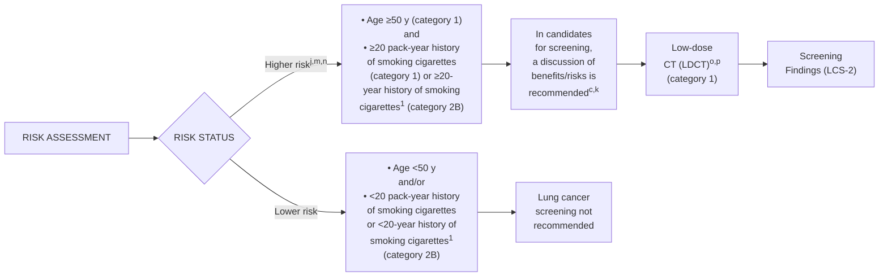
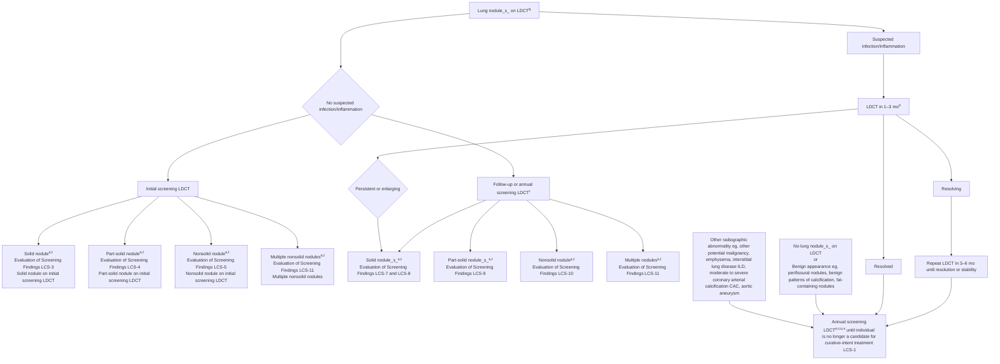
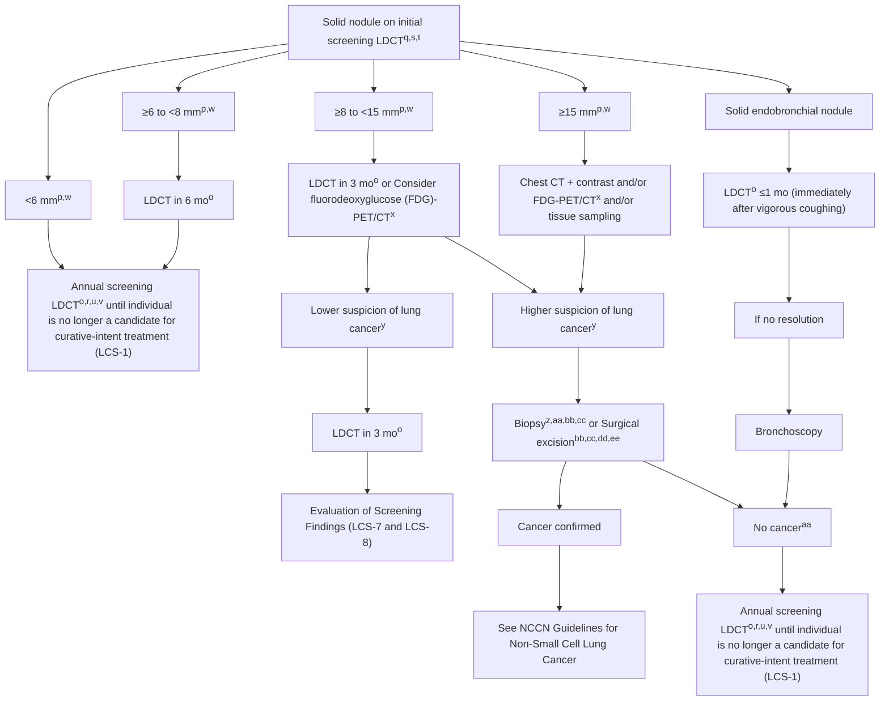
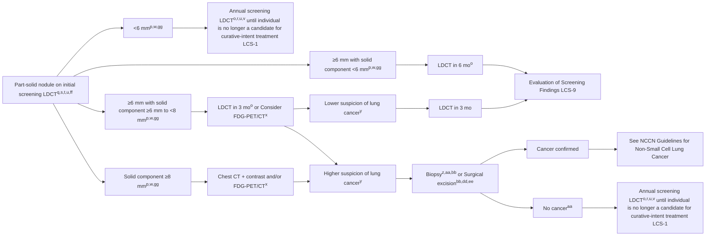
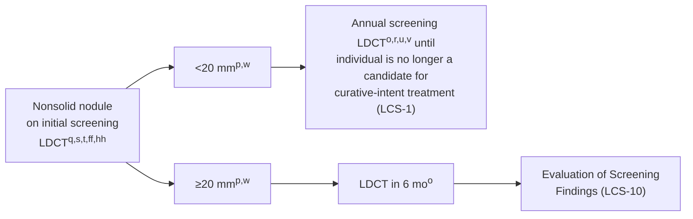
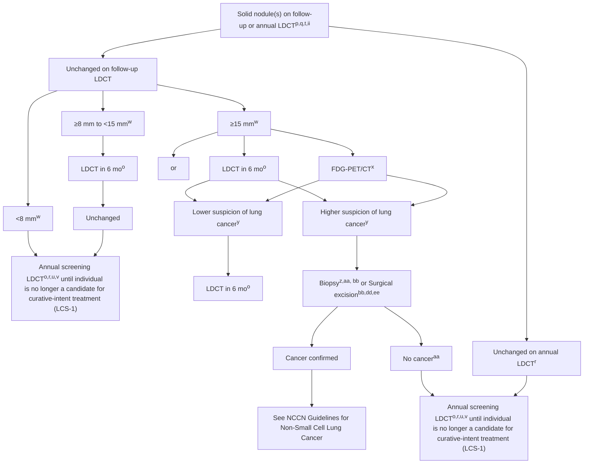
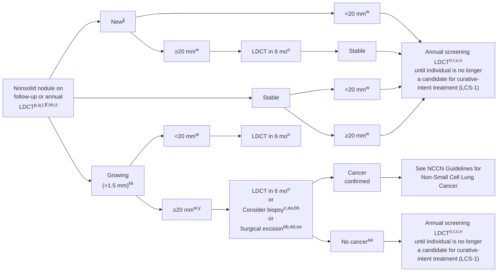
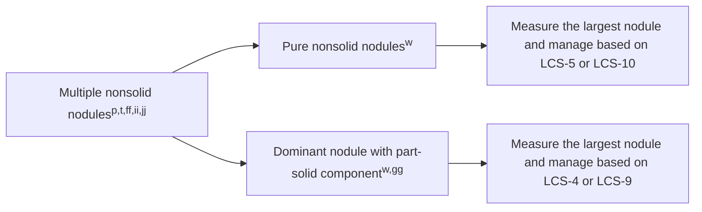

# NCCN Clinical Practice Guidelines in Oncology (NCCN Guidelines®)

# Lung Cancer Screening

Version 1.2026 — September 16, 2025

## NCCN.org

NCCN recognizes the importance of clinical trials and encourages participation when applicable and available. Trials should be designed to maximize inclusiveness and broad representative enrollment.

NCCN Guidelines for Patients® available at www.nccn.org/patients

**Continue**

Version 1.2026, 09/16/2025 © 2025 National Comprehensive Cancer Network® (NCCN®), All rights reserved. NCCN Guidelines® and this illustration may not be reproduced in any form without the express written permission of NCCN.


---


PLEASE NOTE that use of this NCCN Content is governed by the End-User License Agreement, and you MAY NOT distribute this Content or use it with any artificial intelligence model or tool.
Printed by Arun Manoharan on 1/16/2026 11:45:51 AM. Copyright © 2026 National Comprehensive Cancer Network, Inc. All Rights Reserved.

# NCCN Guidelines Version 1.2026
# Lung Cancer Screening

NCCN Guidelines Index
Table of Contents
Discussion

**\*Douglas E. Wood, MD/Chair ¶**
Fred Hutchinson Cancer Center

**\*Ella A. Kazerooni, MD, MS/Vice Chair ф**
University of Michigan Rogel Cancer Center

**Denise R. Aberle, MD ф**
UCLA Jonsson Comprehensive Cancer Center

**Angela C. Argento, MD Ξ**
Johns Hopkins Kimmel Cancer Center

**Jonathan Baines, MD, PhD**
Mayo Clinic Comprehensive Cancer Center

**Brian Boer, MD, PhD Ξ**
Fred & Pamela Buffett Cancer Center

**Whitney Brandt, MD ¶**
Siteman Cancer Center at Barnes-
Jewish Hospital and Washington
University School of Medicine

**Lisa M. Brown, MD, MAS ¶**
UC Davis Comprehensive Cancer Center

**Jessica Donington, MD, MSCR ¶**
The UChicago Medicine
Comprehensive Cancer Center

**Georgie A. Eapen, MD Ξ Þ**
The University of Texas
MD Anderson Cancer Center

**J. Scott Ferguson, MD Ξ**
University of Wisconsin
Carbone Cancer Center

**Lifang Hou, MD, PhD, MS &**
Robert H. Lurie Comprehensive Cancer
Center of Northwestern University

**Donald Klippenstein, MD ф**
Moffitt Cancer Center

**Ana S. Kolansky, MD ф**
Abramson Cancer Center
at the University of Pennsylvania

NCCN Guidelines Panel Disclosures

**Rohit Kumar, MD Ξ**
Fox Chase Cancer Center

**Lorriana E. Leard, MD Ξ**
UCSF Helen Diller Family
Comprehensive Cancer Center

**Ann N. Leung, MD ф**
Stanford Cancer Institute

**Robert E. Merritt, MD ¶**
The Ohio State University Comprehensive
Cancer Center - James Cancer Hospital
and Solove Research Institute

**Kim Norris ¥**
Lung Cancer Foundation of America

**Mark Onaitis, MD ¶**
UC San Diego Moores Cancer Center

**Sudhakar Pipavath, MD ф**
Fred Hutchinson Cancer Center

**Dan Raz, MD, MAS ¶**
City of Hope National Medical Center

**Chakravarthy Reddy, MD Ξ Þ**
Huntsman Cancer Institute at the University of Utah

**Mary E. Reid, PhD &**
Roswell Park Comprehensive Cancer Center

**Kim L. Sandler, MD ф**
Vanderbilt-Ingram Cancer Center

**Jacob Sands, MD †**
Dana-Farber/Brigham and Women's Cancer Center |
Mass General Cancer Center

**Matthew B. Schabath, PhD &**
Moffitt Cancer Center

**Continue**

**Catherine R. Sears, MD Ξ**
Indiana University Melvin and Bren Simon
Comprehensive Cancer Center

**Jamie L. Studts, PhD £**
University of Colorado Cancer Center

**Lynn Tanoue, MD Ξ Þ**
Yale Cancer Center/Smilow Cancer Hospital

**Amber L. Thacker, MD Þ**
St. Jude Children's Research Hospital/
The University of Tennessee Health Science Center

**Betty C. Tong, MD, MHS ¶**
Duke Cancer Institute

**William D. Travis, MD ≠**
Memorial Sloan Kettering Cancer Center

**Qian Wang, MD, MPH †**
Case Comprehensive Cancer Center/
University Hospitals Seidman Cancer Center and
Cleveland Clinic Taussig Cancer Institute

**Kenneth Westover, MD, PhD §**
UT Southwestern Simmons Comprehensive Cancer Center

**Aline Zouk, MD Ξ**
O'Neal Comprehensive Cancer Center at UAB

## NCCN
**Beth McCullough, RN, BS**
**Swathi Ramakrishnan, PhD**

<table>
  <tbody>
    <tr>
        <td>ф Diagnostic radiology</td>
<td>¶ Surgical oncology</td>
    </tr>
<tr>
        <td>&amp; Epidemiology</td>
<td>£ Supportive care</td>
    </tr>
<tr>
        <td>Þ Internal medicine</td>
<td>including palliative, pain</td>
    </tr>
<tr>
        <td>† Medical oncology</td>
<td>management, pastoral</td>
    </tr>
<tr>
        <td>≠ Pathology</td>
<td>care, and oncology</td>
    </tr>
<tr>
        <td>¥ Patient advocacy</td>
<td>social work</td>
    </tr>
<tr>
        <td>Ξ Pulmonary medicine</td>
<td>* Discussion section</td>
    </tr>
<tr>
        <td>§ Radiotherapy/Radiation</td>
<td>writing committee</td>
    </tr>
<tr>
        <td>oncology</td>
<td>member</td>
    </tr>
  </tbody>
</table>

Version 1.2026, 09/16/2025 © 2025 National Comprehensive Cancer Network® (NCCN®), All rights reserved. NCCN Guidelines® and this illustration may not be reproduced in any form without the express written permission of NCCN.


---


PLEASE NOTE that use of this NCCN Content is governed by the End-User License Agreement, and you MAY NOT distribute this Content or use it with any artificial intelligence model or tool.
Printed by Arun Manoharan on 1/16/2026 11:45:51 AM. Copyright © 2026 National Comprehensive Cancer Network, Inc. All Rights Reserved.

# NCCN Guidelines Version 1.2026
# Lung Cancer Screening

NCCN Guidelines Index
Table of Contents
Discussion

NCCN Lung Cancer Screening Panel Members
Summary of the Guidelines Updates

Risk Assessment (LCS-1)
Screening Findings (LCS-2)
Solid Nodule on Initial Screening LDCT (LCS-3)
Part-Solid Nodule on Initial Screening LDCT (LCS-4)
Nonsolid Nodule on Initial Screening LDCT (LCS-5)
New Nodule on Follow-up or Annual LDCT (LCS-6)
Solid Nodule on Follow-up or Annual LDCT (LCS-7)
Part-Solid Nodule on Follow-up or Annual LDCT (LCS-9)
Nonsolid Nodule on Follow-up or Annual LDCT (LCS-10)
Multiple Nonsolid Nodules (LCS-11)

Low-Dose Computed Tomography Acquisition, Storage, Interpretation, and Nodule Reporting (Lung-RADS) (LCS-A)
Risks/Benefits of Lung Cancer Screening (LCS-B)

Abbreviations (ABBR-1)

----

Find an NCCN Member Institution:
[https://www.nccn.org/home/member-institutions](https://www.nccn.org/home/member-institutions).

**NCCN Categories of Evidence and Consensus:** All recommendations are category 2A unless otherwise indicated.

See NCCN Categories of Evidence and Consensus.

----

The NCCN Guidelines® are a statement of evidence and consensus of the authors regarding their views of currently accepted approaches to treatment. Any clinician seeking to apply or consult the NCCN Guidelines is expected to use independent medical judgment in the context of individual clinical circumstances to determine any patient's care or treatment. The National Comprehensive Cancer Network® (NCCN®) makes no representations or warranties of any kind regarding their content, use or application and disclaims any responsibility for their application or use in any way. The NCCN Guidelines are copyrighted by National Comprehensive Cancer Network®. All rights reserved. The NCCN Guidelines and the illustrations herein may not be reproduced in any form without the express written permission of NCCN. ©2025.

Version 1.2026, 09/16/2025 © 2025 National Comprehensive Cancer Network® (NCCN®), All rights reserved. NCCN Guidelines® and this illustration may not be reproduced in any form without the express written permission of NCCN.


---


PLEASE NOTE that use of this NCCN Content is governed by the End-User License Agreement, and you MAY NOT distribute this Content or use it with any artificial intelligence model or tool.
Printed by Arun Manoharan on 1/16/2026 11:45:51 AM. Copyright © 2026 National Comprehensive Cancer Network, Inc. All Rights Reserved.

# NCCN Guidelines Version 1.2026
# Lung Cancer Screening

NCCN Guidelines Index
Table of Contents
Discussion

## Updates in Version 1.2026 of the NCCN Guidelines for Lung Cancer Screening from Version 1.2025 include:

### Global:
• The terms patient/patients was replaced with *individual/individuals*.
• Annual LDCT was revised to: Annual screening LDCT until *individual is no longer a candidate for curative-intent treatment (LCS-1)*.
• Annual screening LDCT until patient is no longer a candidate for definitive treatment revised to: Annual screening LDCT until ~~patient~~ *individual* is no longer a candidate for ~~definitive~~ *curative-intent* treatment *(LCS-1)*.
• High risk was replaced with *Higher* risk.
• Low risk was replaced with *Lower* risk.
• Low suspicion of lung cancer was replaced with *Lower*. . .
• High suspicion of lung cancer was replaced with *Higher*. . .

LCS-1
• Risk Assessment, ~~Patients~~ *Individuals* not eligible for lung cancer screening:
  ▸ Bullets revised:
    ◊ Second bullet: Previous lung cancer (see *Surveillance* in the NCCN Guidelines for Non-Small Cell Lung Cancer).
    ◊ Third bullet: Functional status and/or comorbidity that would prohibit curative intent treatment (see *Principles of Surgery* ~~in the NCCN Guidelines for Non-Small Cell Lung Cancer~~ and *Principles of Radiation Therapy* in the NCCN Guidelines for Non-Small Cell Lung Cancer).
  ▸ New bullet added: Likely near-future competing cause of death.
• Risk Status:
  ▸ Column following Higher risk revised: In candidates for screening, ~~shared patient/provider decision-making is recommended, including~~ a discussion of benefits/risks *is recommended*.

LCS-1A
• Footnotes revised:
  ▸ Footnote c: Although age and smoking history are used for risk assessment, other potential risk factors for lung cancer (eg, occupational exposure, radon exposure, cancer history, family history, lung disease history) may be ~~discussed during shared decision-making~~ *considered during discussions of benefits and risks*.
  ▸ Footnote e: All individuals who currently ~~smoke cigarettes~~ *use tobacco* should be ~~advised to quit smoking, and all individuals who formerly smoked should be advised to remain abstinent from smoking~~ *offered support and resources to help them reduce or quit smoking*. ~~For additional cessation support and resources, individuals who smoke can be referred to https://www.smokefree.gov. Lung cancer screening should not be considered a substitute for smoking cessation. Cigarette smoking~~ *Complete tobacco use* history should document both extent of exposure in pack-years (number of packs smoked every day multiplied by the number of years) and the amount of time since smoking cessation in individuals who previously smoked. ~~See also the NCCN Guidelines for Smoking Cessation.~~ *Individuals who have previously used tobacco should be recognized for their commitment and offered continued support to remain tobacco-free (https://www.smokefree.gov)*.
  ▸ Footnote h: There is increased risk of developing new primary lung cancer among survivors of lymphomas, *breast cancer*, ~~cancers of the head and neck~~ *cancer*, or other smoking *tobacco-related* cancers, *or have received radiation treatment to the chest*. Wang Y, et al. J Thorac Oncol 2021;16:1893-1908.

**Continued**

Version 1.2026, 09/16/2025 © 2025 National Comprehensive Cancer Network® (NCCN®), All rights reserved. NCCN Guidelines® and this illustration may not be reproduced in any form without the express written permission of NCCN.

**UPDATES**


---


PLEASE NOTE that use of this NCCN Content is governed by the End-User License Agreement, and you MAY NOT distribute this Content or use it with any artificial intelligence model or tool.
Printed by Arun Manoharan on 1/16/2026 11:45:51 AM. Copyright © 2026 National Comprehensive Cancer Network, Inc. All Rights Reserved.

National Comprehensive Cancer Network®

NCCN Guidelines Version 1.2026
Lung Cancer Screening

NCCN Guidelines Index
Table of Contents
Discussion

# Updates in Version 1.2026 of the NCCN Guidelines for Lung Cancer Screening from Version 1.2025 include:

## LCS-1A (continued)

• Footnote j revised: NCCN encourages providers to consider using risk calculators, if possible, because additional candidates at higher risk for lung cancer may be identified for lung screening. ~~Sands J, et al. J Thorac Oncol 2021:16:37-53. See Tammemagi lung cancer risk calculator PLCOm2012 Lung Cancer Risk Calculator (https://www.evidencio.com/models/show/992). Sands J, et al. J Thorac Oncol 2021:16:37-53.~~ It is reasonable to consider using the Tammemagi lung cancer risk calculator to assist in quantifying risk for individuals in this group, considering a 1.3% threshold of lung cancer risk over a 6-year timeframe was considered similar to that of the USPSTF. Tammemägi MC, et al. PLoS Med 2014;11:e1001764.

• Reference added to footnote o: Christensen J, et al. Chest 2024;165:738-753.(Also pages LCS-2A, LCS-3A, LCS-4A, LCS-5, LCS-6, LCS-7A, LCS-8A, LCS-9A, and LCS-10A)

• New footnotes added:
  * Footnote d: Refer to the NCCN Distress Thermometer and Problem List, which includes social determinants of health. See NCCN Guidelines for Distress Management (DIS-A).
  * Footnote p: Use of a tracking tool, in addition to a navigation process, is recommended to systematically ensure that individuals with screen-detected lung nodules complete guideline-concordant nodule management, and individuals without significant screen detected abnormalities continue annual screening if they remain eligible. (Also pages LCS-2A, LCS-3A, LCS-4A, LCS-5, LCS-6, LCS-7A, LCS-8A, LCS-9A, LCS-10A, and LCS-11)

## LCS-2A

• New footnote v added: If intervening CT scans are done, they may be used to reset the time schedule of ongoing lung cancer screening follow-up. (Also pages LCS-4A, LCS-5, LCS-6, LCS-7A, LCS-8A, LCS-9A, and LCS-10A)

## LCS-3

• Last column, second option revised: Evaluation of Screening Findings. (Also page LCS-4)

## LCS-3A

• Footnotes revised:
  * Footnote cc: ~~Patients~~ Individuals with a strong probability of peripheral stage I lung cancer (based on risk factors and radiologic appearance) do not require a biopsy before surgery. A biopsy adds time, cost, and procedural risk and may not be needed for treatment decisions. A preoperative biopsy may be appropriate for a central nodule/mass or if a nonlung cancer diagnosis is strongly suspected, which can be diagnosed by bronchoscopy, core biopsy, or fine-needle aspiration (FNA), or if an intraoperative diagnosis appears difficult or very risky. When a preoperative tissue diagnosis has not been obtained, an intraoperative diagnosis (ie, wedge resection or needle biopsy) is necessary before lobectomy, bilobectomy, or pneumonectomy. See Principles of Diagnostic Evaluation in the NCCN Guidelines for Non-Small Cell Lung Cancer.
  * Footnote dd: Prior to treatment, multidisciplinary evaluation that includes treating physicians and specialists in obtaining tissue diagnosis (thoracic surgery, ~~interventional~~ pulmonology, and interventional radiology) is required to determine feasibility along with the safest and most efficient approach for biopsy, or to provide consensus that a biopsy is too risky or difficult, that a clinical diagnosis of lung cancer is appropriate, and that treatment is warranted. (Also pages LCS-4A, LCS-7A, LCS-8A, LCS-9A, and LCS-10A)
  * Footnote ee: SABR is also an appropriate option for ~~patients~~ individuals with high surgical risk. This should include a multidisciplinary evaluation, including at least thoracic surgery and radiation oncology. See Principles of Radiation Therapy in the NCCN Guidelines for Non-Small Cell Lung Cancer. (Also pages LCS-4A, LCS-7A, LCS-8A, LCS-9A, and LCS-10A)

## LCS-5

• Last column option revised: Evaluation of Screening Findings.

## MS-1

• The discussion section has been updated to reflect changes in the algorithm.

Version 1.2026, 09/16/2025 © 2025 National Comprehensive Cancer Network® (NCCN®), All rights reserved. NCCN Guidelines® and this illustration may not be reproduced in any form without the express written permission of NCCN.

UPDATES


---


PLEASE NOTE that use of this NCCN Content is governed by the End-User License Agreement, and you MAY NOT distribute this Content or use it with any artificial intelligence model or tool.
Printed by Arun Manoharan on 1/16/2026 11:45:51 AM. Copyright © 2026 National Comprehensive Cancer Network, Inc. All Rights Reserved.

National Comprehensive Cancer Network®

# NCCN Guidelines Version 1.2026
# Lung Cancer Screening

NCCN Guidelines Index
Table of Contents
Discussion

## RISK ASSESSMENT<sup>a,b,c,d</sup> | RISK STATUS | SCREENING

* **Cigarette smoking history<sup>e</sup>**
* **Radon exposure<sup>f</sup>**
* **Occupational exposure<sup>g</sup>**
* **Cancer history<sup>h</sup>**
* **Family history of lung cancer in first-degree relatives**
* **Disease history (chronic obstructive pulmonary disease [COPD] or pulmonary fibrosis)**
* **Cigarette smoking exposure<sup>i</sup> (second-hand smoke)**
* **Risk calculator to enhance determination of risk status<sup>j,k</sup>**

**Individuals not eligible for lung cancer screening:**
* **Symptoms of lung cancer (see NCCN Guidelines for Non-Small Cell Lung Cancer)**
* **Previous lung cancer (see Surveillance in the NCCN Guidelines for Non-Small Cell Lung Cancer)**
* **Functional status and/or comorbidity that would prohibit curative intent treatment<sup>l</sup> (see Principles of Surgery and Principles of Radiation Therapy in the NCCN Guidelines for Non-Small Cell Lung Cancer)**
* **Likely near-future competing cause of death**



----

<sup>1</sup> Potter AL, Xu NN, Senthil P, et al. Pack-year smoking history: An inadequate and biased measure to determine lung cancer screening eligibility. J Clin Oncol 2024;42:2026-2037.

Footnotes on LCS-1A

**Note: All recommendations are category 2A unless otherwise indicated.**

Version 1.2026, 09/16/2025 © 2025 National Comprehensive Cancer Network® (NCCN®), All rights reserved. NCCN Guidelines® and this illustration may not be reproduced in any form without the express written permission of NCCN.

LCS-1


---


PLEASE NOTE that use of this NCCN Content is governed by the End-User License Agreement, and you MAY NOT distribute this Content or use it with any artificial intelligence model or tool.
Printed by Arun Manoharan on 1/16/2026 11:45:51 AM. Copyright © 2026 National Comprehensive Cancer Network, Inc. All Rights Reserved.

National Comprehensive Cancer Network®

NCCN Guidelines Version 1.2026
Lung Cancer Screening

NCCN Guidelines Index
Table of Contents
Discussion

## FOOTNOTES

<sup>a</sup> It is recommended that institutions performing lung cancer screening use a multidisciplinary approach for nodule management that includes the specialties of thoracic radiology, pulmonary medicine, and thoracic surgery. Some institutions also include medical oncology, radiation oncology, and/or pathology.

<sup>b</sup> Lung cancer screening with LDCT is appropriate to consider for individuals at higher risk for cancer who are potential candidates for curative-intent treatment. Chest x-ray is not recommended for lung cancer screening.

<sup>c</sup> Although age and smoking history are used for risk assessment, other potential risk factors for lung cancer (eg, occupational exposure, radon exposure, cancer history, family history, lung disease history) may be considered during discussions of benefits and risks.

<sup>d</sup> Refer to the NCCN Distress Thermometer and Problem List, which includes social determinants of health. See NCCN Guidelines for Distress Management (DIS-A).

<sup>e</sup> All individuals who currently use tobacco should be offered support and resources to help them reduce or quit smoking. Complete tobacco use history should document both extent of exposure in pack-years (number of packs smoked every day multiplied by the number of years) and the amount of time since smoking cessation in individuals who previously smoked. Individuals who have previously used tobacco should be recognized for their commitment and offered continued support to remain tobacco-free (https://www.smokefree.gov).

<sup>f</sup> Documented sustained and substantially elevated radon exposure increases the risk for lung cancer. Many state websites have information more specific to local areas, including areas of known elevated radon.

<sup>g</sup> Agents that are identified specifically as carcinogens targeting the lungs include: arsenic, asbestos, beryllium, cadmium, chromium, coal smoke, diesel fumes, nickel, silica, soot, and uranium.

<sup>h</sup> There is increased risk of developing new primary lung cancer among survivors of lymphoma, breast cancer, head and neck cancer, other smoking tobacco-related cancers, or have received radiation treatment to the chest. WangY, et al. J Thorac Oncol 2021;16:1893-1908.

<sup>i</sup> Individuals exposed to second-hand smoke have a highly variable exposure to the carcinogens, with varying evidence for increased risk after this variable exposure. Therefore, second-hand smoke is not independently considered a risk factor sufficient for recommending lung cancer screening.

<sup>j</sup> NCCN encourages providers to consider using risk calculators, if possible, because additional candidates at higher risk for lung cancer may be identified for lung screening. Sands J, et al. J Thorac Oncol 2021;16:37-53. See PLCOm2012 Lung Cancer Risk Calculator (https://www.evidencio.com/models/show/992). It is reasonable to consider using the Tammemagi lung cancer risk calculator to assist in quantifying risk for individuals in this group, considering a 1.3% threshold of lung cancer risk over a 6-year timeframe was considered similar to that of the USPSTF. Tammemägi MC, et al. PLoS Med 2014;11:e1001764.

<sup>k</sup> Shared decision-making aids may assist in counseling individuals about the risks and benefits of screening. Examples of decision-making aids can be found at: http://www.shouldiscreen.com/benefits-and-harms-screening. Use of risk models may identify individuals with a lower risk or higher risk within the current recommendations.

<sup>l</sup> Curative intent treatment includes surgery and stereotactic ablative radiotherapy (SABR), also known as stereotactic body radiation therapy (SBRT). Ablative image-guided thermal ablation (IGTA) techniques, such as radiofrequency ablation, microwave ablation, and cryoablation are additional alternatives for curative intent treatment. SABR or IGTA may be used for individuals with advanced age and individuals with cardiac disease or severe COPD who are unable to have surgery; these factors themselves do not preclude eligibility for screening. See also the NCCN Guidelines for Non-Small Cell Lung Cancer.

<sup>m</sup> Although randomized trial evidence supports screening up to age 77 years, there is uncertainty about the upper age limit to initiate or continue screening. One can consider screening beyond age 77 years as long as individual functional status and comorbidity allow consideration for curative intent therapy.

<sup>n</sup> Black and African American individuals with less cigarette smoking exposure have a similar risk for lung cancer as white individuals with more cigarette smoking exposure. This increased risk for Black/African Americans should be considered in shared decision-making and risk assessment. Aldrich M, et al. JAMA Oncol 2019;5:1318-1324.

<sup>o</sup> All screening and follow-up chest CT scans should use a CT dose index volume (CTDI<sub>vol</sub>) threshold of ≤3 mGy for an individual of average size, unless evaluating mediastinal abnormalities or lymph nodes, where standard-dose CT with IV contrast might be appropriate (LCS-A). Parameters should be adjusted for individuals of smaller or larger size. There should be a systematic process for appropriate follow-up. See ACR-STR Practice Parameter for the Performance and Reporting of Lung Cancer Screening Thoracic Computed Tomography (CT). Christensen J, et al. Chest 2024;165:738-753.

<sup>p</sup> Use of a tracking tool, in addition to a navigation process, is recommended to systematically ensure that individuals with screen-detected lung nodules complete guideline-concordant nodule management, and individuals without significant screen detected abnormalities continue annual screening if they remain eligible.

Note: All recommendations are category 2A unless otherwise indicated.

Version 1.2026, 09/16/2025 © 2025 National Comprehensive Cancer Network® (NCCN®), All rights reserved. NCCN Guidelines® and this illustration may not be reproduced in any form without the express written permission of NCCN.

LCS-1A


---


PLEASE NOTE that use of this NCCN Content is governed by the End-User License Agreement, and you MAY NOT distribute this Content or use it with any artificial intelligence model or tool.
Printed by Arun Manoharan on 1/16/2026 11:45:51 AM. Copyright © 2026 National Comprehensive Cancer Network, Inc. All Rights Reserved.

National Comprehensive Cancer Network®

**NCCN Guidelines Version 1.2026**
**Lung Cancer Screening**

NCCN Guidelines Index
Table of Contents
Discussion



## SCREENING FINDINGS<sup>p</sup>

**Note: All recommendations are category 2A unless otherwise indicated.**

Footnotes on LCS-2A

Version 1.2026, 09/16/2025 © 2025 National Comprehensive Cancer Network® (NCCN®), All rights reserved. NCCN Guidelines® and this illustration may not be reproduced in any form without the express written permission of NCCN.

LCS-2


---


PLEASE NOTE that use of this NCCN Content is governed by the End-User License Agreement, and you MAY NOT distribute this Content or use it with any artificial intelligence model or tool.
Printed by Arun Manoharan on 1/16/2026 11:45:51 AM. Copyright © 2026 National Comprehensive Cancer Network, Inc. All Rights Reserved.

National Comprehensive Cancer Network®

# NCCN Guidelines Version 1.2026
# Lung Cancer Screening

NCCN Guidelines Index
Table of Contents
Discussion

## FOOTNOTES

<sup>o</sup> All screening and follow-up chest CT scans should use a CT dose index volume (CTDI<sub>vol</sub>) threshold of ≤3 mGy for an individual of average size, unless evaluating mediastinal abnormalities or lymph nodes, where standard-dose CT with IV contrast might be appropriate (LCS-A). Parameters should be adjusted for individuals of smaller or larger size. There should be a systematic process for appropriate follow-up. See ACR-STR Practice Parameter for the Performance and Reporting of Lung Cancer Screening Thoracic Computed Tomography (CT). Christensen J, et al. Chest 2024;165:738-753.

<sup>p</sup> Use of a tracking tool, in addition to a navigation process, is recommended to systematically ensure that individuals with screen-detected lung nodules complete guideline-concordant nodule management, and individuals without significant screen detected abnormalities continue annual screening if they remain eligible.

<sup>q</sup> The NCCN Guidelines for Lung Cancer Screening are harmonized with Lung-RADS with rounding of mean measurement to the nearest whole number (mm).

<sup>r</sup> Ideally, the annual LDCT is performed 12 months from the initial or interval scan.

<sup>s</sup> Without benign pattern of calcification, fat in nodule suggestive of hamartoma, or features suggesting inflammatory etiology. When multiple nodules or other findings are present that suggest occult infection or inflammation is a possibility, suggest follow-up LDCT in 1–3 months.

<sup>t</sup> A nodule is a three-dimensional (3D) opacity, measuring up to 3 cm in diameter. A solid nodule has a homogeneous soft-tissue attenuation, a nonsolid nodule (also known as a ground-glass nodule) has hazy increased attenuation that does not obliterate bronchial and vascular margins, and a part-solid nodule has elements of both solid and nonsolid nodules. Nodules should be evaluated and measured on the LDCT lung windows. The size of all nodules is underestimated when viewed on soft-tissue windows, and some nodules may not even be visible, particularly nonsolid nodules and small nodules. Bankier AA, et al. Radiology 2017;285:584-600.

<sup>u</sup> There is uncertainty about the appropriate duration of screening and the age at which screening is no longer appropriate.

<sup>v</sup> If intervening CT scans are done, they may be used to reset the time schedule of ongoing lung cancer screening follow-up.

Note: All recommendations are category 2A unless otherwise indicated.

Version 1.2026, 09/16/2025 © 2025 National Comprehensive Cancer Network® (NCCN®), All rights reserved. NCCN Guidelines® and this illustration may not be reproduced in any form without the express written permission of NCCN.

LCS-2A


---


PLEASE NOTE that use of this NCCN Content is governed by the End-User License Agreement, and you MAY NOT distribute this Content or use it with any artificial intelligence model or tool.
Printed by Arun Manoharan on 1/16/2026 11:45:51 AM. Copyright © 2026 National Comprehensive Cancer Network, Inc. All Rights Reserved.

National Comprehensive Cancer Network®

# NCCN Guidelines Version 1.2026
# Lung Cancer Screening

NCCN Guidelines Index
Table of Contents
Discussion

## EVALUATION OF SCREENING FINDINGS

## FOLLOW-UP OF SCREENING FINDINGS



Footnotes on LCS-3A

**Note: All recommendations are category 2A unless otherwise indicated.**

Version 1.2026, 09/16/2025 © 2025 National Comprehensive Cancer Network® (NCCN®), All rights reserved. NCCN Guidelines® and this illustration may not be reproduced in any form without the express written permission of NCCN.

**LCS-3**


---


PLEASE NOTE that use of this NCCN Content is governed by the End-User License Agreement, and you MAY NOT distribute this Content or use it with any artificial intelligence model or tool.
Printed by Arun Manoharan on 1/16/2026 11:45:51 AM. Copyright © 2026 National Comprehensive Cancer Network, Inc. All Rights Reserved.

# NCCN Guidelines Version 1.2026
# Lung Cancer Screening

NCCN Guidelines Index
Table of Contents
Discussion

## FOOTNOTES

<sup>o</sup> All screening and follow-up chest CT scans should use a CT dose index volume (CTDI<sub>vol</sub>) threshold of ≤3 mGy for an individual of average size, unless evaluating mediastinal abnormalities or lymph nodes, where standard-dose CT with IV contrast might be appropriate (LCS-A). Parameters should be adjusted for individuals of smaller or larger size. There should be a systematic process for appropriate follow-up. See ACR-STR Practice Parameter for the Performance and Reporting of Lung Cancer Screening Thoracic Computed Tomography (CT). Christensen J, et al. Chest 2024;165:738-753.

<sup>p</sup> Use of a tracking tool, in addition to a navigation process, is recommended to systematically ensure that individuals with screen-detected lung nodules complete guideline-concordant nodule management, and individuals without significant screen detected abnormalities continue annual screening if they remain eligible.

<sup>q</sup> The NCCN Guidelines for Lung Cancer Screening are harmonized with Lung-RADS with rounding of mean measurement to the nearest whole number (mm).

<sup>r</sup> Ideally, the annual LDCT is performed 12 months from the initial or interval scan.

<sup>s</sup> Without benign pattern of calcification, fat in nodule suggestive of hamartoma, or features suggesting inflammatory etiology. When multiple nodules or other findings are present that suggest occult infection or inflammation is a possibility, suggest follow-up LDCT in 1–3 months.

<sup>t</sup> A nodule is a 3D opacity, measuring up to 3 cm in diameter. A solid nodule has a homogeneous soft-tissue attenuation, a nonsolid nodule (also known as a ground-glass nodule) has hazy increased attenuation that does not obliterate bronchial and vascular margins, and a part-solid nodule has elements of both solid and nonsolid nodules. Nodules should be evaluated and measured on the LDCT lung windows. The size of all nodules is underestimated when viewed on soft-tissue windows, and some nodules may not even be visible, particularly nonsolid nodules and small nodules. Bankier AA, et al. Radiology 2017;285:584-600.

<sup>u</sup> There is uncertainty about the appropriate duration of screening and the age at which screening is no longer appropriate.

<sup>v</sup> If intervening CT scans are done, they may be used to reset the time schedule of ongoing lung cancer screening follow-up.

<sup>w</sup> Nodules should be measured on lung windows and reported as the average diameter rounded to the nearest whole number; for round nodules only a single diameter measurement is necessary. Mean diameter is the mean of the longest diameter of the nodule and its perpendicular diameter.

<sup>x</sup> FDG-PET has a low sensitivity for nodules with <8 mm of solid component and for small nodules near the diaphragm. FDG-PET/CT is only one consideration of multiple criteria for determining whether a nodule has a high risk of being lung cancer. In areas endemic for fungal disease, the false-positive rate for FDG-PET/CT is higher.

<sup>y</sup> The evaluation for the suspicion of lung cancer requires a multidisciplinary approach with expertise in lung nodule management (thoracic radiology, pulmonary medicine, and thoracic surgery). This may include use of a lung nodule risk calculator to assist with probability determination. Examples of lung nodule risk calculators include: Mayo risk model; Brock university model; and model by Herder GJ, et al. Chest 2005;128:2490-2496. The use of risk calculators does not replace multidisciplinary nodule management. Geographic and other factors can substantially influence the accuracy of nodule calculators.

<sup>z</sup> Tissue samples need to be adequate for both histology and molecular testing. Travis WD, et al. In: WHO Classification of Thoracic Tumors, 5th Ed. Lyon: International Agency for Research on Cancer; 2021:29-36.

<sup>aa</sup> If biopsy is non-diagnostic and a strong suspicion for cancer persists, suggest repeat biopsy, surgical excision, or short-interval LDCT follow-up (3 months).

<sup>bb</sup> See the diagnostic evaluation of a lung nodule (DIAG-1 through DIAG-A) in the NCCN Guidelines for Non-Small Cell Lung Cancer.

<sup>cc</sup> Individuals with a strong probability of peripheral stage I lung cancer (based on risk factors and radiologic appearance) do not require a biopsy before surgery. A biopsy adds time, cost, and procedural risk and may not be needed for treatment decisions. A preoperative biopsy may be appropriate for a central nodule/mass or if a non-lung cancer diagnosis is strongly suspected, which can be diagnosed by bronchoscopy, core biopsy, or fine-needle aspiration (FNA), or if an intraoperative diagnosis appears difficult or very risky. When a preoperative tissue diagnosis has not been obtained, an intraoperative diagnosis (ie, wedge resection or needle biopsy) is necessary before lobectomy, bilobectomy, or pneumonectomy. See Principles of Diagnostic Evaluation in the NCCN Guidelines for Non-Small Cell Lung Cancer.

<sup>dd</sup> Prior to treatment, multidisciplinary evaluation that includes treating physicians and specialists in obtaining tissue diagnosis (thoracic surgery, pulmonology, and interventional radiology) is required to determine feasibility along with the safest and most efficient approach for biopsy, or to provide consensus that a biopsy is too risky or difficult, that a clinical diagnosis of lung cancer is appropriate, and that treatment is warranted.

<sup>ee</sup> SABR is also an appropriate option for individuals with high surgical risk. This should include a multidisciplinary evaluation, including at least thoracic surgery and radiation oncology. See Principles of Radiation Therapy in the NCCN Guidelines for Non-Small Cell Lung Cancer.

**Note: All recommendations are category 2A unless otherwise indicated.**

Version 1.2026, 09/16/2025 © 2025 National Comprehensive Cancer Network® (NCCN®), All rights reserved. NCCN Guidelines® and this illustration may not be reproduced in any form without the express written permission of NCCN.    LCS-3A


---


PLEASE NOTE that use of this NCCN Content is governed by the End-User License Agreement, and you MAY NOT distribute this Content or use it with any artificial intelligence model or tool.
Printed by Arun Manoharan on 1/16/2026 11:45:51 AM. Copyright © 2026 National Comprehensive Cancer Network, Inc. All Rights Reserved.

National Comprehensive Cancer Network®

# NCCN Guidelines Version 1.2026
# Lung Cancer Screening

NCCN Guidelines Index
Table of Contents
Discussion

## EVALUATION OF SCREENING FINDINGS

## FOLLOW-UP OF SCREENING FINDINGS



Footnotes on LCS-4A

Note: All recommendations are category 2A unless otherwise indicated.

Version 1.2026, 09/16/2025 © 2025 National Comprehensive Cancer Network® (NCCN®), All rights reserved. NCCN Guidelines® and this illustration may not be reproduced in any form without the express written permission of NCCN.

LCS-4


---


PLEASE NOTE that use of this NCCN Content is governed by the End-User License Agreement, and you MAY NOT distribute this Content or use it with any artificial intelligence model or tool.
Printed by Arun Manoharan on 1/16/2026 11:45:51 AM. Copyright © 2026 National Comprehensive Cancer Network, Inc. All Rights Reserved.

National Comprehensive Cancer Network®

**NCCN Guidelines Version 1.2026**
**Lung Cancer Screening**

NCCN Guidelines Index
Table of Contents
Discussion

## FOOTNOTES

<sup>o</sup> All screening and follow-up chest CT scans should use a CT dose index volume (CTDI<sub>vol</sub>) threshold of ≤3 mGy for an individual of average size, unless evaluating mediastinal abnormalities or lymph nodes, where standard-dose CT with IV contrast might be appropriate (LCS-A). Parameters should be adjusted for individuals of smaller or larger size. There should be a systematic process for appropriate follow-up. See ACR-STR Practice Parameter for the Performance and Reporting of Lung Cancer Screening Thoracic Computed Tomography (CT). Christensen J, et al. Chest 2024;165:738-753.

<sup>p</sup> Use of a tracking tool, in addition to a navigation process, is recommended to systematically ensure that individuals with screen-detected lung nodules complete guideline-concordant nodule management, and individuals without significant screen detected abnormalities continue annual screening if they remain eligible.

<sup>q</sup> The NCCN Guidelines for Lung Cancer Screening are harmonized with Lung-RADS with rounding of mean measurement to the nearest whole number (mm).

<sup>r</sup> Ideally, the annual LDCT is performed 12 months from the initial or interval scan.

<sup>s</sup> Without benign pattern of calcification, fat in nodule suggestive of hamartoma, or features suggesting inflammatory etiology. When multiple nodules or other findings are present that suggest occult infection or inflammation is a possibility, suggest follow-up LDCT in 1–3 months.

<sup>t</sup> A nodule is a 3D opacity, measuring up to 3 cm in diameter. A solid nodule has a homogeneous soft-tissue attenuation, a nonsolid nodule (also known as a ground-glass nodule) has hazy increased attenuation that does not obliterate bronchial and vascular margins, and a part-solid nodule has elements of both solid and nonsolid nodules. Nodules should be evaluated and measured on the LDCT lung windows. The size of all nodules is underestimated when viewed on soft-tissue windows, and some nodules may not even be visible, particularly nonsolid nodules and small nodules. Bankier AA, et al. Radiology 2017;285:584-600.

<sup>u</sup> There is uncertainty about the appropriate duration of screening and the age at which screening is no longer appropriate.

<sup>v</sup> If intervening CT scans are done, they may be used to reset the time schedule of ongoing lung cancer screening follow-up.

<sup>w</sup> Nodules should be measured on lung windows and reported as the average diameter rounded to the nearest whole number; for round nodules only a single diameter measurement is necessary. Mean diameter is the mean of the longest diameter of the nodule and its perpendicular diameter.

<sup>x</sup> FDG-PET has a low sensitivity for nodules with <8 mm of solid component and for small nodules near the diaphragm. FDG-PET/CT is only one consideration of multiple criteria for determining whether a nodule has a high risk of being lung cancer. In areas endemic for fungal disease, the false-positive rate for FDG-PET/CT is higher.

<sup>y</sup> The evaluation for the suspicion of lung cancer requires a multidisciplinary approach with expertise in lung nodule management (thoracic radiology, pulmonary medicine, and thoracic surgery). This may include use of a lung nodule risk calculator to assist with probability determination. Examples of lung nodule risk calculators include: Mayo risk model; Brock university model; and model by Herder GJ, et al. Chest 2005;128:2490-2496. The use of risk calculators does not replace multidisciplinary nodule management. Geographic and other factors can substantially influence the accuracy of nodule calculators.

<sup>z</sup> Tissue samples need to be adequate for both histology and molecular testing. Travis WD, et al. In: WHO Classification of Thoracic Tumors, 5th Ed. Lyon: International Agency for Research on Cancer; 2021:29-36.

<sup>aa</sup> If biopsy is non-diagnostic and a strong suspicion for cancer persists, suggest repeat biopsy, surgical excision, or short-interval LDCT follow-up (3 months).

<sup>bb</sup> See the diagnostic evaluation of a lung nodule (DIAG-1 through DIAG-A) in the NCCN Guidelines for Non-Small Cell Lung Cancer.

<sup>dd</sup> Prior to treatment, multidisciplinary evaluation that includes treating physicians and specialists in obtaining tissue diagnosis (thoracic surgery, pulmonology, and interventional radiology) is required to determine feasibility along with the safest and most efficient approach for biopsy, or to provide consensus that a biopsy is too risky or difficult, that a clinical diagnosis of lung cancer is appropriate, and that treatment is warranted.

<sup>ee</sup> SABR is also an appropriate option for individuals with high surgical risk. This should include a multidisciplinary evaluation, including at least thoracic surgery and radiation oncology. See Principles of Radiation Therapy in the NCCN Guidelines for Non-Small Cell Lung Cancer.

<sup>ff</sup> It is crucial that all nonsolid lesions be reviewed at thin (≤1.5 mm) slices to exclude any solid components. Any solid component in the nodule requires management of the lesion with the part-solid recommendations (LCS-9).

<sup>gg</sup> All part-solid nodules ≥6 mm should be identified and solid areas should be measured.

**Note: All recommendations are category 2A unless otherwise indicated.**

Version 1.2026, 09/16/2025 © 2025 National Comprehensive Cancer Network® (NCCN®), All rights reserved. NCCN Guidelines® and this illustration may not be reproduced in any form without the express written permission of NCCN.

**LCS-4A**


---


PLEASE NOTE that use of this NCCN Content is governed by the End-User License Agreement, and you MAY NOT distribute this Content or use it with any artificial intelligence model or tool.
Printed by Arun Manoharan on 1/16/2026 11:45:51 AM. Copyright © 2026 National Comprehensive Cancer Network, Inc. All Rights Reserved.

National Comprehensive Cancer Network®

**NCCN Guidelines Version 1.2026**
**Lung Cancer Screening**

NCCN Guidelines Index
Table of Contents
Discussion

## EVALUATION OF SCREENING FINDINGS

## FOLLOW-UP OF SCREENING FINDINGS



<sup>o</sup> All screening and follow-up chest CT scans should use a CT dose index volume (CTDI<sub>vol</sub>) threshold of ≤3 mGy for an individual of average size, unless evaluating mediastinal abnormalities or lymph nodes, where standard-dose CT with IV contrast might be appropriate (LCS-A). Parameters should be adjusted for individuals of smaller or larger size. There should be a systematic process for appropriate follow-up. See ACR-STR Practice Parameter for the Performance and Reporting of Lung Cancer Screening Thoracic Computed Tomography (CT)). Christensen J, et al. Chest 2024;165:738-753.

<sup>p</sup> Use of a tracking tool, in addition to a navigation process, is recommended to systematically ensure that individuals with screen-detected lung nodules complete guideline-concordant nodule management, and individuals without significant screen detected abnormalities continue annual screening if they remain eligible.

<sup>q</sup> The NCCN Guidelines for Lung Cancer Screening are harmonized with Lung-RADS with rounding of mean measurement to the nearest whole number (mm).

<sup>r</sup> Ideally, the annual LDCT is performed 12 months from the initial or interval scan.

<sup>s</sup> Without benign pattern of calcification, fat in nodule suggestive of hamartoma, or features suggesting inflammatory etiology. When multiple nodules or other findings are present that suggest occult infection or inflammation is a possibility, suggest follow-up LDCT in 1–3 months.

<sup>t</sup> A nodule is a 3D opacity, measuring up to 3 cm in diameter. A solid nodule has a homogeneous soft-tissue attenuation, a nonsolid nodule (also known as a ground-glass nodule) has hazy increased attenuation that does not obliterate bronchial and vascular margins, and a part-solid nodule has elements of both solid and nonsolid nodules. Nodules should be evaluated and measured on the LDCT lung windows. The size of all nodules is underestimated when viewed on soft-tissue windows, and some nodules may not even be visible, particularly nonsolid nodules and small nodules. Bankier AA, et al. Radiology 2017;285:584-600.

<sup>u</sup> There is uncertainty about the appropriate duration of screening and the age at which screening is no longer appropriate.

<sup>v</sup> If intervening CT scans are done, they may be used to reset the time schedule of ongoing lung cancer screening follow-up.

<sup>w</sup> Nodules should be measured on lung windows and reported as the average diameter rounded to the nearest whole number; for round nodules only a single diameter measurement is necessary. Mean diameter is the mean of the longest diameter of the nodule and its perpendicular diameter.

<sup>ff</sup> It is crucial that all nonsolid lesions be reviewed at thin (≤1.5 mm) slices to exclude any solid components. Any solid component in the nodule requires management of the lesion with the part-solid recommendations (LCS-9).

<sup>hh</sup> Lung-RADS 1.1 has increased the size of a nonsolid nodule that can continue with annual screening to <30 mm, rather than <20 mm as recommended in the previous version. The NCCN Guidelines Panel has not harmonized this portion of the Lung-RADS update, as the consensus among Panel members is that baseline or new nonsolid nodules ≥20 mm should have an earlier evaluation at 6 months.

**Note: All recommendations are category 2A unless otherwise indicated.**

Version 1.2026, 09/16/2025 © 2025 National Comprehensive Cancer Network® (NCCN®), All rights reserved. NCCN Guidelines® and this illustration may not be reproduced in any form without the express written permission of NCCN.

**LCS-5**


---


PLEASE NOTE that use of this NCCN Content is governed by the End-User License Agreement, and you MAY NOT distribute this Content or use it with any artificial intelligence model or tool.
Printed by Arun Manoharan on 1/16/2026 11:45:51 AM. Copyright © 2026 National Comprehensive Cancer Network, Inc. All Rights Reserved.

National Comprehensive Cancer Network®

**NCCN Guidelines Version 1.2026**
**Lung Cancer Screening**

NCCN Guidelines Index
Table of Contents
Discussion

# EVALUATION OF SCREENING FINDINGS

## FOLLOW-UP OF SCREENING FINDINGS

```mermaid
flowchart LR
    A[New nodule<sup>p,t,ii,jj</sup><br/>on follow-up or<br/>annual LDCT] --> B[Suspected<br/>infection/<br/>inflammation]
    A --> C[No suspected<br/>infection/<br/>inflammation]
    B --> D[LDCT in<br/>1–3 mo<sup>o</sup>]
    D --> E[Resolving]
    D --> F[Resolved]
    D --> G[Persistent<br/>or enlarging]
    E --> H[Repeat LDCT in 3–6 mo<br/>to resolution or stability<sup>o</sup>]
    H --> I[Annual screening LDCT<sup>o,r,u,v</sup><br/>until individual is no longer<br/>a candidate for curative-<br/>intent treatment LCS-1]
    F --> I
    G --> J[Solid nodule(s)<sup>t</sup>]
    G --> K[Part-solid nodule(s)<sup>t</sup>]
    G --> L[Nonsolid nodule<sup>t</sup>]
    C --> M[Multiple nonsolid<br/>nodules<sup>t</sup>]
    J --> N[Evaluation of Screening<br/>Findings LCS-7 and LCS-8]
    K --> O[Evaluation of Screening<br/>Findings LCS-9]
    L --> P[Evaluation of Screening<br/>Findings LCS-10]
    M --> Q[Evaluation of Screening<br/>Findings LCS-11]
```

<sup>o</sup> All screening and follow-up chest CT scans should use a CT dose index volume (CTDI<sub>vol</sub>) threshold of ≤3 mGy for an individual of average size, unless evaluating mediastinal abnormalities or lymph nodes, where standard-dose CT with IV contrast might be appropriate (LCS-A). Parameters should be adjusted for individuals of smaller or larger size. There should be a systematic process for appropriate follow-up. See ACR-STR Practice Parameter for the Performance and Reporting of Lung Cancer Screening Thoracic Computed Tomography (CT)). Christensen J, et al. Chest 2024;165:738-753.

<sup>p</sup> Use of a tracking tool, in addition to a navigation process, is recommended to systematically ensure that individuals with screen-detected lung nodules complete guideline-concordant nodule management, and individuals without significant screen detected abnormalities continue annual screening if they remain eligible.

<sup>r</sup> Ideally, the annual LDCT is performed 12 months from the initial or interval scan.

<sup>t</sup> A nodule is a 3D opacity, measuring up to 3 cm in diameter. A solid nodule has a homogeneous soft-tissue attenuation, a nonsolid nodule (also known as a ground-glass nodule) has hazy increased attenuation that does not obliterate bronchial and vascular margins, and a part-solid nodule has elements of both solid and nonsolid nodules. Nodules should be evaluated and measured on the LDCT lung windows. The size of all nodules is underestimated when viewed on soft-tissue windows, and some nodules may not even be visible, particularly nonsolid nodules and small nodules. Bankier AA, et al. Radiology 2017;285:584-600.

<sup>u</sup> There is uncertainty about the appropriate duration of screening and the age at which screening is no longer appropriate.

<sup>v</sup> If intervening CT scans are done, they may be used to reset the time schedule of ongoing lung cancer screening follow-up.

<sup>ii</sup> Rapid increase in size should raise suspicion of inflammatory etiology or malignancy other than non-small cell lung cancer.

<sup>jj</sup> New nodule is defined as ≥4 mm in mean diameter.

**Note: All recommendations are category 2A unless otherwise indicated.**

Version 1.2026, 09/16/2025 © 2025 National Comprehensive Cancer Network® (NCCN®), All rights reserved. NCCN Guidelines® and this illustration may not be reproduced in any form without the express written permission of NCCN.

LCS-6


---


PLEASE NOTE that use of this NCCN Content is governed by the End-User License Agreement, and you MAY NOT distribute this Content or use it with any artificial intelligence model or tool.
Printed by Arun Manoharan on 1/16/2026 11:45:51 AM. Copyright © 2026 National Comprehensive Cancer Network, Inc. All Rights Reserved.

National Comprehensive Cancer Network®

**NCCN Guidelines Version 1.2026**
**Lung Cancer Screening**

NCCN Guidelines Index
Table of Contents
Discussion

## EVALUATION OF SCREENING FINDINGS

## FOLLOW-UP OF SCREENING FINDINGS



Footnotes on LCS-7A

**Note: All recommendations are category 2A unless otherwise indicated.**

Version 1.2026, 09/16/2025 © 2025 National Comprehensive Cancer Network® (NCCN®), All rights reserved. NCCN Guidelines® and this illustration may not be reproduced in any form without the express written permission of NCCN.

**LCS-7**


---


PLEASE NOTE that use of this NCCN Content is governed by the End-User License Agreement, and you MAY NOT distribute this Content or use it with any artificial intelligence model or tool.
Printed by Arun Manoharan on 1/16/2026 11:45:51 AM. Copyright © 2026 National Comprehensive Cancer Network, Inc. All Rights Reserved.

National Comprehensive Cancer Network®

**NCCN Guidelines Version 1.2026**
**Lung Cancer Screening**

NCCN Guidelines Index
Table of Contents
Discussion

## FOOTNOTES

<sup>o</sup> All screening and follow-up chest CT scans should use a CT dose index volume (CTDI<sub>vol</sub>) threshold of ≤3 mGy for an individual of average size, unless evaluating mediastinal abnormalities or lymph nodes, where standard-dose CT with IV contrast might be appropriate (LCS-A). Parameters should be adjusted for individuals of smaller or larger size. There should be a systematic process for appropriate follow-up. See ACR-STR Practice Parameter for the Performance and Reporting of Lung Cancer Screening Thoracic Computed Tomography (CT). Christensen J, et al. Chest 2024;165:738-753.

<sup>p</sup> Use of a tracking tool, in addition to a navigation process, is recommended to systematically ensure that individuals with screen-detected lung nodules complete guideline-concordant nodule management, and individuals without significant screen detected abnormalities continue annual screening if they remain eligible.

<sup>q</sup> The NCCN Guidelines for Lung Cancer Screening are harmonized with Lung-RADS with rounding of mean measurement to the nearest whole number (mm).

<sup>r</sup> Ideally, the annual LDCT is performed 12 months from the initial or interval scan.

<sup>t</sup> A nodule is a 3D opacity, measuring up to 3 cm in diameter. A solid nodule has a homogeneous soft-tissue attenuation, a nonsolid nodule (also known as a ground-glass nodule) has hazy increased attenuation that does not obliterate bronchial and vascular margins, and a part-solid nodule has elements of both solid and nonsolid nodules. Nodules should be evaluated and measured on the LDCT lung windows. The size of all nodules is underestimated when viewed on soft-tissue windows, and some nodules may not even be visible, particularly nonsolid nodules and small nodules. Bankier AA, et al. Radiology 2017;285:584-600.

<sup>u</sup> There is uncertainty about the appropriate duration of screening and the age at which screening is no longer appropriate.

<sup>v</sup> If intervening CT scans are done, they may be used to reset the time schedule of ongoing lung cancer screening follow-up.

<sup>w</sup> Nodules should be measured on lung windows and reported as the average diameter rounded to the nearest whole number; for round nodules only a single diameter measurement is necessary. Mean diameter is the mean of the longest diameter of the nodule and its perpendicular diameter.

<sup>x</sup> FDG-PET has a low sensitivity for nodules with <8 mm of solid component and for small nodules near the diaphragm. FDG-PET/CT is only one consideration of multiple criteria for determining whether a nodule has a high risk of being lung cancer. In areas endemic for fungal disease, the false-positive rate for FDG-PET/CT is higher.

<sup>y</sup> The evaluation for the suspicion of lung cancer requires a multidisciplinary approach with expertise in lung nodule management (thoracic radiology, pulmonary medicine, and thoracic surgery). This may include use of a lung nodule risk calculator to assist with probability determination. Examples of lung nodule risk calculators include: Mayo risk model; Brock university model; and model by Herder GJ, et al. Chest 2005;128:2490-2496. The use of risk calculators does not replace multidisciplinary nodule management. Geographic and other factors can substantially influence the accuracy of nodule calculators.

<sup>z</sup> Tissue samples need to be adequate for both histology and molecular testing. Travis WD, et al. In: WHO Classification of Thoracic Tumors, 5th Ed. Lyon: International Agency for Research on Cancer; 2021:29-36.

<sup>aa</sup> If biopsy is non-diagnostic and a strong suspicion for cancer persists, suggest repeat biopsy, surgical excision, or short-interval LDCT follow-up (3 months).

<sup>bb</sup> See the diagnostic evaluation of a lung nodule (DIAG-1 through DIAG-A) in the NCCN Guidelines for Non-Small Cell Lung Cancer.

<sup>dd</sup> Prior to treatment, multidisciplinary evaluation that includes treating physicians and specialists in obtaining tissue diagnosis (thoracic surgery, pulmonology, and interventional radiology) is required to determine feasibility along with the safest and most efficient approach for biopsy, or to provide consensus that a biopsy is too risky or difficult, that a clinical diagnosis of lung cancer is appropriate, and that treatment is warranted.

<sup>ee</sup> SABR is also an appropriate option for individuals with high surgical risk. This should include a multidisciplinary evaluation, including at least thoracic surgery and radiation oncology. See Principles of Radiation Therapy in the NCCN Guidelines for Non-Small Cell Lung Cancer.

<sup>ii</sup> Rapid increase in size should raise suspicion of inflammatory etiology or malignancy other than non-small cell lung cancer (LCS-6).

**Note: All recommendations are category 2A unless otherwise indicated.**

Version 1.2026, 09/16/2025 © 2025 National Comprehensive Cancer Network® (NCCN®), All rights reserved. NCCN Guidelines® and this illustration may not be reproduced in any form without the express written permission of NCCN.

**LCS-7A**


---


PLEASE NOTE that use of this NCCN Content is governed by the End-User License Agreement, and you MAY NOT distribute this Content or use it with any artificial intelligence model or tool.
Printed by Arun Manoharan on 1/16/2026 11:45:51 AM. Copyright © 2026 National Comprehensive Cancer Network, Inc. All Rights Reserved.

National Comprehensive Cancer Network®

# NCCN Guidelines Version 1.2026
# Lung Cancer Screening

NCCN Guidelines Index
Table of Contents
Discussion

## EVALUATION OF SCREENING FINDINGS

## FOLLOW-UP OF SCREENING FINDINGS

```mermaid
flowchart LR
    A[Solid nodule(s) on follow-up or annual LDCT<sup>p,q,t,ii</sup>] --> B[New<sup>jj</sup>]
    A --> C[Growing >1.5 mm]
    
    B --> D[<4 mm<sup>w</sup>]
    B --> E[4 mm to <6 mm<sup>w</sup>]
    B --> F[6 mm to <8 mm<sup>w</sup>]
    B --> G[≥8 mm<sup>w</sup>]
    
    C --> H[<8 mm<sup>w</sup>]
    C --> I[≥8 mm<sup>w</sup>]
    
    D --> J[Annual screening LDCT<sup>o,r,u,v</sup> until individual is no longer a candidate for curative-intent treatment LCS-1]
    E --> K[LDCT in 6 mo<sup>o</sup>]
    F --> L[Lower suspicion of lung cancer<sup>y</sup>]
    F --> M[Higher suspicion of lung cancer<sup>y</sup>]
    
    G --> N[Chest CT + contrast and/or FDG-PET/CT<sup>x</sup>]
    N --> O[Lower suspicion of lung cancer<sup>y</sup>]
    N --> P[Higher suspicion of lung cancer<sup>y</sup>]
    
    L --> Q[LDCT in 3 mo<sup>o</sup>]
    M --> R[Biopsy<sup>z,aa,bb</sup> or Surgical excision<sup>bb,dd,ee</sup>]
    O --> S[LDCT in 3 mo<sup>o</sup>]
    P --> T[Biopsy<sup>z,aa,bb</sup> or Surgical excision<sup>bb,dd,ee</sup>]
    
    R --> U[Cancer confirmed]
    R --> V[No cancer<sup>aa</sup>]
    T --> W[Cancer confirmed]
    T --> X[No cancer<sup>aa</sup>]
    
    U --> Y[See NCCN Guidelines for Non-Small Cell Lung Cancer]
    V --> Z[Annual screening LDCT<sup>o,r,u,v</sup> until individual is no longer a candidate for curative-intent treatment LCS-1]
    W --> AA[See NCCN Guidelines for Non-Small Cell Lung Cancer]
    X --> AB[Annual screening LDCT<sup>o,r,u,v</sup> until individual is no longer a candidate for curative-intent treatment LCS-1]
    
    H --> AC[Lower suspicion of lung cancer<sup>y</sup>]
    H --> AD[Higher suspicion of lung cancer<sup>y</sup>]
    
    I --> AE[Chest CT + contrast and/or FDG-PET/CT<sup>x</sup>]
    AE --> AF[Lower suspicion of lung cancer<sup>y</sup>]
    AE --> AG[Higher suspicion of lung cancer<sup>y</sup>]
    
    AC --> AH[LDCT in 3 mo<sup>o</sup>]
    AD --> AI[Biopsy<sup>z,aa,bb</sup> or Surgical excision<sup>bb,dd,ee</sup>]
    AF --> AJ[LDCT in 3 mo<sup>o</sup>]
    AG --> AK[Biopsy<sup>z,aa,bb</sup> or Surgical excision<sup>bb,dd,ee</sup>]
    
    AI --> AL[Cancer confirmed]
    AI --> AM[No cancer<sup>aa</sup>]
    AK --> AN[Cancer confirmed]
    AK --> AO[No cancer<sup>aa</sup>]
    
    AL --> AP[See NCCN Guidelines for Non-Small Cell Lung Cancer]
    AM --> AQ[Annual screening LDCT<sup>o,r,u,v</sup> until individual is no longer a candidate for curative-intent treatment LCS-1]
    AN --> AR[See NCCN Guidelines for Non-Small Cell Lung Cancer]
    AO --> AS[Annual screening LDCT<sup>o,r,u,v</sup> until individual is no longer a candidate for curative-intent treatment LCS-1]
```

Footnotes on LCS-8A

**Note: All recommendations are category 2A unless otherwise indicated.**

Version 1.2026, 09/16/2025 © 2025 National Comprehensive Cancer Network® (NCCN®), All rights reserved. NCCN Guidelines® and this illustration may not be reproduced in any form without the express written permission of NCCN.

LCS-8


---


PLEASE NOTE that use of this NCCN Content is governed by the End-User License Agreement, and you MAY NOT distribute this Content or use it with any artificial intelligence model or tool.
Printed by Arun Manoharan on 1/16/2026 11:45:51 AM. Copyright © 2026 National Comprehensive Cancer Network, Inc. All Rights Reserved.

National Comprehensive Cancer Network®

# NCCN Guidelines Version 1.2026
# Lung Cancer Screening

NCCN Guidelines Index
Table of Contents
Discussion

## FOOTNOTES

<sup>o</sup> All screening and follow-up chest CT scans should use a CT dose index volume (CTDI<sub>vol</sub>) threshold of ≤3 mGy for an individual of average size, unless evaluating mediastinal abnormalities or lymph nodes, where standard-dose CT with IV contrast might be appropriate (LCS-A). Parameters should be adjusted for individuals of smaller or larger size. There should be a systematic process for appropriate follow-up. See ACR-STR Practice Parameter for the Performance and Reporting of Lung Cancer Screening Thoracic Computed Tomography (CT)). Christensen J, et al. Chest 2024;165:738-753.

<sup>p</sup> Use of a tracking tool, in addition to a navigation process, is recommended to systematically ensure that individuals with screen-detected lung nodules complete guideline-concordant nodule management, and individuals without significant screen detected abnormalities continue annual screening if they remain eligible.

<sup>q</sup> The NCCN Guidelines for Lung Cancer Screening are harmonized with Lung-RADS with rounding of mean measurement to the nearest whole number (mm).

<sup>r</sup> Ideally, the annual LDCT is performed 12 months from the initial or interval scan.

<sup>t</sup> A nodule is a 3D opacity, measuring up to 3 cm in diameter. A solid nodule has a homogeneous soft-tissue attenuation, a nonsolid nodule (also known as a ground-glass nodule) has hazy increased attenuation that does not obliterate bronchial and vascular margins, and a part-solid nodule has elements of both solid and nonsolid nodules. Nodules should be evaluated and measured on the LDCT lung windows. The size of all nodules is underestimated when viewed on soft-tissue windows, and some nodules may not even be visible, particularly nonsolid nodules and small nodules. Bankier AA, et al. Radiology 2017;285:584-600.

<sup>u</sup> There is uncertainty about the appropriate duration of screening and the age at which screening is no longer appropriate.

<sup>v</sup> If intervening CT scans are done, they may be used to reset the time schedule of ongoing lung cancer screening follow-up.

<sup>w</sup> Nodules should be measured on lung windows and reported as the average diameter rounded to the nearest whole number; for round nodules only a single diameter measurement is necessary. Mean diameter is the mean of the longest diameter of the nodule and its perpendicular diameter.

<sup>x</sup> FDG-PET has a low sensitivity for nodules with <8 mm of solid component and for small nodules near the diaphragm. FDG-PET/CT is only one consideration of multiple criteria for determining whether a nodule has a high risk of being lung cancer. In areas endemic for fungal disease, the false-positive rate for FDG-PET/CT is higher.

<sup>y</sup> The evaluation for the suspicion of lung cancer requires a multidisciplinary approach with expertise in lung nodule management (thoracic radiology, pulmonary medicine, and thoracic surgery). This may include use of a lung nodule risk calculator to assist with probability determination. Examples of lung nodule risk calculators include: Mayo risk model; Brock university model; and model by Herder GJ, et al. Chest 2005;128:2490-2496. The use of risk calculators does not replace multidisciplinary nodule management. Geographic and other factors can substantially influence the accuracy of nodule calculators.

<sup>z</sup> Tissue samples need to be adequate for both histology and molecular testing. Travis WD, et al. In: WHO Classification of Thoracic Tumors, 5th Ed. Lyon: International Agency for Research on Cancer; 2021:29-36.

<sup>aa</sup> If biopsy is non-diagnostic and a strong suspicion for cancer persists, suggest repeat biopsy, surgical excision, or short-interval LDCT follow-up (3 months).

<sup>bb</sup> See the diagnostic evaluation of a lung nodule (DIAG-1 through DIAG-A) in the NCCN Guidelines for Non-Small Cell Lung Cancer.

<sup>dd</sup> Prior to treatment, multidisciplinary evaluation that includes treating physicians and specialists in obtaining tissue diagnosis (thoracic surgery, pulmonology, and interventional radiology) is required to determine feasibility along with the safest and most efficient approach for biopsy, or to provide consensus that a biopsy is too risky or difficult, that a clinical diagnosis of lung cancer is appropriate, and that treatment is warranted.

<sup>ee</sup> SABR is also an appropriate option for individuals with high surgical risk. This should include a multidisciplinary evaluation, including at least thoracic surgery and radiation oncology. See Principles of Radiation Therapy in the NCCN Guidelines for Non-Small Cell Lung Cancer.

<sup>ii</sup> Rapid increase in size should raise suspicion of inflammatory etiology or malignancy other than non-small cell lung cancer (LCS-6).

<sup>jj</sup> New nodule is defined as ≥4 mm in mean diameter.

**Note: All recommendations are category 2A unless otherwise indicated.**

Version 1.2026, 09/16/2025 © 2025 National Comprehensive Cancer Network® (NCCN®), All rights reserved. NCCN Guidelines® and this illustration may not be reproduced in any form without the express written permission of NCCN.

**LCS-8A**


---


PLEASE NOTE that use of this NCCN Content is governed by the End-User License Agreement, and you MAY NOT distribute this Content or use it with any artificial intelligence model or tool.
Printed by Arun Manoharan on 1/16/2026 11:45:51 AM. Copyright © 2026 National Comprehensive Cancer Network, Inc. All Rights Reserved.

National Comprehensive Cancer Network®

# NCCN Guidelines Version 1.2026
# Lung Cancer Screening

NCCN Guidelines Index
Table of Contents
Discussion

## EVALUATION OF SCREENING FINDINGS

### Part-solid nodule(s) on follow-up or annual LDCT<sup>p,q,t,ff,ii</sup>

**Unchanged on follow-up LDCT**

→ <6 mm<sup>w</sup>

→ ≥6 mm with <6 mm solid component<sup>w</sup> → **Annual screening LDCT<sup>o,r,u,v</sup> until individual is no longer a candidate for curative-intent treatment (LCS-1)**

→ ≥6 mm with ≥6 mm to <8 mm solid component<sup>w</sup> → **LDCT in 6 mo<sup>o</sup>** or **FDG-PET/CT<sup>x</sup>** → Unchanged → **LDCT in 6 mo<sup>o</sup>**

→ Lower suspicion of lung cancer<sup>y</sup> → **LDCT in 6 mo<sup>o</sup>**

→ Higher suspicion of lung cancer<sup>y</sup> → **Biopsy<sup>z,aa,bb</sup> or Surgical excision<sup>bb,dd,ee</sup>** → Cancer confirmed → **See NCCN Guidelines for Non-Small Cell Lung Cancer**

→ No cancer<sup>w</sup> → **Annual screening LDCT<sup>o,r,u,v</sup> until individual is no longer a candidate for curative-intent treatment (LCS-1)**

**Unchanged on annual LDCT** → **Annual screening LDCT<sup>o,r,u,v</sup> until individual is no longer a candidate for curative-intent treatment (LCS-1)**

**New<sup>jj</sup>**

→ <6 mm<sup>w</sup> → **LDCT in 6 mo<sup>o</sup>**

**Growing (>1.5 mm in solid component) or new<sup>jj</sup> nodule**

→ ≥6 mm with growing <4 mm solid component<sup>w</sup> → **LDCT in 3 mo<sup>o</sup>**

→ ≥4 mm solid component<sup>w</sup> → **Chest CT + contrast and/or FDG-PET/CT<sup>x</sup>** → Lower suspicion of lung cancer<sup>y</sup> → **LDCT in 3 mo<sup>o</sup>**

→ Higher suspicion of lung cancer<sup>y</sup> → **Biopsy<sup>z,aa,bb</sup> or Surgical excision<sup>bb,dd,ee</sup>** → Cancer confirmed → **See NCCN Guidelines for Non-Small Cell Lung Cancer**

→ No cancer<sup>w</sup> → **Annual screening LDCT<sup>o,r,u,v</sup> until individual is no longer a candidate for curative-intent treatment (LCS-1)**

**Footnotes on LCS-9A**

**Note: All recommendations are category 2A unless otherwise indicated.**

Version 1.2026, 09/16/2025 © 2025 National Comprehensive Cancer Network® (NCCN®), All rights reserved. NCCN Guidelines® and this illustration may not be reproduced in any form without the express written permission of NCCN.

**LCS-9**


---


PLEASE NOTE that use of this NCCN Content is governed by the End-User License Agreement, and you MAY NOT distribute this Content or use it with any artificial intelligence model or tool.
Printed by Arun Manoharan on 1/16/2026 11:45:51 AM. Copyright © 2026 National Comprehensive Cancer Network, Inc. All Rights Reserved.

National Comprehensive Cancer Network®

NCCN Guidelines Version 1.2026
Lung Cancer Screening

NCCN Guidelines Index
Table of Contents
Discussion

## FOOTNOTES

<sup>o</sup> All screening and follow-up chest CT scans should use a CT dose index volume (CTDI<sub>vol</sub>) threshold of ≤3 mGy for an individual of average size, unless evaluating mediastinal abnormalities or lymph nodes, where standard-dose CT with IV contrast might be appropriate (LCS-A). Parameters should be adjusted for individuals of smaller or larger size. There should be a systematic process for appropriate follow-up. See ACR-STR Practice Parameter for the Performance and Reporting of Lung Cancer Screening Thoracic Computed Tomography (CT). Christensen J, et al. Chest 2024;165:738-753.

<sup>p</sup> Use of a tracking tool, in addition to a navigation process, is recommended to systematically ensure that individuals with screen-detected lung nodules complete guideline-concordant nodule management, and individuals without significant screen detected abnormalities continue annual screening if they remain eligible.

<sup>q</sup> The NCCN Guidelines for Lung Cancer Screening are harmonized with Lung-RADS with rounding of mean measurement to the nearest whole number (mm).

<sup>r</sup> Ideally, the annual LDCT is performed 12 months from the initial or interval scan.

<sup>t</sup> A nodule is a 3D opacity, measuring up to 3 cm in diameter. A solid nodule has a homogeneous soft-tissue attenuation, a nonsolid nodule (also known as a ground-glass nodule) has hazy increased attenuation that does not obliterate bronchial and vascular margins, and a part-solid nodule has elements of both solid and nonsolid nodules. Nodules should be evaluated and measured on the LDCT lung windows. The size of all nodules is underestimated when viewed on soft-tissue windows, and some nodules may not even be visible, particularly nonsolid nodules and small nodules. Bankier AA, et al. Radiology 2017;285:584-600.

<sup>u</sup> There is uncertainty about the appropriate duration of screening and the age at which screening is no longer appropriate.

<sup>v</sup> If intervening CT scans are done, they may be used to reset the time schedule of ongoing lung cancer screening follow-up.

<sup>w</sup> Nodules should be measured on lung windows and reported as the average diameter rounded to the nearest whole number; for round nodules only a single diameter measurement is necessary. Mean diameter is the mean of the longest diameter of the nodule and its perpendicular diameter.

<sup>x</sup> FDG-PET has a low sensitivity for nodules with <8 mm of solid component and for small nodules near the diaphragm. FDG-PET/CT is only one consideration of multiple criteria for determining whether a nodule has a high risk of being lung cancer. In areas endemic for fungal disease, the false-positive rate for FDG-PET/CT is higher.

<sup>y</sup> The evaluation for the suspicion of lung cancer requires a multidisciplinary approach with expertise in lung nodule management (thoracic radiology, pulmonary medicine, and thoracic surgery). This may include use of a lung nodule risk calculator to assist with probability determination. Examples of lung nodule risk calculators include: Mayo risk model; Brock university model; and model by Herder GJ, et al. Chest 2005;128:2490-2496. The use of risk calculators does not replace multidisciplinary nodule management. Geographic and other factors can substantially influence the accuracy of nodule calculators.

<sup>z</sup> Tissue samples need to be adequate for both histology and molecular testing. Travis WD, et al. In: WHO Classification of Thoracic Tumors, 5th Ed. Lyon: International Agency for Research on Cancer; 2021:29-36.

<sup>aa</sup> If biopsy is non-diagnostic and a strong suspicion for cancer persists, suggest repeat biopsy, surgical excision, or short-interval LDCT follow-up (3 months).

<sup>bb</sup> See the diagnostic evaluation of a lung nodule (DIAG-1 through DIAG-A) in the NCCN Guidelines for Non-Small Cell Lung Cancer.

<sup>dd</sup> Prior to treatment, multidisciplinary evaluation that includes treating physicians and specialists in obtaining tissue diagnosis (thoracic surgery, pulmonology, and interventional radiology) is required to determine feasibility along with the safest and most efficient approach for biopsy, or to provide consensus that a biopsy is too risky or difficult, that a clinical diagnosis of lung cancer is appropriate, and that treatment is warranted.

<sup>ee</sup> SABR is also an appropriate option for individuals with high surgical risk. This should include a multidisciplinary evaluation, including at least thoracic surgery and radiation oncology. See Principles of Radiation Therapy in the NCCN Guidelines for Non-Small Cell Lung Cancer.

<sup>ff</sup> It is crucial that all nonsolid lesions be reviewed at thin (≤1.5 mm) slices to exclude any solid components. Any solid component in the nodule requires management of the lesion with the part-solid recommendations (LCS-9).

<sup>ii</sup> Rapid increase in size should raise suspicion of inflammatory etiology or malignancy other than non-small cell lung cancer (LCS-6).

<sup>jj</sup> New nodule is defined as ≥4 mm in mean diameter.

Note: All recommendations are category 2A unless otherwise indicated.

Version 1.2026, 09/16/2025 © 2025 National Comprehensive Cancer Network® (NCCN®), All rights reserved. NCCN Guidelines® and this illustration may not be reproduced in any form without the express written permission of NCCN.

LCS-9A


---


PLEASE NOTE that use of this NCCN Content is governed by the End-User License Agreement, and you MAY NOT distribute this Content or use it with any artificial intelligence model or tool.
Printed by Arun Manoharan on 1/16/2026 11:45:51 AM. Copyright © 2026 National Comprehensive Cancer Network, Inc. All Rights Reserved.

National Comprehensive Cancer Network®

**NCCN Guidelines Version 1.2026**
**Lung Cancer Screening**

NCCN Guidelines Index
Table of Contents
Discussion

## EVALUATION OF SCREENING FINDINGS

## FOLLOW-UP OF SCREENING FINDINGS



Footnotes on LCS-10A

**Note: All recommendations are category 2A unless otherwise indicated.**

Version 1.2026, 09/16/2025 © 2025 National Comprehensive Cancer Network® (NCCN®), All rights reserved. NCCN Guidelines® and this illustration may not be reproduced in any form without the express written permission of NCCN.

LCS-10


---


PLEASE NOTE that use of this NCCN Content is governed by the End-User License Agreement, and you MAY NOT distribute this Content or use it with any artificial intelligence model or tool.
Printed by Arun Manoharan on 1/16/2026 11:45:51 AM. Copyright © 2026 National Comprehensive Cancer Network, Inc. All Rights Reserved.

National Comprehensive Cancer Network®

NCCN Guidelines Version 1.2026
Lung Cancer Screening

NCCN Guidelines Index
Table of Contents
Discussion

## FOOTNOTES

<sup>o</sup> All screening and follow-up chest CT scans should use a CT dose index volume (CTDI<sub>vol</sub>) threshold of ≤3 mGy for an individual of average size, unless evaluating mediastinal abnormalities or lymph nodes, where standard-dose CT with IV contrast might be appropriate (LCS-A). Parameters should be adjusted for individuals of smaller or larger size. There should be a systematic process for appropriate follow-up. See ACR-STR Practice Parameter for the Performance and Reporting of Lung Cancer Screening Thoracic Computed Tomography (CT). Christensen J, et al. Chest 2024;165:738-753.

<sup>p</sup> Use of a tracking tool, in addition to a navigation process, is recommended to systematically ensure that individuals with screen-detected lung nodules complete guideline-concordant nodule management, and individuals without significant screen detected abnormalities continue annual screening if they remain eligible.

<sup>q</sup> The NCCN Guidelines for Lung Cancer Screening are harmonized with Lung-RADS with rounding of mean measurement to the nearest whole number (mm).

<sup>r</sup> Ideally, the annual LDCT is performed 12 months from the initial or interval scan.

<sup>t</sup> A nodule is a 3D opacity, measuring up to 3 cm in diameter. A solid nodule has a homogeneous soft-tissue attenuation, a nonsolid nodule (also known as a ground-glass nodule) has hazy increased attenuation that does not obliterate bronchial and vascular margins, and a part-solid nodule has elements of both solid and nonsolid nodules. Nodules should be evaluated and measured on the LDCT lung windows. The size of all nodules is underestimated when viewed on soft-tissue windows, and some nodules may not even be visible, particularly nonsolid nodules and small nodules. Bankier AA, et al. Radiology 2017;285:584-600.

<sup>u</sup> There is uncertainty about the appropriate duration of screening and the age at which screening is no longer appropriate.

<sup>v</sup> If intervening CT scans are done, they may be used to reset the time schedule of ongoing lung cancer screening follow-up.

<sup>w</sup> Nodules should be measured on lung windows and reported as the average diameter rounded to the nearest whole number; for round nodules only a single diameter measurement is necessary. Mean diameter is the mean of the longest diameter of the nodule and its perpendicular diameter.

<sup>y</sup> The evaluation for the suspicion of lung cancer requires a multidisciplinary approach with expertise in lung nodule management (thoracic radiology, pulmonary medicine, and thoracic surgery). This may include use of a lung nodule risk calculator to assist with probability determination. Examples of lung nodule risk calculators include: Mayo risk model; Brock university model; and model by Herder GJ, et al. Chest 2005;128:2490-2496. The use of risk calculators does not replace multidisciplinary nodule management. Geographic and other factors can substantially influence the accuracy of nodule calculators.

<sup>z</sup> Tissue samples need to be adequate for both histology and molecular testing. Travis WD, et al. In: WHO Classification of Thoracic Tumors, 5th Ed. Lyon: International Agency for Research on Cancer; 2021:29-36.

<sup>aa</sup> If biopsy is non-diagnostic and a strong suspicion for cancer persists, suggest repeat biopsy, surgical excision, or short-interval LDCT follow-up (3 months).

<sup>bb</sup> See the diagnostic evaluation of a lung nodule (DIAG-1 through DIAG-A) in the NCCN Guidelines for Non-Small Cell Lung Cancer.

<sup>dd</sup> Prior to treatment, multidisciplinary evaluation that includes treating physicians and specialists in obtaining tissue diagnosis (thoracic surgery, pulmonology, and interventional radiology) is required to determine feasibility along with the safest and most efficient approach for biopsy, or to provide consensus that a biopsy is too risky or difficult, that a clinical diagnosis of lung cancer is appropriate, and that treatment is warranted.

<sup>ee</sup> SABR is also an appropriate option for individuals with high surgical risk. This should include a multidisciplinary evaluation, including at least thoracic surgery and radiation oncology. See Principles of Radiation Therapy in the NCCN Guidelines for Non-Small Cell Lung Cancer.

<sup>ff</sup> It is crucial that all nonsolid lesions be reviewed at thin (≤1.5 mm) slices to exclude any solid components. Any solid component in the nodule requires management of the lesion with the part-solid recommendations (LCS-9).

<sup>hh</sup> Lung-RADS 1.1 has increased the size of a nonsolid nodule that can continue with annual screening to <30 mm, rather than <20 mm as recommended in the previous version. The NCCN Guidelines Panel has not harmonized this portion of the Lung-RADS update, as the consensus among Panel members is that baseline or new nonsolid nodules ≥20 mm should have an earlier evaluation at 6 months.

<sup>ii</sup> Rapid increase in size should raise suspicion of inflammatory etiology or malignancy other than non-small cell lung cancer (LCS-6).

<sup>jj</sup> New nodule is defined as ≥4 mm in mean diameter.

<sup>kk</sup> Individual preferences should be taken into account when deciding whether to follow-up with LDCT in 6 months or use invasive procedures in consultation with expert recommendations.

Note: All recommendations are category 2A unless otherwise indicated.

Version 1.2026, 09/16/2025 © 2025 National Comprehensive Cancer Network® (NCCN®), All rights reserved. NCCN Guidelines® and this illustration may not be reproduced in any form without the express written permission of NCCN.

LCS-10A


---


PLEASE NOTE that use of this NCCN Content is governed by the End-User License Agreement, and you MAY NOT distribute this Content or use it with any artificial intelligence model or tool.
Printed by Arun Manoharan on 1/16/2026 11:45:51 AM. Copyright © 2026 National Comprehensive Cancer Network, Inc. All Rights Reserved.

National Comprehensive Cancer Network®

**NCCN Guidelines Version 1.2026**
**Lung Cancer Screening**

NCCN Guidelines Index
Table of Contents
Discussion

## EVALUATION OF SCREENING FINDINGS

## FOLLOW-UP OF SCREENING FINDINGS



See NCCN Guidelines for Non-Small Cell Lung Cancer

<sup>p</sup> Use of a tracking tool, in addition to a navigation process, is recommended to systematically ensure that individuals with screen-detected lung nodules complete guideline-concordant nodule management, and individuals without significant screen detected abnormalities continue annual screening if they remain eligible.

<sup>t</sup> A nodule is a 3D opacity, measuring up to 3 cm in diameter. A solid nodule has a homogeneous soft-tissue attenuation, a nonsolid nodule (also known as a ground-glass nodule) has hazy increased attenuation that does not obliterate bronchial and vascular margins, and a part-solid nodule has elements of both solid and nonsolid nodules. Nodules should be evaluated and measured on the LDCT lung windows. The size of all nodules is underestimated when viewed on soft-tissue windows, and some nodules may not even be visible, particularly nonsolid nodules and small nodules. Bankier AA, et al. Radiology 2017;285:584-600.

<sup>w</sup> Nodules should be measured on lung windows and reported as the average diameter rounded to the nearest whole number; for round nodules only a single diameter measurement is necessary. Mean diameter is the mean of the longest diameter of the nodule and its perpendicular diameter.

<sup>ff</sup> It is crucial that all nonsolid lesions be reviewed at thin (≤1.5 mm) slices to exclude any solid components. Any solid component in the nodule requires management of the lesion with the part-solid recommendations (LCS-9).

<sup>gg</sup> All part-solid nodules ≥6 mm should be identified and solid areas should be measured.

<sup>ii</sup> Rapid increase in size should raise suspicion of inflammatory etiology or malignancy other than non-small cell lung cancer (LCS-6).

<sup>jj</sup> New nodule is defined as ≥4 mm in mean diameter.

**Note: All recommendations are category 2A unless otherwise indicated.**

Version 1.2026, 09/16/2025 © 2025 National Comprehensive Cancer Network® (NCCN®), All rights reserved. NCCN Guidelines® and this illustration may not be reproduced in any form without the express written permission of NCCN.

**LCS-11**


---


PLEASE NOTE that use of this NCCN Content is governed by the End-User License Agreement, and you MAY NOT distribute this Content or use it with any artificial intelligence model or tool.
Printed by Arun Manoharan on 1/16/2026 11:45:51 AM. Copyright © 2026 National Comprehensive Cancer Network, Inc. All Rights Reserved.

National Comprehensive Cancer Network®

**NCCN Guidelines Version 1.2026**
**Lung Cancer Screening**

NCCN Guidelines Index
Table of Contents
Discussion

# LOW-DOSE COMPUTED TOMOGRAPHY ACQUISITION, STORAGE, INTERPRETATION, AND NODULE REPORTING (Lung-RADS)<sup>a-e</sup>

<table>
  <thead>
    <tr>
        <th>Acquisition</th>
        <th></th>
        <th></th>
        <th></th>
    </tr>
<tr>
        <th>Interpretation Tools</th>
        <th></th>
        <th></th>
        <th></th>
    </tr>
<tr>
        <th>Nodule Parameters</th>
        <th></th>
        <th></th>
        <th></th>
    </tr>
  </thead>
  <tbody>
    <tr>
        <td></td>
<td>Small Patient (BMI ≤30)</td>
<td>Large Patient (BMI &gt;30)</td>
<td></td>
    </tr>
<tr>
        <td>Total radiation exposure</td>
<td>≤3 mSv</td>
<td>≤5 mSv</td>
<td></td>
    </tr>
<tr>
        <td>kVp</td>
<td>100–120</td>
<td>120</td>
<td></td>
    </tr>
<tr>
        <td>mAs</td>
<td>≤40</td>
<td>≤60</td>
<td></td>
    </tr>
<tr>
        <td></td>
        <td colspan="2">All Patients</td>
<td></td>
    </tr>
<tr>
        <td>Gantry rotation speed</td>
        <td colspan="2">≤0.5</td>
<td></td>
    </tr>
<tr>
        <td>Detector collimation</td>
        <td colspan="2">≤1.5 mm</td>
<td></td>
    </tr>
<tr>
        <td>Slice width</td>
        <td colspan="2">≤1.5 mm preferred for characterization of nodule consistency, particularly for small nodules&lt;sup&gt;e&lt;/sup&gt;</td>
<td></td>
    </tr>
<tr>
        <td>Slice interval</td>
        <td colspan="2">≤slice width; 50% overlap preferred for 3D and computer-aided detection (CAD) applications</td>
<td></td>
    </tr>
<tr>
        <td>Scan acquisition time</td>
        <td colspan="2">≤10 seconds (single breath hold)</td>
<td></td>
    </tr>
<tr>
        <td>Breathing</td>
        <td colspan="2">Maximum inspiration</td>
<td></td>
    </tr>
<tr>
        <td>Contrast</td>
        <td colspan="2">No oral or intravenous contrast</td>
<td></td>
    </tr>
<tr>
        <td>CT scanner detectors</td>
        <td colspan="2">≥16</td>
<td></td>
    </tr>
<tr>
        <td>Storage</td>
        <td colspan="2">All acquired images, including thin sections; maximum intensity projections (MIPs) and CAD renderings if used</td>
<td></td>
    </tr>
<tr>
        <td>Platform</td>
        <td colspan="2">Computer workstation review</td>
<td></td>
    </tr>
<tr>
        <td>Image type</td>
        <td colspan="2">Standard and MIP images</td>
<td></td>
    </tr>
<tr>
        <td>Comparison studies</td>
        <td colspan="2">Comparison with prior chest CT images (not reports) is essential to evaluate change in size, morphology, and density of nodules; review of serial chest CT exams is important to detect slow growth</td>
<td></td>
    </tr>
<tr>
        <td>Size</td>
        <td colspan="2">Largest mean diameter on a single image (mean of the longest diameter of the nodule and its perpendicular diameter, when compared to the baseline scan)</td>
<td></td>
    </tr>
<tr>
        <td>Density</td>
        <td colspan="2">Solid, nonsolid (also known as ground glass), or part solid (also known as mixed)</td>
<td></td>
    </tr>
<tr>
        <td>Calcification</td>
        <td colspan="2">Present/absent; if present: solid, central vs. eccentric, concentric rings, popcorn, stippled, or amorphous</td>
<td></td>
    </tr>
<tr>
        <td>Fat</td>
        <td colspan="2">Report if present</td>
<td></td>
    </tr>
<tr>
        <td>Shape/Margin</td>
        <td colspan="2">Round/ovoid, triangular/smooth, lobulated, or spiculated</td>
<td></td>
    </tr>
<tr>
        <td>Lung location</td>
        <td colspan="2">By lobe of the lung, preferably by segment, and if subpleural</td>
<td></td>
    </tr>
<tr>
        <td>Location in dataset</td>
        <td colspan="2">Specify series and image number for future comparison</td>
<td></td>
    </tr>
<tr>
        <td>Temporal comparison</td>
        <td colspan="2">If unchanged, include the longest duration of no change as directly viewed by the interpreter on the images (not by report); if changed, report current and prior size</td>
<td></td>
    </tr>
  </tbody>
</table>

Footnotes on LCS-A 2 of 2

**Note: All recommendations are category 2A unless otherwise indicated.**

**LCS-A**
**1 OF 2**

Version 1.2026, 09/16/2025 © 2025 National Comprehensive Cancer Network® (NCCN®), All rights reserved. NCCN Guidelines® and this illustration may not be reproduced in any form without the express written permission of NCCN.


---


PLEASE NOTE that use of this NCCN Content is governed by the End-User License Agreement, and you MAY NOT distribute this Content or use it with any artificial intelligence model or tool.
Printed by Arun Manoharan on 1/16/2026 11:45:51 AM. Copyright © 2026 National Comprehensive Cancer Network, Inc. All Rights Reserved.

National Comprehensive Cancer Network®

# NCCN Guidelines Version 1.2026
# Lung Cancer Screening

NCCN Guidelines Index
Table of Contents
Discussion

## FOOTNOTES

<sup>a</sup> Protocol information: https://www.aapm.org/pubs/CTProtocols/documents/LungCancerScreeningCT.pdf

<sup>b</sup> The LDCT acquisition parameters should be used both for annual screening LDCT exams and for interim LDCTs recommended to evaluate positive screens. The former are considered screening CTs by current procedural terminology (CPT) code, and the latter are considered diagnostic CTs by CPT code.

<sup>c</sup> Pinsky PF, Gierada DS, Black W, et al. Performance of Lung-RADS in the National Lung Screening Trial: a retrospective assessment. Ann Intern Med. 2015;162(7):485-491.

<sup>d</sup> Reporting the presence or absence of CAC detected on chest CT may be useful to the referring clinician and individual as a marker of atherosclerosis. CAC may be reported using either a visual score (none, mild, moderate, or severe) or quantitative score (such as the Agatston score). Further evaluation is recommended if CAC is severe. Munden RF, et al. J Am Coll Radiol 2018;15:1087-1096; Hecht HS, et al. J Thorac Imaging 2017;32:W54-W66.

<sup>e</sup> It is crucial that all nonsolid lesions be reviewed at thin (≤1.5 mm) slices to exclude any solid components. Any solid component in the nodule requires management of the lesion with the part-solid recommendations (LCS-9).

Note: All recommendations are category 2A unless otherwise indicated.

LCS-A
2 OF 2

Version 1.2026, 09/16/2025 © 2025 National Comprehensive Cancer Network® (NCCN®), All rights reserved. NCCN Guidelines® and this illustration may not be reproduced in any form without the express written permission of NCCN.


---


PLEASE NOTE that use of this NCCN Content is governed by the End-User License Agreement, and you MAY NOT distribute this Content or use it with any artificial intelligence model or tool.
Printed by Arun Manoharan on 1/16/2026 11:45:51 AM. Copyright © 2026 National Comprehensive Cancer Network, Inc. All Rights Reserved.

National Comprehensive Cancer Network®

# NCCN Guidelines Version 1.2026
# Lung Cancer Screening

NCCN Guidelines Index
Table of Contents
Discussion

## RISKS/BENEFITS OF LUNG CANCER SCREENING<sup>a,1</sup>

### RISKS
* Futile detection of indolent disease
* Quality of life
  * Anxiety about test findings
* Physical complications from diagnostic workup
* False-positive results
* False-negative results
* Unnecessary testing and procedures
* Radiation exposure
* Cost
* Incidental lesions

### BENEFITS
* Decreased lung cancer mortality<sup>2-4</sup>
* Quality of life
  * Reduction in disease-related morbidity
  * Reduction in treatment-related morbidity
  * Improvement in healthy lifestyles
  * Reduction in anxiety/psychosocial burden
* Discovery of other significant occult health risks (eg, thyroid nodule, severe but silent coronary artery disease, early renal cancer in upper pole of kidney, aortic aneurysm, breast cancer)

Footnote:
<sup>a</sup> See Discussion for more detailed information.

References:
<sup>1</sup> Sands J, Tammemägi MC, Couraud S, et al. Lung screening benefits and challenges: A review of the data and outline for implementation. J Thorac Oncol 2021;16:37-53.
<sup>2</sup> National Lung Screening Trial Research Team, Aberle DR, Adams AM, et al. Reduced lung-cancer mortality with low-dose computed tomographic screening. N Engl J Med 2011;365:395-409.
<sup>3</sup> de Koning HJ, van der Aalst CM, de Jong PA, et al. Reduced Lung-Cancer Mortality with Volume CT Screening in a Randomized Trial. N Engl J Med 2020;382:503-513.
<sup>4</sup> Pastorino U, Silva M, Sestini S, et al. Prolonged lung cancer screening reduced 10-year mortality in the MILD trial: new confirmation of lung cancer screening efficacy. Ann Oncol. 2019;30(7):1162-1169.

Note: All recommendations are category 2A unless otherwise indicated.

Version 1.2026, 09/16/2025 © 2025 National Comprehensive Cancer Network® (NCCN®), All rights reserved. NCCN Guidelines® and this illustration may not be reproduced in any form without the express written permission of NCCN.

LCS-B


---


PLEASE NOTE that use of this NCCN Content is governed by the End-User License Agreement, and you MAY NOT distribute this Content or use it with any artificial intelligence model or tool.
Printed by Arun Manoharan on 1/16/2026 11:45:51 AM. Copyright © 2026 National Comprehensive Cancer Network, Inc. All Rights Reserved.

National Comprehensive Cancer Network®

# NCCN Guidelines Version 1.2026
# Lung Cancer Screening

NCCN Guidelines Index
Table of Contents
Discussion

## ABBREVIATIONS

**BMI** body mass index

**CAC** coronary arterial calcification
**CAD** computer-aided detection
**COPD** chronic obstructive pulmonary disease
**CPT** Current Procedural Terminology
**CTDI<sub>vol</sub>** CT dose index volume

**FDG** fluorodeoxyglucose

**ILD** interstitial lung disease

**LDCT** low-dose computed tomography
**Lung-RADS** Lung Imaging Reporting and Data System

**MIP** maximum intensity projection

**SABR** stereotactic ablative radiotherapy
**SBRT** stereotactic body radiation therapy

Version 1.2026, 09/16/2025 © 2025 National Comprehensive Cancer Network® (NCCN®), All rights reserved. NCCN Guidelines® and this illustration may not be reproduced in any form without the express written permission of NCCN.

ABBR-1


---


PLEASE NOTE that use of this NCCN Content is governed by the End-User License Agreement, and you MAY NOT distribute this Content or use it with any artificial intelligence model or tool.
Printed by Arun Manoharan on 1/16/2026 11:45:51 AM. Copyright © 2026 National Comprehensive Cancer Network, Inc. All Rights Reserved.

# NCCN Guidelines Version 1.2026
# Lung Cancer Screening

NCCN Guidelines Index
Table of Contents
Discussion

## NCCN Categories of Evidence and Consensus

<table>
  <tbody>
    <tr>
        <td>NCCN Categories of Evidence and Consensus</td>
<td></td>
    </tr>
<tr>
        <td>Category 1</td>
<td>Based upon high-level evidence (≥1 randomized phase 3 trials or high-quality, robust meta-analyses), there is uniform NCCN consensus (≥85% support of the Panel) that the intervention is appropriate.</td>
    </tr>
<tr>
        <td>Category 2A</td>
<td>Based upon lower-level evidence, there is uniform NCCN consensus (≥85% support of the Panel) that the intervention is appropriate.</td>
    </tr>
<tr>
        <td>Category 2B</td>
<td>Based upon lower-level evidence, there is NCCN consensus (≥50%, but &lt;85% support of the Panel) that the intervention is appropriate.</td>
    </tr>
<tr>
        <td>Category 3</td>
<td>Based upon any level of evidence, there is major NCCN disagreement that the intervention is appropriate.</td>
    </tr>
  </tbody>
</table>

All recommendations are category 2A unless otherwise indicated.

Version 1.2026, 09/16/2025 © 2025 National Comprehensive Cancer Network® (NCCN®), All rights reserved. NCCN Guidelines® and this illustration may not be reproduced in any form without the express written permission of NCCN.    CAT-1


---


PLEASE NOTE that use of this NCCN Content is governed by the End-User License Agreement, and you MAY NOT distribute this Content or use it with any artificial intelligence model or tool.
Printed by Arun Manoharan on 1/16/2026 11:45:51 AM. Copyright © 2026 National Comprehensive Cancer Network, Inc. All Rights Reserved.

# NCCN Guidelines Version 1.2026
# Lung Cancer Screening

# Discussion

**Table of Contents**

This discussion corresponds to the NCCN Guidelines for Lung Cancer Screening.
Last updated: 16 September, 2025

<table>
  <thead>
    <tr>
        <th>Overview</th>
        <th>2</th>
    </tr>
  </thead>
    <tr>
        <td>LDCT as Part of a Lung Cancer Screening Program</td>
<td>3</td>
    </tr>
<tr>
        <td>Randomized Trials</td>
<td>3</td>
    </tr>
<tr>
        <td>Lung Cancer Screening Guidelines</td>
<td>4</td>
    </tr>
<tr>
        <td>Guidelines Update Methodology</td>
<td>5</td>
    </tr>
<tr>
        <td>Literature Search Criteria</td>
<td>5</td>
    </tr>
<tr>
        <td>Sensitive/Inclusive Language Usage</td>
<td>5</td>
    </tr>
<tr>
        <td>Risk Factors for Lung Cancer</td>
<td>5</td>
    </tr>
<tr>
        <td>Cigarette Smoke</td>
<td>6</td>
    </tr>
<tr>
        <td>Occupational Exposure to Carcinogens</td>
<td>7</td>
    </tr>
<tr>
        <td>Residential Radon Exposure</td>
<td>7</td>
    </tr>
<tr>
        <td>History of Cancer</td>
<td>7</td>
    </tr>
<tr>
        <td>Family History of Lung Cancer</td>
<td>8</td>
    </tr>
<tr>
        <td>History of Lung Disease</td>
<td>8</td>
    </tr>
<tr>
        <td>Hormone Replacement Therapy</td>
<td>9</td>
    </tr>
<tr>
        <td>Selection of Individuals for Lung Cancer Screening</td>
<td>9</td>
    </tr>
<tr>
        <td>Individuals with Higher Risk Factors</td>
<td>10</td>
    </tr>
<tr>
        <td>Individuals with Lower-Risk Factors</td>
<td>12</td>
    </tr>
<tr>
        <td>Management of Abnormalities Found on LDCT Screening Scans</td>
<td>12</td>
    </tr>
<tr>
        <td></td>
    </tr>
<tr>
        <td>NCCN Recommendations</td>
<td>12</td>
    </tr>
<tr>
        <td>Assessing Risk for Malignancy in Nodules</td>
<td>13</td>
    </tr>
<tr>
        <td>LDCT Screening and Screen-Detected Imaging Protocols</td>
<td>14</td>
    </tr>
<tr>
        <td>Clinical Management Protocols for LDCT Screening</td>
<td>16</td>
    </tr>
<tr>
        <td>Multiple Nonsolid Nodules</td>
<td>19</td>
    </tr>
<tr>
        <td>Benefits and Risks of Lung Cancer Screening</td>
<td>19</td>
    </tr>
<tr>
        <td>Benefits of Lung Cancer Screening</td>
<td>19</td>
    </tr>
<tr>
        <td>Risks of Lung Cancer Screening</td>
<td>23</td>
    </tr>
<tr>
        <td>Cost-Effectiveness and Cost-Benefit Analyses</td>
<td>28</td>
    </tr>
<tr>
        <td>Discussion of Benefits/Risks of Lung Cancer Screening</td>
<td>29</td>
    </tr>
<tr>
        <td>Summary</td>
<td>30</td>
    </tr>
<tr>
        <td>References</td>
<td>31</td>
    </tr>
</table>

Version 1.2026 © 2025 National Comprehensive Cancer Network© (NCCN©), All rights reserved. NCCN Guidelines® and this illustration may not be reproduced in any form without the express written permission of NCCN.

MS-1


---


PLEASE NOTE that use of this NCCN Content is governed by the End-User License Agreement, and you MAY NOT distribute this Content or use it with any artificial intelligence model or tool.
Printed by Arun Manoharan on 1/16/2026 11:45:51 AM. Copyright © 2026 National Comprehensive Cancer Network, Inc. All Rights Reserved.

# NCCN Guidelines Version 1.2026
# Lung Cancer Screening

## Overview

Lung cancer is the leading cause of cancer-related mortality in the United States and worldwide.<sup>1-3</sup> In 2025, an estimated 226,650 new cases (110,680 in males and 115,970 in females) of lung and bronchial cancer will be diagnosed, and 124,730 deaths (64,190 in males and 60,540 in females) are estimated to occur in the United States, which is about 20% of all U.S. deaths from cancer.<sup>4</sup> Five-year survival rates for lung cancer are only 22.9%, partly because most patients have advanced-stage lung cancer at initial diagnosis.<sup>5</sup> The impetus to develop an effective lung cancer screening test included late-stage diagnosis and screening-driven improved outcomes for patients with cervical, colon, and breast cancers.<sup>6-9</sup>

Ideally, effective screening will lead to earlier detection of lung cancer—before patients have symptoms and when treatment is more likely to be effective—and will decrease mortality.<sup>3,9-12</sup> Most lung cancer is diagnosed when patients present with clinical symptoms such as persistent cough, hemoptysis, shortness of breath, bone and/or chest pain, hoarseness, headaches, and unintentional weight loss; unfortunately, patients with these symptoms usually have advanced lung cancer.<sup>13,14</sup> Early detection of lung cancer is an important opportunity for decreasing mortality. Data support using low-dose CT (LDCT) of the chest to screen select individuals who are at higher risk for lung cancer.<sup>9,10,12,15-18</sup> Chest radiography is not recommended for lung cancer screening.<sup>10,19-21</sup> In 2022 up to 18.1% of eligible individuals underwent lung cancer screening using the 2021 U.S. Preventive Services Task Force (USPSTF) criteria.<sup>22,23</sup> Screening is partially responsible for data showing a stage shift in lung cancer from advanced- to early-stage cancer.<sup>24-28</sup>

The NCCN Clinical Practice Guidelines in Oncology (NCCN Guidelines®) for Lung Cancer Screening were developed in 2011 and have been subsequently updated at least once every year.<sup>10,29,30</sup> These NCCN Guidelines: 1) describe risk factors for lung cancer; 2) recommend criteria for selecting individuals with higher risk factors for screening; 3) provide recommendations for evaluation and follow-up of lung nodules found during initial and subsequent screening; 4) discuss the accuracy of chest LDCT screening protocols and imaging modalities; and 5) discuss the benefits and risks of LDCT screening.

In December 2022, a revised version of the Lung Imaging Reporting and Data System (Lung-RADS) was published (v2022). Changes for Lung-RADs v2022 include new recommendations for airway nodules, nodules with a cystic component, and inflammatory or infectious findings. They also include a stepped-down management approach. For example, a patient with a LungRADS 4A result undergoing a 3-month follow-up LDCT would step down to a LungRADS 3 with a 6-month follow-up LDCT if no growth was found; if that LDCT also showed no growth, the patient would step down to a LungRADS 2 with the recommendation to continue annual screening in 12 months.

Non-small cell lung cancer (NSCLC) is the most common type of lung cancer.<sup>5,31,32</sup> Thus, these NCCN Guidelines® for Lung Cancer Screening mainly refer to detection of NSCLC. Other types of cancer can metastasize to the lungs, such as breast cancer. There are also fewer common cancers of the lung or chest, such as small cell lung cancer (SCLC), malignant pleural mesothelioma, thymoma, thymic carcinoma, and esophageal carcinoma. Lung cancer screening may also detect other cancers or noncancerous conditions in the thorax, lower neck, or upper abdomen, including infections and inflammatory conditions like sarcoidosis.<sup>33-37</sup> In the first 1.6 million screening LDCT scans noted in the ACR Lung Cancer Screening Registry, 18.7% had one or more clinically significant or potentially significant findings, with the most common being moderate or severe coronary arterial calcification (11.6%), a mass that could be cancer outside the lungs (2.8%, with recommended follow-up),

Version 1.2026 © 2025 National Comprehensive Cancer Network® (NCCN®), All rights reserved. NCCN Guidelines® and this illustration may not be reproduced in any form without the express written permission of NCCN.

MS-2


---


PLEASE NOTE that use of this NCCN Content is governed by the End-User License Agreement, and you MAY NOT distribute this Content or use it with any artificial intelligence model or tool.
Printed by Arun Manoharan on 1/16/2026 11:45:51 AM. Copyright © 2026 National Comprehensive Cancer Network, Inc. All Rights Reserved.

# NCCN Guidelines Version 1.2026
# Lung Cancer Screening

interstitial lung disease (ILD) (2.2%), and moderate or severe emphysema (1.2%).<sup>38-40</sup>

The goal of screening is to detect disease at a stage when it is not causing symptoms and when treatment will be most successful. Screening should benefit the individual by increasing life expectancy and quality of life. The rate of false-positive results should be low to prevent unnecessary additional testing. The large fraction of the population without the disease should not be harmed (lower risk), and the screening test should not be so expensive that it places an onerous burden on the health care system. Thus, the screening test should: 1) improve outcomes; 2) be scientifically validated (eg, have acceptable levels of sensitivity and specificity); and 3) be low risk, reproducible, accessible, and cost-effective.

Perhaps the most difficult aspect of lung cancer screening is addressing the moral obligation. As part of the Hippocratic oath, physicians promise to first *do no harm*.<sup>41</sup> The dilemma is that if lung cancer screening is beneficial but physicians do not use it, they are denying individuals effective care. If lung cancer screening is not effective, then individuals may be harmed from overdiagnosis, increased testing, invasive testing or procedures, and the anxiety of a potential cancer diagnosis.<sup>42-45</sup>

## LDCT as Part of a Lung Cancer Screening Program

Lung cancer screening with LDCT should be part of an organized program of care and should not be performed in isolation as a free-standing test.<sup>46-52</sup> Trained personnel and an organized administrative system to contact individuals and encourage adherence to recommended follow-up studies are required for an effective lung cancer screening program.<sup>48,51,53</sup> The NCCN-recommended follow-up interval scans assume adherence with follow-up recommendations. Individuals who currently smoke, in addition to other external factors, are less likely to be adherent than those who have quit smoking.<sup>28,54-57</sup> Adherence rates to LDCT follow-up testing recommendations and to subsequent annual lung cancer LDCT screening remain low and can be improved.<sup>28,55,58-60</sup>

To help ensure good image quality, all lung cancer screening programs should use CT scanners that meet the standards of the ACR.<sup>61</sup> The ACR developed Lung-RADS to standardize the reporting and management of LDCT lung cancer screening examinations, which has improved lung cancer detection and decreased false-positive rates.<sup>46,48,50,51,62-72</sup> When assessing subsequent scans, the most important radiologic factors are resolution, stability, growth of previous nodules, or appearance of a new nodule(s). As with any screening test, the risks and benefits of lung cancer screening should be discussed with the individual, especially for those with comorbidities, before an initial screening LDCT scan is performed (see shouldiscreen.com).<sup>20,43,44,46,73-77</sup> It is recommended that institutions use a multidisciplinary approach for the management of screen-detected abnormalities that might be lung cancer, which may include specialties such as cardiothoracic radiology, pulmonary medicine, and thoracic surgery. The Panel added a caveat that some institutions also include medical oncology, radiation oncology, and/or pathology. If these specialties are not available locally, the institutions should collaborate with programs that offer them.

## Randomized Trials

Several randomized trials have studied whether screening with chest radiography improves lung cancer survival or mortality; however, many were flawed in design or power, and all were negative.<sup>44,78-82</sup> The Prostate, Lung, Colorectal, and Ovarian (PLCO) Cancer Screening Trial, a phase 3 randomized trial, reported that annual screening with chest radiography is not useful for lung cancer screening in individuals at lower risk for lung cancer.<sup>19</sup> Other studies have focused on the more sensitive modality of LDCT-based lung cancer screening; some studies suggest that overdiagnosis (ie, cancer diagnosis that would never be life-threatening)

Version 1.2026 © 2025 National Comprehensive Cancer Network® (NCCN®), All rights reserved. NCCN Guidelines® and this illustration may not be reproduced in any form without the express written permission of NCCN.

MS-3


---


PLEASE NOTE that use of this NCCN Content is governed by the End-User License Agreement, and you MAY NOT distribute this Content or use it with any artificial intelligence model or tool.
Printed by Arun Manoharan on 1/16/2026 11:45:51 AM. Copyright © 2026 National Comprehensive Cancer Network, Inc. All Rights Reserved.

# NCCN Guidelines Version 1.2026
# Lung Cancer Screening

and false-positive screening tests are concerns.<sup>45,83-87</sup> Although LDCT scanning may be a better screening test for lung cancer, it also has limitations.<sup>44</sup>

Multiple randomized trials have assessed LDCT screening among individuals at risk for lung cancer.<sup>8-10,12,78,88-93</sup> Data from the larger clinical trials—the National Lung Screening Trial (NLST) and the NELSON trial—support screening individuals at higher risk for lung cancer based on age and smoking history.<sup>9,10,12</sup> Several smaller trials have reported that LDCT screening did not decrease mortality; however, these trials were not adequately powered to detect significant differences in mortality.<sup>78,89,90,92,93</sup> The Danish Lung Cancer Screening Trial (DLCST) in particular included individuals at lower risk compared with the NLST and NELSON trials.<sup>9,10,93</sup>

The NCI-sponsored NLST assessed LDCT versus chest radiography in 53,454 individuals at high risk for lung cancer based on age and smoking history using three rounds of annual screening.<sup>10,12</sup> The individuals were aged 55 to 74 years with a ≥30 pack-year smoking history who either currently smoked or had quit smoking within 15 years. Compared with radiography, LDCT decreased the relative risk (RR) of death from lung cancer by 20% (95% CI, 6.8%–26.7%; *P* = .004).<sup>10</sup> The number needed to screen (NNS) to prevent one lung cancer death was 323 over 6.5 years of follow-up.<sup>91</sup> With extended follow-up, the NNS was 303 with a reduction in lung cancer mortality of 16% (per 100,000 person years).<sup>12</sup> Although the NLST also reported a significant decrease in all-cause mortality, this decrease was largely attributable to lower lung cancer mortality.

The NELSON trial assessed LDCT screening in four rounds versus no screening in 15,789 individuals at high risk for lung cancer based on age and smoking history (85% were men). The individuals were aged 50 to 74 years and currently smoked or quit smoking within the last 10 years.<sup>9,94</sup> At 10-year follow-up, NELSON demonstrated a reduction in lung cancer mortality of 24% in men (cumulative rate ratio for death from lung cancer: 0.76; 95% CI, 0.61–0.94; *P* = .01) and 33% in women (rate ratio, 0.67; 95% CI, 0.38–1.14).<sup>9</sup> The NNS to prevent one lung cancer death was 130 over 10 years of follow-up.<sup>91</sup>

The MILD trial assessed LDCT screening (annual or biennial) versus no screening in 4099 individuals aged 49 to 75 years with a ≥20 pack-year smoking history.<sup>88</sup> After 10 years of screening, the LDCT arm yielded a 39% decreased risk of lung cancer mortality (hazard ratio [HR], 0.61; 95% CI, 0.39–0.95). The benefit of screening was greater after the fifth year, with a 58% decreased risk of lung cancer mortality (HR, 0.42; 95% CI, 0.22–0.79).

## Lung Cancer Screening Guidelines

NCCN was the first major organization to develop lung cancer screening guidelines using LDCT based on the NLST data.<sup>29</sup> The International Association for the Study of Lung Cancer (IASLC) supports the NCCN Guidelines by emphasizing the need for guidelines, a multidisciplinary team approach, and integrated smoking cessation programs.<sup>95</sup> The USPSTF recommends lung cancer screening with LDCT; their grade B recommendation means that lung cancer screening is covered under the Affordable Care Act for individuals at high risk for lung cancer, defined as those 50 to 80 years of age with a ≥20 pack-year cigarette smoking history (who currently smoke or have quit smoking during the past 15 years).<sup>20,96</sup> The Centers for Medicare & Medicaid Services (CMS) covers annual LDCT lung cancer screening of Medicare beneficiaries with these risk factors who are ≤77 years of age if they participate in shared decision-making before their first screening LDCT.<sup>97</sup> An estimated 15 million individuals in the United States meet these criteria.<sup>98</sup> Most professional organizations in the United States also recommend LDCT screening for individuals at high risk for lung cancer as defined by age and smoking history, including the ACR, American Cancer Society (ACS), American Lung Association, and American College of Chest Physicians

Version 1.2026 © 2025 National Comprehensive Cancer Network® (NCCN®), All rights reserved. NCCN Guidelines® and this illustration may not be reproduced in any form without the express written permission of NCCN.    MS-4


---


PLEASE NOTE that use of this NCCN Content is governed by the End-User License Agreement, and you MAY NOT distribute this Content or use it with any artificial intelligence model or tool.
Printed by Arun Manoharan on 1/16/2026 11:45:51 AM. Copyright © 2026 National Comprehensive Cancer Network, Inc. All Rights Reserved.

# NCCN Guidelines Version 1.2026
# Lung Cancer Screening

(ACCP).<sup>46</sup> Although age and smoking history are used for risk assessment, other potential risk factors for lung cancer—including personal history of cancer or lung disease, family history of lung cancer, radon exposure, and occupational exposure to lung carcinogens—may be considered during discussions of benefits and risks (see shouldiscreen.com).<sup>46,99-107</sup>

## Guidelines Update Methodology

The complete details of the development and update of the NCCN Guidelines are available at www.NCCN.org.

## Literature Search Criteria

Prior to the update of the NCCN Guidelines for Lung Cancer Screening, an electronic search of the PubMed database was performed to obtain key literature in lung cancer screening published since the previous Guidelines update, using the search terms: "lung cancer" AND (screening OR computed tomography OR low-dose computed tomography OR LungRADS OR low-dose CT screening). The PubMed database was chosen because it remains the most widely used resource for medical literature and indexes peer-reviewed biomedical literature.<sup>108</sup>

The search results were narrowed by selecting studies in humans published in English. Results were confined to the following article types: Clinical Trial, Phase 2; Clinical Trial, Phase 3; Clinical Trial, Phase 4; Guideline; Practice Guideline; Meta-Analysis; Randomized Controlled Trial; Systematic Reviews; and Validation Studies. The data from key PubMed articles and additional sources deemed as relevant to these guidelines have been included in the Discussion section. Recommendations for which high-level evidence is lacking are based on the Panel's review of lower-level evidence and expert opinion.

## Sensitive/Inclusive Language Usage

NCCN Guidelines strive to use language that advances the goals of equity, inclusion, and representation.<sup>109</sup> NCCN Guidelines endeavor to use language that is person-first; not stigmatizing; anti-racist, anti-classist, anti-misogynist, anti-ageist, anti-ableist, and anti-weight-biased; and inclusive of individuals of all sexual orientations and gender identities. NCCN Guidelines incorporate non-gendered language, instead focusing on organ-specific recommendations. This language is both more accurate and more inclusive and can help fully address the needs of individuals of all sexual orientations and gender identities. NCCN Guidelines will continue to use the terms men, women, female, and male when citing statistics, recommendations, or data from organizations or sources that do not use inclusive terms. Most studies do not report how sex and gender data are collected and use these terms interchangeably or inconsistently. If sources do not differentiate gender from sex assigned at birth or organs present, the information is presumed to predominantly represent cisgender individuals. NCCN encourages researchers to collect more specific data in future studies and organizations to use more inclusive and accurate language in their future analyses.

## Risk Factors for Lung Cancer

An essential goal of any screening protocol is to identify the populations that are at a higher risk for developing the disease. Although tobacco use is a well-established risk factor for lung cancer, other environmental and genetic factors also increase risk.<sup>67,101,102,107,110</sup> This section reviews the currently known risk factors for the development of lung cancer to identify populations with higher risk that should be considered for screening. For those who do not have risk factors or are at lower risk, lung cancer screening is not recommended because: 1) the chance of finding lung cancer is <1%; and 2) the risks from workup outweigh the benefits of screening.<sup>111</sup> Note that individuals who are candidates for screening

Version 1.2026 © 2025 National Comprehensive Cancer Network© (NCCN©), All rights reserved. NCCN Guidelines® and this illustration may not be reproduced in any form without the express written permission of NCCN.

MS-5


---


PLEASE NOTE that use of this NCCN Content is governed by the End-User License Agreement, and you MAY NOT distribute this Content or use it with any artificial intelligence model or tool.
Printed by Arun Manoharan on 1/16/2026 11:45:51 AM. Copyright © 2026 National Comprehensive Cancer Network, Inc. All Rights Reserved.

# NCCN Guidelines Version 1.2026
# Lung Cancer Screening

should not have any symptoms suggestive of lung cancer, such as cough, pain, or weight loss, and should undergo a clinical diagnostic evaluation.

## Cigarette Smoke

### Active Cigarette Use

The causal relationship between smoking tobacco and lung cancer was first reported in 1950.<sup>112,113</sup> Since then the risk of developing lung cancer from smoking tobacco has been firmly established.<sup>114</sup> Cigarette smoke contains >7000 compounds, and ≥69 of these are known carcinogens that increase the risk of cancerous mutations at the cellular level, especially among individuals with a genetic predisposition.<sup>115-120</sup> The FDA has defined a list of 93 chemicals that are considered harmful and potentially harmful constituents (HPHCs) in tobacco products or tobacco smoke. Cigarette smoking is a major modifiable risk factor in the development of lung cancer, directly accounting for 81% of all lung cancer-related deaths in the United States.<sup>121</sup> Approximately 35 million or 1 in 9 individuals ≥18 years of age in the United States currently smoke cigarettes, the lowest prevalence since 1965. Smoking cigarettes is also associated with other cancers, including head and neck, kidney, bladder, pancreatic, gastric, and cervical cancer and acute myeloid leukemia, as well as cardiovascular disease and chronic obstructive pulmonary disease (COPD).<sup>114</sup> In the United States, an estimated 480,000 individuals die from smoking-related illnesses annually representing 1 in 5 deaths, with cigarette smoking estimated to cause about 30% of all cancer-related deaths.<sup>122-124</sup> Globally, nearly 1 in 5 of the 1.8 million cancer deaths are attributable to smoking tobacco.<sup>125,126</sup> The WHO estimates that 8 million people globally die from tobacco use every year.<sup>127</sup>

A dose-response relationship exists between cigarette smoking and the risk of developing lung cancer; however, there is no risk-free level of cigarette exposure. The RR for lung cancer is approximately 20-fold higher for individuals who currently smoke than for those who never

smoked.<sup>114,128</sup> While cigarette smoking cessation decreases the risk for lung cancer (with a greater magnitude with each incremental year since quitting), individuals who quit smoking still have a higher risk for lung cancer compared to those who never smoked.<sup>116,129-135</sup> As a result, current or past history of tobacco use is considered a risk factor for developing lung cancer, irrespective of the magnitude of exposure and the time since smoking cessation.

In the NCCN Guidelines, individuals aged ≥50 years with a ≥20 pack-year history of cigarette smoking or with a ≥20 years history of cigarette smoking (category 2B) are included in the group with higher risk for lung cancer. LDCT screening of the chest (category 1) is recommended for individuals at a higher risk based on data from the NLST and NELSON trials, with the extended upper age based on Cancer Intervention and Surveillance Modeling Network (CISNET) modeling included in the USPSTF recommendation analyses (see Risk Status in the algorithm).<sup>8-10,12,20,96</sup> *Pack-years* of smoking history is defined as the number of packs of cigarettes smoked every day multiplied by the number of years of smoking. Determining whether an individual is at higher risk for cancer is based on cigarette smoking and not on the use of other tobacco products, which may also put individuals at risk for cancer.<sup>136-139</sup> For those who smoke cigars, information is available that may be useful for determining the risk for cancer.<sup>140,141</sup>

### Exposure to Second-Hand Smoke

The relationship between lung cancer and exposure to second-hand smoke (also known as environmental tobacco smoke, passive smoke, or involuntary smoke [ie, smoke created by others who are smoking]) was first suggested in epidemiologic studies published in 1981.<sup>142</sup> Since then, several studies and pooled RR estimates have suggested that second-hand smoke causally increases the risk for lung cancer among individuals who never smoked.<sup>143</sup>

Version 1.2026 © 2025 National Comprehensive Cancer Network® (NCCN®), All rights reserved. NCCN Guidelines® and this illustration may not be reproduced in any form without the express written permission of NCCN.

MS-6


---


PLEASE NOTE that use of this NCCN Content is governed by the End-User License Agreement, and you MAY NOT distribute this Content or use it with any artificial intelligence model or tool.
Printed by Arun Manoharan on 1/16/2026 11:45:51 AM. Copyright © 2026 National Comprehensive Cancer Network, Inc. All Rights Reserved.

# NCCN Guidelines Version 1.2026
# Lung Cancer Screening

A pooled analysis of 37 published studies found an estimated RR of 1.24 (95% CI, 1.16) for individuals who do not smoke but live with someone who smokes.<sup>144</sup> A pooled estimate from 25 studies found an RR of 1.22 (95% CI, 1.13–1.33) for lung cancer risk from exposure to second-hand smoke at the workplace.<sup>143</sup> The pooled estimate for six studies suggests a dose–response relationship between number of years of second-hand smoke exposure and lung cancer risk.<sup>143</sup> The data are inconsistent for second-hand smoke exposure during childhood and subsequent lung cancer risk in adulthood. For childhood tobacco smoke exposure, pooled RR estimates for the development of lung cancer were 0.93 (95% CI, 0.81–1.07) for studies conducted in the United States, 0.81 (95% CI, 0.71–0.92) for studies conducted in European countries, and 1.59 (95% CI, 1.18–2.15) for studies conducted in Asian countries.<sup>143</sup>

The Panel concluded that second-hand smoke is not an independent risk factor sufficient for recommending screening, because the association is either weak, variable, or difficult to measure. Second-hand smoke does not confer a great enough risk for exposed individuals to be recommended for lung cancer screening in the NCCN Guidelines.

## Occupational Exposure to Carcinogens

Lung carcinogens include arsenic, asbestos, beryllium, cadmium, chromium, coal smoke, diesel fumes, nickel, silica, soot, and uranium.<sup>107,145-153</sup> The calculated mean RR for development of lung cancer is 1.59 for individuals in the United States who have a known occupational exposure to these agents.<sup>107,151</sup> Among those who are exposed to these carcinogens, data suggest that individuals who also smoke tobacco have a greater risk for lung cancer than those who do not smoke.<sup>146,148,154-156</sup>

## Residential Radon Exposure

Radon (a gaseous decay product of uranium-238 and radium-226) has been implicated in the development of lung cancer; however, the individual risk associated with residential radon is uncertain.<sup>157</sup> According to the Environmental Protection Agency (EPA), radon exposure is the leading cause of lung cancer in individuals who have never smoked, and the WHO notes that radon exposure causes up to 15% of lung cancers worldwide.<sup>158,159</sup> A 2005 meta-analysis of 13 studies (using individual data from patients) reported a linear relationship between the amount of radon detected in a home and the risk of developing lung cancer.<sup>103</sup> The Panel clarified that documented sustained and substantially elevated radon exposure increases the risk for lung cancer in individuals who also have a history of heavy cigarette smoking.<sup>103</sup> Many state websites have information more specific to local areas, including areas of known elevated radon. Challenges in using radon exposure as an indication for lung cancer screening include difficulty in measuring individual exposure, and lack of clinical trials.

## History of Cancer

In patients with head and neck cancers, subsequent new primary lung cancers may occur synchronously or metachronously, with new primary tumors in approximately 9% of patients.<sup>160</sup> Most are squamous cell cancers, and a third of them occur in the lung. In patients with laryngeal or hypopharyngeal cancer, the lung is the most common site of second primary cancers.<sup>161</sup>

There is an increased risk of developing new primary lung cancer among survivors of lymphoma, breast cancer, head and neck cancer, other smoking tobacco-related cancers, or who have received radiation treatment to the chest.<sup>162-164</sup> The ipsilateral radiated side does have increased risk of secondary cancers. Patients previously treated with chest irradiation have a 13-fold increased risk for developing new primary lung cancer, and those previously treated with alkylating agents have an estimated RR of 9.4. In patients previously treated for Hodgkin lymphoma,

Version 1.2026 © 2025 National Comprehensive Cancer Network® (NCCN®), All rights reserved. NCCN Guidelines® and this illustration may not be reproduced in any form without the express written permission of NCCN.

MS-7


---


PLEASE NOTE that use of this NCCN Content is governed by the End-User License Agreement, and you MAY NOT distribute this Content or use it with any artificial intelligence model or tool.
Printed by Arun Manoharan on 1/16/2026 11:45:51 AM. Copyright © 2026 National Comprehensive Cancer Network, Inc. All Rights Reserved.

# NCCN Guidelines Version 1.2026
# Lung Cancer Screening

the RR for new primary lung cancer is 4.2 and 5.9 if previously treated with alkylating agents and ≥5 Gy of radiation therapy, respectively.<sup>104</sup>

Additionally, patients who survive SCLC have a 3.5-fold increased risk of developing a subsequent primary cancer, predominantly NSCLC.<sup>165</sup> The risk for second lung cancers increases if survivors continue to smoke tobacco.<sup>166,167</sup> Patients who are successfully treated for an initial smoking-related lung cancer and stop smoking will have a decreased risk for a subsequent smoking-related cancer compared to those who continue smoking.<sup>168,169</sup>

## Family History of Lung Cancer

Several studies have suggested an increased risk for lung cancer among first-degree relatives of patients with lung cancer, even after adjusting for age, gender, and smoking habits.<sup>116,170,171</sup> A meta-analysis of 28 case-control studies and 17 observational cohort studies showed an RR of 1.8 (95% CI, 1.6–2.0) for individuals with a sibling/parents or a first-degree relative with lung cancer.<sup>105</sup> The risk is greater in individuals with multiple affected family members or who had a cancer diagnosis at a young age. A meta-analysis from the International Lung Cancer Consortium reported the risk for lung cancer to be increased in individuals who have a sibling with lung cancer (odds ratio [OR], 1.8; 95% CI, 1.6–2.0).<sup>172</sup>

Although no high-penetrance inherited syndrome has been described for either SCLC or NSCLC, several groups have identified genetic loci that may be associated with an increased risk of developing lung cancer.<sup>120</sup> The Genetic Epidemiology of Lung Cancer Consortium conducted a genome-wide linkage analysis of 52 families with several first-degree relatives with lung cancer and found a susceptibility locus influencing lung cancer risk on 6q23-25.<sup>173</sup> Subsequently, three groups performed genome-wide association studies in patients with lung cancer and matched controls. They found a locus at 15q24-25 associated with an

increased risk for lung cancer, nicotine dependence, and peripheral artery disease.<sup>174-176</sup> It was noted that subunits of the nicotinic acetylcholine receptor genes are localized to this area (CHRNA5, CHRNA3, and CHRNB4). Other investigators found that a variant at 15q24-25 is associated with spirometric bronchial obstruction and emphysema as assessed with CT.<sup>177,178</sup> Individuals with classic familial cancer susceptibility syndromes (such as retinoblastoma and Li-Fraumeni syndrome) have a substantially increased risk for lung cancer if they also smoke cigarettes.<sup>179-181</sup>

## History of Lung Disease

### Chronic Obstructive Pulmonary Disease

A history of COPD is associated with lung cancer risk, and this association may be largely caused by cigarette smoking.<sup>120,182-188</sup> Yang et al found that COPD is associated with 12% of lung cancer cases among individuals with a history of heavy smoking.<sup>189</sup> A large prospective study of individuals from the NLST showed a linear relationship between the severity of airflow limitation and risk for lung cancer.<sup>190</sup> Importantly, LDCT screening was not associated with a mortality benefit in patients with severe or very severe COPD; therefore, comorbidity should be considered when discussing LDCT screening with these patients.<sup>191</sup> Data suggest that lower pack-year thresholds may be useful to trigger LDCT screening in individuals with COPD.<sup>192</sup> Even after statistical adjustment, evidence suggests that the association between COPD and lung cancer may not be entirely caused by cigarette smoking.<sup>106,193,194</sup> For example, 1) family history of chronic bronchitis and emphysema is associated with increased risk for lung cancer; 2) COPD is associated with lung cancer among individuals who have never smoked; and 3) COPD appears to be an independent risk factor for lung cancer.<sup>106,189,195,196</sup> Yang et al found that COPD accounts for 10% of lung cancer cases among individuals who have never smoked.<sup>189</sup> Koshiol et al found that when they restricted their analyses to adenocarcinoma (which is more common among those who do not smoke,

Version 1.2026 © 2025 National Comprehensive Cancer Network® (NCCN®), All rights reserved. NCCN Guidelines® and this illustration may not be reproduced in any form without the express written permission of NCCN.

MS-8


---


PLEASE NOTE that use of this NCCN Content is governed by the End-User License Agreement, and you MAY NOT distribute this Content or use it with any artificial intelligence model or tool.
Printed by Arun Manoharan on 1/16/2026 11:45:51 AM. Copyright © 2026 National Comprehensive Cancer Network, Inc. All Rights Reserved.

# NCCN Guidelines Version 1.2026
# Lung Cancer Screening

particularly females), COPD was still associated with an increased risk for lung cancer.<sup>106</sup> In the Bergen COPD Cohort Study of 433 patients with COPD and 279 healthy control individuals, 28 patients with COPD developed lung cancer versus 3 patients without COPD (HR, 5.0; CI, 1.7–10.6; *P* < .01).<sup>197</sup> The study also reported that smoking status did not affect the rate of lung cancer in patients with COPD.

## Pulmonary Fibrosis

Studies show that patients with pulmonary fibrosis are at a higher risk for lung cancer even after age, gender, and a history of smoking are taken into consideration (RR, 8.25; 95% CI, 4.7–11.48).<sup>198,199</sup> Among individuals with a history of exposure to asbestos, those who develop interstitial fibrosis are at a higher risk of developing lung cancer than those without fibrosis.<sup>200</sup>

## Hormone Replacement Therapy

It is currently unclear whether use of hormone replacement therapy (HRT) affects the risk for lung cancer. More than 20 studies have been published, with inconsistent results in predominantly case-control and cohort studies. In a post-hoc analysis of one large randomized controlled study, more deaths from lung cancer (especially NSCLC) were observed among women who were postmenopausal who were receiving estrogen plus progestin HRT, although it did not increase the incidence of lung cancer.<sup>201</sup> No increase in the incidence of or death from lung cancer was found among women who were postmenopausal who were treated with estrogen alone versus placebo.<sup>202</sup>

## Selection of Individuals for Lung Cancer Screening

The Panel recommends that:

1) Individuals at higher risk for lung cancer, including those with previously treated cancers other than lung cancer, should be screened using LDCT if they are potential candidates for curative-intent therapy and have participated in, or been offered, discussions of benefits/risks of lung cancer screening (see shouldiscreen.com).<sup>46</sup> The Panel's definition of curative intent treatment includes surgery and stereotactic ablative radiotherapy (SABR), also known as stereotactic body radiation therapy (SBRT). Ablative image-guided thermal ablation (IGTA) techniques, such as radiofrequency ablation (RFA), microwave ablation, and cryoablation are additional alternatives for curative intent treatment. SABR or IGTA may be used for patients with advanced age and patients with cardiac disease or severe COPD who are unable to have surgery; these factors themselves do not preclude eligibility for screening.<sup>33,203</sup>

2) Individuals at lower risk should not be screened.

3) LDCT screening is not recommended for individuals with symptoms of lung cancer, or functional status or comorbidity that would prohibit curative-intent therapy.

4) Patients previously treated for lung cancer are under surveillance indefinitely until they are also no longer eligible for treatment (see *Surveillance* in the NCCN Guidelines for Non-Small Cell Lung Cancer, available at www.NCCN.org). Surveillance after treatment for lung cancer, although similar, is distinct from lung cancer screening and is not addressed in the NCCN Guidelines for Lung Cancer Screening.

5) For the V.1.2026 update, the Panel clarified that individuals who have likely near-future competing cause of death are not eligible for lung cancer screening.

Version 1.2026 © 2025 National Comprehensive Cancer Network® (NCCN®), All rights reserved. NCCN Guidelines® and this illustration may not be reproduced in any form without the express written permission of NCCN.

MS-9


---


PLEASE NOTE that use of this NCCN Content is governed by the End-User License Agreement, and you MAY NOT distribute this Content or use it with any artificial intelligence model or tool.
Printed by Arun Manoharan on 1/16/2026 11:45:51 AM. Copyright © 2026 National Comprehensive Cancer Network, Inc. All Rights Reserved.

# NCCN Guidelines Version 1.2026
# Lung Cancer Screening

6) Chest radiography is not recommended for lung cancer screening.<sup>10,19,21</sup>

## Individuals with Higher Risk Factors

The Panel recommends LDCT lung cancer screening (category 1) for individuals at higher risk for lung cancer based on phase 3 randomized trials and data from modeling studies such as CISNET and Agency for Healthcare Research and Quality (AHRQ) that can be found in USPSTF research summaries.<sup>9,10,12,91</sup> For V.1.2026, the Panel updated the risk categories to "higher" and "lower" to clarify that risk factors may not be an order of magnitude of a number but a comparative term to stratify populations.

In the first NCCN Guidelines for Lung Cancer Screening (V.1.2012), the Panel recommended LDCT screening for two high-risk groups. Group 1 included individuals aged 55 to 77 years with a ≥30 pack-year history of cigarette smoking who currently smoked or had quit within the past 15 years (category 1) based on the NLST inclusion criteria.<sup>10,29</sup> Group 2 included individuals aged ≥50 years with a ≥20 pack-year history of cigarette smoking (who either currently smoked or had quit smoking) and had at least one additional risk factor, such as occupational exposure to lung carcinogens.<sup>29</sup> Group 2 was included because the Panel considered that limiting screening to the NLST inclusion criteria alone was arbitrary and incomplete, because the NLST only used age and smoking history for inclusion criteria for purposes of conducting a trial and being able to collect longer term mortality data, and did not consider other risk factors for lung cancer. Others share this opinion.<sup>204-210</sup> Using the narrow NLST criteria—individuals aged 55 to 77 years with a ≥30 pack-year smoking history (who currently smoked or had quit smoking within the past 15 years)—only 27% of patients being diagnosed with lung cancer would be candidates for LDCT screening.<sup>211</sup>

In 2020, the Panel consolidated the previous two groups and levels of recommendations into a simplified and expanded age range for screening to ≥50 years and smoking history of ≥20 pack-years (category 1), which may result in thousands of additional lives being saved.<sup>65,211-215</sup> The pack-year threshold was lowered based on data from the NELSON and MILD trials that suggests the lung cancer risk for individuals with a 20 to 29 pack-year smoking history is similar to individuals with a ≥30 pack-year history.<sup>9,216,217</sup> The age range was lowered to 50 years for several reasons. Approximately 5.6% of lung cancer diagnoses are in individuals aged 45 to 54 years.<sup>5</sup> Younger individuals may be at high risk for lung cancer based on data from phase 3 randomized trials, including the NELSON, UK Lung Cancer Screening Trial (UKLS), and DLCST screening trials that evaluated LDCT screening in individuals ≥50 years of age.<sup>9,93,218-220</sup> Similarly, several non-randomized prospective cohort studies included individuals ≥50 years of age.<sup>221-223</sup> Furthermore, data suggest that decreasing the age and smoking history cutoffs will help reduce disparities in LDCT screening for African Americans and to a lesser degree in women.<sup>224-226</sup> These two changes increased the eligible individuals for screening from approximately 8 million people to 15 million people.<sup>98</sup>

For V.1.2025 of the NCCN Guidelines for Lung Cancer Screening, individuals aged ≥50 years with a ≥20 years history of cigarette smoking (category 2B) were added as criteria to the higher-risk group for lung cancer. The Panel contends that using a simpler variable of number of years smoked will be easier for primary care clinicians and their staff to collect and mitigate the challenge of calculating pack-years in individuals who have variable smoking intensity over their lifetime. Smoking duration more accurately captures individuals who are subsequently diagnosed with lung cancer, and decreases the racial disparities in lung cancer screening eligibility.<sup>227</sup> Across the board, use of a 20-year smoking duration in addition to a 20-pack-year cutoff will increase the proportion of patients with lung cancer who would qualify for screening. The Panel

Version 1.2026 © 2025 National Comprehensive Cancer Network<sup>©</sup> (NCCN<sup>©</sup>), All rights reserved. NCCN Guidelines<sup>®</sup> and this illustration may not be reproduced in any form without the express written permission of NCCN.

MS-10


---


PLEASE NOTE that use of this NCCN Content is governed by the End-User License Agreement, and you MAY NOT distribute this Content or use it with any artificial intelligence model or tool.
Printed by Arun Manoharan on 1/16/2026 11:45:51 AM. Copyright © 2026 National Comprehensive Cancer Network, Inc. All Rights Reserved.

# NCCN Guidelines Version 1.2026
# Lung Cancer Screening

believes that this would include high-risk individuals across white and Black populations equitably while capturing the "high-risk, high-burden" population. This would potentially eliminate the racial disparity in screening eligibility between Black versus white individuals. The Panel notes that while electronic health records (EHRs) established a yes/no field for history of smoking that became mandatory as a meaningful use criterion in 2014, for the majority of individuals the pack-years field is not filled out and is left incomplete.<sup>228</sup> Therefore, smoking duration (without pack-years) has the added benefit of being easier to calculate and being a more precise measure of smoking exposure. Some Panel members noted that pack-year is a health care–defining variable and there might not yet be sufficient evidence to adopt this change in clinical practice. The Panel also notes that the study of smoking in years was done on data from the Southern Community Cohort Study (SCCS) and the Black Women's Health Study (BWHS), both of which cannot be fully extrapolated to the rest of the U.S. population and may simplify the criteria so much that it may lead to over-screening and over-testing. For these reasons and discussion among the Panel, the eligibility criteria of smoking history received a category 2B recommendation.

In 2020, the Panel decided not to include an upper age cutoff for lung cancer screening. Eligibility for screening is contingent upon eligibility for curative-intent treatment on an individual basis until a patient is no longer a candidate for curative treatment, rather than on an arbitrary chronological age cutoff.<sup>215,229,230</sup> This decision was made for several reasons. The median patient age at the time of lung cancer diagnosis is 71 years, with approximately 27% of lung cancer diagnosed in patients aged 75 to 84 years, and 9.4% in patients ≥84 years.<sup>5,212,231</sup> Although randomized trial data support screening in patients ≤77 years of age, uncertainty exists about the appropriate duration of screening and the age at which screening is no longer appropriate.<sup>9,232,233</sup> Determining factors to consider include functional status, comorbidities that could impede curative treatment, and an individual's interest and willingness to undergo treatment.

In removing the time since quitting smoking, the NCCN Guidelines differ from the lung cancer screening recommendations from USPSTF and the CMS national coverage decision that continue to restrict screening for lung cancer in individuals who quit smoking >15 years ago.<sup>96,97</sup> While acknowledging that the cessation of cigarette smoking decreases the risk for lung cancer, the NCCN Panel does not agree with this 15-year restriction. Individuals who previously smoked have a higher risk for lung cancer compared with those who have never smoked, and there is no substantive drop off in that risk after 15 years since quitting (YSQ). An analysis of the Framingham Heart Study found that lung cancer risk remains more than threefold higher in individuals who previously smoked after 25 YSQ than in those who had never smoked, and 40% of lung cancers occurred in individuals who previously smoked with >15 YSQ.<sup>133</sup> Another study reported that individuals who previously smoked had an elevated lung cancer risk (RR, 6.6; 95% CI, 5.0–8.7) ≤30 years after smoking cessation.<sup>134</sup> In a prospective study that evaluated patients with lung cancer who would have "missed out" on lung cancer screening, by far the largest percentage not eligible for screening using the 2013 USPSTF criteria were due solely to having quit smoking for >15 years.<sup>135</sup> The NCCN Panel has not placed a time limit for screening eligibility after smoking cessation, because the 15-year restriction is not based on or justified by evidence. Further, this restriction creates unintended consequences and a paradox of incentives for individuals who previously smoked who wish to undergo or continue lung cancer screening. As a consequence of this 15-year restriction, individuals may be unintentionally encouraged to resume smoking, or to lie about their smoking history, in order to remain eligible for screening.

Version 1.2026 © 2025 National Comprehensive Cancer Network® (NCCN®), All rights reserved. NCCN Guidelines® and this illustration may not be reproduced in any form without the express written permission of NCCN.

MS-11


---


PLEASE NOTE that use of this NCCN Content is governed by the End-User License Agreement, and you MAY NOT distribute this Content or use it with any artificial intelligence model or tool.
Printed by Arun Manoharan on 1/16/2026 11:45:51 AM. Copyright © 2026 National Comprehensive Cancer Network, Inc. All Rights Reserved.

National Comprehensive Cancer Network®

# NCCN Guidelines Version 1.2026 Lung Cancer Screening

The NCCN Panel reviewed the USPSTF recommendations and their research summaries from the 2013 and 2021 statements that both included LDCT. In 2013, the USPSTF recommended lung cancer screening for individuals aged 55 to 80 years with a 30 pack-year smoking history who currently smoked or had quit smoking within the last 15 years.<sup>20</sup> In 2021, the USPSTF reduced the age of eligibility to 50 years and pack-year smoking history to 20 years.<sup>96</sup> In both iterations, the USPSTF recommendations became more closely aligned with the earlier 2011 and 2020 NCCN Guidelines.<sup>29,215</sup>

For individuals at higher risk for lung cancer with a negative screening LDCT or those whose nodules do not meet the size cutoff for more frequent scanning or other intervention, the NCCN Guidelines recommend annual screening LDCT until individuals are no longer candidates for curative treatment. While the appropriate duration of screening has some uncertainty, in part because fewer individuals who have been screened have been followed past their eighth decade of life, data support continued screening. After the three rounds of LDCT in the NLST, 367 new cases of lung cancer were frequently diagnosed during the 3.5 years of follow-up (median of 6.5 years).<sup>10,234</sup> The NLST and NELSON data show that lung cancer continues to occur over time in individuals with high-risk factors.<sup>12,235</sup> In addition, the incidence of lung cancer and the death rate from lung cancer did not change during the 7 years of the NLST.<sup>236</sup> Thus, the NLST data support annual screening LDCT for at least 2 years but do not define a time limit on efficacy. Data from the NELSON trial indicate that with a longer screening interval, there is a higher percentage of non-resolving new nodules and thus a higher percentage of lung cancers, strengthening the evidence of benefit for continued screening beyond 3 years.<sup>9,237</sup> Data from a modeling study suggest that annual screening is better than biennial or even longer intervals between scans.<sup>98,238</sup>

## Individuals with Lower-Risk Factors

The Panel defines individuals at lower risk for lung cancer as <50 years of age and/or with a smoking history of <20 pack-years or <20-year history of smoking cigarettes (category 2B). The NCCN Panel, the USPSTF, the ACR, and the ACS do not recommend lung cancer screening for these individuals.<sup>61,96</sup> This recommendation is based on nonrandomized studies and observational data.<sup>239,240</sup>

## Management of Abnormalities Found on LDCT Screening Scans

### NCCN Recommendations

Findings on LDCT include 1) no lung nodules or definitely benign nodules, such as benign patterns of calcification, fat-containing nodules, and/or perifissural nodules (ie, negative LDCT screening result); 2) nodules with a benign appearance or lower likelihood of being cancer that would impact the individual due to small size or lack of growth (ie, negative LDCT screening result); 3) nodules that could be cancer warranting interim follow-up testing between screens or a diagnostic assessment due to their higher risk of cancer (positive or abnormal LDCT screening result); and 4) other CT abnormalities that are clinically significant or potentially significant for which clinical evaluation and/or additional diagnostic testing may be warranted.

For positive screening results, the next step in management is based primarily on assessing both nodule size and consistency (solid, part solid, or nonsolid [also known as ground glass]). Use of a lung nodule tracker may help to systematically follow nodules over time and facilitate management decisions. The Panel discussed that the use of a tracker alone will not result in improvement in follow-up, adherence, and continuation of screening. Trackers should be used in addition to robust navigation systems set in place to ensure that screening is continued over time. A randomized clinical trial showed that patient navigation support

Version 1.2026 © 2025 National Comprehensive Cancer Network® (NCCN®), All rights reserved. NCCN Guidelines® and this illustration may not be reproduced in any form without the express written permission of NCCN.

MS-12


---


PLEASE NOTE that use of this NCCN Content is governed by the End-User License Agreement, and you MAY NOT distribute this Content or use it with any artificial intelligence model or tool.
Printed by Arun Manoharan on 1/16/2026 11:45:51 AM. Copyright © 2026 National Comprehensive Cancer Network, Inc. All Rights Reserved.

# NCCN Guidelines Version 1.2026
# Lung Cancer Screening

resulted in a 4.7-fold increase in 1-time LCS LDCT completion among individuals enrolled in the federally funded Health Care for the Homeless (HCH) program.<sup>241</sup> Another study showed a positive association between a multifaceted clinical decision support intervention and rates of identification and completion of recommended LCS-related services.<sup>242</sup>

The nodules are categorized by risk of malignancy, and individuals with lower-risk positive screens undergo an interval LDCT at 3 or 6 months to understand the nodules' biologic behavior by looking for growth or lack thereof. When no growth occurs, these nodules are downgraded to being negative screens and individuals continue annual screening; these nodules could be considered false positives. However, they could also signify indolent cancers that have not yet grown, and attention should be paid to these nodules on the next annual screening CT.<sup>243</sup> Among the highest risk nodules—based on larger size, growth, or additional imaging findings (such as spiculation or enlarged lymph nodes)—the next steps are directed to a diagnostic pathway that may include a fluorodeoxyglucose (FDG)-PET/CT or tissue sampling. Some of the nodules will be diagnosed as lung cancer. Most of these patients will have NSCLC (approximately 85%); a very small percentage of patients will have SCLC. The appropriate guidelines can then be used to manage the cancer (see NCCN Guidelines for Non-Small Cell Lung Cancer and NCCN Guidelines for Small Cell Lung Cancer, available at www.NCCN.org).

## Assessing Risk for Malignancy in Nodules

LDCT is recommended for detecting noncalcified pulmonary nodules that may be suspicious for lung cancer depending on their size and type. Solid and subsolid nodules are the two main types of nodules.<sup>244</sup> Subsolid nodules include: 1) nonsolid nodules, also known as ground-glass opacities (GGOs) or ground-glass nodules (GGNs); and 2) part-solid nodules (also known as mixed nodules), which contain both nonsolid and solid components.<sup>245-250</sup> A solid nodule has a homogeneous soft tissue attenuation, while a nonsolid nodule has increased attenuation that does not obliterate bronchial and vascular margins.

Nonsolid nodules that do not resolve or slowly grow on subsequent scans are mainly adenocarcinomas with a lepidic component.<sup>31,247-249,251-253</sup> These nodules mostly consist of adenocarcinoma in situ (AIS), minimally invasive adenocarcinoma (MIA), and lepidic-predominant adenocarcinomas. Individuals with AIS and MIA have 5-year disease-free survival rates of 100% or near 100%, respectively, if their lesions are completely resected.<sup>31</sup> Lepidic-predominant adenocarcinomas have favorable outcomes ranging from 70% to 90% if completely resected, depending on the size and histologic patterns in the invasive components. Solid and part-solid nodules are more likely to be invasive and faster-growing cancers, factors that are reflected in the increased suspicion and follow-up of these nodules.<sup>36,50,254-257</sup> If a solid component develops in a nonsolid nodule, then the guidelines for part-solid nodules need to be used. Data suggest that long-term survival is excellent if part-solid nodules are resected.<sup>246,258,259</sup>

Several other radiologic factors are associated with increased suspicion of lung cancer, including shape and irregular or spiculated margins.<sup>254</sup> The upper lobes of the lung, especially the right lobe, also have an increased risk for lung cancer.<sup>260,261</sup> On PET/CT, nodules with higher FDG uptake compared to mediastinal blood pool are at greater suspicion for lung cancer, regardless of the standardized uptake value (SUV) analysis.<sup>262,263</sup> In patients with intermediate higher risk, PET/CT before biopsy resulted in change in biopsy location or management decision for the suspected nodule.<sup>264</sup> As previously mentioned, clinical risk factors associated with increased suspicion of lung cancer include age, smoking history, exposure to other carcinogens, COPD, pulmonary fibrosis, and family history of lung cancer.

Version 1.2026 © 2025 National Comprehensive Cancer Network® (NCCN®), All rights reserved. NCCN Guidelines® and this illustration may not be reproduced in any form without the express written permission of NCCN.

MS-13


---


PLEASE NOTE that use of this NCCN Content is governed by the End-User License Agreement, and you MAY NOT distribute this Content or use it with any artificial intelligence model or tool.
Printed by Arun Manoharan on 1/16/2026 11:45:51 AM. Copyright © 2026 National Comprehensive Cancer Network, Inc. All Rights Reserved.

# NCCN Guidelines Version 1.2026
# Lung Cancer Screening

When assessing subsequent LDCTs, the most important radiologic factors are resolution, stability, or growth of a previous nodule(s) or the development of a new nodule(s). A new nodule is defined as ≥4 mm in mean diameter. Rapid increase in nodule size suggests an inflammatory etiology or rare malignancy other than NSCLC. Data from the NELSON trial indicate that new solid nodules found during subsequent LDCT screening are more likely to be lung cancer than solid nodules found at baseline screening.<sup>235</sup> Approximately 44% of new solid nodules (50–500 mm<sup>3</sup>) did not resolve, of which 10% were cancer, whereas only 3% of non-resolving solid nodules at baseline were lung cancer.<sup>235</sup> Thus, new solid nodules need to be followed more aggressively than baseline solid nodules.<sup>235</sup>

In summary, the following factors on LDCT screening increase the suspicion that nodules may be malignant: 1) part-solid type; 2) nonsolid type ≥20 mm; 3) subsolid type with spiculated contours, bubbly cystic lucencies, or reticulation; 4) part-solid type with overall growth and/or growth of the solid component; or 5) solid type with growth or characteristics suspicious for invasive carcinoma.<sup>248,255,261</sup> All nonsolid nodules should be reviewed at thin (≤1.5 mm) slices to detect any solid components, which if found should be managed using the recommendations for part-solid nodules.<sup>248,265,266</sup> Pure nonsolid nodules <20 mm are usually AIS or MIA and may be followed with annual LDCT screening until a morphology change such as developing a new solid component.<sup>248</sup> The NCCN Panel recommends using a cutoff of 20 mm for nonsolid nodules and not using the Lung-RADS 1.1 cutoff of 30 mm.<sup>63,64,267-269</sup> The NCCN Panel also recommends doing an earlier interim LDCT evaluation at 6 months for baseline or new nonsolid nodules of ≥20 mm. Data suggest that many nonsolid nodules that resolve on subsequent scans are not adenocarcinomas, but benign inflammatory lesions, although they need to be followed.<sup>244,270,271</sup> Pure nonsolid nodules <5 mm are usually atypical adenomatous hyperplasia.

Solitary pulmonary nodules pose unique management challenges.<sup>245,261,266,272-275</sup> Published nodule risk calculators may be helpful when assessing solitary pulmonary nodules; however, geographic location and other risk factors can influence the accuracy of these calculators.<sup>272,276</sup> Individuals who live in areas endemic for fungal disease may have granulomatous disease associated with a higher false-positive rate on FDG-PET/CT for granulomas.<sup>34,277-280</sup> The Panel encourages providers to consider using a risk calculator that may identify additional candidates at higher risk for lung cancer.<sup>11,281</sup>

## LDCT Screening and Screen-Detected Imaging Protocols

The ability to acquire thinner slices with multidetector CT (MDCT), the use of maximum intensity projection (MIP) or volume-rendered (VR) images, and computer-aided detection (CAD) software have increased the sensitivity of small-nodule detection.<sup>282-296</sup> The use of thinner images has also improved the characterization of small lung nodules.<sup>297</sup> The recommended CT technique for lung cancer screening is LDCT without IV contrast, which is sufficient for the task of detecting lung nodules and follows the principle of As Low as Reasonably Achievable (ALARA).<sup>61,298,299</sup> Although there is no strict definition of LDCT of the chest, it is usually approximately 30% to 70% or less radiation exposure than a standard chest CT.

Radiation exposure should be based on individual size as measured by body mass index (BMI), which is broken into categories from severely underweight to several categories of obesity.<sup>300</sup> For example, individuals with ≤30 BMI should generally receive lower radiation exposure than those with >30 BMI to generate similar lung image quality for nodule detection, minimizing radiation dose in smaller individuals and not sacrificing image quality in larger individuals. Iterations of LDCT using the same dose across all individuals contributed to more image noise in larger individuals, leading to difficulties in interpreting images scans, with studies suggesting

Version 1.2026 © 2025 National Comprehensive Cancer Network<sup>©</sup> (NCCN<sup>©</sup>), All rights reserved. NCCN Guidelines<sup>®</sup> and this illustration may not be reproduced in any form without the express written permission of NCCN.

MS-14


---


PLEASE NOTE that use of this NCCN Content is governed by the End-User License Agreement, and you MAY NOT distribute this Content or use it with any artificial intelligence model or tool.
Printed by Arun Manoharan on 1/16/2026 11:45:51 AM. Copyright © 2026 National Comprehensive Cancer Network, Inc. All Rights Reserved.

# NCCN Guidelines Version 1.2026
# Lung Cancer Screening

that variation occurs in interpretation of LDCT scans among radiologists.<sup>301-310</sup> Decreasing radiation exposure has been shown to not significantly affect the measurement of nodule size when using 1-mm-thick slices.<sup>311</sup> The Panel clarified that all screening and follow-up interval chest CT scans for screen-detected nodules requiring further evaluation should use a CT dose index volume (CTDIvol) threshold of ≤3 mGy and slice width of ≤1.5 mm for individuals with average BMI (see Lung Cancer Screening Protocols from the American Association of Physicists in Medicine [AAPM]).<sup>67,312,313</sup> Parameters should be adjusted for individuals with a BMI of ≤30 and >30.

Nodules should be evaluated and measured on LDCT using lung windows and reported as the average diameter rounded to the nearest whole number; only a single diameter measurement is necessary for round nodules. The size of nodules is underestimated on soft tissue windows, and some nodules may not even be visible, particularly nonsolid and small nodules.<sup>314</sup> *Mean diameter* is the mean of the longest diameter of the nodule and its perpendicular diameter. Inter-reader variability can occur when using manual diameter measurement for assessing nodule growth, especially for nodules with spiculated and irregular margins and small nodules, which can lead to misinterpretation of nodule growth.<sup>302,303</sup> Semiautomated diameter and volume measurements are more accurate for determining size and growth of pulmonary nodules.<sup>254,302,303</sup>

Optimally, these lung cancer screening protocols will increase detection of early-stage lung cancer and decrease false-positive results, unnecessary invasive procedures, radiation exposure, and cost. In at least one medical center, improvement in CT equipment and change in screening protocol have been shown to increase early lung cancer detection, decrease the surgery rate, and improve cancer-specific survival.<sup>315</sup> A study reported that tagging suspicious nodules found on LDCT appeared to improve follow-up for pulmonary findings.<sup>49</sup> Strict adherence to a screen-detected management protocol may also significantly reduce unnecessary biopsies.<sup>316</sup>

Currently, the NCCN recommendations for lung cancer screening do not include other possibly relevant nodule features, such as proximity to the pleura or fissure.<sup>317-320</sup> The topics of nodule volumetric analysis and/or calculations of tumor doubling time have also not been addressed.<sup>209,321</sup> The NLST had a false-discovery rate of 96.4% and a false-positive rate of 23.5%.<sup>95,322,323</sup> The NELSON trial used volumetric analysis and an "indeterminate" classification and reported a false-positive rate of 1.2%; this decrease in the false-positive rate is due to classification and not to scan metrics.<sup>9</sup> Approximately 2% of individuals had a positive initial test result in the NELSON trial compared with 24% in the NLST.<sup>9</sup>

In some cases, it may be appropriate to perform standard-dose CT with IV contrast for follow-up or further evaluation of lung or mediastinal abnormalities detected on screening LDCT. If endobronchial nodules are suspected, then LDCT is recommended in ≤1 month. If there is no resolution, then bronchoscopy is recommended. The technician should ask the individual to cough vigorously right before LDCT is performed. Following bronchoscopy: 1) if no cancer is detected, annual LDCT screening is recommended if the individual remains eligible for screening and a candidate for curative treatment, and 2) if cancer is confirmed, refer to the NCCN Guidelines for Non-Small Cell Lung Cancer, available at www.NCCN.org.

A table on recommended LDCT acquisition parameters is included in the algorithm, which includes Lung-RADS [see *Low-Dose Computed Tomography Acquisition, Storage, Interpretation, and Nodule Reporting (Lung-RADS)* in the algorithm].<sup>66</sup> This table also includes information about coronary artery calcium (CAC) scoring.<sup>40,324,325</sup> Use of MIP, VR, and/or CAD software is highly recommended in addition to evaluation of conventional axial images for increased sensitivity of small nodule

Version 1.2026 © 2025 National Comprehensive Cancer Network<sup>©</sup> (NCCN<sup>©</sup>), All rights reserved. NCCN Guidelines<sup>®</sup> and this illustration may not be reproduced in any form without the express written permission of NCCN.

MS-15


---


PLEASE NOTE that use of this NCCN Content is governed by the End-User License Agreement, and you MAY NOT distribute this Content or use it with any artificial intelligence model or tool.
Printed by Arun Manoharan on 1/16/2026 11:45:51 AM. Copyright © 2026 National Comprehensive Cancer Network, Inc. All Rights Reserved.

# NCCN Guidelines Version 1.2026
# Lung Cancer Screening

detection. The preferred slice width is ≤1.5 mm for characterization of nodule consistency, particularly for small nodules.<sup>64,66,67,248,287</sup> A detector collimation of ≤1.5 mm is necessary for optimal use of these 3-dimensional (3D) applications. For accurate nodule volumetric analysis, some radiologists have decided that a detector collimation of ≤1 mm is needed. Measurement and evaluation of small nodules are more accurate and consistent on 1-mm-thick images compared with 5-mm images.<sup>297</sup> There may be a similar but less-pronounced benefit in evaluating nodules on 1-mm reconstructed images after detecting them on 2.5- to 3.0-mm-thick slices. The NCCN Guidelines emphasize that nonsolid lesions must be evaluated at thin slices (≤1.5 mm) to exclude solid components.<sup>248</sup>

Part-solid nodules have higher malignancy rates than either solid nodules or pure nonsolid nodules and, therefore, require rigorous evaluation.<sup>248</sup> All part-solid nodules of ≥6 mm should be identified and the solid areas should be measured. Because slice thickness, reconstruction algorithms, and postprocessing filters affect nodule size measurement, the same technical parameters should be used for each screening LDCT (eg, the same window/width and window/level settings).<sup>301,326</sup> Ultra-low-dose chest CT currently produces lower sensitivity for nodule detection, especially in individuals with BMI >25.<sup>299</sup> LDCT technologies may make it possible to significantly decrease the radiation dose without compromising nodule detection and evaluation.<sup>314,327-330</sup> Some organizations, including the ACR, recommend using CT dose tracking for all CT screening programs to ensure that screening facilities are adhering to acceptable radiation limits and adjusting radiation dose (eg, reporting the dose-length product [DLP] for each CT).<sup>331</sup>

## Clinical Management Protocols for LDCT Screening

LDCT lung cancer screening studies using MDCT scanners have shown decreased lung cancer mortality in patients at high risk for lung cancer compared with unscreened or chest radiography-screened patient cohorts, but have applied varying clinical and imaging management algorithms for defining abnormal screens and the follow-up of nodules or other findings concerning for lung cancer.<sup>8,10,220,221,323,332-336</sup> These algorithms are based on the positive relationships among: 1) nodule size and/or nodule consistency and likelihood of malignancy; 2) nodule size and tumor stage; and 3) tumor stage and survival. They also take into account the average growth rate of lung cancer (ie, volume doubling time).<sup>337-344</sup> Most of these algorithms recommend FDG-PET/CT be considered for nodules that are at least 7 to 10 mm, or dynamic contrast-enhanced CT if FDG-PET/CT is not available, because these technologies have been shown to increase specificity for malignancy.<sup>37,262,266,345-349</sup> FDG-PET has low sensitivity for nodules with <8-mm solid component and for small nodules near the diaphragm or heart where there is motion artifact. In the workup of nodules detected with CT in a lung cancer screening population at higher risk for lung cancer, most nodules requiring follow-up undergo interval LDCT, with the roles of contrast-enhanced CT and FDG-PET/CT in evolution, and the latter limited to larger nodules.<sup>350,351</sup>

Currently, the most accurate protocol for lung cancer detection using LDCT is difficult to determine because of differing populations, methodologies, lengths of follow-up, and statistical analyses among lung cancer screening studies. LDCT screening programs (with multiple years of follow-up) report that 65% to 85% of detected lung cancers are stage I.<sup>9,92,213,322,335,349</sup> The NELSON trial, I-ELCAP (International Early Lung Cancer Action Program), and NLST are the largest series examining lung cancer detection using LDCT in individuals with high-risk factors.<sup>8,9,339,352,353</sup> To help ensure good image quality, all LDCT screening programs should use CT scanners that meet quality standards equivalent to or exceeding the accreditation standards of the ACR.<sup>50</sup> The original definition of a positive LDCT scan used in NLST was a nodule size of ≥4 mm, which was associated with a high percentage of false-positive results; studies suggest the need for alternate size thresholds and

Version 1.2026 © 2025 National Comprehensive Cancer Network® (NCCN®), All rights reserved. NCCN Guidelines® and this illustration may not be reproduced in any form without the express written permission of NCCN.

MS-16


---


PLEASE NOTE that use of this NCCN Content is governed by the End-User License Agreement, and you MAY NOT distribute this Content or use it with any artificial intelligence model or tool.
Printed by Arun Manoharan on 1/16/2026 11:45:51 AM. Copyright © 2026 National Comprehensive Cancer Network, Inc. All Rights Reserved.

# NCCN Guidelines Version 1.2026
# Lung Cancer Screening

revision.10,94,354,355 In V.1.2014 of the NCCN Guidelines for Lung Cancer Screening, the nodule size cutoff—to assign a positive result for solid and part-solid lung nodules on the initial LDCT screening—was increased to 6 mm from 4 mm used in earlier versions of the Guidelines.29,67,355,356 Solid and part-solid lung nodules <6 mm on the initial LDCT screening scan are considered very low risk for lung cancer.

The Fleischner Society published guidelines for the management of incidentally detected solid pulmonary nodules on CT scans in 2005 followed by subsequent guidelines for subsolid nodules in 2013, which were harmonized into one guideline in 2017.248,254,357 These guidelines are specifically for incidentally detected nodules and not for use in the lung cancer screening settings.358 However, because of the familiarity and/or acceptance of Fleischner Society Guidelines among radiologists, pulmonologists, and thoracic surgeons, some of the principles were incorporated into the original NCCN recommendations for lung cancer screening.29

The ACR developed Lung-RADS specifically for the lung cancer screening population to provide a standardized reporting and management tool for clinicians.50,64,67,359 Lung-RADS (and not Fleischner Society Guidelines) is recommended by the NCCN Guidelines, when interpreting CT findings in an individual who has undergone lung cancer screening, and for interval LDCTs performed for the management of screen-detected nodules.50,65,66 Lung-RADS has been shown to improve the detection of lung cancer and to decrease the false-positive results to approximately 1 in 10 screened individuals compared with >1 in 4 in NLST.51,62,66,67,71 For subsequent LDCT scans after baseline, the false-positive result for Lung-RADS is also lower than NLST (5.3%; 95% CI, 5.1%–5.5% vs. 21.8%; 95% CI, 21.4%–22.2%).66 The NELSON trial used volume-metric nodule measurement of screen-detected nodules and classified the screening result as "indeterminate" until after a short-term follow-up LDCT was completed, at which time the growth behavior was used to classify the screens as "positive" or "negative."9 Although this method reduced false positives, this reduction is based on classification of the initial and follow-up CT together rather than any actual differences in scan metrics.

The NCCN Lung Cancer Screening Panel harmonized the recommendations in Lung-RADS and the NCCN Guidelines for Lung Cancer Screening by revising the nodule management algorithms for screen-detected lung nodules.64,66 The NCCN threshold cutoffs for solid, part-solid, and nonsolid nodules have been harmonized with the Lung-RADS 1.1 cutoffs by rounding the mean measurement to the nearest whole number (mm).50,65 The exception is that the NCCN Panel recommends a size cutoff of 20 mm for nonsolid nodules for defining a positive screen and not the Lung-RADS 1.1 cutoff of 30 mm.63,64

The current NCCN recommendations for assessment of pulmonary nodules are an adaptation of the Lung-RADS guidelines. The NCCN-recommended size cutoffs for solid, part-solid, and nonsolid nodules detected on LDCT scans are shown in the algorithm. The size cutoffs differ for nodules detected on initial screening LDCT when compared with new or growing nodules detected on follow-up and subsequent annual screening LDCT scans. With the higher degree of suspicion for new or growing nodules, lower size cutoffs are used.235 The NCCN Panel recommends that annual LDCT scans are performed 12 months from the initial or interval scans. The Panel discussed the logistical challenges for an individual who gets a CT for any reason and the importance of not scanning the same individual multiple times over a short period of time. Therefore, for V.1.2026 the Panel clarified that if intervening CT scans are done, they may be used to reset the time schedule of ongoing lung cancer screening follow-up.

For solid or part-solid nodules, the current NCCN definition of a positive initial screening scan is a nodule measuring ≥6 mm in mean

Version 1.2026 © 2025 National Comprehensive Cancer Network© (NCCN©), All rights reserved. NCCN Guidelines® and this illustration may not be reproduced in any form without the express written permission of NCCN.

MS-17


---


PLEASE NOTE that use of this NCCN Content is governed by the End-User License Agreement, and you MAY NOT distribute this Content or use it with any artificial intelligence model or tool.
Printed by Arun Manoharan on 1/16/2026 11:45:51 AM. Copyright © 2026 National Comprehensive Cancer Network, Inc. All Rights Reserved.

# NCCN Guidelines Version 1.2026
# Lung Cancer Screening

diameter.<sup>15,36,66,322,360</sup> For nonsolid nodules, the NCCN definition of a positive initial screening scan is ≥20 mm in diameter; nodules of this size require a short-term follow-up LDCT scan in 6 months to assess for malignancy. The Panel decided that baseline or new nonsolid nodules of ≥20 mm should have an earlier evaluation at 6 months.<sup>267-269</sup> For positive-screen nodules of lower to intermediate risk for lung cancer, assessment with an interval LDCT scan is recommended to determine if the nodule is increasing in size or shape or developing a new or growing solid component, features that increase the risk of lung cancer.

If a new or growing nodule is detected on follow-up interim scans or subsequent annual screening LDCT scans, the definition of a positive scan is different because these nodules are associated with higher risk.<sup>235,361</sup> If a new solid nodule is detected on follow-up or subsequent annual screening LDCT scans, the cutoff threshold is decreased to 4 mm. For new part-solid nodules with a solid component of ≥4 mm, an immediate chest CT with contrast and/or FDG-PET/CT is recommended to assess for malignancy. Again, if a new or growing nonsolid nodule is detected on follow-up interim scans or subsequent annual LDCT scans, follow-up recommendations are different. LDCT after 6 months is recommended for new nonsolid nodules of ≥20 mm followed by annual LDCT if no cancer is found.<sup>361</sup> Biopsy and surgical excision are not recommended for new nodules, because these nonsolid nodules are often caused by pneumonia or are AIS with little malignant potential. However, biopsy or surgical excision are recommended for nodules that are increasing in size and/or those developing part-solid components. The Panel recommends considering individual preferences when deciding between follow-up with LDCT within 6 months or invasive procedure. As previously mentioned, rapid increase in size and/or multiple nodules suggest an inflammatory etiology or malignancy other than NSCLC. If findings suggest infection or inflammation, a follow-up LDCT is suggested within 1 to 3 months.

Specific recommendations for other types of nodules, other size ranges, and different types of LDCT scans (ie, initial, follow-up, annual) are provided in the NCCN Guidelines. For example, an immediate chest CT with contrast and/or FDG-PET/CT is recommended to assess for malignancy for the following nodules detected on an initial screening LDCT: 1) solid nodules of ≥15 mm; and 2) part-solid nodules with a solid component of ≥8 mm. For both solid and part-solid nodules, smaller nodules not near the diaphragm are recommended to be assessed by FDG-PET/CT. For individuals with solid nodules of ≥15 mm, tissue sampling is a recommended option in addition to or instead of imaging with an immediate chest CT with contrast and/or FDG-PET/CT.

For any nodules with the highest risk of lung cancer, recommendations include biopsy or surgical excision; tissue samples need to be sufficient and adequate to enable histology and molecular testing.<sup>252,362-364</sup> If a biopsy is negative but there is a strong suspicion of cancer, the Panel recommends repeating the biopsy, surgical excision, or short-interval LDCT follow-up in 3 months. Many patients with a strong clinical suspicion of peripheral stage I lung cancer do not require a biopsy before surgery. However, a preoperative biopsy may be appropriate for a central nodule/mass or if a non-cancer diagnosis is strongly suspected—which can be diagnosed by bronchoscopy, core biopsy, or fine-needle aspiration (FNA) or if an intraoperative diagnosis appears difficult or risky. If a preoperative tissue diagnosis has not been obtained, then an intraoperative diagnosis (ie, wedge resection or needle biopsy) is necessary before proceeding with a lobectomy, bilobectomy, or pneumonectomy. The Panel maintains that SABR (also known as SBRT) is an appropriate option for patients with high risk for complications from surgery.<sup>203,365</sup> However, the Panel recommends multidisciplinary evaluation before deciding whether to use SABR, especially if a biopsy will not be done because it is deemed too risky or difficult.<sup>366</sup>

Version 1.2026 © 2025 National Comprehensive Cancer Network® (NCCN®), All rights reserved. NCCN Guidelines® and this illustration may not be reproduced in any form without the express written permission of NCCN.

MS-18


---


PLEASE NOTE that use of this NCCN Content is governed by the End-User License Agreement, and you MAY NOT distribute this Content or use it with any artificial intelligence model or tool.
Printed by Arun Manoharan on 1/16/2026 11:45:51 AM. Copyright © 2026 National Comprehensive Cancer Network, Inc. All Rights Reserved.

# NCCN Guidelines Version 1.2026
# Lung Cancer Screening

In the NCCN Guidelines, nodule growth is defined as an increase in size of >1.5 mm based on Lung-RADS 1.1.<sup>30,64,306</sup> Part-solid nodule growth was defined as an increase in size of >1.5 mm *in the solid component* in the NCCN algorithm. However, the NCCN Panel decided that they could not provide guidance for an increase in the nonsolid component of part-solid nodules because nonsolid nodules are difficult to measure.<sup>50,254</sup> This definition of nodule growth is based on intra- and interobserver variability when measuring small pulmonary nodules, and on the minimum change in diameter that can be reliably detected using conventional methods (excluding volumetric analysis software).<sup>367</sup> This definition of nodule growth is simplified compared with the formula used by I-ELCAP, which requires nodule growth of 1.5 to 3.0 mm in mean diameter for nodules 3 to 15 mm, depending on their diameter. The Lung-RADS and NCCN definitions of nodule growth should also result in fewer false-positive diagnoses compared with the NLST-suggested definition of nodule growth (≥10% increase in nodule diameter).<sup>10</sup>

## Multiple Nonsolid Nodules

When multiple subsolid nodules are found, their management is based on whether: 1) all nodules are nonsolid; and 2) there are part-solid components, in which case the largest or fastest-growing nodule should be assessed.<sup>36</sup> All part-solid nodules of ≥6 mm should be identified, and solid areas should be measured. Careful assessment is needed to determine whether individuals have: 1) a lung cancer with several benign nodules; 2) several synchronous lung cancers; or 3) a lung cancer with metastases.<sup>368</sup> Multiple nodules may also be due to inflammation or infection, especially if they are rapidly expanding in size.<sup>36</sup> The Panel strongly recommends that all nonsolid lesions be reviewed at thin (≤1.5 mm) slices to exclude any solid components.

## Benefits and Risks of Lung Cancer Screening

The goal of screening is to identify disease at an early stage while it is still treatable and curable. The potential huge benefits of lung cancer screening include a reduction in mortality and improvement in quality of life.<sup>9,11,12,43,46,89,369,370</sup> The risks of lung cancer screening include false-negative and false-positive results, radiation exposure, overdiagnosis of incidental findings, futile detection of indolent disease, anxiety about test findings, unnecessary testing and procedures, physical complications from diagnostic workup, and financial costs.<sup>42,46,369-378</sup> Most lung nodules found on LDCT are benign; if possible, these nodules should be assessed using noninvasive procedures to avoid the morbidity of invasive procedures in individuals who may not have cancer.<sup>376,379</sup> The risks and benefits of lung cancer screening should be discussed with the individual before LDCT screening is initiated.

## Benefits of Lung Cancer Screening

This section summarizes information about the possible or projected benefits of screening for lung cancer using LDCT scans, including: 1) decreased lung cancer mortality, or improvement in other oncologic outcomes; 2) quality-of-life benefits from screening and early detection of cancer (compared with standard clinical detection); and 3) detection of disease, other than lung cancer, that requires treatment.<sup>11,17,44,46,74,236,239,369</sup> Effective lung cancer screening may prevent an estimated 48,000 lung cancer deaths per year in the United States.<sup>11</sup> Other occult health risks may be identified such as thyroid nodules, COPD, moderate to severe CAC, aortic aneurysm, other cancers (eg, breast cancer, kidney cancer), and other conditions.<sup>99,380-385</sup>

### *Oncology Outcomes*

After a clinical diagnosis of NSCLC, survival is directly related to stage at diagnosis.<sup>386</sup> The outcomes for patients with adenocarcinoma quickly decrease with increasing stage: 5-year survival is 72% for localized, 45%

Version 1.2026 © 2025 National Comprehensive Cancer Network® (NCCN®), All rights reserved. NCCN Guidelines® and this illustration may not be reproduced in any form without the express written permission of NCCN.

MS-19


---


PLEASE NOTE that use of this NCCN Content is governed by the End-User License Agreement, and you MAY NOT distribute this Content or use it with any artificial intelligence model or tool.
Printed by Arun Manoharan on 1/16/2026 11:45:51 AM. Copyright © 2026 National Comprehensive Cancer Network, Inc. All Rights Reserved.

# NCCN Guidelines Version 1.2026
# Lung Cancer Screening

for regional, and 9.5% for distant.<sup>5,387</sup> Current staging for NSCLC uses the 2017 AJCC staging system (8<sup>th</sup> edition) (see the NCCN Guidelines for Non-Small Cell Lung Cancer, available at www.NCCN.org).<sup>388</sup> Although it is intuitively appealing to conclude that earlier detection of disease will improve outcome, screen-detected lung cancers may have a different natural history from that of clinically detected cancers and an apparent increase in survival from early detection itself (lead-time bias).<sup>389,390</sup> Pathology results of resected lung cancers detected through prior screening trials suggest that screening increases the detection of indolent cancer. Instead, LDCT screening decreases lung cancer mortality as shown by randomized data from the NLST and the NELSON trial.<sup>9,10,12</sup>

## Nonrandomized Trials

Of the nonrandomized screening studies, the I-ELCAP study is the largest.<sup>80,353</sup> It included 31,567 individuals with high-risk factors from around the world, all of whom were screened with baseline and annual screening LDCT scans analyzed centrally in New York.<sup>339</sup> The I-ELCAP study reported that a high percentage of stage I cancers (85%) were detected using LDCT, with an estimated 92% (95% CI, 88%–95%) actuarial 10-year survival rate for stage I cancers resected within 2 months of diagnosis.<sup>338,353</sup> Three participants with clinical stage I cancer—who opted not to undergo treatment—all died within 5 years, similar to other data examining the natural history of stage I NSCLC.<sup>391,392</sup> The authors concluded that annual LDCT screening can detect lung cancer that is curable. Important caveats about the I-ELCAP study include that it was not randomized, the median follow-up time was only 40 months, and <20% of the individuals were observed for >5 years. Given the limited follow-up, the 10-year survival estimates may have been overstated.

A study by Bach et al raised concern that LDCT screening may lead to overdiagnosis of indolent cases without substantially decreasing the number of advanced cases or the overall attributable deaths from lung cancer.<sup>393</sup> Although overdiagnosis occurred with LDCT in the NLST, the magnitude was not large when compared with radiographic screening (83 vs. 17 stage IA bronchioloalveolar carcinoma).<sup>10,31,234</sup> An analysis of the NLST data stated that 18% of all lung cancers detected by LDCT seemed to be indolent.<sup>45</sup> Data suggest that baseline LDCT scans find more indolent cancers, and subsequent annual scans find more rapidly growing cancers.<sup>15,16,235,394</sup> Data from the NELSON trial indicate that new solid nodules found during subsequent LDCT screening are more likely to be lung cancer than solid nodules found at baseline screening.<sup>235</sup>

## Randomized Trials

To address the concerns of bias and overdiagnosis from nonrandomized screening studies, the NCI launched the NLST in 2002.<sup>8</sup> As previously mentioned, the NLST was a prospective, phase 3 randomized lung cancer screening trial comparing annual screening LDCT scans with annual chest radiographs for 2 years; this trial was designed to have 90% power to detect a 21% decrease in the primary endpoint of lung cancer-specific mortality in the screened group. The investigators enrolled 53,454 individuals aged 55 to 74 years who had a smoking history of at least 30 pack-years. If individuals were no longer smoking cigarettes, they had to have quit within the previous 15 years. The NLST results showed that annual screening LDCT decreased the RR of death from lung cancer by 20%.<sup>10,12</sup> Overall, 24% of the LDCT scans and 7% of the chest radiographs were positive screens, an imbalance that was expected based on prior data. In each of the three rounds of screening, positive LDCT scan screens were determined to be actual lung cancer cases (ie, true-positive) 4%, 2%, and 5% of the time, compared with 6%, 4%, and 7% of the time for positive chest radiographs.

Based on the published NLST results, 356 participants died of lung cancer in the LDCT arm and 443 participants died of lung cancer in the chest radiograph arm.<sup>10,12</sup> Thus, annual LDCT screening decreased the RR of

Version 1.2026 © 2025 National Comprehensive Cancer Network<sup>©</sup> (NCCN<sup>©</sup>), All rights reserved. NCCN Guidelines<sup>®</sup> and this illustration may not be reproduced in any form without the express written permission of NCCN.

MS-20


---


PLEASE NOTE that use of this NCCN Content is governed by the End-User License Agreement, and you MAY NOT distribute this Content or use it with any artificial intelligence model or tool.
Printed by Arun Manoharan on 1/16/2026 11:45:51 AM. Copyright © 2026 National Comprehensive Cancer Network, Inc. All Rights Reserved.

# NCCN Guidelines Version 1.2026
# Lung Cancer Screening

lung cancer death by 20% in the NLST. These results are impressive, and the NLST represented the first randomized study showing an improvement in disease-specific mortality when using a lung cancer screening program.<sup>12,15</sup> The NNS to prevent one lung cancer death was 323 over 6.5 years of follow-up.<sup>91</sup> Extended follow-up of the NLST showed an NNS of 303.<sup>12</sup> Although the NLST also reported a significant decrease in all-cause mortality, this decrease was largely attributable to lower lung cancer mortality. The NLST results have changed medical practice in the United States.

The NELSON trial evaluated four rounds of LDCT screening versus no screening in 13,195 men and 2594 women aged 50 to 74 years at high risk for lung cancer who currently or previously smoked. The trial demonstrated reduction in lung cancer mortality with screening in 26% of men and 39% of women at 10 years compared to the no screening group.<sup>9</sup> The NNS to prevent one lung cancer death was 130 over 10 years of follow-up.<sup>91</sup>

Some clinicians believe the 20% reduction in lung cancer mortality from LDCT screening (compared with chest radiography) in the NLST may actually be greater in clinical practice, because the observed mortality reduction underestimates the true reduction obtained with continued annual screening and because chest radiographs are not currently recommended for lung cancer screening.<sup>273,395,396</sup> In limited-duration screening trials, such as the NLST, deaths during prolonged follow-up may have been prevented if screening had been continued.<sup>395,397</sup> Thus, if annual lung cancer screening is continued after three annual screens, the increased screening may yield greater lung cancer mortality reduction than reported in NLST. Data from the NELSON trial—which screened at baseline and years 1, 3, and 5.5—support this hypothesis. Data from the MILD trial demonstrated a 39% overall decreased risk of lung cancer mortality (HR, 0.61; 95% CI, 0.39–0.95) after 10 years of screening in the

LDCT arm, with the benefit of screening improving beyond the fifth year to a 58% decreased risk of lung cancer mortality (HR, 0.42; 95% CI, 0.22–0.79).<sup>88</sup> Smaller randomized trials have not reported a mortality reduction with LDCT screening, primarily because they were underpowered for this outcome measure.<sup>219</sup>

Approximately 8.6 million individuals were eligible for LDCT lung cancer screening in 2010 using the NLST definitions of high risk. It was estimated that 12,250 deaths would be averted if these individuals at high risk for lung cancer received LDCT screening.<sup>398</sup> If NCCN group 2 criteria were also used to identify individuals at higher risk for lung cancer, then an additional 2 million individuals would also have been eligible to receive lung cancer screening and an additional 3000 deaths would be averted.<sup>211</sup>

## Quality of Life

The NLST assessed quality of life among participants at the time of each annual LDCT screening study.<sup>399</sup> The NELSON trial also assessed quality of life in individuals undergoing screening.<sup>400</sup> Possible quality-of-life benefits from early lung cancer detection (as opposed to detection at the time of clinical symptoms) include: 1) reduction in disease-related morbidity; 2) reduction in treatment-related morbidity; 3) alterations in health affecting lifestyles; and 4) reduction in anxiety and psychological burden. Presumably, quality of life is also improved with negative LDCT findings, although the need for continued follow-up may increase anxiety.

## Reduction in Disease-Related Morbidity

Historically, most patients with lung cancer exhibited symptoms of the disease (including cough, dyspnea, hemoptysis, pain, weight loss, and cachexia), and thus their lung cancer was detected clinically. It is a reasonable assumption that the disease-related symptom burden would decrease in patients whose lung cancer is detected early (by screening) compared with those whose cancer is detected late (by clinical presentation). Most patients whose lung cancer is detected early are

Version 1.2026 © 2025 National Comprehensive Cancer Network© (NCCN©), All rights reserved. NCCN Guidelines® and this illustration may not be reproduced in any form without the express written permission of NCCN.    MS-21


---


PLEASE NOTE that use of this NCCN Content is governed by the End-User License Agreement, and you MAY NOT distribute this Content or use it with any artificial intelligence model or tool.
Printed by Arun Manoharan on 1/16/2026 11:45:51 AM. Copyright © 2026 National Comprehensive Cancer Network, Inc. All Rights Reserved.

# NCCN Guidelines Version 1.2026
# Lung Cancer Screening

asymptomatic, and detection is often either incidental or part of a screening protocol.<sup>8,9,12,254</sup> In addition, lung cancer screening may identify other abnormalities unrelated to lung cancer that require follow-up; presumably, treatment of these other conditions will decrease the overall disease burden.<sup>10,36,401-404</sup>

Lung-RADS 1.1 includes a modifier "S" for significant or potentially significant findings that is entered into the ACR Lung Cancer Screening Registry (LCSR). In a review of 1,695,746 consecutive LDCT screening exams in the LCSR from 2015 to 2019, 18.8% of LDCTs had one or more significant or potentially clinically significant findings, of which 15.6% had one finding, 2.2% had two findings, and 0.4% had three or more findings.<sup>38</sup> The most common findings were moderate or severe CAC on 11.6% of examinations, a mass concerning for cancer (other than lung cancer) in 2.8%, ILD in 2.2%, emphysema (moderate or severe) in 1.2%, and an aortic aneurysm in 0.9%.<sup>38</sup> The ACR white papers on incidental findings provide primarily consensus opinion combined with evidence review to provide structured recommendations for management recommendations, with a summary quick guide created to specifically address the types of incidental findings found on screening LDCTs.<sup>38,39</sup> Reporting the presence of CAC detected on LDCT is a useful marker of atherosclerosis and future cardiovascular risk, and may be reported using either a visual score (ie, none, mild, moderate, severe) or a quantitative score (such as the Agatston score).<sup>40,324</sup> Further clinical evaluation is recommended if CAC is severe.

## Reduction in Treatment-Related Morbidity

Patients with early-stage NSCLC are treated surgically, and sometimes with neoadjuvant or adjuvant therapy, or with SABR, whereas those with more advanced disease are treated with a combination of systemic therapy and radiation, or systemic therapy alone (see the NCCN Guidelines for Non-Small Cell Lung Cancer, available at www.NCCN.org).

Patients with early-stage NSCLC who undergo an R0 resection have increased survival compared with those with more advanced disease who undergo definitive chemoradiation therapy.<sup>405</sup> Few data have been published comparing the treatment burden of surgery versus chemoradiation therapy. While it seems reasonable to assume that patients with stage I NSCLC requiring a lobectomy alone or SABR (also known as SBRT) probably have less treatment-related morbidity than patients with stage III NSCLC requiring combined-modality therapy (chemotherapy, radiation, and possibly lung resection), a difference in morbidity has not been shown.<sup>203,406</sup>

The NLST found that 40% of the cancers detected in the LDCT screening group were stage IA, 12% were stage IIIB, and 22% were stage IV.<sup>10,12</sup> Conversely, 21% of the cancers detected in the chest radiograph group were stage IA, 13% were stage IIIB, and 36% were stage IV. Data from the NELSON and UKLS trials also suggest that LDCT screening detects more early-stage lung cancer.<sup>9,218,322</sup> These results suggest that LDCT screening decreases the number of cases of advanced lung cancer and the number of patients who require pneumonectomy, both decreasing treatment-related morbidity and mortality. Several series have shown that pneumonectomy is performed in only 1% of patients with lung cancer diagnosed by LDCT screening programs, in contrast to the 20% to 30% rate of pneumonectomy in symptom-detected cases.<sup>407-410</sup>

Patients with early-stage NSCLC may be candidates for treatment that is not appropriate for those with advanced-stage disease such as video-assisted thoracoscopic surgery (VATS), especially for those who may not tolerate or refuse an open lobectomy.<sup>411-414</sup> VATS lobectomy is associated with less morbidity than open lobectomy. SABR or percutaneous ablation treatment are recommended options for patients with early-stage NSCLC who are not candidates for surgery (see the

Version 1.2026 © 2025 National Comprehensive Cancer Network<sup>©</sup> (NCCN<sup>©</sup>), All rights reserved. NCCN Guidelines<sup>®</sup> and this illustration may not be reproduced in any form without the express written permission of NCCN.

MS-22


---


PLEASE NOTE that use of this NCCN Content is governed by the End-User License Agreement, and you MAY NOT distribute this Content or use it with any artificial intelligence model or tool.
Printed by Arun Manoharan on 1/16/2026 11:45:51 AM. Copyright © 2026 National Comprehensive Cancer Network, Inc. All Rights Reserved.

# NCCN Guidelines Version 1.2026
# Lung Cancer Screening

NCCN Guidelines for Non-Small Cell Lung Cancer, available at www.NCCN.org).203,415-417

## Alterations in Health That Affect Lifestyles

The process of lung cancer screening itself has been suggested to increase smoking cessation rates. Conversely, it has also been suggested that negative results on a lung cancer screening test may provide a false sense of security to individuals who currently smoke and result in higher smoking rates.418 Neither hypothesis has been supported by any substantial evidence.419-421 Studies suggest that smoking cessation rates were higher when more follow-up LDCT scans were ordered for abnormal findings, regardless of ultimate cancer diagnosis, suggesting that screenings were catalysts for individuals to quit smoking.419,422 In a controlled study, smoking abstinence rates were similarly higher than expected in both screened and unscreened arms. This result suggests that the positive effect on smoking cessation was likely unrelated to the screening test results and may reflect a higher desire to be healthy among volunteers participating in screening clinical trials.423 A study in >1400 individuals reported that relapse rates were lower in individuals with positive LDCT scans who had stopped smoking for ≤2 years.424

Individuals who currently use tobacco, including those undergoing lung cancer screening, should be offered support and resources to help them reduce or quit smoking (see the NCCN Guidelines for Smoking Cessation, available at www.NCCN.org).425-427 Programs using behavioral counseling combined with medications that promote smoking cessation (approved by the FDA) are recommended to help individuals quit smoking.428-430 Likewise, individuals who have previously used tobacco should be recognized for their commitment and offered continued support to remain tobacco-free.

## Reduction in Anxiety and Psychological Burden

Whether lung cancer screening causes anxiety or improves overall quality of life has been assessed in the NLST and NELSON trials.399,400 In NLST, patients with either a false-positive result or significant incidental finding did not report increased anxiety or differences in quality of life at 1 or 6 months after screening.399 In NELSON, recipients of an indeterminate result from the initial LDCT scan experienced increased distress in the short term, whereas relief was experienced after a negative baseline screening examination.431 After 2 years of follow-up, data from the NELSON trial suggest that lung cancer screening did not adversely affect quality of life.400 In the UKLS trial, screening was not associated with clinically significant long-term anxiety, depression, or distress in individuals at high risk for cancer.432 Further longitudinal studies are needed to determine the long-term effect of lung cancer screening. Patients' attitudes toward risk in their life (risk perception) also greatly affect their anxiety when undertaking cancer screening examinations.433 Little definitive research is available to support or refute effects on quality of life from lung cancer screening.

## Risks of Lung Cancer Screening

Lung cancer screening with LDCT has inherent risks and benefits.43,44,234,239,434 These risks must be understood to determine whether screening is beneficial. The possible or projected risks of baseline and annual repeat screening for lung cancer using LDCT scans include: 1) false-positive results, leading to unnecessary testing, unnecessary invasive procedures (including surgery), increased cost, and decreased quality of life because of mental anguish; 2) false-negative results, which may delay or prevent diagnosis and treatment because of a false sense of good health; 3) futile detection of indolent disease (ie, overdiagnosis), which would never have harmed the patient who subsequently undergoes unnecessary therapy; 4) indeterminate results, leading to additional testing; 5) radiation exposure; 6) physical complications from diagnostic

Version 1.2026 © 2025 National Comprehensive Cancer Network® (NCCN®), All rights reserved. NCCN Guidelines® and this illustration may not be reproduced in any form without the express written permission of NCCN.    MS-23


---


PLEASE NOTE that use of this NCCN Content is governed by the End-User License Agreement, and you MAY NOT distribute this Content or use it with any artificial intelligence model or tool.
Printed by Arun Manoharan on 1/16/2026 11:45:51 AM. Copyright © 2026 National Comprehensive Cancer Network, Inc. All Rights Reserved.

# NCCN Guidelines Version 1.2026
# Lung Cancer Screening

workup; 7) incidental lesions; and 8) impact on quality of life due to anxiety about test findings. Individuals with several comorbid conditions may be at greater risk than those with few or none. Therefore, the initial risk assessment before screening needs to include an assessment of functional status to determine whether patients can tolerate curative-intent treatment if they are found to have lung cancer. Individuals with extensive comorbidity may not be candidates for lung cancer screening, because treatment for lung cancer might not prolong survival and could cause potential morbidity and mortality.

## *False-Positive Results*

Lung cancer screening studies of populations at higher risk for lung cancer have found a high rate of noncalcified nodules ≥4 mm on LDCT screening, with false-positive rates ranging from 1% to 43%.<sup>9,222,409,435-438</sup> In the NELSON trial, the false-positive rate was 1.2% using a combined LDCT screen and 3-month follow-up CT for indeterminate screens.<sup>9</sup> In NLST, the false-discovery rate was 96.4% and the false-positive rate was 23.5% for the LDCT screening group.<sup>10,12</sup> The cumulative risk of a false-positive result was 33% over three annual screening LDCTs, meaning that LDCT screening had a high sensitivity but low rate of specificity, which is a common characteristic of screening tests in general.<sup>435</sup> The false-positive results were probably due to benign intrapulmonary lymph nodes and noncalcified granulomas coupled with the 4-mm nodule size cutoff to define a positive test.<sup>10,37</sup> False-positive reporting overestimates the risk of unintended harm because only a percentage of individuals with a positive LDCT screening result are considered for invasive tissue diagnosis.<sup>68,373,439</sup> The rate of invasive procedures in NLST was 4.2% over the 3 years of LDCT screening.<sup>12</sup> The invasive procedure rate in real-world settings has been reported to be 3.1% to 7% in 1 year, postulated in part to be related to selection of patients with the highest risk for cancer for lung cancer screening, and to confounding of patients with lung cancer symptoms as lung cancer screening rolls out in the United States.<sup>373,439</sup>

The NELSON trial classified some LDCT screening results as "indeterminate," deferring the classification as "positive" or "negative" screening results until after a short-term follow-up LDCT scan.<sup>9</sup> While this strategy of combining the screening and follow-up LDCT reduced the number of false-positive results compared to NLST and other screening trials, it resulted in similar metrics to the Lung-RADS reporting system, which reports the first screen as positive or negative, and updates the result after the short-term follow-up LDCT.<sup>9,12</sup>

Use of the Lung-RADS protocol has been shown to decrease the false-positive rate and increase the detection of lung cancer.<sup>65-67</sup> A review of the first 1.2 million screening CTs in the ACR LCSR demonstrated a positive screen rate of 17.3% for baseline screens and 10.1% for subsequent annual screens, compared to the NLST of 27.3% on baseline screens and 16.8% on the second annual screening round. A lung cancer screening study in 2106 veterans reported a high false-positive rate in veterans at lower-risk but a lesser false-positive rate in veterans at higher-risk, although this was confounded by identifying a majority of positive nodules that would have been considered negative by current Lung-RADS criteria.<sup>64,440,441</sup>

False-positive and indeterminate results require follow-up, which may include surveillance with chest LDCT scans, FDG-PET/CT, percutaneous needle biopsy, bronchoscopic biopsy, or even surgical biopsy. Each of these procedures has its own risks and potential harms.<sup>442</sup> Approximately 7% of individuals with a false-positive result will undergo an invasive procedure, most commonly bronchoscopy.<sup>435</sup> The rate of major complications in NLST after an invasive procedure was very low at 0.06% after workup for a false-positive result in the LDCT screened group.<sup>10</sup> The complication rate in the real-world setting is higher than reported in clinical trials.<sup>371,372</sup>

Version 1.2026 © 2025 National Comprehensive Cancer Network<sup>®</sup> (NCCN<sup>®</sup>), All rights reserved. NCCN Guidelines<sup>®</sup> and this illustration may not be reproduced in any form without the express written permission of NCCN.

MS-24


---


PLEASE NOTE that use of this NCCN Content is governed by the End-User License Agreement, and you MAY NOT distribute this Content or use it with any artificial intelligence model or tool.
Printed by Arun Manoharan on 1/16/2026 11:45:51 AM. Copyright © 2026 National Comprehensive Cancer Network, Inc. All Rights Reserved.

# NCCN Guidelines Version 1.2026
# Lung Cancer Screening

Although the I-ELCAP investigators reported a surgical mortality rate of only 0.5% when performed by board-certified thoracic surgeons at cancer centers, the average surgical mortality rate for major lung surgery across the United States is 5%, and the frequency of serious complications is >20%.<sup>443</sup> These potential harms mandate that the effectiveness of LDCT screening be accurately assessed.<sup>443-445</sup> Methods of decreasing potential harms with thoracic surgery include using: 1) approaches with less morbidity such as sublobar resection, VATS lobectomy, SABR, or percutaneous ablation; 2) minimally invasive diagnostics such as endobronchial ultrasound (US) and navigational bronchoscopy; and 3) experienced, dedicated, multidisciplinary teams to minimize unnecessary testing and procedures and the morbidity of those procedures.

Individual perspectives and both the psychological and physical impact of the workup of screen-detected findings are important to consider in the balance of benefit and harm in lung cancer screening. Individuals should be informed that a positive screening test result is not definitive for lung cancer but indicates that the abnormalities found require further evaluation.<sup>46</sup> In a study of veterans, they were less concerned about health risks from lung cancer screening and more concerned about their personal risk for cancer.<sup>446</sup> Bach et al provide insight into the potential harms of LDCT screening, which results in a 3-fold increase in lung cancer diagnosis and a 10-fold increase in lung cancer surgery with associated psychological and physical burdens.<sup>393</sup>

The NCCN recommendations for lung cancer screening may avoid much of the most invasive follow-up for noncalcified nodules that are detected on baseline screening and annual repeat screening with LDCT. The NCCN screening recommendations use the NELSON, NLST, Lung-RADS, and I-ELCAP protocols/recommendations, and relevant content from the Fleischner Society Guidelines for incidentally detected nodule management, and are based on expert opinion from NCCN Lung Cancer Screening Panel members.<sup>9,10,12,64,66,248,254,357,447</sup>

## False-Negative Results

Sone et al published two reports on lung cancers missed at screening.<sup>448-450</sup> Of the 88 lung cancers diagnosed, 32 were missed on 38 LDCT scans: 23 from detection errors (with a mean size of 9.8 mm) and 16 from interpretation errors (with a mean size of 15.9 mm). Detection errors included: 1) subtle lesions (91%) appearing as nonsolid nodules; and 2) lesions (83%) that were overlapped with, obscured by, or similar in appearance to normal structures (such as blood vessels). Interpretation errors (87%) were seen in patients who had underlying lung disease, such as tuberculosis, emphysema, or fibrosis.<sup>273</sup>

The second report revealed that 84% of missed cancers in that database were subsequently detected using an automated lung nodule detection method. The CAD method involved the use of gray-level thresholding techniques to identify 3D contiguous structures within the lungs, which were possible nodule candidates. The problem is that CAD systems are not universally deployed, and the success of detecting disease can vary greatly among radiologists. The variability and success of CAD and volumetric analysis systems may also affect the success of screening trials.<sup>302,303</sup> A database of lung nodules on CT scans provides an imaging resource for radiologists, which may help to decrease false-negative and false-positive results.<sup>284</sup>

The range in variability at various centers, particularly outside of academic institutions, may lead to significant differences in results compared with those published from clinical trials. Variability occurs when assessing subsolid nodules.<sup>304-306</sup> False-negative results from a screening test may provide a with a false sense of security, causing an individual to perhaps ignore symptoms that may have otherwise led to more evaluation.

Version 1.2026 © 2025 National Comprehensive Cancer Network® (NCCN®), All rights reserved. NCCN Guidelines® and this illustration may not be reproduced in any form without the express written permission of NCCN.

MS-25


---


PLEASE NOTE that use of this NCCN Content is governed by the End-User License Agreement, and you MAY NOT distribute this Content or use it with any artificial intelligence model or tool.
Printed by Arun Manoharan on 1/16/2026 11:45:51 AM. Copyright © 2026 National Comprehensive Cancer Network, Inc. All Rights Reserved.

# NCCN Guidelines Version 1.2026
# Lung Cancer Screening

While most lung cancers in NLST were diagnosed based on screen-detected findings, additional lung cancers were diagnosed between annual screens (ie, interval cancers) in some patients who either clinically presented with concerning symptoms or were imaged for other reasons, and were also diagnosed during the 3- to 5-year follow-up period after the three rounds of screening were completed.<sup>10,12,451</sup> Thus, individuals undergoing or considering screening should be cautioned that LDCT may not identify all lung cancers or prevent death from lung cancer.<sup>10,12</sup>

## *Futile Detection of Indolent Disease*

Although lung cancer specialists generally have a strong opinion of the uniform fatality of untreated lung cancer, studies of some low-grade lung cancers (ie, lepidic adenocarcinoma) show a potential for prolonged survival in some patients with NSCLC, even without therapy.<sup>452,453</sup> AIS and MIA, which are likely to present as nonsolid nodules, have 5-year disease-free survival rates of 100% or near 100%, respectively, if completely resected.<sup>31,452</sup> Lepidic-predominant adenocarcinomas have favorable outcomes ranging from 70% to 90%, if completely resected. A greater percentage of the lepidic pattern, which corresponds with the nonsolid component in a part-solid nodule, is correlated with a more favorable prognosis.<sup>31,452,453</sup>

Furthermore, experience in lung cancer screening has raised the question of increased identification of indolent tumors in the screened population, which is termed *overdiagnosis*.<sup>393,454</sup> These indolent tumors may not cause symptoms or cancer mortality; therefore, patients do not benefit from screening and subsequent workup and treatment. A percentage of these patients will be exposed to the risk, morbidity, and mortality of surgical resection that, in retrospect, will not increase their life expectancy. AIS and MIA have excellent survival and should be separated from overtly invasive adenocarcinomas; therefore, surgical intervention for pure nonsolid

nodules should be minimized by using CT screening protocols and multidisciplinary decision-making.<sup>31,66</sup>

Overdiagnosis is difficult to measure; initial estimates from the NLST suggested that it was 13%, but other studies suggest it may have been as high as 25%.<sup>244,455</sup> An analysis of the NLST data reported that 18% of all lung cancers detected by LDCT seemed to be indolent.<sup>45</sup> Bach et al found an increase in the number of patients with lung cancer detected through screening, yet found no evidence of a decline in the number of deaths from lung cancer.<sup>393</sup> Their nonrandomized study raised concern that screening may lead to overdiagnosis of indolent cases and diagnosis- and treatment-related morbidity, without a mortality benefit. However, the randomized NLST and NELSON trials found that LDCT does decrease lung cancer mortality.<sup>9,10,12</sup>

## *Incidental Findings*

Examinations performed for lung cancer screening will detect other findings in the lungs, chest, lower neck, or upper abdomen that are clinically significant or potentially clinically significant, and that may require additional testing or medical management.<sup>39,40,374</sup> The issue of incidental findings on screening examinations is problematic, and some organizations are attempting to address the issue, but regional and physician variations remain.<sup>39,456</sup> Given the high frequency of these findings—18.7% in over 1.6 million screens in the first 5 years of the ACR LCSR— it is important that individuals are made aware, as part of benefits/risks discussion, that incidental findings may occur.<sup>38</sup>

## *Quality of Life*

The effect of lung cancer screening on quality of life (see *Benefits of Lung Cancer Screening* in this Discussion) is not fully known. A study by van den Bergh et al found no measured adverse effects, although approximately half of the participants reported discomfort while waiting for the results.<sup>457</sup> Several studies (including the NLST and NELSON trial)

Version 1.2026 © 2025 National Comprehensive Cancer Network<sup>©</sup> (NCCN<sup>©</sup>), All rights reserved. NCCN Guidelines<sup>®</sup> and this illustration may not be reproduced in any form without the express written permission of NCCN.    MS-26


---


PLEASE NOTE that use of this NCCN Content is governed by the End-User License Agreement, and you MAY NOT distribute this Content or use it with any artificial intelligence model or tool.
Printed by Arun Manoharan on 1/16/2026 11:45:51 AM. Copyright © 2026 National Comprehensive Cancer Network, Inc. All Rights Reserved.

# NCCN Guidelines Version 1.2026
# Lung Cancer Screening

have measured quality-of-life issues.<sup>400,431</sup> Data from the NLST and NELSON trials suggest that lung cancer screening did not adversely affect quality of life.<sup>399,400</sup> False-positive and indeterminate results may decrease quality of life because of mental anguish and additional testing.<sup>42</sup>

## Radiation Exposure with LDCT

Current MDCT scanners provide a significantly enhanced capability for detecting small nodules through allowing thinner slice images, shorter scan times, and improved image reconstruction techniques. Using low-dose techniques, the mean effective radiation dose is 1.5 millisievert (mSv) (standard deviation [SD], 0.5 mSv) compared with an average of 7 mSv for conventional CT.<sup>10,17,244,458</sup> The radiation dose of LDCT is 10 times that of chest radiography. Advances in image reconstruction algorithms, such as iterative reconstruction, provide better image quality at lower radiation exposures than was used in trials like the NLST that performed LDCT screening starting in the year 2000.

The effects of repeated exposure to radiation at regular intervals are not known and are controversial, with most models of radiation exposure and cancer risk extrapolated using various models from major radiation events, such as the atomic bomb exposures in Japan. Cancer risk from radiation decreases with age, being highest in children. The radiation exposure from LDCT screening annually beginning at age 50, in addition to interval CT scans to evaluate concerning nodules, raises concern about the adverse effects of this radiation exposure and any additional cancer risk, because these individuals are already at higher risk for lung cancer. Brenner estimated a 1.8% increase in lung cancer cases if half of all individuals who currently smoke or quit smoking in the United States between 50 and 75 years of age were to undergo annual screening LDCT, using atomic bomb survivor cohort data as the basis for predicting radiation-related lung cancer risks in a general population.<sup>459</sup> Looking at the balance of benefits and harms in the COSMOS study, radiation exposure is considered

acceptable when put in the context of substantial mortality reduction from screening and competing comorbidities in this population.<sup>374</sup> Radiation exposure from LDCT is greater for women than for men.<sup>374</sup> The MILD trial found that the median cumulative effective dose was 13.0 mSV for females and 9.3 mSv for males after 10 years of annual screening.<sup>216</sup> In that trial, the numbers of lung cancer reported as induced by 10 years of screening corresponded to an additional risk of induced major cancers of 0.05%. These doses approximate that of one standard CT of the chest (7–8 mSv). LDCT scans currently used for lung cancer screening are performed with lower radiation exposure, which should be associated with a lower risk.<sup>460,461</sup>

## Increased Cost

Many are concerned about the effect of lung cancer screening on medical resources, including the cost of LDCT screening and additional testing. The estimated cost of an LDCT scan is about $332 (U.S. national average).<sup>373,462</sup> CMS increased the reimbursement rate for hospital outpatient LDCT to $111.19 in 2022.<sup>463</sup> Approximately 30.8 million U.S. individuals currently smoke cigarettes.<sup>464</sup> In 2015, the number of individuals at higher risk who were candidates for lung cancer screening was approximately 6 million (using NLST criteria).<sup>10,465</sup> Depending on the screening rate (50% or 75%), the annual cost in the United States was estimated to be about $1.7 to $3.4 billion in 2015 if fully implemented.<sup>462,465</sup> If 75% of the eligible population at higher risk for lung cancer has screening, it is estimated that it will cost $240,000 to prevent one lung cancer death.<sup>74</sup> However, the potential cost savings of shifting to lung cancer therapy for an earlier stage of disease (ie, the cost of surgical therapy for early-stage disease vs. the cost of systemic therapy for advanced disease) and having an increased productive life span without loss of work years have not been factored into this estimation. Estimates of the cost of lung cancer care for patients receiving Medicare do not include newer immunotherapy regimens.<sup>466</sup>

Version 1.2026 © 2025 National Comprehensive Cancer Network® (NCCN®), All rights reserved. NCCN Guidelines® and this illustration may not be reproduced in any form without the express written permission of NCCN.

MS-27


---


PLEASE NOTE that use of this NCCN Content is governed by the End-User License Agreement, and you MAY NOT distribute this Content or use it with any artificial intelligence model or tool.
Printed by Arun Manoharan on 1/16/2026 11:45:51 AM. Copyright © 2026 National Comprehensive Cancer Network, Inc. All Rights Reserved.

# NCCN Guidelines Version 1.2026
# Lung Cancer Screening

LDCT screening will lead to false-positive results, detection of indeterminate nodules, and detection of potential disease other than lung cancer.<sup>399</sup> Follow-up for positive LDCT screens typically involves further imaging.<sup>10</sup> Assuming a 50% screening rate, a conservative estimate of the annual cost of working up false-positive nodules is about $800 million (3.5 million × 23% × $1000). Use of Lung-RADS has decreased follow-up CTs because of larger nodule size cutoffs for positive screens, which reduces the false-positive rate.<sup>64</sup> This estimate does not include costs of workup for other potential abnormalities detected during screening, such as cardiac and upper abdominal pathology. Of individuals with a false-positive result, approximately 7% will undergo an invasive procedure (typically bronchoscopy).<sup>435</sup> Thus, false-positive reporting overestimates the risk of unintended harm because only a percentage of positive findings are considered for invasive tissue diagnosis.<sup>68,373,439</sup> Limiting screening to only individuals with higher-risk factors not only helps avoid unnecessary risks in individuals with a lower risk for cancer but also is important for decreasing the costs of the screening program. A pre-screening risk assessment—based on age, smoking history, appropriate medical history, family history, and occupational history—is important to determine which individuals are at higher risk for lung cancer.

Lack of adherence to screening guidelines can lead to overuse of screening. A study reported that 21% (538/2567) of individuals who had LDCT screening did not meet any of the USPSTF eligibility criteria for screening.<sup>467</sup> Excessive screening and/or interpretations of studies by unskilled individuals may occur without strict guidelines (as with mammography). Other factors, such as the interval at which screening should be performed, will also affect calculations of cost. In screening studies using LDCT, 23% of the ELCAP and 69% of the 1999 Mayo Clinic study had at least one indeterminate nodule. Depending on the size and characteristics of the indeterminate nodule, further evaluation may include serial follow-up LDCT, dynamic contrast-enhanced nodule densitometry, FDG-PET, or biopsy. False-positive results also lead to additional unnecessary testing and increased cost.

Lung cancer screening also leads to detection of disease other than lung cancer.<sup>10,36,40,99,273,324,380-385,402-404,440,468,469</sup> Although detection of other diseases may frequently provide a clinical benefit to the patient, costs will be further increased with additional testing and treatment. It is important to rule out infection and inflammation (see *New Nodule on Follow-Up or Annual LDCT* in the algorithm); however, antimicrobials are not indicated for chronic lesions.<sup>273</sup> Inappropriate use of antimicrobials may cause adverse side effects and will increase cost.

## Cost-Effectiveness and Cost-Benefit Analyses

The cost-effectiveness of lung cancer screening is also important to take into account.<sup>470</sup> LDCT imaging is more expensive than many other screening tests, and therefore it is important to validate the effectiveness of screening.<sup>471</sup> LDCT is considered to be cost-effective using current standards.<sup>46</sup> The estimated cost of an LDCT scan is about $332 (U.S. national average).<sup>373</sup> CMS increased the reimbursement rate for hospital outpatient LDCT to $111.19 in 2022.<sup>463</sup> Note that cost-benefit analysis provides dollar values for the outcomes, whereas cost-effectiveness analysis provides cost per health outcome (eg, cost per life-year gained). Seven analyses have reported a cost-effectiveness ratio of $100,000 (in U.S. dollars) or less per quality-adjusted life years (QALYs) gained for LDCT, which indicates that screening is cost-effective.<sup>472</sup> A threshold level of $100,000 per QALY gained is what some experts consider to be a reasonable value in the United States.

A fundamental flaw with cost–benefit analyses for lung cancer screening is that the true benefit of screening requires more years of follow-up and more years of screening to realize the full potential; therefore, this crucial factor has been arbitrarily assigned or assumed in prior analyses.<sup>473</sup> The

Version 1.2026 © 2025 National Comprehensive Cancer Network<sup>©</sup> (NCCN<sup>©</sup>), All rights reserved. NCCN Guidelines<sup>®</sup> and this illustration may not be reproduced in any form without the express written permission of NCCN.

MS-28


---


PLEASE NOTE that use of this NCCN Content is governed by the End-User License Agreement, and you MAY NOT distribute this Content or use it with any artificial intelligence model or tool.
Printed by Arun Manoharan on 1/16/2026 11:45:51 AM. Copyright © 2026 National Comprehensive Cancer Network, Inc. All Rights Reserved.

# NCCN Guidelines Version 1.2026
# Lung Cancer Screening

types of assumptions made can significantly affect the conclusions of the analysis. Furthermore, many cost–benefit analyses do not adequately represent the detrimental effects of false-positive test results on screening. For a person undergoing lung cancer screening with two sequential annual examinations in the NLST, the cumulative risk of a false-positive test result was 33%.<sup>435</sup> The cost of false-positive cancer screening results has been estimated to be at least $1000 per incident.<sup>474</sup> The ELCAP investigators documented that diagnostic procedure costs and hospital/physician costs in the first year after the diagnosis of lung cancer proportionally increased with increasing stage.<sup>475</sup> An analysis using SEER-Medicare data also found that costs increase with increasing stage.<sup>466</sup> The incremental cost per life-year gained ratio is also very sensitive to the fraction of the patients screened and found to have early-stage disease; the higher the percentage of patients found with early-stage disease, the lower the incremental cost ratio.<sup>476</sup>

## Discussion of Benefits/Risks of Lung Cancer Screening

The risks and benefits of lung cancer screening should be discussed with the individual before a screening LDCT scan is performed, as done for other screening tests.<sup>43,44,46,73,74,354,446,477</sup> For the V.1.2026 update, the Panel discussed the implications of shared decision-making on enrolling individuals in the lung cancer screening program as well as burden on the primary care physician, and complexity of tools. The Panel clarified that a thorough discussion of benefits/risks between the provider and individual is important, which can include shared decision-making aids/tools.<sup>478</sup>

Although age and smoking history are used for risk assessment, other potential risk factors for lung cancer—including personal history of cancer or lung disease, family history of lung cancer, radon exposure, and occupational exposure to lung carcinogens—may be discussed (see shouldiscreen.com).<sup>46,99-107</sup> Individuals should be cautioned that LDCT may not identify all lung cancers or prevent death from lung cancer. In addition, a positive screening test result is not definitive for lung cancer but only indicates that their nodule(s) require further evaluation; >90% of positive LDCT findings are found to be benign.<sup>9,10,12,46,73</sup> To obtain the mortality benefits of screening, individuals should be aware that LDCT screening is an ongoing process that involves annual (or more frequent) screening for many years with the possibility of additional interval tests to evaluate screen-detected findings. Smoking cessation counseling is recommended.<sup>425,479</sup>

The best approach before deciding whether to do LDCT lung cancer screening, especially for older individuals with comorbid conditions, includes a thorough discussion of benefits/risks.<sup>20,46,75,76,480</sup> Lung cancer screening is not recommended for individuals who are not able or willing to have curative therapy because of health problems or other major concerns.<sup>20</sup> Thus, the initial risk assessment should include an assessment of functional status to determine whether patients can tolerate curative-intent treatment if they are found to have lung cancer.

Risk calculators may be used to assist with decision-making.<sup>272,481</sup> It is well established that risk calculators can identify individuals who actually have lower risk and should not be screened and can identify individuals who are higher risk and should be screened. For example, the Tammemagi risk calculator includes additional variables that can be used to help determine whether individuals are candidates for screening.<sup>281</sup> The additional variables include BMI, history of COPD, education level, chest radiography in the last 3 years, and family history of lung cancer. Using this risk calculator, the threshold for screening is 1.34% to 1.51%.<sup>281,481</sup> Previous lung cancer screening results can also be used for risk stratification.<sup>230,482</sup> The Tammemagi risk calculator was used to assess 7044 individuals (PanCan study), and an increased incidence of early-stage lung cancer was observed when compared with the NLST (Tammemagi: 133/172 [77%] vs. NLST: 593/1040 [57%]; *P* < .0001).<sup>281</sup> The Panel added a caveat

Version 1.2026 © 2025 National Comprehensive Cancer Network® (NCCN®), All rights reserved. NCCN Guidelines® and this illustration may not be reproduced in any form without the express written permission of NCCN.

MS-29


---


PLEASE NOTE that use of this NCCN Content is governed by the End-User License Agreement, and you MAY NOT distribute this Content or use it with any artificial intelligence model or tool.
Printed by Arun Manoharan on 1/16/2026 11:45:51 AM. Copyright © 2026 National Comprehensive Cancer Network, Inc. All Rights Reserved.

# NCCN Guidelines Version 1.2026
# Lung Cancer Screening

that providers should consider using risk calculators, if possible, because additional candidates at higher risk for lung cancer may be identified for lung cancer screening.<sup>11,281</sup> Use of risk models may identify individuals with a lower risk or higher risk within the current recommendations.

## Summary

The NCCN Lung Cancer Screening Panel recommends criteria for selecting individuals at higher risk for lung cancer for LDCT screening of the chest and provides recommendations for evaluation and follow-up of lung nodules found during initial and subsequent screening. The guidelines include recommendations for a multidisciplinary approach, benefits/risks discussion, utilization of risk calculators, and nodule management for initial lung cancer screening and follow-up evaluations.

Version 1.2026 © 2025 National Comprehensive Cancer Network® (NCCN®), All rights reserved. NCCN Guidelines® and this illustration may not be reproduced in any form without the express written permission of NCCN.

MS-30


---


PLEASE NOTE that use of this NCCN Content is governed by the End-User License Agreement, and you MAY NOT distribute this Content or use it with any artificial intelligence model or tool.
Printed by Arun Manoharan on 1/16/2026 11:45:51 AM. Copyright © 2026 National Comprehensive Cancer Network, Inc. All Rights Reserved.

# NCCN Guidelines Version 1.2026
# Lung Cancer Screening

## References

1. Sung H, Ferlay J, Siegel RL, et al. Global Cancer Statistics 2020: GLOBOCAN estimates of incidence and mortality worldwide for 36 cancers in 185 countries. CA Cancer J Clin 2021;71:209–249. Available at: https://www.ncbi.nlm.nih.gov/pubmed/33538338.

2. Islami F, Ward EM, Sung H, et al. Annual report to the nation on the status of cancer, Part 1: National cancer statistics. J Natl Cancer Inst 2021;113:1648–1669. Available at: https://www.ncbi.nlm.nih.gov/pubmed/34240195.

3. Henley SJ, Thomas CC, Lewis DR, et al. Annual report to the nation on the status of cancer, part II: Progress toward Healthy People 2020 objectives for 4 common cancers. Cancer 2020;126:2250–2266. Available at: https://www.ncbi.nlm.nih.gov/pubmed/32162329.

4. Siegel RL, Kratzer TB, Giaquinto AN, et al. Cancer statistics, 2025. CA Cancer J Clin 2025;75:10–45. Available at: https://www.ncbi.nlm.nih.gov/pubmed/39817679.

5. SEER*Explorer: An interactive website for SEER cancer statistics [Internet]. Surveillance Research Program National Cancer Institute. Available at: https://seer.cancer.gov/statistics-network/explorer/.

6. Jemal A, Ward EM, Johnson CJ, et al. Annual report to the nation on the status of cancer, 1975-2014, featuring survival. J Natl Cancer Inst 2017;109. Available at: https://www.ncbi.nlm.nih.gov/pubmed/28376154.

7. Jemal A, Thun MJ, Ries LA, et al. Annual report to the nation on the status of cancer, 1975-2005, featuring trends in lung cancer, tobacco use, and tobacco control. J Natl Cancer Inst 2008;100:1672–1694. Available at: https://www.ncbi.nlm.nih.gov/pubmed/19033571.

8. National Lung Screening Trial Research T, Aberle DR, Berg CD, et al. The National Lung Screening Trial: overview and study design. Radiology 2011;258:243–253. Available at: https://www.ncbi.nlm.nih.gov/pubmed/21045183.

9. de Koning HJ, van der Aalst CM, de Jong PA, et al. Reduced lung-cancer mortality with volume CT screening in a randomized trial. N Engl J Med 2020;382:503–513. Available at: https://www.ncbi.nlm.nih.gov/pubmed/31995683.

10. National Lung Screening Trial Research T, Aberle DR, Adams AM, et al. Reduced lung-cancer mortality with low-dose computed tomographic screening. N Engl J Med 2011;365:395–409. Available at: https://www.ncbi.nlm.nih.gov/pubmed/21714641.

11. Sands J, Tammemagi MC, Couraud S, et al. Lung screening benefits and challenges: A review of the data and outline for implementation. J Thorac Oncol 2021;16:37–53. Available at: https://www.ncbi.nlm.nih.gov/pubmed/33188913.

12. National Lung Screening Trial Research T. Lung cancer incidence and mortality with extended follow-up in the National Lung Screening Trial. J Thorac Oncol 2019;14:1732–1742. Available at: https://www.ncbi.nlm.nih.gov/pubmed/31260833.

13. Walter FM, Rubin G, Bankhead C, et al. Symptoms and other factors associated with time to diagnosis and stage of lung cancer: a prospective cohort study. Br J Cancer 2015;112 Suppl 1:S6–13. Available at: https://www.ncbi.nlm.nih.gov/pubmed/25734397.

14. Okoli GN, Kostopoulou O, Delaney BC. Is symptom-based diagnosis of lung cancer possible? A systematic review and meta-analysis of symptomatic lung cancer prior to diagnosis for comparison with real-time data from routine general practice. PLoS One 2018;13:e0207686. Available at: https://www.ncbi.nlm.nih.gov/pubmed/30462699.

15. Aberle DR, DeMello S, Berg CD, et al. Results of the two incidence screenings in the National Lung Screening Trial. N Engl J Med 2013;369:920–931. Available at: https://www.ncbi.nlm.nih.gov/pubmed/24004119.

16. National Lung Screening Trial Research T, Church TR, Black WC, et al. Results of initial low-dose computed tomographic screening for lung

Version 1.2026 © 2025 National Comprehensive Cancer Network® (NCCN®), All rights reserved. NCCN Guidelines® and this illustration may not be reproduced in any form without the express written permission of NCCN.

MS-31


---


PLEASE NOTE that use of this NCCN Content is governed by the End-User License Agreement, and you MAY NOT distribute this Content or use it with any artificial intelligence model or tool.
Printed by Arun Manoharan on 1/16/2026 11:45:51 AM. Copyright © 2026 National Comprehensive Cancer Network, Inc. All Rights Reserved.

# NCCN Guidelines Version 1.2026
# Lung Cancer Screening

cancer. N Engl J Med 2013;368:1980–1991. Available at: https://www.ncbi.nlm.nih.gov/pubmed/23697514.

17. Kramer BS, Berg CD, Aberle DR, Prorok PC. Lung cancer screening with low-dose helical CT: results from the National Lung Screening Trial (NLST). J Med Screen 2011;18:109–111. Available at: https://www.ncbi.nlm.nih.gov/pubmed/22045816.

18. Midthun DE. Screening for lung cancer. Clin Chest Med 2011;32:659–668. Available at: https://www.ncbi.nlm.nih.gov/pubmed/22054878.

19. Oken MM, Hocking WG, Kvale PA, et al. Screening by chest radiograph and lung cancer mortality: the Prostate, Lung, Colorectal, and Ovarian (PLCO) randomized trial. JAMA 2011;306:1865–1873. Available at: https://www.ncbi.nlm.nih.gov/pubmed/22031728.

20. Moyer VA, Force USPST. Screening for lung cancer: U.S. Preventive Services Task Force recommendation statement. Ann Intern Med 2014;160:330–338. Available at: https://www.ncbi.nlm.nih.gov/pubmed/24378917.

21. Detterbeck FC, Mazzone PJ, Naidich DP, Bach PB. Screening for lung cancer: Diagnosis and management of lung cancer, 3rd ed: American College of Chest Physicians evidence-based clinical practice guidelines. Chest 2013;143:e78S–e92S. Available at: https://www.ncbi.nlm.nih.gov/pubmed/23649455.

22. Henderson LM, Su IH, Rivera MP, et al. Prevalence of lung cancer screening in the US, 2022. JAMA Netw Open 2024;7:e243190. Available at: https://www.ncbi.nlm.nih.gov/pubmed/38512257.

23. Bandi P, Star J, Ashad-Bishop K, et al. Lung cancer screening in the US, 2022. JAMA Intern Med 2024;184:882–891. Available at: https://www.ncbi.nlm.nih.gov/pubmed/38856988.

24. Vachani A, Carroll NM, Simoff MJ, et al. Stage migration and lung cancer incidence after initiation of low-dose computed tomography screening. J Thorac Oncol 2022;17:1355–1364. Available at: https://www.ncbi.nlm.nih.gov/pubmed/36087860.

25. Flores R, Patel P, Alpert N, et al. Association of stage shift and population mortality among patients with non-small cell lung cancer. JAMA Netw Open 2021;4:e2137508. Available at: https://www.ncbi.nlm.nih.gov/pubmed/34919136.

26. Potter AL, Rosenstein AL, Kiang MV, et al. Association of computed tomography screening with lung cancer stage shift and survival in the United States: quasi-experimental study. BMJ 2022;376:e069008. Available at: https://www.ncbi.nlm.nih.gov/pubmed/35354556.

27. Yang CY, Lin YT, Lin LJ, et al. Stage shift improves lung cancer survival: Real-world evidence. J Thorac Oncol 2023;18:47–56. Available at: https://www.ncbi.nlm.nih.gov/pubmed/37650698.

28. Silvestri GA, Goldman L, Tanner NT, et al. Outcomes from more than 1 million people screened for lung cancer with low-dose CT imaging. Chest 2023;164:241–251. Available at: https://www.ncbi.nlm.nih.gov/pubmed/36773935.

29. Wood DE, Eapen GA, Ettinger DS, et al. Lung cancer screening. J Natl Compr Canc Netw 2012;10:240–265. Available at: https://www.ncbi.nlm.nih.gov/pubmed/22308518.

30. Wood DE. Lung cancer screening: the last 10 years. J Natl Compr Canc Netw 2012;10:1323–1325. Available at: https://www.ncbi.nlm.nih.gov/pubmed/23138161.

31. Travis WD, Brambilla E, Noguchi M, et al. International association for the study of lung cancer/american thoracic society/european respiratory society international multidisciplinary classification of lung adenocarcinoma. J Thorac Oncol 2011;6:244–285. Available at: https://www.ncbi.nlm.nih.gov/pubmed/21252716.

32. Thoracic Tumours: WHO Classification of Tumours, 5th Edition, Volume 5: IARC Publications; 2021.

33. Neacsu F, Varban AS, Simion G, et al. Lung cancer mimickers - a case series of seven patients and review of the literature. Rom J Morphol

Version 1.2026 © 2025 National Comprehensive Cancer Network© (NCCN©), All rights reserved. NCCN Guidelines® and this illustration may not be reproduced in any form without the express written permission of NCCN.    MS-32


---


PLEASE NOTE that use of this NCCN Content is governed by the End-User License Agreement, and you MAY NOT distribute this Content or use it with any artificial intelligence model or tool.
Printed by Arun Manoharan on 1/16/2026 11:45:51 AM. Copyright © 2026 National Comprehensive Cancer Network, Inc. All Rights Reserved.

# NCCN Guidelines Version 1.2026
# Lung Cancer Screening

Embryol 2021;62:697–704. Available at:
https://www.ncbi.nlm.nih.gov/pubmed/35263397.

34. Grunewald J, Grutters JC, Arkema EV, et al. Sarcoidosis. Nat Rev Dis
Primers 2019;5:45. Available at:
https://www.ncbi.nlm.nih.gov/pubmed/31273209.

35. Pinsky PF, Dunn B, Gierada D, et al. Incidental renal tumours on low-
dose CT lung cancer screening exams. J Med Screen 2017;24:104–109.
Available at: https://www.ncbi.nlm.nih.gov/pubmed/28482765.

36. Gould MK, Donington J, Lynch WR, et al. Evaluation of individuals with
pulmonary nodules: when is it lung cancer? Diagnosis and management of
lung cancer, 3rd ed: American College of Chest Physicians evidence-
based clinical practice guidelines. Chest 2013;143:e93S–e120S. Available
at: https://www.ncbi.nlm.nih.gov/pubmed/23649456.

37. Murrmann GB, van Vollenhoven FH, Moodley L. Approach to a solid
solitary pulmonary nodule in two different settings-"Common is common,
rare is rare". J Thorac Dis 2014;6:237–248. Available at:
https://www.ncbi.nlm.nih.gov/pubmed/24624288.

38. Dyer DS, White C, Conley Thomson C, et al. A quick reference guide
for incidental findings on lung cancer screening CT examinations. J Am
Coll Radiol 2023;20:162–172. Available at:
https://www.ncbi.nlm.nih.gov/pubmed/36509659.

39. Munden RF, Black WC, Hartman TE, et al. Managing incidental
findings on thoracic CT: Lung findings. A white paper of the ACR
Incidental Findings Committee. J Am Coll Radiol 2021;18:1267–1279.
Available at: https://www.ncbi.nlm.nih.gov/pubmed/34246574.

40. Munden RF, Carter BW, Chiles C, et al. Managing incidental findings
on thoracic CT: Mediastinal and cardiovascular findings. A white paper of
the ACR Incidental Findings Committee. J Am Coll Radiol 2018;15:1087–
1096. Available at: https://www.ncbi.nlm.nih.gov/pubmed/29941240.

41. Lee CI, Forman HP. CT screening for lung cancer: implications on
social responsibility. AJR Am J Roentgenol 2007;188:297–298. Available
at: https://www.ncbi.nlm.nih.gov/pubmed/17242233.

42. Slatore CG, Sullivan DR, Pappas M, Humphrey LL. Patient-centered
outcomes among lung cancer screening recipients with computed
tomography: a systematic review. J Thorac Oncol 2014;9:927–934.
Available at: https://www.ncbi.nlm.nih.gov/pubmed/24922011.

43. Aberle DR, Abtin F, Brown K. Computed tomography screening for
lung cancer: has it finally arrived? Implications of the national lung
screening trial. J Clin Oncol 2013;31:1002–1008. Available at:
https://www.ncbi.nlm.nih.gov/pubmed/23401434.

44. de Koning HJ, Meza R, Plevritis SK, et al. Benefits and harms of
computed tomography lung cancer screening strategies: a comparative
modeling study for the U.S. Preventive Services Task Force. Ann Intern
Med 2014;160:311–320. Available at:
https://www.ncbi.nlm.nih.gov/pubmed/24379002.

45. Patz EF, Jr., Pinsky P, Gatsonis C, et al. Overdiagnosis in low-dose
computed tomography screening for lung cancer. JAMA Intern Med
2014;174:269–274. Available at:
https://www.ncbi.nlm.nih.gov/pubmed/24322569.

46. Mazzone PJ, Silvestri GA, Souter LH, et al. Screening for lung cancer:
CHEST guideline and expert panel report. Chest 2021;160:e427–e494.
Available at: https://www.ncbi.nlm.nih.gov/pubmed/34270968.

47. Wiener RS, Gould MK, Arenberg DA, et al. An official American
Thoracic Society/American College of Chest Physicians policy statement:
Implementation of low-dose computed tomography lung cancer screening
programs in clinical practice. Am J Respir Crit Care Med 2015;192:881–
891. Available at: https://www.ncbi.nlm.nih.gov/pubmed/26426785.

48. Fintelmann FJ, Bernheim A, Digumarthy SR, et al. The 10 pillars of
lung cancer screening: Rationale and logistics of a lung cancer screening
program. Radiographics 2015;35:1893–1908. Available at:
https://www.ncbi.nlm.nih.gov/pubmed/26495797.

Version 1.2026 © 2025 National Comprehensive Cancer Network© (NCCN©), All rights reserved. NCCN Guidelines® and this illustration may not be reproduced in any form without the express written permission of NCCN.    MS-33


---


PLEASE NOTE that use of this NCCN Content is governed by the End-User License Agreement, and you MAY NOT distribute this Content or use it with any artificial intelligence model or tool.
Printed by Arun Manoharan on 1/16/2026 11:45:51 AM. Copyright © 2026 National Comprehensive Cancer Network, Inc. All Rights Reserved.

# NCCN Guidelines Version 1.2026
# Lung Cancer Screening

49. Dusendang JR, Sakoda LC, Urbania TH, et al. An intervention to tag findings suspicious for lung cancer on chest computed tomography has good sensitivity and number needed to diagnose. Perm J 2021;25. Available at: https://www.ncbi.nlm.nih.gov/pubmed/35348055.

50. Kazerooni EA, Armstrong MR, Amorosa JK, et al. ACR CT accreditation program and the lung cancer screening program designation. J Am Coll Radiol 2016;13:R30–34. Available at: https://www.ncbi.nlm.nih.gov/pubmed/26846533.

51. Mazzone P, Powell CA, Arenberg D, et al. Components necessary for high-quality lung cancer screening: American College of Chest Physicians and American Thoracic Society Policy Statement. Chest 2015;147:295–303. Available at: https://www.ncbi.nlm.nih.gov/pubmed/25356819.

52. Davis AM, Cifu AS. Lung cancer screening. JAMA 2014;312:1248–1249. Available at: https://www.ncbi.nlm.nih.gov/pubmed/25247521.

53. Armstrong K, Kim JJ, Halm EA, et al. Using lessons from breast, cervical, and colorectal cancer screening to inform the development of lung cancer screening programs. Cancer 2016;122:1338–1342. Available at: https://www.ncbi.nlm.nih.gov/pubmed/26929386.

54. Lam ACL, Aggarwal R, Cheung S, et al. Predictors of participant nonadherence in lung cancer screening programs: a systematic review and meta-analysis. Lung Cancer 2020;146:134–144. Available at: https://www.ncbi.nlm.nih.gov/pubmed/32535225.

55. Lopez-Olivo MA, Maki KG, Choi NJ, et al. Patient adherence to screening for lung cancer in the US: A systematic review and meta-analysis. JAMA Netw Open 2020;3:e2025102. Available at: https://www.ncbi.nlm.nih.gov/pubmed/33196807.

56. Tanner NT, Brasher PB, Wojciechowski B, et al. Screening adherence in the Veterans Administration Lung Cancer Screening Demonstration Project. Chest 2020;158:1742–1752. Available at: https://www.ncbi.nlm.nih.gov/pubmed/32439505.

57. Rivera MP, Durham DD, Long JM, et al. Receipt of recommended follow-up care after a positive lung cancer screening examination. JAMA Netw Open 2022;5:e2240403. Available at: https://www.ncbi.nlm.nih.gov/pubmed/36326760.

58. Barbosa EJM, Jr., Yang R, Hershman M. Real-world lung cancer CT screening performance, smoking behavior, and adherence to recommendations: Lung-RADS category and smoking status predict adherence. AJR Am J Roentgenol 2021;216:919–926. Available at: https://www.ncbi.nlm.nih.gov/pubmed/32755178.

59. Erkmen CP, Dako F, Moore R, et al. Adherence to annual lung cancer screening with low-dose CT scan in a diverse population. Cancer Causes Control 2021;32:291–298. Available at: https://www.ncbi.nlm.nih.gov/pubmed/33394208.

60. Nunez ER, Caverly TJ, Zhang S, et al. Adherence to follow-up testing recommendations in US veterans screened for lung cancer, 2015-2019. JAMA Netw Open 2021;4:e2116233. Available at: https://www.ncbi.nlm.nih.gov/pubmed/34236409.

61. Expert Panel on Thoracic I, Donnelly EF, Kazerooni EA, et al. ACR Appropriateness Criteria((R)) Lung Cancer Screening. J Am Coll Radiol 2018;15:S341–S346. Available at: https://www.ncbi.nlm.nih.gov/pubmed/30392603.

62. Hammer MM, Hunsaker AR. Strategies for reducing false-positive screening results for intermediate-size nodules evaluated using Lung-RADS: A secondary analysis of National Lung Screening Trial data. AJR Am J Roentgenol 2022;219:397–405. Available at: https://www.ncbi.nlm.nih.gov/pubmed/35319912.

63. Chelala L, Hossain R, Kazerooni EA, et al. Lung-RADS Version 1.1: Challenges and a look ahead, from the AJR Special Series on Radiology Reporting and Data Systems. AJR Am J Roentgenol 2021;216:1411–1422. Available at: https://www.ncbi.nlm.nih.gov/pubmed/33470834.

64. American College of Radiology Committee on Lung-RADS®. Lung-RADS Assessment Categories version1.1. Available at:

Version 1.2026 © 2025 National Comprehensive Cancer Network© (NCCN©), All rights reserved. NCCN Guidelines® and this illustration may not be reproduced in any form without the express written permission of NCCN.

MS-34


---


PLEASE NOTE that use of this NCCN Content is governed by the End-User License Agreement, and you MAY NOT distribute this Content or use it with any artificial intelligence model or tool.
Printed by Arun Manoharan on 1/16/2026 11:45:51 AM. Copyright © 2026 National Comprehensive Cancer Network, Inc. All Rights Reserved.

# NCCN Guidelines Version 1.2026
# Lung Cancer Screening

https://www.acr.org/-/media/ACR/Files/RADS/Lung-RADS/LungRADSAssessmentCategoriesv1-1.pdf.

65. McKee BJ, Regis SM, McKee AB, et al. Performance of ACR Lung-RADS in a clinical CT lung screening program. J Am Coll Radiol 2016;13:R25–29. Available at: https://www.ncbi.nlm.nih.gov/pubmed/26846532.

66. Pinsky PF, Gierada DS, Black W, et al. Performance of Lung-RADS in the National Lung Screening Trial: A retrospective assessment. Ann Intern Med 2015;162:485–491. Available at: https://www.ncbi.nlm.nih.gov/pubmed/25664444.

67. Kazerooni EA, Austin JH, Black WC, et al. ACR-STR practice parameter for the performance and reporting of lung cancer screening thoracic computed tomography (CT): 2014 (Resolution 4). J Thorac Imaging 2014;29:310–316. Available at: https://www.ncbi.nlm.nih.gov/pubmed/24992501.

68. Karush J, Arndt A, Shah P, et al. Improved false-positive rates and the overestimation of unintended harm from lung cancer screening. Lung 2019;197:327–332. Available at: https://www.ncbi.nlm.nih.gov/pubmed/30980178.

69. Kaminetzky M, Milch HS, Shmukler A, et al. Effectiveness of Lung-RADS in reducing false-positive results in a diverse, underserved, urban lung cancer screening cohort. J Am Coll Radiol 2019;16:419–426. Available at: https://www.ncbi.nlm.nih.gov/pubmed/30146484.

70. Munoz-Largacha JA, Steiling KA, Kathuria H, et al. Initial surgical experience following implementation of lung cancer screening at an urban safety net hospital. J Thorac Cardiovasc Surg 2018;155:2674–2681. Available at: https://www.ncbi.nlm.nih.gov/pubmed/29534906.

71. McKee BJ, Regis SM, McKee AB, et al. Performance of ACR Lung-RADS in a clinical CT lung screening program. J Am Coll Radiol 2015;12:273–276. Available at: https://www.ncbi.nlm.nih.gov/pubmed/25176499.

72. Mendoza DP, Petranovic M, Som A, et al. Lung-RADS category 3 and 4 nodules on lung cancer screening in clinical practice. AJR Am J Roentgenol 2022;219:55–65. Available at: https://www.ncbi.nlm.nih.gov/pubmed/35080453.

73. Wiener RS, Gould MK, Woloshin S, et al. What do you mean, a spot?: A qualitative analysis of patients' reactions to discussions with their physicians about pulmonary nodules. Chest 2013;143:672–677. Available at: https://www.ncbi.nlm.nih.gov/pubmed/22814873.

74. Goulart BH, Ramsey SD. Moving beyond the national lung screening trial: discussing strategies for implementation of lung cancer screening programs. Oncologist 2013;18:941–946. Available at: https://www.ncbi.nlm.nih.gov/pubmed/23873718.

75. Sox HC. Implementing lung cancer screening under Medicare: the last chance to get it right? JAMA 2014;312:1206–1207. Available at: https://www.ncbi.nlm.nih.gov/pubmed/25247515.

76. Volk RJ, Hawk E, Bevers TB. Should CMS cover lung cancer screening for the fully informed patient? JAMA 2014;312:1193–1194. Available at: https://www.ncbi.nlm.nih.gov/pubmed/25247511.

77. DiCarlo M, Myers P, Daskalakis C, et al. Outreach to primary care patients in lung cancer screening: A randomized controlled trial. Prev Med 2022;159:107069. Available at: https://www.ncbi.nlm.nih.gov/pubmed/35469777.

78. Doroudi M, Pinsky PF, Marcus PM. Lung cancer mortality in the Lung Screening Study Feasibility Trial. JNCI Cancer Spectr 2018;2:pky042. Available at: https://www.ncbi.nlm.nih.gov/pubmed/31360863.

79. Humphrey LL, Deffebach M, Pappas M, et al. Screening for lung cancer with low-dose computed tomography: a systematic review to update the US Preventive services task force recommendation. Ann Intern Med 2013;159:411–420. Available at: https://www.ncbi.nlm.nih.gov/pubmed/23897166.

Version 1.2026 © 2025 National Comprehensive Cancer Network© (NCCN©), All rights reserved. NCCN Guidelines® and this illustration may not be reproduced in any form without the express written permission of NCCN.

MS-35


---


PLEASE NOTE that use of this NCCN Content is governed by the End-User License Agreement, and you MAY NOT distribute this Content or use it with any artificial intelligence model or tool.
Printed by Arun Manoharan on 1/16/2026 11:45:51 AM. Copyright © 2026 National Comprehensive Cancer Network, Inc. All Rights Reserved.

# NCCN Guidelines Version 1.2026
# Lung Cancer Screening

80. Midthun DE, Jett JR. Screening for lung cancer: the US studies. J Surg Oncol 2013;108:275–279. Available at: https://www.ncbi.nlm.nih.gov/pubmed/23918530.

81. Humphrey LL, Johnson M, Teutsch S. Lung cancer screening: An update for the U.S. Preventive Services Task Force [Internet] (ed 2010/08/20); 2004.

82. Humphrey LL, Teutsch S, Johnson M, Force USPST. Lung cancer screening with sputum cytologic examination, chest radiography, and computed tomography: an update for the U.S. Preventive Services Task Force. Ann Intern Med 2004;140:740–753. Available at: https://www.ncbi.nlm.nih.gov/pubmed/15126259.

83. Callister MEJ, Sasieni P, Robbins HA. Overdiagnosis in lung cancer screening. Lancet Respir Med 2021;9:7–9. Available at: https://www.ncbi.nlm.nih.gov/pubmed/33412118.

84. Blom EF, Ten Haaf K, de Koning HJ. Trends in lung cancer risk and screening eligibility affect overdiagnosis estimates. Lung Cancer 2020;139:200–206. Available at: https://www.ncbi.nlm.nih.gov/pubmed/31816564.

85. Gonzalez Maldonado S, Motsch E, Trotter A, et al. Overdiagnosis in lung cancer screening: Estimates from the German Lung Cancer Screening Intervention Trial. Int J Cancer 2021;148:1097–1105. Available at: https://www.ncbi.nlm.nih.gov/pubmed/32930386.

86. Reich JM. A critical appraisal of overdiagnosis: estimates of its magnitude and implications for lung cancer screening. Thorax 2008;63:377–383. Available at: https://www.ncbi.nlm.nih.gov/pubmed/18364449.

87. Black WC. Computed tomography screening for lung cancer: review of screening principles and update on current status. Cancer 2007;110:2370–2384. Available at: https://www.ncbi.nlm.nih.gov/pubmed/17941031.

88. Pastorino U, Silva M, Sestini S, et al. Prolonged lung cancer screening reduced 10-year mortality in the MILD trial: New confirmation of lung cancer screening efficacy. Ann Oncol 2019;30:1162–1169. Available at: https://www.ncbi.nlm.nih.gov/pubmed/30937431.

89. Becker N, Motsch E, Trotter A, et al. Lung cancer mortality reduction by LDCT screening-Results from the randomized German LUSI trial. Int J Cancer 2020;146:1503–1513. Available at: https://www.ncbi.nlm.nih.gov/pubmed/31162856.

90. Field JK, Vulkan D, Davies MPA, et al. Lung cancer mortality reduction by LDCT screening: UKLS randomised trial results and international meta-analysis. Lancet Reg Health Eur 2021;10:100179. Available at: https://www.ncbi.nlm.nih.gov/pubmed/34806061.

91. Jonas DE, Reuland DS, Reddy SM, et al. Screening for lung cancer with low-dose computed tomography: Updated evidence report and systematic review for the US Preventive Services Task Force. JAMA 2021;325:971–987. Available at: https://www.ncbi.nlm.nih.gov/pubmed/33687468.

92. Infante M, Cavuto S, Lutman FR, et al. Long-term follow-up results of the DANTE trial, a randomized study of lung cancer screening with spiral computed tomography. Am J Respir Crit Care Med 2015;191:1166–1175. Available at: https://www.ncbi.nlm.nih.gov/pubmed/25760561.

93. Wille MM, Dirksen A, Ashraf H, et al. Results of the randomized Danish Lung Cancer Screening Trial with focus on high-risk profiling. Am J Respir Crit Care Med 2016;193:542–551. Available at: https://www.ncbi.nlm.nih.gov/pubmed/26485620.

94. Horeweg N, van Rosmalen J, Heuvelmans MA, et al. Lung cancer probability in patients with CT-detected pulmonary nodules: A prespecified analysis of data from the NELSON trial of low-dose CT screening. Lancet Oncol 2014;15:1332–1341. Available at: https://www.ncbi.nlm.nih.gov/pubmed/25282285.

95. Field JK, Smith RA, Aberle DR, et al. International Association for the Study of Lung Cancer Computed Tomography Screening Workshop 2011

Version 1.2026 © 2025 National Comprehensive Cancer Network® (NCCN®), All rights reserved. NCCN Guidelines® and this illustration may not be reproduced in any form without the express written permission of NCCN.    MS-36


---


PLEASE NOTE that use of this NCCN Content is governed by the End-User License Agreement, and you MAY NOT distribute this Content or use it with any artificial intelligence model or tool.
Printed by Arun Manoharan on 1/16/2026 11:45:51 AM. Copyright © 2026 National Comprehensive Cancer Network, Inc. All Rights Reserved.

# NCCN Guidelines Version 1.2026
# Lung Cancer Screening

report. J Thorac Oncol 2012;7:10–19. Available at:
https://www.ncbi.nlm.nih.gov/pubmed/22173661.

96. Force USPST, Krist AH, Davidson KW, et al. Screening for lung cancer: US Preventive Services Task Force recommendation statement. JAMA 2021;325:962–970. Available at:
https://www.ncbi.nlm.nih.gov/pubmed/33687470.

97. Screening for Lung Cancer with Low Dose Computed Tomography (LDCT). CAG-00439R: Centers for Medicare and Medicaid Services (CMS); 2022. Available at: https://www.cms.gov/medicare-coverage-database/view/ncacal-decision-memo.aspx?proposed=N&ncaid=304.

98. Meza R, Jeon J, Toumazis I, et al. Evaluation of the benefits and harms of lung cancer screening with low-dose computed tomography: Modeling study for the US Preventive Services Task Force. JAMA 2021;325:988–997. Available at:
https://www.ncbi.nlm.nih.gov/pubmed/33687469.

99. Labaki WW, Xia M, Murray S, et al. Quantitative emphysema on low-dose CT imaging of the chest and risk of lung cancer and airflow obstruction: An analysis of the National Lung Screening Trial. Chest 2021;159:1812–1820. Available at:
https://www.ncbi.nlm.nih.gov/pubmed/33326807.

100. Yong PC, Sigel K, de-Torres JP, et al. The effect of radiographic emphysema in assessing lung cancer risk. Thorax 2019;74:858–864. Available at: https://www.ncbi.nlm.nih.gov/pubmed/30723183.

101. Alberg AJ, Brock MV, Ford JG, et al. Epidemiology of lung cancer: Diagnosis and management of lung cancer, 3rd ed: American College of Chest Physicians evidence-based clinical practice guidelines. Chest 2013;143:e1S–e29S. Available at:
https://www.ncbi.nlm.nih.gov/pubmed/23649439.

102. Youlden DR, Cramb SM, Baade PD. The International Epidemiology of Lung Cancer: geographical distribution and secular trends. J Thorac Oncol 2008;3:819–831. Available at:
https://www.ncbi.nlm.nih.gov/pubmed/18670299.

103. Darby S, Hill D, Auvinen A, et al. Radon in homes and risk of lung cancer: collaborative analysis of individual data from 13 European case-control studies. BMJ 2005;330:223. Available at:
https://www.ncbi.nlm.nih.gov/pubmed/15613366.

104. Travis LB, Gospodarowicz M, Curtis RE, et al. Lung cancer following chemotherapy and radiotherapy for Hodgkin's disease. J Natl Cancer Inst 2002;94:182–192. Available at:
https://www.ncbi.nlm.nih.gov/pubmed/11830608.

105. Matakidou A, Eisen T, Houlston RS. Systematic review of the relationship between family history and lung cancer risk. Br J Cancer 2005;93:825–833. Available at:
https://www.ncbi.nlm.nih.gov/pubmed/16160696.

106. Koshiol J, Rotunno M, Consonni D, et al. Chronic obstructive pulmonary disease and altered risk of lung cancer in a population-based case-control study. PLoS One 2009;4:e7380. Available at:
https://www.ncbi.nlm.nih.gov/pubmed/19812684.

107. Driscoll T, Nelson DI, Steenland K, et al. The global burden of disease due to occupational carcinogens. Am J Ind Med 2005;48:419–431. Available at: https://www.ncbi.nlm.nih.gov/pubmed/16299703.

108. U.S. National Library of Medicine-Key MEDLINE® indicators. Available at: https://pubmed.ncbi.nlm.nih.gov/.

109. Freedman-Cass DA, Fischer T, Alpert AB, et al. The value and process of inclusion: Using sensitive, respectful, and inclusive language and images in NCCN content. J Natl Compr Canc Netw 2023;21:434–441. Available at: https://www.ncbi.nlm.nih.gov/pubmed/37156485.

110. de Groot P, Munden RF. Lung cancer epidemiology, risk factors, and prevention. Radiol Clin North Am 2012;50:863–876. Available at:
https://www.ncbi.nlm.nih.gov/pubmed/22974775.

111. American Lung Association. Available at:
https://www.lung.org/blog/why-lung-cancer-screening. Accessed August, 2025.

Version 1.2026 © 2025 National Comprehensive Cancer Network® (NCCN®), All rights reserved. NCCN Guidelines® and this illustration may not be reproduced in any form without the express written permission of NCCN.

MS-37


---


PLEASE NOTE that use of this NCCN Content is governed by the End-User License Agreement, and you MAY NOT distribute this Content or use it with any artificial intelligence model or tool.
Printed by Arun Manoharan on 1/16/2026 11:45:51 AM. Copyright © 2026 National Comprehensive Cancer Network, Inc. All Rights Reserved.

# NCCN Guidelines Version 1.2026
# Lung Cancer Screening

112. Doll R, Hill AB. Smoking and carcinoma of the lung; preliminary report. Br Med J 1950;2:739–748. Available at: https://www.ncbi.nlm.nih.gov/pubmed/14772469.

113. Wynder EL, Graham EA. Tobacco smoking as a possible etiologic factor in bronchiogenic carcinoma; a study of 684 proved cases. J Am Med Assoc 1950;143:329–336. Available at: https://www.ncbi.nlm.nih.gov/pubmed/15415260.

114. The Health Consequences of Smoking: A Report of the Surgeon General (ed 2010/07/30). Atlanta: US Department of Health and Human Services; 2004.

115. The Health Consequences of Smoking—50 Years of Progress: A Report of the Surgeon General. In: Health NCfCDPaHPUOoSa ed. Atlanta, GA: Centers for Disease Control and Prevention (US); 2014. Available at: https://www.ncbi.nlm.nih.gov/pubmed/24455788.

116. Chen LS, Baker T, Hung RJ, et al. Genetic risk can be decreased: Quitting smoking decreases and delays lung cancer for smokers with high and low CHRNA5 risk genotypes - A meta-analysis. EBioMedicine 2016;11:219–226. Available at: https://www.ncbi.nlm.nih.gov/pubmed/27543155.

117. Hecht SS. Tobacco smoke carcinogens and lung cancer. J Natl Cancer Inst 1999;91:1194–1210. Available at: https://www.ncbi.nlm.nih.gov/pubmed/10413421.

118. Secretan B, Straif K, Baan R, et al. A review of human carcinogens--Part E: tobacco, areca nut, alcohol, coal smoke, and salted fish. Lancet Oncol 2009;10:1033–1034. Available at: https://www.ncbi.nlm.nih.gov/pubmed/19891056.

119. Sakoda LC, Loomis MM, Doherty JA, et al. Germ line variation in nucleotide excision repair genes and lung cancer risk in smokers. Int J Mol Epidemiol Genet 2012;3:1–17. Available at: https://www.ncbi.nlm.nih.gov/pubmed/22493747.

120. Yang IA, Holloway JW, Fong KM. Genetic susceptibility to lung cancer and co-morbidities. J Thorac Dis 2013;5 Suppl 5:S454–462. Available at: https://www.ncbi.nlm.nih.gov/pubmed/24163739.

121. Siegel RL, Miller KD, Wagle NS, Jemal A. Cancer statistics, 2023. CA Cancer J Clin 2023;73:17–48. Available at: https://www.ncbi.nlm.nih.gov/pubmed/36633525.

122. Jamal A, Phillips E, Gentzke AS, et al. Current cigarette smoking among adults - United States, 2016. MMWR Morb Mortal Wkly Rep 2018;67:53–59. Available at: https://www.ncbi.nlm.nih.gov/pubmed/29346338.

123. Jacobs EJ, Newton CC, Carter BD, et al. What proportion of cancer deaths in the contemporary United States is attributable to cigarette smoking? Ann Epidemiol 2015;25:179–182 e171. Available at: https://www.ncbi.nlm.nih.gov/pubmed/25487970.

124. Centers for Disease C, Prevention. Current cigarette smoking among adults - United States, 2011. MMWR Morb Mortal Wkly Rep 2012;61:889–894. Available at: https://www.ncbi.nlm.nih.gov/pubmed/23134971.

125. World Cancer Research Fund International. Available at: https://www.wcrf.org/cancer-trends/lung-cancer-statistics/#:~:text=lung%20cancer%20data-,Lung%20cancer%20is%20the%202nd%20most%20common%20cancer%20worldwide.,of%20lung%20cancer%20in%202020. Accessed August, 2025.

126. Safiri S, Nejadghaderi SA, Abdollahi M, et al. Global, regional, and national burden of cancers attributable to tobacco smoking in 204 countries and territories, 1990-2019. Cancer Med 2022;11:2662–2678. Available at: https://www.ncbi.nlm.nih.gov/pubmed/35621231.

127. Tobacco. Available at: https://www.who.int/news-room/fact-sheets/detail/tobacco#:~:text=Tobacco%20kills%20more%20than%208,%2D%20and%20middle%2Dincome%20countries. Accessed August, 2025.

Version 1.2026 © 2025 National Comprehensive Cancer Network© (NCCN©), All rights reserved. NCCN Guidelines® and this illustration may not be reproduced in any form without the express written permission of NCCN.

MS-38


---


PLEASE NOTE that use of this NCCN Content is governed by the End-User License Agreement, and you MAY NOT distribute this Content or use it with any artificial intelligence model or tool.
Printed by Arun Manoharan on 1/16/2026 11:45:51 AM. Copyright © 2026 National Comprehensive Cancer Network, Inc. All Rights Reserved.

# NCCN Guidelines Version 1.2026
# Lung Cancer Screening

128. Centers for Disease C, Prevention. Smoking-attributable mortality, years of potential life lost, and productivity losses--United States, 2000-2004. MMWR Morb Mortal Wkly Rep 2008;57:1226–1228. Available at: https://www.ncbi.nlm.nih.gov/pubmed/19008791.

129. Jha P, Ramasundarahettige C, Landsman V, et al. 21st-century hazards of smoking and benefits of cessation in the United States. N Engl J Med 2013;368:341–350. Available at: https://www.ncbi.nlm.nih.gov/pubmed/23343063.

130. Doll R, Peto R, Boreham J, Sutherland I. Mortality in relation to smoking: 50 years' observations on male British doctors. BMJ 2004;328:1519. Available at: https://www.ncbi.nlm.nih.gov/pubmed/15213107.

131. Moolgavkar SH, Holford TR, Levy DT, et al. Impact of reduced tobacco smoking on lung cancer mortality in the United States during 1975-2000. J Natl Cancer Inst 2012;104:541–548. Available at: https://www.ncbi.nlm.nih.gov/pubmed/22423009.

132. Peto R, Darby S, Deo H, et al. Smoking, smoking cessation, and lung cancer in the UK since 1950: combination of national statistics with two case-control studies. BMJ 2000;321:323–329. Available at: https://www.ncbi.nlm.nih.gov/pubmed/10926586.

133. Tindle HA, Stevenson Duncan M, Greevy RA, et al. Lifetime smoking history and risk of lung cancer: Results from the Framingham Heart Study. J Natl Cancer Inst 2018;110:1201–1207. Available at: https://www.ncbi.nlm.nih.gov/pubmed/29788259.

134. Ebbert JO, Yang P, Vachon CM, et al. Lung cancer risk reduction after smoking cessation: observations from a prospective cohort of women. J Clin Oncol 2003;21:921–926. Available at: https://www.ncbi.nlm.nih.gov/pubmed/12610194.

135. Yang P, Wang Y, Wampfler JA, et al. Trends in subpopulations at high risk for lung cancer. J Thorac Oncol 2016;11:194–202. Available at: https://www.ncbi.nlm.nih.gov/pubmed/26811226.

136. Wang TW, Asman K, Gentzke AS, et al. Tobacco product use among adults - United States, 2017. MMWR Morb Mortal Wkly Rep 2018;67:1225–1232. Available at: https://www.ncbi.nlm.nih.gov/pubmed/30408019.

137. Kasza KA, Ambrose BK, Conway KP, et al. Tobacco-product use by adults and youths in the United States in 2013 and 2014. N Engl J Med 2017;376:342–353. Available at: https://www.ncbi.nlm.nih.gov/pubmed/28121512.

138. Hu SS, Neff L, Agaku IT, et al. Tobacco product use among adults - United States, 2013-2014. MMWR Morb Mortal Wkly Rep 2016;65:685–691. Available at: https://www.ncbi.nlm.nih.gov/pubmed/27416365.

139. Cornelius ME, Loretan CG, Jamal A, et al. Tobacco product use among adults - United States, 2021. MMWR Morb Mortal Wkly Rep 2023;72:475–483. Available at: https://www.ncbi.nlm.nih.gov/pubmed/37141154.

140. CDC. Fast facts: cigars: Centers for Disease Control and Prevention; 2022. Available at: https://www.cdc.gov/tobacco/data_statistics/fact_sheets/tobacco_industry/cigars/.

141. Smoking and Tobacco Control Monograph 9: Cigars: Health Effects and Trends. Bethesda, MD: National Cancer Institute; 1998. Available at: http://www.cancercontrol.cancer.gov/tcrb/monographs/9/index.html.

142. Garfinkel L. Time trends in lung cancer mortality among nonsmokers and a note on passive smoking. J Natl Cancer Inst 1981;66:1061–1066. Available at: https://www.ncbi.nlm.nih.gov/pubmed/6941041.

143. The Health Consequences of Involuntary Exposure to Tobacco Smoke: A Report of the Surgeon General (ed 2010/07/30). Atlanta; 2006.

144. Hackshaw AK, Law MR, Wald NJ. The accumulated evidence on lung cancer and environmental tobacco smoke. BMJ 1997;315:980–988. Available at: https://www.ncbi.nlm.nih.gov/pubmed/9365295.

Version 1.2026 © 2025 National Comprehensive Cancer Network© (NCCN©), All rights reserved. NCCN Guidelines® and this illustration may not be reproduced in any form without the express written permission of NCCN.    MS-39


---


PLEASE NOTE that use of this NCCN Content is governed by the End-User License Agreement, and you MAY NOT distribute this Content or use it with any artificial intelligence model or tool.
Printed by Arun Manoharan on 1/16/2026 11:45:51 AM. Copyright © 2026 National Comprehensive Cancer Network, Inc. All Rights Reserved.

# NCCN Guidelines Version 1.2026
# Lung Cancer Screening

145. Loomis D, Guha N, Hall AL, Straif K. Identifying occupational carcinogens: an update from the IARC Monographs. Occup Environ Med 2018;75:593–603. Available at: https://www.ncbi.nlm.nih.gov/pubmed/29769352.

146. Delva F, Margery J, Laurent F, et al. Medical follow-up of workers exposed to lung carcinogens: French evidence-based and pragmatic recommendations. BMC Public Health 2017;17:191. Available at: https://www.ncbi.nlm.nih.gov/pubmed/28193266.

147. Straif K, Benbrahim-Tallaa L, Baan R, et al. A review of human carcinogens--Part C: metals, arsenic, dusts, and fibres. Lancet Oncol 2009;10:453–454. Available at: https://www.ncbi.nlm.nih.gov/pubmed/19418618.

148. Silverman DT, Samanic CM, Lubin JH, et al. The Diesel Exhaust in Miners study: a nested case-control study of lung cancer and diesel exhaust. J Natl Cancer Inst 2012;104:855–868. Available at: https://www.ncbi.nlm.nih.gov/pubmed/22393209.

149. Nelson DI, Concha-Barrientos M, Driscoll T, et al. The global burden of selected occupational diseases and injury risks: Methodology and summary. Am J Ind Med 2005;48:400–418. Available at: https://www.ncbi.nlm.nih.gov/pubmed/16299700.

150. Nurminen M, Karjalainen A. Epidemiologic estimate of the proportion of fatalities related to occupational factors in Finland. Scand J Work Environ Health 2001;27:161–213. Available at: https://www.ncbi.nlm.nih.gov/pubmed/11444413.

151. Steenland K, Loomis D, Shy C, Simonsen N. Review of occupational lung carcinogens. Am J Ind Med 1996;29:474–490. Available at: https://www.ncbi.nlm.nih.gov/pubmed/8732921.

152. Tirmarche M, Harrison JD, Laurier D, et al. ICRP Publication 115. Lung cancer risk from radon and progeny and statement on radon. Ann ICRP 2010;40:1–64. Available at: https://www.ncbi.nlm.nih.gov/pubmed/22108246.

153. Leuraud K, Schnelzer M, Tomasek L, et al. Radon, smoking and lung cancer risk: results of a joint analysis of three European case-control studies among uranium miners. Radiat Res 2011;176:375–387. Available at: https://www.ncbi.nlm.nih.gov/pubmed/21714633.

154. Markowitz SB, Levin SM, Miller A, Morabia A. Asbestos, asbestosis, smoking, and lung cancer. New findings from the North American insulator cohort. Am J Respir Crit Care Med 2013;188:90–96. Available at: https://www.ncbi.nlm.nih.gov/pubmed/23590275.

155. Frost G, Darnton A, Harding AH. The effect of smoking on the risk of lung cancer mortality for asbestos workers in Great Britain (1971-2005). Ann Occup Hyg 2011;55:239–247. Available at: https://www.ncbi.nlm.nih.gov/pubmed/21252055.

156. Reid A, de Klerk NH, Ambrosini GL, et al. The risk of lung cancer with increasing time since ceasing exposure to asbestos and quitting smoking. Occup Environ Med 2006;63:509–512. Available at: https://www.ncbi.nlm.nih.gov/pubmed/16849527.

157. El Ghissassi F, Baan R, Straif K, et al. A review of human carcinogens--part D: radiation. Lancet Oncol 2009;10:751–752. Available at: https://www.ncbi.nlm.nih.gov/pubmed/19655431.

158. Radon. Available at: https://www.epa.gov/radon/health-risk-radon#who. Accessed August, 2025.

159. Radiation health. Available at: https://www.who.int/teams/environment-climate-change-and-health/radiation-and-health. Accessed

160. Spector JG, Sessions DG, Haughey BH, et al. Delayed regional metastases, distant metastases, and second primary malignancies in squamous cell carcinomas of the larynx and hypopharynx. Laryngoscope 2001;111:1079–1087. Available at: https://www.ncbi.nlm.nih.gov/pubmed/11404625.

161. Morris LG, Sikora AG, Patel SG, et al. Second primary cancers after an index head and neck cancer: subsite-specific trends in the era of

Version 1.2026 © 2025 National Comprehensive Cancer Network© (NCCN©), All rights reserved. NCCN Guidelines® and this illustration may not be reproduced in any form without the express written permission of NCCN.    MS-40


---


PLEASE NOTE that use of this NCCN Content is governed by the End-User License Agreement, and you MAY NOT distribute this Content or use it with any artificial intelligence model or tool.
Printed by Arun Manoharan on 1/16/2026 11:45:51 AM. Copyright © 2026 National Comprehensive Cancer Network, Inc. All Rights Reserved.

# NCCN Guidelines Version 1.2026
# Lung Cancer Screening

human papillomavirus-associated oropharyngeal cancer. J Clin Oncol 2011;29:739–746. Available at: https://www.ncbi.nlm.nih.gov/pubmed/21189382.

162. O'Dwyer E, Halpenny DF, Ginsberg MS. Lung cancer screening in patients with previous malignancy: Is this cohort at increased risk for malignancy? Eur Radiol 2021;31:458–467. Available at: https://www.ncbi.nlm.nih.gov/pubmed/32728771.

163. Wu GX, Nelson RA, Kim JY, Raz DJ. Non-small cell lung cancer as a second primary among patients with previous malignancy: Who is at risk? Clin Lung Cancer 2017;18:543–550 e543. Available at: https://www.ncbi.nlm.nih.gov/pubmed/28412093.

164. Wang Y, Li J, Chang S, et al. Risk and influencing factors for subsequent primary lung cancer after treatment of breast cancer: A systematic review and two meta-analyses based on four million cases. J Thorac Oncol 2021;16:1893–1908. Available at: https://www.ncbi.nlm.nih.gov/pubmed/34256110.

165. Tucker MA, Murray N, Shaw EG, et al. Second primary cancers related to smoking and treatment of small-cell lung cancer. Lung Cancer Working Cadre. J Natl Cancer Inst 1997;89:1782–1788. Available at: https://www.ncbi.nlm.nih.gov/pubmed/9392619.

166. Luo SJ, Choi E, Aredo JV, et al. Smoking cessation after lung cancer diagnosis and the risk of second primary lung cancer: The multiethnic cohort study. JNCI Cancer Spectr 2021;5. Available at: https://www.ncbi.nlm.nih.gov/pubmed/34611582.

167. Shiels MS, Gibson T, Sampson J, et al. Cigarette smoking prior to first cancer and risk of second smoking-associated cancers among survivors of bladder, kidney, head and neck, and stage I lung cancers. J Clin Oncol 2014;32:3989–3995. Available at: https://www.ncbi.nlm.nih.gov/pubmed/25385740.

168. Kawaguchi T, Matsumura A, Iuchi K, et al. Second primary cancers in patients with stage III non-small cell lung cancer successfully treated with chemo-radiotherapy. Jpn J Clin Oncol 2006;36:7–11. Available at: https://www.ncbi.nlm.nih.gov/pubmed/16368713.

169. Richardson GE, Tucker MA, Venzon DJ, et al. Smoking cessation after successful treatment of small-cell lung cancer is associated with fewer smoking-related second primary cancers. Ann Intern Med 1993;119:383–390. Available at: https://www.ncbi.nlm.nih.gov/pubmed/8393311.

170. Jonsson S, Thorsteinsdottir U, Gudbjartsson DF, et al. Familial risk of lung carcinoma in the Icelandic population. JAMA 2004;292:2977–2983. Available at: https://www.ncbi.nlm.nih.gov/pubmed/15613665.

171. Li X, Hemminki K. Familial multiple primary lung cancers: a population-based analysis from Sweden. Lung Cancer 2005;47:301–307. Available at: https://www.ncbi.nlm.nih.gov/pubmed/15713513.

172. Cote ML, Liu M, Bonassi S, et al. Increased risk of lung cancer in individuals with a family history of the disease: a pooled analysis from the International Lung Cancer Consortium. Eur J Cancer 2012;48:1957–1968. Available at: https://www.ncbi.nlm.nih.gov/pubmed/22436981.

173. Bailey-Wilson JE, Amos CI, Pinney SM, et al. A major lung cancer susceptibility locus maps to chromosome 6q23-25. Am J Hum Genet 2004;75:460–474. Available at: https://www.ncbi.nlm.nih.gov/pubmed/15272417.

174. Thorgeirsson TE, Geller F, Sulem P, et al. A variant associated with nicotine dependence, lung cancer and peripheral arterial disease. Nature 2008;452:638–642. Available at: https://www.ncbi.nlm.nih.gov/pubmed/18385739.

175. Hung RJ, McKay JD, Gaborieau V, et al. A susceptibility locus for lung cancer maps to nicotinic acetylcholine receptor subunit genes on 15q25. Nature 2008;452:633–637. Available at: https://www.ncbi.nlm.nih.gov/pubmed/18385738.

176. Amos CI, Wu X, Broderick P, et al. Genome-wide association scan of tag SNPs identifies a susceptibility locus for lung cancer at 15q25.1. Nat

Version 1.2026 © 2025 National Comprehensive Cancer Network© (NCCN©), All rights reserved. NCCN Guidelines® and this illustration may not be reproduced in any form without the express written permission of NCCN.    MS-41


---


PLEASE NOTE that use of this NCCN Content is governed by the End-User License Agreement, and you MAY NOT distribute this Content or use it with any artificial intelligence model or tool.
Printed by Arun Manoharan on 1/16/2026 11:45:51 AM. Copyright © 2026 National Comprehensive Cancer Network, Inc. All Rights Reserved.

# NCCN Guidelines Version 1.2026
# Lung Cancer Screening

Genet 2008;40:616–622. Available at:
https://www.ncbi.nlm.nih.gov/pubmed/18385676.

177. Bierut LJ. Convergence of genetic findings for nicotine dependence and smoking related diseases with chromosome 15q24-25. Trends Pharmacol Sci 2010;31:46–51. Available at:
https://www.ncbi.nlm.nih.gov/pubmed/19896728.

178. Lambrechts D, Buysschaert I, Zanen P, et al. The 15q24/25 susceptibility variant for lung cancer and chronic obstructive pulmonary disease is associated with emphysema. Am J Respir Crit Care Med 2010;181:486–493. Available at:
https://www.ncbi.nlm.nih.gov/pubmed/20007924.

179. Hwang SJ, Cheng LS, Lozano G, et al. Lung cancer risk in germline p53 mutation carriers: association between an inherited cancer predisposition, cigarette smoking, and cancer risk. Hum Genet 2003;113:238–243. Available at:
https://www.ncbi.nlm.nih.gov/pubmed/12802680.

180. Sanders BM, Jay M, Draper GJ, Roberts EM. Non-ocular cancer in relatives of retinoblastoma patients. Br J Cancer 1989;60:358–365. Available at: https://www.ncbi.nlm.nih.gov/pubmed/2789942.

181. Fletcher O, Easton D, Anderson K, et al. Lifetime risks of common cancers among retinoblastoma survivors. J Natl Cancer Inst 2004;96:357–363. Available at: https://www.ncbi.nlm.nih.gov/pubmed/14996857.

182. Mayne ST, Buenconsejo J, Janerich DT. Previous lung disease and risk of lung cancer among men and women nonsmokers. Am J Epidemiol 1999;149:13–20. Available at:
https://www.ncbi.nlm.nih.gov/pubmed/9883789.

183. Samet JM, Humble CG, Pathak DR. Personal and family history of respiratory disease and lung cancer risk. Am Rev Respir Dis 1986;134:466–470. Available at:
https://www.ncbi.nlm.nih.gov/pubmed/3752703.

184. Alavanja MC, Brownson RC, Boice JD, Jr., Hock E. Preexisting lung disease and lung cancer among nonsmoking women. Am J Epidemiol 1992;136:623–632. Available at:
https://www.ncbi.nlm.nih.gov/pubmed/1442729.

185. Wu-Williams AH, Dai XD, Blot W, et al. Lung cancer among women in north-east China. Br J Cancer 1990;62:982–987. Available at:
https://www.ncbi.nlm.nih.gov/pubmed/2257230.

186. Gao YT, Blot WJ, Zheng W, et al. Lung cancer among Chinese women. Int J Cancer 1987;40:604–609. Available at:
https://www.ncbi.nlm.nih.gov/pubmed/2824385.

187. Brenner AV, Wang Z, Kleinerman RA, et al. Previous pulmonary diseases and risk of lung cancer in Gansu Province, China. Int J Epidemiol 2001;30:118–124. Available at:
https://www.ncbi.nlm.nih.gov/pubmed/11171871.

188. Skillrud DM, Offord KP, Miller RD. Higher risk of lung cancer in chronic obstructive pulmonary disease. A prospective, matched, controlled study. Ann Intern Med 1986;105:503–507. Available at:
https://www.ncbi.nlm.nih.gov/pubmed/3752756.

189. Yang P, Sun Z, Krowka MJ, et al. Alpha1-antitrypsin deficiency carriers, tobacco smoke, chronic obstructive pulmonary disease, and lung cancer risk. Arch Intern Med 2008;168:1097–1103. Available at:
https://www.ncbi.nlm.nih.gov/pubmed/18504338.

190. Hopkins RJ, Duan F, Chiles C, et al. Reduced expiratory flow rate among heavy smokers increases lung cancer risk. Results from the National Lung Screening Trial-American College of Radiology Imaging Network Cohort. Ann Am Thorac Soc 2017;14:392–402. Available at:
https://www.ncbi.nlm.nih.gov/pubmed/28076701.

191. Young RP, Hopkins RJ. Chronic obstructive pulmonary disease (COPD) and lung cancer screening. Transl Lung Cancer Res 2018;7:347–360. Available at: https://www.ncbi.nlm.nih.gov/pubmed/30050772.

Version 1.2026 © 2025 National Comprehensive Cancer Network© (NCCN©), All rights reserved. NCCN Guidelines® and this illustration may not be reproduced in any form without the express written permission of NCCN.

MS-42


---


PLEASE NOTE that use of this NCCN Content is governed by the End-User License Agreement, and you MAY NOT distribute this Content or use it with any artificial intelligence model or tool.
Printed by Arun Manoharan on 1/16/2026 11:45:51 AM. Copyright © 2026 National Comprehensive Cancer Network, Inc. All Rights Reserved.

# NCCN Guidelines Version 1.2026
# Lung Cancer Screening

192. Lowry KP, Gazelle GS, Gilmore ME, et al. Personalizing annual lung cancer screening for patients with chronic obstructive pulmonary disease: A decision analysis. Cancer 2015;121:1556–1562. Available at: https://www.ncbi.nlm.nih.gov/pubmed/25652107.

193. Young RP, Hopkins RJ. How the genetics of lung cancer may overlap with COPD. Respirology 2011;16:1047–1055. Available at: https://www.ncbi.nlm.nih.gov/pubmed/21749550.

194. El-Zein RA, Young RP, Hopkins RJ, Etzel CJ. Genetic predisposition to chronic obstructive pulmonary disease and/or lung cancer: important considerations when evaluating risk. Cancer Prev Res (Phila) 2012;5:522–527. Available at: https://www.ncbi.nlm.nih.gov/pubmed/22491518.

195. Young RP, Hopkins RJ, Christmas T, et al. COPD prevalence is increased in lung cancer, independent of age, sex and smoking history. Eur Respir J 2009;34:380–386. Available at: https://www.ncbi.nlm.nih.gov/pubmed/19196816.

196. Turner MC, Chen Y, Krewski D, et al. Chronic obstructive pulmonary disease is associated with lung cancer mortality in a prospective study of never smokers. Am J Respir Crit Care Med 2007;176:285–290. Available at: https://www.ncbi.nlm.nih.gov/pubmed/17478615.

197. Husebo GR, Nielsen R, Hardie J, et al. Risk factors for lung cancer in COPD - results from the Bergen COPD cohort study. Respir Med 2019;152:81–88. Available at: https://www.ncbi.nlm.nih.gov/pubmed/31128615.

198. Turner-Warwick M, Lebowitz M, Burrows B, Johnson A. Cryptogenic fibrosing alveolitis and lung cancer. Thorax 1980;35:496–499. Available at: https://www.ncbi.nlm.nih.gov/pubmed/7434310.

199. Hubbard R, Venn A, Lewis S, Britton J. Lung cancer and cryptogenic fibrosing alveolitis. A population-based cohort study. Am J Respir Crit Care Med 2000;161:5–8. Available at: https://www.ncbi.nlm.nih.gov/pubmed/10619790.

200. Hughes JM, Weill H. Asbestosis as a precursor of asbestos related lung cancer: results of a prospective mortality study. Br J Ind Med 1991;48:229–233. Available at: https://www.ncbi.nlm.nih.gov/pubmed/2025587.

201. Chlebowski RT, Schwartz AG, Wakelee H, et al. Oestrogen plus progestin and lung cancer in postmenopausal women (Women's Health Initiative trial): a post-hoc analysis of a randomised controlled trial. Lancet 2009;374:1243–1251. Available at: https://www.ncbi.nlm.nih.gov/pubmed/19767090.

202. Chlebowski RT, Anderson GL, Manson JE, et al. Lung cancer among postmenopausal women treated with estrogen alone in the women's health initiative randomized trial. J Natl Cancer Inst 2010;102:1413–1421. Available at: https://www.ncbi.nlm.nih.gov/pubmed/20709992.

203. Timmerman R, Paulus R, Galvin J, et al. Stereotactic body radiation therapy for inoperable early stage lung cancer. JAMA 2010;303:1070–1076. Available at: https://www.ncbi.nlm.nih.gov/pubmed/20233825.

204. Cheung LC, Berg CD, Castle PE, et al. Life-gained-based versus risk-based selection of smokers for lung cancer screening. Ann Intern Med 2019;171:623–632. Available at: https://www.ncbi.nlm.nih.gov/pubmed/31634914.

205. Katki HA, Kovalchik SA, Petito LC, et al. Implications of nine risk prediction models for selecting ever-smokers for computed tomography lung cancer screening. Ann Intern Med 2018;169:10–19. Available at: https://www.ncbi.nlm.nih.gov/pubmed/29800127.

206. Ten Haaf K, Jeon J, Tammemagi MC, et al. Risk prediction models for selection of lung cancer screening candidates: A retrospective validation study. PLoS Med 2017;14:e1002277. Available at: https://www.ncbi.nlm.nih.gov/pubmed/28376113.

207. Kovalchik SA, Tammemagi M, Berg CD, et al. Targeting of low-dose CT screening according to the risk of lung-cancer death. N Engl J Med 2013;369:245–254. Available at: https://www.ncbi.nlm.nih.gov/pubmed/23863051.

Version 1.2026 © 2025 National Comprehensive Cancer Network© (NCCN©), All rights reserved. NCCN Guidelines® and this illustration may not be reproduced in any form without the express written permission of NCCN.    MS-43


---


PLEASE NOTE that use of this NCCN Content is governed by the End-User License Agreement, and you MAY NOT distribute this Content or use it with any artificial intelligence model or tool.
Printed by Arun Manoharan on 1/16/2026 11:45:51 AM. Copyright © 2026 National Comprehensive Cancer Network, Inc. All Rights Reserved.

# NCCN Guidelines Version 1.2026
# Lung Cancer Screening

208. Jaklitsch MT, Jacobson FL, Austin JH, et al. The American Association for Thoracic Surgery guidelines for lung cancer screening using low-dose computed tomography scans for lung cancer survivors and other high-risk groups. J Thorac Cardiovasc Surg 2012;144:33–38. Available at: https://www.ncbi.nlm.nih.gov/pubmed/22710039.

209. Berg CD. Formidable challenges ahead for lung cancer screening. Oncology (Williston Park) 2012;26:182, 185. Available at: https://www.ncbi.nlm.nih.gov/pubmed/22489354.

210. Pinsky PF, Berg CD. Applying the National Lung Screening Trial eligibility criteria to the US population: what percent of the population and of incident lung cancers would be covered? J Med Screen 2012;19:154–156. Available at: https://www.ncbi.nlm.nih.gov/pubmed/23060474.

211. McKee BJ, Hashim JA, French RJ, et al. Experience with a CT screening program for individuals at high risk for developing lung cancer. J Am Coll Radiol 2015;12:192–197. Available at: https://www.ncbi.nlm.nih.gov/pubmed/25176498.

212. Katki HA, Kovalchik SA, Berg CD, et al. Development and validation of risk models to select ever-smokers for CT lung cancer screening. JAMA 2016;315:2300–2311. Available at: https://www.ncbi.nlm.nih.gov/pubmed/27179989.

213. Miller DL, Mayfield WR, Luu TD, et al. Community-based multidisciplinary computed tomography screening program improves lung cancer survival. Ann Thorac Surg 2016;101:1864–1869. Available at: https://www.ncbi.nlm.nih.gov/pubmed/26876342.

214. Li K, Husing A, Sookthai D, et al. Selecting high-risk individuals for lung cancer screening: A prospective evaluation of existing risk models and eligibility criteria in the German EPIC cohort. Cancer Prev Res (Phila) 2015;8:777–785. Available at: https://www.ncbi.nlm.nih.gov/pubmed/26076698.

215. Wood DE, Kazerooni E, Aberle D, et al. NCCN Clinical Practice Guidelines In Oncology (NCCN Guidelines®) for Lung Cancer Screening: Version 2.2021 © 2020 National Comprehensive Cancer Network, Inc. To view the most recent and complete version of the NCCN Guidelines®, go online to NCCN.org. J Natl Compr Canc Netw 2020. Available at: https://www.ncbi.nlm.nih.gov/pubmed/33668021/.

216. Pastorino U, Sverzellati N, Sestini S, et al. Ten-year results of the Multicentric Italian Lung Detection trial demonstrate the safety and efficacy of biennial lung cancer screening. Eur J Cancer 2019;118:142–148. Available at: https://www.ncbi.nlm.nih.gov/pubmed/31336289.

217. Pinsky PF, Kramer BS. Lung Cancer risk and demographic characteristics of current 20-29 pack-year smokers: Implications for screening. J Natl Cancer Inst 2015;107. Available at: https://www.ncbi.nlm.nih.gov/pubmed/26483244.

218. Field JK, Duffy SW, Baldwin DR, et al. UK Lung Cancer RCT Pilot Screening Trial: baseline findings from the screening arm provide evidence for the potential implementation of lung cancer screening. Thorax 2016;71:161–170. Available at: https://www.ncbi.nlm.nih.gov/pubmed/26645413.

219. Saghir Z, Dirksen A, Ashraf H, et al. CT screening for lung cancer brings forward early disease. The randomised Danish Lung Cancer Screening Trial: status after five annual screening rounds with low-dose CT. Thorax 2012;67:296–301. Available at: https://www.ncbi.nlm.nih.gov/pubmed/22286927.

220. Pedersen JH, Ashraf H, Dirksen A, et al. The Danish randomized lung cancer CT screening trial--overall design and results of the prevalence round. J Thorac Oncol 2009;4:608–614. Available at: https://www.ncbi.nlm.nih.gov/pubmed/19357536.

221. Menezes RJ, Roberts HC, Paul NS, et al. Lung cancer screening using low-dose computed tomography in at-risk individuals: the Toronto experience. Lung Cancer 2010;67:177–183. Available at: https://www.ncbi.nlm.nih.gov/pubmed/19427055.

222. Swensen SJ, Jett JR, Hartman TE, et al. CT screening for lung cancer: five-year prospective experience. Radiology 2005;235:259–265. Available at: https://www.ncbi.nlm.nih.gov/pubmed/15695622.

Version 1.2026 © 2025 National Comprehensive Cancer Network© (NCCN©), All rights reserved. NCCN Guidelines® and this illustration may not be reproduced in any form without the express written permission of NCCN.    MS-44


---


PLEASE NOTE that use of this NCCN Content is governed by the End-User License Agreement, and you MAY NOT distribute this Content or use it with any artificial intelligence model or tool.
Printed by Arun Manoharan on 1/16/2026 11:45:51 AM. Copyright © 2026 National Comprehensive Cancer Network, Inc. All Rights Reserved.

# NCCN Guidelines Version 1.2026
# Lung Cancer Screening

223. Wilson DO, Weissfeld JL, Fuhrman CR, et al. The Pittsburgh Lung Screening Study (PLuSS): outcomes within 3 years of a first computed tomography scan. Am J Respir Crit Care Med 2008;178:956–961. Available at: https://www.ncbi.nlm.nih.gov/pubmed/18635890.

224. Aldrich MC, Mercaldo SF, Sandler KL, et al. Evaluation of USPSTF lung cancer screening guidelines among African American adult smokers. JAMA Oncol 2019;5:1318–1324. Available at: https://www.ncbi.nlm.nih.gov/pubmed/31246249.

225. Pasquinelli MM, Tammemagi MC, Kovitz KL, et al. Risk prediction model versus United States Preventive Services Task Force Lung Cancer Screening Eligibility Criteria: Reducing race disparities. J Thorac Oncol 2020;15:1738–1747. Available at: https://www.ncbi.nlm.nih.gov/pubmed/32822843.

226. Williams RM, Li T, Luta G, et al. Lung cancer screening use and implications of varying eligibility criteria by race and ethnicity: 2019 Behavioral Risk Factor Surveillance System data. Cancer 2022;128:1812–1819. Available at: https://www.ncbi.nlm.nih.gov/pubmed/35201610.

227. Potter AL, Xu NN, Senthil P, et al. Pack-year smoking history: An inadequate and biased measure to determine lung cancer screening eligibility. J Clin Oncol 2024;42:2026–2037. Available at: https://www.ncbi.nlm.nih.gov/pubmed/38537159.

228. Eligible Professional Meaningful Use Core Measures

Measure 9 of 13. Available at: https://www.cms.gov/Regulations-and-Guidance/Legislation/EHRIncentivePrograms/downloads/9_Record_Smoking_Status.pdf. Accessed October 23, 2024.

229. Kavanagh J, Liu G, Menezes R, et al. Importance of long-term low-dose CT follow-up after negative findings at previous lung cancer screening. Radiology 2018;289:218–224. Available at: https://www.ncbi.nlm.nih.gov/pubmed/29989522.

230. Tammemagi MC, Ten Haaf K, Toumazis I, et al. Development and validation of a multivariable lung cancer risk prediction model that includes low-dose computed tomography screening results: A secondary analysis of data from the National Lung Screening Trial. JAMA Netw Open 2019;2:e190204. Available at: https://www.ncbi.nlm.nih.gov/pubmed/30821827.

231. Pinsky PF, Gierada DS, Hocking W, et al. National Lung Screening Trial findings by age: Medicare-eligible versus under-65 population. Ann Intern Med 2014;161:627–633. Available at: https://www.ncbi.nlm.nih.gov/pubmed/25199624.

232. Han SS, Ten Haaf K, Hazelton WD, et al. The impact of overdiagnosis on the selection of efficient lung cancer screening strategies. Int J Cancer 2017;140:2436–2443. Available at: https://www.ncbi.nlm.nih.gov/pubmed/28073150.

233. Criss SD, Cao P, Bastani M, et al. Cost-effectiveness analysis of lung cancer screening in the United States: A comparative modeling study. Ann Intern Med 2019;171:796–804. Available at: https://www.ncbi.nlm.nih.gov/pubmed/31683314.

234. Sox HC. Better evidence about screening for lung cancer. N Engl J Med 2011;365:455–457. Available at: https://www.ncbi.nlm.nih.gov/pubmed/21714644.

235. Walter JE, Heuvelmans MA, de Jong PA, et al. Occurrence and lung cancer probability of new solid nodules at incidence screening with low-dose CT: analysis of data from the randomised, controlled NELSON trial. Lancet Oncol 2016;17:907–916. Available at: https://www.ncbi.nlm.nih.gov/pubmed/27283862.

236. Jett JR, Midthun DE. Screening for lung cancer: for patients at increased risk for lung cancer, it works. Ann Intern Med 2011;155:540–542. Available at: https://www.ncbi.nlm.nih.gov/pubmed/21893615.

237. Walter JE, Heuvelmans MA, Ten Haaf K, et al. Persisting new nodules in incidence rounds of the NELSON CT lung cancer screening study. Thorax 2019;74:247–253. Available at: https://www.ncbi.nlm.nih.gov/pubmed/30591535.

Version 1.2026 © 2025 National Comprehensive Cancer Network® (NCCN®), All rights reserved. NCCN Guidelines® and this illustration may not be reproduced in any form without the express written permission of NCCN.

MS-45


---


PLEASE NOTE that use of this NCCN Content is governed by the End-User License Agreement, and you MAY NOT distribute this Content or use it with any artificial intelligence model or tool.
Printed by Arun Manoharan on 1/16/2026 11:45:51 AM. Copyright © 2026 National Comprehensive Cancer Network, Inc. All Rights Reserved.

# NCCN Guidelines Version 1.2026
# Lung Cancer Screening

238. Meza R, Jeon J, Toumazis I, et al. U.S. Preventive Services Task Force Evidence Syntheses, formerly Systematic Evidence Reviews. Evaluation of the Benefits and Harms of Lung Cancer Screening With Low-Dose Computed Tomography: A Collaborative Modeling Study for the U.S. Preventive Services Task Force. Rockville (MD): Agency for Healthcare Research and Quality (US); 2021.

239. Bach PB, Mirkin JN, Oliver TK, et al. Benefits and harms of CT screening for lung cancer: a systematic review. JAMA 2012;307:2418–2429. Available at: https://www.ncbi.nlm.nih.gov/pubmed/22610500.

240. Berrington de Gonzalez A, Kim KP, Berg CD. Low-dose lung computed tomography screening before age 55: estimates of the mortality reduction required to outweigh the radiation-induced cancer risk. J Med Screen 2008;15:153–158. Available at: https://www.ncbi.nlm.nih.gov/pubmed/18927099.

241. Baggett TP, Sporn N, Barbosa Teixeira J, et al. Patient navigation for lung cancer screening at a Health Care for the Homeless Program: A randomized clinical trial. JAMA Intern Med 2024;184:892–902. Available at: https://www.ncbi.nlm.nih.gov/pubmed/38856994.

242. Kukhareva PV, Li H, Caverly TJ, et al. Lung cancer screening before and after a multifaceted electronic health record intervention: A nonrandomized controlled trial. JAMA Netw Open 2024;7:e2415383. Available at: https://www.ncbi.nlm.nih.gov/pubmed/38848065.

243. Byrne SC, Hammer MM. Malignant nodules detected on lung cancer screening CT: Yield of short-term follow-up CT in showing nodule growth. AJR Am J Roentgenol 2022;219:735–741. Available at: https://www.ncbi.nlm.nih.gov/pubmed/35674352.

244. Marshall HM, Bowman RV, Yang IA, et al. Screening for lung cancer with low-dose computed tomography: A review of current status. J Thorac Dis 2013;5 Suppl 5:S524–539. Available at: https://www.ncbi.nlm.nih.gov/pubmed/24163745.

245. Mazzone PJ, Lam L. Evaluating the patient with a pulmonary nodule: A review. JAMA 2022;327:264–273. Available at: https://www.ncbi.nlm.nih.gov/pubmed/35040882.

246. Yip R, Henschke CI, Xu DM, et al. Lung cancers manifesting as part-solid nodules in the National Lung Screening Trial. AJR Am J Roentgenol 2017;208:1011–1021. Available at: https://www.ncbi.nlm.nih.gov/pubmed/28245151.

247. Gardiner N, Jogai S, Wallis A. The revised lung adenocarcinoma classification-an imaging guide. J Thorac Dis 2014;6:S537–546. Available at: https://www.ncbi.nlm.nih.gov/pubmed/25349704.

248. Naidich DP, Bankier AA, MacMahon H, et al. Recommendations for the management of subsolid pulmonary nodules detected at CT: a statement from the Fleischner Society. Radiology 2013;266:304–317. Available at: https://www.ncbi.nlm.nih.gov/pubmed/23070270.

249. Seidelman JL, Myers JL, Quint LE. Incidental, subsolid pulmonary nodules at CT: etiology and management. Cancer Imaging 2013;13:365–373. Available at: https://www.ncbi.nlm.nih.gov/pubmed/24061063.

250. Hansell DM, Bankier AA, MacMahon H, et al. Fleischner Society: glossary of terms for thoracic imaging. Radiology 2008;246:697–722. Available at: https://www.ncbi.nlm.nih.gov/pubmed/18195376.

251. Travis WD, Asamura H, Bankier AA, et al. The IASLC Lung Cancer Staging Project: Proposals for coding T categories for subsolid nodules and assessment of tumor size in part-solid tumors in the forthcoming eighth edition of the TNM Classification of Lung Cancer. J Thorac Oncol 2016;11:1204–1223. Available at: https://www.ncbi.nlm.nih.gov/pubmed/27107787.

252. Travis WD, Brambilla E, Noguchi M, et al. Diagnosis of lung cancer in small biopsies and cytology: implications of the 2011 International Association for the Study of Lung Cancer/American Thoracic Society/European Respiratory Society classification. Arch Pathol Lab Med 2013;137:668–684. Available at: https://www.ncbi.nlm.nih.gov/pubmed/22970842.

Version 1.2026 © 2025 National Comprehensive Cancer Network© (NCCN©), All rights reserved. NCCN Guidelines® and this illustration may not be reproduced in any form without the express written permission of NCCN.

MS-46


---


PLEASE NOTE that use of this NCCN Content is governed by the End-User License Agreement, and you MAY NOT distribute this Content or use it with any artificial intelligence model or tool.
Printed by Arun Manoharan on 1/16/2026 11:45:51 AM. Copyright © 2026 National Comprehensive Cancer Network, Inc. All Rights Reserved.

# NCCN Guidelines Version 1.2026
# Lung Cancer Screening

253. Kim HY, Shim YM, Lee KS, et al. Persistent pulmonary nodular ground-glass opacity at thin-section CT: histopathologic comparisons. Radiology 2007;245:267–275. Available at: https://www.ncbi.nlm.nih.gov/pubmed/17885195.

254. MacMahon H, Naidich DP, Goo JM, et al. Guidelines for management of incidental pulmonary nodules detected on CT images: From the Fleischner Society 2017. Radiology 2017;284:228–243. Available at: https://www.ncbi.nlm.nih.gov/pubmed/28240562.

255. Chang B, Hwang JH, Choi YH, et al. Natural history of pure ground-glass opacity lung nodules detected by low-dose CT scan. Chest 2013;143:172–178. Available at: https://www.ncbi.nlm.nih.gov/pubmed/22797081.

256. Lindell RM, Hartman TE, Swensen SJ, et al. Five-year lung cancer screening experience: CT appearance, growth rate, location, and histologic features of 61 lung cancers. Radiology 2007;242:555–562. Available at: https://www.ncbi.nlm.nih.gov/pubmed/17255425.

257. Christensen J, Prosper AE, Wu CC, et al. ACR Lung-RADS v2022: Assessment Categories and Management Recommendations. J Am Coll Radiol 2024;21:473–488. Available at: https://www.ncbi.nlm.nih.gov/pubmed/37820837.

258. Henschke CI, Yip R, Smith JP, et al. CT screening for lung cancer: Part-solid nodules in baseline and annual repeat rounds. AJR Am J Roentgenol 2016;207:1176–1184. Available at: https://www.ncbi.nlm.nih.gov/pubmed/27726410.

259. Walter JE, Heuvelmans MA, Yousaf-Khan U, et al. New subsolid pulmonary nodules in lung cancer screening: The NELSON Trial. J Thorac Oncol 2018;13:1410–1414. Available at: https://www.ncbi.nlm.nih.gov/pubmed/29775805.

260. Walter JE, Heuvelmans MA, Bock GH, et al. Characteristics of new solid nodules detected in incidence screening rounds of low-dose CT lung cancer screening: the NELSON study. Thorax 2018;73:741–747. Available at: https://www.ncbi.nlm.nih.gov/pubmed/29661918.

261. McWilliams A, Tammemagi MC, Mayo JR, et al. Probability of cancer in pulmonary nodules detected on first screening CT. N Engl J Med 2013;369:910–919. Available at: https://www.ncbi.nlm.nih.gov/pubmed/24004118.

262. Christensen JA, Nathan MA, Mullan BP, et al. Characterization of the solitary pulmonary nodule: 18F-FDG PET versus nodule-enhancement CT. AJR Am J Roentgenol 2006;187:1361–1367. Available at: https://www.ncbi.nlm.nih.gov/pubmed/17056930.

263. Fletcher JW, Kymes SM, Gould M, et al. A comparison of the diagnostic accuracy of 18F-FDG PET and CT in the characterization of solitary pulmonary nodules. J Nucl Med 2008;49:179–185. Available at: https://www.ncbi.nlm.nih.gov/pubmed/18199626.

264. Fielding D, Sidhu C, Alkhater M, et al. Biopsy decision for intermediate-high-risk lung nodules is significantly changed when guided by prior positron emission tomography/CT (PET/CT) results: results of the prospective PET-FIRST study. BMJ Open Respir Res 2025;12. Available at: https://www.ncbi.nlm.nih.gov/pubmed/40451293.

265. Kim H, Park CM, Koh JM, et al. Pulmonary subsolid nodules: what radiologists need to know about the imaging features and management strategy. Diagn Interv Radiol 2014;20:47–57. Available at: https://www.ncbi.nlm.nih.gov/pubmed/24100062.

266. Patel VK, Naik SK, Naidich DP, et al. A practical algorithmic approach to the diagnosis and management of solitary pulmonary nodules: part 2: pretest probability and algorithm. Chest 2013;143:840–846. Available at: https://www.ncbi.nlm.nih.gov/pubmed/23460161.

267. Hammer MM, Palazzo LL, Kong CY, Hunsaker AR. Cancer risk in subsolid nodules in the National Lung Screening Trial. Radiology 2019;293:441–448. Available at: https://www.ncbi.nlm.nih.gov/pubmed/31526256.

268. Hammer MM, Eckel AL, Palazzo LL, Kong CY. Cost-effectiveness of treatment thresholds for subsolid pulmonary nodules in CT lung cancer

Version 1.2026 © 2025 National Comprehensive Cancer Network© (NCCN©), All rights reserved. NCCN Guidelines® and this illustration may not be reproduced in any form without the express written permission of NCCN.    MS-47


---


PLEASE NOTE that use of this NCCN Content is governed by the End-User License Agreement, and you MAY NOT distribute this Content or use it with any artificial intelligence model or tool.
Printed by Arun Manoharan on 1/16/2026 11:45:51 AM. Copyright © 2026 National Comprehensive Cancer Network, Inc. All Rights Reserved.

# NCCN Guidelines Version 1.2026
# Lung Cancer Screening

screening. Radiology 2021;300:586–593. Available at: https://www.ncbi.nlm.nih.gov/pubmed/34128723.

269. Kakinuma R, Muramatsu Y, Kusumoto M, et al. Solitary pure ground-glass nodules 5 mm or smaller: Frequency of growth. Radiology 2015;276:873–882. Available at: https://www.ncbi.nlm.nih.gov/pubmed/25906182.

270. Yip R, Yankelevitz DF, Hu M, et al. Lung cancer deaths in the National Lung Screening Trial attributed to nonsolid nodules. Radiology 2016;281:589–596. Available at: https://www.ncbi.nlm.nih.gov/pubmed/27378239.

271. Fukui M, Suzuki K, Matsunaga T, et al. Surgical intervention for ground glass dominant lesions: observation or outright resection? Jpn J Clin Oncol 2017;47:749–754. Available at: https://www.ncbi.nlm.nih.gov/pubmed/28431123.

272. Herder GJ, van Tinteren H, Golding RP, et al. Clinical prediction model to characterize pulmonary nodules: validation and added value of 18F-fluorodeoxyglucose positron emission tomography. Chest 2005;128:2490–2496. Available at: https://www.ncbi.nlm.nih.gov/pubmed/16236914.

273. Patel VK, Naik SK, Naidich DP, et al. A practical algorithmic approach to the diagnosis and management of solitary pulmonary nodules: part 1: radiologic characteristics and imaging modalities. Chest 2013;143:825–839. Available at: https://www.ncbi.nlm.nih.gov/pubmed/23460160.

274. Gould MK, Fletcher J, Iannettoni MD, et al. Evaluation of patients with pulmonary nodules: when is it lung cancer?: ACCP evidence-based clinical practice guidelines (2nd edition). Chest 2007;132:108S–130S. Available at: https://www.ncbi.nlm.nih.gov/pubmed/17873164.

275. Madsen PH, Holdgaard PC, Christensen JB, Hoilund-Carlsen PF. Clinical utility of F-18 FDG PET-CT in the initial evaluation of lung cancer. Eur J Nucl Med Mol Imaging 2016;43:2084–2097. Available at: https://www.ncbi.nlm.nih.gov/pubmed/27164899.

276. Al-Ameri A, Malhotra P, Thygesen H, et al. Risk of malignancy in pulmonary nodules: A validation study of four prediction models. Lung Cancer 2015;89:27–30. Available at: https://www.ncbi.nlm.nih.gov/pubmed/25864782.

277. Eibschutz LS, Rabiee B, Asadollahi S, et al. FDG-PET/CT of COVID-19 and Other Lung Infections. Semin Nucl Med 2022;52:61–70. Available at: https://www.ncbi.nlm.nih.gov/pubmed/34246449.

278. Sebro R, Aparici CM, Hernandez-Pampaloni M. FDG PET/CT evaluation of pathologically proven pulmonary lesions in an area of high endemic granulomatous disease. Ann Nucl Med 2013;27:400–405. Available at: https://www.ncbi.nlm.nih.gov/pubmed/23400394.

279. Reyes N, Onadeko OO, Luraschi-Monjagatta Mdel C, et al. Positron emission tomography in the evaluation of pulmonary nodules among patients living in a coccidioidal endemic region. Lung 2014;192:589–593. Available at: https://www.ncbi.nlm.nih.gov/pubmed/24801058.

280. Huber H, Hodolic M, Stelzmuller I, et al. Malignant disease as an incidental finding at (1)(8)F-FDG-PET/CT scanning in patients with granulomatous lung disease. Nucl Med Commun 2015;36:430–437. Available at: https://www.ncbi.nlm.nih.gov/pubmed/25646704.

281. Tammemagi MC, Schmidt H, Martel S, et al. Participant selection for lung cancer screening by risk modelling (the Pan-Canadian Early Detection of Lung Cancer [PanCan] study): a single-arm, prospective study. Lancet Oncol 2017;18:1523–1531. Available at: https://www.ncbi.nlm.nih.gov/pubmed/29055736.

282. Jacobs C, van Rikxoort EM, Murphy K, et al. Computer-aided detection of pulmonary nodules: a comparative study using the public LIDC/IDRI database. Eur Radiol 2016;26:2139–2147. Available at: https://www.ncbi.nlm.nih.gov/pubmed/26443601.

283. Zhao Y, de Bock GH, Vliegenthart R, et al. Performance of computer-aided detection of pulmonary nodules in low-dose CT: comparison with double reading by nodule volume. Eur Radiol 2012;22:2076–2084. Available at: https://www.ncbi.nlm.nih.gov/pubmed/22814824.

Version 1.2026 © 2025 National Comprehensive Cancer Network® (NCCN®), All rights reserved. NCCN Guidelines® and this illustration may not be reproduced in any form without the express written permission of NCCN.    MS-48


---


PLEASE NOTE that use of this NCCN Content is governed by the End-User License Agreement, and you MAY NOT distribute this Content or use it with any artificial intelligence model or tool.
Printed by Arun Manoharan on 1/16/2026 11:45:51 AM. Copyright © 2026 National Comprehensive Cancer Network, Inc. All Rights Reserved.

# NCCN Guidelines Version 1.2026
# Lung Cancer Screening

284. Armato SG, 3rd, McLennan G, Bidaut L, et al. The Lung Image Database Consortium (LIDC) and Image Database Resource Initiative (IDRI): a completed reference database of lung nodules on CT scans. Med Phys 2011;38:915–931. Available at: https://www.ncbi.nlm.nih.gov/pubmed/21452728.

285. Clark TJ, Flood TF, Maximin ST, Sachs PB. Lung CT screening reporting and data system speed and accuracy are increased with the use of a semiautomated computer application. J Am Coll Radiol 2015;12:1301–1306. Available at: https://www.ncbi.nlm.nih.gov/pubmed/26507823.

286. Jacobs C, van Rikxoort EM, Scholten ET, et al. Solid, part-solid, or non-solid?: classification of pulmonary nodules in low-dose chest computed tomography by a computer-aided diagnosis system. Invest Radiol 2015;50:168–173. Available at: https://www.ncbi.nlm.nih.gov/pubmed/25478740.

287. Valencia R, Denecke T, Lehmkuhl L, et al. Value of axial and coronal maximum intensity projection (MIP) images in the detection of pulmonary nodules by multislice spiral CT: comparison with axial 1-mm and 5-mm slices. Eur Radiol 2006;16:325–332. Available at: https://www.ncbi.nlm.nih.gov/pubmed/16086181.

288. Fischbach F, Knollmann F, Griesshaber V, et al. Detection of pulmonary nodules by multislice computed tomography: improved detection rate with reduced slice thickness. Eur Radiol 2003;13:2378–2383. Available at: https://www.ncbi.nlm.nih.gov/pubmed/12743736.

289. Kawel N, Seifert B, Luetolf M, Boehm T. Effect of slab thickness on the CT detection of pulmonary nodules: use of sliding thin-slab maximum intensity projection and volume rendering. AJR Am J Roentgenol 2009;192:1324–1329. Available at: https://www.ncbi.nlm.nih.gov/pubmed/19380557.

290. Peloschek P, Sailer J, Weber M, et al. Pulmonary nodules: sensitivity of maximum intensity projection versus that of volume rendering of 3D multidetector CT data. Radiology 2007;243:561–569. Available at: http://www.ncbi.nlm.nih.gov/pubmed/17456878.

291. Park EA, Goo JM, Lee JW, et al. Efficacy of computer-aided detection system and thin-slab maximum intensity projection technique in the detection of pulmonary nodules in patients with resected metastases. Invest Radiol 2009;44:105–113. Available at: https://www.ncbi.nlm.nih.gov/pubmed/19034026.

292. Jankowski A, Martinelli T, Timsit JF, et al. Pulmonary nodule detection on MDCT images: evaluation of diagnostic performance using thin axial images, maximum intensity projections, and computer-assisted detection. Eur Radiol 2007;17:3148–3156. Available at: https://www.ncbi.nlm.nih.gov/pubmed/17763856.

293. Rubin GD, Lyo JK, Paik DS, et al. Pulmonary nodules on multi-detector row CT scans: performance comparison of radiologists and computer-aided detection. Radiology 2005;234:274–283. Available at: https://www.ncbi.nlm.nih.gov/pubmed/15537839.

294. Fraioli F, Bertoletti L, Napoli A, et al. Computer-aided detection (CAD) in lung cancer screening at chest MDCT: ROC analysis of CAD versus radiologist performance. J Thorac Imaging 2007;22:241–246. Available at: http://www.ncbi.nlm.nih.gov/pubmed/17721333.

295. Sahiner B, Chan HP, Hadjiiski LM, et al. Effect of CAD on radiologists' detection of lung nodules on thoracic CT scans: analysis of an observer performance study by nodule size. Acad Radiol 2009;16:1518–1530. Available at: https://www.ncbi.nlm.nih.gov/pubmed/19896069.

296. Das M, Muhlenbruch G, Heinen S, et al. Performance evaluation of a computer-aided detection algorithm for solid pulmonary nodules in low-dose and standard-dose MDCT chest examinations and its influence on radiologists. Br J Radiol 2008;81:841–847. Available at: https://www.ncbi.nlm.nih.gov/pubmed/18941043.

297. Lee HY, Goo JM, Lee HJ, et al. Usefulness of concurrent reading using thin-section and thick-section CT images in subcentimetre solitary pulmonary nodules. Clin Radiol 2009;64:127–132. Available at: https://www.ncbi.nlm.nih.gov/pubmed/19103341.

Version 1.2026 © 2025 National Comprehensive Cancer Network© (NCCN©), All rights reserved. NCCN Guidelines® and this illustration may not be reproduced in any form without the express written permission of NCCN.

MS-49


---


PLEASE NOTE that use of this NCCN Content is governed by the End-User License Agreement, and you MAY NOT distribute this Content or use it with any artificial intelligence model or tool.
Printed by Arun Manoharan on 1/16/2026 11:45:51 AM. Copyright © 2026 National Comprehensive Cancer Network, Inc. All Rights Reserved.

# NCCN Guidelines Version 1.2026
# Lung Cancer Screening

298. Kubo T, Lin PJ, Stiller W, et al. Radiation dose reduction in chest CT: a review. AJR Am J Roentgenol 2008;190:335–343. Available at: https://www.ncbi.nlm.nih.gov/pubmed/18212218.

299. Lee JY, Chung MJ, Yi CA, Lee KS. Ultra-low-dose MDCT of the chest: influence on automated lung nodule detection. Korean J Radiol 2008;9:95–101. Available at: https://www.ncbi.nlm.nih.gov/pubmed/18385555.

300. Weir CB, Jan A. BMI Classification Percentile And Cut Off Points. StatPearls. Treasure Island (FL): StatPearls Publishing

Copyright © 2023, StatPearls Publishing LLC.; 2023.

301. Donnelly EF. Technical parameters and interpretive issues in screening computed tomography scans for lung cancer. J Thorac Imaging 2012;27:224–229. Available at: https://www.ncbi.nlm.nih.gov/pubmed/22847590.

302. Han D, Heuvelmans MA, Vliegenthart R, et al. Influence of lung nodule margin on volume- and diameter-based reader variability in CT lung cancer screening. Br J Radiol 2018;91:20170405. Available at: https://www.ncbi.nlm.nih.gov/pubmed/28972803.

303. Heuvelmans MA, Walter JE, Vliegenthart R, et al. Disagreement of diameter and volume measurements for pulmonary nodule size estimation in CT lung cancer screening. Thorax 2018;73:779–781. Available at: https://www.ncbi.nlm.nih.gov/pubmed/29056601.

304. van Riel SJ, Sanchez CI, Bankier AA, et al. Observer variability for classification of pulmonary nodules on low-dose CT images and its effect on nodule management. Radiology 2015;277:863–871. Available at: https://www.ncbi.nlm.nih.gov/pubmed/26020438.

305. Ridge CA, Yildirim A, Boiselle PM, et al. Differentiating between subsolid and solid pulmonary nodules at CT: Inter- and intraobserver agreement between experienced thoracic radiologists. Radiology 2016;278:888–896. Available at: https://www.ncbi.nlm.nih.gov/pubmed/26458208.

306. Kim H, Park CM, Song YS, et al. Measurement variability of persistent pulmonary subsolid nodules on same-day repeat CT: What is the threshold to determine true nodule growth during follow-up? PLoS One 2016;11:e0148853. Available at: https://www.ncbi.nlm.nih.gov/pubmed/26859665.

307. Penn A, Ma M, Chou BB, et al. Inter-reader variability when applying the 2013 Fleischner guidelines for potential solitary subsolid lung nodules. Acta Radiol 2015;56:1180–1186. Available at: https://www.ncbi.nlm.nih.gov/pubmed/25293951.

308. Pinsky PF, Gierada DS, Nath PH, et al. National lung screening trial: variability in nodule detection rates in chest CT studies. Radiology 2013;268:865–873. Available at: https://www.ncbi.nlm.nih.gov/pubmed/23592767.

309. Singh S, Pinsky P, Fineberg NS, et al. Evaluation of reader variability in the interpretation of follow-up CT scans at lung cancer screening. Radiology 2011;259:263–270. Available at: https://www.ncbi.nlm.nih.gov/pubmed/21248232.

310. Gierada DS, Pilgram TK, Ford M, et al. Lung cancer: interobserver agreement on interpretation of pulmonary findings at low-dose CT screening. Radiology 2008;246:265–272. Available at: https://www.ncbi.nlm.nih.gov/pubmed/18024436.

311. Hein PA, Romano VC, Rogalla P, et al. Linear and volume measurements of pulmonary nodules at different CT dose levels - intrascan and interscan analysis. Rofo 2009;181:24–31. Available at: https://www.ncbi.nlm.nih.gov/pubmed/19085687.

312. Demb J, Chu P, Yu S, et al. Analysis of computed tomography radiation doses used for lung cancer screening scans. JAMA Intern Med 2019;179:1650–1657. Available at: https://www.ncbi.nlm.nih.gov/pubmed/31545340.

313. Zhao A, Fopma S, Agrawal R. Demystifying the CT radiation dose sheet. Radiographics 2022;42:1239–1250. Available at: https://www.ncbi.nlm.nih.gov/pubmed/35486546.

Version 1.2026 © 2025 National Comprehensive Cancer Network® (NCCN®), All rights reserved. NCCN Guidelines® and this illustration may not be reproduced in any form without the express written permission of NCCN.     MS-50


---


PLEASE NOTE that use of this NCCN Content is governed by the End-User License Agreement, and you MAY NOT distribute this Content or use it with any artificial intelligence model or tool.
Printed by Arun Manoharan on 1/16/2026 11:45:51 AM. Copyright © 2026 National Comprehensive Cancer Network, Inc. All Rights Reserved.

# NCCN Guidelines Version 1.2026
# Lung Cancer Screening

314. Bankier AA, Tack D. Dose reduction strategies for thoracic multidetector computed tomography: background, current issues, and recommendations. J Thorac Imaging 2010;25:278–288. Available at: https://www.ncbi.nlm.nih.gov/pubmed/21042066.

315. Liu X, Liang M, Wang Y, et al. The outcome differences of CT screening for lung cancer pre and post following an algorithm in Zhuhai, China. Lung Cancer 2011;73:230–236. Available at: https://www.ncbi.nlm.nih.gov/pubmed/21168238.

316. New York Early Lung Cancer Action Project I. CT Screening for lung cancer: diagnoses resulting from the New York Early Lung Cancer Action Project. Radiology 2007;243:239–249. Available at: https://www.ncbi.nlm.nih.gov/pubmed/17392256.

317. Ahn MI, Gleeson TG, Chan IH, et al. Perifissural nodules seen at CT screening for lung cancer. Radiology 2010;254:949–956. Available at: http://www.ncbi.nlm.nih.gov/pubmed/20177105.

318. de Hoop B, van Ginneken B, Gietema H, Prokop M. Pulmonary perifissural nodules on CT scans: rapid growth is not a predictor of malignancy. Radiology 2012;265:611–616. Available at: https://www.ncbi.nlm.nih.gov/pubmed/22929331.

319. Hanaoka T, Sone S, Takayama F, et al. Presence of local pleural adhesion in CT screening-detected small nodule in the lung periphery suggests noncancerous, inflammatory nature of the lesion. Clin Imaging 2007;31:385–389. Available at: https://www.ncbi.nlm.nih.gov/pubmed/17996600.

320. Xu DM, van der Zaag-Loonen HJ, Oudkerk M, et al. Smooth or attached solid indeterminate nodules detected at baseline CT screening in the NELSON study: cancer risk during 1 year of follow-up. Radiology 2009;250:264–272. Available at: http://www.ncbi.nlm.nih.gov/pubmed/18984780.

321. Heuvelmans MA, Oudkerk M, de Bock GH, et al. Optimisation of volume-doubling time cutoff for fast-growing lung nodules in CT lung cancer screening reduces false-positive referrals. Eur Radiol

2013;23:1836–1845. Available at: https://www.ncbi.nlm.nih.gov/pubmed/23508275.

322. Horeweg N, van der Aalst CM, Thunnissen E, et al. Characteristics of lung cancers detected by computer tomography screening in the randomized NELSON trial. Am J Respir Crit Care Med 2013;187:848–854. Available at: https://www.ncbi.nlm.nih.gov/pubmed/23348977.

323. van Klaveren RJ, Oudkerk M, Prokop M, et al. Management of lung nodules detected by volume CT scanning. N Engl J Med 2009;361:2221–2229. Available at: https://www.ncbi.nlm.nih.gov/pubmed/19955524.

324. Hecht HS, Cronin P, Blaha MJ, et al. 2016 SCCT/STR guidelines for coronary artery calcium scoring of noncontrast noncardiac chest CT scans: A report of the Society of Cardiovascular Computed Tomography and Society of Thoracic Radiology. J Thorac Imaging 2017;32:W54–W66. Available at: https://www.ncbi.nlm.nih.gov/pubmed/28832417.

325. Hecht HS, Cronin P, Blaha MJ, et al. Erratum to "2016 SCCT/STR guidelines for coronary artery calcium scoring of noncontrast noncardiac chest CT scans a report of the society of Cardiovascular Computed Tomography and Society of Thoracic Radiology" [J. Cardiovasc. Comput. Tomogr. 11 (2017) 74-84]. J Cardiovasc Comput Tomogr 2017;11:170. Available at: https://www.ncbi.nlm.nih.gov/pubmed/28335909.

326. Rampinelli C, Origgi D, Bellomi M. Low-dose CT: technique, reading methods and image interpretation. Cancer Imaging 2013;12:548–556. Available at: https://www.ncbi.nlm.nih.gov/pubmed/23400217.

327. Padole A, Ali Khawaja RD, Kalra MK, Singh S. CT radiation dose and iterative reconstruction techniques. AJR Am J Roentgenol 2015;204:W384–392. Available at: https://www.ncbi.nlm.nih.gov/pubmed/25794087.

328. Lee TY, Chhem RK. Impact of new technologies on dose reduction in CT. Eur J Radiol 2010;76:28–35. Available at: https://www.ncbi.nlm.nih.gov/pubmed/20643522.

Version 1.2026 © 2025 National Comprehensive Cancer Network© (NCCN©), All rights reserved. NCCN Guidelines® and this illustration may not be reproduced in any form without the express written permission of NCCN.

MS-51


---


PLEASE NOTE that use of this NCCN Content is governed by the End-User License Agreement, and you MAY NOT distribute this Content or use it with any artificial intelligence model or tool.
Printed by Arun Manoharan on 1/16/2026 11:45:51 AM. Copyright © 2026 National Comprehensive Cancer Network, Inc. All Rights Reserved.

# NCCN Guidelines Version 1.2026
# Lung Cancer Screening

329. Pontana F, Pagniez J, Flohr T, et al. Chest computed tomography using iterative reconstruction vs filtered back projection (Part 1): Evaluation of image noise reduction in 32 patients. Eur Radiol 2011;21:627–635. Available at: https://www.ncbi.nlm.nih.gov/pubmed/21053003.

330. Pontana F, Duhamel A, Pagniez J, et al. Chest computed tomography using iterative reconstruction vs filtered back projection (Part 2): image quality of low-dose CT examinations in 80 patients. Eur Radiol 2011;21:636–643. Available at: https://www.ncbi.nlm.nih.gov/pubmed/21080171.

331. Christner JA, Kofler JM, McCollough CH. Estimating effective dose for CT using dose-length product compared with using organ doses: consequences of adopting International Commission on Radiological Protection publication 103 or dual-energy scanning. AJR Am J Roentgenol 2010;194:881–889. Available at: https://www.ncbi.nlm.nih.gov/pubmed/20308486.

332. Henschke CI, Boffetta P, Gorlova O, et al. Assessment of lung-cancer mortality reduction from CT Screening. Lung Cancer 2011;71:328–332. Available at: https://www.ncbi.nlm.nih.gov/pubmed/21168236.

333. Lopes Pegna A, Picozzi G, Mascalchi M, et al. Design, recruitment and baseline results of the ITALUNG trial for lung cancer screening with low-dose CT. Lung Cancer 2009;64:34–40. Available at: https://www.ncbi.nlm.nih.gov/pubmed/18723240.

334. Veronesi G, Bellomi M, Scanagatta P, et al. Difficulties encountered managing nodules detected during a computed tomography lung cancer screening program. J Thorac Cardiovasc Surg 2008;136:611–617. Available at: https://www.ncbi.nlm.nih.gov/pubmed/18805261.

335. Infante M, Cavuto S, Lutman FR, et al. A randomized study of lung cancer screening with spiral computed tomography: three-year results from the DANTE trial. Am J Respir Crit Care Med 2009;180:445–453. Available at: https://www.ncbi.nlm.nih.gov/pubmed/19520905.

336. Swensen SJ, Jett JR, Hartman TE, et al. Lung cancer screening with CT: Mayo Clinic experience. Radiology 2003;226:756–761. Available at: https://www.ncbi.nlm.nih.gov/pubmed/12601181.

337. Henschke CI, Yankelevitz DF, Naidich DP, et al. CT screening for lung cancer: suspiciousness of nodules according to size on baseline scans. Radiology 2004;231:164–168. Available at: https://www.ncbi.nlm.nih.gov/pubmed/14990809.

338. Henschke CI, Yankelevitz DF, Miettinen OS, International Early Lung Cancer Action Program I. Computed tomographic screening for lung cancer: the relationship of disease stage to tumor size. Arch Intern Med 2006;166:321–325. Available at: https://www.ncbi.nlm.nih.gov/pubmed/16476872.

339. International Early Lung Cancer Action Program I, Henschke CI, Yankelevitz DF, et al. Survival of patients with stage I lung cancer detected on CT screening. N Engl J Med 2006;355:1763–1771. Available at: https://www.ncbi.nlm.nih.gov/pubmed/17065637.

340. Steele JD, Buell P. Asymptomatic solitary pulmonary nodules. Host survival, tumor size, and growth rate. J Thorac Cardiovasc Surg 1973;65:140–151. Available at: https://www.ncbi.nlm.nih.gov/pubmed/4682461.

341. Galante E, Reduzzi D, Gallus G, et al. The growth rate in the interpretation of the natural history of lung cancer. Tumori 1984;70:427–432. Available at: https://www.ncbi.nlm.nih.gov/pubmed/6506228.

342. Usuda K, Saito Y, Sagawa M, et al. Tumor doubling time and prognostic assessment of patients with primary lung cancer. Cancer 1994;74:2239–2244. Available at: https://www.ncbi.nlm.nih.gov/pubmed/7922975.

343. Arai T, Kuroishi T, Saito Y, et al. Tumor doubling time and prognosis in lung cancer patients: evaluation from chest films and clinical follow-up study. Japanese Lung Cancer Screening Research Group. Jpn J Clin Oncol 1994;24:199–204. Available at: https://www.ncbi.nlm.nih.gov/pubmed/8072198.

Version 1.2026 © 2025 National Comprehensive Cancer Network® (NCCN®), All rights reserved. NCCN Guidelines® and this illustration may not be reproduced in any form without the express written permission of NCCN.    MS-52


---


PLEASE NOTE that use of this NCCN Content is governed by the End-User License Agreement, and you MAY NOT distribute this Content or use it with any artificial intelligence model or tool.
Printed by Arun Manoharan on 1/16/2026 11:45:51 AM. Copyright © 2026 National Comprehensive Cancer Network, Inc. All Rights Reserved.

# NCCN Guidelines Version 1.2026
# Lung Cancer Screening

344. Weiss W, Boucot KR, Cooper DA. The histopathology of bronchogenic carcinoma and its relation to growth rate, metastasis, and prognosis. Cancer 1970;26:965–970. Available at: https://www.ncbi.nlm.nih.gov/pubmed/5476797.

345. Allen TL, Kendi AT, Mitiek MO, Maddaus MA. Combined contrast-enhanced computed tomography and 18-fluoro-2-deoxy-D-glucose-positron emission tomography in the diagnosis and staging of non-small cell lung cancer. Semin Thorac Cardiovasc Surg 2011;23:43–50. Available at: https://www.ncbi.nlm.nih.gov/pubmed/21807298.

346. Swensen SJ, Viggiano RW, Midthun DE, et al. Lung nodule enhancement at CT: multicenter study. Radiology 2000;214:73–80. Available at: https://www.ncbi.nlm.nih.gov/pubmed/10644104.

347. Yi CA, Lee KS, Kim BT, et al. Tissue characterization of solitary pulmonary nodule: comparative study between helical dynamic CT and integrated PET/CT. J Nucl Med 2006;47:443–450. Available at: https://www.ncbi.nlm.nih.gov/pubmed/16513614.

348. Schillaci O, Travascio L, Bolacchi F, et al. Accuracy of early and delayed FDG PET-CT and of contrast-enhanced CT in the evaluation of lung nodules: a preliminary study on 30 patients. Radiol Med 2009;114:890–906. Available at: https://www.ncbi.nlm.nih.gov/pubmed/19579015.

349. Bastarrika G, Garcia-Velloso MJ, Lozano MD, et al. Early lung cancer detection using spiral computed tomography and positron emission tomography. Am J Respir Crit Care Med 2005;171:1378–1383. Available at: https://www.ncbi.nlm.nih.gov/pubmed/15790860.

350. Ashraf H, Dirksen A, Loft A, et al. Combined use of positron emission tomography and volume doubling time in lung cancer screening with low-dose CT scanning. Thorax 2011;66:315–319. Available at: https://www.ncbi.nlm.nih.gov/pubmed/21169285.

351. Ohno Y, Koyama H, Matsumoto K, et al. Differentiation of malignant and benign pulmonary nodules with quantitative first-pass 320-detector row perfusion CT versus FDG PET/CT. Radiology 2011;258:599–609. Available at: https://www.ncbi.nlm.nih.gov/pubmed/21273522.

352. Henschke CI, Yankelevitz DF, Jirapatnakul A, et al. Implementation of low-dose CT screening in two different health care systems: Mount Sinai Healthcare System and Phoenix VA Health Care System. Transl Lung Cancer Res 2021;10:1064–1082. Available at: https://www.ncbi.nlm.nih.gov/pubmed/33718045.

353. Henschke CI, Yip R, Shaham D, et al. The regimen of computed tomography screening for lung cancer: Lessons learned over 25 years from the International Early Lung Cancer Action Program. J Thorac Imaging 2021;36:6–23. Available at: https://www.ncbi.nlm.nih.gov/pubmed/32520848.

354. Gierada DS, Pinsky P, Nath H, et al. Projected outcomes using different nodule sizes to define a positive CT lung cancer screening examination. J Natl Cancer Inst 2014;106. Available at: https://www.ncbi.nlm.nih.gov/pubmed/25326638.

355. Yip R, Henschke CI, Yankelevitz DF, Smith JP. CT screening for lung cancer: alternative definitions of positive test result based on the national lung screening trial and international early lung cancer action program databases. Radiology 2014;273:591–596. Available at: https://www.ncbi.nlm.nih.gov/pubmed/24955929.

356. Wood DE, Kazerooni E, Baum SL, et al. Lung cancer screening, version 1.2015: featured updates to the NCCN guidelines. J Natl Compr Canc Netw 2015;13:23–34; quiz 34. Available at: https://www.ncbi.nlm.nih.gov/pubmed/25583767.

357. MacMahon H, Austin JH, Gamsu G, et al. Guidelines for management of small pulmonary nodules detected on CT scans: a statement from the Fleischner Society. Radiology 2005;237:395–400. Available at: https://www.ncbi.nlm.nih.gov/pubmed/16244247.

358. Bueno J, Landeras L, Chung JH. Updated Fleischner Society Guidelines for managing incidental pulmonary nodules: Common

Version 1.2026 © 2025 National Comprehensive Cancer Network© (NCCN©), All rights reserved. NCCN Guidelines® and this illustration may not be reproduced in any form without the express written permission of NCCN.    MS-53


---


PLEASE NOTE that use of this NCCN Content is governed by the End-User License Agreement, and you MAY NOT distribute this Content or use it with any artificial intelligence model or tool.
Printed by Arun Manoharan on 1/16/2026 11:45:51 AM. Copyright © 2026 National Comprehensive Cancer Network, Inc. All Rights Reserved.

# NCCN Guidelines Version 1.2026
# Lung Cancer Screening

questions and challenging scenarios. Radiographics 2018;38:1337–1350. Available at: https://www.ncbi.nlm.nih.gov/pubmed/30207935.

359. Kazerooni EA, Armstrong MR, Amorosa JK, et al. ACR CT accreditation program and the lung cancer screening program designation. J Am Coll Radiol 2015;12:38–42. Available at: https://www.ncbi.nlm.nih.gov/pubmed/25455196.

360. Henschke CI, Yip R, Yankelevitz DF, et al. Definition of a positive test result in computed tomography screening for lung cancer: a cohort study. Ann Intern Med 2013;158:246–252. Available at: https://www.ncbi.nlm.nih.gov/pubmed/23420233.

361. Pinsky PF, Gierada DS, Nath PH, Munden R. Lung cancer risk associated with new solid nodules in the National Lung Screening Trial. AJR Am J Roentgenol 2017;209:1009–1014. Available at: https://www.ncbi.nlm.nih.gov/pubmed/28898131.

362. Travis WD. WHO Classification of Thoracic Tumors, 5th Edition. Vol. 5. Lyon: International Agency for Research on Cancer; 2021.

363. Ray CE, Jr., English B, Funaki BS, et al. ACR appropriateness criteria(R) radiologic management of thoracic nodules and masses. J Am Coll Radiol 2012;9:13–19. Available at: https://www.ncbi.nlm.nih.gov/pubmed/22221631.

364. Ray CE, Jr., Mohammed TL. Review of ACR Appropriateness Criteria(R) radiologic management of thoracic nodules and masses. J Thorac Imaging 2012;27:W85–86. Available at: https://www.ncbi.nlm.nih.gov/pubmed/22847592.

365. Milligan MG, Lennes IT, Hawari S, et al. Incidence of radiation therapy among patients enrolled in a multidisciplinary pulmonary nodule and lung cancer screening clinic. JAMA Netw Open 2022;5:e224840. Available at: https://www.ncbi.nlm.nih.gov/pubmed/35357454.

366. MA IJ, Shoni M, Siegert C, et al. Survival after stereotactic body radiation therapy for clinically diagnosed or biopsy-proven early-stage NSCLC: A systematic review and meta-analysis. J Thorac Oncol

2019;14:583–595. Available at: https://www.ncbi.nlm.nih.gov/pubmed/30721798.

367. Revel MP, Bissery A, Bienvenu M, et al. Are two-dimensional CT measurements of small noncalcified pulmonary nodules reliable? Radiology 2004;231:453–458. Available at: https://www.ncbi.nlm.nih.gov/pubmed/15128990.

368. Kozower BD, Larner JM, Detterbeck FC, Jones DR. Special treatment issues in non-small cell lung cancer: Diagnosis and management of lung cancer, 3rd ed: American College of Chest Physicians evidence-based clinical practice guidelines. Chest 2013;143:e369S–e399S. Available at: https://www.ncbi.nlm.nih.gov/pubmed/23649447.

369. Mazzone PJ, Silvestri GA, Patel S, et al. Screening for lung cancer: CHEST guideline and expert panel report. Chest 2018;153:954–985. Available at: https://www.ncbi.nlm.nih.gov/pubmed/29374513.

370. Detterbeck FC. Overdiagnosis during lung cancer screening: is it an overemphasised, underappreciated, or tangential issue? Thorax 2014;69:407–408. Available at: https://www.ncbi.nlm.nih.gov/pubmed/24646660.

371. Huo J, Xu Y, Sheu T, et al. Complication rates and downstream medical costs associated with invasive diagnostic procedures for lung abnormalities in the community setting. JAMA Intern Med 2019;179:324–332. Available at: https://www.ncbi.nlm.nih.gov/pubmed/30640382.

372. Yang S, Shih YT, Huo J, et al. Procedural complications associated with invasive diagnostic procedures after lung cancer screening with low-dose computed tomography. Lung Cancer 2022;165:141–144. Available at: https://www.ncbi.nlm.nih.gov/pubmed/35124410.

373. Tailor TD, Bell S, Fendrick AM, Carlos RC. Total and out-of-pocket costs of procedures after lung cancer screening in a national commercially insured population: Estimating an episode of care. J Am Coll Radiol 2022;19:35–46. Available at: https://www.ncbi.nlm.nih.gov/pubmed/34600897.

Version 1.2026 © 2025 National Comprehensive Cancer Network© (NCCN©), All rights reserved. NCCN Guidelines® and this illustration may not be reproduced in any form without the express written permission of NCCN.    MS-54


---


PLEASE NOTE that use of this NCCN Content is governed by the End-User License Agreement, and you MAY NOT distribute this Content or use it with any artificial intelligence model or tool.
Printed by Arun Manoharan on 1/16/2026 11:45:51 AM. Copyright © 2026 National Comprehensive Cancer Network, Inc. All Rights Reserved.

# NCCN Guidelines Version 1.2026
# Lung Cancer Screening

374. Rampinelli C, De Marco P, Origgi D, et al. Exposure to low dose computed tomography for lung cancer screening and risk of cancer: secondary analysis of trial data and risk-benefit analysis. BMJ 2017;356:j347. Available at: https://www.ncbi.nlm.nih.gov/pubmed/28179230.

375. Wiener RS. Balancing the benefits and harms of low-dose computed tomography screening for lung cancer: Medicare's options for coverage. Ann Intern Med 2014;161:445–446. Available at: https://www.ncbi.nlm.nih.gov/pubmed/24957566.

376. Ettinger DS. Lung cancer screening: has its time come? Oncology (Williston Park) 2014;28:342, 448. Available at: https://www.ncbi.nlm.nih.gov/pubmed/25004646.

377. Braillon A. Bronchioalveolar lung cancer: screening and overdiagnosis. J Clin Oncol 2014;32:3575. Available at: https://www.ncbi.nlm.nih.gov/pubmed/25225426.

378. Johnson DH, Schiller JH, Bunn PA. Reply to A. Braillon. J Clin Oncol 2014;32:3575. Available at: https://www.ncbi.nlm.nih.gov/pubmed/25225428.

379. Brawley OW, Flenaugh EL. Low-dose spiral CT screening and evaluation of the solitary pulmonary nodule. Oncology (Williston Park) 2014;28:441–446. Available at: https://www.ncbi.nlm.nih.gov/pubmed/25004661.

380. Pinsky PF, Lynch DA, Gierada DS. Incidental findings on low-dose CT scan lung cancer screenings and deaths from respiratory diseases. Chest 2022;161:1092–1100. Available at: https://www.ncbi.nlm.nih.gov/pubmed/34838524.

381. Yip R, Jirapatnakul A, Hu M, et al. Added benefits of early detection of other diseases on low-dose CT screening. Transl Lung Cancer Res 2021;10:1141–1153. Available at: https://www.ncbi.nlm.nih.gov/pubmed/33718052.

382. Ruparel M, Quaife SL, Dickson JL, et al. Prevalence, symptom burden, and underdiagnosis of chronic obstructive pulmonary disease in a lung cancer screening cohort. Ann Am Thorac Soc 2020;17:869–878. Available at: https://www.ncbi.nlm.nih.gov/pubmed/32164439.

383. Schroeder C, Drevets P, Chung JM, et al. Potential financial impact of incidental cardiac pathology detected during lung cancer screening. Am Surg 2021;87:557–560. Available at: https://www.ncbi.nlm.nih.gov/pubmed/33108890.

384. Goffin JR, Pond GR, Puksa S, et al. Chronic obstructive pulmonary disease prevalence and prediction in a high-risk lung cancer screening population. BMC Pulm Med 2020;20:300. Available at: https://www.ncbi.nlm.nih.gov/pubmed/33198781.

385. Morgan L, Choi H, Reid M, et al. Frequency of incidental findings and subsequent evaluation in low-dose computed tomographic scans for lung cancer screening. Ann Am Thorac Soc 2017;14:1450–1456. Available at: https://www.ncbi.nlm.nih.gov/pubmed/28421812.

386. Goldstraw P, Crowley J, Chansky K, et al. The IASLC Lung Cancer Staging Project: proposals for the revision of the TNM stage groupings in the forthcoming (seventh) edition of the TNM Classification of malignant tumours. J Thorac Oncol 2007;2:706–714. Available at: https://www.ncbi.nlm.nih.gov/pubmed/17762336.

387. Rami-Porta R, Ball D, Crowley J, et al. The IASLC Lung Cancer Staging Project: proposals for the revision of the T descriptors in the forthcoming (seventh) edition of the TNM classification for lung cancer. J Thorac Oncol 2007;2:593–602. Available at: https://www.ncbi.nlm.nih.gov/pubmed/17607114.

388. Amin MB, Greene FL, Edge SB, et al. AJCC Staging Manual, 8th ed: Springer International Publishing; 2017:1-1024.

389. Flieder DB, Vazquez M, Carter D, et al. Pathologic findings of lung tumors diagnosed on baseline CT screening. Am J Surg Pathol 2006;30:606–613. Available at: https://www.ncbi.nlm.nih.gov/pubmed/16699315.

Version 1.2026 © 2025 National Comprehensive Cancer Network® (NCCN®), All rights reserved. NCCN Guidelines® and this illustration may not be reproduced in any form without the express written permission of NCCN.

MS-55


---


PLEASE NOTE that use of this NCCN Content is governed by the End-User License Agreement, and you MAY NOT distribute this Content or use it with any artificial intelligence model or tool.
Printed by Arun Manoharan on 1/16/2026 11:45:51 AM. Copyright © 2026 National Comprehensive Cancer Network, Inc. All Rights Reserved.

# NCCN Guidelines Version 1.2026
# Lung Cancer Screening

390. Hall FM. Identification, biopsy, and treatment of poorly understood premalignant, in situ, and indolent low-grade cancers: are we becoming victims of our own success? Radiology 2010;254:655–659. Available at: https://www.ncbi.nlm.nih.gov/pubmed/20177083.

391. Raz DJ, Zell JA, Ou SH, et al. Natural history of stage I non-small cell lung cancer: implications for early detection. Chest 2007;132:193–199. Available at: https://www.ncbi.nlm.nih.gov/pubmed/17505036.

392. McGarry RC, Song G, des Rosiers P, Timmerman R. Observation-only management of early stage, medically inoperable lung cancer: poor outcome. Chest 2002;121:1155–1158. Available at: https://www.ncbi.nlm.nih.gov/pubmed/11948046.

393. Bach PB, Jett JR, Pastorino U, et al. Computed tomography screening and lung cancer outcomes. JAMA 2007;297:953–961. Available at: https://www.ncbi.nlm.nih.gov/pubmed/17341709.

394. Carter D, Vazquez M, Flieder DB, et al. Comparison of pathologic findings of baseline and annual repeat cancers diagnosed on CT screening. Lung Cancer 2007;56:193–199. Available at: https://www.ncbi.nlm.nih.gov/pubmed/17239983.

395. Yankelevitz DF, Smith JP. Understanding the core result of the National Lung Screening Trial. N Engl J Med 2013;368:1460–1461. Available at: https://www.ncbi.nlm.nih.gov/pubmed/23574139.

396. Foy M, Yip R, Chen X, et al. Modeling the mortality reduction due to computed tomography screening for lung cancer. Cancer 2011;117:2703–2708. Available at: https://www.ncbi.nlm.nih.gov/pubmed/21656748.

397. Yankelevitz DF. CT screening for lung cancer: Successful trial, but failed understanding. J Thorac Oncol 2018;13:12–15. Available at: https://www.ncbi.nlm.nih.gov/pubmed/29162535.

398. Ma J, Ward EM, Smith R, Jemal A. Annual number of lung cancer deaths potentially avertable by screening in the United States. Cancer 2013;119:1381–1385. Available at: https://www.ncbi.nlm.nih.gov/pubmed/23440730.

399. Gareen IF, Duan F, Greco EM, et al. Impact of lung cancer screening results on participant health-related quality of life and state anxiety in the National Lung Screening Trial. Cancer 2014;120:3401–3409. Available at: https://www.ncbi.nlm.nih.gov/pubmed/25065710.

400. van den Bergh KA, Essink-Bot ML, Borsboom GJ, et al. Long-term effects of lung cancer computed tomography screening on health-related quality of life: the NELSON trial. Eur Respir J 2011;38:154–161. Available at: https://www.ncbi.nlm.nih.gov/pubmed/21148229.

401. Mets OM, de Jong PA, Prokop M. Computed tomographic screening for lung cancer: an opportunity to evaluate other diseases. JAMA 2012;308:1433–1434. Available at: https://www.ncbi.nlm.nih.gov/pubmed/23047354.

402. Mets OM, Buckens CF, Zanen P, et al. Identification of chronic obstructive pulmonary disease in lung cancer screening computed tomographic scans. JAMA 2011;306:1775–1781. Available at: https://www.ncbi.nlm.nih.gov/pubmed/22028353.

403. Jacobs PC, Gondrie MJ, Mali WP, et al. Unrequested information from routine diagnostic chest CT predicts future cardiovascular events. Eur Radiol 2011;21:1577–1585. Available at: https://www.ncbi.nlm.nih.gov/pubmed/21603881.

404. Sekikawa A, Curb JD, Edmundowicz D, et al. Coronary artery calcification by computed tomography in epidemiologic research and cardiovascular disease prevention. J Epidemiol 2012;22:188–198. Available at: https://www.ncbi.nlm.nih.gov/pubmed/22485011.

405. Manser R, Wright G, Hart D, et al. Surgery for early stage non-small cell lung cancer. Cochrane Database Syst Rev 2005;2005:CD004699. Available at: https://www.ncbi.nlm.nih.gov/pubmed/15674959.

406. Albain KS, Swann RS, Rusch VW, et al. Radiotherapy plus chemotherapy with or without surgical resection for stage III non-small-cell lung cancer: a phase III randomised controlled trial. Lancet 2009;374:379–386. Available at: https://www.ncbi.nlm.nih.gov/pubmed/19632716.

Version 1.2026 © 2025 National Comprehensive Cancer Network® (NCCN®), All rights reserved. NCCN Guidelines® and this illustration may not be reproduced in any form without the express written permission of NCCN.    MS-56


---


PLEASE NOTE that use of this NCCN Content is governed by the End-User License Agreement, and you MAY NOT distribute this Content or use it with any artificial intelligence model or tool.
Printed by Arun Manoharan on 1/16/2026 11:45:51 AM. Copyright © 2026 National Comprehensive Cancer Network, Inc. All Rights Reserved.

# NCCN Guidelines Version 1.2026
# Lung Cancer Screening

407. Crestanello JA, Allen MS, Jett JR, et al. Thoracic surgical operations in patients enrolled in a computed tomographic screening trial. J Thorac Cardiovasc Surg 2004;128:254–259. Available at: https://www.ncbi.nlm.nih.gov/pubmed/15282462.

408. Grannis FW. Can we avert the need for pneumonectomy by screening for lung cancer? Eur J Cardiothorac Surg 2004;25:296. Available at: https://www.ncbi.nlm.nih.gov/pubmed/14747135.

409. Henschke CI, McCauley DI, Yankelevitz DF, et al. Early Lung Cancer Action Project: overall design and findings from baseline screening. Lancet 1999;354:99–9105. Available at: http://www.ncbi.nlm.nih.gov/pubmed/10408484.

410. Sone S, Nakayama T, Honda T, et al. Long-term follow-up study of a population-based 1996-1998 mass screening programme for lung cancer using mobile low-dose spiral computed tomography. Lung Cancer 2007;58:329–341. Available at: https://www.ncbi.nlm.nih.gov/pubmed/17675180.

411. Flores RM, Park BJ, Dycoco J, et al. Lobectomy by video-assisted thoracic surgery (VATS) versus thoracotomy for lung cancer. J Thorac Cardiovasc Surg 2009;138:11–18. Available at: https://www.ncbi.nlm.nih.gov/pubmed/19577048.

412. Whitson BA, Groth SS, Duval SJ, et al. Surgery for early-stage non-small cell lung cancer: a systematic review of the video-assisted thoracoscopic surgery versus thoracotomy approaches to lobectomy. Ann Thorac Surg 2008;86:2008–2016; discussion 2016–2008. Available at: https://www.ncbi.nlm.nih.gov/pubmed/19022040.

413. Cheng D, Downey RJ, Kernstine K, et al. Video-assisted thoracic surgery in lung cancer resection: a meta-analysis and systematic review of controlled trials. Innovations (Phila) 2007;2:261–292. Available at: https://www.ncbi.nlm.nih.gov/pubmed/22437196.

414. Detterbeck F. Thoracoscopic versus open lobectomy debate: the pro argument. Thorac Surg Sci 2009;6:Doc04. Available at: https://www.ncbi.nlm.nih.gov/pubmed/21289905.

415. Chang JY, Li QQ, Xu QY, et al. Stereotactic ablative radiation therapy for centrally located early stage or isolated parenchymal recurrences of non-small cell lung cancer: how to fly in a "no fly zone". Int J Radiat Oncol Biol Phys 2014;88:1120–1128. Available at: https://www.ncbi.nlm.nih.gov/pubmed/24661665.

416. Senan S, Palma DA, Lagerwaard FJ. Stereotactic ablative radiotherapy for stage I NSCLC: Recent advances and controversies. J Thorac Dis 2011;3:189–196. Available at: https://www.ncbi.nlm.nih.gov/pubmed/22263087.

417. Guckenberger M. What is the current status of Stereotactic body radiotherapy for stage I non-small cell lung cancer? J Thorac Dis 2011;3:147–149. Available at: https://www.ncbi.nlm.nih.gov/pubmed/22263080.

418. Anderson CM, Yip R, Henschke CI, et al. Smoking cessation and relapse during a lung cancer screening program. Cancer Epidemiol Biomarkers Prev 2009;18:3476–3483. Available at: https://www.ncbi.nlm.nih.gov/pubmed/19959698.

419. Clark MA, Gorelick JJ, Sicks JD, et al. The relations between false positive and negative screens and smoking cessation and relapse in the National Lung Screening Trial: Implications for public health. Nicotine Tob Res 2016;18:17–24. Available at: https://www.ncbi.nlm.nih.gov/pubmed/25746779.

420. Park ER, Gareen IF, Jain A, et al. Examining whether lung screening changes risk perceptions: National Lung Screening Trial participants at 1-year follow-up. Cancer 2013;119:1306–1313. Available at: https://www.ncbi.nlm.nih.gov/pubmed/23280348.

421. Slatore CG, Baumann C, Pappas M, Humphrey LL. Smoking behaviors among patients receiving computed tomography for lung cancer screening. Systematic review in support of the U.S. preventive services task force. Ann Am Thorac Soc 2014;11:619–627. Available at: https://www.ncbi.nlm.nih.gov/pubmed/24701999.

Version 1.2026 © 2025 National Comprehensive Cancer Network© (NCCN©), All rights reserved. NCCN Guidelines® and this illustration may not be reproduced in any form without the express written permission of NCCN.

MS-57


---


PLEASE NOTE that use of this NCCN Content is governed by the End-User License Agreement, and you MAY NOT distribute this Content or use it with any artificial intelligence model or tool.
Printed by Arun Manoharan on 1/16/2026 11:45:51 AM. Copyright © 2026 National Comprehensive Cancer Network, Inc. All Rights Reserved.

# NCCN Guidelines Version 1.2026
# Lung Cancer Screening

422. Townsend CO, Clark MM, Jett JR, et al. Relation between smoking cessation and receiving results from three annual spiral chest computed tomography scans for lung carcinoma screening. Cancer 2005;103:2154–2162. Available at: http://www.ncbi.nlm.nih.gov/pubmed/15825210.

423. Ashraf H, Tonnesen P, Holst Pedersen J, et al. Effect of CT screening on smoking habits at 1-year follow-up in the Danish Lung Cancer Screening Trial (DLCST). Thorax 2009;64:388–392. Available at: http://www.ncbi.nlm.nih.gov/pubmed/19052048.

424. Borondy Kitts AK, McKee AB, Regis SM, et al. Smoking cessation results in a clinical lung cancer screening program. J Thorac Dis 2016;8:S481–487. Available at: https://www.ncbi.nlm.nih.gov/pubmed/27606076.

425. Fucito LM, Czabafy S, Hendricks PS, et al. Pairing smoking-cessation services with lung cancer screening: A clinical guideline from the Association for the Treatment of Tobacco Use and Dependence and the Society for Research on Nicotine and Tobacco. Cancer 2016;122:1150–1159. Available at: https://www.ncbi.nlm.nih.gov/pubmed/26916412.

426. Sitas F, Weber MF, Egger S, et al. Smoking cessation after cancer. J Clin Oncol 2014;32:3593–3595. Available at: https://www.ncbi.nlm.nih.gov/pubmed/25267760.

427. Taylor KL, Cox LS, Zincke N, et al. Lung cancer screening as a teachable moment for smoking cessation. Lung Cancer 2007;56:125–134. Available at: https://www.ncbi.nlm.nih.gov/pubmed/17196298.

428. Cataldo JK, Dubey S, Prochaska JJ. Smoking cessation: an integral part of lung cancer treatment. Oncology 2010;78:289–301. Available at: https://www.ncbi.nlm.nih.gov/pubmed/20699622.

429. Hays JT, McFadden DD, Ebbert JO. Pharmacologic agents for tobacco dependence treatment: 2011 update. Curr Atheroscler Rep 2012;14:85–92. Available at: https://www.ncbi.nlm.nih.gov/pubmed/22002681.

430. Leone FT, Evers-Casey S, Toll BA, Vachani A. Treatment of tobacco use in lung cancer: Diagnosis and management of lung cancer, 3rd ed: American College of Chest Physicians evidence-based clinical practice guidelines. Chest 2013;143:e61S–e77S. Available at: https://www.ncbi.nlm.nih.gov/pubmed/23649454.

431. van den Bergh KA, Essink-Bot ML, Borsboom GJ, et al. Short-term health-related quality of life consequences in a lung cancer CT screening trial (NELSON). Br J Cancer 2010;102:27–34. Available at: https://www.ncbi.nlm.nih.gov/pubmed/19935789.

432. Brain K, Lifford KJ, Carter B, et al. Long-term psychosocial outcomes of low-dose CT screening: results of the UK Lung Cancer Screening randomised controlled trial. Thorax 2016;71:996–1005. Available at: https://www.ncbi.nlm.nih.gov/pubmed/27471048.

433. Bunge EM, van den Bergh KAM, Essink-Bot M-L, et al. High affective risk perception is associated with more lung cancer-specific distress in CT screening for lung cancer. Lung Cancer 2008;62:385–390. Available at: http://www.ncbi.nlm.nih.gov/pubmed/18468717.

434. Silvestri GA. Screening for lung cancer: it works, but does it really work? Ann Intern Med 2011;155:537–539. Available at: https://www.ncbi.nlm.nih.gov/pubmed/21893614.

435. Croswell JM, Baker SG, Marcus PM, et al. Cumulative incidence of false-positive test results in lung cancer screening: a randomized trial. Ann Intern Med 2010;152:505–512, W176–580. Available at: https://www.ncbi.nlm.nih.gov/pubmed/20404381.

436. Diederich S, Wormanns D, Semik M, et al. Screening for early lung cancer with low-dose spiral CT: prevalence in 817 asymptomatic smokers. Radiology 2002;222:773–781. Available at: https://www.ncbi.nlm.nih.gov/pubmed/11867800.

437. Gohagan JK, Marcus PM, Fagerstrom RM, et al. Final results of the Lung Screening Study, a randomized feasibility study of spiral CT versus chest X-ray screening for lung cancer. Lung Cancer 2005;47:9–15. Available at: https://www.ncbi.nlm.nih.gov/pubmed/15603850.

Version 1.2026 © 2025 National Comprehensive Cancer Network® (NCCN®), All rights reserved. NCCN Guidelines® and this illustration may not be reproduced in any form without the express written permission of NCCN.

MS-58


---


PLEASE NOTE that use of this NCCN Content is governed by the End-User License Agreement, and you MAY NOT distribute this Content or use it with any artificial intelligence model or tool.
Printed by Arun Manoharan on 1/16/2026 11:45:51 AM. Copyright © 2026 National Comprehensive Cancer Network, Inc. All Rights Reserved.

# NCCN Guidelines Version 1.2026
# Lung Cancer Screening

438. Kaneko M, Eguchi K, Ohmatsu H, et al. Peripheral lung cancer: screening and detection with low-dose spiral CT versus radiography. Radiology 1996;201:798–802. Available at: https://www.ncbi.nlm.nih.gov/pubmed/8939234.

439. Nishi SPE, Zhou J, Okereke I, et al. Use of imaging and diagnostic procedures after low-dose CT screening for lung cancer. Chest 2020;157:427–434. Available at: https://www.ncbi.nlm.nih.gov/pubmed/31521671.

440. Kinsinger LS, Anderson C, Kim J, et al. Implementation of lung cancer screening in the Veterans Health Administration. JAMA Intern Med 2017;177:399–406. Available at: https://www.ncbi.nlm.nih.gov/pubmed/28135352.

441. Caverly TJ, Fagerlin A, Wiener RS, et al. Comparison of observed harms and expected mortality benefit for persons in the Veterans Health Affairs Lung Cancer Screening Demonstration Project. JAMA Intern Med 2018;178:426–428. Available at: https://www.ncbi.nlm.nih.gov/pubmed/29356812.

442. Wiener RS, Schwartz LM, Woloshin S, Welch HG. Population-based risk for complications after transthoracic needle lung biopsy of a pulmonary nodule: an analysis of discharge records. Ann Intern Med 2011;155:137–144. Available at: https://www.ncbi.nlm.nih.gov/pubmed/21810706.

443. Bach PB, Cramer LD, Schrag D, et al. The influence of hospital volume on survival after resection for lung cancer. N Engl J Med 2001;345:181–188. Available at: https://www.ncbi.nlm.nih.gov/pubmed/11463014.

444. Silvestri GA, Handy J, Lackland D, et al. Specialists achieve better outcomes than generalists for lung cancer surgery. Chest 1998;114:675–680. Available at: http://www.ncbi.nlm.nih.gov/pubmed/9743149.

445. Stephan F, Boucheseiche S, Hollande J, et al. Pulmonary complications following lung resection: a comprehensive analysis of incidence and possible risk factors. Chest 2000;118:1263–1270. Available at: https://www.ncbi.nlm.nih.gov/pubmed/11083673.

446. Lillie SE, Fu SS, Fabbrini AE, et al. What factors do patients consider most important in making lung cancer screening decisions? Findings from a demonstration project conducted in the Veterans Health Administration. Lung Cancer 2017;104:38–44. Available at: https://www.ncbi.nlm.nih.gov/pubmed/28212998.

447. Henschke CI, Yip R, Yankelevitz DF, Miettinen OS. Computed tomography screening for lung cancer: prospects of surviving competing causes of death. Clin Lung Cancer 2006;7:323–325. Available at: https://www.ncbi.nlm.nih.gov/pubmed/16640803.

448. Sone S, Takashima S, Li F, et al. Mass screening for lung cancer with mobile spiral computed tomography scanner. Lancet 1998;351:1242–1245. Available at: https://www.ncbi.nlm.nih.gov/pubmed/9643744.

449. Li F, Sone S, Abe H, et al. Lung cancers missed at low-dose helical CT screening in a general population: comparison of clinical, histopathologic, and imaging findings. Radiology 2002;225:673–683. Available at: http://www.ncbi.nlm.nih.gov/pubmed/12461245.

450. Armato SG, 3rd, Li F, Giger ML, et al. Lung cancer: performance of automated lung nodule detection applied to cancers missed in a CT screening program. Radiology 2002;225:685–692. Available at: https://www.ncbi.nlm.nih.gov/pubmed/12461246.

451. Gierada DS, Pinsky PF, Duan F, et al. Interval lung cancer after a negative CT screening examination: CT findings and outcomes in National Lung Screening Trial participants. Eur Radiol 2017;27:3249–3256. Available at: https://www.ncbi.nlm.nih.gov/pubmed/28050695.

452. Yoshizawa A, Motoi N, Riely GJ, et al. Impact of proposed IASLC/ATS/ERS classification of lung adenocarcinoma: prognostic subgroups and implications for further revision of staging based on analysis of 514 stage I cases. Mod Pathol 2011;24:653–664. Available at: https://www.ncbi.nlm.nih.gov/pubmed/21252858.

Version 1.2026 © 2025 National Comprehensive Cancer Network© (NCCN©), All rights reserved. NCCN Guidelines® and this illustration may not be reproduced in any form without the express written permission of NCCN.    MS-59


---


PLEASE NOTE that use of this NCCN Content is governed by the End-User License Agreement, and you MAY NOT distribute this Content or use it with any artificial intelligence model or tool.
Printed by Arun Manoharan on 1/16/2026 11:45:51 AM. Copyright © 2026 National Comprehensive Cancer Network, Inc. All Rights Reserved.

# NCCN Guidelines Version 1.2026
# Lung Cancer Screening

453. Russell PA, Wainer Z, Wright GM, et al. Does lung adenocarcinoma subtype predict patient survival?: A clinicopathologic study based on the new International Association for the Study of Lung Cancer/American Thoracic Society/European Respiratory Society international multidisciplinary lung adenocarcinoma classification. J Thorac Oncol 2011;6:1496–1504. Available at: https://www.ncbi.nlm.nih.gov/pubmed/21642859.

454. Jett JR, Midthun DE. Commentary: CT screening for lung cancer--caveat emptor. Oncologist 2008;13:439–444. Available at: https://www.ncbi.nlm.nih.gov/pubmed/18448559.

455. Bach PB. Reduced lung-cancer mortality with CT screening. N Engl J Med 2011;365:2036; author reply 2037–2038. Available at: https://www.ncbi.nlm.nih.gov/pubmed/22111730.

456. Berland LL, Silverman SG, Gore RM, et al. Managing incidental findings on abdominal CT: white paper of the ACR incidental findings committee. J Am Coll Radiol 2010;7:754–773. Available at: https://www.ncbi.nlm.nih.gov/pubmed/20889105.

457. van den Bergh KA, Essink-Bot ML, Bunge EM, et al. Impact of computed tomography screening for lung cancer on participants in a randomized controlled trial (NELSON trial). Cancer 2008;113:396–404. Available at: https://www.ncbi.nlm.nih.gov/pubmed/18484588.

458. Larke FJ, Kruger RL, Cagnon CH, et al. Estimated radiation dose associated with low-dose chest CT of average-size participants in the National Lung Screening Trial. AJR Am J Roentgenol 2011;197:1165–1169. Available at: https://www.ncbi.nlm.nih.gov/pubmed/22021510.

459. Brenner DJ. Radiation risks potentially associated with low-dose CT screening of adult smokers for lung cancer. Radiology 2004;231:440–445. Available at: https://www.ncbi.nlm.nih.gov/pubmed/15128988.

460. Frank L, Christodoulou E, Kazerooni EA. Radiation risk of lung cancer screening. Semin Respir Crit Care Med 2013;34:738–747. Available at: https://www.ncbi.nlm.nih.gov/pubmed/24258564.

461. Mascalchi M, Belli G, Zappa M, et al. Risk-benefit analysis of X-ray exposure associated with lung cancer screening in the Italung-CT trial. AJR Am J Roentgenol 2006;187:421–429. Available at: https://www.ncbi.nlm.nih.gov/pubmed/16861547.

462. Goulart BH, Bensink ME, Mummy DG, Ramsey SD. Lung cancer screening with low-dose computed tomography: costs, national expenditures, and cost-effectiveness. J Natl Compr Canc Netw 2012;10:267–275. Available at: https://www.ncbi.nlm.nih.gov/pubmed/22308519.

463. Stempniak M. CMS raising rate for outpatient lung cancer screening by more than 37% in final rule Radiology Business. Available at: https://www.radiologybusiness.com/topics/healthcare-management/healthcare-economics/cms-raising-rate-outpatient-lung-cancer-screening.

464. Cornelius ME, Loretan CG, Wang TW, et al. Tobacco product use among adults - United States, 2020. MMWR Morb Mortal Wkly Rep 2022;71:397–405. Available at: https://www.ncbi.nlm.nih.gov/pubmed/35298455.

465. Mauchley DC, Mitchell JD. Current estimate of costs of lung cancer screening in the United States. Thorac Surg Clin 2015;25:205–215. Available at: https://www.ncbi.nlm.nih.gov/pubmed/25901564.

466. Sheehan DF, Criss SD, Chen Y, et al. Lung cancer costs by treatment strategy and phase of care among patients enrolled in Medicare. Cancer Med 2019;8:94–103. Available at: https://www.ncbi.nlm.nih.gov/pubmed/30575329.

467. Liu Y, Pan IE, Tak HJ, et al. Assessment of uptake appropriateness of computed tomography for lung cancer screening according to patients meeting eligibility criteria of the US Preventive Services Task Force. JAMA Netw Open 2022;5:e2243163. Available at: https://www.ncbi.nlm.nih.gov/pubmed/36409492.

468. Schweigert M, Dubecz A, Beron M, et al. Pulmonary infections imitating lung cancer: clinical presentation and therapeutical approach. Ir J

Version 1.2026 © 2025 National Comprehensive Cancer Network© (NCCN©), All rights reserved. NCCN Guidelines® and this illustration may not be reproduced in any form without the express written permission of NCCN.    MS-60


---


PLEASE NOTE that use of this NCCN Content is governed by the End-User License Agreement, and you MAY NOT distribute this Content or use it with any artificial intelligence model or tool.
Printed by Arun Manoharan on 1/16/2026 11:45:51 AM. Copyright © 2026 National Comprehensive Cancer Network, Inc. All Rights Reserved.

# NCCN Guidelines Version 1.2026
# Lung Cancer Screening

Med Sci 2013;182:73–80. Available at:
https://www.ncbi.nlm.nih.gov/pubmed/22592566.

469. Jacobs PC, Gondrie MJ, van der Graaf Y, et al. Coronary artery calcium can predict all-cause mortality and cardiovascular events on low-dose CT screening for lung cancer. AJR Am J Roentgenol 2012;198:505–511. Available at: https://www.ncbi.nlm.nih.gov/pubmed/22357989.

470. Black WC, Gareen IF, Soneji SS, et al. Cost-effectiveness of CT screening in the National Lung Screening Trial. N Engl J Med 2014;371:1793–1802. Available at:
https://www.ncbi.nlm.nih.gov/pubmed/25372087.

471. Duke SL, Eisen T. Finding needles in a haystack: annual low-dose computed tomography screening reduces lung cancer mortality in a high-risk group. Expert Rev Anticancer Ther 2011;11:1833–1836. Available at: https://www.ncbi.nlm.nih.gov/pubmed/22117150.

472. Puggina A, Broumas A, Ricciardi W, Boccia S. Cost-effectiveness of screening for lung cancer with low-dose computed tomography: a systematic literature review. Eur J Public Health 2016;26:168–175. Available at: https://www.ncbi.nlm.nih.gov/pubmed/26370440.

473. Tabar L, Vitak B, Chen TH, et al. Swedish two-county trial: impact of mammographic screening on breast cancer mortality during 3 decades. Radiology 2011;260:658–663. Available at:
https://www.ncbi.nlm.nih.gov/pubmed/21712474.

474. Lafata JE, Simpkins J, Lamerato L, et al. The economic impact of false-positive cancer screens. Cancer Epidemiol Biomarkers Prev 2004;13:2126–2132. Available at:
https://www.ncbi.nlm.nih.gov/pubmed/15598770.

475. Wisnivesky JP, Mushlin AI, Sicherman N, Henschke C. The cost-effectiveness of low-dose CT screening for lung cancer: preliminary results of baseline screening. Chest 2003;124:614–621. Available at:
https://www.ncbi.nlm.nih.gov/pubmed/12907551.

476. Chirikos TN, Hazelton T, Tockman M, Clark R. Screening for lung cancer with CT: a preliminary cost-effectiveness analysis. Chest 2002;121:1507–1514. Available at:
https://www.ncbi.nlm.nih.gov/pubmed/12006436.

477. Woloshin S, Schwartz LM, Black WC, Kramer BS. Cancer screening campaigns--getting past uninformative persuasion. N Engl J Med 2012;367:1677–1679. Available at:
https://www.ncbi.nlm.nih.gov/pubmed/23113476.

478. Studts JL, Thurer RS, Studts CR, Byrne MM. Supporting community translation of lung cancer screening: A web-based decision aid to support informed decision making. Transl Behav Med 2025;15. Available at:
https://www.ncbi.nlm.nih.gov/pubmed/39817729.

479. Tammemagi MC, Berg CD, Riley TL, et al. Impact of lung cancer screening results on smoking cessation. J Natl Cancer Inst 2014;106:dju084. Available at:
https://www.ncbi.nlm.nih.gov/pubmed/24872540.

480. Smith RA, Andrews KS, Brooks D, et al. Cancer screening in the United States, 2017: A review of current American Cancer Society guidelines and current issues in cancer screening. CA Cancer J Clin 2017;67:100–121. Available at:
https://www.ncbi.nlm.nih.gov/pubmed/28170086.

481. Tammemagi MC, Church TR, Hocking WG, et al. Evaluation of the lung cancer risks at which to screen ever- and never-smokers: screening rules applied to the PLCO and NLST cohorts. PLoS Med 2014;11:e1001764. Available at:
https://www.ncbi.nlm.nih.gov/pubmed/25460915.

482. Yousaf-Khan U, van der Aalst C, de Jong PA, et al. Risk stratification based on screening history: the NELSON lung cancer screening study. Thorax 2017;72:819–824. Available at:
https://www.ncbi.nlm.nih.gov/pubmed/28360223.

Version 1.2026 © 2025 National Comprehensive Cancer Network© (NCCN©), All rights reserved. NCCN Guidelines® and this illustration may not be reproduced in any form without the express written permission of NCCN.    MS-61
